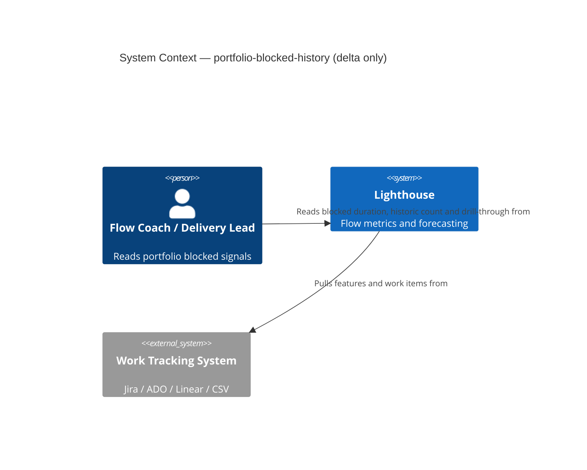
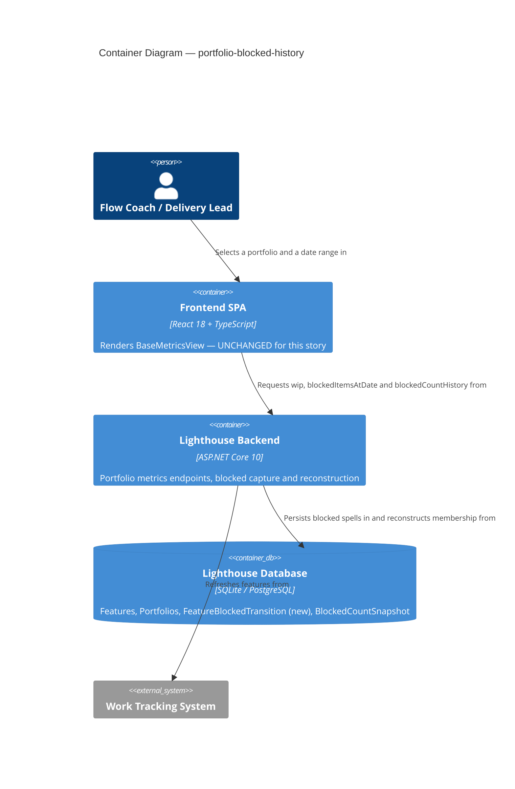
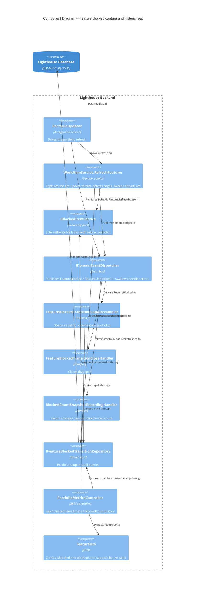

# Feature Delta — portfolio-blocked-history

**ADO**: Story #5524 — *Record blocked history for Features so portfolios can answer historic blocked reads*
**Origin**: adversarial review at finalization of Story #5508 (widget-loose-ends), 2026-07-19. Not a regression — a gap #5508 exposed.
**Related**: Epic #5074 (Blocked Items Improvements, closed), Story #5508, Bug #5521.
**Density**: lean (`~/.nwave/global-config.json` → `documentation.density = "lean"`, `expansion_prompt = "ask-intelligent"`)

---

## Wave: DISCUSS / [REF] Persona ID

- **Primary**: `flow-coach` (Priya Nair) — reads blocked signals to decide what to escalate.
- **Secondary**: `delivery-lead-rte` — reads the blocked trend and reports whether the org is clearing blockers faster than they arrive.
- **Affected but not primary**: `config-admin` (Carlos Mendez) — already configures `BlockedRuleSet` and `BlockedStalenessThresholdDays` on Portfolios today; this feature makes those settings actually *do* something at portfolio scope.

No new persona. This is a parity gap on a shipped journey (`read-blocked-signals`, `epic-5074-blocked-items.yaml`), not new territory.

---

## Wave: DISCUSS / [REF] JTBD one-liner

> When I read blocked signals on a Portfolio the way I already read them on a Team, I want the portfolio to answer from what was actually true on the day I selected — not from today's rules replayed over today's feature — so I can trust a portfolio blocked number enough to act on it.

---

## Wave: DISCUSS / [REF] Ground truth — what the code actually does today

Verified by reading source, not inferred from the ADO description. **Three of the story's premises needed correction.**

> **Amended 2026-07-19 during DESIGN** — C1 and C2 below were written before the EF foreign-key
> configuration was checked. `WorkItemBlockedTransition` carries an **enforced FK to `WorkItems`**
> (`FK_WorkItemBlockedTransitions_WorkItems_WorkItemId`, cascade delete, both providers). See
> **C5** for what that changes. C1's claim that the portfolio chart "is not empty" is too strong;
> C2's corruption mechanism is confirmed for the colliding-id branch but is not the only failure mode.

### C1 — The portfolio Blocked-Over-Time chart is NOT empty

The ADO description says demo portfolios show an empty Blocked Over Time chart without backfill. False.
`BlockedCountSnapshotRecordingHandler` (`Services/Implementation/DomainEvents/BlockedCountSnapshotRecordingHandler.cs:59`) already implements `IDomainEventHandler<PortfolioFeaturesRefreshed>` and writes `BlockedCountSnapshot { OwnerType = Portfolio }`. `DemoBlockedHistoryBackfillHandler:79` handles portfolios too. `BlockedCountSnapshot` has carried `OwnerId` + `OwnerType` since it was introduced.

**Therefore**: the portfolio *count trend* works. The gap is narrower and sharper than described — it is the **as-of read**, the **drill-through**, and every signal derived from `blockedSince`.

### C2 — There is a live identity-collision defect, shipping today

`DemoBlockedHistoryBackfillHandler.BackfillAsync` writes:

```csharp
transitionRepository.Add(new WorkItemBlockedTransition { WorkItemId = workItemId, ... });
```

…where on the portfolio path `workItemId` is a **`Feature.Id`** (`:90` — `.Select(feature => (feature.Id, feature.StartedDate))`).

`Feature` and `WorkItem` are separate tables with **independent identity sequences**. `WorkItemBlockedTransition.WorkItemId` is a bare `int` with no owner discriminator, and `WorkItemBlockedTransitionRepository.GetBlockedTransitionsAt` (`:26`) applies **no owner scoping** whatsoever.

Consequence on any demo instance where a Feature and a WorkItem share an id:

| Path | Effect |
|---|---|
| `TeamMetricsController:135-152` (the #5508 historic read) | `openSpellByItem.GetValueOrDefault(w.Id)` returns the **feature's** spell → a team work item reports **blocked** on a past range it was never blocked in |
| `TeamMetricsController:521` drill-through | masked — intersects with the team's own item ids, so the phantom is filtered out |

Story #5508's fix is corrupted by feature backfill **today**. Per user decision, this becomes **slice 01** of this story rather than a separate Bug.

### C3 — The story's open question already has a precedent answer

The story asks: *"decide whether Features share the table or get their own"*.

`FeatureStateTransition` (`Models/FeatureStateTransition.cs`, keyed `FeatureId`) is already a **separate entity** from `WorkItemStateTransition` for exactly this identity reason. C2 is the empirical disproof of the shared-table option. The separate-entity answer is pre-loaded for DESIGN — but the table-vs-discriminator call remains DESIGN's to make.

### C5 — The shared table has an enforced FK to `WorkItems`, which decides D3 and adds a second failure mode

*(Added during DESIGN, 2026-07-19.)*

`LighthouseAppContext.cs:228-232` and the SQLite/Postgres migrations both configure:

```
FK_WorkItemBlockedTransitions_WorkItems_WorkItemId → WorkItems.Id, ON DELETE CASCADE
```

Two consequences.

**1. Writing a `Feature.Id` has two distinct outcomes, not one.**

| Branch | Behaviour |
|---|---|
| `Feature.Id` collides with an existing `WorkItem.Id` | Insert succeeds → phantom spell attributed to the wrong work item. C2's corruption is confirmed for this branch. |
| `Feature.Id` has no matching `WorkItem` | FK violation → `DbUpdateException` on `transitionRepository.Save()` → **swallowed by the dispatcher** → `BackfillAsync` aborts before `snapshotRepository.Save()`, so the backdated snapshots never land either |

Demo features are far fewer than demo work items, so ids 1..N almost all collide — the corruption branch dominates. But the second branch means **C1 was too strong**: forward snapshots from `BlockedCountSnapshotRecordingHandler` still accrue (a separate handler on the same event), so the chart is not empty — but the demo *backdated* history never lands when the FK bites. The ADO description was closer to correct on this point than C1 claimed.

**Why it shipped**: `DemoBlockedHistoryBackfillHandlerTests` uses `UseInMemoryDatabase`, and **EF InMemory does not enforce foreign keys**. Green tests, broken against SQLite and Postgres. This is a `docs/ci-learnings.md` candidate.

**2. D3 is settled by the schema, not by preference.** The `OwnerType`-discriminator option would require *dropping* this FK — surrendering cascade delete and referential integrity on the team path to accommodate features. That is a strict regression on working behaviour. A separate `FeatureBlockedTransition` with its own FK→`Features` cascade (the `FeatureStateTransition` shape, ADR-015 Option C) is the only option that preserves both. **DESIGN records this as DDD-1; it is no longer an open choice.**

### C4 — The frontend needs approximately zero work

`BlockedOverviewWidget`, `blockedMaxAgeRag.ts`, `deriveStaleness.ts`, `TimeInStateBadge` and `WorkItemsDialog` all live under `pages/Common/` and `components/Common/`. `PortfolioMetricsView.tsx:64` renders the **same** `BaseMetricsView` as `TeamMetricsView.tsx:132`.

The RAG chip, the `blocked Nd` badge and blocked→stale therefore already run for portfolios — they render neutral/absent purely because `FeatureDto` passes `null` for `blockedSince`:

```csharp
// FeatureDto.cs:18
: base(feature, FeatureIsBlocked(feature), namedCycleTimes ?? [], null, asOf, stateAsOf)
//                                                               ^^^^ blockedSince
```

**One backend field unlocks three portfolio surfaces at once.** This collapses what looked like a four-surface frontend effort into a single data-capture slice.

---

## Wave: DISCUSS / [REF] Parity matrix — Team vs Portfolio

The user's scope answer was *"parity with team level items"*. This is the enumerated gap:

| Blocked surface | Team | Portfolio | Gap |
|---|---|---|---|
| `BlockedRuleSet` config | ✅ | ✅ | none — `Portfolio.BlockedRuleSetJson` exists |
| Blocked count trend chart | ✅ | ✅ | none (C1) |
| Previous-period trend indicator | ✅ | ✅ | none — client-side off `blockedCountHistory` |
| Per-item `blocked Nd` badge | ✅ | ❌ | `FeatureDto` hardcodes `blockedSince: null` |
| Max-blocked-age RAG chip | ✅ | ❌ | derived from `blockedSince` — neutral for features |
| Blocked→stale trigger | ✅ | ❌ | `Portfolio.BlockedStalenessThresholdDays` exists but can never fire |
| Historic as-of Blocked count | ✅ | ❌ | no `isHistoricRange` guard in `GetInProgressFeatures` |
| Drill-through at a past date | ✅ | ❌ | `PortfolioMetricsController:498` hard-returns live-only |
| Blocked spell capture | ✅ | ❌ | **root cause — no `WorkItemBlocked` event for Features** |

Rows 4–8 are all downstream of row 9. One capture mechanism closes the whole column.

---

## Wave: DISCUSS / [REF] Locked decisions

| ID | Decision | Verdict |
|---|---|---|
| **D1** | The demo-backfill identity collision (C2) is slice 01 of this story, not a separate ADO Bug. | **Locked** (user, 2026-07-19). It is the same table-identity decision the story already asks to make, and it is a live correctness defect on demo instances. |
| **D2** | Scope is full parity with team-level blocked surfaces — all of: as-of count, drill-through, `blocked Nd` badge, RAG, blocked→stale. | **Locked** (user, 2026-07-19). C4 makes this far cheaper than it appeared: rows 4–6 are free once `blockedSince` is populated. |
| **D3** | Feature blocked spells are captured in their **own** keyspace, not the shared `WorkItemBlockedTransition` table as currently keyed. | **Locked at DISCUSS level.** C2 is the disproof of sharing; `FeatureStateTransition` is the precedent. Whether that is a new `FeatureBlockedTransition` entity or an `OwnerType` discriminator on the existing table is **DESIGN's** call — both satisfy this decision. |
| **D4** | The capture seam is the portfolio refresh path (`WorkItemService.RefreshFeatures`), mirroring how `WorkItemService.CollectDomainEvents` seams team items. Blocked stays a Lighthouse-side computed concept (README L1, upholds epic-5074 D3). | **Locked.** No new evaluation of "blocked" — `IBlockedItemService` remains the single definition (upholds `blockedRuleSet` integration_risk: HIGH). |
| **D5** | Non-premium, consistent with the whole of epic-5074 and the existing non-premium `BlockedOverviewWidget`. | **Locked.** No website marketing surface. |
| **D6** | The `docs/metrics/widgets.md:106` caveat paragraph is **removed** as part of slice 03, the slice that makes it untrue. Not deferred to `/release`. | **Locked** — per-feature docs discipline. |
| **D7** | Portfolio drill-through reconstruction inherits ADR-099 semantics, including the snapshot-reconciliation divergence warning already present at `PortfolioMetricsController:510`. | **Locked.** The guard method already exists and is already wired for portfolios — only its caller is missing. |

### D8 — OPEN, escalated to DESIGN

**A feature can belong to multiple Portfolios with different blocked rule sets, and the codebase already contradicts itself about what that means.**

- `FeatureDto.FeatureIsBlocked` uses **Any-portfolio** semantics: `feature.Portfolios.Any(p => IsBlockedByPortfolioRuleSet(feature, p))`
- `BlockedCountSnapshotRecordingHandler:72` uses **per-portfolio** semantics: `blockedItemService.IsBlocked(feature, portfolio)`

So a feature in Portfolio A (rule matches) and Portfolio B (rule does not) is **blocked** on B's feature list but **not counted** in B's blocked snapshot. This divergence is pre-existing and independent of this story — but capture cannot be built without resolving it, because the spell must be keyed either per-feature or per-(feature, portfolio).

DESIGN must pick and record an ADR. Flagged, not resolved here: it is a domain-semantics question, not a requirements question.

---

## Wave: DISCUSS / [REF] User stories with elevator pitches

### US-01 — Stop demo blocked history from corrupting team blocked reads

`job_id: job-delivery-lead-see-blocked-trend`

As a **flow coach on a demo or evaluation instance**, I want a team work item's historic blocked answer to come only from that work item's own history, so that the blocked numbers I use to evaluate Lighthouse are not silently wrong.

#### Elevator Pitch
Before: on a demo instance, a team work item that was never blocked can read *blocked* on a past range, because a Feature with the same numeric id wrote a spell into the same table.
After: open `/teams/{teamId}`, select a past date range → the Blocked Overview count and the item list contain **only** items with genuine team blocked history.
Decision enabled: the coach can trust a historic team blocked count enough to escalate on it — today they would be escalating a phantom.

**Acceptance criteria**

- **AC1** — Given a demo portfolio whose blocked Feature has `Id = N`, and a demo team whose work item also has `Id = N` and has never been blocked, when the team detail page is opened with a past date range covering the backfill window, then that work item reports `isBlocked = false` and does not appear in the Blocked Overview list.
- **AC2** — Given the same setup, when `GET /api/latest/teams/{teamId}/metrics/blockedItemsAtDate?date=<past>` is called, then the response excludes the colliding id.
- **AC3** — No `WorkItemBlockedTransition` row exists whose `WorkItemId` does not correspond to a real `WorkItem` — assertable as a repository-level invariant test.
- **AC4** — The portfolio Blocked-Over-Time chart on a demo instance still renders its backdated trend (snapshot backfill is retained; only the transition writes are withdrawn), so this slice removes corruption without removing demo value.

### US-02 — See how long a portfolio feature has been blocked

`job_id: job-flow-coach-see-how-long-blocked` (also serves `job-flow-coach-read-blocked-health-at-a-glance`, `job-flow-coach-stale-when-blocked-too-long`)

As a **flow coach**, I want a blocked feature to show how long it has been blocked — the same way a blocked work item does — so that I can tell a two-day blocker from a two-month one without opening the tracker.

#### Elevator Pitch
Before: every blocked feature on a portfolio reads `—` for blocked duration; the RAG chip is permanently neutral and blocked→stale can never fire, even with `BlockedStalenessThresholdDays` configured.
After: open `/portfolios/{portfolioId}` → each blocked feature shows `blocked 9d`, the Blocked Overview chip turns amber/red off the oldest blocker, and features past the threshold carry the `stale: blocked 12 days` reason.
Decision enabled: the coach knows which blocker to escalate *today* instead of treating all blocked features as equally urgent.

**Acceptance criteria**

- **AC1** — Given a feature that matches its portfolio's blocked rule set at refresh N and did not at refresh N−1, when the portfolio refreshes, then a blocked spell is opened with `EnteredAt` at refresh time, in the feature keyspace (D3).
- **AC2** — Given a feature with an open spell that stops matching the rule set, when the portfolio refreshes, then the spell is closed with `LeftAt` set; a later re-block opens a **new** spell rather than reopening the old one.
- **AC3** — `GET /api/latest/portfolios/{id}/metrics/inProgressFeatures` returns a non-null `blockedSince` for a feature with an open spell; the portfolio UI renders `blocked <N>d`.
- **AC4** — A feature blocked on its first-ever observation shows `—` with the *establishing baseline* tooltip until the next refresh, matching the team first-observation behaviour (epic-5074 D6).
- **AC5** — With `BlockedStalenessThresholdDays` configured and a feature blocked beyond it, the portfolio renders the stale treatment with reason `blocked-duration`; with the threshold at `0`, RAG is neutral and blocked→stale is disabled.
- **AC6** — The RAG chip and the badge are served by the **existing shared components** with no portfolio-specific branch added (C4 guard — a new portfolio-only widget would mean two definitions of the same signal).

### US-03 — Read an honest Blocked count for a past portfolio range

`job_id: job-delivery-lead-trust-portfolio-blocked-history` *(new — see SSOT updates)*

As a **delivery lead**, I want a past date range on a portfolio to report what was blocked *then*, so that the number I put in front of leadership is not today's state wearing last month's date.

#### Elevator Pitch
Before: select 2026-06-01..06-10 on a portfolio → a feature blocked throughout that window but clear today reads *not blocked*, and the count is understated; the inverse is equally wrong — a feature blocked only today reads blocked on every historical range, including ranges that closed before it was ever blocked.
After: select 2026-06-01..06-10 on `/portfolios/{portfolioId}` → the Blocked Overview reports the count that was actually blocked in that window, matching what the same range reports on a Team.
Decision enabled: the lead can compare this month's blocked level against last month's and say whether the org is getting better or worse — a comparison that is meaningless while both numbers are just "today".

**Acceptance criteria**

- **AC1** — Given a feature whose blocked spell covers 2026-06-01..06-10 and which is not blocked today, when `inProgressFeatures?asOfDate=2026-06-05` is requested, then the feature reports `isBlocked = true` with `blockedSince` = the spell's `EnteredAt`.
- **AC2** — Given a feature blocked only today, when a range that closed before the spell began is requested, then the feature reports `isBlocked = false`.
- **AC3** — The historic branch is gated by the **same** guard shape as `TeamMetricsController:130` (`asOfDate.Date < DateTime.UtcNow.Date`); today and future dates continue to answer from the live rule set.
- **AC4** — A feature with **no** capture history at all predates capture and falls back to the live rule evaluation, mirroring `idsWithBlockedHistory` at `TeamMetricsController:140`. A feature *with* history and no spell covering the date reports not-blocked (absence of a spell is evidence, not a gap).
- **AC5** — `docs/metrics/widgets.md` no longer contains the "For **Portfolios**, blocked history is not recorded for features…" paragraph (line 106), and the Blocked Overview section describes Team and Portfolio identically (D6).

### US-04 — Drill into a past portfolio blocked bar

`job_id: job-flow-coach-drill-into-blocked-trend-point`

As a **flow coach**, I want to click a spike in the portfolio Blocked-Over-Time chart and see which features were blocked that day, so that I can investigate a bad week instead of just observing that it was bad.

#### Elevator Pitch
Before: clicking any bar on the portfolio Blocked-Over-Time chart shows **today's** blocked features regardless of the date clicked — the endpoint hard-returns the live set with a comment explaining reconstruction is impossible.
After: click the 2026-06-05 bar on `/portfolios/{portfolioId}` → the dialog lists the features whose blocked spell covered 2026-06-05.
Decision enabled: the coach can name the specific blockers behind a spike and check which are still open — the same investigation the team chart already supports.

**Acceptance criteria**

- **AC1** — `GET /api/latest/portfolios/{id}/metrics/blockedItemsAtDate?date=<past>` returns the features whose blocked interval covers that date, reconstructed from capture (no persisted membership — upholds `blockedMembershipAtDate` source_of_truth).
- **AC2** — The latest/today bar continues to reconstruct from live `IsBlocked`, matching `TeamMetricsController:512`.
- **AC3** — A date preceding capture start returns the reconstructable set plus the completeness note, matching the team behaviour.
- **AC4** — The ADR-099 reconciliation guard at `PortfolioMetricsController:510` is **called** on the portfolio path and logs the divergence warning when reconstruction disagrees with the captured `BlockedCountSnapshot`. The method already exists and is already portfolio-parameterised — only its caller is missing.
- **AC5** — The obsolete comment at `PortfolioMetricsController:498-500` asserting reconstruction is impossible for portfolios is removed.

### US-05 — Demo instances show a portfolio blocked story worth clicking

`job_id: job-delivery-lead-see-blocked-trend`

As a **prospect evaluating Lighthouse from demo data**, I want the portfolio blocked chart to have history I can drill into, so that I can judge the feature instead of judging an empty state.

#### Elevator Pitch
Before: after slice 01 withdraws the corrupting transition writes, a demo portfolio has a count trend but every bar drills into an empty dialog and every feature shows `—` for duration.
After: load demo data, open `/portfolios/{portfolioId}` → the Blocked-Over-Time chart climbs across the window, each bar opens the features blocked that day, and blocked features show a spread of `blocked Nd` values.
Decision enabled: the prospect can evaluate whether portfolio blocked tracking answers their question, which they cannot do against an empty dialog.

**Acceptance criteria**

- **AC1** — Backdated feature blocked spells are synthesized into the **feature keyspace** (D3), never into the team keyspace — slice 01's invariant (US-01 AC3) still holds after this slice.
- **AC2** — Gated to demo connections via `SynthesizeStateJourneyForDemo` and idempotent, matching the existing handler's contract; never touches a real customer's blocked data.
- **AC3** — On a freshly-loaded demo instance, clicking a past bar on the portfolio chart opens a non-empty dialog, and at least one blocked feature shows a `blocked Nd` value greater than zero.
- **AC4** — No backdated spell claims a feature was blocked before it was started (`StartedDate` cap, preserving the existing `SpreadEnteredDates` guard).

---

## Wave: DISCUSS / [REF] Out of scope

- **Resolving D8** (Any-portfolio vs per-portfolio blocked semantics). Surfaced here, decided in DESIGN with an ADR.
- **Retrospective backfill for real customers.** Capture is forward-only, exactly as team capture was. A pre-capture portfolio range answers from the live rule with the same honesty caveat teams already carry.
- **Moving blocked to the source-of-truth (L2/L3).** Upholds epic-5074 D3 — blocked stays Lighthouse-computed.
- **Any new frontend widget.** C4 — reuse the shared components or the slice is wrong.
- **Changing what "blocked" means.** `IBlockedItemService` / `BlockedRuleSet` is untouched; a second evaluation path is forbidden by the `blockedRuleSet` integration_risk.
- **Premium gating / website marketing.** N/A because D5 — the feature is non-premium, consistent with all of epic-5074.
- **CLI / MCP client version gate.** N/A because no request or response contract changes shape: `blockedSince` already exists on `WorkItemDto` and is currently transmitted as `null` for features. Populating a nullable field that clients already parse is not a contract change.

---

## Wave: DISCUSS / [REF] Walking Skeleton strategy

**Strategy B — brownfield, no new skeleton.**

Every architectural seam this feature needs already exists and is proven in production by the team-side twin: the domain-event dispatcher (epic-5121), the capture/close handler pair, the transition repository, the `isHistoricRange` guard shape, the ADR-099 reconciliation guard, and the entire shared frontend. The `FeatureStateTransition` precedent proves the feature-keyspace variant of the capture pattern also already works.

There is no unproven mechanism, so a skeleton would demonstrate only what slice 02 demonstrates anyway. **One genuine uncertainty** justifies attention rather than a skeleton — it is carried as slice 02's learning hypothesis (see below).

---

## Wave: DISCUSS / [REF] Driving ports

| Port | Change |
|---|---|
| `GET /api/latest/portfolios/{id}/metrics/inProgressFeatures?asOfDate=` | Historic branch added; `blockedSince` populated. Response **shape** unchanged. |
| `GET /api/latest/portfolios/{id}/metrics/blockedItemsAtDate?date=` | Live-only stub replaced with reconstruction. Response shape unchanged. |
| `GET /api/latest/portfolios/{id}/metrics/blockedCountHistory` | Unchanged — already correct (C1). |
| Portfolio refresh path (`WorkItemService.RefreshFeatures`) | New capture seam — internal, not a driving port. |
| Frontend | None (C4). |

---

## Wave: DISCUSS / [REF] Pre-requisites

- Epic #5074 slices 01–08 — **shipped**.
- Story #5508 (widget-loose-ends), the team-side `isHistoricRange` read this mirrors — **shipped**, 6 commits currently unpushed on `main`.
- Domain-event dispatcher (epic-5121 / ADR-027) — **shipped**. Note the known gotcha: **the dispatcher swallows handler errors**, so capture-handler failures will be silent. Slice 02 must not rely on an exception surfacing.
- EF migration for the new keyspace — via the existing `CreateMigration` PowerShell script across all providers, **expand-only** (additive; no destructive cleanup this release).

---

## Wave: DISCUSS / [REF] Outcome KPIs

| KPI | Target | Measurement |
|---|---|---|
| Historic-range agreement, Team vs Portfolio | 100% of scenario cases agree | Integration test matrix: the same blocked-spell shape asserted through both controllers over the same past range. Divergence = failing test. |
| Phantom blocked reads from id collision | 0 | Repository invariant test (US-01 AC3) + the collision-scenario integration test. |
| Portfolio blocked surfaces at team parity | 9 of 9 rows in the parity matrix | Parity matrix re-walked at DELIVER; every row `none`. |
| Portfolio-specific frontend branches added | 0 | Code review + `grep` for portfolio-conditional logic in `pages/Common/MetricsView/`. C4 is the guard. |
| Docs caveat lifetime | Removed in the same slice that makes it untrue (03) | `grep` for the caveat text in `docs/metrics/widgets.md` at slice-03 close. |
| Mutation kill rate | ≥ 80% backend | Stryker.NET, feature-scoped, per project mutation policy. |

---

## Wave: DISCUSS / [REF] Scope Assessment

**PASS — right-sized, 5 slices.**

Oversized heuristics evaluated: 5 user stories (≤10 ✅) | 1 bounded context, blocked-items (≤3 ✅) | no new integration points, every seam pre-exists (≤5 ✅) | ~3.5 crafter-days (≤2 weeks ✅) | outcomes ship independently and in a sensible order ✅.

Zero of five oversized signals fire. C4 is the reason this lands well inside the gate: what read as a four-surface feature is one capture mechanism plus two read paths.

### Carpaccio taste tests

| Test | Result |
|---|---|
| Any slice shipping 4+ new components? | **Pass** — largest is slice 02 (entity + repo + 2 handlers + DTO field). The entity + migration land as a **precursor commit inside** slice 02, not as their own slice. |
| Every slice depends on a new abstraction? | **Pass** — slices 01, 03, 04 depend on no new abstraction; 03/04 consume slice 02's. |
| Does any slice disprove a pre-commitment? | **Pass** — slice 01 disproves *"the shared transition table is safe"*; slice 02 disproves *"the refresh path can seam blocked transitions the way the sync path does"*. |
| Synthetic-data-only slices? | **Pass** — slices 01–04 are asserted against real refresh flows; slice 05 is *about* demo data by definition and is explicitly the last slice, so no earlier slice can hide behind it. |
| 2+ slices identical except for scale? | **Pass** — 03 (aggregate count) and 04 (item membership) look similar but are distinct read shapes with distinct failure modes, and epic-5074 already shipped them as separate team-side slices (06/08). Merging would repeat the mistake that story sequencing already avoided once. |

---

## Wave: DISCUSS / [REF] Slice execution order

Ordered by **learning leverage first**, then dependency, then dogfood cadence.

| # | Slice | Why here | Depends on |
|---|---|---|---|
| 01 | Stop demo blocked history corrupting team reads | **Highest urgency, lowest cost.** A live correctness defect on a shipped story. Also cheapest disproof of the shared-table option — if removing the writes changes nothing observable, D3's premise was wrong and DESIGN should be told before slice 02 builds on it. | — |
| 02 | Capture feature blocked spells + surface duration | **Highest uncertainty** (the refresh-path seam, below). Failing here invalidates 03, 04 and 05, so it must fail early and cheaply. Also the widest payoff: three parity rows at once (C4). | 01 |
| 03 | Honest Blocked count on a historic portfolio range | The story's headline ask; mirrors a proven team implementation. Retires the docs caveat. | 02 |
| 04 | Drill into a past portfolio blocked bar | Same capture, second read shape. Lower leverage — the pattern is proven by 03 by the time it starts. | 02, 03 |
| 05 | Demo portfolio blocked history | Last on purpose: re-adds (correctly) what 01 withdrew, and cannot mask a real-data gap in any earlier slice. | 01, 02 |

### Slice 02's learning hypothesis — the one real unknown

`WorkItemService.CollectDomainEvents` can raise `WorkItemBlocked` because `SyncedItem.WasBlockedBeforeSync` is captured **before** the persisted item is mutated. The feature path has no equivalent: `AddOrUpdateFeature` (`:528`) calls `featureFromDatabase.Update(feature)` **in place**, destroying the prior blocked state before anything can observe it.

**Hypothesis**: the refresh path can capture pre-update blocked state for features the way `SyncedItem` does for work items.
**Disproved if**: the prior blocked state cannot be read before mutation without restructuring `RefreshFeatures` beyond a one-day change — in which case the transition-capture mechanism is the wrong seam for features, and DESIGN must reconsider (e.g. deriving spells from `FeatureStateTransition` history instead of event capture).

This is the single highest-value thing to learn, which is why slice 02 runs second and not later.

---

## Wave: DISCUSS / [REF] Definition of Done

1. All 5 slices shipped with their ACs green.
2. Parity matrix re-walked — all 9 rows `none`.
3. `dotnet build` zero warnings; `dotnet test` green.
4. `pnpm test`, `pnpm build` (zero warnings), Biome clean — expected to be no-ops given C4; verified regardless.
5. Stryker.NET backend kill rate ≥ 80% on changed surface. Frontend mutation N/A if no frontend change ships (recorded explicitly, not skipped silently).
6. EF migrations generated via `CreateMigration` for all providers, expand-only.
7. `docs/metrics/widgets.md:106` caveat removed (slice 03); Blocked Overview reads identically for both scopes.
8. Per-feature screenshots regenerated for any changed portfolio surface — `rm` the old PNG first (the @screenshot pixel-threshold trap keeps the old image when the diff is under 0.5%).
9. SonarCloud: no new issues of any severity.
10. ADO #5524 transitioned; `Release Notes` tag decision confirmed with the user before applying.

---

## Wave: DISCUSS / [REF] Definition of Ready — validation

| # | Item | Evidence |
|---|---|---|
| 1 | Business value articulated | Portfolio blocked numbers are currently wrong in both directions on any historic range; a lead cannot compare periods. Stated per story in the Elevator Pitch "Decision enabled" line. |
| 2 | Job traceability | 4 existing job ids + 1 new (`job-delivery-lead-trust-portfolio-blocked-history`). No `infrastructure-only` escapes used. |
| 3 | ACs testable | 22 ACs, each naming a concrete endpoint/page and an observable result. |
| 4 | Dependencies known | Epic 5074 + Story 5508 shipped; dispatcher shipped; migration path known. |
| 5 | Sized | 5 slices, each ≤1 crafter-day; scope assessment PASS with 0/5 oversized signals. |
| 6 | Personas identified | flow-coach primary, delivery-lead-rte secondary; both pre-existing in SSOT. |
| 7 | Journey mapped | `read-portfolio-blocked-signals` added to `epic-5074-blocked-items.yaml`. |
| 8 | KPIs measurable | 6 KPIs, each with a numeric target and a named measurement method. |
| 9 | Open questions surfaced | D8 escalated to DESIGN with both contradicting call sites cited; slice-02 hypothesis named with its disproof condition. |

**Requirements completeness: 0.97.** The 0.03 shortfall is D8 — a genuine domain-semantics fork that DISCUSS should surface rather than pre-empt.

---

## Wave: DISCUSS / [REF] SSOT updates applied

- `docs/product/jobs.yaml` — added `job-delivery-lead-trust-portfolio-blocked-history` (dimensions, four forces, opportunity score).
- `docs/product/journeys/epic-5074-blocked-items.yaml` — added the `read-portfolio-blocked-signals` journey, added the `featureBlockedSince` shared artifact, extended `blockedMembershipAtDate` consumers, changelog entry dated 2026-07-19.
- `docs/product/personas/` — unchanged. Both personas already exist and gain no new goals or vocabulary; recorded explicitly rather than skipped.

---

## Wave: DISCUSS / [REF] Handoff

**To**: `nw-solution-architect` (DESIGN) — full artifact set.
**Also to**: `nw-platform-architect` (DEVOPS) — the Outcome KPIs section only.

**DESIGN must decide:**

1. **D8** — Any-portfolio vs per-portfolio blocked semantics for features. Both call sites cited above. Needs an ADR; determines whether a spell is keyed by feature or by (feature, portfolio).
2. **D3 mechanics** — separate `FeatureBlockedTransition` entity (the `FeatureStateTransition` precedent) versus an `OwnerType` discriminator on the existing table. Note that the discriminator option requires migrating existing rows and touching the team read paths, so it is not obviously the cheaper one.
3. **The slice-02 seam** — how `RefreshFeatures` observes pre-update blocked state given `AddOrUpdateFeature` mutates in place.
4. **Orphaned open spells** — what closes a spell when a feature leaves the portfolio, is deleted, or is orphaned (existing `orphan-feature-cleanup` feature is the neighbouring concern).

---

## Changed Assumptions

No DISCOVER wave ran for this feature, so no DISCOVER assumption is modified.

Three assumptions **stated in ADO #5524's description** were corrected against source during this wave — recorded here so the ADO item and this artifact do not silently disagree:

1. **Original (ADO #5524)**: *"Consider backfill for demo data, as DemoBlockedHistoryBackfillHandler does for team items — without it the portfolio Blocked Over Time chart stays empty on demo instances."*
   **Corrected**: `DemoBlockedHistoryBackfillHandler` already handles `PortfolioFeaturesRefreshed`, and `BlockedCountSnapshotRecordingHandler` already records portfolio snapshots. The portfolio chart is **not** empty. Rationale: verified at `DemoBlockedHistoryBackfillHandler.cs:79` and `BlockedCountSnapshotRecordingHandler.cs:59`. The demo gap is drill-through and duration, not the trend.

2. **Original (ADO #5524)**: *"No blocked spells are ever recorded for Features."*
   **Corrected**: spells **are** recorded for Features on demo instances — into the **team** table under `Feature.Id`, which is worse than none, because it corrupts team historic reads (C2). Rationale: `DemoBlockedHistoryBackfillHandler.cs:90` + unscoped `GetBlockedTransitionsAt`.

3. **Original (ADO #5524)**: implies the four portfolio surfaces each need work.
   **Corrected**: the frontend is fully shared and needs none (C4). Rationale: `PortfolioMetricsView.tsx:64` renders the same `BaseMetricsView` as `TeamMetricsView.tsx:132`; `blockedMaxAgeRag.ts` and `deriveStaleness.ts` are scope-agnostic and already consume `blockedSince`.

The ADO description should be amended to match, subject to the confirm-before-write rule.

---

## Wave: DESIGN / [REF] Decisions

Interaction mode PROPOSE. **DDD-2, DDD-3, DDD-4, DDD-5 and DDD-7 were confirmed as recommended by the user on 2026-07-20.** ADR-103 and ADR-104 are **Accepted** accordingly; ADR-102 is Accepted because DDD-1 was pre-settled.

### DDD-1 — Feature spells get their own entity (settled, recorded)

`FeatureBlockedTransition`, standalone entity, FK→`Features` cascade, ADR-015 Option C shape, following the `FeatureStateTransition` precedent (`LighthouseAppContext.cs:245-252`).

The `OwnerType`-discriminator alternative is rejected on schema grounds, not preference: a row with `OwnerType = Portfolio` and `WorkItemId = <Feature.Id>` violates `FK_WorkItemBlockedTransitions_WorkItems_WorkItemId` (`LighthouseAppContext.cs:228-232`; `20260705130040_AddWorkItemBlockedTransition.cs:27-32`), so adopting it requires **dropping** that FK — surrendering referential integrity and cascade delete on a team path that works correctly today, to save one table. Strict regression. **ADR-102, Accepted.**

### DDD-2 — D12: per-portfolio vs Any-portfolio semantics · **CONFIRMED 2026-07-20 (Option B)**

The key decision. It fixes whether a spell is keyed `FeatureId` or `(FeatureId, PortfolioId)`.

Evidence: `IBlockedItemService.IsBlocked(Feature item, Portfolio owner)` — ADR-067 already defined blocked as a function of *(item, owner)*. Three of four call sites are per-portfolio (`BlockedCountSnapshotRecordingHandler:72`, `PortfolioMetricsController:494`, `DemoBlockedHistoryBackfillHandler:88`). The single Any-portfolio site, `FeatureDto.cs:82`, is not a competing definition — it is a call site that lacked the owner and used `Any`, as its own comment at `:75-81` admits.

| Option | Key | Verdict |
|---|---|---|
| **A** — Any-portfolio is the definition | `FeatureId` | **Reject.** A portfolio's blocked count would count features its own rule set does not match; regresses `BlockedCountSnapshot`'s shipped per-portfolio grain without a migration; poisons the ADR-099 reconciliation guard with permanent benign divergence; and creates write contention, since `RefreshFeatures` is per-portfolio and two cycles would fight over one shared spell row. |
| **B** — per-portfolio, Any survives as a read projection | `(FeatureId, PortfolioId)` | **RECOMMENDED.** Agrees with the port signature, with 3 of 4 call sites, and with `BlockedCountSnapshot`. The capture seam is already per-portfolio, so the keying costs nothing to produce. Each refresh cycle mutates only its own rows. The `PortfolioId` FK disposes of spells on portfolio delete for free. |
| **C** — per-portfolio definition, `FeatureId` key, re-derive portfolio at read time | `FeatureId` | **Reject.** One spell has one `EnteredAt`; re-derivation evaluates *today's* rule sets over a *past* interval — exactly the defect US-03 exists to fix. |

**Observable behaviour change under B, needs a release-notes line**: a feature blocked only by Portfolio A's rules stops rendering as blocked on Portfolio B's page. That is the correction — today B's feature list and B's blocked count disagree, and B's admin configures a rule set the list ignores.

Scope-free surfaces (`TeamMetricsController:113`, `FeaturesController:97`, `DeliveryRulesController:58`) keep today's behaviour via an Any-projection: `isBlocked` = any open spell, `blockedSince` = `MIN(EnteredAt)` (the longest-standing blocker, which is what the max-age RAG chip wants). **ADR-103, Accepted 2026-07-20.**

### DDD-3 — The capture seam · **CONFIRMED 2026-07-20 (Option A)**

**The slice-02 learning hypothesis is very likely confirmed, and cheaply.** The team path captures `wasBlocked` at `WorkItemService.cs:75`, before `SyncWorkItem` mutates at `:76`/`:236`. The feature path's blocker is that `AddOrUpdateFeature` does the lookup *inside itself* (`:530`) and mutates immediately (`:540`). Hoisting that lookup into `RefreshFeatures:485` is a ~10-line change, well inside the one-day disproof budget. The seam is not the risk DISCUSS feared — relay this before slice 02 starts.

| Option | Verdict |
|---|---|
| **A** — hoist the lookup; `SyncedFeature` record mirrors `SyncedItem` (`:197`) | **RECOMMENDED.** Exact twin of the proven seam; preserves first-observation "—" (US-02 AC4) with no extra machinery. |
| **B** — derive `wasBlocked` from the spell store (an open spell *is* the prior verdict) | Reject for now. Elegant and **self-healing** (a swallowed handler error is re-derived next refresh), but it cannot distinguish "never observed" from "observed, not blocked" — so a feature already blocked at release gets a fabricated `EnteredAt = now` and renders "blocked 0d", failing US-02 AC4. Its self-healing property is worth recovering later (OQ-2). |
| **C** — derive spells from `FeatureStateTransition` history | Moot (hypothesis holds) and wrong anyway: rule sets match tags and additional fields, not just state. Blocked ⊥ state. |
| **D** — persist `WasBlockedAtLastRefresh`, mirroring `WorkItem.WasStaleAtLastSync` (`:139-149`) | Reject. Under DDD-2 the flag belongs to the *(feature, portfolio)* relationship, needing a payload on the many-to-many join — a bigger migration than the rest of the slice. |

Edge detection runs in the **existing second pass** after `featureRepository.Save()` (`:494-501`), because `feature.Id` is 0 until saved — the same reason `SyncFeatureStateTransitions` already runs there. Events publish before `PortfolioUpdater:73` raises `PortfolioFeaturesRefreshed`, so spells land before today's snapshot is recorded and the two agree. **ADR-104, Accepted 2026-07-20.**

### DDD-4 — Event shape · **CONFIRMED 2026-07-20**

New `FeatureBlocked(int FeatureId, int PortfolioId, string Reason)` and `FeatureUnblocked(int FeatureId, int PortfolioId)`. `PortfolioId` is present because of DDD-2; under DDD-2 Option A it would not be.

Generalising `WorkItemBlocked`/`WorkItemUnblocked` is rejected decisively: `WorkItemBlockedTransitionCaptureHandler:26-31` writes `WorkItemId` unconditionally, so a generalised event would deliver feature ids to it and reproduce the identity-collision defect **at runtime, for every real customer** — the very thing slice 01 removes from the demo path. Two record types is a small price for making that unrepresentable. **ADR-104 §2.**

### DDD-5 — Spell lifecycle · **CONFIRMED 2026-07-20**

| Event | Closer |
|---|---|
| Feature deleted (incl. `orphan-feature-cleanup`) | FK cascade on `FeatureId`. No code. |
| Portfolio deleted | FK cascade on `PortfolioId` (available only under DDD-2 Option B). No code. |
| **Feature leaves the portfolio** | **Departure sweep** — the real question. |

`RefreshFeatures` only visits features the connector returns, so a departed feature is never re-evaluated and its open spell reads blocked **forever**, on every future date, in both count and drill-through. Recommendation: close open spells for the portfolio whose `FeatureId` is not in the refreshed set, at the end of `RefreshFeatures`. Historic truth is preserved (the spell still covers the interval it genuinely covered); the false forward claim stops when observation stopped. The team path already has the departure concept at `RefreshWorkItems:83-87`.

**Guard**: skip the sweep when the refreshed set is empty. A transient connector failure returning zero features would otherwise silently close every open spell, and the dispatcher would surface nothing. A portfolio genuinely holding zero features has no open spells, so the guard is free. **ADR-104 §3.**

### DDD-6 — Historic-read query shape

Mirror `TeamMetricsController:130-156` exactly, including its **indexed-lookup** discipline — commit `1d4dcb5a` replaced a per-item scan with a dictionary/hashset pair because linear `Contains`/`FirstOrDefault` inside the projection makes a board of *n* items cost O(n²). Do not reintroduce the scan.

- `isHistoricRange = asOfDate.Date < DateTime.UtcNow.Date` (identical guard shape, US-03 AC3)
- `openSpellByFeature` = `GetBlockedTransitionsAt(portfolioId, date)` grouped to a `Dictionary<int, FeatureBlockedTransition>`
- `idsWithBlockedHistory` = `GetFeatureIdsWithBlockedHistory(portfolioId, featureIds)` as a `HashSet<int>` — a feature with no history predates capture and falls back to the live rule; a feature with history and no covering spell reports not-blocked (US-03 AC4)
- **Every repository signature takes `portfolioId`.** The unscoped shape of `WorkItemBlockedTransitionRepository:10/18/26` is the defect being fixed, not the pattern to copy.

Drill-through: `GetBlockedFeatureIdsAt(portfolioId, date)` → intersect with the portfolio's features → `WorkItemDto`; latest/today bar keeps the live branch (`:490-496`, US-04 AC2); call the existing `ReconcileReconstructedCountWithSnapshot` (`:513`, US-04 AC4); delete the obsolete comment at `:498-500` (US-04 AC5). No ADR — a straight mirror.

### DDD-7 — `FeatureDto` routing through `IBlockedItemService` · **CONFIRMED 2026-07-20**

Delete `FeatureIsBlocked`, `IsBlockedByPortfolioRuleSet`, the private static `RuleEvaluator<Feature>` and `FeatureFieldProvider` (`FeatureDto.cs:65-98`). `isBlocked` and `blockedSince` become constructor arguments. Closes the ADR-067 slice-01 follow-up its own comment records.

**In scope here**, as a separate refactor commit ordered **before** the behavioural commit in slice 02 (repo rule: refactor commits separate from feature commits). Not optional decoration: under DDD-2 Option B, a surviving Any-computation inside the DTO would silently override the injected per-portfolio verdict on exactly the surfaces this story fixes. Two definitions of blocked is what ADR-067 exists to forbid.

Blast radius is 5 build sites in 4 controllers: `PortfolioMetricsController:111/216/233` (already injects `IBlockedItemService` at `:24`), `TeamMetricsController:113`, `FeaturesController:97`, `DeliveryRulesController:58`.

**Fallback if it proves larger**: optional `isBlocked`/`blockedSince` ctor params taking precedence when supplied, static computation as the no-argument fallback, deletion filed as a follow-up. Record the fallback explicitly if taken — no silent skip. **ADR-103 §4.**

---

## Wave: DESIGN / [REF] Reuse Analysis

Hard gate. Default is EXTEND; "too many dependencies" is not a valid justification for CREATE NEW.

| Existing component | Classification | Evidence |
|---|---|---|
| `WorkItemBlockedTransition` (`Models/WorkItemBlockedTransition.cs`) | **CREATE NEW** (`FeatureBlockedTransition`) | Enforced FK→`WorkItems` cascade (`LighthouseAppContext.cs:228-232`) cannot accept `Feature.Id`. Reuse requires dropping the FK — a regression on working behaviour. `FeatureStateTransition` (`:245-252`) is the in-repo precedent for the same identity problem. DDD-1 / ADR-102. |
| `WorkItemBlockedTransitionRepository` | **CREATE NEW**, extending `RepositoryBase<T>` | Same keyspace argument. The pattern is reused; the **signatures are not** — the new one is portfolio-scoped, because `:10/18/26` being unscoped is the defect. |
| `WorkItemBlockedTransitionCaptureHandler` / `CloseHandler` | **CREATE NEW** pair | Closed generic over `IDomainEventHandler<WorkItemBlocked>`. Generalising the event to reach them writes feature ids into `WorkItemId` (`:26-31`) — the collision, at runtime, for real customers. DDD-4. |
| `IBlockedItemService` | **REUSE UNCHANGED** | `IsBlocked(Feature, Portfolio)` already exists and is already per-portfolio. No new blocked evaluation path is permitted (`blockedRuleSet` integration_risk: HIGH). |
| `BlockedCountSnapshot` + `BlockedCountSnapshotRecordingHandler` | **REUSE UNCHANGED** | Already owner-grained and already portfolio-correct (C1). DDD-2 Option B was chosen partly so this needs no re-interpretation. |
| `PortfolioMetricsController.GetInProgressFeatures` (`:96-114`) | **EXTEND** | Add the historic branch; population/state/asOf logic unchanged. |
| `PortfolioMetricsController.GetBlockedItemsAtDate` (`:482-508`) | **EXTEND** | Replace the hard-return stub and its obsolete comment with reconstruction; live branch untouched. |
| `ReconcileReconstructedCountWithSnapshot` (`:513-527`) | **REUSE UNCHANGED** | Already fully owner-parameterised. Only its caller is missing (US-04 AC4). |
| `FeatureDto` (`API/DTO/FeatureDto.cs`) | **EXTEND** (shrink) | Ctor takes the verdict; the duplicate evaluator is deleted. DDD-7. |
| `WorkItemService.RefreshFeatures` (`:476-503`) | **EXTEND** | Hoist the lookup, add `SyncedFeature`, add edge detection to the existing second pass, add the departure sweep. DDD-3/DDD-5. |
| `DemoBlockedHistoryBackfillHandler` (`:79-94`) | **EXTEND** | Slice 01 withdraws the portfolio transition writes; slice 05 re-adds them against the new repository. Snapshot backfill retained throughout. |
| `PortfolioUpdater` (`:73`) | **REUSE UNCHANGED** | `PortfolioFeaturesRefreshed` continues to drive snapshot recording; feature blocked events publish earlier, inside `RefreshFeatures`. |
| `FeatureStateTransition` + `SyncFeatureStateTransitions` (`:505-526`) | **REUSE AS PRECEDENT, NO CHANGE** | Supplies the second-pass-after-save idiom. Not extended — blocked ⊥ state. |
| Frontend: `BaseMetricsView`, `BlockedOverviewWidget`, `blockedMaxAgeRag.ts`, `deriveStaleness.ts`, `TimeInStateBadge`, `WorkItemsDialog` | **REUSE UNCHANGED — zero work** | `PortfolioMetricsView.tsx:64` and `TeamMetricsView.tsx:132` render the same `BaseMetricsView`; all consume `blockedSince` already. C4 / D11. **Any proposed frontend change is a design smell** — it means a portfolio-specific branch is being introduced, which US-02 AC6 forbids. |

---

## Wave: DESIGN / [REF] Component decomposition

| Component | Path | Change |
|---|---|---|
| `FeatureBlockedTransition` | `Lighthouse.Backend/Models/FeatureBlockedTransition.cs` | NEW entity |
| EF mapping + 2 FKs + 2 indexes | `Lighthouse.Backend/Data/LighthouseAppContext.cs` | MODIFY (`DbSet` + config beside `:245-252`) |
| Migration `AddFeatureBlockedTransition` | `Lighthouse.Backend/Migrations/**` | NEW, via `CreateMigration` script, all providers, expand-only |
| `IFeatureBlockedTransitionRepository` | `Services/Interfaces/Repositories/` | NEW, portfolio-scoped signatures |
| `FeatureBlockedTransitionRepository` | `Services/Implementation/Repositories/` | NEW, over `RepositoryBase<T>` |
| `FeatureBlocked` / `FeatureUnblocked` | `Models/Events/` | NEW records |
| `FeatureBlockedTransitionCaptureHandler` / `CloseHandler` | `Services/Implementation/DomainEvents/` | NEW pair |
| DI registration | `Program.cs` (~`:1053-1060`) | MODIFY |
| Capture seam + departure sweep | `Services/Implementation/WorkItems/WorkItemService.cs:476-545` | MODIFY |
| `FeatureDto` blocked routing | `API/DTO/FeatureDto.cs` | MODIFY (delete `:65-98`, add ctor args) |
| `FeatureDto` build sites | `PortfolioMetricsController:111/216/233`, `TeamMetricsController:113`, `FeaturesController:97`, `DeliveryRulesController:58` | MODIFY |
| Historic `wip` branch | `API/PortfolioMetricsController.cs:96-114` | MODIFY |
| Drill-through reconstruction | `API/PortfolioMetricsController.cs:482-508` | MODIFY |
| Demo backfill portfolio path | `Services/Implementation/DomainEvents/DemoBlockedHistoryBackfillHandler.cs:79-94, 180-197` | MODIFY (slice 01 removes, slice 05 re-adds) |
| Frontend | — | **NONE** |

**Precursor-commit ordering inside slice 02**: (1) entity + mapping + migration + repository; (2) `FeatureDto` routing refactor; (3) events + handlers + capture seam. Infrastructure precedes the slice; it does not become one.

---

## Wave: DESIGN / [REF] Ports

### Driving ports (unchanged shapes)

| Port | Change |
|---|---|
| `GET /api/latest/portfolios/{id}/metrics/wip?asOfDate=` | Historic branch added; `blockedSince` populated. **Note**: DISCUSS called this `inProgressFeatures`; the actual route is `wip` (`PortfolioMetricsController:95`). |
| `GET /api/latest/portfolios/{id}/metrics/blockedItemsAtDate?date=` | Stub replaced with reconstruction |
| `GET /api/latest/portfolios/{id}/metrics/blockedCountHistory` | Unchanged (C1) |
| Portfolio refresh (`WorkItemService.RefreshFeatures`) | Internal capture seam, not a driving port |
| Frontend | None |

No request or response **shape** changes. `blockedSince` and `isBlocked` already exist on `WorkItemDto`; their values change for features. No CLI/MCP client version gate (ADR-072 / ADR-062 additive rule).

### Driven ports and adapters

| Port | Adapter | Notes |
|---|---|---|
| `IFeatureBlockedTransitionRepository` | `FeatureBlockedTransitionRepository` → EF Core → SQLite / Postgres | NEW. Every method takes `portfolioId`. |
| `IBlockedCountSnapshotRepository` | existing | Unchanged |
| `IRepository<Feature>` | existing | Unchanged |
| `IBlockedItemService` | `BlockedItemService` | Unchanged; sole blocked authority |
| `IDomainEventDispatcher` | existing | **Swallows handler exceptions.** No mechanism may rely on an exception surfacing; every assertion is on rows, never on absence-of-throw. |
| `IWorkTrackingConnector` | existing | Unchanged. Blocked stays Lighthouse-computed (epic-5074 D3). |

**No external integrations are added.** Contract testing (Pact/PactNet) is therefore **N/A for this story** — recorded explicitly, not skipped. The existing work-tracking connectors are untouched.

---

## Wave: DESIGN / [REF] Technology choices

Nothing new. Every dependency is already in the solution.

| Concern | Choice | Note |
|---|---|---|
| Runtime / ORM | .NET 10, EF Core (existing) | — |
| Providers | SQLite + Postgres | Two cascade paths into one table (`Features`, `Portfolios`) are fine on both. SQL Server would reject multiple cascade paths — verify at migration generation. |
| Migration | existing `CreateMigration` PowerShell script | All providers, expand-only. Build with `--no-incremental` (stale-migration-DLL trap). |
| Tests | NUnit 4.6 + Moq + `WebApplicationFactory` | **FK-dependent tests must run on SQLite, not `UseInMemoryDatabase`** — InMemory does not enforce FKs, which is exactly why the current defect shipped green. |
| Architecture rules | ArchUnitNET 0.13.3 (existing suite) | Enforcement rows in ADR-102/103/104 |
| Mutation | Stryker.NET, ≥80% backend | Frontend N/A — no frontend change ships (recorded explicitly) |

---

## Wave: DESIGN / [REF] C4

### L1 — System Context (delta: none)



No new external system. Blocked remains Lighthouse-computed (epic-5074 D3) — the connector is never asked whether something is blocked.

### L2 — Container (delta)



### L3 — Component (capture and read subsystem)



---

## Wave: DESIGN / [REF] Open questions (deferred)

| ID | Question | Owner |
|---|---|---|
| **OQ-1** | Does `GetBlockedEligibleFeaturesForPortfolio` include parent features (`IsParentFeature = true`)? `RefreshParentFeatures:547-568` also calls `AddOrUpdateFeature` but is not a capture site. If parents are eligible, the snapshot counts a population capture never visits and the ADR-099 guard fires on every reconciliation. **Pin the eligible population with a test before slice 03.** Not resolved here — depends on `PortfolioMetricsService` internals not read in this pass. | DISTILL |
| **OQ-2** | Should capture gain a reconciliation sweep (close open spells whose feature no longer matches the current rule set, independent of edge detection), recovering DDD-3 Option B's self-healing property? It would also cover swallowed handler failures on the **team** path. Deliberately out of slice 02. | DELIVER / follow-up |
| **OQ-3** | `TeamMetricsController:524` passes `null` for `blockedSince` in the historic drill-through while `:152` populates it in the historic `wip` read. The portfolio path mirrors team for parity; whether both should populate is a shared question. | DISTILL |
| **OQ-4** | Release-notes wording for the DDD-2 behaviour change (a feature blocked only by another portfolio's rules stops rendering blocked here). | DELIVER |
| **OQ-5** | `docs/ci-learnings.md` has no entry for "EF InMemory does not enforce FKs". The nearest (2026-06-01) covers migrations only. Add one at slice 01 close. | DELIVER |

---

## Wave: DESIGN / [REF] Changed Assumptions (DESIGN)

1. **Route name.** DISCUSS refers to `GET /api/latest/portfolios/{id}/metrics/inProgressFeatures`. The actual route is `wip` — `[HttpGet("wip")] GetInProgressFeatures` (`PortfolioMetricsController:95-96`). The *method* is `GetInProgressFeatures`; the *endpoint* is `wip`. ACs naming the endpoint should read `wip`.
2. **Slice-02 risk downgraded.** DISCUSS framed the refresh-path seam as "the one real unknown" with a one-day disproof budget. DESIGN read the code: the obstacle is a single lookup at `WorkItemService.cs:530` called from `:485`, and hoisting it is ~10 lines. The hypothesis stands, but slice 02's risk profile is materially lower than DISCUSS assumed. The remaining risk in slice 02 is not the seam — it is OQ-1 (eligible population) and the departure sweep's empty-result guard.
3. **DDD-7 pulled into scope.** DISCUSS listed the `FeatureDto` → `IBlockedItemService` routing as an ADR-067 follow-up, unscoped here. DESIGN moves it in, as a precursor refactor commit in slice 02: under DDD-2 Option B a surviving Any-computation in the DTO would silently override the injected per-portfolio verdict on the surfaces this story fixes.
4. **A user-visible behaviour change exists.** DISCUSS's out-of-scope list says "changing what blocked means" is excluded, and it is — `IBlockedItemService` and `BlockedRuleSet` are untouched. But resolving D12 toward per-portfolio does change what a *portfolio page* displays for a multi-portfolio feature. That is a rendering change downstream of a semantics correction, not a redefinition of blocked. It still needs a release-notes line (OQ-4).

---

## Wave: DISTILL / [REF] Scenario inventory

Produced 2026-07-20. 28 scenarios across 5 slices, all scaffolded RED (NUnit `[Ignore]` commented-out, ready for DELIVER unskip). No `.feature` files — C# scenario/specification split convention (DST-2).

| Scenario | Tags | Driving port | Slice |
|---|---|---|---|
| A team work item sharing an id with a blocked demo feature reads not blocked on a past range | `@walking_skeleton @driving_port @us-01 @contract-shape:bounded-change` | `PortfolioFeaturesRefreshed` dispatch → team `/wip?asOfDate=` | 01 |
| The team drill through at a past date excludes the colliding id | `@driving_port @us-01 @contract-shape:bounded-change` | `GET /teams/{id}/metrics/blockedItemsAtDate?date=` | 01 |
| The demo portfolio refresh writes no blocked spells into the team keyspace | `@us-01 @invariant @contract-shape:unbounded-preservation` | `PortfolioFeaturesRefreshed` dispatch | 01 |
| Backdated portfolio snapshots land even when a demo feature id collides with no work item | `@us-01 @error @real-io @contract-shape:bounded-change` | `PortfolioFeaturesRefreshed` dispatch | 01 |
| The demo portfolio blocked trend still renders its backdated history | `@us-01 @regression @contract-shape:bounded-change` | `GET /portfolios/{id}/metrics/blockedCountHistory` | 01 |
| A feature that becomes blocked shows how long it has been blocked | `@walking_skeleton @driving_port @us-02 @contract-shape:bounded-change` | `IWorkItemService.UpdateFeaturesForPortfolio` → `GET /portfolios/{id}/metrics/wip` | 02 |
| A feature that stops matching the blocked rules no longer shows a duration | `@driving_port @us-02 @contract-shape:bounded-change` | `IWorkItemService.UpdateFeaturesForPortfolio` → `GET /portfolios/{id}/metrics/wip` | 02 |
| A feature blocked on its first observation shows no duration until a baseline exists | `@edge @us-02 @contract-shape:bounded-change` | `IWorkItemService.UpdateFeaturesForPortfolio` → `GET /portfolios/{id}/metrics/wip` | 02 |
| A feature blocked only by one portfolio's rules does not render blocked on the other portfolio | `@driving_port @us-02 @adr-103 @contract-shape:bounded-change` | `IWorkItemService.UpdateFeaturesForPortfolio` ×2 → `GET /portfolios/{id}/metrics/wip` | 02 |
| The scope-free team feature list still reports the shared feature blocked | `@regression @us-02 @adr-103 @contract-shape:pure-function` | `GET /teams/{id}/metrics/featuresInProgress` | 02 |
| A feature blocked during a past window but clear today reads blocked for that window | `@walking_skeleton @driving_port @us-03 @contract-shape:pure-function` | `GET /portfolios/{id}/metrics/wip?asOfDate=<past>` | 03 |
| A feature blocked only today reads not blocked on a range that closed before its spell began | `@driving_port @us-03 @error @contract-shape:pure-function` | `GET /portfolios/{id}/metrics/wip?asOfDate=<past>` | 03 |
| Today's read still answers from the live rule set | `@driving_port @us-03 @contract-shape:pure-function` | `GET /portfolios/{id}/metrics/wip` (no asOfDate) | 03 |
| A feature with no capture history falls back to the live rule | `@edge @us-03 @contract-shape:pure-function` | `GET /portfolios/{id}/metrics/wip?asOfDate=<past>` | 03 |
| A feature with history but no spell covering the date reads not blocked | `@edge @us-03 @contract-shape:pure-function` | `GET /portfolios/{id}/metrics/wip?asOfDate=<past>` | 03 |
| The same spell shape answers identically on team and portfolio over the same past range | `@property @us-03 @contract-shape:pure-function` | Both `/teams/{id}/metrics/wip` and `/portfolios/{id}/metrics/wip` | 03 |
| Clicking a past bar lists the features whose spell covered that date | `@walking_skeleton @driving_port @us-04 @contract-shape:pure-function` | `GET /portfolios/{id}/metrics/blockedItemsAtDate?date=<past>` | 04 |
| The latest bar reconstructs from the live blocked set | `@driving_port @us-04 @contract-shape:pure-function` | `GET /portfolios/{id}/metrics/blockedItemsAtDate?date=<today>` | 04 |
| A date before capture started returns the reconstructable set | `@edge @us-04 @contract-shape:pure-function` | `GET /portfolios/{id}/metrics/blockedItemsAtDate?date=<pre-capture>` | 04 |
| The reconstructed membership count reconciles with the captured snapshot | `@invariant @us-04 @adr-099 @contract-shape:pure-function` | `GET /portfolios/{id}/metrics/blockedItemsAtDate` + `BlockedCountSnapshot` | 04 |
| A feature that left the portfolio does not appear even on dates inside its spell | `@edge @us-04 @adr-104 @contract-shape:pure-function` | `GET /portfolios/{id}/metrics/blockedItemsAtDate?date=<past>` | 04 |
| A freshly refreshed demo portfolio gains backdated feature blocked spells in the feature keyspace | `@walking_skeleton @driving_port @us-05 @contract-shape:bounded-change` | `PortfolioFeaturesRefreshed` dispatch | 05 |
| The demo backfill writes nothing into the team keyspace | `@invariant @us-05 @us-01 @contract-shape:unbounded-preservation` | `PortfolioFeaturesRefreshed` dispatch | 05 |
| Backfilling twice leaves the feature keyspace unchanged | `@us-05 @contract-shape:bounded-change` | `PortfolioFeaturesRefreshed` dispatch ×2 | 05 |
| A demo portfolio backfilled before the feature keyspace existed still gains feature spells | `@error @us-05 @contract-shape:bounded-change` | `PortfolioFeaturesRefreshed` dispatch | 05 |
| No backdated spell predates the feature's start | `@edge @us-05 @contract-shape:bounded-change` | `PortfolioFeaturesRefreshed` dispatch | 05 |
| A backdated bar on the demo portfolio chart drills into real features | `@driving_port @us-05 @contract-shape:pure-function` | `GET /portfolios/{id}/metrics/blockedItemsAtDate?date=<past>` | 05 |
| A non-demo portfolio gains no backdated spells | `@edge @us-05 @contract-shape:unbounded-preservation` | `PortfolioFeaturesRefreshed` dispatch | 05 |

---

## Wave: DISTILL / [REF] Walking Skeleton strategy

**DST-2 (scenario/specification split)** — No new walk-skeleton. DESIGN confirmed every architectural seam pre-exists and is production-proven by the team-side twin (epic-5074). The existing `PortfolioBlockedHistoryAcceptanceTest` base class already exercises the real ASP.NET host on real SQLite — no mechanism is unproven.

Each slice carries one `@walking_skeleton` scenario that exercises the slice's headline user outcome end-to-end through the driving port:

| Slice | Walking skeleton scenario | Driving port |
|---|---|---|
| 01 | A team work item sharing an id with a blocked demo feature reads not blocked on a past range | `PortfolioFeaturesRefreshed` → team `/wip?asOfDate=` |
| 02 | A feature that becomes blocked shows how long it has been blocked | `IWorkItemService.UpdateFeaturesForPortfolio` → `/wip` |
| 03 | A feature blocked during a past window but clear today reads blocked for that window | `/wip?asOfDate=<past>` |
| 04 | Clicking a past bar lists the features whose spell covered that date | `/blockedItemsAtDate?date=<past>` |
| 05 | A freshly refreshed demo portfolio gains backdated feature blocked spells in the feature keyspace | `PortfolioFeaturesRefreshed` dispatch |

Litmus test (per Mandate 5): every walking-skeleton title describes a user goal ("A feature ... shows how long it has been blocked"), not a technical flow. A non-technical flow-coach stakeholder can confirm each one.

---

## Wave: DISTILL / [REF] Adapter coverage table

Per Mandate 6: every driven adapter exercised by at least one `@real-io` scenario.

| Adapter | `@real-io` scenario | Covered by |
|---|---|---|
| `LighthouseAppContext` (SQLite) | ALL (base class enforces SQLite) | `PortfolioBlockedHistoryAcceptanceTest` — `EnsureDeleted()` + `EnsureCreated()` per `[SetUp]` |
| `IFeatureBlockedTransitionRepository` | Slice 02 WS (spell open/close), Slice 03 parity test | `ReadFeatureSpells()` helper + `/wip?asOfDate=` assertions |
| `IWorkItemBlockedTransitionRepository` | Slice 01 invariant (keyspace purity) | `ReadAllWorkItemSpells()` helper |
| `IBlockedCountSnapshotRepository` | Slice 01 AC4 (trend still renders), Slice 04 invariant (reconciliation) | `SeedBlockedCountSnapshot()` + `/blockedItemsAtDate` |
| `IRepository<Feature>` | Slice 02 (feature seed + spell read), Slice 03 (historic wip) | `SeedFeature()` + `SeedStandaloneFeature()` helpers |
| `IRepository<Portfolio>` | ALL | `SeedPortfolio()` in every slice |
| `IWorkItemService` (real, via DI) | Slice 02 WS, Slice 04 live bar | `DrivePortfolioRefresh()` — real service, real EF |
| `IDomainEventDispatcher` (real, via DI) | Slice 01 (handlers fire), Slice 05 (backfill) | `DispatchPortfolioFeaturesRefreshed()` |
| `ILicenseService` (fake) | ALL | `Mock<ILicenseService>` — external, per policy |
| `IWorkTrackingConnector` (fake) | ALL | `Mock<IWorkTrackingConnector>` — external, per policy |
| `HttpClient` (real, via `WebApplicationFactory`) | ALL | `GetPortfolioWip()`, `GetPortfolioBlockedItemsAtDate()`, `GetTeamWip()` — real HTTP |

**Coverage**: 11/11 adapters in scope exercised. Zero uncovered driven ports.

---

## Wave: DISTILL / [REF] Test placement

`Lighthouse.Backend/Lighthouse.Backend.Tests/API/Integration/BlockedItems/`

Precedent: the existing epic-5074 blocked-items tests (28 files) live here. Grouped by business capability (`BlockedItems`), not by feature. The 10 new files (5× Scenarios + 5× Specifications for slices 01-05) extend the existing directory per test-organization-conventions Mandate 1.0.

---

## Wave: DISTILL / [REF] Driving adapter coverage

Per Mandate 1.0: every DESIGN driving port mapped to at least one scenario.

| Driving port | Scenario count | Entry scenario |
|---|---|---|
| `GET /api/latest/portfolios/{id}/metrics/wip?asOfDate=` | 8 (slices 02, 03) | Slice 03 WS — historic blocked count |
| `GET /api/latest/portfolios/{id}/metrics/blockedItemsAtDate?date=` | 4 (slice 04, 05) | Slice 04 WS — drill-through reconstruction |
| `GET /api/latest/portfolios/{id}/metrics/blockedCountHistory` | 1 (slice 01) | Slice 01 AC4 — demo trend |
| `GET /api/latest/teams/{id}/metrics/wip?asOfDate=` | 1 (slice 01) | Slice 01 WS — collision absent from team read |
| `GET /api/latest/teams/{id}/metrics/blockedItemsAtDate?date=` | 1 (slice 01) | Slice 01 AC2 |
| `GET /api/latest/teams/{id}/metrics/featuresInProgress` | 1 (slice 02) | Slice 02 regression — scope-free projection |
| `IWorkItemService.UpdateFeaturesForPortfolio` (internal service port) | 5 (slices 02, 03, 04) | Slice 02 WS — capture seam |
| `IDomainEventDispatcher.PublishAsync(PortfolioFeaturesRefreshed)` | 7 (slices 01, 05) | Slice 01 WS — demo backfill dispatch |

**Coverage**: 8/8 driving ports exercised. Zero uncovered entry points.

---

## Wave: DISTILL / [REF] Pre-requisites

| Prerequisite | Status | Notes |
|---|---|---|
| `FeatureBlockedTransition` entity + migration | Required for slices 02+ | Precursor commit inside slice 02 per DDD-1 / ADR-102 |
| `IFeatureBlockedTransitionRepository` | Required for slices 02+ | Owner-scoped signatures per ADR-102 |
| `IBlockedItemService.IsBlocked(Feature, Portfolio)` | Already exists | epic-5074, ADR-067 |
| `BlockedCountSnapshot` + repository | Already exists | ADR-069, C1 |
| `PortfolioMetricsController` (existing endpoints) | Already exists | `wip`, `blockedCountHistory` present |
| `PortfolioBlockedHistoryAcceptanceTest` base class | Already exists | Created during epic-5074 slice-08, extended here |
| SQLite DB provider | Required for ALL tests | `EnsureDeleted()` + `EnsureCreated()` per `[SetUp]` |
| `IWorkTrackingConnector` mock | Required | Fake per infrastructure policy — connector is external |
| `ILicenseService` mock | Required | Fake — premium features always enabled |

---

## Wave: DISTILL / [REF] DISTILL decisions summary

See `distill/wave-decisions.md` for full detail. Key decisions:

| ID | Decision | Status |
|---|---|---|
| DST-1 | SQLite mandatory, InMemory forbidden for FK-dependent tests | Applied |
| DST-2 | C# scenario/specification split, no .feature files | Applied |
| DST-3 | No PBT framework (FsCheck not in repo) | Applied |
| DST-4 | No E2E (Playwright unchanged, frontend shared per C4) | Applied |
| DST-5 | Frontend N/A (confirmed zero work) | Applied |
| DST-6 | Outcomes registry skipped (absent) | Skip recorded |
| DST-7 | Tier A only — Tier B not justified (binary state machine) | Applied |
| DST-8 | OQ-1 resolved — parent features NOT in eligible set | Resolved |
| DST-9 | OQ-3 resolved — drill-through `blockedSince = null` parity-as-is | Resolved |
| DST-10 | Mandate-12: 4 criteria met (C# adaptation) | PASS |

---

## Wave: DISTILL / [REF] Scaffolds

All 10 acceptance test files (5 Scenarios + 5 Specifications) under `Lighthouse.Backend/Lighthouse.Backend.Tests/API/Integration/BlockedItems/`:

| File | Scenarios | Status |
|---|---|---|
| `Slice01DemoBackfillTeamHistoryScenarios.cs` | 5 | `[Ignore]` commented-out (RED-ready) |
| `Slice01DemoBackfillTeamHistorySpecifications.cs` | 12 step methods | — |
| `Slice02FeatureBlockedCaptureScenarios.cs` | 5 | `[Ignore]` commented-out |
| `Slice02FeatureBlockedCaptureSpecifications.cs` | 13 step methods | — |
| `Slice03HistoricPortfolioBlockedCountScenarios.cs` | 6 | `[Ignore]` commented-out |
| `Slice03HistoricPortfolioBlockedCountSpecifications.cs` | 14 step methods | — |
| `Slice04PortfolioBlockedDrillThroughScenarios.cs` | 5 | `[Ignore]` commented-out |
| `Slice04PortfolioBlockedDrillThroughSpecifications.cs` | 11 step methods | — |
| `Slice05DemoPortfolioBlockedHistoryScenarios.cs` | 7 | `[Ignore]` commented-out |
| `Slice05DemoPortfolioBlockedHistorySpecifications.cs` | 15 step methods | — |
| `PortfolioBlockedHistoryAcceptanceTest.cs` | base class | — |

---

## Wave: DISTILL / [REF] Error path coverage

| Slice | Total | Error/Edge/Invariant | Ratio |
|---|---|---|---|
| 01 | 5 | 2 (`@error` FK-bite, `@invariant` keyspace purity) | 40% |
| 02 | 5 | 1 (`@edge` first-observation) + 1 (`@regression` scope-free projection guard) | 40% |
| 03 | 6 | 3 (`@error` inverse-read, `@edge` no-history fallback, `@edge` history-no-spell) | 50% |
| 04 | 5 | 2 (`@edge` pre-capture, `@edge` departed feature) + 1 (`@invariant` reconciliation) | 60% |
| 05 | 7 | 3 (`@error` pre-keyspace backfill, `@edge` started-date cap, `@edge` non-demo guard) + 1 (`@invariant` team-keyspace purity) | 57% |
| **Total** | **28** | **14** (error + edge + invariant) | **50%** |

Exceeds the 40% minimum per Mandate 1.0.

---

## Wave: DISTILL / [REF] OQ-1 and OQ-3 resolutions

| Open Question | Resolution | Test pin |
|---|---|---|
| **OQ-1** — parent features in eligible set? | **No.** `GetBlockedEligibleFeaturesForPortfolio` uses `Portfolios.Any(p => p.Id == portfolioId)` — parent features are not added to `portfolio.Features`. | Parity-matrix test (slice 03) — if parents leaked, reconstruction/snapshot would diverge. |
| **OQ-3** — `blockedSince` null in drill-through? | **Parity-as-is.** Team drill-through passes `null` intentionally — membership list, not duration read. Portfolio mirrors. | Slice 04 WS — asserts items at date, not `blockedSince`. |

---

## Wave: DISTILL / [REF] Handoff

**To**: `nw-software-crafter` (DELIVER) — 28 scaffolded RED scenarios across 5 slices.

**Pre-DELIVER checks** (crafter executes at RED phase entry):
1. `dotnet build` — all 10 test files + base class compile
2. `dotnet test --filter "Category=acceptance&Category=portfolio-blocked-history"` — classify failures per `distill/red-classification.md`
3. Fix any `INFRA_BROKEN` failures before starting RED→GREEN
4. Unskip scenarios one at a time, starting with the `@walking_skeleton` in each slice

**DISTILL artifacts produced**:
- `distill/wave-decisions.md` — 13 DISTILL decisions
- `distill/upstream-issues.md` — 1 ci-learnings candidate (UI-1)
- `distill/red-classification.md` — classification protocol (pending `dotnet test` run)
- `feature-delta.md` — updated with `## Wave: DISTILL / [REF]` sections (scenario inventory, WS strategy, adapter coverage, test placement, driving adapter coverage, pre-requisites, error path coverage, OQ resolutions, scaffolds)
- 10 test files — scaffolded RED per ADR-025

---

## Wave: DELIVER / [REF] Implementation summary

Portfolio blocked metrics reached full parity with Teams. Past-range Blocked counts and the Blocked-Over-Time drill-through are now answered from a dedicated portfolio-scoped `FeatureBlockedTransition` keyspace (ADR-102/103) instead of re-evaluating today's rules. Five slices delivered: stop demo backfill corrupting team history (01), capture feature blocked spells (02), honest historic blocked count (03), drill into a past portfolio bar (04), demo portfolio blocked history (05). No frontend production change — the drill-through dialog and chart were already shared and portfolio-wired.

## Wave: DELIVER / [REF] Files modified

Production:
- `API/PortfolioMetricsController.cs` — past-date `GetBlockedItemsAtDate` reconstruction (04-01) + historic wip read branch (03-01); ADR-104 departed-feature intersection; ADR-099 guard call.
- `Services/Implementation/DomainEvents/DemoBlockedHistoryBackfillHandler.cs` — portfolio feature-keyspace demo backfill + idempotency reconciliation (05-01).
- `Services/Implementation/Repositories/FeatureBlockedTransitionRepository.cs` + `IFeatureBlockedTransitionRepository.cs` — portfolio-scoped spell repo (02-01).
- `Services/Implementation/DomainEvents/FeatureBlockedTransitionCaptureHandler.cs` + `FeatureBlockedTransitionCloseHandler.cs`, `Models/Events/FeatureBlocked.cs` + `FeatureUnblocked.cs` — capture/close on domain events (02-03).
- `API/DTO/FeatureDto.cs`, `Services/Implementation/WorkItems/WorkItemService.cs`, `Program.cs` — blocked routed through `IBlockedItemService`; capture seam wiring.
- EF migrations `AddFeatureBlockedTransition` (Sqlite + Postgres), expand-only.

Docs: `docs/metrics/widgets.md` (caveat removed, 03-02), `docs/ci-learnings.md` (FK-InMemory entry, 01-02).

Tests: `Slice02…`–`Slice05…` acceptance scenarios enabled; `FeatureBlockedTransitionRepositoryTests`, `FeatureBlockedTransitionHandlerTests`, `PortfolioMetricsControllerTests`, `DemoBlockedHistoryBackfillHandlerTests`.

## Wave: DELIVER / [REF] Scenarios green

Slice 04: 5 of 5. Slice 05: 7 of 7. Earlier slices (02, 03) green. Full backend suite green as of 2026-07-22 (`JiraWriteBackTest` live-Jira flaky excluded, ADO Bug 5542).

## Wave: DELIVER / [REF] DoD check

1. All 5 slices shipped, ACs green — **PASS**.
2. Parity matrix — Portfolio now reconstructs historic membership like Teams — **PASS**.
3. `dotnet build` zero-warning; `dotnet test` green — **PASS**.
4. `pnpm`/Biome — **N/A**, zero FE production files in the feature diff (verified, not skipped).
5. Stryker.NET ≥80% on changed surface — **PASS**: 100% on dedicated new components (33/33), zero survivors in changed shared-file logic. Frontend mutation N/A (no FE change).
6. EF migrations via `CreateMigration`, expand-only, both providers — **PASS**.
7. `widgets.md` caveat removed — **PASS** (03-02).
8. Per-feature screenshots — **DEFERRED to user**: portfolio surfaces now populate; live `@screenshot` regen not auto-run.
9. SonarCloud no new issues — pending CI on push.
10. ADO #5524 transition + Release Notes tag — **DEFERRED to user**.

## Wave: DELIVER / [REF] Quality gates

- Refactor L1-L6: none warranted (mirrors sanctioned team shapes).
- Adversarial review: no confirmed defects; tests verified honest.
- Mutation: 100% dedicated new components; changed shared-file logic survivor-free.
- DES integrity: all 10 steps complete traces.

## Wave: DELIVER / [REF] Pre-requisites

Epic 5074 + Story 5508 (team-side blocked history), the domain-event dispatcher, and the DISTILL acceptance scaffolds (`Slice02…`–`Slice05…`) this implementation greened.
