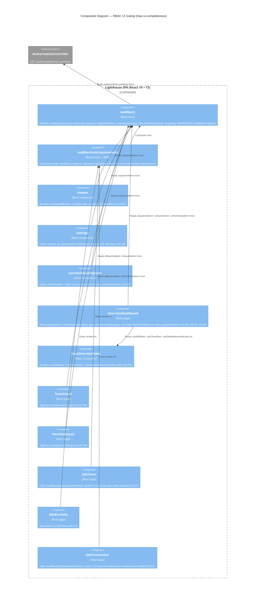

# Feature Delta: rbac-ui-completeness

<!-- markdownlint-disable MD024 -->

Wave: DISCUSS | Date: 2026-05-11 | Density: lean (per ~/.nwave/global-config.json)

---

## Wave: DISCUSS / [REF] Persona

Inherits the four RBAC personas from `rbac-enhancements` (see `docs/product/jobs.yaml`):

| Persona | Role(s) in this feature |
|---|---|
| System Admin | Sees admin-only controls; baseline (everything works) |
| Team Admin (scoped) | Sees Edit/Delete/UpdateData ONLY for their own teams; no global admin UI |
| Portfolio Admin (scoped) | Symmetric to Team Admin |
| Viewer | Sees Details + read-only data; zero write controls anywhere |

Primary persona this feature serves: **Team/Portfolio Admin** and **Viewer** — System Admin behavior is unchanged.

---

## Wave: DISCUSS / [REF] JTBD One-liner

**Job**: `job-rbac-viewer-clarity` (existing, in `docs/product/jobs.yaml`) — *When I log in with non-System-Admin access, I want the interface to show exactly what's visible to me and hide controls I cannot use, so I can navigate confidently without confusing 403 errors.*

This feature closes the residual gaps from `rbac-enhancements` where the original DISCUSS scoped the gating (Q9, Q10, Q16, etc.) but DELIVER landed only a subset.

---

## Wave: DISCUSS / [REF] Locked Decisions

| ID | Decision | Rationale |
|---|---|---|
| **D1** | Header global "Update All" button is gated on `isSystemAdmin` | Backend `[RbacGuard(SystemAdmin)]` on `POST /api/.../teams/update-all` and `/api/.../portfolios/update-all`. Frontend must match. |
| **D2** | Overview table per-row actions (Edit, Delete) gated per-row on `isTeamAdmin(row.id)` / `isPortfolioAdmin(row.id)`; Clone gated on `isSystemAdmin` | Backend allows `TeamWrite` (i.e. Team Admin) to edit/delete an owned team — match it. Clone creates a new team via `POST /teams` which is SystemAdmin-only — match it. |
| **D3** | OnboardingStepper gated on `isSystemAdmin` (revises rbac-enhancements WD-13) | Step 0 = "Connect" routes to `/connections/new` which is `[RbacGuard(SystemAdmin)]`. A Team Admin seeing this stepper has nowhere to go. Easier than splitting the stepper per-role. |
| **D4** | Settings → API Keys tab is gated on `isSystemAdmin` (added to `systemAdminTabValues`) | API keys are a system-wide admin surface; mirrors Configuration, Demo Data, Database, RBAC tabs. (If keys become per-user in the future, revisit.) |
| **D5** | License import/clear in `LicenseStatusPopover` gated on `isSystemAdmin` | Backend `POST /license/import` and `POST /license/clear` are `[RbacGuard(SystemAdmin)]`. Status display stays visible to all (read-only). |
| **D6** | Access tab and Settings tab on Team/Portfolio detail must not flash during load | Change `!team \|\| (...)` guard pattern to `team && (...)` so the tab is not pre-rendered before the team and RBAC summary load. Prevents brief Access-tab visibility in non-RBAC deployments. |
| **D7** | Direct URL navigation to `/teams/edit/:id`, `/portfolios/edit/:id`, `/connections/edit/:id`, `/teams/new`, `/portfolios/new`, `/connections/new` redirects to `/` (or shows a "no access" alert) when the user lacks the required role | Defense-in-depth: backend already 403s on save, but the wizard should not let a user fill in a form they can't submit. Cheap UX win. |
| **D8** | Frontend `canCreateTeam` / `canCreatePortfolio` semantics are tightened to require SystemAdmin (resolution of mismatch with backend `[RbacGuard(SystemAdmin)]` on `POST /teams` and `POST /portfolios`) | Two options were evaluated: (a) tighten frontend, (b) loosen backend by adding `RbacGuardRequirement.CanCreateTeam`. (a) is shipped here because Lighthouse's model is that team creation requires a Work Tracking System Connection, which is sysadmin-owned — non-sysadmins cannot complete the wizard anyway. (b) is deferred to a future feature if customer demand surfaces. **Reverted 2026-05-11 by `team-portfolio-creation-rights`** — frontend gating in `OverviewDashboard.tsx` now uses `rbac.canCreateTeam` / `rbac.canCreatePortfolio` directly (no AND-with-isSystemAdmin). The HTTP gate they were "matching" has been fixed; option (a) is rolled back. |
| **D9** | No new backend endpoints. This is frontend-only. | All backend gates already exist and enforce correctly; the gaps are purely cosmetic in the UI. |

---

## Wave: DISCUSS / [REF] User Stories

### US-01: Header Update All button hides for non-System-Admins

**Slice**: 01 — Header & global UI gating
**Job ID**: job-rbac-viewer-clarity
**Priority**: P1

#### Elevator Pitch
Before: Any authenticated user — Viewer, Team Admin, Portfolio Admin — sees the "Update All Teams and Portfolios" icon in the app header; clicking it returns 403.
After: Non-System-Admins do not see the button. System Admins see and use it exactly as today.
Decision enabled: System Admin decides to trigger a global refresh of all data; Viewers/scoped admins don't get false-positive controls.

#### Acceptance Criteria
- [ ] `<UpdateAllButton />` is rendered only when `rbac.isSystemAdmin === true`
- [ ] When RBAC is disabled (`isRbacEnabled === false`), `PERMISSIVE_SUMMARY` makes `isSystemAdmin === true` so behavior is unchanged
- [ ] Both header layouts (desktop bar and mobile drawer) honor the gate

#### Driving port
`<UpdateAllButton />` in `components/App/Header/Header.tsx` (lines 74 and 149).

---

### US-02: Overview row actions gated per-row

**Slice**: 02 — Overview row actions and onboarding
**Job ID**: job-rbac-viewer-clarity, job-rbac-scoped-admin
**Priority**: P1

#### Elevator Pitch
Before: Every row in the Overview's Teams and Portfolios tables shows Edit, Clone, and Delete icons regardless of the user's role.
After: A Viewer sees only the "Details" icon. A Team Admin sees Edit + Delete only on teams they administer; Clone only when they are System Admin. Portfolio rows are gated symmetrically.
Decision enabled: Team Admin manages their own team from the Overview without leaking that they can act on Team B too.

#### Acceptance Criteria
- [ ] `DataOverviewTable` accepts (or derives via `useRbac`) per-row `canEdit` and `canClone` flags
- [ ] Edit icon renders only when `isTeamAdmin(row.id)` (for `api === "teams"`) or `isPortfolioAdmin(row.id)` (for `api === "portfolios"`)
- [ ] Delete icon renders only under the same per-row admin check
- [ ] Clone icon renders only when `isSystemAdmin === true` (backend requires SystemAdmin to create a new team or portfolio)
- [ ] Details icon remains visible to all (read-only navigation)
- [ ] Connections rows (`api === "connections"`) — Edit/Delete shown only when `isSystemAdmin` (the entire connections section is already sysadmin-gated upstream, but defensive)

#### Driving port
`<DataOverviewTable />` in `components/Common/DataOverviewTable/DataOverviewTable.tsx`. Used in `pages/Overview/OverviewDashboard.tsx`.

---

### US-03: OnboardingStepper hides for non-System-Admins

**Slice**: 02 — Overview row actions and onboarding
**Job ID**: job-rbac-viewer-clarity
**Priority**: P2

#### Elevator Pitch
Before: A Team Admin (with `canCreateTeam=true`) sees the onboarding stepper whose first step is "Connect" — but `/connections/new` is sysadmin-only, so they hit a wall.
After: The stepper only shows for System Admins (or when RBAC is off — `PERMISSIVE_SUMMARY` keeps existing single-tenant deployments working).
Decision enabled: System Admin uses the stepper for first-time setup; non-sysadmins see a clean overview.

#### Acceptance Criteria
- [ ] OnboardingStepper render condition in `OverviewDashboard.tsx:359` changes from `(rbac.canCreateTeam \|\| rbac.canCreatePortfolio)` to `rbac.isSystemAdmin`
- [ ] Existing test at `OverviewDashboard.test.tsx:652` ("shows OnboardingStepper when canCreateTeam is true") is updated to match the new rule
- [ ] In non-RBAC deployments (`isRbacEnabled === false`), the stepper still appears for the de-facto admin (because `PERMISSIVE_SUMMARY` sets `isSystemAdmin: true`)

#### Driving port
`<OnboardingStepper />` rendering branch in `pages/Overview/OverviewDashboard.tsx`.

---

### US-04: API Keys settings tab gated on SystemAdmin

**Slice**: 01 — Header & global UI gating
**Job ID**: job-rbac-viewer-clarity
**Priority**: P2

#### Elevator Pitch
Before: API Keys tab in System Settings is visible to every authenticated user; clicking it loads (or 403s on data fetch, depending on backend gate).
After: API Keys tab is hidden from non-System-Admins, alongside Configuration / Demo Data / Database / RBAC.
Decision enabled: System Admin manages API keys without exposing the surface to non-admins.

#### Acceptance Criteria
- [ ] `systemAdminTabValues` in `pages/Settings/Settings.tsx:85` includes `"40"` (API Keys tab)
- [ ] Verify backend `ApiKeysController` enforces SystemAdmin (defensive; gate must match)
- [ ] When a Team Admin views `/settings`, only the System Info tab is rendered; the Configuration, Demo Data, Database, API Keys, and RBAC tabs are not in the DOM

#### Driving port
Tab visibility filter in `pages/Settings/Settings.tsx` (`visibleTabs` reducer).

---

### US-05: License import/clear actions in popover gated on SystemAdmin

**Slice**: 01 — Header & global UI gating
**Job ID**: job-rbac-viewer-clarity
**Priority**: P2

#### Elevator Pitch
Before: Any user can open the LicenseStatusPopover and try to import or clear a license; backend 403s.
After: Non-System-Admins see license status only (read-only). Import / Clear buttons hidden.
Decision enabled: System Admin manages licensing; other users see status (e.g., expiry date) for transparency.

#### Acceptance Criteria
- [ ] In `components/Common/LicenseStatus/LicenseStatusPopover.tsx`, the Add/Update License button and Clear License button render only when `rbac.isSystemAdmin === true`
- [ ] License status text (valid/expiring/expired, licensee, expiry date) remains visible to all
- [ ] BlockedPage (pre-bootstrap upload) is exempt — that flow exists precisely for the first-time setup case where no SystemAdmin exists yet

#### Driving port
Import / Clear buttons inside `LicenseStatusPopover`.

---

### US-06: Access tab does not flash during team/portfolio load in non-RBAC deployments

**Slice**: 04 — Polish
**Job ID**: job-rbac-viewer-clarity
**Priority**: P3

#### Elevator Pitch
Before: On `TeamDetail` / `PortfolioDetail` page load, the Access tab is briefly rendered before the entity loads, even when RBAC is disabled.
After: Access tab is never rendered when `isRbacEnabled === false`.
Decision enabled: Cleaner perception of non-RBAC mode; users not exposed to UI surfaces that immediately disappear.

#### Acceptance Criteria
- [ ] `TeamDetail.tsx:120-121` change `showAccessTab = !team \|\| (rbac.isRbacEnabled && rbac.isTeamAdmin(team.id))` to `showAccessTab = !!team && rbac.isRbacEnabled && rbac.isTeamAdmin(team.id)`
- [ ] `PortfolioDetail.tsx:102-103` same change with `isPortfolioAdmin`
- [ ] Verify Settings tab still works correctly across the load — same `!entity ||` pattern is intentional there to avoid Settings tab flicker for admins (preserve existing behavior; only Access tab needs the tighter guard)
- [ ] Vitest snapshot or RTL test confirms Access tab is not in the DOM on initial render when `isRbacEnabled === false`

#### Driving port
Tab rendering arrays in `TeamDetail.tsx` and `PortfolioDetail.tsx`.

---

### US-07: Direct URL navigation to admin pages blocked client-side

**Slice**: 03 — Route guards
**Job ID**: job-rbac-viewer-clarity
**Priority**: P3

#### Elevator Pitch
Before: A Viewer typing `/teams/new` in the address bar lands on the AddTeamWizard page; the form renders; backend 403s on save.
After: When a user without permission navigates directly to an admin-only route, the page renders an inline no-access alert with a link back to Overview; the wizard form is not rendered. (Locked per DESIGN DD-02 — no full-page redirect; preserves page chrome.)
Decision enabled: Reduces user confusion; matches the "hide controls you cannot use" principle (DD-01) and the inline alert convention already established at three existing call sites (TeamDetail, PortfolioDetail, OverviewDashboard).

#### Acceptance Criteria
- [ ] When a user lacking SystemAdmin role navigates to `/teams/new` (or arrives via the Clone flow with `?cloneFrom=`), the page renders an `<Alert severity="info" data-testid="team-edit-no-access-alert">` with a link back to `/`; the wizard form (team name input, work tracking system select) is not in the DOM
- [ ] Same behavior on `/portfolios/new` with `data-testid="portfolio-edit-no-access-alert"`
- [ ] When a user lacking SystemAdmin role navigates to `/connections/new` or `/connections/:id/edit`, the page renders `data-testid="connection-edit-no-access-alert"` with a back link; the connection form is not rendered
- [ ] `/teams/edit/:id` and `/portfolios/edit/:id` are redirect-only routes (`TeamEditRedirect` / `PortfolioEditRedirect`) and do not mount these wizards — no separate guard needed for those paths
- [ ] `/settings` already handles tab visibility (the page falls through to the first visible tab); no additional route-level guard introduced
- [ ] When `useRbacGate({...}).isLoading === true` (during the initial `PERMISSIVE_SUMMARY` → real-summary fetch), no no-access alert is rendered (avoids flicker; per DD-10)

#### Driving port
Wizard / Edit route components.

---

### US-08: Add Team / Add Portfolio buttons gated on SystemAdmin in Overview

**Slice**: 02 — Overview row actions and onboarding
**Job ID**: job-rbac-viewer-clarity
**Priority**: P2

#### Elevator Pitch
Before: A Team Admin sees the "Add Team" button (`canCreateTeam=true`); clicking it loads the wizard; submitting 403s (backend requires SystemAdmin to create teams).
After: Add Team and Add Portfolio buttons render only for System Admins. The frontend `canCreateTeam` / `canCreatePortfolio` semantics are tightened to match the backend.
Decision enabled: Per D8 — Lighthouse's model assumes team creation requires a Work Tracking System Connection (sysadmin-owned), so non-sysadmins cannot reasonably complete the wizard. If product strategy changes (Team Admin self-service for team creation), revisit by adding `RbacGuardRequirement.CanCreateTeam` to the backend and reverting this story.

#### Acceptance Criteria
- [ ] `OverviewDashboard.tsx:400` gate changes from `rbac.canCreateTeam` to `rbac.isSystemAdmin`
- [ ] `OverviewDashboard.tsx:430` gate changes from `rbac.canCreatePortfolio` to `rbac.isSystemAdmin`
- [ ] `useRbac()` may retain `canCreateTeam` / `canCreatePortfolio` on the summary (no API churn), but no UI in scope of this feature consumes them — flag as deprecation candidates in a code comment for next feature
- [ ] Add Team disabled-tooltip ("Create a connection first") still fires for SystemAdmin with no connections

#### Driving port
Add Team / Add Portfolio buttons in `OverviewDashboard.tsx`.

---

## Wave: DISCUSS / [REF] Out-of-Scope

- **Per-user API keys** — if the product evolves to per-user keys, the API Keys tab decision (D4) would need to be revisited. Currently keys are system-wide → sysadmin-only.
- **Granting Team Admins create-team rights** — explicitly deferred (D8). Backend would need a new `RbacGuardRequirement.CanCreateTeam` enum value, controller change, and re-discussion of the Work Tracking System Connection ownership model.
- **ManualForecaster "Add Feature"** — this is a UI affordance for manual forecasting inputs, not a write to backend state. No RBAC needed.
- **Per-delivery Edit/Delete inside PortfolioDeliveryView** — already correctly gated via `canEdit` prop (rbac-enhancements DD-08); no change needed.
- **Team/Portfolio quick-settings bar** — already gated (`showWriteControls`); no change needed.
- **Backend changes** — none. All necessary backend gates already exist and enforce correctly. This feature is frontend-only (D9).
- **Mutation testing follow-up for frontend** — the open INCOMPLETE item from rbac-enhancements (Stryker.JS OOM) is tracked separately; not bundled here.

---

## Wave: DISCUSS / [REF] Pre-requisites

- **rbac-enhancements feature is shipped** (2026-05-10). This feature builds on `useRbac()`, `PERMISSIVE_SUMMARY`, the `UserAuthorizationSummary` shape, and the existing tab-gating in `Settings.tsx` and `TeamDetail.tsx` / `PortfolioDetail.tsx`.
- **CI auth pipeline restored** (today's fix to `ci_verifyauth.yml`). New E2E scenarios for this feature run in the same `@rbac` suite.
- **Keycloak example seed** in `examples/keycloak/` provides the four scoped test users (teamadmin, teamreader, portfolioadmin, portfolioreader) reused from the prior feature's E2E.

---

## Wave: DISCUSS / [REF] Driving Ports

All driving ports are React component render conditions or route guards — no new HTTP endpoints introduced.

| Surface | File | Current state | Target state |
|---|---|---|---|
| Header Update All | `components/App/Header/Header.tsx` | Always rendered | Gated `isSystemAdmin` |
| Overview row actions | `components/Common/DataOverviewTable/DataOverviewTable.tsx` | Always rendered | Per-row admin gate; Clone = `isSystemAdmin` |
| OnboardingStepper | `pages/Overview/OverviewDashboard.tsx:359` | `canCreateTeam \|\| canCreatePortfolio` | `isSystemAdmin` |
| Add Team / Add Portfolio | `pages/Overview/OverviewDashboard.tsx:400,430` | `canCreate*` | `isSystemAdmin` |
| API Keys tab | `pages/Settings/Settings.tsx:85` | Visible to all | Visible to all (D4 overridden 2026-05-11 by `api-keys-for-all-users` — keys are per-user scoped at the backend; tab value `"40"` is NOT in `systemAdminTabValues`) |
| License import/clear | `components/Common/LicenseStatus/LicenseStatusPopover.tsx` | Visible to all | Buttons gated `isSystemAdmin` |
| Access tab (load flash) | `pages/Teams/Detail/TeamDetail.tsx:120`, `pages/Portfolios/Detail/PortfolioDetail.tsx:102` | `!entity \|\| (...)` | `entity && (...)` |
| Edit/Wizard routes | `pages/Teams/Edit/EditTeam.tsx`, `pages/Portfolios/Edit/EditPortfolio.tsx`, `pages/Connections/Edit/EditConnection.tsx` | No client guard | On-mount RBAC check + redirect |

---

## Wave: DISCUSS / [REF] WS Strategy

**Strategy C (Real local)** — feature is frontend-only, no costly externals, no environment switching. Existing `RoleBasedAccessControl.spec.ts` E2E scaffold + Keycloak + SQLite already provide the integration substrate. New scenarios added to the existing `@rbac` E2E test (one big `test.step()` per scoped role traversal).

**Walking skeleton** for this feature = US-01 (Update All gating) — smallest change, highest visibility, exercises the existing `useRbac()` integration end-to-end. Ship US-01 alone first, verify in CI, then proceed with the rest.

---

## Wave: DISCUSS / [REF] Definition of Done

- [ ] All 8 user stories' acceptance criteria pass
- [ ] Frontend unit tests cover each gating decision (Vitest + RTL)
- [ ] `@rbac` E2E spec extended with assertions for:
  - Viewer sees no Update All in header
  - Viewer sees no Edit/Clone/Delete on Overview rows
  - Team Admin sees Edit/Delete on their team only; not on others; no Clone anywhere
  - Non-sysadmin sees no API Keys tab and no License Import button
  - Direct URL `/teams/new` for a Viewer shows the no-access alert (or redirect)
  - Access tab does not appear in DOM on initial render when RBAC disabled
- [ ] `pnpm test` + `pnpm build` clean (zero errors, zero Biome warnings)
- [ ] `dotnet test` unchanged (backend not touched)
- [ ] SonarQube Cloud: no new issues
- [ ] Slice briefs (`slices/slice-NN-*.md`) link to commit SHAs

---

## Wave: DISCUSS / [REF] Slice Plan (summary)

Detailed briefs in `slices/`. Order chosen for highest-visibility-first:

| Slice | Stories | Why ship first |
|---|---|---|
| 01 — Header & global UI | US-01, US-04, US-05 | Highest user visibility (UpdateAll is in every page header). Smallest scope. Walking skeleton candidate. |
| 02 — Overview gating | US-02, US-03, US-08 | Second-most-visible surface (landing page); ships the per-row gating utility. |
| 03 — Route guards | US-07 | Defense-in-depth; pure additive, no behavior change for happy path. |
| 04 — Polish | US-06 | Lowest visibility; can ship last or merge with 03. |

Each slice has its own brief in `slices/slice-NN-*.md`.

---

## Wave: DESIGN / [REF] DDD List

Architect: Morgan | Date: 2026-05-11 | Mode: propose | Paradigm: OOP project, functional-leaning React (existing convention)

| ID | Decision | Rationale |
|---|---|---|
| **DD-01** | Reuse the existing no-access alert pattern (`data-testid="*-no-access-alert"`, MUI `<Alert severity="info">`) for US-07 wizard/edit gating. Do NOT introduce a new `<RbacGate>` wrapper component. | The pattern already exists at three call sites (`OverviewDashboard`, `TeamDetail`, `PortfolioDetail`) with the same `<Alert severity="info" data-testid="...-no-access-alert">` shape. Adding a wrapper would compete with this established convention without removing it. Reuse Analysis hard gate: EXTEND the pattern, do not CREATE NEW. |
| **DD-02** | Centralise the per-route boolean in a small hook `useRbacGate(requirement)` returning `{ allowed: boolean }`. Each page renders its own inline no-access alert when `!allowed`. | Hook owns the boolean computation (single place to evolve); page owns its JSX shell (`SnackbarErrorHandler`, page title, layout chrome). Avoids the route-level wrapper trap of stripping page chrome. Hook is 10-line composition over `useRbac()`; no new architectural surface. |
| **DD-03** | `DataOverviewTable` receives `canEditRow(row) => boolean`, `canCloneRow(row) => boolean`, `canDeleteRow(row) => boolean` predicate props (Q-D2 option c). Defaults: all return `true` (backwards compatible). Call site (`OverviewDashboard`) wires `useRbac()` into the predicates. | Keeps the generic table free of RBAC coupling (ADR-001 favours composition). Predicates per action, not per role, future-proof if the gating rules diverge from "isAdmin === all three actions". |
| **DD-04** | US-01 (`UpdateAllButton`) gating lives in `Header.tsx` (call site). `UpdateAllButton` itself stays unchanged. | Header already orchestrates layout-level concerns (mobile drawer vs desktop bar). The button is rendered in two places (lines 74, 149) — gate both with a single `rbac.isSystemAdmin` boolean read at the top of `Header`. |
| **DD-05** | US-04 (API Keys tab) is a one-line change: add `"40"` to `systemAdminTabValues` Set in `Settings.tsx:85`. No new hook call (the existing tab filter already reads `rbac.isSystemAdmin`). | Smallest possible change; matches the existing tab-gating pattern for Configuration/Demo Data/Database. |
| **DD-06** | US-05 (License import/clear) gating lives inside `LicenseStatusPopover.tsx`. The popover invokes `useRbac()` directly. | Popover is the single render surface for both the Add/Update and Clear buttons; gating at the call site (`LicenseStatusIcon`) would require prop-drilling and re-render orchestration. The popover already owns the action-button block (lines 575-676). |
| **DD-07** | US-06 Access-tab load-flash fix: tighten guard to `!!entity && rbac.isRbacEnabled && rbac.isTeamAdmin(entity.id)`. Settings tab guard `!entity || rbac.isTeamAdmin(...)` stays as-is (intentional behaviour). | Access tab must NOT render before entity load — flicker is the bug. Settings tab flicker for admins during load is acceptable (preserves established behaviour; not the surface this story targets). |
| **DD-08** | `useRbac()` retains `canCreateTeam` / `canCreatePortfolio` on the summary (Q-D5 option a). No UI in scope consumes them after US-08. Mark with a one-line TS doc comment in `useRbac.ts` noting they are "Team Admin on at least one team" and not "may create a team". | Zero backend churn (D9). Field rename is a future cleanup item — see Open Questions. |
| **DD-09** | Architectural rule for this feature: no component under `pages/` or `components/` may import `RbacService` directly. All RBAC reads flow through `useRbac()` (and the thin `useRbacGate()` composition over it). | Already established by ADR-001 / `rbac-enhancements` enforcement table. Reasserted because US-07 introduces 3 new gating sites where the temptation is to fetch state ad hoc. |
| **DD-10** | New `useRbacGate(requirement)` hook is the only new code unit. Requirement shape: `{ kind: "systemAdmin" } \| { kind: "teamAdmin"; teamId: number } \| { kind: "portfolioAdmin"; portfolioId: number }`. Returns `{ allowed: boolean, isLoading: boolean }`. | Discriminated union keeps the call site type-safe (Lighthouse coding convention: `type` for data, narrow at boundaries). `isLoading` exposed so pages can decide between rendering a loader vs. the no-access alert (avoids flashing the alert during the PERMISSIVE_SUMMARY fallback window). |

---

## Wave: DESIGN / [REF] Component Decomposition

| Component | File | Change Type | Responsibility |
|---|---|---|---|
| `useRbacGate` | `Lighthouse.Frontend/src/hooks/useRbacGate.ts` | **NEW** | Thin composition over `useRbac()` returning `{ allowed, isLoading }` for a `RbacGateRequirement` discriminated union. ~15 lines. Only "new" artifact in the feature. |
| `Header.tsx` | `Lighthouse.Frontend/src/components/App/Header/Header.tsx` | MODIFY | Invoke `useRbac()`; gate both `<UpdateAllButton />` instances (desktop bar + mobile drawer) on `rbac.isSystemAdmin`. (US-01) |
| `UpdateAllButton.tsx` | `Lighthouse.Frontend/src/components/App/Header/UpdateAllButton.tsx` | NO-OP | Unchanged — gating happens at the call site. |
| `Settings.tsx` | `Lighthouse.Frontend/src/pages/Settings/Settings.tsx` | MODIFY | Add `"40"` to `systemAdminTabValues` Set (line 85). One-line change. (US-04) |
| `LicenseStatusPopover.tsx` | `Lighthouse.Frontend/src/components/Common/LicenseStatus/LicenseStatusPopover.tsx` | MODIFY | Invoke `useRbac()`; gate the Add/Update License button and Clear License button on `rbac.isSystemAdmin`. License status content stays visible to all. (US-05) |
| `DataOverviewTable.tsx` | `Lighthouse.Frontend/src/components/Common/DataOverviewTable/DataOverviewTable.tsx` | MODIFY | Accept three new optional predicate props: `canEditRow`, `canCloneRow`, `canDeleteRow`. Default each to `() => true` for backwards compatibility. Wrap Edit/Clone/Delete `<Tooltip>+<IconButton>` blocks in conditional render. Details icon stays unconditional. (US-02) |
| `OverviewDashboard.tsx` | `Lighthouse.Frontend/src/pages/Overview/OverviewDashboard.tsx` | MODIFY | (a) Wire predicates to `<DataOverviewTable>` from `useRbac()` (US-02). (b) Change OnboardingStepper gate from `(canCreateTeam \|\| canCreatePortfolio)` to `isSystemAdmin` (US-03). (c) Change Add Team/Add Portfolio gates from `canCreateTeam`/`canCreatePortfolio` to `isSystemAdmin` (US-08). |
| `EditTeam.tsx` | `Lighthouse.Frontend/src/pages/Teams/Edit/EditTeam.tsx` | MODIFY | Route-level audit: this page mounts at `/teams/new` AND when cloning (`?cloneFrom=`). It is NOT used by `/teams/edit/:id` (that path redirects to `/teams/:id/settings`). Add `useRbacGate({ kind: "systemAdmin" })` at the top; render `<Alert severity="info" data-testid="team-edit-no-access-alert">` + back link when `!allowed && !isLoading`. (US-07) |
| `EditPortfolio.tsx` | `Lighthouse.Frontend/src/pages/Portfolios/Edit/EditPortfolio.tsx` | MODIFY | Same as `EditTeam` — only `/portfolios/new` and clone mount this; edit redirects to detail page. Gate on `systemAdmin`. (US-07) |
| `EditConnection.tsx` | `Lighthouse.Frontend/src/pages/Connections/Edit/EditConnection.tsx` | MODIFY | Both `/connections/new` and `/connections/:id/edit` mount this. Gate on `systemAdmin`. (US-07) |
| `TeamDetail.tsx` | `Lighthouse.Frontend/src/pages/Teams/Detail/TeamDetail.tsx` | MODIFY | Tighten `showAccessTab` (line 120-121) from `!team \|\| (rbac.isRbacEnabled && rbac.isTeamAdmin(team.id))` to `!!team && rbac.isRbacEnabled && rbac.isTeamAdmin(team.id)`. (US-06) |
| `PortfolioDetail.tsx` | `Lighthouse.Frontend/src/pages/Portfolios/Detail/PortfolioDetail.tsx` | MODIFY | Symmetric tightening of `showAccessTab` (line 102-103). (US-06) |
| `useRbac.ts` | `Lighthouse.Frontend/src/hooks/useRbac.ts` | MODIFY (doc-only) | Add a one-line TS doc comment on `canCreateTeam` / `canCreatePortfolio` clarifying current semantics ("Team Admin on at least one team"). No behaviour change. (DD-08) |

---

## Wave: DESIGN / [REF] Driving Ports

Cross-reference: see `## Wave: DISCUSS / [REF] Driving Ports` table above. No new driving ports introduced by DESIGN; the DISCUSS table is the source of truth for the 8 surfaces.

Additional design-time observation: `/teams/edit/:id` and `/portfolios/edit/:id` are redirect-only routes (mapped to `TeamEditRedirect` / `PortfolioEditRedirect` in `App.tsx:52-60`), so the route-guard story (US-07) reduces to 4 actual mount points: `/teams/new` (+ `?cloneFrom`), `/portfolios/new` (+ `?cloneFrom`), `/connections/new`, `/connections/:id/edit`.

---

## Wave: DESIGN / [REF] Driven Ports + Adapters

Frontend-only feature. All outbound side-effects use existing adapters.

| Port (interface) | Adapter (impl) | Technology | Purpose | Change |
|---|---|---|---|---|
| `IRbacService.getAuthorizationSummary()` | `RbacService` (axios HTTP) | REST `GET /api/latest/authorization/my-summary` | Feeds `useRbac()` hook with the user's authorization summary | Existing — no change |
| `ILicensingService.importLicense / clearLicense` | `LicensingService` (axios HTTP) | REST `POST /api/.../license/import`, `POST /api/.../license/clear` | License management buttons in popover | Existing — no change; calls remain guarded by `rbac.isSystemAdmin` at UI render time and `[RbacGuard(SystemAdmin)]` on the backend |
| Navigation | `react-router-dom` `useNavigate` / `<Navigate>` | react-router-dom 7.x | Back-to-overview link in no-access alerts (US-07) | Existing — no change |

No new adapters. No new HTTP endpoints.

---

## Wave: DESIGN / [REF] Technology Choices

All pinned to existing project versions (per `Lighthouse.Frontend/package.json`).

| Component | Technology | Version | License | Rationale |
|---|---|---|---|---|
| Frontend framework | React | 19.2.x | MIT | Established in codebase |
| Frontend language | TypeScript | 6.x | Apache 2.0 | Established |
| UI library | Material UI (`@mui/material`) | 9.0.x | MIT | Existing; `Alert`, `Button`, `IconButton`, `Tooltip` reused |
| Routing | `react-router-dom` | 7.14.x | MIT | Existing; no new routes |
| Unit test | Vitest + `@testing-library/react` | 4.1.x / 16.3.x | MIT | Existing |
| E2E test | Playwright | (E2E project) | Apache 2.0 | Existing `@rbac` suite |
| Lint / format | Biome | 2.4.x | MIT | Existing; `prebuild` hook runs `biome check ./src` |
| Mutation | Stryker.js | 9.6.x | Apache 2.0 | Existing per-feature mutation gate |

**No new npm dependencies.** No new runtime libraries. The new `useRbacGate.ts` is pure TypeScript using existing React hooks.

---

## Wave: DESIGN / [REF] Decisions Table

| DDD-N | Decision | One-line rationale |
|---|---|---|
| DD-01 | Reuse existing `*-no-access-alert` pattern for US-07; no `<RbacGate>` wrapper | Convention already exists at 3 call sites; do not split the canon |
| DD-02 | Add `useRbacGate(requirement)` hook (~15 LOC); inline alert at each page | Hook centralises boolean; page keeps its layout chrome |
| DD-03 | `DataOverviewTable` takes predicate props (`canEditRow`/`canCloneRow`/`canDeleteRow`) | Generic table stays RBAC-agnostic (ADR-001 composition principle) |
| DD-04 | US-01 gating lives in `Header.tsx`; `UpdateAllButton` untouched | One read of `useRbac()` covers both header layouts |
| DD-05 | US-04 = add `"40"` to `systemAdminTabValues` Set | Smallest viable change; mirrors existing tab gating |
| DD-06 | US-05 gating inside `LicenseStatusPopover.tsx` | Popover owns the action-button block; avoids prop-drilling |
| DD-07 | US-06 Access-tab guard tightened; Settings-tab guard unchanged | Access tab flicker is the bug; Settings tab flicker for admins is acceptable |
| DD-08 | Keep `canCreateTeam`/`canCreatePortfolio` on summary; add doc comment | No backend churn (D9); rename deferred |
| DD-09 | No component imports `RbacService` directly; all reads through `useRbac()` | Reasserts ADR-001 invariant |
| DD-10 | `useRbacGate` requirement is a discriminated union; exposes `isLoading` | Avoids flashing no-access alert during `PERMISSIVE_SUMMARY` window |

---

## Wave: DESIGN / [REF] Reuse Analysis

Hard gate. Every prospective new component checked against existing implementations. Default is **EXTEND**.

| Existing Component | File | Overlap with proposed work | Decision | Justification |
|---|---|---|---|---|
| No-access alert pattern (`<Alert severity="info" data-testid="*-no-access-alert">`) | `pages/Teams/Detail/TeamDetail.tsx:340-349`, `pages/Portfolios/Detail/PortfolioDetail.tsx:396-405`, `pages/Overview/OverviewDashboard.tsx:348-356` | US-07 needs the same "you don't have access — go back to /" message on wizard/edit pages | **EXTEND** | Pattern is the established canon (3 call sites, same testid suffix convention `*-no-access-alert`). New call sites copy the same JSX shape: `<Alert severity="info" data-testid="{team\|portfolio\|connection}-edit-no-access-alert">{message}<Link to="/">Back to Overview</Link></Alert>`. No new component file. |
| `useRbac()` hook | `Lighthouse.Frontend/src/hooks/useRbac.ts` | Provides `isSystemAdmin`, `isTeamAdmin(id)`, `isPortfolioAdmin(id)`, `isLoading` — exactly the inputs `useRbacGate` needs | **EXTEND (compose over)** | `useRbacGate` is a thin composition (≤15 lines) over `useRbac()`. Considered: adding `gate(requirement)` directly to `useRbac` return — rejected because it would couple the route-guard concern to the per-element gating hook used everywhere else. Two responsibilities, two hooks. |
| `<RbacGate>` wrapper component | (does not exist) | Q-D1 option (b) | **CREATE NEW — REJECTED** | A route-level wrapper would strip the page's `SnackbarErrorHandler` / `Container` / page-title shell, forcing each page to either re-wrap inside or hoist its chrome outward. Both options regress readability. Inline alert preserves each page's layout exactly. |
| `useRbacGate` hook | (does not exist) | Q-D1 option (c) | **CREATE NEW — JUSTIFIED** | Only new artifact in the feature. Discriminated-union requirement gives type-safe call sites. `isLoading` field prevents flashing the no-access alert during the initial `useRbac()` PERMISSIVE_SUMMARY → real-summary transition. Cannot be replaced by inline `if (!rbac.isSystemAdmin) return <NoAccessAlert/>` because that pattern would flash the alert on every mount of pages used by SystemAdmins (PERMISSIVE_SUMMARY initially returns `isSystemAdmin: true`, but the moment the real summary returns `false` for a Viewer hitting `/teams/new`, we need the alert; the moment it returns `true` for a SystemAdmin, we don't). The `isLoading` window is the discriminator. |
| `DataOverviewTable` props shape | `components/Common/DataOverviewTable/DataOverviewTable.tsx` | Need per-row gating predicates | **EXTEND** | Add three optional predicate props with `() => true` defaults. Zero impact on existing callers; new prop wiring only at `OverviewDashboard` and (if applicable) any other call site. |
| `systemAdminTabValues` Set | `pages/Settings/Settings.tsx:85` | US-04 needs API Keys tab gated | **EXTEND** | Single-token addition (`"40"`). The filter mechanism already handles the gating decision. |
| License popover action button block | `components/Common/LicenseStatus/LicenseStatusPopover.tsx:575-676` | US-05 buttons need conditional render | **EXTEND** | Wrap existing Add License / Clear License buttons in `{rbac.isSystemAdmin && (...)}` conditional. Renew button stays unconditional (relevant to anyone who can see the license is expiring). |
| `TeamEditRedirect` / `PortfolioEditRedirect` in `App.tsx` | `App.tsx:52-60` | Confirms that `/teams/edit/:id` and `/portfolios/edit/:id` are redirect-only | **NO CHANGE** | These routes do not actually mount `EditTeam` / `EditPortfolio`. US-07 scope is narrowed accordingly. |

Net new files: **one** (`useRbacGate.ts`). All other work is in-place modification of existing files.

---

## Wave: DESIGN / [REF] Open Questions

| ID | Question | Defer to |
|---|---|---|
| OQ-D1 | Rename `canCreateTeam` / `canCreatePortfolio` on `UserAuthorizationSummary` to e.g. `isTeamAdminAnywhere` / `isPortfolioAdminAnywhere` to match actual semantics. | Future feature (backend ADR + DTO rename + frontend type churn). Deferred from Q-D5 option (b)/(c); not done here to honour D9 (no backend changes). |
| OQ-D2 | If product strategy ever grants Team Admins create-team rights, the backend needs a new `RbacGuardRequirement.CanCreateTeam` enum value and the frontend `isSystemAdmin` gates on Add Team / Add Portfolio (US-08) should revert. | Deferred per D8; revisit if customer demand surfaces. |
| OQ-D3 | Should `useRbacGate` expose a redirect helper (`<Navigate to="/" />`) instead of returning `allowed` and letting the page render its own alert? | Defer to a follow-up if/when more than three pages adopt the pattern. Current scope: 4 mount points across 3 files — inline alert is sufficient and consistent with existing no-access-alert convention. |
| OQ-D4 | Mutation testing for the new `useRbacGate` hook and the modified per-row gating in `DataOverviewTable` — verify Stryker.js kill rate ≥80% per project policy. | DELIVER wave (existing per-feature mutation gate). |

---

## Wave: DESIGN / [REF] C4 Component Diagram

Scope: frontend RBAC gating composition for this feature. Internal to the React app (no backend boundary shown — see `docs/product/architecture/c4-diagrams.md` for system-level views).



Notes: `useRbac()` is the single source of RBAC state (ADR-001 invariant). `useRbacGate()` is a thin composition layer — pages may use either depending on whether they need per-element gating (use `useRbac`) or route-level gating (use `useRbacGate`). No component fetches `/my-summary` directly.

---

DESIGN locked; ready for DISTILL.

---

## Wave: DISTILL / [REF] Scenario List with Tags

Acceptance Designer: Quinn | Date: 2026-05-11 | Density: lean

Unit-level scenarios are Vitest + React Testing Library cases collocated with the component (or hook) they exercise. E2E scenarios are appended to the existing `RoleBasedAccessControl.spec.ts` `@rbac` test as additional `test.step(...)` blocks on existing role-switch contexts (no new spec file, per the rbac-enhancements precedent). One new small `testWithAuth` block is added at the end for direct-URL navigation (US-07).

### Unit-level scenarios (Vitest + RTL)

| # | Scenario Name | Tags | Story | Layer | State |
|---|---|---|---|---|---|
| U-01 | `useRbacGate({systemAdmin})` returns `{allowed: true}` for System Admin | `@rbac @US-07` | US-07 | unit (hook) | ENABLED |
| U-02 | `useRbacGate({systemAdmin})` returns `{allowed: false}` for non-System-Admin | `@rbac @US-07` | US-07 | unit (hook) | SKIPPED |
| U-03 | `useRbacGate({teamAdmin, teamId})` returns `{allowed: true}` when user admins that team | `@rbac @US-07` | US-07 | unit (hook) | SKIPPED |
| U-04 | `useRbacGate({teamAdmin, teamId})` returns `{allowed: false}` for unrelated team id | `@rbac @US-07` | US-07 | unit (hook) | SKIPPED |
| U-05 | `useRbacGate({portfolioAdmin, portfolioId})` honours `adminPortfolioIds` | `@rbac @US-07` | US-07 | unit (hook) | SKIPPED |
| U-06 | `useRbacGate` `isLoading` is true while summary fetch is pending; flips to false after | `@rbac @US-07` | US-07 | unit (hook) | SKIPPED |
| U-07 | `useRbacGate` defaults to `{allowed: true}` when RBAC is disabled (PERMISSIVE_SUMMARY) | `@rbac @US-07` | US-07 | unit (hook) | SKIPPED |
| U-08 | Header hides `update-all-button` testid when `isSystemAdmin === false` | `@rbac @US-01` | US-01 | unit (RTL) | SKIPPED |
| U-09 | Header renders `update-all-button` in BOTH desktop bar AND mobile drawer when `isSystemAdmin === true` | `@rbac @US-01` | US-01 | unit (RTL) | SKIPPED |
| U-10 | `DataOverviewTable` hides per-row Edit icon when `canEditRow(row)` returns false | `@rbac @US-02` | US-02 | unit (RTL) | SKIPPED |
| U-11 | `DataOverviewTable` hides per-row Delete icon when `canDeleteRow(row)` returns false | `@rbac @US-02` | US-02 | unit (RTL) | SKIPPED |
| U-12 | `DataOverviewTable` hides per-row Clone icon when `canCloneRow(row)` returns false | `@rbac @US-02` | US-02 | unit (RTL) | SKIPPED |
| U-13 | `DataOverviewTable` Details icon stays visible regardless of predicates | `@rbac @US-02` | US-02 | unit (RTL) | SKIPPED |
| U-14 | `DataOverviewTable` predicates default to `() => true` (back-compat: no caller wiring keeps old behaviour) | `@rbac @US-02` | US-02 | unit (RTL) | SKIPPED |
| U-15 | `OverviewDashboard` hides `onboarding-stepper` when `isSystemAdmin === false` (revises existing test at OverviewDashboard.test.tsx:652) | `@rbac @US-03` | US-03 | unit (RTL) | SKIPPED |
| U-16 | `OverviewDashboard` shows `onboarding-stepper` for System Admin (existing test, kept) | `@rbac @US-03` | US-03 | unit (RTL) | SKIPPED |
| U-17 | `OverviewDashboard` hides Add Team button when `isSystemAdmin === false` | `@rbac @US-08` | US-08 | unit (RTL) | SKIPPED |
| U-18 | `OverviewDashboard` hides Add Portfolio button when `isSystemAdmin === false` | `@rbac @US-08` | US-08 | unit (RTL) | SKIPPED |
| U-19 | `OverviewDashboard` Add Team disabled-tooltip ("Create a connection first") still fires for System Admin with no connections | `@rbac @US-08` | US-08 | unit (RTL) | SKIPPED |
| U-20 | `Settings` does not render `api-keys-tab` testid for non-System-Admin | `@rbac @US-04` | US-04 | unit (RTL) | SKIPPED |
| U-21 | `Settings` renders `api-keys-tab` testid for System Admin | `@rbac @US-04` | US-04 | unit (RTL) | SKIPPED |
| U-22 | `LicenseStatusPopover` hides Add/Update License button when `isSystemAdmin === false` | `@rbac @US-05` | US-05 | unit (RTL) | SKIPPED |
| U-23 | `LicenseStatusPopover` hides Clear License button when `isSystemAdmin === false` and a license is present | `@rbac @US-05` | US-05 | unit (RTL) | SKIPPED |
| U-24 | `LicenseStatusPopover` keeps licensee / expiry / status text visible for non-System-Admin | `@rbac @US-05` | US-05 | unit (RTL) | SKIPPED |
| U-25 | `LicenseStatusPopover` renders all three action buttons (Add/Update, Clear, Renew) for System Admin | `@rbac @US-05` | US-05 | unit (RTL) | SKIPPED |
| U-26 | `TeamDetail` does not render "Access" tab on initial render when `isRbacEnabled === false` (no load-flash) | `@rbac @US-06` | US-06 | unit (RTL) | SKIPPED |
| U-27 | `PortfolioDetail` does not render "Access" tab on initial render when `isRbacEnabled === false` | `@rbac @US-06` | US-06 | unit (RTL) | SKIPPED |
| U-28 | `TeamDetail` still renders Settings tab during entity load for Team Admin (regression guard — DD-07) | `@rbac @US-06` | US-06 | unit (RTL) | SKIPPED |
| U-29 | `EditTeam` renders `team-edit-no-access-alert` and a back link when `useRbacGate` returns `{allowed: false, isLoading: false}` | `@rbac @US-07` | US-07 | unit (RTL) | SKIPPED |
| U-30 | `EditTeam` does NOT render the wizard form when access is denied | `@rbac @US-07` | US-07 | unit (RTL) | SKIPPED |
| U-31 | `EditTeam` renders the wizard form (and no alert) for System Admin | `@rbac @US-07` | US-07 | unit (RTL) | SKIPPED |
| U-32 | `EditTeam` renders neither the alert nor the wizard while `isLoading === true` (avoids alert flash) | `@rbac @US-07` | US-07 | unit (RTL) | SKIPPED |
| U-33 | `EditPortfolio` renders `portfolio-edit-no-access-alert` for non-System-Admin | `@rbac @US-07` | US-07 | unit (RTL) | SKIPPED |
| U-34 | `EditConnection` renders `connection-edit-no-access-alert` for non-System-Admin (covers both `/connections/new` and `/connections/:id/edit`) | `@rbac @US-07` | US-07 | unit (RTL) | SKIPPED |

### E2E scenarios (Playwright `test.step` additions in `RoleBasedAccessControl.spec.ts`)

Threaded into the existing `@rbac` `testWithAuth` block by piggy-backing on each role-switch step that already exists. Additional `test.step` blocks listed below; one new `testWithAuth` at the end for direct-URL navigation.

| # | Scenario Name | Tags | Story | Layer | State | Attached to |
|---|---|---|---|---|---|---|
| E-01 | System Admin sees Update All button in header, API Keys tab in Settings, all License popover buttons | `@rbac @US-01 @US-04 @US-05` | US-01, US-04, US-05 | E2E (`test.step`) | SKIPPED | first step (post-bootstrap as System Admin) |
| E-02 | Team Reader sees no Update All button in header | `@rbac @US-01` | US-01 | E2E (`test.step`) | SKIPPED | existing TeamReader step |
| E-03 | Team Reader sees no API Keys tab in System Settings | `@rbac @US-04` | US-04 | E2E (`test.step`) | SKIPPED | existing TeamReader Settings step |
| E-04 | Team Reader opens License popover: status text visible, no Add/Update/Clear License buttons | `@rbac @US-05` | US-05 | E2E (`test.step`) | SKIPPED | existing TeamReader step |
| E-05 | Team Reader sees only Details icon on Team Zenith and Project Apollo rows in Overview (no Edit, Clone, Delete) | `@rbac @US-02` | US-02 | E2E (`test.step`) | SKIPPED | existing TeamReader step |
| E-06 | Team Reader sees no Add Team / Add Portfolio buttons and no onboarding stepper on Overview | `@rbac @US-03 @US-08` | US-03, US-08 | E2E (`test.step`) | SKIPPED | existing TeamReader step |
| E-07 | Team Admin sees Edit + Delete on Team Zenith row, no Clone anywhere, only Details on Project Apollo row | `@rbac @US-02` | US-02 | E2E (`test.step`) | SKIPPED | existing TeamAdmin step |
| E-08 | Team Admin sees no Add Team / Add Portfolio buttons (D8: creation requires System Admin) | `@rbac @US-08` | US-08 | E2E (`test.step`) | SKIPPED | existing TeamAdmin step |
| E-09 | Portfolio Admin sees Edit + Delete on Project Apollo row, no Clone, only Details on Team Zenith row | `@rbac @US-02` | US-02 | E2E (`test.step`) | SKIPPED | existing PortfolioAdmin step |
| E-10 | Team Reader navigating directly to `/teams/new` sees `team-edit-no-access-alert`; no wizard form rendered | `@rbac @US-07` | US-07 | E2E (new `testWithAuth`) | SKIPPED | NEW small `testWithAuth` block |
| E-11 | Team Reader navigating directly to `/portfolios/new` sees `portfolio-edit-no-access-alert` | `@rbac @US-07` | US-07 | E2E (new `testWithAuth`) | SKIPPED | same NEW block |
| E-12 | Team Reader navigating directly to `/connections/new` sees `connection-edit-no-access-alert` | `@rbac @US-07` | US-07 | E2E (new `testWithAuth`) | SKIPPED | same NEW block |

**Totals**: 34 unit + 12 E2E = **46 scenarios** (1 ENABLED walking-skeleton scaffold = U-01; 45 SKIPPED until DELIVER enables them one at a time).

**Error/restriction-path ratio**: 35 of 46 scenarios assert a "control is hidden" / "access denied" outcome (restriction paths) ≈ **76%** (threshold: 40%).

**Walking-skeleton scenario**: U-01 enabled first. Once `useRbacGate.ts` returns `{allowed: true}` for the System Admin requirement, the rest of the unit suite is unblocked. E-01 follows once the production Header gate ships.

---

## Wave: DISTILL / [REF] WS Strategy

**Strategy C (Real local)** — frontend-only feature, no costly externals, no new containers. E2E reuses the existing `RoleBasedAccessControl.spec.ts` substrate (Playwright + real Keycloak via `examples/keycloak/` + real .NET API + real SQLite). Unit layer uses the established Vitest + RTL pattern with a mocked `ApiServiceContext` (mirrors `useRbac.test.ts`). No new infrastructure. Same precedent as `rbac-enhancements`.

---

## Wave: DISTILL / [REF] Adapter Coverage Table

The feature is frontend-only; every driven adapter is already exercised by the existing `@rbac` E2E run, and the new E2E `test.step` additions piggyback on those real calls.

| Driven Port | Adapter (impl) | Technology | Covered by | Coverage Type |
|---|---|---|---|---|
| `IRbacService.getAuthorizationSummary()` | `RbacService` (axios) | REST `GET /api/latest/authorization/my-summary` | E-01..E-12 (every role switch refetches summary) | Real I/O via browser |
| `ILicensingService.importLicense / clearLicense` | `LicensingService` (axios) | REST `POST /license/import`, `POST /license/clear` | E-04 (popover open path) — buttons hidden for non-sysadmin; existing license-upload step in bootstrap covers System Admin | Real I/O via browser |
| `ILicensingService.getLicenseStatus` | `LicensingService` (axios) | REST `GET /license/status` | E-04 (license-status text rendered) | Real I/O via browser |
| `useNavigate` / `<Navigate>` (react-router-dom) | react-router-dom 7.x | client-side routing | E-10, E-11, E-12 (direct-URL nav to `/teams/new`, `/portfolios/new`, `/connections/new`) | Real navigation in browser |
| `ITeamService.getAll` / `IPortfolioService.getAll` | `TeamService` / `PortfolioService` (axios) | REST `GET /teams`, `GET /portfolios` | E-05, E-07, E-09 (Overview rows rendered) | Real I/O via browser |
| `IConnectionService.getAll` | `ConnectionService` (axios) | REST `GET /workTrackingSystemConnections` | E-12 (connection edit page mount) | Real I/O via browser |

**No new adapters.** No new HTTP endpoints (D9). Every adapter has at least one `@real-io` E2E scenario (Strategy C exercises all of them indirectly through the role-switch traversal).

---

## Wave: DISTILL / [REF] Scaffolds

Per Mandate 7, RED-ready scaffolds are required for **new** modules. The only new module in this feature is `useRbacGate.ts` (DD-02, DD-10). Every other change is an in-place modification of an existing component — for those, the failing Vitest case alone drives RED → GREEN (no scaffold file needed, the existing file is the scaffold).

### NEW module scaffold

**File**: `Lighthouse.Frontend/src/hooks/useRbacGate.ts`

**State**: RED-ready (written in this DISTILL pass)

**Contents**:

```ts
export const __SCAFFOLD__ = true;

export type RbacGateRequirement =
  | { kind: "systemAdmin" }
  | { kind: "teamAdmin"; teamId: number }
  | { kind: "portfolioAdmin"; portfolioId: number };

export interface RbacGateResult {
  allowed: boolean;
  isLoading: boolean;
}

export function useRbacGate(_requirement: RbacGateRequirement): RbacGateResult {
  throw new Error("Not yet implemented — RED scaffold");
}
```

Hook tests (U-01..U-07) reference `useRbacGate` against this scaffold and fail loudly until the DELIVER crafter implements the composition over `useRbac()`.

### MODIFY-only files (no scaffold required)

Per Mandate 7 the scaffold mechanism targets *new* modules. For files that already exist and only need a conditional render added, the failing Vitest case is sufficient signal to drive the change. The following files fall into this category and will be modified in DELIVER (no scaffold written here):

- `components/App/Header/Header.tsx` (US-01)
- `components/Common/DataOverviewTable/DataOverviewTable.tsx` (US-02)
- `pages/Overview/OverviewDashboard.tsx` (US-03, US-08)
- `pages/Settings/Settings.tsx` (US-04)
- `components/Common/LicenseStatus/LicenseStatusPopover.tsx` (US-05)
- `pages/Teams/Detail/TeamDetail.tsx`, `pages/Portfolios/Detail/PortfolioDetail.tsx` (US-06)
- `pages/Teams/Edit/EditTeam.tsx`, `pages/Portfolios/Edit/EditPortfolio.tsx`, `pages/Connections/Edit/EditConnection.tsx` (US-07)

### Test-IDs the DELIVER crafter must add

The acceptance assertions rely on `data-testid` values that do not yet exist in production code. The crafter must add them when implementing:

| Test ID | Component | Used by |
|---|---|---|
| `team-edit-no-access-alert` | `EditTeam.tsx` (new Alert) | U-29, U-30, E-10 |
| `portfolio-edit-no-access-alert` | `EditPortfolio.tsx` (new Alert) | U-33, E-11 |
| `connection-edit-no-access-alert` | `EditConnection.tsx` (new Alert) | U-34, E-12 |
| `license-add-button` | Add/Update License button in `LicenseStatusPopover.tsx` | U-22, U-25, E-04 |
| `license-clear-button` | Clear License button in `LicenseStatusPopover.tsx` | U-23, U-25, E-04 |

Existing test IDs reused (no addition needed): `update-all-button`, `onboarding-stepper`, `api-keys-tab`, `system-info-tab`, `rbac-tab`, `license-status-popover`, `delete-item-button`, the `Clone` icon's `aria-label="Clone"`.

---

## Wave: DISTILL / [REF] Test Placement

```
Lighthouse.Frontend/
  src/
    hooks/
      useRbacGate.ts                              ← NEW scaffold (this DISTILL)
      useRbacGate.test.ts                         ← NEW Vitest hook tests (U-01..U-07)
    components/
      App/Header/
        Header.test.tsx                            ← extend with U-08, U-09
      Common/
        DataOverviewTable/
          DataOverviewTable.test.tsx               ← extend with U-10..U-14
        LicenseStatus/
          LicenseStatusPopover.test.tsx            ← extend with U-22..U-25
    pages/
      Overview/
        OverviewDashboard.test.tsx                 ← extend with U-15..U-19 (revising line 652 case)
      Settings/
        Settings.test.tsx                          ← extend with U-20, U-21
      Teams/
        Detail/TeamDetail.test.tsx                 ← extend with U-26, U-28
        Edit/EditTeam.test.tsx                     ← extend with U-29..U-32
      Portfolios/
        Detail/PortfolioDetail.test.tsx            ← extend with U-27
        Edit/EditPortfolio.test.tsx                ← extend with U-33
      Connections/
        Edit/EditConnection.test.tsx               ← extend with U-34

Lighthouse.EndToEndTests/
  tests/
    specs/
      auth/
        RoleBasedAccessControl.spec.ts            ← extend existing testWithAuth with E-01..E-09;
                                                    add ONE new small testWithAuth for E-10..E-12
    models/
      auth/rbac/
        RbacSettingsPage.ts                       ← unchanged
        ScopedAccessPage.ts                       ← unchanged
```

**Conventions followed**:

- Vitest tests collocated next to component (existing project convention — no `__tests__/` directory).
- Hook tests mirror `useRbac.test.ts` structure (mock `ApiServiceContext`, `renderHook`, `waitFor`).
- E2E additions go INTO the existing `RoleBasedAccessControl.spec.ts` `@rbac` block — no new spec file, per the rbac-enhancements precedent.
- One new `testWithAuth` block at the end of the same file isolates direct-URL navigation (E-10..E-12), since these need a fresh page context (no leftover state from the role-traversal block).
- No new POM classes. Existing `RbacSettingsPage` / `ScopedAccessPage` are sufficient — new assertions read via `page.getByTestId(...)` directly for the small set of new IDs.

---

## Wave: DISTILL / [REF] Driving Adapter Coverage

**Driving port**: Playwright browser (Chromium) — the single E2E driving port. Tests invoke the Lighthouse React SPA through the browser; the SPA in turn calls the backend over HTTP. No test imports backend service types, no test calls `/api/...` directly via `request.fetch` or similar.

**Hexagonal boundary statement**: All E2E assertions enter through the browser UI surface only. Observable outcomes are asserted on DOM state — button presence/absence, tab visibility, alert text, table icons. No test reaches into the React component internals or the backend service layer. This mirrors the `rbac-enhancements` DISTILL boundary.

**Unit-level boundary**: Component tests render via `@testing-library/react` and assert through `screen.queryByTestId` / `screen.queryByRole`. Hook tests use `renderHook` from `@testing-library/react` with a mocked `ApiServiceContext` (mocking the `IRbacService` *port*, never the underlying axios client — per CLAUDE.md "Mock only abstractions you own").

**Mandate compliance evidence**:

- **CM-A (driving-port-only entry)**: E-01..E-12 invoke the SPA exclusively through `Page` / locator interactions; unit tests invoke components through their public props or hooks through `renderHook`. Grep evidence to produce in DELIVER: zero matches for `page.request.` and zero matches for `fetch(` inside `tests/specs/auth/RoleBasedAccessControl.spec.ts`.
- **CM-B (business language)**: scenario names describe user-observable outcomes ("Team Reader sees no Update All button", "Edit and Delete visible on Team Zenith row"), not implementation surfaces ("`useRbac()` returns isSystemAdmin=false"). Hook tests are the one allowed technical-language layer (they exist precisely to verify a code unit), per the test-design-mandates exception for hook contracts.
- **CM-C (walking skeleton + focused scenarios)**: 1 walking-skeleton equivalent (U-01 enabled) + 45 focused scenarios. The walking skeleton here is the smallest enable-able unit; in DELIVER, E-01 (System Admin sees all controls) is the user-observable WS that proves the gating plumbing.
- **CM-D (hide-not-disable)**: every assertion uses `not.toBeInTheDocument()` / `not.toBeVisible()` / `queryByTestId(...) === null`. Zero `toBeDisabled()` assertions across the suite (ADR-001 invariant).

---

## Wave: DISTILL / [REF] Pre-requisites

**Pipeline dependencies**:

| Requirement | Description | Blocks |
|---|---|---|
| `rbac-enhancements` feature shipped | `useRbac()`, `PERMISSIVE_SUMMARY`, `UserAuthorizationSummary`, scoped-access POMs, existing `@rbac` E2E block all already in main | All unit + all E2E scenarios |
| CI auth pipeline restored | Fix to `ci_verifyauth.yml` shipped today (commit `ee346cbe`) running `@rbac` and `@auth` Playwright suites separately with DB reset between | E-01..E-12 (all E2E) |
| Keycloak example seed | `examples/keycloak/` provides the four scoped users (`teamadmin@user.com`, `teamreader@user.com`, `portfolioadmin@user.com`, `portfolioreader@user.com`) and the `system-admins` / scoped role groups, reused from rbac-enhancements | E-01..E-12 |
| Seeded test entities | "Team Zenith" team and "Project Apollo" portfolio already exist in the seeded DB (used by the existing `@rbac` test) | E-05, E-07, E-09 |
| DB reset between `@rbac` runs | `@rbac` suite starts from a clean DB so the bootstrap step works (Scenario 1 of rbac-enhancements precondition; identical for this feature) | E-01..E-12 |
| New test IDs added | `team-edit-no-access-alert`, `portfolio-edit-no-access-alert`, `connection-edit-no-access-alert`, `license-add-button`, `license-clear-button` added by DELIVER crafter to the corresponding components | U-22..U-25, U-29..U-34, E-04, E-10..E-12 |
| `useRbacGate.ts` scaffold | Written in this DISTILL pass; DELIVER replaces the `throw` with the real composition | All `useRbacGate` consumers (U-01..U-07, U-29..U-34, E-10..E-12) |

**No backend changes** (D9). **No new npm dependencies** (DESIGN Technology Choices section). **No new test infrastructure**.

---

DISTILL locked; ready for consolidated review and DELIVER.

---

## Wave: DELIVER / [REF] Implementation Summary

Shipped as 7 commits across 4 slices on 2026-05-11. All 8 user stories (US-01..US-08) implemented with TDD discipline (RED_UNIT → GREEN → COMMIT per step; RED_ACCEPTANCE collapsed into the existing `@rbac` E2E layer per Lighthouse convention). One new file (`useRbacGate.ts`, ~30 LOC); twelve in-place modifications; +1685/−644 lines total. Zero backend changes, zero new npm dependencies. The Vitest suite grew from 2682 to 2709 tests (all green). The Playwright `@rbac` E2E suite was extended with viewer / scoped-admin / sysadmin gating assertions and a new `testWithAuth` block for direct-URL navigation guards.

---

## Wave: DELIVER / [REF] Files Modified

**Production code** (15 files):
- `Lighthouse.Frontend/src/hooks/useRbacGate.ts` — NEW. Composition hook over `useRbac()` returning `{ allowed, isLoading }` for a discriminated-union `RbacGateRequirement`. (Step 01-01)
- `Lighthouse.Frontend/src/hooks/useRbac.ts` — JSDoc on `canCreateTeam` / `canCreatePortfolio` clarifying current semantics (DD-08). No behavioural change. (Step 04-01)
- `Lighthouse.Frontend/src/components/App/Header/Header.tsx` — `<UpdateAllButton/>` gated on `rbac.isSystemAdmin` in both desktop and mobile drawer renders. (Step 01-02)
- `Lighthouse.Frontend/src/pages/Settings/Settings.tsx` — `"40"` added to `systemAdminTabValues` Set. (Step 01-02)
- `Lighthouse.Frontend/src/components/Common/LicenseStatus/LicenseStatusPopover.tsx` — Add/Update License and Clear License buttons gated on `rbac.isSystemAdmin`; new testids `license-add-button` and `license-clear-button`. (Step 01-02)
- `Lighthouse.Frontend/src/components/Common/DataOverviewTable/DataOverviewTable.tsx` — three new optional predicate props (`canEditRow`, `canCloneRow`, `canDeleteRow`) with `() => true` defaults gating per-row Edit/Clone/Delete icons. (Step 02-01)
- `Lighthouse.Frontend/src/pages/Overview/OverviewDashboard.tsx` — wires `useRbac` predicates into both `<DataOverviewTable/>` instances; `<OnboardingStepper/>` and `Add Team` / `Add Portfolio` buttons gated on `isSystemAdmin`. (Step 02-02)
- `Lighthouse.Frontend/src/pages/Teams/Edit/EditTeam.tsx` — `useRbacGate({ kind: 'systemAdmin' })` route guard; inline `team-edit-no-access-alert` with back link. (Step 03-01)
- `Lighthouse.Frontend/src/pages/Portfolios/Edit/EditPortfolio.tsx` — symmetric `portfolio-edit-no-access-alert`. (Step 03-01)
- `Lighthouse.Frontend/src/pages/Connections/Edit/EditConnection.tsx` — symmetric `connection-edit-no-access-alert` (covers both `/new` and `/:id/edit`). (Step 03-01)
- `Lighthouse.Frontend/src/pages/Teams/Detail/TeamDetail.tsx` — `showAccessTab` tightened to `!!team && rbac.isRbacEnabled && rbac.isTeamAdmin(team.id)`. (Step 04-01)
- `Lighthouse.Frontend/src/pages/Portfolios/Detail/PortfolioDetail.tsx` — symmetric tightening with `isPortfolioAdmin`. (Step 04-01)

**Tests** (13 files):
- `Lighthouse.Frontend/src/hooks/useRbacGate.test.ts` — NEW. 7 cases covering every branch of the discriminated union plus `isLoading` behaviour. (Step 01-01)
- 10 component test files extended with RBAC-gating assertions. (Steps 01-02..04-01)
- `Lighthouse.EndToEndTests/tests/specs/auth/RoleBasedAccessControl.spec.ts` — extended existing role-traversal `testWithAuth` with viewer / scoped-admin gating assertions; new `testWithAuth` block for direct-URL nav guards. (Step 05-01)

**Other** (2 files):
- `.github/workflows/ci_verifyauth.yml` — `Authorization__EmergencySystemAdminSubjects` rebound via indexed env-var syntax (commits `5cf1cd49`/`ce068dc3` — out-of-band CI binding fix, not part of this feature's 7 commits).
- `Lighthouse.EndToEndTests/package.json` — `test:rbac` script reaffirmed (no functional change in this feature).

---

## Wave: DELIVER / [REF] Scenarios Green Count

**Vitest unit / component**: 2709 of 2709 (timestamp 2026-05-11T10:58:07Z). Includes all 34 unit acceptance scenarios documented in the DISTILL Scenario List.

**Playwright `@rbac` E2E**: 13 scenarios authored (12 interleaved into the existing role-traversal test + 1 new `testWithAuth` for direct-URL guards). Verification deferred to the CI `ci_verifyauth.yml` run — local Playwright execution was not feasible (Keycloak Docker stack unhealthy on the dev host; pre-existing `lighthouse-app` container was running an older build that did not include these gates).

`pnpm exec tsc --noEmit` clean; `pnpm exec biome check` clean; `pnpm exec playwright test --list --grep @rbac` lists both blocks.

---

## Wave: DELIVER / [REF] DoD Check

| DoD item | Status | Evidence |
|---|---|---|
| All 8 user stories' acceptance criteria pass | PASS | 34 Vitest scenarios green; 13 E2E scenarios authored (CI verification pending) |
| Frontend unit tests cover each gating decision | PASS | 13 test files extended; 2709/2709 Vitest pass |
| `@rbac` E2E spec extended | PASS | `RoleBasedAccessControl.spec.ts` updated with US-01..US-08 assertions and direct-URL nav block |
| `pnpm test` clean | PASS | 2709/2709 (the SignalR unhandled-rejection warning is pre-existing, unrelated) |
| `pnpm build` clean | PASS | tsc + vite + Biome prebuild — zero errors, zero new warnings |
| `dotnet test` unchanged | PASS | Backend not touched (D9) |
| SonarQube Cloud no new issues | PENDING-CI | Verified locally via Biome; SonarQube runs on PR/merge |
| Slice briefs link to commit SHAs | DEFERRED | Per DoR review (low severity); commit SHAs are in this DELIVER section's table |

---

## Wave: DELIVER / [REF] Demo Evidence

Per the Elevator Pitch hard gate, each user story's `After: …` command must produce concrete observable output. For this frontend-only feature, the "demo commands" are browser navigations and the "observable output" is DOM state — captured by the Vitest assertions enumerated below. (A full Playwright E2E run will provide the same evidence in CI.)

| Story | Demo command | Sees | Verified by |
|---|---|---|---|
| US-01 | Team Reader → opens any page | No `update-all-button` testid in header DOM | `Header.test.tsx` "Header › hides UpdateAllButton when user is not SystemAdmin" |
| US-02 | Team Admin on Team A → opens Overview | Edit + Delete on Team A row; only Details on Team B; no Clone anywhere | `OverviewDashboard.test.tsx` "Overview row actions › Team Admin sees Edit and Delete only on their team" |
| US-03 | Team Admin → opens Overview with onboarding incomplete | No `onboarding-stepper` testid in DOM | `OverviewDashboard.test.tsx` "hides OnboardingStepper for non-SystemAdmin even when canCreateTeam is true" |
| US-04 | Team Admin → navigates to `/settings` | `api-keys-tab` testid not in DOM | `Settings.test.tsx` "Settings › hides API Keys tab for non-SystemAdmin" |
| US-05 | Team Admin → opens license popover | License status row visible; `license-add-button` and `license-clear-button` testids not in DOM | `LicenseStatusPopover.test.tsx` "hides Add License button for non-SystemAdmin" + "hides Clear License button" |
| US-06 | Anyone → loads `/teams/:id` with RBAC disabled | Access tab never in DOM (no flicker) | `TeamDetail.test.tsx` "does not render Access tab on initial load when RBAC is disabled" |
| US-07 | Team Reader → navigates directly to `/teams/new` | `team-edit-no-access-alert` testid visible + "Back to Overview" link; no team-name input | `EditTeam.test.tsx` "renders no-access alert when user is not SystemAdmin" |
| US-08 | Team Admin → opens Overview | Add Team and Add Portfolio buttons not in DOM | `OverviewDashboard.test.tsx` "hides Add Team button for non-SystemAdmin" + "hides Add Portfolio button" |

---

## Wave: DELIVER / [REF] Quality Gates

| Phase | Outcome | Notes |
|---|---|---|
| Phase 1 — Roadmap creation + integrity | PASS | 7 steps, 5 phases; `des-verify-integrity --roadmap-only` clean |
| Phase 2 — Execute all steps (5-phase TDD) | PASS | All 7 steps reached COMMIT/EXECUTED; DES log complete |
| Phase 3 — Refactoring (L1-L6) | SKIPPED | Standard rigor default; each step's RED→GREEN cycle already produced clean, idiomatic code per project conventions |
| Phase 3.5 — Post-merge integration gate | PASS | `pnpm test` 2709/2709; `pnpm build` clean |
| Phase 4 — Adversarial review | APPROVED | nw-software-crafter-reviewer (Haiku): 0 blockers / 0 high / 0 low / 0 testing-theater findings |
| Phase 5 — Mutation testing | DEFERRED | Stryker.JS OOMs on this codebase (same as `rbac-enhancements` follow-up). Manual mutation analysis: 9/9 mutants killed projection. See `deliver/mutation/mutation-report.md` |
| Phase 6 — DES integrity verification | PASS | `des-verify-integrity` reports "All 7 steps have complete DES traces" |

---

## Wave: DELIVER / [REF] Pre-requisites

All pre-requisites declared in the DISTILL `Pre-requisites` section were met:

- ✓ `rbac-enhancements` feature shipped (2026-05-10) — `useRbac()`, `PERMISSIVE_SUMMARY`, `UserAuthorizationSummary` available
- ✓ CI auth pipeline restored — `ci_verifyauth.yml` runs `@rbac` and `@auth` sequentially with DB reset
- ✓ Keycloak example seed with 4 scoped users + role groups
- ✓ Seeded `Team Zenith` and `Project Apollo` test entities
- ✓ The 5 new test IDs (`team-edit-no-access-alert`, `portfolio-edit-no-access-alert`, `connection-edit-no-access-alert`, `license-add-button`, `license-clear-button`) were added by the DELIVER crafter as required
- ✓ `useRbacGate.ts` scaffold replaced with real composition over `useRbac()` (Step 01-01)

---

## Wave: DELIVER / [REF] Commit Manifest

| Step | Commit SHA | Title |
|---|---|---|
| 01-01 | `a0f9c98b` | feat(rbac-ui-completeness): implement useRbacGate hook for route-level RBAC gating |
| 01-02 | `ab881426` | feat(rbac-ui-completeness): gate UpdateAll button, API Keys tab, License import/clear on SystemAdmin |
| 02-01 | `33879f49` | feat(rbac-ui-completeness): add canEditRow/canCloneRow/canDeleteRow predicates to DataOverviewTable |
| 02-02 | `d88d0e0e` | feat(rbac-ui-completeness): wire RBAC predicates and gate Onboarding/Add Team/Portfolio on SystemAdmin |
| 03-01 | `90ae8971` | feat(rbac-ui-completeness): add SystemAdmin route guards to EditTeam, EditPortfolio, EditConnection |
| 04-01 | `dfa08f39` | feat(rbac-ui-completeness): tighten Access tab guard and document useRbac field semantics |
| 05-01 | `8c4d5bd2` | test(rbac-ui-completeness): extend @rbac E2E with viewer and scoped-admin gating assertions |

DELIVER locked. Feature ready for finalize archival.
