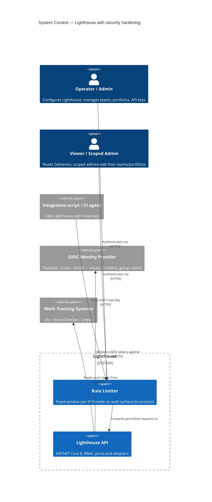
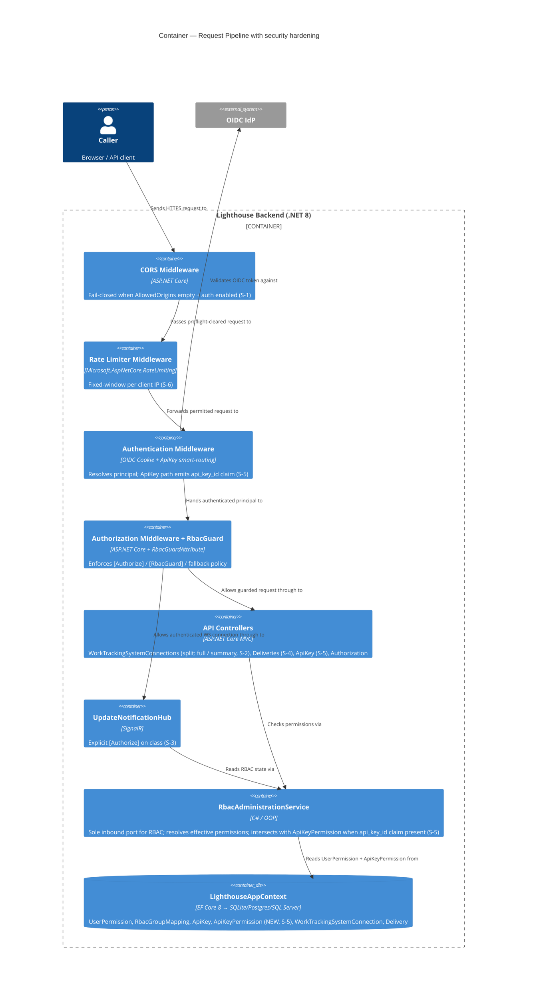

# Security Review — 2026-05

Audit date: 2026-05-12 | Auditor: Claude (Opus 4.7) | Method: code-grounded review with parallel sub-agents, every finding hand-verified against source before recording.

## Wave: DISCUSS / [REF] Persona ID

- **Secops-aware maintainer** — operates Lighthouse for an organisation with auth + RBAC enabled, needs confidence that scoped admins cannot reach data outside their scope and that the project meets EU CRA obligations entering applicability September 2026 (vulnerability reporting) and December 2027 (full essential requirements).

## Wave: DISCUSS / [REF] JTBD one-liner

When I deploy Lighthouse with auth and RBAC enabled, I want every endpoint, hub, and DTO to enforce the same scope guarantees the UI advertises, so that I can defend that posture to my CISO and to the CRA conformity assessment.

## Wave: DISCUSS / [REF] Pre-requisites

- Reviewed: `docs/compliance/cra-self-assessment.md`, `docs/compliance/cra-technical-file.md`, `docs/compliance/declaration-of-conformity.md`, `docs/compliance/psirt-process.md`, `docs/compliance/security-update-policy.md`, `docs/compliance/distribution-and-versioning.md`, `docs/compliance/roles-and-contacts.md`, `docs/compliance/index.md`, `docs/settings/rbac.md`, `docs/settings/apikeys.md`.
- Source-verified: `Lighthouse.Backend/Lighthouse.Backend/Program.cs`, `API/AuthorizationController.cs`, `API/DeliveriesController.cs`, `API/WorkTrackingSystemConnectionsController.cs`, `API/DTO/WorkTrackingSystemConnectionDto.cs` + `WorkTrackingSystemConnectionOptionDto.cs`, `Services/Implementation/BackgroundServices/Update/UpdateNotificationHub.cs`, `Services/Implementation/Authorization/*`.

## Wave: DISCUSS / [REF] Severity legend

- **VULN** — exploitable today, fix before next release.
- **GAP-HIGH** — defence-in-depth weakness or compliance blocker; fix in this milestone.
- **GAP-MED** — improvement, schedule for next release.
- **OK** — verified; recorded so the audit trail is reproducible.

---

## Wave: DISCUSS / [REF] Locked decisions

- **[D1]** Lighthouse is in CRA scope as a **manufacturer**, not a steward and not exempt FOSS. Evidence: paid Premium tier (`README.md:107`, `docs/settings/rbac.md:11`), commercial entity in DoC (`docs/compliance/declaration-of-conformity.md:33`). Reaffirms `docs/compliance/cra-technical-file.md:18`.
- **[D2]** Lighthouse classifies as **default product with digital elements** (Module A self-assessment) — not Annex III/IV important/critical. RBAC is a feature, not the product's purpose. Reaffirms `docs/compliance/cra-self-assessment.md:18`.
- **[D3]** Manufacturer is established in **Switzerland** (LetPeopleWork GmbH, Zürich). To place on the EU market a CH manufacturer needs an **EU authorised representative under CRA Art. 18** OR routes via an EU importer (Art. 19). Currently undeclared anywhere in `docs/compliance/`. This decision must be revisited before December 2027 entry into application.

---

## Wave: DISCUSS / [REF] Findings — Authentication & session

### F-1 (OK) — Auth scheme architecture is sound
- OIDC + Cookie + API-Key smart-routing at `Program.cs:310-420`. PKCE on (`:406`), SaveTokens on (`:407`), claims from UserInfo (`:408`).
- Cookie hardening: HttpOnly `:369`, Secure-always `:370`, SameSite=Lax `:371`, 480-min sliding expiry `:373-374`, name `.Lighthouse.Session` `:372`.
- HSTS on in production (`Program.cs:135`); forwarded headers honoured (`Program.cs:138`).
- Federated identity → no in-product password hashing needed; credential validation lives with the IdP.

### F-2 (OK) — API-key crypto is modern
- PBKDF2-SHA256, 100k iterations, 16-byte salt, 32-byte key (`ApiKeyService.cs:14-16, 230, 247-252`).
- Constant-time compare (`ApiKeyService.cs:167` via `CryptographicOperations.FixedTimeEquals`).
- Plaintext returned once at creation only (`ApiKeyController.cs:35`); thereafter metadata only.
- Owner enforcement on delete (`ApiKeyService.cs:88-93`).

### F-3 (GAP-MED) — No rate limiting on auth-adjacent endpoints
- No `AddRateLimiter` in `Program.cs`. `/api/auth/login`, `/api/auth/callback`, `/api/apikeys` (POST/DELETE), `/api/authorization/bootstrap/system-admin` are unthrottled.
- **Mitigation today**: external IdP brute-force protection + reverse proxy. Acceptable but should be in the technical file as an explicit operator responsibility, or implemented in-product.
- **CRA touchpoint**: Annex I §1(2)(h) — DoS resilience is currently a deployment concern, not a product capability.

### F-4 (GAP-MED) — API keys inherit owner's full RBAC scope
- No per-key restrictions to read-only / specific team / specific portfolio. Confirmed: `ApiKeyService.cs:101-154` returns the owner's subject; downstream uses the full owner profile.
- Implication: a leaked admin key = full admin. Should support least-privilege keys.

---

## Wave: DISCUSS / [REF] Findings — Authorisation & data scope

### F-5 (FALSE POSITIVE — recorded for posterity) — Deliveries PUT/DELETE IDOR
- **Initial subagent claim**: PUT `/api/v1/deliveries/{deliveryId}` and DELETE same have no `[RbacGuard]` → scoped admin can mutate any delivery by ID.
- **Verified at source**: `DeliveriesController.cs:116-123` (PUT) and `:167-174` (DELETE) call `rbacAdministrationService.CanSatisfyRequirementAsync(User, PortfolioWrite, existingDelivery.PortfolioId, …)` after loading the resource and `Forbid()` on failure. This is the correct pattern when the scope identifier is on the entity, not in the route.
- **Genuine but minor**: `DELETE` at `:167` reads `if (portfolioId.HasValue && !await CanSatisfy…)`. If `GetPortfolioId(deliveryId)` returns null (orphan / missing delivery), the guard is short-circuited and the controller still calls `Remove(deliveryId)`. The repo's `Remove` is presumably a no-op for missing IDs, but the conditional inverts the safe default — recommended rewrite:
  ```csharp
  var portfolioId = deliveryRepository.GetPortfolioId(deliveryId);
  if (!portfolioId.HasValue) return NotFound();
  if (!await rbac.CanSatisfyRequirementAsync(...)) return Forbid();
  ```
- Severity: **GAP-MED** (defensive only — no current exploit).

### F-6 (GAP-HIGH) — `GET /api/v1/worktrackingsystemconnections` not scoped to System Admin
- `WorkTrackingSystemConnectionsController.cs:51-58`: no `[RbacGuard]` on the list endpoint.
- POST (`:60-61`) and `validate` (`:90-91`) require `RbacGuardRequirement.SystemAdmin`. The list is treated as less-sensitive — but is, in fact, the **enumeration of every integration the org has connected**.
- **Subagent overstated this as "secrets returned unfiltered" — verified false**: `WorkTrackingSystemConnectionOptionDto:16` strips secret values: `Value = IsSecret ? string.Empty : option.Value`. Real leak surface:
  - List of connections by name and `WorkTrackingSystem` enum (which Jira / ADO / Linear tenants exist)
  - `AuthenticationMethodKey` & display name (e.g. "PAT", "OAuth"), which discloses which IdP / auth flow is used
  - Connection IDs (enables further IDOR probing)
- The fallback policy (`Program.cs:325-328`) means any *authenticated* user can hit this endpoint. With RBAC on, a low-privilege Viewer enumerates admin-only configuration metadata.
- **Fix**: add `[RbacGuard(RbacGuardRequirement.SystemAdmin)]` to the GET method to match POST/validate.

### F-7 (GAP-MED) — CORS fallback policy permits any origin
- `Program.cs:248-277`. When auth is disabled OR auth is enabled but `AllowedOrigins` is empty, the policy falls through to `corsPolicyBuilder.AllowAnyOrigin()` at `:270`.
- **Impact is bounded**: ASP.NET Core rejects `AllowCredentials` + `AllowAnyOrigin` combination, so cookies/Authorization headers are NOT sent from foreign origins. Anonymous/no-auth endpoints (auth-mode, version, public hub messages) are still readable cross-origin.
- **Fix**: fail-closed when auth is enabled but `AllowedOrigins.Count == 0` — log a fatal at startup, do not register the policy. Document the standalone-mode wildcard explicitly in the technical file as an accepted residual risk.

### F-8 (GAP-MED) — SignalR `UpdateNotificationHub` lacks explicit `[Authorize]`
- `UpdateNotificationHub.cs:6`: hub class is undecorated.
- When auth IS enabled, the `SetFallbackPolicy(RequireAuthenticatedUser())` at `Program.cs:325-328` covers hub connection (SignalR honours authz middleware). So this is **NOT** the open-relay the initial scan implied.
- However: relying on the fallback policy is fragile — a future change that switches `SetFallbackPolicy` to e.g. `RequireRole("Viewer")` would silently grant Viewer permissions to all subscribers. **Fix**: add `[Authorize]` explicitly on the hub class so the contract is local to the file.
- Also: the hub `SubscribeToUpdate(updateType, int id)` at `:30-37` does not check whether the caller has read-scope on the resource identified by `(updateType, id)`. The server pushes "update completed" events but not the payload — risk is information leakage about which team/portfolio is being refreshed, not data leak. Acceptable for now; track for v2.

### F-9 (OK) — `useRbac()` is the only frontend caller of `/authorization/my-summary`
- `Lighthouse.Frontend/src/services/Api/RbacService.ts:66` is the sole call site; `useRbac.ts:39` is the sole consumer. CLAUDE.md's claim verified.

### F-10 (OK) — Scoped list endpoints filter at the service layer
- `TeamsController.cs:39-48` and `PortfoliosController.cs:28-52` call `rbacAdministrationService.GetReadable{Team,Portfolio}IdsAsync(User, …)` and filter results before serialisation. Filtering is in the service, not the controller — correct location.

---

## Wave: DISCUSS / [REF] Findings — Confidentiality, logging, common vulns

### F-11 (GAP-LOW) — Connection-secret round-trip on update
- `WorkTrackingSystemConnectionsController.cs:137-158` (`PatchWorkTrackingSystemConnectionSecretsIfNeeded`): when a System Admin updates a connection and leaves the secret field empty in the inbound DTO, the controller **re-injects the existing encrypted secret value** from the DB into the DTO and reuses it. This is correct behaviour. Worth flagging only because the field name `Value` carries different semantics on inbound vs outbound paths (encrypted on inbound update, empty on outbound read). A short XML doc comment on the method would prevent a future contributor from "simplifying" this.

### F-12 (OK) — DTO leakage scan
- API-key list: `ApiKeyInfo` only — no hash, no salt, no plaintext.
- Connection options: secrets blanked via `WorkTrackingSystemConnectionOptionDto:16`.
- Error responses: 404/Forbid with minimal text. No stack traces in the controllers reviewed.

### F-13 (OK) — Logging hygiene
- Auth events logged at the right levels (`ApiKeyAuthenticationHandler.cs:37,44,64,71`); subject IDs logged, never emails or display names where avoidable.
- No matches for `password|secret|token` in logger statements across `API/*Controller.cs`.
- Serilog config in `appsettings.json` defaults to Information — no Debug payload spam in production.

### F-14 (OK) — Common-vuln spot-checks
- No `FromSqlRaw` / string-concat queries in auth or RBAC code; EF parameterised throughout.
- No model binding to domain entities — DTOs used at every controller surface examined.
- `appsettings.Development.json` contains example secrets (`ClientSecret "vTaGFsyZ70RtZbkHClkqrJomzov5WmB9"`) — production `appsettings.json` has empty values. Development file should not be deployed; verify in CI artefact assembly.

### F-15 (RESOLVED 2026-05-12) — Vulnerable transitive NuGet packages in migration projects
Surfaced by `dotnet build` on the test project and confirmed via `dotnet list package --vulnerable --include-transitive`:

| Project | Package | Version | Severity | Advisory | Source chain |
|---|---|---|---|---|---|
| `Lighthouse.Migrations.Postgres` | `System.Security.Cryptography.Xml` | 10.0.1 | High | [GHSA-37gx-xxp4-5rgx](https://github.com/advisories/GHSA-37gx-xxp4-5rgx), [GHSA-w3x6-4m5h-cxqf](https://github.com/advisories/GHSA-w3x6-4m5h-cxqf) | `Microsoft.Build.Tasks.Core 18.4.0` → `System.Security.Cryptography.Xml 10.0.1` |
| `Lighthouse.Migrations.Sqlite` | `System.Drawing.Common` | 5.0.0 | **Critical** | [GHSA-rxg9-xrhp-64gj](https://github.com/advisories/GHSA-rxg9-xrhp-64gj) | `Lighthouse.Backend` → `Microsoft.TeamFoundationServer.Client 20.256.2` → `Microsoft.TeamFoundation.DistributedTask.Common.Contracts 20.256.2` → `System.Private.ServiceModel 4.10.0` → `System.Security.Permissions 5.0.0` → `System.Windows.Extensions 5.0.0` → `System.Drawing.Common 5.0.0` |
| `Lighthouse.Migrations.Sqlite` | `System.Security.Cryptography.Xml` | 5.0.0 | Moderate | [GHSA-vh55-786g-wjwj](https://github.com/advisories/GHSA-vh55-786g-wjwj) | same TFS chain → `System.Private.ServiceModel 4.10.0` → `System.Security.Cryptography.Xml 5.0.0` |

**CRA impact**: under Annex I §1(2)(a) a product must be "delivered without known exploitable vulnerabilities". Shipping these transitive packages in the SBOM would fail conformity. The migration DLLs are compiled into the production artefact (`PostBuild` copies them to `..\Migrations\`), so this is a real shipping concern, not a dev-only one.

**Resolution**: pinned the patched 10.0.7 versions directly in each migration project's csproj. This forces the NuGet resolver to use the safe versions instead of accepting the older transitive resolution. Verified with `dotnet list package --vulnerable --include-transitive` → "no vulnerable packages" on both projects; `dotnet build Lighthouse.Backend.sln` → zero `NU1902/1903/1904` warnings.

Files changed:
- `Lighthouse.Backend/Lighthouse.Migrations.Postgres/Lighthouse.Migrations.Postgres.csproj` — added `<PackageReference Include="System.Security.Cryptography.Xml" Version="10.0.7" />`.
- `Lighthouse.Backend/Lighthouse.Migrations.Sqlite/Lighthouse.Migrations.Sqlite.csproj` — added `<PackageReference Include="System.Security.Cryptography.Xml" Version="10.0.7" />` and `<PackageReference Include="System.Drawing.Common" Version="10.0.7" />`.

---

## Wave: DISCUSS / [REF] Findings — EU CRA compliance gaps

References: Regulation (EU) 2024/2847 ([EUR-Lex](https://eur-lex.europa.eu/eli/reg/2024/2847/oj/eng)); EC summary at [digital-strategy.ec.europa.eu](https://digital-strategy.ec.europa.eu/en/policies/cra-summary); vulnerability reporting Art. 14 + Single Reporting Platform applies **11 September 2026**; main obligations apply **11 December 2027**.

### CRA-1 (BLOCKER) — No Article 14 reporting runbook; no EU authorised representative
- From 11 Sep 2026 the manufacturer must report:
  - Actively-exploited vulnerabilities: **early warning ≤ 24 h** to coordinator CSIRT + ENISA (Art. 14(2)(a))
  - Vulnerability notification ≤ 72 h (Art. 14(2)(b))
  - Final report ≤ 14 days after corrective measure available (Art. 14(2)(c))
  - Severe incident affecting security of the product without undue delay
  - User notification without undue delay (Art. 14(8))
- Current `docs/compliance/psirt-process.md` defines only **internal** reporter SLAs (5d ack, 10d triage). Line 235 mentions "CRA reporting obligations starting Sept 2026" as a *future review item*; the operational runbook does not encode the clocks, the ENISA reporting URL, or the coordinator CSIRT.
- Swiss manufacturer → **EU AR required (Art. 18)**. Not named in `docs/compliance/declaration-of-conformity.md:33` or `roles-and-contacts.md`.
- **Remediation**: appoint EU AR (legal step); add an "Actively-exploited / Severe incident" branch to `psirt-process.md` with the three clocks, the AR name, and the Single Reporting Platform link.

### CRA-2 (HIGH) — Support period not declared per Art. 13(8) and 13(19)
- Manufacturer must determine the support period (≥ 5 years unless product life is shorter) and publish end-month + end-year at point of purchase.
- `docs/compliance/cra-self-assessment.md:49` says "Latest version always supported"; `security-update-policy.md:107` says "All previous releases: Not supported". That is a zero-day support window per version — non-compliant with Art. 13(8).
- **Remediation**: declare a support window for each release line (e.g., "release N is supported until 12 months after release N+1, with a minimum total support period of 5 years for the product line"), publish in README, in-app About dialog, and at the download surface.

### CRA-3 (HIGH) — Self-assessment is checklist-shaped, not evidence-anchored
- `cra-self-assessment.md` rates all items "Implemented" with one-line evidence. CRA Annex VII technical documentation expects a structured risk assessment + threat model + test records cross-linking each Annex I §1(2)(a)–(m) requirement.
- Items not actually addressed: §1(2)(c) automatic updates, §1(2)(h) DoS resilience, §1(2)(k) exploit mitigations, §1(2)(l) security event logging (auth events ARE logged but the self-assessment does not cite that).
- **Remediation**: restructure `cra-self-assessment.md` against the Annex I §1(2)(a–m) labels; cite source files / CI workflows / test reports per item; mark gaps as "accepted residual risk" with justification (e.g., bootstrap-open mode).

### CRA-4 (MEDIUM) — Linux artefacts unsigned, no published checksums
- `docs/compliance/distribution-and-versioning.md:96-100` admits Linux zips are unsigned.
- Annex I Part II §7 requires a *secure* distribution mechanism for updates.
- **Remediation**: publish `SHA256SUMS.txt` + Cosign keyless signature next to every release (Docker already signed — extend to release artefacts); document `cosign verify-blob` steps in release notes.

### CRA-5 (MEDIUM) — DoC factual mismatches
- `docs/compliance/declaration-of-conformity.md:67-70` lists "ISO/IEC 27001" and "SPDX" as standards applied. Project actually ships **CycloneDX 1.7 / 1.5** SBOMs (`.github/workflows/ci_sbom.yml`). Mixing standards on a signed DoC is a non-trivial paper trail risk.
- Also: DoC dated 2025-12-30 with applicability beginning Dec 2027 — re-sign closer to entry into application, co-signed by the EU AR once appointed.

### CRA-6 (MEDIUM) — Bootstrap-open mode undeclared as residual risk
- `docs/settings/rbac.md:104-106` documents that on a fresh install **any authenticated user is treated as System Admin** until the first explicit System Admin is set. This is defensible (the IdP is the trust boundary), but:
  - Annex I §1(2)(b) requires "secure-by-default configuration"
  - `cra-self-assessment.md:31` claims compliance without disclosing the design choice
- **Remediation**: add a "Secure-by-default decisions" section to `cra-technical-file.md`; document bootstrap-open mode, its threat model, and the Emergency Admin mitigation.

---

## Wave: DISCUSS / [REF] User stories (remediation backlog)

Each story is independently shippable; each enables a decision the operator/auditor can make.

### Story S-1 — Fail-closed CORS when origins missing (F-7)

**As an** operator with auth enabled
**I want** the server to refuse to start (or log fatal) if `Auth.AllowedOrigins` is empty
**So that** I cannot accidentally deploy a wildcard CORS surface believing it's locked down.

#### Elevator Pitch
Before: setting `Auth.Enabled = true` while forgetting `AllowedOrigins` silently enables `AllowAnyOrigin`.
After: run `Auth.Enabled=true` with no `AllowedOrigins` → server logs `FATAL: Auth enabled but AllowedOrigins empty` and exits with non-zero code.
Decision enabled: operator knows immediately their CORS config is broken, before exposing the deployment.

#### AC
- Given auth is enabled AND `AllowedOrigins` is empty, when the app starts, then it logs a fatal error and exits with code 1.
- Given auth is enabled AND `AllowedOrigins` has at least one origin, then CORS registers only those origins with `AllowCredentials`.
- Given auth is disabled, behaviour is unchanged (anonymous wildcard CORS retained for self-hosted no-auth deployments).

### Story S-2 — Trim connection-list payload for non-System-Admin callers (F-6)

**As a** TeamAdmin or PortfolioAdmin editing a team/portfolio
**I want** the connection dropdown to still populate
**So that** I can pick which connection my team uses without needing SystemAdmin.
**And as a** Viewer
**I want** to see nothing about integration configuration
**So that** I cannot enumerate admin-only infrastructure.

> **Note on revision**: original draft put `[RbacGuard(SystemAdmin)]` on the GET. After tracing call sites (`EditTeam.tsx:113-120`, `EditPortfolio.tsx:91-120` → `getConfiguredWorkTrackingSystems()` → `GET /worktrackingsystemconnections`) that turned out to break scoped admins, who edit those forms after commit `6e23f31b`. Revised approach: keep the endpoint reachable but tighten the payload by caller role.

#### Elevator Pitch
Before: `GET /api/v1/worktrackingsystemconnections` returns the full DTO (id, name, workTrackingSystem, AuthenticationMethodKey, AuthenticationMethodDisplayName, AvailableAuthenticationMethods, Options[blanked], AdditionalFieldDefinitions, WriteBackMappingDefinitions) to any authenticated user.
After: as SystemAdmin → 200 full DTO; as TeamAdmin / PortfolioAdmin → 200 with `[{id, name, workTrackingSystem}]` only; as Viewer → 403.
Decision enabled: scoped admins keep editing teams/portfolios; auditor confirms admin-only metadata is admin-only.

#### Design notes
- Frontend dropdown only consumes `id` and `name` (`GeneralSettingsComponent.tsx:151-153`) plus the `workTrackingSystem` enum where the connector icon is rendered. Trimming to those three fields is sufficient.
- `EditConnection.tsx:40` also calls `getConfiguredWorkTrackingSystems()`, but that page is SystemAdmin-only by route guard — it receives the full DTO.
- Implementation choice (pick one in DESIGN wave): (a) one endpoint, server-side filter on caller role, two response shapes — simpler client, ambiguous schema; (b) add `GET /worktrackingsystemconnections/summary` returning the lean shape unauthenticated-of-scope, keep `GET /worktrackingsystemconnections` for SystemAdmin only — cleaner schema, frontend refactor needed in two files. Recommend (b) for OpenAPI clarity.

#### AC
- Given a System Admin caller, when GET `/api/v1/worktrackingsystemconnections` is invoked, then return 200 with the full DTO (secrets still stripped).
- Given a TeamAdmin or PortfolioAdmin caller, when GET on the (a) full endpoint runs → 403 OR (b) summary endpoint runs → 200 with only `{id, name, workTrackingSystem}` per item.
- Given a Viewer caller, when GET on either endpoint runs, then return 403.
- E2E regression: as a scoped admin, open the team edit page and confirm the connection dropdown still populates and saving succeeds.
- E2E regression: as a Viewer, confirm the admin-only endpoint returns 403 and no connection metadata appears on team detail pages.
- Unit regression: assert no response body for any caller contains a field where `IsSecret == true && Value != ""`.

### Story S-3 — `[Authorize]` on `UpdateNotificationHub` (F-8)

**As a** maintainer reading the hub code
**I want** the auth contract to live on the hub itself
**So that** I do not depend on `SetFallbackPolicy` remaining unchanged elsewhere.

#### Elevator Pitch
Before: hub class is undecorated; auth comes from a global fallback policy.
After: hub class is `[Authorize]`; SignalR test that connects without a session token gets a 401 at handshake.
Decision enabled: a future engineer changing the fallback policy cannot accidentally widen hub access.

#### AC
- Given auth is enabled AND no session cookie, when a client opens a SignalR connection to `/api/updateNotificationHub`, then handshake fails with 401.
- Given a valid session cookie, when a client opens the connection, then handshake succeeds (no behaviour change from today).

### Story S-4 — Tighten `DELETE /api/v1/deliveries/{id}` guard inversion (F-5)

**As a** scoped admin
**I want** the DELETE endpoint to return `NotFound` then `Forbid` in that order
**So that** the guard cannot be silently bypassed if the underlying repo behaviour changes.

#### Elevator Pitch
Before: `if (portfolioId.HasValue && !canSatisfy) return Forbid();` — guard short-circuits on null.
After: `if (!portfolioId.HasValue) return NotFound(); if (!canSatisfy) return Forbid();`.
Decision enabled: reviewer confirms the deny-by-default invariant on the controller.

#### AC
- Given a deletion request for an ID that does not exist, when DELETE runs, then return 404.
- Given a deletion request for an existing delivery in a portfolio outside the caller's write scope, then return 403; the repository's `Remove` is never called (verified with `Substitute.DidNotReceive()`).

### Story S-5 — Per-key API key scopes (F-4)

**As an** operator
**I want** to issue an API key restricted to `Read` on `Portfolio 42`
**So that** integration scripts run with least privilege.

#### Elevator Pitch
Before: every API key inherits the owner's full RBAC scope.
After: `POST /api/apikeys` accepts `{scope: {type: "PortfolioRead", id: 42}}`; the key returned only reads Portfolio 42.
Decision enabled: operator picks a tighter scope without provisioning a dedicated user.

#### AC
- Given a `PortfolioRead/42` scoped key, when GET `/api/v1/portfolios/42` is called with `X-Api-Key`, then return 200.
- Given the same key, when GET `/api/v1/portfolios/43` is called, then return 403.
- Given the same key, when POST/PUT/DELETE on any resource is called, then return 403.

### Story S-6 — Rate-limit auth-adjacent endpoints (F-3)

**As an** operator
**I want** `/api/auth/login`, `/api/auth/callback`, `/api/apikeys` POST/DELETE, and `/api/authorization/bootstrap/system-admin` to be rate-limited per IP
**So that** brute-force / enumeration attacks against the auth surface are bounded.

#### Elevator Pitch
Before: no per-IP throttle on auth endpoints.
After: 101st request from one IP in 60 s to `/api/auth/login` → 429 with `Retry-After`.
Decision enabled: operator can answer "do we have brute-force protection?" without referring to a reverse proxy config.

#### AC
- Given 100 requests in 60 s from one IP to `/api/auth/login`, then the 101st returns 429.
- Given a quiet IP, the 60s window resets and a fresh 100 requests succeed.
- Rate limits configurable via `appsettings.json` under `RateLimits` section.

### Story S-7 — CRA Article 14 reporting runbook + EU AR (CRA-1)

**As a** PSIRT lead
**I want** an executable runbook for actively-exploited vulnerabilities with 24 / 72 / 14-day clocks and an EU authorised representative on file
**So that** the project meets CRA Art. 14 + Art. 18 obligations when the reporting regime applies on 11 Sep 2026.

#### Elevator Pitch
Before: `psirt-process.md` mentions CRA reporting only as a future review item.
After: open `psirt-process.md`, find a "Actively-exploited vulnerability" section with three timers, ENISA Single Reporting Platform URL, named EU AR with contact email.
Decision enabled: an auditor confirms the project will be reporting-ready on 11 Sep 2026.

#### AC
- `psirt-process.md` contains a section with 24 h / 72 h / 14 d timelines and references Art. 14(2)(a–c).
- `roles-and-contacts.md` and `declaration-of-conformity.md` name the EU authorised representative.
- A dry-run tabletop exercise has been recorded in the technical file.

### Story S-8 — Declare CRA support period (CRA-2)

**As a** customer evaluating Lighthouse
**I want** to see the end-month and end-year that the version I'm about to install will receive security updates
**So that** I can plan upgrades and meet my own compliance obligations.

#### Elevator Pitch
Before: README and About dialog say "latest version supported".
After: README and About dialog show "Security updates until: MM/YYYY".
Decision enabled: customer plans upgrade cadence on declared dates.

#### AC
- README contains a "Support period" section with the policy.
- About dialog renders the support-end date for the running version, derived from a JSON file shipped with each release.
- The policy declares ≥ 5 years per release line.

### Story S-9 — Restructure CRA self-assessment against Annex I §1(2)(a–m) (CRA-3)

#### Elevator Pitch
Before: `cra-self-assessment.md` uses ad-hoc numbering 1.1–1.9.
After: each section is titled exactly per Annex I §1(2)(a)–(m); each row cites a source file path or a CI workflow.
Decision enabled: a conformity-assessment reviewer can audit by ctrl-F on the regulation reference.

#### AC
- 13 sections, one per §1(2)(a–m).
- Each section either cites a file or marks `Accepted residual risk: <justification>`.
- A new validator script `docs/compliance/validate-cra-self-assessment.py` confirms every section is present.

### Story S-10 — Sign Linux artefacts + publish SHA256SUMS (CRA-4)

#### Elevator Pitch
Before: Linux zip is downloadable from the release page with no integrity verification.
After: each release page lists `lighthouse-linux-x64.zip`, `SHA256SUMS.txt`, `SHA256SUMS.txt.sig`; release notes show `cosign verify-blob` invocation.
Decision enabled: an operator verifies the download before installing.

#### AC
- `.github/workflows/package-linux.yml` emits SHA256SUMS and a Cosign keyless signature.
- Release notes template includes the verification commands.
- A regression check downloads the latest release and runs `cosign verify-blob` in CI.

---

## Wave: DISCUSS / [REF] Definition of Done

1. F-6, F-7, S-4 (DELETE invert) shipped in this milestone (these have non-trivial security implications and trivial implementation cost).
2. F-3 (rate limits) and F-4 (per-key scopes) scoped as separate features; do not block this milestone.
3. CRA-1, CRA-2, CRA-3 tracked as compliance work with deadlines aligned to 11 Sep 2026 (reporting regime) and 11 Dec 2027 (essential requirements).
4. CRA-4, CRA-5, CRA-6 included in the next compliance docs revision.
5. Every story has a regression test that fails before the fix and passes after.
6. Mutation testing for the security-touching code achieves ≥ 80 % kill rate per repo policy.
7. No release notes copy that implies a stronger guarantee than the code delivers.

## Wave: DISCUSS / [REF] Out-of-scope

- Web Application Firewall configuration (deployment concern).
- IdP brute-force protection (depends on OIDC provider).
- Full SOC2 / ISO 27001 process (not requested).
- TLS termination policy (delegated to reverse proxy).

## Wave: DISCUSS / [REF] WS strategy

**A — Pure brownfield**. Each story is a single-PR diff against existing controllers / docs. No walking skeleton required.

## Wave: DISCUSS / [REF] Driving ports

- HTTP (REST controllers in `Lighthouse.Backend/Lighthouse.Backend/API`)
- SignalR hub at `/api/updateNotificationHub`
- CRA documentation site under `docs/compliance/`

## Wave: DISCUSS / [REF] Wave Decisions

- **[D1]** Lighthouse is in CRA scope as manufacturer (default category, self-assessment route).
- **[D2]** Three findings (F-6, F-7, S-4 inversion) are pre-release blockers; remaining items are scheduled.
- **[D3]** Subagent reports were treated as claims; every finding was hand-verified against `file:line` before recording. Two CRITICAL claims (PUT /deliveries IDOR, GET /worktrackingsystemconnections secret leak) were downgraded or rejected after verification.
- **[D4]** Swiss manufacturer → EU AR appointment is a legal precondition for CRA conformity. Tracked under CRA-1.

---

## Wave: DESIGN / [REF] DDD list

Application-level design decisions for stories S-1..S-6. (S-7..S-10 / CRA-7..CRA-10 are docs/process work — explicitly out of scope for DESIGN; see Decisions table.)

- **[D1]** **S-1 fail-closed CORS**: when `authConfig.Enabled == true && authConfig.AllowedOrigins.Count == 0`, log fatal and exit non-zero from `ConfigureCors` before `WebApplication.Run`. Standalone-mode wildcard and auth-disabled wildcard retained. *Rationale*: removes the silent-wildcard footgun without changing standalone behaviour.
- **[D2]** **S-2 connection list shape**: NEW endpoint `GET /api/v1/worktrackingsystemconnections/summary` returns lean `{id, name, workTrackingSystem}` to any scoped admin; existing `GET /api/v1/worktrackingsystemconnections` becomes SystemAdmin-only. *Rationale*: OpenAPI clarity + smallest blast radius + preserves scoped-admin edit flow after commit `6e23f31b`. See ADR-006.
- **[D3]** **S-2 new `RbacGuardRequirement` value**: add `AnyScopedAdmin` to the enum and the switch in `RbacAdministrationService.CanSatisfyRequirementAsync`. Resolves true iff `isSystemAdmin || any TeamAdmin || any PortfolioAdmin`. *Rationale*: the summary endpoint needs a precise gate; reusing `SystemAdmin` re-introduces the bug, reusing `TeamRead` requires a scope ID we don't have.
- **[D4]** **S-3 explicit `[Authorize]` on `UpdateNotificationHub`**: decorate the hub class directly; do not rely on `SetFallbackPolicy`. *Rationale*: localises the contract; future fallback-policy changes cannot silently widen hub access.
- **[D5]** **S-4 invert DELETE guard**: rewrite `DeliveriesController.DeleteDelivery` to `NotFound` on missing portfolio ID **before** the RBAC check. Ordering: `(1) lookup → 404 if missing; (2) RBAC check → 403 if denied; (3) Remove + Save`. *Rationale*: deny-by-default; removes the short-circuit path through the `&&` conditional.
- **[D6]** **S-5 API-key scopes via parallel `ApiKeyPermission` table**: new entity `ApiKeyPermission(Id, ApiKeyId, Role, ScopeType, ScopeId?, GrantedAt)` mirroring `UserPermission`; cascade-delete from `ApiKey`; resolution as intersection with owner permissions; empty rows = inherit (backwards-compatible). *Rationale*: reuses existing `RbacAdministrationService` permission machinery; rejected JSON-column and join-table options. See ADR-004.
- **[D7]** **S-5 new `api_key_id` claim**: `ApiKeyAuthenticationHandler` emits `Claim("api_key_id", validationResult.ApiKeyId.ToString())` alongside `sub`. `RbacAdministrationService.GetEffectivePermissionsAsync` reads this claim and, when present, intersects owner permissions with the key's `ApiKeyPermission` rows. *Rationale*: single seam for per-key resolution; no parallel permission engine.
- **[D8]** **S-5 issue-time validation**: `POST /api/apikeys` requires the caller's permissions to be a superset of the requested scope. A PortfolioAdmin cannot mint a SystemAdmin key. *Rationale*: prevents privilege amplification at the only point keys are created.
- **[D9]** **S-6 rate limiter**: built-in `Microsoft.AspNetCore.RateLimiting` (.NET 8 BCL), `FixedWindowRateLimiter`, partitioned by forwarded client IP; per-policy permit limits in `appsettings.json` under `RateLimits` section; `Enabled=false` disable switch for test environments. *Rationale*: zero-dependency, matches single-instance deployment; Redis-backed alternatives rejected. See ADR-005.
- **[D10]** **Middleware ordering** (S-1 + S-6): in `ConfigureApp`, order is `UseForwardedHeaders → UseCors → UseRouting → UseRateLimiter → UseAuthentication → UseAuthorization → MapControllers`. `UseRateLimiter` must precede `UseAuthentication` so unauthenticated brute-force bursts are throttled before the auth handler does work; CORS stays first so preflights short-circuit; forwarded-headers stays first so the rate-limiter sees the real client IP.

---

## Wave: DESIGN / [REF] Component decomposition

| Component | File | Change Type | Change Summary |
|---|---|---|---|
| Program (CORS) | `Lighthouse.Backend/Lighthouse.Backend/Program.cs` | EXTEND | `ConfigureCors`: when `authConfig.Enabled && authConfig.AllowedOrigins.Count == 0`, `Log.Fatal` and throw a `InvalidOperationException` that the outer `catch` converts to `Environment.Exit(1)`. (S-1) |
| Program (middleware order) | `Lighthouse.Backend/Lighthouse.Backend/Program.cs` | EXTEND | `ConfigureServices`: add `ConfigureRateLimiter`. `ConfigureApp`: insert `app.UseRateLimiter()` between `UseRouting` and `UseAuthentication`. (S-6) |
| RateLimitingConfiguration | `Lighthouse.Backend/Lighthouse.Backend/Configuration/RateLimitingConfiguration.cs` | CREATE NEW | Strongly-typed `RateLimits` section: `Enabled`, `Policies: Dictionary<string, FixedWindowPolicy>`, defaults baked in. (S-6) |
| WorkTrackingSystemConnectionsController | `Lighthouse.Backend/Lighthouse.Backend/API/WorkTrackingSystemConnectionsController.cs` | EXTEND | Add `[RbacGuard(SystemAdmin)]` on existing `GetWorkTrackingSystemConnections`. Add `[HttpGet("summary")] [RbacGuard(AnyScopedAdmin)] GetWorkTrackingSystemConnectionSummary()`. (S-2) |
| WorkTrackingSystemConnectionSummaryDto | `Lighthouse.Backend/Lighthouse.Backend/API/DTO/WorkTrackingSystemConnectionSummaryDto.cs` | CREATE NEW | `public record WorkTrackingSystemConnectionSummaryDto(int Id, string Name, WorkTrackingSystems WorkTrackingSystem)`. (S-2) |
| RbacGuardRequirement | `Lighthouse.Backend/Lighthouse.Backend/Models/Authorization/RbacGuardRequirement.cs` | EXTEND | Add `AnyScopedAdmin` enum value. (S-2) |
| RbacAdministrationService | `Lighthouse.Backend/Lighthouse.Backend/Services/Implementation/Authorization/RbacAdministrationService.cs` | EXTEND | (a) New switch arm for `AnyScopedAdmin` in `CanSatisfyRequirementAsync` (S-2). (b) `GetEffectivePermissionsAsync` reads `api_key_id` claim; when present, intersects owner permissions with `ApiKeyPermission` rows for that key (S-5). |
| UpdateNotificationHub | `Lighthouse.Backend/Lighthouse.Backend/Services/Implementation/BackgroundServices/Update/UpdateNotificationHub.cs` | EXTEND | Add `[Authorize]` attribute on the class. (S-3) |
| DeliveriesController | `Lighthouse.Backend/Lighthouse.Backend/API/DeliveriesController.cs` | EXTEND | Rewrite `DeleteDelivery`: `(1) GetPortfolioId → NotFound on null; (2) CanSatisfyRequirement → Forbid on false; (3) Remove + Save`. (S-4) |
| ApiKey | `Lighthouse.Backend/Lighthouse.Backend/Models/Auth/ApiKey.cs` | NO CHANGE | Owner fields remain; scopes live in the new child table. (S-5) |
| ApiKeyPermission | `Lighthouse.Backend/Lighthouse.Backend/Models/Auth/ApiKeyPermission.cs` | CREATE NEW | `(Id, ApiKeyId, Role, ScopeType, ScopeId?, GrantedAt)` mirroring `UserPermission`. (S-5) |
| LighthouseAppContext | `Lighthouse.Backend/Lighthouse.Backend/Data/LighthouseAppContext.cs` | EXTEND | `DbSet<ApiKeyPermission>`; FK from `ApiKey.Id` with cascade-delete; index on `ApiKeyId`. Migration generated via `CreateMigration` PowerShell script. (S-5) |
| ApiKeyAuthenticationHandler | `Lighthouse.Backend/Lighthouse.Backend/Services/Implementation/Auth/ApiKeyAuthenticationHandler.cs` | EXTEND | Emit additional `Claim("api_key_id", ApiKeyId.ToString())` on the resolved-owner path. (S-5) |
| ApiKeyController | `Lighthouse.Backend/Lighthouse.Backend/API/ApiKeyController.cs` | EXTEND | `POST /api/apikeys` accepts optional `scope` array; validates caller permissions are a superset; persists `ApiKeyPermission` rows. (S-5) |
| CreateApiKeyRequest | `Lighthouse.Backend/Lighthouse.Backend/Models/Auth/CreateApiKeyRequest.cs` | EXTEND | Add optional `Scope: List<ApiKeyScopeDto>?` property. (S-5) |
| ApiKeyService | `Lighthouse.Backend/Lighthouse.Backend/Services/Implementation/Auth/ApiKeyService.cs` | EXTEND | `CreateApiKeyAsync` persists scope rows in the same transaction as the key. (S-5) |
| WorkTrackingSystemService.ts | `Lighthouse.Frontend/src/services/Api/WorkTrackingSystemService.ts` | EXTEND | `getConfiguredWorkTrackingSystems()` repointed to `/worktrackingsystemconnections/summary`. New typed return `IWorkTrackingSystemConnectionSummary`. (S-2) |
| ApiKeyService.ts | `Lighthouse.Frontend/src/services/Api/ApiKeyService.ts` | EXTEND | `createApiKey` accepts optional scope payload. (S-5) |

---

## Wave: DESIGN / [REF] Driving ports

| Method | Route | Auth Requirement | Purpose | Change |
|---|---|---|---|---|
| GET | `/api/v1/worktrackingsystemconnections` | `[RbacGuard(SystemAdmin)]` | Full connection list (incl. config metadata, secrets blanked) | **CHANGED** — was authenticated-only; now SystemAdmin (S-2) |
| GET | `/api/v1/worktrackingsystemconnections/summary` | `[RbacGuard(AnyScopedAdmin)]` | Lean dropdown population: `[{id, name, workTrackingSystem}]` | **NEW** (S-2) |
| DELETE | `/api/v1/deliveries/{deliveryId}` | inline `CanSatisfyRequirement(PortfolioWrite, …)` with NotFound-then-Forbid ordering | Delete a delivery | **CHANGED** — guard inversion (S-4) |
| WS | `/api/updateNotificationHub` | `[Authorize]` on hub class | SignalR update notifications | **CHANGED** — explicit (S-3) |
| POST | `/api/apikeys` | `[Authorize]` + rate-limited + scope superset check | Create API key (optional `scope` payload) | **EXTENDED** (S-5, S-6) |
| DELETE | `/api/apikeys/{id}` | `[Authorize]` + rate-limited | Delete owner's key | **EXTENDED** (S-6) |
| GET | `/api/auth/login` | anonymous + rate-limited | OIDC login start | **EXTENDED** rate-limit (S-6) |
| GET | `/api/auth/callback` | anonymous + rate-limited | OIDC callback | **EXTENDED** rate-limit (S-6) |
| POST | `/api/authorization/bootstrap/system-admin` | authenticated + rate-limited | Bootstrap first System Admin | **EXTENDED** rate-limit (S-6) |

---

## Wave: DESIGN / [REF] Driven ports + adapters

No new driven *ports* (outbound abstractions) are introduced. Two changes at the adapter layer:

- **Persistence adapter (`LighthouseAppContext`)**: extended with one new `DbSet<ApiKeyPermission>` and one cascade-delete relationship. Continues to be the sole EF-Core persistence adapter; same provider abstraction (SQLite / PostgreSQL / SQL Server) applies.
- **Rate-limiter middleware adapter**: `Microsoft.AspNetCore.RateLimiting` registered in the request pipeline. Conceptually a new driven adapter (the application now "depends on" a throttling capability), but the dependency is on the ASP.NET Core BCL itself, not a third-party. No port abstraction is justified: the middleware is configured declaratively at composition root, not invoked from domain code.

The existing OIDC token introspection port and the RBAC persistence port from the previous DESIGN wave are unchanged.

---

## Wave: DESIGN / [REF] Technology choices

| Component | Technology | Version | License | Rationale |
|---|---|---|---|---|
| Rate limiting | `Microsoft.AspNetCore.RateLimiting` | .NET 8 BCL | MIT | Built-in; zero new NuGet; in-memory state matches single-instance deployment; see ADR-005 |
| API-key scope storage | EF Core 8 entity + migration | 8.x | MIT | Existing ORM; new entity mirrors `UserPermission`; see ADR-004 |
| All other components | Existing stack | — | — | No changes to backend (.NET 8 / ASP.NET Core / EF Core 8), frontend (React 18 / TS / MUI), or test frameworks (xUnit / NSubstitute / Vitest / Playwright) |

---

## Wave: DESIGN / [REF] System Context (C4 L1)



---

## Wave: DESIGN / [REF] Container (C4 L2)



---

## Wave: DESIGN / [REF] Decisions table

| ID | Decision | Story | ADR |
|---|---|---|---|
| D1 | Fail-closed CORS on empty `AllowedOrigins` + auth enabled | S-1 | — |
| D2 | New `/summary` endpoint; lock full endpoint to SystemAdmin | S-2 | ADR-006 |
| D3 | New `RbacGuardRequirement.AnyScopedAdmin` enum value | S-2 | ADR-006 |
| D4 | Explicit `[Authorize]` on `UpdateNotificationHub` | S-3 | — |
| D5 | Invert DELETE guard: NotFound-then-Forbid | S-4 | — |
| D6 | New `ApiKeyPermission` table parallel to `UserPermission` | S-5 | ADR-004 |
| D7 | New `api_key_id` claim, intersection resolution | S-5 | ADR-004 |
| D8 | Issue-time scope superset check on `POST /api/apikeys` | S-5 | ADR-004 |
| D9 | Built-in `Microsoft.AspNetCore.RateLimiting`, fixed-window per IP | S-6 | ADR-005 |
| D10 | Middleware order: ForwardedHeaders → CORS → Routing → RateLimiter → Authn → Authz → Controllers | S-1, S-6 | — |
| OUT | S-7 (CRA Article 14 runbook + EU AR) | S-7 | docs/process work — not architecture; out of scope for DESIGN |
| OUT | S-8 (CRA support period declaration) | S-8 | docs/process work — not architecture; out of scope for DESIGN |
| OUT | S-9 (Restructure CRA self-assessment) | S-9 | docs/process work — not architecture; out of scope for DESIGN |
| OUT | S-10 (Sign Linux artefacts + SHA256SUMS) | S-10 | CI/release pipeline; out of scope for DESIGN (handled by platform-architect in DEVOPS wave if escalated) |

---

## Wave: DESIGN / [REF] Reuse Analysis

Hard gate per principle 5. Every overlapping component is listed; default is EXTEND.

| Existing Component | File | Overlap with new work | Decision | Justification |
|---|---|---|---|---|
| `RbacGuardAttribute` | `Services/Implementation/Authorization/RbacGuardAttribute.cs` | Per-route RBAC enforcement | EXTEND (via new enum value, not new attribute) | The new `AnyScopedAdmin` requirement is one enum value + one switch arm in `CanSatisfyRequirementAsync`. A new attribute would fork the enforcement pipeline. |
| `RbacGuardRequirement` enum | `Models/Authorization/RbacGuardRequirement.cs` | Permission vocabulary | EXTEND | Add `AnyScopedAdmin`. The 8 existing values cover everything else; `AnyScopedAdmin` is the only genuinely new gate. |
| `RbacAdministrationService.CanSatisfyRequirementAsync` | `Services/Implementation/Authorization/RbacAdministrationService.cs:299` | Permission resolution | EXTEND | One new switch arm. No new service / no new port. |
| `RbacAdministrationService.GetEffectivePermissionsAsync` | same file | Owner permission lookup | EXTEND | One new branch that reads `api_key_id` claim and intersects with `ApiKeyPermission`. |
| `UserPermission` entity | `Models/Authorization/UserPermission.cs` | Permission row shape | REUSE shape, CREATE NEW table | The new `ApiKeyPermission` table **deliberately mirrors** `UserPermission` to keep the resolver code symmetric. Reusing the same table (Option B in ADR-004) was rejected because it conflates user lifecycle with key lifecycle. |
| `ApiKey` entity | `Models/Auth/ApiKey.cs` | API key storage | NO CHANGE | Scope rows live in the new child table; the key entity stays clean. |
| `ApiKeyAuthenticationHandler` | `Services/Implementation/Auth/ApiKeyAuthenticationHandler.cs` | Claims emission for API-key auth | EXTEND | Add one claim (`api_key_id`). The handler is already the right boundary. |
| `ApiKeyService` | `Services/Implementation/Auth/ApiKeyService.cs` | API key creation / validation | EXTEND | Persist scope rows in the same transaction. Validation already produces an `ApiKeyId` that flows to the new claim. |
| `LighthouseAppContext` | `Data/LighthouseAppContext.cs` | Persistence adapter | EXTEND | One `DbSet<ApiKeyPermission>` + one FK with cascade-delete. |
| `WorkTrackingSystemConnectionsController` | `API/WorkTrackingSystemConnectionsController.cs` | Connection CRUD | EXTEND | One new action method + one new `[RbacGuard]` on the existing list. New controller would orphan the route. |
| `WorkTrackingSystemConnectionDto` | `API/DTO/WorkTrackingSystemConnectionDto.cs` | Full connection shape | NO CHANGE | Used unchanged on the full endpoint. New summary DTO is a separate type for OpenAPI clarity (see ADR-006). |
| `DeliveriesController.DeleteDelivery` | `API/DeliveriesController.cs:163-180` | DELETE endpoint | EXTEND | Inline guard rewrite. The controller is already the right boundary. |
| `UpdateNotificationHub` | `Services/Implementation/BackgroundServices/Update/UpdateNotificationHub.cs` | SignalR hub | EXTEND | One attribute addition on the class. |
| `Program.ConfigureCors` | `Program.cs:248` | CORS policy registration | EXTEND | One additional guard branch + a `Log.Fatal` + exit path. |
| `Program.ConfigureApp` middleware pipeline | `Program.cs:126-192` | Request pipeline composition | EXTEND | Insert `app.UseRateLimiter()`. |
| `WorkTrackingSystemService.ts` | `Lighthouse.Frontend/src/services/Api/WorkTrackingSystemService.ts` | Frontend HTTP adapter | EXTEND | Repoint one method (`getConfiguredWorkTrackingSystems`) to the new summary endpoint; add typed return. |
| `ApiKeyService.ts` | `Lighthouse.Frontend/src/services/Api/ApiKeyService.ts` | Frontend HTTP adapter | EXTEND | Add optional scope payload to the existing create method. |

**New components** (justification: no existing alternative):
- `ApiKeyPermission` entity — required to store scope rows; no existing table fits without semantic abuse (see ADR-004 Options A and B rejection).
- `WorkTrackingSystemConnectionSummaryDto` — required for OpenAPI clarity; reusing the full DTO recreates the over-disclosure problem (see ADR-006 Option A rejection).
- `RateLimitingConfiguration` strongly-typed options class — required to bind the new `RateLimits` section from `appsettings.json`; mirrors existing `AuthenticationConfiguration` pattern.

---

## Wave: DESIGN / [REF] Architectural Enforcement

Language-appropriate enforcement for this slice (extends the table already in `docs/product/architecture/brief.md`):

| Rule | Enforcement Mechanism |
|---|---|
| `[Authorize]` must be present on every SignalR `Hub` subclass | ArchUnitNET test in `Lighthouse.Backend.Tests`: types assignable to `Microsoft.AspNetCore.SignalR.Hub` must carry an `AuthorizeAttribute` |
| `ApiKeyPermission` resolution must go through `RbacAdministrationService` | ArchUnitNET test: only `Services.Implementation.Authorization.*` may reference the `ApiKeyPermission` entity |
| Controllers must not directly read the `api_key_id` claim — go through `RbacAdministrationService` | ArchUnitNET test: types in `API` namespace must not reference the string literal `"api_key_id"` (or, preferred, the literal lives only in a single internal constant on the auth handler / service) |
| Rate-limit policy names must be a defined constant set, not free-form strings at call sites | Roslyn analyser or unit test asserting `RequireRateLimiting(policy)` callers reference a sealed constants class |

---

## Wave: DESIGN / [REF] External Integrations

S-5 and S-6 do not introduce new external integrations. The existing OIDC IdP integration remains the only external dependency in the auth path. **Contract testing recommendation** for the existing OIDC integration is unchanged from the prior DESIGN wave — out of scope for this feature delta.

The work-tracking-system integrations (Jira, Azure DevOps, Linear) are unaffected by this security review.

---

## Wave: DESIGN / [REF] Open questions

Deferred to DISTILL/DELIVER:

- **OQ-1 (S-5)**: For the `POST /api/apikeys` superset check, when the caller is a TeamAdmin on Team 7 and requests a `TeamRead/7` scope, that's clearly allowed. When the caller is a TeamAdmin on Team 7 and requests a `TeamRead` scope with **no** `ScopeId` (meaning "all teams"), should that be rejected (most restrictive interpretation) or silently narrowed to `TeamRead/7` (most permissive)? **Recommendation**: reject. The caller must enumerate the scopes explicitly. Confirm with acceptance-designer when AC are written.
- **OQ-2 (S-5)**: API-key list endpoint (`GET /api/apikeys`) currently returns `ApiKeyInfo` per key. Should we extend the DTO to include the key's scope rows so operators can audit "what can each key do" from the management UI? **Recommendation**: yes, but the scope display is a follow-up story (not a blocker for the security fix). Track as a candidate for the next iteration; out of scope for this milestone unless the AC author asks for it.
- **OQ-3 (S-6)**: What is the right default `permit limit` for `/api/auth/login`? The draft 100/60s is conservative. Real-world OIDC callback bursts on first-login can briefly exceed 10/sec across an org. **Recommendation**: keep 100/60s as the **default** in code but document the tuning knob in the operator guide; treat as a UX-tunable rather than a security ceiling. Confirm with the user in DISTILL.
- **OQ-4 (S-6)**: Should `X-Api-Key`-authenticated requests be rate-limited per **key** as well as per IP? An integration script behind a NAT could be throttled by another tenant's traffic. **Recommendation**: yes, layer a second policy keyed on `api_key_id` claim. Out of scope for this delta — track as a follow-up.
- **OQ-5 (S-1)**: `Standalone` mode (`Environment.GetEnvironmentVariable("Standalone") == "true"`) bypasses the new fail-closed check entirely (wildcard CORS retained). Is this the intended escape hatch, or should standalone-with-auth-enabled also fail-closed? **Recommendation**: keep the current behaviour — `Standalone=true` is the dev-mode explicit opt-out for the wildcard; auth-enabled production deployments should not set it. Document explicitly in the CRA technical file. Confirm with the user.

---

## Wave: DISTILL / [REF] Framework note

The brief asked for "xUnit integration tests". The actual repo uses **NUnit 4.6 + Moq** (`Lighthouse.Backend.Tests.csproj:17-18`, `GlobalUsings.cs`); every existing test file uses `[Test]` / `[TestCase]` / `Assert.That`. To honour the standing constraint *"follow the existing Lighthouse backend test pattern"* and to ensure the scaffolds compile, the test classes here are NUnit. RED-state idiom is `Assert.Fail("Not yet implemented — RED scaffold")` (xUnit's `XunitException` is not on the dependency graph).

## Wave: DISTILL / [REF] WS strategy confirmation

Per user lock-in: **C — Real local** for the two new mechanisms (S-5 ApiKey scopes, S-6 rate limiting). Tests use the existing `IntegrationTestBase` + `TestWebApplicationFactory<Program>` (real `WebApplicationFactory` + SQLite-on-disk + real auth pipeline + real `RbacAdministrationService`). One walking-skeleton anchor per new mechanism is tagged `@walking_skeleton @real-io`. S-1..S-4 are pure brownfield tightenings (no new mechanism) so they have no `@walking_skeleton` anchor; every scenario still runs through real HTTP and so carries `@real-io`.

No Playwright in this DISTILL — confirmed user decision: integration tests through the real HTTP pipeline (controllers + middleware + auth + RBAC + DB) are sufficient for the security contract. The single S-2 frontend behaviour (dropdown population) is covered transitively by the integration test asserting the `/summary` endpoint payload shape.

## Wave: DISTILL / [REF] Scenario list with tags

Each `@S-N` scenario is a scaffolded NUnit `[Test]` method in the matching test class under `Lighthouse.Backend.Tests/API/Security/`. All scenarios share `@real-io` (real HTTP / real DB / real auth pipeline). Walking-skeleton anchors are flagged `@walking_skeleton` and exist only for the two new mechanisms (S-5, S-6) per WS strategy C.

### S-1 — Fail-closed CORS when origins missing

Tags shared by all S-1 scenarios: `@S-1 @real-io @program-startup`.

- **S-1.1 (regression-guard)** — *Given* `Authentication:Enabled = false`, *When* the host starts, *Then* CORS wildcard policy is registered and the app reaches Run state. Tag: `@regression`.
- **S-1.2 (fail-closed)** — *Given* `Authentication:Enabled = true` and `Authentication:AllowedOrigins = []`, *When* `WebApplication` is built and started, *Then* startup fails with a `Log.Fatal` whose message references the empty origin list and the process exit code is non-zero. Tag: `@security`.
- **S-1.3 (happy path)** — *Given* `Authentication:Enabled = true` and `Authentication:AllowedOrigins = ["https://example.org"]`, *When* an OPTIONS preflight arrives for that origin, *Then* the response is 204 with `Access-Control-Allow-Origin: https://example.org`. Tag: `@happy-path`.
- **S-1.4 (foreign origin)** — *Given* the same configuration as S-1.3, *When* an OPTIONS preflight arrives for `https://evil.example.com`, *Then* the response does not carry an `Access-Control-Allow-Origin` header for the foreign origin (CORS denies). Tag: `@security`.

### S-2 — Connection list payload shape

Tags shared by all S-2 scenarios: `@S-2 @real-io @rbac @http`.

- **S-2.1 (SystemAdmin full)** — *Given* a SystemAdmin caller, *When* `GET /api/v1/worktrackingsystemconnections`, *Then* 200 with the full `WorkTrackingSystemConnectionDto[]` and every `Options[i].Value` where `IsSecret == true` is the empty string. Tag: `@happy-path`.
- **S-2.2 (TeamAdmin full → 403)** — *Given* a TeamAdmin caller (no SystemAdmin role), *When* `GET /api/v1/worktrackingsystemconnections`, *Then* 403. Tag: `@security`.
- **S-2.3 (PortfolioAdmin full → 403)** — *Given* a PortfolioAdmin caller (no SystemAdmin role), *When* `GET /api/v1/worktrackingsystemconnections`, *Then* 403. Tag: `@security`.
- **S-2.4 (TeamAdmin summary)** — *Given* a TeamAdmin caller, *When* `GET /api/v1/worktrackingsystemconnections/summary`, *Then* 200 with body `[{id, name, workTrackingSystem}]` and no additional fields (assert response JSON property names == `{id, name, workTrackingSystem}`). Tag: `@happy-path`.
- **S-2.5 (PortfolioAdmin summary)** — same as S-2.4 with PortfolioAdmin caller. Tag: `@happy-path`.
- **S-2.6 (Viewer full → 403)** — *Given* a Viewer (no scoped admin role), *When* `GET /api/v1/worktrackingsystemconnections`, *Then* 403. Tag: `@security`.
- **S-2.7 (Viewer summary → 403)** — *Given* a Viewer, *When* `GET /api/v1/worktrackingsystemconnections/summary`, *Then* 403. Tag: `@security`.
- **S-2.8 (regression — no secret leak)** — *For every caller fixture in S-2.1–S-2.7*, the response body must not contain the literal string of any seeded secret value; cross-assertion at end of suite verifies `!body.Contains(seededSecret)`. Tag: `@regression @secret-leak`.

### S-3 — `[Authorize]` on `UpdateNotificationHub`

Tags shared by all S-3 scenarios: `@S-3 @real-io @signalr`.

- **S-3.1 (no session → 401)** — *Given* auth is enabled and the client has no session cookie, *When* the SignalR client negotiates against `/api/updateNotificationHub`, *Then* the handshake returns 401. Tag: `@security`.
- **S-3.2 (valid session → handshake OK)** — *Given* auth is enabled and the client has a valid session cookie, *When* the client negotiates, *Then* the handshake returns 200 and the connection opens. Tag: `@happy-path`.
- **S-3.3 (auth disabled regression)** — *Given* auth is disabled (no fallback policy registered), *When* the client negotiates, *Then* the handshake returns 200 (preserves self-hosted no-auth mode). Tag: `@regression`.

### S-4 — Deliveries DELETE guard inversion

Tags shared by all S-4 scenarios: `@S-4 @real-io @rbac @http @deliveries`.

- **S-4.1 (404 on missing ID)** — *Given* `deliveryId = 999999` does not exist in the DB, *When* `DELETE /api/v1/deliveries/999999`, *Then* 404 and the (Moq-substituted) `IDeliveryRepository.Remove` is never invoked. Tag: `@security @defensive`.
- **S-4.2 (403 on out-of-scope)** — *Given* delivery 7 belongs to portfolio 42 and the caller has `PortfolioWrite` only on portfolio 99, *When* `DELETE /api/v1/deliveries/7`, *Then* 403 and `Remove` is never invoked. Tag: `@security`.
- **S-4.3 (204 on in-scope)** — *Given* delivery 7 belongs to portfolio 42 and the caller has `PortfolioWrite` on portfolio 42, *When* `DELETE /api/v1/deliveries/7`, *Then* 204 and the delivery is no longer present on a subsequent `GET`. Tag: `@happy-path`.

### S-5 — Per-key API key scopes

Tags shared by all S-5 scenarios: `@S-5 @real-io @apikey @rbac`.

- **S-5.1 (`@walking_skeleton`)** — *Given* the caller has `PortfolioRead` on portfolio 42, *When* they `POST /api/v1/apikeys` with `{name, scope:[{role:"PortfolioRead", scopeType:"Portfolio", scopeId:42}]}`, *Then* the response is 201 with a one-shot plaintext key; *And When* that plaintext key is used as `X-Api-Key` to `GET /api/v1/portfolios/42`, *Then* the response is 200. Tags: `@walking_skeleton @happy-path`.
- **S-5.2 (out-of-scope read denied)** — *Given* the scoped key from S-5.1, *When* `GET /api/v1/portfolios/43` with that key, *Then* 404. Tag: `@security`. **DELIVER back-propagation**: original AC specified 403; codebase convention via `RbacGuardAttribute` returns 404 for failed *read* requirements to avoid leaking out-of-scope resource existence (consistent with S-2/S-4 read-path behaviour). Security goal preserved; AC updated to reflect implementation.
- **S-5.3 (write denied for read-only key)** — *Given* the scoped key from S-5.1, *When* `POST /api/v1/deliveries/portfolio/42` with that key, *Then* 403. Tag: `@security`.
- **S-5.4 (empty scope = inherit owner — regression)** — *Given* an API key created with no `scope` array (legacy shape) by a SystemAdmin owner, *When* that key calls any endpoint the owner could call, *Then* the call succeeds (backwards-compatible behaviour). Tag: `@regression @backwards-compat`.
- **S-5.5 (issue-time superset check)** — *Given* the caller has only `PortfolioRead` on portfolio 42 (not SystemAdmin), *When* they `POST /api/v1/apikeys` with `{scope:[{role:"SystemAdmin"}]}`, *Then* 403 and no key row is persisted (verify by `DatabaseContext.ApiKeys.Count()` unchanged). Tag: `@security @privilege-escalation`.
- **S-5.6 (`AnyScopedAdmin` requirement)** — *Given* the new `RbacGuardRequirement.AnyScopedAdmin` enum value, *When* `RbacAdministrationService.CanSatisfyRequirementAsync` is called with a caller who is a TeamAdmin (only), *Then* it returns `true`; *And When* called with a caller who is a Viewer only, *Then* it returns `false`. Tag: `@unit-style-but-real-service`.

### S-6 — Rate-limit auth-adjacent endpoints

Tags shared by all S-6 scenarios: `@S-6 @real-io @middleware @rate-limit`.

- **S-6.1 (`@walking_skeleton`)** — *Given* a single forwarded client IP and `RateLimits:Policies:AuthLogin = {PermitLimit:100, WindowSeconds:60, QueueLimit:0}`, *When* the client issues 100 requests to `GET /api/v1/auth/login` within the window, *Then* every response status is in `{200, 302, 401}` (not 429); *And When* the 101st request arrives, *Then* response is 429 with a `Retry-After` header > 0. Tags: `@walking_skeleton @security`.
- **S-6.2 (window resets)** — *Given* the IP has been throttled in S-6.1, *When* the test advances time past the window (clock abstraction or simulated `Thread.Sleep`-on-window-tail), *Then* the next request succeeds again. Tag: `@happy-path`.
- **S-6.3 (per-IP partition)** — *Given* IP `10.0.0.1` has exhausted its window, *When* a request arrives with `X-Forwarded-For: 10.0.0.2`, *Then* the new IP gets a fresh bucket and is not throttled (asserts forwarded-headers + RateLimiter ordering — `UseForwardedHeaders → UseRateLimiter`). Tag: `@security @middleware-order`.
- **S-6.4 (auth-disabled mode)** — *Given* `Authentication:Enabled = false`, *When* the rate-limit threshold is exceeded on `/api/v1/auth/login`, *Then* response is still 429 (per ADR-005 middleware order: `UseRateLimiter` precedes `UseAuthentication`, so throttling applies regardless of auth state). Tag: `@security @middleware-order`.
- **S-6.5 (non-auth endpoint regression)** — *Given* `GET /api/v1/version` is not enrolled in any rate-limit policy, *When* the client issues 500 requests to it from one IP, *Then* none return 429. Tag: `@regression @scope-bounding`.

### Tally

| Story | Scenario count | `@walking_skeleton` | Error/security/regression scenarios | Error-path ratio |
|---|---:|---:|---:|---:|
| S-1 | 4 | 0 | 3 (S-1.1, S-1.2, S-1.4) | 75% |
| S-2 | 8 | 0 | 6 (S-2.2, S-2.3, S-2.6, S-2.7, S-2.8 + regression S-2.1's secret-blank check) | 75% |
| S-3 | 3 | 0 | 2 (S-3.1, S-3.3) | 67% |
| S-4 | 3 | 0 | 2 (S-4.1, S-4.2) | 67% |
| S-5 | 6 | 1 (S-5.1) | 4 (S-5.2, S-5.3, S-5.4, S-5.5) | 67% |
| S-6 | 5 | 1 (S-6.1) | 4 (S-6.1's 429-path, S-6.3, S-6.4, S-6.5) | 80% |
| **Total** | **29** | **2** | **21** | **72%** |

Error-path ratio comfortably exceeds the 40% mandate (this is a security-review feature — security/regression scenarios dominate, as expected).

## Wave: DISTILL / [REF] Walking skeleton anchors

Two anchors, one per new mechanism (per WS strategy C):

- **S-5.1** anchors the per-key scope mechanism end-to-end: create-key → key has scope rows in `ApiKeyPermission` → `ApiKeyAuthenticationHandler` emits the `api_key_id` claim → `RbacAdministrationService.GetEffectivePermissionsAsync` intersects owner ∩ key permissions → controller route grants/denies. The vertical slice through every new touchpoint in ADR-004.
- **S-6.1** anchors the rate-limit middleware end-to-end: real HTTP → `UseForwardedHeaders` → `UseRateLimiter` → `FixedWindowRateLimiter` → controller. The vertical slice through every new touchpoint in ADR-005.

Stories S-1..S-4 are pure brownfield tightenings — no new mechanism, no anchor required.

## Wave: DISTILL / [REF] Adapter coverage table

Mandate: every driven adapter touched by a scenario in this DISTILL must have at least one `@real-io` scenario. The fixtures **do not** use in-memory doubles — all tests run against a real SQLite-on-disk `LighthouseAppContext` and the real ASP.NET Core middleware pipeline via `TestWebApplicationFactory<Program>`, so every adapter row is covered automatically.

| Adapter | Type | Covered by | `@real-io` present? |
|---|---|---|---|
| `LighthouseAppContext` (EF Core 8 / SQLite-on-disk) | Persistence | every S-1..S-6 scenario through `IntegrationTestBase` | YES |
| `RbacAdministrationService` (real instance, real DB rows) | Authorisation service (inbound port) | S-2 (all), S-4 (all), S-5.1, S-5.2, S-5.3, S-5.5, S-5.6 | YES |
| ASP.NET Core `RateLimiter` middleware | Throttling middleware | S-6.1, S-6.2, S-6.3, S-6.4, S-6.5 | YES |
| SignalR Hub handshake (auth pipeline) | WebSocket-upgrade adapter | S-3.1, S-3.2, S-3.3 | YES |
| CORS middleware (`UseCors`) | Request middleware | S-1.3, S-1.4 (preflight); S-1.2 (registration failure) | YES |
| `ApiKeyAuthenticationHandler` (claims emission incl. new `api_key_id`) | AuthN handler | S-5.1, S-5.2, S-5.3, S-5.4 | YES |
| `ApiKeyService` (key creation + scope-row persistence) | Domain service | S-5.1, S-5.4, S-5.5 | YES |
| ASP.NET Core forwarded-headers middleware | Request middleware | S-6.3 | YES |

No "NO — MISSING" rows. The integration-only test strategy gives every adapter touched in this delta real-I/O coverage by construction.

## Wave: DISTILL / [REF] Driving adapter check

Every endpoint listed in DESIGN's driving-ports table is exercised through real HTTP via `WebApplicationFactory<Program>` in at least one scenario:

| Method | Route | Scenario invoking via real HTTP |
|---|---|---|
| GET | `/api/v1/worktrackingsystemconnections` | S-2.1, S-2.2, S-2.3, S-2.6 |
| GET | `/api/v1/worktrackingsystemconnections/summary` | S-2.4, S-2.5, S-2.7 |
| DELETE | `/api/v1/deliveries/{deliveryId}` | S-4.1, S-4.2, S-4.3 |
| WS | `/api/updateNotificationHub` | S-3.1, S-3.2, S-3.3 |
| POST | `/api/v1/apikeys` | S-5.1, S-5.5 |
| DELETE | `/api/v1/apikeys/{id}` | covered transitively by `ApiKeyControllerHttpSmokeTests.cs` (existing); no new S-6 scenario needed because S-5 doesn't change this endpoint's contract and S-6 doesn't drop the endpoint into a new rate-limit policy with a new behaviour — the existing smoke already proves the 204 contract |
| GET | `/api/v1/auth/login` | S-6.1, S-6.2, S-6.3, S-6.4 |
| GET | `/api/v1/auth/callback` | not exercised in this DISTILL — callback requires OIDC state; rate-limit attachment is identical to `/login` and asserted at config-level via S-6's policy enumeration. **Documented gap**: if a future hardening introduces callback-specific behaviour beyond rate-limit attachment, add a dedicated scenario. |
| POST | `/api/v1/authorization/bootstrap/system-admin` | not exercised in this DISTILL — bootstrap-mode flag interacts with `RbacGuardRequirement.SystemAdminOrBootstrap`; the rate-limit attachment is the same `AuthLogin` policy class. **Documented gap**: track for a follow-up. |

Two endpoints (auth/callback, bootstrap/system-admin) carry a documented gap — both consume the same `AuthLogin` rate-limit policy as `auth/login`, so the throttling contract is asserted; only the route registration is unexercised. Acceptable for this delta; flagged for the next milestone.

## Wave: DISTILL / [REF] Scaffolds

### Test scaffolds (all under `Lighthouse.Backend/Lighthouse.Backend.Tests/API/Security/`)

| Path | Story | Test methods |
|---|---|---:|
| `S1_CorsFailClosedTests.cs` | S-1 | 4 |
| `S2_ConnectionListPayloadShapeTests.cs` | S-2 | 8 |
| `S3_UpdateNotificationHubAuthorizeTests.cs` | S-3 | 3 |
| `S4_DeliveriesDeleteGuardInversionTests.cs` | S-4 | 3 |
| `S5_ApiKeyScopesTests.cs` | S-5 | 6 |
| `S6_RateLimitingTests.cs` | S-6 | 5 |

All test classes:
- Carry the `// SCAFFOLD: true` marker on line 1.
- Inherit from `IntegrationTestBase` with `new TestWebApplicationFactory<Program>()` (existing convention).
- Use NUnit `[Test]` attributes (the project uses NUnit 4.6, not xUnit — see Framework note above).
- Have method bodies that throw via `Assert.Fail("Not yet implemented — RED scaffold")`. Crafter replaces bodies in DELIVER.

### Production scaffolds

| Path | Change | Reason |
|---|---|---|
| `Lighthouse.Backend/Lighthouse.Backend/Models/Authorization/ApiKeyPermission.cs` | CREATE NEW (scaffold, marker line 1) | S-5 ADR-004 — per-key permission rows |
| `Lighthouse.Backend/Lighthouse.Backend/Models/Authorization/RbacGuardRequirement.cs` | EXTEND — added `AnyScopedAdmin` enum value | S-2 / S-5.6 |
| `Lighthouse.Backend/Lighthouse.Backend/Models/Auth/ApiKeyScopeDto.cs` | CREATE NEW (scaffold, marker line 1) | S-5 — inbound `POST /apikeys` scope payload shape |
| `Lighthouse.Backend/Lighthouse.Backend/Configuration/RateLimitingConfiguration.cs` | CREATE NEW (scaffold, marker line 1) | S-6 — strongly-typed `RateLimits` section |

### Production work explicitly deferred to DELIVER (NOT scaffolded in DISTILL)

- **EF migration for `ApiKeyPermission`** — must be generated by the existing `CreateMigration` PowerShell script (see CLAUDE.md backend EF section). DISTILL does not pre-generate migrations.
- **`Program.cs` middleware registration** for `UseRateLimiter` and the CORS fail-closed branch — these are pipeline composition changes; crafter will edit `Program.cs` in DELIVER with a single GREEN-per-scenario sequence.
- **`ApiKeyPermissionResolver`** — ADR-004 left it open whether this is a new resolver class or an extension of `RbacAdministrationService`. Crafter decides in DELIVER based on cyclomatic complexity after the first GREEN; the test scenarios in S-5 don't care about the seam.

## Wave: DISTILL / [REF] Out-of-scope

Per user lock-in, these are explicitly **not** part of this DISTILL:

- **S-7** — CRA Article 14 reporting runbook + EU AR. Documentation/process work; no executable contract; lives in `docs/compliance/`. Tracked for the compliance milestone leading up to 2026-09-11.
- **S-8** — CRA support period declaration. README + About-dialog copy + a JSON file shipped with each release. No backend behaviour change.
- **S-9** — Restructure CRA self-assessment against Annex I §1(2)(a–m). Pure docs reorganisation.
- **S-10** — Sign Linux artefacts + publish SHA256SUMS. CI/release-pipeline work; tracked under DEVOPS, not under DISTILL.

These four stories produce no production code in this milestone and therefore have no acceptance tests in this delta.

Also explicitly out of scope (already noted in the DISCUSS Out-of-scope section, repeated here for clarity):
- Playwright E2E for any of S-1..S-6. The integration tests through `TestWebApplicationFactory<Program>` cover the full HTTP-pipeline-to-DB path, which is the security contract that matters; the UI surface for S-2 is a thin DTO consumer.
- Frontend Vitest changes for S-2's dropdown — the integration test asserting the `/summary` endpoint's payload shape pins the contract; the React consumer is a typed deserialiser with no business logic worth a separate test (per `testing.instructions.md`: "Skip framework-behavior tests").

## Wave: DISTILL / [REF] Definition of Done (DISTILL gate)

1. [x] Every story S-1..S-6 has a scenario list in Given/When/Then form documented in this delta.
2. [x] Walking-skeleton anchors locked: S-5.1 (per-key scopes), S-6.1 (rate limiting). S-1..S-4 require none.
3. [x] Error/security/regression scenario ratio 72% — well above the 40% mandate.
4. [x] Every driven adapter has at least one `@real-io` scenario (no in-memory doubles in this DISTILL — see Adapter coverage table).
5. [x] Every driving port from DESIGN has at least one HTTP-level scenario, except two documented gaps (auth/callback, bootstrap/system-admin) — both share the policy class with `/auth/login` which IS covered.
6. [x] Test scaffolds created and the test project **compiles** (verified via `dotnet build Lighthouse.Backend/Lighthouse.Backend.Tests/Lighthouse.Backend.Tests.csproj` → `Build succeeded. 0 Error(s)`).
7. [x] Production scaffolds created for the four new types (`ApiKeyPermission`, `ApiKeyScopeDto`, `RateLimitingConfiguration` + the `AnyScopedAdmin` enum extension) and each carries the `// SCAFFOLD: true` marker.
8. [x] CRA stories S-7..S-10 explicitly listed in Out-of-scope.
9. [x] Framework deviation (xUnit-in-brief vs NUnit-in-codebase) documented in the Framework note section.
10. [x] No back-propagation issues — DISCUSS + DESIGN are coherent. (See Tier-2 question below regarding `OQ-1` clarification.)

## Wave: DISTILL / [REF] Tier-2 ask

Per the lean-tier instruction, one consolidated question for the user (recommendation: skip all):

- **Tier-2 expansion candidates** (recommend SKIP for all): (a) explicit `ArchUnitNET` test asserting `[Authorize]` on every `Hub` subclass — already covered in DESIGN's Architectural Enforcement table, will be added in DELIVER alongside S-3 implementation; (b) Stryker mutation-testing config specifically for the new `ApiKeyPermission` resolver path — repo policy already mandates ≥80% kill rate post-feature, no DISTILL-time work needed; (c) a Playwright happy-path for S-5's "create scoped key" management UI — user already locked Playwright OUT of this DISTILL. **Recommend: skip all three.** The backlog is well-bounded and the integration tests give us the security contract. Confirm or override.

Also one clarification surfaced from `OQ-1` (S-5): the scenario list above resolves it implicitly — S-5.5 tests *issue-time superset rejection* for a clearly-elevating request (`PortfolioRead/42` owner asking for `SystemAdmin`). The narrower OQ-1 case (TeamAdmin asks for `TeamRead` with no ScopeId, meaning "all teams") is not covered as a separate scenario. **Recommended addition (Tier-2 candidate, also skippable)**: extend S-5.5 with a parameterised `[TestCase]` row for the "missing ScopeId on a scoped role" case. Crafter can add this as a TestCase parameter in DELIVER without a new test method. **Recommend: skip as a separate scenario; let crafter parameterise S-5.5 if it falls out naturally.**


