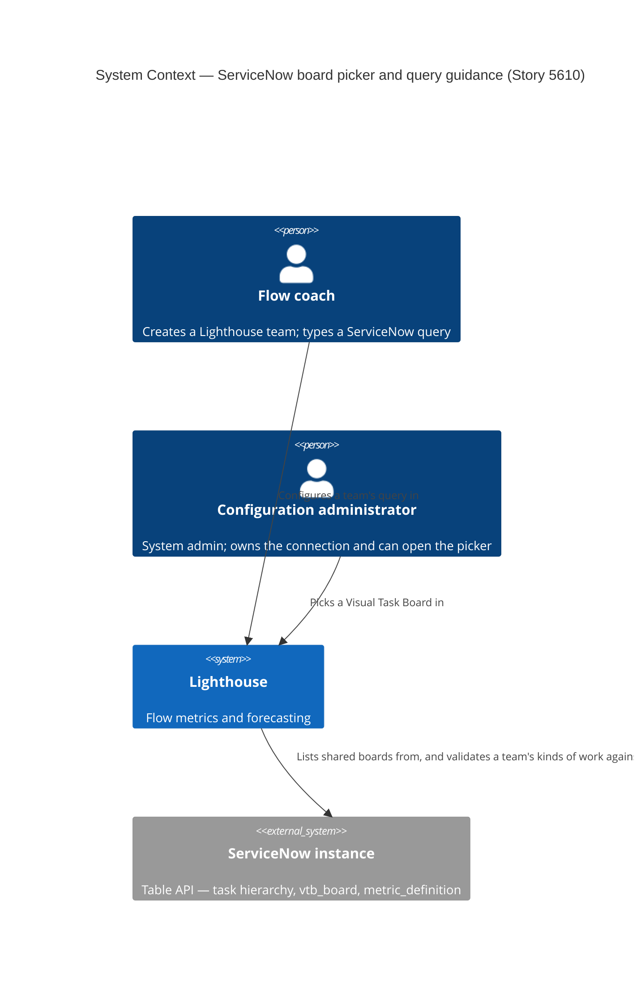
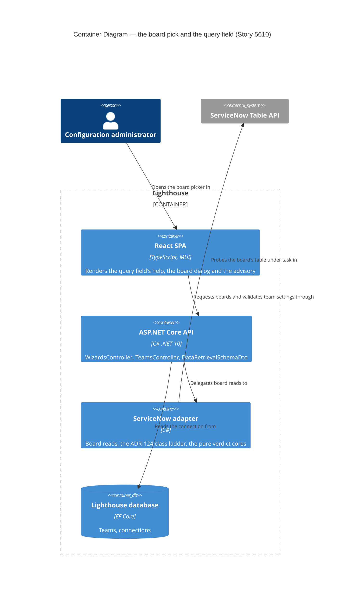

# ServiceNow: knowing what to type in the query field — feature delta

**ADO**: User Story [#5610](https://dev.azure.com/letpeoplework/Lighthouse/_workitems/edit/5610), parent Epic
[#5513](https://dev.azure.com/letpeoplework/Lighthouse/_workitems/edit/5513) (ServiceNow Integration).
**Waves recorded here**: DISCUSS (2026-07-31), SPIKE (2026-08-01 — `spike/findings.md`,
`spike/wave-decisions.md`).

**Why this file and not the epic's.** Same reason 5611 got its own workspace: epic 5513's
`feature-delta.md` is the record for slices 01–05 and is still being appended to (5578 is open, 5577
finalized on 2026-07-31). 5610 is a post-DESIGN story filed out of the slice-02 dogfood, not one of
the epic's slices. Sibling workspace:
`docs/feature/servicenow-multi-table-work-item-types/` (#5611), which this feature depends on.

---

## Wave: DISCUSS / [REF] Persona and job

**Primary persona**: `flow-coach` (`docs/product/personas/flow-coach.yaml`) — the person creating the
Lighthouse team, who is the one staring at the blank query field.
**Secondary**: `config-admin` — owns the connection, and is the only persona who can reach the board
picker at all (see OC-4).

**JTBD one-liner** — new SSOT job `job-snow-team-creator-author-a-query`:

> When I am pointing a Lighthouse team at ServiceNow work and the query field is blank, I want the
> product to tell me what a ServiceNow query is and where to get one — or hand me one from a board I
> already maintain — so I can finish creating the team instead of abandoning it.

Sits in front of `job-snow-flow-coach-see-flow-metrics` (epic 5513) rather than refining it. That job
is delivered and works; this one is the gate a user has to get through before any of it happens.

**Where the need came from**: maintainer dogfood of slice 02, 2026-07-29, recorded in
`docs/feature/epic-5513-servicenow-integration/feature-delta.md` (Dogfood findings, "#5610" row). The
connection wizard worked, a wrong password was caught, state mapping worked by typing labels — and
then team creation stopped dead at the query field. Nothing in the product says what a ServiceNow
query is, which fields exist, or where to get one, and ruling **R-2** makes a missing query a blocking
verdict. R-2 argued that a warning is dishonest when no warning channel renders it. It did not argue
that blocking without guidance is acceptable. This story is the missing third option.

---

## Wave: DISCUSS / [REF] Locked decisions

D-numbers are local to this feature. Epic 5513's own D1–D11 and 5611's D1–D7 are referenced by name.

| ID | Decision | Rationale |
|---|---|---|
| **D1** | Split 5610 into two slices: **in-product query guidance** first, **board picker** second. | The ADO body already calls the guidance half "cheap and independent" and it is the only half that reaches a non-admin (OC-4). It also ships without the SPIKE and without 5611, so the dogfood pain is answered even if the picker is disproven. Maintainer, 2026-07-31. |
| **D2** | The **docs prose** (ServiceNow's right-click breadcrumb → *Copy query* walkthrough) lands on **#5578**, not here. 5610 ships the in-product surface only. | There is no ServiceNow page under `docs/` at all today — `docs/concepts/worktrackingsystems/` has azuredevops, jira, linear, csv and nothing else. 5578 owns "ServiceNow docs". Two stories creating and then rewriting one new page is worse than one story writing it once. Maintainer, 2026-07-31. |
| **D3** | The guidance is carried by the **data-retrieval schema** as a new nullable field, rendered on the field that already exists — **not** hardcoded per connector inside the component. | `GeneralSettingsComponent.tsx:160-182` renders one `TextField` for every connector, labelled from `schema.displayLabel`. Branching on `systemType === "ServiceNow"` inside a shared component is the twin-drift anti-pattern pointing the other way. The schema is where connector knowledge already lives. |
| **D4** | The new schema field changes in **both twins** — `DataRetrievalSchemaDto.cs` and `DataRetrievalSchemaDefaults.ts` — and the #5613 exhaustiveness guard must still pass. | `docs/evolution/2026-07-30-bug-5613-schema-twin-drift.md`: this table is duplicated knowledge that already drifted once and shipped unsaveable ServiceNow teams. Same constraint 5611 D6 accepted. |
| **D5** | **`wizardHint` is not the vehicle.** It stays what it is (a wizard id) and a separate field carries the help text. | Measured, not assumed: `wizardHint` is declared in `IDataRetrievalSchema`, set for four connectors in both twins, asserted in `DataRetrievalSchemaDtoTest`, and **consumed by nothing in the frontend**. Overloading a dead field with a second meaning would make it harder to either use or delete. That it is dead is itself a finding — recorded, not fixed here. |
| **D6** | The board pre-fill rides **5611 slice 01** (class filter): the board's **table** becomes a `sys_class_name` value in **Work Item Types**, the board's **filter** becomes the **query**. | The ADO body says "pre-fill the team's table and query", and there is no team table to fill. Originally because ADR-116 put `Work Item Table` at *connection* scope and `Team` has no option bag (5611 D7); **now because the option is being removed altogether** — see the amendment below. Either way `BoardInformation` already carries `DataRetrievalValue` **and** `WorkItemTypes`, so the pre-fill needs zero contract change. Maintainer, 2026-07-31. |
| **D7** | ServiceNow implements the **existing** `IBoardInformationProvider` and joins the existing `WizardsController` switch. No new port, no new endpoint, no new dialog. | `GET /api/latest/wizards/{connId}/boards` and `/boards/{boardId}` already exist and are already generic; `BoardWizard.tsx` already serves Jira, ADO and Linear from one component through `DataRetrievalWizardRegistry.ts`. A ServiceNow picker is one provider implementation, one `switch` arm and one registry row. |
| **D8** | ServiceNow's `inputKind` stays **`freetext`**. Only `wizardHint` is set. | `GeneralSettingsComponent.tsx:126` computes `isDataRetrievalReadOnly = schema?.inputKind !== "freetext"`, so Linear's `wizard-select` makes the field read-only. The ADO body is explicit that manual entry stays the primary path and the pre-filled query must remain fully editable. Copying Linear's shape would silently contradict that. |
| **D9** | A board read that fails must **not** offer a pre-fill. | `BoardWizard.tsx:71-82` catches a failed `getBoardInformation` and substitutes an all-empty `IBoardInformation`, which is truthy, which enables **Confirm**, which overwrites whatever the user typed with blanks. Given OC-1's live risk that `vtb_board` is 403 for a least-privilege account, this is the epic's signature failure — quietly wrong beating visibly missing — wired up and waiting. Fixing it in the shared component fixes it for Jira, ADO and Linear too. **⚠ The sentence "overwrites whatever the user typed with blanks" is FALSE — corrected 2026-08-01, see the SPIKE amendment row for D9.** `GeneralSettingsComponent.tsx:59-95` guards every assignment on non-emptiness, so an all-empty payload writes **nothing**: Confirm succeeds and silently no-ops. Implement against the no-op, not against data loss. The decision itself is unchanged. |
| **D10** | A board whose membership cannot be expressed as a query is **excluded or refused by name**, never silently pre-filled with a partial query. | Freeform boards hold hand-placed `vtb_card` rows that no filter describes. Syncing "the filtered part of a freeform board" is a wrong number that looks right, which is the one outcome this epic exists to prevent. Which of exclude-from-list vs list-and-refuse is a DESIGN call, gated on OC-2. **Settled 2026-08-01 — see D14.** |
| **D14** | **Exclude at query time.** The board list is read as `active=true^tableISNOTEMPTY^filterISNOTEMPTY`; a board missing either is never listed. Maintainer, 2026-08-01, settling D10's open half. | The SPIKE measured that a freeform board stores empty `table` **and** empty `filter`, and that **no board-type column exists** — no `type` field on the record, `sys_class_name` empty on every row, one table with no subclasses. So "only data-driven boards" is not directly expressible; emptiness is the whole discriminator, and it is exactly the right one. **Both** fields must be non-empty, not just `table`: a board with a table and no filter is a real configuration ("all incidents") whose pre-fill is an empty query that `ValidateTeamSettings` then blocks with `query_matches_whole_table` — cheaper to exclude than to render and refuse. Guided vs data-driven is not separable on the record and does not need to be: Lighthouse copies the **filter**, which is live, not the card set, which drifts. |
| **D11** | **SPIKE first**, against PDI `dev191338`, **reusing 5611's probe accounts**. | The maintainer's call was "one combined probe run with 5611's OC-1/2/3". **Superseded within the hour: 5611's SPIKE landed first (`1c3cbf58c`) and settled all three of its open calls.** The intent survives the change — 5610's two board questions run on the same instance with the same scaffolding, against the accounts 5611 already created: `lh_probe_none` (no roles), `lh_probe_snc_read` (`sn_incident/change/request_read`, deliberately no `sn_problem_read`), `lh_probe_itil`, all sharing the admin password in `$ServiceNowLighthouseIntegrationTestToken`. So this is now a small standalone probe rather than a combined one, and it is cheaper than when the call was made. |
| **D12** | **No DESIGN wave for 5610 starts until #5611 is delivered.** Not merely slice 02 — the whole feature waits. | Maintainer, 2026-07-31. D6 makes the picker's entire pre-fill model a consumer of 5611's class filter, so designing against it while it is in flight designs against a moving target. 5611's SPIKE has since confirmed the model holds (`IN` over `^OR`, class names not labels), which removes the re-scope risk but not the gate: the field the picker fills does not exist until 5611 ships it. Slice 01's *content* does not depend on 5611, but it is held by the same gate for sequencing simplicity; it is small enough that waiting costs little. |
| **D13** | A board pick must not silently hand a team a **class that yields no time-in-state**. | 5611's SPIKE measured that stock `change_request` has **no state-tracking metric definition at all** — its two definitions sit on `approval` and `type` — so a change-request board can never produce state spans, whatever Lighthouse does. (The related `metric_definition`-is-empty-for-`table=task` finding is 5611's to carry: its class-scoped definition read is the repair, and it is no longer a *choice* a user makes now that every read is task-rooted.) A picker is the one moment the user is choosing a class, so it is the moment to say the choice costs time-in-state. Where it surfaces is a DESIGN call (OC-6); that it must surface is not. **Settled in DESIGN, and against this row's instinct**: the picker says **nothing** (ADR-127 decision 3 — it reaches only SystemAdmins, needs a `BoardInformation` contract change across four connectors, and is evaluated on a class list the user can still edit after Confirm). The screen the pick *lands on* says it instead, and that ships under **[#5627](https://dev.azure.com/letpeoplework/Lighthouse/_workitems/edit/5627)**, not here. So this feature ships a picker that is silent about time-in-state, with #5578's docs carrying the caveat until #5627 lands — named plainly because it is a real gap between what D13 promised and what #5610 delivers. |

---

## Wave: DISCUSS / [REF] Amendment — the connection-scope table is going away (2026-07-31)

Written hours after the decisions above, once #5611's delivery landed on local `main` and the
maintainer confirmed the direction. Recorded as an amendment rather than a rewrite, so the reasoning
that produced D6 stays legible.

**What changed.** `ServiceNowWorkTrackingOptionNames.WorkItemTable` — the connection-scope option
ADR-116 introduced — **is being removed**, and every ServiceNow read becomes `task`-rooted. Work in
progress on `main` at the time of writing; assume it lands.

Note the two commits on `main` read in the opposite order tell a confusing story, and only the later
one is current: `e466caaf8` cancels 5611's per-team-override slice *because* the table option was
removed, while `a84859b26` records that the removal was implemented and then **reverted before
commit**, killed by two PDI measurements — a `task`-rooted read has no `resolved_at` (the Table API
projects an extended record onto the addressed table's columns, and `sysparm_fields` does not recover
it), and `ORDERBYsys_created_on` is not a unique sort key, which lost a row across a page boundary.
**This amendment assumes those two are being solved on `main` as part of the removal.** They are not
5610's to solve, but if the removal stalls on them, D6 reverts to its original wording and nothing
else here moves.

**What it changes for 5610 — less than it looks:**

| | Effect |
|---|---|
| **D6** | Unaffected in substance, **strengthened** in rationale. With no table field anywhere, Work Item Types is not merely the *available* home for a board's table — it is the only one. |
| **OC-5** | **Dissolved and re-narrowed.** No configured table means no board-vs-connection mismatch. What survives is the smaller case of a board rooted outside the `task` hierarchy. |
| **D13 / OC-6** | **Re-aimed.** "The picker steers you into task-rooting" is no longer meaningful when everything is task-rooted. The residual is per-class and outside Lighthouse's reach: stock `change_request` has no state-tracking definition, so a change-request board yields no time-in-state however the read is scoped. OC-6 also got *harder*: 5611 withdrew the connection-validation advice about history rather than rewording it, so there is currently no channel to put this in — the R-2 lesson, again. |
| **Pre-requisite 1** | **Mostly satisfied already.** 5611 shipped `isWorkItemTypesRequired: true` unconditionally for a ServiceNow team (ADR-123 decision 6, amended 2026-07-31), asserted in both twins. The pre-fill target exists and is visible today. |
| **D12** | **Unchanged** — the maintainer's gate is on 5611 being *delivered*, not on any one mechanism, and the table removal is precisely the part still in flight. |
| Slices, stories, ACs, KPIs, WS strategy | **Unchanged.** No AC was written against the connection table. |

**What does not change and is worth saying plainly**: this makes the board picker *more* valuable, not
less. Removing the table option removes the last place a user could say "my work lives in
`change_request`" outside of Work Item Types — so the picker, which derives exactly that from a board
the user already maintains, becomes the shortest path to a correctly-scoped team rather than a
convenience on top of one.

---

## Wave: SPIKE / [REF] Amendment — what the board probe overturned (2026-08-01)

Evidence in `spike/findings.md`; promotion decision (**DISCARD**, per WS strategy C) in
`spike/wave-decisions.md`. Recorded as an amendment for the same reason as the one above: the
reasoning that produced D9, D10 and OC-1 should stay legible next to what replaced it.

**The gate lifted first.** #5611 is Closed, the connection-scope table is gone, `resolved_at` is
deliberately not read, and the paging guard now keys `sys_id` rather than `number`. The three things
the 2026-07-31 amendment said to *assume* all landed, so **D12 is discharged** and D6 stands as
strengthened.

| | What the probe measured | Effect |
|---|---|---|
| **OC-1** | **Settled — and the first answer was wrong.** `vtb_board` reads 200/0-rows for `itil`, `snc_read` and no-roles, which reads as the epic's third role wall. It is not one: the read ACL carries **no role** and runs `VTBBoardSecurity().canAccess(current)`. Adding `lh_probe_itil` to `vtb_board_member` turned 0 boards into the board, its 38 cards and its 6 lanes; deleting the row turned it back. Boards are **shared, not roled**. | **Slice 02 survives.** But the list is scoped to the connection's service account, so "no boards" must be worded as "this account is not a member of any board" — R-2's lesson on a new surface — and *share the board with the Lighthouse account* becomes an onboarding step for #5578 that Lighthouse cannot perform for itself. |
| **OC-2** | **Settled — no.** A board's cards are a snapshot behind its filter (`incident` 38/38, but `change_request` **7 cards against 13 matches**). Freeform boards store empty `table` **and** empty `filter`; there is **no board-type column** — no `type` field, `sys_class_name` empty on every row — so emptiness *is* the discriminator. | **D10 is settled by D14** (exclude at query time, both fields non-empty) **and AC-B6 gets corrected.** Refusal is decidable from the board row alone — no card-set inspection. AC-B6's "synced items are the board's items" was unsatisfiable and has been restated against the filter. |
| **OC-3** | **Settled, and the trap is sharper than assumed.** `filter` is a verbatim encoded query in **column** form (`correlation_id=LIGHTHOUSE_DEMO`). `readable_filter` is the label form and matches the **whole table** — 105/105 and 118/118. | Pre-fill `filter`, never `readable_filter`. The poisonous string is the one ServiceNow's own UI displays, so it is the one a careless implementation would reach for. Worth a named test. |
| **OC-7** | **Settled — yes.** Every 0-row board read returned `X-Total-Count: 2`. | ACL-blindness generalises beyond `incident` (ADR-124). The picker must never count boards from the header. |
| **OC-5** | A `cmdb_ci` board is creatable and returns nothing from a task-rooted read (`task?sys_class_name=cmdb_ci` → 0). | Refusal is required. This row originally added a constraint — `sys_db_object` is 403 below `itil` — which was **stale and is withdrawn** (corrected 2026-08-01; 5611's own findings measured 200 for three of four accounts and already flagged the epic matrix as drift). DESIGN settled OC-5 by reuse rather than by a new mechanism: the board's `table` is a candidate `sys_class_name`, so ADR-124's shipped readability ladder answers it — see **ADR-125** and the DESIGN sections below. |
| **D9** | Unchanged, and **promoted from tidy to load-bearing.** Every failure mode the probe found — not a member, freeform, wrong hierarchy — arrives at `BoardWizard.tsx:71-82` as a truthy all-empty `IBoardInformation` that enables Confirm. | **Corrected 2026-08-01**: the fix is the difference between a refusal and a **silent no-op**, not a blanked query. D9's "overwrites whatever the user typed with blanks" is false — `GeneralSettingsComponent.tsx:59-95` guards every assignment on non-emptiness, so an all-empty payload writes nothing. Still load-bearing, still lands for all four connectors, one rung less severe than stated. |
| **OC-4, OC-6** | Untouched by a probe — both settled in DESIGN. | **OC-6 correction, 2026-08-01**: the claim that "there is no channel at all" is **false**. `ConnectionValidationResult.Advisory`/`AdvisoryCode` ship (ADR-118 D5) and `ValidationAdvisory.tsx` renders them on both connection surfaces. The gap is the *team* leg — `TeamService.validateTeamSettings` collapses the response to `isValid === true`, dropping an advisory that rides a success. See **ADR-127**; OC-4 see **ADR-126**. |

**The claim this probe was called to disprove is disproven.**
`IServiceNowWorkTrackingConnector.cs:3-5` has asserted since `4b55362be` that ServiceNow *"has no
board concept"*. It has two, on a stock PDI, carrying a table and a verbatim encoded query. The
comment's second half (`sys_db_object` discovery is unavailable below `itil`, ADR-116) remains true and
does not support the first. Slice 02 must amend that xmldoc **and** the matching claim at
`DataRetrievalSchemaDefaults.ts:64`, or review will read them as authority against the slice.

---

## Wave: DISCUSS / [REF] Out of scope

- **The ServiceNow docs page** — D2, it is #5578's.
- **A per-team table override** — 5611 Story A, since **cancelled** (`e466caaf8`) because the
  connection-scope table is going away. D6 never needed it.
- **Field or table discovery** (offering a list of tables/columns to build a query from). SPIKE Q8
  measured `sys_db_object` 403 and `sys_dictionary` 200/EMPTY below `itil`: a discovery UI would work
  for the maintainer and show an empty list to every customer. ADR-116 already declined it.
- **A query builder.** The board picker borrows ServiceNow's own filter UI by reading its output;
  building a second one inside Lighthouse is a different product.
- **Widening `/api/latest/wizards/*` beyond SystemAdmin** — OC-4, pre-existing for all four connectors.
- **Portfolios.** Slice 03 cancelled; the ServiceNow portfolio schema is `inputKind: "none"`.
- **Write-back of any kind** — epic D8, still read-only.

---

## Wave: DISCUSS / [REF] Pre-requisites

1. **#5611 slice 01 (Work Item Types as record classes) must land before 5610 slice 02.** D6 pre-fills
   Work Item Types with a class name. **Now largely satisfied**: 5611 shipped that field as
   `isWorkItemTypesRequired: true` unconditionally for a ServiceNow team (ADR-123 decision 6, amended
   2026-07-31, asserted in both twins), so the pre-fill target already exists and is already visible.
   What remains is the table-removal work in flight on main. Slice 01 of *this* feature has no such
   dependency.
2. **The SPIKE (D11) must close OC-1 and OC-2.** Slice 02 is not buildable until it does. 5611's SPIKE
   (`1c3cbf58c`) already left the probe accounts and scaffolding in place, so this is a short run.
3. **Story 5577 landed and pushed** — done, `0e2e78340`. Code against
   `ServiceNowWorkTrackingConnector` is safe to touch again.
4. **The Bug #5613 schema-twin guard is in place** — shipped `cb5f0efb0`. D4 depends on it.
5. **A PDI board that a least-privilege account can be tested against.** The dogfood board observed
   was Table = `Incident`, Board Filter = `Correlation ID = LIGHTHOUSE_DEMO` — note that filter names
   the *label*; the column is `correlation_id`, and the label form silently matched all 103 incidents
   (epic slice-04 dogfood). Whether `vtb_board` stores the label or the column is OC-3.

---

## Wave: DISCUSS / [REF] Driving ports

| Surface | Change |
|---|---|
| `GET /api/latest/wizards/{connId}/boards` | Existing. `WizardsController.GetBoardInformationProviderForWorkTrackingSystem` gains a `WorkTrackingSystems.ServiceNow` arm; today it is `_ => throw new NotImplementedException`. |
| `GET /api/latest/wizards/{connId}/boards/{boardId}` | Existing. Returns `BoardInformation` with `DataRetrievalValue` = the board filter and `WorkItemTypes` = the board's table as a class name. |
| `GET /api/.../dataretrievalschema` (`DataRetrievalSchemaDto`) | The new help field (D3/D4), both twins. ServiceNow team row also gains `wizardHint`. |
| Team settings screen + Create Team wizard | `GeneralSettingsComponent.tsx` renders the help on the existing `TextField`; the wizard button comes from `DataRetrievalWizardRegistry.ts` with no component change (D7). |
| ServiceNow Table API (outbound) | New read of the Visual Task Board table(s). Exact table and columns are OC-3. |

---

## Wave: DISCUSS / [REF] User stories

### Story A — the query field says what to put in it

**As** a flow coach creating a Lighthouse team against ServiceNow,
**I want** the query field to tell me what it wants and show me an example,
**so that** I can fill it in instead of guessing, hitting the blocking verdict, and giving up.

`job_id: job-snow-team-creator-author-a-query`

#### Elevator Pitch
Before: the ServiceNow query field is an empty four-line box labelled "ServiceNow Query (Encoded Query)", and a wrong or missing query is refused with `query_matches_whole_table` — so the first real user's first experience of the connector is a blocked save with no instruction.
After: open **Create Team** → pick the ServiceNow connection → the query field shows the placeholder `active=true^assignment_group=Service Desk` and help text naming ServiceNow's own *right-click a filter breadcrumb → Copy query* path → paste → Save succeeds.
Decision enabled: whether this team's boundary is expressible as a ServiceNow filter at all — which the coach can now answer in their own instance in under a minute, instead of concluding Lighthouse is broken.

**AC-A1** — For a ServiceNow **team**, the query field renders a placeholder showing a real encoded
query and help text that names where to get one. The text is legible when the field is empty *and*
when it is filled.
**AC-A2** — The help text is supplied by the data-retrieval **schema**, not by a component branching on
connector type (D3). A connector with no help text renders exactly what it renders today — no layout
shift, no empty helper row.
**AC-A3** — The new schema field is present and consistent in **both** twins
(`DataRetrievalSchemaDto.cs`, `DataRetrievalSchemaDefaults.ts`), asserted on both stacks, and the
#5613 enum-exhaustiveness guard still passes (D4).
**AC-A4** — The help names the two silent-failure modes the SPIKE measured, in the coach's language:
an unknown **field name** is dropped and the query returns the whole table (which `ValidateTeamSettings`
then blocks with `query_matches_whole_table`), and a bad **value** silently returns nothing. This is
the one place a user can be warned before they hit either.
**AC-A5** — Both surfaces carry it: `ModifyTeamSettings` and `CreateTeamWizard`, which render through
the same `GeneralSettingsComponent`.
**AC-A6** — ServiceNow **portfolio** settings are unchanged. `inputKind` is `"none"` there and the
field is not rendered at all; no help appears for a surface that does not exist.

---

### Story B — pick a board you already maintain

**As** a configuration administrator whose ServiceNow instance already has Visual Task Boards,
**I want** to pick a board and have Lighthouse fill in the query and the kind of work from it,
**so that** I do not have to re-author in Lighthouse a filter my team already agreed on in ServiceNow.

`job_id: job-snow-team-creator-author-a-query`

#### Elevator Pitch
Before: a ServiceNow shop's team boundary already exists as a Visual Task Board — table plus board filter — and Lighthouse makes you retype it as an encoded query you have to go find first.
After: open **Create Team** → **Select ServiceNow Board** → pick *Service Desk — Open Incidents* → the dialog shows the filter and the record class it found → **Confirm** → the query field and Work Item Types are filled in, both still editable.
Decision enabled: whether the board the team already runs its stand-up from is the same boundary Lighthouse will forecast — visible side by side before saving, rather than discovered later from a throughput that looks off.

**AC-B1** — A ServiceNow connection offers a board picker in team settings and in the create-team
wizard, sourced from the existing `DataRetrievalWizardRegistry` and served by the existing
`/wizards/{connId}/boards` endpoints (D7). Portfolio context does not offer it.
**AC-B2** — Selecting a board pre-fills the **query** from the board's filter and **Work Item Types**
from the board's table, expressed as a `sys_class_name` value (D6). Both remain editable after
Confirm; `inputKind` stays `freetext` and the field never becomes read-only (D8).
**AC-B3** — A board read that fails — 403, unreachable, or a shape the parser does not recognise —
shows the reason and **cannot be confirmed**. It never substitutes an empty pre-fill over a query the
user already typed (D9). A 403 specifically says the account cannot read the board table, naming it,
rather than "Failed to load boards. Please try again."
**AC-B4** — A board whose membership is not expressible as a query is **absent from the list**: the
read is scoped `active=true^tableISNOTEMPTY^filterISNOTEMPTY`, so a freeform board (both empty) and a
table-without-filter board (which would pre-fill an empty query) never reach the user (D10, D14). A
board that *is* listed but cannot be turned into a pre-fill — a table outside the `task` hierarchy — is
refused by name with the reason stated.
**AC-B5** — The picker does not change the manual path. A team created by typing a query, with no
board involved, behaves exactly as it does today — including `ValidateTeamSettings`' blocking verdicts.
**AC-B6** — The pre-filled configuration is verified end-to-end against a real instance, not only
fixtures: pick a board on the PDI, save the team, and confirm the synced set equals **the board's
filter run against the board's table** — *not* the board's card set, which drifts behind its own
filter (SPIKE 2026-08-01: 7 cards against 13 matches on `change_request`). The epic's standing rule —
164 tests did not find what one manual run did.

---

## Wave: DISCUSS / [REF] Definition of Done

1. Both slices' ACs green, backend and frontend.
2. The new schema help field asserted on **both** stacks; the #5613 exhaustiveness guard still passes.
3. Mutation testing ≥ 80 % on the changed backend and frontend surface (project standing gate).
4. No new SonarCloud issues; `dotnet build` and `pnpm build` warning-free; Biome clean.
5. Verified against the PDI, not only against fixtures — a board picked, a team saved, its items
   synced (AC-B6).
6. Docs: the in-product help text is reviewed against what #5578's page will say, so the two do not
   contradict each other. Screenshot only if the settings screen visibly changes — it does, so the
   `@screenshot` E2E for team settings is re-run and the PNG deleted first (the <0.5 % diff trap).
7. A dogfood moment on the same day each slice lands — by the person who hit the original wall.
8. Epic 5513's `feature-delta.md` gets a back-reference to this file once #5578 is not mid-append.
9. ADO #5610 transitioned; Release Notes tag decided with the maintainer.

---

## Wave: DISCUSS / [REF] Open calls

**Status after the SPIKE (2026-08-01)**: OC-1, OC-2, OC-3 and OC-7 are **settled** — see the SPIKE
amendment above and `spike/findings.md`. The rows below are left as written so the questions stay
legible next to their answers. **OC-4, OC-5 and OC-6 remain open**; OC-5 acquired a new constraint.

| ID | Question | Why it is open | Settle by |
|---|---|---|---|
| **OC-1** | Is the Visual Task Board table readable by a **least-privilege** account (`sn_incident_read` and siblings), or does it need `itil`/admin? | This epic has been bitten twice. `sys_choice` was measured admin-only and killed `ServiceNowChoiceLabelResolver` outright (R-4); `metric_instance` is 403 for every read-only role and cost slice 04 an `itil` escalation. A picker that works for the maintainer and 403s for every customer is the same failure a third time. Measure it the way `spike/findings.md` measured the rest: the same read as no-roles / `snc_read_only` / `sn_*_read` / `itil` / `admin`, and **treat 200/EMPTY as a denial**, not an empty instance. | SPIKE, before DESIGN. |
| **OC-2** | Can every board's membership be expressed as a query? | Freeform boards hold hand-placed `vtb_card` rows that no filter describes. Probe: create or find a freeform board and a filtered/guided board, and compare each board's card set against running its stored filter. If they diverge, D10 applies and board support covers filtered boards only — said out loud, not discovered from a wrong throughput. | SPIKE, before DESIGN. |
| **OC-3** | Which columns carry the table and the filter, and is the stored filter a verbatim encoded query? | The dogfood board showed Board Filter = `Correlation ID = LIGHTHOUSE_DEMO` — a **label**, and the slice-04 dogfood proved `sysparm_query` matches the stored value, not the label (`correlation_id` is the column, and the label form silently matched all 103 incidents). If boards store the label form, pre-filling it verbatim ships the exact query that slice 01's widening guard exists to catch. | SPIKE, before DESIGN. |
| **OC-4** | `WizardsController` is `[RbacGuard(RbacGuardRequirement.SystemAdmin)]`, while creating a team is `CanCreateTeam`. So a user who may create a team may not be able to use the picker. | Pre-existing and identical for Jira, ADO and Linear, so 5610 is not the place to change it — but it is the reason Story A is ordered first and is not optional: it is the only half that reaches the persona who actually hits the blank field. Decide whether to widen the guard, or to state the constraint in #5578's docs. | Maintainer, before slice 02 DESIGN. |
| **OC-5** | ~~Does the board's table always sit under the connection's configured table?~~ **Narrowed, 2026-07-31**: what happens to a board rooted **outside** the `task` hierarchy? | The original question dissolves with the connection-scope table (see amendment): every read is task-rooted, so any task-descendant class a board names is reachable and no mismatch is possible. What survives is the outside case — a board on `cmdb_ci`, `sys_user`, or an Agile 2.0 `rm_story`. `sys_class_name` cannot express it from a `task` root, so the picker must refuse by name rather than pre-fill a class that returns nothing. Still needs a stated behaviour, on a smaller surface. | DESIGN. |
| **OC-6** | Where does a user learn that the board they picked yields **no time-in-state**? | D13. Slice 04 built a connection-validation notice for history being unavailable (ADR-118 D-04-3), but 5611 **withdrew** the advice it used to give rather than rewording it (`e466caaf8`), and parked the replacement against #5612 as probably out of MVP scope. So today there is no channel at all, which makes this the same shape as ruling R-2: do not choose to warn without checking the reader exists. Either the picker says it at pick time, or nobody does. | DESIGN. |
| **OC-7** | Does the board's stored filter suffer the same ACL blindness as `X-Total-Count`? | 5611's SPIKE found `X-Total-Count` is **ACL-blind** — a no-roles account gets header=103 / body=0 on `incident` — which is both a pre-existing defect in `ValidateTeamSettings`' widening detector and, usefully, a denial detector. If the board list or a board's card count comes back through a similarly blind counter, the picker could show a board it cannot actually read. Worth one read during the SPIKE while the probe accounts are up. | SPIKE, with OC-1. |

---

## Wave: DISCUSS / [REF] Recorded, not fixed here

- **`wizardHint` is dead weight.** Declared in `IDataRetrievalSchema` and `DataRetrievalSchemaDto`,
  populated for four connectors across both twins, asserted in `DataRetrievalSchemaDtoTest` — and read
  by no frontend code. The wizard button is driven entirely by `DataRetrievalWizardRegistry.ts`
  matching on `WorkTrackingSystemType`. Slice 02 sets it for ServiceNow for consistency with the other
  four, but nothing depends on it. Candidate for deletion; belongs in a cleanup, not here (D5).
- **`BoardWizard`'s empty-fallback affects all four connectors**, not just ServiceNow. D9 fixes it in
  the shared component, so the fix lands for Jira, ADO and Linear at the same time — noted so the
  blast radius is not a surprise at review.

---

## Wave: DISCUSS / [REF] WS strategy

**C — no walking skeleton.** Brownfield, on a connector that has shipped four slices. Both driving
ports (`/wizards/*`, the settings screen) already exist end to end for three other connectors; there
is no unproven path to skeleton. The unproven parts are ServiceNow-instance facts, and those are
answered by the SPIKE (D11), which is the right instrument for them.

---

## Wave: DISCUSS / [REF] Scope Assessment: PASS

2 stories, 2 slices, 1 bounded context (work-tracking connectors), ~1 day each. No oversized signal
fires. Slice 01 ships with no dependency on the SPIKE or on 5611, so a failed SPIKE costs one slice.

---

## Wave: DISCUSS / [REF] Slices and prioritization

Briefs in `slices/`. Order per D1: guidance first.

| # | Slice | Ships | Learning hypothesis |
|---|---|---|---|
| 01 | Query-authoring guidance in the product | A coach facing the blank query field is told what to type and where to get it | Disproves "the wall was ignorance, not absence" if a guided coach still cannot author a query that passes `ValidateTeamSettings` — which would mean the encoded-query concept itself is the barrier and the picker is not optional but mandatory |
| 02 | Pick a Visual Task Board to pre-fill query + class | An admin turns an existing board into a configured team | Disproves D6/D7 if boards are unreadable below `itil` (OC-1) or if board membership is not a query (OC-2). Either outcome cancels the slice loudly and leaves slice 01 as the whole answer |

**Prioritization rationale.** Slice 01 first on three counts, not one: it is the only half that reaches
`CanCreateTeam` users (OC-4); its content depends on neither the SPIKE nor 5611, so it is the cheapest
thing to start with the moment D12's gate lifts; and if slice 02 is later cancelled by OC-1 or OC-2,
the dogfood finding is still answered. Slice 02 second because every open call rides on it and it is
hard-blocked twice over.

**Both slices sit behind D12**: nothing here enters DESIGN until #5611 is delivered. The SPIKE (D11) is
the only work that can run before that gate, and it should — it is a probe, not a design, and its
answers may cancel slice 02 outright.

---

## Wave: DISCUSS / [REF] Outcome KPIs

| KPI | Target | How measured |
|---|---|---|
| Team creation reaches a saved team on the first attempt | The dogfood repeat of the original 2026-07-29 walkthrough completes without leaving the product to look anything up | Same maintainer, same instance, timed; recorded in the slice-01 dogfood note |
| `query_matches_whole_table` refusals seen during dogfood | 0 on the guided path | Slice-01 dogfood; a non-zero count means AC-A4's wording failed, not that the guard is wrong |
| Board pick → saved team, clicks | ≤ 4 from the create-team wizard (open picker, choose, confirm, save) | Counted during the slice-02 dogfood |
| Board pre-fill accuracy | The synced item set equals the board's card set on a filtered board | AC-B6, verified against the PDI |
| Least-privilege reach of the picker | Stated, not assumed — a measured verdict for `sn_*_read` in the SPIKE findings | OC-1; a 403 is a legitimate result that cancels slice 02, and the number that matters is that it was measured before build, not after |

---

## Wave: DISCUSS / [REF] DoR validation

| # | Item | Evidence |
|---|---|---|
| 1 | Business value stated | Job `job-snow-team-creator-author-a-query`; the epic's first real user was blocked within minutes. |
| 2 | Persona identified | `flow-coach` primary, `config-admin` secondary — split deliberately, per OC-4. |
| 3 | Job traceability | Both stories carry `job_id`. No `infrastructure-only` story in this feature. |
| 4 | Acceptance criteria testable | AC-A1..A6, AC-B1..B6; each names a surface and an observable outcome. |
| 5 | Elevator pitch per story | Both stories; both "After" lines name a real UI action and a visible result. |
| 6 | Effort honestly estimated | ≤1 day each — slice 02 only because the picker port already exists (D7). Contingent on the SPIKE having been paid for separately. |
| 7 | Dependencies named | #5611's delivery, the SPIKE, #5613's guard, #5578 for docs. |
| 8 | Open questions recorded rather than assumed | OC-1..OC-7, each with a named settle-by. |
| 9 | Out-of-scope explicit | Listed above, each with a reason. |

Requirements completeness: **0.96** — the residual is OC-3 and OC-5, both of which change slice 02's
DESIGN shape and neither of which changes what the slices are for.

---

## Wave: DESIGN / [REF] Prior Wave Consultation

Run 2026-08-01, propose mode, scope = application/components, density = lean.

| | Artifact |
|---|---|
| ✓ | `docs/feature/servicenow-board-picker-and-query-guidance/feature-delta.md` (DISCUSS + SPIKE, D1–D14, AC-A1..A6 / AC-B1..B6, OC-1..OC-7) |
| ✓ | `docs/feature/servicenow-board-picker-and-query-guidance/spike/findings.md` |
| ✓ | `docs/feature/servicenow-board-picker-and-query-guidance/spike/wave-decisions.md` |
| ✓ | `docs/feature/servicenow-board-picker-and-query-guidance/slices/slice-01-query-authoring-guidance.md` |
| ✓ | `docs/feature/servicenow-board-picker-and-query-guidance/slices/slice-02-visual-task-board-picker.md` |
| ✓ | `docs/feature/servicenow-multi-table-work-item-types/feature-delta.md` (#5611) |
| ✓ | `docs/feature/servicenow-multi-table-work-item-types/spike/findings.md` (#5611 — **overturns a premise this feature carries**, see below) |
| ✓ | `docs/product/architecture/brief.md` (`map` + targeted reads; 4121 lines, not read whole) |
| ✓ | `docs/product/architecture/adr-114`, `adr-116`, `adr-118`, `adr-123`, `adr-124` |
| ⊘ | `docs/product/outcomes/registry.yaml` — **does not exist in this repo** (`docs/product/outcomes/` is absent entirely). The Outcome Collision Check is **skipped**, explicitly, not silently. |

**Three findings from the codebase that contradict the upstream record.** Each is carried into an ADR
rather than left for a reviewer to trip over:

1. **`sys_db_object` is not 403 below `itil`.** `spike/findings.md` and `wave-decisions.md` both state
   it is, and OC-5's whole framing rests on that. 5611's own post-DESIGN addendum measured it at
   **200 for three of the four probe accounts** (403 only for `lh_probe_none`, which can read nothing
   at all). The conclusion — do not build on it — survives, for 5611's better reason. **ADR-125.**
2. **D9's failure mode is a silent no-op, not a data loss.** D9 says a truthy all-empty
   `IBoardInformation` "overwrites whatever the user typed with blanks". It does not:
   `GeneralSettingsComponent.tsx:59-95` writes each field only when the incoming value is non-empty,
   so an all-empty payload writes nothing. Confirm succeeds and does nothing. The fix is unchanged;
   the justification has to be true or a reviewer will disprove it in one manual test. **ADR-126.**
3. **The advisory channel exists and has a live reader — on the wrong surface.** OC-6 says "there is
   no channel at all". `ConnectionValidationResult.Advisory`/`AdvisoryCode` ship,
   `ValidationAdvisory.tsx` ships and is tested, and both *connection* surfaces render it. The single
   missing link is `TeamService.validateTeamSettings`, which collapses the whole 200 body to
   `response.data.isValid === true`. Failure verdicts do reach the user (400 → `ApiError` →
   `validationError`); only an advisory riding a success is dropped. **ADR-127.**

Two smaller drifts, recorded and not acted on: `brief.md` (5611 section) still describes
`ServiceNowTableHierarchy` and `CapabilityOf` as surviving in one place — both are **gone** from the
backend; and `ServiceNowRecordClassTest.cs` has no `ServiceNowRecordClass` production type.

---

## Wave: DESIGN / [REF] DDD decision list

Not a domain-modelling feature; recorded so the omissions are explicit rather than implicit.

| Question | Answer |
|---|---|
| New bounded context? | **No.** Work-tracking connectors, the same context epic 5513 has occupied for five slices. |
| New aggregate / entity? | **No.** `Board` and `BoardInformation` are DTOs on the driving side, not aggregates. `Team` is untouched — no new column, no migration. |
| Ubiquitous language additions | **Visual Task Board** (a `vtb_board` row), **board filter** (the `filter` column, column-form encoded query), **board table** (the `table` column, read as a candidate `sys_class_name`), **board membership** (`vtb_board_member`, the thing that actually grants read access). Note the language does **not** gain "readable filter" — ADR-125 decision 2 refuses to carry it. |
| Domain events? | **No.** Nothing here changes state; both new operations are reads on a driving port. |
| ES / CQRS? | **N/A** — no writes. |

---

## Wave: DESIGN / [REF] Locked design decisions

`DD-` numbers are local to DESIGN. Full argument and rejected alternatives in the ADRs.

| ID | Decision | Where |
|---|---|---|
| **DD-1** | ServiceNow implements the **existing** `IBoardInformationProvider`; one `WizardsController` switch arm; one `DataRetrievalWizardRegistry.ts` row (`servicenow.board`, `["team"]`, `BoardWizard`). `Board`/`BoardInformation` unchanged. `inputKind` stays `freetext`. | ADR-125 D1 |
| **DD-2** | `DataRetrievalValue` ← `filter`, verbatim. **`readable_filter` is never read, stored or displayed** — not even as a caption. The whole-table bug is made non-representable rather than tested around. | ADR-125 D2 |
| **DD-3** | The list read is `vtb_board?sysparm_query=active=true^tableISNOTEMPTY^filterISNOTEMPTY`, no `sysparm_fields`, counted from the **body** and never from `X-Total-Count`. `GetBoardInformation` re-applies the same scoping on its single-board read instead of trusting the list. | ADR-125 D3 |
| **DD-4** | **OC-5 settled**: the board's `table` is validated by the **shipped** ADR-124 two-probe ladder (`WhyThisKindOfWorkCannotBeRead`). A `cmdb_ci` board is refused as `class_is_not_a_kind_of_work`, in words already written. Both SPIKE candidates rejected; no static hierarchy list is re-introduced. | ADR-125 D4 |
| **DD-5** | Slice 01's schema field is **two** nullable strings — `placeholder` and `helpText` — not one. AC-A1 asks for a placeholder showing a real query *and* text legible when the field is filled; those are two MUI props and two lifetimes. Both twins, both null for every connector but the ServiceNow **team** row. | below |
| **DD-6** | A failed board read throws a `WorkTrackingReadException` carrying a `ConnectionValidationResult`; `WizardsController` answers `BadRequest(verdict)`; `BoardWizard` renders `error.message` and cannot be confirmed. Fixes D9 for Jira, ADO and Linear too. | ADR-126 D1–D2 |
| **DD-7** | An empty board list is a **`200` with a message**, not ADR-114's `no_records_visible` failure. Copy names both causes and asserts neither. Interception lives in a new pure `ServiceNowBoardVerdict`; every other rung of `FromResponse` is called through. | ADR-126 D3 |
| **DD-8** | **OC-4 settled**: `/wizards/*` stays `SystemAdmin` (widening is DISCUSS-out-of-scope). `GeneralSettingsComponent` gates the wizard buttons on `useRbac().isSystemAdmin`, so the button stops lying — for all four connectors. `AnyScopedAdmin` recorded as the live widening option for a separate story. | ADR-126 D4 |
| **DD-9** | **OC-6 settled as design, delivery split out.** The advisory is reported by `ValidateTeamSettings` on a **success**, and the team surfaces render the existing `ValidationAdvisory`. The picker says nothing. **Ships under [#5627](https://dev.azure.com/letpeoplework/Lighthouse/_workitems/edit/5627), not here** (maintainer, 2026-08-01): decision 3 severs the advisory from the picker, so it shares no code with slice 02 and bundling it would only enlarge the slice. Rows 15, 16, 24 and 25 of the Reuse table belong to #5627. Until it ships, #5578's docs carry the caveat. | ADR-127 |
| **DD-10** | **No C4 L3.** Two new methods, one IO boundary, one purity line. A component diagram would restate the container diagram at a smaller font. | below |

### DD-5 in full — the two new schema fields

```
DataRetrievalSchemaDto.cs   →  public string? Placeholder { get; set; }
                               public string? HelpText { get; set; }
DataRetrievalSchema.ts      →  placeholder: string | null;
                               helpText: string | null;
```

- **Nullable, defaulting to null**, exactly like the existing `wizardHint`. Set only on
  `ForTeam(ServiceNow)` / `teamSchemas.ServiceNow`; `null` on all nine other rows and on the two
  `defaultSchema` fallbacks.
- **AC-A2's "no layout shift, no empty helper row" is satisfied structurally, not by CSS.** MUI's
  `TextField` renders the helper `<p>` only when `helperText` is truthy and renders no placeholder
  attribute for `undefined`, so a connector with no help produces byte-identical markup to today.
  Passing `schema?.helpText ?? undefined` is the whole change at `GeneralSettingsComponent.tsx:160-182`.
- **Two fields, not one**, because the placeholder disappears the moment the field has content and
  AC-A1 requires the text to be legible *when it is filled*. Folding the example into the helper text
  would satisfy the second half and drop the first.
- **Not `wizardHint`** (D5) — it is a wizard id, it is dead, and overloading it makes it harder to
  either use or delete.
- **Both twins move together**; `DataRetrievalSchemaDtoTest.cs` is extended before the DTO is edited,
  per the project's shared-contract rule, and the #5613 enum-exhaustiveness guard keeps passing
  because no `WorkTrackingSystemType` arm is added or removed.
- ServiceNow team copy carries the three things AC-A1/AC-A4 name: what an encoded query is, a worked
  example (`active=true^assignment_group=Service Desk`), and the two silent-failure modes — an unknown
  **field name** is dropped and the query widens to the whole table; a bad **value** on a real field
  matches nothing. Wording is reviewed against #5578's page before it ships (DoD 6).

---

## Wave: DESIGN / [REF] Component decomposition

**Backend** (`Lighthouse.Backend/Services/…`)

| Component | Role | Contract shape |
|---|---|---|
| `ServiceNowWorkTrackingConnector` | Imperative shell. Gains `GetBoards` / `GetBoardInformation`; both are reads over HTTP with no local state | bounded-change: no writes anywhere; `observedAvailability` is the only mutable field and neither board method touches it |
| `ServiceNowBoardVerdict` | **New pure core.** Board-list and board-read outcomes → `ConnectionValidationResult` or "empty list", calling `ServiceNowValidationVerdict.FromResponse` through for every rung but one | pure-function (return-only) |
| `ServiceNowBoardMapper` | **New pure core.** One `vtb_board` row → `Board`; one row → `BoardInformation`. Reads `sys_id`, `name`, `table`, `filter` via the existing `ServiceNowWorkItemMapper.ReadForm` (internal), so the four-shape defensive parsing is reused rather than re-derived. **Does not know `readable_filter` exists** | pure-function (return-only) |
| `WorkTrackingReadException` | **New.** Abstract, carries a `ConnectionValidationResult`. `ServiceNowReadException` derives from it. Lets the controller catch a refusal without naming a ServiceNow type | — |
| `WizardsController` | Gains one `switch` arm and one `catch` | driving port, read-only by construction |
| `IServiceNowWorkTrackingConnector` | `: IWorkTrackingConnector, IBoardInformationProvider`; the stale xmldoc at `:3-5` is amended | — |

**Frontend** (`Lighthouse.Frontend/src/…`)

| Component | Role |
|---|---|
| `DataRetrievalWizardRegistry.ts` | One row |
| `BoardWizard.tsx` | Empty-fallback deleted; renders the refusal message; empty list gets its own copy |
| `GeneralSettingsComponent.tsx` | `placeholder` + `helperText` from the schema; wizard buttons gated on `useRbac().isSystemAdmin` |
| `DataRetrievalSchema.ts` / `DataRetrievalSchemaDefaults.ts` | Two new nullable fields; the stale "no wizard" comment at `:64` amended |
| `TeamService.ts`, `useModifySettings.ts`, `useCreateWizard.ts`, `ModifyTeamSettings.tsx`, `CreateTeamWizard.tsx` | ADR-127 only — carry the verdict instead of a boolean, render `ValidationAdvisory` |

---

## Wave: DESIGN / [REF] Driving ports

| Surface | Change |
|---|---|
| `GET /api/latest/wizards/{connId}/boards` | **Existing.** New ServiceNow arm. `200` + `[]` for an empty list; `400` + `ConnectionValidationResult` for every refusal rung. Guard unchanged (`SystemAdmin`) |
| `GET /api/latest/wizards/{connId}/boards/{boardId}` | **Existing.** `BoardInformation` with `DataRetrievalValue` = the board filter, `WorkItemTypes` = `[table]`; `400` + verdict when the ladder refuses |
| `GET /api/.../dataretrievalschema` | Two new nullable fields on `DataRetrievalSchemaDto` (DD-5) |
| `POST /api/latest/teams/validate` | **Existing.** ADR-127 only: a valid result may now carry `advisory` + `advisoryCode`. The 400 shape is unchanged |
| Team settings screen + Create Team wizard | Placeholder + helper text; RBAC-gated wizard button; advisory rendering (ADR-127) |

Both new operations are **reads**. `IBoardInformationProvider` exposes only `Get*`, so the
"driving ports that only read must not expose write methods" rule holds without splitting anything.

---

## Wave: DESIGN / [REF] Driven ports and adapters

| Dependency | Adapter | Reads |
|---|---|---|
| ServiceNow Table API — `vtb_board` | `ServiceNowWorkTrackingConnector` via the existing `ReadEveryPage` | `sys_id`, `name`, `table`, `filter` (whole row; **no `sysparm_fields`**, per ADR-114's rule that projection was never measured against ACL row filtering) |
| ServiceNow Table API — `task?sys_class_name={table}` and `/{table}` | the existing `WhyThisKindOfWorkCannotBeRead` | one row + `X-Total-Count` each |
| ServiceNow Table API — `metric_definition` | the existing `ReadStateSpanDefinitions` | ADR-127 only, at Save |

`ReadEveryPage` is reused **unchanged**: its `sysparm_display_value=all` page parameters, its
`^ORDERBYsys_created_on^ORDERBYsys_id` total order, its repeated-record guard and its
`WhenRefused.Fail` policy all apply to `vtb_board` as written.

### Earned Trust — what the picker proves rather than assumes

`vtb_board` is a substrate that has already been measured lying twice (ACL-blind counter; denial as
`200`). Four standing assertions in `ServiceNowWorkTrackingConnectorIntegrationTest`, beside 5611's
class ladder, each exercising a specific lie:

| Assertion | The lie it catches |
|---|---|
| `filter` run as `sysparm_query` selects a **proper subset** of the board's table | the filter stopped being column-form |
| `readable_filter` run the same way selects the **whole table** | the trap stopped being a trap, or somebody started reading it |
| `X-Total-Count` on `vtb_board` reports rows the account cannot see | the counter became ACL-aware and the "never count from the header" rule quietly became wrong |
| a non-member's board read is `200`-with-zero-rows, never `403` | the access model changed from sharing to roles, which would move the empty-list copy from honest to false |

---

## Wave: DESIGN / [REF] Technology choices

**None.** No new library, no new service, no new storage, no new protocol. Every dependency is one
this connector already carries (`HttpClient` + `System.Text.Json` backend, MUI + axios frontend), and
every new type is a plain class in an existing assembly. Nothing proprietary is introduced, so the
OSS-preference check is vacuously satisfied and is recorded as such rather than skipped.

---

## Wave: DESIGN / [REF] Reuse Analysis (HARD GATE)

Run against the codebase at HEAD, 2026-08-01. **Net: 3 CREATE NEW · 13 EXTEND · 12 REUSE UNCHANGED**
(28 rows; two of the EXTENDs are test fixtures).

| # | Component | Path | Verdict | Evidence |
|---|---|---|---|---|
| 1 | `IBoardInformationProvider` | `Services/Interfaces/WorkTrackingConnectors/` | **REUSE UNCHANGED** | `GetBoards` + `GetBoardInformation` already serve three connectors; ServiceNow adds an implementer, not a member |
| 2 | `Board`, `BoardInformation` | `…/WorkTrackingConnectors/Boards/` | **REUSE UNCHANGED** | `DataRetrievalValue` and `WorkItemTypes` are exactly the two pre-fill targets (D6). Zero contract change |
| 3 | `WizardsController` | `API/` | **EXTEND** | 60 lines; one `switch` arm replacing a fall-through `NotImplementedException`, one `catch` |
| 4 | `IServiceNowWorkTrackingConnector` | `Services/Interfaces/…` | **EXTEND** | add `IBoardInformationProvider`; amend the xmldoc at `:3-5` that asserts the opposite |
| 5 | `ServiceNowWorkTrackingConnector` | `…/ServiceNow/` | **EXTEND** | shell only — two read methods composed from existing private helpers |
| 6 | `ReadEveryPage` + paging guards | inside #5 | **REUSE UNCHANGED** | signature `(connection, table, query, whenRefused)` fits `vtb_board` as written; total order and repeat guard apply unchanged |
| 7 | `WhyThisKindOfWorkCannotBeRead` (ADR-124 ladder) | inside #5 | **REUSE UNCHANGED** | this **is** OC-5's answer. A board's `table` is a candidate class; the ladder already separates *misspelt* / *not work* / *empty* / *invisible* |
| 8 | `ServiceNowValidationVerdict` | `…/ServiceNow/` | **REUSE UNCHANGED** | `FromResponse` supplies the 401/400/403/non-JSON rungs for `vtb_board`. Called through, never copied |
| 9 | `ServiceNowTeamQueryVerdict` | `…/ServiceNow/` | **REUSE UNCHANGED** | `class_is_not_a_kind_of_work` already names `cmdb_ci` and `sys_user`. Written for a typed class, exactly as true for a board's |
| 10 | `ServiceNowWorkItemMapper.ReadForm` | `…/ServiceNow/` | **REUSE UNCHANGED** | `internal static`, already handles absent / null / bare-scalar / non-string. The board mapper calls it rather than re-deriving four-shape parsing |
| 11 | `ServiceNowReadException` | `…/ServiceNow/` | **EXTEND** | derives from the new base; already wraps a `ConnectionValidationResult` and exposes `Code` |
| 12 | `WorkTrackingReadException` | `…/WorkTrackingConnectors/` | **CREATE NEW** | ~12 lines. Justified: the controller sits on the driving side of the port and must not name a ServiceNow type to catch a refusal. No existing base carries a verdict |
| 13 | `ServiceNowBoardVerdict` | `…/ServiceNow/` | **CREATE NEW** | pure. Justified: the one rung the board list must **not** inherit (`no_records_visible` as a Failure) is a decision, and decisions live in a pure core with a purity fixture (ADR-114 convention). No existing verdict class answers about a list |
| 14 | `ServiceNowBoardMapper` | `…/ServiceNow/` | **CREATE NEW** | pure. Justified: `ServiceNowWorkItemMapper` maps a *work record* to a `WorkItem`; a board row to a `Board` is a different translation with a different vocabulary, and folding it in would put `readable_filter`'s column name inside the class that maps work |
| 15 | `ConnectionValidationResult` | `Models/Validation/` | **REUSE UNCHANGED** | `Advisory`, `AdvisoryCode`, `SuccessWith` all ship (ADR-118 D5). ADR-127 adds a caller, not a field — **#5627** |
| 16 | `ServiceNowHistoryVerdict` / `ServiceNowHistoryQuery` | `…/ServiceNow/` | **EXTEND** | ADR-127 only: one advisory factory. The coverage computation in `From` is used as-is — **#5627** |
| 17 | `DataRetrievalSchemaDto` | `API/DTO/` | **EXTEND** | two nullable fields; no `WorkTrackingSystemType` arm added or removed, so the #5613 guard is unaffected |
| 18 | `DataRetrievalSchema.ts` / `DataRetrievalSchemaDefaults.ts` | `models/Common/` | **EXTEND** | twin of #17; the "No wizard" comment at `:64` is amended |
| 19 | `DataRetrievalWizardRegistry.ts` | `components/DataRetrievalWizards/` | **EXTEND** | one row, pointing at the same `BoardWizard` the other three use |
| 20 | `BoardWizard.tsx` | same | **EXTEND** | delete the empty fallback, render the reason, add the empty-list copy. Serves all four connectors |
| 21 | `BoardInformationDisplay` | `components/DataRetrieval/` | **REUSE UNCHANGED** | already renders `dataRetrievalValue` + `workItemTypes`, which is the whole ServiceNow pre-fill |
| 22 | `GeneralSettingsComponent.tsx` | `components/Common/BaseSettings/` | **EXTEND** | placeholder + helper text (DD-5); RBAC gate on the wizard buttons (DD-8). `handleWizardComplete`'s non-empty guards stay exactly as written |
| 23 | `useRbac` | `hooks/` | **REUSE UNCHANGED** | already exposes `isSystemAdmin`; a predicate, not a new fetch |
| 24 | `ValidationAdvisory.tsx` | `components/Common/Connections/` | **REUSE UNCHANGED** | ADR-127's reader, already built and tested; needs a second mounting point, not a change — **#5627** |
| 25 | `TeamService.ts` · `useModifySettings` · `useCreateWizard` · `ModifyTeamSettings` · `CreateTeamWizard` | `services/`, `hooks/`, `components/` | **EXTEND** | ADR-127 only: carry the verdict instead of `boolean`. Shared contract — extend `MockApiServiceProvider` first — **#5627** |
| 26 | `ServiceNowWorkTrackingConnectorIntegrationTest` | `…Tests/…/ServiceNow/` | **EXTEND (test)** | four substrate assertions added to the fixture 5611 established. Not a new fixture |
| 27 | `ServiceNowValidationVerdictPurityArchUnitTest` | `…Tests/Architecture/` | **EXTEND (test)** | widened to `ServiceNowBoardVerdict` and `ServiceNowBoardMapper` |
| 28 | `wizardHint` | both twins | **REUSE UNCHANGED (set, not read)** | D5 — set for ServiceNow for consistency with the other four; nothing consumes it. Deletion belongs in a cleanup |

Nothing in the feature creates a component that an existing one could have carried. The three
CREATEs are one layering fix and two pure cores that the ADR-114 purity convention requires to be
separate classes; no alternative home existed for any of them.

---

## Wave: DESIGN / [REF] C4

### System Context (L1)



### Container (L2)



### Component (L3) — **deliberately omitted**

Two new read methods, one IO boundary, one purity line, and no branching a container diagram does not
already imply. An L3 here would restate the container diagram at a smaller font. Recorded as a
decision (DD-10), not as an oversight.

---

## Wave: DESIGN / [REF] Open questions carried into DISTILL

| # | Question | Why it is not blocking |
|---|---|---|
| **DQ-1** | ~~Does the maintainer accept ADR-127, or the named fallback?~~ **Answered 2026-08-01: accepted as design, delivery moved to [#5627](https://dev.azure.com/letpeoplework/Lighthouse/_workitems/edit/5627).** | Nothing in this feature depends on it — ADR-125 and ADR-126 stand alone. Reuse rows 15, 16, 24 and 25 move to #5627 with it, and #5578's docs carry the caveat meanwhile. One objection is open against ADR-127 decision 1 (the advisory repeats on every Save for a cause the user cannot act on); settle it there, not here. |
| **DQ-2** | Do `vtb_board`'s `table` and `filter` arrive as `{display_value, value}` under `sysparm_display_value=all`, or as bare scalars? | `ReadForm` handles both shapes by construction (that is what it was written for), so the mapper is correct either way. Worth one assertion in the integration fixture to record which it is. |
| **DQ-3** | Should `active=true` be part of the list scoping, or should inactive boards be listed and refused? | D14 settled `active=true`. Recorded because an admin who deactivates a board and then cannot find it in the picker gets no explanation — the empty-list copy does not name inactivity as a third cause. Cheapest repair if it bites: add it to the copy. |
| **DQ-4** | Does hiding the wizard buttons from `CanCreateTeam` users need release-note wording? | ADR-126 says yes; the wording is a DELIVER concern. Three connectors' users lose a button that never worked for them. |
| **DQ-5** | Does the ADR-124 ladder's `class_records_not_visible` rung read well when the subject is a board rather than a typed class? | The message says "this account was shown none of them", which is true either way. If it reads oddly at dogfood, it is one string, in a pure function, with a table-driven test. |
| **DQ-6** | Is one extra ServiceNow request per Save (ADR-127) acceptable on a slow instance? | Measured at ~600 ms per call with no rate limiting (epic SPIKE Q7). Save already costs 1–2 probes per class plus 2 counts; this is +1 on a path where a human is waiting. **Now #5627's question, not this feature's.** |

---

## Wave: DISTILL / [REF] Inputs read

Scope: **both slices**. Density lean, Tier-1 only. Consolidated four-reviewer gate **not run** —
deferred by instruction; the maintainer reviews before reviewers are dispatched.

| Artifact | |
|---|---|
| `feature-delta.md` — DISCUSS (D1–D14, AC-A1…A6, AC-B1…B6, DoD, KPIs, OC-1…OC-7), the two amendments, DESIGN (DD-1…DD-10, component decomposition, ports, Reuse Analysis, C4, DQ-1…DQ-6) | ✓ read in full |
| `spike/findings.md` — including the **Corrections** table, which is authoritative over the body | ✓ |
| `spike/wave-decisions.md` — promotion decision **DISCARD** | ✓ |
| `slices/slice-01-query-authoring-guidance.md` · `slices/slice-02-visual-task-board-picker.md` | ✓ |
| `docs/product/architecture/adr-125` · `adr-126` | ✓ both in full |
| `docs/product/architecture/adr-114` · `adr-118` · `adr-123` · `adr-124` (constraints reused) | ✓ targeted reads |
| `docs/architecture/atdd-infrastructure-policy.md` — the Project Infrastructure Policy, already populated, `--policy=inherit` | ✓ |
| `docs/ci-learnings.md` — ledger patterns + the preflight rules that bind test code (CA1859, CA1861, NUnit2045/2046/2056/4002, S107, S927, S1944, S3776) | ✓ |
| `docs/product/journeys/servicenow-board-picker-and-query-guidance.yaml` | ✓ — **exists**; both journeys and every step map onto the scenarios below |
| `docs/product/kpi-contracts.yaml` | ✓ — no ServiceNow entry. This feature's KPIs are dogfood measurements recorded in DISCUSS, not emittable metrics, so no `@kpi` scenario is authored |
| Production: `WizardsController.cs` · `IBoardInformationProvider.cs` · `Board.cs` · `BoardInformation.cs` · `ServiceNowWorkTrackingConnector.cs` · `ServiceNowValidationVerdict.cs` · `ServiceNowTeamQueryVerdict.cs` · `ServiceNowReadException.cs` · `DataRetrievalSchemaDto.cs` · `GeneralSettingsComponent.tsx` · `BoardWizard.tsx` · `DataRetrievalWizardRegistry.ts` · `DataRetrievalSchema.ts` · `DataRetrievalSchemaDefaults.ts` · `useRbac.ts` · `ApiError.ts` | ✓ |
| Neighbouring tests: `ServiceNowRecordClassTest.cs` · `ServiceNowWorkTrackingConnectorIntegrationTest.cs` · `ServiceNowConnectionAcceptanceTest.cs` · `DataRetrievalSchemaDtoTest.cs` · `WizardsControllerTest.cs` · `ServiceNowValidationVerdictPurityArchUnitTest.cs` · `BoardWizard.test.tsx` · `DataRetrievalWizardRegistry.test.ts` · `GeneralSettingsComponent.test.tsx` · `DataRetrievalSchemaDefaults.serviceNow.test.ts` · `formatLikelihood.enforcement.test.ts` | ✓ |
| `docs/product/outcomes/registry.yaml` | ⊘ **does not exist in this repo** (`docs/product/outcomes/` is absent entirely). Outcome registration is **skipped, explicitly** — the same call DESIGN recorded |
| `docs/feature/{...}/{discuss,design,devops}/` subdirectories | ⊘ **do not exist for this feature** — single-narrative layout; the whole chain lives in `feature-delta.md` plus `slices/` and `spike/`. DEVOPS was never run, and neither slice implies an infrastructure change |
| `.nwave/des-config.json` | ✓ — no `deliverable_type` key, so it resolves to **`application`**: no plugin validator, no skill reviewer, standard verification |

### Wave-decision reconciliation: 0 contradictions

There are no per-wave `wave-decisions.md` files, so the gate was run against the actual decision sets:
DISCUSS **D1–D14**, the SPIKE **Corrections** table, and DESIGN **DD-1…DD-10**. Every DISCUSS decision
was checked against DESIGN and against the SPIKE.

Three apparent conflicts were checked and are **resolutions, not contradictions** — each is dated,
each says what it replaces, and the later statement is the one the tests are written against:

| Looks like a conflict | Why it is not |
|---|---|
| D9 says a failed board read *"overwrites whatever the user typed with blanks"*; the SPIKE Corrections table and ADR-126's Context say it writes **nothing** | Corrected upstream, in place, with the evidence (`GeneralSettingsComponent.tsx:59-95` guards every assignment on non-emptiness). The fix is unchanged; the justification changed. Scenarios assert the **silent no-op** — a refusal wearing a success costume — never data loss |
| D10 leaves *"excluded or refused by name"* open; D14 settles it as exclude-at-query-time | D14 explicitly settles D10's open half and is dated later |
| OC-6 says *"there is no channel at all"*; DESIGN finds the channel ships, and DD-9 splits its delivery to **#5627** | Recorded as a DESIGN finding against the upstream record, then scoped out. No scenario in this run touches `TeamService.validateTeamSettings`, `ValidationAdvisory`, or Reuse rows 15, 16, 24 and 25 |

One decision could **not** be turned into a test and is recorded under Upstream issues below rather
than guessed at: the `wizardHint` value slice 02 is to set.

---

## Wave: DISTILL / [REF] WS strategy

**C — no walking skeleton**, inherited unchanged from DISCUSS and reinforced by the SPIKE's
**DISCARD** promotion decision. Provenance: `## Wave: DISCUSS / [REF] WS strategy` (brownfield; both
driving ports already run end to end for three other connectors) and `spike/wave-decisions.md`
(*"the reason not to skeleton is stronger after the run than before it"*). No scenario is tagged
`@walking_skeleton`, and none was authored to satisfy a checklist.

What stands in its place: scenarios 24 and 25 exercise the real HTTP driving adapter through the
production DI container against a deterministically unreachable instance — the layer-5 device the
epic's slice 01 already established. That is driving-adapter coverage, and it is labelled as such
rather than dressed up as a skeleton.

---

## Wave: DISTILL / [REF] Scenario list

**37 scenarios.** Language: **C# / NUnit 4.6 + Moq** (backend) and **Vitest + React Testing Library**
(frontend) — this repo's conventions per `CLAUDE.md` and the ATDD Infrastructure Policy. **No Gherkin
feature files**: the repo ships no BDD runner, and the ServiceNow suites carry the domain language in
the test name and the comment above it. That is the convention #5611 and the epic's slices follow,
and this run follows it rather than introducing a second one. Python-pilot machinery is **N/A** — see
the last section.

### Slice 01 — the query field says what to put in it

| # | Scenario | AC / decision | Layer | Tags |
|---|---|---|---|---|
| 1 | A ServiceNow team's query field shows a worked example of the query it wants | AC-A1 / DD-5 | 1 | `@driving_port` |
| 2 | …and names both ways a query fails quietly, and where to get a good one | AC-A4 | 1 | `@driving_port` `@error` |
| 3 | A connector with nothing to explain leaves its query field exactly as it was (×4 connectors) | AC-A2 | 1 | `@driving_port` `@backward-compat` |
| 4 | A ServiceNow portfolio is offered no guidance for a field it never renders | AC-A6 | 1 | `@driving_port` `@boundary` `@backward-compat` |
| 5 | The settings screen's schema shows a worked example of the query it wants | AC-A1 / AC-A3 | 1 | `@frontend` |
| 6 | …and names both silent failures, and where ServiceNow hands you a good query | AC-A4 | 1 | `@frontend` `@error` |
| 7 | …and offers no guidance for a portfolio field it never renders | AC-A6 | 1 | `@frontend` `@boundary` `@backward-compat` |
| 8 | Both stacks show the same worked example (×2 stacks) | AC-A3 / D4 | structural | `@enforcement` `@cross-stack` |
| 9 | Both stacks carry the help text beside it (×2 stacks) | AC-A3 / AC-A4 / D4 | structural | `@enforcement` `@cross-stack` |
| 10 | The query field shows the example in the empty box and the guidance beneath it | AC-A1 / AC-A5 | 1 | `@frontend` |
| 11 | A connector with nothing to explain renders exactly the markup it renders today | AC-A2 | 1 | `@frontend` `@backward-compat` |

### Slice 02 — pick a Visual Task Board

| # | Scenario | AC / decision | Layer | Tags |
|---|---|---|---|---|
| 12 | A ServiceNow connection can be asked for the boards it already maintains | DD-1 / ADR-125 §1 | 3 | `@driving_port` |
| 13 | An administrator opening the picker sees the boards this connection can turn into a team | AC-B1 | 3 | `@driving_port` |
| 14 | A board that cannot become a query never reaches the administrator | AC-B4 / D14 / ADR-125 §3 | 3 | `@driving_port` `@boundary` |
| 15 | Picking a board hands the team the board's own filter as its query | AC-B2 / DD-2 | 3 | `@driving_port` |
| 16 | Picking a board hands the team the board's table as the kind of work it handles | AC-B2 / D6 | 3 | `@driving_port` |
| 17 | Picking a board never hands over the filter as it reads on the ServiceNow screen | DD-2 / ADR-125 §2 | 3 | `@driving_port` `@boundary` |
| 18 | Picking a board that no longer qualifies is refused rather than handed over as an empty query | ADR-125 §3 | 3 | `@driving_port` `@error` |
| 19 | Picking a board whose work is not a kind of work is refused by name | AC-B4 / DD-4 / ADR-124 | 3 | `@driving_port` `@error` |
| 20 | An account that may not read boards is told so rather than shown an empty picker | AC-B3 / ADR-126 §1 | 3 | `@driving_port` `@error` |
| 21 | A credential the instance rejects is told so when the picker opens | AC-B3 / ADR-126 §3 | 3 | `@driving_port` `@error` |
| 22 | An account that shares no board is offered an empty list rather than told the connection is broken | DD-7 / ADR-126 §3 | 3 | `@driving_port` `@boundary` |
| 23 | A team whose query was typed by hand is saved without the instance being asked about boards | AC-B5 | 3 | `@driving_port` `@backward-compat` |
| 24 | An administrator asking a ServiceNow connection for its boards is told why, rather than shown a fault | AC-B1 / AC-B3 / DD-1 / DD-6 | 5 | `@driving_adapter` `@real-stack` `@error` |
| 25 | …and asking for one board of an unreachable instance is told why rather than offered a blank pre-fill | AC-B3 / DD-6 | 5 | `@driving_adapter` `@real-stack` `@error` |
| 26 | The board picker's decisions live in pure cores of their own | ADR-125 / ADR-126 §3 / ADR-114 | structural | `@architecture` |
| 27 | Picking a ServiceNow board is offered to a team | AC-B1 / DD-1 | 1 | `@frontend` |
| 28 | …and is not offered to a portfolio | AC-B1 | 1 | `@frontend` `@boundary` |
| 29 | The dialog shows the reason the board list was refused | AC-B3 / ADR-126 §2 | 1 | `@frontend` `@error` |
| 30 | …and names both reasons a connection may have no board to offer | DD-7 / ADR-126 §3 | 1 | `@frontend` `@boundary` |
| 31 | …and cannot be confirmed when the board could not be read | AC-B3 / D9 / ADR-126 §2 | 1 | `@frontend` `@error` |
| 32 | A board picker is offered to a system administrator | DD-8 / ADR-126 §4 | 1 | `@frontend` |
| 33 | …and not to someone who cannot open it | DD-8 / ADR-126 §4 | 1 | `@frontend` `@error` |
| 34 | A board's own filter selects less work than the whole table it runs against | Earned Trust 1 / AC-B6 | 4 | `@real-io` `@adapter-integration` `@requires_external` |
| 35 | The filter as it reads on screen selects the whole table | Earned Trust 2 | 4 | `@real-io` `@adapter-integration` `@requires_external` |
| 36 | An account that shares no board is answered with an empty success whose count still names every board | Earned Trust 3 + 4 | 4 | `@real-io` `@adapter-integration` `@requires_external` |
| 37 | A board picked on the instance pre-fills the work its own filter selects | AC-B6 | 4 | `@real-io` `@adapter-integration` `@requires_external` |

**Error / edge share: 18 of 37 (49 %)**, plus 6 backward-compatibility pins.

**Every AC is covered.** AC-A1 → 1, 5, 10. AC-A2 → 3, 11. AC-A3 → 5, 6, 8, 9. AC-A4 → 2, 6, 9.
AC-A5 → 10. AC-A6 → 4, 7. AC-B1 → 13, 24, 27, 28. AC-B2 → 15, 16, 17. AC-B3 → 20, 21, 24, 25, 29, 31.
AC-B4 → 14, 19. AC-B5 → 23. AC-B6 → 34, 37. Plus DD-1 → 12, 24, 27; DD-7 → 22, 30; DD-8 → 32, 33;
Earned Trust → 34–36; the ADR-114 purity convention → 26.

**Both journey arcs are covered end to end.** `fill-in-the-query-field-without-leaving-the-product`:
step-meet-the-field → 1, 5, 10; step-be-warned-before-the-guard → 2, 6; step-save-past-the-guard → 23.
`lift-the-configuration-out-of-a-board-you-already-maintain`: step-open-the-picker → 13, 24, 27, 32;
step-see-what-was-found-before-committing → 29, 31; step-pre-fill-two-fields-that-already-exist →
15, 16, 37; step-meet-an-honest-refusal → 14, 17, 18, 19, 20, 21, 22, 30.

**No new E2E spec.** Playwright here is a thin sanity check driven from seeded demo data; there is no
demo ServiceNow instance, the picker needs a live `vtb_board`, and both driving ports are already
covered at layers 3–5. A spec would mean re-seeding to reach a page that is already reachable. The
`@screenshot` team-settings specs **will** need re-running at DELIVER, because the query field gains a
placeholder and a helper row — DoD item 6, and delete the PNG first (the <0.5 % diff trap).

---

## Wave: DISTILL / [REF] Test placement

| Where | Why |
|---|---|
| `Lighthouse.Backend.Tests/…/ServiceNow/ServiceNowBoardPickerTest.cs` — **new fixture** | One file per concern is this folder's convention: `ServiceNowTeamSyncTest` (paging + the query verdict), `ServiceNowTransitionHistoryTest` (slice 04's reads), `ServiceNowRecordClassTest` (#5611's classes). Boards are a fifth concern with their own stub shape. The stub honours the board scoping the instance applies, so a connector that asks for every board gets every board back rather than a passing test |
| `ServiceNowConnectionAcceptanceTest.cs` — **extended** | The layer-5 fixture the epic already uses for "driven the way the administrator drives it", and it already owns the unreachable-instance device. A second acceptance fixture would split one driving adapter across two files |
| `DataRetrievalSchemaDtoTest.cs` — **extended** | The C# half of the twin story, and the home of the #5613 exhaustiveness guard. Keeping both in one file is what makes a future reader see them together — the reason #5611 gave |
| `ServiceNowWorkTrackingConnectorIntegrationTest.cs` — **extended, not forked** | DESIGN Reuse row 26 says so explicitly, and ADR-125's Earned Trust section names the fixture. The live-PDI fixture #5611 established |
| `ServiceNowValidationVerdictPurityArchUnitTest.cs` — **extended** | DESIGN Reuse row 27. The two new pure cores join the three the ladder already covers |
| `WizardsControllerTest.cs` — **deliberately not extended** | The controller-level claims (the switch arm, `BadRequest(verdict)`) cannot be stated there without naming `WorkTrackingReadException`, which does not exist, or a constructor parameter that does not exist — either is a compile error, which is BROKEN rather than RED. Scenarios 24 and 25 make the same claims one layer out, through the real route, where they compile against today's code |
| `Lighthouse.Frontend/src/models/Common/DataRetrievalSchemaDefaults.serviceNow.test.ts` — **extended** | Already "the ServiceNow settings screen expressed as data" |
| `Lighthouse.Frontend/src/models/Common/serviceNowQueryGuidance.enforcement.test.ts` — **new** | AC-A3 / D4. `formatLikelihood.enforcement.test.ts` is the *pattern*, not a host: merging them would make one invariant's failure read as the other's. It reads both twins as **source text** rather than importing either, which is what turns "the field does not exist yet" into a named containment failure instead of a module-resolution error |
| `BoardWizard.test.tsx` · `DataRetrievalWizardRegistry.test.ts` · `GeneralSettingsComponent.test.tsx` — **extended** | All three are shared by four connectors, and DD-6 / DD-7 / DD-8 change all four. The tests belong beside the existing ones so the blast radius is visible in one place |

---

## Wave: DISTILL / [REF] Adapter and driving-port coverage

| Driven adapter | Real-I/O scenario | Covered by |
|---|---|---|
| ServiceNow Table API — `vtb_board` list | YES | 36 (live), 13/14/20/21/22 (stubbed transport over the real adapter code path) |
| ServiceNow Table API — `vtb_board` single row | YES | 37 (live), 15/16/17/18 (stubbed) |
| ServiceNow Table API — the ADR-124 class ladder probes | YES | 34/37 (live), 19 (stubbed), plus #5611's existing live ladder |
| ServiceNow Table API — a board's filter run as a query | YES | 34, 35, 37 (live) — the pair ADR-125 asks to be kept as a standing guard |
| Credential application | reused unchanged | existing live fixture |
| Persistence (EF) | not touched — both new operations are reads, no migration | — |

| Driving port | Scenarios |
|---|---|
| `GET /api/latest/wizards/{connId}/boards` | 24 (real route), 13, 14, 20, 21, 22 (through `IBoardInformationProvider`) |
| `GET /api/latest/wizards/{connId}/boards/{boardId}` | 25 (real route), 15–19, 37 |
| `ValidateTeamSettings` (`PUT /api/teams/{id}`) | 23 |
| `DataRetrievalSchemaDto.ForTeam` / `ForPortfolio` (`GET .../dataretrievalschema`) | 1–4 |
| `getDefaultTeamSchema` / `getDefaultPortfolioSchema` (settings screen + create wizard) | 5–7 |
| `GeneralSettingsComponent` (both surfaces render through it) | 10, 11, 32, 33 |
| `BoardWizard` (the dialog itself) | 29, 30, 31 |

No CLI and no hook in either slice. Both HTTP routes already exist and are exercised through the real
ASP.NET host in 24 and 25 — the driving-adapter requirement is met without a walking skeleton.

---

## Wave: DISTILL / [REF] Scaffolds and skip markers

Three scaffold edits, all inert, all forced by the compiler rather than chosen. The first attempt
reached the board port through a cast so that no production code would move; `TreatWarningsAsErrors`
turned Sonar **S1944** (*"no type that extends `ServiceNowWorkTrackingConnector` and implements
`IBoardInformationProvider`"*) into a build failure. Full reasoning in `distill/red-classification.md`.

| Scaffold | Inert because |
|---|---|
| `DataRetrievalSchemaDto.Placeholder` / `.HelpText` — two nullable properties, default `null` | `null` is today's behaviour exactly: MUI renders no placeholder attribute and no helper row for an absent value. The payload gains two nulls the frontend interface does not declare |
| `IServiceNowWorkTrackingConnector : …, IBoardInformationProvider`, plus the amended xmldoc | The xmldoc asserted *"ServiceNow has no board concept"* and became false with the interface, so ADR-125's required amendment lands in the same edit rather than as deferred work |
| `ServiceNowWorkTrackingConnector.GetBoards` / `.GetBoardInformation` returning empty | **Unreachable from the API** — `WizardsController`'s switch still has no ServiceNow arm, which is what scenarios 24 and 25 observe as a `500`. The commit that makes the scaffold reachable is the commit that un-skips the tests |

31 tests carry a skip marker and un-skip in DELIVER:

- **C#** — `[Ignore("DISTILL scaffold for #5610 - un-skip in DELIVER (ADR-025).")]` × 15, plus a longer
  reason on the 4 live-PDI tests that were compiled but never executed against the instance.
- **TypeScript** — `describe.skip` × 2 blocks and `it.skip` × 6, 12 tests in all.

`grep -rn "DISTILL scaffold for #5610"` finds every skip marker and the two stub scaffolds — 29
occurrences; zero should remain at the end of DELIVER. The interface amendment is deliberately
**unmarked**: it is the permanent change ADR-125 requires, not a stub to be removed.

Eight test methods (eleven cases) are **not** skipped. They are absence claims — AC-A2 and AC-A6 on
both stacks, AC-B1's portfolio half, AC-B5, DD-8's administrator half, DD-1's port membership — that
pass on `main` today and exist to fail the moment the behaviour they pin changes.

Gate state: `dotnet build` 0 warnings / 0 errors · `dotnet test` (ServiceNow + schema + wizards
filter) 309 passed, 19 skipped, 0 failed · `pnpm test` 3 821 passed, 12 skipped, 0 failed ·
`pnpm exec tsc -b` exit 0 · `pnpm biome check ./src` clean.

---

## Wave: DISTILL / [REF] Pre-requisites and upstream issues

### Pre-requisites carried into DELIVER

1. **The PDI must be reachable and its boards intact.** Scenarios 34–37 need `dev191338` (or the
   override in `$ServiceNowLighthouseIntegrationTestInstance`), the shared password in
   `$ServiceNowLighthouseIntegrationTestToken`, and at least one board carrying **both** a table and a
   filter that the `admin` account can see. The SPIKE left the instance as it found it, so the two
   demo boards should still be there — but `vtb_board_member` is empty, which means the picker shows
   the admin account its own boards and nobody else's.
2. **Three existing assertions become false when DELIVER lands the changes**, named here so nobody
   treats them as regressions: `DataRetrievalWizardRegistry.test.ts` asserts `dataRetrievalWizards`
   has length **4** (becomes 5); `DataRetrievalSchemaDtoTest.ForTeam_ServiceNow_HasNoWizardHint` and
   the frontend `offers no discovery wizard…` both assert `wizardHint` is null (see U-1 below).
3. **DEVOPS was never run for this feature**, and neither slice implies an infrastructure change. The
   default environment matrix applies unchanged.

### Upstream issues — things DESIGN or DISCUSS left untestable as written

| # | Issue | What DISTILL did |
|---|---|---|
| **U-1** | **The `wizardHint` value for ServiceNow is unspecified.** The slice-02 brief and Reuse row 28 say it is *"set for consistency with the other four, though nothing reads it"*; DD-1 and ADR-125 §1 do not mention it at all; and the four existing values follow no derivable pattern (`jira-team-wizard` against the registry id `jira.board`). A stray mock at `ModifyTeamSettings.test.tsx:510` already uses `servicenow-team-wizard`, which is a fixture, not a decision | **No scenario pins a literal** — guessing one would ship a value nobody chose. Two shipped assertions say it is `null` and will need replacing. **Maintainer call before DELIVER**: set it (and to what), or leave it null and delete the line from the slice brief |
| **U-2** | **The guidance copy itself is unwritten.** DD-5 names the worked example verbatim, but the help text is described only by what it must contain | Scenarios 2, 6 and 9 assert the three load-bearing tokens (`whole table`, `nothing`, `Copy query`) rather than a sentence. DoD item 6 already requires the wording be reviewed against #5578's page. **DELIVER writes the sentence; the tests already say what it must say** |
| **U-3** | **The journey SSOT still carries the disproven D9 claim.** `docs/product/journeys/servicenow-board-picker-and-query-guidance.yaml`, step `step-see-what-was-found-before-committing`, says the all-empty pre-fill *"would overwrite a typed query with blanks"*. The SPIKE Corrections table and ADR-126 disproved that on 2026-08-01; the journey was not updated with them | Scenario 31 and the replaced `BoardWizard` test assert the **silent no-op**. One line to fix in the SSOT — recorded rather than edited here, because a DISTILL run amending a DISCUSS-owned SSOT file without the maintainer is how records drift |
| **U-4** | **ADR-126 §3's empty-list copy is a paragraph, and paragraphs get edited.** | Scenario 30 asserts two phrases from it — *"not a member of any Visual Task Board"* and *"both a table and a filter"* — rather than the whole string, so a wording pass does not red the test while a dropped cause does. If the maintainer changes either phrase, the test is the thing to update, not the copy |
| **U-5** | **DQ-3's third cause is still unnamed.** `active=true` is part of the list scoping, so an administrator who deactivates a board and then cannot find it in the picker gets no explanation — the empty-list copy names two causes, and inactivity is a third | Scenario 14 pins the exclusion; nothing pins the explanation, because DESIGN chose not to give one. Cheapest repair if it bites at dogfood is one clause in the copy |

### Python-pilot machinery declared N/A

The ATDD Infrastructure Policy already records that this is a C#/.NET + React/TypeScript project and
not the Python/Hypothesis pilot. Per item, for the record:

| Instrument | Status |
|---|---|
| `tests/common/state_delta.*` and `assert_state_delta(before, after, universe, expected)` (Mandate 8) | **N/A** — no Python port exists or is wanted; the C#/TS matrix rows govern. Backend ATs are black-box example-based through `WebApplicationFactory<Program>` or a stubbed transport, and the universe guard has no host-language equivalent in this repo |
| Hypothesis / PBT `@given`, `RuleBasedStateMachine`, Tier B (Mandates 9, 10) | **N/A** — no PBT library is in either stack. Every scenario here is example-based, which is what Mandates 9 and 11 would require at layers 3–5 anyway. Neither journey is ≥3 chained scenarios over a domain-rich input space, so Tier B would not apply even with the machinery |
| `__SCAFFOLD__` Python stubs (Mandate 7) | **N/A in form, honoured in substance** — the three scaffolds carry `// DISTILL scaffold for #5610`, the greppable marker this repo already uses (`grep -rn "DISTILL scaffold for #5611"` is the precedent) |
| `domain_types.py` and the step-reuse ratio (Mandate 12, all four criteria) | **N/A** — there is no step-definition layer to measure. The repo has no BDD runner; the "DSL" is the test method name, and both type systems already carry the domain nouns (`WorkTrackingSystems`, `WorkTrackingSystemType`, `ConnectionValidationResult`). No ratio is fabricated |
| `docs/product/outcomes/registry.yaml` (`nwave-ai outcomes register`) | **Skipped explicitly** — neither the file nor its directory exists in this repo. No OUT-N row was invented |
| Final Wave Review Gate (four parallel reviewers) | **Not run — pending**, by instruction. The maintainer reviews before reviewers are dispatched |

