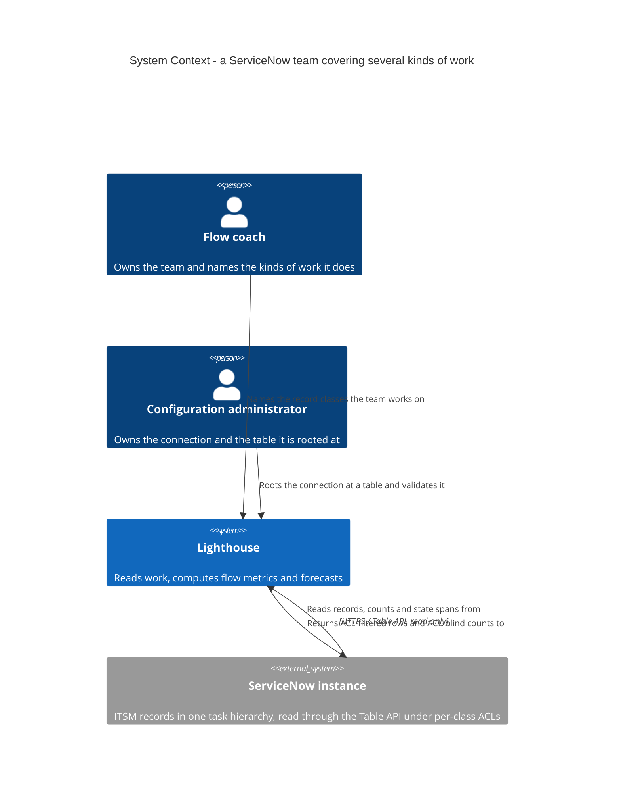
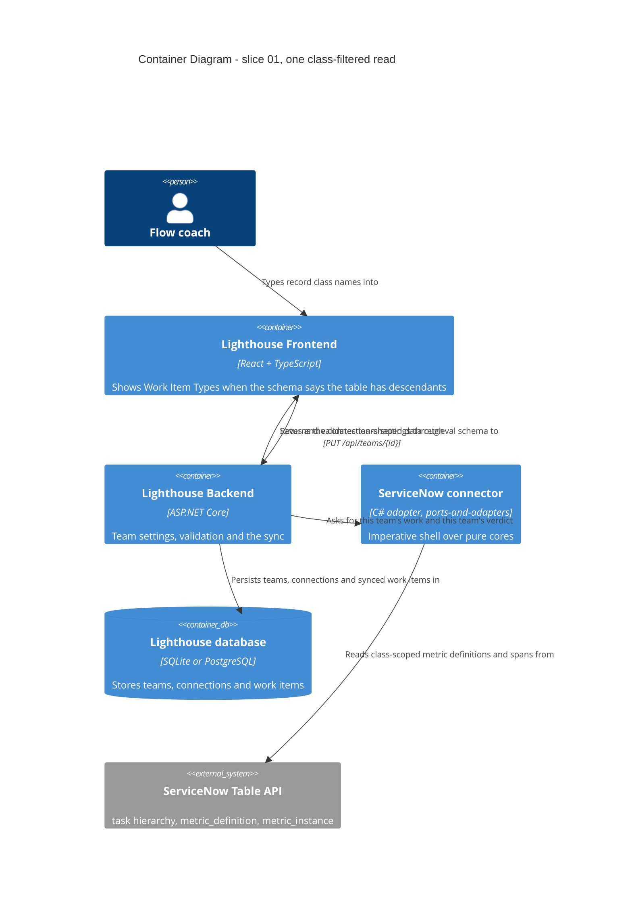

# ServiceNow: several kinds of work on one team — feature delta

**ADO**: User Story [#5611](https://dev.azure.com/letpeoplework/Lighthouse/_workitems/edit/5611), parent Epic
[#5513](https://dev.azure.com/letpeoplework/Lighthouse/_workitems/edit/5513) (ServiceNow Integration).
**Waves recorded here**: DISCUSS (2026-07-31).

**Why this file and not the epic's.** Epic 5513's `feature-delta.md` is being appended to by the
parallel finalization of Story 5577 (slice 04, transition history). 5611 is a post-DESIGN story filed
out of the slice-02 dogfood, not one of the epic's slices 01–05, so it gets its own workspace and its
own delta. The epic delta stays the record for slices 01–05; this file is the record for 5611.

---

## Wave: DISCUSS / [REF] Persona and job

**Persona**: `flow-coach` (`docs/product/personas/flow-coach.yaml`) — the person who owns a Lighthouse
team and points it at the work. Secondary: `config-admin`, who owns the connection and therefore the
table it is rooted at.

**JTBD one-liner** — new SSOT job `job-snow-flow-coach-one-team-several-kinds-of-work`:

> When my team handles more than one kind of ServiceNow record — incidents *and* changes, the way a
> Jira team has stories and bugs — I want one Lighthouse team to cover all of them, so my flow
> metrics describe my team's actual workload instead of the one record type Lighthouse let me pick.

Extends `job-snow-flow-coach-see-flow-metrics` (epic 5513). That job is served: a ServiceNow team gets
throughput, cycle time and forecasts. What it does not serve is a team whose workload is not one
table. Today that coach either creates a second Lighthouse team per record type — which splits the
throughput of one team into two half-teams and makes the forecast wrong — or measures one kind of work
and ignores the rest.

**Where the need came from**: maintainer dogfood of slice 02, 2026-07-29, recorded in
`docs/feature/epic-5513-servicenow-integration/feature-delta.md` (Dogfood findings, "#5611" row). The
mental model a ServiceNow user brings: the **table** is the kind of work, the **query** is the
sub-filter within it. Lighthouse models "kind of work" as work item types on a team. The two models
did not meet, because a team could read exactly one table.

---

## Wave: DISCUSS / [REF] Locked decisions

D-numbers are local to this feature. Epic 5513's own D1–D11 are referenced as "epic D*n*".

| ID | Decision | Rationale |
|---|---|---|
| **D1** | Split 5611 into two slices: **Work Item Types as record classes** and **per-team table override**. | The ADO body proposes the split and the two are genuinely separable — one answers the dogfood, the other closes a delivered-vs-designed gap. Maintainer, 2026-07-31. |
| **D2** | "Several tables as work item types" means **filtering one read by `sys_class_name`**, not N reads over N tables. | `task` is ServiceNow's base table; `incident`, `change_request`, `problem`, `sc_request`, `sc_req_item` all extend it. A team rooted at `task` and filtered to `sys_class_name=incident^ORsys_class_name=change_request` gets exactly "incidents and changes" from one read. One query, one paging walk, one repeat guard, one state choice list. The (table, query)-pairs alternative multiplies all four by N and was rejected for it. Maintainer, 2026-07-31. |
| **D3** | When the configured table has descendants, **Work Item Types becomes required**, not optional. | Rooting at `task` with no class filter reads the entire task hierarchy — the whole instance's work. This is AC1's rule ("a team that has not written a query reads nothing rather than everything", `ServiceNowWorkTrackingConnector.cs:111-125`) applied to the class dimension instead of the query dimension. Raised by the maintainer as "if we use task, we may get everything?" — correct, and it is the reason the field cannot stay optional. |
| **D4** | A work item's `Type` becomes its **`sys_class_name`**, replacing "the configured table". | `ServiceNowWorkItemMapper.MapRecord(record, owner, table)` sets `Type = table` today. For a team rooted at a leaf table the two are identical by construction (`incident` records carry `sys_class_name = incident`), so single-table teams see no change and no data migration is needed. For a `task`-rooted team the record's own class is the only answer that is not a lie. |
| **D5** | `ValidateConnection` keeps probing the **connection**-scope table. A per-team override cannot replace it. | Validation runs before any team exists, so a team-scope-only table leaves the probe with nothing to read and makes the epic's AC4 third failure ("reachable instance, no read access to the table") structurally unreachable. This is exactly why ADR-116 rejected Option B. Restates epic DESIGN Open Call 3 option C. |
| **D6** | `isWorkItemTypesRequired` goes **conditional on the configured table**, and changes in **both** schema twins. | C-3 in the epic delta predicted this and Bug #5613 proved the cost estimate wrong: the flag both skips validation *and* hides the field, and the backend `switch` (`DataRetrievalSchemaDto.cs`) and the frontend `Record` (`DataRetrievalSchemaDefaults.ts`) are duplicated knowledge that already drifted once and shipped unsaveable ServiceNow teams. The enum-exhaustiveness guard added in `cb5f0efb0` fails if only one side is touched — this feature must not try to route around it. See `docs/evolution/2026-07-30-bug-5613-schema-twin-drift.md`. |
| **D7** | **Work Item Types as record classes ships first**, the per-team table override second. | Reverses the order the ADO body implies. Three reasons, all found while writing this delta rather than before it: (1) `Team` has no option bag — it implements `IWorkTrackingSystemOptionsOwner`, which is only `WorkTrackingSystemConnectionId` plus the navigation property — so the override needs a new persisted column and a migration across every supported provider, while the class filter reuses `Team.WorkItemTypes`, already persisted, already in the DTO, already rendered and merely hidden. DESIGN's "one option key" estimate was made at *connection* scope, where an option bag exists. (2) The class filter is what the dogfood actually asked for — "incidents and changes, like stories and bugs in Jira" is one team, several kinds; the override serves a shop that wants them on different teams. (3) Every open call (OC-1, OC-2, OC-3) rides on the class filter, so failing first costs one slice instead of two. Maintainer, 2026-07-31. The case for the other order, stated fairly: the override is the older debt, it is independent of every open call, and it would prove the team-scope concept before the harder model rides on it. |

---

## Wave: DISCUSS / [REF] Out of scope

- **Reading tables that are not one hierarchy** — e.g. `incident` (ITSM) together with `rm_story`
  (Agile Development 2.0). D2's model cannot express it: there is no common ancestor to root at.
  Named as the successor if a shop reports the need; nothing is known today that says one will.
- **Portfolios over ServiceNow.** Slice 03 was cancelled, `GetParentFeaturesDetails` throws
  permanently (`ServiceNowWorkTrackingConnector.cs:322-325`), and the schema declares portfolios
  unsupported. Unchanged by this feature.
- **A picker for the class list.** Work Item Types is a hand-typed list for every connector Lighthouse
  ships. Making it a dropdown for ServiceNow alone is a different story (and overlaps #5610's
  "pre-fill from a Visual Task Board" idea).
- **Write-back of any kind** — epic D8, still read-only.

---

## Wave: DISCUSS / [REF] Pre-requisites

1. **Story 5577 (slice 04, transition history) must land and push first.** Its refactors are in flight
   against `ServiceNowWorkTrackingConnector` in the main checkout (`7dbdf4a49` and predecessors,
   unpushed at the time of writing) — the same file all three `ResolveWorkItemTable` call sites live
   in. Doc waves are safe in parallel; code is not.
2. **The Bug #5613 schema-twin guard is in place** — shipped `cb5f0efb0`. D6 depends on it.
3. **A ServiceNow instance with more than one populated task-descendant class** to verify OC-1 and
   OC-2 against. The PDI seeded by Story 5572 is the candidate; whether its `change_request` table has
   records is unverified.

---

## Wave: DISCUSS / [REF] Driving ports

| Surface | Change |
|---|---|
| `PUT /api/teams/{id}` (team settings) | Carries `workItemTypes` already. Slice B makes the field *visible and required* for a hierarchy-rooted ServiceNow team; slice A would add a new team-scope table field. |
| Team settings screen + Create Team wizard | `ModifyTeamSettings.tsx:76,190` and `CreateTeamWizard.tsx:74` already gate the Work Item Types block on `isWorkItemTypesRequired !== false`. Slice B flips the input, not the components. |
| `GET /api/.../dataretrievalschema` (`DataRetrievalSchemaDto`) | The conditional from D6 — both twins. |
| ServiceNow Table API (outbound) | `sysparm_query` gains a leading `sys_class_name=…^OR…^` clause ahead of the team's own query. |

---

## Wave: DISCUSS / [REF] User stories

### Story A — one connection, teams on different tables

**As** a configuration administrator whose ServiceNow instance serves several Lighthouse teams,
**I want** each team to be able to read a different table from the one the connection defaults to,
**so that** an incident team and a change team can share one connection and one credential.

`job_id: job-snow-admin-connect-servicenow` (secondary: `job-snow-flow-coach-one-team-several-kinds-of-work`)

#### Elevator Pitch
Before: every team on a ServiceNow connection is pinned to the connection's table, so a second kind of work means a second connection and a second credential to get approved.
After: open Team Settings → set **Work Item Table** to `change_request` → Save → the team's Work Items tab fills with change requests while the incident team on the same connection is untouched.
Decision enabled: whether one approved ServiceNow credential can cover the whole department, or the admin has to go back to the platform team for another.

**AC-A1** — A team with no table of its own reads the connection's table. Existing teams are
unaffected; no migration of data, only of schema.
**AC-A2** — A team with a table of its own reads *that* table in `GetWorkItemsForTeam` and in
`ValidateTeamSettings`, and the connection's table in neither.
**AC-A3** — `ValidateConnection` still probes the **connection** table (D5). Setting a team override
does not change what the connection validates against, and a connection with no team still validates.
**AC-A4** — A team override naming a table the account cannot read fails `ValidateTeamSettings` with
the table named in the message — not as an empty team.

*Note the honest limit*: under D2 this story does **not** answer the dogfood finding. A shop that
wants incidents *and* changes on **one** team is served by Story B, not by this. Story A serves a shop
that wants them on *different* teams, and closes the gap between DESIGN Open Call 3 option C (which
accepted a per-team override "in slice 02") and what slice 02 shipped.

---

### Story B — one team, several kinds of work

**As** a flow coach whose team handles incidents and changes together,
**I want** to name the record classes my team works on,
**so that** my throughput is my team's throughput and not one record type's share of it.

`job_id: job-snow-flow-coach-one-team-several-kinds-of-work`

#### Elevator Pitch
Before: a team can read exactly one ServiceNow table, so a team that handles incidents and changes must be split into two Lighthouse teams whose forecasts are each computed from half the work.
After: set the connection's table to `task`, open Team Settings → **Work Item Types** → type `incident` and `change_request` → Save → the Work Items tab shows both, each row labelled with its own kind.
Decision enabled: whether the team's throughput and forecast can be trusted as the team's, rather than as one queue's slice of it.

**AC-B1** — A team rooted at a hierarchy table with `["incident", "change_request"]` syncs records of
both classes, and no records of any other class in that hierarchy.
**AC-B2** — Each synced item's `Type` is its own `sys_class_name`, not the configured table (D4). A
team rooted at a leaf table sees exactly the `Type` it saw before this story.
**AC-B3** — A team rooted at a hierarchy table with an **empty** Work Item Types list reads **nothing**
and says why, in the shape `GetWorkItemsForTeam` already uses for a missing query
(`ServiceNowWorkTrackingConnector.cs:118-125`). It never reads the whole hierarchy (D3).
**AC-B4** — The team settings screen and the create-team wizard **show** the Work Item Types field for
a hierarchy-rooted ServiceNow team and **reject the save** when it is empty — and the backend and the
frontend agree about that, asserted in both schema twins (D6, Bug #5613).
**AC-B5** — ~~A leaf-rooted ServiceNow team (`incident` alone, the shipped default) keeps hiding the
field and keeps saving without it. This story does not make the shipped configuration harder.~~
**AMENDED 2026-07-31 — this promise is deliberately broken.** Every ServiceNow team shows the field
and refuses an empty save, leaf-rooted or not; a leaf-rooted team's read is no longer byte-identical,
because it now carries `sys_class_name=<its one class>`. What survives of AC-B5 is what is still
true: the item `Type`, the definition scope and the single-class `=` form (never a one-element `IN`).
See "Wave: DELIVER / [REF] Amended decision" at the end of this file.
**AC-B6** — A class named in Work Item Types that does not exist, or that the account cannot read,
produces a specific message naming the class — not an empty team and not a silent subset.

---

## Wave: DISCUSS / [REF] Definition of Done

1. Both slices' ACs green, backend and frontend.
2. ~~`isWorkItemTypesRequired` conditional~~ **`isWorkItemTypesRequired = true` for ServiceNow teams**
   asserted on **both** stacks (amended 2026-07-31); the #5613 exhaustiveness guard still passes.
3. Mutation testing ≥ 80% on the changed backend and frontend surface (project standing gate).
4. No new SonarCloud issues; `dotnet build` and `pnpm build` warning-free.
5. Verified against a real instance — a `task`-rooted team returning at least two classes — not only
   against fixtures. The epic's dogfood discipline: 164 tests did not find what one manual run did.
6. Docs updated per-feature (`docs/` ServiceNow page): what to put in Work Item Types, and the
   `task`-root recipe. Screenshot only if the settings screen visibly changes.
7. A dogfood moment on the same day the slice lands.
8. Epic 5513's `feature-delta.md` gets a back-reference to this file once 5577 has finalized — not
   before, to avoid an append conflict.
9. ADO #5611 transitioned; Release Notes tag decided with the maintainer.

---

## Wave: DISCUSS / [REF] Open calls

| ID | Question | Why it is open | Settle by |
|---|---|---|---|
| **OC-1** | Does `sys_class_name=incident^ORsys_class_name=change_request` behave as expected against `/api/now/table/task` on a real instance, combined with the team's own encoded query? | The whole model rests on it. Encoded-query semantics for `^OR` grouping are order-sensitive in ServiceNow — an `^OR` chain can bind wider than intended when followed by further `^` terms, which would silently widen the read. **Probe `sys_class_nameINincident,change_request` alongside it**: `IN` is a single condition, so it sidesteps `^OR` precedence entirely rather than answering the question about it. If the `IN` form agrees with reading each class from its own table and the `^OR` form does not, `^OR` must never be generated and OC-1 dissolves instead of being settled. | SPIKE, against the PDI, before DESIGN. |
| **OC-2** | ServiceNow ACLs are evaluated per record class. A restricted account reading through `task` gets the classes it may read and **silently omits** the rest. Does that show up anywhere the coach can see it? | Epic D11 makes least privilege a design requirement, and the epic's whole anxiety is "quietly wrong beats visibly missing". Also interacts with `ValidateTeamSettings`'s two-probe widening detector, whose "everything" probe would now count the entire hierarchy. Probe it by reading the same query twice — once with the least-privileged account a platform team would grant, once with a fuller one — and comparing row counts **per `sys_class_name`**. | SPIKE, against the PDI, before DESIGN. |
| **OC-3** | Does Work Item Types take class **names** (`incident`) or **labels** (`Incident`)? | State mapping already learned this lesson the hard way — ServiceNow answers with numeric choice values and separate display labels, which is why `sysparm_display_value=all` earned its place. `sys_class_name` is a name, but the field the coach reads in the UI is a label. | DESIGN. |

---

## Wave: DISCUSS / [REF] Slices and prioritization

Two slices, briefs in `slices/`, ordered per D7.

| # | Slice | Ships | Learning hypothesis |
|---|---|---|---|
| 01 | Work Item Types as record classes | A coach's one team covers incidents and changes | Disproves D2 if `^OR` class filtering on `task` does not hold against a real instance (OC-1), or if ACL-filtered reads are indistinguishable from correct ones (OC-2) |
| 02 | Per-team table override | An admin points two teams on one connection at two tables | Disproves "the per-team override is the cheap half" — the phrase the ADO body uses — since it needs a persisted column and a migration where slice 01 needed neither |

Slice 01 first because it carries every open call, needs no migration, and is the slice the dogfood
asked for. Full rationale and the counter-argument: D7 above.

If OC-1 fails, D2 collapses and slice 01 is re-scoped to per-team (table, query) pairs — at which
point slice 02 stops being a separate slice, because a team that names its own table is a degenerate
case of a team that names several. That coupling is why the order matters at all.

---

## Wave: DISCUSS / [REF] Outcome KPIs

| KPI | Target | Measured by |
|---|---|---|
| A ServiceNow team can cover every record class its shop handles | 1 Lighthouse team per real team, not per record class — verified on the dogfood instance | Manual dogfood, recorded in the slice's DELIVER notes |
| No team is ever created unable to save | 0 occurrences | The #5613 guard plus AC-B4 on both stacks |
| No read silently widens to the whole hierarchy | 0 occurrences | AC-B3 + the `ValidateTeamSettings` widening probe |
| Type fidelity for existing teams | 0 changed `Type` values for leaf-rooted teams | AC-B2 |

Self-hosted instances phone nothing home (`project_self_hosted_telemetry_gap`, ADO #5015), so every
KPI here is verified by test and by dogfood, not by field telemetry. Stated rather than skipped.

---

## Wave: DISCUSS / [REF] Scope Assessment: PASS

Two stories, two slices, one bounded context (work-tracking connectors), two modules (backend
connector + frontend settings schema), no new integration points — the ServiceNow Table API is
already spoken. Under every oversized heuristic.

---

## Wave: DISCUSS / [REF] Definition of Ready

| # | Item | Verdict |
|---|---|---|
| 1 | Business value articulated | ✓ Both stories carry an elevator pitch with a decision enabled |
| 2 | Job traceability | ✓ Story B → new SSOT job; Story A → `job-snow-admin-connect-servicenow` |
| 3 | Acceptance criteria testable | ✓ 4 + 6 ACs, each with an observable outcome |
| 4 | Dependencies identified | ✓ Pre-requisites section — 5577 lands first, #5613 guard in place |
| 5 | Sized | ✓ Slice 01 ≈ 1 day, no migration; slice 02 ≈ 1 day + an expand-only migration |
| 6 | No open blocking questions | ⚠ OC-1 and OC-2 must be closed in DESIGN before slice 01 is buildable. Not blocking DISCUSS handoff; blocking slice-01 DELIVER. Slice 02 is blocked by neither |
| 7 | Out-of-scope explicit | ✓ |
| 8 | Persona identified | ✓ flow-coach primary, config-admin secondary |
| 9 | Definition of Done agreed | ✓ 9 items above |

**Handoff**: DESIGN (`nw-solution-architect`), whose first job is OC-1 and OC-2 against a live
instance. DEVOPS takes the KPI section only; no infrastructure change is implied by either slice.

---

## Wave: SPIKE / [REF] Open calls settled — 2026-07-31

Run against the epic's PDI. Evidence and measurements: `spike/findings.md`; promotion decision
(DISCARD — the findings are the deliverable, slice 01 goes through DISTILL as planned):
`spike/wave-decisions.md`.

| ID | Verdict |
|---|---|
| **OC-1** | **Settled, both ways.** `^OR` chain and `IN` both return the reference answer exactly — identical `sys_id` sets across four team queries, including one carrying its own `^OR` and one carrying the connector's `ORDERBY`. The tie breaks on URL budget and on not depending on a grouping rule seen on one instance: **generate `sys_class_nameIN…`**. D3 confirmed — unfiltered, the same team reads 579 records of 13 classes instead of 159 of 2. |
| **OC-2** | **Settled, and the answer is "no, not without help".** An account that may read `incident` but not `problem` gets 200 with the `problem` rows simply absent. But `X-Total-Count` is **ACL-blind**, so header > 0 with an empty body is a denial Lighthouse *can* name: AC-B6 becomes one `sysparm_limit=1` probe per named class at validation time. Header = 0 stays ambiguous (empty class vs misspelt name) and cannot be resolved for the accounts that matter. |
| **OC-3** | **Settled early, at zero cost.** Class **names** (`change_request`), never labels — `sysparm_query` matches the stored value, and `sys_class_name` already rides in the connector's `display_value=all` read, so D4 costs no extra request. |

Two things the open calls did not ask, found anyway, both binding on DESIGN:

- **A `task`-rooted team loses transition history entirely.** `metric_definition` has 0 rows for
  `table=task` — definitions attach to concrete classes only. Slice 01 must scope
  `ServiceNowHistoryQuery.DefinitionQueryFor` to the classes (`tableIN…`); added to slice 01's IN
  scope. Separately, `change_request` on a stock PDI has no state-tracking definition at all, which
  is an instance fact for the docs.
- **State mapping, not the class list, is this feature's usability risk.** Four classes carry 14
  distinct labels, and the same label has different choice values per class (`Closed` = 3 / 7 / 107).
  Lighthouse maps by label, which is what makes that survivable — but a coach who maps one class's
  labels and stops loses the rest silently (61 change requests in `Authorize`, on the PDI).

One pre-existing defect recorded so it is not re-derived: `ValidateTeamSettings` compares two
ACL-blind `X-Total-Count` values, so a no-roles account passes the widening comparison while reading
nothing. Connection validation catches that account a rung earlier; this feature changes only the
denominator (`everything` becomes the whole hierarchy), which DESIGN must rule on.

---

## Wave: DESIGN / [REF] Inputs read

Application/component scope, **propose** mode, standard rigor (no `.nwave/des-config.json` present).
Per-wave peer review skipped by instruction — the consolidated review fires at the end of DISTILL.
Scope of this wave: **slice 01 only**. Slice 02 is designed when it is scheduled.

| Artifact | |
|---|---|
| `docs/feature/servicenow-multi-table-work-item-types/feature-delta.md` (DISCUSS + SPIKE handoff) | ✓ |
| `docs/feature/servicenow-multi-table-work-item-types/spike/findings.md` | ✓ read in full |
| `docs/feature/servicenow-multi-table-work-item-types/spike/wave-decisions.md` (S1–S4) | ✓ |
| `docs/feature/servicenow-multi-table-work-item-types/slices/slice-01-work-item-types-as-record-classes.md` | ✓ |
| `docs/feature/servicenow-multi-table-work-item-types/slices/slice-02-per-team-table-override.md` | ✓ |
| `docs/product/architecture/brief.md` | ✓ structure + the two ServiceNow sections |
| `docs/product/architecture/adr-114-…-verdict-ladder.md` · `adr-116-…-table-at-connection-scope.md` · `adr-118-…-metric-instance-spans.md` | ✓ all three in full |
| `docs/product/architecture/adr-115-…-basic-auth-prerequisite-not-detected.md` | ⊘ not read in full — referenced through ADR-114/116; nothing in this slice touches auth |
| `docs/feature/epic-5513-servicenow-integration/spike/findings.md` (Q8 role matrix, 200/EMPTY trap) | ✓ read selectively, as instructed |
| `docs/feature/epic-5513-servicenow-integration/feature-delta.md` | ✓ read selectively (D-numbers, C-3, the 200/EMPTY rungs) |
| `docs/evolution/2026-07-30-bug-5613-schema-twin-drift.md` | ✓ read in full — it changes the design, see D-D6 |
| `docs/ci-learnings.md` | ✓ index + the rules that bind this slice (S107, S3776, CA1859, NUnit2045/4002, S2325) |
| Production code: `ServiceNowWorkTrackingConnector.cs` · `ServiceNowWorkItemMapper.cs` · `ServiceNowHistoryQuery.cs` · `ServiceNowHistoryVerdict.cs` · `ServiceNowTeamQueryVerdict.cs` · `ServiceNowValidationVerdict.cs` · `ServiceNowWorkTrackingOptionNames.cs` · `DataRetrievalSchemaDto.cs` · `DataRetrievalSchemaDefaults.ts` · `ModifyTeamSettings.tsx` · `useModifySettings.ts` · `useCreateWizard.ts` · `WorkTrackingSystemFactory.cs` · `WorkTrackingSystemConnection.ts` | ✓ |
| `~/.claude/skills/nw-architecture-patterns/SKILL.md` · `nw-sa-critique-dimensions/SKILL.md` | ⊘ **not loadable** — outside the lean-ctx project root and no shell tool was granted. Recorded rather than skipped silently |

---

## Wave: DESIGN / [REF] DDD decisions

**No new bounded context, no new aggregate, no new entity, no migration.** The work-tracking-connector
context already owns everything this slice needs, and the ubiquitous language gains exactly one term.

**The one language decision, and it is the whole feature.** A ServiceNow **record class** *is* a
Lighthouse **work item type**. Not "maps to", not "is analogous to" — is. `incident` and
`change_request` are to a ServiceNow team what `Story` and `Bug` are to a Jira team: the kinds of work
the team does. Once that is said out loud, `Team.WorkItemTypes` is not a field being repurposed, it is
the field finally being *used* for ServiceNow, and D4 (`Type` = the record's own `sys_class_name`)
stops being a design choice and becomes the only self-consistent answer.

Consequences of taking that seriously rather than treating it as a convenient reuse:

- **`Team.WorkItemTypes` needs no new invariant.** Every other connector already reads it as "the kinds
  of work this team does" and filters its own query with it. ServiceNow joins them.
- **The team aggregate does not change.** No new persisted column, no `Team` option bag (which is why
  slice 01 goes first, D7), no concurrency-token surface change.
- **`Type` becomes honest for the first time.** Today a ServiceNow item's `Type` is the configured
  table, which for a leaf-rooted team is accidentally correct and for a `task`-rooted team would be a
  lie repeated on every row.
- **What does *not* transfer is the vocabulary of the UI.** The coach reads "Change Request" on their
  ServiceNow screen and must type `change_request`. That gap is a documentation and error-message
  obligation ([ADR-124](../../product/architecture/adr-124-servicenow-record-class-readability-ladder.md)
  rung 1), not a modelling one.

**Not a subdomain worth its own model.** The ServiceNow connector is a supporting-subdomain adapter in
an anti-corruption position: ServiceNow's per-class ACL model, choice-value collisions and
`sysparm_query` grammar all stop at the connector boundary, and what crosses is `WorkItemBase` with a
label-mapped state. Slice 01 does not move that boundary — it moves one more piece of ServiceNow's
model (`sys_class_name`) *up to* it and translates it into an existing Lighthouse term.

---

## Wave: DESIGN / [REF] Decisions

D-numbers continue this feature's local sequence. DISCUSS holds D1–D7; the SPIKE→DESIGN handoff holds
S1–S4 (locked, designed to, not re-opened). DESIGN adds **D-D1 … D-D10**.

| ID | Decision | Rationale |
|---|---|---|
| **D-D1** | A new pure value object, **`ServiceNowReadScope`** (table + classes + is-hierarchy-root), is the single answer to "what is this team reading". | `ResolveWorkItemTable` is used today for four different jobs — the URL path, the item `Type`, the metric-definition scope and the message subject — and S4 + D4 split three of them apart. Without one object, the split becomes four independent string parameters threaded through the shell, and DELIVER gets to pick the wrong one somewhere. It is also where slice 02's per-team table plugs in with a one-line change: the scope factory becomes the single resolution point the slice-02 brief already names. |
| **D-D2** | The class clause is **`IN` for ≥2 classes, `=` for exactly one**, prepended to the team's query. | SPIKE: both `IN` and `^OR` measured identical; `IN` wins on URL budget (one condition vs 2n−1 against the 8192-byte cliff) and on not resting on a grouping rule seen on one instance. The `=` form for a single class is the only *measured* single-class shape and keeps every shipped leaf-rooted read byte-identical. One branch in a pure function, deletable when a one-element `IN` is measured. |
| **D-D3** | The clause is emitted **whenever classes are named**, not when the table is a hierarchy root. | Keeps hierarchy-root knowledge out of the read path entirely — it survives in exactly two places, the AC-B3 refusal and the schema flag. A leaf-rooted team that names classes gets them honoured instead of silently discarded. |
| **D-D4** | AC-B3's refusal fires in **two** places: `GetWorkItemsForTeam` returns nothing with a reason, **and** `ValidateTeamSettings` refuses the save with a new `missing_work_item_types` rung. | `isWorkItemTypesRequired` is a hint to the web UI. `PUT /api/teams/{id}` also serves the CLI and the MCP server, neither of which reads the schema. A gate that lives only in the flag is a gate the API does not have. |
| **D-D5** | `MapRecord` reads `sys_class_name` from the record's **universal** form, falling back to the configured table when the field is absent or empty. | D4 + OC-3. Zero extra requests — the field already rides in the `sysparm_display_value=all` read. The fallback is not padding: `ReadForm` returns `string.Empty` for a missing field, and an empty `Type` on every row would be a worse silent data change than the one being fixed. |
| **D-D6** | **Both** schema factories take the **connection**, not the system type: `ForTeam(WorkTrackingSystems, string workItemTable)` with **no default value**, and `getDefaultTeamSchema(connection)`. | No default → the compiler forces every call site to answer, so "forgot to pass the table" cannot compile into `incident` semantics. Taking the connection on the frontend keeps the `Work Item Table` option-key string in exactly one file, next to the hierarchy set, mirroring the backend. Both call sites already hold the connection (`useModifySettings.ts:332`, `useCreateWizard.ts:87`) — nothing new is fetched and **no component changes**. |
| **D-D7** | The hierarchy-root set is duplicated per S3 and policed by a **source-text enforcement test** on the frontend that `readFileSync`s the C# and asserts set equality. | Precedent already in the repo: `formatLikelihood.enforcement.test.ts`, `deliveryJointLikelihoodDocs.enforcement.test.ts`. Runs under `pnpm test`, already a mandatory gate. One-way read, both-way drift caught, because the assertion is set equality. Bug #5613 ruled that collapsing the twins is "a design change, not a fix" — so the answer is to make the drift loud, which is exactly what that bug asked for and never got for this dimension. |
| **D-D8** | AC-B6 probes **the class's own table** (`/api/now/table/{class}?sysparm_limit=1`), giving a four-rung ladder that separates "does not exist" (`400`) from "empty" (`200`, header 0). | Strictly more informative than the SPIKE's three-way ladder, at the identical cost of one request per class. The SPIKE's "header = 0 is indistinguishable" describes probing `sys_class_name=<class>` on the *rooted* table; addressing the class table turns that case into a `400`. See [ADR-124](../../product/architecture/adr-124-servicenow-record-class-readability-ladder.md) decision 2 — the `400` rung is the one **inferred** link and is carried into DELIVER as a live assertion. |
| **D-D9** | The new verdict rungs **extend `ServiceNowTeamQueryVerdict`**; no new verdict type. | Every rung answers the same question in the same vocabulary — *why can this team's settings not be saved* — pointing at a settings field by name. Extracting a `ServiceNowRecordClassVerdict` would be the second instance, not the third. The purity ArchUnit fixture is widened to cover `ServiceNowTeamQueryVerdict`, which it does not cover today. |
| **D-D10** | At connection scope, a **hierarchy-root table claims nothing about transition history** — `CapabilityOf` skips the `metric_definition` read and returns a success carrying a `history_determined_per_team` advisory. | Left alone, a `task`-rooted connection is told "activate a Field value duration metric definition on the state field of task" — advice that cannot be followed and that contradicts what its teams will actually get, printed by the very feature that recommends the recipe. One request saved, one false statement not made, one new message and **no** `ServiceNowHistoryAvailability` member (the enum is what `SupportsTransitionHistory` branches on, and connection validation deliberately does not write it). |

---

## Wave: DESIGN / [REF] Component decomposition

**Architectural pattern: unchanged.** Modular monolith, ports-and-adapters, object-oriented backend
(`CLAUDE.md`). Inside the ServiceNow adapter, ADR-114's functional-core / imperative-shell split is the
house style and every new type in this slice lands on the pure side of it.

```
                       imperative shell (IO, one class)
                       ServiceNowWorkTrackingConnector
                                    │
        ┌───────────────┬───────────┼───────────────┬──────────────────┐
        ▼               ▼           ▼               ▼                  ▼
 ServiceNowReadScope  WorkItem   HistoryQuery  TeamQueryVerdict  HistoryVerdict
   (+TableHierarchy)   Mapper                  ValidationVerdict
        └─────────────────────── all pure: scalars in, values out ─────┘
```

The shell gains no new responsibility. It gains one new *question* it asks at the top of two methods
("what is this team's read scope?") and one new loop it runs at validation time.

### New (2)

| Component | Path | Shape |
|---|---|---|
| **`ServiceNowReadScope`** | `…/WorkTrackingConnectors/ServiceNow/` | Pure record: `Table`, `Classes`, `IsHierarchyRoot`. Answers `ScopedQuery(teamsOwnQuery)`, `BaselineQuery()` (S1's denominator), `DefinitionTables()`. Built once per method entry from `(connection, team)`. |
| **`ServiceNowTableHierarchy`** | same | Pure static: `RootTables` = `{ "task" }`, `HasDescendants(table)`. The S3 known-hierarchy set, backend half. |

### Extended (11 backend, 6 frontend)

Backend — `ServiceNowWorkTrackingConnector` (shell: build the scope, refuse an empty hierarchy-rooted
read, run the per-class probes, pass the scope to the history read, skip the capability read for a
hierarchy root) · `ServiceNowWorkItemMapper` (`RecordClassField` + the `Type` fallback) ·
`ServiceNowHistoryQuery` (`DefinitionQueryFor` takes a table list) · `ServiceNowTeamQueryVerdict`
(two new rungs) · `ServiceNowHistoryVerdict` (`ForHierarchyRoot`) · `DataRetrievalSchemaDto` (signature
+ the ServiceNow arm) · `TeamSettingDto` (pass the connection's table).

Frontend — `DataRetrievalSchemaDefaults.ts` (the hierarchy set, the option-key constant, the two
`getDefault*Schema` signatures) · `useModifySettings.ts` and `useCreateWizard.ts` (one option type each)
· `ModifyTeamSettings.tsx`, `CreateTeamWizard.tsx`, `ModifyProjectSettings.tsx`,
`CreatePortfolioWizard.tsx` (one adapter line each — **no gating logic changes**).

### Deliberately unchanged

`ValidateConnection`'s probe target (D5 / ADR-116 · AC-A3 belongs to slice 02) ·
`ServiceNowValidationVerdict` (its `400`/`403` rungs are *reused* by the class probe, not edited) ·
`WorkItemTypesComponent` · `ServiceNowStateSpanMapper` · `WorkItemStateTransitionMapper` ·
`ConnectionValidationResult` · every EF model · every other connector.

**No L3 component diagram.** The subsystem is nine classes in one folder with one IO boundary; an L3
would restate the container diagram at a smaller font. The ASCII sketch above carries the one thing a
reader needs — which side of the purity line each type sits on.

---

## Wave: DESIGN / [REF] Driving ports

No new route, no new controller, no new DTO type.

| Port | Change | AC |
|---|---|---|
| `PUT /api/teams/{id}` | Shape unchanged. `workItemTypes` now carries ServiceNow **class names**. Validation gains `missing_work_item_types` and the four class-probe outcomes; **`fieldName` on those verdicts is `WorkItemTypes`**, where every existing ServiceNow rung says `DataRetrievalValue` — the settings UI routes the message to the field the coach must fix. | B3 · B4 · B6 |
| `GET` team settings (`TeamSettingDto.DataRetrievalSchema`) | Same DTO. `isWorkItemTypesRequired` stops being a constant per system and becomes a function of the connection's `Work Item Table`. | B4 · B5 |
| Team settings screen · Create Team wizard | **No component change.** `ModifyTeamSettings.tsx:76,190`, `CreateTeamWizard.tsx:74` and `useCreateWizard.ts:128` keep gating on `isWorkItemTypesRequired !== false`; only what the schema *says* changes. | B4 · B5 |
| Validate-connection surface | Unchanged for a leaf-rooted connection. A hierarchy-rooted one stops asserting a history capability it cannot know (D-D10). | — |

**Read/write port split — a named deviation.** Principle: a driving port that only reads must not
expose write methods. `IServiceNowWorkTrackingConnector` inherits `WriteFieldsToWorkItems` from the
shared `IWorkTrackingConnector` and throws `NotSupportedException` on it (epic D8, permanent). Splitting
read and write into separate ports is a five-connector refactor and belongs to the ADO 5612
rule-of-three review, not to a one-day slice. Recorded so it is a decision rather than an oversight.

---

## Wave: DESIGN / [REF] Driven ports and adapters

One driven port, one adapter, one external system. No new dependency of any kind.

| Driven port | Adapter | Calls |
|---|---|---|
| ServiceNow Table API (outbound HTTPS, read-only) | `ServiceNowWorkTrackingConnector` | **Existing:** paged record read · `sysparm_limit=1` count probe ×2 · `metric_definition` read · `metric_instance` batched read. **New in this slice:** one `sysparm_limit=1` read per named class, at team-settings validation only. |
| Credential application | `IWorkTrackingAuthStrategyFactory` → `ServiceNowBasicAuthStrategy` | **Reused unchanged.** |
| Persistence | `Team` / `WorkTrackingSystemConnection` via EF | **Read only, unchanged.** No new column, no migration, no `CreateMigration` run. |

### Request budget (measured baseline ~600 ms/call, no rate limiting observed at 1.6 req/s)

| Operation | Before | After | Note |
|---|---|---|---|
| Team sync | 1 + pages + definitions + span batches | **identical** | The class clause rides inside an existing query string |
| Validate connection, leaf root | 2 | **2** | unchanged |
| Validate connection, hierarchy root | 2 | **1** | D-D10 drops the meaningless definition read |
| Validate team settings | 2 | **2 + n** | n = named classes. S2's accepted cost, paid where a human is already waiting on a Save |

Ten classes is ~6 s of Save if the probes run serially. **They should run serially**, matching every
other read in this connector — a fan-out here would be the only concurrent call path in the adapter,
for a saving nobody asked for, against an instance whose rate-limiting behaviour is measured at exactly
one request rate.

### External integration — contract testing

The ServiceNow Table API remains the highest-risk boundary in this feature, and slice 01 adds two new
*behavioural* assumptions about it on top of the response-shape catalogue ADR-114 established. Both are
instance behaviour a ServiceNow release could change underneath Lighthouse, and neither is provable from
a fixture. **Consumer-driven contract tests remain the recommendation for the response-shape catalogue**
(`200`+empty · `401` · `403` · `400` · `200`+non-JSON · `200`+rows), extended with:

- `sys_class_nameIN…` selects the union of the named classes and nothing else;
- `X-Total-Count` remains ACL-blind (header counts what the instance holds, body what the account may
  read) — **the single mechanism AC-B6 rests on**;
- `metric_definition` rows exist only on concrete classes, never on the base table;
- `GET /api/now/table/{unknown_class}` answers `400`.

Carried into the platform-architect (DEVOPS) handoff, and into DELIVER as standing assertions in
`ServiceNowWorkTrackingConnectorIntegrationTest` — the fixture slice 02 extended rather than duplicated.
This adopts the SPIKE's own closing recommendation.

---

## Wave: DESIGN / [REF] Earned Trust — what this slice probes, and what it refuses to claim

The feature is *about* a substrate that lies: ServiceNow answers a denial with a success, filters rows
by class without saying so, and reports counts that ignore the ACLs it just applied. Every probe below
exists because something was measured lying.

| Dependency | The lie | The probe | Where it runs |
|---|---|---|---|
| Class readability | ACL-filtered rows vanish from a `200` (measured: 85 rows → 70, no marker) | Per-class `sysparm_limit=1`; header > 0 with an empty body is the denial | `ValidateTeamSettings`, per named class |
| Class existence | A bogus class narrows silently to zero (measured) | The class table answers `400` for a name that is not a table | same |
| Query widening | A bogus *field* returns the whole table (measured, slice 01) | `matched` vs `everything`, both now class-scoped (S1) | same |
| Metric definitions | The base table has none; a `task`-rooted team gets 0 (measured) | Definitions read scoped to the classes | every sync |
| History at connection scope | Nothing meaningful to read for a hierarchy root | **Refuse to claim** rather than probe a question with no answer (D-D10) | `ValidateConnection` |
| Paging | An instance that ignores `sysparm_offset` repeats pages forever | Existing repeat guard + page ceiling | every read |

**Three claims this slice deliberately does not make**, each because the evidence is not there:

1. That a class returning header = 0 is *empty rather than misspelt* — resolved by D-D8's `400` rung
   for a misspelt name, but a class the account can address and that holds nothing is reported as
   nothing, not as an error.
2. That rung 4 (`header > 0`, empty body) is a *class-level* denial rather than row-level ACL
   filtering. Both produce the identical answer, so the message names both causes — the same house
   style as `no_records_visible` and `query_matches_whole_table`.
3. That rights are still granted *after* the coach saved. S2 accepted this: an n-request-per-sync check
   forever, to catch a configuration change an administrator made, is the wrong trade.

**The probe of the probe.** One link in D-D8's ladder is inferred rather than measured — that
`/api/now/table/{unknown_class}` answers `400`, derived from ADR-114's measured `400`-for-an-unknown-
*table* plus the fact that a class is a table. It ships with a live assertion in the integration
fixture rather than with hedged wording, and ADR-124 alternative B is the drop-in fallback if it fails.

---

## Wave: DESIGN / [REF] Technology choices

**No new technology.** No package, no library, no service, no configuration key, no infrastructure.

| Concern | Choice | Why not something new |
|---|---|---|
| Class filtering | ServiceNow encoded-query `IN` / `=` operators | Native to the Table API already in use. Measured. Free. |
| Hierarchy knowledge | A static set in source | ADR-116 decision 4 / S3: the runtime alternative (`sys_db_object`) is `403` for the accounts that matter, and cannot back a DTO that must be identical for every caller. |
| Cross-stack twin guard | `readFileSync` + regex enforcement test under Vitest | Already the repo's mechanism for exactly this (two existing enforcement tests). No new runner, no new dependency, runs in a gate that already blocks. |
| Structural enforcement | ArchUnitNET 0.13.3 | Already present, already 24 fixtures, already the ServiceNow purity convention (ADR-114). |
| Backend tests | NUnit 4.6 + Moq + EF InMemory | Project standard. The pure cores need no `HttpMessageHandler` at all — which is what makes the ≥80 % mutation gate affordable here, per ADR-114's own reasoning. |
| Frontend tests | Vitest + React Testing Library | Project standard. |

All open source, all already licensed and shipped. The one proprietary system in the picture —
ServiceNow — is the customer's, not Lighthouse's, and is spoken to over its documented REST API with a
customer-supplied credential.

---

## Wave: DESIGN / [REF] Reuse Analysis (HARD GATE)

**Verdict counts: 2 CREATE NEW · 18 EXTEND · 6 REUSE UNCHANGED.** Contract shapes per the
effect-isolation classification: *pure* = return-only, no mutation, no IO · *bounded* = a declared,
enumerable mutation set · *shell* = the one class permitted IO.

| # | Component | Path | Verdict | Contract shape | Justification / declared universe |
|---|---|---|---|---|---|
| 1 | `ServiceNowReadScope` | `…/ServiceNow/` | **CREATE NEW** | **pure** | No existing type answers "what is this team reading" once table, `Type`, definition scope and message subject stop being the same string. Nearest alternative — four parameters threaded through the shell — was rejected in D-D1. Universe: none; every method returns a string or a list. |
| 2 | `ServiceNowTableHierarchy` | `…/ServiceNow/` | **CREATE NEW** | **pure** | S3's static set needs a home the schema DTO and the connector can both reach. Putting it on `ServiceNowWorkTrackingOptionNames` (the nearest existing type) would mix option *keys* with instance *taxonomy*. Universe: none; a readonly set and a predicate. |
| 3 | `ServiceNowWorkTrackingConnector` | `…/ServiceNow/` | **EXTEND** | **shell / bounded** | Every change is composition of the pure parts. Declared mutation set: `{ observedAvailability }` — one private field, unchanged in kind by this slice. External-effect universe is **empty by construction**: the adapter issues only `GET`s and `WriteFieldsToWorkItems` throws (epic D8). |
| 4 | `ServiceNowWorkItemMapper` | `…/ServiceNow/` | **EXTEND** | **pure** | `MapRecord` is already the single place a record becomes a `WorkItemBase`; D4 is one field's source changing. A separate "class reader" would split one record-mapping rule across two files. |
| 5 | `ServiceNowHistoryQuery` | `…/ServiceNow/` | **EXTEND** | **pure** | `DefinitionQueryFor` already owns this query string; S4 changes its scope, not its ownership. Widening the parameter from `string` to a list is the whole change. |
| 6 | `ServiceNowTeamQueryVerdict` | `…/ServiceNow/` | **EXTEND** | **pure** | D-D9. Same question, same vocabulary, same field-name convention. A new verdict type would be the second instance, not the third. |
| 7 | `ServiceNowHistoryVerdict` | `…/ServiceNow/` | **EXTEND** | **pure** | D-D10 adds one message. Deliberately **not** an enum member: `ServiceNowHistoryAvailability` is what `SupportsTransitionHistory` branches on and connection validation must not write it. |
| 8 | `ServiceNowValidationVerdict` | `…/ServiceNow/` | **REUSE UNCHANGED** | **pure** | Its `unknown_table` (400) and `insufficient_permissions` (403) rungs are exactly rungs 1 and 2 of the class ladder. Reused by call, not by copy — the class name goes in where the table name went. |
| 9 | `ServiceNowWorkTrackingOptionNames` | `…/ServiceNow/` | **REUSE UNCHANGED** | **pure** | `WorkItemTable` is already the key; nothing new is configured. Also the anchor for the frontend guard's second assertion (D-D7). |
| 10 | `ServiceNowStateSpanMapper` | `…/ServiceNow/` | **REUSE UNCHANGED** | **pure** | Spans → transitions is class-agnostic. Multi-class teams work *because* mapping is by label (ADR-118 D3), which is already true. |
| 11 | `DataRetrievalSchemaDto` | `API/DTO/` | **EXTEND** | **pure** | The schema table for all five systems already lives here; this is one arm becoming conditional. It already carries connector knowledge by design. |
| 12 | `TeamSettingDto` | `API/DTO/` | **EXTEND** | **pure** | One call site passes one more value it already holds. |
| 13 | `PortfolioSettingDto` | `API/DTO/` | **REUSE UNCHANGED** | **pure** | ADR-116 decision 5 declines ServiceNow portfolios unconditionally; nothing here varies by table. |
| 14 | `ConnectionValidationResult` | `Models/Validation/` | **REUSE UNCHANGED** | **pure** | `Failure(code, message, technical, fieldName)` and `SuccessWith(code, message)` already carry every new rung. No shared-contract change, so no grep-and-extend-the-factory ritual. |
| 15 | `Team` / `WorkTrackingSystemConnection` | `Models/` | **REUSE UNCHANGED** | — | `WorkItemTypes` is already persisted, already on the DTO, already rendered. **This is what makes slice 01 migration-free and is the whole of D7.** |
| 16 | FE `DataRetrievalSchemaDefaults.ts` | `models/Common/` | **EXTEND** | **pure** | The frontend twin. Gains the hierarchy set, the option-key constant and the connection-shaped signatures. |
| 17 | FE `useModifySettings.ts` | `hooks/` | **EXTEND** | bounded (React state) | One option type widens. The connection is already in scope at `:332`. |
| 18 | FE `useCreateWizard.ts` | `hooks/` | **EXTEND** | bounded (React state) | One option type widens. `selectedConnection` is already in scope at `:87`. `:128`'s gate is untouched. |
| 19 | FE `ModifyTeamSettings.tsx` · `CreateTeamWizard.tsx` · `ModifyProjectSettings.tsx` · `CreatePortfolioWizard.tsx` | `components/Common/` | **EXTEND** | pure render | One adapter line each. **No gating logic changes** — the `!== false` predicates stay exactly as written. |
| 20 | FE `WorkItemTypesComponent` | `components/Common/WorkItemTypes/` | **REUSE UNCHANGED** | pure render | A hand-typed string list is a hand-typed string list. A ServiceNow-only picker is explicitly out of scope (DISCUSS). |
| 21 | `DataRetrievalSchemaDtoTest` (#5613 guard) | `Tests/API/DTO/` | **EXTEND** | pure | Gains the new parameter plus a second enum pass with a hierarchy-root table, so both branches of the ServiceNow arm are under the exhaustiveness guard. |
| 22 | `ServiceNowValidationVerdictPurityArchUnitTest` | `Tests/Architecture/` | **EXTEND** | pure | Widen from one pinned type to the pure set: `+ServiceNowTeamQueryVerdict` (**not covered today** — a gap this slice closes for one string constant), `+ServiceNowReadScope`, `+ServiceNowTableHierarchy`. |
| 23 | `ServiceNowHistoryPurityArchUnitTest` | `Tests/Architecture/` | **EXTEND** | pure | `ServiceNowHistoryQuery` keeps its purity as its parameter widens. |
| 24 | `ServiceNowWorkTrackingConnectorIntegrationTest` | `Tests/…/ServiceNow/` | **EXTEND** | shell | The four standing substrate assertions. The fixture slice 02 extended rather than duplicated — extend it again, do not fork it. |
| 25 | `serviceNowSchemaTwin.enforcement.test.ts` | `Lighthouse.Frontend/src/models/Common/` | **CREATE NEW** | pure | D-D7. Nothing existing crosses the stack boundary for *this* pair; `formatLikelihood.enforcement.test.ts` is the pattern, not a host — its subject is a different invariant and merging them would make one failure read as the other. |
| 26 | ServiceNow docs page | `docs/` | **EXTEND** | — | The `task`-root recipe, names-not-labels, `sys_class_name=task` is 30 records not 725, and the state-mapping warning. Extend the existing page; the connector already has one. |

**Nothing was created that an existing component could have carried.** The two CREATE NEW entries were
each tested against the nearest incumbent and the rejection is recorded in the row.

---

## Wave: DESIGN / [REF] Quality attributes

| Attribute | How this slice serves it | Sensitivity point |
|---|---|---|
| **Correctness of reported flow** | The KPI the feature exists for: one Lighthouse team per real team, so throughput is the team's. | A coach who maps one class's state labels and stops loses the rest **silently** — 61 of 88 change requests on the PDI. `ReportStatesTheTeamNeverMapped` is a log line, not a screen. **This, not the class list, is the feature's real usability risk.** |
| **No silent no-op (DoD 5 / KPI-3)** | Four refusals with named causes: empty classes at sync and at save, unknown class, unreadable class. D-D10 removes a *false* claim as well. | Rung 4 of the class ladder cannot separate class-level denial from row-level filtering; it names both. |
| **Backward compatibility** | Every shipped leaf-rooted team is byte-identical on the wire: same URL, same query, same `Type`, same definition scope. AC-B5 and AC-B2 are structural, not asserted by inspection. | Guarded by D-D2's `=`-for-one rule; a one-element `IN` would have changed every shipped read. |
| **Testability** | Everything interesting is a pure function of scalars. No new `HttpMessageHandler` shape is needed for the class filter, the `Type` change, the definition scope or the verdict rungs. | Makes the ≥80 % mutation gate affordable — ADR-114's original reasoning, applied again. |
| **Performance** | Sync cost unchanged. Validation cost +n at Save, −1 at connection validation for a hierarchy root. | n is unbounded — a coach can type 30 classes. See OQ-5. |
| **Security / least privilege** | Unchanged. No new right required; the whole slice is designed around what a `sn_*_read` account can see. | The per-class probe reads more *tables* than before, all of them ones the team already reads through. |
| **Maintainability** | One new concept (`ServiceNowReadScope`), two new pure types, no new route, no migration, no dependency. Slice 02's per-team table gets a single plug-in point instead of three. | One more piece of ServiceNow knowledge duplicated across the stacks — guarded, not eliminated. |

---

## Wave: DESIGN / [REF] Architectural enforcement

| Rule | Mechanism | Layer |
|---|---|---|
| The new types stay pure — no `HttpClient`, no `ILogger`, no `Lighthouse.Backend.Data` | ArchUnitNET, extending `ServiceNowValidationVerdictPurityArchUnitTest` and `ServiceNowHistoryPurityArchUnitTest` | structural |
| The two hierarchy-root sets and the option key agree across the stacks | `serviceNowSchemaTwin.enforcement.test.ts` — `readFileSync` + set equality, under `pnpm test` | structural / source-text |
| Every declared `WorkTrackingSystems` member answers both schema factories, on **both** branches of the ServiceNow arm | `SchemaFactories_EveryDeclaredWorkTrackingSystem_DoesNotUseTheQueryFallback`, extended | behavioural |
| ServiceNow's substrate still behaves as measured | Four standing assertions in `ServiceNowWorkTrackingConnectorIntegrationTest` | behavioural / live |
| Every verdict rung is reachable and distinct | Table-driven NUnit over `ServiceNowTeamQueryVerdict` | behavioural |

Three semantically orthogonal layers, per the project's established pattern: a source-text bypass is
caught by the behavioural guard, a behavioural bypass by the structural one, and a substrate change by
the live one.

### CI rules pre-applied (from `docs/ci-learnings.md`)

- **S3776** — `ValidateTeamSettings` must not grow the per-class loop inline; extract a probe helper.
  The same rule already bit `useEffect` resume flows and the aging-pace batch.
- **S107** — no method here approaches seven parameters; `CountRows` stays at four (the scope object
  replaces what would otherwise have been two more).
- **CA1859** — private helpers return the concrete type, and take it too (recurrence 3 in the ledger).
- **S2325 / S1144** — every new private member justifies both its existence and its instance-state use.
- **NUnit2045 / NUnit2056 / NUnit4002** — `Assert.EnterMultipleScope`, `Is.Zero`, no `Assert.Multiple`.
- **CS9236** — no repeated lambda binding in the new probe loop.
- **Comments** — sparse: one line pointing at ADR-123 / ADR-124 / Bug #5613, never narration.

---

## Wave: DESIGN / [REF] C4

### System Context (L1)



### Container (L2)



**No L3.** Nine classes, one IO boundary, one purity line — the decomposition sketch above says
everything a component diagram would, without pretending the subsystem is larger than it is.

---

## Wave: DESIGN / [REF] Open questions

Deliberately deferred rather than guessed. None of them blocks DISTILL from writing AC-B1…AC-B6.

| ID | Question | Recommendation | Owner / when |
|---|---|---|---|
| **OQ-1** | Should the schema twins be de-duplicated for real — a per-connection schema served by the backend, with the frontend `Record` demoted to an offline fallback? | **Defer.** It removes D-D7's guard by removing the duplication, and a failed fetch degrades safely to today's `false` (AC-B5-safe). But it adds a driving port and touches both wizards and both settings screens, and Bug #5613 explicitly ruled that collapsing the tables is "a design change, not a fix". Revisit the moment a *second* conditional flag appears. ADR-123 alternative F. | Maintainer, post-slice |
| **OQ-2** | Should `isWorkItemTypesRequired` split into separate "shown" and "required" flags? | **Defer, but it is the real fix for D-D5's residual risk.** Visible-but-optional would let a customer on an unlisted hierarchy root type classes and recover without a Lighthouse release. Cost: a shared contract change across five systems and two entity types, and it weakens AC-B5's promise not to make the shipped configuration harder. ADR-123 alternative G. | Maintainer, post-slice |
| **OQ-3** | Does `GET /api/now/table/{unknown_class}` actually answer `400`? | **SETTLED — measured 2026-07-31, after this wave.** `400 {"error":{"message":"Invalid table not_a_real_class"}}` from all four probe accounts including the no-roles one, so the verdict is credential-independent. ADR-124 alternative B is not needed. The same run found no ITSM class ever answers `403`, so that rung is correct where it fires and likely unreachable for the names a coach types. | ✓ Settled; assertion still lands in DELIVER |
| **OQ-4** | Is `{ "task" }` the whole hierarchy-root set? | **Ship `task` alone.** It is the ITSM work hierarchy and the only root the SPIKE observed. The docs must say what a customer does whose root is not listed — today the answer is "open an issue", which OQ-2 would turn into "type the classes anyway". | DISTILL / docs |
| **OQ-5** | Should the number of named classes be capped, and should the probes fan out? | **Serial, uncapped, for now.** Serial matches every other read in this adapter and the instance's rate-limiting behaviour is measured at exactly one request rate. A cap invents a limit nobody has hit. Revisit if a real team names more than a handful. | DISTILL |
| **OQ-6** | State mapping is this feature's real usability risk — does slice 01 do anything about it beyond docs? | **Docs only in slice 01, and say so out loud.** Surfacing `ReportStatesTheTeamNeverMapped` in the UI is a genuinely valuable, genuinely separate story: it is not ServiceNow-specific, and every connector would benefit. Filing it is worth more than half-building it here. | Maintainer — candidate follow-up story |
| **OQ-7** | Now that a hierarchy-rooted **connection** says nothing about history (D-D10), should `ValidateTeamSettings` report history availability instead? | **Not in slice 01.** It would need a definition read per team save — the cost S2 just declined for the class probes — and the sync already reports it through `ReportHistoryUnavailable`. But it leaves a `task`-rooted administrator with no screen that answers "will I get time-in-state?". Worth a maintainer call. | Maintainer |
| **OQ-8** | AC-B6 says "produces a specific message naming the class". Which of the four rungs are in scope for the acceptance tests, and does a class that is merely *empty* count as a pass or a failure? | **SETTLED — maintainer, 2026-07-31: empty is a pass.** A class with no records is a legitimate configuration; refusing the save would block a team on a quiet quarter. DISTILL pins all four rungs as distinct observable outcomes regardless. | ✓ Settled |

---

## Wave: DESIGN / [REF] Handoff to DISTILL

**Buildable.** OC-1, OC-2 and OC-3 are closed; S1–S4 are designed to; the slice's IN-scope list is
covered plus the two additions this wave found (D-D4's validation rung and D-D10's connection-scope
silence). No open question blocks an acceptance test.

What DISTILL should know before writing:

- **Six ACs, and every one of them has a byte-identical-to-today counterpart.** AC-B2 and AC-B5 are
  claims about the *absence* of change; the design makes them structural (D-D2, D-D3), so the tests
  should assert the wire form, not just the outcome.
- **Four distinct verdict codes** are new and observable: `missing_work_item_types`, plus the class
  ladder's reuse of `unknown_table` / `insufficient_permissions` and its own denial rung. Plus one
  advisory, `history_determined_per_team`.
- **The pure cores need no transport mock.** `ServiceNowReadScope`, the mapper's `Type` rule, the
  definition scope and every verdict rung are table-driven unit tests. That is where the mutation
  budget should go.
- **Two things are asserted across the stacks**, not within one: the schema twin agreement
  (`pnpm test`) and the substrate assumptions (integration fixture, live instance).
- **DoD item 5 stands unchanged and is not negotiable**: verified against a real instance with a
  `task`-rooted team returning at least two classes. The epic's own lesson is that 164 tests did not
  find what one manual run did.

---

## Wave: DISTILL / [REF] Inputs read

Scope: **slice 01 only**. Consolidated four-reviewer gate deferred by instruction — the maintainer
reviews before DELIVER and triggers review explicitly.

| Artifact | |
|---|---|
| This file — DISCUSS (D1–D7, AC-B1…B6, DoD), SPIKE handoff (S1–S4), DESIGN (D-D1…D-D10, reuse table, OQ-1…OQ-8) | ✓ read in full |
| `spike/findings.md` · `spike/wave-decisions.md` | ✓ |
| `slices/slice-01-work-item-types-as-record-classes.md` | ✓ |
| `docs/product/architecture/adr-123-…-record-classes-as-work-item-types.md` · `adr-124-…-record-class-readability-ladder.md` | ✓ both in full |
| `docs/ci-learnings.md` | ✓ ledger patterns + the preflight rules that bind test code (CA1859, CA1861, NUnit2045/2046/2056/4002, S107, S3776) |
| Production: `ServiceNowWorkTrackingConnector.cs` · `ServiceNowWorkItemMapper.cs` · `ServiceNowHistoryQuery.cs` · `ServiceNowTeamQueryVerdict.cs` · `ConnectionValidationResult.cs` · `DataRetrievalSchemaDto.cs` · `TeamSettingDto.cs` · `DataRetrievalSchemaDefaults.ts` | ✓ |
| Neighbouring tests: `ServiceNowTeamSyncTest.cs` · `ServiceNowTransitionHistoryTest.cs` · `ServiceNowWorkItemMapperTest.cs` · `ServiceNowWorkTrackingConnectorIntegrationTest.cs` · `DataRetrievalSchemaDtoTest.cs` · `DataRetrievalSchemaDefaults.serviceNow.test.ts` · `formatLikelihood.enforcement.test.ts` | ✓ |
| `docs/feature/{...}/{discuss,design,devops}/` subdirectories | ⊘ **do not exist for this feature** — the whole chain lives in this one file. Recorded rather than treated as a missing-artifact block. DEVOPS was never run; slice 01 implies no infrastructure change |

**Wave-decision reconciliation: 0 contradictions.** DISCUSS D2/D3/D4/D6, the SPIKE's S1–S4 and
DESIGN's D-D1…D-D10 are consistent; where DESIGN amends DISCUSS (D-D3 gates the class clause on
"classes were named" rather than on D3's hierarchy-root test) it says so and gives the reason. One
item is recorded under Open questions below rather than treated as a contradiction.

---

## Wave: DISTILL / [REF] Scenario list

29 scenarios. Language: **C# / NUnit 4.6 + Moq** (backend) and **Vitest** (frontend) — this repo's
conventions, per `CLAUDE.md`. No Gherkin feature files: the repo ships no BDD runner, and the
existing ServiceNow suites carry the domain language in the test name and the comment above it. That
is the convention this slice follows rather than introducing a second one.

| # | Scenario | AC / decision | Layer | Tags |
|---|---|---|---|---|
| 1 | A team that handles incidents and changes sees both kinds of work as one team | AC-B1 + AC-B2 | 3 | `@walking_skeleton` `@driving_port` |
| 2 | A team that handles several kinds of work asks for them in one read | AC-B1 / D-D2 | 3 | `@driving_port` |
| 3 | A team that handles one kind of work asks for it by name | AC-B1 / ADR-123 §2 | 3 | `@driving_port` `@boundary` |
| 4 | An incident team that named no kinds of work asks exactly what it asked before | AC-B5 | 3 | `@driving_port` `@backward-compat` |
| 5 | A team on the whole hierarchy that named no kinds of work reads nothing rather than everything | AC-B3 / D3 | 3 | `@driving_port` `@error` |
| 6 | Saving such a team is asked which kinds, without contacting the instance | AC-B3 / D-D4 | 3 | `@driving_port` `@error` |
| 7 | Saving an incident team that named no kinds of work is still accepted | AC-B5 | 3 | `@driving_port` `@backward-compat` |
| 8 | Saving a team that names a kind of work the instance does not have is told which name is wrong | AC-B6 / ADR-124 rung 1 | 3 | `@driving_port` `@error` |
| 9 | Saving a team that names a kind of work the instance refuses is told it is a permissions problem | AC-B6 / ADR-124 rung 2 | 3 | `@driving_port` `@error` |
| 10 | Saving a team that names a kind of work the account cannot see is told which kind is hidden | AC-B6 / ADR-124 rung 4 | 3 | `@driving_port` `@error` |
| 11 | Saving a team that names a kind of work with nothing in it yet is accepted | AC-B6 / OQ-8 | 3 | `@driving_port` `@boundary` |
| 12 | Saving a team that names three kinds of work asks the instance about each of them once | S2 / OQ-5 | 3 | `@driving_port` |
| 13 | Saving a team that handles several kinds measures its query against its own kinds of work | S1 / ADR-124 §3 | 3 | `@driving_port` |
| 14 | A team that handles several kinds looks for state history on each of those kinds | S4 / ADR-123 §9 | 3 | `@driving_port` |
| 15 | An incident team looks for state history exactly where it did before | AC-B5 | 3 | `@driving_port` `@backward-compat` |
| 16 | Validating a connection rooted at the whole hierarchy says state history is decided per team | D-D10 | 3 | `@driving_port` `@error` |
| 17 | Work that says what kind it is, is labelled with its own kind | AC-B2 / ADR-123 §8 | 1 | `@pure` |
| 18 | Work on a team reading one kind of work is labelled exactly as it was before | AC-B2 | 1 | `@pure` `@backward-compat` |
| 19 | Work that leaves its kind blank keeps the kind the team reads through | AC-B2 / D-D5 | 1 | `@pure` `@boundary` |
| 20 | Work from a table that does not record its kind keeps the kind the team reads through | AC-B2 / D-D5 | 1 | `@pure` `@boundary` |
| 21 | A team on a whole ServiceNow hierarchy is asked which kinds of work are its own | AC-B4 / D6 | 1 | `@driving_port` |
| 22 | A team on a single kind of ServiceNow work is not asked for kinds of work at all | AC-B5 | 1 | `@driving_port` `@backward-compat` |
| 23 | A team on a connection that named no table is not asked either | AC-B5 | 1 | `@driving_port` `@boundary` |
| 24 | The settings screen and wizard ask which kinds of work when the table holds several | AC-B4 / D6 | 1 | `@frontend` |
| 25 | …and leave a team reading only incidents exactly as it was | AC-B5 | 1 | `@frontend` `@backward-compat` |
| 26 | …and treat a connection that named no table as reading one kind of work | AC-B5 | 1 | `@frontend` `@boundary` |
| 27 | The hierarchy-root set agrees across the stacks | AC-B4 / D-D7 / Bug #5613 | structural | `@enforcement` `@cross-stack` |
| 28 | The work item table setting is called the same thing on both sides | AC-B4 / D-D7 / Bug #5613 | structural | `@enforcement` `@cross-stack` |
| 29 | A kind of work the instance does not have is refused by Save and named | AC-B6 / ADR-124 rung 1 | 4 | `@real-io` `@adapter-integration` `@requires_external` |
| 30 | A kind of work the account may not read is told apart from one it can | AC-B6 / ADR-124 rungs 3+4 | 4 | `@real-io` `@adapter-integration` `@requires_external` |
| 31 | A team covering several kinds of work still learns when its work changed state | S4 | 4 | `@real-io` `@adapter-integration` `@requires_external` |

**Error / edge share: 12 of 31 (39%)**, plus 7 backward-compatibility pins. One scenario below the
40% target, and deliberately so: AC-B2 and AC-B5 are claims about the *absence* of change, and the
tests carrying them are structurally happy-path.

**Walking skeleton**: scenario 1. Litmus test — *"a flow coach whose team handles incidents and
changes points one Lighthouse team at both, sees both, and sees each row labelled with the kind of
work it actually is"* is a sentence the maintainer can confirm without reading a line of C#.

**Every AC is covered.** AC-B1 → 1, 2, 3. AC-B2 → 1, 17–20. AC-B3 → 5, 6. AC-B4 → 21, 24, 27, 28.
AC-B5 → 4, 7, 15, 18, 22, 23, 25, 26. AC-B6 → 8–11, 29, 30. Plus S1 → 13, S2 → 12, S4 → 14, 15, 31,
D-D10 → 16.

---

## Wave: DISTILL / [REF] Test placement

| Where | Why |
|---|---|
| `Lighthouse.Backend.Tests/…/ServiceNow/ServiceNowRecordClassTest.cs` — **new fixture** | One file per concern is this folder's convention: `ServiceNowTeamSyncTest` (paging + the query verdict), `ServiceNowTransitionHistoryTest` (slice 04's three reads), `ServiceNowStateSpanMapperTest`. Slice 04 added a fixture rather than growing `ServiceNowTeamSyncTest` past 1 138 lines; slice 01 follows it. The stub is purpose-built: it routes by table **and honours the class filter**, so a connector that emits no filter gets every kind of work back instead of a green test |
| `ServiceNowWorkItemMapperTest.cs` — **extended** | The `Type` rule is one more field's source changing, in the one place a record becomes a `WorkItemBase`. A separate "class reader" fixture would split one record-mapping rule across two files |
| `DataRetrievalSchemaDtoTest.cs` — **extended** | The C# half of the twin story, and the home of the #5613 exhaustiveness guard. Keeping both in one file is what makes a future reader see them together |
| `ServiceNowWorkTrackingConnectorIntegrationTest.cs` — **extended, not forked** | ADR-124 decision 5 and DESIGN reuse row 24 both say so explicitly. The fixture slice 02 extended |
| `Lighthouse.Frontend/src/models/Common/DataRetrievalSchemaDefaults.serviceNow.test.ts` — **extended** | Already "the ServiceNow settings screen expressed as data" |
| `Lighthouse.Frontend/src/models/Common/serviceNowSchemaTwin.enforcement.test.ts` — **new** | D-D7 / reuse row 25. `formatLikelihood.enforcement.test.ts` is the *pattern*, not a host: merging them would make one invariant's failure read as the other's |

**No production code was written.** Every scenario enters through a driving port that already ships,
so no RED scaffolds were needed — see `distill/red-classification.md` for why, and for the two
signature changes that had to be reached indirectly.

---

## Wave: DISTILL / [REF] Adapter and driving-port coverage

| Driven adapter | Real-I/O scenario | Covered by |
|---|---|---|
| ServiceNow Table API — record read | YES | 31 (live), 1–5 + 14–15 (stubbed transport over the real adapter code path) |
| ServiceNow Table API — per-class probe | YES | 29, 30 (live), 8–12 (stubbed) |
| ServiceNow Table API — count probes | YES | 13, plus the existing live `AQueryThatSelectsOneTeamsWork_ValidatesSuccessfully` |
| ServiceNow Table API — `metric_definition` | YES | 31 (live), 14–15 (stubbed) |
| Credential application | reused unchanged | existing live fixture |
| Persistence (EF) | not touched — read only, no migration | — |

| Driving port | Scenarios |
|---|---|
| `GetWorkItemsForTeam` (team sync) | 1–5, 14, 15 |
| `ValidateTeamSettings` (`PUT /api/teams/{id}`) | 6–13, 29, 30 |
| `ValidateConnection` | 16 |
| `TeamSettingDto` (`GET` team settings) | 21–23 |
| `getDefaultTeamSchema` (settings screen + create wizard) | 24–26 |

No CLI, no hook and no new HTTP route in this slice, so there is no subprocess or endpoint scenario
to add. `ModifyTeamSettings.tsx` / `CreateTeamWizard.tsx` are asserted through the schema they render
from rather than through the components, because DESIGN says the components do not change — and a
component test would pin the gate rather than the answer.

---

## Wave: DISTILL / [REF] Scaffolds and skip markers

Zero production scaffolds. 23 tests carry a skip marker and un-skip in DELIVER:

- C#: `[Ignore("DISTILL scaffold for #5611 slice 01 — un-skip in DELIVER (ADR-025).")]` × 18
- TypeScript: `describe.skip` × 2 blocks (5 tests)

`grep -rn "DISTILL scaffold for #5611"` finds them all; zero should remain at the end of DELIVER.
Eight backward-compatibility pins are **not** skipped — they pass on `main` today and exist to fail
the moment a shipped team's wire form, `Type` or schema flag changes.

Gate state: `dotnet build` 0 warnings / 0 errors · `dotnet test` (ServiceNow + schema filter) 242
passed, 18 skipped, 0 failed · `pnpm exec tsc -b` exit 0 · `pnpm biome check` clean · Vitest 3
passed, 5 skipped.

---

## Wave: DISTILL / [REF] Open questions for DELIVER

Not contradictions with DESIGN — gaps DISTILL could not close without inventing contract.

| ID | Question | What DISTILL did |
|---|---|---|
| **T-1** | ADR-124 rung 4 ("denied or invisible") has no verdict **code** named anywhere. Rungs 1 and 2 reuse `unknown_table` / `insufficient_permissions`; rung 4's own code is described but never spelt. | **SETTLED — maintainer, 2026-07-31: `class_records_not_visible`.** Parallels `no_records_visible` at connection scope, and states what was observed (zero rows of a class the instance reports as populated) without asserting a cause the platform cannot supply. DELIVER pins scenario 10's assertion to `Is.EqualTo("class_records_not_visible")` in the commit that implements the rung. |
| **T-2** | DESIGN reuse row 21 wants the #5613 guard extended with "a second enum pass with a hierarchy-root table". That needs `ForTeam(system, workItemTable)`, which does not exist yet, so a test calling it would not compile and would break `pnpm build`'s sibling gate. | **SETTLED — maintainer, 2026-07-31: DELIVER adds `ForTeam(system, workItemTable)`** and extends the #5613 guard with the hierarchy-root pass. AC-B4's `TeamSettingDto` coverage stays as the behavioural assertion; the guard is the cross-stack one. |
| **T-3** | The three new live assertions were compiled and skipped, not run — the PDI credential is not in this working tree. | Classified `MISSING_FUNCTIONALITY` *by construction*, and flagged in `red-classification.md` as derived rather than observed. DoD item 5 already requires a real-instance run; this is where it lands. |
| **T-4** | `getDefaultTeamSchema`'s two surviving system-type call sites stop compiling when the signature takes a connection (D-D6). | **ACCEPTED — maintainer, 2026-07-31.** Expected, not a problem: DELIVER updates both call sites along with the cast it deletes. Consequence to plan for — the commit carrying D-D6 cannot be backend-only. |
| **T-5** | D3 says Work Item Types "becomes required" when the table has descendants; D-D3 emits the clause "whenever classes are named", so a **leaf**-rooted team that names classes gets them honoured. Scenario 3 pins the hierarchy-rooted single-class form but no scenario pins the leaf-rooted-plus-classes cell of ADR-123 decision 3's table. | Recorded rather than written: it is a fourth cell of a table whose other three are covered, and pinning it would require deciding whether `Type` then comes from the record or the table — which D-D5 answers but no AC names. Cheap for DELIVER to add if the maintainer wants the whole table pinned. |

DISTILL is done; DELIVER un-skips one scenario at a time.

---

## Wave: DELIVER / [REF] Amended decision — Work Item Types is always required for a ServiceNow team

Maintainer, 2026-07-31, on top of a green slice 01. **Reverses D3 / S3 / ADR-123 decision 6: the
requirement stops being conditional on whether the configured table has descendants.**

### Why

**1. The conditional produced a field that was hidden but still honoured by the read.** A team
migrated from Jira to a ServiceNow connection keeps its Jira-shaped `["User Story","Bug"]` —
`useModifySettings.handleWorkTrackingSystemChange` swaps the schema and never clears the types — and
those values were still emitted as a `sys_class_name` filter. For a leaf-rooted team the field was
hidden while the read obeyed it. Through the UI that surfaces as a save refused naming a field the
screen does not show, which is an unrecoverable dead end. Through the API, the CLI, the MCP server or
the default-settings path it is silent: the team reads nothing.

*Trimmed 2026-07-31 by the DELIVER review, which is owed an accurate claim rather than a confident
one.* The first draft of this paragraph said the amendment "kills the whole class of problem at the
source". It does not. What it delivers is narrower and still worth having: **the field is now visible
wherever it is honoured, and the UI path is gated on it.** The API, CLI and MCP path is *not* gated —
`POST /api/v1/teams` never calls `ValidateTeamSettings`; validation is a separate
`POST teams/validate` that only the web UI invokes. A ServiceNow team saved through those clients
with a stale non-empty class list is still accepted and still reads nothing with nothing logged.
That is a scope decision about the save endpoint, deliberately left alone here and recorded so it is
not mistaken for covered.

**2. The conditional protected a configuration that was never shipped.** Nothing ServiceNow has ever
been released. There are no `incident`-rooted teams in the wild, so there was no migration to protect
and no legacy read to keep working — which is what makes this a simplification rather than a trade.
It also removes the asymmetry the first draft of this amendment carried (schema strict, read lenient);
save and read now refuse on exactly the same condition.

### What changed

| | Before | After |
|---|---|---|
| `DataRetrievalSchemaDto.ForTeam` | `(system, workItemTable)`, ServiceNow arm `= HasDescendants(table)` | `(system)`, ServiceNow arm `= true` |
| `getDefaultTeamSchema` | read the connection's `Work Item Table` option | plain lookup by system type |
| `ServiceNowReadScope.ReadsAWholeHierarchy` | `NamesNoKindsOfWork && HasDescendants(Table)` | collapsed to `NamesNoKindsOfWork` |
| `GetWorkItemsForTeam` / `ValidateTeamSettings` | refused only a hierarchy-rooted empty team | refuse any ServiceNow team with no types |
| `missing_work_item_types` message | named the table and its descendants | says the simple true thing: name your kinds of work, or read nothing |

**Deleted as newly dead**: `TeamSettingDto.WorkItemTableOf`; the frontend `serviceNowHierarchyRootTables`
and `serviceNowWorkItemTableOptionKey` constants with `readsSeveralKindsOfWork`; the whole
`serviceNowSchemaTwin.enforcement.test.ts` (both twins it policed are gone from the frontend, so
there is no pair left to drift); the "named no kinds of work" branches of `ScopedQuery`,
`BaselineQuery` and `DefinitionTables`, and with them `CountRows`' null-query branch.

**Deliberately kept**: `ServiceNowTableHierarchy`. It is *not* unreferenced — `CapabilityOf` still
asks `HasDescendants` to decide whether a *connection* rooted at a hierarchy table can say anything
about transition history (ADR-123 decision 10 / `history_determined_per_team`). That is a
connection-scope question the schema change does not touch. The ArchUnit purity fixture keeps
covering it. Also kept, unchanged: `IsWorkItemTypesRequired = false` for the Linear team schema, the
Linear portfolio schema and the ServiceNow portfolio schema — there the field is genuinely unused
(`LinearWorkTrackingConnector.cs:874` hardcodes `WorkItemTypes = []`) rather than hidden and honoured.

### Accepted cost

A ServiceNow team cannot be saved until its owner names the kinds of work it handles. With nothing
released, that cost is entirely prospective.

### How the AC-B5 scenarios were re-pinned

AC-B5's promise — "this story does not make the shipped configuration harder" — is broken on purpose.
Rather than deleting its scenarios, each was re-pinned to the assertion that is still true:

| Was | Now |
|---|---|
| `AnIncidentTeamThatNamedNoKindsOfWork_AsksExactlyWhatItAskedBefore` (no `sys_class_name` at all) | `AnIncidentTeamThatNamesIncidents_AsksForThemByName` — still `sys_class_name=incident`, still never a one-element `IN` |
| `AnIncidentTeamThatNamedNoKindsOfWork_LooksForStateHistoryExactlyWhereItDidBefore` | `AnIncidentTeamThatNamesIncidents_LooksForStateHistoryOnIncidents` — definition scope unchanged |
| `SavingAnIncidentTeamThatNamedNoKindsOfWork_IsStillAccepted` (expected `valid`) | folded into the refusal test, which now runs over both a hierarchy root and a leaf table |
| `ATeamOnTheWholeHierarchyThatNamedNoKindsOfWork_ReadsNothingRatherThanEverything` | same test, parametrised over both roots — the rule is uniform |
| `ATeamOnASingleKindOfServiceNowWork_IsNotAskedForKindsOfWorkAtAll` and its no-table sibling | folded into `AServiceNowTeam_IsAskedWhichKindsOfWorkAreItsOwn`, over `task` / `incident` / `""` |
| FE "leaves a team reading only incidents exactly as it was" and its no-table sibling | one `it.each` over the same three tables, all asserting `true` |
| #5613 guard's second hierarchy-root pass (T-2) | **dropped** — with the ServiceNow arm unconditional there is one branch again, so the second pass asserted nothing the first did not |

Two test *stubs* also had to change, and neither is a production behaviour change. Both the
`ServiceNowTeamSyncTest` in-process instance and the `ServiceNowTeamSyncAcceptanceTest` loopback
listener decided "was this read narrowed?" by asking whether a `sysparm_query` was present at all.
Every ServiceNow read now carries the class clause, and the widening detector's *baseline* probe
carries that clause alone — so under the old rule the baseline counted as narrowed and every team
validated as `query_matches_whole_table`. Both stubs now ignore `sys_class_name` and `ORDERBY` terms
when deciding, which is what a real instance does implicitly.

### Not done here

Mutation testing, adversarial review, finalize, user-facing docs, screenshots and ADO were all left
for the maintainer, per the instruction that ends at the four local gates.

---

## Wave: DELIVER / [REF] Review fixes

Three findings from the adversarial review, fixed 2026-07-31, each verified against the live PDI
rather than reasoned about.

| # | Finding | Fix |
|---|---|---|
| **1** | **The class ladder validated the wrong fact.** It proved "this name is a readable table on this instance"; the read needs "records of this class are readable **under the connection's table**". Measured: a connection rooted at `incident` whose team names `change_request` passes the ladder (105 rows on `/change_request`), passes the widening comparison, saves — and syncs incidents only, silently. Reachable *by construction* now that every coach must name kinds of work. | A second probe per class, `sys_class_name=<class>` against the configured table. `header = 0` → new verdict **`class_not_under_configured_table`**, naming both the class and the table and explicitly not claiming the class does not exist. Skipped for a class the instance holds nothing of anywhere, where the two answers are indistinguishable and OQ-8 already chose to accept. [ADR-124](../../product/architecture/adr-124-servicenow-record-class-readability-ladder.md) decision 2 amended; alternative B's rejection corrected — both probes run, each doing what it is good at. |
| **2** | A `200` whose JSON body carries no `result` array was reported as a readable class. `ParseRecords` knew; `ReadRows` discarded `CarriesRecords`. | `ReadRows` deleted; each call site names the question it asks. The class probe asks `CarriesRecords`, as the sync's `RecordsFrom` already did. `ValidateConnection` and `CountRows` keep `ResponseIsJson`, because at connection scope "no visible rows, check rights" is the deliberate reading (ADR-114 decision 4). |
| **3** | `answer.TotalCount ?? 0` collapsed "the instance said 0" into "the instance said nothing", silently disabling the one mechanism AC-B6 rests on — and reporting a pass. Correct today only because `CountRows` refuses later, on ordering nothing states. | The nullable reaches the ladder, which returns `result_size_unknown` itself. |

**Test gap closed.** `ServiceNowTeamQueryVerdictTest` had no test of `FromClassProbe` or
`FromMissingWorkItemTypes` — both new rungs were reached only through the connector fixture, one
example each, which is exactly where findings 2 and 3 lived. Every rung of both class functions now
has a direct test, including the OK-non-JSON cell and the absent-header cell. One standing live
assertion added, because the two probes diverge only against a real instance and a fixture can be
made to say either.

**Amendment leftovers cleared**: the duplicate `TheKindOfWork_IsTheTableItWasReadFrom`, ADR-123
decision 3's stale "none" column, and the two schema parametrisations over a table the factories
cannot see. `getDefaultTeamSchema(connection)` was left taking a connection: `SchemaConnection` is
already `Pick<..., "workTrackingSystem">`, so the parameter is one field wide, and narrowing it to a
system type would make both wizards synthesise objects to call it — the earlier pass's judgement,
re-confirmed.

---

## Wave: DELIVER / [REF] Paging identity is `sys_id`, not `number` (shipped 2026-07-31)

`GuardAgainstRepeatedRecords` identified a record by `ServiceNowWorkItemMapper.ReadRecordNumber` —
the `number` field. **`number` is not unique on a real instance.** `sys_id` is, and `ReadRecordId`
already read it off the same record.

The blast radius was the whole team: tripping the guard throws
`ServiceNowReadException.RepeatedAPage`, which aborts the entire sync, so one collision anywhere in
the result set cost the customer every work item on that team rather than the colliding pair.

**Reproduced on the PDI, 2026-07-31.** The demo seeder minted `CHG0030004`–`CHG0030008` over stock
sample changes shipped in 2025-11 — the `change_request` number counter sat behind the seeded data.
`change_request` then held 118 rows with 113 distinct numbers, and
`WorkSpreadAcrossMorePagesThanOne_ComesBackWhole` failed with `paging_repeated_records`. Deleting the
five duplicates restored 15/15; keying the guard on `sys_id` removes the class of failure.

**What changed**: one line in the guard, plus the two doc comments on the mapper that claimed
`number` "tells one record from another across pages".

**What was added**: `RecordsThatShareANumber_AreBothReadRatherThanFailingTheWholeTeam` (two records,
one number, two `sys_id`s, both read). `ARecordSentAgainAfterItWasEdited_IsStillRecognisedAsOneAlreadyRead`
and `AnInstanceThatIgnoresTheOffsetItWasGiven_IsCaughtRatherThanCountedTwice` were re-fixtured onto
records that carry a `sys_id`, so the protection the guard exists for is still proven against the
field it now keys on rather than against raw bytes. `RecordsThatCarryNoNumber_…` became
`RecordsThatCarryNoIdentity_…`: with neither field present the guard still falls back to the raw
text, and two such records are still two records.

The fixture keeps `sys_id` empty by default. A record with an identity also triggers the history
read, and the paging tests count requests — so the identity-carrying five are a separate fixture
rather than a change to the shared one.

---

## Wave: DELIVER / [REF] Rooting every read at `task` — HALTED on two measured defects

The maintainer's decision of 2026-07-31 — withdraw the `Work Item Table` connection option and root
every ServiceNow read at `task` — was implemented in full and then **reverted before commit**, because
verifying it against the PDI surfaced two defects that the decision's premise ("we anyway query the
API with the filters for the types we configure") does not survive. Neither is a test artefact and
neither is caused by the change; the change promotes both from latent to certain.

### Defect 1 — a `task`-rooted read cannot see `resolved_at`

The Table API projects an extended record onto **the columns of the table that was addressed**.
`resolved_at` is an `incident` column, not a `task` column, so it is simply absent from a
`task`-rooted read. Measured, `admin`, 2026-07-31:

| read | `resolved_at` |
|---|---|
| `/incident?sysparm_display_value=all&sysparm_query=state=6` | `2026-07-31 17:03:20` |
| `/task?sysparm_display_value=all&sysparm_query=sys_class_name=incident^state=6` | **field absent** |
| `/task?…&sysparm_fields=number,resolved_at,closed_at,state` | **silently dropped from the projection** |

`ClosedDate` is `resolved_at ?? closed_at` (ADR-117), and `closed_at` is empty on state 6 (Resolved) —
re-measured here: all 7 resolved-but-not-closed incidents came back with `closed_at = ""`. So a
`task`-rooted incident team gets `ClosedDate = null` for **every resolved-but-not-closed record**, which
drops them out of Throughput. ADR-117 exists for exactly this case and says "many ITSM shops never move
a record past Resolved, so for them that is the whole chart". Asking for the field explicitly does not
help: `sysparm_fields` on the base table drops it without an error.

This is already latent in slice 01 — `ATeamCovering` is `task`-rooted — but no assertion covered
`ClosedDate` for a `task`-rooted team, so it was invisible. `WorkThatWasResolvedButNeverClosed_ArrivesWithTheDayItFinished`
caught it the moment the option was removed and that team lost its `incident` root.

`change_request` has no `resolved_at` column at all, so changes were always on the `closed_at`
fallback; this is an incident-shaped loss.

### Defect 2 — `ORDERBYsys_created_on` is not a unique sort key

`InAStableOrder` appends `^ORDERBYsys_created_on`, and offset paging is only safe over a *total*
order. Measured on the PDI, `sys_class_nameINincident,change_request^active=true`: 159 rows over 98
distinct `sys_created_on` values, up to **10 records sharing one second** (the demo seeder writes in
bulk). Page 1 (offset 0, limit 100) and page 2 (offset 100) **overlapped by one `sys_id`** — meaning
one unread row was pushed past the offset and lost, which is precisely what the ORDERBY was added to
prevent. Appending a unique tiebreaker fixes it: with
`^ORDERBYsys_created_on^ORDERBYsys_id` the same two pages overlap by 0 and their union is all 159 rows.

Per class this never fires on the PDI — `incident?active=true` is 64 rows and
`change_request?active=true` is 95, both inside one page. Merging the classes under `task` is what
takes the result set past the page boundary and makes the tie density bite. The fix is two characters
of encoded query and is **not** shipped here: it is a wire-format change to every read, it was not
part of the requested scope, and the live suite is green without it. It is recorded because it is a
hard prerequisite for adopting `task`-rooting, not an independent nicety.

### What this means for the decision

The option-removal itself is sound and the implementation is straightforward (it is preserved as a
patch, see the DELIVER report). What is not sound is **hardcoding the root to `task`**. Three ways
forward, in the order they were judged:

1. **Root at the lowest table that covers the named classes** — one class reads its own table (so
   `resolved_at` survives and a single-class team is byte-identical to what slice 02 shipped), two or
   more read `task`. Removes the option, answers the dogfood, and pays the projection cost only where
   the coach genuinely mixes classes. Still needs defect 2 fixed, and still loses `resolved_at` for a
   mixed incident+change team — which must then be stated in the docs rather than discovered.
2. **Root at `task` unconditionally and repair `ClosedDate`** — there is no repair available through
   one read; the field does not exist on the addressed table. This is D2's one-read model meeting its
   first hard limit.
3. **Root at `task` and accept the loss** — rejected: it is the silent-wrongness this epic exists to
   prevent, and it would land on the flagship ITSM configuration.

Not a crafter decision. ADR-116 decision 1, ADR-123 decisions 3/5/10 and ADR-124 decision 2 are left
**unamended** until it is made.

---

## Wave: DELIVER / [REF] `ClosedDate` comes from transitions, else `closed_at` (shipped 2026-07-31)

Maintainer's ruling, 2026-07-31: *"if we don't have transitions, we assume closed is closed, resolved
is a doing state. That is fair. If you want proper metrics, set up your SNOW instance."*

**This resolves defect 1 of the two that halted the `task`-rooting change** — not by working around
the projection loss, but by removing the field that was lost. Every field the mapper still reads
(`closed_at`, `opened_at`, `sys_created_on`, `state`, `number`, `sys_id`, `short_description`,
`sys_class_name`) is declared on `task`, so a base-table read projects all of them.

### What changed

| | Before | After |
|---|---|---|
| `ServiceNowWorkItemMapper.ClosedField` path | `resolved_at ?? closed_at`, gated on Done | `closed_at`, gated on Done |
| `ServiceNowWorkItemMapper.ResolvedField` | a public const the fixtures fed | **deleted** — `resolved_at` is not read anywhere |
| `ServiceNowStateSpanMapper` | `WhenWorkStarted` only | `+ WhenWorkFinished` — the start of the **latest** Done-mapped span |
| `ServiceNowWorkTrackingConnector` | `StartedDate = WorkStartedFor(...)` | `+ ClosedDate = WorkFinishedFor(...)`, the same shape one line down |

`WhenWorkFinished` takes the **latest** Done arrival where `WhenWorkStarted` takes the **earliest**
Doing arrival, and that asymmetry is the whole of the thinking: rework must not restart the start
clock, and an undone resolution must not end the item before its second attempt began. ADR-118's
decision-7 paragraph had already named the several-Done-spans case as a reason *not* to switch; it is
answered rather than deleted, in a table there.

The Done-category gate stays where the old rule had it — only work the team maps to Done carries a
finish date — but it had to move up into the connector, because the spans do not know what the record's
current state is: a reopened record still has a Done span in its history.

### Measured on the PDI, 2026-07-31, so it is not re-derived

- 7 incidents are Resolved-but-not-Closed. All 7 have `closed_at = ""`, **and all 7 carry a `Resolved`
  state span**, whose start equals `resolved_at` to the second. So on an instance that measures state
  spans nothing is lost at all — the finish date is present and is now the measured one.
- `resolved_at` is declared on `incident` and `problem`; `closed_at` on `task`.

### Accepted flaw, recorded rather than guarded

A team that maps `Resolved` to Done on an instance with **no** transition history gets records
categorised Done with no finish date: missing from Throughput while reading as finished everywhere
else. No guard is built — the record cannot distinguish "this shop's Done state has no instant" from
"still open". Belongs in the docs (Story 5578). Recorded in ADR-117's consequences and pinned by
`WorkTheTeamCallsFinishedThatTheRecordDoesNotSayItFinished_CarriesNoDay` (unit) and its connector-level
twin, so it is a decision rather than a surprise.

### Tests

Deliberately re-pinned, because the behaviour deliberately changed: ADR-117's three-rung ladder in
`ServiceNowWorkItemMapperTest` collapsed to one rule plus the accepted-flaw pin; the `resolved_at`
field disappeared from four fixtures; `ServiceNowTeamSyncTest`'s and the acceptance test's
resolved-but-not-closed record became a closed one, with the same cross-midnight instants that make
the universal-form rule load-bearing.

Added: four `WhenWorkFinished` cases in `ServiceNowStateSpanMapperTest` (including the reopen case,
which is the one that distinguishes latest from earliest), and
`WhenHistoryIsAvailable_WorkFinishedWhenItReachedDone` / `WhenHistoryIsUnavailable_WorkFinishedWhenTheRecordSaysItClosed`
in `ServiceNowTransitionHistoryTest`, whose fixture record's span and `closed_at` name **different**
days so one assertion tells the two sources apart.

The live assertion was strengthened rather than kept: `WorkThatWasResolvedButNeverClosed_ArrivesWithTheDayItsHistorySaysItFinished`
no longer asserts "a date arrived" (which a record field would satisfy) but that the date **is** the
arrival in Done, read back off the work item's own synced transitions.

**ADRs amended**: [ADR-117](../../product/architecture/adr-117-servicenow-started-and-closed-dates-without-itil.md)
decision 1 (rewritten, with the reversed reasoning quoted and answered) and 3 (request-to-**closure**),
plus a new accepted-flaw consequence; [ADR-118](../../product/architecture/adr-118-servicenow-transition-history-from-metric-instance-spans.md)
decision 7's "`ClosedDate` is deliberately NOT switched" paragraph.

---

## Wave: DELIVER / [REF] `sys_id` is the sort tie-breaker (shipped 2026-07-31)

**This resolves defect 2 of the two that halted the `task`-rooting change.** `InAStableOrder` appended
`^ORDERBYsys_created_on` and nothing else. That field has **one-second resolution** and the seeder
writes in bulk, so the order was stable but not *total*, and offset paging is only safe over a total
order. It now appends `^ORDERBYsys_created_on^ORDERBYsys_id`.

### Re-measured on the PDI, 2026-07-31 (`sys_class_nameINincident,change_request^active=true`)

| order | page 1 | page 2 | overlap | union |
|---|---|---|---|---|
| `^ORDERBYsys_created_on` | 100 | 59 | **1** | **158** of 159 |
| `^ORDERBYsys_created_on^ORDERBYsys_id` | 100 | 59 | 0 | 159 |

159 rows over 98 distinct `sys_created_on` values, up to 10 sharing one second.

### One thing the earlier account had wrong, and it is worse than recorded

The halt note called this "a row pushed past the offset and never read". It is that — **and** the
overlapping row on page 2 is a `sys_id` already read, which trips `GuardAgainstRepeatedRecords` and
throws `paging_repeated_records`. Observed by sabotage, not reasoned about: with the tie-breaker
removed, the new live test fails with

> ServiceNow returned records from 'task' that it had already returned on an earlier page.

So the blast radius is the **whole team's sync**, not one row. It became visible only after
`d5e5cb3d7` keyed that guard on `sys_id`; keyed on `number` it would have gone on losing the row
quietly. Two fixes shipped a day apart turn out to be one failure seen twice.

### The live assertion, and why it is shaped the way it is

`WorkOfSeveralKindsSpreadAcrossPages_ComesBackWholeAndWithoutRepeats` reads `incident` alone,
`change_request` alone, and the two together, and asserts the merged count equals the sum. Each class
on its own fits inside one page (64 and 95), so those two reads cannot lose anything; the merged read
must page. A unit fixture cannot prove this at all — the loss depends on how a real instance orders
ties — which is exactly ADR-124 decision 5's rule about what belongs in the live fixture.

`SyncingATeam_AsksForTheRecordsInAStableOrder` now pins the full two-term clause rather than the
prefix, so dropping the tie-breaker fails on the wire form as well as on the instance.

---

## Wave: DELIVER / [REF] Every read is rooted at `task` (shipped 2026-07-31)

The change halted above, re-applied. **Both defects that stopped it are fixed rather than worked
around**: `resolved_at` is not read at all any more (every field the mapper reads is declared on
`task`), and the paging sort is total. Neither was patched over on the way past — each got its own
commit, its own live assertion, and its own ADR amendment.

### What changed

| | Before | After |
|---|---|---|
| `Work Item Table` connection option | typed freetext, default `incident` | **deleted**, with its default and its factory entry |
| `ValidateConnection` | probed the configured table, then read `metric_definition` for a capability advisory | probes `task`; says `history_determined_per_team` and reads nothing further |
| `ServiceNowReadScope` | carried a `Table` | carries a `const RootTable = "task"` and no instance table |
| `ServiceNowTableHierarchy` | the static known-hierarchy set | **deleted** — nothing branches on a table name any more |
| `ServiceNowHistoryVerdict` | `ForHierarchyRoot(table)` + `ToValidationResult` + two advisory codes | `HistoryIsDecidedPerTeam()`; the enum keeps `NoRights` / `NoStateMetric`, which the *sync* still reports per team |
| The class ladder | probe the class's own table, then the same class under the configured table | **inverted** — see below |

### The class ladder, inverted (maintainer's correction, mid-implementation)

The first brief said to delete the second probe. The previous agent's counter — that a real,
readable, populated non-`task` class passes a name-resolves check and then reads zero — was right and
the probe was kept. The maintainer then caught the *remaining* flaw: with the root constant, probing
the class's own table asks about a table Lighthouse never reads work from. It is a proxy for the
question that matters.

So the order is inverted rather than the probe removed:

| # | probe | when |
|---|---|---|
| 1 | `/task?sysparm_limit=1&sysparm_query=sys_class_name={class}` | always — this *is* the read |
| 2 | `/{class}?sysparm_limit=1` | only when probe 1 says the hierarchy holds none |

**One request per kind of work when the configuration is right** — cheaper than what was shipped an
hour earlier, which always paid two — and two only for the class that is actually wrong. Full
discrimination is preserved; each rung was measured on the PDI *before* the code was written, one row
per rung (the table is in ADR-124 decision 2). `incident_task` turned out to be a genuine empty
task-descendant on the instance, so the OQ-8 accept rung has a live assertion rather than a fixture.

**Verdict-code decision: `class_not_under_configured_table` → `class_is_not_a_kind_of_work`.** The old
name asserted a relation to a configured table that no longer exists, so it described nothing. The new
one says what the two probes jointly established — a real, populated table whose records are not work —
keeps the `class_*` prefix `class_records_not_visible` set, and reads the same as the message a coach
sees. `sys_user`, `cmdb_ci` and `kb_knowledge` are the measured examples.

One thing the inversion gives up, stated rather than discovered: probe 2 no longer has its own ACL
rung. An account shown no rows of a table that is not work hears "that is not a kind of work" instead
of "you cannot read it" — the more useful of the two, and probe 1 already rules on visibility for
every class that *is* work.

### The `insufficient_permissions` rung did not disappear with the option

It used to be reachable at connection scope by pointing a connection at `metric_definition`. With no
table to point, that live test would have been deleted. Instead it moved onto the kind-of-work ladder,
where it is reachable through probe 2 — measured, `lh_probe_none` naming `metric_definition` as a kind
of work gets `403` and keeps its own verdict. The live assertion moved with it rather than being lost.

### Not written: cleanup for the removed option

Nothing ServiceNow has ever been released, so there is no migration. A local development connection
may still carry a stored `Work Item Table` row; the read path simply stops reading it, and no code is
written to delete a value nothing consults.

### ADRs amended

- [ADR-116](../../product/architecture/adr-116-servicenow-table-at-connection-scope.md) — decision 1
  **withdrawn** (and 3 with it), with a section recording why the original reasoning no longer holds
  and what is genuinely given up. Decision 4 (no discovery) is what makes the withdrawal safe rather
  than merely regrettable, and now says so.
- [ADR-123](../../product/architecture/adr-123-servicenow-record-classes-as-work-item-types.md) —
  decision 3's table collapses to one root, decision 5 **withdrawn** (`ServiceNowTableHierarchy`
  deleted), decision 8's fallback re-worded, decision 10 is no longer a branch.
- [ADR-124](../../product/architecture/adr-124-servicenow-record-class-readability-ladder.md) —
  decision 2 **re-ordered**, with the measured per-rung table; the DELIVER-review amendment that
  introduced the second probe is kept verbatim below it, because its reasoning about *why* both
  probes are needed is unchanged. Consequences re-costed: one round trip per correct class, not two.

---

## Wave: DELIVER / [REF] Second review — three defects filed as Bug #5621, not fixed here

Reviewed at `67637ce76` (read-only). Verdict **NEEDS_REVISION**. Maintainer's call, 2026-07-31: file
them and fix tomorrow rather than extend the session. Full analysis, failure scenarios and suggested
fixes are on the work item.

| # | Severity | Defect | Introduced by |
|---|---|---|---|
| F1 | **Blocker** | `WorkStartedFor` / `WorkFinishedFor` test presence of *any* span while the span mappers filter to *state* spans, so a record carrying only non-state spans gets `null` for both dates instead of falling back. `DefinitionQueryFor` has no `field` filter — the PDI returns four `field_value_duration` definitions for `incident`, three of which do not measure state. A customer who deactivates the state definition but leaves the others gets `Available`, no warning, and a team whose every item has no dates and no transitions. | The `StartedDate` half predates this story (slice 04); #5611 extended the pattern to `ClosedDate` |
| F2 | High | `WhenWorkFinished` uses `FindLast(Done)` — right for a reopen, wrong for *contiguous* Done spans. A team mapping both `Resolved` and `Closed` to Done dates the finish at the close-out job rather than the resolution, inflating Cycle Time for every incident. | #5611 |
| F3 | Medium-high | `InAStableOrder` early-returns when the team's own query already contains `ORDERBY`, so `95e8a9d39`'s `sys_id` tie-breaker never reaches those teams — the page-overlap sync abort, reintroduced through a side door. | The early return predates this story; the incomplete fix is #5611's |

F4 (a `200` carrying no record set throws instead of downgrading) and F5 (the paging slack is frozen
from page 1) are on the work item and parked.

**Why it was pushed anyway.** Nothing ServiceNow has ever been released, so `main` is not a shipping
path — the release is a separate tagged step and #5621 lands before it. Two of the three are
pre-existing patterns this story extended rather than new breakage. Pushing buys the SonarCloud
verdict, the one Definition-of-Done item local gates cannot answer.

**Reviewed clean**, recorded because each was a specific worry: the inverted class ladder (every rung
exhaustive, none reachable by a state it does not describe), the reopen gate's placement in the
connector rather than the mapper, the `resolved_at` removal, every field the mapper reads being
declared on `task`, both schema twins, the paging guard against an offset-ignoring instance, and the
re-pinned tests encoding new intent rather than being relaxed to pass.
