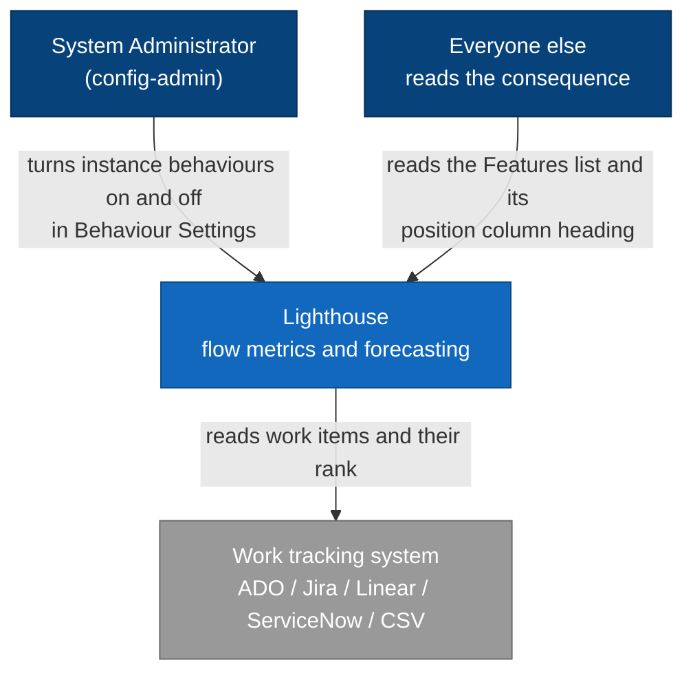
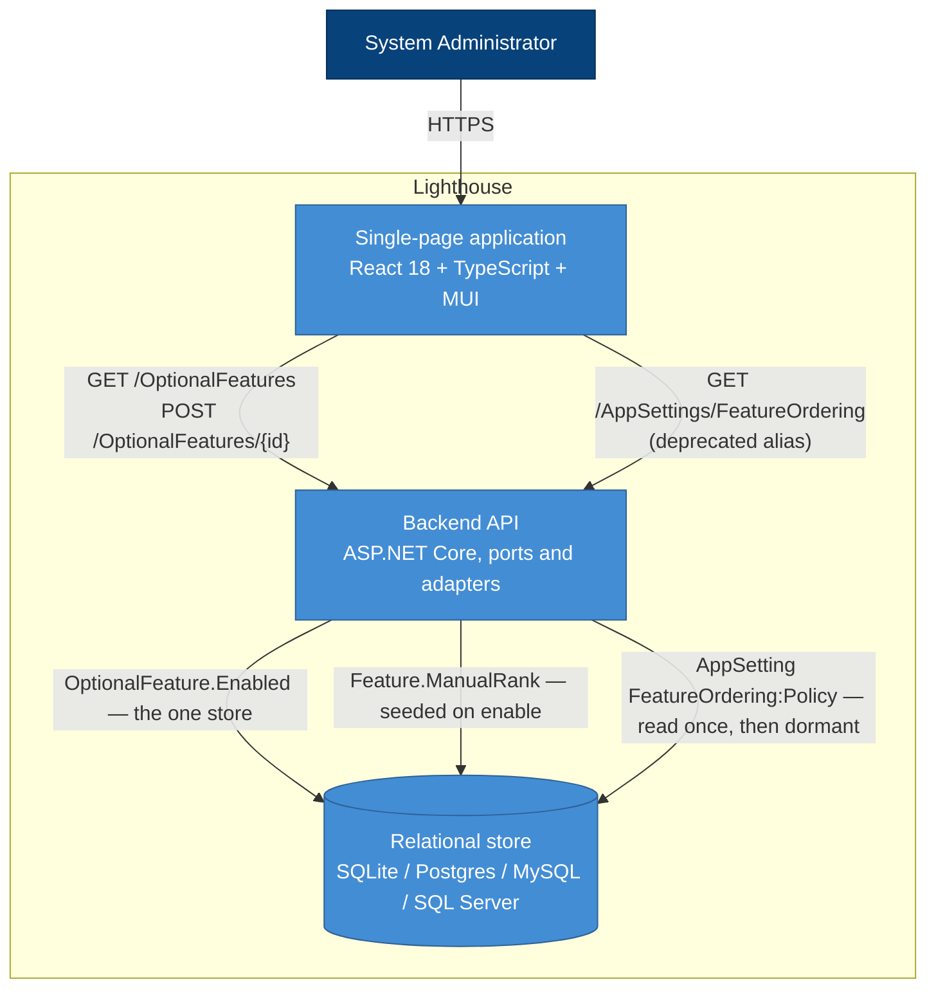
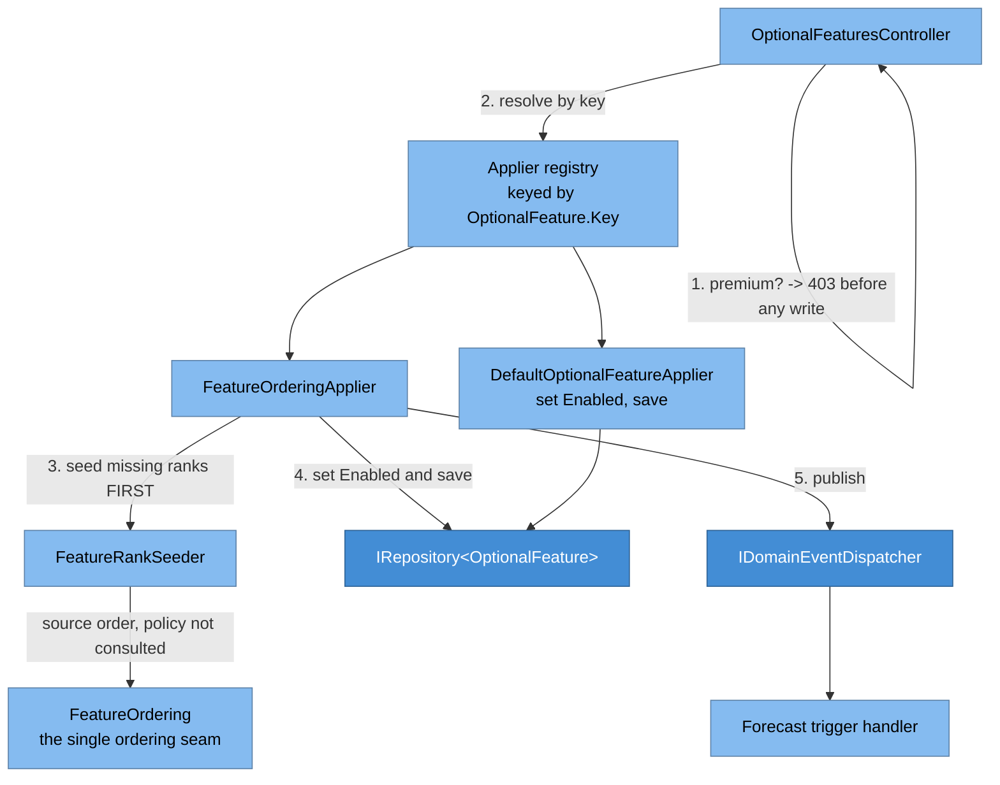

# Feature Delta — story-5876-behaviour-settings

ADO **User Story #5876** — *Move "Feature Ordering" to "Optional Features"*. Active, Priority 2,
unparented, created 2026-08-31.

The ADO description is three lines and one of them is already true. This delta is the result of the
DISCUSS dive-in on 2026-08-31, grounded in a pre-DISCUSS code reality check of
`OptionalFeature.cs`, `OptionalFeatureKeys.cs`, `OptionalFeatureSeeder.cs`, `OptionalFeaturesController.cs`,
`FeatureOrderingPolicy.cs`, `FeatureOrderingPolicyProvider.cs`, `FeatureOrderingDto.cs`,
`AppSettingKeys.cs`, `AppSettingService.cs`, `AppSettingsController.cs`, `FeatureRankSeeder.cs`,
`FeatureOrdering.cs`, `RbacGuardAttribute.cs`, `SystemSettingsTab.tsx`, `FeatureOrderingSettings.tsx`,
`useFeatureOrdering.ts`, `SettingsService.ts`, and the `lighthouse-clients` endpoint inventory.

---

## Wave: DISCUSS / [REF] Persona IDs

| Persona | File | Role here |
|---|---|---|
| `config-admin` | `docs/product/personas/config-admin.yaml` | The only actor. Holds `SystemAdmin`, is the one who flips instance-wide switches, and is the one who cannot currently find them all in one place. |

No second persona. Everyone else *reads* the consequence of the setting (the `#`/*Manual* column on
the Features list) and never touches the control.

---

## Wave: DISCUSS / [REF] JTBD One-Liners

- `job-admin-find-every-instance-switch-in-one-place` — **When** I want to change how my Lighthouse
  instance behaves, **I want** every instance-wide switch in the same list, **so I can** find the one
  I need without already knowing which release introduced it.

---

## Wave: DISCUSS / [REF] Current-State Surface Inventory

The story's premise is partly stale. What is actually on `main` at 2026-08-31:

| S | Fact | Evidence |
|---|---|---|
| S1 | Ordering ownership is an **enum**, not a boolean: `SourceOrder` / `ManualOrder`, stored in `AppSetting` key `FeatureOrdering:Policy`. | `FeatureOrderingPolicy.cs`, `AppSettingKeys.cs:26` |
| S2 | It is read through one seam, `IFeatureOrderingPolicyProvider`, which ADR-134 names the single selection point. Three production consumers: `AppSettingService.cs:97`, `FeaturesController.cs:154`, `FeatureOrdering.cs:33`. An ArchUnit test guards it. | `FeatureOrderingSingleSourceArchUnitTest.cs` |
| S3 | **Flipping it on has two side-effects a plain toggle does not have.** `AppSettingService.SetFeatureOrderingPolicy` runs `featureRankSeeder.SeedMissingRanks()` *before* persisting, then publishes `FeatureOrderingPolicyChanged` → forecast re-queue. | `AppSettingService.cs:99-110` |
| S4 | The pre-write ordering is load-bearing, not stylistic. `SeedMissingRanks` calls `featureOrdering.Order(...)`, which itself reads the policy. Seed *after* the flip and it sorts by an all-null `ManualRank`, so the "order you were looking at" is replaced by Id order. | `FeatureRankSeeder.cs:19-24`, `FeatureOrdering.cs:33` |
| S5 | `OptionalFeature` **already** carries `IsPremium` and `IsPreview`. The seeder refreshes both on every upgrade and never touches `Enabled`. | `OptionalFeature.cs`, `OptionalFeatureSeeder.cs:80-88` |
| S6 | The frontend **already** renders premium optional features correctly: `LicenseTooltip` wrapper plus a disabled `Switch` when `isPremium && !canUsePremiumFeatures`. | `SystemSettingsTab.tsx` |
| S7 | Exactly **one** live optional feature: `DeltaSync` ("Faster Updates") — preview, off, **not** premium. No premium optional feature exists yet, so the premium branch has never run in production. | `OptionalFeatureSeeder.cs:54-64` |
| S8 | The premium gate **silently drops the write**: `return feature;` — HTTP 200 carrying the unchanged entity, no error, no signal. | `OptionalFeaturesController.cs:41-44` |
| S9 | A **new** key seeds with its declared `Enabled`; an **existing** key never has `Enabled` overwritten. So a new key gets exactly one chance to carry a migrated value, at first add. | `OptionalFeatureSeeder.cs:71-88` |
| S10 | Write guards already match: `RbacGuardAttribute.Requirement` defaults to `SystemAdmin`, which is what both `POST /OptionalFeatures/{id}` and `PUT /AppSettings/FeatureOrdering` require today. | `RbacGuardAttribute.cs:22` |
| S11 | `GET /AppSettings/FeatureOrdering` is **deliberately unguarded** — every feature list reads it to label its position column. `GET /OptionalFeatures` is unguarded too, so the read path survives the move unchanged. | `AppSettingsController.cs:38-45`, `OptionalFeaturesController.cs:16-34` |
| S12 | **No client calls either endpoint.** The full `lighthouse-clients` endpoint inventory contains no `AppSettings` and no `OptionalFeatures` path. | `lighthouse-clients` grep, 2026-08-31 |
| S13 | Epic #5733 slice 03 already claims the S8 fix (US-07) and already declares this migration out of its own scope — "board item, not this Epic". #5733 is blocked on legal DoR-9. | `docs/feature/epic-5733-opt-in-usage-data/slices/slice-03-admin-veto.md:18-24` |

**What this means for the story text.** "The optional features must support *Premium only* flags" is
S5 + S6: already built, never exercised. The real work is S3/S4 (a toggle that must carry side-effects
in a specific order), S9 (one shot at migrating the existing value) and S8 (a gate that lies).

---

## Wave: DISCUSS / [REF] Locked Decisions

### D1 — The value moves into `OptionalFeature`. The AppSetting row is left where it is

A new key `FeatureOrdering` is seeded with `IsPremium = true`, `Enabled = false`. On its **first add**
only, the seeder reads `AppSetting` `FeatureOrdering:Policy` and seeds `Enabled = true` where it read
`ManualOrder` (S9 gives exactly one shot at this). The `AppSetting` row is **not** deleted — additive
only, per the expand-only migration rule — it simply stops being read.

Rejected: an EF migration. This is a data move between two tables that both already exist, it must run
on four providers, and the seeder already runs at startup with the right idempotence. No schema change
is needed and none should be invented.

### D2 — `IFeatureOrderingPolicyProvider` keeps its shape; only its backing store changes

The provider swaps `IRepository<AppSetting>` for `IRepository<OptionalFeature>` and maps
`Enabled == true` → `ManualOrder`, everything else → `SourceOrder`. `AppSettingService`,
`FeaturesController` and `FeatureOrdering` are untouched, and the ArchUnit guard still holds.

This is what keeps the blast radius at one class. ADR-134 is amended to say the selection point is now
backed by an optional feature; it is **not** replaced, because the seam it names is exactly what makes
the move cheap.

### D3 — The enum survives. Only the storage becomes a boolean

ADR-132 chose an enum because *"manual sorting on/off names a switch in the UI, not the thing being
decided"*. That reasoning is about the domain vocabulary and is still right. Storing it as
`OptionalFeature.Enabled` does not make the domain a boolean — the enum stays as the type every
consumer sees. Anyone reaching for `bool` in `FeatureOrdering` or `FeaturesController` is undoing
ADR-132 and should be stopped in review.

### D4 — The side-effects run **before** the value flips, so a post-commit domain event is not enough

`SeedMissingRanks` must run before the stored value changes (S4). A handler on a
"the toggle was saved" event runs after, reads an all-null `ManualRank`, and renumbers the whole list
in Id order — the user's list visibly scrambles the first time they turn it on, which is
indistinguishable from a bug and is the exact failure ADR-132's `SeedMissingRanks`-first ordering
exists to prevent.

The standing preference for the domain-event bus does not apply to the *seeding* half. The
`FeatureOrderingPolicyChanged` publication stays an event, because it genuinely is one and its handler
genuinely does belong after the write. DESIGN chooses the mechanism for the pre-write half — a
per-key apply seam on the toggle path, or making `SeedMissingRanks` read source order explicitly
rather than through the policy — but it may not choose "publish and hope".

### D5 — The group is renamed **Behaviour Settings**

"Optional Features" reads as opt-in extras; owning your forecast order is not an extra. "Feature
Toggles" was rejected outright: *Feature* is a Terminology-configurable term, so an instance that
renamed it reads "Epic Toggles" or "Initiative Toggles". "Behaviour Settings" names what the rows
decide, covers preview flags and premium flags alike, and collides with nothing renameable.

The stored key stays `OptionalFeature`. This is a display rename, not an entity rename.

### D6 — The premium gate stops lying, and this story owns the fix

`OptionalFeaturesController.cs:41` returns 200 with the unchanged entity. This story creates the
**first** premium optional feature (S7), so it is the first change that makes the broken branch
reachable at all.

Epic #5733 slice 03 owned this fix as US-07 (S13) and is blocked on legal. The fix moved here on
2026-08-31, and #5733 was updated in the same DISCUSS pass rather than at implementation time — its
US-07 is marked TRANSFERRED and kept in full, its slice 03 asserts the behaviour instead of writing
it, and AC-07.3 (`DeltaSync` must not become gated) stays #5733's inherited invariant to check.

The transfer is reversible on purpose: if #5733 unblocks and reaches slice 03 before this story
ships, the fix returns there. It may not be skipped in either document — a privacy control cannot
ship on a gate that drops writes.

### D7 — Both `AppSettings/FeatureOrdering` endpoints stay, as deprecated aliases

`GET` and `PUT` both remain and both delegate to the same provider, so there is one store behind two
doors and no possible divergence. No client calls them (S12), so the alias exists for a caller nobody
has found rather than for a known one; it costs two delegating methods and is removed at the next
contract drop.

The user's instruction to point the clients at the new endpoint is **N/A — there is no client caller
to point.** Recorded rather than silently skipped.

### D8 — `DeltaSync` is not touched

It is not premium and must not become premium, gated, renamed or reordered by any of this. The only
thing that changes for it is the heading above the table.

### D9 — Seeded descriptions carry terminology tokens, resolved when the cell renders

*Added during DESIGN, 2026-08-31, after reading ADR-134 §A.3. See Changed Assumptions CA-1.*

ADR-134 rejected this store partly because the table renders a server-seeded `Description` and
Epic #5375 AC-5.5 requires the help text in the instance's own terminology, resolved client-side
through `getTerm`. A seeded string cannot be.

The answer is not to render this row specially — ADR-134 was right that doing so spends the whole
reuse benefit. The answer is that the description cell resolves terminology tokens for **every** row.
It is a capability the table was missing, applies to `DeltaSync` and to every future setting, and is
the smaller change of the two.

### D10 — The gate fix ships first, and answers 403 specifically

*Added during DESIGN, 2026-08-31, after reading ADR-134. See Changed Assumptions CA-2.*

Epic #5375 AC-2.5 promises **403** on the enable endpoint, delivered today by
`[LicenseGuard(RequirePremium = true)]`. Moving the setting onto an endpoint that answers 200 with the
unchanged entity would regress it. So the refusal is pinned to 403 rather than to "an explicit
refusal", and it ships before the move rather than after.

This reverses the DISCUSS prioritization, which put the move first on learning-leverage grounds.
Sequencing wins: the alternative order ships a knowing regression of a shipped criterion.

---

## Wave: DISCUSS / [REF] Scope Assessment

**PASS — right-sized.** Two user stories, two slices, one bounded context (instance configuration)
touching one adjacent one (feature ordering) through a seam that already exists. No new abstraction,
no new component, no schema change, no new external integration. Under every oversized signal.

---

## Wave: DISCUSS / [REF] WS Strategy

**C — no walking skeleton.** Brownfield. Every part of the path is already running in production:
the entity, the seeder, the toggle endpoint, the premium rendering, the ordering seam. Nothing here is
a mechanism nobody has run.

---

## Wave: DISCUSS / [REF] Driving Ports

| Surface | Change |
|---|---|
| `POST /api/{v1,latest}/OptionalFeatures/{id}` | Gains a per-key apply path (D4) and an honest refusal on the premium branch (D6). |
| `GET /api/{v1,latest}/OptionalFeatures` | Unchanged shape. Returns one more row. Still unguarded (S11). |
| `PUT /api/{v1,latest}/AppSettings/FeatureOrdering` | Deprecated alias, delegates (D7). |
| `GET /api/{v1,latest}/AppSettings/FeatureOrdering` | Deprecated alias, delegates. Still unguarded. |
| Settings → System → *Behaviour Settings* | The renamed group. Gains the ordering row, loses the standalone *Feature Order* section. |

---

## Wave: DISCUSS / [REF] Pre-requisites

- None blocking. Epic #5375 (Manual Sorting) shipped and is the thing being moved.
- Coordination done: the back-propagation into Epic #5733 (D6) landed in this DISCUSS pass, so the
  two documents never both claim the fix. Nothing is left waiting on slice 02.

---

## Wave: DISCUSS / [REF] Out of Scope

- Making the premium gate a first-class concept across every controller. This story fixes one gate on
  one controller.
- Any change to what manual ordering *does* — the move actions, the `#`/*Manual* column, the shared-
  Feature behaviour, ADO #5691 slice 04. Moving the switch is not touching the feature.
- Renaming the `OptionalFeature` entity, table or route (D5 is a display rename).
- Deleting the `AppSetting` row or the alias endpoints (D1, D7).
- Any change to `DeltaSync` (D8).
- Per-key configuration richer than a boolean. If a future setting needs three states, it does not
  belong in this table and this story does not make room for it.

---

## Wave: DISCUSS / [REF] User Stories

### US-01 — Find every instance switch in one list

`job_id: job-admin-find-every-instance-switch-in-one-place` · Slice 02

As a system administrator, I want the setting that decides who owns my forecast order to sit with the
other instance-wide switches, so that finding it does not depend on remembering that it shipped as its
own section.

#### Elevator Pitch
Before: Settings → System shows *Optional Features* (one row) and, three groups further down, a
separate *Feature Order* section with a lone switch. Which switches live where is a fact about release
history, not about what they do.
After: open **Settings → System → Behaviour Settings** → sees one table listing *Faster Updates* and
*Let Lighthouse own the order of your Features*, the second carrying the premium affordance, and no
separate *Feature Order* section anywhere on the page.
Decision enabled: which instance behaviours are currently on — answerable by reading one table instead
of scanning a page for sections that happen to contain a switch.

#### Acceptance Criteria
- **AC-01.1** Settings → System renders a group headed **Behaviour Settings** containing both
  `DeltaSync` and `FeatureOrdering`; no group headed *Optional Features* and no group headed
  *&lt;Feature&gt; Order* remains on the page.
- **AC-01.2** The `FeatureOrdering` row shows the premium affordance — `LicenseTooltip` plus a
  disabled switch — on an instance without a premium licence, exactly as `SystemSettingsTab` already
  renders premium rows (S6).
- **AC-01.3** On an instance that had `FeatureOrdering:Policy = ManualOrder` before the upgrade, the
  row reads **on** after the upgrade, and the Features list still shows the *Manual* column heading
  with every place unchanged.
- **AC-01.4** On an instance that had no row, or `SourceOrder`, the row reads **off** and the Features
  list still shows the `#` heading.
- **AC-01.5** Turning the row on for the first time leaves the visible order of the Features list
  **identical** — the seeded places are the ones the administrator was looking at, not Id order
  (S4). This is the regression test for D4.
- **AC-01.6** Turning the row on or off re-queues the forecasts, i.e. `FeatureOrderingPolicyChanged`
  is still published on both transitions.
- **AC-01.7** Turning the row off and on again restores the previously chosen places rather than
  re-reading them from the tracker — the existing revert guarantee is unchanged.
- **AC-01.8** `PUT /api/latest/AppSettings/FeatureOrdering` still succeeds, still applies the same
  side-effects in the same order, and the change is visible in `GET /api/latest/OptionalFeatures` —
  one store, two doors (D7).
- **AC-01.9** `DeltaSync` is unchanged in name, description, preview badge, premium status and stored
  `Enabled` value (D8).
- **AC-01.10** The upgrade does not delete the `AppSetting` row (D1).
- **AC-01.11** On an instance that renamed *Feature* under Settings → Terminology, the row's
  description renders that instance's word, not the seeded default. This is Epic #5375 AC-5.5, and
  meeting it is what makes this store viable at all (D9).

### US-02 — Be refused out loud, not in silence

`job_id: job-admin-find-every-instance-switch-in-one-place` · Slice 01

As a system administrator on a Community instance, I want a toggle my licence does not cover to say so,
so that I do not believe I have changed something that is still running as before.

#### Elevator Pitch
Before: `POST /api/latest/OptionalFeatures/{id}` on a premium feature without a premium licence returns
**200 OK carrying the unchanged entity** (S8). The write vanished and the response says it worked.
After: `POST /api/latest/OptionalFeatures/{id}` for a premium feature without a premium licence → sees
an explicit refusal status, not a success carrying stale state.
Decision enabled: whether the setting shown on screen is the setting actually in force.

#### Acceptance Criteria
- **AC-02.1** A premium optional feature toggled without a premium licence returns **403** and does
  not persist the change. 403 specifically, not merely "a refusal" — Epic #5375 AC-2.5 already
  promises 403 on the setting that is about to move onto this endpoint (D10).
- **AC-02.2** A premium optional feature toggled **with** a premium licence persists and returns the
  updated entity.
- **AC-02.3** A non-premium optional feature — `DeltaSync` — is unaffected on licensed and unlicensed
  instances alike (D8, and inherited from Epic #5733 AC-07.3).
- **AC-02.4** The refusal is reachable only by calling the API directly; the UI continues to disable
  the control, so no user-facing flow starts producing errors (S6).
- **AC-02.5** Epic #5733's documents already record the transfer (done in DISCUSS, 2026-08-31). This
  AC is a check, not work: neither document claims the fix, and #5733 slice 03 still names AC-07.3 as
  its own invariant.

---

## Wave: DISCUSS / [REF] Story Map

**Backbone:** Configure my instance → find the switch → understand what it costs → flip it → trust it flipped.

| Slice | Stories | Ships |
|---|---|---|
| 01 — *A refused toggle says so* | US-02 | The premium gate answers 403; #5733 precondition satisfied. |
| 02 — *One list of switches* | US-01 | The whole move: key, seeded migration, provider re-backing, pre-write apply path, alias delegation, terminology token substitution, table row, section removal, rename, docs. |

Slice 02 is the story. Slice 01 runs first because slice 02 moves a setting whose 403 is a shipped
promise onto an endpoint that answers 200 — fixing that afterwards means shipping a regression (D10).

---

## Wave: DISCUSS / [REF] Slice Taste Tests

| Test | Verdict |
|---|---|
| Ships 4+ new components? | No. Slice 02 ships **zero** new components — it moves one and deletes one. |
| Every slice depends on a new abstraction? | No new abstraction. D2 deliberately reuses the existing seam. |
| Does any slice disprove a pre-commitment? | Yes, both. Slice 02 disproves "an optional-feature toggle can carry a side-effecting setting". Slice 01 disproves "no caller depends on the 200-unchanged shape". |
| Synthetic data only? | No. Both slices are accepted on the vendor's own instance with real Features and a real licence, then again with the licence removed. |
| Two slices identical but for scale? | No. Different surfaces, different failure modes. |

All pass.

---

## Wave: DISCUSS / [REF] Prioritization

1. **Slice 01 first — sequencing, not learning leverage.** It carries the least uncertainty of the
   two, and it still goes first: slice 02 moves a setting that promises 403 onto an endpoint that
   answers 200, so any other order ships a knowing regression of Epic #5375 AC-2.5 (D10). It also
   satisfies Epic #5733 slice 03's precondition earlier than that Epic could have.
2. **Slice 02 second — where all the uncertainty is.** D4 is the one decision that can be wrong in a
   way users see. If the pre-write apply path is wrong, the first administrator to flip the switch
   watches their list scramble. Nothing is built on top of this slice, so discovering it here costs
   only this slice.

---

## Wave: DISCUSS / [REF] Outcome KPIs

| KPI | Target | Measurement |
|---|---|---|
| KPI-1 — Migration fidelity | **100%** of instances that read `ManualOrder` before the upgrade read the row as on after it, with every `ManualRank` unchanged | Vendor instance plus the Postgres dev restore, before/after comparison of the `Features.ManualRank` column |
| KPI-2 — Nothing moves on first enable | **0** Features change visible position when the switch is first turned on | AC-01.5 acceptance test, plus a manual dogfood check on the vendor instance |
| KPI-3 — Forecast re-queue survives the move | `FeatureOrderingPolicyChanged` published on **both** transitions, 100% of flips | Acceptance test asserting the published event; the existing `FeatureOrderingPolicyChangedForecastTriggerHandler` test stays green |
| KPI-4 — No silent drops | **0** responses that return 200 with an unchanged entity on a refused premium toggle | AC-02.1 acceptance test |
| KPI-5 — Findability | The next support question about ordering asks how it behaves, not where the switch is | Qualitative, watched for one release |

---

## Wave: DISCUSS / [REF] Definition of Done

1. Both slices' acceptance criteria pass as automated tests.
2. `dotnet build` zero warnings; `dotnet test` green on the non-connector filter.
3. `pnpm test`, `pnpm build` and Biome clean on `./src`.
4. SonarQube Cloud introduces no new issue of any severity.
5. Mutation testing run per-feature on both stacks, ≥80% kill rate, recorded under `docs/feature/story-5876-behaviour-settings/mutation/`.
6. `docs/settings/configuration.md` updated: the *Optional Features* heading becomes *Behaviour Settings*, and the *Feature Order (Premium)* section folds into it as a row description.
7. The `settings/optionalfeatures.png` screenshot regenerated against the renamed group showing both rows (delete the PNG first — the regen keeps the old file when the diff is under 0.5%).
8. ADR-134 amended to record the store change (D1, D2); ADR-132's enum reasoning explicitly preserved (D3).
9. Epic #5733's delta and slice 03 record that US-07 landed here — done in DISCUSS on 2026-08-31; re-check it still reads true at finalization (AC-02.5).

---

## Wave: DISCUSS / [REF] DoR Validation

| # | Item | Evidence |
|---|---|---|
| 1 | Business value stated | US-01 and US-02 elevator pitches; `job-admin-find-every-instance-switch-in-one-place`. |
| 2 | Job traceability | Both stories carry a real `job_id`; no `infrastructure-only` escape used. |
| 3 | Acceptance criteria testable | 16 ACs, each asserting an observable response, rendered element or stored value. |
| 4 | Dependencies known | None blocking. One coordination item with Epic #5733 (D6), which is itself blocked and therefore cannot race this. |
| 5 | Sized | Two slices, ~2h and ~7h of crafter dispatch. |
| 6 | Technical feasibility | Every mechanism already runs in production (S2, S5, S6, S10). The one novel decision is D4, and S4 shows exactly what it must avoid. |
| 7 | Non-functional constraints | No new endpoint, no new query, no schema change. The seeder gains one predicate at startup. |
| 8 | UX defined | The target is the existing `SystemSettingsTab` table plus a heading string; the section being removed is a whole component. |
| 9 | Testable in isolation | Backend via `OptionalFeaturesControllerTest`, `OptionalFeatureSeederTests` and the `ManualSorting` integration suite; frontend via `SystemSettingsTab.test.tsx`. |

**Requirements completeness: 0.97.** The one open item is D4's mechanism, which is deliberately left
to DESIGN — the constraint is fixed, the implementation is not.

**Per-wave peer review: skipped.** No trigger fired — one persona, no contested DoR item, no
vendor-neutrality surface, no regulatory language. The consolidated review fires at end of DISTILL.

**Expansion catalog: no trigger fired.** AC ambiguity no; cross-context complexity no (two contexts);
multi-stakeholder no (one persona); compliance no; WS strategy is C not D. Strict lean output.

---

## Wave: DISCUSS / [REF] Wave Decisions Summary

### Key Decisions
- **[D1]** Value moves into `OptionalFeature`, migrated once by the seeder, `AppSetting` row left in place — expand-only, no EF migration for a data move between existing tables.
- **[D2]** `IFeatureOrderingPolicyProvider` keeps its shape, swaps its backing store. Blast radius: one class.
- **[D3]** The enum stays the domain vocabulary; only storage becomes boolean. ADR-132 preserved.
- **[D4]** Side-effects run before the flip. A post-commit domain event is insufficient and would visibly scramble the list.
- **[D5]** Group renamed *Behaviour Settings*. *Feature Toggles* rejected — collides with the configurable term *Feature*.
- **[D6]** The premium silent-drop fix moves here from Epic #5733 slice 03.
- **[D7]** Both `AppSettings/FeatureOrdering` endpoints stay as delegating aliases. No client caller exists to repoint.
- **[D8]** `DeltaSync` untouched.

### Requirements Summary
- Primary need: instance-wide switches live in one list, so finding one does not depend on knowing which release introduced it. The secondary need is that a switch the licence refuses says so.
- Walking skeleton: N/A (strategy C, brownfield).
- Feature type: **cross-cutting** — a configuration surface, a licensing gate and a forecasting side-effect meeting on one toggle.

### Constraints Established
- `SeedMissingRanks` must observe the pre-flip order. Non-negotiable; it is the difference between "nothing moves" and "everything moves".
- The ordering seam stays single. Any new read path takes `IFeatureOrderingPolicyProvider`, never a comparer — the ArchUnit guard stays green.
- `DeltaSync` must not become premium or gated.
- The seeder has exactly one opportunity to carry the old value across (S9); a shipped release with a wrong migration cannot be corrected by a later seed.

### Upstream Changes
- Epic #5733's slice 03 loses US-07 to this story (D6). Its US-07 is marked TRANSFERRED and kept in full, its slice 03 asserts the refusal rather than writing it, and its DESIGN reuse table now reads UNCHANGED HERE for `OptionalFeaturesController`. AC-07.3 stays #5733's invariant. Applied 2026-08-31; #5733 is not otherwise modified, and the transfer reverses if #5733 reaches slice 03 first.

---

## Wave: DISCUSS / [REF] SSOT Updates

- `docs/product/jobs.yaml` — adds `job-admin-find-every-instance-switch-in-one-place`.
- `docs/product/journeys/story-5876-behaviour-settings.yaml` — new journey.
- `docs/product/personas/config-admin.yaml` — reused unchanged; no new persona.

---

## Wave: DISCUSS / [REF] Handoff

**To:** `nw-solution-architect` (DESIGN) — full artifact set.
**Also to:** `nw-platform-architect` (DEVOPS) — outcome KPIs only.

The one question DESIGN must answer: **the mechanism for D4.** A per-key apply seam on the toggle
path, or `SeedMissingRanks` reading source order explicitly instead of through the policy. Both
satisfy the constraint; they differ in whether `OptionalFeaturesController` learns that one key is
special, which is the kind of `if` ADR-134 exists to prevent.

---

## Wave: DESIGN / [REF] Changed Assumptions

Two DISCUSS decisions were made without ADR-134 in front of them. Reading it during DESIGN surfaced
two live conflicts. Both are resolved; neither reverses D1.

### CA-1 — ADR-134 rejected this exact store, and one of its three reasons was still live

> **ADR-134 §A.3, quoted verbatim:** *"The free UI cannot satisfy AC-5.5, and this is decisive. The
> Optional Features section renders a generic Name / Description / Enabled table over a `Description`
> string persisted by a server-side seeder. AC-5.5 requires the switch's help text to state, in the
> instance's own terminology, what turning it off does and that the manual order is retained.
> Terminology is resolved client-side through `getTerm` (D16); a seeded database string cannot be. So
> the row would ship copy saying "Feature" to an instance that calls them "Deliverables" — a direct
> D16 violation. Rendering that one row specially to fix it spends the entire reuse benefit."*

`epic-5375-manual-sorting/feature-delta.md:937` names it the single most tempting reuse in that
feature and says it loses on precisely this.

**New assumption (D9).** The objection is real and is answered by making the table's description cell
terminology-aware in general, rather than by rendering one row specially. ADR-134's other two
objections have since expired: the `bool` concern is answered by D3 (the enum stays the domain type),
and the silent-no-op concern is fixed by slice 01. What remains true from §A.3 is only that a *raw*
seeded string cannot carry terminology — which is a missing capability of the table, not a property of
the store.

### CA-2 — AC-2.5 promises 403, and that reverses the slice order

> **`epic-5375-manual-sorting/feature-delta.md:248`, quoted verbatim:** *"AC-2.5 A non-premium
> instance receives 403 on the enable endpoint and the switch renders disabled"*

`[LicenseGuard(RequirePremium = true)]` on `AppSettingsController` delivers that today.
`OptionalFeaturesController` returns 200 with the unchanged entity.

**New assumption (D10).** The gate fix ships **first**, and is pinned to 403 rather than to "an
explicit refusal". DISCUSS had the move first on learning-leverage grounds; sequencing beats learning
leverage here, because the other order ships a knowing regression of a shipped criterion.

---

## Wave: DESIGN / [REF] Decisions

| # | Decision | One-line rationale |
|---|---|---|
| DDD-1 | Per-key **applier** on the toggle path; the controller keeps no `if` | A generic toggle must be able to carry a specific consequence; a key `switch` in the controller is the five-`if` failure ADR-134 exists to prevent |
| DDD-2 | The applier owns the **whole write**, not a before/after pair | One method cannot be called in the wrong order; a two-phase hook can |
| DDD-3 | `IFeatureOrdering` gains a **policy-independent source order**, and the rank seeder uses it | ADR-134 §3 already says the seed is "in current source order" — reading it through the policy-dependent path was incidental, and is the temporal coupling that makes D4 dangerous |
| DDD-4 | The ordering consequence stays **synchronous, inside the request** | `IDomainEventDispatcher` swallows handler exceptions by design; a dropped seed leaves the instance in `ManualOrder` with every rank null, ordered by `Id`, permanently |
| DDD-5 | `FeatureOrderingPolicyChanged` **stays** a published domain event | It genuinely belongs after the write, and the shipped forecast trigger handler already consumes it |
| DDD-6 | The premium check moves **out of** `ApiHelpers.GetEntityByIdAnExecuteAction` | The helper always wraps in `Ok(...)`, so 403 is physically unreachable inside it — this is the mechanical cause of the silent no-op, not a careless `return` |
| DDD-7 | The helper is **not widened**; this one action stops using it | 83 call sites across 8 controllers; widening a shared helper to fix one branch is the wrong trade |
| DDD-8 | Descriptions carry **terminology tokens**, resolved at render | Answers ADR-134 §A.3 as a general capability; every row gets it, so the next terminology-bearing setting costs nothing |
| DDD-9 | Token resolution is **frontend-only**; the seeder stores the token | Terminology is resolved client-side through `getTerm`; a server-side resolution would need the term map on a path that has no principal |
| DDD-10 | `IFeatureOrderingPolicyProvider` **keeps its interface**; only its backing store changes | Three production consumers and one ArchUnit rule stay untouched |
| DDD-11 | Alias endpoints delegate to the **same applier**, not to a parallel write | One store behind two doors cannot diverge; a second write path can |
| DDD-12 | The alias keeps `[LicenseGuard(RequirePremium = true)]` | AC-2.5's 403 is then delivered on both doors, by two independent mechanisms |

---

## Wave: DESIGN / [REF] Component Decomposition

| Component | Path | Change |
|---|---|---|
| `OptionalFeatureKeys` | `Models/OptionalFeatures/` | EXTEND — `FeatureOrderingKey` |
| `OptionalFeatureSeeder` | `Services/Implementation/Seeding/` | EXTEND — new entry + first-add value migration |
| `IOptionalFeatureApplier` | `Services/Interfaces/OptionalFeatures/` | CREATE NEW — `Key`, `ApplyAsync(OptionalFeature, bool)` |
| `DefaultOptionalFeatureApplier` | `Services/Implementation/OptionalFeatures/` | CREATE NEW — set `Enabled`, save. The behaviour every current row has |
| `FeatureOrderingApplier` | `Services/Implementation/OptionalFeatures/` | CREATE NEW — seed, set, save, publish, in that order and in one place |
| `OptionalFeaturesController` | `API/` | EXTEND — resolve applier by key; 403 before the write; stops using the `Ok`-wrapping helper |
| `FeatureOrderingPolicyProvider` | `Services/Implementation/` | EXTEND — backing store swaps to `IRepository<OptionalFeature>` |
| `IFeatureOrdering` / `FeatureOrdering` | `Services/Implementation/` | EXTEND — a source-order method that does not consult the policy |
| `FeatureRankSeeder` | `Services/Implementation/` | EXTEND — call the source-order method |
| `AppSettingService` | `Services/Implementation/` | EXTEND — `SetFeatureOrderingPolicy` delegates to the applier |
| `AppSettingsController` | `API/` | EXTEND — both actions delegate; `[LicenseGuard]` retained |
| `SystemSettingsTab.tsx` | `pages/Settings/System/` | EXTEND — heading, token-resolved description cell |
| `resolveTerms` | `services/Terminology/` | CREATE NEW — one small pure function |
| `FeatureOrderingSettings.tsx` | `pages/Settings/System/` | **DELETE** |
| `useFeatureOrdering.ts` | `hooks/` | EXTEND — reads the optional feature |
| `AppSetting` row `FeatureOrdering:Policy` | database | **RETAINED, unread** — expand-only |

---

## Wave: DESIGN / [REF] Reuse Analysis

| Existing component | File | Overlap | Decision | Justification |
|---|---|---|---|---|
| `OptionalFeature` + seeder + controller + UI | `Models/OptionalFeatures/`, `API/`, `SystemSettingsTab.tsx` | The entire destination | **EXTEND** | Every part already runs. Adding a key and a seeded row is the whole backend cost |
| `IFeatureOrderingPolicyProvider` | `Services/Implementation/FeatureOrderingPolicyProvider.cs` | Reads the policy | **EXTEND** | Swapping the store behind an unchanged interface keeps three consumers and one ArchUnit rule untouched. A new provider would fork the seam ADR-134 exists to keep single |
| `IFeatureOrdering` | `Services/Implementation/FeatureOrdering.cs` | Selects a comparison | **EXTEND** | The seeder needs source order specifically. Going direct to `FeatureComparer` breaks `FeatureOrderingSingleSourceArchUnitTest`; the seam is where that answer belongs |
| `FeatureRankSeeder` | `Services/Implementation/FeatureRankSeeder.cs` | Seeds ranks on enable | **EXTEND** | One call site changes. Its INV-A3 semantics are unchanged — ADR-134 §3 already specified source order |
| `ApiHelpers.GetEntityByIdAnExecuteAction` | `API/APIHelpers.cs` | Fetch-or-404 then act | **UNCHANGED — this action stops using it** | It always wraps in `Ok(...)`, so 403 is unreachable inside it. 83 call sites across 8 controllers; widening it to fix one branch is a shared-contract change with no other beneficiary |
| `LicenseGuardAttribute` | `Services/Implementation/Licensing/` | Premium 403 | **UNCHANGED — retained on the alias, not reused on the new path** | Premium-ness here is per-row data, not per-endpoint. The attribute cannot see which row is being written. Its 403 body shape is matched by hand |
| `AppSettingService` / `AppSettingsController` | `Services/`, `API/` | The old write path | **EXTEND (delegate)** | Delegating is what makes the alias incapable of divergence |
| `useTerminology` / `getTerm` | `services/TerminologyContext` | Client-side term resolution | **EXTEND (compose)** | The resolver calls it; nothing about terminology itself changes |
| `FeatureOrderingSettings.tsx` | `pages/Settings/System/` | The control being moved | **DELETE** | Its only remaining job is the help text, which becomes the row's description |
| `IDomainEventDispatcher` | `Services/Implementation/DomainEvents/` | Post-write fan-out | **EXTEND (unchanged use)** | Correct for the forecast trigger. Rejected for the seed — it swallows handler exceptions by design, and a dropped seed is unrecoverable |

Zero unjustified CREATE NEW. The three new backend types are one interface and two implementations of
it, together smaller than the `switch` they replace.

---

## Wave: DESIGN / [REF] Driving Ports

| Port | Guard | Serves |
|---|---|---|
| `POST /api/{v1,latest}/OptionalFeatures/{id}` | `RbacGuard(SystemAdmin)` + per-row premium check returning 403 | AC-01.1, AC-02.1, AC-02.2, AC-02.3 |
| `GET /api/{v1,latest}/OptionalFeatures` | none, deliberately | AC-01.1, AC-01.3, AC-01.4 |
| `PUT /api/{v1,latest}/AppSettings/FeatureOrdering` | `RbacGuard` + `LicenseGuard(RequirePremium)` | AC-01.8, and AC-2.5 of Epic #5375 |
| `GET /api/{v1,latest}/AppSettings/FeatureOrdering` | none, deliberately | AC-01.8 |
| Settings → System → *Behaviour Settings* | disabled control + `LicenseTooltip` | AC-01.1, AC-01.2, AC-01.11, AC-02.4 |

## Wave: DESIGN / [REF] Driven Ports and Adapters

| Port | Adapter | Effect |
|---|---|---|
| `IRepository<OptionalFeature>` | EF Core | The one store for the ordering choice |
| `IRepository<AppSetting>` | EF Core | Read once at first add, then never again |
| `LighthouseAppContext.Features` | EF Core | The rank seed's narrow projection and batched write |
| `IDomainEventDispatcher` | in-process | `FeatureOrderingPolicyChanged` → forecast re-queue |
| `ILicenseService` | in-process | The premium verdict, read on the server and mirrored to the client |

---

## Wave: DESIGN / [REF] Technology Choices

Nothing new is introduced. .NET 10 / ASP.NET Core, EF Core with the four shipped providers, React 18 +
TypeScript with MUI, NUnit + Moq + EF InMemory, Vitest + React Testing Library. No package is added on
either stack, and no EF migration is generated — the value move is a seeder step between two tables
that both already exist.

---

## Wave: DESIGN / [REF] C4 — System Context

The story changes nothing about who talks to what. It changes where one of the administrator's
controls lives.

## Wave: DESIGN / [REF] C4 — Container

## Wave: DESIGN / [REF] C4 — Component (the toggle path)

The one subsystem complex enough to earn a diagram, because the ordering of these calls is the whole
design.

Steps 3, 4 and 5 live inside one method on one type. That is the entire answer to D4: the sequence
cannot be got wrong from outside, because there is no outside.

DDD-3 is the belt to that braces — with the seeder reading source order directly, step 3 would still
be correct if it ran after step 4. The design does not rely on that, but it no longer depends on a
statement order that a future refactor cannot see.

---

## Wave: DESIGN / [REF] Open Questions

| # | Question | Deferred to |
|---|---|---|
| OQ-1 | Token syntax for terminology in seeded descriptions, and what an unknown token renders as. Recommendation: render the raw token rather than empty, so a typo is visible in review instead of silently deleting a word | DISTILL |
| OQ-2 | Whether the applier registry is a keyed DI registration or a small dictionary built from the registered appliers. Both are ~10 lines; the choice is house-style | DELIVER |
| OQ-3 | Whether Epic #5733's `UsageData` becomes the second applier when it unblocks. Likely, and the interface is shaped for it, but that Epic decides | Epic #5733 DESIGN |
| OQ-4 | When the deprecated `AppSettings/FeatureOrdering` alias and the dormant `AppSetting` row are removed. Both are inert; the next contract drop is the natural moment | A later release |

**Accepted residual.** ADR-134 warned that a boolean store closes the door on a third ordering policy.
D3 keeps the enum as the domain type, so a third value would need a new store rather than a new enum
member — a real cost, accepted, and recorded in ADR-187 rather than solved. No third policy is on the
board.

---

## Wave: DISTILL / [REF] Inherited commitments

| Origin | Commitment | DDR | Impact |
|--------|------------|-----|--------|
| DESIGN#DDD-6 | The refusal is 403 and cannot be returned from inside the `Ok`-wrapping helper | DDD-6 | Two scenarios pin it: one on the status, one on the body, because a 403 with a different body makes the two doors onto this setting answer a client differently |
| DESIGN#DDD-7 | The shared helper is not widened; this one action stops using it | DDD-7 | No scenario asserts the helper's shape. `A_setting_that_does_not_exist_is_still_reported_as_not_found` pins the one behaviour leaving it must not lose |
| DESIGN#DDD-2 | The applier owns the whole write, so the sequence cannot be got wrong from outside | DDD-2 | `Turning_the_ordering_setting_on_for_the_first_time_moves_nobody` fails if the seed ever runs after the write. Its fixture is ranked backwards on purpose — a fixture in row-id order would pass either way |
| DESIGN#DDD-3 | `IFeatureOrdering` gains a policy-independent source order and the rank seeder uses it | DDD-3 | Not port-observable on its own. The acceptance scenario above covers the consequence; the unit test ADR-187 names under Architectural Enforcement stays a DELIVER obligation and is listed under Pre-requisites below |
| DESIGN#DDD-5 | `FeatureOrderingPolicyChanged` stays a published domain event | DDD-5 | `Handing_the_order_over_and_giving_it_back_both_re_queue_the_forecasts` asserts both transitions through the shipped handler, not through a spy on the bus |
| DESIGN#DDD-8 / DDD-9 | Descriptions carry terminology tokens, resolved at render, frontend-only | DDD-8 | Two frontend scenarios: the instance's own word, and an undefined token left standing. Widened by one cell — see UI-3 |
| DESIGN#DDD-11 / DDD-12 | The alias delegates to the same applier and keeps its licence guard | DDD-11 | `A_write_through_the_deprecated_door_is_visible_through_the_new_one` and `..._moves_nobody_either` — one store behind two doors, asserted from both sides |
| DISCUSS#D1 | The app setting row is retained and unread | D1 | `The_upgrade_leaves_the_setting_it_migrated_from_in_place`. Green today, so it guards the deletion from this moment rather than from the end of DELIVER |
| DISCUSS#D8 | `DeltaSync` is not premium and must never become gated | D8 | Asserted explicitly on both licence states and on its stored premium flag, rather than implied by the premium cases. An inverted check refuses everybody and would pass every premium scenario |
| DISCUSS#D10 | The gate fix ships first | D10 | The two fixtures are independent: slice 01 runs against a premium row of its own making, so nothing in it waits on slice 02 |

---

## Wave: DISTILL / [REF] Scenario list with tags

Test placement follows the shipped precedent for this kind of work: `API/Integration/<Feature>/` with a
`<Feature>AcceptanceTest` harness and a `Slice0N…Scenarios` / `Slice0N…Specifications` partial-class
pair, exactly as `API/Integration/ManualSorting/` does. The C# row of the polyglot matrix governs —
`[Ignore]` is the skip marker, and there is no `.feature` file, no Python state-delta port and no
`__SCAFFOLD__` stub in this project.

### Slice 01 — `Slice01PremiumRefusalTest` (US-02)

| Scenario | Tags | State |
|---|---|---|
| `A_toggle_the_licence_does_not_cover_is_refused_out_loud` | `@driving_port @real-io @AC-02.1` | RED, ignored |
| `The_refusal_reads_the_same_as_the_one_the_other_door_already_gives` | `@driving_port @real-io @AC-02.1` | RED, ignored |
| `Both_doors_refuse_an_unlicensed_administrator_in_the_same_words` | `@driving_port @real-io @AC-02.1` | RED, ignored |
| `The_door_this_setting_has_today_already_refuses_an_unlicensed_administrator` | `@driving_port @real-io @AC-02.1` | green |
| `A_refused_toggle_leaves_the_setting_exactly_as_it_was` | `@driving_port @real-io @AC-02.1` | green |
| `A_toggle_the_licence_covers_is_taken_and_reported_back` | `@driving_port @real-io @AC-02.2` | green |
| `The_setting_the_licence_has_nothing_to_say_about_is_taken_either_way(True/False)` | `@driving_port @real-io @AC-02.3` | green |
| `The_setting_the_licence_has_nothing_to_say_about_is_still_not_premium` | `@AC-02.3` | green |
| `A_setting_that_does_not_exist_is_still_reported_as_not_found` | `@driving_port @real-io @AC-02.1` | green |

### Slice 02 — `Slice02OneListOfSwitchesTest` (US-01)

Six of these are marked **blocked on UI-1**: every scenario that toggles the ordering row through the
behaviour-settings port is blocked, because that port cannot address either row once both are seeded.
`red-classification.md` states the full blast radius and what it costs DELIVER to discover it late.

| Scenario | Tags | State |
|---|---|---|
| `Turning_the_ordering_setting_on_for_the_first_time_moves_nobody` | `@driving_port @real-io @AC-01.5` | RED, ignored, blocked on UI-1 |
| `The_places_are_seeded_in_the_order_the_admin_was_looking_at` | `@AC-01.5` | RED, ignored, blocked on UI-1 |
| `Giving_the_order_back_writes_no_places` | `@driving_port @real-io @AC-01.7` | RED, ignored, blocked on UI-1 |
| `Handing_the_order_over_and_giving_it_back_both_re_queue_the_forecasts` | `@driving_port @real-io @AC-01.6` | RED, ignored, blocked on UI-1 |
| `Taking_the_order_over_again_restores_the_places_this_instance_already_chose` | `@driving_port @real-io @AC-01.7` | RED, ignored, blocked on UI-1 |
| `Each_setting_in_the_list_is_switched_on_its_own` | `@driving_port @real-io @AC-01.1` | RED, ignored, blocked on UI-1 |
| `An_instance_that_already_owned_its_order_still_owns_it_after_the_upgrade` | `@driving_port @real-io @AC-01.3` | RED, ignored |
| `An_instance_that_never_took_its_order_over_does_not_acquire_it_in_the_upgrade("SourceOrder" / null / "Nonsense")` | `@driving_port @real-io @AC-01.4` | RED, ignored |
| `A_write_through_the_deprecated_door_is_visible_through_the_new_one` | `@driving_port @real-io @AC-01.8` | RED, ignored |
| `A_write_through_the_deprecated_door_moves_nobody_either` | `@driving_port @real-io @AC-01.8` | green |
| `An_instance_whose_licence_lapsed_keeps_the_order_it_already_owns` | `@driving_port @real-io @AC-01.3` | green |
| `The_setting_that_was_already_in_the_list_is_carried_across_untouched` | `@AC-01.9` | green |
| `The_upgrade_leaves_the_setting_it_migrated_from_in_place` | `@AC-01.10` | green |

### Rendered — `SystemSettingsTab.behaviourSettings.test.tsx`

| Test | Tags | State |
|---|---|---|
| `puts every instance-wide switch under one heading` | `@AC-01.1` | RED, skipped |
| `leaves no separate section behind` | `@AC-01.1` | RED, skipped |
| `reads the row in the instance's own word for a Feature` | `@AC-01.11` | RED, skipped |
| `switches one setting without touching the other` | `@AC-01.1` | RED, skipped, UI-1's frontend twin |
| `shows the ordering switch as unavailable on an instance without the licence` | `@AC-01.2` | green |
| `leaves a token nobody defined exactly where it is` | `@AC-01.11` | green (vacuous until the resolver ships) |
| `changes nothing about the setting that was already in the list` | `@AC-01.9` | green (mock-driven) |
| `never lets an unlicensed administrator reach the refusal` | `@AC-02.4` | green |
| `puts the switch back when the write is refused` | `@AC-02.4` | green |

Four of these nine are mock-driven and exercise rendering that shipped long ago, so they could not fail
if this feature were never built. `red-classification.md` names all four rather than the two the first
draft admitted to — the frontend suite is thinner than its size suggests, and reading it as evidence
rather than as a guard would overstate what DISTILL has pinned.

**AC-02.5 is not a test.** It is a check that Epic #5733's documents still read true — US-07 marked
TRANSFERRED, slice 03 asserting rather than writing the refusal, AC-07.3 kept as #5733's invariant.
It belongs to finalization, and is listed there rather than skipped.

---

## Wave: DISTILL / [REF] WS strategy

**C — no walking skeleton**, inherited from DISCUSS unchanged. Brownfield: the entity, the seeder, the
toggle endpoint, the premium rendering and the ordering seam all run in production today. Nothing here
is a mechanism nobody has run, so there is no end-to-end path to prove for the first time.

What survives the absence of a skeleton is the demand that the scenarios reach the system the way a
user does. Every backend scenario tagged `@driving_port` goes through the real ASP.NET host over real
EF and real SQLite; none of them calls a service directly.

---

## Wave: DISTILL / [REF] Adapter coverage

| Driven adapter | `@real-io` scenario | Covered by |
|---|---|---|
| `IRepository<OptionalFeature>` (EF Core) | YES | Every slice-01 and slice-02 scenario; the store is read back directly on top of the read port |
| `IRepository<AppSetting>` (EF Core) | YES | `An_instance_that_already_owned_its_order_still_owns_it_after_the_upgrade`, `The_upgrade_leaves_the_setting_it_migrated_from_in_place` |
| `LighthouseAppContext.Features` (EF Core) | YES | `The_places_are_seeded_in_the_order_the_admin_was_looking_at` — the rank seed's narrow projection and batched write, run for real |
| `IDomainEventDispatcher` (in-process) | YES | `Handing_the_order_over_and_giving_it_back_both_re_queue_the_forecasts`, through the shipped `FeatureOrderingPolicyChangedForecastTriggerHandler` |
| `ILicenseService` | fake, by policy | `Mock<ILicenseService>` — external, non-deterministic, and the verdict slice 01 is entirely about. The one port that has to be controllable for the scenarios to say anything |
| `IForecastUpdater` | fake, by policy | `Mock<IForecastUpdater>` — a background queue. A scenario that waited on it would be timing against a thread rather than asserting a promise. It is the observable the event assertion reads |
| `IWorkTrackingConnector` | fake, by policy | Not exercised. Stubbed to return nothing so a Portfolio can exist without a tracker being reachable |

Zero rows missing.

---

## Wave: DISTILL / [REF] Driving-adapter coverage

Every surface DESIGN names is reached through its own protocol, over HTTP, by at least one scenario.

| Surface | Reached by |
|---|---|
| `POST /api/latest/OptionalFeatures/{id}` | `ToggleOptionalFeature` — real HTTP POST with the whole row as raw JSON |
| `GET /api/latest/OptionalFeatures` | `GetOptionalFeatures` — real HTTP GET, parsed as wire JSON |
| `PUT /api/latest/AppSettings/FeatureOrdering` | `SetOrderingPolicyThroughTheAlias` — real HTTP PUT |
| `GET /api/latest/AppSettings/FeatureOrdering` | `GetOrderingPolicy` — real HTTP GET |
| `GET /api/latest/features` | `GetAllFeatures` — the read port AC-01.5 is judged against |
| Settings → System → *Behaviour Settings* | The rendered suite, through the real component and the real terminology provider |

The bodies are written as raw JSON rather than built from the shipped types on purpose: a rename on
the server side cannot keep these scenarios green, and none of them can pass by compiling against a
type somebody added.

---

## Wave: DISTILL / [REF] Scaffolds

No production scaffolds were written. Every type the scenarios touch already exists — this is a
brownfield move, and the RED scenarios fail on *behaviour*, not on a missing symbol.

The one place a scaffold would ordinarily go is `OptionalFeatureKeys.FeatureOrderingKey`, which does
not exist yet. Rather than add a constant to production code so a test can compile, the harness names
the key as a local constant with the reason recorded inline. A scaffold there would have been a
production edit made by DISTILL for a test's convenience, and would have shipped if DELIVER stalled.

Files added:

- `Lighthouse.Backend.Tests/API/Integration/BehaviourSettings/BehaviourSettingsAcceptanceTest.cs`
- `Lighthouse.Backend.Tests/API/Integration/BehaviourSettings/Slice01PremiumRefusalScenarios.cs`
- `Lighthouse.Backend.Tests/API/Integration/BehaviourSettings/Slice01PremiumRefusalSpecifications.cs`
- `Lighthouse.Backend.Tests/API/Integration/BehaviourSettings/Slice02OneListOfSwitchesScenarios.cs`
- `Lighthouse.Backend.Tests/API/Integration/BehaviourSettings/Slice02OneListOfSwitchesSpecifications.cs`
- `Lighthouse.Frontend/src/pages/Settings/System/SystemSettingsTab.behaviourSettings.test.tsx`

---

## Wave: DISTILL / [REF] Closed Open Questions

### OQ-1 — Token syntax, and what an unknown token renders as. **CLOSED**

**Syntax: `{{key}}`, where `key` is a value from `TERMINOLOGY_KEYS`** — camelCase, so `{{features}}`
and `{{feature}}`. Double braces because no seeded description contains one today and none plausibly
will; single braces collide with ordinary prose.

**An unknown token is left standing, braces and all.** `{{fetaure}}` renders as `{{fetaure}}`.

The two alternatives both fail quietly. Resolving through `getTerm` alone would render the bare key —
`getTerm` already falls back to its argument (`TerminologyContext.tsx:55-57`) — so a typo would read as
ordinary lowercase prose and survive review. Dropping the token would delete a word from a sentence,
which reads as a bug in the copy rather than a bug in the copy's key. Leaving it visible is the only
outcome a reviewer cannot miss. The resolver therefore checks membership of `TERMINOLOGY_KEYS`, which
is a closed set on the client, before substituting.

Asserted by `leaves a token nobody defined exactly where it is`.

### OQ-2 — Keyed DI registration or a dictionary. **Still DELIVER's.** No scenario constrains it.

### OQ-3 — Whether `UsageData` becomes the second applier. **Still Epic #5733's.**

### OQ-4 — When the alias and the dormant row are removed. **Still a later release's.**

---

## Wave: DISTILL / [REF] Pre-requisites and DELIVER obligations

Things DELIVER owes that no acceptance scenario can carry. Nine, after the review gate.

1. **UI-1 must be answered before slice 02 starts, and answered on both sides.** Two rows in the table
   cannot both be addressed by the identity the toggle route uses, and the frontend keys its rows and
   matches its optimistic update on that same identity (UI-5). Routing the backend write by key does
   not fix the browser. This is a DESIGN decision, not an implementation detail; six backend scenarios
   and one frontend scenario stay RED until it is made.
2. **`SetPolicy` must be disposed of** — deleted or delegated (UI-6). Left as it is, it is a second
   writer of the same row that skips the seed and the event.
3. **The applier seeds only on the way out** (UI-7). `Giving_the_order_back_writes_no_places` pins it.
4. **The unit test ADR-187 §4 names**, calling `SeedMissingRanks` with the policy already `ManualOrder`
   and every rank null, asserting source order. It is a statement about a seam, not about a port, so it
   belongs to DELIVER's unit work. The acceptance suite covers the consequence; this covers the cause.
5. **`FeatureOrderingSingleSourceArchUnitTest` stays green.** Unchanged by design and already in the
   suite; named here so a crafter reaching past the seam finds out immediately.
6. **The Features list column heading is not asserted anywhere.** AC-01.3 and AC-01.4 each name a
   rendered outcome — the *Manual* heading and the `#` heading. The backend scenarios cover the stored
   policy those headings derive from; the heading itself lives in a Features-list component this story
   does not otherwise touch, so no scenario reaches it. Recorded rather than skipped: DELIVER either
   adds one rendered assertion per policy state or states why it does not.
7. **The comments in the files this story edits** (UI-9). One of them — `"0 lets EF assign the key"` —
   is false and is why UI-1 survived a release; it should be deleted, not corrected.
8. **Mutation testing**, both stacks, ≥80%, recorded under `docs/feature/story-5876-behaviour-settings/mutation/`.
9. **AC-02.5** — re-read Epic #5733's delta and slice 03 at finalization and confirm neither claims the
   refusal. A document check, done by reading, not by running.

Two open product questions the reviewers surfaced, for the maintainer rather than for DELIVER:

- **Whether a lapsed licence should strand an administrator on a setting they can neither use nor turn
  off** (UI-8). The behaviour is pre-existing and preserved, and the preservation is now pinned by a
  green test — but slice 01 rewrites exactly the branch that refuses the write, so it is the cheap
  moment to decide otherwise.
- **Whether the terminology resolver runs on the row's name as well as its description** (UI-3). The
  seeded name carries the same configurable term, so without it the row says "Features" on an instance
  that renamed them — the objection this whole store was once rejected over. The scenarios assert both
  cells; DESIGN has not yet widened the decision to match.

---

## Wave: DISTILL / [REF] Outcomes registry

**Not registered, deliberately.** `IOptionalFeatureApplier` is a new typed contract and would be one
`OUT-N` row. `docs/product/outcomes/registry.yaml` is empty — no feature in this repository has ever
registered an outcome — so a single row would be an index nothing consults rather than a source of
truth. Recorded here rather than skipped silently; adopting the registry is a project decision, not
this story's to make.

---

## Wave: DISTILL / [REF] Wave-decision reconciliation

**Passed — zero unresolved contradictions.**

This project keeps one `feature-delta.md` rather than per-wave `wave-decisions.md` files, so
reconciliation reads the DISCUSS and DESIGN sections of this document against each other.

DESIGN found two contradictions against DISCUSS and resolved both before DISTILL began: CA-1 (ADR-134
§A.3 rejected this store on terminology, answered by D9/DDD-8) and CA-2 (Epic #5375 AC-2.5 promises
403, which reversed the slice order into D10). Both are recorded with the superseded reasoning intact.
Nothing is left for DISTILL to pick a side on.

DISTILL adds no contradiction of its own. UI-1 and UI-3 are gaps rather than conflicts — facts neither
wave had, not decisions the two waves disagree about.

---

## Wave: DISTILL / [REF] Expansion catalog

**No trigger fired. Strict lean output.** No AC ambiguity — the sixteen criteria each name an observable
response, rendered element or stored value. Two contexts, not many. One persona. No compliance surface.
WS strategy is C, not D. The expansions this wave can offer — fixture-design discussion, edge-case
enumeration, PBT strategy notes — describe decisions the shipped ManualSorting precedent already made
for this project, so rendering them would restate house style as if it were a choice.

---

## Wave: DISTILL / [REF] Final wave review gate

Run 2026-08-31 over the whole four-wave chain. Three reviewers, one per wave that produced sections in
this document.

| Wave | Verdict | Blockers | High | Low |
|---|---|---|---|---|
| DISCUSS | `needs_revision` | 1 | 8 | 6 |
| DESIGN | `needs_revision` | 2 | 5 | 7 |
| DISTILL | `conditionally_approved` | 0 | 5 | 10 |

**DEVOPS: N/A, and not silently.** No DEVOPS wave ran for this story and this document has no DEVOPS
sections. There is no infrastructure surface — no new endpoint at the platform level, no schema change,
no deployment or chart change; the seeder gains one predicate at startup. A fourth reviewer would have
been dispatched at an empty section.

**The reviewers ran as `general-purpose` agents, not as the named nWave reviewers.** Every nWave agent
declares `tools: Read, Glob, Grep`, all three of which this environment denies, and the frontmatter
patch that grants them the `ctx_*` equivalents had reverted. Two dispatches were spent discovering
that. The patch was re-applied and verified, but agent definitions are cached per session, so the gate
ran on agents that can actually read files, carrying the same briefs and the same criteria skills.
Recorded because a gate that reports "blocked" is not a gate that passed.

### What the gate changed

Both DISCUSS and DESIGN verdicts are `needs_revision` on findings that belong to those waves. DISTILL
is `conditionally_approved`, and every one of its conditions has been met in this pass:

- **A frontend assertion that could never fail.** `leaves no separate section behind` asserted the
  absence of a testid that has never existed in this codebase. It now names the two the standalone
  section really renders. This is the finding worth the whole gate: a removal guard that had quietly
  stopped guarding removal.
- **The toggle helper addressed rows by the ambiguous identity.** It now takes the setting's key, looks
  the row up by it, and asserts exactly one row carries the resulting number — quoting UI-1 when more
  than one does. Without that, slice 02 would have built its request from whichever row the store
  happened to return first.
- **The UI-1 blast radius was understated at one scenario.** It is six, plus a currently-green guard
  that would have flipped red for a harness reason mid-slice.
- **The preview badge was untested on both sides.** The backend probe now carries it, so all five
  clauses of AC-01.9 are asserted where the value actually lives.
- **The position assertion could not fail.** The whole table is numbered from one in the order it is
  returned, so both sides always read 1..N. Name and place are now compared as one sequence.
- **The 404 scenario let one hoist through.** Its request now claims to be premium, so a check hoisted
  above the lookup fires whether it reads the request or the store.
- **A `Given` that stated nothing** now sets the licence it names, rather than resting on a harness default.

Five scenarios were added from findings, four of which pin something nothing pinned before:

| Added | Why |
|---|---|
| `The_door_this_setting_has_today_already_refuses_an_unlicensed_administrator` | Epic #5375 AC-2.5 is the criterion the 403-first slice order exists to protect, and nothing asserted it on the door that delivers it |
| `Both_doors_refuse_an_unlicensed_administrator_in_the_same_words` | The design says the two refusals are "matched by hand"; that is only true while something compares them |
| `Giving_the_order_back_writes_no_places` | The shipped write path seeds only on the way out; nothing in the design carries that condition forward (UI-7) |
| `An_instance_whose_licence_lapsed_keeps_the_order_it_already_owns` | Green today, and the guard against a licence-aware provider silently reordering every lapsed customer's list |
| `switches one setting without touching the other` | Reproduces UI-1 in the browser and survives any backend-only fix (UI-5) |

A third migration case — a stored value that is neither `ManualOrder` nor `SourceOrder` — was added to
the upgrade scenario. The seeder gets one chance at each instance, and an unparseable row is one of the
three shapes it can meet.

### What the gate did not change

The DISCUSS findings on story sizing, the missing journey YAML, KPI-5's unmeasurability, US-02 borrowing
US-01's `job_id`, and AC-02.5 being a document check rather than a criterion are all real and all belong
to DISCUSS. They are not DISTILL's to rewrite and are left for the maintainer.

Both reviewers independently read the lapsed-licence case as a new hole opened by this story. It is not
— the behaviour predates it and is preserved — and the disagreement is recorded in UI-8 with the
evidence rather than resolved by adopting the finding.
