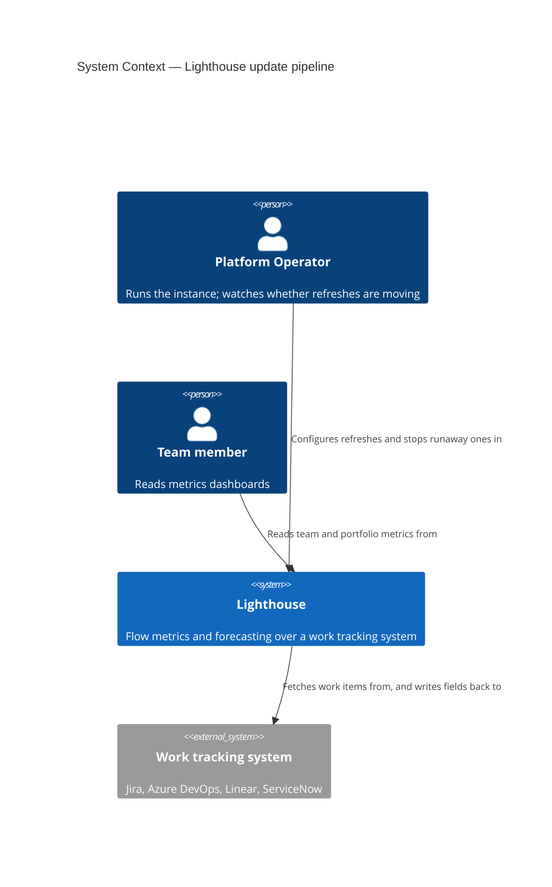
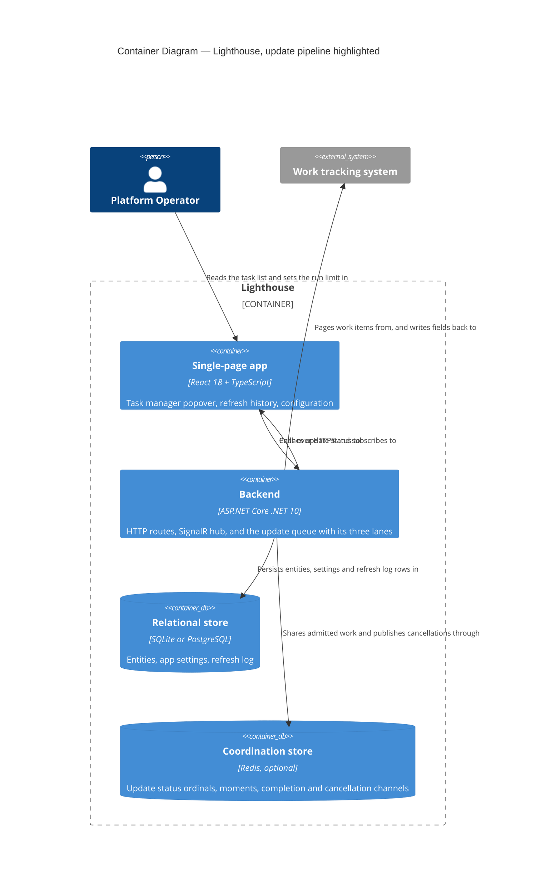
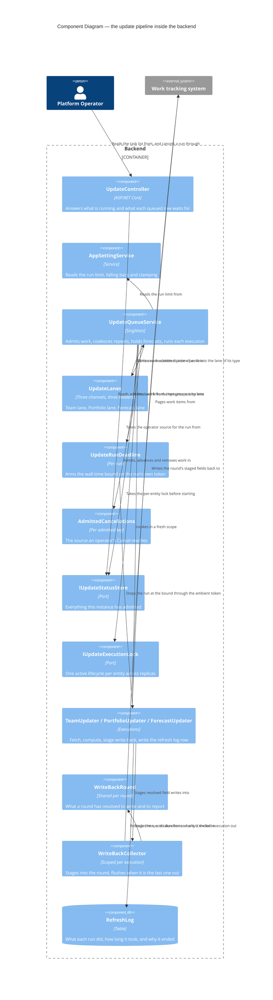

# Feature Delta — story-5877-update-queue-lanes

**ADO**: User Story #5877 — *Update queue is a single lane: one slow portfolio refresh starves all team
refreshes* · New · tagged `Release Notes` · Related to Epic #5511 · reported by Janée McConnell on
behalf of a user running 26.8.14.1 standalone (Tauri, macOS, SQLite) against Jira Data Center.

**Waves**: DISCUSS (2026-09-18) · DESIGN (2026-09-18).

**One line**: every refresh in Lighthouse queues in one lane, so a Portfolio refresh that will not
finish stops every Team refresh behind it — for 3h38m in the reported case — and nothing bounds how
long one refresh may hold that lane.

**Density**: `lean` + `ask-intelligent` (`~/.nwave/global-config.json`). Tier-1 `[REF]` only.

---

## Wave: DISCUSS / [REF] Persona IDs

| Persona | Role here |
|---|---|
| `platform-operator` | **Primary and only.** Runs the instance, watches the dashboards stop moving, and today has one remedy: restart it. Both flavours — the self-hoster on SQLite standalone (the reporter's user) and the SaaS operator on Tenant Zero. |

No new persona. The `lighthouse-maintainer` appears only as the person who dogfoods the change, not as
a stakeholder with a distinct job.

---

## Wave: DISCUSS / [REF] JTBD One-Liners

| Job ID | One-liner |
|---|---|
| `job-operator-keep-teams-moving-while-a-portfolio-refreshes` | When one entity's refresh is slow, I want every other entity to keep refreshing, so one slow portfolio does not read as a dead instance. |
| `job-operator-bound-a-refresh-that-will-not-end` | When a refresh stops making progress, I want Lighthouse to end it on its own and say so, so an instance cannot be lost to a single run nobody is watching. |

Both new, both `platform-operator`. Opportunity scores in `docs/product/jobs.yaml`.

---

## Wave: DISCUSS / [REF] Current-State Surface Inventory

Read from the code on 2026-09-18, not taken from the bug report's own analysis. The report carries a
root-cause section; it was re-derived, and where it is now out of date that is recorded.

| # | Fact | Evidence |
|---|---|---|
| S1 | **One lane, one reader, every update type.** A single `Channel.CreateUnbounded<Func<Task>>()` drained by one `await foreach (… ReadAllAsync())` loop that awaits each task to completion before taking the next. Registered as a singleton. Teams, Portfolios, Forecasts and both delete operations share it. | `UpdateQueueService.cs:11`, `:602-621`; `Program.cs:1528` |
| S2 | **`waitingBehind` names an arbitrary running row.** The read model picks `admitted.FirstOrDefault(work => work.Status == InProgress)` and calls that the lane holder. Correct only while exactly one thing can ever be running. | `UpdateController.cs:61-62` |
| S3 | **`WriteBackRound` is half thread-safe.** `Join`/`Leave` are `Interlocked` and `HasFinished` is `Volatile` — the parts written for concurrency. `Stage`, `TakeStaged`, `ReportRefresh`, `ReportForecast` and `TakeSummary` mutate plain `Dictionary` fields with no synchronisation. A Portfolio refresh and the Forecast it triggers **already share one round**; they are safe today only because they run one after the other. | `WriteBackRound.cs:15-17,24,33,42,79-107`; `PortfolioUpdater.cs:123`; `UpdateQueueService.cs` `RoundForNewWork` |
| S4 | **Nothing bounds an update's total wall-time, and the failure log names nothing.** The consumer loop awaits each task inside a bare `try/catch` that logs `"Error processing update task"` with no `UpdateKey`. A refresh that never returns holds the lane until the process restarts. | `UpdateQueueService.cs:610-620` |
| S5 | **A cancellation token *does* reach inside a connector call**, and the reachable granularity is one page round-trip. Measured 2026-09-14 by #5511's slice-04 probe, which runs in the ordinary suite. This was not known when #5877 was written; it means **evicting** a running refresh is mechanically possible, not only dropping queued work. | `slice-04-stop-a-refresh.md:97-154`; `API/Integration/TaskManager/Slice04CancellationReachProbe.cs` |
| S6 | **The cross-replica execution lock is already per-key**, not global — `AcquireAsync(updateKey, …)`. Parallel lanes do not weaken the guarantee that one key runs on one replica. | `UpdateQueueService.cs` `RunUpdateAsync`; `Program.cs:1511,1518` |
| S7 | **Each update already runs in its own DI scope**, and `IWriteBackCollector` is `Scoped`. Two concurrent executions get two collectors. The only shared mutable object on the path is the round itself (S3). | `UpdateQueueService.cs` `ExecuteUpdateTask`; `Program.cs:1386` |
| S8 | **On SQLite, each `DbContext` gets its own connection**, because `AddDbContext` uses the `(provider, options)` overload and so rebuilds the options per context. WAL is on and `busy_timeout` is 10 000 ms, so concurrent writers serialise at the file rather than failing — but 10 s is a ceiling, not a guarantee. | `DatabaseConfigurator.cs:23,60-83`, PRAGMAs at `:71-73` |
| S9 | **Item A of the report is already shipped.** `GetParentFeaturesDetails` chunks at `ReferenceIdsPerQuery`, with a test. | `690a208f9` (2026-09-14); `JiraWorkTrackingConnector.cs:349-356` |
| S10 | **Item C's visibility half is already shipped.** The task list shows what is running, for how long, in queue order, with a stop control — #5511 slices 02, 03, 04 and 07. Only C's wall-time *bound* is outstanding, exactly as that Epic's reconciliation predicted. | `feature-delta.md:1131` of `epic-5511-task-manager` |

∴ **S1 is the defect and S3 is its price.** Removing the single lane removes the only thing currently
making `WriteBackRound` safe, so round safety is not an optional hardening — it is a precondition, and
it has to land before the second consumer exists rather than after.

∴ **S2 makes the fix invisible if left alone.** With several lanes running, a queued Team would be
told it is waiting behind a Portfolio it is not waiting behind. The list would be wrong in exactly the
situation the list was built to explain.

∴ **S5 changes the shape of the bound.** #5877 proposed a watchdog that logs. The probe means it can
be a watchdog that *acts*, through the cancel path an operator already drives.

---

## Wave: DISCUSS / [REF] Locked Decisions

### D1 — Scope is item B plus item C's wall-time bound. Item A is done.

The report proposed A, B and C. A shipped on 2026-09-14 (S9). C's visibility half shipped as four
slices of #5511 (S10). What is left is the lane structure and the bound — confirmed with the user,
2026-09-18.

### D2 — Lanes are per update type, not N generic consumers

`UpdateType` has five members: `Team`, `Features` (portfolios), `Forecasts`, `PortfolioDelete`,
`TeamDelete`. N generic consumers would let two Portfolio refreshes run at once, which multiplies
tracker load in exactly the deployment that reported this — an on-premise Data Center instance already
close to its limits. Per-type lanes fix the reported starvation and change nothing about how hard any
one tracker is hit at a time.

### D3 — Within a type, work stays serial

One Portfolio refresh at a time; one Team refresh at a time. This is a deliberate retention, not an
oversight: same-type work is the work most likely to share a connection and a rate limit. Revisitable
in DESIGN if a lane turns out to be the wrong granularity, and listed in the handoff as such.

### D4 — `waitingBehind` means "what is holding *your* lane"

Not "something that is running". Corrects `UpdateController.cs:61`. A queued Team names the running
Team; a queued Portfolio names the running Portfolio; work whose lane is free never says it is
waiting behind anything.

### D5 — Round safety is a precursor commit, not a slice

Making `WriteBackRound` safe for two concurrent executions has no user-visible output of its own, so it
cannot ship as a slice — a slice of only `@infrastructure` stories is a structural failure. It lands as
the first commit of slice 01, before the second consumer exists.

### D6 — Deletes share their entity type's lane

`PortfolioDelete` runs in the Portfolio lane, `TeamDelete` in the Team lane. A delete and a refresh of
the same entity type serialising is the conservative reading, and deletes are awaited by an HTTP caller
that is already holding a response open. They are also the two update types that cannot be cancelled
(`UpdateController.cs` `CancelTask` refuses them), so they must not become evictable by D9 either.

### D7 — The bound is per run, not per key

A coalesced follow-up starts a fresh clock. Inheriting the elapsed time of the run it follows would
kill every follow-up of a long refresh the instant it started — a bound that makes the reported
symptom worse.

### D8 — The bound has a configurable value with a generous default, and the default is chosen from real data

Lighthouse already stores `DurationMs` for every refresh in `RefreshLog`. The default is set in DESIGN
from that distribution rather than guessed here; the reported instance's 77.7-minute run and #5687's
468-second pre-optimisation measurement are both on record as points it must clear. This is the one
deliberate gap in this wave's requirements completeness.

### D9 — Eviction uses the operator-cancel path, not a new mechanism

S5 proved a token reaches inside a connector call. The bound therefore drives the same
`AdmittedCancellations` path an operator's Cancel drives, and the run reaches the same visible terminal
state. The only new thing is who pressed it — which is why the refresh history has to distinguish the
two (AC-02.2). Not applicable to the two delete types (D6).

### D10 — RBAC: no new gate

The task list is already System Administrator only. The bound is instance configuration, which is
already administrator-only on every surface it could land on. No permission is added, removed or moved.

### D11 — Terminology: the tenant's words, everywhere the change is visible

Task-list rows already render the tenant's configured word for team and portfolio. Any new copy — the
reason on a bound-ended run, the bound's own setting label — uses the same source. No literal "Epic",
"Initiative" or "Project" in user-facing text.

### D12 — Lighthouse-Clients (CLI / MCP): not applicable, explicitly

No CLI or MCP tool exposes the update task list or instance refresh configuration. The
`UpdateTaskResponse` record keeps its shape; only `WaitingBehind`'s meaning is corrected (D4), and
nothing outside the frontend reads it.

### D13 — Website marketing surface: not applicable, explicitly

This removes a failure mode from an existing capability. It is release-notes material — the story
carries the `Release Notes` tag — not a new thing the site advertises.

### D14 — Free, not premium

Same as #5511. An instance that appears wedged is a correctness problem, and correctness is not a tier.

---

## Wave: DISCUSS / [REF] Scope Assessment

**PASS — right-sized.** Two user stories, two slices, one bounded context (the update pipeline), one
precursor commit. Backend-dominant with one small frontend consequence. No new endpoint, no schema
change, no external integration, no walking skeleton.

The one oversized signal that came close is "walking skeleton requires >5 integration points" — the
change touches the queue, the round, the read model, the cancel path and the refresh log. It is not
five *integrations*; it is five call sites in one context, all of them already in production and all of
them covered by the #5511 suite.

---

## Wave: DISCUSS / [REF] WS Strategy

**C — no walking skeleton.** Brownfield. Every mechanism on the path runs in production today: the
channel, the per-key execution lock, the ambient cancellation context, the task-list read model, the
refresh log. Nothing here is a mechanism nobody has run.

---

## Wave: DISCUSS / [REF] Driving Ports

| Surface | Change |
|---|---|
| Header → Task Manager popover | Several rows can read *Running* at once. A queued row names the holder of its **own** lane (D4). |
| Settings → System Info → refresh history | A run ended by the bound appears with its duration and a reason that distinguishes it from an operator's Cancel (D9). |
| `GET /api/latest/update/tasks` | Response shape unchanged. `WaitingBehind` semantics corrected (D4). |
| Instance configuration | Gains the wall-time bound. Which surface holds it is open for DESIGN (D8). |
| CLI / MCP | **None** (D12). |
| HTTP API additions | **None.** |

---

## Wave: DISCUSS / [REF] Pre-requisites

- **#5511 slices 01–08 are pushed.** Every surface this story changes was built by them. Nothing here
  is blocked on that Epic; the dependency is already satisfied.
- **#5511's sequencing decision is spent.** Its reconciliation said B should be "built in the same
  working session as slice 04, on the same branch, after slice 04's P5 probe has reported". The probe
  reported (S5) and slice 04 shipped, so the adjacency is no longer available. B is now a standalone
  pass over a class slice 04 already rewrote — which is the cost that decision was trying to avoid, and
  it is now sunk.
- No other in-flight item touches `UpdateQueueService`, `WriteBackRound` or `UpdateController`.

---

## Wave: DISCUSS / [REF] Out of Scope

- **Parallelising two refreshes of the same type** (D3).
- **The orphaned-feature cleanup path.** `PortfolioUpdater.cs:176` runs `CleanUpOrphanedFeatures()` in a
  `finally`, so it runs after a *failed* refresh too, and `OrphanedFeatureCleanupService` hard-deletes
  any Feature matching `!IsParentFeature && !Portfolios.Any()`. The reporter's log shows "Cleaned up 36
  orphaned features" immediately after the DNS failure. **Split to its own Bug** by user decision,
  2026-09-18 — it is a potential data-loss path with a different root cause, a different fix and a
  different urgency, and folding it in would make this story two stories wearing one number. Carried
  into the handoff with the verification it needs so it is not lost.
- **Queue ordinal position and wait estimate** — deferred item G's arithmetic half, already refused in
  #5511 (D15) because an estimate needs historical durations and is wrong in precisely the case #5877
  describes.
- **Jira parent-Feature chunking** — shipped (S9).
- **Priority or preemption between lanes.** Lanes are independent, not ranked.
- **Cross-replica lane coordination.** Each replica runs its own lanes; the per-key execution lock (S6)
  already prevents one key running twice.
- **Persisting queue wait in `RefreshLog`.** Would make KPI-1 cheaper to measure. Not required, and
  named in the handoff as an optional DESIGN addition rather than assumed.

---

## Wave: DISCUSS / [REF] User Stories

### US-01 — A slow Portfolio refresh stops holding up every Team

`job_id`: `job-operator-keep-teams-moving-while-a-portfolio-refreshes`

As a Platform Operator, when one Portfolio refresh is slow or stuck, I want every Team to go on
refreshing, so that I can tell "one portfolio is slow" from "Lighthouse is dead" without restarting it.

#### Elevator Pitch

```
Before: while a Portfolio refresh is running, no Team refresh starts; the instance looks wedged and
        only a restart clears it.
After:  open the Task Manager popover in the header while a long Portfolio refresh is running → sees
        the Team row reading `Running` beside the Portfolio's, and that Team's metrics dashboard
        showing a fresh last-updated moment.
Decision enabled: the operator decides whether one portfolio's query needs narrowing, instead of
        deciding whether to restart the instance.
```

#### Acceptance Criteria

- **AC-01.1** — With a Portfolio refresh **held open** (a connector double that blocks until released,
  not merely a slow one — the failure mode is starvation, and a test that waits for a slow refresh to
  finish passes against the bug), triggering a Team refresh takes it to `InProgress` while the
  Portfolio's is still `InProgress`.
- **AC-01.2** — With a Portfolio refresh held open, a second Portfolio refresh stays `Queued` (D3).
- **AC-01.3** — With a Portfolio and a Team both running and a second Team queued, the queued Team's
  `waitingBehind` is the **running Team's** name, not the Portfolio's (D4). Asserted over repeated
  reads, because `FirstOrDefault` over a concurrent store is non-deterministic and one correct read
  proves nothing.
- **AC-01.4** — Work whose lane is free reports `waitingBehind` as absent, never as an arbitrary
  running row.
- **AC-01.5** — A Portfolio refresh and the Forecast it triggers still write back **once, together**.
  With both executions staging into the same round concurrently, the set the round hands to the writer
  equals the union of what both staged — nothing lost, nothing sent twice (S3).
- **AC-01.6** — Cancelling a running update in one lane leaves a running update in another lane
  running.
- **AC-01.7** — Shutdown still drains: with work in flight in two lanes, `DrainAsync` returns only
  after both have finished or the shutdown timeout has elapsed, and neither is left admitted.
- **AC-01.8** — **Production data.** On Tenant Zero, against the real work-tracking connections, two
  `RefreshLog` rows exist whose run intervals overlap — one Team, one Portfolio. Synthetic doubles
  prove the lanes exist; only this proves they survive a real connector, a real database and a real
  write-back round.

---

### US-02 — A refresh that will not end is ended, and says so

`job_id`: `job-operator-bound-a-refresh-that-will-not-end`

As a Platform Operator, I want a refresh that has run past a sane bound to be stopped and recorded, so
that no single run can quietly hold a lane until I next restart the instance.

#### Elevator Pitch

```
Before: a refresh that never returns holds its lane until the process restarts; the log line says
        "Error processing update task" and names nothing.
After:  it stops on its own → the Task Manager row reaches `Cancelled`, and Settings → System Info →
        refresh history shows the run with its duration and a reason naming the bound it passed.
Decision enabled: the operator learns their refresh is systematically too slow for their tracker — and
        widens the interval or narrows the query — instead of discovering it as an apparently dead app.
```

#### Acceptance Criteria

- **AC-02.1** — An update whose total wall-time passes the bound is cancelled through the same path an
  operator's Cancel drives (D9), and its row reaches the `Cancelled` terminal state.
- **AC-02.2** — Its `RefreshLog` row records the run as cancelled with a reason naming the bound, and
  that reason is distinguishable from an operator-initiated cancel. An operator who did not press
  anything must not read a history that says they did.
- **AC-02.3** — The lane is free afterwards: the next queued work of that type starts.
- **AC-02.4** — It stops **within one page round-trip** of the bound firing, the granularity S5
  measured. If it does not, the bound is a log line rather than a lever, and the slice has failed its
  own hypothesis.
- **AC-02.5** — A coalesced follow-up starts a fresh clock (D7): after a run ends at the bound, its
  follow-up runs to completion rather than being killed immediately.
- **AC-02.6** — The bound is configurable, and a value that is absent or unreadable falls back to the
  default rather than to "no bound" or to zero.
- **AC-02.7** — The two delete types are never ended by the bound (D6) — a half-done delete leaves the
  caller told an entity is gone while its row is in the database.
- **AC-02.8** — **Production data.** On Tenant Zero, with the bound temporarily lowered, a real refresh
  against a real connector is ended by it, the history records it, the lane frees, and the next
  scheduled refresh of that type runs normally. Bound restored afterwards.

---

## Wave: DISCUSS / [REF] Story Map

**Backbone**: *Notice it is slow* → *Keep working anyway* → *Stop what will never finish* → *Read what
happened*.

The first and last activities are shipped (#5511 slices 02, 03, 07 and the refresh history). This story
fills the middle two.

| Slice | Story | Activity | Ships |
|---|---|---|---|
| 01 | US-01 | Keep working anyway | Per-type lanes, round safety as a precursor commit, corrected `waitingBehind` |
| 02 | US-02 | Stop what will never finish | Wall-time bound driving the cancel path, recorded in the refresh history |

Slice briefs: `slices/slice-01-teams-keep-moving.md`, `slices/slice-02-nothing-holds-a-lane-forever.md`.

---

## Wave: DISCUSS / [REF] Slice Taste Tests

| Test | Verdict |
|---|---|
| "Ships 4+ new components" → not thin | **Pass.** Slice 01 changes two classes and one read-model line; slice 02 adds one bound and one reason. |
| Every slice depends on a new abstraction → ship the abstraction first | **Pass, and acted on.** The lane abstraction is slice 01's own subject. Round safety is the shared precondition and is pulled out as a precursor commit (D5). |
| No slice disproves any pre-commitment → decoration | **Pass.** Slice 01 disproves that head-of-line blocking is the whole of "hung"; slice 02 disproves that the measured cancellation granularity is good enough to act on. Both are genuine, and both would change what gets built next. |
| Synthetic data only → proves plumbing | **Pass.** AC-01.8 and AC-02.8 are production-data criteria on Tenant Zero, and both are stated as overlapping or bound-ended `RefreshLog` rows rather than as an observation someone made. |
| 2+ slices identical except for scale | **Pass.** Different mechanisms, different risks. |
| Slice composition — every slice carries a user-visible value story | **Pass.** Both slices have a non-`@infrastructure` story with a complete Elevator Pitch. The one `@infrastructure` piece is a precursor commit, not a slice (D5). |

---

## Wave: DISCUSS / [REF] Prioritization

**Slice 01 first**, on learning leverage rather than dependency. Slice 02's bound is only worth having
if the lanes did not already answer the reported complaint — if teams keep moving, a stuck portfolio
becomes a slow portfolio rather than a dead instance, and the bound changes from a rescue to a tidy-up.
Building the rescue first would be building for a world slice 01 may have already removed.

Slice 01 also carries the concurrency risk. Failing there is cheaper before the bound exists to
complicate the picture.

**Slice 02 second**, and genuinely optional on slice 01's dogfood outcome — the one place in this story
where a slice may be dropped rather than deferred.

Dogfood cadence: each slice is dogfooded on Tenant Zero the day it ships (AC-01.8, AC-02.8).

---

## Wave: DISCUSS / [REF] Outcome KPIs

| # | KPI | Target | Measurement |
|---|---|---|---|
| KPI-1 | A Team refresh runs while a Portfolio refresh is in flight | ≥1 overlapping Team/Portfolio pair per day on Tenant Zero for 7 days after slice 01 | Two `RefreshLog` rows whose `[ExecutedAt − DurationMs, ExecutedAt]` intervals overlap. Persisted, so provable after the fact rather than observed live. |
| KPI-2 | Longest single update wall-time | No `RefreshLog.DurationMs` exceeds the configured bound plus one page round-trip, over 30 days after slice 02 | `RefreshLog.DurationMs` on Tenant Zero. |
| KPI-3 | Write-back integrity under concurrency | Zero staged updates lost | The concurrent-staging assertion in AC-01.5, plus comparing staged against written counts in the per-round write-back summary over the 7-day dogfood window. |
| KPI-4 | "I had to restart it" reports | 0 in the 60 days after release | Community and support reports naming a stuck or hung refresh, counted against the same 60-day window before release as a baseline. |

KPI-1 is deliberately not "queue wait under N seconds": `UpdateStatus.QueuedAt`/`StartedAt` live in the
status store and are not persisted, so a wait-time target would need a schema change this story does not
need. The overlap test answers the same question from data already written.

---

## Wave: DISCUSS / [REF] Definition of Done

1. Both slices' acceptance criteria pass as automated tests (NUnit; Vitest for the read-model change).
2. `dotnet build` zero warnings; `dotnet test` green on the non-connector filter.
3. `pnpm test` green; `pnpm build` zero errors and zero warnings; Biome clean on `./src`.
4. SonarQube Cloud introduces no new issue of any severity.
5. Backend mutation testing (Stryker.NET) run per-feature, ≥80% kill rate, recorded under
   `docs/feature/story-5877-update-queue-lanes/mutation/`. Frontend Stryker scoped to the changed
   task-list component.
6. `docs/` prose: the configuration page gains the wall-time bound and what it does. The concurrency
   change needs no user-facing prose — it removes a failure mode rather than adding a control.
7. Per-feature screenshots: **N/A, because** nothing changes what a screenshot would show. The task
   list's rows already render the same way; only how many can read *Running* at once differs, and that
   is not a stable thing to capture.
8. `ARCHITECTURE.md` / `docs/product/architecture/brief.md`: updated — the update pipeline's
   single-lane property is documented there and stops being true.
9. An ADR for the lane structure if DESIGN's answer differs from D2/D3, alongside ADR-183's precedent.
10. Lighthouse-Clients CLI/MCP version bump: **N/A, because** no client-facing contract changes (D12).
11. Website marketing surface: **N/A, because** this removes a failure mode from a shipped capability
    (D13).
12. RBAC impact: **N/A, because** no gate is added, removed or moved (D10).
13. Release notes drafted from the customer pain — "team metrics stopped updating and only a restart
    fixed it" — not from the mechanism. The story carries the `Release Notes` tag, and the reporter and
    the affected user are credited.
14. ADO #5877 transitioned New → Active → Resolved, not Closed. The orphaned-feature finding raised as
    its own Bug before #5877 resolves, so it does not leave with the story.

---

## Wave: DISCUSS / [REF] DoR Validation

| # | Item | Evidence |
|---|---|---|
| 1 | Business value stated | Both elevator pitches. A field report with logs: 3h38m of zero team updates, recovered only by restart, on a supported standalone configuration. |
| 2 | Job traceability | US-01 → `job-operator-keep-teams-moving-while-a-portfolio-refreshes`; US-02 → `job-operator-bound-a-refresh-that-will-not-end`. No `infrastructure-only` escape used. |
| 3 | Acceptance criteria testable | 16 ACs, each asserting an observed status, a persisted `RefreshLog` row, a rendered value, or a measured interval. Two are production-data criteria. |
| 4 | Dependencies known | #5511 slices 01–08 shipped; its sequencing decision recorded as spent. No other in-flight item touches the three files. |
| 5 | Sized | Two slices, ~6h and ~4h of crafter dispatch, plus a precursor commit inside slice 01. |
| 6 | Technical feasibility | S5 proves the eviction path exists and measures its granularity. S6, S7 and S8 establish that the execution lock, the DI scoping and the SQLite connection model already tolerate concurrent executions. S3 is the one genuine trap and it is named with file and line before a slice starts. |
| 7 | Non-functional constraints | Per-type lanes keep per-tracker concurrency at one (D3), so tracker load does not rise. SQLite writers serialise under WAL with a 10 s `busy_timeout` (S8) — a ceiling DESIGN must check against a real two-lane save, not assume. |
| 8 | UX defined | D4 fixes what a queued row says. AC-02.2 fixes what the history says and that it must not read as an operator action. No new control, no new surface. |
| 9 | Testable in isolation | `UpdateQueueService` and `WriteBackRound` are unit-testable with a blocking connector double; the read model through the existing `TaskManagerAcceptanceTest`; the frontend through the existing `TaskManagerIcon` tests. |

**Requirements completeness: 0.96.** The one deliberate gap is D8 — the bound's numeric default and the
configuration surface that holds it. Both are one decision, both are DESIGN's to make from `RefreshLog`
data this product already stores, and slice 01 does not depend on either.

**Per-wave peer review: skipped.** DoR surfaced no ambiguity, the JTBD rests on a field report with
logs rather than on assumption, and no vendor-neutrality risk appears in the ACs. The consolidated
review fires at end of DISTILL.

**Expansion catalog — one trigger fired.** AC ambiguity: no, every AC names an observable. Multi-
stakeholder: no, one persona. Compliance: no regulatory language. WS strategy is C, not D.
**Cross-context complexity: fires** — the change spans four distinct technologies on one path (ASP.NET
Core, React/TypeScript, Redis as the distributed status store and SignalR backplane, and
SQLite/Postgres under the execution lock). Suggested expansion: `alternatives-considered`. Offered at
wave end; not rendered.

---

## Wave: DISCUSS / [REF] Wave Decisions Summary

### Key Decisions

- **[D1]** Scope is B plus C's wall-time bound; A is shipped and C's visibility half is shipped
  (user, 2026-09-18).
- **[D2]** Per-type lanes, not N generic consumers — protects the on-premise tracker that reported this.
- **[D3]** Same-type work stays serial, deliberately; revisitable in DESIGN.
- **[D4]** `waitingBehind` means the holder of your own lane, correcting `UpdateController.cs:61`.
- **[D5]** `WriteBackRound` safety is a precursor commit inside slice 01, not a slice.
- **[D7]** The bound is per run; a coalesced follow-up starts a fresh clock.
- **[D8]** The bound's default comes from `RefreshLog` data in DESIGN, not from a guess here.
- **[D9]** Eviction drives the operator-cancel path, which S5 proved reaches inside a connector call.

### Requirements Summary

- Primary need: one slow entity must not stop every other entity refreshing, and no single run may hold
  a lane indefinitely.
- Walking skeleton scope: N/A — strategy C, brownfield.
- Feature type: **backend**, with one read-model correction visible in the frontend.

### Constraints Established

- `WriteBackRound`'s staging and reporting are unsynchronised (S3). Nothing may run two executions of
  one round concurrently until that is fixed.
- Per-tracker concurrency must stay at one (D3) — the reporting deployment is an on-premise Data Center
  instance already close to its URL and rate limits.
- On SQLite, concurrent writers serialise at the file with a 10 s `busy_timeout` ceiling (S8). DESIGN
  verifies a two-lane save against it rather than assuming WAL makes it free.
- The two delete types are never cancellable and never evictable (D6).
- Deleting the single lane deletes the only thing that currently makes several invariants hold by
  construction. Each one named above gets a test, not an argument.

### Upstream Changes

No DISCOVER or DIVERGE wave ran for this story. The nearest upstream artifact is the **Post-DESIGN
Reconciliation** in `docs/feature/epic-5511-task-manager/feature-delta.md:1096`, and this wave changes
two of its conclusions:

> **Original (2026-09-14, `feature-delta.md:1130`)**: *"**Sequence with slice 04.** Slice 04's probe
> (P5, S9+S10) answers part of B for free: whether cancellation can reach inside a connector call
> determines whether an eviction path is even possible."*

**New assumption**: the probe reported and slice 04 shipped, so the adjacency is spent and B is a
standalone pass. The probe's *answer* survives and is stronger than expected — a token reaches inside a
connector call, at one page round-trip of granularity — which is why D9 makes the bound act rather than
log. Recorded here rather than back in #5511, whose DISCUSS documents are not modified.

> **Original (2026-09-14, `feature-delta.md:1131`)**: *"**C** … **Covered by 02 + 03.** Only the
> wall-time bound is genuinely new."*

**New assumption**: unchanged in substance, and now acted on — the bound is US-02, and slices 02, 03
and 07 having shipped is what makes it the only outstanding half.

---

## Wave: DISCUSS / [REF] SSOT Updates

| File | Change |
|---|---|
| `docs/product/jobs.yaml` | Two new jobs with dimensions, four forces and opportunity scores; `story-5877-update-queue-lanes` added to `feature_context`. |
| `docs/product/journeys/story-5877-update-queue-lanes.yaml` | New journey `keep-working-while-one-thing-is-slow`, with emotional arc, shared artifacts and error paths. |
| `docs/product/personas/platform-operator.yaml` | Both new job IDs appended to `primary_jobs`. |

---

## Wave: DISCUSS / [REF] Handoff

**To**: `nw-solution-architect` (DESIGN) — full artifact set.
**To**: `nw-platform-architect` (DEVOPS) — KPIs only. Expected to be close to a no-op: no deployment,
infrastructure or new observability surface, though KPI-2 leans on `RefreshLog` retention.

Open for DESIGN:

1. **D8 — the bound's default and where it is configured.** The number comes from `RefreshLog`'s
   duration distribution, not from a guess. It must clear both the reported 77.7-minute run and
   #5687's 468-second pre-optimisation measurement.
2. **How lanes are realised.** N readers keyed by `UpdateType` over one channel, or one channel per
   type. The second makes D3 true by construction; the first makes it a filter that can be got wrong.
3. **How `WriteBackRound` becomes safe.** A lock inside the round, concurrent collections, or a
   per-execution staging area merged on `Leave`. The third is the only one that also removes
   last-stage-wins ambiguity between two executions of one round — and the only one that changes
   observable behaviour, so it needs a decision rather than a preference.
4. **Whether the lane is the right granularity**, or whether per-connection would serve D3's intent
   better — two Portfolios on two different trackers have no reason to wait for each other.
5. **Whether `RefreshLog` should carry queue wait.** Out of scope for this story; it would make KPI-1
   direct rather than inferred, and it is the kind of thing that is cheap now and expensive later.

Carried, not scoped — **raise as its own Bug before #5877 resolves**:

> `PortfolioUpdater.cs:176` runs `CleanUpOrphanedFeatures()` in a `finally`, so it runs after a failed
> refresh too, and `OrphanedFeatureCleanupService` hard-deletes any Feature matching
> `!IsParentFeature && !Portfolios.Any()`. The reporter's log shows "Cleaned up 36 orphaned features"
> immediately after the DNS failure. **Verification it needs**: whether `UpdateFeaturesForPortfolio` can
> leave a Feature detached from its Portfolio at any point a mid-refresh failure could land on. If it
> can, a transient network failure deletes real data, and the fix is ordering, not cleanup.

---

# Wave: DESIGN (2026-09-18)

**Architect**: Morgan (Solution Architect) · interaction mode = **PROPOSE** · scope = Application /
components. Paradigm fixed by the project: object-oriented, C# .NET 10, ports-and-adapters. Not
re-opened.

**Pre-slice SPIKE**: `⊘` — no SPIKE directory exists for this feature, and none is needed. The probe
that would have been its input already ran under Epic #5511 and lives at
`docs/feature/epic-5511-task-manager/slices/slice-04-stop-a-refresh.md:97-154`.

**ADRs written**: [ADR-195](../../product/architecture/adr-195-update-queue-is-three-lanes-one-channel-each.md)
(lane structure), [ADR-196](../../product/architecture/adr-196-write-back-round-concurrency-contract.md)
(round concurrency contract), [ADR-197](../../product/architecture/adr-197-update-run-wall-time-bound-is-an-in-process-deadline.md)
(the bound). ADR-193 and ADR-194 are unused in this worktree; 195 was taken as instructed to avoid
colliding with work in flight elsewhere.

---

## Wave: DESIGN / [REF] Resolved Open Questions

The five DISCUSS handed over, answered in its order.

### Q1 — D8: the bound's default and where it is configured

**180 minutes, in a new unseeded `AppSettings` key `Update:MaxRunMinutes`, editable in
Settings → Configuration.** Full derivation in ADR-197 §4; the short form is that 180 minutes is
already this product's own statement about staleness — `RefreshAfter` ships at 180 for both Teams and
Portfolios — so a run still going after three hours has outlived the window its own result was meant to
close. It clears the reported 77.7-minute run by 2.3× and #5687's 468-second pre-optimisation
measurement by 23×. It is **not** derived from `RefreshAfter` at runtime; coupling them would mean an
operator lowering `RefreshAfter` to thirty minutes silently starts killing forty-five-minute refreshes.

The surface was chosen by looking at what exists rather than by inventing one. `OptionalFeature` is
boolean-only and carries no value. Nothing in the refresh pipeline is `IOptions`-bound — the Team and
Portfolio refresh intervals are `AppSettings` rows in whole minutes, read per call, so that is the
convention. Within `AppSettings`, the code shape for "a number with an in-code fallback and a clamp"
is `GetRefreshLogRetentionRuns` — read by key, parse, fall back, clamp — and that is copied.

**Its row is seeded; ours is not**, deliberately, for two reasons. It makes AC-02.6's "absent falls
back to the default" a property of the read rather than a consequence of a seeder having run, and the
read is the thing under test. And it sidesteps a live trap: `AppSettingSeeder` inserts rows with
hardcoded identifiers and `RemoveObsoleteSettings()` deletes identifiers 9 through 42 on every boot,
so a seeded row in that band is removed on the next start without a word. The write path upserts, in
the shape the survey-nudge settings already use.

Rejected: a fourth field on `RefreshSettings`, which would have come with the existing form, route and
DTO for free. `ForecastUpdater.GetRefreshSettings()` throws `NotSupportedException` — forecasts have
no periodic refresh — so a bound living there could not cover the Forecast lane at all.

### Q2 — how lanes are realised

**One channel and one reader per lane; three lanes; the lane is a total function of `UpdateType`
evaluated at enqueue time.** D3 is true by construction, not by a filter.

"N readers keyed by `UpdateType` over one channel" does not work mechanically: a channel reader cannot
decline an item it has already taken, so it would have to dequeue and requeue — reordering the queue
and spinning whenever every pending item belongs to a busy type. Its closest working variant, N generic
readers plus a `SemaphoreSlim(1)` per type, is rejected because with all N readers blocked on one
type's semaphore, head-of-line blocking returns in a form that looks exactly like the bug being fixed
and is much harder to see. One reader per lane cannot have that failure mode.

### Q3 — how `WriteBackRound` becomes safe

**One lock inside the round, held across `Stage`, `TakeStaged`, `ReportRefresh`, `ReportForecast` and
`TakeSummary`. `Join`/`Leave`/`HasFinished` keep their `Interlocked`/`Volatile` implementations.**
ADR-144 §3's last-stage-wins for passes *within* one execution is preserved exactly.

The per-execution staging area merged on `Leave` was the option DISCUSS singled out, and it is rejected
on its own terms. It does not remove the cross-execution last-stage-wins ambiguity, it relocates it:
"whichever merged last" is the same arbitrariness read off a different clock. And it needs the very
lock it was meant to replace — the merge must be visible *before* the decrement that tells the last
leaver it may take the staged set, or that leaver reads a staging area another execution is still
merging into and writes a subset. Concurrent collections were rejected for fixing the smallest of the
three races and leaving the other two while looking safe. Full reasoning in ADR-196.

### Q4 — is the lane the right granularity?

**Yes. D2/D3 upheld.** Per-connection is attractive and fails on a fact rather than on taste: a
Portfolio's Features can come from several work tracking system connections, so *the* connection of a
piece of work is not a function of it and the partition is not well defined. Two further costs: the
connection is not known at enqueue time without a repository read on a path that today touches no
database, and a dynamic lane set makes the drain, the reader-task set and the read model's lane-holder
resolution all moving targets.

Recorded as revisitable with a named cheaper next step: if a real instance shows two trackers starving
each other, add a per-connection concurrency limit *inside* the Portfolio lane. That raises concurrency
without making the lane set dynamic and without touching the read model.

### Q5 — should `RefreshLog` carry queue wait?

**No.** Three reasons, and the third is the one that decides it.

It is a schema change for a number KPI-1 already answers from data the product writes today — two rows
whose run intervals overlap. `QueuedAt`/`StartedAt` live in the status store, which ADR-076 defines as a
non-authoritative coordination projection; persisting a duration derived from it creates a second source
for a fact that store owns, and ADR-182 already establishes that those moments are best-effort and may
be absent. And the "cheap now, expensive later" argument does not hold here: it would be one additive
nullable column later too, exactly as it would be now. This repo does expand-only migrations routinely
and has a guard test for them.

The honest counter is recorded: if queue wait is *still* an interesting number after slice 01, that is a
signal the lanes did not work, and the measurement worth adding then is the one that says why — which is
not a scalar on a log row.

---

## Wave: DESIGN / [REF] Decisions

| # | Decision | Why |
|---|---|---|
| **DDD-1** | Three lanes — Team, Portfolio, Forecast — one `Channel` and one reader task each. | D3 true by construction. Per-tracker concurrency stays at one per update type. |
| **DDD-2** | The lane is a total function of `UpdateType`, evaluated at enqueue time, in one place. | Costs no database read, and makes "a sixth update type lands nowhere" a test rather than a hope. |
| **DDD-3** | The lane machinery is extracted into `UpdateLanes`. | `UpdateQueueService` is 649 lines; the concern is cohesive, and the drain becomes testable without the whole service. |
| **DDD-4** | The channel carries `(UpdateKey, Func<Task>)` rather than a bare delegate. | Closes S4 — the reader's backstop currently logs `"Error processing update task"` naming nothing — and gives the lane its routing key from the item itself. One change, two jobs. |
| **DDD-5** | `DrainAsync` completes all three writers and awaits all three reader tasks together under the caller's token. | AC-01.7. Bounded by the existing 30 s `Shutdown:TimeoutSeconds`. |
| **DDD-6** | `WaitingBehind` is resolved per lane, in `UpdateController`, on the read path. No store change. | `GetAdmittedWork()` already returns everything (ADR-181); grouping by lane is a read-path concern. |
| **DDD-7** | `AdmittedWorkOrdering` keeps its comparator; its claim narrows from the instance to a lane. | A queue position across lanes is not a number that exists. The per-lane truth is carried by `WaitingBehind`. |
| **DDD-8** | Hold bookkeeping (`heldUpdates` mutation + `ReleaseClearedHolds`) runs under one lock in the queue. | The mechanism was written against a single reader and is now reached from three. One production caller, non-blocking synchronous work under the lock. |
| **DDD-9** | **A hold that displaces an earlier hold for the same key leaves the displaced round.** | Latent bug today, live the moment two lanes can reach `ForecastUpdater`'s `IsHeld` guard at once. A round nobody leaves never finishes and silently drops every write it staged. |
| **DDD-10** | `WriteBackRound` is a bounded-change component: one lock over its contents, `Interlocked` counter unchanged, every take atomic and idempotent by emptiness. | ADR-196. Absorbs the double-`TakeSummary` that lanes newly make reachable. |
| **DDD-11** | Staging into a round after leaving it is refused, loudly. | The alternative is losing writes quietly, which is the failure the whole precursor commit exists to prevent. |
| **DDD-12** | The bound is an in-process deadline armed when the run starts, linked with the per-key operator source, through the injected `TimeProvider`. | Cannot miss: the process that runs the work arms the clock. A store-scanning watchdog would silently never fire for any key whose `StartedAt` is absent, which ADR-182 says is legitimate. |
| **DDD-13** | The clock starts after the execution lock is acquired and the status advances to `InProgress`. | Queue wait and another replica's lock wait are not this run's doing. D7's fresh clock per run falls out of the per-run source. |
| **DDD-14** | Deletes get no deadline at all, decided in the one function that decides a run's bound. | D6, structurally rather than by an `if` scattered across the terminal paths. |
| **DDD-15** | The reason is derived from *which* cancellation source fired, operator taking precedence — not from a flag written at stop time. | Two stops can land in the same instant. A derived answer is race-free and says the truthful thing. |
| **DDD-16** | `Update:MaxRunMinutes` — one instance-wide `AppSettings` key, whole minutes, **not seeded**, default 180, clamped to [5 min, 24 h], with absent/unparseable/non-positive falling back to the default. | Q1. Two deliberate divergences from `GetRefreshLogRetentionRuns`, whose code shape this otherwise copies: its row is seeded and this one is not, and it clamps a zero up to its floor where this one falls back — clamping a typed zero to five minutes would give an instance that cannot complete any refresh. |
| **DDD-17** | `RefreshLog` gains one nullable reason column; the bound writes a **token**, not a sentence. | The reason already exists as `SyncOutcome.Reason` and is thrown away. A sentence composed in the backend would hardcode words the tenant may have renamed. |
| **DDD-18** | The refresh history splits its single *Cancelled* figure into operator-stopped and bound-stopped. Both stay out of the success-rate denominator. | AC-02.2's operative clause. A run the instance stopped still says nothing about whether refreshing works. |
| **DDD-19** | The log line for a bound-ended run says so, at `Warning`, naming the entity and the bound it passed. | The existing cancel path logs `"…was cancelled"` at `Information`, which reads as an operator action and is invisible at the default reporting level. An instance ending its own run is the one thing in this feature an operator most wants to find later, and the recent-problems popover only surfaces warnings and errors. |

---

## Wave: DESIGN / [REF] Component Decomposition

| Kind | Component | Change |
|---|---|---|
| **NEW (backend)** | `UpdateLanes` | Owns three channels, three reader tasks, `WriteTo(key, work)`, `DrainAsync`. The only place a lane exists. |
| **NEW (backend)** | `UpdateLane` (enum) + the `UpdateType → UpdateLane` mapping | Three members. Total over `UpdateType`, asserted. |
| **NEW (backend)** | `QueuedUpdate` (record) | `(UpdateKey Key, Func<Task> Run)`. Replaces the bare `Func<Task>` in the channel. |
| **NEW (backend)** | `UpdateRunDeadline` + `IUpdateRunDeadlines` | Arms the per-run deadline, exposes the token the execution uses and whether the bound is what stopped it. The factory is where D6's exemption and the bound's clamp live. |
| **EXTEND (backend)** | `UpdateQueueService` | Channel and reader loop move to `UpdateLanes`; hold bookkeeping goes under a lock; displacement leaves the displaced round; the run arms and disposes its deadline. `IUpdateQueueService` signatures unchanged. |
| **EXTEND (backend)** | `WriteBackRound` | One lock over contents; takes become atomic; stage-after-finish refused. |
| **EXTEND (backend)** | `UpdateController` | `WaitingBehind` resolved per lane. Response record unchanged. |
| **EXTEND (backend)** | `AdmittedWorkOrdering` | Doc comment only — the comparator is unchanged and the claim narrows to a lane. |
| **EXTEND (backend)** | `IAppSettingService` + `AppSettingService` + `AppSettingKeys` | One key, one accessor, one pure clamp. |
| **EXTEND (backend)** | `AppSettingsController` | One `GET`/`PUT` pair under the guard every other write there carries. |
| **EXTEND (backend)** | `RefreshLog` + both migration projects | One nullable reason column, expand-only. |
| **EXTEND (backend)** | `TeamUpdater`, `PortfolioUpdater`, `ForecastUpdater` | The `finally` that writes the log row records `outcome.Reason`, which it already holds in scope. |
| **EXTEND (backend)** | `SyncOutcome` | One reason constant beside `ConfigurationChanged`. |
| **EXTEND (frontend)** | `RefreshLog.ts`, `RefreshHistorySection.tsx` | The reason field; the *Cancelled* figure splits in two. |
| **EXTEND (frontend)** | `SystemSettingsTab.tsx` + one small updater component + `SettingsService.ts` | One numeric field, modelled on `RefreshSettingUpdater`. |
| **EXTEND (frontend)** | `ActivitySection.tsx` | Comment only — the sentence explaining the single spinner asserts that only one thing can ever be running, and that stops being true. Rendering is already per row and is correct as drawn. |
| **REUSE AS-IS** | `IUpdateStatusStore` and both adapters, `IUpdateExecutionLock`, `IUpdateCompletionNotifier`, `IUpdateCancellationNotifier`, `UpdateSubstrate`, `UpdateCancellationContext`, `WriteBackRoundContext`, `WriteBackCollector`, `IWriteBackTriggerService`, `UpdateProgress`, `UpdateStatus`, `UpdateTaskResponse`, `IUpdateTaskNaming`, `TimeProvider`, `IRefreshLogService` | No change of any kind. |
| **DELETE** | — | Nothing. |

**Out of scope, untouched**: `PortfolioUpdater.cs:176`'s orphaned-feature cleanup `finally`. No
component above reaches it; the outer `finally` at `:174-177` is not modified.

---

## Wave: DESIGN / [REF] Reuse Analysis

Hard gate: every overlapping component classified, zero unjustified `CREATE NEW`.

| Existing component | Overlap with what this feature needs | Decision | Justification |
|---|---|---|---|
| `UpdateQueueService` | The whole enqueue/execute/coalesce/hold/drain path | **EXTEND** | It is the subject. Its port signatures are frozen by an existing test and stay frozen. |
| `Channel<Func<Task>>` + `StartProcessingQueue` | The lane itself | **EXTEND → relocate** | Same primitive, three instances, moved into `UpdateLanes`. Not a rewrite; the reader loop body is carried over with its backstop. |
| `AdmittedCancellations` | Per-key cancellation source lifetime | **REUSE AS-IS** | The deadline is a *linked* source owned by the run, not a second entry in this dictionary. Nothing about admit/forget/stop changes. Extending it would give it a second lifetime rule to hold. |
| `UpdateCancellationContext` | Publishing the token the connector reads | **REUSE AS-IS** | It publishes whatever token `ExecuteUpdateTask` hands it. That token is now linked; the context does not care, and its single-writer ArchUnit rule is unaffected. |
| `WriteBackRound` | Shared round state across two executions | **EXTEND** | The precursor commit. Contract shape changes from "unbounded, safe by accident" to bounded-change with a declared universe. |
| `WriteBackRoundContext` | Ambient round per execution | **REUSE AS-IS** | `AsyncLocal`, so each lane's reader flow has its own value. Nothing to change. |
| `WriteBackCollector` | Stage + flush per execution | **REUSE AS-IS** | Scoped, one per execution, already gates `TakeStaged` on `Leave()`'s return value — which is the race-free half. |
| `IUpdateStatusStore` (both adapters) | Admitted work, queued-work predicate, enumeration | **REUSE AS-IS** | ADR-181 already added enumeration. Grouping by lane is a read-path concern and belongs in the controller, not in the store. Extending it would put a lane — a queue-implementation fact — into a port two adapters implement. |
| `IUpdateExecutionLock` | Cross-replica single-active-lifecycle per key | **REUSE AS-IS** | Already per key (S6). Lanes do not weaken it; it is what enforces INV-4. |
| `AdmittedWorkOrdering` | Display order of admitted work | **REUSE AS-IS** (comment only) | The comparator still produces a correct, stable order. Only its documented claim narrows. |
| `UpdateController` + `UpdateTaskResponse` | The read model | **EXTEND** | One line's meaning is corrected. The record shape and every route are untouched, so no client contract moves. |
| `IAppSettingService` / `AppSettingKeys` / `AppSettingsController` | Instance-wide numeric configuration | **EXTEND** | `GetRefreshLogRetentionRuns` is the exact shape needed. Building a config surface for one number when this one exists would be the definition of unjustified. |
| `RefreshSettings` (DTO + form) | A per-refresh-kind settings surface | **REJECTED as the home** | `ForecastUpdater` throws on `GetRefreshSettings()`. The bound must cover the Forecast lane; this cannot. |
| `OptionalFeature` | Instance-wide setting | **REJECTED as the home** | Boolean only, no value column. |
| `RefreshLog` + `IRefreshLogService` | The record an operator reads | **EXTEND** | One nullable column. The reason value already exists at the write site and is discarded; this is closing a gap, not adding a field for one caller. |
| `SyncOutcome.Reason` + `ConfigurationChanged` | A machine-readable reason token | **EXTEND** | One constant beside an existing one, same convention. |
| `TimeProvider` + `FakeTimeProvider` | A fakeable clock for the deadline | **REUSE AS-IS** | Already registered in DI and already used this way by the key-ring watcher and three other suites. |
| `ILighthouseClock` | "Now" for elapsed time on the read path | **REUSE AS-IS** | Stays the read model's clock. Not used for the deadline: the deadline needs a *timer*, which is what `TimeProvider` gives. |
| `FlushRecordingWriteBackCollector` (test) | Asserting a round flushed exactly once | **REUSE AS-IS** | The instrument AC-01.5 needs already exists in the task-manager suite. |
| `Slice04CancellationReachProbe` | Evidence that a token reaches inside a connector call | **REUSE AS-IS** | Already in the ordinary suite; it keeps being true and the bound rests on it. |
| `ExpandOnlyMigrationGuard` | Migration policy | **REUSE AS-IS** | The new column is additive and nullable; the guard already checks this. |

**Four `CREATE NEW`, each with the extension it rejects:**

| New unit | Rejected extension | Why |
|---|---|---|
| `UpdateLanes` | Leave the channels inline in `UpdateQueueService` | Three channels, three reader tasks and a three-way drain inside a 649-line class makes the drain untestable without standing up SignalR, the status store, the execution lock and both notifiers. The concern is cohesive and has one reason to change. |
| `UpdateLane` + the mapping | A `switch` at each use site | There would be three use sites — write, drain, read-model grouping — and three places for D6's delete grouping to drift. One total function, one exhaustiveness test. |
| `QueuedUpdate` | Keep `Func<Task>` and close over the key | A closure cannot be read by the reader's backstop, which is the thing S4 says names nothing. |
| `IUpdateRunDeadlines` / `UpdateRunDeadline` | Arm `CancelAfter` inline in `RunUpdateAsync` | The decision half — the exemption, the clamp, the fallback — is a pure function of `(UpdateType, stored string)` and is where six acceptance criteria are asserted. Inline, it is only reachable by running a queue. |

**Contract shapes** (so DELIVER declares its mutation universe rather than discovering it):

| Component | Shape | Declared universe | Assertion mechanism |
|---|---|---|---|
| `UpdateType → UpdateLane` | **pure function**, total | none | Exhaustive test over `Enum.GetValues<UpdateType>()` |
| Bound decision `(UpdateType, string?) → TimeSpan?` | **pure function** | none | Parameterised test over absent / unparseable / 0 / negative / below floor / above ceiling / both delete members |
| `UpdateRunDeadline` | bounded-change | its own two token sources | Disposal asserted; the run's terminal path is the only consumer |
| `WriteBackRound` | **bounded-change** | its own four fields, nothing reachable from outside | Union-of-stagings test, exactly-one-summary test, stage-after-finish refusal, and a structural check that nothing outside the class touches its state |
| `UpdateLanes` | bounded-change | three channels and three reader tasks | Drain test across two occupied lanes |
| `UpdateController` lane-holder resolution | **pure function** over the admitted set | none | Asserted over repeated reads |

---

## Wave: DESIGN / [REF] Driving Ports

| Surface | Method / route | Guard | Change |
|---|---|---|---|
| Header → Task Manager popover | — | SystemAdmin (existing) | Several rows can read *Running* at once. A queued row names the holder of its **own** lane. |
| Task list read | `GET /api/{v1,latest}/update/tasks` | `RbacGuard(SystemAdmin)` | **Response shape unchanged.** `WaitingBehind`'s meaning corrected. |
| Cancel | `POST /api/{v1,latest}/update/tasks/{updateType}/{id}/cancel` | `RbacGuard(SystemAdmin)` | Unchanged, including its refusal of both delete types. |
| Settings → Configuration | `GET /api/{v1,latest}/appsettings/UpdateRunLimit` | `RbacGuard` (defaults to SystemAdmin) | **NEW** — reads the bound in whole minutes. |
| Settings → Configuration | `PUT /api/{v1,latest}/appsettings/UpdateRunLimit` | `RbacGuard` (defaults to SystemAdmin) | **NEW** — writes it. Same controller, same guard as every other setting write. |
| Settings → System Info → refresh history | `GET /api/{v1,latest}/systeminfo/refreshlog` | `RbacGuard(SystemAdmin)` | Route unchanged. The entity is returned raw, so the new reason column is exposed automatically. |
| SignalR `updateNotificationHub` | groups per key and `GlobalUpdates` | connection-level | Unchanged. A bound-ended run publishes the same `Cancelled` terminal status an operator's Cancel produces. |
| CLI / MCP | — | — | **None.** No client surface reads the task list or instance refresh configuration. |

**RBAC**: no gate added, removed or moved. The two new routes sit on a controller whose writes are
already System-Administrator-only, which is what D10 asserted and is now checked against the code
(`RbacGuardAttribute` defaults to `SystemAdmin`).

---

## Wave: DESIGN / [REF] Driven Ports and Adapters

| Port | Adapter(s) | Change |
|---|---|---|
| Update status store | `InProcessUpdateStatusStore` / `RedisUpdateStatusStore` | **UNCHANGED.** No new member, no new access pattern, both Lua scripts still frozen. |
| Update execution lock | `InProcessUpdateExecutionLock` / `PostgresUpdateExecutionLock` | **UNCHANGED.** Still per key, still acquired inside the execution. |
| Completion / cancellation notification | in-process and Redis pairs | **UNCHANGED.** |
| Work tracking system | `IWorkTrackingConnector` ×5 | **UNCHANGED.** The bound rides the token the paging methods already take. |
| App settings persistence | `IRepository<AppSetting>` → `LighthouseAppContext` | **EXTEND** — one key, read by the existing per-call path. No cache introduced. |
| Refresh log persistence | `IRepository<RefreshLog>` → `LighthouseAppContext` | **EXTEND** — one nullable column, expand-only, both provider projects, generated with `CreateMigration`. |
| Clock / timer | `TimeProvider` | **REUSE** — the deadline's delay. `TimeProvider.System` in production, `FakeTimeProvider` in tests. |
| Relational store | SQLite / Postgres | **UNCHANGED in shape, newly concurrent in use.** At most three concurrent `SaveChanges` instead of one. Nothing holds a write transaction across a connector call, so the window a writer holds the SQLite file is the save itself. WAL plus a 10 000 ms `busy_timeout` is the mechanism; it is a ceiling, and it is probed rather than assumed. |

**External integrations requiring contract tests**: none added. Jira, Azure DevOps, Linear and
ServiceNow are already consumed through `IWorkTrackingConnector` and this feature changes no call to
any of them. The live-connector test categories stay excluded from the ordinary run.

---

## Wave: DESIGN / [REF] Technology Choices

**No new technology, no new dependency, no new licence.** Everything used is already pinned:
`System.Threading.Channels` (already the queue's primitive), `System.Threading` primitives, .NET's
`TimeProvider`, EF Core, ASP.NET Core .NET 10, NUnit 4.6 + Moq + `Microsoft.Extensions.TimeProvider.Testing`
10.10.0, ArchUnitNET, React 18 + TypeScript + MUI, Vitest + RTL. The whole feature is three channels
instead of one, one lock, one linked cancellation source, one settings key and one nullable column.

**Rejected additions**, each named so the absence is a decision: a background timer service for the
bound (the deadline needs no scan), a distributed scheduler (the bound is per run in the process that
runs it), a concurrent-collection dependency, and any cache in front of `AppSettings` (the read happens
once per run).

---

## Wave: DESIGN / [REF] C4 System Context

Unchanged by this feature, and included because the change is invisible from here — which is the point:
no actor, no external system and no boundary moves.



## Wave: DESIGN / [REF] C4 Container



Redis is optional and absent on the configuration that reported this. With no Redis the in-process
adapters answer everything and the lanes are unchanged — they are a per-replica structure and need no
coordination.

## Wave: DESIGN / [REF] C4 Component — the update pipeline



The two arrows that carry this feature: `UpdateQueueService → UpdateLanes` is where head-of-line
blocking used to live, and `WriteBackCollector → WriteBackRound` is where two executions now meet.

---

## Wave: DESIGN / [REF] Architectural Enforcement

Language-appropriate and matching the three rule styles already in this repo's `Architecture` folder:
fluent ArchUnitNET dependency rules, reflection signature freezes, and source scanners for "may read
but not write".

| Rule | Mechanism |
|---|---|
| Every `UpdateType` maps to exactly one lane | NUnit over `Enum.GetValues<UpdateType>()` — a new member fails the build rather than landing nowhere |
| Deletes run in their entity type's lane | NUnit asserting both delete members' mapping directly |
| `IUpdateQueueService` keeps `EnqueueUpdate` and `EnqueueAndAwaitAsync` verbatim | Existing reflection signature freeze, extended to `DrainAsync` |
| Only `UpdateQueueService` writes `WriteBackRoundContext.Current` | Source scanner, mirroring the one that already guards `UpdateCancellationContext`. The context claims a single writer in its own doc comment and has never had a guard; a second writer across lanes would be catastrophic rather than merely wrong |
| Only `UpdateQueueService` writes `UpdateCancellationContext.Current` | Existing source scanner, unchanged |
| Nothing outside `WriteBackRound` reaches its state | ArchUnitNET dependency rule on the staging types |
| `UpdateLanes` depends on no repository, no `DbContext` and no connector | ArchUnitNET — the lane is a queue concern and must not learn what it is running |
| The bound's decision function performs no I/O | ArchUnitNET: it depends on no repository, no `DbContext`, no `IAppSettingService` — it takes the stored string |
| The new `RefreshLog` column is additive and nullable | Existing `ExpandOnlyMigrationGuard` |
| Both new app-settings routes carry the guard | Integration test enumerating them, matching the existing pattern |
| The reason token is never user-facing prose from the backend | Frontend test asserting the history renders its own copy for known tokens |

---

## Wave: DESIGN / [REF] Changed Assumptions

Quoted verbatim from the DISCUSS sections of this file, which are not edited in place.

> **Original** — `docs/feature/story-5877-update-queue-lanes/feature-delta.md`,
> `## Wave: DISCUSS / [REF] Scope Assessment`: *"Backend-dominant with one small frontend consequence.
> No new endpoint, no schema change, no external integration, no walking skeleton."*

**New assumption**: slice 02 needs **one new endpoint pair and one schema change**. AC-02.2 requires a
reason distinguishable from an operator's cancel, and `RefreshLog` has `Cancelled` but no reason column
of any kind — the reason the product already computes (`SyncOutcome.Reason`) reaches only the Serilog
line. One nullable string column, expand-only, both provider projects, generated with the existing
`CreateMigration` script and covered by the existing expand-only guard. The endpoint pair is the
bound's read and write on the existing app-settings controller, under the guard that controller's
writes already carry. Slice 01 is unaffected: it still has no endpoint and no schema change.

> **Original** — same file, `## Wave: DISCUSS / [REF] Definition of Done`, item 7: *"Per-feature
> screenshots: **N/A, because** nothing changes what a screenshot would show. The task list's rows
> already render the same way; only how many can read *Running* at once differs, and that is not a
> stable thing to capture."*

**New assumption**: true for slice 01 and the task list, **not** true for slice 02. Settings →
Configuration gains a field, and the refresh history's *Cancelled* figure becomes two figures. Both are
stable, capturable surfaces. Screenshots are N/A for slice 01 and in scope for slice 02.

> **Original** — same file, US-02 Elevator Pitch: *"Settings → System Info → refresh history shows the
> run with its duration and a reason naming the bound it passed."*

**New assumption**: the refresh history has **no per-run list**. It renders aggregate statistics — total
runs, success rate, cancelled count, average/min/max duration, last run — plus a duration chart. There
is no row per run for a reason to hang off. The AC's operative clause is *"an operator who did not press
anything must not read a history that says they did"*, and that is met by splitting the single
*Cancelled* figure into operator-stopped and bound-stopped (DDD-18). The reason is persisted on the row
regardless, so a per-run view can be added later without another migration. Building a per-run table now
is refused as scope this story did not ask for.

---

## Wave: DESIGN / [REF] Found in the Code, Not Recorded by DISCUSS

Four things the 2026-09-18 design reading turned up that the DISCUSS surface inventory does not
contain. None contradicts it; all four are new work or a warning about absent coverage.

1. **`TakeSummary` becomes reachable twice.** `UpdateServiceBase.WriteSummaryIfTheRoundIsOver` gates on
   a `HasFinished` *read* performed by **every** execution in `TriggerUpdate`'s `finally`, right after
   the flush already called `Leave()`. S3 names the unsynchronised members; it does not name this
   check-then-act, which is safe today only because one reader means one execution is ever in that
   `finally` at a time. Absorbed by DDD-10's atomic take: the second caller legitimately gets nothing.

2. **A displaced hold leaks its round.** `heldUpdates[heldFor] = new HeldUpdate(…, RoundForNewWork())`
   overwrites last-write-wins, and `RoundForNewWork()` has already `Join`ed. The displaced entry is
   dropped without leaving its round, so the round never finishes and everything staged in it is
   silently dropped — the exact failure the surrounding code's own comments warn about. Latent today
   because `ForecastUpdater` guards with `IsHeld` first; live the moment a Team execution and a
   Portfolio execution can reach that guard at once, which is what lanes make possible. DDD-8 and DDD-9.

3. **The existing lane-holder specifications cannot detect this change.**
   `Slice02SeeWhatIsRunningSpecifications` queues one Team behind another, which is one lane under
   either reading, so every assertion it makes passes unchanged. The cross-lane case AC-01.3 describes
   has never been covered. Recorded because "the existing suite is green" would otherwise read as
   evidence that `WaitingBehind` is correct, and it is not evidence of anything here.

4. **`ReleaseClearedHolds` is safe against double release, contrary to the obvious reading.** It looks
   like a check-then-act, but only the `TryRemove` winner calls `ReleaseIntoItsRound`, and `TryRemove`
   has exactly one winner. `roundBeingHandedOver` is likewise safe: it is an `AsyncLocal`, so each
   lane's reader flow carries its own value and the handover is a synchronous chain within one flow.
   Recorded because it is the first thing a reviewer will flag, and the answer is "already correct"
   rather than "fixed".

---

## Wave: DESIGN / [REF] Open Questions Deferred

| # | Question | To | Why deferred |
|---|---|---|---|
| 1 | Does three-lane concurrent saving hold up against a real SQLite file with the production PRAGMAs? | **DELIVER**, early in slice 01 | It is a measurement, not a decision. The answer can still change the design — if `busy_timeout` is not enough, the honest options are a write-serialising gate or per-lane save batching, and both are cheaper to find now than after the lanes ship. |
| 2 | Does the default of 180 minutes clear Tenant Zero's real duration distribution? | **DELIVER**, before slice 02 ships | Derived from two recorded points and one product constant. It becomes a measurement against 30 days of `RefreshLog.DurationMs` or it changes. |
| 3 | Does a bound-ended run actually stop within one page round-trip against a real connector? | **DELIVER**, AC-02.4 / AC-02.8 | It is the slice's stated hypothesis expressed as a number, and measuring it twice — once as a spike, once as an acceptance criterion — would measure the same thing twice. |
| 4 | Which copy names the bound in the configuration field and in the refresh history's second figure? | **DISTILL** | User-facing wording, rendered from the tenant's terminology. Needs the maintainer's voice, not an architect's. |
| 5 | Is slice 02 still worth building after slice 01's dogfood? | **DELIVER**, after slice 01 | DISCUSS's prioritisation already says this slice may legitimately be dropped rather than deferred. Nothing in this design changes that. |
| 6 | Does per-connection concurrency inside the Portfolio lane ever become wanted? | **Not scheduled** | Only if a real instance shows two trackers starving each other. The step is named in ADR-195 so it is not re-derived. |

---

## Wave: DESIGN / [REF] Wave Decisions Summary

**The five open questions, one line each.** Lanes are one channel and one reader per lane, three
lanes, routed by a total function of `UpdateType`. `WriteBackRound` gets one lock and atomic takes,
not per-execution staging. The lane stays the granularity — per-connection fails because a Portfolio's
connection is not a function of the Portfolio. The bound defaults to 180 minutes in an unseeded
`AppSettings` key, editable in Settings → Configuration. `RefreshLog` does **not** gain queue wait; it
gains a reason column instead, which the product already computes and throws away.

**Constraints honoured, none overturned.** D6 (deletes share their entity lane, never evictable) is
structural rather than conditional. D7 (per run, fresh clock) falls out of a per-run source. D9
(eviction drives `AdmittedCancellations`) is what the deadline links into. D4 (`waitingBehind` names
your own lane's holder) is a read-path change with no store change. ADR-076's INV-1..4 are untouched —
lanes are per replica and sit underneath the per-key lock and the monotonic advance; its **Gap 2** is
narrowed from the whole replica to one lane and its **Gap 1** is untouched and still open. The
standalone gate holds: with no Redis, one replica and SQLite, the in-process adapters answer
everything and the lanes need no coordination — the only new pressure is concurrent saving, which is
probed rather than assumed.

**The three single-reader assumptions, answered.** `HoldUntilQueuedWorkClears` / `ReleaseClearedHolds`
go under one lock and displacement now leaves the displaced round. `roundBeingHandedOver` needs no
change because `AsyncLocal` confines it per flow. `DrainAsync` completes three writers and awaits three
reader tasks together.

**Out of scope, confirmed untouched.** The orphaned-feature cleanup path at `PortfolioUpdater.cs:176`
is not reached by any component in this design. It remains its own Bug, to be raised before #5877
resolves.

**Handoff.** To `nw-platform-architect` (DEVOPS): expected close to a no-op — no deployment change and
no infrastructure change. One observability addition, and it is small: a bound-ended run emits a
`Warning`, which is the level the recent-problems buffer is wired at, so it reaches the popover an
operator already reads. No new sink, no new route, no new metric. Two further things to carry: KPI-2
leans on `RefreshLog`
retention, which is per `(EntityId, Type)` at 30 runs by default and therefore bounds how far back a
30-day claim can look; and the new migration is expand-only across both provider projects and must be
generated with the existing `CreateMigration` script. No external integration is added, so no contract
test is recommended beyond what the connectors already carry.

---

# Wave: DISTILL (2026-09-18)

**Acceptance designer**: Quinn · **Density**: `lean` + `ask-intelligent`. Tier-1 `[REF]` only; DISTILL
declares no triggers, so no wave-end menu and no Tier-2 expansions.

**Language and conventions**: C# .NET 10, NUnit 4.6, `WebApplicationFactory<Program>`. This repository
uses no Gherkin, SpecFlow or `.feature` files anywhere, so the `nw-distill` skill's Python/pytest-bdd
examples do not apply; the C# row of its own polyglot matrix does — a partial class split into
`SliceNN<Name>Scenarios.cs` and `SliceNN<Name>Specifications.cs`, which is the shape Epic #5511 already
established for this very subsystem.

**DEVOPS**: did not run, by the user's explicit decision. Recorded as a warning rather than a blocker
per the graceful-degradation matrix; the project's existing test infrastructure is used and no
environment matrix is invented.

**Reconciliation**: run by the orchestrator before dispatch — 0 contradictions across DISCUSS, DESIGN
and (absent) DEVOPS. DESIGN's three Changed Assumptions are documented corrections of fact, not
competing specifications.

---

## Wave: DISTILL / [REF] Scenario List

31 tests in seven files. 29 are `[Ignore]`d at hand-off and 2 run — see *Scaffolds* for why that split
is the right one for this story, and why nothing is committed red.

### Slice 01 — `Slice01TeamsKeepMovingScenarios.cs` / `…Specifications.cs`

| # | Scenario | Tags | AC |
|---|---|---|---|
| 1 | `A_team_refresh_runs_while_a_portfolio_refresh_is_held_open` | `@driving_port @real-io` | AC-01.1 |
| 2 | `A_second_portfolio_refresh_waits_while_the_first_one_is_held_open` | `@driving_port @real-io` | AC-01.2 |
| 3 | `A_queued_team_names_the_team_holding_its_own_lane_and_never_the_running_portfolio` | `@driving_port @real-io` | AC-01.3 |
| 4 | `A_queued_team_whose_own_lane_is_free_is_waiting_behind_nothing` | `@driving_port @real-io @error` | AC-01.4 |
| 5 | `A_portfolio_and_the_forecast_it_triggers_still_report_their_round_once_between_them` | `@driving_port @real-io` | AC-01.5 |
| 6 | `Stopping_a_portfolio_refresh_leaves_the_team_refresh_beside_it_running` | `@driving_port @real-io` | AC-01.6 |
| 7 | `Shutting_down_waits_for_the_work_in_every_lane` | `@driving_port @real-io` | AC-01.7 |
| 8 | `A_team_removal_waits_behind_the_team_refresh_and_not_behind_a_portfolio_refresh` | `@driving_port @real-io @error` | D6 |

### Slice 01 precursor commit — `WriteBackRoundConcurrencyTest.cs`

Not acceptance scenarios, and deliberately not driven through a port: a round's staging area is not
something any port exposes. What a port can show is that the round spoke once, which scenario 5
asserts. What cannot be reached from outside is whether two stagings landing at the same instant both
survive, and that is the whole subject of the precursor commit. DESIGN's contract-shape table already
assigns these four claims to a component test rather than to an acceptance scenario.

| # | Test | Tags | AC |
|---|---|---|---|
| 9 | `Everything_two_executions_stage_at_once_is_still_there_to_be_written` | `@in-memory` | AC-01.5 (union) |
| 10 | `The_round_hands_over_what_it_is_holding_to_exactly_one_caller` | `@in-memory` | AC-01.5 |
| 11 | `Only_one_execution_gets_to_speak_for_the_round` | `@in-memory` | AC-01.5, DESIGN finding 1 |
| 12 | `Staging_into_a_round_that_has_already_been_written_is_refused_rather_than_swallowed` | `@in-memory @error` | DDD-11 |

### Slice 01 probe — `ThreeLaneSqliteWriteProbe.cs` (runs, not ignored)

| # | Test | Tags | Answers |
|---|---|---|---|
| 13 | `Three_lanes_saving_at_once_wait_for_each_other_at_the_file_rather_than_failing` | `@real-io @probe` | DESIGN deferred question 1 |
| 14 | `A_writer_kept_out_past_what_the_instance_will_wait_is_refused_and_this_probe_sees_it` | `@real-io @probe @error` | positive control for 13 |

### Slice 02 — `Slice02NothingHoldsALaneForeverScenarios.cs` / `…Specifications.cs`

| # | Scenario | Tags | AC |
|---|---|---|---|
| 15 | `A_refresh_that_outruns_the_bound_is_stopped_without_anybody_pressing_anything` | `@driving_port @real-io` | AC-02.1 |
| 16 | `The_refresh_history_says_the_instance_stopped_the_run_and_not_the_operator` | `@driving_port @real-io` | AC-02.2 |
| 17 | `An_operator_who_stopped_a_run_is_still_recorded_as_the_one_who_stopped_it` | `@driving_port @real-io @error` | AC-02.2, DDD-15 |
| 18 | `The_lane_is_free_afterwards_and_the_next_refresh_of_that_type_starts` | `@driving_port @real-io` | AC-02.3 |
| 19 | `A_refresh_ended_by_the_bound_stops_at_its_next_page_rather_than_running_on` | `@driving_port @real-io` | AC-02.4 |
| 20 | `The_follow_up_of_a_bound_ended_refresh_runs_on_a_clock_of_its_own` | `@driving_port @real-io` | AC-02.5 |
| 21 | `A_run_limit_nobody_could_have_meant_falls_back_to_the_default_rather_than_to_no_time_at_all` | `@driving_port @real-io @error` | AC-02.6 |
| 22–29 | `The_instance_answers_the_run_limit_it_will_actually_use` (8 cases) | `@driving_port @real-io @error` | AC-02.6 |
| 30 | `A_removal_is_never_ended_by_the_bound` | `@driving_port @real-io @error` | AC-02.7 |
| 31 | `An_instance_that_ends_its_own_run_says_so_where_an_operator_looks_for_problems` | `@driving_port @real-io` | AC-02.1, DDD-19 |

### All sixteen acceptance criteria, and where each is answered

| AC | Answered by | Note |
|---|---|---|
| AC-01.1 | scenario 1 | |
| AC-01.2 | scenario 2 | |
| AC-01.3 | scenario 3 | **Asserted over 20 repeated reads.** See *Found in the Code* below — the existing suite cannot see this. |
| AC-01.4 | scenario 4 | |
| AC-01.5 | scenario 5 (once, together) + tests 9–11 (union, single take, single summary) | Split deliberately; the port shows one half and the component shows the other. |
| AC-01.6 | scenario 6 | |
| AC-01.7 | scenario 7 | |
| AC-01.8 | **dogfood check, not a test** | Tenant Zero, real connections: two `RefreshLog` rows whose run intervals overlap, one Team and one Portfolio. Recorded here rather than left to look like coverage. |
| AC-02.1 | scenarios 15, 31 | |
| AC-02.2 | scenarios 16, 17 | Both directions: the bound must be named, and an operator's own stop must not be. |
| AC-02.3 | scenario 18 | |
| AC-02.4 | scenario 19 | Stops **at a page boundary** is asserted; the one-page-round-trip *interval* is AC-02.8's measurement — see the note below. |
| AC-02.5 | scenario 20 | |
| AC-02.6 | scenarios 21, 22–29 | 21 is behavioural (never zero); 22–29 are the read path over every way the row can be left. |
| AC-02.7 | scenario 30 | |
| AC-02.8 | **dogfood check, not a test** | Tenant Zero with the bound temporarily lowered; bound restored afterwards. Carries AC-02.4's number. |

**AC-02.4's interval is measured, not asserted.** Epic #5511 took the same decision for its AC-04.2 and
recorded why: a ratio between two durations asserted in a suite becomes a flake rather than a guard,
because the second duration grows under a loaded runner until the assertion fails for reasons that have
nothing to do with the claim. What scenario 19 pins is the thing that can be pinned — the refresh stops
asking the tracker for pages instead of running on — and the interval is taken on Tenant Zero against a
real connector, where it is the slice's stated hypothesis rather than a number in a test.

**Error-path share**: 12 of the 29 skipped tests carry `@error`, and the probe adds one more. That is
41%, against the 40% target.

---

## Wave: DISTILL / [REF] Adapter Coverage

Every driven adapter in scope, and the scenario that exercises it with real I/O or the reason it is
doubled. The classification follows `docs/architecture/atdd-infrastructure-policy.md`, which already
carries rows for most of these from Epic #5511's own DISTILL.

| Adapter | Real I/O scenario | Covered by |
|---|---|---|
| Work-tracking connectors (`IWorkTrackingConnector` ×5) | **Doubled, justified** | External and non-deterministic per the policy. The story changes no call to any of them; the bound rides the token their paging methods already take. Their own paging and cancellation behaviour is covered by the per-connector suites and by `Slice04CancellationReachProbe`, which stays in the ordinary suite. |
| `IRefreshLogService` → EF / `LighthouseAppContext` | **YES** | Scenarios 16 and 17 read what was written back through `GET /api/latest/systeminfo/refreshlog` — a real save and a real read, not a captured call. |
| `IUpdateExecutionLock` — in-process | **YES** | Every scenario. It is a genuine no-op, which is the point: on the standalone path it serialises nothing, so scenarios 1–8 are exercising a queue with no cross-replica help at all. |
| `IUpdateExecutionLock` — Postgres | **NO — out of scope, justified** | Per key already (S6), unchanged by this story, and covered by `Integration/Containers`. Lanes do not weaken it; a lane is a per-replica structure sitting underneath it. Adding a container fixture here would re-test an unchanged adapter. |
| `IUpdateStatusStore` — in-process | **YES** | Every scenario, through the real `UpdateQueueService`. Never mocked, per the policy row added by `epic-5792`. |
| `IUpdateStatusStore` — Redis | **NO — out of scope, justified** | No new member and no new access pattern (DESIGN, Driven Ports). `WaitingBehind` is resolved on the read path in the controller, deliberately, so that a lane — a queue-implementation fact — never enters a port two adapters implement. The multi-replica fixtures in `Integration/Containers` remain the place that adapter is exercised. |
| `IAppSettingService` → EF / `LighthouseAppContext` | **YES** | Scenarios 21–29 write a real row through `IRepository<AppSetting>` and read the answer back through the settings route. |
| `IHubContext<UpdateNotificationHub>` (SignalR) | **Doubled, justified** | Recorded rather than sent, by the harness Epic #5511 built. The observable this story turns on is what the browser is told; a real hub would make the terminal status — the only place a finished run's outcome exists — unobservable. |
| `IForecastService` | **Doubled, justified** | Non-deterministic per the policy. |
| Relational store — SQLite, real file, production PRAGMAs | **YES** | Tests 13 and 14, the probe. This is the adapter DESIGN's deferred question 1 is about, and it is the configuration the bug was reported from. |
| Relational store — Postgres | **NO — out of scope, justified** | The story adds no schema of its own beyond slice 02's one nullable column, which DELIVER generates with `Create-Migration.ps1` and the existing expand-only guard covers. Concurrent writing on Postgres is row-locked rather than file-locked and is already exercised by `Integration/Containers`. |

---

## Wave: DISTILL / [REF] Scaffolds

**None. Zero new production files, zero new production members, no migration.**

This is a deliberate outcome rather than an omission, and it is worth saying why, because the mandate
these tests are written against asks for RED-ready scaffolding and the reason none is needed here is
specific to this repository.

The mandate's requirement is that an unskipped scenario fails as an *assertion* rather than as a
compile error or a missing-import crash. Every scenario in this story is driven through a port that
already exists — an updater, the task list, the cancel route, the refresh history, the settings
controller, `DrainAsync` — and asserts on values read out of JSON or out of the browser push. A JSON
property that does not exist yet reads as absent and fails the assertion that wanted it; a route that
does not exist yet answers something other than `200` and fails the assertion that wanted that. Both
are assertion failures, and neither needs a stub to make them compile.

Three things would have forced scaffolding, and each was avoided on its own merits rather than to reach
this outcome:

- **`RefreshLog.Reason` as a C# property.** Adding a persisted property without a migration in the same
  change leaves the model with pending changes, which `Database.Migrate()` throws on — it would turn the
  container migration suites red at hand-off. Asserting on the `reason` field of the JSON the refresh
  history already returns raw costs nothing and pins the same contract. DELIVER adds the column and the
  migration together, which is what the repository's own rules require anyway.
- **`IAppSettingService.GetUpdateRunLimit()`.** Driving the read through the route rather than the
  service is what the hexagonal boundary mandate asks for, and it removes the stub.
- **`UpdateLane` and its mapping.** DESIGN assigns the exhaustiveness claim — every `UpdateType` maps to
  exactly one lane, a sixth member fails the build — to an enforcement test over
  `Enum.GetValues<UpdateType>()`. That cannot be written before the enum exists, and scaffolding an enum
  plus a total function purely to hold a test is the one place where the scaffold would have been real
  production code written by the wrong wave. **D6's behaviour** — a removal waits behind its own entity
  type's refresh and not behind an unrelated one — is instead pinned at the port by scenario 8, which is
  the claim an operator can actually observe. The exhaustiveness test is carried into DELIVER as a named
  obligation below rather than half-built here.

This also keeps the repository's own trap out of the way: a stub-first RED does not compile here.
`S2325` rejects a stub body that ignores instance state and `S4487`/`CS9113` reject the unread field or
unused primary-constructor parameter added to satisfy it, both at error severity under
`TreatWarningsAsErrors`.

**Carried into DELIVER as named obligations** (these are DESIGN's Architectural Enforcement rows that
could not be written without the types they guard):

1. `UpdateType → UpdateLane` is total — a test over `Enum.GetValues<UpdateType>()` that fails the build
   when a sixth member lands nowhere.
2. Both delete members map to their entity type's lane — asserted directly, not inferred.
3. The bound's decision function performs no I/O — ArchUnitNET, as DESIGN specifies.
4. Nothing outside `WriteBackRound` reaches its state — ArchUnitNET on the staging types.
5. Only `UpdateQueueService` writes `WriteBackRoundContext.Current` — a source scanner mirroring the one
   that already guards `UpdateCancellationContext`.
6. Both new app-settings routes carry the guard — an integration test enumerating them.

**Commit state at hand-off**: green. 29 tests carry `[Ignore]`, 2 run and pass. Nothing red is
committed, which keeps the hand-off safe under every merge model. The story has **no walking skeleton**
— DISCUSS settled on strategy C, brownfield, because every mechanism on the path already runs in
production — so there is nothing that could legitimately be green before the lanes exist, and the
alternative to ignoring everything would have been committing a red suite.

---

## Wave: DISTILL / [REF] Test Placement

`Lighthouse.Backend/Lighthouse.Backend.Tests/API/Integration/UpdateQueueLanes/`

| File | What it holds |
|---|---|
| `UpdateQueueLanesAcceptanceTest.cs` | The harness. Extends `TaskManager/TaskManagerAcceptanceTest`. |
| `Slice01TeamsKeepMovingScenarios.cs` | Slice 01 scenarios. |
| `Slice01TeamsKeepMovingSpecifications.cs` | Slice 01 step definitions. |
| `Slice02NothingHoldsALaneForeverScenarios.cs` | Slice 02 scenarios. |
| `Slice02NothingHoldsALaneForeverSpecifications.cs` | Slice 02 step definitions. |
| `WriteBackRoundConcurrencyTest.cs` | The precursor commit's guard. |
| `ThreeLaneSqliteWriteProbe.cs` | The probe, and its positive control. |

**Precedent, checked rather than assumed.** The repository files acceptance tests by capability, one
directory per work item, with a `<Capability>AcceptanceTest.cs` harness beside
`SliceNN<Name>Scenarios.cs` / `…Specifications.cs` pairs — `TaskManager/` (Epic #5511),
`QuietWriteBack/` (Epic #5500), `BehaviourSettings/` (**story** #5876), `BlockedItems/`, `SleRisk/`,
`FasterUpdates/`. A story gets its own directory and its own `[Category]`:
`story-5876-behaviour-settings` is the direct precedent for `story-5877-update-queue-lanes`.

**Why not inside `TaskManager/`.** That directory already holds a `Slice01…` and a `Slice02…` for Epic
#5511. Two unrelated slice 01s in one namespace would be a naming collision that reads as a mistake,
and the categories would no longer partition the work.

**Why the harness is inherited rather than copied.** `TaskManagerAcceptanceTest` is 420 lines that build
exactly the SUT these scenarios need: the production composition root through
`WebApplicationFactory<Program>`, the real queue, the real status store, the real execution lock, the
real write-back round and the real refresh log, with the connector, the forecast service, the licence
service and the SignalR hub replaced — precisely the external and non-deterministic ports the project's
ATDD policy says to replace, and nothing else. Copying it would create a second copy of that wiring to
keep in step. Inheriting it costs one cross-namespace `using`; the class is already `public abstract`.
The harness adds only what a lane story needs and a single-lane story did not: a portfolio that
refreshes on schedule, a tracker that holds every kind of refresh open at once, the refresh history, and
the instance's run limit.

---

## Wave: DISTILL / [REF] Driving Adapter Coverage

Every surface DESIGN lists, and the scenario that exercises it through its own protocol.

| Surface | Exercised by | How |
|---|---|---|
| `GET /api/latest/update/tasks` | scenarios 3, 4, 8 | Real HTTP through the test host; the response is parsed as JSON, never as a DTO. |
| `POST /api/latest/update/tasks/{updateType}/{id}/cancel` | scenarios 6, 17 | Real HTTP, asserting `204`. |
| `GET /api/latest/systeminfo/refreshlog` | scenarios 16, 17 | Real HTTP. |
| `GET /api/latest/appsettings/UpdateRunLimit` | scenarios 22–29 | Real HTTP. **New route** — DELIVER adds it before unskipping these. |
| `PUT /api/latest/appsettings/UpdateRunLimit` | **not covered here** | The write path has no acceptance criterion of its own in this story. Its guard is carried by obligation 6 above, alongside the read's. |
| Refresh triggered on an updater (`ITeamUpdater`, `IPortfolioUpdater`) | every scenario | The in-process driving port the whole Epic is observed through. |
| `IUpdateQueueService.DrainAsync` | scenario 7 | Called on the real singleton. |
| SignalR `updateNotificationHub` | scenarios 6, 15, 18, 20 | Through the recording hub context — the only place a terminal status exists, because the store drops the key the moment a run ends. |
| CLI / MCP | **N/A, because** no client surface reads the task list or instance refresh configuration (D12), and `UpdateTaskResponse` keeps its shape. |
| Frontend (task list rows, refresh history figures, the settings field) | **not covered here** | Vitest + React Testing Library, per the project's policy. Named in *Pre-requisites* as DELIVER's frontend obligation rather than left implied. |

---

## Wave: DISTILL / [REF] Pre-requisites

- **DESIGN's driving ports** as listed above. Two of them do not exist yet — the run-limit read and
  write — and scenarios 22–29 are the specification for the read.
- **The `RefreshLog` reason column**, expand-only, both provider projects, generated with
  `Create-Migration.ps1`. Scenarios 16 and 17 are its specification, expressed as the `reason` field of
  the JSON the refresh history already returns raw.
- **`Microsoft.Extensions.TimeProvider.Testing` 10.10.0**, already referenced. Slice 02 replaces
  `TimeProvider` for the whole test host through `ConfigureAdditionalServices`, which is the seam Epic
  #5511's slice 03 added for exactly this purpose.
- **The bound must be armed from the injected `TimeProvider`** (DDD-12), not from `Task.Delay` or a
  wall clock. Scenarios 15–20 move that clock rather than waiting; a bound armed off anything else
  makes every one of them hang instead of fail.
- **DEVOPS**: no environment matrix. The project's existing test infrastructure is used throughout.
- **Frontend, DELIVER's own**: the refresh history's split figure, the settings field, and the comment
  in `ActivitySection.tsx` whose sentence stops being true. None is specified here.

**Concurrency and flakiness, handled explicitly rather than hoped about:**

- `IntegrationTestBase` is **not** `[NonParallelizable]` — that was superseded on 2026-06-16, and the
  assembly declares `[assembly: Parallelizable(ParallelScope.Fixtures)]`. None of these fixtures derives
  from it; `TaskManagerAcceptanceTest` builds its own host per test. No new fixture carries
  `[NonParallelizable]`, which would fail `BackendTestParallelizationGuardTest` without an allowlist
  entry.
- **Every assertion waits rather than looks.** The queue runs on its own threads and several pushes on
  the path are dispatched rather than awaited — `_ = NotifyListeners(...)` among them. There is no
  assertion in these files taken immediately after a trigger and no `Task.Delay`-then-verify anywhere.
  Positive claims poll to a deadline; negative claims hold a window open and watch it. The one settle
  after a terminal state has already been observed is not a race, because the thing it waits on has
  already happened.
- **The probe needs real parallelism and gets it without fighting anything**: it is its own fixture,
  opens its own SQLite file in a temp directory, and touches no shared host.

---

## Wave: DISTILL / [REF] Changed Assumptions

Quoted verbatim from the DISCUSS sections of this file, which are not edited in place.

> **Original** — `docs/feature/story-5877-update-queue-lanes/feature-delta.md`,
> `## Wave: DISCUSS / [REF] Outcome KPIs`, row KPI-1: *"A Team refresh runs while a Portfolio refresh is
> in flight | ≥1 overlapping Team/Portfolio pair per day on Tenant Zero for 7 days after slice 01 | Two
> `RefreshLog` rows whose `[ExecutedAt − DurationMs, ExecutedAt]` intervals overlap. Persisted, so
> provable after the fact rather than observed live."*

> **Original** — same file, same section, row KPI-2: *"Longest single update wall-time | No
> `RefreshLog.DurationMs` exceeds the configured bound plus one page round-trip, over 30 days after
> slice 02 | `RefreshLog.DurationMs` on Tenant Zero."*

**New assumption: neither is measurable as written, and both need restating.** Both assume `RefreshLog`
is a time series. It is not. `RefreshLogService.LogRefreshAsync` trims on every write, keeping the newest
`RefreshLog:RetentionRuns` rows **per `(EntityId, Type)`** — seeded at **30 runs**, clamped to [10, 200]
(`RefreshLogService.cs:20-36`, `AppSettingSeeder.cs:34`, `AppSettingService.cs:52-61`). At the shipped
180-minute staleness threshold that is roughly **3.75 days** of history per entity, and less for any
operator who has shortened the interval. KPI-1 claims a 7-day retrospective and KPI-2 a 30-day one;
neither window survives in the data. The phrase *"provable after the fact"* is the part that is wrong —
the fact is deleted before the proof is taken.

Note the window is per entity, not instance-wide: a busy entity's history is shorter than a quiet one's,
and KPI-1's overlap test needs **both** rows of a pair still retained at the moment it is read.

**Restated so they can actually be performed:**

| # | KPI | Target | Measurement |
|---|---|---|---|
| KPI-1 | A Team refresh runs while a Portfolio refresh is in flight | An overlapping Team/Portfolio pair on at least 6 of the 7 days after slice 01 | **Sampled during the window, not after it.** Once a day for 7 days, read the retained `RefreshLog` rows on Tenant Zero and record whether any Team row's `[ExecutedAt − DurationMs, ExecutedAt]` interval overlaps any Portfolio row's. A daily sample sits comfortably inside a ~3.75-day retention window; if the refresh interval is shortened during the dogfood, sample at least as often as `30 × interval`. |
| KPI-2 | Longest single update wall-time | No sampled `DurationMs` exceeds the configured bound plus one page round-trip, over 30 days after slice 02 | **Raise `RefreshLog:RetentionRuns` to 200 for the dogfood period and sample weekly.** 200 runs at the shipped interval is roughly 25 days, so no single reading can cover 30 days and weekly sampling is what closes it; each sample records `max(DurationMs)` over the retained rows. Restore the retention setting afterwards. |
| KPI-2b | How often the bound had to act | Recorded, not targeted, over the same 30 days | KPI-2 as written is close to a tautology once the bound exists — a run the bound ends has a `DurationMs` of about the bound by construction, so the assertion mostly re-states that the bound works. The number actually worth having is **how many runs the bound ended**, read from the new reason column. Zero means the bound is a safety net nobody needed; a steady trickle means an instance whose refreshes are systematically too slow for its tracker, which is the decision US-02's elevator pitch says the operator is trying to make. |

KPI-3 and KPI-4 are unaffected: KPI-3's first half is asserted by tests 9–11, and its second half and all
of KPI-4 are counted outside `RefreshLog`.

**Why this is recorded rather than fixed in place**: the DISCUSS sections are the record of what was
decided on the day, and editing a target inside them would leave no trace that the measurement was ever
unperformable. The restated rows above are the ones to use.

---

## Wave: DISTILL / [REF] Found in the Code, Not Recorded by DESIGN

Three things this wave turned up. None contradicts DESIGN; two widen a claim it makes and one is the
answer to a question it deferred.

1. **The existing lane-holder specifications cannot detect the `WaitingBehind` change, and a green suite
   is not evidence here.** DESIGN recorded this as its finding 3; this wave confirms it against the code
   and acts on it. `Slice02SeeWhatIsRunningSpecifications.ThenTheQueuedRowSaysItIsWaitingBehind` queues
   one Team behind another Team. That is one lane under the old reading and one lane under the new one,
   so every assertion it makes passes unchanged whether `WaitingBehind` names the holder of the asking
   row's own lane or the first running row in the whole store. **The cross-lane case AC-01.3 describes
   has never been covered by anything.** Scenario 3 is the first test in this repository that can tell
   the two readings apart, and it reads the value 20 times over because the old implementation picks it
   with `FirstOrDefault` out of a store several threads are writing to — one correct read of an
   arbitrary answer says nothing about the next one. Scenario 4 is the second: a queued row whose own
   lane is free, which the old reading answers with the name of an unrelated running portfolio.

2. **The real ceiling on a contended SQLite save is wider than the PRAGMA.** DESIGN's Driven Ports table
   reads *"WAL plus a 10 000 ms `busy_timeout` is the mechanism; it is a ceiling"*. That is the first
   half. `Microsoft.Data.Sqlite` retries a statement SQLite has refused, on its own, until the command
   timeout runs out — thirty seconds by default. So a save under contention waits for the wider of the
   two, and a probe that turns off only the PRAGMA cannot produce a refusal at all. Measured while
   building the probe; it is why test 14 has to disable both halves to get SQLITE_BUSY.

3. **Under sustained write pressure the three lanes do not take turns — the one holding the file keeps
   it.** DESIGN's deferred question 1 asked whether three-lane concurrent saving holds up against a real
   SQLite file with the production PRAGMAs. The answer is **yes for safety and no for fairness**: with
   three lanes saving as hard as they can, nothing is refused and every save lands, but reading the rows
   back in commit order shows three unbroken blocks rather than interleaving. The incumbent re-takes the
   write lock while the others are still in SQLite's backoff, so a lane that saves in a tight loop
   starves the others' saves for the whole of its run. This is safe — nothing is lost — and it matters
   little in practice, because a refresh spends nearly all of its wall-clock inside connector calls and
   nothing holds a write transaction across one, so real saves are short and far apart. It would matter
   a great deal if a lane ever began saving in a loop, and it is the sort of thing that reads as a
   mystery if it is met for the first time in production. Recorded here, and in the probe's own doc
   comment, so it is met on paper first.

   Worth noting what this finding cost to get: the probe passed every sabotage until it was made to
   record whether the lanes ever wanted the file at the same time. Three writers that never contend pass
   a contention probe whatever the settings are — the probe now asserts the overlap first, and says so.

---

## Wave: DISTILL / [REF] Copy for the Bound

DESIGN deferred question 4 — the wording naming the bound in the configuration field and in the refresh
history's second figure.

**Terminology check first**: none of the copy below contains a word an operator can rename under
Settings → Terminology. "Refresh", "run" and "administrator" are not configurable terms, and no entity
kind is named at all, so nothing here can render as a word the tenant does not use. The literals "Epic",
"Initiative", "Project" and "Story" appear nowhere.

### Settings → Configuration

- **Label**: `Maximum refresh run time`
- **Unit**: `minutes`
- **Helper text**: *"How long a single refresh may run before Lighthouse stops it so the next one can
  start. A refresh stopped this way is recorded in the refresh history. Set it comfortably above your
  slowest refresh — the default is 180 minutes, and the range is 5 minutes to 24 hours."*
- **Out-of-range message**: *"Enter a value between 5 minutes and 24 hours."*

### Settings → System Info → refresh history

The single *Cancelled* figure becomes two, and neither counts toward the success rate.

- **First figure**: `Stopped by an administrator`
- **Second figure**: `Stopped by Lighthouse`
- **Tooltip on the second**: *"These refreshes ran past the maximum refresh run time and were stopped so
  the next one could start. Seeing these regularly means refreshes are taking longer than the instance
  allows — raise the maximum run time, or narrow what the refresh asks for."*

### Rejected, so the choice is not re-derived

- *"Timed out"* — reads as a network failure to chase rather than a policy the operator configured, and
  sends them to the tracker's status page.
- *"Aborted"* / *"Killed"* — alarming for something deliberate, and invites a support question.
- *"Expired"* — suggests the data went stale rather than the run being ended.
- *"Stopped by you"* — wrong on any instance with more than one administrator, which is every instance
  the figure matters on.
- *"Maximum update duration"* — "update" is the code's word for this; "refresh" is the word every other
  surface an operator reads already uses.

---

## Wave: DISTILL / [REF] Outcomes Registry

The `nwave-ai` CLI is blocked by this environment's shell allowlist, so the rows below are written here
for the orchestrator to append to `docs/product/outcomes/registry.yaml` by hand. The registry currently
holds OUT-1 and OUT-2, so OUT-3 is the next free id. `artifact` paths are the intended ones; confirm
them at DELIVER.

```yaml
- id: OUT-3
  kind: specification
  summary: Decides which of an instance's three refresh lanes a piece of queued work runs in, from what
    kind of work it is and nothing else, so that work of one kind never waits on work of another and a
    removal never outruns a refresh of the same entity.
  feature: story-5877-update-queue-lanes
  inputs:
  - shape: the kind of work being queued, from the closed set of refresh and removal kinds the instance
      knows about
  output:
    shape: exactly one of the instance's lanes, total over every kind of work including ones added
      later, with a removal answering the same lane as a refresh of the entity it removes
  keywords:
  - update-lane
  - queue-routing
  - head-of-line-blocking
  - total-function
  - refresh
  artifact: Lighthouse.Backend/Lighthouse.Backend/Services/Implementation/BackgroundServices/Update/UpdateLanes.cs
  related: []
  superseded_by: null

- id: OUT-4
  kind: invariant
  summary: A refresh round survives being touched by more than one execution at once - everything staged
    is still there to be written, the round is handed over to exactly one caller and speaks for itself
    exactly once, and staging into a round that has already been written is refused rather than lost.
  feature: story-5877-update-queue-lanes
  inputs:
  - shape: any interleaving of stagings, reports, takes and departures from the executions belonging to
      one round
  output:
    shape: the union of everything staged, handed to one caller once, with one summary line and no
      silent loss
  keywords:
  - write-back-round
  - concurrency
  - staging
  - union
  - idempotent-take
  artifact: Lighthouse.Backend/Lighthouse.Backend/Services/Implementation/WriteBackRound.cs
  related:
  - OUT-3
  superseded_by: null

- id: OUT-5
  kind: specification
  summary: Decides how long a single refresh may run before the instance stops it, from what kind of work
    it is and whatever the operator left in the setting, never answering no time at all and never
    bounding a removal.
  feature: story-5877-update-queue-lanes
  inputs:
  - shape: the kind of work about to run, and the instance-wide run limit as it is stored - which may be
      absent, empty, not a number, zero, negative, or outside what the instance will honour
  output:
    shape: how long that run may take, in whole minutes, falling back to the shipped default for
      anything unusable and to no bound at all for a removal
  keywords:
  - run-limit
  - wall-time-bound
  - deadline
  - fallback
  - clamp
  artifact: Lighthouse.Backend/Lighthouse.Backend/Services/Implementation/BackgroundServices/Update/UpdateRunDeadline.cs
  related:
  - OUT-3
  superseded_by: null

- id: OUT-6
  kind: specification
  summary: Answers what a queued piece of work is waiting for, naming the work holding that row's own
    lane and nobody at all when its lane is free, so a reader is never told about a dependency the
    instance invented.
  feature: story-5877-update-queue-lanes
  inputs:
  - shape: everything the instance has admitted, each with its kind, its entity and whether it is running
      or waiting
  output:
    shape: for each waiting row, the name of the running work in its own lane, or nothing when that lane
      is free - stable across repeated reads of the same state
  keywords:
  - waiting-behind
  - lane-holder
  - task-list
  - read-model
  artifact: Lighthouse.Backend/Lighthouse.Backend/API/UpdateController.cs
  related:
  - OUT-3
  superseded_by: null
```

---

## Wave: DISTILL / [REF] Wave Decisions Summary

### Key decisions

- **[T1]** Tests live in a new `API/Integration/UpdateQueueLanes/` directory with a
  `story-5877-update-queue-lanes` category, following the one-directory-per-work-item precedent that
  `story-5876-behaviour-settings` set. The harness inherits `TaskManagerAcceptanceTest` rather than
  copying 420 lines of identical wiring.
- **[T2]** No production scaffolding at all. Every scenario drives an existing port and asserts on JSON
  or on the browser push, so an unimplemented feature fails an assertion without a stub — and the three
  places a stub would have been needed each had a better answer.
- **[T3]** The suite is green at hand-off: 29 `[Ignore]`d, 2 running. There is no walking skeleton for
  this story (strategy C, brownfield), so ignoring everything is the only alternative to committing red.
- **[T4]** AC-01.5 is split — the port shows the round spoke once, a component test shows the union
  survived. AC-02.4 is split — the test pins that it stops at a page boundary, the dogfood measures the
  interval. Both follow decisions Epic #5511 already took and recorded.
- **[T5]** AC-01.8 and AC-02.8 are dogfood checks rather than tests, named as such so a green suite is
  never mistaken for having covered them.
- **[T6]** The SQLite probe stays in the ordinary suite with a positive control beside it, following
  `Slice04CancellationReachProbe`. The control is not decoration: without it the probe passed every
  sabotage, because three writers that never contend prove nothing.
- **[T7]** KPI-1 and KPI-2 are restated as sampled measurements. Both were written as retrospectives
  over a window `RefreshLog` does not retain.
- **[T8]** The bound's reason token is `run-limit-exceeded`, the settings key is `Update:MaxRunMinutes`,
  the route is `/api/latest/appsettings/UpdateRunLimit` and it answers `{ "minutes": N }`. The first
  three come from DESIGN; the response shape is this wave's choice and the tests are its specification.

### What DELIVER inherits

- Six enforcement tests that could not be written before the types they guard exist, listed under
  *Scaffolds*.
- One migration, expand-only, both provider projects, generated with `Create-Migration.ps1`.
- Two new routes on the existing app-settings controller.
- The frontend half: the split figure, the settings field, and the comment in `ActivitySection.tsx`
  whose sentence stops being true.
- The copy above, which is the answer to DESIGN's deferred question 4.

### Verification run at hand-off

`dotnet build` on the test project: 0 errors, no new warnings. `dotnet format analyzers Lighthouse.sln
--severity info --verify-no-changes` scoped to the new directory: clean. The ledger's machine-readable
patterns grepped over the seven new files: no hits. `TestCategory=story-5877-update-queue-lanes`: 2
passed, 29 skipped, 0 failed, stable over three consecutive runs. `Architecture` plus
`epic-5511-task-manager`: 275 passed, 0 failed.

---

## Wave: DESIGN / [REF] Amendment — forecast coalescing under lanes

**Raised**: 2026-09-18, during DELIVER of step 01-04, by a red test in a different epic.
**ADR**: [ADR-198](../../product/architecture/adr-198-a-forecast-waits-for-every-refresh-that-feeds-it.md).
**Amends**: the Component Decomposition and Reuse Analysis rows above, and the `out_of_scope` entry
*"Any change to `IUpdateStatusStore` or either of its adapters"* in `deliver/roadmap.json`. The DESIGN
and DISTILL sections above are left as written; this section is where the change is recorded.

### What went red, and why it is a decision rather than a fix

`UpdateLanes` is built and green on its own eight scenarios. It reds two scenarios in
`API/Integration/DependencyAwareForecasting/Slice00OneForecastPerBatchScenarios.cs` —
`A_portfolio_refresh_overlapping_a_team_refresh_settles_on_one_delivery_date` and
`Refreshing_everything_announces_a_new_delivery_date_once_for_each_portfolio` — because
`UpdateForecastsForPortfolio` runs **twice** for one portfolio in one round, and the simulation is
unseeded, so the second run moves the delivery date the first one just showed.

The cause is intrinsic to the lanes, not to how they were written. Forecast de-duplication rests on
`IUpdateStatusStore.HasQueuedWork`, which counts `Queued` only, and both the port and `ForecastUpdater`
document that exclusion as deliberate. Under one lane the reasoning was complete: a Team refresh and a
Portfolio refresh could never run at the same time, so whichever asked second always found the forecast
still `Queued` and stood down. With a lane each, the Portfolio's ask finds the team `InProgress` rather
than `Queued`, does not wait for it, and starts the forecast; the Team's ask then finds nothing to dedupe
against and starts a second one.

By the *existing documented rule* that second forecast is arguably right — the comment says a running
forecast does not count because it read its data before this request existed, and under lanes that is
literally true. So the defect is not the second forecast. **It is that the first forecast started before
its inputs had settled.** Folding `Forecasts` into the Portfolio lane does not fix it and is already
rejected in ADR-195, on a separate and still-valid ground.

### The decision

**A forecast waits for every refresh that feeds it — the teams of the portfolio *and* the portfolio's own
Features refresh — counting work that is running as well as work that is queued. The dedup question
("is a forecast for this portfolio already owed") keeps `Queued`-only, unchanged.**

Nobody excludes themselves from the wait, deliberately. Both run paths remove a key from the store
*before* they sweep for holds (`RunUpdateAsync` `:507` then `:521`; `RunAwaitableUpdateAsync` `:616` then
`:618`), so a hold naming the asker releases when the asker's own run ends — a bounded wait, not a
forever one. Not excluding the asker is what buys the guarantee: **every in-execution asker is itself a
member of the set it waits on**, so no hold can have cleared while another asker is still asking, so the
first asker holds and every later one finds `IsHeld` and stands down. One forecast per overlapping group,
structurally, with no race to win.

Full context, the four rejected alternatives (fold the lane, widen the dedup instead, coalesce on round
identity, an ambient current-key context) and the consequences are in ADR-198.

### Component delta

Against the Component Decomposition table above.

| Kind | Component | Change |
|---|---|---|
| **EXTEND (backend)** | `IUpdateStatusStore` | **One new member**, an overload of the predicate it already answers fleet-wide: `bool HasActiveWork(IReadOnlyCollection<UpdateKey> keys)` — admitted and not yet terminal, over the named keys. `HasQueuedWork` keeps its name, its meaning and its narrower question. Supersedes this port's **REUSE AS-IS** row. |
| **EXTEND (backend)** | `InProcessUpdateStatusStore` | The `keys.Any(TryGetValue …)` shape of `HasQueuedWork`, status test widened to `is Queued or InProgress`. |
| **EXTEND (backend)** | `RedisUpdateStatusStore` | The same single batched `HashGet(StatusHashKey, fields)` as `HasQueuedWork`, including its empty-`keys` guard, same widened test. **No Lua script changes** — ADR-182's freeze holds by construction, and `RedisUpdateStatusScriptFreezeTest` is untouched. |
| **EXTEND (backend)** | `ForecastUpdater` | The wait set becomes `{teams of P} ∪ {Features_P}` and is tested with the new scoped predicate; the released-hold collision re-check likewise, plus the forecast key when it is *active* rather than merely queued. `AForecastForThisPortfolioIsAlreadyOwed` unchanged. |
| **EXTEND (backend)** | `UpdateQueueService` + `IUpdateQueueService` | `TakeHoldsWhoseWaitHasCleared` asks the same question the hold was registered with, so it uses the scoped `HasActiveWork`. `HoldUntilQueuedWorkClears` is renamed **`HoldUntilNamedWorkClears`**: leaving `Queued` in the name would be a signature contradicting the code. Not a frozen member — `ScalabilitySubstrateSeamArchUnitTest` freezes `EnqueueUpdate`, `EnqueueAndAwaitAsync` and `DrainAsync` only. **No new constructor parameter**; the constructor stays at 7 and Sonar S107 caps it there. |
| **NEW (test)** | `Tests/Architecture/ForecastTriggerCallSiteArchUnitTest.cs` | Source scanner in the shape of `UpdateCancellationContextWriterArchUnitTest`: the only production files calling `TriggerUpdate` on an `IForecastUpdater` are `PortfolioUpdater.cs` and `TeamDataRefreshedForecastTriggerHandler.cs`, plus `ForecastUpdater.cs` itself, whose `base.TriggerUpdate` is the admission call rather than a request. A third caller fails the build rather than silently breaking the invariant. An ArchUnitNET dependency rule cannot express it — `ForecastController` and both rank handlers legitimately depend on `IForecastUpdater` for `TriggerImmediateUpdate`. |
| **REUSE AS-IS** | `WriteBackRound`, `WriteBackRoundContext`, `WriteBackCollector`, `UpdateLanes`, `UpdateLane` + mapping, `UpdateController`, `AdmittedWorkOrdering`, `IUpdateExecutionLock` | Untouched. The round arithmetic is unchanged: a hold joins the round in the enqueue's place and `ReleaseIntoItsRound` hands that place on. |
| **DELETE** | — | Nothing. |

**Contract shapes**, extending the table above:

| Component | Shape | Declared universe | Assertion mechanism |
|---|---|---|---|
| `IUpdateStatusStore.HasActiveWork(keys)` | **pure query** — reads the ordinal, writes nothing | none | Both adapters answered against a real Redis container in `UpdateStatusStoreContainerTests`, every state combination compared |
| `ForecastUpdater`'s wait set | **pure function** of `(portfolio, store answer)` | none | Unit tests over the four in-execution shapes; the invariant pinned by the call-site scanner |
| The hold register | bounded-change | `heldUpdates` and the rounds its entries hold, unchanged from 01-02 | Release asserted against a key that is `InProgress` (must not release) and against the same key once finished (must release) |

### What step 01-04b must do

`deliver/roadmap.json` gains step **01-04b**, depending on `01-04`. It must leave the tree fully green:
01-04's five scenarios **and** epic 5792's two. Its criteria and implementation notes carry the detail;
the shape of the work is:

1. Add the scoped `HasActiveWork` overload to `IUpdateStatusStore` and both adapters, amending
   `HasQueuedWork`'s doc comment to say — in plain language, without citing this document — where its
   `Queued`-only exclusion stops being sufficient.
2. Widen `ForecastUpdater`'s wait set to include the portfolio's own Features key and to count running
   work; leave the dedup alone; widen the collision re-check.
3. Move the hold's release predicate with it, and rename `HoldUntilQueuedWorkClears`.
4. Rewrite `ForecastUpdaterTest.Update_ShouldForecast_WhenTheTeamThatAskedForItIsStillRunningItsOwnRefresh`
   to state the new truth — a team that asks while still running is waited for, and the forecast runs
   exactly once its run ends — and repair the two sibling tests that record a team as `InProgress` as
   scaffolding rather than as their subject.
5. Add the acceptance scenario that defends the promise **where it is now at risk**:
   `A_portfolio_refresh_and_a_team_refresh_in_different_lanes_still_produce_one_forecast` in
   `API/Integration/UpdateQueueLanes/Slice01TeamsKeepMovingScenarios.cs`. Today "one forecast per round
   per portfolio" is pinned only by epic 5792's suite, which is not where the lanes are.
6. Add the call-site scanner that keeps the invariant true as the code grows.
7. Fix `TaskManagerAcceptanceTest.TheQueueGoesIdle` (`:220`), which waits on `store.HasActiveWork()` alone.
   A held forecast is not in the store, so from this step onwards the queue reads idle while a forecast is
   still owed — every portfolio refresh now holds one where before it admitted one — and the teardown
   deletes the database underneath it. That does not fail the test that caused it; it fails the *next*
   one, recorded as though that test had asked for the forecast. The epic-5792 harness already met this
   and solved it (`WaitUntilTheQueueStaysIdle`: active-or-held, over consecutive idle readings); the fix
   belongs in the base harness, where "idle" is defined and which eight suites inherit.

### Not done, and why

- **`AbandonUnqueuedWork` still removes a key without sweeping for holds.** A hold whose wait names work
  abandoned at shutdown therefore never releases. Pre-existing, shutdown-only, and harmless: the process
  is going away, released work could not be enqueued into a closed lane anyway, and `DrainAsync` never
  waited for a held forecast. Recorded so its absence is not read as an oversight.
- **No filtering member on the store.** Nothing needs *which* keys are still active; `Count > 0` is the
  only question asked, and a boolean is one round trip where a filter invites a per-key one.
- **KPI and slice-02 go/no-go unchanged.** This amendment changes nothing about the reported starvation,
  the wall-time bound, or what slice 01 is measured on.
