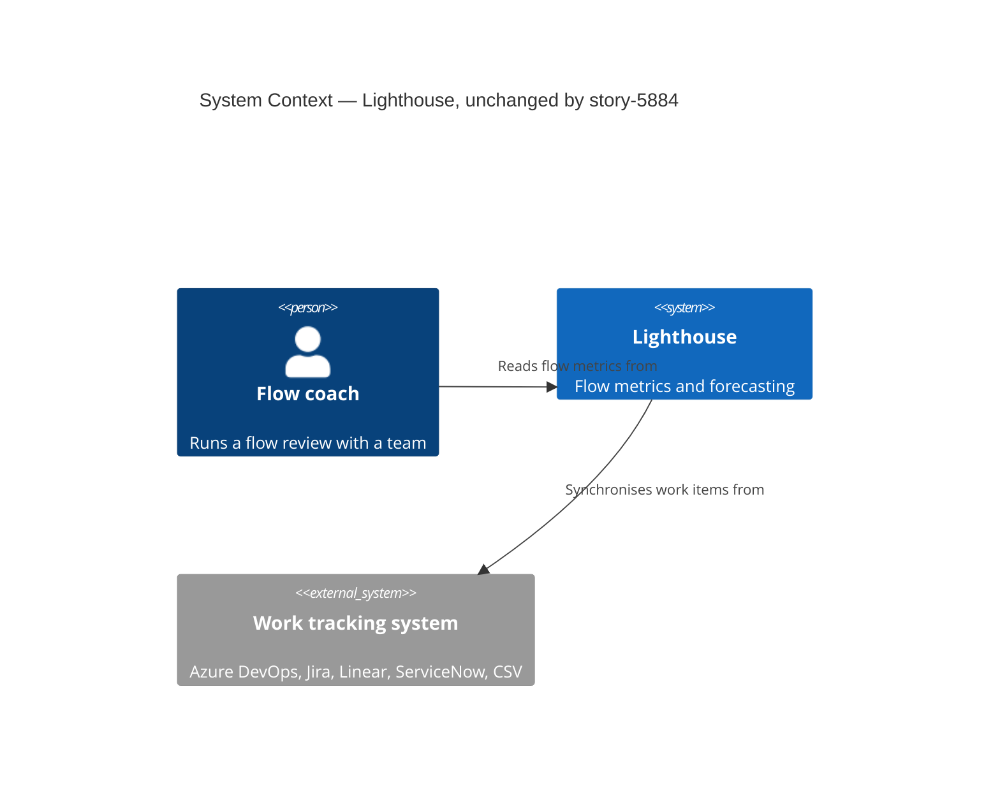
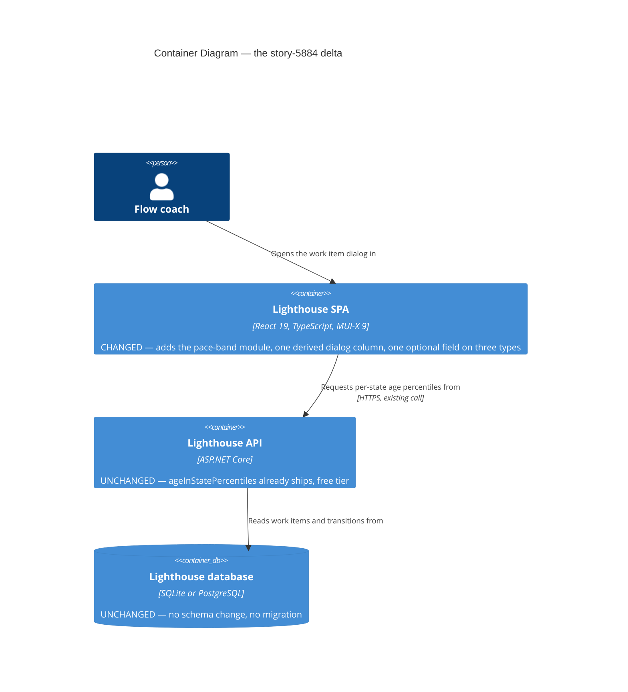

<!-- markdownlint-disable MD024 -->
# Feature: story-5884-work-item-age-bands

ADO User Story: <https://dev.azure.com/letpeoplework/Lighthouse/_workitems/edit/5884> (Active, tagged `Release Notes`, ReportedBy Paul Brown)

Source of the idea: **ValueFlow**, the internal consulting tool Thrivve Partners use with their client teams. Paul Brown demoed it to Benjamin on 2026-08-31. Thrivve drop the colouring on their aging chart entirely and read **a table of the bands** instead.

Related to Epic #4127 (SLE probability for in-flight items) — related only. #4127 is **not** a parent and nothing here is scoped into it.

## Wave: DISCUSS / [REF] Pre-DISCUSS code reality check

Every claim below was read out of the code before any story was drafted.

**The metric already ships, free tier, no premium gate.** `GET /api/teams/{id}/metrics/ageInStatePercentiles` (`TeamMetricsController.cs:218`) and the portfolio twin in `PortfolioMetricsController.cs` both return `AgeInStatePercentilesDto(string State, IReadOnlyList<PercentileValue> Percentiles)`. `BaseMetricsService.ComputeAgeInStatePercentiles` (`Services/Implementation/BaseMetricsService.cs:58-96`) computes, per Doing state, the 50/70/85/95 percentiles of **cumulative age at last exit from that state** (`LastExitCumulativeAge`, L105) over items completed in the window. `ClampPercentilesNonDecreasing` (L123) forces each rank monotonic across workflow order. **This feature adds no backend work at all.**

**The frontend already has the data in hand.** `WorkItemAgingChart.tsx` receives `perStatePercentileValues: IPerStatePercentileValues[]` and `doingStates: string[]` as props, wired at `BaseMetricsView.tsx:1038`. So the classification this story needs is computable entirely in the component that already owns both inputs — no new fetch, no new endpoint, no new context slot.

**The classification rule is not free-standing — it must clone the chart's.** `computePaceBandRects` (`WorkItemAgingChart.tsx:92-163`) does two things a naive implementation would get wrong:

- It **carries forward** the previous state's percentiles when a state has no column of its own (`carriedPercentiles`, L107-114). A state that has never been exited by a completed item is painted with the preceding state's zones.
- Its band boundaries are **half-open on the low side**: `lowerValue` starts at the axis minimum and each band covers `(lower, upper]`. An item aged exactly at the 50th percentile falls in the *below-50th* band, not the 50-70th one.

Both are matched case-insensitively on state name (`perState.state.toLowerCase()`, L103; `doingStates[i].toLowerCase()`, L302). Any band the dialog reports that does not reproduce all three rules will contradict the coloured zone drawn under the very dot the user clicked. That is the single largest correctness risk in this feature.

**The palette exists.** `PACE_BAND_COLORS_LOW_TO_HIGH = [certainColor, confidentColor, "#fbc02d", realisticColor, errorColor]` (`WorkItemAgingChart.tsx:60`) — five colours, low to high, exactly the five bands. There is no reason to invent a second palette and every reason not to.

**The dot's Y value and the dialog's Age column are the same number.** `getAgeInDays` (`WorkItemAgingChart.tsx:211-213`) returns `item.workItemAge` verbatim, and both the dot-click dialog (`WorkItemAgingChart.tsx:759-763`) and the View Data payload (`BaseMetricsView.tsx:540-543`) use `item.workItemAge` for the highlight column. No reconciliation needed — a risk checked and cleared.

**Export reads values, not rendered cells.** `useDataGridExport` in `DataGridToolbar.tsx` builds its rows from `apiRef.current.getCellValue(rowId, col.field)` — the column's *value* (post-`valueGetter`), passed through `formatCellValue` which `JSON.stringify`s anything non-string. A band column whose `valueGetter` returns a numeric rank would export the bare number `3`. This decides D12 below. Export is also premium-gated (`canUsePremiumFeatures`); the buttons render disabled with `PREMIUM_UPGRADE_TOOLTIP` on the free tier.

**The built-in filter is reachable, the toolbar shortcut is not.** `DataGridBase.tsx` sets neither `disableColumnMenu` nor `disableColumnFilter`, so the per-column Filter entry in the column header menu works. But `DataGridToolbar.tsx` renders only copy / download / reset-layout / reorder-columns — **there is no toolbar filter button**. The only route to filtering is the column header's ⋮ menu. That is a discoverability fact, accepted, not a defect to design around.

**`sortComparator` is already in the column contract.** `DataGridColumn` in `components/Common/DataGrid/types.ts` declares both `valueGetter` and `sortComparator`. Nothing new is needed to make the band sort by rank.

**The Age column in this dialog is currently uncoloured.** `getColumnColor` in `WorkItemsDialog.tsx` returns `undefined` unless `sle` is set, and neither the aging View Data payload (`BaseMetricsView.tsx:685-689`) nor the dot-click call site passes `sle`. So the Age column beside the new band renders plain today, and stays plain — the band carries the colour and nothing competes with it.

**`WorkItemsDialog` is a shared contract.** Roughly 14 call sites: BarRunChart, BlockedItemsOverTimeChart, CycleTimeScatterPlotChart, EstimationVsCycleTimeChart, FeatureSizeScatterPlotChart, LineRunChart, ProcessBehaviourChart, TotalWorkItemAgeRunChart, WorkDistributionChart, WorkItemAgingChart, WidgetShell, DeliverySection, PortfolioFeatureList, ItemsInProgress, TeamFeatureList. Per repo `CLAUDE.md`, the new prop must be optional and default-off so all of them stay untouched.

**`WidgetShell` is generic.** It renders `WorkItemsDialog` from a `ViewDataPayload` (`WidgetShell.tsx:40-46`, dialog at L374) and knows nothing about percentiles or Doing states. `buildViewData` (`BaseMetricsView.tsx:530`) does not receive them either. Getting the band into the **View Data** dialog therefore means widening `ViewDataPayload` and `ViewDataInputs` — that is the only structural plumbing this feature needs, and it is additive.

## Wave: DISCUSS / [REF] Persona ID

**Primary**: `flow-coach` (`docs/product/personas/flow-coach.yaml`) — team lead, agile coach, scrum master or RTE running a flow review or standup. `job-flow-coach-spot-pace-outliers` is already one of this persona's primary jobs.

The ValueFlow evidence sharpens a sub-population that the persona file did not previously name: the **consulting** flow coach, who runs the review *with a client team* and has to hand the conversation over as an artifact — a list in a retro doc or a client report — rather than a screenshot of a chart. Paul Brown is that reader. The persona file is extended with one goal line and one mental-model line to record it.

No secondary persona. The portfolio-scope reader is the same `flow-coach` at a wider scope, not a different person.

## Wave: DISCUSS / [REF] JTBD one-liner

When I am triaging what is in flight during a flow review, I want the pace comparison the aging chart already paints to be readable **as a value on a row** — so I can sort it, cut the list down to the outliers, and take that list out of the tool — instead of only as a colour I have to eyeball dot by dot.

**Job-id**: `job-flow-coach-spot-pace-outliers` (existing, validated — `docs/product/jobs.yaml` L421-490; importance 4 / satisfaction 2 / gap 2).

**No new job.** The situation (a flow review, wanting to know which in-flight items are dragging), the core motivation (compare an item against how long its *current state* historically takes) and the outcome (name the specific bottleneck step to the right person) are all unchanged from the validated job. What changes is the medium — chart-glance recognition versus list triage. Two solutions to one job is a `refined_by`, not a second job. Writing a `list-triage` job would be a solution-shaped entry, which is exactly the anti-pattern the standing "tech-surface vs value-outcome" rule warns against.

One genuinely new *functional* capability does arrive with it and is recorded in the refinement note rather than in a new job: **taking the band out of Lighthouse** — as a column in an exported file that the reader can sort and cut further wherever it lands. The chart could never do that. The export carries the whole in-flight list rather than the on-screen filter's subset, which is how every grid in the product exports today.

## Wave: DISCUSS / [REF] Scope assessment

**PASS — right-sized. 3 stories, 1 module, estimated 1.5-2 days.**

Against the oversize heuristics: 3 user stories (limit 10); one module — the frontend metrics view (limit 3 bounded contexts); zero backend change and zero new integration points (limit 5); under 2 days (limit 2 weeks); one user outcome. No signal fires. No split proposed.

## Wave: DISCUSS / [REF] Locked decisions

D1-D6 were decided by the user on 2026-09-05 and are not re-opened here. D7 onward are resolved in this wave.

| ID | Decision | Verdict |
|---|---|---|
| D1 | The band column appears in **both** dialogs: the widget-header **View Data** dialog (all in-progress items) and the **dot-click** dialog. The dot-click dialog keeps its exact current population — one dot group is one state at one age, so its band column is constant down the rows. That is expected, not a defect. | Locked by user, 2026-09-05. |
| D2 | The column renders whenever per-state percentiles exist, **independent of the chart's pace-band overlay toggle** (`useShowPaceBands`, default `false`, localStorage key `workItemAgingPaceBandsEnabled`). Overlay off still means band column present. | Locked by user, 2026-09-05. |
| D3 | **No bespoke filter UI.** Filtering is the DataGrid's built-in per-column filter, reached from the column header ⋮ menu. No chip row, no custom control, no toolbar button. | Locked by user, 2026-09-05. |
| D4 | Band values are **coloured** the way Cycle Time / Work Item Age values already are in this dialog — tinted text plus a 10%-alpha background via `hexToRgba`, the `getColumnColor` treatment — reddest above the 95th, greenest below the 50th. | Locked by user, 2026-09-05. |
| D5 | The concept is named **"Age Band"** in UI, docs and release notes. | Locked by user, 2026-09-05. Header string refined by D11. |
| D6 | **Aging widget only.** Not `ItemsInProgress.tsx`, not any other widget's View Data. Because `BaseMetricsView` is shared by Team and Portfolio metrics views, the **portfolio aging widget comes along for free** — that is the assumption, stated explicitly, and no suppression is built. | Locked by user, 2026-09-05. |
| D7 | **Band vocabulary**: five values `Below 50th`, `50th-70th`, `70th-85th`, `85th-95th`, `Above 95th`, plus a sixth off-scale sentinel `No history`. Plain hyphens, not en-dashes, so the strings survive CSV and clipboard round-trips unchanged. The bare-ordinal form keeps the column narrow; the full sense ("percentile of the age at which finished items left this state") lives in the column header's tooltip via `GridColDef.description`, said once rather than repeated in every cell. Percentile phrasing is this persona's own vocabulary — the validated job story already speaks of "above 85th percentile for Review". | **Resolved this wave.** |
| D8 | **Classification clones the chart's rule, exactly**: boundaries are half-open `(lower, upper]` so an age equal to a percentile value lands in the *lower* band; the previous state's percentiles are **carried forward** into any state with no column of its own; state names match case-insensitively. A state that precedes every state having percentiles has nothing to carry and renders `No history`. So does an item whose state is not in `doingStates` at all. | **Resolved this wave.** The rule is not chosen — it is dictated by `computePaceBandRects`. Divergence would make the dialog contradict the zone under the dot. |
| D9 | **Sort is rank-based**, via `sortComparator` mapping label to rank 0-4. A plain string sort would order `50th-70th` < `85th-95th` < `Below 50th` alphabetically, destroying the ADO's entire point that band ordering is independent of total age. `No history` sorts off-scale at rank -1: below `Below 50th` ascending, therefore last in the descending (worst-first) direction that triage actually uses — absence of evidence is not a pace concern and must not head the list. | **Resolved this wave.** |
| D10 | The **last Doing state's percentiles are a clone of the cycle-time percentiles** (`BaseMetricsService.cs:77-81`), and that is **honest under an Age Band header — no caveat marker, no asterisk.** For the last Doing state, "cumulative age at last exit from this state" *is* end-to-end cycle time: an item leaving the last Doing state is finished. The clone is the correct value by definition, not an approximation standing in for a missing one. A consequence a sharp reader may notice — the last column's band boundaries coincide with the chart's full-width cycle-time lines — is likewise correct. Explained once in the widget's info text and in the docs page; **not** per row, which would add noise to the common case for a fact that is simply true, and would make the dialog assert a doubt the chart does not. | **Resolved this wave.** |
| D11 | **Header renders `${workItemAgeTerm} Band`** — "Work Item Age Band" with the seeded `TerminologySeeder.cs` defaults, and the user's own word when they have renamed `Work Item Age` under Settings → Terminology. A literal `Age Band` header would sit beside a column already headed with the configurable term and contradict it. D5's "Age Band" remains the name used in prose, docs and release notes, where the surrounding sentence establishes the subject. This refines D5's shorthand rather than overturning it: the repo-level terminology rule is a standing constraint and outranks a naming shorthand. | **Resolved this wave.** |
| D12 | **The band exports, as its label string.** Achieved by having `valueGetter` return the label and `sortComparator` supply the ordering — because export reads `getCellValue`, a rank-returning `valueGetter` would put `3` in the CSV. No `exportTable` plumbing is added; routing this dialog through a caller-built export table would make it own export formatting for all ~14 call sites for no gain. Export stays premium-gated exactly as it is today — this is not a promise of export to the free tier. | **Resolved this wave.** |
| D13 | **The column is omitted entirely when no state has percentiles.** Predicate: at least one entry in `perStatePercentileValues` with a **non-empty** `percentiles` array — the same predicate `computePaceBandRects` applies at L102, so the column can never appear on a chart that has no zones to agree with. A column reading `No history` on every row is noise, and the chart already hides its overlay toggle in this case. | **Resolved this wave.** |
| D14 | **The filter is a `singleSelect` column** whose `valueOptions` are the six labels. This gives the built-in column filter a dropdown of exactly the real values instead of a free-text "contains" box, entirely within D3's "no bespoke filter UI" — it is configuration of the built-in control, not a control of our own. Because `singleSelect` value equals label for plain string options, sort, filter and export all read the same string with no divergence. | **Resolved this wave.** |
| D15 | **Colour comes from `PACE_BAND_COLORS_LOW_TO_HIGH` directly** — the existing five-colour array indexed by band rank, so chart zone and dialog cell can never drift apart. `No history` gets **no** band colour; it renders in `text.secondary` with no tinted background, visibly outside the scale. Painting an unknown green would be a lie about the item. | **Resolved this wave.** |
| D16 | **The portfolio aging widget inherits the column** through the shared `BaseMetricsView`, and no suppression is built. Stated as an explicit assumption per D6, not discovered later. | **Resolved this wave.** |
| D17 | **The new `WorkItemsDialog` prop is optional and absent by default.** All other call sites compile and behave identically with no edit. `ViewDataPayload` and `ViewDataInputs` gain the same optional field so `WidgetShell` can forward it without learning anything about percentiles. | **Resolved this wave.** |

## Wave: DISCUSS / [REF] User stories with elevator pitches

Running example throughout: **Paul Brown**, flow coach at Thrivve Partners, running a Tuesday flow review with the client team **Zenith**. Zenith's Doing states in order: `Analysis → In Progress → Review → Testing`. Percentiles over the configured history window, in days of cumulative age at last exit:

| State | 50th | 70th | 85th | 95th |
|---|---|---|---|---|
| Analysis | *(no completed item has ever exited Analysis — no column)* | | | |
| In Progress | 4 | 7 | 11 | 15 |
| Review | 8 | 12 | 17 | 24 |
| Testing | 11 | 16 | 22 | 30 |

### US-01 — Read the Age Band for every in-flight item in one list

**Story**: As a `flow-coach`, I want the aging widget's **View Data** dialog to carry an Age Band column next to the age, so that the pace comparison the chart paints as colour is readable as a value on every in-flight row at once — without hovering dots one at a time.

**Job-id**: `job-flow-coach-spot-pace-outliers`

#### Elevator Pitch

Before: Paul can see that some dots sit in the red zone of the Review column, but to write down *which items* those are he hovers each dot, reads the tooltip, and copies the ID by hand. The View Data dialog he could otherwise use lists every in-flight item with its age — and no indication at all of whether that age is normal for the state the item is in.

After: open `/teams/{teamId}` → the **Work Item Age** widget → click **View Data** in the widget header → the dialog lists every in-flight item with a new **Work Item Age Band** column reading `Above 95th` (red) for ZEN-388, `85th-95th` (orange) for ZEN-412, `70th-85th` (yellow) for ZEN-470, and `No history` (grey) for ZEN-455.

Decision enabled: which in-flight items to raise in this review, and in which state's terms to raise them — read off a list rather than reconstructed by hovering.

**Domain examples**

1. *Happy path* — ZEN-388 is in `Review`, aged 26 days. Review's 95th is 24, so 26 > 24: the cell reads `Above 95th` in `errorColor`. Paul opens the review with it.
2. *Carry-forward* — ZEN-470 is in `Review` on a team where Review has no column of its own; Review carries In Progress's percentiles (4/7/11/15). ZEN-470 is aged 9 days, and 7 < 9 ≤ 11, so the cell reads `70th-85th`. The chart paints Review's column with In Progress's zones, so the dot and the row agree.
3. *Boundary* — ZEN-433 is in `Review`, aged exactly 8 days, which is Review's 50th percentile exactly. The cell reads `Below 50th`, because the chart's bands are half-open on the low side and an item on the boundary belongs to the band beneath it.
4. *No history* — ZEN-455 is in `Analysis`, aged 6 days. No completed item has ever exited Analysis, and Analysis precedes every state that has a column, so there is nothing to carry forward. The cell reads `No history` in muted grey — not green, not blank.
5. *Overlay off* — Paul has never switched on the chart's pace-band overlay (`workItemAgingPaceBandsEnabled` is absent from localStorage, so the overlay is off, as it is for every user by default). The band column is present anyway.

**AC**

- Given Zenith has per-state percentiles for at least one Doing state, when Paul opens the aging widget's **View Data** dialog, then a column headed with the configured Work Item Age term followed by ` Band` appears, showing one of `Below 50th` / `50th-70th` / `70th-85th` / `85th-95th` / `Above 95th` / `No history` for every row.
- Given an item whose age is exactly equal to one of its state's percentile values, when the band is computed, then the item falls in the band **below** that boundary — matching `computePaceBandRects`' `(lower, upper]` boundaries.
- Given a Doing state with no percentile column of its own but preceded by a state that has one, when an item in that state is classified, then it is classified against the **preceding** state's percentiles — matching the chart's carry-forward — and the state name is matched case-insensitively.
- Given a Doing state that precedes every state having percentiles, or an item whose state is absent from `doingStates`, when the band is computed, then the cell reads `No history`, renders in `text.secondary` with no tinted background, and is not coloured with any band colour.
- Given the chart's pace-band overlay toggle is off, when the dialog is opened, then the band column is present and populated regardless.
- Given Paul has previously opened any work items dialog, so a column order predating this feature is persisted in localStorage under the `work-items-dialog` key, when the dialog opens, then the band column is visible — a stale persisted column order must not hide it.
- Given no state has a non-empty percentile list, when the dialog is opened, then the band column is not rendered at all and the dialog is otherwise unchanged.

### US-02 — Read the same Age Band after clicking a dot

**Story**: As a `flow-coach`, I want the band shown in the dot-click dialog too, so that the number I read after clicking a dot is the same claim as the coloured zone I clicked it out of — and the two surfaces cannot disagree.

**Job-id**: `job-flow-coach-spot-pace-outliers`

#### Elevator Pitch

Before: Paul clicks a dot sitting in the orange zone of the Review column, and the dialog that opens tells him the items' names, states and ages — but says nothing about the zone he just clicked. The colour is left behind on the chart.

After: on `/teams/{teamId}`, click a dot in the Work Item Age chart → the dialog lists the items behind that dot with the **Work Item Age Band** column reading `85th-95th` in orange for all of them, matching the zone the dot was sitting in.

Decision enabled: whether the item he just clicked is worth raising, confirmed in words rather than inferred from where the dot sat.

**Domain examples**

1. *Happy path* — Paul clicks the dot at Review / 19 days. Review's 85th is 17 and its 95th is 24, so the dialog opens on ZEN-412 with the band reading `85th-95th` in orange, the same colour as the zone he clicked.
2. *Constant column* — that dot also carries ZEN-419, the other item at Review / 19 days. Both rows read `85th-95th`, because one dot group is one state at one age. The column is constant here by construction.
3. *No history* — Paul clicks the dot at Analysis / 6 days. Both rows read `No history`; the chart draws no zone under that dot either.

**AC**

- Given Paul clicks a dot on the Work Item Age chart, when the dialog opens, then it carries the same band column with the same six values, computed by the same rule as US-01.
- Given a dot group, when its dialog is open, then every row shows the identical band value — one dot group being one state at one age — and this is correct behaviour, not a rendering fault.
- Given a dot in a state with no percentiles and nothing to carry forward, when its dialog opens, then every row reads `No history`, consistent with the chart drawing no zone beneath that dot.
- Given any dot, when its dialog's band cell is coloured, then the colour is the entry of `PACE_BAND_COLORS_LOW_TO_HIGH` at the band's rank — the same array the chart's zone uses — so cell and zone cannot drift apart.

### US-03 — Sort, filter and export the in-flight list by Age Band

**Story**: As a `flow-coach`, I want to order the in-flight list by band, cut it down to just the outlier bands, and take that list out of Lighthouse, so that the review has a concrete shortlist and the client gets an artifact rather than a screenshot of a chart.

**Job-id**: `job-flow-coach-spot-pace-outliers`

#### Elevator Pitch

Before: the dialog sorts by age descending, which is the wrong order for this question — a 30-day item in Testing may be perfectly normal while a 9-day item in Review is the worst outlier on the board. Paul reconstructs band order by hand, and can take nothing out of the tool but a screen grab.

After: in the aging widget's **View Data** dialog, click the **Work Item Age Band** column header → the list reorders worst-band-first, ZEN-388 (`Above 95th`) above ZEN-412 (`85th-95th`) above ZEN-433 (`Below 50th`), regardless of their ages; open the column header's ⋮ menu → **Filter** → pick `Above 95th` from the dropdown → the list is just the two items past the 95th; click the download button → a CSV carrying a `Work Item Age Band` column whose cells read `Above 95th`, `85th-95th`, `Below 50th` and so on, one per in-flight item.

Decision enabled: which handful of items go on the review agenda, and what goes into the retro doc or the client report as the record of that decision.

**Domain examples**

1. *Sort defeats age* — ZEN-401 is in `In Progress` aged 16 days (`Above 95th`, In Progress's 95th being 15); ZEN-604 is in `Testing` aged 25 days (`85th-95th`, Testing's 95th being 30). Sorted by band descending, ZEN-401 sits above ZEN-604 even though it is nine days younger. Sorted by age, the order inverts. This is the ADO's whole point.
2. *Filter* — Paul opens the ⋮ menu on the band column, chooses Filter, and picks `Above 95th` from the dropdown of the six values. The grid shows ZEN-388 and ZEN-401 only.
3. *Export* — Paul clicks download. The band column in the file holds the label strings — `Above 95th`, `85th-95th`, `Below 50th` — not a rank number and not an empty cell. The file carries every in-flight item, not only the two the filter left on screen: this dialog's export has always meant the whole list in sort order, and #5884 does not change that.
4. *Free tier* — the same dialog on an instance without a premium licence shows the copy and download buttons disabled with the premium upgrade tooltip, exactly as every other grid does today. Sorting and filtering still work.

**AC**

- Given the dialog is open, when Paul sorts by the band column descending, then rows order `Above 95th`, `85th-95th`, `70th-85th`, `50th-70th`, `Below 50th`, `No history` — by band rank, never alphabetically, and independent of each item's age.
- Given rows with `No history`, when the band column is sorted descending, then those rows sort last; when sorted ascending, they sort first — the sentinel sits off-scale below the lowest band and never heads a worst-first list.
- Given the dialog is open, when Paul opens the band column's header ⋮ menu and chooses Filter, then the value input is a dropdown offering exactly the six band labels, and selecting one leaves only rows in that band.
- Given a premium licence is present, when Paul exports to CSV, then the band column holds the label string. The file carries the dialog's whole row set in sort order; an active column filter does not narrow it, which is how export behaves in every grid in the product today and is out of scope here.
- Given no premium licence, when the dialog is open, then copy and export are disabled with the existing premium upgrade tooltip while sort and filter remain usable — unchanged from today's behaviour for every column.
- Given the dot-click dialog, whose default sort is Time in State, and the View Data dialog, whose default sort is age descending, when either opens, then its default sort is unchanged by this feature — the band is sortable, not the new default.

## Wave: DISCUSS / [REF] Story map

**Backbone** (the flow coach's activity sequence during a review):

`Open the team's metrics view` → `Look at what is in flight` → `Judge whether an item's age is normal for its state` → `Shortlist the ones to talk about` → `Carry the shortlist into the conversation`

| Backbone step | Ships today | This feature adds |
|---|---|---|
| Open the metrics view | Team + portfolio routes | — |
| Look at what is in flight | Aging chart dots; View Data dialog listing every in-flight item with its age | — |
| Judge whether the age is normal for the state | Coloured zones on the chart, behind an off-by-default toggle | **US-01, US-02** — the same judgement as a value on the row, in both dialogs, independent of the toggle |
| Shortlist the ones to talk about | Sort by age (the wrong axis for this question) | **US-03** — sort and filter by band |
| Carry the shortlist into the conversation | Screenshot | **US-03** — CSV / clipboard export carrying the band |

**Walking skeleton**: none, and none needed. Brownfield — both dialogs, the metric, the endpoint and the palette all ship today. There is no end-to-end path left to prove.

**Slices** (briefs in `slices/`):

| Slice | Stories | Value | Estimate |
|---|---|---|---|
| `slice-01-age-band-column-visible` | US-01, US-02 | The band is readable on every in-flight row in both dialogs | ~1 day |
| `slice-02-band-triage-sort-filter-export` | US-03 | The list can be ordered, cut and taken out of the tool by band | ~0.5-1 day |

**Priority rationale**: slice 01 first because it carries the correctness risk — reproducing the chart's carry-forward and boundary rules is the one thing in this feature that can be wrong in a way users would notice, and it is cheaper to be wrong about it before sort, filter and export are built on top. Slice 01 also stands alone as shippable value (the ADO's literal first ask: "extend the existing work item dialog to include the bands"). Slice 02 is what tests the ADO's actual bet — that dialog triage makes the separate table view unnecessary — and that bet cannot be tested until there is something to sort and filter.

Neither slice is `@infrastructure`; both contain user-visible value stories.

## Wave: DISCUSS / [REF] Definition of Done

1. The band column renders in both the aging widget's View Data dialog and the dot-click dialog, on team and portfolio scope, independent of the chart's overlay toggle.
2. The classification reproduces `computePaceBandRects` on boundaries, carry-forward and case-insensitive state matching, proven by tests that assert dialog band and chart zone agree for the same item.
3. Colours come from `PACE_BAND_COLORS_LOW_TO_HIGH`; `No history` is unpainted.
4. Sort is rank-based; filter offers the six labels as a dropdown; export writes the label string.
5. The new prop is optional and no other `WorkItemsDialog` call site is edited.
6. `pnpm test` green, including new Vitest coverage for classification, sort order, the `No history` sentinel, and column omission when no percentiles exist.
7. `pnpm build` completes with zero errors and zero warnings, and Biome is clean on `./src` (the `prebuild` hook).
8. SonarQube Cloud introduces no new issues of any severity.
9. Docs updated per-feature — the Work Item Age metric page gains the Age Band section including the note that the last Doing state's band is the cycle-time distribution — plus a screenshot, and the release note is drafted in the configurable Terminology defaults.
10. The before-timing for the shortlist KPI is captured and recorded on ADO #5884 **before** the release note is drafted: in one moderated session, time Paul Brown shortlisting items the way he does today — read the chart, hover the dots, note the IDs by hand — and only then show him the new column and time it again. Measured after the fact this number cannot be recovered, because nobody can un-see the column.
11. Paul Brown has confirmed he will record a yes/no verdict on ADO #5884 as to whether the separate flipside table view is still wanted. The whole feature was chosen over that table view on the bet that it would answer the question, so an unanswered question means the bet was never settled — and that is a different outcome from the feature failing. Get the commitment before release; if it does not come, say so on the item rather than letting the KPI quietly expire on 2026-10-31.

## Wave: DISCUSS / [REF] Out of scope

- **Any backend change.** The endpoint, the DTO and `ComputeAgeInStatePercentiles` ship today and are untouched. No new field, no `sampleSize`, no new route.
- **A separate table view on the flipside of the aging chart** — the alternative weighed on the 2026-08-31 call and deliberately deferred. This feature is the cheaper bet placed against it. Whether it is still wanted afterwards is the subject of a KPI below, not of this scope.
- **`ItemsInProgress.tsx`** and every other widget's View Data dialog (D6).
- **Widening the dot-click dialog's population** (D1). One dot group stays one state at one age.
- **Changing either dialog's default sort** (US-03 AC).
- **A toolbar filter button.** D3 is satisfied by the built-in column header menu; adding a toolbar control would be the bespoke filter UI D3 rules out. The discoverability cost is accepted.
- **Colouring the Age column.** It renders uncoloured in this dialog today because no `sle` is passed, and it stays that way. Passing `sle` to make it match would be a behaviour change to an existing column, not part of this story.
- **A per-cell caveat on the last Doing state** (D10). The explanation is written once in the widget info text and the docs.
- **Suppressing the portfolio aging widget** (D6, D16). It comes along and that is the intended outcome.
- **Configurable percentiles** — still deferred, as it was in `aging-pace-percentiles` D4. The five bands are fixed at 50/70/85/95.
- **Anything from Epic #4127** (SLE probability for in-flight items). Related work item, not a parent, not scoped in.

## Wave: DISCUSS / [REF] WS strategy

**Type A (additive).** No contract change to any endpoint, no schema change, no new route. One optional prop on a shared component, one optional field forwarded through `ViewDataPayload` / `ViewDataInputs`, and a derived column inside `WorkItemsDialog`. Absent the prop, every one of the ~14 call sites behaves exactly as today. There is no walking skeleton because every layer of the path — metric, endpoint, props, dialogs, palette — already ships.

## Wave: DISCUSS / [REF] Driving ports

No new or changed HTTP routes. Both existing routes are consumed unchanged:

| Method | Route | Auth | Status | Note |
|---|---|---|---|---|
| GET | `/api/teams/{teamId}/metrics/ageInStatePercentiles` | Authenticated | Existing, **unchanged** | `TeamMetricsController.cs:218`. Already fetched and already passed into `WorkItemAgingChart` at `BaseMetricsView.tsx:1038`. Free tier, no premium gate. |
| GET | `/api/portfolios/{portfolioId}/metrics/ageInStatePercentiles` | Authenticated | Existing, **unchanged** | Portfolio twin in `PortfolioMetricsController.cs`, same shape. |

UI surfaces (the actual driving ports for this feature):

| Surface | Entry point | Change |
|---|---|---|
| Work Item Age widget header | **View Data** button → `WorkItemsDialog` via `WidgetShell.tsx:374` | Band column added. Requires `ViewDataPayload` (`WidgetShell.tsx:40`) and `ViewDataInputs` / `buildViewData` (`BaseMetricsView.tsx:530`, aging payload at L685) to forward the new optional field. |
| Work Item Age chart | Dot click → `WorkItemsDialog` at `WorkItemAgingChart.tsx:750` | Band column added; population unchanged. |
| Column header ⋮ menu | Built-in MUI-X Sort and Filter entries on the band column | Configured, not built (D3, D14). |
| Grid toolbar | Existing copy / download buttons, premium-gated | Band included in output by virtue of being a visible column with a string value (D12). No toolbar change. |

## Wave: DISCUSS / [REF] Pre-requisites

- **Satisfied**: `ageInStatePercentiles` on both scopes, shipped and free-tier. Verified in `TeamMetricsController.cs:218` and `BaseMetricsService.cs:58-96`.
- **Satisfied**: `perStatePercentileValues` and `doingStates` already reach `WorkItemAgingChart` (`BaseMetricsView.tsx:1038`). The dot-click dialog needs no new data at all.
- **Satisfied**: `PACE_BAND_COLORS_LOW_TO_HIGH` (`WorkItemAgingChart.tsx:60`) and `hexToRgba` / `getColumnColor` precedent in `WorkItemsDialog.tsx`.
- **Satisfied**: `sortComparator` and `valueGetter` are already on `DataGridColumn` (`components/Common/DataGrid/types.ts`); `DataGridBase` disables neither the column menu nor the column filter.
- **Structural, in scope**: `ViewDataPayload` and `ViewDataInputs` must gain an optional field for the View Data dialog to receive percentiles and Doing states. `WidgetShell` stays generic — it forwards an opaque optional value and learns nothing about percentiles.
- **No dependency** on Epic #4127, on any DIVERGE artifact (none exist for this story), or on any other in-flight feature.

No DISCOVER or DIVERGE artifacts exist for #5884. The evidence base is the 2026-08-31 ValueFlow demo by Paul Brown and the already-validated job. Recorded here as a known thinness, not a blocker: the job carries opportunity data, the interaction design does not, and KPI 1 below exists precisely to close that loop.

## Wave: DISCUSS / [REF] Outcome KPIs

**A constraint that shapes every KPI here**: Lighthouse has no phone-home telemetry (see the self-hosted telemetry gap, ADO #5015). Usage cannot be counted across instances. Every target below is therefore measured by something that actually exists — a named person, an issue tracker, a moderated session. A KPI measured by an analytics pipeline we do not have would be decoration.

| ID | Who does what, by how much | Baseline | Measured by |
|---|---|---|---|
| `OUT-5884-table-view-verdict` | Paul Brown uses the Age Band column in **≥3 flow reviews** within 4 weeks of release and records an explicit **yes/no verdict on ADO #5884** as to whether the separate flipside table view is still wanted, by **2026-10-31** | Undecided — the 2026-08-31 call deferred the question on the bet that this feature would answer it | Comment on ADO #5884 by Paul Brown; absence of a verdict by the date is itself the failure signal |
| `OUT-5884-chart-dialog-agreement` | **Zero** reports of a dialog band contradicting the coloured zone under the same dot, over the **first 8 weeks** after release | n/a — new surface | GitHub issues and community Slack. This is the correctness KPI for D8's carry-forward and boundary rules |
| `OUT-5884-time-to-shortlist` | In one moderated session with Paul Brown, time from opening the aging widget's View Data dialog to naming a shortlist of items to discuss is **≤30 seconds** | **Unmeasured.** Capture the current-path timing (read the chart, hover dots, note IDs by hand) in the same session *before* showing the new column — do not assume a baseline | Single moderated session, timed, recorded on ADO #5884 before the release note publishes |

**Deliberately not a KPI, stated rather than skipped**: adoption of the filter and the export. Both are unmeasurable without instance telemetry (#5015), and the column header ⋮ menu is a low-discoverability path (no toolbar filter button) that a usage number would not distinguish from disinterest anyway. `OUT-5884-table-view-verdict` is the proxy: if band triage were not being used, the flipside table view would still be wanted.

## Wave: DISCUSS / [REF] Definition of Ready — validation

| # | DoR item | Verdict | Evidence |
|---|---|---|---|
| 1 | Every story traces to a `job_id` | Pass | US-01, US-02, US-03 all carry `job_id: job-flow-coach-spot-pace-outliers` — an existing validated entry at `docs/product/jobs.yaml` L421-490, extended with a `refined_by` entry in this run. No `infrastructure-only` story in this feature. |
| 2 | Persona named and scoped | Pass | `flow-coach` (`docs/product/personas/flow-coach.yaml`), which already lists this job among its primary jobs. The consulting sub-population evidenced by the ValueFlow demo is added to the persona file. No secondary persona: portfolio scope is the same person, wider. |
| 3 | Elevator pitch per non-`@infrastructure` story | Pass | Three Before/After/Decision triplets. Each "After" names a real user action — `/teams/{teamId}` then the widget's **View Data** button, a dot click, a column header, the ⋮ Filter menu, the download button — and each "sees" clause is a concrete rendered value (`Above 95th` in red; a CSV column holding the label string). |
| 4 | AC testable, no ambiguous outcomes | Pass | 17 ACs. Every one is decidable: the exact six label strings; the half-open boundary pinned by a worked example at exactly the 50th; carry-forward pinned to the preceding state; the sort order written out in full; `No history` placement pinned in both sort directions; column omission pinned to a stated predicate; the stale-`columnOrder` regression case named explicitly. |
| 5 | Out-of-scope explicit | Pass | 11 items, including the two most likely scope creeps — colouring the Age column, and widening the dot-click population — plus the deferred flipside table view this feature is a bet against, and Epic #4127. |
| 6 | Outcome KPIs measurable with targets | Pass | 3 KPIs, each with a numeric target, a date, a named owner and a measurement method that exists without telemetry. One KPI's baseline is explicitly declared unmeasured with instructions to capture it rather than assume it. One candidate KPI is explicitly declined with its reason, per the no-silent-N/A rule. |
| 7 | Pre-requisites resolved | Pass | Every data and rendering pre-requisite verified present in code and cited by file and line. The only structural work — widening `ViewDataPayload` / `ViewDataInputs` — is in scope, additive, and named. No cross-feature dependency. |
| 8 | Slice composition: each slice contains ≥1 user-visible story | Pass | Two slices. `slice-01` carries US-01 + US-02, `slice-02` carries US-03. No `@infrastructure`-only slice, and the `ViewDataPayload` widening rides inside slice 01 as a precursor commit rather than as its own slice. |
| 9 | Handoff target identified | Pass | `nw-solution-architect` (DESIGN, full artifacts). `nw-platform-architect` (DEVOPS) receives the KPI section — with the standing caveat that none of the three KPIs needs instrumentation, so DEVOPS's realistic action here is to confirm that no instrumentation is being promised. |

**DoR overall verdict: PASSED.**

## Wave: DISCUSS / [REF] Wave decisions summary

**Primary user need**: make the pace comparison the aging chart already computes readable as a *value on a row* rather than only as a colour on a dot, so a flow coach can sort by it, filter to the outliers, and export the result.

**Foundation investment**: zero. No backend change, no new endpoint, no schema change, no new palette. The entire feature is a derived column in a shared dialog plus the optional plumbing to feed it.

**Feature type**: user-facing.

**Walking skeleton**: none — brownfield, every layer already ships.

**The one real risk**: the classification must clone `computePaceBandRects`' carry-forward and half-open boundaries exactly. Independently reimplemented, the dialog will contradict the zone under the very dot the user clicked, and that contradiction would be worse than shipping nothing. D8 pins the rule; `OUT-5884-chart-dialog-agreement` measures it; slice 01 is sequenced first to carry it.

**A trap that would have shipped silently**: the dialog sorts by age descending today, and a plain string band column sorts `50th-70th` before `85th-95th` before `Below 50th`. That alphabetical order destroys the ADO's stated point that band ordering is independent of total age — the feature would have looked complete and been useless. D9 pins rank-based sorting; D12 keeps that from breaking the CSV.

**Assumption stated, not discovered**: the portfolio aging widget inherits the column via the shared `BaseMetricsView`. Excluding it would require building active suppression. It is not excluded.

**Upstream changes**: one — see below.

## Changed Assumptions

Per the Document Update (Back-Propagation) contract in `nw-discuss/SKILL.md`. The contradicted artifacts are **not modified**.

**Source**: `docs/product/journeys/aging-pace-percentiles.yaml`, header correction block dated 2026-05-26.

**Original assumption, quoted verbatim**:

> The in-flight dot tooltip pace annotation (step-confirm-via-tooltip, old US-03) was CUT — the colored column background carries the signal; there is no per-dot text and no per-band hover.

And in the same feature's `feature-delta.md`, Out of scope:

> **In-flight dot tooltip pace annotation** (the old US-03 `Pace: above 85th percentile for <state>` line) — **cut 2026-05-25**. The colored column background is the whole signal; no per-dot text. (ADO #5080 to be removed.)

**New assumption**: the coloured column background is *not* the whole signal. The per-item pace assessment returns as text — not in the tooltip, but as a sortable, filterable, exportable column in the work item dialog.

**Why it changed**: the 2026-05-25 cut was a scope simplification made on a design intuition — that colour alone would carry the signal. Field evidence now contradicts that intuition. Thrivve Partners, using their own ValueFlow tool with client teams, **drop the colouring on their aging chart entirely and read a table of the bands instead** (demoed by Paul Brown to Benjamin, 2026-08-31). That is a practitioner in the target persona choosing text over colour for this exact judgement, on a tool built for the purpose.

**What is different this time, and why the original cut was still right**: the cut rejected a *tooltip* — an ephemeral, one-item-at-a-time, unsortable, unexportable surface. That rejection stands; nothing here revives the tooltip and ADO #5080 stays removed. What returns is the pace assessment in a surface that is none of those things. The three capabilities the tooltip could never have offered — ordering by band, cutting the list to a band, and carrying the result out of the tool — are the whole reason this is worth building, and are exactly what the ValueFlow evidence points at.

**Scope of the correction**: the 2026-05-26 header block remains accurate about the `aging-pace-percentiles` feature *as shipped*. It becomes stale only as a statement about the product's direction. `docs/product/journeys/story-5884-work-item-age-bands.yaml`, added in this run, is the current statement.

## Wave: DESIGN / [REF] Design decisions

Wave: DESIGN. Date: 2026-09-05. Architect: Morgan, interaction mode = PROPOSE. DISCUSS's D1-D17 are
constraints here, not options; every DDD below either implements one or resolves something D1-D17 left
to DESIGN. Numbering starts at DDD-1 so it cannot collide with the locked D-numbers.

| ID | Decision | Implements |
|---|---|---|
| DDD-1 | **The band rule is extracted, not cloned.** `computePaceBandRects` splits into a pure ladder resolver plus a geometry projector, both in a new pure module `utils/charts/paceBands.ts`; the dialog's classifier reads the same ladder. Carry-forward, the low-side half-open boundary, the case-insensitive state match and the palette each exist exactly once. **The invariant this buys is bounded, and the bound is stated rather than glossed**: the geometry also takes an axis minimum and maximum which the classifier does not have and should not have, so what holds is that for an age inside the axis domain the classifier's rank is the rank named by the rect containing it. `getMaxYAxisHeight` puts every plotted age inside that domain by construction, taking the maximum of the percentile values, the service level expectation and the ages themselves before adding ten percent. Outside the domain the classifier's answer is the correct one and the chart's clipping is the artefact — a band is a property of the item and the ladder, not of the viewport. See ADR-188. | D8, D15 |
| DDD-2 | **The band label is derived from the boundary's percentile number**, not read out of a fixed five-entry array: rank 0 is `Below {p₀}th`, a middle rank is `{pᵢ₋₁}th-{pᵢ}th`, the top rank is `Above {pₗₐₛₜ}th`, an absent rank is `No history`. On the shipped fixed 50/70/85/95 this yields exactly D7's six strings. **The honest reason is not that ladder lengths vary today — they do not**: both metrics services hard-code `[50, 70, 85, 95]` and the terminal state's clone comes from an equally literal builder, so no production response can carry a ladder that is not four long, and the variability the geometry already tolerates lives only in its own test fixtures. The derivation is written for the change that is already named and already deferred, configurable percentiles, under which a positional five-entry array would relabel a three-boundary ladder's top band `70th-85th` when it means `Above 85th`, silently, while the derivation needs no edit at all. | D7 |
| DDD-3 | **Colour comes from one shared `paceBandColorForRank(rank, boundaryCount)`**, which carries the top-rank clamp the chart already applies (the top slice is painted reddest even when the ladder is short). The dialog cell calls the same function that produces the rect's `fill`. `No history` gets no colour and renders `text.secondary` with a transparent background. Past five ranks the colour deliberately stops following the label: the clamp saturates every rank above the fourth to the same red, so a six-boundary ladder would show `85th-95th`, `95th-99th` and `Above 99th` in three identically coloured cells, with the label carrying the distinction the palette no longer can. That is existing chart behaviour and it is kept rather than corrected here. | D4, D15 |
| DDD-4 | **Transport is one opaque optional descriptor**, `ageBandColumn`, carrying a header string, a description string, an ordered list of option labels, and a pure `bandFor(workItem)` closure. `ViewDataPayload` and `ViewDataInputs` gain the same optional field and `WidgetShell` forwards it verbatim — it learns nothing about percentiles or Doing states. This is the idiom the file already uses for `highlightColumn`, not a new one. Absent the descriptor, `WorkItemsDialog` behaves exactly as today, so none of the other call sites is edited. | D17, D1, D2 |
| DDD-5 | **The sort comparator is defined as index-into-the-option-label list.** Because the option list is also the `valueOptions` and the `valueGetter` returns a label, a `valueGetter` that returned a rank makes every lookup miss and the sort collapse — the wrong split fails the sort test, not only the CSV. The binding is structural and needs no convention about where the two lines sit. | D9, D12 |
| DDD-6 | **`DataGridColumn` gains one optional `valueOptions?: string[]`.** Without it D14 does not compile: `DataGridColumn extends Omit<GridColDef, "renderCell">`, `GridColDef` in the installed MUI-X 9 is a four-member union, and `Omit` over a union keeps only the keys common to all four — `valueOptions` lives on the single-select and multi-select members only. `type` is common, so `type: "singleSelect"` alone compiles and produces a select filter with no options in it. The narrow `string[]` is deliberate: it forbids the object-option form whose `getOptionValue` and `getOptionLabel` D14 relies on being identity. | D14 |
| DDD-7 | **The band column never routes through `getColumnColor`.** That function is service-level-expectation-driven and belongs to the highlight column; the band is rank-driven. The two renderers share only a small helper that turns a colour into the tinted-text-plus-tenth-alpha-background treatment, so the shared thing is the presentation and not the decision. The band descriptor and `sle` are independent optional inputs and neither reads the other, so a dialog carrying both keeps two colour policies side by side. | D4, D15 |
| DDD-8 | **The chart-dialog agreement is a property test over both outputs, not a promise in prose.** One fixture table — carry-forward, leading empty state, tied percentiles, short ladder, case-mismatched state — is walked for every state and every age inside the axis domain, asserting that the rank the classifier returns is the rank **named by the key of** the rect containing that age, under identity scales. Rank comes off the key and never off the array index, because the geometry drops zero-height rects. **A classification can never land on a collapsed rank**: a rect collapses only when two consecutive boundaries are equal, and the classifier selects the first boundary an age does not exceed, which is always the lower and surviving one. Under identity scales zero pixel height and equal values are the same condition, so the invariant is total in the test. Under real scales two distinct boundaries can round to one pixel, and the resulting band is invisible — the classifier's rank is then the honest answer about a zone nobody can see. Under DDD-1 the two consumers already share a ladder, so what this test guards is the second code path (rect selection, collapse, top clamp) and a future re-divergence. | D8 |
| DDD-9 | **The omission decision is the caller's**, not the dialog's. `buildViewData` and the dot-click call site build the descriptor only when at least one entry has a non-empty percentile list; otherwise they pass nothing. The dialog therefore never needs to know what a percentile is in order to decide whether to render the column, and the predicate stays the same one the geometry applies. | D13 |
| DDD-10 | **Zero backend change, confirmed at DESIGN.** No endpoint, no DTO field, no schema, no migration, no cache key, no premium gate, no new runtime dependency. The whole feature is one new pure frontend module, one optional field on three existing types, and one derived column. | WS strategy Type A |
| DDD-11 | **ADR-018 / ADR-021 / ADR-024 do not constrain this feature.** That chain governs backend C# per-state aggregation over `WorkItemStateTransition` and rejected a shared service because its two consumers have deliberately different item-membership rules that one signature would hide. Here the two consumers are required to be identical and a disagreement is the defect. Same principle, inverted premise, opposite verdict. Recorded explicitly so the next reader does not cite ADR-018 at a frontend classifier. | — |
| DDD-12 | **Two shipped grid behaviours contradict locked acceptance criteria** and are raised rather than absorbed: export ignores an active column filter, and the filter model is declared as persisted but never written. See `design/upstream-changes.md` and `## Changed Assumptions — DESIGN wave`. | D3, D12 |
| DDD-13 | **Export keeps today's meaning: the whole row set in sort order.** DESIGN proposed swapping `getSortedRowIds()` for the filtered-and-sorted selector so that an active filter would narrow the file. The maintainer chose the alternative on 2026-09-05: leave the export path alone and narrow the acceptance criterion instead. A one-line selector swap would silently change what every grid in the product writes to disk, and #5884 is not the change that should carry that. The consequence is recorded rather than hidden — `useDataGridExport`'s `visibleRows` variable and the comment above it still claim filters apply, and still do not. Fixing that is its own piece of work with its own decision. | D12, US-03 AC 4 |
| DDD-14 | **The band column's declared position governs a fresh layout; a persisted one wins.** `WorkItemsDialog` hard-codes `storageKey="work-items-dialog"`, shared by all sixteen of its render sites, and `DataGridBase` appends any column missing from a persisted order to the **end**. So for anyone who has ever reordered or resized in any of those dialogs, the band arrives last — past Time in State — not next to the age column. That is accepted rather than engineered around: the acceptance criterion requires the column be *visible* despite a stale order, which it is, and Reset Layout restores the declared position. Bumping the storage key would throw away every user's column widths and visibility across sixteen dialogs to move one column; teaching `DataGridBase` to insert at the declared index would change how every grid in the product absorbs any new column. Neither is worth it for a column the user can drag. | D6, US-01 AC 6 |
| DDD-15 | **This dialog builds no `exportTable`, and that is pinned.** The grid's own contract says a column drawn by a renderer with no field behind it should declare what its file contains rather than let the toolbar read the screen — and this dialog already has one such column, Time in State, which renders a badge and exports a bare number. The band column takes the other route deliberately: its `valueGetter` returns the label, so `getCellValue` is already correct and adding `exportTable` here would make this call site own export formatting for all sixteen. The risk that creates is real and one-directional — if anyone later wires an `exportTable` into this dialog, the band's `valueGetter` is bypassed, the label silently leaves the file, and DDD-5's sort guard does not fire because the sort still reads the value getter. A test asserts this dialog passes no `exportTable`, so that drift reds. | D12 |

## Wave: DESIGN / [REF] Fork analysis

The six questions DESIGN had to answer, each with the options weighed and the recommendation.

**Fork 1 — where the band-classification rule lives.** Options: (A) extract a shared pure ladder that
both the chart's geometry and the dialog's value consume; (B) a sibling classifier in the dialog that
restates the rule; (C) the chart computes bands for every item and hands the dialog a lookup.
**Recommend A.** The regression risk it carries is bounded and instrumented — `computePaceBandRects`
is already exported and pinned by sixteen direct unit tests plus six overlay DOM tests in its own
describe block, and two further DOM tests elsewhere in the file, covering the floor band, the top band,
carry-forward, a leading empty state, coinciding percentiles, input-order independence and short
ladders — so a botched extraction reds on the first `pnpm test`. The drift risk
B carries is unbounded and silent, and lands on the user as a row contradicting the dot they clicked.
C fails on reach: the View Data dialog is opened by `WidgetShell` from a payload built in
`BaseMetricsView`, outside the chart's render scope. ADR-020 is not disturbed — it decides where the
overlay *renders*, this decides where the rule it renders *lives*.

**Fork 2 — the enforcement seam for D8.** Three layers, each answering a different question. The
*type* layer: one ladder type, one resolver, and neither consumer takes the raw per-state percentile
list any more, so a second implementation cannot appear without a second type. The *structural* layer:
the rule lives in a pure module under `utils/` that imports nothing from `components/`, so the chart
cannot become the dialog's dependency and the palette stops being exported from a component. The
*behavioural* layer: the agreement property test of DDD-8. Under fork 1's recommendation, drift in the
classification, the carry-forward and the colour is structurally impossible — there is one function
each. What remains representable is a future edit that stops routing the geometry through the
resolver, and that is exactly what the behavioural layer catches. This repo has no ArchUnit for
TypeScript; the honest enforcement set is the shared type, the module boundary and the property test.

**Fork 3 — transport of the percentiles into the View Data path.** Options: (T1) widen
`ViewDataPayload` and the dialog with the raw `perStatePercentileValues` and `doingStates` and let the
dialog classify; (T2) pass a fully-built column definition and keep the dialog ignorant; (T3) pass an
opaque descriptor carrying a header, an ordered option list and a pure `bandFor` closure.
**Recommend T3.** T1 teaches a shared dialog with fifteen call sites what a percentile is, for the
benefit of one. T2 pushes the terminology term, the palette, the tooltip and — fatally — the column's
placement after the age column out to callers, so it duplicates column construction across two call
sites and still needs a placement contract. T3 is what `highlightColumn` already is: an opaque
descriptor with a closure inside, forwarded by `WidgetShell` without inspection. The dialog learns
"there may be a banded column with ranked options"; it does not learn where the ranks came from. D17
holds — the field is optional and absent by default on `WorkItemsDialog`, `ViewDataPayload` and
`ViewDataInputs`, so the other call sites need no edit and no behaviour change.

**Fork 4 — band colour beside the existing service-level-expectation colour.** `getColumnColor` is
closed over `sle` and returns `undefined` when it is absent, which is why the age column renders plain
in this dialog today. Options: reuse it with a band branch inside; give the band its own colour source.
**Recommend the second**, per DDD-7. A band branch inside `getColumnColor` would make one function
answer two unrelated questions and would give a future reader every reason to feed the band's rank
into a service-level threshold. The two renderers share the *treatment* — tinted text plus a
tenth-alpha background — through a small helper that takes an explicit colour, and share nothing else.
Coexistence is then not a rule anyone has to remember: the band descriptor and `sle` are separate
optional inputs, neither reads the other, and on the `cycleScatter` payload where `sle` is passed there
is no band descriptor at all.

**Fork 5 — the D9 and D12 coupling.** The trap is real: the obvious implementation puts the rank in
`valueGetter`, the sort works, and the CSV silently reads `3`. **Recommend expressing the comparator in
terms of the option-label list** rather than in terms of a rank map. The label list is already needed
as `valueOptions` and is already in rank order with `No history` first, so the comparator is the
difference of two lookups into it. A `valueGetter` returning ranks then makes every lookup miss and
the sort collapse, so the wrong split fails the sort assertion in US-03's first AC as well as the
export assertion — it cannot ship looking complete. The binding is structural, so no convention about
where the two lines sit is needed and none is claimed.

**Fork 6 — `singleSelect` typing.** Verified against the installed `@mui/x-data-grid@^9.12.0`, not
assumed. Four findings: (i) `GridColDef` is a four-member union
(`models/colDef/gridColDef.d.mts:349`) and `Omit` over a union keeps only the keys common to all four,
so `valueOptions` is **not** expressible on `DataGridColumn` today and D14 does not compile without
DDD-6's one optional field; `type` is common, so `type: "singleSelect"` alone compiles and gives a
select filter with nothing in it. (ii) `sortComparator` stays in force — `createColumnsState` builds
`{...columnTypeDefaults}` and then copies every defined key of the caller's column over it
(`hooks/features/columns/gridColumnsUtils.mjs:290-299`), so a caller comparator overwrites
`GRID_STRING_COL_DEF`'s. (iii) Sort, filter and export all read the same string: filter operators go
through `getOptionValue`, whose default is identity for non-object options; export reads
`apiRef.getCellValue`, the raw value; the cell displays `getOptionLabel(value)`, which is `String(value)`
(`colDef/gridSingleSelectColDef.mjs`). (iv) `singleSelect` is a community column type
(`colDef/gridColumnTypesRegistry.mjs:19`), so the community-versus-paid fallback at
`gridColumnsUtils.mjs:232` does not apply — no licence gate. **D14 stands, conditional on DDD-6.**
Fallback if that widening is rejected: `type: "string"` with the default contains filter, which keeps
D3 and loses only the dropdown. Given the compile risk named next, that fallback deserves to stay on
the table rather than be dismissed.

**What fork 6 verified is the producing type; the consuming assignment is the residual.**
`DataGridBase` builds its column definition as a **checked initializer**, not a cast — the object
literal is annotated `GridColDef<T>` before the later cast on the return, which cannot rescue a
initializer that fails. Once `DataGridColumn` can carry `type: "singleSelect"` plus `valueOptions`,
that literal has to narrow to a member of the four-way union, and the single-select member requires
`getOptionLabel` and `getOptionValue` as **non-optional**, while the base member's `type` already
admits `"singleSelect"`. Which member it narrows to is therefore a live question that this wave had no
shell to answer. **The first act of slice 01 is `pnpm build` with the widened type and one
`singleSelect` column present, before a line of band logic is written.** If it fails, the remedy — a
cast at the initializer, or threading `getOptionLabel` and `getOptionValue` through — is a larger
change to a shared component than DDD-6 currently promises, and the `type: "string"` fallback becomes
the cheaper answer.

## Wave: DESIGN / [REF] Component decomposition

| Element | Kind | Change |
|---|---|---|
| `utils/charts/paceBands.ts` | NEW, pure, React-free | Owns `PACE_BAND_COLORS_LOW_TO_HIGH`, the ladder type, `resolvePaceBandLadders`, `classifyPaceBand`, `paceBandColorForRank`, the label derivation of DDD-2, and the descriptor factory both call sites use |
| `components/Common/Charts/WorkItemAgingChart.tsx` | EXTEND | `computePaceBandRects` keeps its name and signature and becomes the projection of the resolver's output; the palette is re-exported so existing importers and tests are untouched; the dot-click `WorkItemsDialog` gains the descriptor |
| `components/Common/WorkItemsDialog/WorkItemsDialog.tsx` | EXTEND | One optional `ageBandColumn` prop; when present, one derived column placed immediately after the age column, carrying `valueGetter` returning the label, `sortComparator` over the option list, `type: "singleSelect"`, `valueOptions`, a `description` tooltip, and a renderer colouring by rank |
| `components/Common/DataGrid/types.ts` | EXTEND | One optional `valueOptions?: string[]` on `DataGridColumn` (DDD-6) |
| `pages/Common/MetricsView/WidgetShell.tsx` | EXTEND, forwarding only | `ViewDataPayload` gains the same optional field and it is passed straight through to the dialog |
| `pages/Common/MetricsView/BaseMetricsView.tsx` | EXTEND | `ViewDataInputs` gains `perStatePercentileValues` and `doingStates`; `buildViewData` builds the descriptor for the aging payload only, and only when the D13 predicate holds |
| Vitest coverage | NEW, in existing files plus one new file for the module | Classification and label derivation; the chart-dialog agreement property test; sort order both directions with the sentinel placement; the filter option list; an export assertion reading the produced rows; column omission; presence with the overlay off; a stale persisted column order |

**Contract shapes.** Every function this feature adds is pure — return-only, no writes, no I/O, no
storage, no fetch. `resolvePaceBandLadders`, `classifyPaceBand`, `paceBandColorForRank`, the label
derivation and the `bandFor` closure all take values and return values. The descriptor is data. The
only mutation anywhere in the path is MUI-X's own grid state, which is bounded to the grid and owned by
it. There is no effect boundary to isolate because the feature introduces no effects.

## Wave: DESIGN / [REF] Driving ports

No new or changed HTTP route. Both existing routes are consumed unchanged and are already fetched:

| Method | Route | Auth | Status |
|---|---|---|---|
| GET | `/api/teams/{teamId}/metrics/ageInStatePercentiles` | Authenticated, existing class-level guard | Existing, unchanged, free tier |
| GET | `/api/portfolios/{portfolioId}/metrics/ageInStatePercentiles` | Authenticated, existing class-level guard | Existing, unchanged, free tier |

UI surfaces are the real driving ports: the Work Item Age widget header's View Data button
(`WidgetShell.tsx:374`), the chart's dot click (`WorkItemAgingChart.tsx:750`), the band column header's
built-in Sort and Filter entries in the column menu, and the existing toolbar copy and download
buttons. None is added; the first two gain a column, the last two gain a column to act on.

## Wave: DESIGN / [REF] Driven ports and adapters

No new driven port and no new adapter. The feature reads data already in component props and writes
nothing outside the grid's own in-memory state. Column visibility, order and widths continue to persist
under the existing `work-items-dialog` storage key through `usePersistedGridState`; the band column is
appended when it is missing from a persisted order, which is existing `DataGridBase` behaviour and is
what makes the stale-column-order acceptance criterion pass without new code.

**External integrations introduced: none.** No contract tests are recommended at the DEVOPS handoff —
there is no external integration to verify. The one third-party contract this feature does lean on is
MUI-X's column-type behaviour, and it is verified by the tests named under fork 6 rather than trusted:
they render the real `DataGridBase`, open the real filter, and read the real exported rows, so a
version bump that changes any of it reds rather than ships.

## Wave: DESIGN / [REF] Technology choices

No new technology, no new dependency, no new service. Everything already ships. Recorded because the
`aging-pace-percentiles` technology table at `docs/product/architecture/brief.md:611-628` has drifted
and a reader would otherwise carry the wrong versions forward:

| Component | Recorded in brief.md | Actually installed |
|---|---|---|
| Frontend framework | React 18 | React ^19.2.8 |
| Frontend UI library | MUI 5 | `@mui/material` ^9.4.0 |
| Grid | not listed | `@mui/x-data-grid` ^9.12.0 |
| Charts | MUI-X-charts current | `@mui/x-charts` 9.0.1 |

The drift matters here specifically because the four-member `GridColDef` union that DDD-6 works around
is a property of the installed version, not of the recorded one.

## Wave: DESIGN / [REF] Reuse Analysis

Hard gate. Every component with overlapping responsibility, classified with evidence. Default is
EXTEND; CREATE NEW requires evidence that extending is impossible or creates unacceptable coupling.

| Component | Verdict | Evidence |
|---|---|---|
| `computePaceBandRects` (`WorkItemAgingChart.tsx:92-163`) | EXTEND — split, behaviour-preserving | Already exported and already the single definition of carry-forward and the half-open boundary; twenty existing tests pin its behaviour, so the split is guarded on entry. Restating it elsewhere is the drift risk ADR-188 rejects |
| `PACE_BAND_COLORS_LOW_TO_HIGH` and its position-clamp helper (`WorkItemAgingChart.tsx:60,86`) | EXTEND — relocate into the shared module, re-export from the chart | D15 requires one palette for zone and cell. The top-rank clamp is a non-obvious special case a copy would get wrong; re-exporting keeps every existing importer and test unchanged |
| `WorkItemsDialog` (`WorkItemsDialog.tsx`) | EXTEND | The column belongs where the grid is built. Fifteen call sites, so the new prop is optional and absent by default and none of the other fourteen is edited (D17) |
| `WorkItemsDialog.getColumnColor` | REUSE AS-IS, not called by the band | Service-level-expectation-driven and closed over `sle`; the band is rank-driven. Extending it to branch on band would make one function answer two unrelated questions (DDD-7) |
| `hexToRgba` (`utils/theme/colors`) | REUSE AS-IS | Already the tenth-alpha background treatment D4 names |
| `DataGridColumn` (`DataGrid/types.ts`) | EXTEND | `type`, `valueGetter` and `sortComparator` are already there. One optional `valueOptions?: string[]` is required and is additive; no existing column in `src` uses `valueOptions` or `singleSelect`, so nothing can regress |
| `DataGridBase` | REUSE AS-IS | Neither the column menu nor the column filter is disabled, so the built-in filter is already reachable; unknown column keys are spread into the colDef and cast; columns missing from a persisted order are appended, which satisfies the stale-order criterion with no code |
| `DataGridToolbar` / `useDataGridExport` | REUSE AS-IS | Export already reads `getCellValue`, so a label-returning `valueGetter` puts words in the file (D12) with no `exportTable` plumbing and no edit to this file. The row set still comes from the sorting state's list of every row rather than the filtered one; that is left standing by DDD-13 and is not this feature's to change |
| `DataGridBase` persisted column order under the shared `work-items-dialog` key | REUSE AS-IS, consequence accepted | The append-when-missing behaviour keeps the column visible under a stale order, which is what the acceptance criterion requires; the cost is that returning users get it last rather than beside the age column (DDD-14). All sixteen dialog render sites share the one storage key, which is not visible from any single call site |
| `ViewDataPayload` (`WidgetShell.tsx:40`) | EXTEND | One optional opaque field; `WidgetShell` already forwards `highlightColumn` and `timeInStateColumn` the same way and learns nothing new |
| `ViewDataInputs` / `buildViewData` (`BaseMetricsView.tsx:503,530`) | EXTEND | The percentiles and Doing states are already in scope at the call site (`BaseMetricsView.tsx:1819`, chart wiring at `:1038-1045`); this is the only structural plumbing the feature needs |
| `IPerStatePercentileValues` (`models/PerStatePercentileValues.ts`) | REUSE AS-IS | Already the shape the endpoint returns and the chart consumes |
| `useTerminology` and `TERMINOLOGY_KEYS.WORK_ITEM_AGE` | REUSE AS-IS | Supplies D11's templated header, exactly as six other components already do |
| `useShowPaceBands` | REUSE AS-IS, deliberately not read | D2 requires the column to be independent of the overlay toggle; reading it here would couple them |
| `ageInStatePercentiles` endpoints, `BaseMetricsService.ComputeAgeInStatePercentiles`, `PercentileCalculator` | REUSE AS-IS | Zero backend change; the metric, its window semantics and its clamp are ADR-019 and ADR-053 and are untouched |
| `utils/charts/paceBands.ts` | **CREATE NEW** | No module holds a percentile-band classification rule today; a search of `src` for `valueOptions` and `singleSelect` returns nothing, and the ladder type does not exist. The only alternative host is `WorkItemAgingChart.tsx`, which would make a shared dialog import a chart component — coupling that reverses the moment the chart changes, and that the module boundary of fork 2's structural layer exists to forbid |

Sixteen rows: 7 EXTEND, 8 REUSE AS-IS, 1 CREATE NEW.

## Wave: DESIGN / [REF] C4 delta

System Context is unchanged by this feature and is drawn to say so rather than to imply motion.

Container delta: one container changes, and only its bundle.

No component diagram. The change is one new pure module plus one column inside an existing component;
a third level would draw four boxes that the decomposition table already names.

## Wave: DESIGN / [REF] Open questions

1. ~~**DDD-13 needs a human yes, not a decision.**~~ **Closed 2026-09-05.** The maintainer chose to
   leave the export path alone and narrow the acceptance criterion instead. DDD-13 and US-03's export
   criterion are rewritten accordingly, and `DataGridToolbar` drops off the change list. Export
   ignoring an active filter remains true of every grid in the product, and remains someone else's
   work — `design/upstream-changes.md` records it so the next reader finds it rather than rediscovers
   it.
2. **The `DataGridColumn` widening must be compiled before it is built on.** `pnpm build` with the
   widened type and a live `singleSelect` column is the first act of slice 01; the checked initializer
   in `DataGridBase` is the one claim in this design that could not be verified without a shell.
3. **Nothing in this DESIGN was executed.** This wave had no shell, so `pnpm test`, `pnpm build` and
   Biome were not run, and the Outcome Collision Check CLI was not invoked. The registry was read
   instead and is empty (`outcomes: []`), so no collision is possible for the three KPIs; the CLI run
   still belongs to the orchestrator.
4. **The last Doing state's coincidence is explained once, and DESIGN adds nothing to it.** D10 puts
   the explanation in the widget info text and the docs page. No design element depends on it and no
   per-row marker is introduced.
5. **Multi-band filtering stays out.** `singleSelect` filters one value at a time; whether reviews want
   two bands at once is what slice 02's hypothesis is meant to answer, and answering it now would be a
   guess.

## Changed Assumptions — DESIGN wave

Per the Document Update (Back-Propagation) contract. The DISCUSS sections above are **not** modified.
Full detail and the two ways forward are in `design/upstream-changes.md`.

**Source**: `docs/feature/story-5884-work-item-age-bands/feature-delta.md`, US-03 acceptance criteria.

**Original assumption, quoted verbatim**:

> Given a band filter is applied and a premium licence is present, when Paul exports to CSV, then the
> file contains only the filtered rows in the displayed order, and the band column holds the label
> string.

**New assumption**: the second half holds as written and needs no new code. The first half is dropped.
It does not hold today for any grid in the product: `useDataGridExport.getGridData` takes its rows from
`apiRef.current.getSortedRowIds()`, which in the installed MUI-X 9 resolves to the sorting state's row
list, built by the default sorting strategy over every child of the root row group. Filtering does not
remove rows from that tree — it maintains a separate visibility lookup, exposed by a different
selector. So the exported file contains rows the reader has filtered out.

DESIGN proposed swapping the selector. The maintainer declined on 2026-09-05: a one-line change to a
toolbar shared by every grid would quietly change what the whole product writes to disk, and #5884 is
not the change that should carry it. The criterion is narrowed instead — export means the dialog's
whole row set in sort order, with the band column holding its label.

**Why it changed**: DISCUSS read the export path down to `getCellValue` and settled D12 correctly on
what it found. The filtered-rows question lives one layer below that, inside a MUI-X selector, and was
only reachable by reading the installed package.

**Scope of the correction**: D12 is unaffected and needs no revision — the band exports as its label
string either way. What is affected is one clause of one acceptance criterion, and a pre-existing
product-wide behaviour it revealed.

**Source**: `docs/product/journeys/story-5884-work-item-age-bands.yaml`, `step-cut-to-the-outliers`.

**Original assumption, quoted verbatim**:

> DataGrid filterModel (persisted per storageKey "work-items-dialog", localStorage)

**New assumption**: the filter is not persisted. `PersistedGridState.filterModel` is declared in
`components/Common/DataGrid/types.ts` but nothing reads or writes it, and `DataGridBase` passes neither
`filterModel` nor `onFilterModelChange`, so the filter lives only in the grid's in-memory state.

**Why it changed**: the declared field reads as working plumbing and is not.

**Scope of the correction**: no acceptance criterion depends on a filter surviving a dialog close, so
this changes a journey note and nothing else. Building the persistence is not recommended — a filter
that silently returns next session is the worse behaviour for a dialog opened once per review.

## Wave: DISTILL / [REF] Distill decisions

Wave: DISTILL. Date: 2026-09-05. Acceptance designer: Sentinel. Density: lean, Tier-1 only — DISTILL
declares no `ask-intelligent` triggers, so no expansion menu was offered. DISCUSS's D1-D17 and DESIGN's
DDD-1..DDD-15 are constraints here, not options. Numbering starts at DT-1 so it cannot collide with
either.

| ID | Decision | Implements |
|---|---|---|
| DT-1 | **The acceptance tests are Vitest + React Testing Library, colocated beside the component, and there is no Gherkin anywhere.** The project's own ATDD policy says in its preamble that the Python-pilot artifacts — `.feature` files, `steps_*.py`, `conftest.py`, `domain_types.py`, `assert_state_delta` universes, Hypothesis harnesses, `__SCAFFOLD__` markers — do not apply to this repo. This feature touches no backend file, so the entire suite is frontend. The scenario identifiers below are therefore `it`/`test` names, not `Scenario:` lines, and there is no `.feature` file for anyone to look for. | — |
| DT-2 | **A test placement row is appended to the project ATDD policy for the React component tree.** The policy's Driving table carried backend HTTP and Playwright E2E but no row for a React component driven through Testing Library, which is what roughly 3,200 lines of `WorkItemAgingChart.test.tsx`, `WorkItemsDialog.test.tsx` and `WidgetShell.test.tsx` have been doing for a year. The mechanism was not chosen in this wave; it was recorded. | — |
| DT-3 | **`DataGridColumn` gained `valueOptions?: string[]` and it compiles, including through `DataGridBase`'s checked initializer.** This was DESIGN's one unverified claim (open question 2). Proven by compiling a probe: a live `DataGridColumn` literal carrying `type: "singleSelect"`, `valueOptions`, `valueGetter`, `sortComparator` and `renderCell`, passed to `DataGridBase`, type-checks clean; the probe was confirmed to be under compilation by making it fail on purpose first, then deleted. **The `type: "string"` fallback DESIGN kept on the table is not needed and is withdrawn.** | DDD-6, D14 |
| DT-4 | **Three optional fields were added to existing types as part of the scaffold, with no behaviour behind them**: `ageBandColumn?: AgeBandColumnDescriptor` on `WorkItemsDialogProps` and on `ViewDataPayload`, alongside DT-3's `valueOptions`. In TypeScript a skipped test is still type-checked, so a pending test that hands a component a prop the component does not declare is not RED, it is a build failure — which is the BROKEN classification the RED gate exists to forbid. Declaring the field and reading it nowhere is this language's equivalent of a signature-only stub. Nothing destructures them yet; every one of the sixteen other dialog call sites is untouched. | D17, DDD-4 |
| DT-5 | **The pure module ships as signatures with bodies that throw.** `utils/charts/paceBands.ts` exports `PACE_BAND_COLORS_LOW_TO_HIGH`, `NO_HISTORY_BAND_LABEL`, the ladder type, `resolvePaceBandLadders`, `classifyPaceBand`, `paceBandColorForRank`, `paceBandLabelForRank`, `paceBandOptionLabels`, the descriptor type and `buildAgeBandColumnDescriptor`. Each body throws a message naming itself, so a failure says which contract is missing rather than which line. **The palette is declared here and also still declared in the chart** — DELIVER collapses the chart's copy into a re-export as its first act, per the relocation the design already calls for. Two identical five-entry arrays for the length of one wave is the cheapest honest state; the alternative was making the pure module import a component. | DDD-1, DDD-2, DDD-3 |
| DT-6 | **The band cell's observable is `data-testid="ageBandColumnContent"`**, mirroring the `additionalColumnContent` the age column already carries. Named here because the tests assert against it and DELIVER has to render it. | D4, D15 |
| DT-7 | **The dot-click dialog's band is asserted on the props the chart hands it, not by clicking a dot.** `WorkItemAgingChart.test.tsx` mocks `ScatterPlot` away entirely, so no marker exists to click and no test in that file has ever opened that dialog. The wiring US-02 needs is "the chart gives the dialog a descriptor that answers correctly for the items behind a dot", and that is exactly what the props assert. The dialog's own rendering of the column is covered where the dialog is really rendered. | D1, US-02 |
| DT-8 | **The agreement property reads a rank off the rect's key and never off its index**, and iterates every whole day in the axis, for six fixtures. The containing rect is selected as the first whose closed span holds the age, which resolves a boundary to the band beneath — the same tie-break the classifier makes, and the reason a collapsed band can never be named. | DDD-8 |
| DT-9 | **No Playwright work in this wave.** The single E2E walking skeleton — one scenario extending `Lighthouse.EndToEndTests/tests/specs/flow/AgingPacePercentiles.spec.ts` through its `tests/models/metrics/WorkItemAgingChart.ts` page object — is specified here and written in DELIVER slice 02. Three standing repo rules collide otherwise: never commit an unrun spec or page-object locator, never push red, and `pnpm build` runs `tsc -b`, so a spec calling a page-object method nobody has written yet fails the build for everyone. A skeleton is worth writing when it can be run, and it cannot be run until the column exists. | — |
| DT-10 | **The export criterion is asserted on the produced file, not on the column definition.** The test spies on the object URL the toolbar mints, reads the blob back as text, and looks for `Work Item Age Band` and `Above 95th` in it. Reading the column's `valueGetter` instead would pass just as happily with a rank behind it, which is the defect D12 exists to prevent. A companion test asserts the file carries every in-flight item, pinning the narrowed criterion rather than the one DESIGN withdrew. | D12, DDD-13, DDD-15 |

## Wave: DISTILL / [REF] Scenario list

77 tests, all landing `it.skip` / `describe.skip`. There is no `.feature` file (DT-1), so the identifier
of a scenario is its test name. Tags are notional — this repo has no tag runner; they are here for the
traceability the wave contract asks for.

### `src/utils/charts/paceBands.test.ts` — 46 tests, NEW file

| Scenario | Tags |
|---|---|
| gives a state its own percentiles in value-ascending order | `@US-01` `@in-memory` |
| lets a state with no finished history of its own read against the state before it | `@US-01` `@edge` |
| leaves a state with nothing before it to inherit out of the ladders entirely | `@US-01` `@error` |
| reads percentiles in whatever order they arrive | `@US-01` `@property` |
| ignores a state whose percentile list came back empty | `@US-01` `@error` |
| produces no ladders at all for a team with no finished history anywhere | `@US-01` `@error` |
| produces no ladders when the workflow itself is empty | `@US-01` `@error` |
| carries a single-percentile history forward just as it carries a full one | `@US-01` `@edge` |
| answers the same way however many times it is asked | `@US-01` `@property` |
| places {7,8,9,11,12,13,16,17,18,23,24,25,260} days in Review at rank … (13 cases) | `@US-01` `@boundary` |
| places an age at the very floor in the lowest band | `@US-01` `@boundary` |
| recognises a state whose name differs only in capitalisation | `@US-01` `@edge` |
| places an age against the inherited ladder when the state has no history of its own | `@US-01` `@edge` |
| has no answer for a state with nothing to measure against | `@US-01` `@error` |
| has no answer for a state that is not part of the workflow | `@US-01` `@error` |
| never lands on a band that two identical boundaries have collapsed to nothing | `@US-01` `@edge` |
| names rank {0..4} as {Below 50th … Above 95th} (5 cases) | `@US-01` |
| names an absent rank as no history | `@US-01` `@error` |
| names the top band of a short ladder for the highest percentile it actually has | `@US-01` `@edge` |
| writes the band names with plain hyphens so they survive a spreadsheet unchanged | `@US-03` `@edge` |
| offers every band a team can show, no history first and the worst band last | `@US-03` |
| runs from the calmest colour at the floor to the alarming one at the top | `@US-01` |
| still paints the worst band of a short ladder the most alarming colour | `@US-01` `@edge` |
| stops distinguishing colours past the palette and leaves the naming to carry it | `@US-01` `@edge` |
| carries the header and the explanation it was given | `@US-01` |
| names the band for an item that has run past every finished item before it | `@US-01` |
| names the band for an item sitting exactly on a boundary as the band beneath | `@US-01` `@boundary` |
| says no history for an item in a state nothing finished has left | `@US-01` `@error` |
| gives every band the chart's own colour and leaves no history unpainted | `@US-01` |
| offers nothing at all when no state has any finished history | `@US-01` `@error` |

### `src/components/Common/WorkItemsDialog/WorkItemsDialog.test.tsx` — 17 tests appended

| Scenario | Tags |
|---|---|
| heads the column with the configured term and shows a band on every row | `@US-01` `@driving_port` |
| names each item's band in the words a flow coach reads out | `@US-01` `@driving_port` |
| paints a band the colour the chart paints the zone it names | `@US-01` |
| leaves an item with nothing to compare against muted and unpainted | `@US-01` `@error` |
| shows the band whether or not the chart's coloured zones are switched on | `@US-01` `@edge` |
| stays visible for a coach whose saved column arrangement predates it | `@US-01` `@error` |
| sits beside the age it qualifies when nothing has been rearranged | `@US-01` |
| shows no band column at all for a team with no finished history | `@US-01` `@error` |
| leaves every other column exactly as it is when no band is offered | `@US-01` `@error` |
| orders worst band first however old the items themselves are | `@US-03` `@driving_port` |
| puts the sixteen-day item above the twenty-five-day one, which ordering by age never would | `@US-03` |
| never lets an item with no history head a worst-first list | `@US-03` `@error` |
| offers exactly the six band names to cut the list down by | `@US-03` `@driving_port` |
| writes the band into the exported file in words, not as a number | `@US-03` `@driving_port` |
| carries every in-flight item into the file, not only what is left on screen | `@US-03` `@edge` |
| keeps copying and exporting behind a licence while ordering stays free | `@US-03` `@error` |
| does not take over which column the dialog opens sorted by | `@US-03` `@edge` |

### `src/components/Common/Charts/WorkItemAgingChart.test.tsx` — 12 tests appended

| Scenario | Tags |
|---|---|
| hands the dialog behind a dot the same band column the list dialog gets | `@US-02` `@driving_port` |
| reads a dot's items against the state that dot belongs to | `@US-02` |
| gives every item behind one dot the same band, because one dot is one state at one age | `@US-02` |
| says no history for a dot in a state nothing finished has ever left | `@US-02` `@error` |
| offers no band column at all when the team has no finished history | `@US-02` `@error` |
| plots exactly the same dots it plotted before the band existed | `@US-02` `@edge` |
| agrees for every age on … (6 fixtures: full history, inherited history, nothing to inherit, tied boundaries, two-boundary history, differently-spelled state) | `@US-02` `@property` `@kpi` |

### `src/pages/Common/MetricsView/WidgetShell.test.tsx` — 2 tests appended

| Scenario | Tags |
|---|---|
| passes the band column straight through to the dialog it opens | `@US-01` `@driving_port` |
| opens the same dialog as before when no band column is offered | `@US-01` `@error` |

**Error and edge share**: 32 of 77 carry `@error`, `@edge` or `@boundary` — 42%, above the 40% bar.

**Story coverage**: all seventeen ACs across US-01, US-02 and US-03 have at least one scenario. The
one AC not asserted mechanically is US-03's free-tier clause about the premium upgrade tooltip text,
which is covered as "the buttons are disabled" rather than by re-asserting a tooltip string that
`DataGridToolbar` already owns and tests.

## Wave: DISTILL / [REF] WS strategy

**No walking skeleton, inherited from DISCUSS.** Brownfield: the metric, the endpoint, the props, both
dialogs and the palette all ship today, so there is no end-to-end path left to prove and nothing a
skeleton would demonstrate that the existing product does not already demonstrate.

The nearest thing to one — a coach opening the real app, clicking View Data and reading a band — is the
single Playwright scenario deferred to DELIVER slice 02 by DT-9. It extends the existing
`AgingPacePercentiles.spec.ts` through its existing page object, so it adds a scenario rather than a
surface.

## Wave: DISTILL / [REF] Adapter coverage

| Adapter | `@real-io` scenario | Covered by |
|---|---|---|
| none | n/a | This feature introduces no driven adapter. It reads values already sitting in component props and writes nothing outside the grid's own in-memory state. The `ageInStatePercentiles` endpoints it ultimately depends on are pre-existing, untouched, and already covered by their own backend tests. The table is written out rather than omitted so the next reader can tell "no adapters" from "nobody checked". |

The one third-party contract the feature leans on is MUI-X's `singleSelect` column behaviour — its
filter operators, its cell value and what the export reads back. It is verified rather than trusted: the
tests render the real `DataGridBase`, open the real column filter, and read the real produced file, so a
version bump that changes any of it reds instead of shipping.

## Wave: DISTILL / [REF] Scaffolds

| File | State | Note |
|---|---|---|
| `Lighthouse.Frontend/src/utils/charts/paceBands.ts` | NEW — signatures, bodies throw | 124 lines. Ten exported symbols; six functions whose bodies each throw a message naming themselves. No `__SCAFFOLD__` marker: that convention belongs to the Python pilot, and in TypeScript the marker that matters is the compiler, which will not let a caller reference a symbol that is not there. |
| `Lighthouse.Frontend/src/components/Common/DataGrid/types.ts` | MODIFIED — one optional field | `valueOptions?: string[]` on `DataGridColumn`. Compiled and proven (DT-3). |
| `Lighthouse.Frontend/src/components/Common/WorkItemsDialog/WorkItemsDialog.tsx` | MODIFIED — one optional prop, declared only | `ageBandColumn?: AgeBandColumnDescriptor`. Not destructured, not read. |
| `Lighthouse.Frontend/src/pages/Common/MetricsView/WidgetShell.tsx` | MODIFIED — one optional field, declared only | `ageBandColumn?: AgeBandColumnDescriptor` on `ViewDataPayload`. Not forwarded yet — that is what the WidgetShell test is red about. |

DELIVER's first commit collapses the chart's duplicate palette into a re-export from the new module
(DT-5) and replaces the six throwing bodies. Nothing else in the scaffold is temporary.

## Wave: DISTILL / [REF] Test placement

| Tests | File | Why there |
|---|---|---|
| The ladder, the naming, the colouring, the descriptor | `src/utils/charts/paceBands.test.ts`, NEW | Colocated beside the module, matching `chartAxisUtils.test.ts` and `scatterMarkerUtils.test.tsx`, the only two other files in that directory. |
| The band column in the dialog: presence, wording, colour, placement, omission, stale layout, sort, filter, export | `src/components/Common/WorkItemsDialog/WorkItemsDialog.test.tsx`, appended | 960 lines of precedent covering this exact component through a real render. The column belongs where the grid is built, so the tests belong where the grid is tested. |
| The dot-click dialog's descriptor, and the chart-dialog agreement | `src/components/Common/Charts/WorkItemAgingChart.test.tsx`, appended | 1,692 lines, of which the pace-band block already holds sixteen direct tests of `computePaceBandRects` plus eight over the overlay DOM. The agreement property needs both sides in one file, and this is the file that already has the geometry. |
| The payload widening | `src/pages/Common/MetricsView/WidgetShell.test.tsx`, appended | 535 lines. The shell's only job here is to forward something it does not understand, and this is where forwarding is tested. |

No new test directory, no parallel file, no helper module. Every test sits in the file a reader would
already open to ask the question it answers.

## Wave: DISTILL / [REF] Driving adapter coverage

| Driving port from DESIGN | Exercised by |
|---|---|
| Work Item Age widget header → **View Data** button → `WorkItemsDialog` (`WidgetShell.tsx:374`) | `WidgetShell.test.tsx` "passes the band column straight through to the dialog it opens" — clicks the real button and reads what the dialog received. Its negative twin pins the no-descriptor case. |
| Work Item Age chart → dot click → `WorkItemsDialog` (`WorkItemAgingChart.tsx:750`) | `WorkItemAgingChart.test.tsx`, six tests over the descriptor the chart hands that dialog. Asserted on props rather than through a click, for the reason in DT-7. |
| Band column header ⋮ menu → built-in Sort | `WorkItemsDialog.test.tsx`, three ordering tests that click the real header and read the resulting row order. |
| Band column header ⋮ menu → built-in Filter | `WorkItemsDialog.test.tsx` "offers exactly the six band names to cut the list down by" — opens the real menu, chooses Filter, reads the real dropdown. |
| Grid toolbar copy / download | `WorkItemsDialog.test.tsx`, two export tests reading the produced file, plus one asserting both buttons stay disabled without a licence. |

No HTTP route is added or changed, so there is no endpoint scenario to write. Both
`ageInStatePercentiles` routes are consumed exactly as they are today.

## Wave: DISTILL / [REF] Pre-requisites

- **Satisfied at DESIGN, unchanged here**: both endpoints, both props already reaching the chart, the
  palette, the `getColumnColor` treatment, `sortComparator` and `valueGetter` on `DataGridColumn`, and
  `DataGridBase` disabling neither the column menu nor the column filter.
- **Satisfied in this wave**: the `valueOptions` widening compiles through `DataGridBase` (DT-3) — the
  one prerequisite DESIGN could not confirm without a shell.
- **Provided in this wave**: `utils/charts/paceBands.ts` with its full public shape (DT-5), and the three
  optional fields the pending tests need in order to be red rather than broken (DT-4).
- **Not required**: no DEVOPS environment matrix. DEVOPS was deliberately skipped for this feature —
  zero backend files, no endpoint, no schema, no migration, no infrastructure. Recorded as a deliberate
  skip, not a missing artifact.

## Wave: DISTILL / [REF] Wave-decision reconciliation

DISCUSS (D1-D17) and DESIGN (DDD-1..DDD-15) were read in full from this file, which is the wave-decision
record — this project keeps one narrative per feature rather than a `wave-decisions.md` per wave, so the
legacy split paths are absent by design, not missing. DEVOPS produced nothing, deliberately.

**Reconciliation passed — 0 contradictions.**

Two places where DESIGN narrowed DISCUSS rather than contradicting it, checked and cleared:

- **US-03's export criterion.** DISCUSS asked for the file to hold only the filtered rows; DESIGN found
  that no grid in the product does that, and the maintainer chose on 2026-09-05 to narrow the criterion
  instead of changing a toolbar every grid shares. DISCUSS's own AC text was rewritten to match, so the
  two now read the same. The tests assert the narrowed claim and additionally pin that the file carries
  the whole row set, which is the behaviour that would otherwise drift back unnoticed.
- **D5 versus D11 on the header string.** D5 names the concept "Age Band"; D11 renders the header as
  `${workItemAgeTerm} Band`. D11 states in its own text that it refines D5's shorthand and that the
  repo-level terminology rule outranks a naming convenience. That is a refinement with the precedence
  written down, not two decisions in conflict.

## Wave: DISTILL / [REF] AT completeness audit

The canonical 15-item checklist, computed mechanically over the 77 tests.

| Item | Verdict | Evidence |
|---|---|---|
| C1a — empty / zero / minimum input | PASS | Empty workflow, empty percentile list, team with no history anywhere, age at the axis floor |
| C1b — each partition boundary | PASS | Thirteen ages walked across Review's four boundaries, each of them hit exactly and on both sides |
| C2a — state machine documented | PASS (n/a, rationale) | The classifier is a pure function of an age, a state and a ladder. There is no state machine to document; the grid's own sort and filter state is MUI-X's and is out of scope |
| C2b — illegal event per state | PASS (n/a, rationale) | No states, therefore no illegal transitions. The nearest analogue — asking for a band in a state the workflow does not contain — is covered |
| C3 — collections at 0, 1, many | PASS | Zero doing states, zero percentiles, a one-percentile ladder, a two-boundary ladder, the full four |
| C4a — apply twice | PASS | "answers the same way however many times it is asked" over the resolver; the whole module is pure so every function is idempotent by construction |
| C4b — inverse without prerequisite | PASS (n/a, rationale) | Nothing is created, updated or deleted. There is no inverse operation to invoke out of order |
| C5a — every material flag combination | PASS | Descriptor present / absent × premium licence present / absent, and the chart's pace-band overlay on / off against a column that must not read it |
| C5b — flag orthogonality | PASS | "shows the band whether or not the chart's coloured zones are switched on" and "leaves every other column exactly as it is when no band is offered" |
| C6a — malformed input per parameter | PASS | A state name in the wrong case, a state absent from the workflow, an empty percentile array, percentiles arriving in reverse order, two boundaries on the same value |
| C6b — each declared error triggered | PASS | The only declared failure is the no-history sentinel, and it is triggered by each of its three distinct causes: no history at all, nothing to inherit, state not in the workflow |
| C6c — closed error set | PASS | "offers every band a team can show, no history first and the worst band last" fixes the complete set of values any cell can hold, and the filter dropdown test asserts the same six |
| C7a — degraded resource | PASS (n/a, rationale) | Pure frontend computation over props already in memory. No filesystem, no network, no disk |
| C7b — interruption mid-operation | PASS (n/a, rationale) | Nothing is committed, so there is no partial state to interrupt |
| C7c — concurrent actors | PASS (n/a, rationale) | One reader, one dialog, one browser tab. No shared mutable state and no claim of concurrency safety |

**15 / 15 passing → COMPLETE.** Six items pass as not-applicable with the rationale written out rather
than skipped. Zero `SPECIFICATION_AMBIGUITY` findings, so nothing routes back upstream.

## Wave: DISTILL / [REF] RED classification

Every new test was un-skipped, run, classified, and re-skipped. The suite was left green.

**71 failed, 6 passed, of 77.** Every one of the 71 is `MISSING_FUNCTIONALITY` — the assertion is
reached and the behaviour is absent. There is not one `IMPORT_ERROR`, `FIXTURE_BROKEN` or
`SETUP_FAILURE` in the set, which is what DT-4 and DT-5 exist to guarantee.

| Group | Count | Classification | The failure the runner printed |
|---|---|---|---|
| `paceBands.test.ts`, all groups | 46 of 46 | `MISSING_FUNCTIONALITY` | `Error: resolvePaceBandLadders has no implementation yet` and its five siblings — the import resolves, the contract does not answer |
| `WorkItemsDialog.test.tsx`, band column | 13 of 17 | `MISSING_FUNCTIONALITY` | `Unable to find an accessible element with the role "columnheader" and name /Work Item Age Band/`, `Unable to find an element by: [data-testid="ageBandColumnContent"]`, and for the placement test `expected -1 to be 5` — the column is not built |
| `WorkItemsDialog.test.tsx`, export | 1 of 17 | `MISSING_FUNCTIONALITY` | `expected 'ID,Name,Type,State,Work Item Age (day…' to contain 'Work Item Age Band'` — the real file was produced and read; the band is simply not in it |
| `WorkItemAgingChart.test.tsx`, dot-click descriptor | 4 of 12 | `MISSING_FUNCTIONALITY` | `.toMatch() expects to receive a string, but got undefined` and `expected undefined to be '85th-95th'` — the chart hands the dialog no descriptor |
| `WorkItemAgingChart.test.tsx`, agreement property | 6 of 12 | `MISSING_FUNCTIONALITY` | `Error: resolvePaceBandLadders has no implementation yet` on every fixture |
| `WidgetShell.test.tsx`, forwarding | 1 of 2 | `MISSING_FUNCTIONALITY` | `Unable to find an element by: [data-testid="dialog-age-band-header"]` — the shell does not forward the field it now declares |

**The six that pass are negative controls, green by design, and each is named so no one mistakes it for
coverage of the feature**: two assert the dialog is entirely unchanged when no descriptor is given; one
asserts the exported file carries every in-flight item, which is the pre-existing behaviour DDD-13
deliberately left standing; two assert the chart offers no descriptor and plots identical dots today;
one asserts the shell opens the dialog it always did. They will still be green after DELIVER, which is
the point of them.

**One vacuous pass was found and fixed during this gate.** "gives every item behind one dot the same
band" originally asserted the set of bands had one member, which was satisfied by a set containing only
`undefined` — it passed against no implementation at all. It now asserts the set equals
`{"85th-95th"}`, and fails. This is the `WRONG_ASSERTION` category the gate exists to catch, caught
before hand-off rather than after a false GREEN.

## Wave: DISTILL / [REF] Verification

Run on 2026-09-05 in `Lighthouse.Frontend`.

| Gate | Result |
|---|---|
| `pnpm test` | **349 test files passed, 1 skipped; 4,709 tests passed, 77 skipped.** The 77 skipped are exactly the tests written in this wave; the file counted as skipped is `paceBands.test.ts`, whose only describe is skipped. Green. |
| `pnpm build` | **Zero errors, zero warnings.** `tsc -b` clean, `vite build` clean. |
| `pnpm biome check ./src` | **769 files checked, no fixes applied.** Clean. The `prebuild` hook's `--write` pass reported one file fixed on its first run and nothing thereafter. |
| `DataGridColumn` widening | **Compiles**, including a live `singleSelect` column with `valueOptions` through `DataGridBase`'s checked initializer. See DT-3. |

Two compile errors were hit and fixed while writing: `Array.prototype.at` is not available under this
project's `es2021` target, in two places. Both now index from `length - 1`.

## Wave: DISTILL / [REF] Outcomes registry

`nwave-ai outcomes register --id OUT-1 --kind specification` — **exit 0, `REGISTERED: OUT-1`**. The
registry at `docs/product/outcomes/registry.yaml` held `outcomes: []` before this run, so no collision
was possible.

The registered contract is the pace-band ladder: it takes an item's age, the state it is in, the
per-state percentiles a team's finished work produced and the workflow order of its Doing states, and
returns the band that age falls into for that state — in the words the chart's coloured zone stands for
— or an explicit no-history sentinel, together with the colour the chart paints that band.

**A limitation worth naming rather than quietly patching**: the CLI accepts no `--feature`, `--summary`
or `--artifact` flag, so the row it wrote carries `feature: unknown` and two empty strings. Left as the
tool produced it. A later collision check reading `feature: unknown` will not know this row belongs to
story-5884, which is a gap in the tool rather than in the registration.

## Wave: DISTILL / [REF] KPI contracts

All three DISCUSS outcomes are now rows in `docs/product/kpi-contracts.yaml`, in the shape that file
already uses. Two carry no `acceptance_scenarios` because nothing mechanical can measure them: a verdict
on a work item and a timed session with a person are not assertions.

| KPI | Linked measurement |
|---|---|
| `OUT-5884-table-view-verdict` | A comment on ADO #5884 by a named person, by a named date. No test, and none is possible without instance telemetry that does not exist |
| `OUT-5884-chart-dialog-agreement` | The agreement property in `WorkItemAgingChart.test.tsx`, declared a hard gate — six fixtures, every whole day in the axis. The field signal stays GitHub issues and community Slack |
| `OUT-5884-time-to-shortlist` | One moderated timed session, with the instruction to capture the current-path baseline in the same session before showing the new column |

The file's shape took all three without strain.

## Wave: DISTILL / [REF] Handoff to DELIVER

**Slice 01** — the column exists and is right.

1. Collapse the chart's palette into a re-export from `utils/charts/paceBands.ts` (DT-5), as its own
   commit, and confirm the twenty-four existing pace-band tests stay green.
2. Implement `resolvePaceBandLadders`, `classifyPaceBand`, `paceBandColorForRank`,
   `paceBandLabelForRank`, `paceBandOptionLabels` and `buildAgeBandColumnDescriptor`; un-skip
   `paceBands.test.ts`.
3. Re-point `computePaceBandRects` at the resolver; un-skip the agreement property.
4. Render the column in `WorkItemsDialog` with `data-testid="ageBandColumnContent"` (DT-6), sorting and
   filtering off for this slice per the slice brief; un-skip the nine reading tests.
5. Widen `ViewDataInputs` / `buildViewData` and forward through `WidgetShell`; un-skip its two tests.
6. Build the descriptor at the dot-click call site; un-skip the six chart tests.

**Slice 02** — the list can be ordered, cut and carried out.

7. Turn on `sortComparator` over the option list, `type: "singleSelect"` and `valueOptions`; un-skip the
   eight ordering, filtering and export tests.
8. Write the single Playwright scenario deferred by DT-9, extending
   `AgingPacePercentiles.spec.ts` through its existing page object, and run it.

Un-skip one group, make it green, commit, move on. The suite is green at every point in that sequence
except the moment a group is un-skipped, which is the point.
