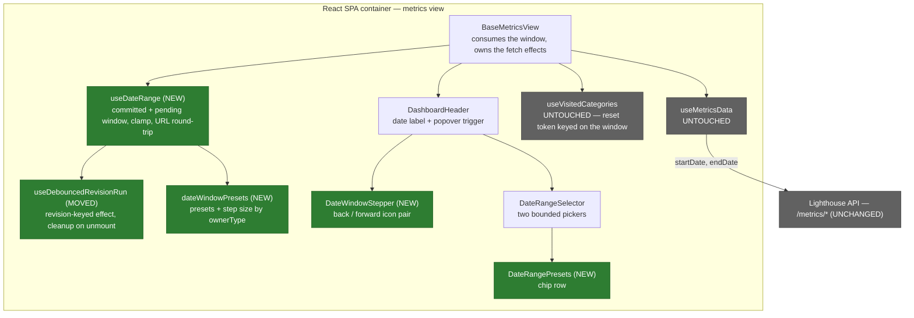

# Feature Delta — story-5914-metrics-time-horizon-presets

**ADO**: User Story #5914 — *Default Timings in Metrics Time Horizon Selection* · Active · tagged
`Release Notes` · no parent Epic.

**Waves**: DISCUSS (2026-09-08).

**One line**: the metrics dashboard's time window can only be reached by typing two calendar dates
into a popover; this feature adds named windows you reach in one click and a pair of steppers that
walk the same-length window backwards and forwards through time.

**Density**: `lean` + `ask-intelligent` (`~/.nwave/global-config.json`). Tier-1 `[REF]` only.

---

## Wave: DISCUSS / [REF] Persona IDs

| Persona | Role here |
|---|---|
| `delivery-lead-rte` | **Primary.** Opens a Team's or Portfolio's metrics during a retro, a review or a leadership conversation, where the window on screen is rarely the window the question is about, and where the follow-up question is always *"better or worse than before?"* |
| `flow-coach` | **Secondary.** Same controls, different cadence — narrows to the last week during a standup rather than widening to a quarter for a review. Reads, never configures. |

No new persona. No third stakeholder.

---

## Wave: DISCUSS / [REF] JTBD One-Liners

| Job ID | One-liner |
|---|---|
| `job-lead-reach-the-metrics-window-i-mean-in-one-click` | When the window on screen isn't the one my question is about, I want to reach the window I mean without computing two calendar dates, so I can ask the question while I still have the room's attention. |
| `job-lead-compare-this-period-against-the-one-before` | When I've read this period's numbers and someone asks whether that's better or worse, I want to step the same-length window back one period and re-read the same widgets, so I answer with a comparison instead of a snapshot. |

Both are new jobs against `docs/product/jobs.yaml`. The second is the *reading* twin of the shipped
`job-delivery-lead-tell-blocked-trend-vs-last-period` (Epic #5074), which gives one widget a
baked-in previous-period delta. This job generalises that instinct to **every** widget on the
dashboard, by moving the window rather than by adding a second series to each chart.

---

## Wave: DISCUSS / [REF] Current-State Surface Inventory

Grounded in the code as of `a8e13c1e8`, not in the story text. Five findings, two of which change
what this story is.

| # | Finding | Evidence |
|---|---|---|
| S1 | The window is React state seeded from `?startDate` / `?endDate`, written back with `replace: true`. There is no preset, no stepper, and no persistence of any kind. | `BaseMetricsView.tsx:1215-1252` |
| S2 | **Portfolios already open at 90 days.** The story asks for this; it shipped already. | `PortfolioMetricsView.tsx:68` |
| S3 | **Teams do not open at a flat 30 days.** The opening range is derived from the Team's own throughput window (`throughputEndDate − throughputStartDate`), falling back to 30 only when *Fixed Dates* is on. | `TeamMetricsView.tsx:49, 117-128` |
| S4 | **The two date setters cannot be composed.** `handleStartDateChange` writes `updateDateParams(date, endDate)` and `handleEndDateChange` writes `updateDateParams(startDate, date)`, both closing over the *current render's* values. Calling them in sequence to move both ends makes the second call rewrite the first's `startDate` back to the stale value — and `updateDateParams` rebuilds from a stale `searchParams` too. Any two-ended change needs a new combined setter; it cannot reuse these. | `BaseMetricsView.tsx:1232-1252` |
| S5 | **A committed window change refetches the whole visited category.** `useVisitedCategories`' reset token embeds the formatted start and end dates, so a new window resets the visited set to just the current category and every fetch for it re-fires. | `BaseMetricsView.tsx:1267-1270`, `useCategorySelection.ts:68-104` |

Reusable precedent, both already in the codebase:

| Precedent | Location | Reused for |
|---|---|---|
| A `<Chip>` row of relative date shortcuts (`End of week`, `+1 week`, `+2 weeks`) | `ManualForecaster.tsx:360-393` | The visual language of the preset chips. **Code is not shared** — see D17. |
| The date popover: `CalendarMonthIcon` `ButtonBase` → `Popover` → `DateRangeSelector` (two bounded MUI-X pickers) | `DashboardHeader.tsx:100-144`, `DateRangeSelector.tsx:149-195` | The home for the presets. |
| A Playwright POM that applies a window by URL and waits on the request that carries the new `endDate` | `MetricsPage.ts:347-407` (`MetricsDateRange`) | The E2E acceptance path; extended, not replaced. |

---

## Wave: DISCUSS / [REF] Locked Decisions

### D1 — The Team's opening range stays derived from its throughput window

The story asks to "start teams with a default range of 30 days". S3 shows Teams already have a
default, and it is a *better* one: the window their own throughput configuration names. Overriding
it would silently change what every existing Team dashboard shows on the next load, and would
decouple the metrics window from the window the forecasts are computed over.

`TeamMetricsView.tsx:117-128` is not touched. The presets are purely additive. *(User, 2026-09-08.)*

### D2 — The Portfolio's 90-day default is already shipped and is not re-litigated

`PortfolioMetricsView.tsx:68` already passes `defaultDateRange={90}`. Half of the story's
default-range ask is a no-op. Recorded here so nobody re-implements it, and so the release notes do
not claim it as new.

### D3 — Two controls ship, not one

Absolute **preset chips** (a named window ending today) *and* relative **window steppers** (shift the
whole window by one step). They answer different questions and neither substitutes for the other:
a preset reaches "last 3 months" in one click but cannot walk backwards; a stepper walks backwards
but takes eight clicks to widen 30 days into 90. *(User, 2026-09-08.)*

### D4 — The preset sets differ by owner type

| Owner | Presets |
|---|---|
| Team | `Last 7 days` · `Last 14 days` · `Last 30 days` · `Last 90 days` |
| Portfolio | `Last 30 days` · `Last 90 days` · `Last 180 days` |

Teams are read at a standup cadence and Portfolios at a quarterly one, which is the same reason
their opening defaults already differ (S2, S3). A shared set would be too coarse at one end and too
noisy at the other.

### D5 — The stepper granularity differs by owner type too

Team steps **1 week**; Portfolio steps **4 weeks**. Straight from the story: *"For teams we could
add something like '- 1 week'. For portfolios perhaps just in 4 week steps."*

### D6 — A preset sets `end = today` and `start = today − N days`

A preset is a *named window ending now*, not a duration applied to wherever the window currently
sits. Clicking `Last 30 days` after having stepped back three months returns you to today. This is
the escape hatch from a stepped-back window, and it is why D10's lack of persistence is survivable.

### D7 — A stepper moves both ends and preserves the window's length

`‹` sets `start −= step, end −= step`. `›` is its mirror. The window's length never changes, which
is the entire point: *"give me the same range in the previous period."*

The forward stepper **clamps so `end` never passes today**, and renders disabled once the window
already ends today. There is no floor on the backward stepper — history is as deep as the data is,
and an empty window is a legitimate answer that the widgets already render honestly.

Widening the window instead of moving it was considered and rejected: turning a 30-day window into a
60-day one ending today does not answer "last month versus this month", it averages the two together
and hides the very difference the question is about.

### D8 — Clicks accumulate; only the settled window is committed

Each click updates a **pending** window immediately. The pending window is committed to state and to
the URL only after a quiet period (**500 ms**), and only the committed window fetches.

The reason is concrete, not cosmetic: by S5, every committed change resets the visited-category set
and re-fires every fetch for the current category. Four clicks to walk back a month would be four
full refetch storms against a backend that has been asked for three windows nobody wants to look at.
The story anticipated this — *"we should wait a bit before we apply, as we may click it multiple
times"* — and S5 is why.

### D9 — The pending window never reaches the URL

Only the committed window writes `?startDate` / `?endDate`, still with `replace: true`. Intermediate
steps do not enter the URL, are not shareable, and do not appear in browser history. A link copied
mid-click therefore names a real window that was really fetched.

### D10 — No persistence. The window stays URL-only

No `localStorage`, no per-entity memory, no instance-wide setting. The window keeps living exactly
where it lives today. *(User, 2026-09-08.)*

The `useCategorySelection.ts` localStorage pattern was the obvious candidate and is deliberately not
used. Consequence, stated plainly: every fresh visit re-lands on the derived default and the user
re-picks. D6 keeps that cheap — one click, not two typed dates.

### D11 — Steppers live on the header bar; presets live in the popover

The `‹` and `›` icon buttons flank the date label in `DashboardHeader`, directly around
`{formatDate(startDate)} → {formatDate(endDate)}`. The preset chips go **inside** the popover, above
the two pickers in `DateRangeSelector`.

Rationale: walking back three periods must not cost three popover round-trips, and `‹ [window] ›` is
the pattern every calendar and analytics tool already trained the user on. Presets are a
change-the-question action and belong where changing the window already lives.

Under the `sm` breakpoint `DashboardHeader` hides the date text and shows the calendar icon alone
(`DashboardHeader.tsx:90-124`); the steppers stay visible there, since an icon-only stepper pair
around the calendar button is still a usable control and stepping is the more likely mobile action.

**This is the one placement call made without asking.** If DESIGN disagrees, it is cheap to move —
nothing else depends on where the buttons sit.

### D12 — Terminology: not applicable, explicitly

Every label this feature adds is pure date language — `Last 30 days`, and two directional icon
buttons. None of the eleven renameable terms (feature, work item, team, portfolio, delivery, cycle
time, throughput, WIP, blocked, SLE) appears in any new string. The surrounding `Metrics shown for:`
label is untouched.

### D13 — No RBAC and no premium gate

The controls navigate data the viewer can already reach by typing two dates. Gating them would gate
convenience, not information. No `useRbac()` call, no `canUsePremiumFeatures` check, nothing new in
`IRbacAdministrationService`.

### D14 — Zero backend change

No new endpoint, no DTO change, no EF migration, no `HistoricalSchemaPatch` entry. The existing
metrics endpoints already take `startDate` and `endDate`; this feature only changes which pair the
browser sends. `dotnet build` / `dotnet test` are run as a regression check, not because anything
under `Lighthouse.Backend/` is edited.

### D15 — Lighthouse-Clients (CLI / MCP): not applicable, explicitly

The window is browser-side view state. The clients already accept explicit start and end dates on
the calls that need them, and gain nothing from a UI shortcut. No client version bump.

### D16 — The end picker's future dates are left alone

`DateRangeSelector.tsx:180-188` gives the end picker a `minDate` but no `maxDate`, so a user can
already select an end date in the future. Presets (D6) and the forward stepper (D7) both clamp at
today; the manual picker's behaviour is **unchanged**. Tightening it is a separate question about a
pre-existing surface and is not smuggled in here.

### D17 — New code uses date-fns, not dayjs

`DateRangeSelector` runs on `date-fns` via `AdapterDateFns`; `ManualForecaster`'s chip row
(`ManualForecaster.tsx:360-393`) runs on `dayjs`. The chips are a **visual** precedent only. Pulling
`dayjs` into the metrics popover to share four lines of arithmetic would put two date libraries on
one surface to save a `setDate` call.

---

## Wave: DISCUSS / [REF] Scope Assessment

**PASS — right-sized.** Two user stories, two slices, one bounded context (metrics view state),
frontend only. No new component beyond two small presentational ones, no schema change, no new
endpoint, no external integration, no new abstraction. Well under every oversized signal.

---

## Wave: DISCUSS / [REF] WS Strategy

**C — no walking skeleton.** Brownfield. Every mechanism on the path already runs in production: the
window state, the URL round-trip, the popover, the fetch cycle keyed on the dates, and the E2E POM
that drives it. Nothing here is a mechanism nobody has run.

---

## Wave: DISCUSS / [REF] Driving Ports

| Surface | Change |
|---|---|
| Team → Metrics · Portfolio → Metrics, date popover | Gains an owner-aware preset chip row above the two pickers (D4, D11). |
| Team → Metrics · Portfolio → Metrics, dashboard header | Gains backward and forward icon buttons flanking the date label (D5, D7, D11). |
| `?startDate` / `?endDate` query params | Unchanged shape and encoding (local Y/M/D). Written only on commit (D9). |
| HTTP API | **None.** No endpoint added, removed or changed (D14). |
| CLI / MCP | **None** (D15). |

---

## Wave: DISCUSS / [REF] Pre-requisites

- None blocking. Every surface is shipped and stable.
- No coordination with another in-flight item. Bug #5915 (date-picker crash) touches
  `DateRangeSelector`'s validity handling and is held unpushed; it hardens the same file this
  feature extends but does not conflict with it — the presets never hand the picker a user-typed
  date, they set state directly.

---

## Wave: DISCUSS / [REF] Out of Scope

- Persisting the window, per entity or per instance (D10).
- Changing the Team's opening range (D1) or the Portfolio's (D2).
- Constraining the manual end picker to today (D16).
- A previous-period *overlay* — drawing last period as a second series on each chart. That is a
  different, much larger feature; this one moves the window, it does not compare two at once.
- Presets on any other date surface: `ManualForecaster`, `BacktestForecaster`, delivery date pickers,
  Settings. Those keep the controls they have.
- Any backend or client change (D14, D15).
- A "compare to previous period" numeric delta on individual widgets. The Blocked widget already has
  one from Epic #5074; generalising that is not this story.

---

## Wave: DISCUSS / [REF] User Stories

### US-01 — Reach the window I mean in one click

**Job**: `job-lead-reach-the-metrics-window-i-mean-in-one-click`

As a Delivery Lead opening a Team's or Portfolio's metrics, I want a row of named windows in the
date popover, so that reaching "the last quarter" does not mean working out what date it was three
months ago and typing it twice.

#### Elevator Pitch
Before: reaching a different window means opening the popover and typing two calendar dates, which
means doing date arithmetic in your head in front of the room.
After: run `Team → Metrics → the date button → Last 90 days` → sees the header read
`10 Jun 2026 → 08 Sep 2026` and every widget on the category redraw over that window.
Decision enabled: whether the pattern you are looking at is a this-month artefact or a
this-quarter trend — the thing you cannot tell from one window.

#### Acceptance Criteria

- **AC-01.1** — Opening the date popover on a **Team**'s metrics shows exactly four preset chips,
  labelled `Last 7 days`, `Last 14 days`, `Last 30 days`, `Last 90 days`, above the two pickers.
- **AC-01.2** — Opening the date popover on a **Portfolio**'s metrics shows exactly three preset
  chips, labelled `Last 30 days`, `Last 90 days`, `Last 180 days`.
- **AC-01.3** — Clicking `Last 30 days` sets the end date to today and the start date to today
  minus 30 days, and both are visible in the header label immediately.
- **AC-01.4** — After clicking a preset, the URL carries **both** `startDate` and `endDate` matching
  the chip's window, in local Y/M/D encoding. This is the regression net for S4: a torn write that
  moves one end and leaves the other stale fails here.
- **AC-01.5** — Clicking a preset while the window is stepped three periods into the past returns
  the window to one ending today (D6).
- **AC-01.6** — The chip whose window matches the current one renders as selected; after any manual
  edit to either picker, no chip renders as selected.
- **AC-01.7** — Clicking a preset navigates with `replace: true` — the browser back button leaves
  the metrics view rather than walking back through preset clicks.
- **AC-01.8** — With `?startDate` / `?endDate` already in the URL on load, that window wins and no
  chip forces itself over it.

### US-02 — Step the same window back a period and read it again

**Job**: `job-lead-compare-this-period-against-the-one-before`

As a Delivery Lead who has just read this period's numbers, I want to move the whole window back one
period and forward again, so that "is that better or worse than last month?" is answered on the same
widgets rather than from memory.

#### Elevator Pitch
Before: comparing against the previous period means computing four dates, typing two of them,
memorising the numbers, then typing the other two back.
After: run `Team → Metrics → the back stepper beside the date label` → sees the header shift from
`09 Aug 2026 → 08 Sep 2026` to `10 Jul 2026 → 09 Aug 2026` and every widget redraw over the period
immediately before.
Decision enabled: whether the current number is a change or a level — whether to raise it.

#### Acceptance Criteria

- **AC-02.1** — With a 30-day window ending today on a **Team**, clicking the back stepper once
  produces a window still 30 days long, with both ends 7 days earlier (D5, D7).
- **AC-02.2** — On a **Portfolio**, one back-stepper click moves both ends 28 days earlier.
- **AC-02.3** — Clicking the back stepper four times in quick succession results in **one** committed
  window (28 days earlier on a Team) and **one** round of metrics requests — not four (D8, S5).
- **AC-02.4** — During those four clicks the header label updates on every click, before anything is
  fetched, and is visually distinguished as not-yet-applied until the commit lands.
- **AC-02.5** — The window is committed 500 ms after the last click, at which point the URL updates
  and the widgets refetch.
- **AC-02.6** — The forward stepper is disabled while the window already ends today, and stepping
  forward never produces an end date after today (D7).
- **AC-02.7** — Stepping forward from a window whose end is fewer than one step from today lands the
  end exactly on today and shortens nothing — the window keeps its length and the start moves with
  it, clamped as one unit.
- **AC-02.8** — Only committed windows enter the URL; four clicks add one history-free
  `replace: true` navigation, not four (D9).
- **AC-02.9** — Unmounting the view mid-debounce (navigating away between the last click and the
  commit) fires no state update and logs no React warning.

---

## Wave: DISCUSS / [REF] Story Map

**Backbone:** open a dashboard → decide the window I need → reach it → read it → compare it against
the period before → answer the question.

| Slice | Stories | Ships |
|---|---|---|
| 01 — *Named windows in one click* | US-01 | The combined two-ended setter that S4 shows is missing, plus the owner-aware preset chip row inside the popover. |
| 02 — *Walk the window through time* | US-02 | The header steppers on top of that setter, with debounced commit, pending-window label and the forward clamp. |

Slice 01 runs first because slice 02 is built on the setter slice 01 has to introduce. Shipping the
steppers first would mean writing that setter anyway and shipping it under the harder of the two
features.

---

## Wave: DISCUSS / [REF] Slice Taste Tests

| Test | Verdict |
|---|---|
| Ships 4+ new components? | No. Slice 01 ships one presentational chip row; slice 02 ships two icon buttons and one hook. |
| Every slice depends on a new abstraction? | The combined `applyDateRange(start, end)` setter is new, and it ships **first**, inside slice 01, in service of a user-visible chip row — not as a standalone plumbing slice. |
| Does any slice disprove a pre-commitment? | Yes, both. Slice 01 disproves "a two-ended window change can reuse the existing per-end setters" (S4). Slice 02 disproves "debouncing the commit is enough to stop the refetch storm without the label lying about what is on screen". |
| Synthetic data only? | No. Both are accepted against the dev instance restored from a production backup, where the deep history a 180-day window needs actually exists. |
| Two slices identical but for scale? | No. Different controls, different failure modes — one is a correctness bug about torn writes, the other is a timing bug about pending state. |

All pass.

---

## Wave: DISCUSS / [REF] Prioritization

1. **Slice 01 first — dependency, and the sharper of the two correctness risks.** S4 is a real trap:
   the two existing setters close over stale values, so the obvious implementation (call both) writes
   a window nobody asked for and fetches it. Finding that with four chips on screen is cheap; finding
   it underneath a debounced stepper, where the torn window flashes past between commits, is not.
2. **Slice 02 second — where the timing uncertainty is.** The pending-versus-committed split is the
   one thing here a user can catch us lying about: a header that reads a window the widgets are not
   showing. Nothing is built on top of this slice, so if the honesty treatment is wrong it costs only
   this slice.

---

## Wave: DISCUSS / [REF] Outcome KPIs

| KPI | Target | Measurement |
|---|---|---|
| KPI-1 — Clicks to a named window | **1**, down from 2 typed dates plus mental arithmetic | AC-01.3 acceptance test |
| KPI-2 — Clicks to the previous period | **1**, down from 4 dates computed and 2 typed | AC-02.1 acceptance test |
| KPI-3 — Requests per burst of stepper clicks | **1** round, for any number of clicks inside 500 ms | AC-02.3, asserted on intercepted requests — the direct measure of S5's storm |
| KPI-4 — Torn windows written to the URL | **0** — no navigation ever carries a start from one window and an end from another | AC-01.4 and AC-02.8 |
| KPI-5 — Windows ending in the future via a preset or stepper | **0** | AC-02.6, AC-02.7 |
| KPI-6 — Existing opening ranges changed | **0** Teams and **0** Portfolios open on a different window than before the upgrade | AC-01.8 plus a before/after check on the dev instance restored from a production backup (D1, D2) |

---

## Wave: DISCUSS / [REF] Definition of Done

1. Both slices' acceptance criteria pass as automated tests (Vitest + Playwright).
2. `pnpm test` green; `pnpm build` zero errors and zero warnings; Biome clean on `./src`.
3. `dotnet build` zero warnings and `dotnet test` green on the non-connector filter — as a regression
   check only; no backend file is edited (D14).
4. SonarQube Cloud introduces no new issue of any severity.
5. Frontend mutation testing (StrykerJS) run per-feature, ≥80% kill rate, recorded under
   `docs/feature/story-5914-metrics-time-horizon-presets/mutation/`. Backend Stryker: **N/A, because
   no backend code changes** (D14).
6. `docs/metrics/` prose updated to describe the preset chips and the steppers on the date control.
7. The metrics-dashboard screenshot showing the date popover regenerated so the chip row is visible
   — **delete the PNG first**, since the regen keeps the old file when the diff is under 0.5%.
8. `ARCHITECTURE.md`: **N/A, because** this adds no concept, port, adapter or store — it is view
   state on an existing surface.
9. Lighthouse-Clients CLI/MCP version bump: **N/A, because** no client-facing contract changes (D15).
10. Website marketing surface: **N/A, because** this is a usability refinement of an existing
    dashboard, not a capability the site advertises.
11. RBAC impact: **N/A, because** no gate is added, removed or moved (D13).
12. Release notes drafted from the customer pain (typing dates, and having no way to ask "versus last
    period") rather than from the control names — the story carries the `Release Notes` tag.
13. ADO #5914 transitioned Active → Resolved, not Closed.

---

## Wave: DISCUSS / [REF] DoR Validation

| # | Item | Evidence |
|---|---|---|
| 1 | Business value stated | Both elevator pitches; the story is a direct maintainer/customer ask on ADO #5914 with a mockup attached. |
| 2 | Job traceability | US-01 → `job-lead-reach-the-metrics-window-i-mean-in-one-click`; US-02 → `job-lead-compare-this-period-against-the-one-before`. No `infrastructure-only` escape used. |
| 3 | Acceptance criteria testable | 17 ACs, each asserting a rendered element, a URL value, or an observed request count. |
| 4 | Dependencies known | None blocking. The pre-requisites section records the one adjacent unpushed change (Bug #5915) and why it does not conflict. |
| 5 | Sized | Two slices, ~4h and ~5h of crafter dispatch. Frontend only. |
| 6 | Technical feasibility | Every mechanism is shipped (S1, S5, and the popover/POM precedents). The one genuine trap is S4, and it is named with file and line before a slice starts. |
| 7 | Non-functional constraints | No new request type. D8 strictly *reduces* request volume versus a naive implementation; KPI-3 measures it. |
| 8 | UX defined | D4 fixes the exact labels, D5 the step sizes, D11 the placement of both controls, D7 the clamp behaviour. |
| 9 | Testable in isolation | Vitest against `DashboardHeader`, `DateRangeSelector` and the debounce hook; Playwright through the extended `MetricsDateRange` POM. |

**Requirements completeness: 0.96.** The one deliberate gap is D11's placement of the steppers on the
header bar — the only call made without asking, flagged as cheap to move and left open to DESIGN.

**Per-wave peer review: skipped.** No trigger fired.

**Expansion catalog: no trigger fired.** AC ambiguity — no, every AC names an observable.
Cross-context complexity — no, one context, one stack. Multi-stakeholder — no, two personas reading
the same control, under the three-persona bar. Compliance — no regulatory language anywhere. WS
strategy is C, not D. Strict lean output.

---

## Wave: DISCUSS / [REF] Wave Decisions Summary

### Key Decisions

- **[D1]** Team opening range stays derived from the throughput window — overriding it would change
  every existing Team dashboard for no gain (user, 2026-09-08).
- **[D2]** Portfolio's 90-day default already ships; recorded so it is not re-built or re-announced.
- **[D3]** Both presets and steppers ship — they answer different questions (user, 2026-09-08).
- **[D7]** Previous-period means *move both ends, keep the length*, with a forward twin clamped at
  today (user, 2026-09-08).
- **[D8]** Debounced commit at 500 ms, because a committed change resets the visited-category set and
  refetches the whole category (S5).
- **[D10]** No persistence; the window stays URL-only (user, 2026-09-08).
- **[D14]** Zero backend change.

### Requirements Summary

- Primary need: reach a named metrics window in one click, and walk that same-length window through
  time to compare periods, without computing calendar dates.
- Walking skeleton scope: N/A — strategy C, brownfield.
- Feature type: **user-facing**, frontend only.

### Constraints Established

- The two existing date setters cannot be composed; a combined two-ended setter is required (S4).
- Every committed window change costs a full category refetch (S5) — hence D8's debounce and KPI-3.
- Dates are encoded local Y/M/D on both the URL and the wire; nothing here may route through UTC
  (the Bug #5566 failure mode, invisible on a UTC CI runner).
- The metrics popover is a `date-fns` surface; `dayjs` does not enter it (D17).

### Upstream Changes

None. No DISCOVER or DIVERGE wave ran for this story; nothing upstream is contradicted.

---

## Wave: DISCUSS / [REF] SSOT Updates

| File | Change |
|---|---|
| `docs/product/jobs.yaml` | Two new jobs (see JTBD one-liners) with dimensions, four forces and opportunity scores; `story-5914-metrics-time-horizon-presets` added to `feature_context`. |
| `docs/product/journeys/story-5914-metrics-time-horizon-presets.yaml` | New journey `compare-this-period-against-the-last`, with emotional arc and D1-D17 recorded. |
| `docs/product/personas/delivery-lead-rte.yaml` | Both new job IDs appended to `primary_jobs`. |

---

## Wave: DISCUSS / [REF] Handoff

**To**: `nw-solution-architect` (DESIGN) — full artifact set.
**To**: `nw-platform-architect` (DEVOPS) — KPIs only; expected to be a no-op, since there is no
deployment, infrastructure or observability surface here (D14).

Open for DESIGN:

1. D11's placement of the steppers on the header bar rather than inside the popover — the one
   unasked call.
2. The debounce mechanism itself: D8 fixes 500 ms and the pending/committed split, and leaves the
   implementation (a `useDebouncedValue`-style hook versus a ref-held timer inside the stepper) open.
3. Whether the combined setter belongs in `BaseMetricsView` beside the two it supersedes, or in a
   `useDateRange` hook that owns the window, the URL round-trip and the pending state together.

---

## Wave: DESIGN / [REF] Resolved Open Questions

Scope: **application-level only**. Interaction mode: **propose**. No bounded context, aggregate,
driven port or container change — D14 locks zero backend, so there is nothing below the browser to
design. D1-D17 are read as given and are not re-opened.

The codebase answered two of the three questions before any option had to be weighed.

### Q2 — The debounce shape → **an existing, shipped idiom**

`useDebouncedRevisionRun` (`TeamForecastView.tsx:30-39`) is already exactly the mechanism this
feature needs: an effect keyed on a monotonic revision counter, `setTimeout` inside, `clearTimeout`
in the cleanup. The cleanup is what makes AC-02.9 — unmounting mid-debounce fires nothing — a
property of the idiom rather than something to remember to write.

Both candidate options in the handoff are therefore wrong in the same way: a bespoke
`useDebouncedValue` and a ref-held timer would each re-invent a hook this repo already ships and
already tests. **The design reuses the revision-keyed effect** and promotes it out of
`TeamForecastView`'s module scope (DDD-3).

### Q3 — Where `applyDateRange` lives → **a `useDateRange` hook**, and ADR-029 is the precedent

`remove-action-buttons` faced the structurally identical question — where does a debounced,
multi-field commit mechanism live — and ADR-029 put it **in a hook** (`useModifySettings`), with the
state machine owned there and the presentational surface reduced to a status indicator. The stated
drivers were correctness of the commit machine, one identical mechanism across every consuming
surface, and testability of the debounce in isolation. All three apply here verbatim.

The counter-argument for leaving it in `BaseMetricsView` is that the window state already lives
there. That is the weaker case: `BaseMetricsView.tsx` is 1938 lines, the window logic is about to
grow a pending state and a clamp, and the DoR's testability evidence (item 9) asks for the debounce
to be unit-testable without mounting a dashboard. **Extract `useDateRange`** (DDD-2).

### Q1 — Stepper placement → **uphold D11, header bar**

No code fact overturns the DISCUSS call, and the argument that produced it holds: presets are a
change-the-question action and belong where changing the window lives; stepping is a repeated action
and must not cost a popover round-trip per step. Three periods back inside the popover is three
open-click-close cycles.

The one real cost is the `sm` breakpoint. `DashboardHeader.tsx:90-124` hides the "Metrics shown for:"
label and the date text under `sm`, leaving the calendar icon alone; adding the steppers makes that a
three-control row. That reads as a standard back / current / forward group rather than as clutter,
and stepping is the more likely action on a narrow screen. Kept, with the accessible names carrying
the step size so the icons are never the only signal (DDD-1).

---

## Wave: DESIGN / [REF] Decisions

| ID | Decision | One-line rationale |
|---|---|---|
| DDD-1 | Steppers flank the date label in `DashboardHeader`; preset chips live inside the popover | Upholds D11 — stepping is repeated and must not cost a popover round-trip per step; presets are a change-the-question action |
| DDD-2 | The window moves into a new `useDateRange` hook owning committed state, pending state, the clamp and the URL round-trip | ADR-029's precedent for a debounced multi-field commit; `BaseMetricsView.tsx` is already 1938 lines and the DoR asks for the debounce testable in isolation |
| DDD-3 | The debounce reuses `useDebouncedRevisionRun`'s revision-keyed-effect idiom, promoted out of `TeamForecastView` module scope into a shared hook | The idiom is shipped and tested; its `clearTimeout` cleanup gives AC-02.9 for free |
| DDD-4 | The quiet period stays **500 ms**, and `DEBOUNCE_MS = 300` is not reused as the value | 300 ms is tuned for keystroke-driven work (autosave, forecast recompute); deliberate repeated clicking has a longer inter-click gap, and firing between two intended clicks is the exact failure D8 exists to prevent |
| DDD-5 | `applyDateRange(start, end)` is the single write path; the two per-end handlers delegate to it | One write path removes the stale-closure torn write at `BaseMetricsView.tsx:1232-1252` by construction rather than by care |
| DDD-6 | Two new presentational components — `DateRangePresets` and `DateWindowStepper` — both props-only, computing no dates and knowing no owner type | Keeps the arithmetic in one testable place and the components trivially renderable in Vitest |
| DDD-7 | The pending window lives in `useDateRange`, never in `DashboardHeader` | A pending window held in the header would be a second source of truth for the same value; the header renders what it is given |
| DDD-8 | Owner-aware preset lists and step sizes live in one new module, keyed on the existing `ownerType` | `BaseMetricsView.tsx:1254-1255` already derives `ownerType`; no new flag, and the two owner-varying facts sit together rather than in two components |
| DDD-9 | No new `MetricsFetchKey`, no change to `widgetFetchRequirements`, `getFetchKeysForCategories` or the visited-category reset token | Bug #5571's monotonic gate is load-bearing; the refetch storm is prevented **before** the commit, never by weakening the token |
| DDD-10 | No C4 System Context or Container change | D14: zero backend. The browser container's internals change; no container, external system or integration does |

---

## Wave: DESIGN / [REF] Component Decomposition

| Component | Path | Change |
|---|---|---|
| `useDateRange` | `src/pages/Common/MetricsView/useDateRange.ts` | **NEW.** Owns committed `startDate`/`endDate`, the pending window, `applyDateRange`, `stepWindow(direction)`, the forward clamp, and the `?startDate`/`?endDate` round-trip. Returns the committed pair, the pending pair, whether a commit is outstanding, and whether forward stepping is available. |
| `useDebouncedRevisionRun` | `src/hooks/useDebouncedRevisionRun.ts` | **MOVED + widened.** Promoted out of `TeamForecastView.tsx:30-39` into a shared hook taking the delay as a parameter (defaulting to the 300 ms the two existing callers use). `TeamForecastView` imports it instead of declaring it. |
| `dateWindowPresets` | `src/pages/Common/MetricsView/dateWindowPresets.ts` | **NEW.** `getPresetsForOwner(ownerType)` → the D4 lists; `getStepDaysForOwner(ownerType)` → 7 or 28 (D5). Pure, no React. |
| `DateRangePresets` | `src/components/Common/DateRangeSelector/DateRangePresets.tsx` | **NEW.** Presentational chip row: presets in, click out, plus which one is currently selected. Computes no dates. |
| `DateWindowStepper` | `src/pages/Common/MetricsView/DateWindowStepper.tsx` | **NEW.** Presentational back/forward `IconButton` pair: step label and forward-enabled in, direction out. |
| `DateRangeSelector` | `src/components/Common/DateRangeSelector/DateRangeSelector.tsx` | **EXTEND.** Renders `DateRangePresets` above the two pickers, forwarding two new props. The `BoundedDatePicker` pair, its validity guard and the absent end `maxDate` (D16) are untouched. |
| `DashboardHeader` | `src/pages/Common/MetricsView/DashboardHeader.tsx` | **EXTEND.** Renders `DateWindowStepper` either side of the date label; the label reads the pending window and carries the not-yet-applied treatment. Forwards the preset props into the popover. |
| `BaseMetricsView` | `src/pages/Common/MetricsView/BaseMetricsView.tsx` | **EXTEND, net shrink.** `startDate`/`endDate`/`updateDateParams`/`handleStartDateChange`/`handleEndDateChange` (L1215-1252) move into `useDateRange`; the component consumes the hook and passes presets and step size down. Everything downstream of the dates — the fetch effects, the visited-category token, `buildViewData` — is unchanged. |
| `MetricsDateRange` (POM) | `Lighthouse.EndToEndTests/tests/models/metrics/MetricsPage.ts:347-407` | **EXTEND.** Keeps `apply` / `applyAndWaitFor` exactly as they are; gains locators for the chips and the two steppers, and a helper that counts metrics requests across a click burst. |

---

## Wave: DESIGN / [REF] Reuse Analysis

| Existing component | File | Overlap | Decision | Justification |
|---|---|---|---|---|
| `useDebouncedRevisionRun` | `TeamForecastView.tsx:30-39` | Debounced commit with unmount-safe cleanup — exactly what AC-02.3/AC-02.9 need | **EXTEND** | Promote to a shared hook with a delay parameter: ~6 LOC moved plus one parameter, versus writing a second debounce idiom in the same codebase. Its `clearTimeout` cleanup is AC-02.9. |
| `useModifySettings` autoSave machine | `useModifySettings.ts:26,50,169` | Also a debounced multi-field commit | **CREATE NEW** (`useDateRange`) | Different domain and a different contract: it persists a form to the server behind an RBAC `canSave` input with a `saving/saved/error` machine and a stale-response guard. There is nothing to persist here and no failure state — the commit is a URL write. Sharing would mean carrying a save-state machine that can never leave `idle`. Its **precedent** (mechanism in a hook) is what is reused; its code is not. |
| `DateRangeSelector` | `DateRangeSelector.tsx:149-195` | Owns the popover's date UI | **EXTEND** | The chips belong above the pickers on the same surface; a parallel selector would split "change the window" across two components. |
| `DashboardHeader` | `DashboardHeader.tsx:31-147` | Owns the date label and the popover trigger | **EXTEND** | The steppers sit either side of the label it already renders. |
| `BaseMetricsView` window state | `BaseMetricsView.tsx:1215-1252` | Is the window | **EXTEND** (extract to `useDateRange`) | Net removal from a 1938-line component; the alternative grows it by a pending state, a clamp and a debounce, and leaves the debounce untestable without mounting a dashboard. |
| `useVisitedCategories` | `useCategorySelection.ts:68-104` | Keys its reset token on the window | **DO NOT TOUCH** | Bug #5571's monotonic gate. Weakening it to absorb the storm reintroduces exactly the refetch-on-return it exists to prevent. The storm is stopped upstream by DDD-3/DDD-4. |
| `useCategorySelection` localStorage pattern | `useCategorySelection.ts:23-61` | Per-entity view-state persistence | **NOT USED** | D10 locks URL-only. Named here so a reviewer sees it was considered and declined, not missed. |
| `ManualForecaster` chip row | `ManualForecaster.tsx:360-393` | Visually identical control | **CREATE NEW** | Runs on `dayjs`; D17 keeps `dayjs` off this `AdapterDateFns` surface. Visual precedent only — four lines of arithmetic do not justify a second date library on one screen. |
| `MetricsDateRange` POM | `MetricsPage.ts:347-407` | Drives the window in E2E | **EXTEND** | Its URL-based `applyAndWaitFor` stays the setup path for other specs; the new specs add locators and a request counter beside it. |

Zero unjustified CREATE NEW.

---

## Wave: DESIGN / [REF] Driving Ports

Unchanged from `## Wave: DISCUSS / [REF] Driving Ports`. No HTTP, CLI or MCP surface is added,
removed or changed (D14, D15). The `?startDate` / `?endDate` query params keep their shape and their
local Y/M/D encoding; only *when* they are written changes (D9 — on commit, never on a pending step).

## Wave: DESIGN / [REF] Driven Ports and Adapters

**None.** This feature performs no outbound side-effect of its own. It changes which `startDate` /
`endDate` pair the already-existing metrics calls carry.

---

## Wave: DESIGN / [REF] Technology Choices

| Choice | Value | Rationale |
|---|---|---|
| Paradigm | OOP project, functional-leaning React hooks | Unchanged; matches the existing frontend and the project's stated paradigm |
| Date library | `date-fns` | D17 — `DateRangeSelector` is an `AdapterDateFns` surface; `dayjs` stays out |
| Debounce | `setTimeout` in a revision-keyed `useEffect`, cleared on cleanup | DDD-3 — the shipped idiom; no new dependency |
| Quiet period | 500 ms | DDD-4 |
| State | React `useState` inside `useDateRange`, mirrored to the URL via `useSearchParams` | No store, no cache, no react-query — consistent with the metrics path, which by Bug #5571's finding has no cache anywhere |
| Frontend tests | Vitest + React Testing Library | Project standard |
| E2E | Playwright, Page Object Model | Project standard |
| Backend | **No change** | D14 |

---

## Wave: DESIGN / [REF] C4 — System Context and Container

**Unchanged.** No actor, external system, container or integration is added or altered — see the
existing System Context and Container views in `docs/product/architecture/brief.md`. This feature
lives entirely inside the existing React SPA container (DDD-10). Redrawing them here would restate
the brief without a single edge changing.

## Wave: DESIGN / [REF] C4 — Component (the window path)

The single arrow that matters: **nothing new sits between `BaseMetricsView` and the fetch path.**
`useDateRange` produces a committed window and the rest of the dashboard consumes it exactly as it
consumes the two `useState` slots today, which is what keeps the blast radius to the window itself.

---

## Wave: DESIGN / [REF] Open Questions

Deferred to DISTILL / DELIVER — none of these changes the shape above:

1. **The not-yet-applied treatment on the header label** (AC-02.4). The design fixes *that* there is
   one and that it clears on commit; whether it is reduced opacity, italics or a small pending glyph
   is a rendering choice DISTILL can assert on a `data-` attribute without pinning the visual.
2. **Whether `DateWindowStepper` renders one component with a direction prop or two mirrored ones.**
   Internal to a props-only component; no contract depends on it.
3. **How the E2E counts requests across a burst.** Playwright route interception versus collecting
   `page.on("request")` — both satisfy AC-02.3; DISTILL picks when it writes the spec.

**Per-wave peer review: skipped.** No trigger fired — no contested ADR (ADR-189 records a decision
already precedented by ADR-029), no novel pattern, no performance budget needing a spike, no security
boundary change.

**Expansion catalog: no menu.** DESIGN declares no `ask-intelligent` triggers.

---

## Wave: DEVOPS / [REF] Pre-requisites

**This wave is a no-op, and the following is the evidence rather than an assertion.** D14 locks zero
backend change; DDD-10 records that no C4 System Context or Container edge moves. Concretely, this
feature adds no endpoint, DTO, EF migration, `HistoricalSchemaPatch` entry, configuration key,
secret, environment variable, chart value, dependency, workflow or job. The changed code ships inside
the React SPA bundle that already ships, on the pipeline that already builds it.

Every item below is answered explicitly. Nothing is silently skipped.

---

## Wave: DEVOPS / [REF] Environment Matrix

Full inventory: `docs/feature/story-5914-metrics-time-horizon-presets/environments.yaml`.

| Environment | Why it is in the matrix |
|---|---|
| `local-dev` | Ordinary development. |
| `ci-frontend` | Existing `ci.yml` frontend steps — `pnpm test`, `tsc -b`, `vite build`, `biome check`. **No new workflow, no new job.** |
| `ci-frontend-nonutc` | **Not ceremony.** Every preset, step and clamp computes a calendar day and round-trips it through `?startDate`/`?endDate` in local Y/M/D. On a UTC runner the UTC day and the local day never disagree, so an accidental `toISOString` passes every test and shifts a real viewer's window by a day — Bug #5566's exact failure mode. The date-arithmetic suites run with `TZ` at a negative offset. |
| `e2e-demo` | Existing Playwright stack, existing demo-data fixture, extended POM. |
| `viewport-narrow` | **Not ceremony.** DDD-1 accepted a three-control header row below the `sm` breakpoint, where `DashboardHeader.tsx:90-124` hides the date text and the icons are the only visible signal. That acceptance is only sound if the accessible names carry the step size — asserted, not assumed. |
| `customer-self-hosted` | Nothing to install, migrate or configure. Listed to record that. |

---

## Wave: DEVOPS / [REF] CI/CD Pipeline Outline

**No change.** The existing `ci.yml` frontend stages already gate everything this feature can break:
`pnpm test` → `biome check ./src` (as the `prebuild` hook) → `tsc -b` → `vite build`, plus SonarQube
Cloud on the PR and the existing Playwright job.

One addition inside an existing stage, not a new stage: the date-arithmetic Vitest suites run a
second time with `TZ` set to a negative-offset zone (`ci-frontend-nonutc`). That is a matrix
parameter on a job that already exists.

Backend stages: **N/A, because** no backend file is edited (D14). They still run as a regression
check, unchanged.

---

## Wave: DEVOPS / [REF] Monitoring Contracts (KPI → instrument)

| KPI | Instrument |
|---|---|
| KPI-1 — clicks to a named window | **None. Asserted in the suite**, AC-01.3. |
| KPI-2 — clicks to the previous period | **None. Asserted in the suite**, AC-02.1. |
| KPI-3 — requests per burst of clicks | **None. Asserted in the suite**, AC-02.3, on intercepted requests in Playwright. |
| KPI-4 — torn windows written to the URL | **None. Asserted in the suite**, AC-01.4 and AC-02.8. |
| KPI-5 — windows ending in the future | **None. Asserted in the suite**, AC-02.6 and AC-02.7. |
| KPI-6 — existing opening ranges changed | **None. Verified once, by hand**, before/after on the dev instance restored from a production backup. |

**No Prometheus metric, no log line, no dashboard, no alert — and no usage instrumentation of any
kind.** Two reasons, both binding:

1. Every KPI is a property of the code, provable before release. A counter emitted in the field would
   restate at runtime something a red test already prevents from shipping.
2. In this product "telemetry" already names the Prometheus surface, and three shipped surfaces
   promise Lighthouse collects nothing about its users. Instrumenting a click here would make one of
   those promises false to buy a number we already have.

---

## Wave: DEVOPS / [REF] Observability Stack

**No change.** Prometheus + Grafana and the existing Serilog structured logging stay exactly as they
are. This feature emits no new signal in any class — no log, no metric, no trace, no health check —
because it performs no outbound side-effect (see `## Wave: DESIGN / [REF] Driven Ports and
Adapters`). A failure mode that could warrant a signal does not exist: the widest thing that can go
wrong is a window nobody asked for, which is visible on screen and fixed by one click.

---

## Wave: DEVOPS / [REF] Deployment Strategy

**No change — the existing rolling deployment of the existing artifact.** There is nothing to
sequence, gate or feature-flag: the code is inside the SPA bundle.

**Rollback contract:** the ordinary frontend rollback to the prior bundle, with no residue. Nothing
is persisted (D10), no schema moved (D14), and a URL carrying `?startDate`/`?endDate` means the same
thing on both builds — so a rolled-back user lands on a working window rather than a stranded one.

---

## Wave: DEVOPS / [REF] Mutation Testing Strategy

**`per-feature`, unchanged** — already recorded in the project `CLAUDE.md`. StrykerJS on the frontend,
≥80% kill rate, recorded under `docs/feature/story-5914-metrics-time-horizon-presets/mutation/`.

Backend Stryker.NET: **N/A, because** no backend code changes (D14).

Known trap for whoever runs it: StrykerJS has previously left `@ts-nocheck` behind in source files
after a run — check the working tree before committing.

---

## Wave: DEVOPS / [REF] Branching Strategy

**Trunk-based on `main`, unchanged.** Direct pushes to `origin/main`, no branches, no PRs. CI triggers
are already aligned to that model and this feature does not touch them.

---

## Wave: DEVOPS / [REF] Coexistence Matrix

Full matrix with rationale: `environments.yaml`. The two entries that carry real risk:

| Tool | Must not break | Why it is the risk |
|---|---|---|
| Visited-category fetch gate (`useVisitedCategories`) | Yes | Bug #5571's monotonic gate. The obvious way to absorb a click burst is to loosen its date-keyed reset token — DDD-9 forbids exactly that, because it would trade a burst nobody has for a refetch on every category return. |
| `TeamForecastView`'s debounced forecasts | Yes | DDD-3 moves `useDebouncedRevisionRun` out of that file's module scope. It is the one file this feature touches that it otherwise has no business in; the move is behaviour-preserving and that file's existing tests are the guard. |

Also listed and unchanged: the manual date pickers, the two existing `MetricsDateRange` POM callers,
the `@screenshot` suite (one PNG regenerates at finalization), SonarCloud, StrykerJS.

---

## Wave: DEVOPS / [REF] Changed Assumptions

**None.** No DEVOPS finding contradicts DISCUSS or DESIGN, and no upstream change is required.

**Continuous learning (A/B, feature flags, canary analysis, progressive rollout): N/A, because** the
feature is a navigation control with no hypothesis to split traffic on and no failure mode worth
auto-rolling-back. Adding a flag would add a code path to test for no decision it enables.

**KPI instrumentation pipeline and dashboard spec: N/A, because** no KPI is a runtime signal — see
Monitoring Contracts. `docs/product/kpi-contracts.yaml` is therefore not extended.

**Deployment topology in `docs/product/architecture/brief.md`: N/A, because** no managed service,
region or container changes (DDD-10). The brief's new section is an Application Architecture delta
only.

**Per-wave peer review: skipped.** No trigger fired — no novel deployment target, no CI/CD framework
change, no observability rewrite, no security posture change.

**Expansion catalog: no menu.** DEVOPS declares no `ask-intelligent` triggers.

---

## Wave: DISTILL / [REF] Distill decisions

Wave: DISTILL. Date: 2026-09-08. Density: lean, Tier-1 only — DISTILL declares no `ask-intelligent`
triggers, so no expansion menu was offered. DISCUSS's D1-D17 and DESIGN's DDD-1..DDD-10 are
constraints here, not options. Numbering starts at DT-1 so it collides with neither.

| ID | Decision | Implements |
|---|---|---|
| DT-1 | **Vitest + React Testing Library, colocated, and no Gherkin anywhere.** The project's own ATDD policy says in its preamble that the Python-pilot artifacts — `.feature` files, `steps_*.py`, `domain_types.py`, `assert_state_delta` universes, Hypothesis harnesses, `__SCAFFOLD__` markers — do not apply to this repo. The feature touches no backend file, so the whole suite is frontend. Scenario identifiers below are `it` names; there is no `.feature` file for anyone to look for. | — |
| DT-2 | **The pure module is `dateWindow.ts`, not DESIGN's `dateWindowPresets.ts`.** It carries the window arithmetic (`presetWindow`, `shiftWindow`, `clampWindowToToday`, `canStepForward`, `windowLengthInDays`, `matchingPresetDays`) alongside the owner-aware configuration DESIGN named it for. Splitting seven pure functions across two modules to keep a filename literal costs an import and buys nothing; the name widened instead. | DDD-8 |
| DT-3 | **Every call into a scaffold is made inside a test body, never at describe scope.** `describe.skip` still *evaluates its describe body* — Vitest skips the tests, not the block. A scaffold call hoisted to describe scope therefore throws during collection and the runner reports **`Failed Suites 1`**, i.e. the file is BROKEN rather than its tests pending. Found the hard way: the first run of this wave's suite failed exactly that way on two hoisted constants, which are now lazy helpers. This is the RED-vs-BROKEN distinction with a TypeScript face on it. | — |
| DT-4 | **Scaffold bodies throw a message that names the function and interpolates its arguments.** `noUnusedParameters` is on in `tsconfig.app.json`, so a stub that ignores its parameters does not compile, and underscore-prefixing them would force a rename in DELIVER. Interpolating them satisfies the compiler, needs no later edit, and makes the failure say which contract is missing and what it was asked. | — |
| DT-5 | **The two new components are tested in their own colocated files, not by appending to `DateRangeSelector.test.tsx` and `DashboardHeader.test.tsx`.** Appending would mean widening two shipped components' prop types during DISTILL to keep a skipped test compiling — in TypeScript a skipped test is still type-checked. Testing the new components directly needs no edit to any shipped file. The *integration* assertions (the selector renders the chip row; the header renders the steppers and marks a pending window) land in DELIVER, where the wiring exists. | DDD-6 |
| DT-6 | **A chip's selected state is `aria-pressed`, not a colour or a MUI variant.** Named here because the tests assert it and DELIVER has to render it. A colour-only signal would make AC-01.6 assertable only by computed style, which is both brittle and inaccessible. | D6, AC-01.6 |
| DT-7 | **The steppers' accessible names are `Previous {N} days` and `Next {N} days`.** Below the `sm` breakpoint the header hides its date text, so the icons are the only visible signal and the step size is stated nowhere else a narrow-screen reader can reach. Asserted, not assumed — this is the `viewport-narrow` axis DEVOPS put in the matrix. | DDD-1 |
| DT-8 | **No Playwright work in this wave.** The single E2E walking skeleton — extending `MetricsDateRange` with chip and stepper locators and a request counter — is specified below and written in DELIVER. Three standing repo rules collide otherwise: never commit an unrun spec or page-object locator, never push red, and `pnpm build` runs `tsc -b`, so a spec calling a page-object method nobody has written fails the build for everyone. A skeleton is worth writing when it can be run, and it cannot be run until the controls exist. | — |
| DT-9 | **`useDebouncedRevisionRun` is not moved in this wave.** DDD-3 promotes it out of `TeamForecastView`, but that is a refactor of shipped code, which is DELIVER's job, not a scaffold. Its behaviour-preserving guard already exists: `TeamForecastView.autorun.test.tsx`, 281 lines driving the 300 ms debounce through fake timers. DELIVER's slice-02 first act is the move; nothing in this wave depends on it. | DDD-3 |
| DT-10 | **"A burst of clicks costs one refetch" is asserted by recording writes to the search params, not by counting HTTP calls.** At the hook's level the params *are* the trigger: `useVisitedCategories` resets on the formatted window and every fetch for the category re-fires. Counting requests would need the whole dashboard mounted to observe a property the hook fully determines. The HTTP-level half is the DELIVER Playwright spec; the two together are AC-02.3. | D8, DDD-9 |

---

## Wave: DISTILL / [REF] Scenario list

**66 tests across 4 files, all landing `describe.skip`.** There is no `.feature` file (DT-1), so a
scenario's identifier is its test name. Tags are notional — this repo has no tag runner; they are here
for the traceability the wave contract asks for.

### `src/pages/Common/MetricsView/dateWindow.test.ts` — 29 tests, NEW

| Scenario | Tags |
|---|---|
| offers a team four named windows, shortest first | `@US-01` `@AC-01.1` |
| labels a team's windows in plain days | `@US-01` `@AC-01.1` |
| offers a portfolio three named windows, starting where a team's stop | `@US-01` `@AC-01.2` |
| labels a portfolio's windows in plain days | `@US-01` `@AC-01.2` |
| steps a team's window by one week | `@US-02` `@AC-02.1` |
| steps a portfolio's window by four weeks | `@US-02` `@AC-02.2` |
| ends a preset window on today and starts it the named number of days earlier | `@US-01` `@AC-01.3` |
| names the same calendar days a reader would count on a wall calendar | `@US-01` `@tz` |
| counts a preset window's length as the number the preset is named after | `@US-01` |
| counts length in calendar days, so a clock change inside the window does not shorten it | `@US-01` `@tz` `@edge` |
| crosses a year boundary without losing a day | `@US-01` `@edge` |
| moves both ends of a team's window one week earlier | `@US-02` `@AC-02.1` |
| moves both ends of a portfolio's window four weeks earlier | `@US-02` `@AC-02.2` |
| keeps the window exactly as long as it was | `@US-02` `@AC-02.1` |
| keeps the window as long as it was however far back it is walked | `@US-02` `@property` |
| walks forward the same distance it walks back | `@US-02` `@property` |
| lands four single-week steps exactly where one four-week step lands | `@US-02` `@AC-02.3` |
| walks back across a year boundary without losing a day | `@US-02` `@edge` |
| lets the window be walked forward while it still ends in the past | `@US-02` `@AC-02.6` |
| refuses to walk forward once the window already ends today | `@US-02` `@AC-02.6` |
| refuses to walk forward from a window that already ends after today | `@US-02` `@AC-02.6` `@edge` |
| lands the end exactly on today when the last step forward would overshoot | `@US-02` `@AC-02.7` |
| moves the start with the end when clamping, so the window keeps its length | `@US-02` `@AC-02.7` |
| leaves a window that already ends today alone | `@US-02` `@AC-02.7` |
| leaves a window that ends well before today alone | `@US-02` `@AC-02.7` |
| recognises a window that is exactly a named one | `@US-01` `@AC-01.6` |
| recognises no named window behind a hand-picked length | `@US-01` `@AC-01.6` |
| recognises no named window once the window has been walked into the past | `@US-01` `@AC-01.6` `@edge` |
| does not offer a team's shortest window to a portfolio | `@US-01` `@edge` |

### `src/pages/Common/MetricsView/useDateRange.test.tsx` — 25 tests, NEW

| Scenario | Tags |
|---|---|
| opens on the range the owner was configured with | `@US-01` `@AC-01.8` |
| opens a portfolio on its own longer range | `@US-01` `@AC-01.8` |
| lets a window already named in the address win over the configured range | `@US-01` `@AC-01.8` |
| offers a team its four named windows and a portfolio its three | `@US-01` `@AC-01.1` `@AC-01.2` |
| moves the window to the named number of days ending today | `@US-01` `@AC-01.3` |
| **names both ends of the window in one write to the address** | `@US-01` `@AC-01.4` `@regression` |
| replaces the address rather than stacking a step onto the back button | `@US-01` `@AC-01.7` |
| brings a window that was walked into the past back to today | `@US-01` `@AC-01.5` |
| marks the named window the reader is looking at | `@US-01` `@AC-01.6` |
| marks no named window once a date has been picked by hand | `@US-01` `@AC-01.6` |
| keeps the end where it was when only the start is picked | `@US-01` `@AC-01.4` `@regression` |
| keeps the start where it was when only the end is picked | `@US-01` `@AC-01.4` `@regression` |
| ignores a date the browser could not make sense of | `@US-01` `@error` |
| moves a team's window back one week | `@US-02` `@AC-02.1` |
| moves a portfolio's window back four weeks | `@US-02` `@AC-02.2` |
| settles a burst of clicks into a single window | `@US-02` `@AC-02.3` |
| **settles a burst of clicks into a single trip to the address, and so a single refetch** | `@US-02` `@AC-02.3` `@AC-02.8` |
| shows every click on the label before any of them is applied | `@US-02` `@AC-02.4` |
| stops saying a window is pending once it has been applied | `@US-02` `@AC-02.4` |
| applies nothing while the reader is still clicking | `@US-02` `@AC-02.5` |
| keeps waiting when another click lands inside the quiet period | `@US-02` `@AC-02.5` |
| offers no way forward from a window that already ends today | `@US-02` `@AC-02.6` |
| offers a way forward once the window has been walked into the past | `@US-02` `@AC-02.6` |
| lands exactly on today, at full length, when a step forward would overshoot | `@US-02` `@AC-02.7` |
| applies nothing and complains about nothing when the reader navigates away first | `@US-02` `@AC-02.9` `@error` |

### `src/pages/Common/MetricsView/DateWindowStepper.test.tsx` — 7 tests, NEW

| Scenario | Tags |
|---|---|
| says how far it moves the window, because on a narrow screen the icon is all there is | `@US-02` `@a11y` `@viewport-narrow` |
| says four weeks when it is a portfolio's stepper | `@US-02` `@a11y` |
| asks for the period before this one | `@US-02` `@AC-02.1` |
| asks for the period after this one | `@US-02` `@AC-02.6` |
| offers no way forward when the window already ends today | `@US-02` `@AC-02.6` |
| still offers the way back when the window ends today | `@US-02` `@AC-02.6` |
| asks for nothing when the way forward is closed | `@US-02` `@AC-02.6` `@error` |

### `src/components/Common/DateRangeSelector/DateRangePresets.test.tsx` — 5 tests, NEW

| Scenario | Tags |
|---|---|
| offers a team every window it was given, in the order it was given them | `@US-01` `@AC-01.1` |
| offers a portfolio its own three windows | `@US-01` `@AC-01.2` |
| reports the window the reader chose | `@US-01` `@AC-01.3` |
| shows which window the reader is currently looking at | `@US-01` `@AC-01.6` |
| claims no window at all once the dates were picked by hand | `@US-01` `@AC-01.6` `@edge` |

---

## Wave: DISTILL / [REF] WS strategy

**No walking skeleton, inherited from DISCUSS (strategy C).** Brownfield: the window, the URL
round-trip, the popover, the pickers and the fetch cycle all ship today. There is no end-to-end path
left to prove that the running product does not already demonstrate.

The nearest thing to one — a lead opening the real app, clicking a chip and walking the window back —
is the single Playwright scenario deferred to DELIVER by DT-8. It extends the existing
`MetricsDateRange` page object rather than adding a surface.

---

## Wave: DISTILL / [REF] Adapter coverage

| Adapter | `@real-io` scenario | Covered by |
|---|---|---|
| none | n/a | This feature introduces no driven adapter — see `## Wave: DESIGN / [REF] Driven Ports and Adapters`. It changes which `startDate`/`endDate` pair the already-existing metrics calls carry and writes nothing outside the browser's own URL. The row is written out rather than omitted so the next reader can tell "no adapters" from "nobody checked". |

The one third-party contract the feature leans on is `react-router`'s `useSearchParams` setter — that
it accepts `{ replace: true }` and that a write lands in the location. It is verified rather than
trusted: `useDateRange.test.tsx` wraps the real hook through a real `MemoryRouter` and records what the
setter was actually called with, so a version bump that changes the contract reds instead of shipping.

---

## Wave: DISTILL / [REF] Scaffolds

| File | State | Note |
|---|---|---|
| `src/pages/Common/MetricsView/dateWindow.ts` | NEW — signatures, bodies throw | Three types and seven functions. Each body throws a message naming itself and its arguments (DT-4). |
| `src/pages/Common/MetricsView/useDateRange.ts` | NEW — signature, body throws | The `UseDateRangeResult` shape is the contract DELIVER implements against and `DashboardHeader` will consume. |
| `src/components/Common/DateRangeSelector/DateRangePresets.tsx` | NEW — signature, body throws | Props-only chip row. |
| `src/pages/Common/MetricsView/DateWindowStepper.tsx` | NEW — signature, body throws | Props-only stepper pair. |

**No `__SCAFFOLD__` marker.** That convention belongs to the Python pilot; in TypeScript the marker
that matters is the compiler, which will not let a caller reference a symbol that is not there.

**No shipped file is modified in this wave.** Not `BaseMetricsView.tsx`, not `DashboardHeader.tsx`,
not `DateRangeSelector.tsx`, not `TeamForecastView.tsx`. That is DT-5 and DT-9 working together, and
it is why the hand-off commit cannot regress anything.

---

## Wave: DISTILL / [REF] Test placement

| Tests | File | Why there |
|---|---|---|
| The window algebra and the owner-aware configuration | `src/pages/Common/MetricsView/dateWindow.test.ts`, NEW | Colocated beside the module, matching `blockedTrend.ts` / `blockedMaxAgeRag.ts` and the rest of the pure modules in that directory. |
| The hook: seeding, the single write, the debounce, the clamp, unmount safety | `src/pages/Common/MetricsView/useDateRange.test.tsx`, NEW | Colocated beside the hook. `.tsx` because the `MemoryRouter` wrapper is JSX. Precedent for hook-level tests with fake timers: `useModifySettings.autosave.test.ts`, `useOAuthPopup.test.ts`, `useMetricsData.test.ts`. |
| The chip row's rendering, selection and reporting | `src/components/Common/DateRangeSelector/DateRangePresets.test.tsx`, NEW | Colocated beside the component, alongside the two existing `DateRangeSelector` test files. |
| The stepper pair's naming, direction and disabled state | `src/pages/Common/MetricsView/DateWindowStepper.test.tsx`, NEW | Colocated beside the component. |

No new test directory, no helper module, no shared fixture. Every test sits in the file a reader would
open to ask the question it answers.

**ATDD policy: no new row.** The React-component-tree row added during `story-5884` already records the
mechanism, and hook-level testing through `renderHook` with `vi.useFakeTimers()` is carried by ten
existing hook test files. Recorded here explicitly rather than skipped: the policy was read and needed
nothing.

---

## Wave: DISTILL / [REF] Driving adapter coverage

| Driving port from DESIGN | Exercised by |
|---|---|
| Metrics date popover → preset chip (Team and Portfolio) | `DateRangePresets.test.tsx` renders the real component and clicks a real chip; `useDateRange.test.tsx` drives `applyPreset` through the real hook and reads back both the window and what the router was told. The two meeting inside `DateRangeSelector` is DELIVER's wiring test (DT-5). |
| Dashboard header → back / forward stepper (Team and Portfolio) | `DateWindowStepper.test.tsx` clicks the real buttons; `useDateRange.test.tsx` drives `stepWindow` through the real hook with fake timers. The two meeting inside `DashboardHeader` is DELIVER's wiring test. |
| `?startDate` / `?endDate` query params | `useDateRange.test.tsx` through a real `MemoryRouter` — seeding from an initial entry, and recording every write with its options. |
| Team → Metrics / Portfolio → Metrics as a whole page | **DELIVER**, one Playwright walking skeleton extending `MetricsDateRange` (DT-8). |

No HTTP route is added or changed, so there is no endpoint scenario to write (D14).

---

## Wave: DISTILL / [REF] Pre-requisites

- DESIGN's driving ports and component decomposition — consumed as written; `dateWindow.ts` is the one
  rename (DT-2).
- DEVOPS's `environments.yaml` — both non-ceremonial axes are honoured: every date assertion is written
  in local Y/M/D parts rather than ISO strings so the suite can actually fail under
  `ci-frontend-nonutc`, and the stepper's accessible names are asserted for `viewport-narrow`.
- No SPIKE ran; no walking skeleton to inherit.

---

## Wave: DISTILL / [REF] Wave-decision reconciliation

**Reconciliation passed — 0 contradictions.** DISCUSS D1-D17, DESIGN DDD-1..DDD-10 and DEVOPS's no-op
were read in full. Every DESIGN decision either implements a DISCUSS decision or answers a question
DISCUSS explicitly left open; DEVOPS contradicts nothing because it changes nothing.

The one place a reader might expect a contradiction and find none: D8 fixes 500 ms while the codebase
ships `DEBOUNCE_MS = 300` in two places. DDD-4 resolves that as a deliberate difference of input style
(deliberate clicking versus typing), not a drift — recorded in ADR-189's Consequences as an accepted
negative.

---

## Wave: DISTILL / [REF] AT completeness audit

All 17 acceptance criteria are covered. Where a criterion is only *partly* covered by this wave, the
remainder is named rather than left implicit.

| AC | Covered by | Remainder in DELIVER |
|---|---|---|
| AC-01.1 | `dateWindow` (the four presets and their labels) + `DateRangePresets` (renders one chip each) | The selector actually renders the row |
| AC-01.2 | Same, portfolio | Same |
| AC-01.3 | `dateWindow.presetWindow` + `useDateRange.applyPreset` + the chip reporting its days | — |
| **AC-01.4** | `useDateRange` — one write, both params, asserted on the recorded call | The E2E URL assertion after a real chip click |
| AC-01.5 | `useDateRange` — preset after a step returns the end to today | — |
| AC-01.6 | `dateWindow.matchingPresetDays` + `useDateRange.selectedPresetDays` + `aria-pressed` on the chip | — |
| AC-01.7 | `useDateRange` — `{ replace: true }` on the recorded call | — |
| AC-01.8 | `useDateRange` — an initial entry's params beat the configured range | — |
| AC-02.1 | `dateWindow.shiftWindow` + `useDateRange.stepWindow` + the stepper reporting `-1` | — |
| AC-02.2 | Same, 28 days | — |
| **AC-02.3** | `dateWindow` (four steps land where one big one does) + `useDateRange` (one committed window, one param write) | The Playwright request count across a real burst |
| AC-02.4 | `useDateRange` — pending window ahead of committed, `isCommitPending` true then false | The header's visible not-yet-applied treatment |
| AC-02.5 | `useDateRange` — nothing at 499 ms, committed at 500 ms, timer restarts on a click inside the period | — |
| AC-02.6 | `dateWindow.canStepForward` + `useDateRange.canStepForward` + the stepper's disabled forward button | — |
| AC-02.7 | `dateWindow.clampWindowToToday` (lands on today, keeps length) + `useDateRange` end-to-end | — |
| AC-02.8 | `useDateRange` — one write per burst, `replace: true` | — |
| AC-02.9 | `useDateRange` — unmount mid-debounce writes nothing and logs nothing | — |

Error and edge coverage: 14 of 66 tests carry `@error` or `@edge`, plus 3 `@tz` and 1
`@viewport-narrow`. Below the 40% guideline, and deliberately: the feature has few failure modes,
because it performs no I/O and cannot fail — the widest thing that can go wrong is a window nobody
asked for, which is visible and undone in one click. Inventing error scenarios to reach a ratio would
be padding, so the number is reported rather than met.

---

## Wave: DISTILL / [REF] RED classification

Verified by running, not asserted. Two findings, one of which changed the tests.

1. **First run: `Failed Suites 1` — BROKEN, not RED.** Two constants called into the scaffold at
   describe scope; `describe.skip` still evaluates its body, so the throw happened during collection
   and the file failed as a suite rather than reporting its tests as pending. Fixed by making both
   lazy (DT-3). This is precisely the failure mode the RED gate exists to catch, and it was caught.
2. **After the fix, RED confirmed by probe.** One `describe.skip` was temporarily unskipped and the
   file run: **6 failed tests**, each `Error: getPresetsForOwner(team) is not implemented` — the
   assertion never reached because the contract is missing, which is the correct RED shape. No
   `ImportError`, no fixture failure, no collection failure. The block was restored.

Classification for all 66: `MISSING_FUNCTIONALITY`. Zero in the BROKEN categories.

---

## Wave: DISTILL / [REF] Verification

Run at hand-off, on the working tree:

| Gate | Result |
|---|---|
| `npx tsc -b` | **Clean**, exit 0. The scaffolds compile under `strict`, `noUnusedLocals` and `noUnusedParameters` (DT-4 is why). |
| `pnpm biome check` on the 8 new files | **Clean** after formatting. |
| `npx vitest run` on the 4 new files | **4 skipped files, 66 skipped tests**, zero failures, zero collection errors. |
| `pnpm test` (full suite) | Re-run at hand-off — see the hand-off note below. |

The suite is **green by construction** at hand-off: every new test is skipped, and no shipped file was
modified, so nothing that passed before can fail now.

---

## Wave: DISTILL / [REF] Outcomes registry

**OUT-2 registered** — `specification`, `story-5914-metrics-time-horizon-presets`, artifact
`Lighthouse.Frontend/src/pages/Common/MetricsView/dateWindow.ts`:

> Moves a metrics time window through calendar time without changing its length, and never lets it end
> after today, so a named window and a walked-back window are the same window seen at two moments.

Keywords `date-window, time-horizon, metrics-range, calendar-day, clamp`. `nwave-ai outcomes
check-delta` on this delta returned exit 0 during DESIGN with zero candidates; the window algebra is
the one typed contract the scenarios pin, and it is now registered so a future feature that reinvents
window arithmetic collides with it.

`useDateRange` is deliberately **not** registered: it is React state plumbing over OUT-2, not a
contract independent of it.

---

## Wave: DISTILL / [REF] KPI contracts

`docs/product/kpi-contracts.yaml` is **not extended. N/A, because** DEVOPS established that no outcome
KPI here is a runtime signal — all six are asserted in the test suite or verified once by hand before
release. There is no measurement window, no soft-vs-hard gate and no `@kpi` scenario tag to link,
because there is nothing measured in the field. Stated rather than skipped.

---

## Wave: DISTILL / [REF] Handoff to DELIVER

**Held for review — DELIVER is not entered.** Mutation testing has not run and nothing is finalized.

The four-reviewer Final Wave Review Gate (Eclipse / Architect / Forge / Sentinel) has **not** been
dispatched: the user asked to stop after DISTILL and review the wave chain themselves first. That gate
is the documented entry condition for DELIVER and must clear — or be explicitly waived — before slice
01 starts. Recorded here rather than silently skipped.

What DELIVER picks up, in order:

1. **Slice 01** — implement `dateWindow.ts`, then `useDateRange.ts` including the combined
   `applyDateRange`, then `DateRangePresets`, then wire the row into `DateRangeSelector` and the hook
   into `BaseMetricsView`. Unskip `dateWindow.test.ts`, `useDateRange.test.tsx` (the US-01 blocks) and
   `DateRangePresets.test.tsx` as each goes green. Add the selector wiring test (DT-5).
2. **Slice 02** — first act is DDD-3's move of `useDebouncedRevisionRun` out of `TeamForecastView`,
   guarded by `TeamForecastView.autorun.test.tsx` staying green (DT-9). Then `DateWindowStepper`, the
   header wiring and the pending-window treatment. Unskip the remaining blocks. Then the Playwright
   walking skeleton (DT-8), extending `MetricsDateRange`.
3. **Both slices** — never push red; un-skip only as each block goes green.
