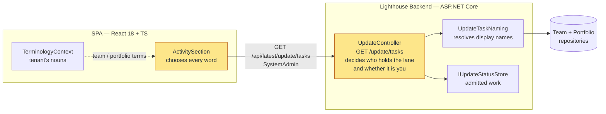
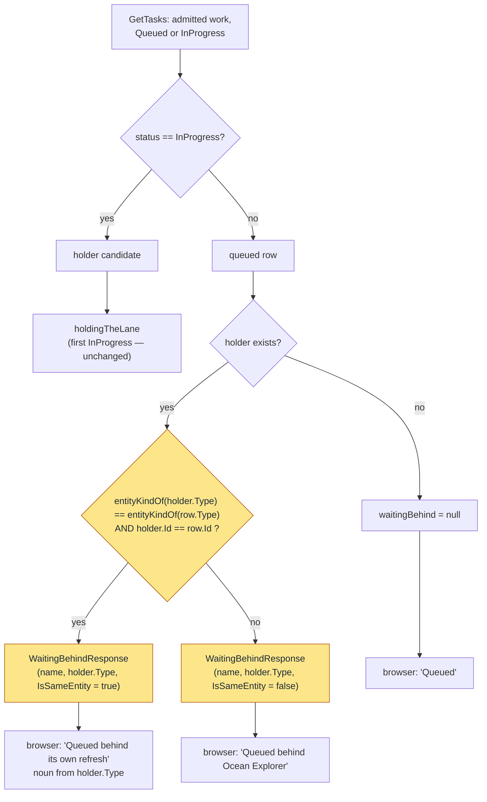

# Feature Delta — story-6055-activity-names-the-work

**ADO**: User Story #6055 — *Activity shows Portfolios twice* · Active · tagged `Release Notes` · no
parent · reported by Benj Huser with a screenshot, 2026-09-20.

**Waves**: DISCUSS (2026-09-21).

**One line**: the Task Manager's Activity list names the entity a piece of work is *about* and never
the work itself, so a Portfolio being refreshed and the forecast that refresh triggers draw two rows
with the same text — and the second one says it is queued behind a name that is its own.

**Density**: `lean` + `ask-intelligent` (`~/.nwave/global-config.json`, resolved as
`Density(mode='lean', expansion_prompt='ask-intelligent', provenance='explicit_override')`). Tier-1
`[REF]` only.

---

## Wave: DISCUSS / [REF] Persona IDs

| Persona | Role here |
|---|---|
| `platform-operator` | **Primary and only.** The Activity list is System-Administrator-only and exists to answer "is it working or is it wedged". Both flavours — the self-hoster and the SaaS operator on Tenant Zero. |

No new persona, and no new job: this is the anxiety the Epic that built this surface wrote down and
shipped anyway (see JTBD below).

---

## Wave: DISCUSS / [REF] JTBD One-Liners

| Job ID | One-liner |
|---|---|
| `job-operator-see-what-lighthouse-is-doing-right-now` | When I am wondering whether Lighthouse is working or wedged, I want to see what is running and what is waiting without leaving the page I am on, so the question costs me a glance instead of a log download. |

Existing job, created 2026-08-23 in `epic-5511-task-manager`. Its recorded **anxiety** reads: *"That a
list of raw update keys is not actually legible — `UpdateType` has five members and two of them are
delete operations the UI has never had to name."* That anxiety materialised, in a way the Epic did not
predict: the problem is not the two delete members but that **three of the five collapse onto one
word**. The job is not re-scored; a glance that returns an ambiguous answer is the job failing, not a
different job.

---

## Wave: DISCUSS / [REF] Current-State Surface Inventory

Read from the code on 2026-09-21. The report carries a diagnosis; it was re-derived rather than taken.

| # | Fact | Evidence |
|---|---|---|
| S1 | **Five update types, two words.** The row's kind is decided by a two-arm lookup: `Team` and `TeamDelete` render the tenant's Team term, and a `default:` arm sends `Features`, `Forecasts` **and** `PortfolioDelete` to the Portfolio term. Three types, one word. | `ActivitySection.tsx:37-45` |
| S2 | **A Portfolio refresh enqueues a second, separate piece of work for the same entity.** At the end of its run it calls `forecastUpdater.TriggerUpdate(project.Id)`, which admits `UpdateKey(Forecasts, portfolioId)` — a distinct key with the same id. | `PortfolioUpdater.cs:123`; `ForecastUpdater.cs:139` |
| S3 | **A Team refresh does it too.** `TeamDataRefreshedForecastTriggerHandler` triggers a forecast for every portfolio the team feeds, so a Portfolio can appear in the list while nobody asked for that Portfolio at all. | `TeamDataRefreshedForecastTriggerHandler.cs:16` |
| S4 | **Both resolve to the same display name.** `NameOf` switches on the type only to choose a repository; `Features`, `Forecasts` and `PortfolioDelete` all read `portfolioRepository.GetById(work.Id)?.Name`. | `UpdateTaskNaming.cs` |
| S5 | ∴ **The two rows are byte-identical up to their status.** `Portfolio 'Ocean Explorer' — Running` and `Portfolio 'Ocean Explorer' — Queued behind Ocean Explorer`. The `data-testid` differs (`…-Features-3` vs `…-Forecasts-3`) — the rows are distinguishable to a test and not to a reader. | `ActivitySection.tsx:158-164` |
| S6 | **`waitingBehind` is a bare name chosen from whatever is running.** `admitted.FirstOrDefault(work => work.Status == InProgress)`, then `naming.NameOf(...)`. When the lane holder is the queued row's own entity, the row says it is waiting behind itself. | `UpdateController.cs:61-62,70` |
| S7 | **One lane, still.** `Channel.CreateUnbounded<Func<Task>>()` drained by one `await foreach`. #5877's per-type lanes are **not in the tree**, so S6's "whatever is running" is currently a correct description of the queue and an incorrect description of the row. | `UpdateQueueService.cs:11,610` |
| S8 | **The only disambiguation that exists is a suffix.** Deletes render `(removal)` after the name. Nothing else carries a marker. | `ActivitySection.tsx:163` |
| S9 | **The contract is one producer, one consumer.** `UpdateTaskResponse.WaitingBehind` is a `string?` written in one place and read in one place. Blast radius of changing its shape: `UpdateController.cs:132-138`, `UpdateSubscriptionService.ts:34`, `ActivitySection.tsx:80-81`, plus tests. | grep, 2026-09-21 |
| S10 | **The public docs describe the list as Teams, Portfolios and removals.** Forecasts are never mentioned, and the row-wording table is normative prose a reader is expected to match against their screen. | `docs/settings/taskmanager.md:35,39-46` |
| S11 | **The docs screenshot is generated and shows these rows.** `Screenshots.spec.ts:136-138` opens the Task Manager and writes `docs/assets/settings/taskmanager.png`. | `Screenshots.spec.ts:136` |
| S12 | **"Forecast" is not a configurable term.** `TERMINOLOGY_KEYS` has no forecast entry, so a verb naming it is Lighthouse's own word and needs no lookup. `Team` and `Portfolio` remain tenant-configurable and must stay so. | `TerminologyKeys.ts` |
| S13 | **#5877 shipped and was reverted.** It ran DISCUSS → DESIGN → DISTILL → DELIVER; slice 01 landed on 2026-09-19 and was backed out the same day. Cause: with a lane each, a Portfolio refresh overlaps the Team refreshes feeding it, and `WorkItemService.RefreshRemainingWork` rebuilds every Feature's team work from a snapshot another lane is rewriting — on the Dependencies demo scenario, teams holding 10/0/10/4/4 Features dropped to all but one holding none. A data-correctness regression, not a test artifact. Re-landable once the ownership question is answered; the starvation analysis still holds. | `f216ef558`, reverting `86d796171..7a4a09089` |
| S14 | **#5877's D4 was implemented, and needed no contract change.** `53aa75a1b` grouped the running work by lane and looked each queued row's own lane up — a `holdingEachLane` dictionary plus a `WhatItIsWaitingFor` helper — leaving `UpdateTaskResponse` untouched. Its own commit body: *"no change to the response shape"*. Reverted with the rest and recoverable from history; `UpdateLane` and `UpdateLaneMapping` no longer exist in the tree. | `53aa75a1b` |

∴ **S1 is the defect and S2/S3 are what expose it.** Neither is wrong on its own: one word per entity
kind is reasonable until two different pieces of work share an entity, which S2 guarantees on every
Portfolio refresh.

∴ **S6 is the second half of the same complaint.** Fixing S1 alone leaves the row reading *"Forecasting
Portfolio 'Ocean Explorer' — Queued behind Ocean Explorer"*, which still asks the reader to work out
that the name refers to a different row.

∴ **S7 dates the fix.** The self-reference is reachable today because one lane means the forecast waits
behind its own portfolio's refresh. Under #5877's per-type lanes it becomes rare rather than
impossible — a `PortfolioDelete` still shares the Portfolio lane with `Features` (#5877 D6).

---

## Wave: DISCUSS / [REF] Locked Decisions

### D1 — A row names the work first, then the entity

`Refreshing Portfolio 'Ocean Explorer'`, `Forecasting Portfolio 'Ocean Explorer'`, `Removing Portfolio
'Atlas'`, `Refreshing Team 'Voyager'`, `Removing Team 'Voyager'`. User decision, 2026-09-21, chosen
over a parenthetical suffix and over collapsing the two rows into one.

The suffix would have matched the house style already used for deletes (S8) and was rejected because a
marker appended to an entity name is read as a property of the entity; the confusion being fixed is
precisely that the row appears to be *about* the Portfolio rather than about a piece of work. Leading
with the verb makes the row a sentence about work, which is what the list is.

This replaces the `(removal)` suffix rather than coexisting with it. Two ways of saying the same thing
in one column is how they come to disagree.

### D2 — The verb is a total function over `UpdateTaskType`

Five members, five answers: `Team` and `Features` → *Refreshing*, `Forecasts` → *Forecasting*,
`TeamDelete` and `PortfolioDelete` → *Removing*. Not an extension of scope — D1 cannot be expressed by
a lookup with a `default:` arm, because the arm that currently absorbs three members is the defect.
The entity-kind lookup stays two-armed and stays terminology-driven (S12).

### D3 — The backend decides whether the holder is the row's own entity; the browser words it

Two properties, and only these two are locked:

1. **The comparison happens once, on the read path.** The backend already picks the lane holder
   (`UpdateController.cs:61-62`) and already resolves its name, so it is the only place that holds both
   sides of "is this the same entity". A second decider in the browser is the failure mode
   `ActivitySection.tsx:48-55` already warns about in its own comment.
2. **The words stay in the browser.** They are terminology-dependent, and the backend has no business
   holding them.

**The response widens by the minimum that lets the browser word it, and no more.** The exact field is
DESIGN's — see the handoff. Deliberately *not* locked as "carry the holder's full identity": S14 shows
the adjacent problem was solved with no contract change at all, and a shape chosen here without that
evidence in view would be a guess dressed as a decision.

### D4 — A row never says it is waiting behind itself

Where the lane holder is the **same entity** as the queued row, the clause names the holder's activity
instead of its name: `Queued behind its own refresh`, `… its own forecast`, `… its own removal`. Where
the holder is a different entity the clause is unchanged — `Queued behind Ocean Explorer` — because
that reading is correct, already shipped, and already documented (S10).

### D5 — This story must survive #5877 being re-landed, and must not re-land any of it

#5877 is **not** an unstarted story. It shipped and was reverted the same day for destroying Feature
ownership under concurrent refreshes (S13), and its D4 — a queued row naming the holder of its *own*
lane — was implemented and backed out with it (S14). The revert is explicit that the work can return
once the ownership question has an answer.

Three consequences, all binding:

- **Nothing here re-lands lanes**, reintroduces `UpdateLane`/`UpdateLaneMapping`, or makes any change
  whose correctness depends on lanes existing. One lane in, one lane out (S7).
- **D4's rule is orthogonal to lanes and holds under both.** Today the single lane makes a forecast wait
  behind its own portfolio's refresh. Under #5877's lanes that particular pair separates, but a
  `PortfolioDelete` still shares the Portfolio lane with `Features` (#5877 D6), so a row can still be
  queued behind its own entity. The rule does not need re-deciding when #5877 returns.
- **Whatever DESIGN picks for D3 must compose with `WhatItIsWaitingFor`**, the reverted helper #5877
  will bring back. Two passes over the same field that were written without knowledge of each other is
  how the read path ends up with two answers to one question.

Read `53aa75a1b` before designing D3. It is the nearest prior art and it argues against widening the
contract.

### D6 — Wording only on the front end; one field on the read path

No new endpoint, no schema change, no queue change, no new control, no new gate.

### D7 — Public docs and the generated screenshot are this story's work, not `/release`'s

`docs/settings/taskmanager.md` states the row wording as normative prose (S10) and
`docs/assets/settings/taskmanager.png` is regenerated from an `@screenshot` spec that opens this
popover (S11). Both go stale the moment D1 ships. They are a Definition-of-Done item here, not drift
for a later pass to find.

---

## Wave: DISCUSS / [REF] Scope Assessment

**PASS — right-sized.** Two user stories, two slices, one surface, one read-path field. Well under
every oversized signal: 2 stories (threshold >10), 2 modules (>3), no integration points, ~1 day total
(>2 weeks), and the two outcomes ship separately by design.

---

## Wave: DISCUSS / [REF] WS Strategy

**C — no walking skeleton.** Brownfield. Every mechanism on the path is in production: the popover, the
read model, the terminology lookup, the SignalR refresh. Nothing here is a mechanism nobody has run.

---

## Wave: DISCUSS / [REF] Driving Ports

| Surface | Change |
|---|---|
| Header → Task Manager popover, Activity section | Each row leads with what the work is (D1). A queued row never names itself as what it waits for (D4). |
| `GET /api/latest/update/tasks` | `WaitingBehind` carries the lane holder's identity instead of a bare name (D3). Every other field unchanged. |
| `docs/settings/taskmanager.md` | The row-wording table gains forecasts and the new phrasing (D7). |
| `docs/assets/settings/taskmanager.png` | Regenerated (D7). |
| CLI / MCP | **None.** No client reads `update/tasks` — grepped across `lighthouse-clients` on 2026-09-21, no hit for the route, `getRunningTasks` or `UpdateTask`. |
| HTTP API additions | **None.** |
| Website marketing surface | **None.** The Task Manager is an operator surface behind a System-Administrator gate; no marketing page covers it. |
| RBAC | **None.** `GET /update/tasks` already carries `[RbacGuard(RbacGuardRequirement.SystemAdmin)]` and the icon is already hidden from everyone else. No gate is added, removed or moved. |

---

## Wave: DISCUSS / [REF] Pre-requisites

- **#5511 slices 01–08 are pushed.** They built every surface this story touches. Satisfied.
- **#5877 is reverted, not unstarted** (S13, S14). Trunk carries one lane and today's global
  `waitingBehind`; the lane work sits in history behind an open data-correctness question about Feature
  ownership. This story neither waits for it nor blocks it, and must not re-land any of it — D5.
- **The revert is the live risk to this story's schedule.** If #5877 returns while #6055 is in flight,
  both touch `UpdateController`'s `waitingBehind` resolution. Whichever lands second rebases onto the
  other; they do not merge cleanly by luck. Worth checking #5877's state before slice 02 starts.
- No other in-flight item touches `ActivitySection.tsx` or `UpdateController.cs`.

---

## Wave: DISCUSS / [REF] Out of Scope

- **Collapsing a Portfolio refresh and its forecast into one row.** Considered and rejected by the user,
  2026-09-21: it would make the forecast un-stoppable on its own and would need a row to survive the
  gap between two independent queue entries.
- **The stop button's wording on a delete row.** `Stop refreshing <name>` is what the ✖️ announces even
  on a removal, which the server then refuses (`UpdateController.cs:94-97`). A pre-existing wart on a
  control D1 does not touch; named here so it is a known omission rather than an oversight.
- **The fallback name for a vanished entity.** `NameOf` falls back to `"{UpdateType} {Id}"`, so a
  Portfolio deleted mid-refresh renders `Forecasting Portfolio 'Forecasts 3'`. Reachable only in the
  window between an entity's deletion and its own update leaving the list. No worse than today's
  `Portfolio 'Forecasts 3'`; left alone rather than fixed under cover of a wording story.
- **Queue position or wait estimate.** Refused in #5511 (D15) and again in #5877.
- **Anything about the lanes themselves** (#5877).

---

## Wave: DISCUSS / [REF] User Stories

### US-01 — Every row says what the work is

`job_id`: `job-operator-see-what-lighthouse-is-doing-right-now`

As a Platform Operator, when Lighthouse is refreshing a Portfolio and forecasting it, I want the two
rows to read as two different pieces of work, so that I can tell a busy instance from a list that has
drawn the same thing twice.

#### Elevator Pitch

```
Before: a Portfolio being refreshed and the forecast that refresh triggers draw two rows with the
        same text — "Portfolio 'Ocean Explorer'" twice — and nothing in either says which is which.
After:  open the Task Manager popover in the header while a Portfolio refresh is running → sees
        "Refreshing Portfolio 'Ocean Explorer' — Running" above "Forecasting Portfolio
        'Ocean Explorer' — Queued".
Decision enabled: the operator decides whether the instance is working through a real backlog or has
        drawn one piece of work twice — which is the difference between waiting and investigating.
```

#### Acceptance Criteria

- **AC-01.1** — With `Features` and `Forecasts` admitted for the same portfolio id, the two rows render
  **different** text. Asserted as a difference between the two rendered strings, not against two
  hard-coded expectations, so the test fails for any future pair that collapses.
- **AC-01.2** — Each of the five `UpdateTaskType` members renders a distinct leading verb-and-kind
  phrase for one shared entity id: five rows, five distinct strings (D2).
- **AC-01.3** — The entity kind still comes from the tenant's Terminology. With Team renamed to *Squad*
  and Portfolio to *Programme*, the rows read `Refreshing Squad '…'` and `Forecasting Programme '…'`,
  and the seeded defaults appear nowhere.
- **AC-01.4** — A delete renders `Removing <kind> '<name>'` and **no** `(removal)` suffix. The suffix is
  gone, not carried alongside (D1).
- **AC-01.5** — The verb is not itself passed through Terminology. With every configurable term renamed,
  *Refreshing*, *Forecasting* and *Removing* are unchanged (S12).
- **AC-01.6** — The row's `data-testid` is unchanged (`task-manager-row-<type>-<id>`), so the existing
  `TaskManagerIcon` suite continues to address rows the same way.
- **AC-01.7** — **Production data.** On the dogfood instance, with a real Portfolio refresh under way
  against a real connection, the popover shows a *Refreshing* row and a *Forecasting* row for that
  Portfolio, and a screenshot of it is what `docs/assets/settings/taskmanager.png` becomes.

---

### US-02 — Nothing in the list says it is waiting behind itself

`job_id`: `job-operator-see-what-lighthouse-is-doing-right-now`

As a Platform Operator, I want a queued row to name something other than itself as what it is waiting
for, so that the one field in the list whose whole purpose is to explain a wait stops being the most
confusing thing on the row.

#### Elevator Pitch

```
Before: the queued forecast of a running Portfolio reads "Queued behind Ocean Explorer" — where
        Ocean Explorer is the Portfolio the row is already about.
After:  open the Task Manager popover in the same moment → sees "Forecasting Portfolio 'Ocean
        Explorer' — Queued behind its own refresh", and a queued Team still reading "Queued behind
        Ocean Explorer" where that names a different entity.
Decision enabled: the operator reads the wait as a sequence they understand and leaves the popover,
        instead of reading a contradiction and going to the log to resolve it.
```

#### Acceptance Criteria

- **AC-02.1** — With `Features` for portfolio 3 running and `Forecasts` for portfolio 3 queued, the
  queued row's clause names the holder's **activity**, not its name: `Queued behind its own refresh`.
- **AC-02.2** — With `Features` for portfolio 3 running and a `Team` queued, the Team's clause is
  unchanged: `Queued behind <the portfolio's name>` (D4).
- **AC-02.3** — `PortfolioDelete` for portfolio 3 queued while `Features` for portfolio 3 runs reads
  `Queued behind its own refresh`; the reverse pair reads `Queued behind its own removal`. The clause
  names what the *holder* is doing, never what the queued row is doing.
- **AC-02.4** — "Same entity" means same entity, not same id. A `Team` with id 3 queued while `Features`
  for portfolio 3 runs is **not** a self-reference and reads `Queued behind <portfolio name>`. This is
  the criterion that fails an implementation comparing ids alone.
- **AC-02.5** — Work whose lane is free reports no clause at all — `Queued`, with nothing after it.
- **AC-02.6** — Whatever the response gains to express D4, every field of `UpdateTaskResponse` that
  exists today keeps its name, type and meaning. Asserted against the serialised payload, because this
  is a shared contract and the guard belongs where a consumer would break.
- **AC-02.7** — **Production data.** On the dogfood instance, a real Portfolio refresh and its triggered
  forecast produce a queued row that does not name its own Portfolio.
- **AC-02.8** — The self-reference is decided in exactly one place. No comparison of a row against the
  lane holder exists in the browser (D3). Asserted by the read model's tests being the only ones that
  can make AC-02.1 through AC-02.4 fail.

---

## Wave: DISCUSS / [REF] Story Map

**Backbone** — one activity: *read the Activity list and believe it*.

| Slice | Story | Ships | Releasable alone |
|---|---|---|---|
| 01 — Say what the work is | US-01 | The reported defect, end to end: rows, docs prose, screenshot | **Yes.** Answers #6055 as written. |
| 02 — Nothing waits behind itself | US-02 | The residual contradiction in the one field that explains waits | **Yes.** Independent of 01, though it reads better after it. |

**Walking skeleton**: none (WS strategy C). Slice 01 *is* the thinnest end-to-end change.

---

## Wave: DISCUSS / [REF] Slice Taste Tests

| Test | Verdict |
|---|---|
| "Ship 4+ new components" → not thin | **Pass.** Slice 01 changes one component and one docs page. Slice 02 changes one record, one interface and one clause. |
| Every slice depends on a new abstraction → ship it first | **Pass.** No new abstraction. Slice 02's contract change is a widening of an existing field, and nothing in slice 01 waits on it. |
| No slice disproves a pre-commitment → decoration | **Pass.** Slice 01 disproves that the verb can be Lighthouse's own word while the kind stays tenant-configurable (AC-01.3, AC-01.5). Slice 02 disproves that "same entity" is cheaply knowable on the read path (AC-02.4). |
| Synthetic data only → proves plumbing | **Pass.** Each slice carries a production-data criterion (AC-01.7, AC-02.7). |
| 2+ slices identical except for scale → merge | **Pass.** Different surfaces, different failure modes. |

---

## Wave: DISCUSS / [REF] Prioritization

1. **Slice 01 first — highest learning leverage and the whole reported defect.** It is the only slice
   whose failure mode is a taste question ("does leading with a verb actually read better than a
   suffix?"), and that answer is cheapest to get from the dogfood screenshot before slice 02 builds a
   clause on top of it. It also touches no contract, so it can ship and be looked at the same day.
2. **Slice 02 second — dependency direction.** Its clause is worded in the same vocabulary slice 01
   establishes, and its contract change is the one #5877 will inherit (D5). Doing it first would mean
   choosing that shape before seeing the wording it has to sit inside.

**Dogfood cadence**: one per slice, on the dogfood instance, during a real Portfolio refresh. Both are
same-day.

---

## Wave: DISCUSS / [REF] Outcome KPIs

| # | KPI | Target | Measurement |
|---|---|---|---|
| KPI-1 | Distinct rendered text per update type, for one shared entity id | **5 of 5 distinct** | AC-01.2 — *"gives every kind of work its own phrase"* in `ActivitySection.test.tsx`, which renders all five `UpdateTaskType` members against one entity id and counts distinct strings. A regression here is a red test, not a second bug report. |
| KPI-2 | Rows whose `waitingBehind` clause resolves to the row's own entity | **0** | AC-02.1/02.3/02.4. Asserted in the read-model tests over the same-entity pairs the single lane makes reachable. |
| KPI-3 | Row phrasings the public docs table does not list | **0** | At DELIVER: enumerate the strings the component can emit (5 verb-kind forms × 4 states) and check each against `docs/settings/taskmanager.md`'s table (D7). |
| KPI-4 | Repeat reports of duplicate-looking Activity rows | **0** | See below. |

---

## Wave: DISCUSS / [REF] Definition of Done

1. Both slices' acceptance criteria pass as automated tests (Vitest for the rows; NUnit for the read
   model and the response contract).
2. `dotnet build` zero warnings; `dotnet test` green on the non-connector filter.
3. `pnpm test` green; `pnpm build` zero errors and zero warnings; Biome clean on `./src`.
4. SonarQube Cloud introduces no new issue of any severity.
5. Frontend mutation testing (StrykerJS) scoped to `ActivitySection.tsx`, ≥80% kill rate. Backend
   Stryker.NET scoped to `UpdateController` and the naming path. Recorded under
   `docs/feature/story-6055-activity-names-the-work/mutation/`.
6. `docs/settings/taskmanager.md`: the Activity section names forecasts, and the row-wording table
   carries the new phrasing including the self-reference clause (D7).
7. Per-feature screenshot: `docs/assets/settings/taskmanager.png` regenerated from the `@screenshot`
   spec at `Screenshots.spec.ts:136-138`, showing at least one *Refreshing* and one *Forecasting* row
   (D7, AC-01.7). Delete the PNG before the run — a diff under the pixel threshold keeps the old file.
8. `ARCHITECTURE.md` / `docs/product/architecture/brief.md`: **N/A, because** no component, boundary or
   contract described there changes. `WaitingBehind` is a field on one response, not an architectural
   element.
9. ADR: **N/A, because** D1–D4 are wording and one field widening within ADR-181's existing shape
   ("update activity is a read through the status store"). An ADR is warranted only if DESIGN chooses a
   different home for the same-entity comparison than the read path.
10. Lighthouse-Clients CLI/MCP version bump: **N/A, because** no client reads `update/tasks` — verified
    by grep across `lighthouse-clients` on 2026-09-21.
11. Website marketing surface: **N/A, because** the Task Manager is an operator surface behind a
    System-Administrator gate and appears on no marketing page.
12. RBAC impact: **N/A, because** no gate is added, removed or moved. The route's existing
    `SystemAdmin` guard and the icon's existing visibility rule are untouched.
13. Demo data: **N/A, because** the Activity list is driven by live queue state, not by seeded rows.
14. Release notes drafted from the reader's confusion — "the Activity list showed the same Portfolio
    twice and there was no way to tell which was which" — not from the lookup that caused it. The story
    carries the `Release Notes` tag; the reporter is credited.
15. ADO #6055 transitioned Active → Resolved, not Closed.

---

## Wave: DISCUSS / [REF] DoR Validation

| # | Item | Evidence |
|---|---|---|
| 1 | Business value stated | Both elevator pitches. A screenshot from the maintainer's own instance showing the duplicate, plus a correct root-cause guess that the code confirms (S1–S5). |
| 2 | Job traceability | US-01 and US-02 → `job-operator-see-what-lighthouse-is-doing-right-now`, an existing validated job whose recorded anxiety is this defect. No `infrastructure-only` escape used. |
| 3 | Acceptance criteria testable | 15 ACs, each asserting a rendered string, a serialised field or a screenshot. Two are production-data criteria. AC-01.1 and AC-02.4 are written to fail the plausible wrong implementations rather than to pass the right one. |
| 4 | Dependencies known | #5511 slices 01–08 shipped. #5877 shipped and was reverted (S13/S14); the interaction is decided (D5) and the rebase risk is named in Pre-requisites. Nothing else touches the two files. |
| 5 | Sized | Two slices, ~3h and ~3h of crafter dispatch. |
| 6 | Technical feasibility | Every changed line is in one component and one controller, both under test today. The only non-obvious point is that `UpdateTaskType` distinguishes entity kinds already, so "same entity" is decidable without a new lookup (AC-02.4). |
| 7 | Non-functional constraints | None engaged. No extra query, no extra round-trip, no change to what the read path loads — `NameOf` already resolves the holder. |
| 8 | UX defined | D1 fixes the row. D4 fixes the clause. The exact strings are in the ACs, and the tenant-configurable parts are separated from Lighthouse's own words (AC-01.3, AC-01.5). |
| 9 | Testable in isolation | `ActivitySection` through the existing `TaskManagerIcon` Vitest suite, which already addresses rows by the `data-testid` AC-01.6 preserves. The read model through the existing `TaskManagerAcceptanceTest`. |

**Requirements completeness: 0.97.** The one deliberate gap is the exact serialised shape of the
widened `WaitingBehind` — and whether it needs widening at all, since `53aa75a1b` solved the adjacent
problem with no contract change and that evidence belongs in the decision (D3). Slice 01 does not
depend on it; AC-02.6 and AC-02.8 constrain every candidate.

**Per-wave peer review: skipped.** DoR surfaced no ambiguity, the JTBD rests on an existing validated
job rather than on a new assumption, and the ACs carry no vendor-neutrality risk. The consolidated
review fires at end of DISTILL.

**Expansion catalog — no trigger fired.** AC ambiguity: no; every AC names a rendered string or a
serialised field. Cross-context complexity: no — two technologies (ASP.NET Core, React/TypeScript), one
bounded context. Multi-stakeholder: no; one persona. Compliance: no regulatory language. WS strategy is
C, not D. **Strict lean output; no expansion menu offered.**

---

## Wave: DISCUSS / [REF] Wave Decisions Summary

### Key Decisions

- **[D1]** A row names the work first, then the entity — `Refreshing Portfolio 'X'` — replacing the
  `(removal)` suffix. User decision 2026-09-21, over a suffix and over collapsing the rows.
- **[D2]** The verb is a total function over all five `UpdateTaskType` members; the `default:` arm that
  absorbs three of them is the defect (S1).
- **[D3]** The backend decides whether the lane holder is the row's own entity — one decider, on the
  read path — and the browser words it. The response widens by the minimum that allows that, and the
  field itself is DESIGN's to choose.
- **[D4]** A row never says it is waiting behind itself — `Queued behind its own refresh`. The
  different-entity clause is unchanged.
- **[D5]** #5877 is reverted, not unstarted: it shipped on 2026-09-19 and was backed out the same day
  for destroying Feature ownership under concurrent refreshes, taking its own `waitingBehind` fix with
  it. Nothing here re-lands any of it; D4's rule holds under one lane and under many.
- **[D6]** Wording plus one read-path field. No endpoint, schema, gate or control.
- **[D7]** `docs/settings/taskmanager.md` and the generated `taskmanager.png` are Definition-of-Done
  items for this story.

### Requirements Summary

- **Primary job**: an operator glances at the Activity list to tell a working instance from a wedged
  one. The glance currently returns a list that appears to name the same Portfolio twice, and a wait
  explanation that names the waiting row itself. Both are wording over a read model that already holds
  the right information.
- **Walking skeleton scope**: none (strategy C, brownfield).
- **Feature type**: user-facing.

### Constraints Established

- The entity kind stays tenant-configurable; the activity verb stays Lighthouse's own word (S12).
- `data-testid` on each row is a fixed point — the existing suite addresses rows through it (AC-01.6).
- `UpdateTaskResponse` may widen `WaitingBehind` and may change nothing else (AC-02.6).
- Nothing about the update queue's structure may change here (D5/D6).

### Upstream Changes

- None. No DISCOVER or DIVERGE artifacts exist for this story, and no assumption recorded in
  `epic-5511-task-manager` is contradicted — its own recorded anxiety is confirmed, not overturned.

---

## Wave: DISCUSS / [REF] SSOT Updates

| File | Change |
|---|---|
| `docs/product/jobs.yaml` | `story-6055-activity-names-the-work` appended to `feature_context`. A dated note appended to `job-operator-see-what-lighthouse-is-doing-right-now` recording that its stated anxiety materialised and how. No new job, no re-score. |
| `docs/product/journeys/story-6055-activity-names-the-work.yaml` | Created — the read-the-list journey, its emotional arc, the shared artifacts and the error paths. |
| `docs/product/personas/platform-operator.yaml` | **Unchanged** — no new job to list. |

---

## Wave: DISCUSS / [REF] Handoff

**To**: `nw-solution-architect` (DESIGN) — full artifact set. `nw-platform-architect` (DEVOPS) — the
Outcome KPIs section only.

Open for DESIGN, in order of consequence:

1. **What the response gains so the browser can word D4 — and whether it needs to gain anything.**
   **Read `53aa75a1b` first** (S14): the adjacent problem, "which lane holds you", was solved entirely
   inside `UpdateController` with no contract change, via a `holdingEachLane` lookup and a
   `WhatItIsWaitingFor` helper. D4 is harder only because the *wording* differs in the self-reference
   case and the words live in the browser. The candidates, cheapest first: a nullable field carrying the
   holder's `UpdateType`, set only when the holder is the row's own entity; a boolean plus the existing
   name; the holder's full identity. D3 locks the two properties, not the field. Whatever is chosen must
   compose with `WhatItIsWaitingFor` returning (D5), because #5877 brings it back.
2. **Whether the verb belongs beside the kind lookup or replaces it.** `useKindOf` returns a kind; D1
   needs a phrase. One total function returning the whole phrase is the likely shape, but the kind is
   used nowhere else, so this is a free choice rather than a constrained one.
3. **Whether slice 02 should wait for #5877's ownership question.** Not a blocker — D4's rule holds
   under one lane and under many (D5) — but if #5877 is about to return, landing slice 02 first creates
   a rebase over the same lines. A scheduling call, and the user's, not DESIGN's; surfaced here so it is
   made rather than discovered.

Carried forward, not dropped: the stop-button wording on delete rows, and the `"{UpdateType} {Id}"`
fallback name — both in Out of Scope with their reasons, both still true after this story ships.

---

## Wave: DESIGN / [REF] Scope, Mode and Density

**Scope**: Application / components (`nw-solution-architect`). System, domain and platform scopes were
offered and each has nothing to decide here: no distributed-systems question, no new bounded context,
no deployment change. **Mode**: propose. **Density**: `lean` + `ask-intelligent`; DESIGN declares no
`ask-intelligent` triggers, so no menu and Tier-1 `[REF]` only.

Designed directly rather than by dispatching a subagent: the decisive evidence is a reverted commit
(`53aa75a1b`) and a stale SSOT claim, neither of which survives a fresh agent's context, and a subagent
reading this 500-line delta would truncate it.

**Prior-wave reading**

✓ `docs/product/architecture/brief.md` (§ `epic-5511-task-manager` :7010, § `story-5877-update-queue-lanes` :7684)
✓ `docs/product/architecture/adr-181-update-activity-is-a-read-through-the-status-store.md`
✓ `docs/product/journeys/story-6055-activity-names-the-work.yaml`
✓ `docs/feature/story-6055-activity-names-the-work/feature-delta.md` (DISCUSS sections above)
✓ `docs/feature/story-6055-activity-names-the-work/slices/slice-01`, `slice-02`
✓ `.nwave/local-config.json` — no `rigor` block, so standard defaults; no `des-config.json` in this repo
⊘ `docs/feature/story-6055-activity-names-the-work/spike/findings.md` (no spike was run)
⊘ `docs/product/architecture/c4-diagrams.md` (not a separate file in this repo; C4 lives in `brief.md`)

**Contradiction found and resolved — the SSOT was wrong.** `brief.md:7693` states in the present tense:
*"The update queue now has three lanes, each a channel with one reader."* It has one
(`UpdateQueueService.cs:11`). The lanes were reverted on 2026-09-19 and the revert did not touch the
brief. Corrected as part of this feature by user decision, 2026-09-21 — see SSOT Updates below. No
DESIGN decision here was built on the false claim.

---

## Wave: DESIGN / [REF] DDD List

| # | Decision | Verdict |
|---|---|---|
| DDD-1 | The row's phrase is one total function over `UpdateTaskType`, returning verb + kind + name | Locked |
| DDD-2 | Both lookups are `Record<UpdateTaskType, …>`, not `switch` with `default:` | Locked — refines DISCUSS D2 |
| DDD-3 | `waitingBehind` carries the holder as a described piece of work (ADR-205) | Locked |
| DDD-4 | "Same entity" is (entity kind, id), never id alone | Locked |
| DDD-5 | The sameness comparison lives in `UpdateController`'s read path; nothing compares in the browser | Locked |
| DDD-6 | The activity noun (*refresh* / *forecast* / *removal*) is derived in the browser from the holder's `UpdateType` | Locked |
| DDD-7 | No new component, no new service, no new endpoint, no schema change | Locked |
| DDD-8 | `UpdateActivityService` is not introduced for this feature | Locked — see Reuse Analysis |
| DDD-9 | The update-type → entity-kind projection is one named, total helper, used by both readers | Locked — raised by DESIGN review, 2026-09-21 |

### DDD-9 — the projection gets a name before it gets a second caller

Two places need to answer "which entity is this piece of work about": `UpdateTaskNaming.NameOf`, which
uses it to choose a repository, and the sameness comparison DDD-4 introduces. Today there is one, and
it is an anonymous `switch` arm inside `NameOf`.

This was an open question for DELIVER — a helper, an extension method, or a private controller method —
and it is closed here instead. The defect this whole story exists to fix is a type-dispatch that was
duplicated and then absorbed a `default:` arm, and deferring *where* a newly-shared dispatch lives is
how that happens again. The second caller arrives in this story; the name has to arrive with it.

So: a total function over `UpdateType` returning an entity kind, in the `Update` namespace beside
`UpdateTaskNaming`, called by both. Total for the same reason DDD-2 is on the frontend — a sixth update
type should not be able to join an existing arm unnoticed. The exact signature stays DELIVER's.

### DDD-2 — why a `Record`, not a `switch`

The defect is a `default:` arm silently absorbing three of five update types (S1). A `switch` with a
`default:` cannot express D2's "total function" claim, and a `switch` without one relies on the
project's `noImplicitReturns` setting to catch a missing member. `Record<UpdateTaskType, string>` makes
a missing member a compile error unconditionally, which is the property the journey's error path
promises: *a new update type is a compile-time decision rather than a silent sixth tenant of the
default arm.*

This applies to the **entity-kind** lookup too, which DISCUSS D2 had left as "stays two-armed". That
was a statement about which terms are used, and it is preserved — `Team`/`TeamDelete` still map to the
Team term and the other three to the Portfolio term. What changes is that the mapping is now written
out per member instead of falling through. Recorded under Changed Assumptions.

### DDD-4 — the criterion that fails the plausible wrong implementation

`Team` 3 and `Features` 3 are two entities sharing an integer. An implementation comparing
`work.Id == holder.Id` passes every other acceptance criterion in slice 02 and fails AC-02.4 alone.
The entity-kind projection already exists in `UpdateTaskNaming.NameOf`, which switches on the type only
to choose between `teamRepository` and `portfolioRepository` — the same two-way split, already written,
already tested.

---

## Wave: DESIGN / [REF] Component Decomposition

| Component | Path | Change |
|---|---|---|
| `ActivitySection` | `Lighthouse.Frontend/src/components/App/Header/TaskManager/ActivitySection.tsx` | **Modified.** `useKindOf` becomes `useDescribeWork`; `isDelete`/`(removal)` removed; `describeState` gains the self-reference branch. |
| `UpdateSubscriptionService` | `Lighthouse.Frontend/src/services/UpdateSubscriptionService.ts` | **Modified.** `IUpdateTask.waitingBehind` changes from `string \| null` to `IWaitingBehind \| null`; new exported interface. |
| `UpdateController` | `Lighthouse.Backend/Lighthouse.Backend/API/UpdateController.cs` | **Modified.** Holder selection unchanged; the projection into the response gains the sameness comparison. New nested record `WaitingBehindResponse`. |
| `UpdateTaskNaming` | `…/BackgroundServices/Update/UpdateTaskNaming.cs` | **Unchanged.** Reused as-is for the holder's name. |
| `AdmittedWorkOrdering` | `…/BackgroundServices/Update/AdmittedWorkOrdering.cs` | **Unchanged.** |
| `UpdateQueueService` | `…/BackgroundServices/Update/UpdateQueueService.cs` | **Unchanged.** One lane in, one lane out. |
| `docs/settings/taskmanager.md` | `docs/settings/taskmanager.md` | **Modified.** Row-wording table (slice 01). |
| `docs/assets/settings/taskmanager.png` | generated | **Regenerated** from `Screenshots.spec.ts:136-138`. |

No new file on either side. The two new types are nested in files that already exist.

---

## Wave: DESIGN / [REF] Driving Ports

| Port | Change |
|---|---|
| `GET /api/latest/update/tasks` (+ `/api/v1/…`) | `waitingBehind` changes from `string?` to an object (ADR-205). `updateType`, `id`, `name`, `status`, `elapsedMs` unchanged. Still `[RbacGuard(SystemAdmin)]`. |
| `GET /api/latest/update/status` | **Unchanged.** |
| `POST /api/latest/update/tasks/{updateType}/{id}/cancel` | **Unchanged.** |
| Header → Task Manager popover, Activity section | Rows lead with the work; the queued clause gains the self case. |
| CLI / MCP | **None.** Grep across `lighthouse-clients`, 2026-09-21: no consumer of the route, `getRunningTasks` or `UpdateTask`. |

---

## Wave: DESIGN / [REF] Driven Ports and Adapters

**None added, none changed.** The read path touches `IRepository<Team>` and `IPortfolioRepository`
through `UpdateTaskNaming`, exactly as it does today, and `IUpdateStatusStore` through
`GetAdmittedWork()`. No new outbound effect: the sameness comparison is arithmetic over data already in
hand, so ADR-181's accepted cost — one repository lookup per row per popover open — does not rise.

---

## Wave: DESIGN / [REF] Technology Choices

Nothing pinned that is not already pinned. Backend C# .NET 10 / ASP.NET Core, `System.Text.Json` with
the existing enum-as-string converter (the browser's `UpdateTaskType` is a string union, and the
`Slice02` specification fixes that contract in prose at its line 22). Frontend React 18 + TypeScript,
MUI, Vitest + React Testing Library. Paradigm unchanged: OOP backend, functional-leaning React.

The one language-level choice is DDD-2's `Record<UpdateTaskType, …>` over `switch`, which is a
TypeScript exhaustiveness property rather than a dependency.

---

## Wave: DESIGN / [REF] C4 — Container and Component

**System Context: unchanged.** No actor, no external system and no trust boundary moves. The existing
context diagram in `brief.md` stands; redrawing it would produce a byte-identical picture, and a second
copy is a second thing to keep current.

**Container view, scoped to the affected path.** The only container-level fact this feature touches is
which side of the browser/API boundary decides what.



Shaded: the two components this feature modifies. The line that matters is the one crossing the
boundary — it carries *facts* (name, type, is-same-entity) and never a rendered clause, which is what
keeps Terminology on the browser's side and the comparison on the backend's.

**Component view of the one decision** — how a queued row's clause is chosen.



Node `H` is DDD-4 and it is the only genuinely new logic in the feature. Everything else is wording.

---

## Wave: DESIGN / [REF] Reuse Analysis

| Existing Component | File | Overlap | Decision | Justification |
|---|---|---|---|---|
| `useKindOf` | `ActivitySection.tsx:34-46` | Decides the row's noun from the update type | **EXTEND** | Becomes `useDescribeWork`, returning the whole phrase instead of one word. The terminology hook, the two-way mapping and the call site all stay; the `default:` arm is replaced by an exhaustive map. A parallel `useVerbOf` beside it would leave two functions switching on the same enum in the same file — the arrangement that produced this bug. |
| `describeState` | `ActivitySection.tsx:73-86` | Words the status clause, including `Queued behind …` | **EXTEND** | One new branch inside the existing `waiting` case. It already owns every status phrase; a second describer would split one sentence across two functions. |
| `activityOf` / `RowActivity` | `ActivitySection.tsx:56-71` | Decides what the row is doing | **UNCHANGED** | Orthogonal — it answers running/waiting/stopping, not what the work is. Its own comment warns against deciding one thing twice; this feature adds no second decider. |
| `UpdateTaskNaming.NameOf` | `UpdateTaskNaming.cs` | Resolves the holder's display name; already projects update type → entity kind to pick a repository | **EXTEND (reuse as-is)** | Called unchanged for the holder's name. Its repository switch is the same (entity kind, id) projection DDD-4 needs, so the projection is lifted to a named helper both can use rather than written twice. |
| `UpdateController.GetTasks` holder selection | `UpdateController.cs:61-62` | Picks the single running row | **EXTEND** | The selection is correct for a one-lane queue and is not touched. Only the projection into the response changes. |
| `AdmittedWorkOrdering` | `AdmittedWorkOrdering.cs` | Orders the rows | **UNCHANGED** | Reading order, not wait semantics. Its own doc-comment already says so. |
| `UpdateActivityService` (ADR-181 §3) | not present in the tree | Would own read-path enrichment | **CREATE NEW — rejected (DDD-8)** | ADR-181 proposed it; the shipped code does the enrichment in the controller via `IUpdateTaskNaming`. Introducing it now is a refactor of #5511's surface wearing a wording story's number. Left as a known divergence between ADR-181 and the code, named here rather than fixed silently. |
| `TERMINOLOGY_KEYS` / `useTerminology` | `TerminologyKeys.ts`, `TerminologyContext` | Tenant nouns | **REUSE AS-IS** | No new key. *Forecast* is not configurable (S12), so the verbs need no entry. |
| `Slice02SeeWhatIsRunning*` fixtures | `…/Integration/TaskManager/` | Assert the `/update/tasks` contract | **EXTEND** | They already fix this contract in prose and assertions; the new shape belongs in them, not in a parallel fixture. |

**Zero unjustified `CREATE NEW`.** The one `CREATE NEW` considered is explicitly rejected.

**Outcome collision check**: `nwave-ai outcomes check-delta` → exit `0` (0 collisions across 0
outcomes; the registry tracks none for this surface).

---

## Wave: DESIGN / [REF] Decisions Table

| ID | Decision |
|---|---|
| DDD-1 | One total phrase function per row: verb + tenant noun + name |
| DDD-2 | `Record<UpdateTaskType, …>` for both lookups; no `default:` arm |
| DDD-3 | `WaitingBehind` becomes `WaitingBehindResponse?` — name, update type, is-same-entity (ADR-205) |
| DDD-4 | Sameness is (entity kind, id) |
| DDD-5 | The comparison lives in `UpdateController`; the browser never compares |
| DDD-6 | Activity noun derived in the browser from the holder's `UpdateType` |
| DDD-7 | No new component, service, endpoint or schema change |
| DDD-8 | `UpdateActivityService` not introduced; ADR-181 §3 divergence recorded, not closed |
| DDD-9 | The update-type → entity-kind projection is one named, total helper used by both readers |

---

## Wave: DESIGN / [REF] Open Questions

| # | Question | Deferred to | Why it is safe to defer |
|---|---|---|---|
| ~~OQ-1~~ | ~~Where the (entity kind, id) projection lives~~ | **CLOSED** | Reopened and decided by DESIGN review, 2026-09-21: deferring where a newly-shared dispatch lives is how the defect recurs. Now DDD-9. |
| ~~OQ-2~~ | ~~Whether `WaitingBehindResponse.UpdateType` is sent in the different-entity case too~~ | **CLOSED** | Settled in DISTILL: sent always. A payload whose field set depends on its own contents is harder to specify and consume, for no gain. |
| OQ-3 | Whether the docs table lists all twenty phrasings (5 verb-kind forms × 4 states) or the pattern plus examples | DELIVER | A prose judgement made with the rendered page in front of you. KPI-3 measures coverage either way. |

**Not open**: ADR-181's `UpdateActivityService` divergence (DDD-8 — recorded, deliberately not closed
here), and #5877's Feature-ownership question, which is that story's and is shelved.

---

## Wave: DESIGN / [REF] Handoff

**To**: `nw-platform-architect` (DEVOPS). Nothing to deploy, instrument or provision. No new endpoint,
no schema change, no configuration, no migration, no metric. The Outcome KPIs in the DISCUSS sections
above are all test-asserted or read at DELIVER; none needs production instrumentation.

**Per-wave peer review: skipped.** No contested ADR, no novel pattern, no unverified performance
budget, no security-boundary change — the route's `SystemAdmin` guard is untouched. The consolidated
review fires at end of DISTILL.

---

## Wave: DESIGN / [REF] Changed Assumptions

### 1. DISCUSS D2 — the entity-kind lookup

> **Original** (`feature-delta.md`, Wave: DISCUSS, D2): "The entity-kind lookup stays two-armed and
> stays terminology-driven (S12)."

**New**: the mapping it expresses is unchanged — `Team`/`TeamDelete` → Team term, the other three →
Portfolio term — but it is written as an exhaustive `Record<UpdateTaskType, TerminologyKey>` rather
than a two-arm `switch`. **Rationale**: the defect being fixed is a `default:` arm absorbing three
members unnoticed. Leaving the same construct in place for the lookup that caused it would fix the
symptom and keep the mechanism (DDD-2).

### 2. DISCUSS AC-02.6 — the contract guard

> **Original** (`feature-delta.md`, Wave: DISCUSS, AC-02.6): "Whatever the response gains to express
> D4, every field of `UpdateTaskResponse` that exists today keeps its name, type and meaning."

**New**: every field **other than `WaitingBehind`** keeps its name, type and meaning. `WaitingBehind`
keeps its name and its meaning and changes its type, from `string?` to `WaitingBehindResponse?`.
**Rationale**: as written the criterion forbade changing the one field the story is about. Its purpose
was to guard against collateral damage to the other five, and it now says that. The change is
affordable because the grep behind S9 is part of the decision: six files, one repository, no external
consumer (ADR-205).

### 3. DISCUSS D5 and Pre-requisites — #5877's status

> **Original** (`feature-delta.md`, Wave: DISCUSS, Pre-requisites): "The revert is the live risk to
> this story's schedule. If #5877 returns while #6055 is in flight, both touch `UpdateController`'s
> `waitingBehind` resolution."

**New**: #5877 is **shelved** (user decision, 2026-09-21). The rebase risk is not live, slice 02 needs
no sequencing against it, and the self-reference case is permanently reachable rather than temporarily
so — which raises slice 02's value rather than lowering it. **Rationale**: the DISCUSS text was written
before the question was asked. D5's prohibition on re-landing any of #5877 still stands, and ADR-205
records how the two would compose if it ever returns.

### 4. SSOT `brief.md` — the queue's lane count

> **Original** (`docs/product/architecture/brief.md:7693`): "The update queue now has **three** lanes,
> each a channel with one reader."

**New**: one lane. **Rationale**: the statement was true between `a6ae6d1b2` and `f216ef558` on
2026-09-19 and has been false since. The revert deliberately kept #5877's DISCUSS and DESIGN analysis,
which is defensible, but this sentence is in the present tense in the architecture SSOT and reads as
current state. Corrected in place with a dated status note by user decision, 2026-09-21; the analysis
around it is left untouched.

---

## Wave: DEVOPS / [REF] Scope and Prior-Wave Reading

**Density**: `lean` + `ask-intelligent`; DEVOPS declares no `ask-intelligent` triggers, so no menu and
Tier-1 `[REF]` only.

**The nine interactive decisions were not asked.** Every one is already settled project-wide and this
feature changes none of them. Re-asking would invite an answer that contradicts the project rather than
one that informs this feature — so each is answered here from its source, and the wave is run rather
than skipped.

| # | Decision | Project answer | Source |
|---|---|---|---|
| 1 | Deployment target | Hybrid — self-hosted standalone container / Tauri desktop, **and** multi-tenant Kubernetes SaaS | `docs/product/architecture/brief.md` § Deployment Architecture; `platform-operator` persona |
| 2 | Container orchestration | Both — single container for the standalone product, Kubernetes for the SaaS fleet | epic-5305 / epic-5306 sections of `brief.md` |
| 3 | CI/CD platform | GitHub Actions | 27 workflows under `.github/workflows/` |
| 4 | Existing infrastructure | Yes, both — brownfield infra and brownfield CI/CD | same |
| 5 | Observability and logging | Structured Serilog + the bounded in-process warning sink surfaced as *Recent problems* | ADR-185; #5511 slice 06 |
| 6 | Deployment strategy | Tenant-Zero canary → promote, expand-only migration guard, rollback = git revert + helm rollback | ADR-093 |
| 7 | Continuous learning | **Canary analysis and progressive rollout only.** Tenant Zero is the canary and promotion is the gate (ADR-093); `OptionalFeature` toggles exist for opt-in capabilities. There is **no A/B testing framework** and none is proposed. **This feature uses none of them** — a wording correction has nothing to flag or roll out progressively, and gating it would mean shipping two readings of the same row. | ADR-093; `OptionalFeature` |
| 8 | Git branching strategy | Trunk-based on `main`, no branches or PRs | `CLAUDE.md`; project rule |
| 9 | Mutation testing strategy | `per-feature`, kill rate ≥ 80% | `CLAUDE.md` § Mutation Testing Strategy |

Decision 7 is spelled out because it was the one a reviewer could not verify from the text — it was
named in a list and never defined, which is the silent-N/A this project's own rule forbids.

**Prior-wave reading**

✓ `docs/feature/story-6055-activity-names-the-work/feature-delta.md` — DISCUSS Outcome KPIs + all DESIGN sections
✓ `docs/product/kpi-contracts.yaml` — 45 existing outcome entries, and the `measurement_scope` vocabulary
✓ `.github/workflows/` — 27 workflows; `ci.yml`, `ci_verifysqlite.yml`, `ci_verifypostgres.yml`, `ci_sonar_gates.yml` are the ones this feature passes through
✓ `docs/product/architecture/brief.md` § `story-6055-activity-names-the-work` (written this session)
⊘ `docs/feature/story-6055-activity-names-the-work/discuss/outcome-kpis.md` — legacy path; content lives in `feature-delta.md` per the current layout contract
⊘ `docs/feature/story-6055-activity-names-the-work/design/` — legacy path; same
⊘ `docs/feature/story-6055-activity-names-the-work/spike/` — no spike was run

**Contradictions with DESIGN: none.** DESIGN's handoff says there is nothing to deploy, instrument or
provision, and nothing in the KPIs disputes it — no latency budget, no availability target, no
multi-region pull. The one thing DEVOPS adds that DESIGN did not have is the **environment axes**,
which are a test-parametrisation concern rather than an architectural one.

---

## Wave: DEVOPS / [REF] Environment Matrix

Machine artifact: `docs/feature/story-6055-activity-names-the-work/environments.yaml`.

| Environment | Platform | Why it exists here |
|---|---|---|
| `clean` | linux, macos, windows, wsl | Baseline for every row-wording and clause scenario |
| `renamed-terminology` | linux, macos | The **only** environment that can catch a verb accidentally routed through Terminology (AC-01.3, AC-01.5) |
| `sqlite` | linux, macos, windows | Standalone default; where the read-path scenarios run |
| `postgres` | linux | Different `IUpdateStatusStore` implementation behind `GetAdmittedWork()` — the one place a provider could matter |
| `screenshot-capture` | linux | The `@screenshot` run that regenerates `taskmanager.png`, with preconditions none of the others share |

Two axes were considered and **deliberately excluded**: operating system (nothing here is
platform-sensitive — integer and enum equality on the backend, string assembly on the front end) and
premium-vs-free licence (the Task Manager is a free capability; the single premium dependency is the
screenshot fixture, recorded as a precondition of that one environment rather than as an axis).

**And one exclusion worth stating here rather than only in the YAML**, because it is the first question
a reader of this table asks: the row-wording criteria (AC-01.1, AC-01.2, AC-01.4, AC-01.5, AC-01.6) are
**not** parametrised over `sqlite` or `postgres`. They are string assembly in the browser against a
payload the test supplies directly — no backend, no provider, no database. Running them twice would
double the cost and prove the same thing twice. Only `AC-02.6` and `AC-02.8` cross both providers, and
only because `GetAdmittedWork()` has a different store implementation behind it.

`environments.yaml` also carries a `scenario_axes` block mapping each acceptance criterion to the
environments worth varying it over, so DISTILL parametrises where it pays and not everywhere.

---

## Wave: DEVOPS / [REF] CI/CD Pipeline Outline

**Platform**: GitHub Actions (existing — 27 workflows). **No pipeline change.** This feature adds no
stage, no job, no runner and no secret. It passes through stages that already exist:

| Stage | Workflow | What it does for this feature |
|---|---|---|
| Change detection | `ci_changes.yml` | Flags both `Lighthouse.Backend` and `Lighthouse.Frontend` — this feature touches both |
| Frontend | `ci_frontend.yml` | `pnpm test`, then `pnpm build` (whose `prebuild` runs `biome check --write` — it rewrites `./src`, contrary to what CLAUDE.md's Quality Gates section says) |
| Backend | `ci_backend.yml` | `dotnet build` zero-warning (`TreatWarningsAsErrors`), `dotnet test` |
| Verify (SQLite) | `ci_verifysqlite.yml` | E2E against SQLite — **this is where E2E actually runs**, not `ci_e2e.yml`, which only compiles the suite |
| Verify (Postgres) | `ci_verifypostgres.yml` | Same suite against Postgres |
| Quality gate | `ci_sonar_gates.yml` | SonarQube Cloud; no new issue of any severity |

**Trigger rules**: unchanged. Trunk-based on `main` (below), so every commit runs the full set.

**One pipeline-adjacent risk worth naming**, because it is invisible locally: the analyzer rules
`CA1861`, `CA1859`, `CA1825`, `CA2016`, `NUnit1028`, `NUnit2045` and `NUnit2056` now **fail** the build
rather than warn. The read-path change adds a record and a comparison — `CA1859` (use the concrete
type) and `CA1861` (no constant array as an argument) are the two most likely to fire on it.
Pre-applied per `docs/ci-learnings.md` rather than discovered in CI.

---

## Wave: DEVOPS / [REF] Monitoring Contracts

One row per outcome KPI, as the wave requires. **None of the four needs runtime instrumentation**, and
that is the finding rather than an omission.

| KPI | Instrument | Where it is read | Runtime instrumentation |
|---|---|---|---|
| KPI-1 — 5 of 5 update types render distinct text | Vitest assertion over all five `UpdateTaskType` members (AC-01.2) | CI, `ci_frontend.yml` | **None.** A regression is a red test, which is strictly better than a metric nobody watches. |
| KPI-2 — zero rows whose clause resolves to their own entity | NUnit read-model assertions (AC-02.1/02.3/02.4) | CI, `ci_backend.yml` | **None.** Same reason. |
| KPI-3 — zero row phrasings absent from the public docs table | Manual enumeration at DELIVER against `docs/settings/taskmanager.md` | DELIVER checklist | **None.** A prose-to-code correspondence; no runtime signal could express it. |
| KPI-4 — zero repeat reports of duplicate-looking rows within two releases | ADO items raised against the Task Manager surface | The board | **None.** The honest instrument is the absence of a bug report, which no telemetry event can stand in for. |

### KPI-4, made checkable

The first three are asserted by a test or a checklist and need no elaboration. KPI-4 is the only one
whose instrument is a human, so it gets a query rather than an intention:

- **Instrument**: ADO work items in project `Lighthouse`, of type Bug or User Story, created after the
  release that carries this change, whose title or description names the Activity list, the Task
  Manager popover, or duplicate/repeated rows.
- **Window**: from that release to the second release after it — two release boundaries, not two
  calendar months, because exposure is what matters and releases are what create it.
- **Target**: zero. **One is a signal, not noise**: this defect was reported once by the maintainer on
  his own instance, so a second report from anyone means the new wording failed for a reader it was
  written for.
- **Who checks**: whoever runs `/release` for the second of those two releases, as part of the
  release-notes pass that already reads the board.

**Why it is kept rather than dropped for being soft.** KPI-1 and KPI-2 are proxies — they prove the
strings differ and that no row names itself. Neither proves a reader *understood*, which is the whole
outcome. Dropping the only KPI that points at the outcome because it is harder to measure would leave
three KPIs that can all pass while the feature fails. The honest move is to make it checkable, not to
remove it.

**Why no telemetry event is added.** The opt-in usage-data pipeline ships ten named events
(`docs/settings/usagedata.md` is the authoritative list) and **none of them says anything about
comprehension of a row**. An event could record that the popover was opened; it could not record that
the reader understood what they saw, which is the entire outcome. Adding an event that answers a
different question than the one asked is worse than adding none, because it would then be read as
evidence. This is the `opt_in_telemetry_required` scope's own rule — *an outcome asking something none
of those ten says stays deferred* — applied rather than worked around.

**SSOT**: no entry is appended to `docs/product/kpi-contracts.yaml`. That file is the contract for
outcomes with a *data collection* story; all four KPIs here are CI- or checklist-asserted and would
add four rows whose `data_collection` reads "none". Recorded here instead, which is where a reader of
this feature will look.

---

## Wave: DEVOPS / [REF] Deployment Strategy

**Unchanged, and this feature does not exercise the interesting parts of it.** Lighthouse ships as one
artifact containing both the built frontend and the backend, so a browser served the new bundle always
talks to a backend serving the new response — the `waitingBehind` type change (ADR-205) has no
mixed-version window *within* an instance.

**Rollback contract**: `git revert` of the feature commits, then the ordinary release path. No
migration to reverse, no configuration to unset, no data written in the new shape. The rollback is
strictly cheaper than #5877's was, because nothing here persists anything.

**The one multi-version case, named rather than assumed**: during a SaaS rolling update, an old replica
and a new replica serve different shapes of `waitingBehind` from the same route. A browser holding an
old bundle that reaches a new replica reads an object where it expects a string and renders
`[object Object]` after "Queued behind" — it does not crash, because the consumer is a truthy check
followed by a template interpolation.

**How long**: bounded by the Kubernetes rolling update, not by how long a browser tab stays open. Old
and new replicas coexist only while pods are being replaced — minutes, and the canary → promote flow of
ADR-093 means Tenant Zero crosses it before any other tenant does. A tab opened before the rollout and
left open afterwards is served the new bundle on its next full load; until then it is one admin
re-reading a popover.

**Blast radius**: one clause on one row of one System-Administrator-only popover, for the length of one
rollout. No data is written in either shape, so nothing outlives the window. Accepted; not worth an
expand-contract dance for a field with one in-repo consumer.

---

## Wave: DEVOPS / [REF] Mutation Testing Strategy

**`per-feature`** — the project setting (`CLAUDE.md` § Mutation Testing Strategy), unchanged and not
re-decided here. Minimum kill rate 80%.

Scoping for this feature, so the run is not mistaken for a full-solution run:

- **Frontend (StrykerJS)**: `ActivitySection.tsx`. Its wording branches are exactly the kind of logic
  mutation testing is good at — a flipped ternary in `describeState` produces a plausible sentence.
- **Backend (Stryker.NET)**: `UpdateController` and the entity-kind projection. The sameness comparison
  is the target: a mutated `&&` to `||` in DDD-4's check is precisely AC-02.4's failure.
- **Excluded**: the acceptance suite. Each fixture boots a web host, which took #5877's run from three
  minutes to over eighty. Unit tests only, and the consequence written into `results.md` rather than
  left inside the number.
- **Run it last, on frozen code.** Any edit after the run shifts the line ranges and the score stops
  describing what shipped.
- Recorded under `docs/feature/story-6055-activity-names-the-work/mutation/`.

---

## Wave: DEVOPS / [REF] Observability Stack

**Unchanged; nothing added.** Structured Serilog logging, the bounded in-process warning sink that
`#5511` slice 06 surfaces as *Recent problems*, and the refresh history under Settings → System Info.

This feature adds **no log line**. Deliberate: the read path runs on every popover open and on every
SignalR-driven refresh of it, so a log line per queued row would be the noisiest thing in the file and
would say only what the screen already says. The screen is the observability surface for this feature,
which is what `#5511` built it to be.

**What *Recent problems* will and will not catch.** The in-process warning sink surfaces anything logged
at Warning or above. Nothing on this path logs: the sameness comparison cannot fail (it is enum and
integer equality over data already in hand), and `NameOf` already has a fallback for an entity that has
gone rather than throwing. So a wrong *word* — the failure mode this story is about — produces no
warning and will not appear there, by construction.

That is the honest cost of the choice, stated rather than left to be discovered: **if an operator reports
a confusing row in production, there is no log trail.** What there is instead is a screenshot, which is
what #6055 itself arrived as, and a test suite that pins all five phrasings. For a defect whose entire
symptom is visible on screen, a log line would be a second copy of the evidence rather than new evidence.
If that turns out to be wrong — if a reader reports a row nobody can reproduce — the answer is a
screenshot in the ADO item, not instrumentation on a hot read path.

---

## Wave: DEVOPS / [REF] Branching Strategy

**Trunk-based development on `main`** — the project rule (memory: *trunk-based on main; push directly
to origin main; no branches/PRs*), unchanged.

CI trigger alignment is therefore already correct: every commit to `main` runs the full workflow set,
which is what trunk-based requires. This session's work sits on the worktree branch
`worktree-wise-hugging-stardust`, currently ahead of `main`, and lands by push to `main` when the user
says so.

**Slice boundary ritual** (project rule, restated because DELIVER depends on it): a focused commit per
step; at slice end push, wait for CI green, then move ADO Active → Resolved. Never push red — skip a
not-yet-passing acceptance test and un-skip it to resume.

---

## Wave: DEVOPS / [REF] Coexistence Matrix

Full table in `environments.yaml`. What must keep working while this ships:

| Must not break | Why it is at risk |
|---|---|
| Task Manager popover — Connections, Recent problems | They share the popover with the Activity section |
| `TaskManagerIcon` Vitest suite | Addresses rows by `data-testid`, which AC-01.6 pins as a fixed point |
| `Slice02SeeWhatIsRunning` acceptance fixtures | They fix the `/update/tasks` contract; they carry the new shape rather than being bypassed |
| `GET /api/latest/update/status` | Separate route, separate response, untouched |
| The cancel control on each row | Its `aria-label` is deliberately out of scope and must keep working unchanged |

---

## Wave: DEVOPS / [REF] Pre-requisites from DESIGN

| DESIGN constraint | Platform answer |
|---|---|
| ADR-205 changes a shipped response field's type | No versioning needed within an instance (one artifact). The rolling-update window is named and accepted above. |
| DDD-5 — the comparison lives in the backend | Nothing to enforce at the platform layer; asserted by AC-02.8 in CI. |
| DDD-2 — exhaustive `Record` lookups | Enforced by the TypeScript compiler in `ci_frontend.yml`'s `tsc -b`. No platform mechanism required. |
| No new driven port | No new network egress, no new credential, no firewall or secret-store change. |
| `UpdateActivityService` not introduced (DDD-8) | No new DI registration, no new service lifetime to reason about. |

---

## Wave: DEVOPS / [REF] Handoff

**To**: `nw-acceptance-designer` (DISTILL).

**Deliverable**: `docs/feature/story-6055-activity-names-the-work/environments.yaml`, carrying the five
environments, the `scenario_axes` mapping every acceptance criterion to the environments worth varying
it over, and the coexistence matrix.

Three things DISTILL should take from this wave specifically:

1. **Parametrise `AC-01.3` over `renamed-terminology` and nothing else over it.** It is the only
   criterion whose answer differs by environment, and the axis exists for it alone.
2. **Do not parametrise the row-wording criteria over providers or platforms.** They are string
   assembly in the browser. `scenario_axes` says so per criterion.
3. **`AC-02.6`'s payload assertion is the contract guard for ADR-205**, and it is also where OQ-2 gets
   settled — whether `WaitingBehindResponse.UpdateType` is sent in the different-entity case too.
   DISTILL fixes that as it writes the assertion.

**Per-wave peer review: skipped.** None of the triggers fires — no novel deployment target, no new
CI/CD framework, no observability rewrite, no security-posture change. The consolidated review fires at
end of DISTILL.

---

## Wave: DEVOPS / [REF] Changed Assumptions

**None.** No DESIGN or DISCUSS assumption changed in this wave. DESIGN's handoff predicted that DEVOPS
would have nothing to design, and it was right about infrastructure — the wave's actual contribution is
the environment axes and the explicit finding that no KPI here warrants runtime instrumentation, both
of which are additions rather than corrections.

One **clarification** worth recording because a reader of DESIGN's handoff might expect otherwise:
DESIGN said "nothing to deploy, instrument or provision", and that is upheld. It did not say "nothing
for DEVOPS to do" — the environment matrix DISTILL needs is produced here and did not exist before.

---

## Wave: DISTILL / [REF] Reconciliation and Prior-Wave Reading

**Density**: `lean` + `ask-intelligent`; DISTILL declares no `ask-intelligent` triggers, so no menu and
Tier-1 `[REF]` only.

**Wave-decision reconciliation: PASSED — 0 contradictions.** Every DISCUSS decision was checked against
DESIGN and DEVOPS. DESIGN refined two (D2's lookup shape, AC-02.6's scope) and corrected one premise
(#5877's status), all recorded under DESIGN's Changed Assumptions with the original quoted — a
refinement with provenance is not a contradiction. DEVOPS changed nothing.

**Language: C# + TypeScript, not the skill's Python examples.** `Lighthouse.Backend.Tests.csproj` →
NUnit 4.6 + Moq (the project convention; the polyglot matrix's C# row names xUnit/FsCheck, and the
repo wins). `package.json` → Vitest + React Testing Library. Skip markers are `[Ignore(reason)]` and
`it.skip`. No pytest-bdd, no `.feature` files, no Hypothesis, no `__SCAFFOLD__` marker — the ATDD
policy already records that the Python-pilot artifacts do not apply in this repository.

**Prior-wave reading**

✓ `docs/architecture/atdd-infrastructure-policy.md` — the three port tables; `--policy=inherit`
✓ `docs/product/journeys/story-6055-activity-names-the-work.yaml`
✓ `docs/product/architecture/brief.md` § this feature, § `epic-5511-task-manager`, § `story-5877-…`
✓ `docs/product/architecture/adr-205-…` and `adr-181-…`
✓ `docs/product/kpi-contracts.yaml` — 45 entries; none for this surface
✓ `docs/feature/story-6055-activity-names-the-work/feature-delta.md` — DISCUSS + DESIGN + DEVOPS
✓ `docs/feature/story-6055-activity-names-the-work/environments.yaml` — five environments, `scenario_axes`
✓ `Slice02SeeWhatIsRunning{Scenarios,Specifications}.cs` and `TaskManagerAcceptanceTest.cs` — the idiom
✓ `TaskManagerIcon.test.tsx` — the frontend render idiom
⊘ `docs/feature/…/spike/findings.md` (no spike was run)
⊘ `.nwave/des-config.json` (absent; `.nwave/local-config.json` holds only `enabled_for_repo`)

**Deliverable type: `application`.** Resolved by the documented precedence — no project
`des-config.json`, no `defaults.deliverable_type` in `~/.nwave/global-config.json`, so root-only FS
detection. No `@nw-plugin-validator`, no `@nw-skill-reviewer`.

**Infrastructure policy: inherited, no new row.** Every port this feature touches is already in the
policy: the HTTP API via `WebApplicationFactory<Program>`, the React component tree via Vitest + RTL
with `TerminologyContext` provided, `IUpdateStatusStore` real and never mocked, `ILighthouseClock`
faked. Nothing to append.

---

## Wave: DISTILL / [REF] Scenario List

Fifteen specifications across two files. Ten pending, two pins that run from now on, three carried by
other suites or by hand.

### Backend — `Story6055ActivityNamesTheWork{Scenarios,Specifications}.cs`

Categories `acceptance` / `story-6055-activity-names-the-work` / `slice-02`.

| Scenario | Tags | AC |
|---|---|---|
| A queued forecast does not say it is waiting behind its own portfolio | `@driving_port @real-io` | 02.1 |
| A queued team still learns the name of the portfolio holding the lane | `@driving_port @real-io` | 02.2 |
| A queued removal behind its own refresh names the refresh | `@driving_port @real-io` | 02.3 |
| A queued refresh behind its own removal names the removal | `@driving_port @real-io` | 02.3 |
| A team queued behind a portfolio with the same id is not waiting behind itself | `@driving_port @real-io @error` | 02.4 |
| Work that is waiting for nothing says nothing | `@driving_port @real-io` | 02.5 |
| Every other field of a task row is what it has always been | `@driving_port @real-io` | 02.6 |
| On a real instance a triggered forecast does not name its own portfolio | `@driving_port @real-io @production-data` | 02.7 |

### Frontend — `TaskManager/ActivitySection.test.tsx`

| Specification | Tags | AC | State |
|---|---|---|---|
| tells a portfolio refresh apart from the forecast it triggers | `@in-memory` | 01.1 | pending |
| gives every kind of work its own phrase | `@in-memory` | 01.2 | pending |
| uses the tenant's noun and Lighthouse's own verb | `@in-memory` | 01.3, 01.5 | pending |
| says a removal is a removal without also appending one | `@in-memory` | 01.4 | pending |
| keeps the handle every other specification addresses a row by | `@in-memory @pin` | 01.6 | **runs now** |
| says a forecast is behind its own portfolio's refresh | `@in-memory` | 02.1 | pending |
| says a refresh is behind its own portfolio's removal | `@in-memory` | 02.3 | pending |
| still names a different entity that is holding the lane | `@in-memory` | 02.2 | pending |
| says nothing extra when the row is waiting for nothing | `@in-memory @pin` | 02.5 | **runs now** |
| trusts the instance's verdict rather than recomputing it | `@in-memory` | 02.8 | pending |

**Error-path share: 4 of 15 (27%), below the 40% target, and the shortfall is real rather than
excused.** This feature has almost no error surface: no input to validate, no dependency to be
unavailable, no operation to cancel midway. The four that exist — the id collision, the contradictory
payload, the free lane, and the holder-activity mirror — are the adversarial cases that matter, and
each is written to fail a specific plausible wrong implementation. Manufacturing six more to reach a
ratio would be decoration.

**AC-01.7 is not a test.** It is the dogfood screenshot that becomes
`docs/assets/settings/taskmanager.png`, carried on the DELIVER checklist with its preconditions in
`environments.yaml`.

---

## Wave: DISTILL / [REF] Walking Skeleton

**Inherited, not written.** `A_refresh_that_is_running_is_listed_by_name` (#5511 slice 02) is the
`@walking_skeleton @driving_port` scenario for this surface and is green. It closes the end-to-end loop
— production composition root, real EF, real status store, real HTTP — and this story changes what a
row *says*, not whether the loop closes. A second skeleton over the same path would assert the same
wiring twice and add a second thing to keep current.

Per the Architecture of Reference this is strategy **C**'s successor: port class implies treatment, and
the mechanism for each port is the policy's, inherited unchanged.

---

## Wave: DISTILL / [REF] Adapter Coverage

| Driven adapter | `@real-io` scenario | Covered by |
|---|---|---|
| `IUpdateStatusStore` (in-process) | YES | Every backend scenario admits through the real store and reads back over HTTP |
| `IRepository<Team>` / `IPortfolioRepository` via `UpdateTaskNaming` | YES | The holder's name in AC-02.2 is resolved from a really-seeded portfolio |
| `IWorkTrackingConnector` | N/A — faked by policy | Driven external; this feature never reaches it |
| `IUpdateStatusStore` (Redis) | NO — and deliberately | See below |

**The one uncovered row, argued rather than hidden.** The Redis store is in the policy under
`Testcontainers.Redis`, `[Category("requires-docker")]`. It is not exercised here because this feature
changes what the controller does with what the store returns, not what the store returns:
`GetAdmittedWork()` is called identically and its result is shaped identically. A Redis scenario would
re-assert #5511's enumeration contract under a new story's number. DEVOPS's `scenario_axes` reaches the
same conclusion from the other direction and routes AC-02.6 over `sqlite` and `postgres` only.

---

## Wave: DISTILL / [REF] Driving Adapter Coverage

| Entry point in DESIGN | Exercised how | Scenario |
|---|---|---|
| `GET /api/latest/update/tasks` | Real HTTP through `WebApplicationFactory<Program>`, System-Administrator client | All eight backend scenarios |
| Header → Task Manager popover, Activity section | Real component tree, RTL, `TerminologyContext` provided | All ten frontend specifications |
| CLI / MCP | N/A — DESIGN records none | — |

Zero uncovered entry points. Neither half is entered from a service function: the backend goes over the
wire and the frontend renders the shipped component.

---

## Wave: DISTILL / [REF] Scaffolds

**One, and it is a type rather than a stub.** `Lighthouse.Frontend/src/services/UpdateSubscriptionService.ts`
gains the exported `IWaitingBehind` interface, and `IUpdateTask.waitingBehind` is widened to
`string | IWaitingBehind | null`.

The widening is the scaffold. The ATDD policy records that in this repository *a skipped test is still
type-checked*, so a pending specification expressing the target payload cannot compile against
`string | null` — and narrowing straight to `IWaitingBehind | null` would red every already-green
`TaskManagerIcon` test that builds a task with a string. The union carries both until DELIVER removes
the old arm, and the comment on the field says exactly that so it is not mistaken for a permanent shape.

No `__SCAFFOLD__` marker and no AssertionError stubs: nothing this feature needs is missing from the
production tree. `ActivitySection` and `UpdateController` both exist and both compile.

**Detection for DELIVER**: `grep -n "string | IWaitingBehind" Lighthouse.Frontend/src/services/UpdateSubscriptionService.ts`
— zero matches when the story is done.

---

## Wave: DISTILL / [REF] Test Placement

| File | Precedent |
|---|---|
| `Lighthouse.Backend.Tests/API/Integration/TaskManager/Story6055ActivityNamesTheWork{Scenarios,Specifications}.cs` | The partial-class scenarios/specifications split every `Slice0N…` pair in that directory uses; inherits `TaskManagerAcceptanceTest` for the host, the clock and the seeding |
| `Lighthouse.Frontend/src/components/App/Header/TaskManager/ActivitySection.test.tsx` | Colocated `*.test.tsx` beside the component, as `TaskManagerIcon.test.tsx` and `WidgetShell.test.tsx` are |

**A new pair rather than an extension of #5511's slice-02 file**, which refines what the DESIGN Reuse
Analysis said. The reasoning there was "the new shape belongs in them, not in a parallel fixture", and
half of that holds: `Slice02`'s own `ThenTheQueuedRowSaysItIsWaitingBehind` reads `waitingBehind` as a
string and **must** be updated by DELIVER or it breaks. That is the extension. But #6055's own
scenarios are a different story's audit trail, and folding them into #5511's file would leave neither
readable. `SeededPortfolio` is duplicated for the same reason — it is private to that fixture, and a
two-field record is cheaper to repeat than a shared type coupling two stories' fixtures.

---

## Wave: DISTILL / [REF] Existing Specifications This Story Must Update

Grepped 2026-09-21, not inferred. These are green today and **will break** when DELIVER narrows the
type and changes the renderer. They are the price of ADR-205 and they are named here so DELIVER budgets
for them rather than meeting them as a surprise mid-slice.

| File | Line | What breaks |
|---|---|---|
| `Slice02SeeWhatIsRunningSpecifications.cs` | 219-226 | `ThenTheQueuedRowSaysItIsWaitingBehind` reads `Text(row, "waitingBehind")` — a string where the response now sends an object |
| `TaskManagerIcon.test.tsx` | 87 | `aQueuedPortfolio` builds `waitingBehind: "Lagunitas"`; a type error once the scaffold's `string` arm goes |
| `TaskManagerIcon.test.tsx` | 349 | *"says what a waiting refresh is waiting behind"* — asserts the old clause |
| `TaskManagerIcon.test.tsx` | 602, 609 | *"still says what a waiting refresh is waiting behind"* — asserts `/queued behind Lagunitas/i`; it is #5511 slice-07A's guard that the clause survived a redesign, and it has to survive this one too |
| `TaskManagerIcon.test.tsx` | 476-483 | *"does not claim a queued refresh is behind anything when nothing is running"* — passes `waitingBehind: null`, so it survives unchanged. Listed because it looks like it should break and does not. |

Four of the five are **updates, not deletions**. Each asserts something that stays true — a queued row
names what holds its lane — in a payload shape that changes. An update that quietly weakens one of them
into something the new shape satisfies trivially would lose #5511's and #5877's guard at the same time.

---

## Wave: DISTILL / [REF] Pre-requisites

- **DESIGN's driving ports**: `GET /api/latest/update/tasks` and the Activity section. Both exercised.
- **DEVOPS's environment matrix**: `scenario_axes` maps each AC to the environments worth varying it
  over. Followed exactly — the row-wording specifications are not parametrised over providers or
  platforms, and `renamed-terminology` is exercised by AC-01.3 alone.
- **ADR-205's payload**: `{ name, updateType, isSameEntity }`, fixed in the Specifications' doc-comment
  so DELIVER builds to a written contract rather than to a reading of the tests.
- **OQ-2 settled**: `updateType` is sent in **both** cases, not only the self-reference. AC-02.2 asserts
  the name and AC-02.1/02.3 assert the activity; sending one field conditionally would make the payload
  shape depend on its own contents for no gain.

---

## Wave: DISTILL / [REF] Outcome Registration

**Skipped, correctly.** The registry tracks new typed contract surfaces — a rule module, a CLI
subcommand, a public service operation, a system-wide invariant. This feature introduces none: it
changes the type of one field on an existing response and the wording of one component. `check-delta`
returned exit `0` against this delta at DESIGN.

The nearest candidate is "a queued row never names its own entity", which is an invariant — but an
invariant over one response field on one admin-only endpoint, asserted by AC-02.1/02.3/02.4 and by
`ThenNoRowNamesItsOwnEntityAsWhatItIsWaitingFor`. Registering it would put a row in the SSOT that no
later feature could collide with.

---

## Wave: DISTILL / [REF] Self-Review

| # | Check | Result |
|---|---|---|
| 1 | WS strategy declared | Inherited from #5511; Architecture of Reference + policy, not a per-feature A/B/C/D choice |
| 2 | WS scenarios tagged | `@real-io` backend, `@in-memory` frontend |
| 3 | Every driven adapter has a `@real-io` scenario | Two yes, one N/A by policy, one argued in Adapter Coverage |
| 4 | In-memory doubles: what they cannot model | The frontend specifications cannot model the read path, which is why AC-02.1–02.5 are asserted on both sides |
| 5 | Container preference | N/A — no Redis or Postgres container needed (Adapter Coverage) |
| 6 | Production modules imported by tests have scaffolds | One type scaffold; nothing else is missing |
| 7 | Scaffold marker | N/A for this repo per the ATDD policy; the grep line above replaces it |
| 8 | Scaffold methods raise assertion errors | N/A — no stub methods |
| 9 | Tests RED not BROKEN | Verified by running. `red-classification.md` |
| 10 | Driving adapter covered via its own protocol | HTTP and real component render |
| 11 | `@real-io @adapter-integration` per driven adapter | See Adapter Coverage |
| 12–15 | pytest-bdd specifics (`capsys`, `sys.path`, `des.adapters` imports, timing budgets) | N/A — not a Python project |

**One finding the self-review did not catch and running the tests did**: AC-01.1 as first written
compared two rows with different statuses, so it passed against the bug. Recorded in
`red-classification.md` and fixed. Reading a specification is not the same as running it.

---

## Wave: DISTILL / [REF] Changed Assumptions

### 1. DESIGN Reuse Analysis — where #6055's backend scenarios live

> **Original** (`feature-delta.md`, Wave: DESIGN, Reuse Analysis): "`Slice02SeeWhatIsRunning*`
> fixtures — **EXTEND** — They already fix the `/update/tasks` contract in prose and assertions; the new
> shape belongs in them, not in a parallel fixture."

**New**: the *contract update* belongs in them and DELIVER must make it —
`ThenTheQueuedRowSaysItIsWaitingBehind` reads `waitingBehind` as a string and breaks otherwise.
#6055's own scenarios live in their own pair inheriting the same base. **Rationale**: a story's
scenarios are its audit trail; folding two stories into one file leaves neither readable, and the
fixture being reused is `TaskManagerAcceptanceTest`, which both inherit.

### 2. DESIGN OQ-2 — when the holder's `updateType` is sent

> **Original** (`feature-delta.md`, Wave: DESIGN, Open Questions, OQ-2): "Whether
> `WaitingBehindResponse.UpdateType` is sent in the different-entity case too, or only when
> `IsSameEntity`."

**New**: always. **Rationale**: a payload whose field set depends on its own contents is harder to
specify and to consume, and the alternative buys nothing — the browser reads the field only in the self
case either way. Settled here because DISTILL is where the assertion gets written, which is what DESIGN
said would settle it.

---

## Wave: DISTILL / [REF] Final Wave Review Gate

Four reviewers dispatched in parallel against the full four-wave delta, 2026-09-21. Deliverable type
`application`, so no `@nw-plugin-validator` and no `@nw-skill-reviewer`.

| Reviewer | Scope | Verdict | Findings |
|---|---|---|---|
| Eclipse — `nw-product-owner-reviewer` | DISCUSS | **approved** | 0 |
| Atlas — `nw-solution-architect-reviewer` | DESIGN + ADR-205 | **conditionally approved** | 1 high, 3 medium |
| Forge — `nw-platform-architect-reviewer` | DEVOPS + `environments.yaml` | **rejected** (iteration 1) → **conditionally approved** (iteration 2) | 1 blocker, 1 critical, 1 high, 1 medium, 2 low — all six resolved and re-verified |
| Sentinel — `nw-acceptance-designer-reviewer` | DISTILL + both test files + the component | **conditionally approved** | 1 high, 1 low |

Zero cross-wave contradictions. Sentinel never skips and did not.

### What changed because of the review

Two findings changed the work rather than the prose.

**DDD-9 exists because Atlas argued for it.** Where the update-type → entity-kind projection lives was
OQ-1, deferred to DELIVER as "three shapes of the same three-line function". Atlas's counter: the defect
this story fixes *is* a type-dispatch that was duplicated and then grew a `default:` arm, so deferring
where a newly-*shared* dispatch lives is how it recurs. That is a better reading of this story's own
evidence than the one that deferred it. The second caller arrives here, so the name arrives with it.

**Decision 7 was a silent N/A and the wave claimed not to have any.** Forge found "continuous learning"
named in a list of nine settled decisions and never defined anywhere — no answer, no source. The wave's
own framing was that every decision is answered from its source rather than asked, and one was not. All
nine are now a table with an answer and a citation each.

### Findings accepted without change, and why

| Finding | Reviewer | Why it stands |
|---|---|---|
| Error-path share 27% against a 40% target | Sentinel (high), also raised at DISTILL self-review | Sentinel's own recommendation is to accept: the feature has no validation, no external dependency and no cancellation path, and the four cases that exist each fail a specific plausible wrong implementation. Manufacturing six more would be decoration. |
| `ActivitySection.tsx` still renders `waitingBehind` as a string | Sentinel (low) | This is the handoff boundary, not a gap. The pending specifications describe the target; DELIVER implements it. |
| OQ-2 unresolved | Atlas (medium) | Already settled in DISTILL before the review ran — `updateType` is sent in both cases. Atlas's scope was DESIGN, so it could not see the resolution. |

### One finding argued back rather than complied with

Forge called KPI-4 an unmeasured aspiration and offered "define a mechanism or drop the outcome". Its
evidence was the sentence *"The honest instrument is the absence of a bug report"* — which is this
delta's own caveat about the KPI's weakness, quoted as proof of its absence. The row already named an
instrument (ADO items), a target (zero) and a window (two releases).

The window and the query were genuinely vague, so both are now concrete. The KPI is **not** dropped:
KPI-1 and KPI-2 prove the strings differ and that no row names itself, and neither proves a reader
understood — which is the outcome. Removing the only KPI pointing at the outcome because it is the
hardest to measure would leave three that can all pass while the feature fails.

### A caution about one of the approvals

Eclipse returned `approved` with zero findings, and its report quotes elevator-pitch text that does not
appear in this file — paraphrases presented as citations. The underlying judgement looks sound (the
pitches are complete and do carry Before / After / Decision-enabled), but an approval whose evidence is
partly invented carries less weight than its verdict suggests. Recorded rather than smoothed over,
because this repository has met that failure mode before.

### The one rejection, and its second pass

DEVOPS was rejected on iteration 1. Six findings, all addressed, and Forge re-reviewed the revised
sections rather than the fix list: **conditionally approved, zero findings, all six verified in situ
with line numbers.** One revision cycle of the two the gate allows.

Its remaining condition is that DISTILL's parametrisation follows `scenario_axes` — AC-01.3 over
`renamed-terminology` alone, AC-02.6 and AC-02.8 over both providers. It does; that is what the DISTILL
Handoff section already instructs, and the specifications are written that way.

### Gate status

| | |
|---|---|
| Eclipse (DISCUSS) | approved |
| Atlas (DESIGN) | conditionally approved — conditions applied |
| Forge (DEVOPS) | conditionally approved on iteration 2 — conditions applied |
| Sentinel (DISTILL) | conditionally approved — conditions accepted with reasons |

Zero blockers outstanding. Every condition is either applied in this delta or carried into DELIVER as a
named action item. **DELIVER handoff is unblocked.**
