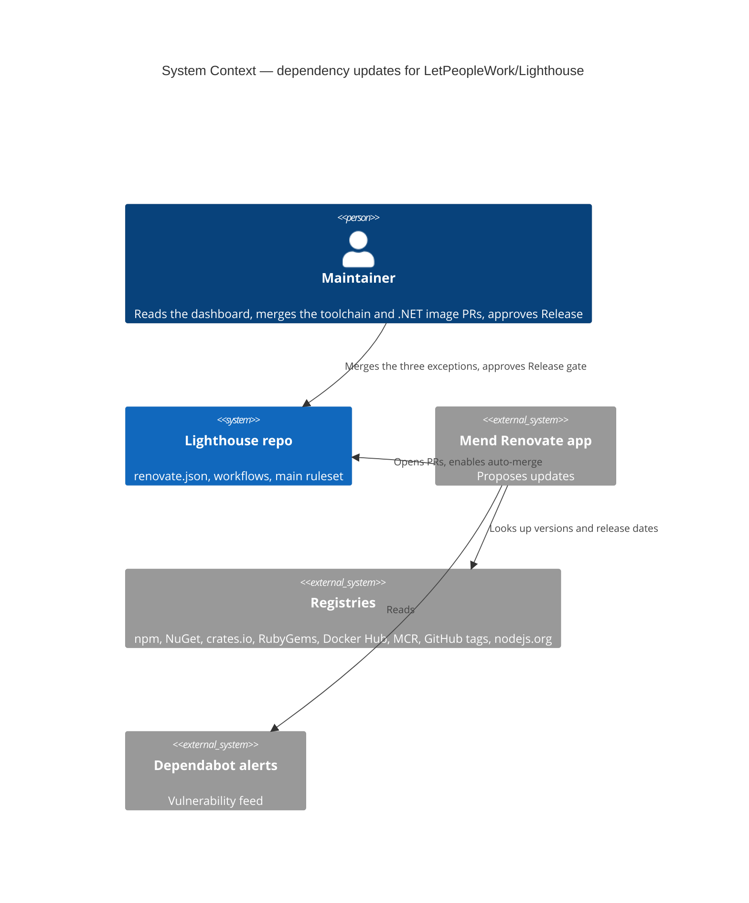
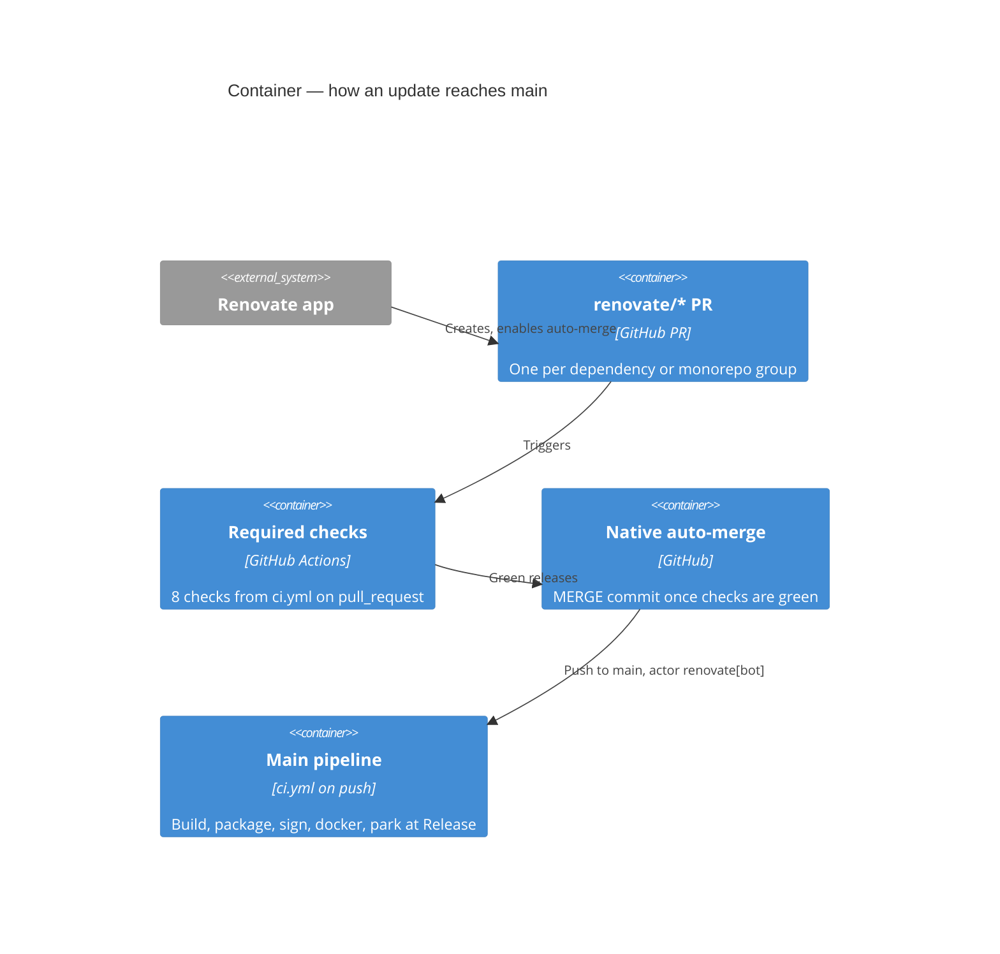

# Story #6095 — Switch Lighthouse from Dependabot to Renovate

## Wave: DISCUSS / [REF] Persona and Job

- Persona: `lighthouse-maintainer`
- Job: `job-maintainer-keep-shipped-clients-patched-without-toil` (docs/product/jobs.yaml), widened on
  2026-09-29 from the clients repo to the Lighthouse repo as well.
- One-liner: one dependency bot, one set of rules, in every repo I maintain — updates proposed once a
  version is 7 days old and merged without me once the required checks are green.

## Wave: DISCUSS / [REF] Feature Type and Pre-requisites

- Feature type: infrastructure (CI / repository tooling). No product code, no user-visible Lighthouse change.
- DISCOVER and DIVERGE: none. The story text is the evidence: "lighthouse-platform and lighthouse-clients
  use renovate. Only Lighthouse itself is on dependabot."
- Precedent: Story #6088 (`docs/feature/story-6088-clients-dependency-updates/`) introduced Renovate to
  lighthouse-clients. Its current `renovate.json` already uses GitHub-native auto-merge
  (`platformAutomerge: true`) behind a `main: require verify` ruleset. That was the fallback #6088 named.
- **Pre-requisite (maintainer action):** the Renovate GitHub App is installed on the org with
  `repository_selection: selected`. `LetPeopleWork/Lighthouse` must be in that selection. This could not be
  verified from this session (the gh token lacks `read:user`).

## Wave: DISCUSS / [REF] Current State (evidence, 2026-09-29)

- `.github/dependabot.yml` covers five ecosystems: npm `/Lighthouse.Frontend`, npm `/Lighthouse.EndToEndTests`,
  nuget `/Lighthouse.Backend`, docker `/`, github-actions `/`. Each runs daily with a 5-day cooldown, a
  `deps` commit prefix and a PR limit of 5 (10 for Actions).
- The Dependabot config holds three MUI ignores: `@mui/x-charts` minor/patch, `@mui/x-date-pickers`
  minor/patch, `@mui/icons-material` major. `x-charts` is pinned at 9.0.1 while 9.14.0 is published.
- `.github/workflows/dependabot-automerge.yaml` enables `gh pr merge --auto --merge` on **every**
  Dependabot PR, majors and security fixes included, using `DEPENDABOT_GITHUB_TOKEN` (a PAT).
- The `main` ruleset required seven checks (eight since 2026-09-29, see DEVOPS): Verify Backend, Verify E2E, Verify Frontend, Verify Postgres,
  Package App, Verify SQLite and sonar-gates. `allow_auto_merge` is on.
- 94 Dependabot PRs were merged and 4 closed unmerged in the last 30 days. None are open now.
- Eight main-only workflows carry `github.actor != 'dependabot[bot]'`: codesign-windows, docker, three
  package-*-standalone, release, verifymacos, verifywindows. On main the actor after a Dependabot merge is
  the PAT owner, so in practice the guard never fires.
- Dependabot **security updates** are enabled on the repo. Dependabot **alerts** are enabled too, and
  Renovate's vulnerability PRs read those alerts.
- Every Actions `uses:` is pinned to a **bare** commit SHA with no version comment
  (`actions/checkout@3d3c42e…`).
- The toolchain is single-sourced by Story #6070: Node in `.nvmrc`, pnpm `10.33.2` in both
  `package.json#packageManager`, and `engines.node` in both projects. The guard
  `.github/scripts/toolchain-pins.mjs` enforces it. In lighthouse-clients, Renovate already auto-merged
  pnpm 12.5.x bumps.
- Dependabot secrets exist, including `DEPENDABOT_GITHUB_TOKEN`, `SONAR_TOKEN` and the connector tokens.
  Every one except `DEPENDABOT_GITHUB_TOKEN` also exists as an Actions secret. Renovate PRs come from
  same-repo branches and run with Actions secrets.

## Wave: DISCUSS / [REF] Locked Decisions

- **D1 — Renovate replaces Dependabot version updates in the Lighthouse repo.** `dependabot.yml` and
  `dependabot-automerge.yaml` go in the same change that adds `renovate.json`, so the two bots never
  race for one dependency. It is the hosted app, the same one platform and clients use.
- **D2 — Everything auto-merges once the required checks are green, as Dependabot does today.** That
  covers patch, minor, major and security updates, on every manager. User: "Keep today". The merge
  waits on the eight required checks of the `main` ruleset.
- **D3 — lighthouse-clients adopts the D2 policy as well.** npm majors and vulnerability-alert PRs
  auto-merge there too, which reverses #6088's D3/D4. User: "adjust clients to do the same pls". Its
  `docs/release-model.md` "Dependency Updates" section is updated to match.
- **D4 — 7-day minimum release age**, the same as clients (today's Dependabot cooldown is 5 days).
  Security updates skip the age rule, which is Renovate's default.
- **D5 — The toolchain pins form one grouped PR that never auto-merges** (Lighthouse). `.nvmrc`, both
  `packageManager` fields and both `engines.node` move together in a single PR and wait for the
  maintainer. That keeps the #6070 single-source guard green and keeps pnpm on the version CI verifies
  lockfiles with. It is one of three exceptions to D2. DESIGN added the others on 2026-09-29, with the
  maintainer's approval: a `.NET` runtime image major, and chart value (helm-values) updates.
- **D6 — One PR per dependency, except monorepo groups.** No weekly schedule. User chose this over grouping
  despite the CI cost. Renovate's default hourly and concurrent PR limits remain the only throttle. Amended
  in DESIGN on 2026-09-29. Maintainer: "KEEP" `config:recommended`'s monorepo groups, so packages released
  together (vitest, the .NET packages, stryker, tauri, MUI) move in one PR.
- **D7 — The existing MUI ignores carry over unchanged in slice 01, and slice 03 then tries to lift
  them.** User, 2026-09-29: "as an added slice, can we at the end check if we can update them and ensure
  everything still works? Dont remember why we stopped those upgrades." Any ignore that survives
  slice 03 carries its reason next to it in `renovate.json`, so the next reader is not left guessing.
  History recovered from git:
  - `@mui/x-charts` + `@mui/x-date-pickers` minor/patch: `cbf153ded` (2025-11-02) downgraded both from
    8.16 to 8.11.3 because "an issue appeared with x-axis labels" and touched `BarRunChart.tsx`. The major
    bump to 9.0.1 / 9.0.0 went through on 2026-04-14, but the minor/patch ignore has held them there ever
    since. Latest is 9.14.0 for both, and `@mui/x-data-grid` already runs 9.14.0.
  - `@mui/icons-material` major: `aec637797` (2026-04-17) downgraded icons-material to v7, alongside
    `@mui/lab` at an exact `7.0.0`, the day after a v9 bump. `60b8e759f` "update icon imports for
    ConfidentIcon and RiskyIcon" sits in the same window, which points to icons renamed or removed in
    v9. Latest is 9.4.0, matching `@mui/material` 9.4.0. `@mui/lab` has no stable v9 (`9.0.0-beta.9`),
    so it stays on v7.
- **D8 — Dependabot security *updates* are switched off, and Dependabot *alerts* stay on.** Renovate
  opens the vulnerability PRs from those alerts, so leaving security updates on would produce duplicate
  PRs.
- **D9 — The Dependabot-only plumbing goes too:** the `DEPENDABOT_GITHUB_TOKEN` secret and the Dependabot
  secret set, the "Dependabot" paragraph in `.github/actions/README.md`, and the now-dead
  `dependabot[bot]` guards (DESIGN decides how).

## Wave: DISCUSS / [REF] Constraints for DESIGN

- **C1 — SHA pinning of Actions is kept, and Renovate must be able to update the pins.** Bare SHAs carry
  no version for Renovate to compare against. DESIGN picks the mechanism, for example a one-time move to
  `@<sha> # vX.Y.Z` via Renovate's digest-pinning preset, and proves Renovate proposes an update for at
  least one action.
- **C2 — A Renovate merge to main builds, packages and reaches the Release approval gate exactly as a
  Dependabot merge does today.** No main-only job may start or stop running because the actor changed.
- **C3 — Lockfiles are regenerated with the pnpm in `packageManager` (10.33.2).** Otherwise
  `ERR_PNPM_LOCKFILE_CONFIG_MISMATCH` returns (see `docs/ci-learnings.md` 2026-09-14).
- **C4 — Commit subjects keep a conventional `deps` form**, so release notes and the history read as they
  do now.
- **C5 — The merge style stays a merge commit** (today's `--merge`), unless DESIGN finds a reason to
  change it.

## Wave: DISCUSS / [REF] Out of Scope

- Scheduling updates, grouping beyond Renovate's monorepo groups (D6), lock-file maintenance PRs, and
  pnpm-level release-age settings for transitive dependencies.
- Limiting coverage to the five former Dependabot ecosystems. Maintainer, 2026-09-29: "Everything it finds".
  So Cargo, Bundler, the chart's helm values, workflow `with:` versions and the pnpm override floors are
  all in scope and auto-merge.
- A bot PR for a vulnerable transitive dependency. Renovate has no such feature. The `pnpm audit` gate on
  main detects it, and a human adds the override.
- Upgrading `@mui/lab` to a v9 prerelease.
- lighthouse-platform's config: it keeps its own chart and fleet rules. Harmonizing it was not asked for.
- Closing the gap where main-only jobs (standalone packaging, codesign, macOS/Windows verify, docker) can
  break after a green PR. That risk exists today under Dependabot and D2 does not change it.

## Wave: DISCUSS / [REF] User Stories

### US-01 — Lighthouse updates arrive from Renovate and merge themselves once green
`job_id: job-maintainer-keep-shipped-clients-patched-without-toil`

As the maintainer, I want the Lighthouse repo on the same dependency bot and rules as the other repos, so I
reason about one tool rather than two.

### Elevator Pitch
Before: Lighthouse updates come from Dependabot with a 5-day cooldown and a PAT-driven auto-merge workflow, while the other two repos use Renovate.
After: open `github.com/LetPeopleWork/Lighthouse/pulls` → sees `renovate[bot]` PRs, one per dependency and each at least 7 days old, which merge themselves once the eight required checks pass. The "Dependency Dashboard" issue lists what is pending and why.
Decision enabled: none for routine updates. The maintainer looks only at what did not merge (a red PR) and at the toolchain PR.

- AC-01.1 `renovate.json` exists on main and passes `renovate-config-validator`. `.github/dependabot.yml`
  and `.github/workflows/dependabot-automerge.yaml` no longer exist.
- AC-01.2 Renovate's first run creates the Dependency Dashboard issue and lists updates for every manager it
  detects: frontend and E2E npm (including the pnpm override floors), NuGet, Docker, GitHub Actions
  (including workflow `with:` versions), nvm, Cargo (Tauri), Bundler (docs) and the chart's helm values.
- AC-01.3 No PR is opened for a version published less than 7 days ago. It shows as pending on the
  dashboard.
- AC-01.4 A patch, minor or major PR with all eight required checks green is merged without human
  action, as a merge commit.
- AC-01.5 A PR with any required check red stays open.
- AC-01.6 A vulnerability-alert PR opens without waiting for the age rule and auto-merges once green.
  After the switch, no new Dependabot PR (version or security) is opened.
- AC-01.7 Renovate proposes an update for at least one SHA-pinned GitHub Action, and the proposed
  reference is still a SHA (C1).
- AC-01.8 `@mui/x-charts` and `@mui/x-date-pickers` receive no minor or patch PRs, and
  `@mui/icons-material` receives no major PR (D7).
- AC-01.9 After a Renovate merge, the main build runs the same set of jobs as after a Dependabot merge
  and parks at the Release gate (C2).
- AC-01.10 A frontend or E2E npm PR's lockfile passes `pnpm install --frozen-lockfile` under the pinned
  pnpm in CI (C3).

### US-02 — Toolchain bumps wait for the maintainer as one PR
`job_id: job-maintainer-keep-shipped-clients-patched-without-toil`

### Elevator Pitch
Before: the Node and pnpm pins move only when the maintainer remembers, and a bot that bumped just one of them would break the #6070 guard.
After: open the PR list → sees a single Renovate PR that moves `.nvmrc`, both `packageManager` fields and both `engines.node` together. It stays open until merged by hand.
Decision enabled: whether and when to move CI and local dev to a new Node or pnpm version.

- AC-02.1 A Node or pnpm update produces exactly one PR that touches every pin location of whatever moved.
  A Node move touches `.nvmrc` and both `engines.node`, a pnpm move touches both `packageManager` fields,
  and when both move it touches all five.
- AC-02.2 That PR is never auto-merged, even with every check green. The one exception is a
  vulnerability-alert PR for pnpm or Node, which auto-merges on green like every security fix. The
  maintainer accepted this on 2026-09-29.
- AC-02.3 No other Renovate PR touches a toolchain pin, apart from such a vulnerability-alert PR.

### US-03 — lighthouse-clients follows the same auto-merge policy
`job_id: job-maintainer-keep-shipped-clients-patched-without-toil`

### Elevator Pitch
Before: in clients, npm majors and security PRs wait for the maintainer while Lighthouse merges them automatically. Two rules for one job.
After: open `github.com/LetPeopleWork/lighthouse-clients/pulls` → sees major and `security`-labelled Renovate PRs merge themselves once `verify` is green, and reads the same rule in `docs/release-model.md`.
Decision enabled: none for routine updates. The maintainer looks only at red PRs.

- AC-03.1 clients `renovate.json` auto-merges every update type and vulnerability alerts once `verify` is
  green, and still passes `renovate-config-validator`.
- AC-03.2 The "Dependency Updates" section of clients `docs/release-model.md` states the new rule, and no
  longer says majors and security fixes wait.
- AC-03.3 The 7-day age rule, no changesets on update PRs, and the Release approval gate are unchanged.

### US-04 — The held-back MUI packages catch up, or say why they can't
`job_id: job-maintainer-keep-shipped-clients-patched-without-toil`

### Elevator Pitch
Before: three MUI ignores hold `x-charts` and `x-date-pickers` at 9.0.x and `icons-material` at v7, and nobody remembers why.
After: open `renovate.json` → sees either no MUI ignore (the packages are on the latest 9.x and Renovate keeps them current) or an ignore with a one-line reason and a named reproduction.
Decision enabled: whether a held-back package needs work (a code change, an upstream issue) or can simply float.

- AC-04.1 `@mui/x-charts` and `@mui/x-date-pickers` are on the latest 9.x and `@mui/icons-material` is on
  the latest 9.x, with the frontend suite, `pnpm build` (zero warnings) and the E2E suite green.
- AC-04.2 Charts render their x-axis labels as before, checked on the dev instance against the bar,
  run and stacked-area charts. This was the 2025-11 regression, which no test caught.
- AC-04.3 The metrics date-range picker still survives the Bug #5915 keystroke sequence. That's covered
  by the real-picker tests `DateRangeSelector.keyboard.test.tsx` and `DashboardHeader.popover.test.tsx`.
- AC-04.4 Every icon import compiles and renders. No icon silently falls back or disappears.
- AC-04.5 Each lifted package's ignore is removed from `renovate.json`. A package that cannot be lifted
  keeps its ignore with a reason and the smallest reproduction, and gets an ADO Bug created with
  confirmation.
- AC-04.6 The `@screenshot` docs images that show charts or date pickers are regenerated if they changed.

## Wave: DISCUSS / [REF] Story Map and Slices

Backbone: *configure the bot* → *first run proposes* → *PR goes green* → *merges itself* → *main builds and parks at Release*.

| Slice | Repo | Stories | Learning hypothesis |
|---|---|---|---|
| 01 `lighthouse-renovate` | Lighthouse | US-01, US-02 | Disproves "Renovate can simply stand in for Dependabot here" if SHA-pinned Actions, the pinned pnpm or the main-only guards break |
| 02 `clients-automerge-all` | lighthouse-clients | US-03 | Disproves "auto-merging majors is safe behind `verify`" if a major merges green and breaks a release |
| 03 `mui-unpin` | Lighthouse | US-04 | Disproves "the MUI regressions were fixed upstream" if x-axis labels, the date picker or icons break on the latest 9.x |

Order: 01 goes first because it carries the uncertainty (C1–C3). 02 is a two-line config change and a
docs edit, and it can land any time. 03 goes last, at the user's request. It is a hand upgrade with a
visual check rather than a Renovate PR, because D2 would auto-merge on green and the 2025-11 label
regression was never red in CI.
Walking skeleton: none needed. Strategy **A (real)**: the first live Renovate run on each repo is the
end-to-end proof, against production dependencies.
Driving ports: `renovate.json` (config), the GitHub PR list and the Dependency Dashboard issue (what the
maintainer sees), and the `main` ruleset's required checks (the merge gate).

## Wave: DISCUSS / [REF] Outcome KPIs

- KPI-1: Dependabot PRs opened in the Lighthouse repo after the switch — target 0.
  `gh pr list -R LetPeopleWork/Lighthouse --author app/dependabot --state all --search "created:>=<switch date>"`.
- KPI-2: Renovate PRs open more than 2 days with all required checks green, in both repos — target 0,
  which shows auto-merge is working. `gh pr list --author app/renovate`.
- KPI-3: toolchain-group PRs merged by Renovate — target 0.
- KPI-4: update PRs whose version was younger than 7 days when opened, security excepted — target 0.

## Wave: DISCUSS / [REF] Checklist

- RBAC impact: N/A. No server, API or UI change.
- Lighthouse-Clients CLI/MCP versioning: N/A for Lighthouse. For clients (slice 02) there is no version
  bump and no changeset. Auto-merged majors ship with the next release, which a human still approves at
  the Release gate.
- Website marketing surface: N/A. Internal repository tooling, nothing user-facing.
- Docs (per-feature): `.github/actions/README.md` in Lighthouse and `docs/release-model.md` in clients.
  No public `docs/` page describes dependency tooling, so no public docs change.
- Screenshots / demo data: slices 01 and 02 have no UI, so N/A. Slice 03 changes chart, picker and icon
  rendering, so the affected `@screenshot` images are regenerated (AC-04.6). Demo data: N/A.

## Wave: DISCUSS / [REF] Definition of Done

1. Every slice's ACs verified: slices 01–02 against a live Renovate run, not only a validated config; slice 03 on the dev instance.
2. `renovate-config-validator` passes for both configs.
3. The Dependabot config, workflow, secrets and README paragraph are gone from Lighthouse.
4. Dependabot security updates are off and alerts are on (repo settings).
5. The `toolchain-pins.mjs` guard is green on the first toolchain PR.
6. CI on main is green after the change commit.
7. `docs/ci-learnings.md` has an entry for anything the first run surfaced.
8. ADO #6095 is Resolved on push and Closed on green CI.
9. KPI-1 has been observed once, a week after the switch.

## Wave: DISCUSS / [REF] Definition of Ready

| # | Item | Evidence |
|---|---|---|
| 1 | Problem stated in domain language | Two bots with two rule sets across three repos (story text) |
| 2 | Persona identified | `lighthouse-maintainer` |
| 3 | Job traced | every story → `job-maintainer-keep-shipped-clients-patched-without-toil` |
| 4 | Examples with real data | real ecosystems, MUI pins with the commits that set them, pnpm 10.33.2, seven named required checks |
| 5 | Elevator pitch per story | US-01..04 |
| 6 | ACs testable | each AC is observable in the PR list, the dashboard, the repo tree or CI |
| 7 | Right-sized | 3 slices of ≤1 day each; Scope Assessment PASS (4 stories, 2 repos, one dependency upgrade) |
| 8 | Dependencies named | Renovate app selection includes Lighthouse (maintainer action) |
| 9 | Decisions locked by the user | D2–D7 answered on 2026-09-29 |

## Wave: DISCUSS / [REF] Wave Decisions Summary

- Scope Assessment: PASS.
- Changed assumption, back-propagated to `jobs.yaml`: #6088 recorded "majors and security fixes never
  auto-merge; a human decides". The user reversed this on 2026-09-29 for both repos, because an
  auto-merge policy that has worked in Lighthouse under Dependabot is the one to harmonize on.
- Next: DESIGN (C1–C5), then DEVOPS (the usage-data question is N/A for repo tooling but must be
  answered), DISTILL and DELIVER.

## Wave: DESIGN / [REF] Scope, Mode and Evidence Base

- This is the platform and delivery-infrastructure DESIGN, run in **propose** mode. On 2026-09-29 the
  maintainer answered the seven open questions and the proposals were locked. Every decision below is
  **LOCKED**, and each one quotes the choice that locked it.
- Evidence comes from three places:
  - Five local Renovate dry runs (`renovate@44.118.0 --platform=local --dry-run=lookup`) against throwaway
    clones of `main` at `749402711`. The clones lived in the session scratchpad and were never pushed.
    Dry run 5 is the one that counts. It ran the locked config against a clone with every Action pinned.
  - Renovate's docs and source (`docs/usage/configuration-options.md`,
    `docs/usage/key-concepts/minimum-release-age.md`, `lib/modules/manager/github-actions/readme.md`,
    `lib/config/options/index.ts`, `lib/workers/repository/model/commit-message*.ts`).
  - Read-only `gh api` calls against the Lighthouse and lighthouse-clients repos.
- The candidate config is `design/renovate.candidate.json`. Checked as a repository `renovate.json`,
  `renovate-config-validator --strict` reports `Config validated successfully against 1 file(s)` and exits 0.

## Wave: DESIGN / [REF] Design Decisions

### DES-1 (C1): pin every Action to `@sha # version` once, then let Renovate keep the pins current — **LOCKED**

Maintainer: "pin them ALL".

**Evidence**
- Renovate skips a bare SHA. Dry run 1 found 119 `uses:` refs with `"skipReason":"unversioned-reference"` and
  `"updates":[]`. The github-actions manager docs say: "Actions pinned to a bare SHA without a version comment are
  disabled by default, because Renovate cannot determine which branch or tag the SHA belongs to."
- `helpers:pinGitHubActionDigestsToSemver` makes no difference to bare SHAs. Dry run 2 used it and they stayed
  `unversioned-reference`.
- **The DISCUSS fact "every `uses:` is a bare SHA" is only partly true.** In `.github/workflows` and
  `.github/actions` there are:
  - 121 bare-SHA lines over 28 distinct action@sha pairs
  - 5 refs already in `@sha # vX` form
  - 20 tag or branch refs: `download-artifact@v8`, `github-script@v9`, `setup-node@v7.0.0`,
    `upload-artifact@v7.0.1`, `import-codesign-certs@v7.0.0`, `tauri-action@v1.0.0`,
    `sonarqube-quality-gate-action@master` and `dtolnay/rust-toolchain@stable`
- Seven of the bare pins are one or more releases behind: `checkout v6.0.2`, `cache v5.0.4`,
  `setup-dotnet v5.0.1`, `setup-node v6.3.0`, `upload-artifact v7.0.0`, `sonarqube-scan-action v7.0.0` and
  `pnpm/action-setup v6.0.0`.

**The one-time conversion script** (throwaway, not committed) rewrites every ref to `@<sha> # <version>`.
- **A bare SHA** gets the most specific semver tag at that commit. All 28 resolved. 27 are `vX.Y.Z`, and
  `vimtor/action-zip` is `v1.3`.
- **A tag** (`@v8`, `@v7.0.1`) is resolved to its commit, peeling annotated tags, and labelled with the most
  specific tag at that commit. For example, `download-artifact@v8` becomes `@3e5f45b2… # v8.0.1`, and
  `github-script@v9` becomes `@3a2844b7… # v9.0.0`.
- **A branch** (`@master`, `@stable`) resolves to its head commit.
  - If that commit is a release, it is labelled with the release. `sonarqube-quality-gate-action`'s `master`
    head `7a5fffe8` is exactly its latest release `v1.2.1` (compare `v1.2.1...master`: `ahead_by: 0`), so it
    becomes `@7a5fffe8… # v1.2.1`. From then on it follows releases instead of every master commit.
  - If no release sits at the head, the ref stays labelled with the branch name, so Renovate keeps following
    the branch. `dtolnay/rust-toolchain` has no release on its `stable` line. Its only release, `v1`, is from
    2022 and belongs to an older interface. So it becomes `@6bed0761… # stable`.
    - Renovate treats that label as a branch and proposes a digest PR whenever `stable` moves, which in dry run
      3 showed as `pinDigest stable 6bed0761d9`.
    - The pin is safe: the `stable` branch's `action.yml` defaults the `toolchain` input to `stable`.
- **Scope.** The script touches only `.github/workflows` and `.github/actions`.
  `.github/scripts/toolchain-pins.test.mjs` keeps bare pins on purpose as test fixtures.
- **Result on a fresh clone:** 29 files, 141 lines changed, and 0 refs left that aren't `@sha # version`.
- `helpers:pinGitHubActionDigests` stays in `extends`. It pins any tag-form `uses:` that a later commit introduces.

**Proof for AC-01.7.**
- In dry run 3 (bare SHAs annotated), Renovate proposed `actions/checkout v6.0.2 → v7.0.1` with newDigest
  `3d3c42e5aa`, and `setup-node v6.3.0 → v6.5.0 / v7.0.0`.
- The template it writes is `{{depName}}@{{newDigest}} # {{newValue}}`, so the ref stays a SHA.
- In dry run 5, all 161 extracted Action refs are versioned and 0 are `unversioned-reference`. The 56 others are
  runner labels and unpinned `with:` inputs, which aren't Action refs.

**The 7-day age rule still works on SHA-pinned Actions.**
- The docs say a `github-tags` digest update "ages against the release timestamp for this new version".
- Caveat from the same page: a force-pushed tag keeps its old date, so it can pass the age check straight away.

**Rejected**
- Rewriting to plain tags and letting Renovate pin them. Main would run on unpinned tags until that pin PR merged.
- `gh actions-lock`, which is a second mechanism.
- `pinGitHubActionDigestsToSemver`. Its regex rejects `v1.3`, and after the conversion it has nothing left to do.

### DES-2 (C2): delete the `dependabot[bot]` guard in all eight workflows — **LOCKED**

Locked as recommended; the maintainer did not object.

**Evidence**
- **Renovate becomes the actor on main.** In lighthouse-clients, the main-push runs of Renovate's auto-merged PRs
  (`4bbd0f44`, `3449cc4d`) show `actor=renovate[bot] triggering_actor=renovate[bot]`, and `gh pr list` shows
  `mergedBy=app/renovate`.
- **Today the actor is the PAT owner.** After the Lighthouse Dependabot merges #1714–#1720 it is `huserben`.

**Decision**
- `if: github.ref == 'refs/heads/main' && github.actor != 'dependabot[bot]'` becomes
  `if: github.ref == 'refs/heads/main'`.
- **Swapping in `renovate[bot]` is rejected.** That guard would fire for the first time, and codesign, docker,
  the three standalone packages, macOS/Windows verify and release would all be skipped after every dependency
  merge.

**Watch at the first merge.** The GHCR logins in `ci_docker.yml:46` and `ci_release.yml:41` use
`username: ${{ github.actor }}` with `GITHUB_TOKEN`, which GHCR accepts under any username. AC-01.9 confirms
it at the first merge.

### DES-3 (D5): the toolchain group — **LOCKED**

Locked as recommended; the maintainer did not object.

The rule:

```json
{ "matchManagers": ["nvm", "npm"], "matchDepNames": ["node", "pnpm"],
  "groupName": "Node and pnpm toolchain", "rangeStrategy": "replace",
  "separateMajorMinor": false, "automerge": false }
```

**Why `replace`**
- Under the global `bump`, dry run 1 proposed `.nvmrc 24 → 24.21.0` and `engines 24.x → 24.21.0`.
  `toolchain-pins.mjs` rejects that (`engines-node-mismatch`), and it would open a PR for every Node patch.
- With `replace` both forms are kept. Dry run 4 seeded `22` / `22.x` and got one branch that moved all five
  locations: `22 → 24`, `22.x → 24.x` twice, and `packageManager 10.33.2 → 12.5.1` twice.
- Only LTS majors are proposed. Node 26 isn't LTS yet, so nothing is proposed today.

**Side effects and neighbours**
- **pnpm always jumps to the latest version.** A 10.x minor is never offered.
- **The Dockerfile follows `.nvmrc`.** `node:${NODE_VERSION}` is skipped with `contains-variable`, and the build
  arg carries `.nvmrc` into it.
- **`@types/node` stays outside the group and auto-merges.** It's already `^26` against Node 24.
- **Accepted consequence, from the maintainer's answer 3.** A vulnerability-alert PR for `pnpm` or `node` gets
  Renovate's own vulnerability branch (`groupName: null`) and `vulnerabilityAlerts.automerge: true`, so it
  auto-merges on green outside this group. The maintainer did not choose "toolchain waits on security too".
  AC-02.2 and AC-02.3 are reworded to say so.
  - A pnpm-only security bump still passes the `toolchain-pins.mjs` guard, because both `packageManager` fields
    move together.
  - A Node security alert maps to no npm advisory in practice.

### DES-4 (C3): lockfiles are regenerated with pnpm 10.33.2 — **LOCKED (the toolchain PR is confirmed at its first occurrence)**

**Evidence**
- **Renovate reads pnpm 10.33.2 from each project.** It extracted `"extractedConstraints":{"node":"24.x","pnpm":"10.33.2"}`
  for both `Lighthouse.Frontend/package.json` and `Lighthouse.EndToEndTests/package.json`, with
  `"hasPackageManager":true`.
- **A dependency bump regenerates cleanly under 10.33.2.** Renovate's lockfile step, replayed for
  `parse5 ^8.0.0 → ^8.0.1` (`npx pnpm@10.33.2 install --lockfile-only --ignore-scripts --ignore-pnpmfile`),
  changed one specifier line. `patchedDependencies` kept the pnpm-10 `hash:`+`path:` form, and
  `--frozen-lockfile` exited 0.
- **The override floors regenerate cleanly too.** This is risk (b) below.

**Still open (DoD item 5).** It isn't proven which pnpm writes the lockfile on the toolchain PR itself. If the
old pnpm writes it, the maintainer regenerates the lockfile on that branch before merging, which the
no-auto-merge rule allows for.

### DES-5 (C4/C5): commit and merge form — **LOCKED**

Locked as recommended.

**Commit form: `"commitMessagePrefix": "deps:"`**
- The subject reads `deps: update dependency vite to v8.3.1`. Vulnerability PRs add ` [SECURITY]`.
- Renovate's source, `commit-message-factory.ts`, switches semantic commits off whenever a prefix is set, and
  `commit-message.ts` lowercases the subject after it.
- `/release-notes` already bundles `deps` commits.

**Merge form: `"automergeStrategy": "merge-commit"`**
- This has to be explicit. Clients leaves it at `auto`, and its PRs #26–28 merged as `SQUASH`.
- The merge commit reads `Merge pull request #N from LetPeopleWork/renovate/…`, just as Dependabot merges do today.

**No conflict with the ruleset**
- The `main` ruleset (2485146) has `deletion`, `non_fast_forward` (on `~DEFAULT_BRANCH` only) and seven
  required Actions checks. Its policy is not strict and it requires no review.
- The repo allows merge commits and auto-merge.
- `ci.yml` triggers on `pull_request` with no path filter, so every Renovate PR, including a Cargo- or
  chart-only one, produces the eight checks.

### DES-6 (D2): everything auto-merges, with three exceptions — **LOCKED**

Maintainer: exceptions are "ONLY the .NET image major", plus the toolchain group from D5. The chart exception was added later, after risk (a).

**Settings**
- **At top level:** `automerge: true`, `automergeType: "pr"`, `platformAutomerge: true`, `ignoreTests: false`,
  `minimumReleaseAge: "7 days"`, `internalChecksFilter: "strict"` (no branch until the version is old enough,
  per the docs), `rangeStrategy: "bump"` (Dependabot bumps ranges today), `rebaseWhen: "conflicted"` and
  `vulnerabilityAlerts: { labels: ["security"], automerge: true }`.
- **`rebaseWhen: "conflicted"`** was locked as recommended. It keeps CI cost at today's level. The known risk,
  as the docs warn, is that two green PRs merge without having been tested together, which is the same as
  under Dependabot today.
- **Exception 1: the toolchain group** (DES-3).
- **Exception 2: `.NET` runtime image majors.** The rule is `matchDatasources: ["docker"]`,
  `matchPackageNames: ["mcr.microsoft.com/dotnet/**"]`, `matchUpdateTypes: ["major"]`, `automerge: false`.
  - Today MCR returns no release timestamps, so the `10.0 → 11.0` update is held pending anyway. The dry-run log
    says "Marking 1 release(s) as pending, as they do not have a releaseTimestamp".
  - The rule makes the hold deliberate, so it no longer depends on that gap. No required check builds the image,
    and a runtime major must move together with `TargetFramework`.
  - The images share Renovate's `dotnet-monorepo` group with the Microsoft NuGet packages. A branch auto-merges
    only when every upgrade in it does, so a NuGet .NET major grouped with the image major also waits.
- **Exception 3: chart value updates** (`matchManagers: ["helm-values"]`, `automerge: false`). The maintainer
  chose this on 2026-09-29 after risk (a): a `values.yaml` bump also needs `chart/README.md` regenerated with
  helm-docs and a chart version bump, and the `Helm Chart` workflow is not a required check. So these PRs open
  and wait. The Postgres 17 → 18 major in the chart default is a data-format change for bundled-DB users, which
  is another reason it waits.
- **Monorepo grouping from `config:recommended` stays.** Maintainer: "KEEP". Examples: `dotnet-monorepo`,
  `vitest-monorepo`, `tauri-monorepo`, `stryker-js-monorepo` and `material-ui-monorepo`.
- **PR limits stay at Renovate's defaults:** `prHourlyLimit: 2` and `prConcurrentLimit: 10` (`options/index.ts`).

**Pitfalls to expect**
- **A stryker 9 → 10 PR will go red and stay open.** `pnpm-workspace.yaml` patches
  `@stryker-mutator/vitest-runner@9.6.1`, and that patch would no longer apply. This is AC-01.5 working as
  designed.
- **The MUI ignores work.** The log shows "Filtered out 3 disabled update(s)".

### DES-7: coverage is everything Renovate finds — **LOCKED**

Maintainer: "Everything it finds".

**What changed in the config.** There is no `enabledManagers`, and the `uses-with` and
`pnpm-workspace.overrides` dep types are no longer disabled. Dry run 5 found eight managers:
`bundler cargo dockerfile github-actions helm-values npm nuget nvm`. Every update from each of them auto-merges
on green, apart from the three exceptions.

**What it looks like: dry run 5 returns 59 branches** ("Filtered out 3 disabled update(s). 92 update(s)
remaining. Returning 59 branch(es)").

**30 branches exist only because of the wider coverage, and 3 existing branches get wider.** Majors are marked **MAJOR**.
- **Cargo** (`Lighthouse.Frontend/src-tauri/Cargo.toml`), 9 new branches: `chrono-0.x`, `regex-1.x`,
  `serde_json-1.x`, `serde-monorepo`, `tauri-plugin-dialog-2.x`, `tauri-plugin-shell-2.x`,
  `tauri-plugin-updater-2.x`, `tokio-1.x`, `windows-sys-0.x` (0.59 → 0.61, a breaking step under Cargo's 0.x
  rules) and, as a widened existing branch, `tauri-monorepo`.
- **Bundler** (`docs/Gemfile`), 3 branches: `jekyll-ecosystem-packages`, `just-the-docs-0.x` (0.10 → 0.12) and
  `protobuf-monorepo`.
- **helm-values** (`chart/values.yaml`), 1 branch: `postgres-18.x` (17 → 18), **MAJOR**. It is pending
  indefinitely today because there is no timestamp. See risk (a).
- **Workflow `with:` inputs** (`uses-with`), 5 branches:
  - `python-3.x` (3.10 / 3.11 → 3.14.7)
  - `helm-3.x`
  - `helm-4.x` (v3.16.3 → v4.3.0), **MAJOR**
  - `ruby-3.x`
  - `ruby-4.x` (3.3 → 4.0), **MAJOR**
  - plus `dotnet-sdk 10 / 10.0.x → 10.0.401`, which joins the existing `dotnet-monorepo` branch
- **pnpm override floors** (`pnpm-workspace.yaml`), 12 branches:
  - `axios-1.x` (E2E)
  - `babel-monorepo`
  - `major-babel-monorepo` (`@babel/core ^7 → ^8`), **MAJOR**
  - `brace-expansion-5.x`, `browserslist-4.x`
  - `fast-uri-3.x`, `fast-uri-4.x` (`^3 → ^4`), **MAJOR**
  - `immutable-…-5.x`, `postcss-8.x`
  - `undici-7.x`, `undici-8.x` (`^7 → ^8`), **MAJOR**
  - `ws-8.x`
  - plus the `vitest` floor, which joins the existing `vitest-monorepo` branch

**Majors among the new branches:** `postgres-18.x`, `helm-4.x`, `ruby-4.x`, `major-babel-monorepo`,
`fast-uri-4.x` and `undici-8.x`.

**About the override-floor majors.** A floor forced to a new major pushes every consumer of that package onto
it, even consumers whose own range still says `^7`. CI catches that only where the tests exercise the package.

**Risk (a): a chart values bump next to `ci_chart.yml`**, from reading the workflow.
- **The PR is gated only by `ci.yml`.** `ci_chart.yml` runs `validate` and `install-smoke` on `pull_request` for
  `chart/**`, but neither is one of the eight required checks. A `values.yaml` PR is gated only by `ci.yml`, which
  runs because `pull_request` has no path filter, and it auto-merges even when `validate` is red.
- **It will be red for the `postgres:17` default.** `validate` includes the helm-docs drift gate
  (`git diff --exit-code -- chart/README.md`). `chart/README.md:124` renders `postgresql.image` as
  `"postgres:17"`, and Renovate edits only `values.yaml`, so the drift gate fails on the PR. After the merge,
  `Helm Chart` on main goes red.
- **Nothing publishes.** `detect-publish` compares the `Chart.yaml` version with `docs/charts/index.yaml`.
  Renovate doesn't bump `Chart.yaml`, so the output is "already published — no publish needed, no gate". The
  `Release` gate and the `RELEASE_CREATION_TOKEN` push to main (the admin PAT that the ruleset requires) are
  never reached. The change waits for the next deliberate chart version bump, and the stale README then fails
  that publish's validate step until someone runs helm-docs.
- **A Postgres major in the chart's default is also a data-format change** for anyone running the bundled
  database. Today it's held only by the missing timestamp.
- **The same applies to the Helm v4 major** in `ci_chart.yml`'s `with: version: v3.16.3`. It triggers the
  path-filtered `Helm Chart` workflow, which isn't required. A break in `helm plugin install … helm-unittest
  --version v1.0.3` under Helm 4 would merge green and show only on the next chart change.
- **Status.** This is a finding. The maintainer's answer allows no further exception, so it goes to open
  question 1 rather than into the config.

**Risk (b): a pnpm override-floor bump under pnpm 10.33.2.** Proven consistent on the probe clone:
- The bumps were Frontend `undici ^7.28.0 → ^7.29.1` and E2E `axios ^1.18.1 → ^1.20.0`, followed by Renovate's
  step `npx pnpm@10.33.2 install --lockfile-only --ignore-scripts --ignore-pnpmfile`.
- **Regeneration:** exit 0 in both projects. The lockfile's own `overrides:` block moved together with
  `pnpm-workspace.yaml` (`-  undici: ^7.28.0` / `+  undici: ^7.29.1`), and `patchedDependencies` kept its
  `hash:`+`path:` form.
- **Frozen check:** `pnpm@10.33.2 install --frozen-lockfile --lockfile-only` then exited 0 in both.
- **Why the old mismatch doesn't return.** The `ERR_PNPM_LOCKFILE_CONFIG_MISMATCH` history came from overrides
  kept in `package.json#pnpm`, which pnpm 10 doesn't read (ci-learnings 2026-08-04 RESOLVED), and from lockfiles
  written by a newer pnpm (2026-09-14). Neither happens here: the overrides live in `pnpm-workspace.yaml`, and
  Renovate uses the pinned 10.33.2.
- **Side note.** The regenerated lockfile resolved `undici@7.30.0`, the newest version in range. pnpm has no
  release-age setting (out of scope), so the 7-day rule covers the floor itself but not what it resolves to.

### DES-8 (D8): Dependabot security updates go off — **LOCKED**

**The transitive gap is recorded.**
- Renovate raises vulnerability PRs only for the deps it extracts. `lib/config/options/index.ts` has no
  transitive-remediation option.
- So a vulnerable transitive pnpm or NuGet package gets no bot PR. The `sonar-gates` `pnpm audit
  --audit-level=low` on main turns red, and a human adds an override, as they always have here (`42b076739`,
  `2bcefca52`).
- Now that the override floors are in coverage, Renovate keeps each existing floor moving afterwards.
- The paragraph that replaces the Dependabot one in `.github/actions/README.md` says this.

### DES-9: cutover sequence, rollback first — **LOCKED**

Locked as recommended.

**Rollback:**
1. Revert the cutover commits. That restores `dependabot.yml`, the auto-merge workflow, the guards and the old
   `uses:` form.
2. Run `gh api -X PUT repos/LetPeopleWork/Lighthouse/automated-security-fixes`.
3. Deselect the repo in the Renovate app.

`DEPENDABOT_GITHUB_TOKEN` is kept until step 6, so the rollback needs no new secret.

**Rollout:**
1. **Push to main, one push with focused commits:**
   - (a) `ci(actions): pin every action to a commit with its release named`. This is the conversion script
     output, and behaviour doesn't change except that `sonarqube-quality-gate-action` now follows releases
     instead of master.
   - (b) `ci(deps): switch dependency updates from Dependabot to Renovate`. It adds `renovate.json`, deletes
     `.github/dependabot.yml` and `.github/workflows/dependabot-automerge.yaml`, drops the eight guards and
     rewrites the README paragraph.

   Wait until main is green and parked at Release.
2. **Switch Dependabot security updates off:**
   `gh api -X DELETE repos/LetPeopleWork/Lighthouse/automated-security-fixes`. Alerts stay on. Verify with a GET
   (`enabled:false`) and with `vulnerability-alerts` returning 204.
3. **Maintainer:** add `LetPeopleWork/Lighthouse` to the Renovate app selection, and confirm the app can read
   Dependabot alerts. `renovate.json` is already on main, so no onboarding PR opens. The docs say "commit a
   Renovate configuration file to your default branch to manually onboard".
4. **First run:**
   - The dashboard lists all eight managers (AC-01.2).
   - The stale-Action PRs merge on green (AC-01.4). AC-01.7 is met when one of them lands as `@<sha> # v7.0.1`,
     for example `actions/checkout v6.0.2 → v7.0.1`, which dry run 3 predicted. Record the PR number.
   - The first Renovate merge runs the full main job set (AC-01.9).
   - Chart value PRs open and wait (exception 3), so no red `Helm Chart` run on main is expected from Renovate.
5. **KPI-1, a week later:** check that no Dependabot PR opened.
6. **After the first green Renovate merge,** delete `DEPENDABOT_GITHUB_TOKEN` and the other 11 Dependabot secrets.

### DES-10 (slice 02): the lighthouse-clients diff — **LOCKED (unchanged)**

```diff
   "packageRules": [
     {
-      "description": "Patch and minor updates merge themselves once CI is green; npm majors stay open for a human.",
-      "matchUpdateTypes": ["patch", "minor"],
-      "automerge": true,
-      "automergeType": "pr",
-      "ignoreTests": false
-    },
-    {
-      "description": "GitHub Actions majors merge themselves too; a release-only action that breaks shows up on the next release run, not here.",
-      "matchManagers": ["github-actions"],
-      "matchUpdateTypes": ["major"],
+      "description": "Every update merges itself once CI is green, majors included. A major that breaks a package shows up on the next release run, which still waits for a human at the Release gate.",
+      "matchPackageNames": ["*"],
       "automerge": true,
       "automergeType": "pr",
       "ignoreTests": false
@@
   "vulnerabilityAlerts": {
     "labels": ["security"],
-    "automerge": false
+    "automerge": true
   }
```

- `renovate-config-validator --strict` passes on the result.
- `docs/release-model.md:50` becomes: "Every update, majors and security fixes included, merges itself once CI is
  green."

### DES-11 (slice 03): the MUI plan, at design level — **LOCKED (unchanged)**

1. **Upgrade by hand** `@mui/x-charts`, `@mui/x-date-pickers` and `@mui/icons-material` to the latest 9.x.
   `@mui/lab` stays at 7.0.0. Use pnpm 10.33.2 for the lockfile.
2. **Run the gates:**
   - `pnpm test`, watching for `ERR_UNSUPPORTED_DIR_IMPORT` (the fix is `server.deps.inline`)
   - `pnpm build` with zero warnings
   - the E2E suite
   - `DateRangeSelector.keyboard.test.tsx` and `DashboardHeader.popover.test.tsx`
3. **Check on the dev instance:** the x-axis labels on the bar, run and stacked-area charts, the date-range
   picker, and ConfidentIcon/RiskyIcon.
4. **Regenerate the affected `@screenshot` PNGs.** `rm` them first.
5. **Delete each lifted rule from `renovate.json`.** Any ignore that stays gets its reason and a reproduction,
   plus an ADO Bug, created with confirmation.

## Wave: DESIGN / [REF] Changed Assumptions

- **D6.** Maintainer, 2026-09-29: "KEEP" monorepo grouping. D6 now reads "one PR per dependency, except monorepo
  groups". It's amended in place above.
- **Coverage.** DISCUSS assumed the five former Dependabot ecosystems. Maintainer: "Everything it finds". That
  adds Cargo, Bundler, helm-values, workflow `with:` inputs, nvm and the pnpm override floors, all auto-merging.
  AC-01.2 and Out of Scope are updated.
- **AC-02.1.** The toolchain PR touches 2 locations (pnpm), 3 (Node) or 5 (both), not always five. Reworded.
- **AC-02.2 / AC-02.3.** The maintainer did not choose "toolchain waits on security too", so a vulnerability-alert
  PR for pnpm or Node auto-merges on green. This is an accepted consequence, and both ACs are reworded.
- **D8.** "Leaving security updates on would produce duplicate PRs" holds for direct dependencies only. A
  vulnerable transitive dependency gets no bot PR from Renovate. The `pnpm audit` gate on main detects it, and a
  human adds the override.
- **D2 now has three exceptions:** the toolchain group, `.NET` runtime image majors, and chart value (helm-values) updates.
- **The DISCUSS fact "every `uses:` is a bare SHA" was only partly true.** There are 121 bare SHAs, 5 annotated
  refs and 20 tag or branch refs, and all of them are now pinned (DES-1).

## Wave: DESIGN / [REF] Component Decomposition

| Path | Change | Notes |
|---|---|---|
| `renovate.json` | CREATE | from `design/renovate.candidate.json` |
| `.github/dependabot.yml` | DELETE | D1 |
| `.github/workflows/dependabot-automerge.yaml` | DELETE | D1 |
| `.github/workflows/ci_{codesign-windows,docker,release,verifymacos,verifywindows,package-linux-standalone,package-macos-standalone,package-win-standalone}.yml` | MODIFY | drop the `github.actor` guard (DES-2) |
| `.github/workflows/*.yml`, `.github/actions/*/action.yml` (29 files, 141 lines) | MODIFY | every `uses:` → `@sha # version` (DES-1) |
| `.github/actions/README.md` | MODIFY | Dependabot paragraph → Renovate paragraph, naming the transitive gap (DES-8) |
| repo setting `automated-security-fixes` | SETTING | DELETE (DES-9 step 2) |
| Renovate app repository selection | SETTING | add Lighthouse (maintainer) |
| Dependabot secrets incl. `DEPENDABOT_GITHUB_TOKEN` | SETTING | delete after the first green Renovate merge |
| `lighthouse-clients/renovate.json`, `lighthouse-clients/docs/release-model.md` | MODIFY | slice 02 (DES-10) |
| `Lighthouse.Frontend/package.json`, `pnpm-lock.yaml`, chart/picker/icon code, `@screenshot` PNGs, `renovate.json` | MODIFY | slice 03 (DES-11) |
| `docs/product/architecture/adr-212-renovate-is-the-one-dependency-bot.md` | CREATE | Accepted |

## Wave: DESIGN / [REF] Driving Ports

- `renovate.json`, the policy the maintainer edits.
- The Dependency Dashboard issue and the PR list, which the maintainer reads.
- The `main` ruleset's eight required checks, which make up the merge gate.

## Wave: DESIGN / [REF] Driven Ports and Adapters

| Port | Adapter | Contract relied on |
|---|---|---|
| Update proposer | Mend Renovate GitHub App (hosted, org-installed, selected repos) | reads `renovate.json` on the default branch; opens `renovate/*` same-repo branches; pnpm from `packageManager` |
| Merge executor | GitHub native auto-merge (`platformAutomerge`), enabled by `app/renovate` | merges with `MERGE` when the required checks pass; the main push's actor is `renovate[bot]` |
| Merge gate | `main` ruleset 2485146 | 8 required Actions checks from `ci.yml`, not strict, no review; path-filtered workflows (`Helm Chart`) are not part of it |
| Vulnerability feed | Dependabot alerts (stay on) | app permission "Dependabot alerts: read" |
| Post-merge pipeline | `ci.yml` push on `main` | unchanged job set; parks at `Release` |

## Wave: DESIGN / [REF] Technology Choices

- The hosted Mend Renovate app, the same one platform and clients use (ADR-097). Self-hosted Renovate and
  Dependabot grouping were rejected.
- Presets: `config:recommended` + `helpers:pinGitHubActionDigests`. No custom managers.
- No new CI job and no new required check.

## Wave: DESIGN / [REF] Reuse Analysis

| Need | Decision | Reuses |
|---|---|---|
| Bot config shape | EXTEND | lighthouse-clients `renovate.json` (Zurich tz, dashboard, 7-day age, `strict`, `platformAutomerge`, `security` label) |
| Merge gate | REUSE AS-IS | `main` ruleset and its eight checks; no Renovate-specific check |
| Auto-merge engine | REUSE (platform) | GitHub native auto-merge replaces the PAT workflow |
| Toolchain integrity | REUSE AS-IS | `toolchain-pins.mjs` guard; the group rule is shaped to satisfy it |
| Lockfile pnpm | REUSE AS-IS | `packageManager` field (Story 6070) |
| Vulnerability source | REUSE AS-IS | Dependabot alerts |
| Transitive-vuln detection | REUSE AS-IS | `sonar-gates` `pnpm audit` on main |
| Action pin conversion | CREATE (throwaway) | one-off script, not committed |

## Wave: DESIGN / [REF] C4 Diagrams





## Wave: DESIGN / [REF] Open Questions

None. The only open question, risk (a) (chart updates auto-merging past a non-required chart workflow), was
answered by the maintainer on 2026-09-29: "Chart updates wait for me". That is locked as DES-6 exception 3.
The candidate `renovate.json` carries the rule and passes `renovate-config-validator --strict`.

## Wave: DEVOPS / [REF] Configuration (settled; not re-asked)

| Decision | Value | Why |
|---|---|---|
| Deployment target, orchestration and strategy | N/A | This changes repository tooling, and nothing is deployed. The "deployment" is the cutover in DES-9, and its rollback contract is written there. |
| CI/CD platform | GitHub Actions, existing | The `main` ruleset with its 8 required checks is the gate. No workflow is added. |
| Existing infrastructure | existing CI/CD only | |
| Observability | none new | The KPIs are read with `gh` queries at the DoD points. The maintainer's standing rule is no cloud scheduled runs and no monitoring workflows unless asked, so there is no cron and no routine. |
| Continuous learning | No | |
| Branching | trunk-based | Maintainer commits go straight to `main`. Renovate works on short-lived `renovate/*` branches, then a PR, then native auto-merge. |
| Mutation testing | per-feature, ≥ 80% kill rate (CLAUDE.md) | The verdict for each slice is below. |

## Wave: DEVOPS / [REF] Environment Matrix

| Environment | Slice | What runs there | Preconditions |
|---|---|---|---|
| `LetPeopleWork/Lighthouse` on GitHub | 01 (and 03's merge) | The hosted Renovate app reads `renovate.json` from `main`. `renovate/*` PRs run `ci.yml` on `pull_request`, and native auto-merge merges on the 8 required checks. `main` runs the full pipeline and parks at `Release`. | The app's repo selection includes Lighthouse. The app has "Dependabot alerts: read". The ruleset has `allow_auto_merge: true` and allows merge commits. Dependabot alerts are on, and security updates are off after step 2. |
| `LetPeopleWork/lighthouse-clients` on GitHub | 02 | The same app and the existing `main: require verify` ruleset. Only `renovate.json` and `docs/release-model.md` change. | Renovate is already live there (#6088). |
| Local dev machine | 03 | The MUI hand upgrade: `pnpm test`, `pnpm build`, E2E, StrykerJS if needed, and the visual check on the dev instance. | Node comes from `.nvmrc` through the fnm hook in `~/.zshenv`. pnpm is 10.33.2 at `~/.local/share/pnpm/pnpm` (`--version` prints `10.33.2`). The backend runs through `Start-DevServer.ps1`, and the visual check uses the dev instance on `:5169`, never for E2E. |

## Wave: DEVOPS / [REF] CI/CD Pipeline Outline

**How the workflows see a `renovate/*` branch.** It is handled exactly like `dependabot/*`, because nothing in them depends on the branch prefix.
- **`ci.yml`**
  - On push it only listens to `main` and `features/**`, so pushing a `renovate/*` branch starts nothing.
  - On `pull_request` it listens to `branches: [main]` with no path filter, so every Renovate PR produces the eight required checks exactly once, whether it touches Cargo, the Gemfile, `values.yaml` or code.
- **`ci_changes.yml`**
  - On a PR, the diff base is `github.base_ref` (`main`), so detection sees exactly the PR's files. The branch name plays no part.
  - Some files widen the run on their own:
    - Any changed `.github/workflows/ci*.yml` sets backend, frontend and e2e to true. It also sets **every live connector suite** to true (the `github_changes` override).
    - A changed `Lighthouse.Backend.csproj` or `Lighthouse.Backend.Tests.csproj` matches `SHARED_REGEX` (`Scripts/test-selection/path-classifier.sh`), so `connector_shared` becomes true.
- **`.github/scripts/generate-version.mjs`**
  - It uses `branch = pullRequestHeadRef ?? ref.replace('refs/heads/', '')` and counts today's `ci.yml` runs on that branch through `listWorkflowRuns({ workflow_id: 'ci.yml', branch })`.
  - No prefix is special. The `dependabot/x` in `generate-version.test.mjs` is only a sample head ref with a slash, and `renovate/vite-8.x` takes the same path.
  - A PR's build number counts that branch's runs. A merge's number counts `main`'s runs, which is the calver `<build>` used at `/release`, as it is today.

| Trigger | What runs | Gate |
|---|---|---|
| A Renovate PR (`pull_request` → `main`) | `ci.yml`: workflow-scripts (the toolchain-pins guard runs against the repo), version, changes, backend, frontend, e2e, sonar-gates, sbom, packageapp, verifysqlite, verifypostgres, verifyauth. Path-filtered: `ci_chart.yml` `validate` and `install-smoke` when `chart/**` or `ci_chart.yml` changes. | The 8 required checks (Verify Workflow Scripts among them since 2026-09-29), then native auto-merge. The three exceptions (the toolchain group, the .NET image major, helm-values) never get auto-merge enabled. **Not required:** verifyauth, sbom, and the `Helm Chart` jobs. |
| `main` after a Renovate merge (actor `renovate[bot]`) | Everything above plus the main-only jobs: docker, the three standalone packages, codesign-windows, verifymacos and verifywindows (guards removed, DES-2). The run parks at `release` (`Release` environment). `ci_chart.yml` runs `detect-publish`, and publish is skipped because the chart version is unchanged. | The Release approval, as today. |
| `main` after a maintainer push | The same as the row above. The actor is the maintainer, and nothing depends on who it is once the guards are gone. | The Release approval. |
| Push to `renovate/*` | Nothing | None |

## Wave: DEVOPS / [REF] Monitoring Contracts

Every KPI is a manual `gh` query, run at the DoD points: **T0** is the first Renovate run after the cutover,
**T1** is the first Renovate merge on `main`, and **T+7d** is a week after the switch (DoD 9). Set
`SWITCH=<cutover date, YYYY-MM-DD>` first.

| KPI | Target | Query | When |
|---|---|---|---|
| KPI-1: Dependabot PRs after the switch | 0 | `gh pr list -R LetPeopleWork/Lighthouse --author app/dependabot --state all --search "created:>=$SWITCH" --json number,title` | T+7d |
| KPI-2: auto-merge-enabled Renovate PRs open > 2 days with every check green (both repos) | 0 | `gh pr list -R LetPeopleWork/<repo> --author app/renovate --state open --json number,title,createdAt,autoMergeRequest,statusCheckRollup --jq '[.[] \| select(.autoMergeRequest != null and (.createdAt \| fromdate) < (now - 172800) and all(.statusCheckRollup[]; .conclusion == "SUCCESS" or .conclusion == "SKIPPED" or .conclusion == "NEUTRAL"))]'` for `<repo>` = `Lighthouse` and `lighthouse-clients`. The three exceptions have no `autoMergeRequest`, so they drop out, as intended. | T+7d |
| KPI-3: exception PRs merged by Renovate | 0 | `gh pr list -R LetPeopleWork/Lighthouse --author app/renovate --state merged --search "merged:>=$SWITCH" --json number,title,headRefName,mergedBy,files --jq '[.[] \| select(.mergedBy.login == "app/renovate" and ((.headRefName \| test("node-and-pnpm-toolchain\|dotnet")) or any(.files[]; .path == "chart/values.yaml" or .path == ".nvmrc")) and (.title \| test("SECURITY") \| not))]'` | T+7d |
| KPI-4: update PRs whose version was < 7 days old when opened, security excepted | 0 | A sample, because `gh` cannot see registry dates. List: `gh pr list -R LetPeopleWork/Lighthouse --author app/renovate --state all --search "created:>=$SWITCH -label:security" --json number,title,createdAt`. For each npm title `update dependency <pkg> to v<ver>`: `npm view <pkg> time.<ver>`. For Actions: `gh api repos/<owner>/<repo>/releases/tags/<tag> --jq .published_at`. Compare with `createdAt`. The Renovate PR body's "Age" badge is a quicker first pass. | T+7d, 10 PRs sampled |
| KPI-5 (new): red Renovate PRs open > 7 days | Each one has a decision (fix, close, or an ignore rule with a reason) | `gh pr list -R LetPeopleWork/Lighthouse --author app/renovate --state open --json number,title,createdAt,statusCheckRollup --jq '[.[] \| select((.createdAt \| fromdate) < (now - 604800) and any(.statusCheckRollup[]; .conclusion == "FAILURE"))] \| .[] \| "\(.number) \(.title)"'` | T+7d, then whenever the dashboard is opened |
| KPI-6 (new): `main` runs red after a Renovate merge that no main-level cause explains | 0 unexplained | `gh run list -R LetPeopleWork/Lighthouse --branch main --event push --status failure --created ">=$SWITCH" --json workflowName,displayTitle,headSha,url --jq '.[] \| select(.displayTitle \| test("renovate/")) \| "\(.workflowName) \(.url)"'`. For each hit, go through the ci-learnings triage: the Sonar stale-report race, the npm audit outage, a Linear 429, then a real break. | T1 and T+7d |
| KPI-7 (new, informational): security PRs that moved a toolchain pin and auto-merged | reported, no target | `gh pr list -R LetPeopleWork/Lighthouse --author app/renovate --state merged --search "SECURITY in:title merged:>=$SWITCH" --json number,title,files --jq '.[] \| select(any(.files[]; .path \| test("package.json$\|.nvmrc$"))) \| .title'`. Pair it with the `workflow-scripts` job result on that merge (`gh pr checks <number>`), which runs the toolchain single-source guard; the module has no entry point of its own. | T+7d |

KPI-5 exists because a stryker 9 → 10 PR is already expected to go red and stay red. KPI-6 exists because
the jobs filtered by path or run only on `main` (the Helm Chart workflow for Helm v4 in `ci_chart.yml`, docker,
packaging) are not part of the merge gate. KPI-7 exists because of the consequence the maintainer accepted: a
toolchain security fix auto-merges.

## Wave: DEVOPS / [REF] Deployment Strategy and Rollback

- **Strategy: the cutover in DES-9, with no change.**
  1. One push to `main`: the Action-pin conversion commit, then the switch commit.
  2. Switch Dependabot security updates off.
  3. The maintainer adds the repo to the app's selection.
  4. Observe T0 and T1.
  5. Delete the Dependabot secrets only after the first green Renovate merge.
- **Rollback (DES-9):**
  1. Revert both commits.
  2. `gh api -X PUT repos/LetPeopleWork/Lighthouse/automated-security-fixes`.
  3. Deselect the repo in the app.

  `DEPENDABOT_GITHUB_TOKEN` is still present until step 5, so no secret has to be re-created. Once step 5 has
  run, re-creating that secret needs a new PAT, and until one exists the rollback simply drops the auto-merge
  workflow: Dependabot PRs open again and are merged by hand, which is safe, only slower.
- **Rollback triggers:**
  - AC-01.9 fails: a main-only job is skipped after a Renovate merge.
  - A lockfile written by the wrong pnpm reaches `main` (`ERR_PNPM_LOCKFILE_CONFIG_MISMATCH` on `main`).
  - An exception PR is auto-merged (KPI-3 > 0).
- **Slice 02:** revert the clients commit.
- **Slice 03:** revert the upgrade commit and restore the ignore rules.

## Wave: DEVOPS / [REF] Mutation Testing Strategy per Slice

| Slice | What changes | Verdict |
|---|---|---|
| 01 `lighthouse-renovate` | `renovate.json`, deleted Dependabot files, the guards in eight workflows, `uses:` pins, and a README paragraph | **Superseded: StrykerJS over the two new `.github/scripts` guards, at >= 80%** (DISTILL added them; see its Changed Assumptions). The original verdict was N/A: The pin-conversion script is a one-time run and is not committed, and `.github/scripts` is untouched, so the `node --test` suite over it is unchanged. |
| 02 `clients-automerge-all` | lighthouse-clients `renovate.json` and `docs/release-model.md` | **N/A.** Config and docs only. |
| 03 `mui-unpin` | `Lighthouse.Frontend/package.json` and the lockfile, plus whatever source the upgrade forces (icon imports, chart or picker API drift), and `renovate.json` | **StrykerJS, scoped to each frontend source file the upgrade forces a change in**, with the gate at ≥ 80%. It runs last on frozen code, with a dedicated `stryker.config.story-6095-slice-03.mjs` plus a vitest config limited to those files' tests. **N/A if the upgrade needs no source change** (dependency-only), and the slice brief records that. Stryker stays on 9.6.1 with its vitest-runner patch, because the stryker 10 PR is expected red (KPI-5). |

## Wave: DEVOPS / [REF] Observability Stack

None new. The Dependency Dashboard issue that Renovate keeps up to date, the PR list, and the Actions run list
are the whole surface. The KPIs above are `gh` queries run by hand at T0, T1 and T+7d. That follows the
maintainer's standing rule of no cloud scheduled runs and no monitoring workflows unless asked, and a nightly
job would be one more thing to keep green for four numbers read three times.

## Wave: DEVOPS / [REF] Branching Strategy

- **Trunk-based on `main`.** Maintainer changes, including both cutover commits, are pushed straight to `main`.
  There are no feature branches and no PRs for them.
- **Renovate branches are short-lived:** `renovate/<dep>-<major>.x`, `renovate/<monorepo>`,
  `renovate/major-…` and `renovate/node-and-pnpm-toolchain`.
  - Each one lives from PR creation until its auto-merge.
  - Renovate rebases only on conflict (`rebaseWhen: conflicted`).
  - Renovate deletes the merged branches itself, because `delete_branch_on_merge` is false.
- The ruleset protects only `~DEFAULT_BRANCH`, so Renovate can force-push its own branches.
- Nothing in the workflows or scripts keys on a branch prefix (see the CI/CD outline above).

## Wave: DEVOPS / [REF] Coexistence Matrix

| Neighbour | Interaction | Must not break | Handling |
|---|---|---|---|
| Dependabot alerts | Renovate reads them for the vulnerability PRs | yes | They stay on. Security updates go off in DES-9 step 2, so there are no duplicate PRs. |
| `toolchain-pins.mjs` guard (`workflow-scripts` job, `node --test` against the real repo) | Every Renovate PR runs it | yes | The toolchain rule's `replace` keeps `.nvmrc` on a bare major and `engines` on `major.x`. A pnpm security PR moves both `packageManager` fields together. **Since 2026-09-29 the job is one of the 8 required checks**, so a failing guard blocks auto-merge directly. |
| SonarCloud concurrent-merge race (ci-learnings 2026-08-10) | Native auto-merge can land several green PRs within seconds of each other. The loser's `sonar-gates` on `main` then reports "a newer report has already been processed". | no (advisory on `main`) | The ledger rule applies: grep for that message and check the gate through the API. PR-side Sonar analysis isn't affected. `rebaseWhen: conflicted` doesn't serialize merges, so expect this on `main` at T0. |
| Linear API key shared with CI (429) | Every Actions update touches `ci*.yml`, which turns on every live connector suite. A backend `.csproj` NuGet PR sets `connector_shared`. Both happen on the PR and again on `main`. | yes | This is the same pattern as Dependabot today (up to 10 open Actions PRs). `prHourlyLimit: 2` throttles new PRs. The conversion commit itself runs every connector once. At T0, expect a burst of about 7 stale-Action PRs. **Rule:** a 429 is environmental. Never re-run connector jobs in a loop. Let the next scheduled merge re-test. |
| Release gate (`Release` environment) | Every Renovate merge parks a `main` run in `waiting` | yes | This is unchanged. `waiting` on `main` is the deploy approval, not a missing check. Old waiting runs pile up as they do today. |
| `ci_version` calver | Every merge to `main` is a `ci.yml` run, so it uses up a build number | yes | Unchanged from Dependabot. |
| `Helm Chart` workflow (`ci_chart.yml`) | Filtered by path. Not required. | yes | `helm-values` updates never auto-merge (exception 3). The Helm `with: version` bump in `ci_chart.yml` still can, and KPI-6 watches for that. |
| Renovate in lighthouse-clients | A separate config, one hosted app | yes | Slice 02 aligns its auto-merge policy. The squash merges there stay as they are. |
| Renovate in lighthouse-platform | A separate config, one hosted app | yes | Untouched. ADR-097 keeps its canary and fleet rules. |

## Wave: DEVOPS / [REF] Pre-requisites

1. The Renovate app's repo selection includes `LetPeopleWork/Lighthouse`. This is a maintainer action, done
   **after** the cutover push so that no onboarding PR opens.
2. The Renovate app has "Dependabot alerts: read".
3. A `gh` token with admin rights on the repo for the `automated-security-fixes` DELETE and the secret
   deletions.
4. The pin-conversion script is at hand. It needs `gh` authenticated for the `repos/<action>/tags` and
   `git/ref` reads.
5. For slice 03: the local toolchain above, the dev instance with real history (`Restore-DbBackup.ps1`), and a
   premium licence for the `@screenshot` run.

## Wave: DEVOPS / [REF] Usage-Data Event

**N/A, because nothing in the running product changes.** Dependency tooling is invisible to users: no screen,
setting, endpoint or behaviour of a running Lighthouse is added. Slice 03 doesn't change that answer. It
upgrades three MUI packages to render the same charts, picker and icons, and adds no feature whose use could
be counted. `UsageDataEventName` and `docs/settings/usagedata.md` are untouched.

## Wave: DEVOPS / [REF] Changed Assumptions

- **KPI-2 is scoped to PRs with auto-merge enabled.** As written in DISCUSS ("open more than 2 days with all
  required checks green"), it would count the three exceptions, which wait by design.
- **KPI-4 can't be answered by `gh` alone**, because the release date lives in the registry. It becomes a
  10-PR sample at T+7d.
- **Three KPIs are added:** KPI-5 (red PRs open more than 7 days), KPI-6 (unexplained red `main` runs after a
  Renovate merge) and KPI-7 (auto-merged toolchain security PRs, from the maintainer's accepted consequence).
- **No "Pin dependencies" PR is expected at T0.** The conversion commit pins all 146 refs up front, so
  `helpers:pinGitHubActionDigests` finds nothing to pin. It stays in the config for refs added later.
- **`Verify Workflow Scripts`, which carries the toolchain guard, isn't a required check.** DESIGN assumed
  the guard gates the merge. It only gates indirectly, through the jobs that depend on it.
  **Resolved 2026-09-29.** The maintainer chose to "add the scripts to the required checks".
  `Verify Workflow Scripts / workflow-scripts` (app 15368) is now the 8th required check of the `main`
  ruleset, applied with `gh api -X PUT repos/LetPeopleWork/Lighthouse/rulesets/2485146`. It runs on every
  `ci.yml` run with no path filter, so it can never leave a PR waiting. Wherever this document says "the
  seven required checks", read **eight**. A toolchain security PR that auto-merges now does so only with the
  single-source guard green.
- **After the final review gate (2026-09-29):**
  - The slice 01 mutation verdict in the table above is superseded. DISTILL added two guard modules under
    `.github/scripts`, so slice 01 runs StrykerJS over them at >= 80%. See DISTILL's Changed Assumptions.
  - KPI-5 is a snapshot at T+7d, then it is looked at whenever the maintainer opens the Dependency Dashboard.
    No response time is promised. The KPI asks that every red PR older than 7 days has a decision.
  - KPI-5, KPI-6 and KPI-7 stay out of `kpi-contracts.yaml` on purpose. They are operational checks on the
    switch itself, not promises about outcomes, and the registry already holds the four that are.
  - Not adopted: an explicit `enabledManagers` list. The maintainer chose "Everything it finds", and a fixed
    list would silently leave out any manager a future file introduces. That is the opposite of the choice.

## Wave: DISTILL / [REF] Reading and Reconciliation

- `[lang-mode] javascript (node:test)` for the guards. The repository is C# and TypeScript, and the only
  code this story adds lives in `.github/scripts`, where the precedent is plain `.mjs` with `node:test`.
- `deliverable_type`: not set in `.nwave/des-config.json`, so it resolves to `application`. Nothing
  beyond the four-reviewer gate applies.
- `[policy-mode] inherit`: `docs/architecture/atdd-infrastructure-policy.md` does not exist, and this
  story does not create it. Its ports are the hosted Renovate app and GitHub, which no test here
  drives. The only executable port is the filesystem, read by `node --test`, the same as the Story 6070
  guard. `[port-mode] n/a`: a state-delta port (`tests/common/state_delta.*`) does not fit a pure
  read-only guard that returns a list of violations. Every test asserts the entire list, so a
  violation that is not expected fails the test too.
- Reconciliation passed, 0 contradictions. Three differences between waves were resolved inside this
  document, so none of them blocks:
  - D2 "everything auto-merges" against DES-6's three exceptions. The maintainer approved the
    exceptions, and D5 is amended.
  - "Seven required checks" against DEVOPS's eighth. DEVOPS resolved it and said to read "eight".
  - AC-01.8, where the MUI holds carry over, against slice 03, which lifts them. They are sequential
    slices.
- Upstream findings: `distill/upstream-issues.md`. There are two DEVOPS corrections: KPI-7's command
  checks nothing, and the mutation verdict for slice 01. There is one wording drift (seven or eight),
  and there is a toolchain PR to expect at T0.

## Wave: DISTILL / [REF] Approach

This story's "production code" is configuration, and most of its ACs describe what the hosted
Renovate app and GitHub do. No test in this repository can execute that, and a test that compares
`renovate.json` with a copy of itself would prove nothing. So the ACs split into two classes:

- **A. Executable repository invariants.** These are guards that keep holding after the story. They
  run in the existing required check `Verify Workflow Scripts / workflow-scripts`
  (`node --test .github/scripts/*.test.mjs`), so they add no CI job and cost milliseconds. Tags:
  `@automated @workflow-scripts`.
- **B. Live verification checklist.** These are observable only on the first real Renovate run, in
  lighthouse-clients, on the dev instance, or once in the DELIVER commit. They are written as
  Gherkin, each with the exact `gh` command or observation from the DEVOPS monitoring contracts.
  Tags: `@manual @live-renovate`, `@manual @dev-instance`, `@manual @delivery-check`. **They are not
  wired to any runner.** The maintainer runs them at T0, T1 and T+7d and records the results in the
  slice close-out.
- Slice 03's frontend behaviour is already covered by the Vitest suite, `pnpm build`, the E2E suite
  and the real-picker tests. Tag: `@automated @existing-suite`. No new frontend test is written.

**Candidates evaluated for class A:**

| Candidate | Verdict | Why |
|---|---|---|
| Every `uses:` is `owner/repo[/path]@<40-hex> # <ref>` | **KEEP** (`action-pins`) | Renovate skips a bare SHA without a word. A tag or branch ref runs unpinned code on main. Both are one careless paste away, and nothing else catches them. This is the guard that keeps AC-01.7 true after the first run. |
| No Dependabot config, and no `dependabot[bot]` guard | **KEEP, reshaped** (`dependency-bot`) | A literal `dependabot[bot]` check would be a one-off: after the cutover such a guard never fires, so it is harmless. The dangerous regression is the one DES-2 rejected: `github.actor != 'renovate[bot]'` would skip docker, packaging, signing and release after every dependency merge. So the permanent rule is broader. **No `if:` may depend on who pushed or opened the change** (`github.actor`, `github.triggering_actor`, `…user.login`, or any `[bot]` name). That covers the old Dependabot guards and the auto-merge workflow today, and any bot tomorrow. A `.github/dependabot.yml` is also rejected, because GitHub's "Enable Dependabot version updates" button creates one, and then two bots would race and both auto-merge. |
| The toolchain group stays `automerge: false` | **DROP** | The only way to write this check is to restate the rule the file contains. A deliberate change edits both the file and the check, and an accidental one shows in the one-file diff of `renovate.json`. The effect is watched live by KPI-3. That makes it a same-reduction check. |
| Every rule that holds an update carries a non-empty `description` | **KEEP** (`dependency-bot`) | This is a structural rule over every rule, not a restatement of one value. It serves D7 and AC-04.5, "no hold without its reason", for any hold written later. A hold is `enabled: false`, `automerge: false`, `allowedVersions`, `dependencyDashboardApproval: true`, or a top-level `ignoreDeps`, which has nowhere to put a reason. |
| `renovate.json` exists and parses | **KEEP** (folded into `dependency-bot`) | If the file is deleted, Renovate falls back to onboarding, and the hold rule would have nothing to read. The check costs one line. |

## Wave: DISTILL / [REF] Scenario List

SSOT: `acceptance/story-6095.feature`. There are 37 scenarios: 11 class A, 2 existing-suite and 24
class B. **20 of them (54%) are error or edge paths.**

| # | Scenario | Tags | Class | Carried by |
|---|---|---|---|---|
| WS | A week-old update merges itself and the release waits for the maintainer | `@walking_skeleton @driving_port @manual @live-renovate @US-01 @slice-01` | B | T1 `gh` |
| 1 | The Renovate policy is accepted by Renovate's own checker | `@manual @delivery-check @US-01 @slice-01` | B | validator |
| 2 | Only one dependency bot is configured | `@automated @workflow-scripts @US-01 @slice-01` | A | dependency-bot.test.mjs |
| 3 | A second dependency bot's configuration is rejected (outline ×2) | `@automated @workflow-scripts @error @US-01 @slice-01` | A | dependency-bot.test.mjs |
| 4 | A repository without a readable Renovate policy is rejected | `@automated @workflow-scripts @error @US-01 @slice-01` | A | dependency-bot.test.mjs |
| 5 | The build runs the same jobs whoever merged the change | `@automated @workflow-scripts @US-01 @slice-01` | A | dependency-bot.test.mjs |
| 6 | A job that runs or skips depending on who merged is rejected (outline ×5) | `@automated @workflow-scripts @error @US-01 @slice-01` | A | dependency-bot.test.mjs |
| 7 | Every action the build uses stays one Renovate can keep current | `@automated @workflow-scripts @US-01 @slice-01` | A | action-pins.test.mjs |
| 8 | An action Renovate would skip or that could move under the build is rejected (outline ×7) | `@automated @workflow-scripts @error @US-01 @slice-01` | A | action-pins.test.mjs |
| 9 | References the pin rule does not apply to, or accepts in an unusual form (outline ×6) | `@automated @workflow-scripts @edge @US-01 @slice-01` | A | action-pins.test.mjs |
| 10 | The first run lists every kind of dependency the repository has | `@manual @live-renovate @US-01 @slice-01` | B | T0 |
| 11 | An update younger than a week waits on the dashboard | `@manual @live-renovate @edge @US-01 @slice-01` | B | KPI-4 |
| 12 | An update whose checks fail stays open for the maintainer | `@manual @live-renovate @error @US-01 @slice-01` | B | KPI-5 |
| 13 | Green updates do not linger | `@manual @live-renovate @US-01 @slice-01` | B | KPI-2 |
| 14 | A security fix does not wait a week and merges itself | `@manual @live-renovate @US-01 @slice-01` | B | first alert |
| 15 | Dependabot proposes nothing after the switch | `@manual @live-renovate @error @US-01 @slice-01` | B | KPI-1 |
| 16 | Renovate moves a pinned action and keeps it pinned | `@manual @live-renovate @US-01 @slice-01` | B | T0 |
| 17 | The held-back chart and date-picker packages get no minor updates until slice 03 lifts them | `@manual @live-renovate @edge @US-01 @slice-01` | B | T0 |
| 18 | An update's lockfile is written by the pnpm the project pins | `@manual @live-renovate @error @US-01 @slice-01` | B | required checks |
| 19 | A Node or pnpm move arrives as one update that waits for the maintainer | `@manual @live-renovate @US-02 @slice-01` | B | T0 |
| 20 | None of the updates the maintainer merges by hand is merged by Renovate | `@manual @live-renovate @error @US-02 @slice-01` | B | KPI-3 |
| 21 | A security fix to pnpm or Node merges itself only with the toolchain still consistent | `@manual @live-renovate @edge @US-02 @slice-01` | B | KPI-7 |
| 22 | A red build on main after a Renovate merge is explained | `@manual @live-renovate @error @US-01 @slice-01` | B | KPI-6 |
| 23 | The contributor notes describe Renovate and the gap it leaves | `@manual @delivery-check @US-01 @slice-01` | B | grep |
| 24 | Every update the repository holds back says why | `@automated @workflow-scripts @US-04 @slice-01 @slice-03` | A | dependency-bot.test.mjs |
| 25 | A hold without its reason is rejected (outline ×7) | `@automated @workflow-scripts @error @US-04 @slice-01 @slice-03` | A | dependency-bot.test.mjs |
| 26 | A rule that holds nothing needs no reason (outline ×4) | `@automated @workflow-scripts @edge @US-04 @slice-01 @slice-03` | A | dependency-bot.test.mjs |
| 27 | The clients' policy lets every update merge itself and is still valid | `@manual @delivery-check @US-03 @slice-02` | B | validator + jq |
| 28 | The clients' release model states the same rule | `@manual @delivery-check @US-03 @slice-02` | B | read |
| 29 | A major update to a client package merges itself once verify is green | `@manual @live-renovate @US-03 @slice-02` | B | first major |
| 30 | A client update that fails verify stays open | `@manual @live-renovate @error @US-03 @slice-02` | B | KPI-5 (clients) |
| 31 | The upgraded MUI packages pass every frontend gate | `@automated @existing-suite @US-04 @slice-03` | existing | pnpm test/build, E2E |
| 32 | The metrics date range survives the keystrokes that once crashed it | `@automated @existing-suite @error @US-04 @slice-03` | existing | real-picker tests |
| 33 | Charts still show their x-axis labels | `@manual @dev-instance @error @US-04 @slice-03` | B | dev instance |
| 34 | Forecast icons still show | `@manual @dev-instance @error @US-04 @slice-03` | B | dev instance |
| 35 | A package that cannot be lifted keeps its hold with the reason and a reproduction | `@manual @delivery-check @error @US-04 @slice-03` | B (+A) | guard + ADO |
| 36 | Documentation images that show charts or date pickers are regenerated | `@manual @delivery-check @US-04 @slice-03` | B | `@screenshot` run |

Every scenario carries a `@contract-shape:` tag in the `.feature` file.

## Wave: DISTILL / [REF] AC Placement

| AC | Class | Reason |
|---|---|---|
| AC-01.1 files deleted | **A** | `second-bot-config` rejects `dependabot.yml`. The auto-merge workflow's `if: …user.login == 'dependabot[bot]'` is rejected by `run-depends-on-actor`, so neither can come back unnoticed. |
| AC-01.1 validator passes | B, delivery check | The validator needs the full `renovate` package. A CI gate would download it on every run for a file that rarely changes. It is run once before the cutover push. |
| AC-01.2 dashboard lists all managers | B, live | It is the hosted app's output on its first run. |
| AC-01.3 7-day age | B, live | Registry publish dates are only visible to Renovate and the registries (KPI-4 sample). |
| AC-01.4 green PR merges as merge commit | B, live (**WS**) | Native auto-merge is GitHub's behaviour, and the merge form is only visible on a merged PR. |
| AC-01.5 red PR stays open | B, live | This is GitHub's merge gate. The stryker 10 PR is the expected first case (KPI-5). |
| AC-01.6 security PR, no Dependabot PR | B, live | It depends on alerts and the repo setting (KPI-1). `second-bot-config` keeps version updates off, but security updates are a repo setting that no file shows. |
| AC-01.7 pinned action updated, still SHA | B, live, **with an A precondition** | Renovate's proposal is live. `action-pins` keeps every ref in the only form Renovate can update, and rejects a proposal or a hand edit that loses the SHA. |
| AC-01.8 MUI gets no PR | B, live | Renovate's filtering. The rules themselves are guarded only for their reason (see AC-04.5). |
| AC-01.9 main job set unchanged | B, live (**WS**), **with an A precondition** | The job set is visible only on a real main run. `run-depends-on-actor` removes the only mechanism by which the actor could change it. |
| AC-01.10 lockfile frozen under pinned pnpm | B, live | Already enforced by the required Verify Frontend and Verify E2E checks on every PR. There is nothing new to write. |
| AC-02.1 one PR touches all pins | B, live | It is Renovate's grouping. The existing `toolchain-pins` guard, now a required check, already turns a partial move red. |
| AC-02.2 toolchain PR never auto-merges | B, live | A structural check would restate `automerge: false` (dropped above). KPI-3 watches the effect. |
| AC-02.3 no other PR touches a pin | B, live | KPI-7, plus the existing `toolchain-pins` guard. |
| AC-03.1 clients auto-merge all | B, delivery check + live | This is another repository. `node --test` here cannot see it. |
| AC-03.2 clients release-model text | B, delivery check | It is prose in another repository. |
| AC-03.3 age, changesets and Release gate unchanged | B, delivery check + live | This is another repository, and it is live behaviour. |
| AC-04.1 latest 9.x, gates green | existing suite | Vitest, `pnpm build` and E2E already run as required checks. An icon that was removed or renamed fails `pnpm build`, because its default import stops resolving. |
| AC-04.2 x-axis labels | B, dev instance | Every chart unit test mocks `@mui/x-charts` (`BarRunChart.test.tsx:44`, `StackedAreaChart.test.tsx:26`), and jsdom has no layout, so no Vitest test can see label placement. The 2025-11 regression was never red in CI. |
| AC-04.3 picker keystroke sequence | existing suite | `DateRangeSelector.keyboard.test.tsx` and `DashboardHeader.popover.test.tsx` use the real picker. |
| AC-04.4 icons compile and render | existing suite + B, dev instance | Compiling is covered by `pnpm build`, and `ForecastLevel.test.ts` checks which icon each level gets. Whether it renders is checked by eye. |
| AC-04.5 lifted hold removed, or kept with reason | **A** + B | `hold-without-reason` rejects a hold without its reason, for good. The reproduction and the ADO Bug are delivery checks. |
| AC-04.6 screenshots regenerated | B, delivery check | This is the `@screenshot` run, which needs the premium licence. |

**Frontend gap for DELIVER (described, not written).** No automated test can catch an x-axis label
regression, and a cheap Vitest one isn't possible because of the chart mocks and the lack of layout
in jsdom. The cheapest extra net is already in slice 03's plan. Before `rm`-ing the chart
`@screenshot` PNGs (AC-04.6), regenerate them into a scratch folder and look at the old and new
chart images side by side. A missing axis label shows there, as a second view next to the dev
instance. There is no gap for the icon rename: the build and `ForecastLevel.test.ts` cover it.

## Wave: DISTILL / [REF] Walking Skeleton

The walking skeleton is **the first live Renovate merge (T1)**: "A week-old update merges itself and
the release waits for the maintainer". It is `@manual @live-renovate`. **It cannot be green at the
DISTILL hand-off** and it is not faked. Only the hosted app and GitHub can produce it, and only after
the slice 01 cutover (DES-9 steps 1–4). DISCUSS said the same ("Walking skeleton: none needed…
the first live Renovate run is the end-to-end proof"). The class A guards are not the skeleton. They
keep its preconditions true.

## Wave: DISTILL / [REF] Scaffolds

Both are RED scaffolds that mirror `toolchain-pins.mjs`: an async function over a repository root
that returns `Violation[]`, with no CLI entry, like the precedent.

| File | Export | Marker | Body |
|---|---|---|---|
| `.github/scripts/action-pins.mjs` | `findActionPinViolations(repoRoot)`, rules `action-not-pinned`, `action-pin-unlabelled` | `export const __SCAFFOLD__ = true` | `throw new Error('Not yet implemented -- RED scaffold (…)')` |
| `.github/scripts/dependency-bot.mjs` | `findDependencyBotViolations(repoRoot)`, rules `second-bot-config`, `run-depends-on-actor`, `renovate-config-missing`, `renovate-config-unreadable`, `hold-without-reason` | `export const __SCAFFOLD__ = true` | same |

The tests are `.github/scripts/action-pins.test.mjs` (25 tests) and
`.github/scripts/dependency-bot.test.mjs` (28 tests). Both use property-style fixture tables, and
each has real-repository tests. Every test carries `{ skip: PENDING }`, where
`const PENDING = 'pending: story 6095 slice 01'`. DELIVER unskips by changing that one constant per
file.

Contract points that DELIVER must keep:

- **Violation shape.** A violation is `{ rule, file, line, message }`. `line` is required for
  `action-pins` and for `run-depends-on-actor`.
- **Pin forms.** An accepted pin is a 40-hex commit followed by `# <ref>`, where the ref is a release
  (`v1.3`, `v6.0.2`) or a branch label (`stable`). A pin may be quoted, and the spaces around `#` may
  vary.
- **Refs the guard skips.** Local `./…` refs and `docker://` images are out of scope.
- **Files the guard reads.** Only YAML under `.github/workflows` and `.github/actions` is read. The
  fixtures in `.github/scripts` and the issue templates are not.
- **Unreadable input.** An input that exists but cannot be read rejects the call. It must not pass.
- **Multi-line conditions.** An `if: >-` condition that spans several lines is read as one condition.
- **Not an actor condition.** `username: ${{ github.actor }}` on a login step decides nothing about
  whether the step runs, so it is not reported.
- **Descriptions.** A `description` may be a string or a list. A blank string or an empty list
  counts as missing.

## Wave: DISTILL / [REF] Pre-DELIVER RED Classification

This is the output of the temporary unskip on 2026-09-29. The `PENDING` constant was set to `false`
in both test files, the two files were run, and the originals were then restored from a copy (the
restore is verified: the suite is back to 53 skipped).

```
$ node --test .github/scripts/action-pins.test.mjs .github/scripts/dependency-bot.test.mjs
ℹ tests 53
ℹ pass 0
ℹ fail 53
ℹ skipped 0
  25 failures in action-pins.test.mjs, 28 in dependency-bot.test.mjs
  53 of 53 failures carry "Not yet implemented -- RED scaffold"
  0 × ERR_MODULE_NOT_FOUND / SyntaxError / ReferenceError / TypeError / missing export
✖ every action the repository runs is pinned to a commit that names its release
  Error: Not yet implemented -- RED scaffold (/storage/repos/Lighthouse)
      at findActionPinViolations (.github/scripts/action-pins.mjs:21:8)
```

**Classification: 53 × MISSING_FUNCTIONALITY. 0 BROKEN.** The two "cannot be read" tests fail with an
`AssertionError`. They expect `code: 'ENOTDIR'` and receive the scaffold's error, so that failure also
comes from the missing implementation.

**Expected RED after the guards are implemented**, which is not a test bug: the two real-repository
tests stay red until the rest of slice 01 lands. Today's tree has 20 tag or branch refs and 121 bare
SHAs, a `.github/dependabot.yml`, the eight `dependabot[bot]` guards plus the auto-merge workflow's
condition, and no `renovate.json`. DELIVER order within slice 01: implement both guards (their fixture
tests go green), then convert the pins, then switch the bot, and only then do the real-repository
tests go green, in the cutover push.

The hand-off suite is green:

```
$ node --test .github/scripts/*.test.mjs
ℹ tests 139
ℹ pass 86
ℹ fail 0
ℹ skipped 53
```

## Wave: DISTILL / [REF] Test Placement

- **Class A:** `.github/scripts/*.test.mjs`, next to `toolchain-pins.test.mjs` and
  `generate-version.test.mjs`. The existing `ci_workflow-scripts.yml` glob
  (`node --test .github/scripts/*.test.mjs`) picks them up with no workflow change, and it is a
  required check since 2026-09-29.
- **Class B:** `docs/feature/story-6095-switch-to-renovate/acceptance/story-6095.feature`. It is a
  specification for manual verification, not a runner input. Nothing in the repository runs
  `.feature` files.
- **Existing suite:** unchanged, in `Lighthouse.Frontend/src/**` and `Lighthouse.EndToEndTests`.

## Wave: DISTILL / [REF] Driving Adapters

| Driving adapter | What it drives | Scenarios |
|---|---|---|
| `node --test .github/scripts/*.test.mjs` (the required `workflow-scripts` check) | the two guards over the real checkout and over temporary fixture trees | all 11 class A scenarios, through the real-repository tests and the fixtures |
| `gh` CLI against `LetPeopleWork/Lighthouse` and `lighthouse-clients` | reading PRs, the dashboard, runs, repo settings and secrets | every `@live-renovate` scenario and the WS |
| Dev instance `:5169` with real history (`Start-DevServer.ps1`, `Restore-DbBackup.ps1`) | chart axes, the picker and icons, by eye | `@dev-instance` ×2 |
| `renovate-config-validator` (`npx`), `jq`, `grep` | one-off checks at the cutover or change commit | `@delivery-check` ×6 |
| `pnpm test`, `pnpm build`, Playwright | the existing frontend suites | `@existing-suite` ×2 |

## Wave: DISTILL / [REF] Adapter Coverage

| Driven adapter (DESIGN) | Real-I/O coverage | Covered by |
|---|---|---|
| Update proposer (hosted Renovate app) | live only | WS, scenarios 10, 11, 16, 17 and 19 (`@live-renovate`) |
| Merge executor (GitHub native auto-merge) | live only | WS, scenarios 12, 13, 20 and 29 |
| Merge gate (`main` ruleset, 8 required checks) | live only | WS, scenarios 12 and 18. The class A guards run inside it. |
| Vulnerability feed (Dependabot alerts) | live only | scenarios 14 and 21 |
| Post-merge pipeline (`ci.yml` on main) | live only | WS and scenario 22 |
| Repository filesystem (read by the guards) | **real I/O** | class A real-repository tests, plus fixture trees written to `os.tmpdir()` |

There is no fake for any external adapter, by design. A fake Renovate or GitHub would test the fake.

## Wave: DISTILL / [REF] Pre-requisites

- **For class A:** Node from `.nvmrc` (v24). Nothing else is needed, because the guards import only
  `node:` built-ins, as the precedent does.
- **For class B:** all of the DEVOPS pre-requisites:
  - the Renovate app selection, done after the cutover push;
  - the app's "Dependabot alerts: read" permission;
  - an admin `gh` token for the settings and secrets;
  - `SWITCH=<cutover date>` exported for the KPI queries;
  - for slice 03, the local toolchain, the dev instance with real history, and a premium licence.
- **Driving ports** (DESIGN): `renovate.json`, the PR list and dashboard, and the ruleset's required
  checks.

## Wave: DISTILL / [REF] Mutation Testing

Class A guards are production code. They are committed, and they run in a required check. StrykerJS
uses the **command runner**, following the Story 6070 precedent
(`docs/feature/story-6070-toolchain-single-source/mutation/stryker.6070.json` and `results.md`):

```json
{ "testRunner": "command",
  "commandRunner": { "command": "node --test .github/scripts/action-pins.test.mjs .github/scripts/dependency-bot.test.mjs" },
  "mutate": [".github/scripts/action-pins.mjs", ".github/scripts/dependency-bot.mjs"],
  "coverageAnalysis": "off", "thresholds": { "high": 80, "low": 70, "break": 0 } }
```

- **Where to run it.** Run it from a `git archive` sandbox that holds `.github`, `renovate.json` and
  both projects' `package.json`, as 6070 did, so that the real-repository tests read the committed
  tree.
- **When to run it.** It runs last, on frozen code.
- **Tests to add if mutants survive.** 6070's first run left regex-anchor and whitespace mutants
  alive, and the fixture tables here already include the spellings that killed those mutants there:
  - quoted refs;
  - extra spaces around `#`;
  - commented-out lines;
  - multi-line `if:`.

  Add more spellings only if survivors show a gap.

## Wave: DISTILL / [REF] Changed Assumptions

- **DEVOPS "Mutation testing: slice 01 N/A" no longer holds.** DEVOPS reasoned that `.github/scripts`
  was untouched. DISTILL adds `action-pins.mjs` and `dependency-bot.mjs` there. Slice 01 now runs
  StrykerJS with the command runner over those two modules, at ≥ 80%. The precedent is
  `docs/feature/story-6070-toolchain-single-source/mutation/`.
- **The DES-1 conversion script stays throwaway.** The guard is what persists. It enforces the form
  the script produces, so a later hand edit or tag paste cannot undo the conversion.
- **DES-2's guard removal is now enforced permanently, and more broadly.** The rule is that no `if:`
  depends on who pushed or opened the change, which is wider than removing one bot's name.
- **KPI-7's `node .github/scripts/toolchain-pins.mjs` is replaced** by the `workflow-scripts` job
  result, because that module has no entry point (`distill/upstream-issues.md` §1).
- **The walking skeleton is manual and is not green at hand-off.** This is stated rather than faked.
  See the Walking Skeleton section.

## Wave: DISTILL / [REF] Mandate Compliance Notes

- **Hexagonal boundary (CM-A).** Each test imports only the guard's single exported function. Nothing
  internal is imported.
- **Business language (CM-B).** The Gherkin names no file format, API or tool in its steps. Tool
  names appear only in the `#` verification comments under each `@manual` scenario, where the
  maintainer needs the exact command.
- **Mandate-12, criteria 1–3.** These criteria (typed domain module, step bodies ≤ 2 statements)
  apply to step-definition modules. There are none here, because the `.feature` file is not wired to
  a runner.
- **Mandate-12, criterion 4.** The step-reuse ratio is not measurable, for the same reason.
- **Mandate 8.** A state-delta assertion is N/A. The guards are pure reads, and every test asserts
  the full violation list, which already fails closed.
- **Tier B.** None. The feature is config-shaped, and it has no journey that exercises
  domain-rich input.
- **Completeness self-audit.** There is no state machine (C2 N/A) and no concurrency in scope (C7 N/A,
  since the guards are single-shot reads).
  - The mode flags are covered by the pin forms and the hold kinds (C5).
  - The error contracts are covered by the violation shape, and an unreadable input rejects (C6).
  - Verdict: ACCEPTABLE_WITH_DOCUMENTED_GAPS. The documented gap is class B, which is observable
    only live.

## Wave: DELIVER / [WHY] Upstream Issues

- **Issues are disabled on LetPeopleWork/Lighthouse (found 2026-09-29, after the cutover push).** Renovate's
  Dependency Dashboard is a GitHub issue, so it cannot exist there. Maintainer's choice: no dashboard
  (`dependencyDashboard: false`); Issues stay off. Pending (under 7 days) and held-back updates are read from
  the Renovate log at developer.mend.io instead. Affected: AC-01.2 and AC-01.3, KPI-4 and KPI-5, and every
  `@manual` scenario that reads the dashboard now read the PR list and the Mend log. lighthouse-clients keeps
  its dashboard, because Issues are enabled there.

## Wave: DELIVER / [REF] Implementation Summary

All 7 roadmap steps are DONE (`des-verify-integrity`: 7 of 7 complete). Three slices across two repositories:

- **Slice 01, Lighthouse (steps 01-01 to 01-04).** Two guards went in first, then the conversion, then the
  switch, so the real-repository tests turned green in the cutover push:
  - `83a4a8f7f` added the `action-pins` guard, which rejects a `uses:` Renovate would skip or that could move
    under the build.
  - `e2615ff44` pinned all 141 `uses:` refs to `@<sha> # <version>`. A tag or branch ref resolved to its
    commit; `sonarqube-quality-gate-action@master` became the v1.2.1 release commit, and
    `dtolnay/rust-toolchain@stable` keeps its branch name as its label.
  - `6ceda9348` added the `dependency-bot` guard: one bot, no `if:` that reads who pushed or opened the
    change, a readable `renovate.json`, and a reason on every hold. The YAML listing both guards need moved
    into `scanned-yaml-files.mjs`.
  - `2a919fdc0` switched: `renovate.json` added, `.github/dependabot.yml` and
    `.github/workflows/dependabot-automerge.yaml` deleted, the `dependabot[bot]` guard removed from 8
    workflows, and the Dependabot paragraph in `.github/actions/README.md` rewritten for Renovate.
  - `b32deff57` set `dependencyDashboard: false`, because Issues are off on the repository (see Upstream
    Issues above).
  - Repository settings, done by the maintainer's hand on 2026-09-29: Dependabot security updates off
    (`automated-security-fixes` reports `enabled: false`), Dependabot alerts on (`vulnerability-alerts`
    answers 204), the 12 Dependabot secrets deleted (the Dependabot secret count is 0), and
    `Verify Workflow Scripts` added as the 8th required check of ruleset 2485146.
- **Slice 02, lighthouse-clients (step 02-01).** Every update auto-merges once `verify` is green, majors and
  vulnerability PRs included, and `docs/release-model.md` says so. lighthouse-clients commit `b42d986`.
- **Slice 03, Lighthouse (steps 03-01, 03-02).** The MUI holds were lifted by hand and merged as PR #1802
  after the maintainer's check on the dev instance:
  - `db9e6f91a`: `@mui/x-charts` and `@mui/x-date-pickers` 9.0.x → 9.14.0. `ProcessBehaviourChart.tsx`
    needed the library's `MarkElementProps` type to build. `PredictabilityScore.test.tsx` now gives the
    chart a real width, because 9.14 drops reference lines outside the drawing area and jsdom has no layout.
    The first GREEN attempt failed on exactly that and was routed back to the acceptance designer before it
    went green.
  - `61638a812`: `@mui/icons-material` 7 → 9.4.0. v9 drops the filled `*Outline` icons, so `HelpOutline` and
    `ErrorOutline` became `HelpOutlineOutlined` and `ErrorOutlineOutlined`, which draw the same glyph. Both
    holds left `renovate.json`, so no MUI hold survives.
- **Close-out (local, not pushed):**
  - `2462de738` refactor: the scanned-YAML read loop is shared by both guards.
  - `70329439f` review fix: both guards ignore the text inside YAML block scalars. A `run: |` script that
    writes `uses: some/action@v1` or `if: github.actor == …` into a heredoc had been reported as a violation.
  - `c94a912e7` review fix: a comment in `ForecastLevel.ts` explains the Risky reading instead of citing an
    internal reference.
  - `120284c4e` mutation gaps closed, tests only.

## Wave: DELIVER / [REF] Files Modified

| Area | Files |
|---|---|
| Added | `renovate.json`; `.github/scripts/action-pins.mjs` + `.test.mjs`; `.github/scripts/dependency-bot.mjs` + `.test.mjs`; `.github/scripts/scanned-yaml-files.mjs` |
| Deleted | `.github/dependabot.yml`; `.github/workflows/dependabot-automerge.yaml` |
| Re-pinned (`@sha # version`) | `.github/actions/{build-backend,build-frontend,package-app}/action.yml`; `.github/workflows/`: `ci_backend`, `ci_changes`, `ci_chart`, `ci_codesign-windows`, `ci_docker`, `ci_e2e`, `ci_frontend`, `ci_packageapp`, `ci_package-{linux,macos,win}-standalone`, `ci_release`, `ci_sbom`, `ci_sonar_gates`, `ci_verifyauth`, `ci_verifymacos`, `ci_verifypostgres`, `ci_verifysqlite`, `ci_verifywindows`, `ci_version`, `ci_workflow-scripts`, `generate-license`, `pages`, `provision-servicenow-pdi`, `updatedemoenv` |
| Actor guard removed | `ci_codesign-windows`, `ci_docker`, `ci_package-{linux,macos,win}-standalone`, `ci_release`, `ci_verifymacos`, `ci_verifywindows` |
| Docs | `.github/actions/README.md`; at finalize: `docs/compliance/cra-technical-file.md`, `cra-self-assessment.md`, `security-update-policy.md`, `ARCHITECTURE.md`, `docs/product/kpi-contracts.yaml` |
| Frontend (slice 03) | `Lighthouse.Frontend/package.json`, `pnpm-lock.yaml`; `Common/Charts/ProcessBehaviourChart.tsx`, `PredictabilityScore.test.tsx`; `Common/Forecasts/ForecastLevel.ts`, `ForecastLevel.test.ts`; `Common/ValidationActions/SaveStateIndicator.tsx` |
| lighthouse-clients (slice 02) | `renovate.json`, `docs/release-model.md` (commit `b42d986`) |

## Wave: DELIVER / [REF] Scenarios

**Class A, 11 scenarios: all green.** `node --test .github/scripts/*.test.mjs` on 2026-09-29 reports 188
tests, 188 pass, 0 skipped. That covers scenarios 2–9 and 24–26, including both real-repository tests, and it
runs in the required `Verify Workflow Scripts` check. **Existing suite, scenarios 31–32: green** on PR #1802's
required checks (Vitest, `pnpm build`, both E2E builds, including the real-picker tests).

**Class B, observed live on 2026-09-29:**

| # | Scenario | Result |
|---|---|---|
| WS | A week-old update merges itself and the release waits | **Observed.** PR #1800 (`actions/upload-artifact` v7.0.0 → v7.0.1) merged itself on green. Its `main` run 36558001240, pushed as `renovate[bot]`, ran every job through docker, packageapp, SBOM, sonar-gates and every verify, then parked at the first approval gate, the `Package and Sign` environment, which sits before `Release`. The maintainer's own merge `ec198865d` parks at the same gate, so the job set does not depend on the actor. |
| 1 | The policy passes Renovate's checker | **Observed.** `renovate-config-validator --strict` (renovate 44): `Config validated successfully against 1 file(s)`. |
| 10 | The first run lists every kind of dependency | Not observable in GitHub: the dashboard is off because Issues are off. Read in the Renovate log at developer.mend.io. |
| 11 | A young update waits | Open, KPI-4 sample at T+7d. |
| 12 | A red update stays open | Not yet seen: all six Renovate PRs so far went green. KPI-5 at T+7d. |
| 13 | Green updates do not linger | **Observed.** #1800, #1801 and #1803–#1806 all merged themselves on the day they opened. |
| 14 | A security fix merges itself without waiting | Not yet seen. |
| 15 | Dependabot proposes nothing after the switch | **Observed at T0:** 0 Dependabot PRs created since 2026-09-29. KPI-1 at T+7d. |
| 16 | A pinned action moves and stays pinned | **Observed.** #1800 changed `upload-artifact@bbbca2d… # v7.0.0` to `@043fb46… # v7.0.1`. |
| 17 | MUI held until slice 03 | Superseded: slice 03 lifted all three holds. |
| 18 | The lockfile is written by the pinned pnpm | **Observed.** The npm PRs #1801 and #1803–#1806 passed Verify Frontend and Verify E2E, which install with a frozen lockfile. |
| 19 | A Node or pnpm move arrives as one PR that waits | **Open.** No `renovate/node-and-pnpm-toolchain` PR has opened yet. DISTILL expected one at T0 for pnpm 12. |
| 20 | The bot merges no exception PR | **Observed at T0:** KPI-3 = 0. |
| 21 | A toolchain security fix merges only with the toolchain consistent | Not yet seen. |
| 22 | A red `main` run after a Renovate merge is explained | **Observed at T0:** no failed `main` run after a Renovate merge. The one failure that day (`docs(team): record the Bug #6071 …`) predates the switch. |
| 23 | The contributor notes describe Renovate | **Observed.** `.github/actions/README.md` describes the pins and Renovate, and names no Dependabot. |
| 27–28 | The clients policy and release model | **Observed** at slice 02 (commit `b42d986`). |
| 29 | A client update merges itself on green | **Observed.** lighthouse-clients #29 (undici 8.11.0) merged itself. A major has not come up yet. |
| 30 | A red client update stays open | Not yet seen. |
| 33–34 | Chart axes and forecast icons on the dev instance | **Observed** by the maintainer before merging #1802. |
| 35 | A package that cannot be lifted keeps its hold | N/A. All three holds were lifted. |
| 36 | Documentation images are regenerated | The `@screenshot` run rewrote 51 images. The maintainer reviewed them and found no change worth committing, so none was kept. |

Upstream issue 3 (seven or eight required checks) is closed: `environments.yaml` already lists the 8 checks,
and the remaining "seven" mentions above are dated evidence with DEVOPS's "read eight" beside them.

## Wave: DELIVER / [REF] Definition of Done

| # | Item | Status |
|---|---|---|
| 1 | Every slice's ACs verified, 01–02 live and 03 on the dev instance | **Mostly met.** Live: the WS, #1800–#1806 and clients #29. Slice 03 was checked on the dev instance. Waiting on events that have not happened yet: the toolchain PR (AC-02.1, AC-02.2), a red PR (AC-01.5), a security PR (AC-01.6) and a client major (AC-03.1). |
| 2 | `renovate-config-validator` passes for both configs | **Met** for Lighthouse (re-run at finalize). Clients: checked at slice 02. |
| 3 | Dependabot config, workflow, secrets and README paragraph gone | **Met.** Two files deleted in `2a919fdc0`, Dependabot secret count 0, README rewritten. The `dependency-bot` guard keeps the config and the actor guards from coming back. |
| 4 | Security updates off, alerts on | **Met.** `automated-security-fixes`: `enabled: false`; `vulnerability-alerts`: 204. |
| 5 | The toolchain guard is green on the first toolchain PR | **Open.** No toolchain PR yet. The guard runs in a required check, so it gates that PR when it comes. |
| 6 | CI on `main` green after the change commit | **Met up to the approval gates.** Every `main` run since the switch passed every job it ran, then waited at `Package and Sign`. |
| 7 | `docs/ci-learnings.md` has an entry for anything the first run surfaced | **N/A, because** nothing the first run surfaced is a CI or Sonar rule. The findings are about Renovate and repository settings (Issues off, the dashboard, the actor on a merge), and they are recorded in the evolution document. The block-scalar false positive was a guard bug, fixed in `70329439f`. |
| 8 | ADO #6095 Resolved on push, Closed on green CI | **Open.** Four close-out commits and this finalize are not pushed yet. |
| 9 | KPI-1 observed a week after the switch | **Open**, due 2026-10-06. It reads 0 at T0. |

## Wave: DELIVER / [REF] Demo Evidence

- PR #1800: an Actions update, SHA-pinned before and after, merged itself; `main` run 36558001240 as
  `renovate[bot]` waits at `Package and Sign`, as a maintainer merge does.
- PR #1801 (`@babel/core`, a monorepo group) and #1803–#1806 (npm) merged themselves on green.
- lighthouse-clients #29 merged itself under the slice 02 policy.
- PR #1802: the MUI upgrade, merged after the maintainer's check on the dev instance.

## Wave: DELIVER / [REF] Quality Gates

| Gate | Result |
|---|---|
| `node --test .github/scripts/*.test.mjs` | 188 / 188 pass, 0 skipped |
| `renovate-config-validator --strict` | passes |
| Mutation (StrykerJS command runner, per file ≥ 80 %) | **94.20 %**: `action-pins` 94.57 %, `dependency-bot` 94.02 %, `scanned-yaml-files` 94.19 %. 21 survivors, each reviewed as equivalent or unreachable. See `mutation/results.md`. |
| Frontend (slice 03) | `pnpm test`, `pnpm build` and both E2E builds green on PR #1802's required checks |
| Review | The final review's zero-finding pass was followed by a probe that found the block-scalar false positive, fixed in `70329439f` |
| Backend | Untouched by this story |

## Wave: DELIVER / [REF] What Remains Open

- **The pnpm 12 toolchain PR:** still to be observed. It should open as `renovate/node-and-pnpm-toolchain`,
  with no auto-merge, and wait for the maintainer (scenario 19, DoD 5).
- **The KPI checks at T+7d (2026-10-06):** KPI-1 to KPI-4 in `docs/product/kpi-contracts.yaml`, and KPI-5 to
  KPI-7 from DEVOPS.
- **ADO Bug #6112:** `verifypostgres` flakiness seen during the live runs. It is not caused by this story.
- **Internal-reference comments in re-pinned workflow files:** `ci_chart.yml` (ADR-083/080/084), the macOS
  packaging step names "Guard A1/A2, ADR-105", and `ci_generate-update-feed.yml` "Guard A4, ADR-105". The
  pin conversion changed only `uses:` lines and left these alone. The maintainer has not decided yet whether
  to rewrite them.
- **`Scripts/validate-dependabot.js`, found at finalize:** nothing references it, and it now exits 2
  because `.github/dependabot.yml` is gone. Delete it, or keep it on purpose. Not touched here.
- **The OSV Scanner claim in `docs/compliance/cra-technical-file.md` §6.2, found at finalize:** no workflow or
  script in the repository runs OSV Scanner. It is older than this story and was left as written.
- **ADO #6095:** Resolved on push, Closed on green CI.
