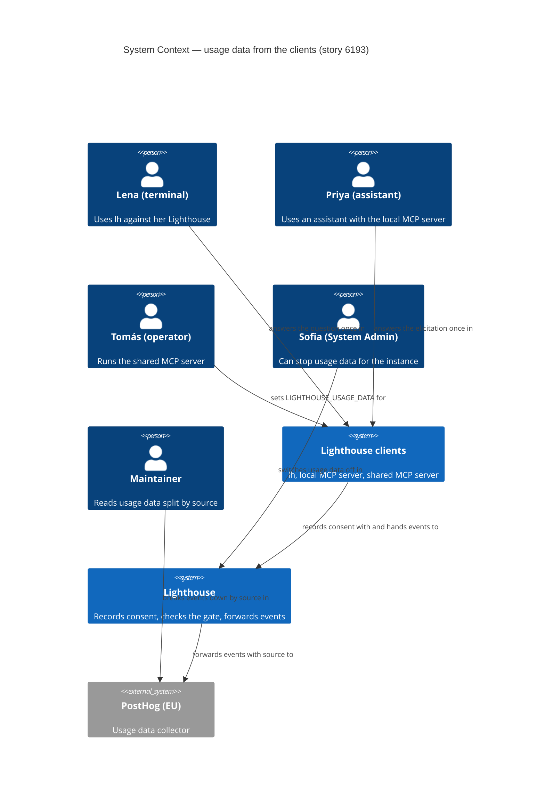
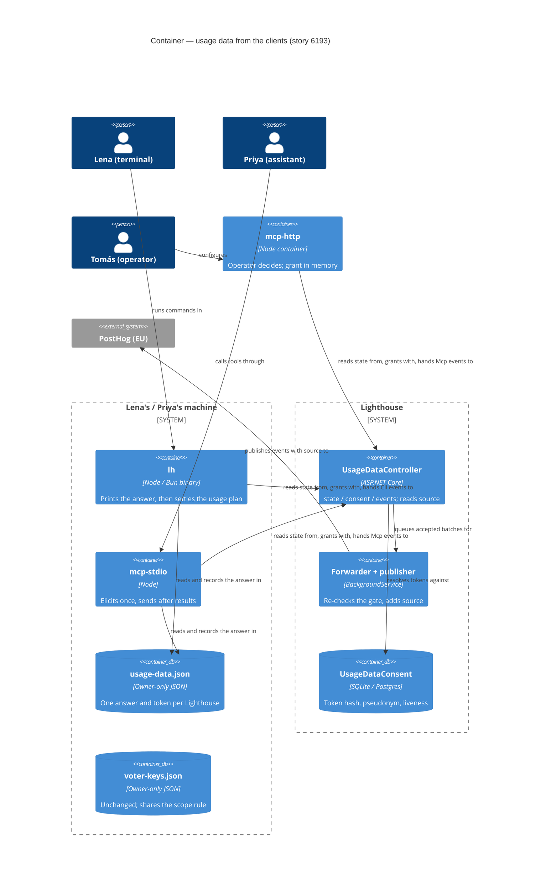
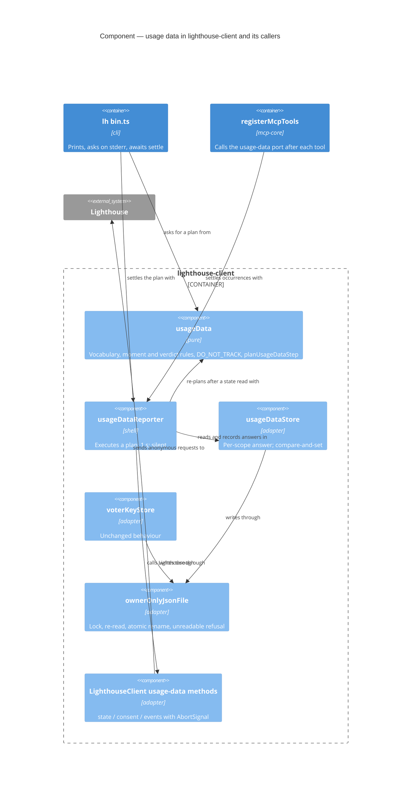

<!-- markdownlint-disable MD024 -->
# Feature Delta — story-6193-usage-data-from-clients

**ADO**: User Story #6193 — *Posthog Events for Clients* · no parent Epic.

**Waves**: DISCUSS (2026-10-08, maintainer AFK; product questions answered beforehand on 2026-10-06 and
2026-10-08 as M1–M11, every other call taken here is listed under "AFK defaults — revisit"). DISCOVER and
DIVERGE: none exist for this story; the maintainer's answers M1–M11 stand in for them.

**One line**: `lh` and the two MCP servers ask for the same opt-in the browser asks for, report the same
events the web reports when a person does the same thing from a terminal or an assistant, and every event —
the browser's included — now says which of the three it came from (`Browser`, `Cli`, `Mcp`).

**Repositories**: Lighthouse (backend `source` property, usage data docs) and
`/storage/repos/lighthouse-clients` (packages `client`, `cli`, `mcp-core`, `mcp-stdio`, `mcp-http`). This
workspace lives in the Lighthouse repo because the clients repo has no feature workspace (story #6218's
precedent).

**Density**: `lean` + `ask-intelligent` (DISCUSS default). Tier-1 `[REF]` only; trigger evaluation at the
end of DoR Validation.

---

## Wave: DISCUSS / [REF] Prior-Wave Reading

| File | Read |
|---|---|
| `docs/product/jobs.yaml` | ✓ — the epic-5733 jobs are reused; one operator job added (see JTBD) |
| `docs/product/personas/privacy-decider.yaml`, `platform-operator.yaml`, `lighthouse-maintainer.yaml` | ✓ |
| `docs/product/journeys/` | ✓ — no client-consent journey exists; one created |
| `docs/feature/story-6193-usage-data-from-clients/discover/`, `diverge/` | ⊘ none; M1–M11 are the maintainer's product answers |
| `docs/feature/epic-5733-opt-in-usage-data/feature-delta.md` (personas, jobs, S1–S14, D1–D4) and `slices/` | ✓ |
| ADR-190 (browser detects, backend forwards), ADR-191 (pseudonym on the consent row), ADR-173 (liveness window), ADR-216 §4 (declared channel enum) | ✓ |
| `Lighthouse.Backend/.../API/UsageDataController.cs`, `API/DTO/UsageDataEventBatchDto.cs`, `Models/UsageData/{UsageDataEventName,UsageDataState}.cs`, `Services/Implementation/UsageData/{UsageDataConsentService,UsageDataMasterSwitch}.cs` | ✓ |
| `docs/settings/usagedata.md`, `docs/_config.yml` | ✓ |
| `Lighthouse.Frontend/src/components/UsageData/UsageDataDialog.tsx` and every `reportUsage(...)` call site | ✓ |
| `lighthouse-clients/ARCHITECTURE.md` (§2, §5, §6), `packages/client/src/voterKeyStore.ts`, `packages/cli/src/{index.ts,refinementCommands.ts}`, `packages/mcp-core/src/{index.ts,refinementTools.ts}`, `packages/mcp-stdio/src/runtime.ts`, `packages/mcp-http/{src/bin.ts,README.md}`, every `package.json` | ✓ |
| `docs/feature/story-6218-readable-cli-output/feature-delta.md` | ✓ — house format for a no-Epic clients story; its usage-data forward pointer to #6193 |
| `.claude/commands/` nw-discuss override | ⊘ none exists; the project checklist is `CLAUDE.md` "DISCUSS, DEVOPS & DELIVER Waves", answered below |

No DISCOVER evidence to contradict. One assumption from epic-5733 changes and is written up under Changed
Assumptions: the consent unit is no longer only "a browser".

---

## Wave: DISCUSS / [REF] Persona IDs

| Persona | Role here |
|---|---|
| `privacy-decider` | **Primary actor.** Lena Fischer (delivery lead, Ocean Explorer) in a terminal, and Priya Raman (coach of Team Gravity) in Claude Desktop — each asked once whether their client may send usage data to `https://lighthouse.northwind.io`. |
| `lighthouse-maintainer` | **Primary beneficiary.** Reads every event split by `source` and learns whether `lh` and the MCP servers are used at all, and for what. |
| `platform-operator` | Tomás Rivera, runs the shared `mcp-http` container for Northwind; decides for that server with one environment variable (M8). |
| `config-admin` | Sofia Keller, System Admin of Northwind's Lighthouse; her existing *Never send usage data* switch now also silences every client (M6). Unchanged control. |

---

## Wave: DISCUSS / [REF] JTBD One-Liner

| Job ID | One-liner | Stories |
|---|---|---|
| `job-maintainer-know-if-a-shipped-feature-landed` (existing, epic-5733) | When I have shipped a feature, I want to see whether anyone turned it on and kept using it, so I can decide to invest further, fix it, or retire it. **Here**: including when they use it from `lh` or an assistant, and telling those apart. | US-01, US-04 |
| `job-user-decide-once-whether-lighthouse-may-learn-from-me` (existing, epic-5733) | When Lighthouse asks to send usage data, I want to see exactly what would leave my machine and decide once, so I can help without feeling watched — and change my mind later without hunting for the setting. **Here**: in a terminal and in an assistant, not only in a browser. | US-02, US-03, US-05 |
| `job-operator-decide-usage-data-for-a-shared-mcp-server` (**NEW**, appended to `jobs.yaml`) | When I run one MCP server that many people's assistants share, I want to decide once, in the deployment, whether it sends usage data, so the server follows my organisation's policy without anyone being prompted. | US-06 |

- **Functional**: one opt-in per Lighthouse per person per machine (`lh` and the local MCP server share it);
  the web's events, reported from the client that did the thing; a `source` on every event.
- **Emotional**: from "does this CLI phone home?" to "it asked once, in plain words, and I can check what I
  said".
- **Social**: a maintainer who can say *how* Lighthouse is used, not only *whether*, and engineers who can
  show their security team that `lh` sends nothing without a yes.
- **Forces** — *Push*: the clients send nothing, so the maintainer cannot tell whether two shipped packages
  (`lh`, MCP) are used, and story #6218 had to order its slices by guesswork (its KPI-4 "deferred to
  #6193"). *Pull*: the pipe, the gate, the closed vocabulary and the docs page already exist for the
  browser (ADR-190). *Anxiety*: a CLI that prompts inside a script, or that an agent switches on for the
  person; a hosted server sending for people who were never asked; an `lh` event counted as a browser one.
  *Habit*: CLIs that track by default with an opt-out buried in an env var.
- **Opportunity (new job, desk estimate)**: importance 3, satisfaction 1, gap 2 — a hosted MCP server is a
  minority deployment today; nothing serves the job at all.

**JTBD-to-story bridge**: US-01/US-04 → maintainer job; US-02/US-03/US-05 → privacy-decider job; US-06 →
the new operator job.

---

## Wave: DISCUSS / [REF] Current-State Surface Inventory

Read from the code on 2026-10-08.

| # | Fact | Evidence |
|---|---|---|
| S1 | **The ingest endpoint takes closed enums only** and answers `204` whether or not the batch is used; an unreadable body is the one `400`. Today's DTO has no field naming the surface. | `API/UsageDataController.cs` `HandInEvents`, `AsTakenIn`; `API/DTO/UsageDataEventBatchDto.cs` |
| S2 | **The consent endpoints are anonymous and token-based** — `GET state`, `POST consent` (`granted`/`declined` → a token), `DELETE consent`, `POST asked`, all keyed by the `X-Lighthouse-UsageData-Token` header. Nothing ties them to a browser; any HTTP client can use them. | `UsageDataController.cs:25-120` |
| S3 | **`state` already carries what a client needs before asking**: `MayAsk` (false under the veto, on a young install, after a final refusal) and `AdministratorDisabled`. | `Models/UsageData/UsageDataState.cs`; `UsageDataConsentService.MayAsk` |
| S4 | **A grant expires unless it is seen**: the gate requires `LastSeenAt` inside the 30-day liveness window; a row left unseen ages out. | ADR-190 §2; `docs/settings/usagedata.md:228-234` |
| S5 | **The pseudonym is minted on the consent row** on a grant, never on a refusal, never on the wire; a re-grant mints a new one. | ADR-191 §1–§4; `UsageDataConsentService.RecordDecisionAsync` |
| S6 | **The web reports after the server answered**, not when asked ("Reporting the asking would count somebody typing a number into a box"). | `TeamForecastView.tsx:207-209`, `ForecastRealityCheck.tsx:49-53` |
| S7 | **A vote's `sizingMoment` comes from the Team's Refinement read** (`nextRefinementDate`, `isRefinementDay`), not from a clock; `TeamSizingReadinessReached` comes from the vote answer's `madeReady`. | `useVoteCasting.ts:45-54,110-122` |
| S8 | **The clients already declare a closed channel on votes**: `lh` sends `Cli`, the MCP tools `Assistant` — "documented as declared, not verified: analytics and display, not a security boundary". | `cli/src/refinementCommands.ts:65`, `mcp-core/src/refinementTools.ts:65`; ADR-216 §4 |
| S9 | **The clients already keep one secret per Lighthouse, shared by `lh` and the local MCP server**: `voter-keys.json` beside the CLI config, owner-only, one writer at a time, scoped so `HTTPS://X:443/` and `https://x/api` are one Lighthouse, `standalone` for the desktop app. | `client/src/voterKeyStore.ts` |
| S10 | **What the clients can do** — `lh`: team/portfolio create, delete, refresh; forecast manual, backtest; refinement get, vote, comment, take-back; reads. MCP: team/portfolio refresh, forecast manual/backtest, refinement get/vote/comment/take-back, reads — **no create or delete**. Neither has a reality check, a connection set-up, a settings switch or a tab. | `cli/src/index.ts` group handlers; `mcp-core/src/index.ts:104-150` |
| S11 | **`mcp-http` serves one Lighthouse per process**, configured by environment (`LIGHTHOUSE_URL`, `LIGHTHOUSE_API_KEY`, `LIGHTHOUSE_OAUTH_*`). The Lighthouse chart runs it (`mcp.enabled`) and has **no extra-env passthrough**. | `mcp-http/README.md:25-31`, `src/bin.ts:394`; `chart/templates/mcp.yaml` |
| S12 | **No client supports MCP elicitation yet**; the SDK in use (`@modelcontextprotocol/sdk` ^1.26) does. | `mcp-*/package.json`; no `elicit` in `packages/*/src` |
| S13 | **The docs page promises browser-only facts**: "No event is sent unless a browser on that instance holds live consent", a field named "Browser identifier", "Counting browsers, not installations", "Your browser never contacts the collector". | `docs/settings/usagedata.md:33,81,151,178` |
| S14 | **The docs URL** is `https://docs.lighthouse.letpeople.work/settings/usagedata.html` — `url:` in `docs/_config.yml:5` plus the page path, and the same constant the web dialog links. | `docs/_config.yml:5`; `Lighthouse.Frontend/src/models/UsageData/UsageData.ts:143` |
| S15 | **ASP.NET's JSON reader ignores a property it does not know.** A client that sends `source` to a Lighthouse that predates this story would be read without it — and counted as a browser. | System.Text.Json default; S1's DTO |

---

## Wave: DISCUSS / [REF] Locked Decisions

### D0 — Wave decisions

DISCOVER and DIVERGE: none (M1–M11 are the maintainer's answers). Feature type: cross-cutting (backend +
three client surfaces), user-facing in the terminal and the assistant. Walking skeleton: Depends →
strategy C (the pipe exists). UX depth: lightweight. JTBD: yes.

### D1 — The maintainer's decisions, binding (2026-10-06 and 2026-10-08)

| # | Decision |
|---|---|
| M1 | `lh` asks **once per Lighthouse URL**, only on an interactive terminal, default **No**, in this copy, verbatim:<br>`May Lighthouse send usage data?`<br>`lh tells your Lighthouse which commands you use (never names, ids,`<br>`URLs or anything you typed), so we can see what helps.`<br>`Details: https://docs.lighthouse.letpeople.work/settings/usagedata.html`<br>`Send usage data from lh? [y/N]`<br>then, after the answer: `(change any time: lh config usage-data on\|off)` |
| M2 | `lh config usage-data on\|off` changes it; `lh config usage-data` prints the current answer for this Lighthouse and whether the instance allows usage data. |
| M3 | Stored per Lighthouse URL. |
| M4 | No terminal (scripts, CI) = never ask; off unless `lh config usage-data on` was run. |
| M5 | A No is final for that URL: never asked again; only the config command changes it. |
| M6 | Administrator stop (server veto) = no prompt at all and nothing sent. |
| M7 | MCP stdio asks once via **MCP elicitation** where the client supports it; otherwise it uses the stored answer (default off). |
| M8 | MCP HTTP: the **operator** decides with an environment variable (`LIGHTHOUSE_USAGE_DATA=on`), off by default, no per-user prompt. |
| M9 | Mirror **only** existing web events that have a matching client action. **No new event names.** |
| M10 | Every event carries `source` = `Browser` \| `Cli` \| `Mcp` — the browser's too — attached server-side from the channel the client declares; a closed enum, never free text. |
| M11 | Sequenced after story #6218; the maintainer releases separately — no release steps here. |

The docs URL in M1 is confirmed as S14's.

### D2 — The channel is declared once per batch, in the body, from a closed list

The posted batch gains one optional field, `source`, read as the closed enum `Browser | Cli | Mcp`. **Absent
means `Browser`**, so today's web — and any browser tab still holding an old bundle after an upgrade —
needs no change and is counted correctly. **Any other value is refused `400`**, the existing "unreadable
body" rule (S1): nothing but our own clients post here, so it is our bug. The server copies the value onto
every forwarded event as the property `source`.

Why the body and not a header: the body is already the one closed-vocabulary surface the controller checks
event by event (S1, ADR-190 §1); a header would be a second place a choice travels as a string. DESIGN may
choose otherwise if every AC still holds.

**Declared, not verified** — stated as ADR-216 §4 states it for vote channels (S8): a hand-written request
can claim any of the three. The dataset is advisory (ADR-190 §5); no control depends on `source`.

### D3 — A client never sends to a Lighthouse that cannot label it

S15: an `lh` event sent to an older Lighthouse would arrive without `source` and be counted as `Browser`,
corrupting the very split this story exists for. So a client asks and sends **only** when the Lighthouse's
`state` answer shows it understands `source` (slice 01 adds that signal; DESIGN picks its shape — e.g. a
boolean or a list of accepted sources). A Lighthouse that has no usage-data endpoints at all (`404`) or
lacks the signal: never asked, nothing sent, nothing printed. `lh config usage-data` says so (US-03).

### D4 — A client's consent uses the browser's endpoints, and its answer lives beside the voter keys

- **Yes**: `POST consent` with `granted` (S2) → a token. The token is stored for that Lighthouse in a file
  beside `voter-keys.json`, owner-only, one writer at a time, under the **same Lighthouse scope** as the
  voter key (S9) — so `lh` and the local MCP server hold **one answer and one token per Lighthouse per
  machine**, and therefore one pseudonym (S5). That is how M7's "stored answer" is shared.
- **Off after a yes**: `DELETE consent` with the token, then the stored answer becomes off and the token is
  forgotten. If the delete cannot reach the Lighthouse, the answer is still off and nothing more is sent; the
  orphan grant ages out (S4). `lh` says which happened.
- **No**: stored locally only — **nothing is posted** (no `declined` row). The web records a refusal so the
  server can stop re-asking; a client remembers that itself, so a row would be a record with no reader.
  *AFK default A2.*
- The token is a capability (it can revoke), so it never appears in any output, log or error.

### D5 — When `lh` asks

After the **first successful command that reaches that Lighthouse**, below its output and never inside it
(the prompt goes to the terminal, not to the command's output stream), when **all** hold: stdin and stdout
are terminals (M4); no answer is stored for that Lighthouse (M5); `DO_NOT_TRACK` is not set (D14); the
Lighthouse understands `source` (D3); and its `state` says `MayAsk` — so the veto (M6) and a freshly
installed instance are respected exactly as the web respects them (S3). Never during `lh config`,
`lh connection` or help. **`y` or `yes` (any case) is a yes; Enter or anything else is No (M1's default).**
Ctrl-C or end of input is **no answer**: nothing recorded, nothing sent, asked again on the next
interactive command. The command that prompted is **not** reported — nothing done before a yes is sent.
*AFK defaults A3–A5.*

### D6 — A yes outlives a long gap without asking again

S4: a grant not seen for 30 days stops counting and is pruned. A person who said yes and comes back after
six weeks has not changed their mind, so the client re-establishes its grant (keeping it alive when it can,
re-granting when the Lighthouse no longer recognises the token — a new pseudonym, as ADR-191 §4 does for a
re-consent) **without asking again**. DESIGN picks the mechanism (e.g. a `state` read when the grant was
last confirmed more than N days ago). *AFK default A6.*

### D7 — The administrator's stop wins everywhere

Under the veto (`AdministratorDisabled`): no prompt in `lh`, no elicitation in MCP stdio, `mcp-http` records
no grant, and Lighthouse's gate drops anything a client still posts from an earlier yes — the guarantee is
server-side, as it is for browsers (ADR-190 §2), so no client has to check before each command.
`lh config usage-data on` under the veto records nothing and says why, exit 0 (the web holds both buttons
under the veto for the same reason — "recording a refusal against something already stopped writes down a
decision nobody made"). `off` is always allowed. *AFK defaults A7–A8.*

### D8 — The event mapping (M9)

A client reports an event **after Lighthouse answered the action successfully**, as the web does (S6); a
refused or failed command reports nothing.

| # | Event | Web trigger | `lh` | MCP (stdio and http) |
|---|---|---|---|---|
| 0 | `TeamTabOpened` | a Team tab held 5 s | **N/A** — a command is not a page; the event's only property is a web page label | **N/A** — same |
| 1 | `PortfolioTabOpened` | a Portfolio tab held 5 s | **N/A** — same | **N/A** — same |
| 2 | `TeamCreated` | Team created | `lh team create` | **N/A** — no create tool (S10) |
| 3 | `TeamDeleted` | Team deletion confirmed | `lh team delete` | **N/A** — no delete tool |
| 4 | `PortfolioCreated` | Portfolio created | `lh portfolio create` | **N/A** — no create tool |
| 5 | `PortfolioDeleted` | Portfolio deletion confirmed | `lh portfolio delete` | **N/A** — no delete tool |
| 6 | `TeamManualForecastRun` | manual forecast answered | `lh forecast manual` | `lighthouse_forecast_manual` |
| 7 | `WorkTrackingSystemConnected` | connection set up | **N/A** — `lh worktracking` only lists and reads; `lh connection connect` connects `lh` to Lighthouse, a different thing | **N/A** — read tools only |
| 8 | `TeamRefreshTriggered` | Team refreshed by hand | `lh team refresh` | `lighthouse_team_refresh` |
| 9 | `PortfolioRefreshTriggered` | Portfolio refreshed by hand | `lh portfolio refresh` | `lighthouse_portfolio_refresh` |
| 10 | `OptionalFeatureToggled` | a System setting switched | **N/A** — no client command switches settings | **N/A** |
| 11 | `TeamForecastRealityCheckRun` | reality check answered | **N/A** — no client command calls `/forecast/reality-check`; `lh forecast backtest` is a different endpoint and the web reports no backtest event, so mapping it would be a new meaning under an old name (M9) | **N/A** — same for `lighthouse_forecast_backtest` |
| 12 | `TeamRefinementConfigured` | Refinement states chosen for a Team that had none | **N/A** — no client action sets Refinement up as such; `lh team update --payload-file` is a raw settings write, and telling a first set-up from an edit would need a before-read and a judgment the web makes from its form. *AFK default A9.* | **N/A** — no update tool |
| 13 | `TeamSizingVoteCast` (+ `sizingMoment`) | vote taken | `lh refinement vote` (not `comment`, not `take-back` — the web reports neither) | `lighthouse_team_refinement_vote` |
| 14 | `TeamSizingReadinessReached` (+ `sizingMoment`) | the vote made the Work Item Ready | `lh refinement vote` when the answer says `madeReady` | `lighthouse_team_refinement_vote`, same rule |
| 15 | `TeamRefinementDayVerdictShown` (+ `refinementVerdict`) | Refinement tab shows its verdict on a Refinement day | `lh refinement get` on a Refinement day with at least one Work Item listed; `None` when no number is shown; once per run | `lighthouse_team_refinement_get`, same rule; once per tool call. *AFK default A10.* |

**`lh`: 10 events. MCP: 6. N/A: 6, each with its reason.** No new name, no new property except `source`.

### D9 — A vote's moment is read, never guessed

S7: the web derives `sizingMoment` from the Team's Refinement read. A client does the same — after a
successful vote, and **only when usage data is on**, it reads the Team's Refinement and applies the same rule
(no next Refinement date → `NoCadence`; Refinement day → `OnRefinementDay`; else `OnOtherDay`). If that read
fails, the vote's events are **not sent** — the shape check refuses a vote without a moment, and a guessed
one would be false.

### D10 — Usage data never changes what a command or tool answers

A send never alters a command's output (any format), its exit code, or a tool's result; never prints an
error or a warning in `lh` or MCP stdio; and never makes a command wait more than **1 second** for it, even
when Lighthouse is slow or unreachable. *AFK default A11 (the number).*

### D11 — MCP stdio: elicitation once, otherwise the stored answer

On the first tool call that reaches a Lighthouse with no stored answer, where the MCP client declares the
elicitation capability (and D3, D7, D14 allow), the server asks once with M1's words adapted to the
assistant (copy proposed in the Journey, *AFK default A12*). **Accept with yes** → stored yes; **decline** →
stored No, final (M5); **cancel, close or time-out** → no answer, nothing sent, asked again next session. The
tool's own answer is never lost or altered by the question. A client without elicitation: the stored answer
only, off when there is none — so a person whose assistant cannot ask turns it on with
`lh config usage-data on` against the same URL (D4's shared store).

### D12 — MCP HTTP: the operator's variable, held in memory

`LIGHTHOUSE_USAGE_DATA=on` (any case) turns it on; unset, `off` or anything else is off. A non-empty value
other than `on`/`off` logs **one** warning at start-up and stays off — a typo never breaks a deployment.
Start-up logs one line saying whether usage data is on. The grant is requested on the first event, **held in
memory only** (never on disk), and not requested under the veto; a restart is a new grant and a new
pseudonym, and the old row ages out (S4). The unit counted is **one server process shared by its callers**;
the docs say so. The chart cannot pass the variable today (S11): chart users stay off until a chart value
exists — *AFK default A13, follow-up*.

### D13 — Every event carries `source`, and the docs page says what it is

The usage data page gains `source` in the "Every event carries these" table (three values, attached by your
server from what the client declared), and every browser-only promise in S13 is rewritten for "a browser,
`lh`, or an MCP server" in the slice that first makes it false (slice 02), with `mcp-http`'s
operator-decided, per-process unit stated plainly (slice 05).

### D14 — `DO_NOT_TRACK=1` is honoured by every client

The cross-tool convention: when it is set to `1`, no client asks, records or sends — it overrides a stored yes
and `LIGHTHOUSE_USAGE_DATA=on`. `lh config usage-data` says it is in force. *AFK default A14.*

### D15 — An agent never answers for the person

Non-terminal runs never prompt (M4), so an agent driving `lh` is never asked. The clients' `skill/SKILL.md`
gains one rule: never run `lh config usage-data on|off` unless the user asked for exactly that.

### D16 — No new events; #6218's KPI-4 stays deferred

M9 rules out the candidate #6218 recorded (a per-command event with the output format as a property). Its
KPI-4 ("share of `--pretty` invocations") therefore stays unmeasured; `source` answers only "terminal or
assistant or browser".

### D17 — Versioning

Lighthouse: no versioning step (calver at release, M11). Clients, one changeset per slice: **minor**
`lighthouse-client` (consent store, reporter) and **minor** `lighthouse-cli` in slices 02–03; **minor**
`lighthouse-mcp-core` and `lighthouse-mcp-stdio` in slice 04; **minor** `lighthouse-mcp-http` in slice 05;
the automatic patch for dependents. Not a major: nothing is sent and nothing is asked unless the person, or
the operator, says yes; every output and exit code is unchanged (D10).

### D18 — One Story, five slices, no Epic

The work is one ADO Story with no parent. `CLAUDE.md`'s "each Epic ships on its own" is **N/A, because**
there is no Epic split — but each slice is releasable alone and adds value even if no later slice ships;
dependencies point one way (02 on 01; 03 on 02; 04 on 02; 05 on 04).

---

## Wave: DISCUSS / [REF] Project DISCUSS Checklist (CLAUDE.md)

No silent N/A — every item answered.

| Item | Answer |
|---|---|
| **RBAC impact** | **N/A, because** the consent and ingest endpoints are anonymous by design (`[AllowAnonymous]`, S2) and stay so; a client calls them exactly as a browser does, with no role involved. `source` is attached server-side and grants nothing. The veto remains the existing System Admin optional-feature switch, unchanged. Nothing touches `IRbacAdministrationService` or `useRbac()`. |
| **Lighthouse-Clients CLI/MCP versioning** | **Applies** — D17. `pnpm release:version` and its commit before the releasing push are the maintainer's (M11), as are the pending #6218 changesets that ride in the same release if it comes first. MCP behaviour changes (elicitation, events), hence minors. |
| **Website marketing surface** | **Verify at DELIVER, no copy expected.** The website repo is outside this session's readable roots. Slice 02's DELIVER greps it for "telemetry", "usage data", "tracks" and "phone home" near `lh`/CLI/MCP claims and either fixes or lists each hit; "no hit" is recorded otherwise. The marketing claim to protect is the docs page's: nothing is sent without a yes. |
| **Usage data (DEVOPS question, forward pointer)** | **Answered by `source` itself**: the events that show the feature is used are the existing mirrored events with `source` = `Cli` or `Mcp` (KPI-2). No new event, no new `UsageDataEventName` member (M9); `docs/settings/usagedata.md` gains the `source` row in slice 01 and the client wording in slice 02 (D13). |
| **Terminology** | **Applies lightly.** The docs rows and client copy use the seeded words (`Team`, `Portfolio`, `Work Item`, `Refinement`); event names are code identifiers, not configurable words. M1's approved copy names no configurable term. |
| **Sketch any UI before building it** | **Applies to new copy only.** M1's prompt is approved verbatim. The `lh config usage-data` lines, the MCP elicitation text and the `mcp-http` start-up line are proposed in the Journey below (A12, A15) and are walked through with the maintainer **at the start of DISTILL**, one decision at a time, before scenarios pin them. |
| **Docs / screenshots / demo data at finalization** | Docs: **applies** — `docs/settings/usagedata.md` (slices 01, 02, 05 — D13), `docs/aiintegration.md` (one paragraph: the clients ask, link to the page; slice 02), clients `packages/cli/README.md` (prompt + `lh config usage-data`), `mcp-stdio/README.md` (elicitation, shared answer), `mcp-http/README.md` (`LIGHTHOUSE_USAGE_DATA` row), `skill/SKILL.md` (D15), clients `ARCHITECTURE.md` §5 (the consent store beside the voter keys). Lighthouse `ARCHITECTURE.md`: the usage-data concept now names three sources (slice 01). Screenshots: **N/A, because** no web screen changes. Demo data: **N/A, because** nothing seeded changes. |
| **Release notes** | The maintainer's (M11). Proposed for him: one Lighthouse line ("usage data now says whether an event came from the browser, `lh` or an assistant") and the clients' CHANGELOG via changesets. |

---

## Wave: DISCUSS / [REF] Scope Assessment

**PASS — right-sized.** 6 stories (threshold >10); 2 bounded contexts — the backend usage-data pipe and the
clients' Lighthouse-calling layer (threshold >3); integration points per slice ≤ 3 — `state`, `consent`,
`events` (threshold >5); ~3½ days of crafter dispatch (threshold >2 weeks). One signal fires — the four
surfaces could ship separately — and that is the slicing, not a reason to split into Epics (D18).

---

## Wave: DISCUSS / [REF] WS Strategy

**C — no walking skeleton.** Brownfield: the consent endpoints, the gate, the closed DTO, the forwarder and
the docs page all ship today (ADR-190). Slice 02 is the thinnest end-to-end client path (ask → grant → one
event → PostHog with `source=Cli`) and lands the shared consent store the later slices reuse.

---

## Wave: DISCUSS / [REF] Journey (lightweight)

**Decide once from the terminal, then forget about it** — persona `privacy-decider`, job
`job-user-decide-once-whether-lighthouse-may-learn-from-me`. Full schema:
`docs/product/journeys/story-6193-usage-data-from-clients.yaml`.

```text
[use lh as usual]            [asked once]                   [carry on]                 [check / change]
lh forecast manual …   →     May Lighthouse send usage   →  lh team refresh --id 3  →  lh config usage-data
the forecast, as today       data? … [y/N]  y               output unchanged;          on · allowed
                             (change any time: …)           event sent, source=Cli     lh config usage-data off
  Feels: busy                  Feels: wary → respected        Feels: unbothered          Feels: in control
```

- **Emotional arc**: wary → respected → unbothered → in control. The peak tension is the question; it is
  short, says what is never sent, defaults to No, and is never repeated.
- **Shared artifacts**: `${lighthouse_url}` (source: the connection `lh` resolved; scoped by the voter-key
  rule, S9), `${docs_url}` (source: `docs/_config.yml:5` + page path, S14; the web's constant is the same
  value), `${stored_answer}` and `${consent_token}` (source: the one per-Lighthouse store, D4), `${may_ask}`
  and `${administrator_disabled}` (source: `GET state`, S3), `${source}` (source: the client's declared
  constant, D2). Registry: the journey YAML's `shared_artifacts`.
- **Error paths**: Lighthouse unreachable at ask time → no prompt, asked next time. `state` says
  `MayAsk: false` → no prompt. Grant request fails after a yes → `lh` prints one line ("Could not record your
  answer at https://…; nothing is sent. Try lh config usage-data on.") and stores nothing. Store file
  unreadable → never written over (the voter-key rule), no prompt, nothing sent. Older Lighthouse → no
  prompt, nothing sent (D3).

### Proposed copy (AFK — walked through at the start of DISTILL)

```text
$ lh config usage-data
Usage data from lh to https://lighthouse.northwind.io: on
This Lighthouse allows usage data.

$ lh config usage-data off
Usage data from lh to https://lighthouse.northwind.io: off. Nothing more is sent.

$ lh config usage-data on
Usage data from lh to https://lighthouse.northwind.io: on.
Details: https://docs.lighthouse.letpeople.work/settings/usagedata.html
```

Answer line: `on` · `off` · `not asked yet (off)`. Instance line: `This Lighthouse allows usage data.` ·
`This Lighthouse's administrator has stopped usage data, so nothing is sent.` · `This Lighthouse does not
take usage data from lh (it predates it).` · `Could not ask this Lighthouse whether it allows usage data.`
Under the veto, `on` answers `This Lighthouse's administrator has stopped usage data; nothing was changed.`
With `DO_NOT_TRACK=1`: `DO_NOT_TRACK is set, so lh sends no usage data whatever is stored.`

MCP elicitation (stdio):

```text
May Lighthouse send usage data?
The Lighthouse MCP server tells your Lighthouse which tools you use (never names,
ids, URLs or anything you typed), so we can see what helps.
Details: https://docs.lighthouse.letpeople.work/settings/usagedata.html
[ Send usage data ]  [ No ]
(change any time: lh config usage-data on|off)
```

`mcp-http` start-up line: `Usage data: on (LIGHTHOUSE_USAGE_DATA)` · `Usage data: off`.

---

## Wave: DISCUSS / [REF] Driving Ports

| Surface | Change |
|---|---|
| `POST /api/latest/usagedata/events` | Optional batch field `source` (`Browser`\|`Cli`\|`Mcp`); absent = `Browser`; other values `400` (D2). |
| `GET /api/latest/usagedata/state` | A signal that this Lighthouse understands `source` (D3); otherwise unchanged. |
| `POST`/`DELETE /api/latest/usagedata/consent` | **None** — used by clients as by browsers (D4). |
| PostHog payload | Property `source` on every event (M10). |
| `lh` (any command reaching a Lighthouse) | The one-time question (D5); events after success (D8). Output and exit codes unchanged (D10). |
| `lh config usage-data [on\|off]` | New (M2). |
| MCP tools (stdio) | One-time elicitation (D11); events after success. Results unchanged. |
| `mcp-http` environment | `LIGHTHOUSE_USAGE_DATA` (D12). |
| `@letpeoplework/lighthouse-client` exports | The per-Lighthouse usage-data store (beside the voter-key store) and a reporter the CLI and MCP share. |
| Lighthouse web | **None** visible; the browser keeps sending no `source` and is counted `Browser`. |

---

## Wave: DISCUSS / [REF] Pre-requisites

- **The usage-data pipe** (Epic #5733, slices 01a–04 + #5980): in `main`. Satisfied.
- **Story #6218** (readable CLI output) is done per M11; this story touches `cli/src/index.ts` dispatch and
  the write/refresh confirmations' call sites, not their wording.
- **Legal reading**: epic-5733 D2 put the per-browser token under the strictly-necessary exemption (its
  DoR-9). A client's stored token is the same thing — the person's own answer, written only after they gave
  it. `mcp-http`'s operator decision is a different basis; see the open question below.
- **Nothing else in flight** touches `UsageDataController`, the DTO or the PostHog publisher.

---

## Wave: DISCUSS / [REF] Out of Scope

- **New events or properties** beyond `source` (M9) — including #6218's output-format idea (D16).
- **New client commands** to make an N/A row mappable (a reality-check command, a connection set-up, a
  settings switch).
- **A chart value** for `LIGHTHOUSE_USAGE_DATA` (D12, A13) — a follow-up in the chart.
- **Per-user consent on `mcp-http`** (M8).
- **An environment variable for `lh` or MCP stdio** to answer the question (M4 keeps `lh config` the only
  way, besides `DO_NOT_TRACK`).
- **Erasure on request**, a consent history, or showing the pseudonym — unchanged from epic-5733.
- **Changing the web dialog or footer** — the browser's experience is unchanged.

---

## Wave: DISCUSS / [REF] System Constraints (all stories)

1. Nothing leaves a client unless that Lighthouse holds a live grant for it, the Lighthouse is not vetoed,
   and `DO_NOT_TRACK` is not set — the gate is the server's (ADR-190 §2), the asking is the client's.
2. Closed vocabulary only: event names from `UsageDataEventName`, properties from their closed enums,
   `source` from three values. No id, name, URL, path, count, or typed text — the same DTO, no new free
   field (ADR-190 §1).
3. The consent token never appears in output, logs, errors or the collector; the pseudonym never leaves
   Lighthouse (ADR-191 §2).
4. A usage-data send never changes a command's output, exit code or a tool's result, and never adds more than
   1 s (D10).
5. A client asks at most once per Lighthouse per machine; a No is final (M5).
6. No prompt without a terminal; no elicitation without the capability (M4, M7).
7. A client event is never counted as `Browser` (D3).

---

## Wave: DISCUSS / [REF] User Stories

### US-01 — Every usage event says where it came from

`job_id`: `job-maintainer-know-if-a-shipped-feature-landed` · persona `lighthouse-maintainer` · slice 01 ·
~5h · repo Lighthouse

#### Problem

The maintainer ships `lh` and two MCP servers beside the web, and reads usage data to decide where to spend
time. Today every forwarded event looks the same whatever produced it, and nothing but the browser can send
one. Once the clients send, a `TeamManualForecastRun` from `lh` and one from the Forecast tab would be
indistinguishable — so "is the CLI used?" would still be unanswerable, and worse, the web's numbers would be
inflated by it.

#### Elevator Pitch

```text
Before: a forwarded event names what happened and nothing about which surface did it.
After:  POST /api/latest/usagedata/events with "source": "Cli" and a live token → the event PostHog
        receives carries "source": "Cli"; today's browser batch (no source) arrives with
        "source": "Browser"; "source": "Shell" is answered 400; GET /api/latest/usagedata/state
        tells a client this Lighthouse understands source.
Decision enabled: the maintainer can split every event by surface, and trusts that a Browser count
        is browsers only.
```

#### Domain Examples

1. **Browser, unchanged** — Priya opens Gravity's Forecast tab on the dogfood instance and runs a forecast;
   the forwarded `TeamManualForecastRun` carries `source: Browser` beside version, deployment mode, tier and
   authentication.
2. **A client declares itself** — a batch with `source: Cli` holding `TeamRefreshTriggered` under a live
   grant is forwarded with `source: Cli`.
3. **Unknown value** — a batch declaring `source: "Shell"` (or `7`) is refused `400`; nothing is queued.
4. **Vetoed** — Sofia has switched on *Never send usage data*; a `source: Mcp` batch gets `204` and nothing
   is forwarded, exactly as a browser batch.
5. **The page says it** — `docs/settings/usagedata.md` lists `Source` with `Browser`, `Cli`, `Mcp`.

#### UAT Scenarios (BDD)

```gherkin
Scenario: A browser's events are labelled as coming from the browser
  Given Priya's browser holds a live grant on Northwind's Lighthouse
  When her browser hands in a TeamManualForecastRun without saying where it came from
  Then the event forwarded to the collector carries source "Browser"

Scenario: A client's events carry the source it declared
  Given a live grant on Northwind's Lighthouse
  When a batch declaring source "Cli" hands in TeamRefreshTriggered
  Then the event forwarded to the collector carries source "Cli"
  And a batch declaring source "Mcp" is forwarded with source "Mcp"

Scenario: A source outside the list is refused
  When a batch declares source "Shell"
  Then Lighthouse answers 400
  And nothing from that batch is forwarded

Scenario: The administrator's stop holds for every source
  Given Sofia has switched on "Never send usage data"
  When a batch declaring source "Cli" arrives with a token that was granted earlier
  Then Lighthouse answers 204
  And nothing is forwarded

Scenario: A client can tell this Lighthouse understands sources
  When a client reads the usage data state of Northwind's Lighthouse
  Then the answer shows that this Lighthouse labels events by source
```

#### Acceptance Criteria

- [ ] AC-01.1 — Every forwarded event carries `source`; a batch without one is `Browser`.
- [ ] AC-01.2 — `Cli` and `Mcp` are carried as declared; any other value or type is `400` and nothing is
  queued.
- [ ] AC-01.3 — The veto, a missing/unknown/revoked/stale token: `204`, nothing forwarded, whatever the
  source (ADR-190 §2 unchanged).
- [ ] AC-01.4 — `state` carries the "understands source" signal; its other fields unchanged.
- [ ] AC-01.5 — `docs/settings/usagedata.md` lists `Source` with its three values in "Every event carries
  these"; the docs-parity test covers it.
- [ ] AC-01.6 — **Production data**: on the dev instance pointed at a capture stub
  (`UsageData:CollectorBaseUrl`), a real web forecast arrives with `source: Browser`.

#### Outcome KPIs

- **Who**: the maintainer. **Does what**: splits each event by surface. **By how much**: 100% of forwarded
  events carry `source` (from 0%). **Measured by**: the publisher payload test + a PostHog breakdown on
  release day. **Baseline**: 0%.

#### Technical Notes

- The DTO's nullable-enum rule applies (ADR-190 §1, `csharpsquid:S6964`; no `[JsonRequired]`).
- `source` joins the server-attached properties (ADR-190 §6); it is not an instance fact — DESIGN decides
  where it is carried from accept to drain.
- ADR-190 says "nothing but our own page posts here" and ADR-191 calls the unit a browser: DESIGN amends both
  by a new ADR rather than editing them.

---

### US-02 — `lh` asks once, and remembers the answer for that Lighthouse

`job_id`: `job-user-decide-once-whether-lighthouse-may-learn-from-me` · persona `privacy-decider` (Lena
Fischer) · slice 02 · ~5h · repo clients

#### Problem

Lena Fischer leads delivery for Ocean Explorer and asks Gravity's forecast from her terminal before the
Thursday steering meeting. `lh` sends nothing today and cannot, so Lighthouse cannot learn that she uses it.
If it started sending, she would expect to be asked first — once, in plain words, and never inside a script
her CI runs.

#### Elevator Pitch

```text
Before: lh never asks and never sends; nothing tells Lighthouse that lh is used.
After:  run `lh forecast manual --team-id 3 --remaining 25` in a terminal for the first time against
        https://lighthouse.northwind.io → sees the forecast, then "May Lighthouse send usage data?",
        the two approved lines, "Details: https://docs.lighthouse.letpeople.work/settings/usagedata.html",
        "Send usage data from lh? [y/N]"; answers y → sees "(change any time: lh config usage-data on|off)".
Decision enabled: Lena decides once whether her use of lh may help improve Lighthouse.
```

#### Domain Examples

1. **Yes** — Lena, first `lh forecast manual --team-id 3 --remaining 25` against Northwind; answers `y`. Her
   next `lh forecast manual` sends `TeamManualForecastRun`, `source: Cli`; she is never asked again there.
2. **Enter (No)** — Marco Bianchi presses Enter; nothing is posted, `No` is stored for Northwind; a week
   later `lh team list` asks nothing.
3. **Script** — Sofia's nightly job runs `lh team refresh --id 3` with no terminal; no prompt, nothing sent,
   ever, until someone runs `lh config usage-data on` on that machine.
4. **Second Lighthouse** — Lena connects to `http://localhost:5169` (her dev instance); she is asked once
   there too; Northwind's answer is untouched.
5. **Vetoed** — Sofia has switched on *Never send usage data* at Northwind: Lena's first command prints only
   its answer.
6. **Ctrl-C** — Tomás presses Ctrl-C at the question: nothing stored, nothing sent, asked next time.

#### UAT Scenarios (BDD)

```gherkin
Scenario: Lena is asked once, after her answer, and her yes is kept
  Given Lena has never answered for https://lighthouse.northwind.io
  When she runs lh forecast manual --team-id 3 --remaining 25 in a terminal
  Then she sees the forecast first and then the approved question, defaulting to No
  When she answers y
  Then she sees "(change any time: lh config usage-data on|off)"
  And her next lh forecast manual reports TeamManualForecastRun with source Cli
  And she is never asked again for that Lighthouse

Scenario: Pressing Enter is a final No
  Given Marco has never answered for Northwind's Lighthouse
  When he presses Enter at the question
  Then nothing is posted to Lighthouse and nothing is sent afterwards
  And no later command asks him again for that Lighthouse

Scenario: A script is never asked
  Given lh runs without a terminal in Sofia's nightly job
  When it runs lh team refresh --id 3
  Then no question is printed and nothing is sent

Scenario: The administrator's stop means no question
  Given Northwind's administrator has stopped usage data
  When Lena runs her first lh command against it in a terminal
  Then she is not asked and nothing is sent

Scenario: Each Lighthouse gets its own question
  Given Lena said yes for Northwind
  When she runs her first command against http://localhost:5169 in a terminal
  Then she is asked for that Lighthouse
  And her answer for Northwind is unchanged

Scenario: Usage data never changes the command's own answer
  Given Lena said yes and Northwind is slow to take usage data
  When she runs lh forecast manual --team-id 3 --remaining 25 --json
  Then the output and exit code are those she would get with usage data off
  And the command waits at most 1 second longer
```

#### Acceptance Criteria

- [ ] AC-02.1 — The question is M1's copy verbatim, after the command's output, only under D5's conditions;
  `y`/`yes` (any case) = yes; anything else = No; Ctrl-C/EOF = no answer.
- [ ] AC-02.2 — A yes grants against the Lighthouse and stores the token for that Lighthouse's scope (D4); a
  No stores No and posts nothing.
- [ ] AC-02.3 — Never asked again once answered (M5); never asked without a terminal (M4); never under the
  veto, on a young install, or against a Lighthouse that does not understand `source` (D3, D5).
- [ ] AC-02.4 — The command that prompted is not reported; the next successful `lh forecast manual` is, with
  `source: Cli`.
- [ ] AC-02.5 — Output in every format and exit code unchanged; ≤ 1 s added (D10); the token never printed.
- [ ] AC-02.6 — A yes outlives a 31-day gap without a new question (D6).
- [ ] AC-02.7 — **Production data**: on the dev instance (capture stub), Lena's real forecast against a real
  Team arrives as `TeamManualForecastRun`, `source: Cli`, with the instance properties.

#### Outcome KPIs

- **Who**: people using `lh` in a terminal. **Does what**: answer once and are not asked again. **By how
  much**: 0 repeat questions per Lighthouse per machine; 0 questions in non-terminal runs. **Measured by**:
  the slice's acceptance tests. **Baseline**: n/a (nothing asked today).

#### Technical Notes

- The store mirrors `voterKeyStore.ts` (one writer at a time, atomic write, owner-only, never overwrite an
  unreadable file) and its scope rule; whether it is a second file or the same file is DESIGN's.
- `DO_NOT_TRACK=1` (D14) checked before anything else.
- Telling "a terminal" apart is stdin and stdout both being TTYs (D5).

---

### US-03 — Check or change the answer with `lh config usage-data`

`job_id`: `job-user-decide-once-whether-lighthouse-may-learn-from-me` · persona `privacy-decider` (Lena
Fischer, Sofia Keller) · slice 02 · ~2h · repo clients

#### Problem

The privacy-decider's recorded frustration: "A control I agreed to once becomes impossible to find when I want
to change it." Lena said yes on Monday; on Friday her security team asks what `lh` sends. Sofia wants her CI
machine to send, which it never will without being told (M4).

#### Elevator Pitch

```text
Before: there is no way to see or change what lh would send.
After:  run `lh config usage-data` → sees "Usage data from lh to https://lighthouse.northwind.io: on" and
        "This Lighthouse allows usage data."; `lh config usage-data off` → sees "… off. Nothing more is
        sent."
Decision enabled: Lena checks what she agreed to and withdraws it; Sofia turns it on for a CI machine.
```

#### Domain Examples

1. **Check** — Lena: `on` / `This Lighthouse allows usage data.`
2. **Withdraw** — Lena runs `off`: the grant is revoked at Northwind, the token forgotten, nothing more sent.
3. **CI opts in** — Sofia runs `lh config usage-data on` on the build agent: granted without a question; the
   nightly `lh team refresh --id 3` now reports `TeamRefreshTriggered`, `source: Cli`.
4. **Offline withdraw** — Lena runs `off` on a train: stored off, nothing sent; `lh` says the Lighthouse could
   not be told and the grant will lapse by itself.
5. **Vetoed** — at Northwind under the veto, `on` changes nothing and says why; `lh config usage-data` names
   the administrator's stop.

#### UAT Scenarios (BDD)

```gherkin
Scenario: Lena sees what she answered and what her Lighthouse allows
  Given Lena said yes for https://lighthouse.northwind.io
  When she runs lh config usage-data
  Then she reads "Usage data from lh to https://lighthouse.northwind.io: on"
  And "This Lighthouse allows usage data."

Scenario: Turning it off withdraws the grant and stops sending
  Given Lena said yes for Northwind
  When she runs lh config usage-data off
  Then her grant is withdrawn at Northwind's Lighthouse
  And she reads "Usage data from lh to https://lighthouse.northwind.io: off. Nothing more is sent."
  And her next lh team refresh --id 3 sends nothing

Scenario: A machine without a terminal is switched on deliberately
  Given Sofia's build agent has never answered for Northwind
  When she runs lh config usage-data on
  Then the agent's later lh team refresh --id 3 reports TeamRefreshTriggered with source Cli

Scenario: Switching on under the administrator's stop changes nothing
  Given Northwind's administrator has stopped usage data
  When Lena runs lh config usage-data on
  Then nothing is recorded
  And she reads that the administrator has stopped usage data and nothing was changed
```

#### Acceptance Criteria

- [ ] AC-03.1 — No argument prints the answer line and the instance line (Journey copy, pinned in DISTILL).
- [ ] AC-03.2 — `off` revokes and forgets the token; offline it still stores off and says the Lighthouse was
  not told.
- [ ] AC-03.3 — `on` grants and stores, without a question, in or out of a terminal; under the veto it
  records nothing (D7).
- [ ] AC-03.4 — Any other argument: today's unknown-subcommand help, exit 1.
- [ ] AC-03.5 — `DO_NOT_TRACK=1` is named in the no-argument answer (D14).

#### Outcome KPIs

- **Who**: people who answered. **Does what**: find and change their answer. **By how much**: one command, 0
  settings files edited by hand. **Measured by**: acceptance tests. **Baseline**: impossible today.

#### Technical Notes

- Needs a connection (the URL is the scope); without one, today's "not connected" error.
- Joins `lh config voter` and `lh config output` in `runConfigGroup`; help text updated.

---

### US-04 — `lh` reports what the web reports, for the same actions

`job_id`: `job-maintainer-know-if-a-shipped-feature-landed` · persona `lighthouse-maintainer` (for Lena's and
Priya's use) · slice 03 · ~5h · repo clients

#### Problem

After slice 02 one command reports. The maintainer wants to know which of the things the web counts people
also do from `lh` — refreshing, creating and deleting Teams and Portfolios, voting in Refinement, reading the
Refinement day's verdict — and nothing else (M9).

#### Elevator Pitch

```text
Before: with usage data on, only lh forecast manual is reported.
After:  with usage data on, run `lh team refresh --id 3` → sees the usual "Refresh queued: Team [id: 3].
        Lighthouse updates it in the background." line unchanged; the collector receives TeamRefreshTriggered with source Cli — and the
        same for every other mapped command (D8: eight commands, nine events, on top of slice 02's forecast).
Decision enabled: the maintainer decides which features to keep reachable from the terminal, from evidence.
```

#### Domain Examples

1. **Refresh** — Lena: `lh portfolio refresh --id 2` (Ocean Explorer) → `PortfolioRefreshTriggered`, `Cli`.
2. **Vote on a Refinement day** — Priya: `lh refinement vote --team-id 3 --work-item GR-061 --answer yes` on
   Gravity's Refinement Tuesday; the vote makes GR-061 Ready → `TeamSizingVoteCast` and
   `TeamSizingReadinessReached`, both `OnRefinementDay`, `Cli`.
3. **Verdict read** — Priya: `lh refinement get --team-id 3` on Refinement day, 4 ready, need 5–8 →
   `TeamRefinementDayVerdictShown`, `Below`, `Cli`. The same on a Wednesday → nothing.
4. **Failure** — `lh team delete --id 99` refused `404` → nothing reported.
5. **Unmapped** — `lh forecast backtest`, `lh refinement comment`, `lh team update` → nothing reported (D8).

#### UAT Scenarios (BDD)

```gherkin
Scenario: Every mapped command reports its web event after it succeeds
  Given Lena said yes for Northwind
  When she runs each of lh team create, team delete, team refresh, portfolio create, portfolio delete
    and portfolio refresh, and each succeeds
  Then each reports its event from the mapping with source Cli
  And each command's output is what it prints with usage data off

Scenario: A vote reports when it was cast relative to the Team's Refinement
  Given it is Gravity's Refinement day and Priya said yes
  When she votes yes on GR-061 and that vote makes it Ready
  Then TeamSizingVoteCast and TeamSizingReadinessReached are reported with OnRefinementDay

Scenario: A vote whose moment cannot be read is not reported
  Given Priya said yes and the read of Gravity's Refinement fails after her vote
  When her vote on GR-061 succeeds
  Then her vote is recorded and confirmed as usual
  And no vote event is reported

Scenario: The Refinement day's verdict is reported when lh shows it
  Given it is Gravity's Refinement day with 4 Work Items ready against a need of 5 to 8
  When Priya runs lh refinement get --team-id 3
  Then TeamRefinementDayVerdictShown is reported with verdict Below

Scenario: Failed and unmapped commands report nothing
  Given Lena said yes for Northwind
  When lh team delete --id 99 is refused, and lh forecast backtest and lh refinement comment succeed
  Then nothing is reported for any of them
```

#### Acceptance Criteria

- [ ] AC-04.1 — Each of the 10 `lh` rows in D8 reports exactly its event, once, after success, `source: Cli`.
- [ ] AC-04.2 — Votes: moment by D9; `madeReady` → readiness event; the Refinement read happens only when
  usage data is on; a failed read → no vote events.
- [ ] AC-04.3 — Verdict: only on a Refinement day with ≥ 1 Work Item listed; `None` when no number; once per
  run.
- [ ] AC-04.4 — Refused/failed commands and every N/A command report nothing; with usage data off, no extra
  read and no post.
- [ ] AC-04.5 — Output and exit codes unchanged in all three formats (D10).
- [ ] AC-04.6 — **Production data**: on the dev instance (capture stub, real history), a real refresh and a
  real Refinement-day `lh refinement get` arrive with their properties and `source: Cli`.

#### Outcome KPIs

- **Who**: the maintainer. **Does what**: sees the client share per mirrored event. **By how much**: all 10
  mapped events observable with `source: Cli` on the dogfood instance within a day of release. **Measured
  by**: PostHog breakdown. **Baseline**: 0.

#### Technical Notes

- The web's verdict rule lives in `useVerdictShownReporter.refinementDayVerdict`; the moment rule in
  `sizingMomentOf` — restated in `client` with a parity test, as #6218 did for forecast display rules.
- Write commands' confirmations come from #6218's `writeOutput.ts`; reporting hooks in after the API answer,
  not in the wording.

---

### US-05 — The local MCP server asks once through the assistant

`job_id`: `job-user-decide-once-whether-lighthouse-may-learn-from-me` · persona `privacy-decider` (Priya
Raman) · slice 04 · ~6h · repo clients

#### Problem

Priya Raman coaches Team Gravity and asks Claude Desktop, through the local Lighthouse MCP server, how Gravity
is flowing and to cast her Refinement votes. She never sees a terminal there, so `lh`'s question never
reaches her. If the server sent anything, she would want the same single question — in her assistant — and
the same answer to hold for `lh` on the same laptop.

#### Elevator Pitch

```text
Before: the MCP server never asks and never sends.
After:  ask Claude Desktop "When will Gravity finish 25 Work Items?" → the
        lighthouse_forecast_manual call shows the elicitation "May Lighthouse send usage data?" with
        "[ Send usage data ] [ No ]"; Priya accepts → the forecast arrives as it always does, and the
        collector receives TeamManualForecastRun with source Mcp.
Decision enabled: Priya decides once, in her assistant, whether its Lighthouse use may help.
```

#### Domain Examples

1. **Accept** — Priya in Claude Desktop, first tool call against Northwind; accepts; later
   `lighthouse_team_refinement_vote` on GR-061 reports `TeamSizingVoteCast`, `Mcp`.
2. **Decline** — Marco declines: stored No; `lh` on his laptop is not asked either (one answer per
   Lighthouse per machine).
3. **No elicitation** — Lena's MCP client lacks elicitation: no question; off; she runs
   `lh config usage-data on` and the MCP server then reports with `source: Mcp`.
4. **Already answered in `lh`** — Lena said yes in her terminal: the MCP server asks nothing and reports.
5. **Cancelled** — Priya closes the form: nothing stored, the forecast still arrives, asked next session.

#### UAT Scenarios (BDD)

```gherkin
Scenario: Priya is asked once in her assistant and her yes is kept
  Given Priya's assistant supports elicitation and nobody on her laptop has answered for Northwind
  When her assistant runs lighthouse_forecast_manual for Gravity
  Then she is asked the usage data question once
  And the forecast reaches her assistant unchanged
  When she accepts
  Then later tool calls report their events with source Mcp and she is not asked again

Scenario: A decline is final, and lh honours it too
  Given Marco declines the question in his assistant
  When he later runs lh team list in a terminal against the same Lighthouse
  Then he is not asked and nothing is sent from either

Scenario: Without elicitation the stored answer decides
  Given Lena's assistant does not support elicitation and she ran lh config usage-data on for Northwind
  When her assistant runs lighthouse_team_refresh for Gravity
  Then TeamRefreshTriggered is reported with source Mcp

Scenario: A closed question is no answer
  Given Priya closes the question without answering
  Then nothing is recorded and nothing is sent
  And she is asked again in her next session

Scenario: The administrator's stop means no question in the assistant either
  Given Northwind's administrator has stopped usage data
  When Priya's assistant runs its first tool against Northwind
  Then she is not asked and nothing is sent
```

#### Acceptance Criteria

- [ ] AC-05.1 — Elicitation once per Lighthouse per machine, only with the capability and under D3/D7/D14;
  accept → yes, decline → No (final), cancel/close/time-out → no answer.
- [ ] AC-05.2 — The answer is the one `lh` reads and writes (D4); either surface answering stops both asking.
- [ ] AC-05.3 — The 6 MCP rows in D8 report their events after success, `source: Mcp`; votes and verdict by
  D9 and D8 #15.
- [ ] AC-05.4 — Tool results unchanged; the question never loses or delays the result beyond the person's
  answer; ≤ 1 s added by sending (D10).
- [ ] AC-05.5 — **Production data**: Claude Desktop (or the MCP Inspector) against the dev instance
  (capture stub) shows the question and a real `lighthouse_forecast_manual` arriving with `source: Mcp`.

#### Outcome KPIs

- **Who**: people using the local MCP server. **Does what**: answer once across assistant and terminal.
  **By how much**: 0 repeat questions per Lighthouse per machine across both surfaces. **Measured by**:
  acceptance tests. **Baseline**: n/a.

#### Technical Notes

- `mcp-core` gets the reporting hook (shared with slice 05); `mcp-stdio` the elicitation and the store.
- Whether the question is asked before or after the tool's Lighthouse call is DESIGN's; AC-05.4 holds either
  way. Clients that time tool calls out treat an unanswered question as a cancel.
- The vote channel stays `Assistant` (ADR-216); usage data says `Mcp` (M10). Two vocabularies, two purposes.

---

### US-06 — An operator decides for a shared MCP server

`job_id`: `job-operator-decide-usage-data-for-a-shared-mcp-server` · persona `platform-operator` (Tomás
Rivera) · slice 05 · ~3h · repo clients

#### Problem

Tomás Rivera runs Northwind's `mcp-http` container for forty people's assistants. Nobody sits at it to be
asked, and prompting forty people through a shared server would record forty decisions about one process.
His organisation's policy decides, and he wants to express it once, in the deployment, and see that it took.

#### Elevator Pitch

```text
Before: mcp-http has no usage data and no way to choose it.
After:  run `docker run -e LIGHTHOUSE_URL=https://lighthouse.northwind.io -e LIGHTHOUSE_USAGE_DATA=on
        ghcr.io/letpeoplework/lighthouse-clients/mcp-http` → sees "Usage data: on (LIGHTHOUSE_USAGE_DATA)"
        at start-up; tool calls report their events with source Mcp. Without the variable: "Usage data: off".
Decision enabled: Tomás decides, per his organisation's policy, whether the shared server contributes.
```

#### Domain Examples

1. **On** — Tomás sets `LIGHTHOUSE_USAGE_DATA=on`; Priya's `lighthouse_team_refresh` via the shared server →
   `TeamRefreshTriggered`, `Mcp`; Priya is never asked.
2. **Default** — no variable: `Usage data: off`; nothing granted, nothing sent.
3. **Typo** — `LIGHTHOUSE_USAGE_DATA=yes`: one warning naming the accepted values; off; the server starts.
4. **Vetoed** — Sofia's stop at Northwind: no grant requested, nothing forwarded.
5. **Restart** — a redeploy grants afresh (new pseudonym); the old grant lapses by itself.

#### UAT Scenarios (BDD)

```gherkin
Scenario: The operator switches usage data on for the shared server
  Given Tomás starts mcp-http with LIGHTHOUSE_USAGE_DATA=on for https://lighthouse.northwind.io
  Then the start-up log says usage data is on
  When Priya's assistant runs lighthouse_team_refresh for Gravity through it
  Then TeamRefreshTriggered is reported with source Mcp
  And Priya is never asked

Scenario: Off unless the operator says on
  Given Tomás starts mcp-http without LIGHTHOUSE_USAGE_DATA
  Then the start-up log says usage data is off
  And no tool call sends anything

Scenario: A value the server does not know keeps it off and says so once
  Given Tomás starts mcp-http with LIGHTHOUSE_USAGE_DATA=yes
  Then the server starts with usage data off
  And it logs one warning naming on and off as the accepted values

Scenario: The administrator's stop wins over the operator
  Given Northwind's administrator has stopped usage data and LIGHTHOUSE_USAGE_DATA=on
  When tool calls run through the shared server
  Then no grant is recorded and nothing is forwarded
```

#### Acceptance Criteria

- [ ] AC-06.1 — `on` (any case) on; unset/`off` off; anything else off with one start-up warning (D12).
- [ ] AC-06.2 — Start-up line per the Journey copy (pinned in DISTILL).
- [ ] AC-06.3 — Grant held in memory only, requested on the first event, never under the veto; no file
  written; `DO_NOT_TRACK=1` overrides (D14).
- [ ] AC-06.4 — The 6 MCP rows report `source: Mcp`; tool results unchanged (D10).
- [ ] AC-06.5 — `mcp-http/README.md` gains the variable row; `docs/settings/usagedata.md` says a shared server
  is counted as one, decided by its operator.

#### Outcome KPIs

- **Who**: operators of `mcp-http`. **Does what**: express their policy in one variable. **By how much**: 0
  per-user prompts; 0 sends when unset. **Measured by**: acceptance tests. **Baseline**: n/a.

#### Technical Notes

- Reuses slice 04's `mcp-core` reporting hook; only the consent source differs (operator vs elicitation).
- Chart passthrough is a follow-up (A13).

---

## Wave: DISCUSS / [REF] Story Map

**Users**: privacy-decider, platform-operator; **beneficiary**: maintainer. **Goal**: know how Lighthouse is
used from each surface, with every person asked once.

| Label every event | Ask once | Change your mind | Report from the terminal | Report from the assistant |
|---|---|---|---|---|
| **US-01** `source` + signal | **US-02** `lh` question | **US-03** `lh config usage-data` | **US-04** 10 `lh` events | **US-05** stdio elicitation + 6 events |
| | US-05 elicitation | | (slice 02 carries the first: forecast) | **US-06** `mcp-http` env var |

**Walking skeleton**: none (C). Slice 02 is the thinnest end-to-end client path.

| Slice | Stories | Repo | Releasable alone | Est. |
|---|---|---|---|---|
| 01 — every event says its source | US-01 | Lighthouse | Yes — the split exists and browser counts stay clean whatever ships next | ~5h |
| 02 — `lh` asks once | US-02, US-03 | clients | Yes — `lh` consent end to end, one event (forecast) | ~7h |
| 03 — `lh` reports the rest | US-04 | clients | Yes | ~5h |
| 04 — local MCP asks once | US-05 | clients | Yes | ~6h |
| 05 — shared MCP, operator's call | US-06 | clients | Yes | ~3h |

Total ~26h, ~3½ days. Every slice ≤ 1 day. Dependencies one way: 02 needs 01 (D3's signal); 03 needs 02's
reporter; 04 needs 02's store and 03's mapping rules in `client`; 05 needs 04's `mcp-core` hook.

---

## Wave: DISCUSS / [REF] Slice Taste Tests

| Test | Verdict |
|---|---|
| "Ship 4+ new components" → not thin | **Pass, with a note on 02**: the store, the question, the config command and one event. The store copies the voter-key store's shape; the question and the command are small. |
| Every slice depends on a new abstraction → ship it first | **Pass.** The store and reporter land inside slice 02, a value slice, not an infrastructure slice. |
| No slice disproves a pre-commitment → decoration | **Pass.** 01: that a declared, unverified source is enough to split the data. 02: that a one-time `[y/N]` question after the output does not annoy (no complaint, yes-rate > 0). 03: that the web's event rules restate cleanly from a client's facts. 04: that elicitation is supported widely enough to matter. 05: that operators want this at all. |
| Synthetic data only → plumbing | **Pass.** Each slice has a production-data AC on the dev instance with a capture stub. |
| 2+ slices identical except scale → merge | **Considered: 04 and 05.** Same events, different consent source and different packages; 05 alone is ~3h and reuses 04's hook. Kept apart so a hosted-server decision cannot hold up the local one. |

---

## Wave: DISCUSS / [REF] Prioritization

1. **01 — source first** (maintainer's order, and the riskiest assumption: S15 would otherwise mislabel the
   first client events as browser ones).
2. **02 — `lh` asks once**: the person-facing promise, and the first real client numbers.
3. **03 — the rest of `lh`**: cheap once 02's reporter exists; doubles what is learnt.
4. **04 — local MCP**: elicitation is the newest technique here; after the CLI so the store is proven.
5. **05 — shared MCP**: smallest audience today.

**Dogfood cadence**: each slice, same day, on the dev instance pointed at a capture stub; after the
maintainer's release, the dogfood instance in PostHog.

---

## Wave: DISCUSS / [REF] Outcome KPIs

**Objective**: by the time slice 05 ships, the maintainer can say how much of Lighthouse's use comes through
`lh` and assistants — and no person was asked twice, or at all in a script.

| # | Who | Does what | By how much | Baseline | Measured by | Type |
|---|---|---|---|---|---|---|
| KPI-1 | Maintainer | Splits every forwarded event by surface | **100%** of events carry `source` | 0% | Publisher payload test; PostHog breakdown on release day | Leading (north star) |
| KPI-2 | Consenting `lh`/MCP users | Show up in usage data at all | **≥ 3 distinct client pseudonyms per week** with `source` `Cli` or `Mcp` within 60 days of the clients release (desk target) | 0 | PostHog weekly unique `distinct_id` by `source` | Leading |
| KPI-3 | Maintainer | Knows the client share of each mirrored event | Share per event per source readable for all **10** `lh` and **6** MCP events | none | PostHog breakdown | Leading |
| KPI-4 | Browser counts | Stay browser-only | **0** client events recorded as `Browser` | — | D3 contract test against a Lighthouse without the signal | Guardrail |
| KPI-5 | People in terminals and assistants | Are asked at most once, never in scripts | **0** repeat questions; **0** questions without a terminal; **0** sends after No/off | — | Acceptance tests | Guardrail |
| KPI-6 | Instances' daily budget | Is not exhausted by clients | Budget-exhaustion days on the dogfood instance unchanged (**0** per week) | 0 | The forwarder's daily warning line | Guardrail |
| KPI-7 | `lh` users | Notice no slowdown | ≤ **1 s** added at worst (D10) | — | Acceptance test with a slow fake Lighthouse | Guardrail |

**North star**: KPI-1 (and KPI-2 once released). **Guardrails**: KPI-4 to KPI-7.

**Hypothesis**: we believe that asking once, in the client, in plain words, will let `lh` and MCP users
contribute usage data without friction. We will know when client pseudonyms appear weekly (KPI-2) with no
reports of repeated or scripted prompts.

**DEVOPS note**: the "which event shows the feature is used" question is answered by `source` on the
existing events — no new event, no `UsageDataEventName` change.

---

## Wave: DISCUSS / [REF] Definition of Done

1. Every slice's ACs pass as automated tests: Lighthouse slice 01 in NUnit (controller + publisher payload),
   clients slices in Vitest driving `runCliCommand` / the MCP harness with an in-memory client and a fake
   terminal.
2. Lighthouse gates (CLAUDE.md "Quality Gates") green for slice 01; `pnpm run ci` green in `lighthouse-clients`
   for 02–05, with the changeset check.
3. KPI-4/KPI-5/KPI-7 asserted by tests; D10's "output and exit code unchanged" asserted per mapped command.
4. Stryker.NET (slice 01) and StrykerJS (02–05) on the new code, ≥ 80% kill rate, evidence under this
   workspace's `mutation/`.
5. A changeset per clients slice per D17.
6. Docs per the checklist row; `docs/settings/usagedata.md` never promises less than the product does, in the
   slice that changes it (D13).
7. Screenshots and demo data: **N/A, because** no web screen and no seeded data change.
8. Website: grep at slice 02's DELIVER (checklist row).
9. RBAC: **N/A, because** no gate is added, removed or moved.
10. ADO #6193 Active → Resolved when slice 05 is pushed, not Closed. Slice tasks on the board only after the
    maintainer confirms (`/ado-sync` rule).

---

## Wave: DISCUSS / [REF] DoR Validation

| # | DoR item | Status | Evidence |
|---|---|---|---|
| 1 | Problem statement clear, domain language | PASS | Each story opens with a named person, their surface and what is missing (US-01 … US-06 Problem). |
| 2 | User/persona with specific characteristics | PASS | Four existing personas with named people (Persona IDs); one per story. |
| 3 | 3+ domain examples with real data | PASS | 5–6 per story: Northwind's URL, Gravity, GR-061, Ocean Explorer, real commands and tool names. |
| 4 | UAT in Given/When/Then, 3–7 per story | PASS | US-01 5, US-02 6, US-03 4, US-04 5, US-05 5, US-06 4. |
| 5 | AC derived from UAT | PASS | Each AC list restates its scenarios as checks, plus D10's guardrail and a production-data AC. |
| 6 | Right-sized | PASS | 2h–6h per story; slices 3h–7h; 4–6 scenarios each. |
| 7 | Technical notes | PASS | S1–S15; per-story notes; D2/D3/D4/D9 constraints. |
| 8 | Dependencies resolved or tracked | PASS | Pre-requisites: pipe in `main`; #6218 done (M11); one-way slice dependencies; chart follow-up tracked (A13); legal question listed. |
| 9 | Outcome KPIs with measurable targets | PASS | KPI-1 to KPI-7 numeric with a method; KPI-2's target is a stated desk estimate. |

**Job traceability**: every story has a `job_id`; two existing jobs, one new (`jobs.yaml` appended). No
`infrastructure-only`. **Elevator pitches**: six, each naming a real command, endpoint, tool or `docker run`
and its observable output. **Slice composition**: every slice carries one user-visible story.

**DoR status: PASSED.** **Requirements completeness: 0.96.** Deliberate gaps, each DESIGN's: the shape of
D3's signal, where the grant-refresh check runs (D6), and the elicitation's place in the tool call (US-05).

**Expansion catalog** (`ask-intelligent`): AC ambiguity — no; every AC names a value, a string or a count.
Cross-context complexity — no; two contexts, two technologies (C#, TypeScript). Multi-stakeholder — **fires**:
four personas (`persona-narrative`). Compliance — **fires**: consent, personal data (`journey-deep-dive`).
WS strategy D — no. The maintainer is AFK, so the menu is recorded, not asked: *Suggested expansions:
persona-narrative — extended persona; journey-deep-dive — full UX journey, emotional arc, shared artifacts,
error-path map. Not applied; on request.* The personas are SSOT entries and the journey's shared artifacts
and error paths are in the SSOT journey file, so lean output stands.

---

## Wave: DISCUSS / [REF] AFK defaults — revisit

Each taken on the option that changes nothing a user sees today and sends less rather than more. A "no" to
any changes only the slice named; nothing is built yet.

| # | Default taken | Alternative | Slice |
|---|---|---|---|
| A1 | Source declared in the batch body, absent = `Browser`, other = `400` (D2) | a request header | 01 |
| A2 | A client's No is stored locally only, nothing posted (D4) | post `declined` like the browser | 02, 04 |
| A3 | The question comes after the first successful command's output; never in `lh config`/`connection`/help (D5) | ask before the command, or right after `lh connection connect` | 02 |
| A4 | "A terminal" = stdin and stdout both TTYs; `y`/`yes` = yes, anything else = No; Ctrl-C/EOF = no answer, asked next time (D5) | Ctrl-C counts as No | 02 |
| A5 | The client follows the server's `MayAsk` (no question on a freshly installed instance), and the command that prompted is not reported (D5) | ask regardless of install age; report the prompting command after a yes | 02 |
| A6 | A yes outlives the 30-day liveness window without a new question; a lapsed grant is re-granted silently with a new pseudonym (D6) | treat a lapse as "ask again" | 02, 04 |
| A7 | Under the veto, posts from an earlier yes are dropped by Lighthouse's gate; clients do not pre-check every command (D7) | a `state` read before every send | 02–05 |
| A8 | `lh config usage-data on` under the veto records nothing, explains, exit 0 (D7) | exit 1; or record it for when the veto lifts | 02 |
| A9 | `TeamRefinementConfigured` N/A for `lh team update` (D8 #12) | detect a first set-up from a before-read | 03 |
| A10 | `TeamRefinementDayVerdictShown` counted per `lh refinement get` run and per MCP tool call — an agent calling repeatedly counts repeatedly (D8 #15) | MCP excluded, or once per session | 03, 04 |
| A11 | At most 1 s added by a send (D10) | another bound | 02–05 |
| A12 | Elicitation copy as proposed in the Journey (D11) | other wording | 04 |
| A13 | No chart value for `LIGHTHOUSE_USAGE_DATA`; chart users stay off; a follow-up (D12) | add `mcp.usageData` to the chart in slice 05 | 05 |
| A14 | `DO_NOT_TRACK=1` overrides everything in every client (D14) | ignore the convention | 02, 04, 05 |
| A15 | `lh config usage-data` and `mcp-http` start-up copy as proposed in the Journey | other wording | 02, 05 |
| A16 | `lh` and the local MCP server share one answer, one token and one pseudonym per Lighthouse per machine (D4) — read from M7's "stored answer" | separate answers per surface | 02, 04 |
| A17 | `mcp-http`'s grant lives in memory; one pseudonym per process start (D12) | persist it to a volume | 05 |

## Wave: DISCUSS / [REF] Open product questions (cannot be defaulted)

1. **The legal basis for `mcp-http` (M8).** Epic-5733's consent rests on the person deciding for themselves
   (its D2, signed off as DoR-9). On a shared server the operator decides for people who were never asked.
   Default-off keeps the product safe until someone switches it on, so this does not block slices 01–04;
   it should be answered — the same way DoR-9 was — before slice 05 is released, and the usage data page
   must then say whose decision it is.

---

## Wave: DISCUSS / [REF] Changed Assumptions

- **Epic-5733 D2 / ADR-191 / `usagedata.md` "Counting browsers, not installations"**: *"The consent unit is
  the browser, because S11 leaves no alternative that works everywhere."* New: the unit is **a consenting
  client** — a browser, an `lh`+local-MCP pair on one machine for one Lighthouse, or one `mcp-http` process.
  Rationale: M7/M8 and D4/D12; still never an account and never an instance. Epic-5733's documents are not
  edited; DESIGN records this in an ADR and slice 02/05 rewrite the docs page (D13).
- **ADR-190 "nothing but our own page posts here"**: new — our own page and our own clients. Same `400`
  reasoning (our bug), same `204` non-oracle rule.

---

## Wave: DISCUSS / [REF] Wave Decisions Summary

### Key Decisions

- **[D1]** M1–M11 binding. **[D2]** `source` in the batch body, absent = `Browser`, else `400`, declared not
  verified. **[D3]** Clients send only to a Lighthouse that labels them.
- **[D4]** Browser endpoints reused; one answer + token per Lighthouse per machine, beside the voter keys; No
  stays local. **[D5]** When `lh` asks. **[D6]** A yes outlives the liveness window. **[D7]** The veto wins.
- **[D8]** 10 `lh` events, 6 MCP, 6 N/A, after success only. **[D9]** Vote moment read, never guessed.
  **[D10]** Output untouched, ≤ 1 s. **[D11]** Elicitation once. **[D12]** Operator's variable, in memory.
- **[D13]** Docs page rewritten where it says "browser". **[D14]** `DO_NOT_TRACK`. **[D15]** Agents never
  answer for the person. **[D16]** No new events. **[D17]** Minor bumps. **[D18]** One Story, five slices.

### Requirements Summary

- **Primary jobs**: the maintainer learns how Lighthouse is used from each surface; each person decides once,
  wherever they meet Lighthouse; an operator decides for a shared server.
- **Walking skeleton**: none (C); slice 02 is the thinnest end-to-end client path.
- **Feature type**: cross-cutting, user-facing in the terminal and the assistant.

### Constraints Established

- System Constraints 1–7; above all, nothing without a yes, closed vocabulary, output untouched.

### Upstream Changes

- The consent unit generalises from "a browser" to "a consenting client" (Changed Assumptions).

---

## Wave: DISCUSS / [REF] SSOT Updates

| File | Change |
|---|---|
| `docs/product/jobs.yaml` | `story-6193-usage-data-from-clients` appended to `feature_context`; `job-operator-decide-usage-data-for-a-shared-mcp-server` appended to `jobs`. |
| `docs/product/journeys/story-6193-usage-data-from-clients.yaml` | Created — decide once from the terminal or the assistant; arc, shared artifacts, error paths, Gherkin per step. |
| `docs/product/personas/platform-operator.yaml` | The new job appended to `primary_jobs`. |

---

## Wave: DISCUSS / [REF] Review

`nw-product-owner-reviewer`, iteration 1 of 2, 2026-10-08: **approved**, 0 blocking, 0 critical, 1 high,
1 medium. Elevator-pitch test, DoR, job traceability and slice composition all passed.

- **High** — the legal basis for `mcp-http` (open product question 1). Already recorded as slice 05's release
  gate; nothing changed.
- **Medium** — the chart cannot pass `LIGHTHOUSE_USAGE_DATA` (A13). Already a tracked follow-up. Its
  suggested stop-gap, `kubectl set env` on the chart's deployment, is **not** adopted: the next
  `helm upgrade` would silently undo it, which is worse than "off until the chart has a value".

Take the approval as moderately weak: its line citations run past the end of this file (e.g. "lines
1106-1119"), as the #6218 review's did. Its quoted text was checked and does exist. The DoR table above was
checked against the file itself. The consolidated review at the end of DISTILL is the one to rely on.

---

## Wave: DISCUSS / [REF] Handoff

**To**: `nw-solution-architect` (DESIGN) — this file, `slices/`, the SSOT journey. `nw-platform-architect`
(DEVOPS) — Outcome KPIs; its usage-data answer is `source` itself.

**Before DISTILL writes scenarios**: the maintainer walks through A12 and A15's copy and answers A1–A17 and
open question 1.

Open for DESIGN, in order of consequence:

1. **D3's signal** — how `state` says "I label sources" so an old Lighthouse is never sent to, without telling
   an anonymous caller anything it should not know (it is a version fact, not a tier fact).
2. **Where `source` travels** from accept to drain, and the ADR that amends ADR-190/191 for clients.
3. **The consent store** in `client` — a second file or a widened `voter-keys.json`; one writer at a time;
   migration-free for existing voter keys.
4. **D6's grant refresh** — when a client re-reads `state`, and how a lapsed grant is re-granted.
5. **The elicitation's place** in the first tool call (US-05 note) and the client time-out behaviour.

## Maintainer decisions after DISCUSS (2026-10-08, in conversation)

- **Open question 1 (legal basis for `mcp-http`) — answered:** the operator decides for the users of a
  shared server. `docs/settings/usagedata.md` and `packages/mcp-http/README.md` say plainly that whoever
  runs the server makes this decision for its users and should tell them. Nothing personal is sent
  either way. Slice 05 stays in scope.
- **A12 and A15 — copy approved as proposed** in "Proposed copy" above: the `lh config usage-data`
  answer and instance lines, the `DO_NOT_TRACK` line, the MCP elicitation text and the `mcp-http`
  start-up line, exactly as written. No copy walk-through is owed at DISTILL for these.
- **A3 confirmed:** `lh` asks after the first successful command has printed its answer, never during
  `config`, `connection` or help; Ctrl-C or end of input = asked again next time.
- **A14 confirmed:** `DO_NOT_TRACK=1` turns usage data off in every client, whatever is stored.
- **A16 confirmed:** one stored answer per Lighthouse per machine, shared by `lh` and the local MCP server.
- The remaining AFK defaults (A1, A2, A4–A11, A13, A17) stand as recorded; revisit at the hold.

---

## Wave: DESIGN / [REF] Prior-Wave Reading

DESIGN 2026-10-08, application scope, interaction mode **propose**, maintainer AFK: every engineering option was
taken at its recommended value and is recorded below. Architect: Morgan (`nw-solution-architect`).

| File | Read |
|---|---|
| This file (DISCUSS D0–D18, M1–M11, US-01..06, A1–A17, maintainer decisions after DISCUSS) | ✓ |
| `slices/slice-01` … `slice-05` | ✓ — slice 01 leaves the `state` signal's shape to DESIGN; nothing else open |
| `docs/product/journeys/story-6193-usage-data-from-clients.yaml` | ✓ (restated in the Journey section above) |
| `docs/product/architecture/brief.md` (`story-6218-readable-cli-output` section, house format) | ✓ |
| ADR-190, ADR-191, ADR-216 §4, ADR-223, ADR-224 | ✓ |
| `API/UsageDataController.cs`, `API/DTO/UsageDataEventBatchDto.cs`, `Models/UsageData/UsageDataState.cs`, `Services/Implementation/UsageData/{UsageDataConsentService,PostHogUsageDataPublisher}.cs`, `Interfaces/UsageData/IUsageDataEventQueue.cs` (`AcceptedUsageDataBatch`), `BackgroundServices/UsageDataForwardingService.cs`, `Program.cs` (global `JsonStringEnumConverter`) | ✓ |
| clients `ARCHITECTURE.md` (all), `client/src/voterKeyStore.ts` (all), `client/src/index.ts` (request helpers, version gating, `TeamRefinement`), `cli/src/bin.ts` (all), `cli/src/refinementCommands.ts` (pre-vote read), `mcp-core/src/index.ts` (`McpCoreRuntimeDependencies`, `registerMcpTools`), `mcp-stdio/src/runtime.ts` (all), `mcp-http/src/bin.ts` (server + runtime) | ✓ |
| `docs/ci-learnings.md` (preflight rules) | ✓ — pre-applied below |
| `discuss/wave-decisions.md`, `spike/` | ⊘ — this story keeps DISCUSS in this file; no spike |

**Contradictions with DISCUSS**: none blocking. Two refinements, both towards fewer questions and fewer requests,
are written up under DESIGN Changed Assumptions (D5's "terminal" now includes stderr and excludes `CI`; D9's extra
read is replaced by the read the vote already makes).

---

## Wave: DESIGN / [REF] Design Decisions

| # | Decision | ADR |
|---|---|---|
| DSN-1 | **`source` wire contract**: closed enum `UsageDataSource { Browser = 0, Cli = 1, Mcp = 2 }`, append-only; optional nullable `Source` on the batch body (no `[JsonRequired]`, S6964); absent or `null` = `Browser`; an undefined number → `400` at the read site, an unknown name → `400` from binding; checked before the gate like the events. | ADR-225 |
| DSN-2 | **`source` travels on the batch**: `AcceptedUsageDataBatch` gains the resolved source; the publisher writes `source` (the member's name) on every message, never omitted. Not per event, not an instance property. | ADR-225 |
| DSN-3 | **D3 signal**: `UsageDataState` gains `AcceptedSources` (member names, derived from the enum, same for every caller). A client asks and sends only when the list contains its source; a missing field or a `404` = never ask, never send, nothing printed (the config command says so). | ADR-225 |
| DSN-4 | **Consent store**: a second owner-only file `usage-data.json` beside `voter-keys.json`, keyed by `getVoterKeyScope`; `{ version: 1, answers: { scope: { answer: "yes", token, confirmedAt } \| { answer: "no", decidedAt } } }`; no entry = not asked; foreign shape = unreadable = never written over, no question, no send. | ADR-226 |
| DSN-5 | **Locking and atomic write reused by extraction**: the voter key store's lock file, re-read under lock, rename-over write and unreadable-file refusal move to `client/src/ownerOnlyJsonFile.ts` in a behaviour-preserving refactor commit (voter key tests unedited); both stores use it. | ADR-226 |
| DSN-6 | **First answer wins**: an answer from a question is a compare-and-set under the lock (written only if still undecided); `lh config usage-data on\|off` replaces unconditionally. | ADR-226 |
| DSN-7 | **Grant liveness (D6)**: `confirmedAt` older than **24 h** before a send → `GET state` with the token: source not accepted → send nothing; `Granted` → refreshed, send; otherwise → silent re-grant (new token, new pseudonym), send. Sends keep the grant alive in between. | ADR-226 |
| DSN-8 | **Revoke**: `DELETE consent` with the token, then the entry becomes `no` and the token is dropped; unreachable → still `no`, the orphan ages out. A No is never posted (A2). | ADR-226 |
| DSN-9 | **Reporter placement**: vocabulary, the web's moment and verdict rules, `DO_NOT_TRACK` and a pure `planUsageDataStep(facts) → plan` in `client/src/usageData.ts`; the effects in `client/src/usageDataReporter.ts`; four `LighthouseClient` methods (`getUsageDataState`, `grantUsageData`, `revokeUsageData`, `handInUsageData`) on the existing request helpers, not version-gated. `cli` and `mcp-*` hold only wiring. | ADR-227 |
| DSN-10 | **Send timeout**: one `AbortSignal` of **1000 ms** over everything a send needs (connectivity check, at most one `state` read, at most one re-grant, the post). Abort or any failure → give up, no retry, no output, no log. | ADR-227 |
| DSN-11 | **Never prints, never throws**: the reporter returns an outcome value; it has no access to stdout/stderr (a source-scan test forbids `console`/`process.std*` in `usageData*.ts`). This also protects `mcp-stdio`, whose stdout is the protocol stream. | ADR-227 |
| DSN-12 | **No credential on usage-data calls**: the consent and ingest endpoints are anonymous; the reporter sends no API key or bearer token, so usage data is never bound to an account and `mcp-http` never forwards a caller's credential for it. | ADR-227 |
| DSN-13 | **Emit only after success, as a plan value**: each CLI group handler attaches `usage: { reached, occurrences }` to `CliCommandResult`; `stdout`/`stderr`/`exitCode` are computed exactly as today; `config`, `connection` and help never set `reached`. MCP tool branches produce occurrences only on `result.ok`. Refused or failed calls report nothing. | ADR-227 |
| DSN-14 | **`--json`/`--toon` byte-identical by construction**: output is produced before and independently of usage data; `bin.ts` prints, then settles the plan, then returns the command's own exit code. Pinned per mapped command by characterisation tests with usage data on vs off. | ADR-227 |
| DSN-15 | **Prompt on stderr, full terminal only**: asked only when stdin, stdout **and** stderr are TTYs and `CI` is unset; `readline` on stderr; `y`/`yes` any case = yes, anything else = No; Ctrl-C/EOF caught by the question itself = no answer, exit code unchanged. The pre-question `state` read shares the 1 s budget; the grant after a yes has 5 s and on failure prints the journey's one stderr line. The run that asked reports nothing. | ADR-227 |
| DSN-16 | **Vote moment from the pre-vote read**: `lh refinement vote` and `lighthouse_team_refinement_vote` already read the Team's Refinement before voting; `sizingMoment` is computed from that answer. No extra read; a failed read already fails the vote. | ADR-227 |
| DSN-17 | **MCP send is detached**: `registerMcpTools` hands occurrences to an optional usage-data port after the result is computed and returns without awaiting the send (1 s bounded in the background). No port supplied = today's behaviour exactly. | ADR-227 |
| DSN-18 | **Elicitation flow (stdio)**: inside the first successful tool call, after the result is in hand, when `DO_NOT_TRACK` is unset, the store (re-read) is undecided, `state` lists `Mcp` and says `MayAsk`, the client declared `elicitation`, and nothing was asked in this process. Empty-object schema; accept → yes (grant + compare-and-set), decline → No (final), cancel/close/error/**50 s** → no answer, not asked again this process. Concurrent calls never wait for it or start a second one. | ADR-228 |
| DSN-19 | **`mcp-http`**: `LIGHTHOUSE_USAGE_DATA` read once at start-up (`on` any case = on; unset/`off` = off; other = off + one stderr warning); `DO_NOT_TRACK` overrides; one start-up line (approved copy). One grant per process, in memory, single-flight on the first event, only when `state` lists `Mcp` and is not `AdministratorDisabled` (no `MayAsk` young-install rule — nobody is asked); without a grant `state` is re-read at most hourly. | ADR-228 |
| DSN-20 | **`DO_NOT_TRACK`**: honoured when set to any non-empty value other than `0` or `false` (any case) — the convention's `1` and every common truthy spelling. Checked first; overrides a stored yes and `LIGHTHOUSE_USAGE_DATA=on`. | ADR-227 |
| DSN-21 | **`lh config usage-data on` under `DO_NOT_TRACK`** records nothing and prints the approved `DO_NOT_TRACK` line, exit 0 — D14's "no client records" read literally, mirroring A8 under the veto. `off` is always allowed. | — |
| DSN-22 | **`lh config usage-data` against an unreadable store**: today's voter-key style refusal naming the file, exit 1, file left untouched (the one place the store's state is the command's answer). | ADR-226 |
| DSN-23 | **Verdict once per run / per call**: `TeamRefinementDayVerdictShown` is derived from the answer `lh refinement get` / `lighthouse_team_refinement_get` already holds, with the web's rule restated in `client` (A10). | ADR-227 |
| DSN-24 | **Batch shape from clients**: one batch per settle, `source` = `Cli` or `Mcp` as a name, events by name, `offsetMs` 0, `sequence` 0..n-1, no `route`. | ADR-225 |
| DSN-25 | **Paradigm**: unchanged — OOP ports-and-adapters on the backend; the clients' existing factory-and-dependencies style (pure core, injected shell) in TypeScript. | — |

---

## Wave: DESIGN / [REF] Component Decomposition

**Lighthouse (slice 01)**

| Component | Path | Change |
|---|---|---|
| `UsageDataSource` | `Lighthouse.Backend/Models/UsageData/UsageDataSource.cs` | NEW enum (3 members) |
| `UsageDataEventBatchDto` | `API/DTO/UsageDataEventBatchDto.cs` | EXTEND: `UsageDataSource? Source` |
| `UsageDataController.HandInEvents` | `API/UsageDataController.cs` | EXTEND: resolve source (absent → `Browser`, undefined → `400`), pass it to the batch; class comment "nothing but our own page" becomes "our own page and our own clients" |
| `AcceptedUsageDataBatch` | `Services/Interfaces/UsageData/IUsageDataEventQueue.cs` | EXTEND: source member |
| `PostHogUsageDataPublisher.WhatEachMessageCarries` | `Services/Implementation/UsageData/PostHogUsageDataPublisher.cs` | EXTEND: `source` property, always written |
| `UsageDataState` / `UsageDataConsentService.GetStateAsync` | `Models/UsageData/UsageDataState.cs`, `Services/Implementation/UsageData/UsageDataConsentService.cs` | EXTEND: `AcceptedSources` |
| Usage data page | `docs/settings/usagedata.md` | EXTEND: `Source` row (01); browser-only promises rewritten (02); operator decides for a shared server (05) |
| Frontend | `Lighthouse.Frontend/src/...UsageData` | **No change** — absent = `Browser` |

**lighthouse-clients (slices 02–05)**

| Component | Package / path | Change | Slice |
|---|---|---|---|
| `ownerOnlyJsonFile` (lock, re-read under lock, atomic rename, unreadable refusal) | `client/src/ownerOnlyJsonFile.ts` | NEW by extraction from `voterKeyStore.ts` (refactor commit) | 02 |
| `voterKeyStore` | `client/src/voterKeyStore.ts` | EXTEND (uses the extracted module; behaviour and messages unchanged) | 02 |
| `usageDataStore` (per-scope answer, compare-and-set, replace) | `client/src/usageDataStore.ts` | NEW | 02 |
| `usageData` (vocabulary, `sizingMomentOf`, verdict rule, `DO_NOT_TRACK`, `planUsageDataStep`) | `client/src/usageData.ts` | NEW (pure) | 02 (rules for votes/verdict in 03) |
| `usageDataReporter` (executes a plan; 1 s; silent) | `client/src/usageDataReporter.ts` | NEW | 02 |
| `LighthouseClient` usage-data methods + `signal` in `RequestOptions` | `client/src/index.ts` | EXTEND | 02 |
| `CliCommandResult.usage` | `cli/src/commandResult.ts` | EXTEND (never printed) | 02 |
| Group handlers (forecast manual in 02; the other 9 rows in 03) | `cli/src/index.ts`, `cli/src/refinementCommands.ts` | EXTEND: attach occurrences after success | 02, 03 |
| `runConfigGroup` → `usage-data [on\|off]` + help | `cli/src/index.ts` | EXTEND | 02 |
| Question (copy M1, answer mapping) | `cli/src/usageDataQuestion.ts` | NEW (pure copy + mapping; I/O injected) | 02 |
| `RunCliCommandDependencies` (store, `isInteractive`, `ask`, env) | `cli/src/index.ts` | EXTEND | 02 |
| `bin.ts` settle-after-print, TTY/`CI` check, stderr `readline`, SIGINT/EOF | `cli/src/bin.ts` | EXTEND | 02 |
| Usage-data port, elicitation helper and copy | `mcp-core/src/usageDataPort.ts` | NEW | 04 |
| `registerMcpTools` / tool branches (6 rows) | `mcp-core/src/index.ts`, `mcp-core/src/refinementTools.ts` | EXTEND: occurrences on success; call the port; `server` widened to reach client capabilities | 04 |
| Store-backed elicitation policy | `mcp-stdio/src/runtime.ts` | EXTEND | 04 |
| Operator policy, env parsing, start-up line, in-memory grant | `mcp-http/src/bin.ts` | EXTEND | 05 |
| Docs | `cli/README.md`, `mcp-stdio/README.md`, `mcp-http/README.md`, `skill/SKILL.md` (D15), `ARCHITECTURE.md` §5/§7 | EXTEND | 02, 04, 05 |

---

## Wave: DESIGN / [REF] Reuse Analysis

| Existing component | File | Overlap | Decision | Justification · contract shape |
|---|---|---|---|---|
| Consent endpoints (`state`, `consent`, `DELETE consent`) | `API/UsageDataController.cs` | Recording and revoking a client's answer | **EXTEND** (state only) | Used by clients exactly as by browsers (D4); only `state` gains a field. Bounded-change: `AcceptedSources` is a constant. |
| Ingest DTO + `AsTakenIn` | `API/DTO/UsageDataEventBatchDto.cs`, controller | Closed-vocabulary read | **EXTEND** | One nullable enum; the existing read-or-refuse rule covers it. Pure read. |
| `AcceptedUsageDataBatch` → forwarder → publisher | `IUsageDataEventQueue.cs`, `UsageDataForwardingService.cs`, `PostHogUsageDataPublisher.cs` | Carrying a server-attached property to the collector | **EXTEND** | One member, one property; gate, budget, drain re-check untouched. Publisher stays bounded-change (ADR-190 §3 universe unchanged). |
| `UsageDataInstanceProperties` | `Services/Implementation/UsageData/UsageDataInstanceProperties.cs` | Server-attached properties | **Not used** | It describes the instance; `source` describes the caller. |
| `voterKeyStore.ts` | `client/src/voterKeyStore.ts` | Owner-only per-Lighthouse secret shared by `lh` and `mcp-stdio`, lock, atomic write | **EXTEND by extraction** (`ownerOnlyJsonFile.ts`) + **CREATE NEW** `usageDataStore.ts` | A widened `voter-keys.json` would be rewritten by every released client as `{version:1, keys}`, erasing a stored No (ADR-226). The mechanics are reused, not copied. Store contract shape: bounded-change — universe = one file + its `.lock`; declared delta = one scope's entry. |
| `getVoterKeyScope` | `client/src/voterKeyStore.ts` | "Which Lighthouse" | **REUSE** | One scope rule for both stores is what makes the answer shared. |
| Request helpers `requestJson` / `requestNoContent`, connectivity check | `client/src/index.ts` | HTTP to Lighthouse, endpoint resolution, standalone discovery, TLS | **EXTEND** (`signal`) | A second HTTP path would duplicate standalone discovery and the insecure dispatcher. |
| `FEATURE_REQUIRES_SERVER_NEWER_THAN` | `client/src/index.ts` | "Does this server support X" | **Not used** | An unparsable version means "do not block", which here would mislabel events (ADR-225). |
| `refinementWording.ts` verdict logic (`shownVerdictOf`) | `client/src/refinementWording.ts` | Refinement-day verdict | **REUSE** for the verdict facts; the web's shown-verdict *event* rule restated in `usageData.ts` with parity cases | Reporting rule ≠ wording rule; the web keeps them apart too (`useVerdictShownReporter`). |
| Pre-vote refinement read | `cli/src/refinementCommands.ts`, `mcp-core/src/refinementTools.ts` | `sizingMoment` facts | **REUSE** | Removes D9's extra read. |
| `prompt` dependency | `cli/src/bin.ts` | Asking a question | **EXTEND** (a stderr variant with SIGINT/EOF → no answer) | The existing one writes to stdout and lets Ctrl-C kill the process (exit 130), which would change the command's exit code. |
| `mapApiResultToCliResult` / `CliCommandResult` | `cli/src/output.ts`, `commandResult.ts` | Result of a command | **EXTEND** (`usage` field) | Keeps output pure; the plan travels beside it. |
| `McpCoreRuntimeDependencies` / `registerMcpTools` | `mcp-core/src/index.ts` | Per-tool hook point | **EXTEND** | Optional port; absent = today. |
| `refuseVoting` / `voterKeyRequired` transport policies | `mcp-http/src/bin.ts` | Transport-specific behaviour injected into `mcp-core` | **Pattern reused** | The usage-data policy is injected the same way (stdio: store + elicitation; http: operator + memory). |
| `UsageDataEventName` | `Models/UsageData/UsageDataEventName.cs` | Event vocabulary | **REUSE, unchanged** | M9: no new names. |

Zero unjustified CREATE NEW: the four new client files are a store over reused mechanics, a pure rules module, a
shell that executes it, and the question's copy — none duplicates an existing responsibility.

---

## Wave: DESIGN / [REF] Driving Ports

| Port | Contract |
|---|---|
| `POST /api/latest/usagedata/events` | Body `{ source?: "Browser"\|"Cli"\|"Mcp", events: [...] }`; absent = `Browser`; unknown → `400`; otherwise unchanged (`204` always). |
| `GET /api/latest/usagedata/state` | Adds `acceptedSources: ["Browser","Cli","Mcp"]`; other fields unchanged. |
| `lh <any command reaching Lighthouse>` | Output and exit code unchanged; may ask once after output (stderr); may send ≤ 1 s after. |
| `lh config usage-data [on\|off]` | Approved copy (A15); unknown argument → group help, exit 1. |
| MCP tools (stdio, http) | Results unchanged; stdio may elicit once inside the first successful call. |
| `mcp-http` environment | `LIGHTHOUSE_USAGE_DATA`, `DO_NOT_TRACK`. |
| `@letpeoplework/lighthouse-client` exports | `createFileUsageDataStore`, `createUsageDataReporter`, `planUsageDataStep` and the vocabulary types. |

## Wave: DESIGN / [REF] Driven Ports and Adapters

| Port | Adapter | Notes |
|---|---|---|
| Usage-data HTTP (`state`, `consent`, `events`) | `LighthouseClient` methods over `fetch` (undici; insecure dispatcher where the surface already uses one) | Anonymous; `AbortSignal` 1 s (5 s for an interactive grant). |
| Consent store | `createFileUsageDataStore(path)` over `ownerOnlyJsonFile` (lh, mcp-stdio); in-memory record (mcp-http) | Contract shape: bounded-change; universe = `usage-data.json` + `.lock`. |
| Terminal question | `bin.ts` `readline` on stderr | Injected as `ask`; `isInteractive` injected. |
| Elicitation | SDK `elicitInput` related to the tool request | Injected as `ask` into the port; 50 s. |
| Collector | `PostHogUsageDataPublisher` (unchanged adapter) | Gains one property. |

## Wave: DESIGN / [REF] Technology Choices

No new dependency in either repository. Backend: .NET 10, System.Text.Json (global `JsonStringEnumConverter`), NUnit
4.6. Clients: Node ≥ 22 `node:readline/promises`, `node:fs/promises`, `AbortSignal.timeout`; `undici` (existing);
`@modelcontextprotocol/sdk` ^1.26 (existing; `getClientCapabilities`, `elicitInput`); Vitest (existing). Licences
unchanged (all existing, MIT/Apache-2.0).

---

## Wave: DESIGN / [REF] C4 — System Context (L1)



## Wave: DESIGN / [REF] C4 — Container (L2)



## Wave: DESIGN / [REF] C4 — Component (L3, `lighthouse-client` usage data)



---

## Wave: DESIGN / [REF] Quality Attributes

| Attribute | Strategy |
|---|---|
| Performance | ≤ 1 s added (DSN-10), a single abort over the whole send; at most one `state` read per Lighthouse per day; MCP sends detached (DSN-17). Interactive grant 5 s, only after a yes. |
| Reliability | Reporter never throws; every failure ends silently; output produced before usage data (DSN-14); Ctrl-C/EOF at the question keeps the exit code (DSN-15). |
| Security / privacy | Closed vocabulary end to end (DSN-1, DSN-24); token only in a `0600` file or memory, never in output (ADR-226 §9); no credential on usage-data calls (DSN-12); `DO_NOT_TRACK` first (DSN-20); no question without a full terminal or the capability; agents never answer (D15, `skill/SKILL.md`). `source` is advisory, not a control. |
| Compatibility | New server + old web bundle → `Browser`; old server + new client → never asked/sent; new server + old client → nothing changes; old `mcp-stdio` beside new `lh` → ignores `usage-data.json`. Residual: ≤ 24 h mislabel window after an image rollback (ADR-225). |
| Maintainability | Rules in one pure module; transport policies injected as for voting; the lock code exists once (DSN-5). |
| Testability | Pure `planUsageDataStep` table; reporter and stores over injected `fetch`, clock and paths; CLI over `RunCliCommandDependencies`; MCP over in-process SDK clients. |
| Observability | Backend unchanged (ADR-190 §8 counters; `source` needs none). Clients emit nothing by design; `mcp-http` logs its start-up state once. |

---

## Wave: DESIGN / [REF] Test Strategy per Slice

| Slice | Level | What pins it |
|---|---|---|
| 01 (Lighthouse) | NUnit unit | `UsageDataControllerTests`: absent → `Browser` queued; `Cli`/`Mcp` carried; `7` → `400`, nothing queued. `UsageDataConsentServiceTests`: `AcceptedSources` = all members. `UsageDataPublishedMessageTests`: `source` on every message. |
| 01 | WebApplicationFactory | `UsageDataEventPipeTests`: a `"Shell"` body → `400` through real binding; a `Cli` batch under a live grant reaches the capture collector with `source: Cli`; veto → `204`, nothing forwarded. `UsageDataConsentEndpointsTests`: `state` JSON carries `acceptedSources` as names. A fixture holding the **exact JSON the clients send** is posted, so the cross-repo shape is pinned on the provider side. |
| 01 | Architecture / docs | `UsageDataDisclosureTest` lists every `UsageDataSource` member on the page; `UsageDataPayloadPurityTest` still finds no free string on the DTO. Stryker.NET on the changed files. |
| 02 | Vitest unit (`client`) | Store: two real processes recording different answers → first wins; unreadable file left byte-identical; mode `0600`; voter key tests unedited and green after the extraction. `planUsageDataStep` table (DNT, unreadable, no, yes fresh/stale, undecided × interactive × `MayAsk` × `AcceptedSources`). Reporter over a fake `fetch`: never-answering Lighthouse → settles within 1 s; token absent from every outcome. The client parses the **exact `state` JSON** the backend test emits. |
| 02 | Vitest CLI harness | Fake terminal: `y`/`yes`/`YES` → yes; Enter/`n`/other → No; EOF and SIGINT → no answer, exit code preserved; non-TTY stdin/stdout/stderr or `CI` → never asked. `lh forecast manual` stdout + exit code identical with usage data on/off in `--pretty`/`--json`/`--toon`. Config command copy (A15). Token never in stdout/stderr. |
| 03 | Vitest | One case per D8 `lh` row (10) and every N/A command (nothing); moment and verdict parity with the web's test cases; votes report nothing when the pre-vote read fails. Characterisation: the list of commands that set `usage.reached` is pinned. |
| 04 | Vitest (`mcp-core`, `mcp-stdio`) | Runtime with a stub port: the 6 tools emit on success, never on error. In-process SDK `Client` linked to the stdio server: without `elicitation` → never asked; with it → accept / decline / cancel / 50 s time-out; concurrent calls ask once; answer written to the same file `lh` reads. |
| 05 | Vitest e2e (`mcp-http`) | In-process upstream recording usage-data requests: unset/`off`/typo (one warning)/`on`; `DO_NOT_TRACK`; vetoed `state` → no grant, re-read hourly with a fake clock; no file under a temp `HOME`; no `X-Api-Key`/`Authorization` on usage-data calls; start-up lines. |
| 02–05 | StrykerJS | ≥ 80% on the new client files, evidence under `mutation/`. |

## Wave: DESIGN / [REF] Architectural Enforcement

| Rule | Mechanism |
|---|---|
| No free text on the wire (backend) | Existing ArchUnitNET `UsageDataPayloadPurityTest`; `UsageDataDisclosureTest` extended to `UsageDataSource`. |
| No free text on the wire (clients) | Vitest `expectTypeOf`: every field of the client's event type is a literal union, boolean or number. |
| Only `client` calls `/usagedata/` | Source-scan test over `packages/*/src`. |
| Usage-data code is silent | Source-scan test: no `console.` or `process.stdout`/`process.stderr` in `client/src/usageData*.ts` or `mcp-core/src/usageDataPort.ts`. |
| Output untouched | Characterisation snapshots per mapped command, usage data on vs off. |
| Lock code exists once | Source-scan test: only `ownerOnlyJsonFile.ts` opens a `.lock` with `wx`. |

## Wave: DESIGN / [REF] Earned Trust Probes

| Dependency | The lie it might tell | Probe |
|---|---|---|
| The terminal | `isTTY` true on stdin only (`docker run -i`), stderr redirected, a CI pseudo-terminal | Harness cases for each; `CI` set → never asked. |
| The filesystem | Two writers at once; a crash mid-write; a foreign file; permissions | Two-process test; rename-over write; unreadable left byte-identical; mode read back as `0600` (POSIX). |
| Lighthouse | Accepts the socket and never answers; answers `204` to everything; predates `source` | Never-answering fake → ≤ 1 s; a `state` without `acceptedSources` → no question, no send; clients' `smoke-integration` runs `lh config usage-data` against the real `lighthouse:latest` image (instance line matches the release under test). |
| The MCP client | Declares no elicitation; never answers; times the call out | In-process SDK client cases; the 50 s bound below the SDK's 60 s default. |
| The collector | Unchanged | ADR-176 / ADR-190 probes. |

## Wave: DESIGN / [REF] External Integrations and Contract Testing

- **PostHog (EU)**: unchanged adapter; gains one property, pinned by `UsageDataPublishedMessageTests`. Contract
  testing as already decided in ADR-176.
- **Lighthouse ↔ lighthouse-clients** (same team, two repositories): consumer-driven contract recommended for the
  `state` response and the `events` request. Realised without a broker: the backend posts the clients' exact request
  fixture (slice 01) and the clients parse the backend's exact `state` fixture (slice 02); the clients'
  `smoke-integration` exercises the real image. Pact (PactJS / PactNet) considered and not adopted: no broker exists
  and both sides are released by one maintainer.
- **Fixture locations**: the clients' request body lives as a JSON resource beside the backend's
  `UsageDataEventPipeTests` (copied from the clients' reporter test, which asserts it sends exactly that body);
  the backend's `state` body lives beside the clients' `usageDataReporter` tests (copied from the backend's
  `UsageDataConsentEndpointsTests`, which asserts it serves exactly that body). Each side's own test fails when its
  half drifts from the fixture, so a drift is caught in the repository that caused it.

## Wave: DESIGN / [REF] Contract Shapes

| Component | Shape | Universe / delta |
|---|---|---|
| `planUsageDataStep`, `sizingMomentOf`, verdict rule, `DO_NOT_TRACK` reading | pure function | returns a plan / value; no effect |
| `usageDataQuestion` copy and answer mapping | pure function | — |
| `usageDataStore`, `ownerOnlyJsonFile`, `voterKeyStore` | bounded-change | universe = its file + `.lock`; delta = one scope's entry |
| `usageDataReporter` | bounded-change | universe = the store + four anonymous Lighthouse calls; delta = at most one store entry and one batch |
| `mcp-http` grant holder | bounded-change | universe = process memory + the same calls; no file |
| CLI group handlers, MCP tool branches | unbounded-preservation for usage data | return occurrences as values; never send or record anything themselves |
| Backend controller read of `source` | pure read | refuses or resolves; the queue write is unchanged |

## Wave: DESIGN / [REF] Chart position for slice 05

Slice 05 is **not blocked** on the chart. It ships with `LIGHTHOUSE_USAGE_DATA` documented for any deployment that
sets the container's environment; chart users stay off until a chart value exists (A13, follow-up), and the
`mcp-http` README says so. No `kubectl set env` stop-gap is documented (a `helm upgrade` would undo it).

## Wave: DESIGN / [REF] CI-Learnings Pre-Applied

S6964 (nullable enum on the `[FromBody]` DTO, no `[JsonRequired]`); CA1859 (concrete types on new non-public
members and test helpers); CA1861 (no inline arrays in NUnit assertions — hoist the expected source list); NUnit2045
(`Assert.EnterMultipleScope` for the controller's multi-assert cases); CA1869 (one cached `JsonSerializerOptions` in
any new test helper); S1192 (a `private const` for any repeated literal in new tests); comments follow CLAUDE.md —
no ADR or slice ids in code comments.

---

## Wave: DESIGN / [REF] Changed Assumptions

- **D5** — original: *"stdin and stdout are terminals (M4)"*. New: stdin, stdout **and stderr** are terminals and
  `CI` is unset. Rationale: the question is written to stderr (DSN-15), so a redirected stderr would leave the person
  waiting on a question they cannot see. Fewer questions, never more.
- **D9** — original: *"after a successful vote, and only when usage data is on, it reads the Team's Refinement"*.
  New: the moment is taken from the Refinement read the vote already makes before voting (DSN-16). Same rule, same
  facts the web uses, one request fewer, and "a failed read sends no vote events" still holds because a failed read
  fails the vote.
- No story or acceptance criterion changes; no `upstream-changes.md` is needed.

## Wave: DESIGN / [REF] Open Questions (deferred, none blocking)

1. **Copy not covered by the approved set** — DISTILL pins it from the nearest approved line, no new wording:
   `lh config usage-data off` when the revoke could not reach Lighthouse (AC-03.2 says "the Lighthouse was not
   told"), and the store-unreadable refusal (DSN-22, voter-key style). Neither changes behaviour.
2. **Assistant-rendered elicitation controls** — the assistant labels accept/decline itself; the approved
   `[ Send usage data ] [ No ]` line states the intent (ADR-228 consequences). Nothing to decide.

## Wave: DESIGN / [REF] Handoff

**To DEVOPS** (`nw-platform-architect`): no new container, infrastructure or dependency. Usage-data event question:
**N/A as a new event, because** `source` on the existing events is the signal (KPI-1..3); no `UsageDataEventName`
change. Chart passthrough for `LIGHTHOUSE_USAGE_DATA` stays a follow-up (A13). Contract-test annotation above.
**To DISTILL**: DSN-1..25, ADR-225..228, the test strategy table and the two copy gaps above.
Paradigm: OOP backend; clients' existing pure-core / injected-shell TypeScript style.

## Wave: DESIGN / [REF] Review

`nw-solution-architect-reviewer`, iteration 1 of 2, 2026-10-08: **approved**, 0 critical, 0 high, 3 medium, 1 low.
Addressed: contract shapes now tabulated; contract fixture locations stated; slice 05 stated as not blocked on the
chart. Not adopted: a runbook entry for the post-rollback window — its premise (client events identifiable in
PostHog by user agent) is false, since no user agent is forwarded, and the residual is already stated in ADR-225.
Treat the approval as moderately weak: the review cited no code it had read, so the factual claims rest on this
wave's own reading (Prior-Wave Reading table). The consolidated review at the end of DISTILL is the one to rely on.
