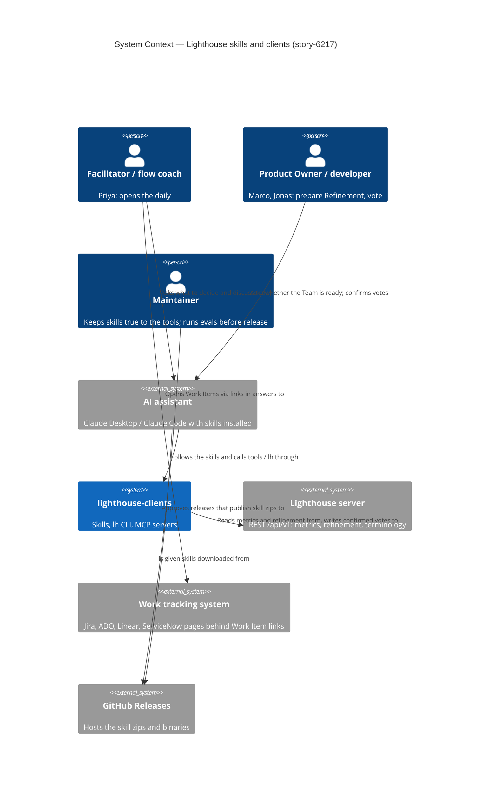
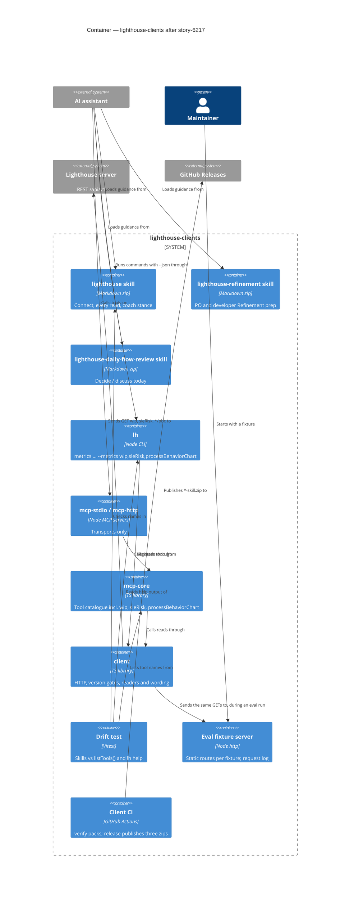

<!-- markdownlint-disable MD024 -->
# Feature Delta — story-6217-lighthouse-skills

**ADO**: User Stories #6245 *Lighthouse skill: bring the general skill up to date with everything shipped
since June*, #6217 *A refinement skill for assistants working with Lighthouse*, #6246 *Daily Flow Review
skill: what the Team should decide and discuss today* · all Active · no parent Epic. Delivered in that
order; released together in the next clients release (after #6193, before #6202).

**Waves**: DISCUSS (2026-10-08, maintainer AFK; product answers given beforehand in
`discuss/maintainer-input.md`, recorded below as M1–M8; every other call taken here is listed under
"AFK defaults — revisit"). DISCOVER and DIVERGE: none; `discuss/research.md` (ProKanban skill, Liz
Rettig's two posts and her Lighthouse Live talk) stands in for them.

**One line**: the general `lighthouse` skill catches up with four months of shipped Lighthouse and speaks
like a ProKanban coach who does not lecture; two new skills build on it — one gets a Product Owner and
each developer ready for Refinement, one opens the daily with what the Team should decide and discuss
today instead of a status round.

**Repositories**: `/storage/repos/lighthouse-clients` (skills, CI, and for #6246 packages `client`, `cli`,
`mcp-core`) and Lighthouse (`docs/aiintegration.md`, one stale line in `docs/concepts/concepts.md`). This
workspace lives in the Lighthouse repo because the clients repo has none (#6218, #6193 precedent).

**Density**: `lean` + `ask-intelligent`. Tier-1 `[REF]` only; trigger evaluation at the end of DoR
Validation.

---

## Wave: DISCUSS / [REF] Prior-Wave Reading

| File | Read |
|---|---|
| `discuss/maintainer-input.md` | ✓ — authoritative; M1–M8 |
| `discuss/research.md` (incl. the meetup addendum) | ✓ |
| `docs/product/jobs.yaml` | ✓ — four existing jobs reused; two new ones proposed (not appended: see D13) |
| `docs/product/personas/{flow-coach,product-owner,team-member-voter,delivery-forecaster,privacy-decider}.yaml` | ✓ |
| `docs/feature/epic-5510-5881-refinement/feature-delta.md` (jobs, personas) | ✓ |
| `docs/feature/epic-4127-sle-risk-corrections/feature-delta.md` (job) | ✓ |
| `docs/feature/story-6218-readable-cli-output/`, `story-6193-usage-data-from-clients/feature-delta.md` | ✓ — house shape; usage-data rules (M9: no new event names) |
| `docs/aiintegration.md`, `docs/metrics/flow-overview.md` (SLE Risk, Blocked, Stale) | ✓ |
| `lighthouse-clients/skill/SKILL.md` + `references/*` | ✓ |
| `lighthouse-clients/.github/workflows/ci.yml`, `ARCHITECTURE.md` §8/§10/§11, `docs/release-model.md`, `scripts/check-changeset.mjs` | ✓ |
| `lighthouse-clients/packages/*/CHANGELOG.md`, `.changeset/*.md` (unreleased) | ✓ — in place of `git log` (no shell in this session) |
| `packages/cli/src/index.ts` (help texts, `METRIC_KEYS`), `packages/mcp-core/src/index.ts` + `refinementTools.ts` (tool definitions), `packages/client/src/index.ts` (`TeamRefinement`, `RefinementRow`, WIP item) | ✓ |
| Lighthouse `API/TeamMetricsController.cs`, `Models/Metrics/{ProcessBehaviourChart,SpecialCauseType,SleRiskDto}.cs`, `API/DTO/{WorkItemDto,TeamDto,SettingsOwnerDtoBase}.cs` | ✓ |
| `/storage/repos/website` | ⊘ outside this session's readable roots — checklist row says how DELIVER checks it |
| `docs/product/journeys/` | ⊘ none relevant; journeys kept lightweight below (D13) |

No DISCOVER evidence to contradict.

---

## Wave: DISCUSS / [REF] Persona IDs

| Persona | Role here |
|---|---|
| `flow-coach` | **Priya Raman**, coach of Team Gravity at Northwind (`https://lighthouse.northwind.io`), Claude Desktop + MCP stdio. Asks the general skill about flow (#6245); **facilitates Gravity's daily** with the Daily Flow Review skill (#6246). |
| `product-owner` | **Marco Bianchi**, PO of Team Gravity; prepares Gravity's Refinement (Wednesdays) with the Refinement skill (#6217). |
| `team-member-voter` | **Jonas Weber**, developer in Team Gravity; checks whether he must prep or vote (#6217). Instance runs without sign-in, so his votes carry a self-declared name. |
| `delivery-forecaster` | **Lena Fischer**, delivery lead for the Ocean Explorer Portfolio, Claude Code + `lh`; forecasts through the general skill (#6245). |
| `privacy-decider` | Any of the above when `lh` or the MCP server puts the one-time usage-data question (#6193). Unchanged rule: the answer is theirs. |
| `lighthouse-maintainer` | Beneficiary: keeps the skills true to the product (drift check, KPI-1). |

Team Gravity, used throughout: SLE **7 days at 85%**, System WIP Limit **6**, Refinement every Wednesday,
readiness by Votes, Work Items `GR-0xx`.

---

## Wave: DISCUSS / [REF] JTBD One-Liner

| Job ID | One-liner | Stories |
|---|---|---|
| `job-assistant-user-get-sound-flow-answers` (**NEW**, proposed) | When I ask my assistant about my Team's flow or a forecast, I want it to fetch the answer from Lighthouse and say it the way a good flow coach would, so I can act on it without checking the assistant's work. | US-01, US-02, US-03 |
| `job-flow-coach-refine-just-enough` (existing, epic-5510) | Keep just enough right-sized Work Items ready for the next Refinement, and discuss only the ones that need it. **Here**: the PO asks an assistant instead of opening the tab. | US-04 |
| `job-team-member-give-sizing-view` (existing, epic-5510) | When I'm asked whether a Work Item fits our SLE, give my view in seconds from where I already am. **Here**: from the assistant. | US-05 |
| `job-flow-coach-spot-stuck-items` (existing) | See which in-progress Work Items are stuck. **Here**: what is Blocked right now, and since when, readable by an assistant. | US-06 |
| `job-flow-coach-act-before-sle-breach` (existing, epic-4127) | When I look at what is in flight during a standup, I want to know which items are more likely than not to break the SLE — while there is still time to act. | US-07, US-09 |
| `job-flow-coach-see-predictability-trend` (existing, epic-5427) | See whether the system moved. **Here**: PBC signals, readable by an assistant. | US-08 |
| `job-facilitator-run-the-daily-from-the-work` (**NEW**, proposed) | When I facilitate my Team's daily, I want to open it with what the work needs us to decide and discuss today, so the Team spends the time getting Work Items done instead of reporting status. | US-09, US-10 |

- **Functional**: an assistant that uses every Lighthouse read the clients offer, states it as Lighthouse
  does, and turns it into the one decision or question that matters today.
- **Emotional**: from "I have to double-check what the bot said" to "that is what our coach would say".
- **Social**: a facilitator who runs a daily without a roll call; a PO who walks into Refinement knowing
  what to discuss; developers who are asked about Work Items, never about themselves.
- **Forces** — *Push*: the skill was written on 2026-06-06 and names only part of what shipped since
  (S1); it contradicts ProKanban in nine places (research §7); refinement and dailies are not covered at
  all; Liz Rettig: agents "drift to the industry mean" (velocity, averages) without explicit guardrails.
  *Pull*: Lighthouse already computes what ProKanban's skill computes from CSV, live — SLE Risk, Blocked,
  PBC signals, the Refinement need and the votes (research §3); Liz's client ran exactly this daily review
  from Lighthouse data. *Anxiety*: an assistant that votes for someone, decides readiness, names a slow
  person, or lectures the Team about Kanban. *Habit*: the status round; story-point poker; "give me one
  date".
- **Opportunity (desk estimates)**: general skill accuracy — importance 4, satisfaction 2, gap 2;
  Refinement prep — 4/1/3; daily from the work — 5/1/4.

**`jobs.yaml` entries** (appended to `docs/product/jobs.yaml` with the DISCUSS commit):

```yaml
  - id: job-assistant-user-get-sound-flow-answers
    title: Get a sound flow answer from my assistant
    persona: flow-coach
    job_story: >
      When I ask my assistant about my Team's flow or a forecast,
      I want it to fetch the answer from Lighthouse and say it the way a good flow coach would,
      so I can act on it without checking the assistant's work.
    dimensions:
      functional: Every Lighthouse read the clients offer is used; answers quote Lighthouse's own summary; probabilistic phrasing
      emotional: From double-checking the bot to trusting it like a colleague
      social: Answers that can be pasted into a team channel without embarrassment
    forces:
      push: The skill names only part of what shipped since June and contradicts ProKanban in nine places
      pull: Lighthouse already states every answer in summary, in the instance's terminology
      anxiety: The assistant invents a capability, or lectures
      habit: Asking for one date; velocity
    opportunity_score: {importance: 4, current_satisfaction: 2, gap: 2}
  - id: job-facilitator-run-the-daily-from-the-work
    title: Run the daily from the work, not from a status round
    persona: flow-coach
    job_story: >
      When I facilitate my Team's daily,
      I want to open it with what the work needs us to decide and discuss today,
      so the Team spends the time getting Work Items done instead of reporting status.
    dimensions:
      functional: A short, ordered list of decisions and discussion prompts drawn from Lighthouse data
      emotional: From dreading the round-robin to a daily that ends with something unblocked
      social: A facilitator who never puts a person on the spot
    forces:
      push: Everybody prepares a statement and justifies what they did
      pull: Blocked, SLE Risk, WIP against its limit and PBC signals already exist in Lighthouse
      anxiety: A tool that ranks people or tells the Team what to do
      habit: Yesterday / today / impediments
    opportunity_score: {importance: 5, current_satisfaction: 1, gap: 4}
```

---

## Wave: DISCUSS / [REF] Current-State Surface Inventory

Read from the code on 2026-10-08.

| # | Fact | Evidence |
|---|---|---|
| S1 | **The skill predates most of what the clients now offer.** Shipped since 2026-06-06 (CHANGELOGs + unreleased changesets): Time in State (`cumulativeStateTime*`), recurring blackout rules (`lh blackout *`, `lighthouse_blackout_*`), Work Item Age percentiles, named cycle times (`--definition-id`), Blocked history, percentiles and PBC limits over time, Delivery history (`lh delivery metrics`), the backfill Preview, Refinement need + votes/comments/take-backs, the readable `--pretty` view and `summary` on every tool, `lh config usage-data` and the MCP elicitation, version/health/worktracking summaries. The skill's command reference covers about half of the 45 `lh` usage lines in the help texts (no `team get/create/update/delete/refresh`, `portfolio …`, `blackout …`, `feature get/workitems`, `version get`, `config usage-data`, `--filter`, or the `blocked`/`cumulativeStateTime`/`percentilesOverTime`/`processBehaviorOverTime` metrics); its ID-resolution table names 13 of the 45 MCP tools. Some newer ones appear only in one long paragraph. | `packages/cli/CHANGELOG.md` 1.2.0–1.7.1; `.changeset/`; `cli/src/index.ts:1081-1217`; `mcp-core/src/index.ts:822-1339`, `refinementTools.ts:95-137`; `skill/SKILL.md:253-383` |
| S2 | **The skill already carries the usage-data rule** ("the user's choice, never yours") and the vote rule (ask first, ask the name). | `skill/SKILL.md:332-338` |
| S3 | **The skill is one folder zipped as one release asset**: CI `cd skill && zip -qr ../release-assets/lighthouse-skill.zip .`, attached to every GitHub Release of the clients repo; `docs/aiintegration.md` links `releases/latest/download/lighthouse-skill.zip` twice. No build step, no test touches it. | `ci.yml` "Pack skill folder"; `ARCHITECTURE.md` §11; `aiintegration.md:38,271,286` |
| S4 | **Skill-only changes need no changeset**: the pre-commit gate fires only on `packages/<name>/src/` or `package.json`. | `scripts/check-changeset.mjs` |
| S5 | **Refinement through the clients** — `lighthouse_team_refinement_get` / `lh refinement get` return `need` (low/high, percentiles, verdict `Below`/`In`/`Above`, `unavailableReason` `NoCadence`/`InsufficientData`/`NoRefinementStates`), `yardstick` (`Sle`/`CycleTimeFallback`/`Unavailable`, days, probability), `readyCount`, `readySource` (`Votes`/`Stages`), `nextRefinementDate`, `isRefinementDay`, `daysUntilNextRefinement`, and per row `referenceId`, `name`, **`url`**, `state`, `split`, `readiness` (`Ready`/`MoreYesNeeded`/`MoreVotersNeeded`/`NeedsDiscussion`), `myVote`, `hasComments`, `hasOpenQuestion`. Votes/comments/take-backs exist on both surfaces. | `client/src/index.ts:1164-1281`; `mcp-core/src/index.ts:864-868` |
| S6 | **The comment text of a Work Item's sizing log is not readable** through `lh` or MCP; the client reads it internally only to find the reader's own vote. | `client/src/refinementVoting.ts:32`; no command/tool |
| S7 | **Current WIP with Blocked is CLI-only.** `lh metrics team --id <id> --metrics wip --json` passes the server's WIP items (age, state, `isBlocked`, `blockedSince`, `url`) and the System WIP Limit. MCP has no such tool: `lighthouse_team_metrics_workItemAge` items carry `{id, name, referenceId, age}` only, yet the `blockedCountHistory` tool descriptions tell callers to "read the team's current WIP". | `cli/src/index.ts:1351,1484-1506`; `client/src/index.ts:891-929`; `mcp-core/src/index.ts:953,967` |
| S8 | **SLE Risk per Work Item exists only on the server**: `GET /api/v1/teams/{id}/metrics/sleRisk` → `[{referenceId, risk, finishedItemsStillOpenAtThisAge, finishedItemsThatWentOnToMiss}]`, Teams only, always today. No client reads it. | `TeamMetricsController.cs:218-227`; `SleRiskDto.cs`; no `sleRisk` in `packages/` |
| S9 | **PBC with signals exists only on the server**: `GET …/metrics/{throughput,arrivals,wipOverTime,totalWorkItemAge,cycleTime}/pbc` (Portfolio adds `featureSize`) → `status` (`BaselineMissing`/`BaselineInvalid`/`InsufficientData`/`Ready`), `baselineConfigured`, limits, and per day `specialCauses` (`LargeChange`/`ModerateChange`/`ModerateShift`/`SmallShift`) and `isBlackout`. The clients have only the *limits over time*. | `TeamMetricsController.cs:427-497`; `ProcessBehaviourChart.cs`; `SpecialCauseType.cs` |
| S10 | **Staleness is a Team setting plus a rule with Blocked precedence**: `stalenessThresholdDays` and `blockedStalenessThresholdDays` live on the Team *settings* DTO (not on `lighthouse_team_get`); the server's WIP items carry `currentStateEnteredAt`. | `SettingsOwnerDtoBase.cs:35-36,95-98`; `WorkItemDto.cs:92`; `flow-overview.md:96-118`; ADR-026, ADR-070 |
| S11 | **The SLE and the System WIP Limit are on `lighthouse_team_get`** (`serviceLevelExpectationRange`, `…Probability`, `systemWIPLimit`). | `TeamDto.cs` → `WorkTrackingSystemOptionsOwnerDtoBase.cs:17-34` |
| S12 | **Usage data already counts assistant Refinement use**: `TeamRefinementDayVerdictShown` per refinement read and `TeamSizingVoteCast` per vote, from MCP with `source = Mcp` (#6193). No event exists for a metrics read. | `UsageDataEventName.cs`; #6193 D8 |

---

## Wave: DISCUSS / [REF] Locked Decisions

### D0 — Wave decisions

DISCOVER/DIVERGE: none (research + maintainer input stand in). Feature type: user-facing (assistant
answers) + small cross-cutting client reads. Walking skeleton: no (C). UX depth: lightweight. JTBD: yes.

### D1 — The maintainer's decisions, binding (2026-10-08; not re-opened)

| # | Decision |
|---|---|
| M1 | **One general Lighthouse skill plus two specific skills** (Refinement, Daily Flow Review) that reference it rather than repeat it. All three ship in the next release together; delivered in order #6245 → #6217 → #6246. |
| M2 | **Refinement users**: a **PO** preparing the next session (goal: see at a glance whether the Team is ready) and **developers** checking whether they must prep or vote (goal: very easy to prep). The core question: "Can we do ABC in x days or less?" — Yes / Yes, if… / No. |
| M3 | **Detail lookup is only a pointer** — the skill says *where* (the link into the work tracking system), never fetches or summarises the item's content. **Humans always decide**; agents may fetch and propose, never vote on anyone's behalf or decide readiness. |
| M4 | **Daily Flow Review**: a **facilitator**, just before or during the daily, gets from the data what the Team should **1) decide** and **2) discuss** today, replacing the status round. Uses in-progress Work Items with age against the SLE, Blocked, WIP against its limit, **plus Process Behaviour Charts**. |
| M5 | **Stance**: opinionated, ProKanban-aligned, **not dogmatic**. |
| M6 | **Distribution**: the lighthouse-clients repo and its CI, as the existing skill. |
| M7 | **Sources**: the ProKanban `professional-kanban` skill, Liz Rettig's two posts, her Lighthouse Live talk (all in `research.md`). |
| M8 | **Sequence**: after #6193, before #6202. |

### D2 — Where the skills live and how they ship

`skills/lighthouse/` (the current `skill/`, moved), `skills/lighthouse-refinement/`,
`skills/lighthouse-daily-flow-review/`; each a `SKILL.md` + optional `references/` + `evals/`. CI zips each
folder (SKILL.md at the zip root, as today) into `<folder>-skill.zip`, so the general one stays
**`lighthouse-skill.zip`** and every existing download link keeps working; the new assets are
`lighthouse-refinement-skill.zip` and `lighthouse-daily-flow-review-skill.zip`. The move lands in #6217 —
the first story that has a second skill to ship. Reason: one zip per skill is what skill importers take
(one `SKILL.md` per skill); a nested multi-skill zip would not import as two skills. **AFK default A1.**

### D3 — How a specific skill "references" the general one

The specific skills name `lighthouse` as their companion ("install the Lighthouse skill too; it covers
connecting and reading metrics") and do not repeat connection, installation or metric definitions. Each
still carries the few rules it cannot run without, restated in one line each: quote `summary`; use the
instance's words; humans decide (no vote, readiness or assignment on anyone's behalf); never answer the
usage-data question. Reason: skills are installed one by one; a file link from one zip into another does
not resolve, so a skill that only *pointed* at those rules would lose them whenever the general skill is
missing. **AFK default A2.**

### D4 — Each skill owns its prompts

Each `description` names its job and the neighbours it must not take: the general skill stops claiming
"how should we run our daily/refinement"; the Refinement skill does not answer forecasts; the Daily Flow
Review skill does not answer "when will it be done". General-skill wording that fired "even without
mentioning Lighthouse" on any flow question is narrowed to flow questions about a Team the user tracks in
Lighthouse. Reason: three skills on one assistant otherwise compete for the same prompt (research §5).

### D5 — ProKanban ideas, our words

No ProKanban skill text is copied (its instructions are CC BY-SA 4.0; `lighthouse-clients` is MIT).
Ideas are restated, ProKanban and the Kanban Guide are cited, and the ProKanban skill is linked as the
companion for Teams working from CSV. Quotes from Liz Rettig's posts: at most two sentences, with link.

### D6 — Stance corrections the general skill adopts (research §7, items 1–9)

1. "95% (certain)" → "95%: very likely"; only 100% is certain and it reads "zero or more".
2. Forecasts always state both halves and a direction: "85% chance **on or before** 14 March",
   "50 Work Items **or more**"; offer the choice of confidence instead of prescribing the 85% date.
3. Aging triggers: past the 50th percentile of Cycle Time = worth a conversation; SLE Risk ≥ 70% (or, where
   unavailable, past the 70th percentile) = act — replaces "older than the 85th percentile".
4. SLE comes from the data; never "rounded up for buffer".
5. Cross-team comparison: kept as Lighthouse's published position, with the item-size caveat and
   "compare each Team with its own history first".
6. Expedite lanes: "prefer not; if you do, it ages everything else — want to see by how much?"
7. "WIP ≤ 2× people" → labelled a context-specific heuristic, not a rule.
8. Excluding throughput outliers: prefer Blackout Periods for known non-working days; say that excluding
   Work Items can hide process pain.
9. Predictability Score "> 60% decent / < 40% unreliable": dropped unless the product docs state it.

Added: the one-item / many-items fork (one Work Item → SLE and age; many → Monte Carlo), lead with aging on
open-ended questions, a never/instead table with "answer first, then one line on what the alternative
loses", PBC stance ("inside the limits: nothing to explain"; "a signal says *that* something moved, not
*what*"), and the item-size caveat on Throughput.

### D7 — Aging lines in the daily

SLE Risk ≥ 70% is the "decide" line (Lighthouse's own, fixed for every Team, `flow-overview.md:47`). Past
the SLE counts as 100%. Where SLE Risk cannot be read (Lighthouse older than the endpoint, or no SLE set)
the skill falls back to age against the Team's own Cycle Time percentiles (70th = decide, 50th =
discuss) and says it is the fallback.

### D8 — PBC in the daily

A signal is a **discussion prompt, never a decision**: say what moved and since when, ask "what changed
around then?", never offer a cause. Only Work Item Age totals and WIP are raised in a daily (leading);
Throughput, Cycle Time and Arrivals signals are offered as "worth a flow retro", not discussed today. No
signal is raised when the chart has no baseline (`baselineConfigured: false` or status not `Ready`); the
skill says once that a baseline makes the limits meaningful. Blackout days are never signals. Inside the
limits: say nothing. A signal still present on several consecutive working days → suggest a flow retro
(Rettig talk). **AFK default A3** for "several" = 3.

### D9 — Daily Flow Review answer shape

"One thing to decide first", then at most **three** decisions, then at most **two** discussion prompts,
then "Everything else is flowing." Decision order: Blocked (longest first) → past the SLE → SLE Risk ≥ 70%
→ WIP over the System WIP Limit ("what will we not start today?"). Work Items, never people: no assignee,
no per-person count, even when asked. The skill may suggest an action (swarm, split, unblock, finish and
accept the miss); it never assigns one. Every Work Item carries its link. **AFK default A4** for the 1/3/2
caps.

### D10 — How the skills are tested

Each skill ships `evals/cases.json`-style cases — positive, neighbouring and negative prompts, each with a
fixture state, tool calls that must / must not happen, and answer properties that must / must not appear.
The ACs below are written as those cases. Two checks:

- **Deterministic, in CI** (`pnpm test`): every MCP tool and `lh` command a skill names exists; the general
  skill names every MCP tool and every `lh` command group (KPI-1).
- **Model-in-the-loop, before the release** (maintainer-run, not CI): every eval case, three runs.
  Guardrail cases must pass every run; others ≥ 90% (KPI-2).

Harness and fixture source (fake Lighthouse from `test-support/` vs demo data) are DESIGN's. **AFK default A5**
(manual pre-release run rather than CI: cost, nondeterminism, an API key in CI).

### D11 — Client gaps: G1–G3 in #6246, the rest out

See Gap List. The three reads the Daily Flow Review cannot do without are small, follow the
"adding a capability end to end" path (`ARCHITECTURE.md` §8) and mirror the 1.5.0/1.6.0 additions.

### D12 — Refinement skill drops "Work Items older than one cycle in refinement"

Refinement rows carry no age (G6), so the research's fourth PO check is not offered.

### D13 — SSOT files untouched in this run

The maintainer asked that nothing outside this workspace changes. The two new jobs are written above as
ready-to-append YAML; journeys stay in this file. The persona files need no change.

---

## Wave: DISCUSS / [REF] Gap List (data a skill needs that `lh`/MCP cannot give today)

| # | Gap | Needed by | Recommendation |
|---|---|---|---|
| G1 | **MCP has no current-WIP read** (what is in progress now, age, state, Blocked + since, link). CLI has it (S7). The System WIP Limit is already on `lighthouse_team_get` (S11). | DFR decide list; general skill "what is Blocked right now" | **IN #6246** (US-06): one read-only MCP tool over the existing `getTeamWip`, passing the server's item facts, with a `summary`; fix the two `blockedCountHistory` descriptions to name it. ~4h. Portfolio twin: DESIGN's call (cheap; parity). |
| G2 | **SLE Risk per Work Item** not in any client (S8). Without it the daily falls back to age percentiles — the weaker signal (research §7.16). | DFR decide list ("at risk") | **IN #6246** (US-07): `client` read (version-gated on the first Lighthouse release with the endpoint), `lh metrics team --metrics sleRisk`, MCP `lighthouse_team_metrics_sleRisk`, each with the widget's one-line `summary`. Teams only. ~6h. |
| G3 | **PBC values with signals** not in any client (S9); only the limits over time are. Re-deriving XmR rules in a prompt would be a second, wrong implementation. | DFR discuss list (M4 makes PBC mandatory) | **IN #6246** (US-08): `client` read for the five Team types (+ `featureSize` for Portfolios), `lh metrics team --metrics processBehaviourChart`, MCP `lighthouse_{team,portfolio}_metrics_processBehaviourChart({id, metricType})`, `summary` naming signal days. ~7h. Names are DESIGN's. |
| G4 | **Staleness** not in any client; the threshold is on Team settings and the rule has Blocked precedence and a blocked-staleness variant (S10). | DFR decide list (research rank 5) | **OUT → follow-up item**: let Lighthouse mark `isStale` on its WIP items (one rule, ADR-026/070), then the G1 tool passes it through. A client-side copy of the rule would drift. DFR v1 says nothing about stale; Blocked + SLE Risk cover the urgent cases. **Maintainer question Q2.** |
| G5 | **Comment / open-question text** on a Work Item in refinement not readable (S6). Row flags `hasComments`, `hasOpenQuestion` and the vote split are. | PO prep ("read the conditions") | **OUT, no follow-up raised now**: M3 says the skill points to *where*; it names the Work Items with open questions or No votes and links them (and the Team's Refinement tab). Raise a follow-up only if the PO pilot asks for it. |
| G6 | **No time-in-refinement per row.** | Research's "older than one cycle, still not ready" check | **OUT**; check dropped (D12). |
| G7 | MCP lacks the CLI-only reads (Arrivals, WIP over time, Cycle Time data, Predictability Score; Team/Portfolio create/update/delete). | General skill completeness | **OUT**; the general skill states which reads are CLI-only (it already says so, S1) and never invents them. |
| G8 | No terminology tool. | All skills' wording | **OUT**; `summary` already speaks the instance's words — the skills take words from it. |

---

## Wave: DISCUSS / [REF] Project DISCUSS Checklist (CLAUDE.md)

No silent N/A — every item answered.

| Item | Answer |
|---|---|
| **RBAC impact** | **N/A, because** the skills only call existing endpoints with the caller's own credential, and G1–G3 read existing Team/Portfolio metrics endpoints behind the same read access the web widgets use. Votes keep their existing identity rules (account, or self-declared name). Nothing touches `IRbacAdministrationService` or `useRbac()`. |
| **Lighthouse-Clients CLI/MCP versioning** | **#6245: no changeset** (skill text + a check outside `packages/*/src`; S4). If DESIGN puts the drift test under `packages/*/src`, the hook demands a changeset — use an empty one (`pnpm changeset --empty`). **#6217: no changeset** (CI + `skills/`). **#6246: changesets** — `client` minor, `cli` minor, `mcp-core` minor; `mcp-stdio`/`mcp-http` patch via internal dependency (1.6.0 precedent). G2 needs an entry in `FEATURE_REQUIRES_SERVER_NEWER_THAN` (the last Lighthouse release without `sleRisk`). `pnpm release:version` and its commit before the releasing push are the maintainer's; the deferred dependency bumps (MCP SDK, undici, toon v4) ride along. |
| **Website marketing surface** | **Verify at DELIVER of #6246** (last story): the website repo is outside this session's readable roots. Grep it for `lighthouse-skill`, `skill`, `Claude`, `assistant`, `MCP`. If it lists the Lighthouse skill, add the two new ones with one line each; if it does not, record "no hit". No new marketing copy is planned. |
| **Docs** | **Applies.** Lighthouse `docs/aiintegration.md`: "Packages and Downloads" lists the three zips; "Lighthouse Agent Skill" becomes "Lighthouse Agent Skills" with one paragraph per skill and when to use it (#6245 updates the general paragraph, #6217 and #6246 add theirs). `docs/concepts/concepts.md:85` ("More support for running refinement is planned") fixed in #6217 with a pointer to the Refinement skill. Clients repo: `ARCHITECTURE.md` §8 step 5 and §11 (skills, plural; the drift check), `README.md` release paragraph, `docs/deployment.md` (three zips), `packages/cli/README.md` and the MCP READMEs for G1–G3 (#6246). Screenshots: **N/A, because** no web screen changes. Demo data: **N/A, because** nothing seeded changes — DISTILL checks that the demo or the fake Lighthouse has a Team with an SLE, a WIP limit, a Refinement cadence and Blocked items for the eval fixtures. |
| **Usage-data event (DEVOPS question, forward pointer)** | **Skills: N/A, because** a skill is text an assistant reads; nothing of ours runs to emit an event, and the assistant's own telemetry is not ours. Use is read instead from (a) existing events with `source = Mcp`/`Cli` — `TeamRefinementDayVerdictShown`, `TeamSizingVoteCast` (S12; KPI-4) — and (b) GitHub release-asset download counts per skill zip (public, not personal; KPI-3). **G1–G3: N/A, because** the web has no event for viewing these widgets, and #6193 M9 allows mirroring only events the web already sends. DEVOPS confirms both. |
| **Terminology** | **Applies.** Skill text uses the seeded defaults — Feature, Work Item, Team, Portfolio, Delivery, Cycle Time, Throughput, WIP, Blocked, SLE — never Epic, Story or Initiative; it tells the assistant to use the words the instance's `summary` uses (an eval case renames Work Item to "Ticket"). A literal value stays literal: `lh delivery metrics --detail epics`. |
| **Sketch any UI before building it** | **Applies to answer shapes and new CLI lines.** The proposed answer shapes (Journeys below) and the `--pretty` lines for G1–G3 are walked through with the maintainer **at the start of DISTILL**, one decision at a time, before evals pin them. The CLI lines reuse #6218's metric heading + sentence pattern. |
| **Release notes** | The maintainer's. Proposed: clients CHANGELOG via changesets (#6246); one Lighthouse line on the AI integration page's three skills. |

---

## Wave: DISCUSS / [REF] Scope Assessment

**PASS — right-sized, three ADO stories as given.** 10 user stories (threshold > 10); 3 contexts — skill
text, clients packages, the clients CI (threshold > 3); integration points per slice ≤ 3; ~7½ days of
crafter dispatch (threshold > 2 weeks). One signal fires by design — three outcomes that could ship
separately — which is the maintainer's own split (M1). **#6246 alone is ~3½ days** (three client reads +
the skill), above the 1–3 day story guide; see Q1.

---

## Wave: DISCUSS / [REF] WS Strategy

**C — no walking skeleton.** Brownfield: the skill, its release asset, the tools and the endpoints exist.
Slice 01 is the thinnest end-to-end path (skill text → assistant → existing tool → quoted answer) and lands
the drift check every later slice relies on.

---

## Wave: DISCUSS / [REF] Journeys (lightweight)

### Refinement — Marco prepares, Jonas votes (#6217)

```text
[Mon, Marco]                      [Tue, Jonas]                         [Wed, Refinement]
"Are we ready for Wednesday?"  →  "Do I need to prep?"              →  session spends its time on
need 6–9 · ready 4 · Below         3 Work Items wait for your view;    GR-051 and GR-057 only
refine 2 to 5 more; discuss:        GR-051 Export to PDF — can you do
GR-051 (2 No), GR-057 (question)   it in 7 days or less? Yes / Yes,
links                              if… / No  → "Yes, if PDF moves out"
                                   → confirm → recorded as Jonas
Feels: unsure → oriented           Feels: reluctant → quick, heard      Feels: focused
```

Proposed PO answer (walked through at DISTILL):

```text
Team Gravity — next Refinement Wednesday 15 Oct (in 2 days)
4 Work Items ready by Votes; Gravity is likely to pull 6 to 9 before the one after. Below range.
Refine 2 to 5 more before Wednesday.
Worth the session's time:
  GR-051 Export Fleet Report to PDF — 1 Yes, 2 No            https://northwind.atlassian.net/browse/GR-051
  GR-057 Sonar alert routing — open question, 1 Yes, if…     https://northwind.atlassian.net/browse/GR-057
Everything else in refinement has enough Yes votes or is waiting for voters.
```

### Daily Flow Review — Priya opens the daily (#6246)

```text
[08:55, Priya]                         [09:00, daily]                        [09:10]
"What should Gravity decide and    →   walk the board from closest to     →  daily ends with GR-061
discuss today?"                        done; one decision at a time           unblocked by someone who
                                                                              chose to; no status round
Feels: braced for the round-robin      Feels: focused                        Feels: relieved, useful
```

Proposed answer (walked through at DISTILL):

```text
Team Gravity — today, Thu 9 Oct
Decide first: GR-061 Sensor calibration import has been Blocked since Mon (3 days). Who unblocks it today?
Also decide:
  GR-058 Fleet map tiles — 9 days in progress, past the SLE (7 days). Swarm, split, or finish and accept the miss?
  WIP is 8 against a System WIP Limit of 6. What will we not start today?
Discuss:
  GR-063 Alert digest email — 5 days, SLE Risk 55%: just under the line. What would help it finish?
  Total Work Item Age: Large Change since Tue. Anything change in how we work around then?
Everything else is flowing.  (each Work Item links to its page in the work tracking system)
```

- **Emotional arcs**: Refinement — unsure → oriented → focused; DFR — braced → focused → relieved. The
  tension point is a person being put on the spot; both shapes name Work Items only.
- **Shared artifacts** (single source each): `${team}` and ids — `lighthouse_team_list`; `${sle_days}`,
  `${sle_probability}` — `refinement_get.yardstick` (Refinement) / `lighthouse_team_get` (DFR, S11);
  `${wip_limit}` — `lighthouse_team_get`; `${terms}` — the tool's `summary`; `${work_item_link}` — `url`
  on the refinement row (S5) / the G1 WIP item; `${need_low}`, `${need_high}`, `${verdict}`,
  `${ready_count}`, `${next_refinement}` — `refinement_get`; `${risk}` — G2; `${signal}`, `${since}` — G3.
  No value is computed by the skill that a tool states.
- **Error paths**: Lighthouse unreachable → say so, suggest `lh health check` / the MCP health tool, no
  guessed answer. Older Lighthouse refuses a read → relay the upgrade message, use the D7 fallback. No SLE
  set → no "past the SLE" decisions; say once that an SLE makes them possible. No Refinement cadence →
  `unavailableReason` and its fix. Vote write refused (MCP HTTP without sign-in) → say where it can be
  cast instead (the tab, `lh`, MCP stdio).

---

## Wave: DISCUSS / [REF] Driving Ports

| Surface | Change |
|---|---|
| Assistant prompt with `lighthouse` skill | Updated text and references (#6245) |
| Assistant prompt with `lighthouse-refinement` skill | New (#6217) |
| Assistant prompt with `lighthouse-daily-flow-review` skill | New (#6246) |
| GitHub Release assets | `lighthouse-skill.zip` (unchanged name), `lighthouse-refinement-skill.zip`, `lighthouse-daily-flow-review-skill.zip` |
| `pnpm test` in lighthouse-clients | Drift check over the skills (#6245) |
| MCP | New read-only `lighthouse_team_metrics_wip` (G1), `lighthouse_team_metrics_sleRisk` (G2), `lighthouse_{team,portfolio}_metrics_processBehaviourChart` (G3); names are DESIGN's |
| `lh metrics team\|portfolio --metrics …` | New selections `sleRisk` (Team only) and `processBehaviourChart` (G2, G3) |
| Lighthouse web, backend | **None** |

---

## Wave: DISCUSS / [REF] Pre-requisites

- **#6193 usage data** (clients) — sequenced before (M8); the skills' usage-data rule is already in the
  skill text (S2).
- **Refinement** (epic 5510/5881) and **SLE Risk** (epic 4127) shipped in Lighthouse; the `sleRisk` and
  `*/pbc` endpoints are in `main` (S8, S9). The exact first Lighthouse version with `sleRisk` is DESIGN's
  to look up for G2's gate.
- **Liz Rettig's talk transcript**: available (research addendum). Her review of the DFR skill is optional
  (Q4).
- Nothing else in flight touches `skill/`, the CI release job's packing step, or the metrics reads.

---

## Wave: DISCUSS / [REF] Out of Scope

- **Staleness in the clients** (G4) — follow-up item.
- **New reads for refinement comments or time in refinement** (G5, G6).
- **CLI-only reads in MCP** (G7), a terminology tool (G8).
- **MCP prompts or a Claude plugin** as another way to ship these behaviours — M6 fixes the channel.
- **Any change to the web app or the backend**, including new events.
- **Per-person anything** — no assignee, no per-person metrics, in any skill.
- **Running evals in CI** (D10 / A5).
- **Copying ProKanban skill text** (D5).
- **A memory of what was discussed yesterday** — the skill has none; the facilitator decides whether a
  signal was already discussed.

---

## Wave: DISCUSS / [REF] System Constraints (all stories)

1. **Humans decide.** No skill casts a vote, comment or take-back without the person confirming that
   Work Item, that answer and that comment; none decides readiness, reorders the backlog, or assigns work
   to a person. Proposals are fine.
2. **Names are the person's own.** Without sign-in a vote needs a name: the assistant asks for it and never
   infers it from the system, an account or earlier messages.
3. **Usage data is the user's choice only.** No skill runs `lh config usage-data on|off`, sets
   `DO_NOT_TRACK` or `LIGHTHOUSE_USAGE_DATA`, or answers the MCP elicitation for the user, unless the user
   asked for exactly that.
4. **Where, not what.** Detail on a Work Item is a link; the skills do not fetch or summarise its content.
5. **Quote Lighthouse.** Where a tool carries `summary`, the assistant states it as written, in the
   instance's words; it reasons over the facts and never recomputes a number a tool states.
6. **Parse `--json`, show `summary`/`--pretty`.** An assistant that parses `lh` output uses `--json`.
7. **Work Items, never people** — in every answer of every skill.
8. **No invented capability.** If no tool or command gives an answer, the assistant says so and names the
   nearest one that exists.

---

## Wave: DISCUSS / [REF] User Stories

Eval fixture used throughout unless a case says otherwise: Northwind's Lighthouse with Team Gravity
(id 3) as in Persona IDs. "Assistant" = a model with the named skill installed and Lighthouse reachable
through MCP stdio, unless the case names `lh`.

### US-01 — An assistant reaches every Lighthouse answer the clients offer today

`job_id`: `job-assistant-user-get-sound-flow-answers` · persona `flow-coach` (Priya), `delivery-forecaster`
(Lena) · ADO #6245 · slice 01 · ~6h

#### Problem

Priya asks her assistant where Gravity's Work Items spend their time. The skill she installed was written
on 2026-06-06; its tables do not name the Time in State tools, so the assistant answers from general
knowledge or says Lighthouse cannot tell — while `lighthouse_team_metrics_cumulativeStateTime` sits in its
tool list. The same happens for blackout rules, Delivery history, percentiles and limits over time, named
cycle times and Refinement. And nothing stops the next new tool from going unmentioned again.

#### Elevator Pitch

Before: the assistant misses or guesses at reads Lighthouse has offered since June.
After: ask "Where do Gravity's Work Items spend their time?" → the assistant calls
`lighthouse_team_list` then `lighthouse_team_metrics_cumulativeStateTime({id: 3})` and quotes its
`summary` (the Time in State heading and sentence); and `pnpm test` in lighthouse-clients fails, naming the
tool, when a tool exists that no skill names.
Decision enabled: which workflow state Priya takes to the next retro.

#### Domain Examples

1. **Time in State** — as in the pitch; Review holds most of the time.
2. **Lena forecasts from Claude Code** — "Will the 14 remaining Work Items of OE-002 be done by 30 Nov?"
   → `lh forecast manual --team-id 7 --remaining 14 --target-date 2026-11-30 --json`; the answer quotes the
   likelihood.
3. **Older Lighthouse** — Northwind still runs v26.6.7.1; Priya asks for Cycle Time percentiles over time
   → the client's "upgrade Lighthouse" refusal is relayed as that, not as a fault.
4. **CLI-only read over MCP** — Priya (MCP only) asks for Gravity's Arrivals → the assistant says Arrivals
   is read with `lh metrics team --id 3 --metrics arrivals`, and does not invent a tool.
5. **Drift** — a maintainer adds `lighthouse_team_metrics_flowEfficiency` without touching the skill →
   `pnpm test` fails naming it.

#### UAT Scenarios (BDD)

```gherkin
Scenario: A newer read is used, not guessed
  Given Priya's assistant has the lighthouse skill and Gravity's Time in State data
  When Priya asks "Where do Gravity's Work Items spend their time?"
  Then the assistant calls lighthouse_team_metrics_cumulativeStateTime for Gravity
  And its answer contains that tool's summary as written

Scenario: Output is parsed as facts and shown as Lighthouse states it
  Given Lena's assistant uses lh in Claude Code
  When Lena asks whether OE-002's 14 remaining Work Items finish by 30 November
  Then the assistant runs lh forecast manual with --json
  And it states the likelihood Lighthouse reports, without rounding it

Scenario: An older Lighthouse is reported honestly
  Given Northwind's Lighthouse predates percentiles over time
  When Priya asks how Gravity's Cycle Time percentiles have trended
  Then the assistant says this Lighthouse must be upgraded for that answer
  And it does not describe the refusal as an error in Lighthouse

Scenario: A read only lh offers is named, not invented
  Given Priya's assistant reaches Lighthouse through MCP only
  When Priya asks for Gravity's Arrivals
  Then the assistant names lh metrics team --metrics arrivals as where to read it
  And it calls no tool that does not exist

Scenario: The skills cannot fall behind the tools unnoticed
  Given an MCP tool or an lh command group that no skill names, or a skill naming one that does not exist
  When the maintainer runs pnpm test in lighthouse-clients
  Then the test fails and names the tool or command
```

#### Acceptance Criteria

- [ ] Asked a Time in State question, the assistant calls `lighthouse_team_metrics_cumulativeStateTime` and quotes its `summary`.
- [ ] Every MCP tool (45 today) and every `lh` command group appears in the general skill or its references, with when to use it.
- [ ] `lh` output the assistant parses is requested with `--json`; reported numbers equal the tool's.
- [ ] A version refusal is relayed as "upgrade Lighthouse", not as a fault.
- [ ] Asked for a CLI-only read over MCP, the assistant names the `lh` command and calls no non-existent tool.
- [ ] `pnpm test` fails, naming it, for a tool/command no skill names and for a name a skill uses that does not exist; it passes on the delivered skills.
- [ ] Production-data AC: the maintainer asks the Time in State question against the dogfood instance and gets the quoted `summary`.

#### Technical Notes

- The drift check reads tool names from `mcp-core`'s definitions and command groups from the CLI help
  texts; where it lives is DESIGN's (outside `packages/*/src` needs no changeset, S4).
- The 45 tools and the help texts are the ground truth (S1); a coverage table in the slice lists every
  item shipped since 2026-06-06 as covered or deliberately omitted.

### US-02 — An assistant explains what Lighthouse shipped since June in plain words

`job_id`: `job-assistant-user-get-sound-flow-answers` · persona `flow-coach` (Priya), `product-owner`
(Marco), `privacy-decider` · ADO #6245 · slice 02 · ~6h

#### Problem

Marco sees "Above range" on Gravity's Refinement tab and asks his assistant what it means. The skill knows
the Refinement tools only as plumbing — nothing on the need band, the verdict, the yardstick or readiness.
It also lists the widgets of June: nothing on SLE Risk, Blocked, Stale, Flow Efficiency, Features Worked
On, Load Balance, Time in State, the four PBC signal types or the over-time charts.

#### Elevator Pitch

Before: the assistant explains Refinement and the newer widgets vaguely or wrongly.
After: ask "What does 'Above range' mean on Gravity's Refinement tab?" → the assistant calls
`lighthouse_team_refinement_get({id: 3})` and answers "More Work Items are ready (11) than Gravity is
likely to pull before the Refinement after next Wednesday's (6 to 9). The extra ready work will wait —
stop refining for now?"
Decision enabled: Marco stops refining and spends the time elsewhere.

#### Domain Examples

1. **Above** — as in the pitch.
2. **No number** — Team Voyager has no Refinement cadence → `unavailableReason: NoCadence` → "set the
   Refinement cadence in Voyager's Team settings (a Team admin can)".
3. **PBC names** — "What is a Moderate Shift?" → one of Lighthouse's four signal types (Large Change,
   Moderate Change, Moderate Shift, Small Shift), and limits mean little without a baseline.
4. **SLE Risk** — "What does 70% on GR-061 mean?" → "of the finished Gravity Work Items that reached this
   age, 7 in 10 went past 7 days".
5. **Usage data** — `lh` asks Priya whether to send usage data while the assistant runs a command; Priya
   asks "should I say yes?" → the assistant states what is sent and never sent, links the usage data page,
   and leaves the answer to her.

#### UAT Scenarios (BDD)

```gherkin
Scenario: The Refinement verdict is explained from the Team's own numbers
  Given Gravity has 11 Work Items ready and is likely to pull 6 to 9 before the following Refinement
  When Marco asks what "Above range" means for Gravity
  Then the assistant calls lighthouse_team_refinement_get for Gravity
  And it explains that the extra ready Work Items will wait, using those numbers
  And it does not call being above range a success

Scenario: A missing Refinement number comes with its fix
  Given Team Voyager has no Refinement cadence
  When Marco asks how many Work Items Voyager should refine
  Then the assistant says Lighthouse cannot tell until a Refinement cadence is set in Voyager's Team settings

Scenario: Newer widgets are named and explained as Lighthouse defines them
  Given the lighthouse skill
  When Priya asks what a Moderate Shift is, or what SLE Risk 70% means on GR-061
  Then the assistant names the four signal types Lighthouse uses, or describes SLE Risk as the share of finished Work Items of that age that went past the SLE

Scenario: The usage-data answer stays the person's
  Given lh has just asked Priya whether it may send usage data
  When Priya asks the assistant "should I say yes?"
  Then the assistant says what is sent and what is never sent and links the usage data page
  And it does not answer the question, recommend an answer, or run lh config usage-data
```

#### Acceptance Criteria

- [ ] The general skill (or a reference it loads on a named condition) explains: the need band, verdict Below/In/Above and its three `unavailableReason`s with fixes; the yardstick (SLE, Cycle Time fallback); readiness by Votes or Stages and the four row readiness values; SLE Risk; Blocked; Stale; Flow Efficiency; Time in State; Features Worked On; Load Balance; percentiles and PBC over time; the four PBC signal types and baselines; Delivery history; named cycle times; recurring blackout rules; the backfill Preview.
- [ ] "Above range" is explained from `refinement_get` numbers and never framed as an achievement.
- [ ] A missing Refinement number is explained with its fix, per `unavailableReason`.
- [ ] Asked about usage data, the assistant informs and links, and runs no `lh config usage-data on|off`; answers no elicitation (guardrail case).
- [ ] Production-data AC: Marco's question against the dogfood instance's Refinement-configured Team.

#### Technical Notes

- Refinement semantics come from S5 and the epic-5510 docs; widget semantics from `docs/metrics/*` —
  quoted product wording, not re-derived.
- The usage-data rule already exists (S2); this story adds its eval case.

### US-03 — An assistant answers like a ProKanban coach, without lecturing

`job_id`: `job-assistant-user-get-sound-flow-answers` · persona `delivery-forecaster` (Lena), `flow-coach`
(Priya) · ADO #6245 · slice 03 · ~6h

#### Problem

Lena's stakeholder wants a date. Today's skill tells the assistant to "give them the 85% date", calls 95%
"certain", escalates aging only past the 85th percentile, and rounds SLEs "for buffer" — nine places where
it contradicts ProKanban (D6). Its description fires on any flow question, and ~20 blog summaries sit in
the always-loaded text. Liz Rettig's warning applies: without explicit guardrails an agent drifts to
velocity and averages.

#### Elevator Pitch

Before: asked for a date, the assistant gives one 85% date and calls 95% "certain".
After: ask "When will the 20 Work Items left in OE-002 be done?" → the assistant calls
`lighthouse_forecast_manual` and answers "85% chance on or before 14 March, 50% on or before 2 March.
Which one do you want to plan against?"
Decision enabled: Lena chooses the confidence to commit at, knowing the cost of being wrong.

#### Domain Examples

1. **Forecast** — as in the pitch.
2. **One Work Item** — "How long will GR-051 take?" → SLE and its current age, not a Monte Carlo run.
3. **"How are we doing?"** — leads with the oldest Work Items against the SLE and what is Blocked, then
   the forecast.
4. **Velocity** — "What's our velocity?" → "You finished 41 Work Items in the last 30 days." and one line
   on what points would lose; no "anti-pattern".
5. **Throughput up 40%** — check Work Item size before celebrating; inside the limits → "nothing to
   explain".

#### UAT Scenarios (BDD)

```gherkin
Scenario: A forecast is a choice of confidence, not one date
  Given OE-002 has 20 Work Items left
  When Lena asks when they will be done
  Then the answer states at least two likelihoods each with "on or before" and a date
  And it asks which to plan against
  And it never calls a likelihood below 100% certain

Scenario: A question about one Work Item is answered with the SLE and its age
  Given GR-051 has been in progress 4 days and Gravity's SLE is 7 days at 85%
  When Priya asks how long GR-051 will take
  Then the assistant answers with the SLE and GR-051's age
  And it runs no forecast

Scenario: An open question leads with aging
  When Priya asks "how is Gravity doing?"
  Then the answer starts with the oldest in-progress Work Items against the SLE and what is Blocked, before any forecast

Scenario: A velocity question gets Throughput and no lecture
  When Lena asks for Gravity's velocity
  Then the assistant states Gravity's Throughput for a stated period
  And adds at most one sentence on what story points would lose
  And the answer does not contain "anti-pattern"

Scenario: Noise is left alone
  Given Gravity's Throughput PBC shows no signal this month
  When Priya asks why Throughput dropped this week
  Then the assistant says the week is inside the limits and needs no explanation
```

#### Acceptance Criteria

- [ ] Forecast answers carry ≥ 2 likelihoods with "on or before" (dates) or "or more" (counts); "certain" appears only for 100%.
- [ ] One-Work-Item questions use SLE + age; many-Work-Item questions use the forecast (hidden plurals included: "will we make October?").
- [ ] Open-ended questions lead with aging and Blocked.
- [ ] Velocity/points/hours requests are answered with Throughput or the SLE, plus ≤ 1 sentence on the trade-off; no refusal, no lecture words ("anti-pattern", "Kanban forbids").
- [ ] Inside-the-limits variation is called noise; a Throughput rise prompts a Work Item size check.
- [ ] D6 items 1–9 are applied; the skill has a never/instead table and a pre-answer checklist; blog summaries move to a reference; the description names its neighbours (D4).
- [ ] Neighbour prompt "plan my week" does not make the assistant reach for Lighthouse.

#### Technical Notes

- Restated, not copied (D5). Wording examples from research §6 "Lands / Puts people off".

### US-04 — A Product Owner sees at a glance whether the Team is ready for its next Refinement

`job_id`: `job-flow-coach-refine-just-enough` · persona `product-owner` (Marco) · ADO #6217 · slice 04 ·
~6h (incl. packaging, D2)

#### Problem

Marco prepares Gravity's Wednesday Refinement. Today he opens the Refinement tab, counts, scrolls and
guesses which Work Items deserve the session. His assistant knows the tool exists but not the question he
is asking: "refine more, or stop — and what do we talk about?"

#### Elevator Pitch

Before: there is no Refinement skill; the assistant lists raw rows.
After: with `lighthouse-refinement-skill.zip` installed, ask "Are we ready for Wednesday's Refinement?" →
the assistant calls `lighthouse_team_refinement_get({id: 3})` and answers as in the Journey: ready count,
need band, verdict, Lighthouse's "Refine 2 to 5 more", and the Work Items worth the session's time with their links.
Decision enabled: refine more or stop; which Work Items take the session's time.

#### Domain Examples

1. **Below** — 4 ready, need 6–9 → the summary's "Refine 2 to 5 more"; GR-051 (1 Yes, 2 No) and
   GR-057 (open question) listed with links.
2. **Above** — 11 ready → "Stop refining; the extra ready Work Items will just wait."
3. **Refinement day** — Wednesday morning, `isRefinementDay` → "Today is Refinement day"; the cycle
   starts today.
4. **No cadence** — Team Voyager → the `NoCadence` fix, no invented number.
5. **"Mark GR-051 ready"** — refused: readiness is the Team's votes (or its stage rule); the assistant
   links the Work Item and the Refinement tab.

#### UAT Scenarios (BDD)

```gherkin
Scenario: The PO sees whether to refine more
  Given Gravity has 4 Work Items ready by Votes and is likely to pull 6 to 9 before the following Refinement
  When Marco asks whether Gravity is ready for Wednesday's Refinement
  Then the assistant calls lighthouse_team_refinement_get for Gravity
  And it states the ready count, the range, "Below range", and Lighthouse's "Refine 2 to 5 more"
  And it lists the Work Items that need discussion, each with its link

Scenario: Above range means stop
  Given Gravity has 11 Work Items ready
  When Marco asks whether Gravity is ready
  Then the assistant suggests stopping refinement for now because the extra ready work will wait

Scenario: No number, no guess
  Given Team Voyager has no Refinement cadence
  When Marco asks whether Voyager is ready
  Then the assistant says Lighthouse cannot tell yet and how to set the cadence
  And it states no number of its own

Scenario: Readiness stays the Team's
  When Marco asks the assistant to mark GR-051 as ready
  Then the assistant changes nothing and explains that readiness comes from the Team's votes
  And it gives the link to GR-051

Scenario: The Refinement skill ships on its own
  Given a clients release
  Then it carries lighthouse-refinement-skill.zip with SKILL.md at its root
  And lighthouse-skill.zip still holds the general skill
```

#### Acceptance Criteria

- [ ] The answer quotes `summary` and states ready count, range, verdict and next Refinement date in the instance's words.
- [ ] Below → the `summary`'s own "Refine X to Y more" range, quoted, never recomputed; In → "enough"; Above → "stop refining".
- [ ] Work Items with `readiness: NeedsDiscussion`, any No, or `hasOpenQuestion` are listed with `url`; others are summarised in one line.
- [ ] No number is stated without a verdict; each `unavailableReason` maps to its fix.
- [ ] No write tool is called in any PO case (guardrail).
- [ ] The release has `lighthouse-refinement-skill.zip`; `lighthouse-skill.zip` is unchanged in name and holds the general skill; `docs/aiintegration.md` and `concepts.md:85` updated.
- [ ] Production-data AC: Marco's question against the dogfood instance.

#### Technical Notes

- Packaging (D2) lands here: `skill/` → `skills/lighthouse/`; CI zips each `skills/*`; `ARCHITECTURE.md`
  §11 updated. No changeset (S4).
- `readySource: Stages` changes the wording only ("ready by stage").

### US-05 — A developer preps for Refinement in a minute and gives their own view

`job_id`: `job-team-member-give-sizing-view` · persona `team-member-voter` (Jonas) · ADO #6217 · slice 05 ·
~6h

#### Problem

Jonas does not know whether anything waits for his view before Wednesday. When it does, he wants the
question in the Team's own terms — "can we do this in 7 days or less?" — and to answer from where he
already is, under his own name, without the assistant answering for him.

#### Elevator Pitch

Before: Jonas opens the tab and scrolls to find what he has not voted on.
After: with the Refinement skill, ask "Do I need to prep for refinement?" → the assistant calls
`lighthouse_team_refinement_get({id: 3})` and answers "3 Gravity Work Items wait for your view; your SLE is
7 days. GR-051 Export Fleet Report to PDF — can you do it in 7 days or less? Yes / Yes, if… / No (link)".
After Jonas says "Yes, if the PDF export moves to its own Work Item" and confirms, it calls
`lighthouse_team_refinement_vote` and quotes the `summary`.
Decision enabled: Jonas answers each Work Item, or opens it first.

#### Domain Examples

1. **Three waiting** — as in the pitch; listed in the tab's order.
2. **Nothing waiting** — "Nothing waits for your view; next Refinement is Wednesday."
3. **Too big** — Jonas: "that's way more than a week" → the assistant offers "No, with a comment proposing
   the split" as a draft for him to confirm.
4. **Can't size yet** — "depends on the routing API" → "Yes, if… the routing API exists" or No with the
   question; asks "who will chase this?" without naming anyone.
5. **Bulk** — "just vote yes on everything for me" → shows the three, asks for each; casts nothing until
   confirmed.
6. **Self-declared name** — no sign-in, no stored name → the assistant asks Jonas for his name.

#### UAT Scenarios (BDD)

```gherkin
Scenario: The developer sees what waits for their view, in the Team's terms
  Given three Gravity Work Items in refinement have no vote from Jonas
  When Jonas asks whether he needs to prep for refinement
  Then the assistant lists those three in the Refinement tab's order, each with its link
  And asks for each whether it can be done in 7 days or less: Yes, Yes if, or No

Scenario: A vote is cast only after the person confirms it
  Given Jonas has said "Yes, if the PDF export moves to its own Work Item" for GR-051
  When the assistant has shown him GR-051, the answer Yes if and that comment, and Jonas confirms
  Then the assistant records the vote and quotes Lighthouse's confirmation
  And before Jonas confirmed, no vote tool was called

Scenario: "Too big" becomes a No with a split for the person to confirm
  When Jonas says GR-055 is far more than a week of work
  Then the assistant offers a No with a comment proposing how to split GR-055, for Jonas to edit or confirm

Scenario: Nobody votes in bulk on someone's behalf
  When Jonas asks the assistant to vote yes on everything for him
  Then the assistant asks him to confirm each Work Item
  And it casts no vote he did not confirm

Scenario: The voter's name is asked, never guessed
  Given the instance runs without sign-in and Jonas has no stored voter name
  When Jonas confirms a vote
  Then the assistant asks Jonas for the name to record
  And it does not take a name from the system, an account or earlier messages
```

#### Acceptance Criteria

- [ ] Waiting Work Items = rows with `myVote` null, in `workItems` order, each with `url`; the yardstick question uses `yardstick.days`/`probability` (or says it is the Cycle Time fallback).
- [ ] When Lighthouse cannot tell which votes are his (no voter key, no account), the assistant says so and lists all rows needing votes.
- [ ] No vote/comment/take-back tool call before explicit per-Work-Item confirmation of answer and comment (guardrail, 100%).
- [ ] "Yes, if…" always carries its condition as the comment; "too big" → No + split proposal; "can't size yet" → Yes, if… or No with the question; "who will chase this?" asked, no one named.
- [ ] The voter name is asked, never inferred (guardrail, 100%).
- [ ] The skill never fetches Work Item content beyond the link (guardrail).
- [ ] Over MCP HTTP without sign-in, the assistant says where a vote can be cast instead.
- [ ] Production-data AC: Jonas's flow against the dogfood instance, vote then take-back.

#### Technical Notes

- Mapping of Rettig's three answers onto Yes / Yes, if… / No: research §4.2.
- SLE Poker Planning may be named neutrally (research §8).

### US-06 — An assistant sees what is in progress right now, what is Blocked and since when

`job_id`: `job-flow-coach-spot-stuck-items` · persona `flow-coach` (Priya) · ADO #6246 · slice 06 · ~4h

#### Problem

Priya's assistant reaches Lighthouse through MCP. It can tell how many Work Items were Blocked on each
past day, and the tool description says to "read the team's current WIP" for what is Blocked now — but no
MCP tool reads current WIP. Only `lh` can.

#### Elevator Pitch

Before: over MCP, "what is Blocked right now?" has no answer.
After: `lighthouse_team_metrics_wip({id: 3})` → per Work Item `referenceId`, `name`, `state`,
`workItemAge`, `isBlocked`, `blockedSince`, `url`, and `summary: 8 Work Items in progress · System WIP
Limit: 6 · 2 Blocked`.
Decision enabled: which Blocked Work Item Priya's Team unblocks first.

#### Domain Examples

1. **Two Blocked** — GR-061 since Mon, GR-064 since Wed; WIP 8, limit 6.
2. **No limit set** — Team Voyager → the summary says no System WIP Limit is set.
3. **Older Lighthouse** (≤ v26.7.3.1, no Blocked facts) → items listed; the summary says Lighthouse does
   not say which are Blocked.
4. **Nothing in progress** — `summary: No Work Items in progress`.

#### UAT Scenarios (BDD)

```gherkin
Scenario: What is Blocked right now is readable through MCP
  Given Gravity has 8 Work Items in progress, GR-061 Blocked since Monday and GR-064 since Wednesday
  When an assistant calls lighthouse_team_metrics_wip for Gravity
  Then it receives each Work Item with its age, state, whether it is Blocked and since when, and its link
  And the summary states 8 in progress, the System WIP Limit of 6 and 2 Blocked

Scenario: A Team without a WIP limit is told so
  Given Team Voyager has no System WIP Limit
  When an assistant reads Voyager's current WIP
  Then the summary says no System WIP Limit is set

Scenario: An older Lighthouse is not read as "nothing Blocked"
  Given a Lighthouse that does not report Blocked on WIP items
  When an assistant reads Gravity's current WIP
  Then the summary says Lighthouse does not tell which Work Items are Blocked

Scenario: Nothing in progress
  Given Gravity has no Work Items in progress
  When an assistant reads Gravity's current WIP
  Then the summary says no Work Items are in progress
```

#### Acceptance Criteria

- [ ] The tool returns the server's WIP facts unchanged plus `summary`, matching `lh metrics team --metrics wip` for the same Team and day.
- [ ] Unknown Blocked ≠ not Blocked, in facts and summary.
- [ ] The two `blockedCountHistory` descriptions name the new tool.
- [ ] General skill names the tool (drift check passes).
- [ ] Production-data AC on the dogfood instance.

#### Technical Notes

- Reuses `getTeamWip` and `describeInProgressNow`/`describeBlockedNow` (`client/src/metricsWording.ts`).
  `mcp-core` minor changeset. Portfolio twin: DESIGN.

### US-07 — SLE Risk per Work Item, from `lh` and MCP

`job_id`: `job-flow-coach-act-before-sle-breach` · persona `flow-coach` (Priya) · ADO #6246 · slice 07 · ~6h

#### Problem

Lighthouse knows, per Work Item, how likely it is to miss Gravity's SLE — the number its SLE Risk widget
shows. No client reads it, so an assistant can only approximate from age percentiles.

#### Elevator Pitch

Before: no client can say which Work Items are at risk of missing the SLE.
After: `lh metrics team --id 3 --metrics sleRisk` → "SLE Risk · Gravity: 2 of 8 Work Items at risk of
missing 7 days (85%)" and per Work Item "GR-063 · 5 days · 55% — 6 of 11 finished Work Items that reached
this age went past 7 days"; `--json` carries the facts; MCP `lighthouse_team_metrics_sleRisk({id: 3})`
gives the same.
Decision enabled: swarm or split the at-risk Work Items today.

#### Domain Examples

1. **Two at risk** — GR-058 (past SLE, 100%), GR-061 (78%); GR-063 at 55%.
2. **No SLE set** — Team Voyager → "Voyager has no SLE, so there is no SLE Risk."
3. **Portfolio id** — "SLE Risk is for Teams."
4. **Older Lighthouse** — upgrade message, no request.

#### UAT Scenarios (BDD)

```gherkin
Scenario: The Work Items at risk are named with Lighthouse's own numbers
  Given GR-058 is past Gravity's SLE and GR-061 has an SLE Risk of 78%
  When Priya runs lh metrics team for Gravity with sleRisk
  Then she sees that 2 of 8 Work Items are at risk, and each Work Item's risk with the finished Work Items behind it

Scenario: The same answer through MCP
  When an assistant calls lighthouse_team_metrics_sleRisk for Gravity
  Then it receives each Work Item's risk and the same summary lh prints

Scenario: No SLE, no risk
  Given Team Voyager has no SLE
  When SLE Risk is read for Voyager
  Then the answer says Voyager has no SLE and shows no risk

Scenario: An older Lighthouse is told to upgrade
  Given a Lighthouse without SLE Risk
  When SLE Risk is read
  Then the client says Lighthouse must be upgraded and sends no request
```

#### Acceptance Criteria

- [ ] Risks and counts equal the server's for the same Team and day; `--json` = facts; `--pretty` = heading + sentence + per-Work-Item lines (sketched at DISTILL).
- [ ] At risk = ≥ 70% (Lighthouse's line, not the client's).
- [ ] No SLE / Portfolio / older server each answered as above.
- [ ] Production-data AC on the dogfood instance.

#### Technical Notes

- `FEATURE_REQUIRES_SERVER_NEWER_THAN` entry (DESIGN finds the version). `client`, `cli`, `mcp-core`
  minor changesets. `cli/README.md` updated.

### US-08 — Process Behaviour Charts with their signals, from `lh` and MCP

`job_id`: `job-flow-coach-see-predictability-trend` · persona `flow-coach` (Priya) · ADO #6246 · slice 08 ·
~7h

#### Problem

The Daily Flow Review must raise PBC signals (M4). Lighthouse computes them — Large Change, Moderate
Change, Moderate Shift, Small Shift, per day, against a baseline — but the clients read only the limits
over time. An assistant would have to re-derive XmR rules in its head.

#### Elevator Pitch

Before: no client can say whether a PBC shows a signal.
After: `lighthouse_team_metrics_processBehaviourChart({id: 3, metricType: "TotalWorkItemAge"})` →
facts (status, baseline, limits, daily values with signals and blackout flags) and `summary: Total Work Item
Age · Gravity: Large Change on 7 Oct and 8 Oct, above the upper limit`; `lh metrics team --id 3 --metrics
processBehaviourChart` prints the same per type.
Decision enabled: whether a shift is worth a question in today's daily.

#### Domain Examples

1. **Large Change** — Gravity's Total Work Item Age above the upper limit since Tue.
2. **No baseline** — Team Voyager → summary says the limits come from the shown range, no baseline set.
3. **Blackout** — 3 Oct is a blackout day → flagged, never a signal.
4. **Inside the limits** — "No signals."

#### UAT Scenarios (BDD)

```gherkin
Scenario: A signal is named with its day
  Given Gravity's Total Work Item Age shows a Large Change on 7 and 8 October
  When an assistant reads Gravity's Total Work Item Age PBC
  Then the summary names Large Change and those days

Scenario: No baseline, no signal claim
  Given Team Voyager has no PBC baseline
  When Voyager's WIP PBC is read
  Then the answer says no baseline is set and the limits come from the shown range

Scenario: Blackout days are not signals
  Given 3 October is a blackout day for Gravity
  When Gravity's Throughput PBC is read
  Then 3 October is marked as a blackout day and not as a signal

Scenario: Inside the limits
  Given Gravity's Throughput stays inside its limits
  When it is read
  Then the summary says there are no signals
```

#### Acceptance Criteria

- [ ] All five Team types (+ Portfolio `FeatureSize`) readable through `lh` and MCP; facts equal the server's.
- [ ] Signals carry their Lighthouse names; baseline status and blackout flags passed through.
- [ ] Production-data AC on the dogfood instance.

#### Technical Notes

- Server shape S9. Naming must not collide with `processBehaviorOverTime` / the `pbcovertime` alias
  (`cli/src/index.ts:427`). Changesets as US-07.

### US-09 — The facilitator opens the daily with what the Team should decide today

`job_id`: `job-facilitator-run-the-daily-from-the-work` (+ `job-flow-coach-act-before-sle-breach`) · persona
`flow-coach` (Priya) · ADO #6246 · slice 09 · ~6h

#### Problem

Gravity's daily is a status round: everyone prepares a statement and justifies yesterday. Priya wants to
open it with what the work needs decided — Blocked Work Items, those past or near the SLE, WIP over the
limit — and nothing about people.

#### Elevator Pitch

Before: the daily starts with "yesterday I…".
After: with `lighthouse-daily-flow-review-skill.zip`, ask "What should Gravity decide in today's daily?" →
the assistant calls `lighthouse_team_get`, `lighthouse_team_metrics_wip` and
`lighthouse_team_metrics_sleRisk` and answers as in the Journey: "Decide first: GR-061 … Blocked since Mon
(3 days). Who unblocks it today?" then ≤ 3 decisions, "Everything else is flowing."
Decision enabled: the Team's first decision of the day.

#### Domain Examples

1. **Full list** — as in the Journey.
2. **Calm day** — nothing Blocked, nothing at risk, WIP 5 of 6 → "Nothing to decide today. Everything is
   flowing."
3. **"Who's slow?"** — redirected to Work Items: "GR-058 has been in progress 9 days; what would help it
   finish?"
4. **Older Lighthouse, no SLE Risk** — fallback to age vs the 70th percentile, labelled.
5. **No SLE set** — no "past the SLE" decisions; one line that an SLE makes them possible.

#### UAT Scenarios (BDD)

```gherkin
Scenario: The daily opens with one thing to decide
  Given GR-061 is Blocked since Monday, GR-058 is past the SLE and Gravity's WIP is 8 against a limit of 6
  When Priya asks what Gravity should decide today
  Then the answer opens with GR-061 and asks who unblocks it today
  And then lists GR-058 and the WIP over its limit as decisions, at most three
  And ends with "Everything else is flowing"
  And every Work Item carries its link

Scenario: A calm day says so in one line
  Given nothing is Blocked, nothing is at risk and WIP is under its limit
  When Priya asks what Gravity should decide today
  Then the assistant says there is nothing to decide today

Scenario: People are never the subject
  When Priya asks who on Gravity is slowest
  Then the answer names no person and turns to the oldest Work Items and what would help them finish

Scenario: Without SLE Risk the fallback is labelled
  Given a Lighthouse that cannot report SLE Risk
  When Priya asks what Gravity should decide today
  Then Work Items past the 70th percentile of Gravity's Cycle Time are listed as at risk
  And the answer says this is an estimate from age, not Lighthouse's SLE Risk

Scenario: The skill proposes, the Team decides
  When the assistant lists a decision
  Then it may suggest swarming, splitting or unblocking
  And it never assigns the action to a person
```

#### Acceptance Criteria

- [ ] Order: Blocked (longest first) → past SLE → SLE Risk ≥ 70% → WIP over limit; "decide first" + ≤ 3 decisions (D9).
- [ ] No person's name, assignee or per-person count in any answer (guardrail, 100%).
- [ ] Every Work Item has its link; no Work Item content fetched.
- [ ] Calm day = one line; no SLE / no SLE Risk handled per D7.
- [ ] The skill names `lighthouse` as companion and carries D3's rules; its description excludes forecasts and Refinement.
- [ ] Release carries `lighthouse-daily-flow-review-skill.zip`; `aiintegration.md` paragraph added.
- [ ] Production-data AC: the maintainer runs the Lighthouse Team's own daily from it.

#### Technical Notes

- Depends on US-06, US-07. Works through `lh` too (`--metrics wip,sleRisk --json`).

### US-10 — The daily also gets what is worth discussing, PBC signals included

`job_id`: `job-facilitator-run-the-daily-from-the-work` · persona `flow-coach` (Priya) · ADO #6246 · slice
10 · ~5h

#### Problem

Not everything needs a decision: a Work Item just under the line, or a shift in the system, deserves a
question before it becomes a problem. Liz Rettig's client saw a slip the same day this way. Raised badly —
"your process is out of control", a cause guessed, noise explained — it puts people off.

#### Elevator Pitch

Before: signals are seen two weeks later in a retro, if at all.
After: ask "What should Gravity discuss today?" → the assistant reads SLE Risk and the Total Work Item Age
and WIP PBCs and answers "GR-063 — 5 days, SLE Risk 55%: just under the line. What would help it finish?
Total Work Item Age: Large Change since Tue. Anything change in how we work around then?"
Decision enabled: which question the Team spends two minutes on.

#### Domain Examples

1. **Just under the line** — GR-063 at 55%.
2. **Signal** — Total Work Item Age Large Change since Tue → a question, no cause.
3. **Throughput signal** — "worth a flow retro", not today's daily.
4. **No baseline** — no signal raised; one line on setting a baseline.
5. **Persisting** — signal on 3 consecutive working days → suggests a flow retro.

#### UAT Scenarios (BDD)

```gherkin
Scenario: A Work Item just under the line is a question, not a decision
  Given GR-063 has an SLE Risk of 55%
  When Priya asks what Gravity should discuss today
  Then GR-063 appears as a discussion prompt asking what would help it finish

Scenario: A PBC signal is raised as a question without a cause
  Given Gravity's Total Work Item Age shows a Large Change since Tuesday
  When Priya asks what Gravity should discuss today
  Then the answer says the chart shows a change since Tuesday and asks what changed around then
  And it offers no cause and does not call the process out of control

Scenario: Lagging signals go to a retro
  Given Gravity's Throughput shows a Moderate Shift
  When Priya asks what Gravity should discuss today
  Then the shift is offered as worth a flow retro, not as today's discussion

Scenario: No baseline, no signal
  Given Gravity has no PBC baseline
  When Priya asks what Gravity should discuss today
  Then no signal is raised and the answer says once that a baseline makes the limits meaningful

Scenario: A persisting signal suggests a flow retro
  Given the Total Work Item Age signal has been present on 3 consecutive working days
  When Priya asks what Gravity should discuss today
  Then the answer suggests running a flow retro
```

#### Acceptance Criteria

- [ ] ≤ 2 discussion prompts; SLE Risk 50–69% (or the 50th-percentile fallback) and WIP/Total Work Item Age signals only (D8).
- [ ] Signals phrased as "the chart shows … since …" + a question; no cause, no "out of control" (guardrail).
- [ ] Throughput/Cycle Time/Arrivals signals → "worth a flow retro"; no baseline → no signal; blackout → never a signal; inside limits → silence.
- [ ] Persisting signal (3 working days, A3) → flow retro suggestion.
- [ ] Production-data AC as US-09.

#### Technical Notes

- Depends on US-08. PBC stance and quotes: research §4.3, §2.2.

---

## Wave: DISCUSS / [REF] Story Map

**Users**: Priya, Lena, Marco, Jonas. **Goal**: an assistant that answers from Lighthouse like a good flow
coach — and runs Refinement prep and the daily from the work.

| Ask Lighthouse well (#6245) | Prepare Refinement (#6217) | Open the daily (#6246) |
|---|---|---|
| US-01 every read reachable + drift check | US-04 PO: ready? (+ packaging) | US-06 current WIP + Blocked over MCP |
| US-02 new concepts explained | US-05 developer: prep and vote | US-07 SLE Risk per Work Item |
| US-03 coach stance, no lecture | | US-08 PBC with signals |
| | | US-09 decide today |
| | | US-10 discuss today |

**Walking skeleton**: none (C).

| Slice | Story | ADO | Repo | Releasable alone | Est. | Learning hypothesis (disproves … if it fails) |
|---|---|---|---|---|---|---|
| 01 | US-01 | #6245 | clients | Yes | ~6h | that naming a tool in the skill is enough for assistants to use it |
| 02 | US-02 | #6245 | clients | Yes | ~6h | that product wording quoted into the skill explains new concepts correctly |
| 03 | US-03 | #6245 | clients | Yes | ~6h | that a never/instead table holds an assistant to ProKanban language without lecturing |
| 04 | US-04 | #6217 | clients + LH docs | Yes | ~6h | that `refinement_get` alone answers "refine more or stop?" |
| 05 | US-05 | #6217 | clients | Yes | ~6h | that confirm-first voting is quick enough that developers use it |
| 06 | US-06 | #6246 | clients | Yes | ~4h | that the CLI's WIP facts serve MCP callers unchanged |
| 07 | US-07 | #6246 | clients | Yes | ~6h | that the server's per-item risk is enough without client logic |
| 08 | US-08 | #6246 | clients | Yes | ~7h | that server-computed signals are enough for a daily |
| 09 | US-09 | #6246 | clients + LH docs | Yes | ~6h | that a short decide list replaces the status round |
| 10 | US-10 | #6246 | clients | Yes | ~5h | that signals raised as questions are welcome, not off-putting |

Total ~58h ≈ 7½ days. Every slice ≤ 1 day, carries a user-visible outcome and a production-data AC.
IN/OUT per slice = the story's ACs / Out of Scope; slice briefs are this table (lean single file).
Dependencies, one way: 02, 03 extend 01's skill; 04 moves the general skill (D2); 05 extends 04; 09 needs
06, 07; 10 needs 08, 09. No dependency between stories except "later builds on earlier, finished".

---

## Wave: DISCUSS / [REF] Slice Taste Tests

| Test | Verdict |
|---|---|
| 4+ new components → not thin | **Pass.** Largest is 08: one client read, one CLI selection, one tool. |
| Every slice depends on a new abstraction | **Pass.** The drift check lands in 01, a value slice; packaging in 04, a value slice. |
| No slice disproves a pre-commitment | **Pass** — hypotheses above. |
| Synthetic data only | **Pass** — each has a dogfood-instance AC; evals use fixtures in addition. |
| 2+ slices identical except scale | **Considered: 07 and 08** (both "expose a server read"). Different data, different consumers (decide vs discuss); kept apart so the decide list can ship without PBC. |

---

## Wave: DISCUSS / [REF] Prioritization

1. **#6245 first** (M1): both specific skills build on it; 01 first because the drift check protects
   everything after; 03 last in the story because its structure work moves text 01 and 02 wrote.
2. **#6217**: 04 (PO, plus the packaging every later skill reuses) then 05 (voting carries the strongest
   guardrails).
3. **#6246**: 06 → 07 → 09 (decide list end to end) → 08 → 10. The decide list is the maintainer's core
   purpose and ships value without PBC; PBC then completes M4.

**Dogfood cadence**: after each slice, the maintainer runs the slice's production-data AC against the
dogfood instance the same day.

---

## Wave: DISCUSS / [REF] Outcome KPIs

**Objective**: by release, an assistant with these skills answers Lighthouse questions as a ProKanban coach
would, never decides for people, and Teams use the two new skills.

| # | Who | Does what | By how much | Baseline | Measured by | Type |
|---|---|---|---|---|---|---|
| KPI-1 | Maintainer | Keeps skills in step with the tools | **0** unnamed tools/commands, **0** names that do not exist, on every CI run | today: 32 of 45 tools not in the resolution table | drift check in `pnpm test` | Leading / guardrail |
| KPI-2 | Assistants with the skills | Pass the eval cases | guardrail cases **100%** on 3 of 3 runs; others **≥ 90%** per skill | none | pre-release eval run (D10) | Leading |
| KPI-3 | Teams | Install the new skills | **≥ 25** downloads each of `lighthouse-refinement-skill.zip` and `lighthouse-daily-flow-review-skill.zip` within 60 days (desk target) | `lighthouse-skill.zip` count read on release day | GitHub release-asset `download_count` | Lagging |
| KPI-4 | Developers and POs | Use Refinement from assistants | `TeamRefinementDayVerdictShown` and `TeamSizingVoteCast` with `source = Mcp` rise vs the 4 weeks before release (consenting users only) | read on release day | PostHog breakdown by `source` (#6193) | Lagging |
| KPI-5 | The Lighthouse Team's own daily | Runs without a status round | on **≥ 8 of 10** consecutive working days the daily opens from the skill's answer, with no round-robin | status round today | maintainer's dogfood log | Leading |
| KPI-6 | Everyone | Is never decided for | **0** votes, readiness changes or assignments made without the person's confirmation; **0** person named in a DFR answer | — | guardrail evals | Guardrail |

**Hypothesis**: we believe giving facilitators, POs and developers skills that read Lighthouse and propose
what to decide will replace the daily status round and shorten Refinement prep. We will know when the Team
runs its daily from the skill (KPI-5) and assistant-sourced Refinement events rise (KPI-4).

---

## Wave: DISCUSS / [REF] Definition of Done

1. Every AC above is an eval case (skills) or an automated test (G1–G3: Vitest over `runCliCommand` / the
   MCP harness with a stub client).
2. `pnpm run ci` green in lighthouse-clients, drift check included; changesets per the checklist (#6246).
3. Pre-release eval run recorded under this workspace (KPI-2); guardrail cases 100%.
4. StrykerJS on the new client/CLI/MCP code of #6246, ≥ 80% kill rate. Skill text: **N/A, because**
   prose cannot be mutated; KPI-2 is its gate.
5. Docs per the checklist row; `docs/aiintegration.md` never names a skill the release lacks.
6. Screenshots, demo data: **N/A, because** no web screen or seeded data changes.
7. Website: checked at #6246's DELIVER.
8. RBAC: **N/A, because** no gate is added, removed or moved.
9. ADO #6245, #6217, #6246 Active → Resolved when their last slice is pushed, not Closed; slice tasks on
   the board only after the maintainer confirms (`/ado-sync`).

---

## Wave: DISCUSS / [REF] DoR Validation

| # | DoR item | Status | Evidence |
|---|---|---|---|
| 1 | Problem statement clear, domain language | PASS | Each story opens with a named person, their situation and what is missing (US-01 … US-10). |
| 2 | User/persona with specific characteristics | PASS | Six existing personas, named people, Team Gravity's SLE/limit/cadence fixed. |
| 3 | 3+ domain examples with real data | PASS | 4–6 per story: Gravity, Voyager, OE-002, GR-051…GR-064, real tools/commands. |
| 4 | UAT in Given/When/Then, 3–7 per story | PASS | US-01 5, US-02 4, US-03 5, US-04 5, US-05 5, US-06 4, US-07 4, US-08 4, US-09 5, US-10 5. |
| 5 | AC derived from UAT | PASS | Each AC list restates its scenarios as eval/test checks, plus guardrails and a production-data AC. |
| 6 | Right-sized | PASS | 4–7h per story; slices ≤ 1 day; #6246 as a whole ~3½ days (Q1). |
| 7 | Technical notes | PASS | S1–S12, per-story notes, D2/D3/D10. |
| 8 | Dependencies resolved or tracked | PASS | Pre-requisites; one-way slice dependencies; G4 follow-up tracked; website check placed. |
| 9 | Outcome KPIs with measurable targets | PASS | KPI-1…KPI-6, numeric with method; KPI-3 a stated desk target. |

**Job traceability**: every story has a `job_id`; five existing jobs, two new (YAML above, append pending
D13). No `infrastructure-only`. **Elevator pitches**: ten, each naming a real prompt, tool, command or
release asset and its observable output. **Slice composition**: every slice carries a user-visible story.

**DoR status: PASSED.** **Requirements completeness: 0.96.** Deliberate gaps, each DESIGN's: eval harness
and fixture source (D10), the drift test's location, G1–G3 names and the `sleRisk` version gate.

**Expansion catalog** (`ask-intelligent`): AC ambiguity — no; ACs name values, orders and caps.
Cross-context complexity — **fires** (3 contexts: skill text, clients packages, CI) → `alternatives-considered`.
Multi-stakeholder — **fires** (4 personas) → `persona-narrative`. Compliance — no. WS strategy D — no.
Maintainer AFK, so recorded, not asked: *Suggested expansions: alternatives-considered — decision
rationale per locked decision; persona-narrative — extended persona. Not applied; on request.* The main
alternatives are already stated inline in D2, D3, D10 and the Gap List.

---

## Wave: DISCUSS / [REF] AFK defaults — revisit

| # | Default taken | Alternative | Slice |
|---|---|---|---|
| A1 | `skills/<name>/` layout, one zip per skill, general zip keeps its name; move in #6217 (D2) | keep `skill/` and add sibling folders; or one zip with all three | 04 |
| A2 | Specific skills name the general one and restate only the guardrails (D3) | link-only reference (breaks when installed alone); or full duplication | 04, 09 |
| A3 | A signal on 3 consecutive working days → suggest a flow retro (D8) | 2, 5, or never suggest | 10 |
| A4 | DFR caps: 1 first + ≤ 3 decisions + ≤ 2 discussion prompts (D9) | no caps; other numbers | 09, 10 |
| A5 | Model-in-the-loop evals are a manual pre-release run, not CI (D10) | run them in CI with a model key | all |
| A6 | Skill names `lighthouse-refinement`, `lighthouse-daily-flow-review` | other names | 04, 09 |
| A7 | G1 tool for Teams; Portfolio twin left to DESIGN | both now | 06 |

---

## Wave: DISCUSS / [REF] Open questions for the maintainer

| # | Question | Options | Recommendation |
|---|---|---|---|
| Q1 | #6246 is ~3½ days with G1–G3 inside it. | (a) keep G1–G3 as slices 06–08 of #6246; (b) split them into a new Story "Clients: current WIP, SLE Risk and PBC for assistants" before #6246 | **(a)** — the skill is their only planned consumer; a separate board item changes nothing that is built. Pick (b) if you want each ADO Story ≤ 3 days. |
| Q2 | Staleness (G4). | (a) follow-up Bug/Story: Lighthouse marks `isStale` on WIP items, then the DFR adds it; (b) copy the rule into the client now; (c) never | **(a)** — one rule, no drift; DFR v1 ships without it. |
| Q3 | Eval runs (D10/A5). | (a) manual pre-release run by the maintainer; (b) CI with a model key | **(a)** — cheap, no secret in CI; revisit if skills change often. |
| Q4 | Liz Rettig. | (a) ask her to review the DFR skill before release and to OK the short quotes; (b) ship with links only | **(a)** — she collaborated with LPW and the DFR follows her client's practice; cheap. |

---

## Wave: DISCUSS / [REF] Changed Assumptions

None against DISCOVER (there is none). Against the research: the fifth DFR decision (stale, research §4.3)
and the fourth PO check (time in refinement, research §4.2) are dropped for now (G4, G6).

---

## Wave: DISCUSS / [REF] Maintainer decisions (2026-10-08)

- **Q1 → (a).** G1–G3 (current WIP via MCP, SLE Risk per Work Item, PBC with signals) stay slices of #6246.
- **Q2 → (a).** Staleness becomes a follow-up item where Lighthouse marks stale Work Items itself; the
  Daily Flow Review skill ships without it.
- **Q3 → (a).** Evaluations run by hand by the maintainer before the release, not in CI.
- **Q4 → (a).** The maintainer asks Liz Rettig to review the Daily Flow Review skill and to OK the short
  quotes before the release.
- **A1–A7** kept as proposed (skills/ layout and zip names, specific skills restate only the rules they
  cannot run without, flow-retro suggestion after 3 working days, caps 1 + 3 decisions and 2 prompts,
  manual evals, skill names, WIP read for Teams only).

---

## Wave: DESIGN / [REF] Prior-Wave Reading

DESIGN 2026-10-08, application scope, interaction mode **propose**: every engineering option was taken at its
recommended value and is recorded below; the ones that change what a user sees or is told are listed under
"For the maintainer" at the end. Architect: Morgan (`nw-solution-architect`).

| File | Read |
|---|---|
| This file (DISCUSS D0–D13, M1–M8, US-01..10, A1–A7, Q1–Q4 answers) | ✓ |
| `discuss/maintainer-input.md`, `discuss/research.md` | ✓ (via DISCUSS; nothing architecturally new) |
| `docs/product/architecture/brief.md` (6218 and 6193 sections, house format), ADR-223, ADR-224 | ✓ |
| clients `ARCHITECTURE.md` (all), `package.json`, `vitest.config.ts`, `tsconfig.tests.json`, `.github/workflows/ci.yml`, `scripts/check-changeset.mjs`, `scripts/smoke-fixture.mjs`, `test-support/fakeLighthouse.ts` (signatures) | ✓ |
| `client/src/index.ts` (WIP/PBC types, `FEATURE_REQUIRES_SERVER_NEWER_THAN`, `ensureServerSupports`), `client/src/metricsWording.ts` (WIP readers and `describe…`), `client/src/terminology.ts`, `client/src/answerWording.ts` | ✓ |
| `cli/src/index.ts` (`METRIC_KEYS`, aliases, help texts, `buildMetricsPayload`, `runMetricsGroup` pretty path) | ✓ |
| `mcp-core/src/index.ts` (tool catalogue, schema fragments, `answerMetric`, `readMetricsWording`, `createMcpCoreRuntime().listTools`) | ✓ |
| Lighthouse `TeamMetricsController.cs` (`wip`, `sleRisk`, `*/pbc`), `PortfolioMetricsController.cs` (`*/pbc`, `featureSize/pbc`), `SleRiskDto.cs`, `TeamMetricsService.GetSleRiskForTeam`, `ProcessBehaviourChart.cs`, `SpecialCauseType.cs`, `ProcessBehaviorMetricType.cs` | ✓ |
| Lighthouse frontend `utils/charts/sleRisk.ts` (`AT_RISK_FROM = 70`), `docs/metrics/flow-overview.md` §SLE Risk | ✓ |
| `docs/feature/epic-4127-sle-risk-corrections/feature-delta.md` (D26 release facts), `docs/ci-learnings.md` | ✓ |
| `discuss/wave-decisions.md`, `spike/`, journeys YAML | ⊘ — DISCUSS lives in this file (D13); no spike |

**Contradictions with DISCUSS**: none blocking. Seven refinements, listed under DESIGN Changed Assumptions.

---

## Wave: DESIGN / [REF] Design Decisions

| # | Decision | ADR |
|---|---|---|
| DSN-1 | **Skills layout** (A1): `skills/lighthouse/` (today's `skill/`, moved with `git mv` in slice 04), `skills/lighthouse-refinement/`, `skills/lighthouse-daily-flow-review/`. Each: `SKILL.md` (frontmatter `name` = folder name), optional `references/*.md`, `evals/` (cases + fixtures). Repo-level files that are not a skill live directly in `skills/` (the drift test, `README.md`); a skill is exactly a sub-folder. | ADR-229 |
| DSN-2 | **Packing**: one script, `scripts/pack-skills.sh <out-dir>`, zips every `skills/*/` folder's contents (SKILL.md at the zip root, as today) into `<folder>-skill.zip`, **excluding `evals/`**. So `skills/lighthouse` → `lighthouse-skill.zip` (name unchanged; every `releases/latest/download/lighthouse-skill.zip` link keeps working), plus `lighthouse-refinement-skill.zip`, `lighthouse-daily-flow-review-skill.zip`. The script fails (non-zero) when a folder has no `SKILL.md` or the frontmatter `name` differs from the folder. | ADR-229 |
| DSN-3 | **CI**: the `release` job's "Pack skill folder" step becomes `scripts/pack-skills.sh release-assets`; the release `files:` list replaces `release-assets/lighthouse-skill.zip` with `release-assets/*-skill.zip`. The `verify` job runs the same script into a temp dir and lists each zip (`unzip -l`) to prove SKILL.md is at the root and `evals/` is absent, so a packing fault fails the PR, not the approved release. No other job changes. | ADR-229 |
| DSN-4 | **Drift check location**: `skills/skills.drift.test.ts`, run by the existing `pnpm test` (root `vitest.config.ts` `include` gains `"skills/**/*.test.ts"`; `tsconfig.tests.json` `include` gains `"skills/**/*.ts"`). Outside `packages/*/src`, so no changeset (S4). Lands in slice 01. | ADR-230 |
| DSN-5 | **Drift check ground truth, read through public APIs, not source text**: MCP tools = `createMcpCoreRuntime({ createClient: <stub that throws> }).listTools().map(t => t.name)`. CLI = the help the binary prints: `runCliCommand([], stubDeps)` → the "Top-level groups" list; `runCliCommand([group], stubDeps)` per group → every `lh <group> <subcommand>` usage line; the metrics help's `Allowed metrics:` line → the `--metrics` keys. `stubDeps` = no connection, no stored output format, no client (help never needs one). | ADR-230 |
| DSN-6 | **Drift check rules**: (1) the general skill (`skills/lighthouse/SKILL.md` + its `references/*.md`) names every MCP tool, every `lh <group> <subcommand>` and every `--metrics` key; (2) no skill names a `lighthouse_*` tool, an `lh <group> [<subcommand>]` or a `--metrics` key that does not exist (scanned in backtick spans and fenced code blocks; a canonical name or a known alias passes); (3) every skill folder's `SKILL.md` frontmatter `name` equals its folder name and has a `description`. An exemption list in the test (each entry with its reason in the line) starts with `lh help` only. | ADR-230 |
| DSN-7 | **Drift check reports** by name: one `it` per rule, each `expect(<sorted list of offenders>).toEqual([])`, so the Vitest diff lists every missing name (rule 1) or every unknown name with `skill-folder/file:line` (rule 2). It also asserts its own parsers are not vacuous: the parsed sets must contain known anchors (`lighthouse_team_list`, group `metrics`, subcommand `refinement vote`, metric `wip`), so a help-format change fails loudly instead of passing on empty sets. | ADR-230 |
| DSN-8 | **Eval cases**: `skills/<name>/evals/cases.json` (JSON, Biome-formatted; no new dependency). One case = `{ id, story, kind: "positive"\|"neighbour"\|"negative", guardrail: boolean, surface: "mcp"\|"lh", fixture, prompt, followUps?: string[], tools?: { required?: string[], forbidden?: string[], notBefore?: { tool, turn } }, commands?: { required?: string[], forbidden?: string[] }, answer?: { mustContain?: string[], mustNotContain?: string[], checks?: string[] } }`. `mustContain`/`mustNotContain` are literal, case-insensitive; `checks` are plain-language properties the maintainer judges (e.g. "states at least two likelihoods, each with on or before"). The ACs of US-01..05 and US-09..10 are written as cases by DISTILL. | ADR-231 |
| DSN-9 | **Eval fixtures**: static route maps, `skills/<name>/evals/fixtures/<fixture>.json` = `{ version, routes: { "GET /api/v1/teams": <body>, … } }`, served by `scripts/eval-fixture.mjs <fixture.json>` (plain Node, like `smoke-fixture.mjs`: prints its URL, answers by method + path ignoring the query, `404` for anything unlisted, and logs every request line to stdout). Static bodies keep ages, risks and dates fixed, so a case never rots with the calendar; `version` drives the older-Lighthouse cases. Fixtures are authored by DISTILL from the Team Gravity / Voyager facts in this file. | ADR-231 |
| DSN-10 | **Eval run** (A5/Q3): by hand, before the release. Procedure in `skills/README.md`: start the fixture; point MCP stdio (`LIGHTHOUSE_URL`) or `lh connection connect --mode server --url` at it; install only the skill(s) under test plus `lighthouse` for the specific skills; fresh conversation per run; send `prompt` and `followUps`; score from the assistant's tool-call transcript and the fixture's request log (writes appear there as `POST`/`PUT`/`DELETE`); three runs per case. Pass: guardrail cases 3/3, others ≥ 90 % per skill (KPI-2). Results recorded in this workspace as `evals/<yyyy-mm-dd>-<skill>.md` (case id × run → pass/fail + one line). | ADR-231 |
| DSN-11 | **G1 MCP tool** `lighthouse_team_metrics_wip({ id })`: reads `getTeamWip(id, today)` (today = `getDefaultMetricsDateRange().endDate`, the same day every other metric tool defaults to). Facts = the server's Work Item list unchanged (list answer → second block `summary:` per ADR-224). Summary = `describeAsOfHeading` + `describeInProgressNow` + `describeBlockedNow` (existing, shared with `lh metrics team --metrics wip`) plus three new sentences: no System WIP Limit set; Lighthouse does not say which Work Items are Blocked (older server); no Work Items in progress. Summary reads: Terminology + the Team (name, System WIP Limit). Teams only (A7). No version gate (WIP has always existed; Blocked facts are read tolerantly). Both `blockedCountHistory` descriptions are corrected to name the Team tool (the Portfolio one points to `lh metrics portfolio --metrics wip`). | — |
| DSN-12 | **G2 client read** `getTeamSleRisk(teamId)` → `GET /v1/teams/{id}/metrics/sleRisk` (no query, as the endpoint takes none) → `readonly SleRiskEntry[]` = `{ referenceId, risk, finishedItemsStillOpenAtThisAge, finishedItemsThatWentOnToMiss: number \| null }`. Gated: `FEATURE_REQUIRES_SERVER_NEWER_THAN.sleRisk = "v26.9.9.9"` (the last release without the route; see Open Questions). | ADR-232 (selection only) |
| DSN-13 | **G2 surfaces**: `lh metrics team --metrics sleRisk` (alias `slerisk`) → payload key `sleRisk` = the server's array unchanged (`--json`/`--toon` = facts); `lh metrics portfolio --metrics sleRisk` → the section's unavailable value "SLE Risk is for Teams." MCP `lighthouse_team_metrics_sleRisk({ id })` → list answer + `summary:` block. Pretty view and summary share one `describeSleRisk…` in `client/src/metricsWording.ts`: heading + one sentence (how many of the listed Work Items are at risk against the Team's SLE days and probability) + one line per Work Item, highest risk first, with the evidence ("6 of 11 finished Work Items that reached this age went past 7 days"; "past the SLE" when `finishedItemsThatWentOnToMiss` is null). Summary reads: Terminology, the Team (name, SLE) and today's WIP (name and age per `referenceId`; a failed read leaves only the `referenceId`). Empty list + no SLE on the Team → "no SLE, so no SLE Risk"; empty list + an SLE → no Work Items in progress. | ADR-232 |
| DSN-14 | **The 70 % line is the web's, restated once**: `SLE_RISK_AT_RISK_FROM = 70` in `client/src/metricsWording.ts`, with a parity test that copies the web's `sleRiskAtRiskSummary` cases (`Lighthouse.Frontend/src/utils/charts/sleRisk.test.ts`: 55 → not at risk, 100 → at risk, 0, the boundary) — the `forecastDisplayRules.parity.test.ts` precedent. The client counts `risk >= 70`; nothing else in the clients decides "at risk". | — |
| DSN-15 | **G3 client reads** `getTeamProcessBehaviorChart(teamId, range, metricType)` and `getPortfolioProcessBehaviorChart(portfolioId, range, metricType)` over the existing `ProcessBehaviorMetricType` union; route by type: `Throughput`→`throughput/pbc`, `Arrivals`→`arrivals/pbc`, `Wip`→`wipOverTime/pbc`, `WorkItemAge`→`totalWorkItemAge/pbc`, `CycleTime`→`cycleTime/pbc`, `FeatureSize`→`featureSize/pbc` (Portfolio only; a Team asking for it is refused in the client, no request). Type `ProcessBehaviorChart` = `{ status, statusReason, xAxisKind, average, upperNaturalProcessLimit, lowerNaturalProcessLimit, baselineConfigured?, dataPoints: { xValue, yValue, specialCauses, workItemIds, isBlackout? }[] }`. Not gated: the routes predate every supported server; a reader that does not recognise the payload yields no summary (ADR-223). | — |
| DSN-16 | **G3 surfaces**: MCP `lighthouse_team_metrics_processBehaviorChart({ id, metricType, startDate?, endDate? })` and `lighthouse_portfolio_metrics_processBehaviorChart(…)`; `metricType` **required** (Team enum without `FeatureSize`); dates default as every metric tool (`getDefaultMetricsDateRange`). Object answer → `summary` field beside the facts (ADR-224). CLI `lh metrics team\|portfolio --metrics processBehaviorChart` (aliases `pbc`, `processbehaviorchart`, `processbehaviourchart`) fetches every type of the scope in parallel → payload `processBehaviorChart: { startDate, endDate, charts: { <Type>: <server chart or refusal value> } }`; pretty = one heading + sentence per type. | ADR-232 |
| DSN-17 | **PBC summary rules** (one `describeProcessBehaviorChart…` for both surfaces): status not `Ready` → the status and its reason, no signal named; `baselineConfigured === false` → says no baseline is set and the limits come from the shown range, no signal named; otherwise each signal type (Lighthouse's four names, `None` ignored) with the days it fired, blackout days (`isBlackout`) never named as a signal and listed as blackout days; no signal → "No signals". Facts are never filtered. Whether a run counts as "persisting" (A3) is the skill's call from those days, not the client's. | — |
| DSN-18 | **Opt-in metric selections**: `sleRisk` and `processBehaviorChart` are fetched **only when named** in `--metrics`; `lh metrics team\|portfolio` without `--metrics` returns and prints exactly what it does today (same requests, same headline). Both appear in the help's `Allowed metrics:` line, after the existing keys. | ADR-232 |
| DSN-19 | **No usage-data mapping** for the four new tools or two new selections (#6193 M9: only events the web sends; the web sends none for these widgets). `usageDataOccurrencesOf` unchanged. | — |
| DSN-20 | **Terminology**: every new sentence goes through `Terms` (`workItem(s)`, `wip`, `blocked`, `sle`, `team`, …) and the subject's name via `readAnswerWording`; "SLE Risk" is written `${terms.sle} Risk`, as the web's column header does (`sleRiskColumnHeaderName`); the four signal names (Large Change, Moderate Change, Moderate Shift, Small Shift) are product names, not configurable terms, and stay literal. Skill text writes the seeded defaults (Feature, Work Item, Team, Portfolio, Cycle Time, Throughput, WIP, Blocked, SLE) and tells the assistant to use the words of each tool's `summary`. | — |
| DSN-21 | **Changesets** (unchanged from DISCUSS): #6245 and #6217 none (`skills/`, `scripts/`, root config, CI — S4). #6246: `client` minor, `cli` minor, `mcp-core` minor; `mcp-stdio`/`mcp-http` patch via internal dependency. | — |
| DSN-22 | **Backend, RBAC, web**: no change. G1–G3 read existing routes under the class-level `[RbacGuard(TeamRead)]` / Portfolio equivalent with the caller's own credential. | — |
| DSN-23 | **Paradigm**: unchanged — the clients' factory-and-dependencies TypeScript style (pure readers/wording in `client`, orchestration in `cli`/`mcp-core`, effects at `bin.ts`/transports). | — |

---

## Wave: DESIGN / [REF] Component Decomposition

**lighthouse-clients — skills and their tooling (#6245, #6217)**

| Component | Path | Change |
|---|---|---|
| General skill | `skill/` → `skills/lighthouse/` | MOVE in slice 04 (`git mv`, history kept); text EXTEND in 01–03 (written at `skill/` until the move) |
| Refinement skill | `skills/lighthouse-refinement/{SKILL.md,references/,evals/}` | NEW (04, 05) |
| Daily Flow Review skill | `skills/lighthouse-daily-flow-review/{SKILL.md,references/,evals/}` | NEW (09, 10) |
| Drift test | `skills/skills.drift.test.ts` | NEW (01); reads `skill/` until slice 04 changes its root to `skills/*/` |
| Skills README | `skills/README.md` | NEW (04): layout, zip names, drift check, eval procedure (DSN-10) |
| Eval fixture server | `scripts/eval-fixture.mjs` | NEW (01, first case) |
| Skill packer | `scripts/pack-skills.sh` | NEW (04) |
| Root test config | `vitest.config.ts`, `tsconfig.tests.json` | EXTEND `include` (01) |
| CI | `.github/workflows/ci.yml` | EXTEND `verify` (pack check) and `release` (pack step, `files:` glob) (04) |
| Architecture doc | `ARCHITECTURE.md` §1, §8, §9, §10, §11 | EXTEND (updated with this DESIGN; describes the target state) |

**lighthouse-clients — reads (#6246)**

| Component | Path | Change |
|---|---|---|
| `LighthouseClient` | `packages/client/src/index.ts` | EXTEND: `getTeamSleRisk`, `getTeamProcessBehaviorChart`, `getPortfolioProcessBehaviorChart`, types `SleRiskEntry`, `ProcessBehaviorChart`; gate `sleRisk` |
| Metric wording | `packages/client/src/metricsWording.ts` | EXTEND: `readSleRisk`, `readProcessBehaviorChart`, `describeSleRisk…`, `describeProcessBehaviorChart…`, three WIP sentences, `SLE_RISK_AT_RISK_FROM` |
| CLI metrics | `packages/cli/src/index.ts` (`METRIC_KEYS`, aliases, `buildMetricsPayload`, help), `cli/src/metricsOutput.ts` | EXTEND: two opt-in selections + pretty renderers |
| MCP catalogue | `packages/mcp-core/src/index.ts` | EXTEND: four tools (`…_team_metrics_wip`, `…_team_metrics_sleRisk`, `…_{team,portfolio}_metrics_processBehaviorChart`), schemas, `McpRuntimeClient` pick, `callTool` branches; two description fixes |
| Transports | `mcp-stdio`, `mcp-http` | none (pick up via `registerMcpTools`) |
| Docs | `packages/cli/README.md`, MCP READMEs | EXTEND (06–08) |

**Lighthouse repo**: `docs/aiintegration.md`, `docs/concepts/concepts.md:85` (DISCUSS checklist); no code.

---

## Wave: DESIGN / [REF] Reuse Analysis

| Existing component | File | Overlap | Decision | Justification |
|---|---|---|---|---|
| `skill/` + CI "Pack skill folder" | `skill/`, `ci.yml` | Packaging a skill | EXTEND (move + loop) | Same zip mechanics per folder; the general zip keeps its name |
| `getTeamWip` + `describeInProgressNow`/`describeBlockedNow` | `client/src/index.ts`, `metricsWording.ts` | G1 facts and wording | EXTEND | The MCP tool is a new entry over the CLI's read; sentences shared |
| `ProcessBehaviorMetricType` | `client/src/index.ts` | G3 type selector | EXTEND (reuse union) | One family vocabulary for over-time and chart reads |
| `FEATURE_REQUIRES_SERVER_NEWER_THAN` + `ensureServerSupports` | `client/src/index.ts` | G2 gate | EXTEND | One entry |
| `answerMetric`, `withSummary`, `readMetricsWording`, `readForSummary` | `mcp-core/src/index.ts`, `toolResult.ts` | Summary beside facts | EXTEND | ADR-224 as is |
| `buildMetricsPayload` + `METRIC_KEYS` | `cli/src/index.ts` | Selection fan-out | EXTEND | New keys; opt-in rule is a `needs()` change |
| `readOwner`/`ownerWording.readTeam` (SLE range/probability) | `client/src/ownerWording.ts` | SLE for the G2 sentence | EXTEND (reuse reader) | The Team read the pretty path already makes |
| `forecastDisplayRules.parity.test.ts` pattern | `client/src/` | Restating a web rule | REUSE pattern | Precedent for the 70 % parity test |
| `smoke-fixture.mjs` | `scripts/` | A fake Lighthouse on a port | CREATE NEW sibling (`eval-fixture.mjs`) | The smoke fixture hard-codes two routes for CI; the eval server is data-driven per fixture file. Extending it would couple CI smoke to eval fixtures |
| `test-support/fakeLighthouse.ts` (incl. `gravitysRefinement`) | `test-support/` | Gravity data | REUSE as data source for DISTILL's fixture bodies; NOT as the eval server | It is TypeScript bound to Vitest aliases; a manual run should need only `node` |
| — (no drift check exists) | — | Skill ↔ tool consistency | CREATE NEW (`skills.drift.test.ts`) | Nothing compares skill text with the catalogue today (S3) |
| — (no eval format exists) | — | Model-in-the-loop checks | CREATE NEW (case + fixture JSON) | No predecessor in either repo |

---

## Wave: DESIGN / [REF] Driving Ports

| Surface | Change |
|---|---|
| Assistant + `lighthouse` / `lighthouse-refinement` / `lighthouse-daily-flow-review` skill | Text (DISCUSS) |
| GitHub Release assets | `lighthouse-skill.zip` (name unchanged), `lighthouse-refinement-skill.zip`, `lighthouse-daily-flow-review-skill.zip` |
| `pnpm test` | + drift test |
| `node scripts/eval-fixture.mjs <fixture>` | NEW, maintainer-only |
| MCP | + `lighthouse_team_metrics_wip`, `lighthouse_team_metrics_sleRisk`, `lighthouse_team_metrics_processBehaviorChart`, `lighthouse_portfolio_metrics_processBehaviorChart` (all read-only by name suffix) |
| `lh metrics team\|portfolio --metrics …` | + `sleRisk` (Team), `processBehaviorChart` (both); opt-in |

## Wave: DESIGN / [REF] Driven Ports and Adapters

| Port | Adapter | New routes read |
|---|---|---|
| `LighthouseClient` (HTTP) | `createLighthouseClient` → `requestJson` | `GET /api/v1/teams/{id}/metrics/sleRisk`; `GET /api/v1/{teams\|portfolios}/{id}/metrics/{throughput,arrivals,wipOverTime,totalWorkItemAge,cycleTime}/pbc`; `GET /api/v1/portfolios/{id}/metrics/featureSize/pbc` (all existing on the server) |
| GitHub Releases | `softprops/action-gh-release` (existing) | three zips via glob |

## Wave: DESIGN / [REF] Technology Choices

No new dependency. Vitest (existing) for the drift test; Node's `http` for the eval fixture; `zip`/`unzip` on the
GitHub runner (already used); JSON for cases and fixtures (Biome-formatted). Rejected: YAML cases (needs a parser
dependency), a TS fixture server (needs a TS runner outside Vitest), an LLM eval framework (promptfoo et al.: a
dependency and a model key for a run the maintainer does by hand, A5).

---

## Wave: DESIGN / [REF] C4 — System Context (L1)



## Wave: DESIGN / [REF] C4 — Container (L2)



No Lighthouse container changes; `docs/product/architecture/c4-diagrams.md` unchanged.

---

## Wave: DESIGN / [REF] Quality Attributes

| Attribute | Strategy |
|---|---|
| Maintainability (KPI-1) | Drift test in `pnpm test` on every commit hook and CI run; reads the catalogue through public APIs, so a refactor of `mcp-core`/`cli` internals cannot fool it |
| Correctness of answers | Facts unchanged from the server; summaries built by the same functions as `--pretty`; the at-risk line pinned to the web's by a parity test; skills told to quote `summary` |
| Compatibility | `lighthouse-skill.zip` name kept; `lh metrics` default output unchanged (opt-in selections); `sleRisk` version-gated; PBC readers tolerant of older payloads (no `isBlackout`/`baselineConfigured`) |
| Performance | G1: 1 read + ≤ 2 summary reads. G2: 1 read + ≤ 3 summary reads (Terms, Team, WIP). G3 MCP: 1 read + ≤ 2; G3 CLI: 5 (Team) / 6 (Portfolio) chart reads in parallel, only when asked. Each request carries the client's connectivity check (accepted precedent, ADR-224). Summary reads never fail a tool |
| Security / RBAC | No new route, no write; caller's own credential; read-only tool annotations by name suffix (`isReadOnlyTool`, pinned in `runtime.test.ts`) |
| Testability | Readers and wording pure in `client`; CLI over stub client; MCP over stub `createClient`; evals over static fixtures |
| Privacy | No usage-data change; no per-person data read or written by any new read (SLE Risk and WIP are per Work Item) |

## Wave: DESIGN / [REF] Test Strategy per Slice

| Slice | Automated | Manual |
|---|---|---|
| 01 | Drift test (both directions, non-vacuity anchors); a red-first run against a deliberately unnamed tool | Eval cases US-01; dogfood AC |
| 02–03 | Drift test stays green | Eval cases US-02, US-03 |
| 04 | `pack-skills.sh` in `verify` (zip listing); drift test over `skills/*/` incl. frontmatter rule | Eval cases US-04; first release carries three zip names (two may be placeholders until 09 — see Open Questions) |
| 05 | — | Eval cases US-05 (guardrails 3/3) |
| 06 | `client`/`mcp-core` runtime tests (route, facts unchanged, summary block, three new sentences, unknown-Blocked ≠ not-Blocked); `metricSummaries.everyTool.test.ts` gains the tool; CLI `--metrics wip` characterisation | Dogfood AC |
| 07 | Gate test (old server → `misconfigured`, no request); facts = server; 70 % parity; CLI opt-in characterisation (default `lh metrics team` unchanged, byte for byte) | Dogfood AC |
| 08 | Route-per-type table test; Team+`FeatureSize` refused without a request; signal/blackout/baseline summary cases; tolerant reader on an older payload | Dogfood AC |
| 09–10 | Drift test (DFR skill names only real tools) | Eval cases US-09, US-10; Liz Rettig review (Q4) |

StrykerJS on the new `client`/`cli`/`mcp-core` code of 06–08 (≥ 80 %), run last on frozen code.

## Wave: DESIGN / [REF] Architectural Enforcement

- **Drift test** (DSN-6/7) — the rule that skills and tools agree is executable.
- **Pack check in `verify`** (DSN-3) — the rule "SKILL.md at the zip root, no evals, name = folder" is executable
  before the release is approved.
- **Existing**: `McpToolDefinition["name"]` closed union + `toolInputSchemas` `Record` (a tool without a schema does
  not compile); `runtime.test.ts` pins every tool's annotations; ADR-223's source-scan tests (no layout in `client`
  wording, seeded words only in `terminology.ts`) cover the new wording.
- **New**: the 70 % parity test (DSN-14); a characterisation test that `lh metrics team --id n` with no `--metrics`
  makes the same requests and prints the same text as before (DSN-18).

## Wave: DESIGN / [REF] Earned Trust Probes

| Dependency | What could lie | Probe |
|---|---|---|
| The drift test's own parsers | Help format changes → empty sets → vacuous pass | Non-vacuity anchors (DSN-7); the slice-01 red-first run |
| `zip` packing | Nested folder (SKILL.md not at root), evals shipped, wrong name | `verify` lists every zip (DSN-3) |
| GitHub release `files:` glob | Glob matches nothing → release without skills | `softprops/action-gh-release` fails on an unmatched pattern only with `fail_on_unmatched_files: true` — set it on that step |
| Older Lighthouse | `sleRisk` absent; round-1 `sleRisk` that wanted dates | Version gate; DELIVER confirms the baseline with `git tag --contains` (Open Questions) |
| Older PBC payloads | Missing `isBlackout`/`baselineConfigured` | Tolerant reader test on a payload without them; summary never claims what is absent |
| Server enums | `specialCauses` as names vs ordinals | Global `JsonStringEnumConverter` sends names; the reader accepts names only and yields no summary otherwise (the enum-strings-out trap) |
| The model | Nondeterminism | Three runs per case; guardrails 3/3 (KPI-2) |

## Wave: DESIGN / [REF] External Integrations and Contract Testing

Lighthouse REST API (same maintainer, versioned with the gate): contract tests recommended in the existing style,
not Pact — `client` runtime tests over the exact server JSON for `sleRisk` and one `*/pbc` chart, copied from the
backend's serialised DTOs, and one `smoke-integration` `--pretty` grep for `--metrics sleRisk` and
`--metrics processBehaviorChart` against the real demo-seeded image (the #6218 precedent). GitHub Releases: no
contract beyond the pack check. AI assistants: covered by the manual evals only.

## Wave: DESIGN / [REF] Contract Shapes

| Component | Shape | Universe / assertion |
|---|---|---|
| `readSleRisk`, `readProcessBehaviorChart`, `describe…` | pure function | return only; unit tests |
| `getTeamSleRisk`, `get…ProcessBehaviorChart` | bounded change: one GET each (+ version read, connectivity check) | injected `fetch` records requests; Team+`FeatureSize` and too-old server → zero requests |
| New MCP tools | read-only; summary reads best-effort | stub client; facts byte/key-identical (ADR-224) |
| `lh metrics` opt-in | unbounded preservation of the default path | characterisation: same requests, same output |
| Drift test | pure over parsed sets | — |
| `pack-skills.sh` | bounded change: writes only `<out-dir>/*-skill.zip` | `verify` runs it into a temp dir |
| `eval-fixture.mjs` | read-only server; never writes files except its port line on stdout | request log |

## Wave: DESIGN / [REF] CI-Learnings Pre-Applied

- Never pipe a gate's output through `head`/`tail` — the pack check uses `unzip -l` output only after the zip step's
  own exit code.
- Comments are for a stranger: the drift test's exemption list states each reason in plain words; no `DSN-`/`US-`
  references in code comments.
- New JSON files are Biome-formatted (`pnpm lint` covers the whole tree).
- `pnpm` toolchain unchanged; no new dependency (no lockfile churn, no min-release-age exposure).

## Wave: DESIGN / [REF] Changed Assumptions

| Original (DISCUSS) | New | Why |
|---|---|---|
| D2: "each a `SKILL.md` + optional `references/` + `evals/`" (zipped) | `evals/` stays in the folder and is **excluded from the zip** | Users install guidance, not test cases; prompts with expected answers in an installed skill are noise an assistant may read |
| D10 / US-01: drift check covers "every MCP tool and every `lh` command group" | Also every `lh <group> <subcommand>` and every `--metrics` key; plus frontmatter `name` = folder | New capabilities land as subcommands and metric keys (S1: `blocked`, `cumulativeStateTime` were missing); the name rule protects the zip name |
| US-08 / Driving Ports: `…_metrics_processBehaviourChart`, `--metrics processBehaviourChart` | `processBehaviorChart` (US spelling), British spelling accepted as a CLI alias | Matches the shipped `processBehaviorOverTime` tools and selection; one spelling per catalogue |
| US-06 pitch summary "8 Work Items in progress · System WIP Limit: 6 · 2 Blocked" | The existing `--metrics wip` lines (`describeInProgressNow`, `describeBlockedNow`) plus three new sentences, shared with `lh` | One function per answer for both surfaces (ADR-224) |
| US-07 pitch: per-item "GR-063 · 5 days · 55%" | Kept, by a summary-only WIP read (name, age by `referenceId`); the facts stay the server's array, which carries neither | `SleRiskDto` has `referenceId` and numbers only |
| US-08: PBC range unspecified | Team last 30 days, Portfolio last 90 (the clients' defaults), overridable | Same as every other metric read |
| Pre-requisites: "first Lighthouse version with `sleRisk`" | Gate baseline `v26.9.9.9`, to be confirmed at DELIVER | Epic 4127 D26: nothing of the route was released by v26.9.9.9; round 2 (no dates) merged before the next release |

## Wave: DESIGN / [REF] Open Questions (none blocking)

| # | Question | Resolution path |
|---|---|---|
| OQ-1 | Was round 2 of the `sleRisk` route (no date parameters, `finishedItemsThatWentOnToMiss`) in the first release that carried the route? | DELIVER slice 07: `git tag --contains <round-2 slice-02 commit>`; if the first release with the route lacks it, raise the baseline to that release |
| OQ-2 | A release between slice 04 and slice 09 would publish `lighthouse-daily-flow-review-skill.zip` only once the folder exists — no placeholder. `docs/aiintegration.md` links each zip only after the release that carries it (DoD 5) | Order of the Lighthouse docs commits, DELIVER |
| OQ-3 | Fixture bodies must cover every route a case's surface reads (incl. `/api/v1/version/current`, Terminology, `auth/mode` for votes) | DISTILL authors fixtures; an unlisted route answers `404` and is visible in the request log |

## Wave: DESIGN / [REF] For the maintainer (changes what a user sees or is told)

| # | Item | Options | Taken (recommended) |
|---|---|---|---|
| MQ-1 | Spelling of the new CLI selection and MCP tools | (a) `processBehaviorChart`, British spelling accepted as an alias; (b) `processBehaviourChart` as DISCUSS wrote | **(a)** — matches `processBehaviorOverTime` already shipped |
| MQ-2 | `lh metrics team --metrics wip` gains up to three lines (no System WIP Limit set / Lighthouse does not say which Work Items are Blocked / nothing in progress) because the MCP summary and the CLI share one function | (a) shared — the CLI view changes slightly; (b) MCP-only sentences | **(a)** — one wording, ADR-224 |
| MQ-3 | `sleRisk` and `processBehaviorChart` are not part of `lh metrics team` without `--metrics` | (a) opt-in, default view unchanged; (b) in the default view | **(a)** — the default view stays one screen and makes no extra requests |

All three are also on DISTILL's sketch walk-through with the `--pretty` lines for G1–G3.

---

## Wave: DEVOPS / [REF] Prior-Wave Reading

DEVOPS 2026-10-08, interaction mode **propose**, density `lean` (DEVOPS declares no `ask-intelligent` triggers:
no expansion menu). Platform architect: Apex (`nw-platform-architect`). Every option was taken at its
recommended value; the ones that are the maintainer's are listed under "For the maintainer" at the end.

| File / source | Read |
|---|---|
| This file: DISCUSS (Outcome KPIs, DoD, checklist rows), DESIGN (DSN-1..23, Earned Trust Probes, OQ-1..3) | ✓ |
| ADR-229 (packing), ADR-230..232 (titles; nothing platform-relevant beyond 229) | ✓ |
| clients `.github/workflows/ci.yml` (all), `package.json` scripts + `simple-git-hooks`, `.changeset/config.json` + pending changesets, `scripts/check-changeset.mjs`, `docs/release-model.md`, `docs/deployment.md`, `README.md` §Releases | ✓ |
| Lighthouse `docs/ci-learnings.md` (preflight rules, shell/pipefail/shellcheck entries), `docs/aiintegration.md`, `docs/settings/usagedata.md` (Source field), `.github/workflows/pages.yml`, `UsageDataEventName.cs` | ✓ |
| `/storage/repos/website` (`src/pages/Lighthouse.tsx`, `public/llms.txt`, `src/lib/plausible.ts`) — read-only | ✓ (DISCUSS could not read it; it lists the skill, see Website) |
| GitHub Releases API: `download_count` of `lighthouse-skill.zip` per release | ✓ (baseline below) |
| `discuss/outcome-kpis.md`, `design/*.md` as separate files | ⊘ — lean single file; KPIs and DESIGN live in this file |

**Contradictions with DESIGN**: none blocking. Three refinements of DSN-3, one revision of KPI-3/KPI-4
measurement — see DEVOPS Changed Assumptions.

## Wave: DEVOPS / [REF] Environment Matrix

Nothing is deployed to a server. The "environments" are where the deliverables land; full inventory in
`devops/environments.yaml` (for DISTILL).

| Environment | Platform | Preconditions |
|---|---|---|
| CI `verify` | GitHub Actions `ubuntu-latest`, Node 24, pnpm from `packageManager` | `zip`/`unzip` on the runner (present) |
| CI `release` | same, `Release` environment (maintainer approval) | version bump on `main` for npm/GHCR; none needed for the zips |
| GitHub Releases | `LetPeopleWork/lighthouse-clients`, `releases/latest/download/<asset>` | the release is the one marked latest |
| Assistant with skills | Claude Desktop (zip import), Claude Code (`~/.claude/skills/<name>/`), VS Code / Copilot agent skills | MCP stdio/http or `lh` installed and connected |
| Lighthouse server | any supported version; `sleRisk` gated (`v26.9.9.9`, OQ-1) | older server → D7 fallback |
| Lighthouse docs site | `pages.yml`, deploys on every `main` push touching `docs/**` | the zips it links are on the latest release |
| Website | `letpeople.work/lighthouse`, Plausible (cookieless) | as docs |
| Maintainer machine | CachyOS, Node via fnm | **`zip` is not installed** (`which zip` → not found); needed to run `pack-skills.sh` locally |

## Wave: DEVOPS / [REF] CI/CD Pipeline Outline

One workflow, `Client CI` (`.github/workflows/ci.yml`), extended — no new workflow, no new job (existing
infrastructure first; DSN-3).

| Job | Trigger | Change | Slice |
|---|---|---|---|
| `verify` | `pull_request` (Renovate) and push to `main` (trunk) | **Test** step: unchanged — the drift test rides `pnpm test` (root `vitest.config.ts` include). | 01 |
| `verify` | same | **NEW step "Pack skills (dry run)"**, right after **Test**: `out="$(mktemp -d)"; bash scripts/pack-skills.sh "$out"; for name in lighthouse lighthouse-refinement; do test -f "$out/$name-skill.zip" \|\| { echo "missing $name-skill.zip"; exit 1; }; done`. Slice 09 adds `lighthouse-daily-flow-review` to that list. | 04, 09 |
| `release` | push to `main`, `needs: verify`, held at `Release` | "Pack skill folder" **replaced** by `bash scripts/pack-skills.sh release-assets` and **moved** to directly after **Build**, before **Publish npm packages**. | 04 |
| `release` | same | **Create GitHub release** `files:`: `release-assets/lighthouse-skill.zip` → `release-assets/*-skill.zip`; add `fail_on_unmatched_files: true`. | 04 |
| `smoke-platform`, `smoke-integration` | after `release` | none for the zips. `smoke-integration`'s `--pretty` grep gains `--metrics sleRisk` and `--metrics processBehaviorChart` (DESIGN contract tests). | 07, 08 |

**`scripts/pack-skills.sh <out-dir>` contract** (DELIVER writes it; the guard lives in the script so the
release runs the same check as `verify`, not only a listing):

1. `set -euo pipefail`; `mkdir -p` the out-dir and resolve it to an absolute path before any `cd`.
2. Iterate `skills/*/` (`nullglob`); **zero folders → fail**.
3. Per folder: `SKILL.md` present, frontmatter `name:` equals the folder name → else fail.
4. `(cd "$dir" && zip -qr -X "$out/$name-skill.zip" . -x 'evals/*')`.
5. Post-check per zip: `entries="$(unzip -Z1 "$zip")"`; `grep -qx 'SKILL.md' <<<"$entries"` must succeed
   (SKILL.md at the root, not nested); `grep -q '^evals/' <<<"$entries"` must **not** succeed → else fail and
   delete the zip. Print the entries (the human-readable listing ADR-229 names).
6. Writes nothing but `<out-dir>/*-skill.zip`.

**How a broken pack fails**: a folder without `SKILL.md`, a wrong `name`, a nested root or `evals/` in a zip
make the script exit non-zero → `verify` red → `release` never starts (`needs: verify`). A skill folder
renamed or deleted → the expected-name check fails `verify`, because the docs and website link those names.
If `verify` were ever bypassed, the release job runs the same script **before** `npm publish`, so a packing
fault aborts before anything irreversible; `fail_on_unmatched_files` catches an empty glob.

**Why the move and the CI edit land in one commit (slice 04)**: today `verify` does not pack. A commit that
moved `skill/` without changing the release step would pass `verify` and fail in the approved `release` job
after npm had published. `git mv skill skills/lighthouse`, `pack-skills.sh`, both `ci.yml` edits and the
drift-test root change go in one commit, so `main` never holds a half-moved layout and one `git revert`
undoes it.

**actionlint**: run locally on every `ci.yml` edit (`~/go/bin/actionlint .github/workflows/ci.yml`, v1.7.12;
clean on today's file). Not added to CI: one workflow file, edited a few times a year, and Renovate's action
bumps are already validated by the run itself. `shellcheck` is not installed locally, so actionlint does not
lint the `run:` blocks or the script here; check `pack-skills.sh` with the CI-pinned version
(`docker run --rm -v "$PWD:/mnt" -w /mnt koalaman/shellcheck:v0.9.0 scripts/pack-skills.sh`).

**Local gates**: the `pre-commit` hook (`pnpm run ci` + changeset check) already runs the drift test. The
pack check is **not** added to the hook: `zip` is absent on the maintainer's machine and the hook would break
every commit. Local equivalent: `bash scripts/pack-skills.sh "$(mktemp -d)"`, run by DELIVER in slices 04
and 09 after `zip` is installed. The script gets no Vitest test for the same reason (a `pnpm test` that needs
`zip` goes red locally); DELIVER probes it red-first by hand — a temp `skills/x/` without `SKILL.md` (exit ≠ 0),
one whose `name` differs (exit ≠ 0), one with `evals/` (zip has no `evals/`) — and says so in the commit body.

## Wave: DEVOPS / [REF] Release Flow (clients)

| Story | Changesets | Effect on release |
|---|---|---|
| #6245 (01–03) | none — `skill/`, `skills/*.test.ts`, `scripts/`, root config (S4; the hook does not fire) | zip content only |
| #6217 (04–05) | none — `skills/`, `scripts/`, `ci.yml` | a second zip; layout move |
| #6246 (06–08) | `client` **minor**, `cli` **minor**, `mcp-core` **minor**; `mcp-stdio`/`mcp-http` **patch** via `updateInternalDependencies: patch` | npm, binaries, MCPB, GHCR image |
| #6246 (09–10) | none — `skills/` | a third zip |

One release carries all three stories, plus the pending #6193 and #6218 changesets and the deferred MCP SDK /
undici / toon v4 bumps. Every push to `main` queues a `release` run at the `Release` environment; **the
maintainer approves none of them until the release checklist below is complete** — an approved run with no
version bump still creates a GitHub Release and would publish half-written skills (ADR-229's accepted
negative). `concurrency: release` lets a newer push supersede a pending run, so only the release-commit's run
needs approving.

**Release checklist (maintainer)**:

1. Slices 01–10 pushed; `verify` green on the release commit's parent.
2. **Eval run** (DSN-10, KPI-2) on the frozen skill text: every case of the three skills, three runs each,
   recorded as `docs/feature/story-6217-lighthouse-skills/evals/<yyyy-mm-dd>-<skill>.md`. Guardrail cases
   3/3, others ≥ 90 % per skill. Any skill-text change after the run → re-run that skill's cases.
3. Liz Rettig's review of the Daily Flow Review skill and her OK on the quotes (Q4).
4. OQ-1 settled (the `sleRisk` gate baseline) and StrykerJS ≥ 80 % recorded for 06–08.
5. `pnpm release:version` with `GITHUB_TOKEN_CHANGESET` set; commit and push the bumps and changelogs.
6. Approve `Release` on that push's run.
7. Post-release check: `gh release view <tag> --json assets --jq '.assets[].name'` lists the three
   `*-skill.zip`; each `releases/latest/download/<name>-skill.zip` downloads and `unzip -Z1` shows `SKILL.md`
   at the root and no `evals/`; `smoke-platform` and `smoke-integration` green.
8. Only then push the Lighthouse docs commit(s) (`docs/aiintegration.md`, `docs/concepts/concepts.md`) —
   `pages.yml` deploys on push, so a docs commit pushed before step 6 links zips that 404. DELIVER of 04 and 09
   writes those commits and holds them unpushed.
9. Website change (see Website), same day.
10. Read the KPI-3 and KPI-4 baselines (queries below) and note them in this file.

## Wave: DEVOPS / [REF] Deployment Strategy

**Recreate via GitHub Release assets**, gated by the `Release` environment approval. Canary or staged
rollout does not apply: an asset is fetched by a human, once, and an installed skill never updates itself.
The pre-release eval run is therefore the real gate — a wrong skill stays on users' machines until they
re-download it.

| Slice / fault | Rollback |
|---|---|
| 01–03 general skill text, before release | `git revert` the slice commit(s); nothing published |
| 01–03 after release (wrong guidance in `lighthouse-skill.zip`) | Roll forward: revert/fix text, push, approve a release (no version bump needed); one line in the release notes that the skill should be re-downloaded |
| 04 layout move + packing + CI | One commit (above) → one `git revert` restores `skill/` and the old release step together |
| Broken or wrong zip on a published release | Replace the asset on the same release, keep npm/binaries: `dir="$(mktemp -d)"; gh release download <previous-tag> -p '<name>-skill.zip' -D "$dir"; gh release upload <bad-tag> "$dir/<name>-skill.zip" --clobber`. Do **not** mark the previous release as latest — that also rolls back the binaries and MCPB of a release whose npm packages already moved on. Note: a replaced asset's `download_count` restarts at 0 (KPI-3 reads it per asset). Then fix forward in the repo |
| 05, 09–10 new skill folder | Revert the folder; the next release lacks that zip — so the docs and website links must be removed in the same step, or they 404 |
| 06–08 client reads (npm, MCP tools, GHCR) | No unpublish. Roll forward with a patch changeset; `npm deprecate @letpeoplework/<pkg>@<bad> "<reason>"` for the bad versions; the mcp-http image republishes under the new version and `latest`. Removing a new MCP tool is a breaking catalogue change for any skill naming it — fix, don't remove |

## Wave: DEVOPS / [REF] Usage-Data Event (project DEVOPS rule)

**N/A for the three skills, confirmed, because** a skill is text an assistant reads: nothing of ours runs
when it is installed or used, so nothing can emit an event, and the assistant's own telemetry is not ours.
A marker the skill tells the assistant to send would be an event the web does not send (#6193 M9) and an
assistant-declared, unverifiable property — rejected.

**N/A for G1–G3 (`lighthouse_team_metrics_wip`, `…_sleRisk`, `…_processBehaviorChart`, the two `--metrics`
selections), confirmed, because** `UsageDataEventName` (0–15) holds no event for viewing the WIP, SLE Risk
or PBC widgets on the web, and clients may only mirror events the web sends (DSN-19). Inventing a web event
for "widget viewed" to make the mirror possible would measure the web, not this feature. Nothing is appended
to `UsageDataEventName`; `docs/settings/usagedata.md` unchanged.

Use is read from data that already exists — see Monitoring Contracts.

## Wave: DEVOPS / [REF] Monitoring Contracts

| KPI | Instrument | Query / where the maintainer looks | When |
|---|---|---|---|
| KPI-1 drift | drift test in `pnpm test` | `verify` → **Test** step; the Vitest diff names each missing/unknown tool or command | every push / PR |
| KPI-2 evals | eval records in this workspace | `evals/<date>-<skill>.md`: guardrails 3/3, others ≥ 90 % | before every release that changes skill text |
| KPI-3 installs | GitHub Releases API `download_count` | `gh api repos/LetPeopleWork/lighthouse-clients/releases --paginate --jq '.[] \| select(.published_at >= "<release-day>") \| .assets[] \| select(.name \| endswith("-skill.zip")) \| "\(.name) \(.download_count)"'`, summed per name. Counts live on each release's asset, and `latest/download` follows the newest release, so sum across every release since release day | release day (baseline), day 30, day 60 |
| KPI-3 (website share) | Plausible goal `Download`, property `edition` | Plausible → Goal "Download" → breakdown by `edition`: `ai-skill` (today) plus the two new editions the website change adds | same |
| KPI-4 assistant Refinement | PostHog Cloud EU, events `TeamRefinementDayVerdictShown`, `TeamSizingVoteCast` | Trends, weekly, both events, breakdown by `Source` (`Browser`/`Cli`/`Mcp`); read the `Mcp`+`Cli` series and their share of all sources. Consenting users only; cannot tell a skill-driven call from a plain MCP call | weekly for 8 weeks |
| KPI-5 daily without status round | maintainer's dogfood log | one row per working day in `docs/feature/story-6217-lighthouse-skills/dogfood/daily-log.md`: date, opened from the skill (y/n), round-robin (y/n) | 10 consecutive working days after release |
| KPI-6 never decided for | guardrail eval cases | KPI-2 record, guardrail rows | as KPI-2 |

**KPI-3 baseline, read 2026-10-08** (the KPI-3 query over every release, asset `lighthouse-skill.zip`, summed): `lighthouse-skill.zip` has **38 downloads in total** across 14 releases since
2026-05-24 (peak 12 on v2026.06.29.107; 1 on the latest, v2026.09.24.118) — about 8 a month. The DISCUSS
desk target of **≥ 25 per new zip in 60 days** is roughly twice the general skill's own rate. See "For the
maintainer" MD-2.

**KPI-4 baseline**: the `Mcp`/`Cli` sources ship with #6193 in the **same** release, so there are no
assistant-sourced Refinement events before release day and "rise vs the 4 weeks before" has nothing to
compare with. Revised: the first 2 weeks after release are the baseline; KPI-4 holds when the `Mcp`+`Cli`
weekly count in weeks 5–8 is above weeks 1–2. See MD-3.

No alerting: nothing runs in production that could page. The guardrail is `verify` going red.

## Wave: DEVOPS / [REF] Observability Stack

| Signal | Tool |
|---|---|
| Build/packing health | GitHub Actions (`verify`, `release`, smoke jobs) |
| Distribution | GitHub Releases API (`download_count`), Plausible (website download clicks, cookieless) |
| Use | PostHog Cloud EU via the backend-forwarded pipe (existing events, `Source` breakdown) |
| Answer quality | Manual eval records + dogfood log in this workspace |
| Logs / traces / metrics of a service | N/A, because no service is added: the new reads run inside existing clients against existing routes |

## Wave: DEVOPS / [REF] Mutation Testing Strategy

**per-feature** (project `CLAUDE.md`, unchanged; nothing written there). StrykerJS on the new
`client`/`cli`/`mcp-core` code of slices 06–08, ≥ 80 % kill rate, run last on frozen code. Skill text:
**N/A, because** prose cannot be mutated — KPI-2 is its gate. `pack-skills.sh`: **N/A, because** Stryker does
not mutate bash — the red-first probes above are its gate.

## Wave: DEVOPS / [REF] Branching Strategy

**Trunk-based on `main`** in both repos (maintainer's standing rule: push directly, no branches). `verify`
runs on `push: main` and on `pull_request` (Renovate), so the pack check covers both. `release` runs only on
`main` and waits for approval — the approval is the release gate, not a branch.

## Wave: DEVOPS / [REF] Coexistence Matrix

| Must keep working | How it is protected |
|---|---|
| `releases/latest/download/lighthouse-skill.zip` (docs ×3, website card, `llms.txt`) | zip name derived from folder `lighthouse`; `verify` asserts the name exists |
| `lh metrics team\|portfolio` default output | DSN-18 characterisation test |
| Other release assets (binaries, MCPB, install scripts) | `files:` list otherwise unchanged; pack step moved but touches only `*-skill.zip` |
| `pre-commit` hook on a machine without `zip` | pack check deliberately not in the hook |
| Changeset gate | skills/scripts/CI outside `packages/*/src` → no changeset needed for 01–05, 09–10 |
| An older general skill installed next to the new specific skills; the ProKanban skill installed alongside | `environments.yaml` `with-stale-general-skill` / `with-prokanban-skill` → DISTILL neighbour cases |
| New skills against MCP/`lh` older than the #6246 release | `environments.yaml` `with-older-clients` → DISTILL decides the expected answer (open below) |

## Wave: DEVOPS / [REF] Website

`/storage/repos/website` **lists the skill** (DISCUSS could not check): `src/pages/Lighthouse.tsx:1827-1846`,
an "Agent Skill" card with one link to `lighthouse-skill.zip` and `trackDownload({ edition: "ai-skill",
format: "zip", source: "ai-integration" })`; `public/llms.txt:62-66` lists "Skill bundle (.zip)".
`src/components/AIIntegrationSection.tsx` links only the docs page — no change. Excerpt, read 2026-10-08
at website `e0ae35f`:

```
Lighthouse.tsx:1831   Agent Skill
Lighthouse.tsx:1840   href="https://github.com/LetPeopleWork/lighthouse-clients/releases/latest/download/lighthouse-skill.zip"
Lighthouse.tsx:1841   onClick={() => trackDownload({ edition: "ai-skill", format: "zip", source: "ai-integration" })}
Lighthouse.tsx:1845   Download lighthouse-skill.zip
llms.txt:65           - Skill bundle (.zip): https://github.com/LetPeopleWork/lighthouse-clients/releases/latest/download/lighthouse-skill.zip
``` Nothing breaks at release
(the general zip keeps its name). The change at release (step 9) is MD-1.

## Wave: DEVOPS / [REF] Pre-requisites

- `zip` installed on the maintainer's machine before DELIVER of slice 04 (`pacman -S zip`).
- `~/go/bin/actionlint` (present) and Docker for `koalaman/shellcheck:v0.9.0`.
- `GITHUB_TOKEN_CHANGESET` for `pnpm release:version` (unchanged).
- PostHog and Plausible dashboard access for the maintainer (existing).
- DISTILL: fixtures cover the routes in OQ-3; `environments.yaml` read for target environments.

## Wave: DEVOPS / [REF] CI-Learnings Pre-Applied

- **`pipefail` + `grep -q`** (2026-10-03): the script captures `unzip -Z1` output and tests it with
  here-strings; nothing is piped into `grep -q`/`head`.
- **Never filter a gate's output** (preflight): the verify step reads the script's exit code; the listing is
  printed after the verdict, never instead of it.
- **Shell style** (2026-10-03 Sonar shelldre entry): named locals for function arguments, explicit `return`,
  `*)` in every `case`, literals used three times lifted to `readonly` constants — the clients repo has no
  Sonar, but the script is written to the house rule anyway.
- **shellcheck 0.9.0, not `:stable`** (2026-10-03): checked with the CI-pinned image; one `[[ … && … ]]`
  before any `||` fallback.
- **`Set up job` failures are infrastructure**: re-run, change nothing.
- **pnpm from `packageManager`**: no toolchain change; no new dependency.
- **Comments for a stranger**: no `DSN-`/`US-`/`ADR-` references in the script or workflow comments.

## Wave: DEVOPS / [REF] Changed Assumptions

| Original | New | Why |
|---|---|---|
| DSN-3: "`verify` … lists each zip (`unzip -l`) to prove SKILL.md is at the root and `evals/` is absent" | The **script** asserts it (`unzip -Z1` + exact-match checks) and both jobs run the script; `verify` adds an expected-name check | A listing proves nothing unless something reads it; with the check in the script the release can never ship a zip that `verify` would have refused |
| DSN-3: release "Pack skill folder" step replaced in place | Moved before **Publish npm packages** | A packing fault in the approved release would otherwise fail after npm has published |
| DSN-3 / ADR-229: one change to `ci.yml` in slice 04 | `git mv`, script, both `ci.yml` edits and the drift-test root in **one** commit | `verify` does not pack today; a split would leave `main` with a layout the release job cannot pack |
| DISCUSS checklist: website "verify at DELIVER of #6246" | Checked now: it lists the skill; change at release (MD-1) | The website repo is readable in this session |
| KPI-3: ≥ 25 per new zip in 60 days | Baseline read (38 total, ~8/month for the general zip); target is the maintainer's (MD-2) | The desk target exceeds the existing skill's own rate |
| KPI-4: rise vs the 4 weeks before release | First 2 weeks after release are the baseline (MD-3) | `Mcp`/`Cli` sources ship in the same release |

No architecture impact: no `devops/upstream-changes.md`.

## Wave: DEVOPS / [REF] For the maintainer

| # | Item | Options | Recommended |
|---|---|---|---|
| MD-1 | Website at release (UI — sketch first) | (a) the "Agent Skill" card becomes "Agent Skills" with three download links, each its own Plausible `edition` (`ai-skill` kept for the general one so its series continues; `ai-skill-refinement`, `ai-skill-daily-flow-review`), and `llms.txt` gains two lines; (b) leave the card, add only the `llms.txt` lines and rely on the docs page; (c) three separate cards | **(a)** — reuses the existing card style, and the new editions give a second, non-personal install signal |
| MD-2 | KPI-3 target | (a) keep ≥ 25 each in 60 days; (b) relative: each new zip ≥ 50 % of `lighthouse-skill.zip`'s downloads over the same 60 days, floor 8; (c) drop the number, report only | **(b)** — anchored on the only baseline there is |
| MD-3 | KPI-4 baseline | (a) cut a clients release for #6193 (+ #6218) now and ship the skills ≥ 4 weeks later, for a real before/after; (b) one release; weeks 1–2 after release are the baseline | **(b)** — your plan for #6218 was no separate release, and neither option can tell skill use from plain MCP use |
| MD-4 | New skills against older MCP/`lh` (no `lighthouse_team_metrics_wip`, no `sleRisk`/PBC tools) | (a) the Daily Flow Review skill says it needs clients ≥ the #6246 release and stops; (b) it falls back to `lh metrics team --metrics wip` and D7's age percentiles where it can, saying so | **(b)** — D7 already defines the fallback; DISTILL writes the case |

MD-1 sketch (option a; reuses the existing card markup):

```
┌ Agent Skills ─────────────────────────────────────────────┐
│ Pre-built skills that teach your AI agent to use          │
│ Lighthouse well. Drop them into Claude Code, VS Code, or  │
│ any skill-compatible agent.                               │
│                                                           │
│ Lighthouse — connect, read metrics, forecast              │
│   Download lighthouse-skill.zip →                         │
│ Refinement — is the Team ready? prep and vote             │
│   Download lighthouse-refinement-skill.zip →              │
│ Daily Flow Review — what to decide and discuss today      │
│   Download lighthouse-daily-flow-review-skill.zip →       │
└───────────────────────────────────────────────────────────┘
```

## Wave: DEVOPS / [REF] Peer Review

Forge (`nw-platform-architect-reviewer`), one cycle. Verdict: **rejected pending revisions** (one blocker,
three high). Resolution:

| # | Severity | Finding | Resolution |
|---|---|---|---|
| 1 | blocker | Website claim unverifiable (reviewer could not open the website repo) | Reviewer's read scope, not the claim: the file was read by shell. Excerpt with line numbers and commit added under Website |
| 2 | high | Pack step currently after npm publish in `ci.yml` | Agreed — it is the slice-04 change this section specifies; no edit |
| 3 | high | `pack-skills.sh` does not exist yet | By design — DELIVER slice 04 writes it to the contract above |
| 4 | high | Rollback asset command left `<that-file>` undefined | Fixed: temp dir held in a variable, full path given |
| 5 | medium | KPI-3 baseline lacked date/query | Date and query reference added |
| 6 | medium | "D7" not found | D7 is DISCUSS's Locked Decision (aging fallback), in this file; no change |
