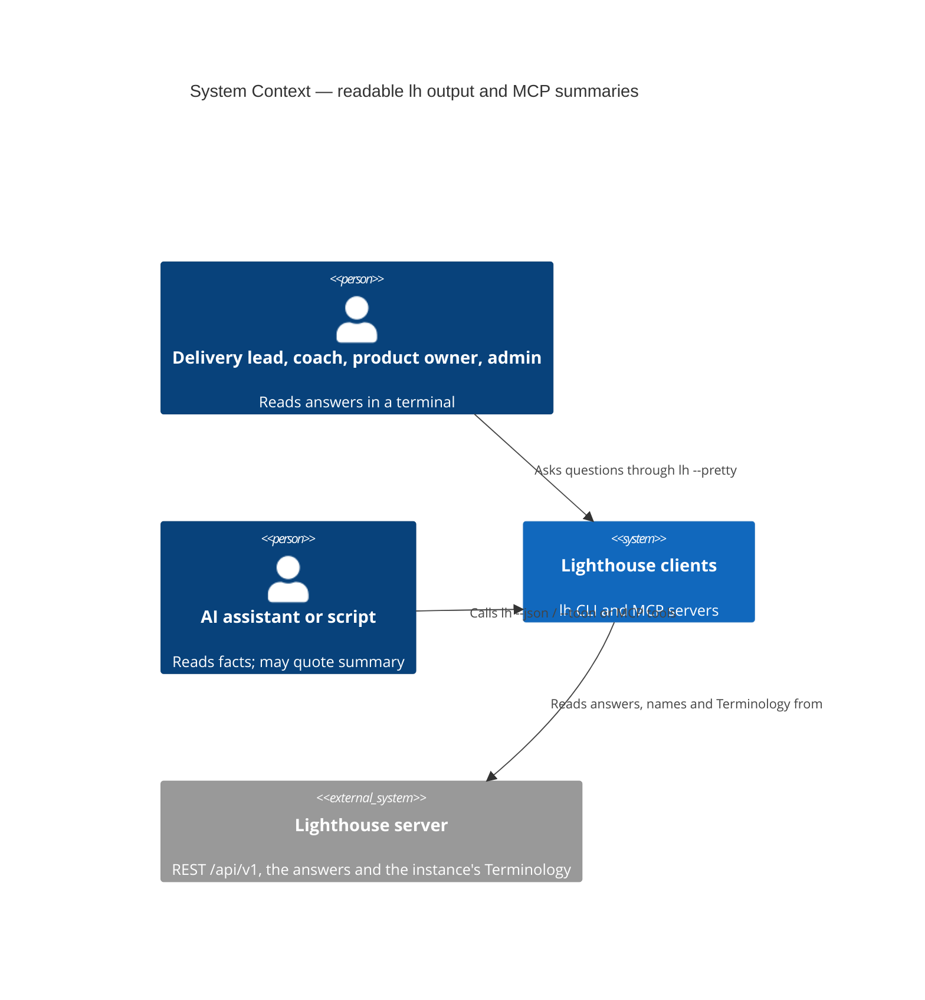
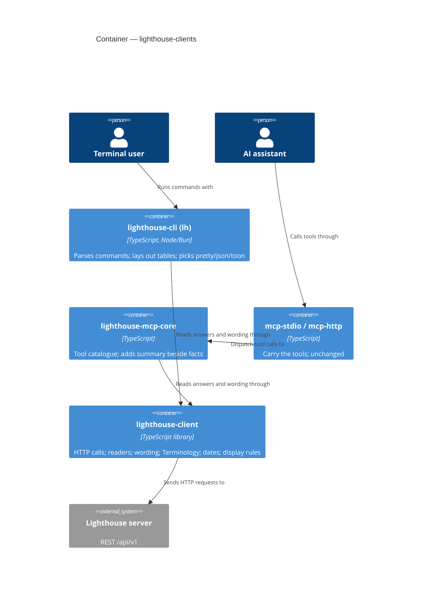
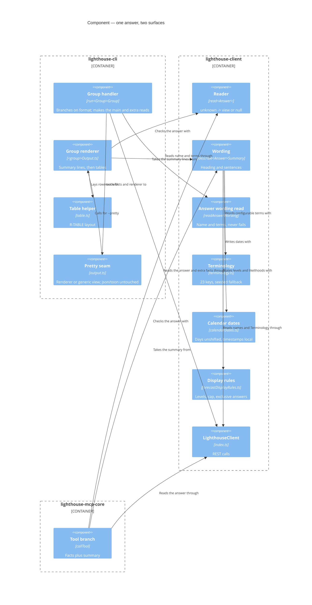

<!-- markdownlint-disable MD024 -->
# Feature Delta — story-6218-readable-cli-output

**ADO**: User Story #6218 — *CLI: every --pretty command reads like the web, not a facts dump* · no
parent Epic.

**Waves**: DISCUSS (2026-10-06, maintainer AFK — every product call taken here is listed under
"Decisions for the maintainer to confirm"), DESIGN (2026-10-06), DEVOPS (2026-10-07), DISTILL (2026-10-07). DISCOVER and DIVERGE
skipped by the maintainer, explicitly.

**One line**: `lh refinement get` already answers in the web's words; every other `lh` command still
prints the generic indented dump of field names. This story gives every command that answers a
question a renderer that says it the way the web page does — tables where the web lists, a sentence
and a compact table where the web gives one answer — while `--json` and `--toon` stay byte-for-byte
the facts.

**Repositories**: the code is `/storage/repos/lighthouse-clients` (packages `cli` and `client`); this
workspace lives in the Lighthouse repo because the clients repo has no feature workspace.

**Density**: `lean` + `ask-intelligent` (DISCUSS default). Tier-1 `[REF]` only; trigger evaluation at
the end of DoR Validation.

**Companion page for the maintainer**: `discuss/cli-sketches.md` — an ASCII mock of every command's new
output, the web file it mirrors, and the CLI style it reuses. Reviewed **once, before DELIVER**
(binding instruction).

---

## Wave: DISCUSS / [REF] Prior-Wave Reading

| File | Read |
|---|---|
| `docs/product/jobs.yaml` | ✓ — no existing job covers reading an answer in a terminal; one added (see JTBD) |
| `docs/product/personas/delivery-forecaster.yaml`, `flow-coach.yaml` | ✓ |
| `docs/product/journeys/` | ✓ — no CLI journey exists; one created |
| `docs/feature/story-6218-readable-cli-output/discover/`, `diverge/` | ⊘ skipped by the maintainer (Decision 0) |
| `docs/feature/epic-5510-5881-refinement/distill/clients-slice-09.md` | ✓ — the precedent: maintainer decisions 1–6 and the decided-in-DISTILL copy |
| `docs/feature/epic-5510-5881-refinement/slices/slice-09-clients-refinement-need.md` | ✓ |
| `docs/feature/story-6055-activity-names-the-work/feature-delta.md` | ✓ — house format for a no-Epic story |
| `lighthouse-clients/ARCHITECTURE.md` | ✓ — package boundaries: words in `client`, layout in `cli` |
| `lighthouse-clients/packages/cli/src/{index.ts,output.ts,refinementOutput.ts}` | ✓ |
| `lighthouse-clients/packages/client/src/{index.ts,refinementWording.ts,refinementVoteWording.ts}` | ✓ |
| `lighthouse-clients/skill/SKILL.md`, `packages/cli/README.md` | ✓ (output-format passages) |
| `Lighthouse.Frontend/src/…` web views per command | ✓ — cited per sketch in `cli-sketches.md` |
| `.claude/commands/` nw-discuss override | ⊘ none exists; the project checklist is `CLAUDE.md` "DISCUSS, DEVOPS & DELIVER Waves", answered below |

No DISCOVER evidence to contradict. The binding maintainer style guide is consistent with the
refinement precedent's decisions 1, 2 and 5.

---

## Wave: DISCUSS / [REF] Persona IDs

| Persona | Role here |
|---|---|
| `delivery-forecaster` | **Primary.** Lena Fischer, delivery lead for Ocean Explorer, asks *when* from a terminal before a steering meeting and pastes the answer into the meeting notes. |
| `flow-coach` | Priya Raman, coach of Team Gravity (the refinement precedent's persona), checks the Team's flow from the terminal before standup. |
| `product-owner` | Marco Bianchi, product owner of Ocean Explorer, checks a Feature's progress and its Work Items. |
| `config-admin` | Sofia Keller, Team admin of Gravity, scripts Team and blackout setup with `--payload-file` and reads the confirmation. |
| `platform-operator` | Tomás Rivera, runs a self-hosted Lighthouse, checks reachability and version after an upgrade. |

No new persona: each is an existing persona who happens to be in a terminal. The job below is the
thing they share.

---

## Wave: DISCUSS / [REF] JTBD One-Liner

| Job ID | One-liner |
|---|---|
| `job-read-lighthouse-answers-in-the-terminal` (**NEW**, appended to `jobs.yaml`) | When I ask Lighthouse a question from the terminal — when will these be done, how is the Team flowing, what is in this Delivery — I want the answer stated the way the web page states it, so I can act on it or paste it without decoding a dump of field names. |

- **Functional**: the same question gets the same answer, in the same words and columns, on the web and
  in `lh`; the raw facts are one flag away (`--json`, `--toon`).
- **Emotional**: from squinting ("which of these fields is the 85th percentile?") to reading.
- **Social**: an answer pasted from the terminal into a chat or a meeting note reads as Lighthouse's
  answer, not as a debug print.
- **Forces** — *Push*: the generic view prints every field, nested, under its code name
  (`howManyForecasts:`, `- probability: 85`, `value: 19`); `lh metrics team` prints every daily point
  of every series. *Pull*: `lh refinement get` (story #6147) shows it can be done and the maintainer
  approved it. *Anxiety*: scripts or agents that read `--pretty` break (it is the default format, and
  the skill's own example omits `--json` — S9); the CLI and the web drift apart once the words are
  copied. *Habit*: adding `--json | jq`, or opening the web page instead.
- **Opportunity score (desk estimate)**: importance 3, satisfaction 1, gap 2. Importance 3, not 4:
  the web answers every one of these questions already; the CLI is the second surface. Satisfaction 1:
  only refinement reads well today.

**JTBD-to-story bridge**: every story US-01 … US-09 traces to this one job (N:1). Each story's
"Decision enabled" line names the decision the job serves for that command group.

---

## Wave: DISCUSS / [REF] Current-State Surface Inventory

Read from the code on 2026-10-06.

| # | Fact | Evidence |
|---|---|---|
| S1 | **The generic view is a recursive key: value dump.** A record with `name`/`id` gets a `name [id: n]` heading; every other field prints under its wire name, arrays as `- ` items separated by blank lines. | `cli/src/output.ts` `formatPrettyLines` |
| S2 | **One command has its own renderer.** `PrettyRenderer` is accepted by `mapApiResultToCliResult`; only `lh refinement get` passes one. | `cli/src/index.ts` `runRefinementGet`; `ARCHITECTURE.md` §7 |
| S3 | **21 command forms go through the generic view**: team list/get/create/update, portfolio list/get/create/update, metrics team/portfolio, forecast manual/backtest, worktracking list/get, feature get/workitems, delivery list/metrics, blackout list/create/update, version get. **6 print a hand-written line**: team/portfolio delete and refresh, blackout delete, health check (`success`). | `cli/src/index.ts` group handlers |
| S4 | **Most client answers are typed `unknown`.** Teams, Portfolios, connections, Features, Deliveries, both forecasts and most metrics return `LighthouseApiResult<unknown>`. A renderer needs a shape to read; today nothing declares one. Typed: blackout rules, delivery metrics history, refinement, percentiles/PBC/blocked over time, cumulative state time, work item age over time. | `client/src/index.ts` `LighthouseClient` |
| S5 | **The Terminology resolver knows four words.** `resolveRefinementTerms` reads `workItem`, `workItems`, `team`, `refinement`; the instance has 23 configurable keys. | `client/src/refinementWording.ts`; `Lighthouse.Frontend/src/models/TerminologyKeys.ts` |
| S6 | **The table helper is private to refinement.** `toTableLines` lives in `refinementOutput.ts`. | `cli/src/refinementOutput.ts` |
| S7 | **`Team refreshed: 3` is wrong.** A refresh is queued, not done; the Task Manager shows it as `Refreshing Team 'Gravity'` while it runs. | `cli/src/index.ts` `runTeamGroup.refresh`; story #6055 |
| S8 | **`lh metrics team` with no `--metrics` makes 16 reads** and prints every daily point of every series. Its line count is not measured here; KPI-3's baseline is taken at slice 02's start on the dev instance. | `buildMetricsPayload` |
| S9 | **The agent skill shows a pretty-format call.** `lh forecast manual --team-id <id> --remaining 20` without `--json` — an agent following it reads the generic view today and the new view tomorrow. The general rule beside it says "Use `--json` when parsing output programmatically." | `skill/SKILL.md:255,297` |
| S10 | **The CLI README describes pretty as "surfaces `name` / `id` prominently"** — true of the generic view, incomplete after this story. | `packages/cli/README.md:141` |
| S11 | **Lighthouse's public docs show `--json` only.** No pretty sample to go stale. | `docs/aiintegration.md:113-124` |
| S12 | **The web hard-codes some configurable words**: `Total Throughput`, `Total Arrivals`, `Blocked` (widget titles) and `Likelihood to close {n} Items` (`ForecastLikelihood.tsx`). | `pages/Common/MetricsView/*Widget.tsx` |
| S13 | **Three reads lack the name their heading needs**: delivery metrics (no Delivery name), feature work items (no Feature name), and — the precedent — refinement (no Team name, solved with `getTeam`). | `client/src/index.ts` |
| S14 | **The web's forecast rules live in the browser**: the 50/70/85 level thresholds (`ForecastLevel.ts`), the `>95%` cap while work remains (`formatLikelihood.ts`), "No forecast outranks thin history" (`cannotForecast.ts`, `ForecastLikelihood.tsx`). The CLI must state the same rules, without forecasting anything. | `Lighthouse.Frontend/src/utils/forecast/` |

---

## Wave: DISCUSS / [REF] Locked Decisions

### D0 — Wave decisions (maintainer, binding)

DISCOVER and DIVERGE skipped. Feature type: user-facing (CLI). Walking skeleton: Depends — brownfield,
the renderer seam exists. UX depth: lightweight. JTBD: yes.

### D1 — The style guide (maintainer-approved, binding)

Every `--pretty` output: lists become tables with the columns the web shows for the same thing; a single
answer (a forecast, a metric, a verdict) becomes a sentence in the web's own wording plus a compact
table; the instance's Terminology everywhere, falling back to the seeded defaults as refinement does; ids
as `[id: n]`; `--json` and `--toon` stay byte-for-byte the raw facts. Writes get one-line confirmations
in the style of the approved refinement vote lines.

### D2 — Scope: every command that answers a question or confirms a change

42 command forms change (`cli-sketches.md` §1–9). Unchanged on purpose, with the reason in §10:
`refinement` (already the precedent), `connection` (a dialogue and `Label: value` status lines),
`config` (already sentences), `help`.

### D3 — Words in `client`, layout in `cli`, one Terminology resolver

The sentences each surface could share go in the `client` package beside `refinementWording.ts`; tables,
columns and padding stay in `cli`. This is `ARCHITECTURE.md` §2's boundary, which the precedent already
follows, and it is what lets an MCP tool later return the same `summary` the precedent's MCP tool does.
There is **one** resolver for every configurable term (S5): blank value → the entry's default → the
seeded word. Widening it is not a new abstraction in a slice of its own; it lands inside slice 01, the
first value slice, and grows a key at a time as later slices need one.

### D4 — Only `--pretty` reads more

A renderer may need reads the facts do not carry: the Team's name and its WIP limit, the instance's
Terminology, a Feature's name (S13). Those reads happen **only under `--pretty`**. `--json` and `--toon`
make exactly the calls they make today, and print exactly what they print today — the precedent's rule
(`runRefinementGet` branches before the extra reads). A failed Terminology read leaves the seeded words
standing; a failed read of a heading's name falls back to `{Term} [id: n]` rather than failing the
answer. (The precedent fails on a Team it cannot read; here a heading is never worth an error, because
the answer itself was read.)

### D5 — A shape the renderer does not recognise falls back to the generic view

S4: most answers are untyped, and servers older and newer than the CLI both exist. A renderer that does
not find the fields it reads prints today's generic view, exit 0 — never a crash, never `undefined` or
`NaN` in a cell. A field that is merely **absent** on an older server (for example `isOverdue`,
`hasSufficientData`) makes the renderer say nothing about it rather than guess.

### D6 — The instance's word where the web hard-codes a configurable one

S12: the CLI says `Total {Throughput}`, `{Blocked} {Work Items}` and `Likelihood to close 25 {Work
Items}`. The style guide says Terminology everywhere; the web's literals are a web inconsistency, noted
and out of scope here.

### D7 — The metrics headline is one screen; every day is one flag away

`lh metrics team|portfolio` without `--metrics` prints the dashboard's headline numbers, the percentile
table, and **one line per over-time metric** (first recorded day → last, and how many days were
recorded). `--metrics <name>` prints that metric's every day. `--json` keeps everything either way.

### D8 — The `workDistribution` placeholder is not printed

It is the CLI's own "no endpoint" marker, not a Lighthouse answer. `--json` keeps it.

### D9 — Backtest without the web's `Average:` bar

It needs a second Throughput read and arithmetic the CLI does not do. The actual is placed between
percentiles as an R-LINE (the chart's dashed line, in text).

### D10 — `lh portfolio list` without the `Deliveries` column

The web reads Deliveries once per Portfolio to fill it. The CLI prints a hint to
`lh delivery list --portfolio-id <id>` instead of N extra calls.

### D11 — Write confirmations: `<Verb>: <thing> [id: n].`

`Created:`, `Updated:`, `Deleted:`, `Refresh queued:` — the vote line's shape (past tense, colon, the
thing). A refresh says **queued**, correcting S7. A blackout rule is confirmed with the `summary`
Lighthouse sends, as the web's `Schedule` column shows it.

### D12 — A delete names the id only

The delete answer carries no name; reading the entity first to name it is a second call for one line.

### D13 — A cell holding four chances shrinks to the 85% one, named in the header

Delivery `Forecast:` chips and the Feature list's `Forecasted Completion` cell list 50/70/85/95. In a
table row the CLI shows the 85% date under a header that says so; the four are in `--json`.

### D14 — `delivery metrics --detail epics`: the latest day in detail

The per-Feature breakdown and forecast distribution of the **latest** recorded day; every day's detail
stays in `--json`. The flag keeps its name (renaming it breaks scripts); the output says Features.

### D15 — Dates and times

A calendar day reads `Fri 30 Oct 2026` and is never shifted by the reader's time zone (the refinement
rule, `formatDayAndDate`, plus the year because forecasts cross years). A timestamp reads
`Tue 6 Oct 2026, 07:14` in the reader's local time.

### D16 — Versioning: a minor bump per slice, pretty is not a contract

Each slice carries one changeset: **minor** for `@letpeoplework/lighthouse-cli` (default output visibly
changes), **minor** for `@letpeoplework/lighthouse-client` when it gains wording exports, and the
automatic patch for dependents (`updateInternalDependencies: patch`). `--pretty` is documented as
human-readable, `--json`/`--toon` as the contract (S9, S11), so a changed pretty view is not a major.
The changeset text says so in one sentence for anyone scraping it. Release batching is the maintainer's.

### D17 — MCP unchanged in this story

The MCP tools return TOON facts and stay as they are. D3 puts the sentences where a later MCP `summary`
can reuse them, as the refinement tool's does; doing so is a separate story.

### D18 — One Story, nine slices, no Epic

The work is a single ADO Story with no parent; the slices are its tasks. `CLAUDE.md`'s "each Epic ships
on its own" rule is **N/A, because** there is no Epic split — but its spirit is applied per slice: each
slice is releasable on its own and adds value even if no other slice ships.

---

## Wave: DISCUSS / [REF] Project DISCUSS Checklist (CLAUDE.md)

No silent N/A — every item answered.

| Item | Answer |
|---|---|
| **RBAC impact** | **N/A, because** the CLI calls the same endpoints with the same credential as today, and the only new reads (`getTeam`, `getTerminology`, `getFeaturesByIds`) are reads the caller can already make: the precedent makes the first two for any caller who can read a refinement, and a Terminology read that is refused falls back to the seeded words (D4). No gate is added, removed or moved; nothing touches `IRbacAdministrationService` or `useRbac()`. |
| **Lighthouse-Clients CLI/MCP versioning** | **Applies.** One changeset per slice: minor `lighthouse-cli`, minor `lighthouse-client` where wording exports are added, automatic patch for `mcp-core`/`mcp-stdio`/`mcp-http` (D16). `pnpm release:version` (with `GITHUB_TOKEN_CHANGESET`) and its `chore(release): version packages — …` commit before the push that releases — the CI does not version. The pending, unreleased refinement changesets (`.changeset/refinement-need.md`, …) ride in the same release if it happens first. MCP behaviour unchanged (D17). |
| **Website marketing surface** | **N/A for copy, verify at DELIVER.** The Lighthouse docs page that describes the CLI (`docs/aiintegration.md`) shows only `--json` examples (S11), so nothing there goes stale. The website repo was not readable from this session; slice 01's DELIVER greps it for pasted `lh` output and lists any hit as a follow-up, and records "no hit" otherwise. |
| **Usage data (DEVOPS question, forward pointer)** | **N/A here, because** the clients have no usage-data pipe yet; it is Story **#6193** (later). The candidate for #6193, recorded so it is not lost: a name-only event per command group, with the output format as a closed enum (`pretty` / `json` / `toon`), which would give KPI-4 its numerator. Never a free-text, id or count property. Decided in #6193, not here. |
| **Terminology** | **Applies, and is the core of D1.** Every configurable word in every renderer comes from the instance (S5, D3, D6); seeded defaults per `TerminologySeeder.cs` when a value is blank or the read fails. Docs and changesets written here use the seeded words (`Feature`, `Work Item`, `Team`, …), never "Epic"/"Story". The one tracker word that survives is the existing flag value `--detail epics` (a literal, kept for compatibility, D14); the output under it says Features. |
| **Sketch any UI before building it** | **Done as one page**, `discuss/cli-sketches.md`, by the maintainer's instruction: reviewed once before DELIVER, every command, the web file it mirrors and the CLI style it reuses. Each slice's DISTILL re-sketches only what that review leaves open. |
| **Docs / screenshots / demo data at finalization** | Docs: **applies** — `packages/cli/README.md` "Output Formats" (S10), `skill/SKILL.md` (S9 — state that `--pretty` is for people and `--json`/`--toon` for scripts and agents, and add `--json` to the forecast example), `lighthouse-clients/ARCHITECTURE.md` §7 ("Only `lh refinement get` has one so far" becomes false). Lighthouse `docs/aiintegration.md`: **N/A, because** it shows `--json` only. Screenshots: **N/A, because** there is no rendered UI and no docs page shows CLI output. Demo data: **N/A, because** no seeded data changes — the demo instance is the dogfood fixture as it is. |
| **Release notes** | The clients' CHANGELOG via the changesets. A line in Lighthouse's own release notes is **not** proposed (no server change); a decision to confirm. |

---

## Wave: DISCUSS / [REF] Scope Assessment

**PASS — right-sized, already sliced thin.** 9 stories (threshold >10); 2 packages, one bounded context
— presentation of answers the clients already fetch (threshold >3); no walking-skeleton integration
points beyond the existing seam (threshold >5); ~5½ days of crafter dispatch (threshold >2 weeks). One
signal fires — the outcomes ship separately — and that is the shape the maintainer asked for, not a
reason to split into Epics (D18).

---

## Wave: DISCUSS / [REF] WS Strategy

**C — no walking skeleton.** Brownfield: the per-command `PrettyRenderer` seam, the table helper, the
heading style and the Terminology fallback all ship today in `lh refinement get`. Slice 01 is the
thinnest end-to-end change and carries the three shared pieces the rest reuse (D3).

---

## Wave: DISCUSS / [REF] Journey (lightweight)

**Read an answer in the terminal and act on it** — persona `delivery-forecaster`, job
`job-read-lighthouse-answers-in-the-terminal`. Full schema in
`docs/product/journeys/story-6218-readable-cli-output.yaml`.

```text
[find the id]           [ask the question]          [drill in]               [act / change]
lh team list      →     lh forecast manual …   →    lh metrics … --metrics   lh team update …
a table, Name [id]      sentence + compact table    every day, one table     "Updated: Team …"
  Feels: oriented         Feels: answered             Feels: sure              Feels: done
```

- **Emotional arc**: squinting → reading → done. Start: "which of these 200 lines is the number I want?"
  Middle: "Gravity: 85% by Mon 9 Nov." End: the answer is pasted into the meeting note unchanged.
- **Shared artifacts**: the Team/Portfolio name in every heading (source: the Team/Portfolio read);
  every configurable word (source: the instance's Terminology, one resolver, seeded fallback); every
  date (source: the wire's calendar day, never re-zoned; D15); every forecast level and cap (source: the
  web's rules restated in `client`, S14).
- **Error paths**: Lighthouse refuses → `category: reason`, exit 1 (unchanged). Terminology unreadable →
  seeded words, exit 0. A heading's name unreadable → `{Term} [id: n]`, exit 0 (D4). A shape the renderer
  does not know → the generic view, exit 0 (D5). A field missing on an older server → not mentioned
  (D5).

---

## Wave: DISCUSS / [REF] Driving Ports

| Surface | Change |
|---|---|
| `lh <group> <subcommand>` with `--pretty` (the default) | 42 forms render the web's words and columns (`cli-sketches.md` §1–9). |
| `lh … --json` / `--toon` | **None.** Same bytes, same calls (D4). Asserted per slice. |
| `@letpeoplework/lighthouse-client` exports | New: a wording module per command group (forecast, metrics, delivery, …) and a general Terminology resolver; the existing refinement wording exports keep their names and signatures. |
| MCP tools | **None** (D17). |
| Lighthouse HTTP API | **None.** No new endpoint, no new field. Every gap a heading hits is closed with an existing read (S13, D4). |
| Lighthouse web | **None.** S12's hard-coded words are noted, not fixed. |
| Docs | `packages/cli/README.md`, `skill/SKILL.md`, clients `ARCHITECTURE.md` §7 (checklist row). |

---

## Wave: DISCUSS / [REF] Pre-requisites

- **The renderer seam** (story #6147, slice 09 of epic-5510-5881) is in the clients' `main`. Satisfied.
- **The refinement vote lines** (story #6156) are the R-REC style the writes copy. In `main`; satisfied.
- **Unreleased refinement changesets** sit in `.changeset/`. Not a blocker; whichever release comes
  first carries both (checklist row).
- **No Lighthouse change is needed.** Every reading is of a field the server already sends; where a
  heading's name is missing (S13) an existing read supplies it.
- Nothing else in flight touches `cli/src/output.ts`, `refinementOutput.ts` or `refinementWording.ts`.
  **#6193** (usage data) will touch the CLI's command dispatch later; the two do not overlap.

---

## Wave: DISCUSS / [REF] Out of Scope

- **MCP `summary` fields** for the commands converted here (D17) — a follow-up story, cheap once D3's
  wording exists.
- **Fixing the web's hard-coded configurable words** (S12, D6).
- **The backtest `Average`** (D9), the portfolio list `Deliveries` column (D10), the Feature list
  `Parent`, `Dependencies` and `Warnings` columns (`cli-sketches.md` §8).
- **Naming a deleted entity** (D12).
- **New Lighthouse fields** to save the extra `--pretty` reads (S13) — a Delivery name on the metrics
  read, a Feature name on the work-items read. Worth it only if the extra call is ever felt.
- **Colour, icons, `--wide`/`--verbose` flags, paging, terminal-width detection.** Material honesty: the
  level words (`Certain`, `Risky`) carry what the web's icons and colours carry; plain text survives a
  pipe and a paste.
- **`lh connection`, `lh config`, `lh help`** (D2).
- **Usage-data events** — #6193.

---

## Wave: DISCUSS / [REF] System Constraints (all stories)

1. `--json` and `--toon` output is byte-for-byte unchanged, and so is the set of calls they make (D4).
2. Every configurable word comes from one resolver: instance value → entry default → seeded word (D3).
3. An unrecognised shape renders the generic view, exit 0; an absent field is not mentioned (D5).
4. A failed `--pretty`-only read never fails the command (D4).
5. Errors keep today's form: `category: reason` on stderr, exit 1.
6. Ids read `[id: n]`; dates per D15.
7. Words live in `client`, layout in `cli` (D3, `ARCHITECTURE.md` §2).
8. No re-derivation of a Lighthouse number: the CLI counts and orders rows it was given and restates the
   web's display rules (levels, cap, exclusive answers — S14); it never forecasts or recomputes a
   percentile.

---

## Wave: DISCUSS / [REF] User Stories

### US-01 — The forecast reads like the Forecast tab

`job_id`: `job-read-lighthouse-answers-in-the-terminal` · persona `delivery-forecaster` (Lena Fischer) ·
slice 01 · ~6h

#### Problem

Lena Fischer leads delivery for Ocean Explorer. Before Thursday's steering meeting she asks Gravity's
forecast for the 25 Work Items left in the pilot: `lh forecast manual --team-id 3 --remaining 25
--target-date 2026-10-30`. She gets `whenForecasts:` followed by eight indented `probability:` /
`expectedDate:` pairs in ISO timestamps, then the same for `howManyForecasts`, then `likelihood:
48.2034…`. She opens the web page instead, because that is where the answer is legible.

#### Elevator Pitch

```text
Before: lh forecast manual prints whenForecasts/howManyForecasts as indented probability/expectedDate
        pairs and a raw likelihood float.
After:  run `lh forecast manual --team-id 3 --remaining 25 --target-date 2026-10-30` → sees
        "When will 25 Work Items be done?" over a Chance · Level · Date table (95% Certain Fri 13 Nov
        2026 … 50% Risky Fri 30 Oct 2026), the "How Many" table, and "Likelihood to close 25 Work
        Items by Fri 30 Oct 2026: 48.20%".
Decision enabled: Lena decides which date to commit to in the steering meeting — the 85% one — and
        pastes the table into the meeting note as it is.
```

#### Domain Examples

1. **Happy path** — Gravity, 25 Work Items, target Fri 30 Oct 2026: the sketch in `cli-sketches.md` §1.
2. **Confidence cap** — Gravity, 6 Work Items, target Fri 30 Oct 2026, likelihood 98.71 with work
   remaining → `Likelihood to close 6 Work Items by Fri 30 Oct 2026: >95%`.
3. **Thin history** — Lightspeed (created last week, 3 days with closed items), `hasSufficientData:
   false` → the likelihood line is replaced by `Not enough data yet — need at least 5 days with completed
   items to forecast.`
4. **Renamed words** — an instance where Work Items are *Tickets* and Throughput is *Delivery Rate*:
   `When will 25 Tickets be done?`, `… · Use filtered Delivery Rate`.
5. **Backtest** — Gravity, September against July–August: actual 21 falls between 70% (21) and 85%
   (18): `── Actual Throughput: 21 Work Items ──` after the 70% row.

#### UAT Scenarios (BDD)

```gherkin
Scenario: Lena reads Gravity's forecast in the Forecast tab's words
  Given Gravity's manual forecast for 25 Work Items by Fri 30 Oct 2026 has dates for 50, 70, 85 and 95%
  When Lena runs lh forecast manual --team-id 3 --remaining 25 --target-date 2026-10-30
  Then she reads "When will 25 Work Items be done?" above a table, highest chance first
  And each row names its level: 95% Certain, 85% Confident, 70% Realistic, 50% Risky
  And the last line is "Likelihood to close 25 Work Items by Fri 30 Oct 2026: 48.20%"

Scenario: A likelihood above the cap is not overstated while work remains
  Given Gravity's likelihood to close 6 Work Items by Fri 30 Oct 2026 is 98.71%
  When Lena runs the forecast
  Then the likelihood reads ">95%"

Scenario: A Team with too little history says so instead of a number
  Given Lightspeed's forecast reports that it lacks sufficient data
  When Lena runs lh forecast manual --team-id 2 --remaining 10 --target-date 2026-10-30
  Then she reads "Not enough data yet — need at least 5 days with completed items to forecast."
  And no likelihood percentage is shown

Scenario: The backtest shows where the actual landed among the percentiles
  Given Gravity's September backtest forecast 24, 21, 18 and 15 Work Items and the actual was 21
  When Lena runs lh forecast backtest for September against July and August
  Then the actual is drawn as "── Actual Throughput: 21 Work Items ──" after the 70% row
  And the Period line names both date ranges as the Backtest Results page does

Scenario: Scripts still get the facts
  Given the same forecast
  When Lena runs it with --json, and again with --toon
  Then each output is byte-for-byte what the CLI printed before this story
  And Lighthouse received no Team or Terminology read for either
```

#### Acceptance Criteria

- [ ] AC-01.1 — The When table lists every chance on the wire, highest first, each with its level by the
  web's 50/70/85 thresholds and its date per D15.
- [ ] AC-01.2 — `>95%` whenever the likelihood exceeds 95 and work remains; two decimals otherwise;
  `Cannot forecast` when the likelihood is null; the insufficient-data sentence replaces the line when
  `hasSufficientData` is false; absent `hasSufficientData` is treated as not saying (D5).
- [ ] AC-01.3 — With only `--remaining` the When table alone; with only `--target-date` the How Many
  table alone.
- [ ] AC-01.4 — The backtest places the actual as an R-LINE between the percentiles it falls between,
  first or last when outside them; the Period line matches `BacktestResultDisplay.tsx`.
- [ ] AC-01.5 — Every configurable word follows the instance's Terminology; a failed Terminology read
  leaves the seeded words and exit 0.
- [ ] AC-01.6 — `--json`/`--toon` unchanged in bytes and calls (constraint 1).
- [ ] AC-01.7 — **Production data**: on the dev instance (real history), the forecast for a real Team
  matches the web Forecast tab's dates and likelihood for the same inputs, side by side.

#### Outcome KPIs

- **Who**: anyone running `lh forecast` with the default format. **Does what**: reads the date to commit
  to without opening the web. **By how much**: the forecast output answers in ≤ 15 lines (from ~40+).
  **Measured by**: the walking-skeleton test's line count on the sketch's data. **Baseline**: the
  generic view's line count, captured at slice start.

#### Technical Notes

- `runManualForecast` / `runBacktest` return `unknown` (S4); the renderer needs a declared shape and a
  D5 fallback. The Team's name needs `getTeam` (S13).
- The level thresholds and the cap are web display rules (S14) restated in `client`; DESIGN picks where
  they live so the two cannot drift silently (a test pinning the same cases the web pins).
- This slice also lands the general Terminology resolver, the shared table helper (moved out of
  `refinementOutput.ts` unchanged) and the date formatting (D3, D15). Refinement's output must not change
  by a byte.

---

### US-02 — The metrics headline fits one screen

`job_id`: `job-read-lighthouse-answers-in-the-terminal` · persona `flow-coach` (Priya Raman) · slice 02 ·
~6h

#### Problem

Priya Raman coaches Team Gravity. Before standup she runs `lh metrics team --id 3` to see whether
Gravity's WIP is creeping up. She gets every daily point of throughput, arrivals, WIP, Work Item Age,
blocked and percentiles, nested under wire names — hundreds of lines — and scrolls back to find the WIP
count.

#### Elevator Pitch

```text
Before: lh metrics team --id 3 prints every series' every day under wire names; the headline numbers
        are somewhere in it.
After:  run `lh metrics team --id 3` → sees "Gravity · Mon 7 Sep 2026 – Tue 6 Oct 2026 (30 days)",
        "Work Items in Progress  9  System WIP Limit: 10 Work Items", Total Throughput, Total Arrivals,
        Blocked, Total Work Item Age, Predictability Score, a Percentile · Cycle Time · Work Item Age
        table, and one line per over-time metric.
Decision enabled: Priya decides whether WIP or age is the thing to raise at standup today.
```

#### Domain Examples

1. **Happy path** — Gravity, 30 days: `cli-sketches.md` §2.
2. **Portfolio** — Ocean Explorer, 90 days: counted thing is the Feature term (`Features in Progress`).
3. **One metric refused** — the server refuses predictability (`dependency-failure: …`): that line reads
   `Predictability Score  dependency-failure: …`, the rest renders, exit 0 (today's per-section rule).
4. **No limit set** — Meridian has no System WIP limit: the `System WIP Limit` part is omitted, as the
   widget omits `Limit:`.

#### UAT Scenarios (BDD)

```gherkin
Scenario: Priya sees Gravity's headline numbers on one screen
  Given Gravity has 9 Work Items in progress against a limit of 10, 31 closed and 28 started in 30 days
  When Priya runs lh metrics team --id 3
  Then she reads "Work Items in Progress", "Total Throughput", "Total Arrivals", "Blocked Work Items",
    "Total Work Item Age" and "Predictability Score" with their values
  And a table of the 95th, 85th, 70th and 50th percentiles of Cycle Time and Work Item Age
  And the whole answer is at most 30 lines

Scenario: Over-time metrics are summarised, not listed day by day
  Given Gravity has 29 recorded days of Cycle Time percentiles in the range
  When Priya runs lh metrics team --id 3
  Then she reads one line: the 85th percentile on the first and the last recorded day, and "29 days recorded"
  And a hint that --metrics percentilesOverTime prints every day

Scenario: A refused metric does not hide the others
  Given Lighthouse refuses Gravity's predictability score
  When Priya runs lh metrics team --id 3
  Then the Predictability Score line carries the refusal's category and reason
  And every other headline number is shown and the command exits 0

Scenario: A Portfolio counts Features
  Given Ocean Explorer has 4 Features in progress
  When Priya runs lh metrics portfolio --id 2
  Then she reads "Features in Progress  4" and a 90-day range in the heading
```

#### Acceptance Criteria

- [ ] AC-02.1 — Headline lines in the dashboard's order and words (D6 applied), values per the facts.
- [ ] AC-02.2 — Percentile table highest first, `n days` / `1 day`, Cycle Time and Work Item Age side by
  side; a missing column says `—`.
- [ ] AC-02.3 — One line per over-time metric (D7); an empty series says the web's empty-state sentence.
- [ ] AC-02.4 — `workDistribution` not printed (D8); a refused section prints its refusal in place.
- [ ] AC-02.5 — ≤ 30 lines for the sketch's Team on demo data (KPI-3).
- [ ] AC-02.6 — `--json`/`--toon` unchanged in bytes and calls.
- [ ] AC-02.7 — **Production data**: on the dev instance, a real Team's headline matches its web
  dashboard's widgets for the same range.

#### Outcome KPIs

- **Who**: people running `lh metrics` without `--metrics`. **Does what**: find a headline number
  without scrolling. **By how much**: ≤ 30 lines (KPI-3). **Measured by**: line count on demo data.
  **Baseline**: captured at slice start (S8).

#### Technical Notes

- The headline needs the Team's/Portfolio's name and `systemWIPLimit` (one `getTeam`/`getPortfolio`,
  `--pretty` only).
- "Blocked Work Items" counts in-progress items flagged `isBlocked` in `wip.current` (counting rows, not
  re-deriving); on a server older than v26.7.3.1, which sends no flag, the line is omitted (D5).

---

### US-03 — One metric, every day, as a table

`job_id`: `job-read-lighthouse-answers-in-the-terminal` · persona `flow-coach` (Priya Raman) · slice 03 ·
~6h

#### Problem

The headline tells Priya Gravity's throughput fell; she wants the days. `--metrics throughput` today
prints `daily:` and thirty `- date: … count: …` pairs under the full payload's other keys.

#### Elevator Pitch

```text
Before: lh metrics team --id 3 --metrics throughput prints a "daily:" list of date/count pairs.
After:  run `lh metrics team --id 3 --metrics throughput` → sees "Total Throughput: 31 Work Items,
        1.0 / day" over a Date · Work Items closed table, one row per day.
Decision enabled: Priya decides which day to ask about ("nothing closed Tue 8 – Thu 10 Sep: why?").
```

#### Domain Examples

1. `--metrics throughput` and `--metrics arrivals` — `cli-sketches.md` §3.
2. `--metrics wip` — the 9 in-progress items with age and `since Thu 1 Oct 2026` on GR-061, then the
   daily WIP table.
3. `--metrics percentilesOverTime` on a freshly upgraded server with no recorded days → `Nothing to show
   for the selected range. Days appear here as Lighthouse records them.`
4. `--metrics cycleTime --definition-id 4` → `Lead Time Percentiles: …`.

#### UAT Scenarios (BDD)

```gherkin
Scenario: Priya sees each day's throughput
  Given Gravity closed 31 Work Items between Mon 7 Sep and Tue 6 Oct 2026
  When Priya runs lh metrics team --id 3 --metrics throughput
  Then she reads "Total Throughput: 31 Work Items, 1.0 / day"
  And a table with one row per day, dated as "Mon 7 Sep 2026"

Scenario: The Work Items in progress are listed with their age and blocked state
  Given GR-061 has been in progress 14 days and blocked since Thu 1 Oct 2026
  When Priya runs lh metrics team --id 3 --metrics wip
  Then GR-061's row shows "14 days" and "since Thu 1 Oct 2026"

Scenario: An over-time metric with nothing recorded says why in the web's words
  Given Lighthouse has recorded no percentile days for Gravity in the range
  When Priya runs lh metrics team --id 3 --metrics percentilesOverTime
  Then she reads "Nothing to show for the selected range. Days appear here as Lighthouse records them."

Scenario: Several named metrics are each shown in full
  When Priya runs lh metrics team --id 3 --metrics throughput,blocked
  Then she reads the throughput table and then the blocked table, each under its own sentence
```

#### Acceptance Criteria

- [ ] AC-03.1 — Each of `throughput`, `arrivals`, `wip`, `cycleTime`, `workItemAge`, `totalWorkItemAge`,
  `predictabilityScore`, `blocked`, `percentilesOverTime`, `processBehaviorOverTime` renders per its
  sketch: a sentence, then its table.
- [ ] AC-03.2 — Over-time empty series use `overTimeEmptyState.ts`'s sentence verbatim.
- [ ] AC-03.3 — `--definition-id` names the cycle time in the sentence.
- [ ] AC-03.4 — Several names render in the order given, each complete.
- [ ] AC-03.5 — `--json`/`--toon` unchanged.
- [ ] AC-03.6 — **Production data**: on the dev instance, `--metrics percentilesOverTime` lists the days
  the web's Percentiles over Time widget plots.

#### Outcome KPIs

- **Who**: people drilling into one metric. **Does what**: read a day's value without `jq`. **By how
  much**: 10 of 10 metric names render a table (KPI-1 component). **Measured by**: a table-driven test
  over every `METRIC_KEYS` member except `cumulativeStateTime` (slice 04). **Baseline**: 0 of 10.

#### Technical Notes

- One daily-table shape should serve every series (learning hypothesis); a metric needing its own
  layout is a sign the slice is not thin.

---

### US-04 — Time in State as a table, with its drill-down

`job_id`: `job-read-lighthouse-answers-in-the-terminal` · persona `flow-coach` (Priya Raman) · slice 04 ·
~3h

#### Problem

Priya suspects Review is where Gravity's time goes. `--metrics cumulativeStateTime` prints `bar:` with
nested state records, `candidates:` with every Work Item, and nothing in workflow order she can scan.

#### Elevator Pitch

```text
Before: --metrics cumulativeStateTime prints "bar:", "states:", "candidates:" as nested records.
After:  run `lh metrics team --id 3 --metrics cumulativeStateTime --state Review` → sees
        "Time in State across 42 Work Items" over a State · Total days · Work Items · Completed ·
        Ongoing · Mean · Median table, then "Work Items contributing to Review" with Days Contributed.
Decision enabled: Priya decides which Work Items in Review to talk about first.
```

#### Domain Examples

1. All states, Gravity, 30 days — `cli-sketches.md` §4.
2. `--state Review` — the drill-down list, `Days Contributed` per item.
3. `--item-ids 61,64` — the table over 2 Work Items.
4. A state with no median (`medianDays: null`) → `—`.

#### UAT Scenarios (BDD)

```gherkin
Scenario: Priya sees where Gravity's time goes, state by state
  Given Gravity's Work Items spent 241 days in In Progress and 88 in Review over 30 days
  When Priya runs lh metrics team --id 3 --metrics cumulativeStateTime
  Then she reads one row per state in workflow order with total days, Work Items, mean and median

Scenario: Priya drills into Review
  When Priya adds --state Review
  Then she reads "Work Items contributing to Review" and a row per Work Item with its Days Contributed

Scenario: A state without a median says so plainly
  Given the Test state has no median
  When Priya runs the command
  Then the Median cell for Test reads "—"
```

#### Acceptance Criteria

- [ ] AC-04.1 — Rows in `workflowOrder`; columns per the sketch; `—` for a null median.
- [ ] AC-04.2 — `--state` adds the drill-down titled as the web's dialog; `--item-ids` narrows the count
  in the heading.
- [ ] AC-04.3 — The candidates list is not printed in `--pretty` (it is the web's picker, not an answer).
- [ ] AC-04.4 — `--json`/`--toon` unchanged.
- [ ] AC-04.5 — **Production data**: dev instance, a real Team's rows match the web chart's tooltips.

#### Outcome KPIs

- Completes KPI-1 for the metrics group (11 of 11). Measured as US-03's.

#### Technical Notes

- `CumulativeStateTime*` types exist (typed, S4) — the cheapest renderer of the set.

---

### US-05 — Teams and Portfolios as the Overview's tables

`job_id`: `job-read-lighthouse-answers-in-the-terminal` · persona `delivery-forecaster` (Lena Fischer) ·
slice 05 · ~5h

#### Problem

Lena needs Gravity's id to forecast. `lh team list` prints each Team's full record — every Feature
reference, every Portfolio reference, every setting — and the ids are buried under seven pages.

#### Elevator Pitch

```text
Before: lh team list prints every field of every Team; lh team get prints the record nested.
After:  run `lh team list` → sees a "Teams" table: Name [id: n] · Features · Tags · Last Updated; run
        `lh team get --id 3` → sees "Gravity [id: 3]", "Last Updated on …", and the quick-settings
        lines ("Service Level Expectation: 85% of Work Items within 12 days or less", …).
Decision enabled: Lena picks the Team to forecast and sees its SLE and WIP limit before she asks.
```

#### Domain Examples

1. `lh team list` on demo data — seven Teams (§5).
2. `lh portfolio list` — five Portfolios and the `lh delivery list` hint (D10).
3. `lh team get --id 3` — Gravity's header and settings lines.
4. Meridian with no SLE → `Service Level Expectation: Not set` (`SleQuickSetting.tsx`).

#### UAT Scenarios (BDD)

```gherkin
Scenario: Lena finds Gravity's id at a glance
  Given the demo instance has seven Teams
  When Lena runs lh team list
  Then she reads a "Teams" table with Name, Features, Tags and Last Updated
  And the Name cell for Gravity reads "Gravity [id: 3]"
  And "1 Feature" and "6 Features" are worded as the Overview words them

Scenario: Lena reads a Team's settings as the Team page states them
  Given Gravity's SLE is 85% within 12 days and its System WIP limit is 10
  When Lena runs lh team get --id 3
  Then she reads "Service Level Expectation: 85% of Work Items within 12 days or less"
  And "System WIP Limit: 10 Work Items"

Scenario: An unset setting says "Not set"
  Given Meridian has no SLE
  When Lena runs lh team get --id 4
  Then she reads "Service Level Expectation: Not set"

Scenario: The Portfolio list points at Deliveries instead of fetching them
  When Lena runs lh portfolio list
  Then she reads a "Portfolios" table and the hint "lh delivery list --portfolio-id <id>"
  And Lighthouse received no Delivery read
```

#### Acceptance Criteria

- [ ] AC-05.1 — List columns per `DataOverviewTable.tsx`, titled `{Teams}` / `{Portfolios}`.
- [ ] AC-05.2 — `get` lines per `FeatureOwnerHeader.tsx` and the quick-settings components; `Not set`
  where the web says it.
- [ ] AC-05.3 — No Delivery reads for `portfolio list` (D10).
- [ ] AC-05.4 — A Team whose record lacks a field the table needs shows `—` in that cell; a list whose
  items lack `name` and `id` falls back to the generic view (D5).
- [ ] AC-05.5 — `--json`/`--toon` unchanged.
- [ ] AC-05.6 — **Production data**: dev instance `lh team list` matches the Overview's Teams table.

#### Outcome KPIs

- **Who**: people looking up an id. **Does what**: find it on the first screen. **By how much**: one
  line per Team (from one record of ~30+ lines per Team). **Measured by**: line count on demo data.

#### Technical Notes

- `listTeams`/`getTeam`/`listPortfolios`/`getPortfolio` are `unknown` (S4). Learning hypothesis: the
  list answer carries `remainingFeatures`, `tags`, `lastUpdated` as the web's model expects.

---

### US-06 — Deliveries read like the Delivery cards

`job_id`: `job-read-lighthouse-answers-in-the-terminal` · persona `delivery-forecaster` (Lena Fischer) ·
slice 06 · ~5h

#### Problem

Lena owns Ocean Explorer's Q4 Release. `lh delivery list --portfolio-id 2` prints each Delivery's
`featureLikelihoods`, `completionDates` and rules, nested; `lh delivery metrics` prints a row of field
names per day.

#### Elevator Pitch

```text
Before: lh delivery list prints each Delivery as a nested record of likelihoods and dates.
After:  run `lh delivery list --portfolio-id 2` → sees "Ocean Explorer · Deliveries" over a table:
        Name · Delivery Date · Features · Done · Likelihood · Forecast 85%, with "Overdue",
        ">95%", "Not enough data" and "Cannot forecast" as the web's header chip says them.
Decision enabled: Lena decides which Delivery needs a scope conversation this week.
```

#### Domain Examples

1. Four Deliveries on Ocean Explorer (§7): on track, capped `>95%`, `Overdue`, `Not enough data`.
2. `lh delivery metrics --delivery-id 11` — 22 recorded days.
3. `--detail epics` — the latest day's per-Feature table and its forecast distribution (D14).
4. An older server without `isOverdue` → the Likelihood column shows the number, never `Overdue` (D5).

#### UAT Scenarios (BDD)

```gherkin
Scenario: Lena sees every Delivery of Ocean Explorer in one table
  Given Ocean Explorer has the Q4 Release (78%), the Pilot Launch (98.6% with work left), Beta Drop
    (overdue) and Spring Rollout (not enough data)
  When Lena runs lh delivery list --portfolio-id 2
  Then the Likelihood cells read "78%", ">95%", "Overdue" and "Not enough data"

Scenario: A Delivery that cannot be forecast says so before anything else
  Given a Delivery with a Team that cannot be forecast and too little history
  When Lena lists the Deliveries
  Then its Likelihood cell reads "Cannot forecast"

Scenario: Lena follows the Q4 Release day by day
  Given the Q4 Release has 22 recorded days
  When Lena runs lh delivery metrics --delivery-id 11
  Then she reads one row per day with Done, Remaining, Total, Features and Likelihood

Scenario: The per-Feature detail is the latest day's
  When Lena adds --detail epics
  Then she reads the latest day's Features with Done, Likelihood and Size, and its four chances
```

#### Acceptance Criteria

- [ ] AC-06.1 — Exclusive likelihood answers in the web's order (`whatTheHeaderChipSays`), `Overdue`
  only when the server says so.
- [ ] AC-06.2 — Forecast 85% column per D13; `—` when absent.
- [ ] AC-06.3 — Metrics heading per sketch (no Delivery name — S13); `--detail epics` per D14; default
  size marked as the web marks it.
- [ ] AC-06.4 — `--json`/`--toon` unchanged.
- [ ] AC-06.5 — **Production data**: dev instance Deliveries match their web cards' chips.

#### Outcome KPIs

- **Who**: delivery owners. **Does what**: read each Delivery's standing in one line. **By how much**:
  one row per Delivery. **Measured by**: line count on demo data.

---

### US-07 — Features as the Feature list, and their Work Items

`job_id`: `job-read-lighthouse-answers-in-the-terminal` · persona `product-owner` (Marco Bianchi) ·
slice 07 · ~4h

#### Problem

Marco owns OE-002 *Deep-sea camera stream*. `lh feature get --refs OE-002` prints its record — remaining
and total work per Team, every forecast, every link — and `lh feature workitems --id 2` prints each Work
Item's full record.

#### Elevator Pitch

```text
Before: lh feature get prints each Feature's full nested record; workitems prints full records.
After:  run `lh feature get --refs OE-001,OE-002,OE-007` → sees a table: Feature Name · Progress ·
        Forecasted Start · Forecasted Completion (85%) · State; run `lh feature workitems --id 2` →
        sees "OE-002 Deep-sea camera stream · 13 Work Items" over ID · Name · Type · State · Owned by.
Decision enabled: Marco decides whether OE-002 needs a Team's attention or is on its way.
```

#### Domain Examples

1. Three Ocean Explorer Features (§8), one `Cannot forecast`.
2. OE-002's 13 Work Items across Gravity and Voyager.
3. The Feature-name read fails → heading `Feature [id: 2] · 13 Work Items` (D4).

#### UAT Scenarios (BDD)

```gherkin
Scenario: Marco reads his Features as the Feature list shows them
  Given OE-002 has 8 of 13 Work Items done and an 85% completion of Fri 20 Nov 2026
  When Marco runs lh feature get --refs OE-001,OE-002,OE-007
  Then OE-002's row reads "8 of 13 Work Items" and "Fri 20 Nov 2026"
  And OE-007's completion reads "Cannot forecast"

Scenario: Marco sees who owns each Work Item of OE-002
  When Marco runs lh feature workitems --id 2
  Then he reads "OE-002 Deep-sea camera stream · 13 Work Items" and a row per Work Item with its owner

Scenario: The heading survives a failed name read
  Given the Feature read fails while the Work Items read succeeds
  When Marco runs lh feature workitems --id 2
  Then the heading reads "Feature [id: 2] · 13 Work Items" and the command exits 0
```

#### Acceptance Criteria

- [ ] AC-07.1 — Columns per `columns.tsx`, `Cannot forecast` per `cannotForecast.ts`, D13 for the
  completion cell.
- [ ] AC-07.2 — Work-items columns per `WorkItemsDialog.tsx`; heading per sketch with D4 fallback.
- [ ] AC-07.3 — `--json`/`--toon` unchanged in bytes and calls (no Feature-name read).
- [ ] AC-07.4 — **Production data**: dev instance Features match the Portfolio's Feature list.

#### Outcome KPIs

- One row per Feature and per Work Item. Measured by line count on demo data.

---

### US-08 — Every write confirms in one line

`job_id`: `job-read-lighthouse-answers-in-the-terminal` · persona `config-admin` (Sofia Keller) ·
slice 08 · ~3h

#### Problem

Sofia scripts Team setup. `lh team create --payload-file lightspeed.json` echoes the whole created Team;
`lh team refresh --id 3` says `Team refreshed: 3` while the refresh has only been queued (S7).

#### Elevator Pitch

```text
Before: create/update echo the full record; refresh claims "Team refreshed: 3" before anything ran.
After:  run `lh team create --payload-file lightspeed.json` → sees "Created: Team Lightspeed [id: 9]."
        and `lh team refresh --id 3` → sees "Refresh queued: Team [id: 3]. Lighthouse updates it in
        the background."
Decision enabled: Sofia knows the id to use next in her script, and that she must wait for the refresh
        rather than read stale data immediately.
```

#### Domain Examples

1. Create Lightspeed → `Created: Team Lightspeed [id: 9].`
2. Refresh Gravity → `Refresh queued: …`.
3. Create the Focus Friday rule → `Created: recurring blackout rule [id: 5] — Every 2 weeks on Friday,
   from Fri 9 Oct 2026 (Focus Friday).` (the server's `summary`).
4. A Portfolio renamed *Programme* → `Updated: Programme Ocean Explorer [id: 2].`

#### UAT Scenarios (BDD)

```gherkin
Scenario: Sofia creates a Team and gets its id in one line
  When Sofia runs lh team create --payload-file lightspeed.json
  Then she reads "Created: Team Lightspeed [id: 9]."

Scenario: A refresh says it was queued, not done
  When Sofia runs lh team refresh --id 3
  Then she reads "Refresh queued: Team [id: 3]. Lighthouse updates it in the background."

Scenario: A blackout rule is confirmed with the schedule Lighthouse states
  Given Lighthouse summarises the new rule as "Every 2 weeks on Friday, from Fri 9 Oct 2026"
  When Sofia runs lh blackout create --payload-file focus-friday.json
  Then the confirmation carries that summary verbatim and the description

Scenario: A delete names the id
  When Sofia runs lh portfolio delete --id 6
  Then she reads "Deleted: Portfolio [id: 6]."
```

#### Acceptance Criteria

- [ ] AC-08.1 — All 11 write forms per `cli-sketches.md` §6; the entity word from Terminology.
- [ ] AC-08.2 — A write answer without a name falls back to `{Term} [id: n]` (D5).
- [ ] AC-08.3 — `--json`/`--toon` for create/update unchanged; delete/refresh keep their exit codes.
- [ ] AC-08.4 — **Production data**: create, update and delete a throwaway Team on the demo instance.

#### Outcome KPIs

- 11 of 11 writes confirm in one line (from 4 of 11 one-liners, one of them wrong).

#### Technical Notes

- Delete and refresh print a line under `--json`/`--toon` today too (hand-written, S3). Whether those
  formats should keep today's text is a DESIGN question; this story only changes `--pretty`'s words,
  and DESIGN must not change the other two formats' text by accident (constraint 1).

---

### US-09 — Housekeeping commands read as sentences and tables

`job_id`: `job-read-lighthouse-answers-in-the-terminal` · persona `platform-operator` (Tomás Rivera),
`config-admin` (Sofia Keller) · slice 09 · ~3h

#### Problem

After upgrading, Tomás runs `lh health check` (prints `success`) and `lh version get` (prints
`26.10.3.6`). Sofia runs `lh blackout list` and `lh worktracking get --id 1` and reads raw records,
including option keys as code names.

#### Elevator Pitch

```text
Before: health prints "success"; worktracking get prints the connection record with raw option keys.
After:  run `lh health check` → sees "Lighthouse at https://lighthouse.letpeoplework.com is
        reachable."; `lh worktracking get --id 1` → sees "Letpeoplework Jira [id: 1]", "Type: Jira",
        and an Option · Value table where the token reads "(secret, not shown)".
Decision enabled: Tomás decides the upgrade is done; Sofia decides which connection to fix.
```

#### Domain Examples

1. `lh blackout list` with two rules (§9); none → `No recurring blackout rules.`
2. `lh worktracking list` — three connections.
3. `lh version get` → `Lighthouse v26.10.3.6`.
4. A connection option marked secret that a server nonetheless sends with a value → still `(secret,
   not shown)`.

#### UAT Scenarios (BDD)

```gherkin
Scenario: Tomás confirms the upgraded Lighthouse answers
  When Tomás runs lh health check against https://lighthouse.letpeoplework.com
  Then he reads "Lighthouse at https://lighthouse.letpeoplework.com is reachable."

Scenario: A secret is never printed
  Given connection 1 has an option marked secret
  When Sofia runs lh worktracking get --id 1
  Then that option's value reads "(secret, not shown)" whatever the server sent

Scenario: Blackout rules read as the settings page lists them
  When Sofia runs lh blackout list
  Then she reads a Schedule and Description table, the schedule in Lighthouse's own summary
```

#### Acceptance Criteria

- [ ] AC-09.1 — `blackout list`, `worktracking list|get`, `version get`, `health check` per §9.
- [ ] AC-09.2 — No secret value ever printed under `--pretty`.
- [ ] AC-09.3 — Health failure unchanged (`category: reason`, exit 1).
- [ ] AC-09.4 — `--json`/`--toon` unchanged.
- [ ] AC-09.5 — **Production data**: dev instance connections and rules.

#### Outcome KPIs

- Completes KPI-1: 0 commands left on the generic view.

---

## Wave: DISCUSS / [REF] Story Map

**User**: anyone in a terminal (persona per story). **Goal**: read Lighthouse's answer and act on it.

| Find the thing | Ask the question | Drill in | Change it | Look after it |
|---|---|---|---|---|
| US-05 team/portfolio list+get | **US-01 forecast** | US-03 one metric | US-08 writes | US-09 health, version, blackout list, worktracking |
| US-07 feature get | **US-02 metrics headline** | US-04 time in state | | |
| | US-06 deliveries | US-07 feature workitems | | |

**Walking skeleton**: none (strategy C). Slice 01 is the thinnest end-to-end change and lands the shared
pieces.

| Slice | Story | Releasable alone | Est. |
|---|---|---|---|
| 01 — forecast | US-01 | Yes — forecasts read well even if nothing else changes | ~6h |
| 02 — metrics headline | US-02 | Yes | ~6h |
| 03 — one metric, every day | US-03 | Yes (builds on 02's heading, a finished slice) | ~6h |
| 04 — time in state | US-04 | Yes | ~3h |
| 05 — teams and portfolios | US-05 | Yes | ~5h |
| 06 — deliveries | US-06 | Yes | ~5h |
| 07 — features | US-07 | Yes | ~4h |
| 08 — writes | US-08 | Yes | ~3h |
| 09 — housekeeping | US-09 | Yes | ~3h |

Total ~41h of crafter dispatch, ~5½ days. Every slice ≤ 1 day. Dependencies point one way: every slice
after 01 uses 01's resolver, table helper and dates; 03 and 04 use 02's heading. None waits on a later
slice.

---

## Wave: DISCUSS / [REF] Slice Taste Tests

| Test | Verdict |
|---|---|
| "Ship 4+ new components" → not thin | **Pass, with a note on 01.** Slice 01 adds the forecast wording and two renderers; the table helper is *moved* unchanged and the resolver *widened*, not new. Every later slice adds one wording module and one or two renderers. |
| Every slice depends on a new abstraction → ship it first | **Pass by design.** The shared pieces (resolver, table, dates) land inside slice 01 — the first value slice — not as an infrastructure-only slice, which the composition gate forbids. |
| No slice disproves a pre-commitment → decoration | **Pass.** Each brief names one (e.g. 01: the web's forecast display rules can be stated from wire facts; 05: the list answer carries the web's columns; 09: a secret is never printable). |
| Synthetic data only → plumbing | **Pass.** Each slice has a production-data AC on the dev instance (real history) or the demo instance. |
| 2+ slices identical except scale → merge | **Pass.** 02 (headline) and 03 (per metric) render different things from one payload; 05 and 07 are different answers with different columns. Considered and rejected: merging 04 into 03 — it would push 03 past a day. |

---

## Wave: DISCUSS / [REF] Prioritization

1. **01 forecast — highest learning leverage and the product's headline answer.** "When will it be
   done" is the question Lighthouse exists for, and the forecast carries the most web display rules
   (levels, cap, cannot-forecast, thin history — S14). If those cannot be stated from the facts on the
   wire, every later slice's approach is in doubt, so it is cheapest to learn first. It also lands the
   shared pieces.
2. **02 metrics headline — the most-run read and the biggest dump** (S8). Usage data would settle this
   ordering; there is none for the clients until #6193, so it is a reasoned guess: forecast and metrics
   are the two questions the skill's own examples lead with (S9).
3. **03, 04 — finish the metrics group** while its heading and range wording are fresh.
4. **05 teams and portfolios — lower pain than it looks.** The generic view already heads each record
   with `Name [id: n]`, so finding an id works today, just noisily.
5. **06 deliveries, 07 features** — the next two questions, both delivery-forecaster/product-owner.
6. **08 writes** — run at setup, rarely; but it fixes the one wrong sentence (S7), so not last.
7. **09 housekeeping** — rarely run, already closest to readable.

**Dogfood cadence**: one per slice, same day, against the dev instance (real history) and the demo
instance, side by side with the web page the sketch mirrors.

---

## Wave: DISCUSS / [REF] Outcome KPIs

**Objective**: by the time slice 09 ships, no `lh` answer reads as a facts dump, and none of the
scripts' formats moved.

| # | Who | Does what | By how much | Baseline | Measured by | Type |
|---|---|---|---|---|---|---|
| KPI-1 | Every command that answers or confirms | Renders through its own renderer, not the generic view | **0** command forms left on the generic view (from 21) | 21 (S3) | A contract test enumerating every group's subcommands and asserting a renderer is registered | Leading (output guardrail) |
| KPI-2 | Scripts and agents using `--json`/`--toon` | See no change | **0** byte differences and **0** extra calls | — | Per-slice golden assertions on both formats | Guardrail |
| KPI-3 | People running `lh metrics team` with no `--metrics` | Find the headline without scrolling | **≤ 30 lines** on demo data | taken at slice 02 start (S8) | Line count in the slice-02 walking-skeleton test | Leading |
| KPI-4 | `lh` users | Choose `--pretty` over `--json` for reading | share of `--pretty` invocations up, once measurable | none — no clients usage data yet | **Deferred to #6193** (forward pointer) | Lagging |
| KPI-5 | Instances with renamed terms | See their own words | **0** seeded words printed when every term is renamed | refinement only | A per-renderer test with every configurable term renamed | Guardrail |

**North star**: KPI-1. **Guardrails**: KPI-2, KPI-5.

**Hypothesis**: we believe that answering in the web's words in the terminal will let delivery
forecasters and flow coaches act on an `lh` answer without opening the web. We will know when they paste
`--pretty` output rather than screenshots or `jq` filters — observable only qualitatively until #6193.

---

## Wave: DISCUSS / [REF] Definition of Done

1. Every slice's acceptance criteria pass as automated Vitest tests in `lighthouse-clients`, driving
   `runCliCommand` with an in-memory client (the precedent's style), plus the `client` package's wording
   tests.
2. `pnpm run ci` green in `lighthouse-clients` (lint, test, typecheck, build); the pre-commit changeset
   check satisfied.
3. KPI-2 asserted for every converted command: `--json`/`--toon` output and calls unchanged.
4. `lh refinement get`'s output unchanged by a byte after the table helper moves (slice 01).
5. StrykerJS on the new wording and renderer files, ≥ 80% kill rate, recorded under this workspace's
   `mutation/` (the precedent's location for clients evidence).
6. A changeset per slice per D16; `pnpm release:version` before the releasing push.
7. Docs: `packages/cli/README.md` "Output Formats", `skill/SKILL.md` (pretty for people, json/toon for
   scripts and agents; `--json` on the forecast example), clients `ARCHITECTURE.md` §7. Lighthouse
   `ARCHITECTURE.md` / `docs/product/architecture/brief.md`: **N/A, because** no Lighthouse component
   changes. Lighthouse `docs/aiintegration.md`: **N/A, because** it shows `--json` only (S11).
8. Screenshots: **N/A, because** no rendered UI changes and no docs page shows CLI output.
9. Demo data: **N/A, because** nothing seeded changes.
10. Website: grep the website repo for pasted `lh` output at slice 01 (checklist row); fix or file each
    hit.
11. RBAC: **N/A, because** no gate is added, removed or moved.
12. ADO #6218 Active → Resolved when slice 09 is pushed, not Closed. Slice tasks are created on the board
    only after the maintainer confirms (`/ado-sync` rule).

---

## Wave: DISCUSS / [REF] DoR Validation

| # | DoR item | Status | Evidence |
|---|---|---|---|
| 1 | Problem statement clear, domain language | PASS | Each story opens with a named person, the command they ran and what they got (US-01 … US-09 Problem). |
| 2 | User/persona with specific characteristics | PASS | Five existing personas with names and situations (Persona IDs); one per story. |
| 3 | 3+ domain examples with real data | PASS | Every story has 3–5 examples on demo data (Gravity, Ocean Explorer, OE-002, GR-061, real dates). |
| 4 | UAT in Given/When/Then, 3–7 per story | PASS | US-01 5, US-02 4, US-03 4, US-04 3, US-05 4, US-06 4, US-07 3, US-08 4, US-09 3. |
| 5 | AC derived from UAT | PASS | Each AC list restates its scenarios as checkable outcomes, plus the format guardrail and a production-data AC. |
| 6 | Right-sized | PASS | 3h–6h per story, one slice each, 3–5 scenarios. |
| 7 | Technical notes | PASS | S4 (untyped answers), S5 (resolver), S13 (missing names), D4/D5 constraints, per-story notes. |
| 8 | Dependencies resolved or tracked | PASS | Pre-requisites: seam and vote lines in `main`; no server change; #6193 tracked; only intra-story, one-way dependencies on slice 01/02. |
| 9 | Outcome KPIs with measurable targets | PASS | KPI-1/2/3/5 numeric with a method; KPI-4 explicitly deferred to #6193 with the reason. |

**Job traceability**: every story → `job-read-lighthouse-answers-in-the-terminal`; no
`infrastructure-only`. **Elevator pitches**: all nine present, each naming a real `lh` command and its
printed output. **Slice composition**: every slice carries one user-visible story.

**DoR status: PASSED.**

**Requirements completeness: 0.96.** Deliberate gaps: the exact shape declarations for the untyped
answers (S4) and where the web's display rules live in `client` (US-01 note) are DESIGN's; and the
sketch page's 14 chosen wordings await the maintainer's single review.

**Expansion catalog** (`ask-intelligent`): AC ambiguity — no; every AC names a string, a column or a
count. Cross-context complexity — no; one context, one technology (TypeScript). Multi-stakeholder — **yes,
fires**: five personas (`persona-narrative`). Compliance — no. WS strategy D — no. **One trigger fired**;
the maintainer is AFK, so the menu is recorded rather than asked: *Suggested expansion: persona-narrative
— extended persona: goals, frustrations, mental model, vocabulary glossary. Not applied; on request.*
The five personas are existing SSOT entries, and their CLI-relevant traits are stated in each story, so
lean output stands.

**Per-wave peer review**: run once (`nw-product-owner-reviewer`), because this DISCUSS was run AFK with
many product calls — see Review below.

---

## Wave: DISCUSS / [REF] Decisions for the maintainer to confirm

Each was taken on the recommended option while you were away. A "no" to any changes only the sketch and
the slice named; nothing is built yet.

| # | Decision | Taken | Alternative | Affects |
|---|---|---|---|---|
| C1 | Slice order: forecast, metrics headline, metric detail, time in state, teams/portfolios, deliveries, features, writes, housekeeping | as listed (Prioritization) | lists first, as the session's entry point | order only |
| C2 | Use the instance's word where the web hard-codes one (`Total {Throughput}`, `{Blocked} {Work Items}`, `… {Work Items} by`) — D6 | instance word | copy the web literally | 01, 02 |
| C3 | Metrics headline: one line per over-time metric; every day only with `--metrics <name>` — D7 | yes | print every day by default | 02, 03 |
| C4 | Drop the `workDistribution` placeholder from pretty — D8 | drop | print `Work Distribution: not available from the CLI` | 02 |
| C5 | Backtest without `Average:`; actual as a divider line — D9 | yes | add the extra Throughput read and the average | 01 |
| C6 | `portfolio list` without the `Deliveries` column, with a hint — D10 | hint | N extra reads to fill it | 05 |
| C7 | Write lines `Created:` / `Updated:` / `Deleted:` / `Refresh queued:` — D11 | these verbs | all `Recorded: …` like the vote lines | 08 |
| C8 | Delete names the id only — D12 | id only | read the name first (one extra call) | 08 |
| C9 | Four-chance cells shrink to 85%, named in the header — D13 | 85% | show 50 · 85 · 95 | 06, 07 |
| C10 | `--detail epics`: latest day only; flag name kept — D14 | yes | every day's breakdown | 06 |
| C11 | Date and time formats — D15 | `Fri 30 Oct 2026`; `Tue 6 Oct 2026, 07:14` local | ISO dates | all |
| C12 | Minor (not major) bump per slice; pretty is not a contract — D16 | minor | major for the CLI once | all |
| C13 | MCP unchanged; `summary` fields a follow-up story — D17 | follow-up | include here | — |
| C14 | A heading whose name cannot be read falls back to `{Term} [id: n]` instead of failing (deviates from the precedent's fail-on-Team-read) — D4 | fallback | fail like refinement | all |
| C15 | Team get's Throughput line states the resolved dates with `(rolling)`/`(fixed dates)` | dates | `Rolling 30 days` (needs the settings read) | 05 |
| C16 | `lh health check` sentence and the standalone variant; `No recurring blackout rules.`; `(secret, not shown)` | as sketched | other wording | 09 |
| C17 | A new job `job-read-lighthouse-answers-in-the-terminal` (desk-estimated 3/1/2) rather than mapping to each command's domain job | new job | map each story to its domain job (e.g. forecast → `job-forecast-no-false-certainty`) | SSOT |
| C18 | No Lighthouse release-notes line; the clients' CHANGELOG only | none | a line in the next Lighthouse release notes | release |
| C19 | ADO: no child items created for the nine slices until you say so | not created | create nine Tasks under #6218 | board |

---

## Wave: DISCUSS / [REF] Wave Decisions Summary

### Key Decisions

- **[D1]** The maintainer's style guide, binding. **[D2]** 42 forms change; refinement, connection,
  config and help do not.
- **[D3]** Words in `client`, layout in `cli`, one Terminology resolver. **[D4]** Only `--pretty` reads
  more; its extra reads never fail the command. **[D5]** Unknown shape → generic view; absent field → not
  mentioned.
- **[D6–D15]** Wording and layout calls — all in the confirm table (C2–C11, C14–C16).
- **[D16]** Minor bump per slice. **[D17]** MCP unchanged. **[D18]** One Story, nine slices, no Epic.

### Requirements Summary

- **Primary job**: read a Lighthouse answer in the terminal and act on it or paste it, without decoding
  field names — `job-read-lighthouse-answers-in-the-terminal`.
- **Walking skeleton**: none (C, brownfield); slice 01 lands the shared pieces.
- **Feature type**: user-facing (CLI).

### Constraints Established

- System Constraints 1–8 above; above all, `--json`/`--toon` unchanged in bytes and calls.

### Upstream Changes

- None. No DISCOVER/DIVERGE artifacts; no prior assumption contradicted. The precedent's decision 5
  ("converting the other commands is a later Story") is this story.

---

## Wave: DISCUSS / [REF] SSOT Updates

| File | Change |
|---|---|
| `docs/product/jobs.yaml` | `story-6218-readable-cli-output` appended to `feature_context`; `job-read-lighthouse-answers-in-the-terminal` appended to `jobs`. |
| `docs/product/journeys/story-6218-readable-cli-output.yaml` | Created — the read-an-answer-in-the-terminal journey, arc, shared artifacts, error paths. |
| `docs/product/personas/delivery-forecaster.yaml` | The new job appended to `primary_jobs`. Other personas unchanged (they use the job; it is not theirs). |

---

## Wave: DISCUSS / [REF] Review

`nw-product-owner-reviewer`, iteration 1 of 2, 2026-10-06: **approved**, 0 blocking / critical / high /
medium / low issues. Elevator-pitch test, DoR, job traceability and slice composition all passed.

Take the approval as weak. The reviewer quotes US-01 scenarios that do not exist ("Lena reads the
forecast for next week", "A 5-day history is enough; a 1-day history is not"), says US-01 has 3
scenarios when it has 5, gives line numbers past the end of the file, and says the slice briefs have
Technical Notes sections, which they do not. It did spot-check the code (S2 and S4) correctly. No
issue was raised, so nothing was changed. The DoR table above was checked against the file itself,
not against this review. The consolidated review at the end of DISTILL is the one to rely on.

---

## Wave: DISCUSS / [REF] Handoff

**To**: `nw-solution-architect` (DESIGN) — this file, `discuss/cli-sketches.md`, `slices/`.
`nw-platform-architect` (DEVOPS) — Outcome KPIs only; its usage-data answer is the #6193 pointer.

**Before DELIVER**: the maintainer reviews `discuss/cli-sketches.md` once, end to end, and answers
C1–C19.

Open for DESIGN, in order of consequence:

1. **How the untyped answers get shapes (S4)** without making `--json` depend on them — declared
   readers per answer with a D5 fallback, versus typing `LighthouseClient`'s return values (a contract
   change for every consumer, including `mcp-core`). The precedent typed its new endpoint; these are
   old ones.
2. **Where the web's display rules live in `client` (S14)** and how a test keeps them equal to the web's
   — the level thresholds, the 95% cap, the exclusive likelihood answers.
3. **The resolver's widening (D3)** so `refinementWording.ts`'s public exports and behaviour stay
   exactly as they are.
4. **Whether delete/refresh keep today's text under `--json`/`--toon`** (US-08 note) — constraint 1
   says the formats' bytes do not change; today those commands print the same hand-written line in all
   three formats.

---

## Wave: DISCUSS / [REF] Maintainer decisions (2026-10-06)

Relayed by the coordinator during DESIGN, 2026-10-06.

| # | Decision | Verdict |
|---|---|---|
| C1–C12 | Slice order; instance words over web literals; one-line over-time summaries; no `workDistribution`; backtest without `Average:`; portfolio list hint; write verbs; delete names the id; 85% cell; `--detail epics` latest day; date formats; minor bump per slice | **Accepted as recommended** |
| C13 | MCP unchanged; `summary` fields a follow-up | **Reversed.** MCP summaries are **in this story**: every MCP tool a slice touches also returns a `summary` with the same heading and sentence(s) the CLI prints, as `lighthouse_team_refinement_get` does, built by the same wording functions in `client`. MCP facts are unchanged apart from the added summary. `lighthouse-mcp-core` gets a **minor** bump per slice. |
| C14–C19 | Heading fallback `{Term} [id: n]`; Team Throughput line with dates; health/blackout/secret wording; new job; no Lighthouse release-notes line; no ADO child items yet | **Accepted as recommended** |
| Sketches | `discuss/cli-sketches.md`, the whole page, including all 14 CHOSEN WORDING spots (~16:55) | **Approved as written, no changes.** DELIVER no longer waits on a sketch review; DISTILL pins the sketches' copy and layout as they stand. MCP summaries use the same approved headings and sentences. |

What C13's reversal changes upstream is listed under `Wave: DESIGN / [REF] Changed Assumptions`: D17, the
Driving Ports row "MCP tools: None", the Out of Scope item, the versioning row, and one MCP AC per story.

---

## Wave: DESIGN / [REF] Prior-Wave Reading Confirmation

**Agent**: Morgan (`nw-solution-architect`) · **Date**: 2026-10-06 · **Mode**: PROPOSE, AFK (every engineering
call taken on the recommended option; anything a user sees or is told is listed under "Open for the maintainer").
**Scope**: application, clients only (`lighthouse-clients` packages `client`, `cli`, `mcp-core`). No Lighthouse
server or web change.

| Read | Status |
|---|---|
| This file, DISCUSS S1–S14, D0–D18, US-01…US-09, C1–C19, handoff questions 1–4 | ✓ (all 1284 lines, paged) |
| `discuss/cli-sketches.md` §1–§10, `slices/slice-01-forecast.md` | ✓ (other slice briefs: their goals are restated in the stories) |
| `lighthouse-clients/ARCHITECTURE.md` §1–§10 | ✓ |
| `cli/src/{index.ts (group handlers, `buildMetricsPayload`, health, version, router), output.ts, commandResult.ts, refinementOutput.ts, refinementCommands.ts}` | ✓ |
| `client/src/{index.ts (`LighthouseClient` type, typed views), refinementWording.ts, refinementVoteWording.ts, refinementWording.timezone.test.ts}` | ✓ |
| `mcp-core/src/{index.ts (tool names, `callTool` branches), refinementTools.ts (summary precedent), toolResult.ts}` | ✓ (after the C13 reversal) |
| `skill/SKILL.md` (output passages), `.github/workflows/ci.yml` smoke jobs (`--json` only) | ✓ |
| Server DTOs: `ManualForecastDto`, `WhenForecastDto`, `ForecastDto`, `BacktestResultDto`, `TeamDto`, `SettingsOwnerDtoBase`, `WorkTrackingSystemOptionsOwnerDtoBase`, `DeliveryWithLikelihoodDto`, `FeatureDto` (members), `WorkTrackingSystemConnectionOptionDto` | ✓ |
| Web rules: `utils/forecast/{formatLikelihood,cannotForecast,insufficientForecastData}.ts`, `formatLikelihood.enforcement.test.ts`, `components/Common/Forecasts/ForecastLevel.ts`, `models/TerminologyKeys.ts`, `models/Team/Team.ts`, `DataOverviewTable.tsx` (columns) | ✓ |
| `docs/product/architecture/brief.md` (map + tail), ADR index (highest **222**), ADR-121 (the clients-side ADR precedent) | ✓ |
| `docs/product/outcomes/registry.yaml` | ✓ — no CLI / pretty / summary outcome; no collision by inspection. `nwave-ai outcomes check-delta` **not run** (no shell in this agent) — run it before DISTILL. |
| Density | `lean` + `ask-intelligent` (`~/.nwave/global-config.json`). DESIGN declares no triggers → no menu. Telemetry event not written (no shell). |

**Contradictions with DISCUSS**: none blocking. Two desk findings change what a slice learns (Changed Assumptions).

---

## Wave: DESIGN / [REF] Architecture summary

**Style unchanged**: the clients' package boundaries (`ARCHITECTURE.md` §2–§3) — words in `client`, layout in
`cli`, tool behaviour in `mcp-core`; dependencies point at `client`. Inside that, **pure core, thin shell**:
readers, wording, display rules and renderers are pure functions of facts; the only effects are the reads the
group handlers and tool branches already make, plus the listed `--pretty`/summary reads. No new package,
transport, endpoint, runtime dependency or flag.

Four shapes carry the whole design:

1. **A narrow reader in front of every renderer.** Each answer gets a small view type and a reader
   `unknown → view | null` in `client`. The client's method types stay as they are; `--json`/`--toon` never
   pass through a reader. A reader that does not recognise the answer returns `null`, and the generic view
   prints instead ([ADR-223](../../product/architecture/adr-223-a-pretty-view-reads-the-answer-through-a-narrow-reader-and-falls-back-to-the-generic-view.md)).
2. **One wording function per answer, two callers.** `describe<Answer>Summary(view, wording)` in `client` is the
   heading and sentence(s); the CLI renderer prints it above its tables, the MCP tool returns it as `summary`.
   Tables exist only in `cli`.
3. **One Terminology resolver, one date module, one rules module** in `client`, shared by every group.
4. **The summary rides beside unchanged facts** in MCP: a `summary` field on an object answer (the refinement
   precedent), a second text block on a list or scalar answer, whose facts block stays byte-identical
   ([ADR-224](../../product/architecture/adr-224-an-mcp-summary-rides-beside-unchanged-facts.md)).

---

## Wave: DESIGN / [REF] Decisions (DSN-n)

Numbered DSN to avoid clashing with DISCUSS D-n and C-n.

| # | Decision | Options weighed → verdict | ADR |
|---|---|---|---|
| DSN-1 | **Shapes come from narrow readers, not from typing the client.** Per answer: a view type holding only the fields its renderer reads, and `read<Answer>(value: unknown): <View> \| null` in `client`. `LighthouseClient` signatures unchanged. Where a typed view already exists (`CumulativeStateTimeResult`, `BlockedCountSnapshot`, `RecurringBlackoutRule`, `DeliveryMetricsHistory`, `PercentilesOverTimeSnapshot`, `ProcessBehaviorSnapshot`, `WorkItemAgeOverTimeResult`, `TotalWorkItemAgeOverTimeResult`), the reader returns that type after checking the fields it uses — those types are casts today too. | (a) type the client methods — a compile-time claim nothing checks (`requestJson` casts), inherited by `mcp-core`, false against an older server, and D5's fallback would still need a runtime check; (b) zod schemas in `client` — a new runtime dependency for every client consumer (CLI Bun binary included) to check ~20 narrow views; (c) guards private to `cli` — MCP could not reuse them for `summary`; (d) **narrow readers in `client`** ✓. | 223 |
| DSN-2 | **Required vs optional facts.** A reader returns `null` when a fact the answer cannot be stated without is missing or mistyped (→ generic view, exit 0). A fact D5 calls "merely absent" (`isOverdue`, `hasSufficientData`, `tags`, one table cell) is `undefined` in the view, and the renderer says nothing / prints `—`. In a list every item needs `id` and `name`; one item without them sends the whole list to the generic view (AC-05.4). Readers never reshape, round or sort facts; they only check and pick. | — | 223 |
| DSN-3 | **The fallback lives once, in `output.ts`.** `PrettyRenderer<T>` becomes `(value: T) => string \| null`; `formatPayload` prints the generic view when the renderer returns `null`. The refinement renderer (returns `string`) still type-checks and prints the same bytes. | (a) each renderer calls `formatPretty` itself — 20 copies of one rule; (b) **one place** ✓. | 223 |
| DSN-4 | **Where code lives.** `client/src/<group>Wording.ts` per command group — `forecastWording`, `metricsWording`, `ownerWording` (Teams and Portfolios), `deliveryWording`, `featureWording`, `writeWording`, `housekeepingWording` — each holding that group's views, readers and `describe…` functions, exported from `client/src/index.ts`. `cli/src/<group>Output.ts` per group holds the renderers: line order, blank lines, table columns. Shared: `client/src/terminology.ts`, `client/src/calendarDates.ts`, `client/src/forecastDisplayRules.ts`, `cli/src/table.ts`. MCP: the existing `callTool` branches call the same `describe…Summary`. | Mirrors `refinementWording.ts` / `refinementOutput.ts` / `refinementTools.ts` (`ARCHITECTURE.md` §7 "one source file per concern"). | — |
| DSN-5 | **One Terminology resolver.** `terminology.ts`: `TerminologyKey`, a closed union of the 23 keys in `TerminologyKeys.ts`; `SEEDED_TERMS`, the defaults from `TerminologySeeder.cs`; `resolveTerms(entries \| null)` = instance value → entry default → seeded word; `readTerms(source)` never fails. Refinement: `resolveRefinementTerms` becomes a 4-key projection of `resolveTerms` in a separate `refactor(refinement)` commit, its exports and output unchanged (pinned by refinement's tests). | (a) widen `resolveRefinementTerms` in place — every group's words in the refinement file; (b) **extract and project** ✓. | — |
| DSN-6 | **The web's display rules live once, in `forecastDisplayRules.ts`.** `levelOf(chance)` (thresholds 50/70/85, `≤` boundaries as `ForecastLevel.ts`, `null` → no level); `formatLikelihood(value, {hasRemainingWork, precision: "round" \| "fixed2"})` (`>95%` cap as `formatLikelihood.ts`); `likelihoodAnswer(...)` with the exclusive order of `whatTheHeaderChipSays` (Cannot forecast → Not enough data → the number; `Overdue` only when the server says so); the insufficient-data sentence verbatim. Display arithmetic the web does (per-day average, done = total − remaining, a Feature's per-Team work summed) is restated in the group's wording module with a parity case — nothing the web does not compute. | (a) the server sends level/label — a Lighthouse change, out of scope (S14); (b) import from the frontend — another repo, another package; (c) a shared case file read by both repos' CIs — couples two pipelines; (d) **restate in `client`, pin with parity cases** ✓. | — |
| DSN-7 | **Parity is pinned case for case.** `forecastDisplayRules.parity.test.ts` holds the web tests' own boundary cases (50, 50.01, 70, 85, 85.01, 95, 95.01 with and without remaining work, `null`, cannot-forecast beating thin history), each row naming the web file it mirrors. Residual risk, accepted: a web rule change does not fail the clients' CI. | — | — |
| DSN-8 | **Dates without `Intl`.** `calendarDates.ts`: `formatCalendarDay(wire)` → `Fri 30 Oct 2026` from the `yyyy-mm-dd` prefix (accepts `2026-10-30` and `2026-10-30T00:00:00Z`), via fixed English name tables, invalid calendar day → `null`; `formatTimestamp(wire)` → `Tue 6 Oct 2026, 07:14` from the reader's local clock (`Date` local getters). Which fields are calendar days is declared by each reader (forecast `expectedDate`, delivery `date`, backtest dates, day keys) and never guessed from the string; `lastUpdated` is a timestamp. `isCalendarDay` moves here from `refinementWording.ts` (exported, same behaviour). Refinement keeps its year-less `formatDayAndDate`. | (a) `toLocaleDateString("en-GB")` as refinement does — depends on the runtime's ICU data, which a Bun-compiled binary need not carry in full; (b) **fixed tables** ✓ — same bytes in Node, Bun and any locale. | — |
| DSN-9 | **The table helper moves unchanged** to `cli/src/table.ts` (exported `toTableLines`); `refinementOutput.ts` imports it. Precondition kept: never called with no rows; a renderer with nothing to list prints its empty-state sentence. A two-column block without a header (metrics headline, R-LABEL lines) is the same function over rows without a header row. | — | — |
| DSN-10 | **No renderer registry object.** A renderer is passed at the call site through the existing `mapApiResultToCliResult(result, format, renderer)` seam. KPI-1 is proven by behaviour: `prettyForms.test.ts` lists every form (the 42 changing, the 12 unchanged-on-purpose with their reason) and, per changing form, asserts the pretty output differs from the generic view of the same facts. Completeness: the list is checked against the subcommands each group's help prints and against `METRIC_KEYS`. | (a) `Record<CommandForm, Renderer>` — each renderer needs its own context (names, words, connection URL), so the map becomes a second dispatcher beside the group handlers; (b) **seam + behavioural contract test** ✓. | — |
| DSN-11 | **`--pretty`-only reads (CLI).** A handler branches on `outputFormat !== "pretty"` first and runs exactly today's code (the `runRefinementGet` shape). Under `--pretty`: the main read and its extra reads in parallel; the main read's failure is today's error; an extra read's failure never fails the command (Terminology → seeded words; heading name → `{Term} [id: n]`, C14). One client helper, `readAnswerWording(source, subject)`, returns `{ terms, name }` and never fails; CLI and MCP both use it. At most two extra reads per command: Terminology, and one of `getTeam` (forecast, metrics team — name, `systemWIPLimit`, cycle-time definition names), `getPortfolio` (metrics portfolio, delivery list), `getFeaturesByIds([id])` (feature workitems). Each extra read also runs the client's connectivity check, so ≤ 4 extra HTTP requests, in parallel. | — | — |
| DSN-12 | **Delete, refresh and health keep today's text under `--json`/`--toon`** (`Team deleted: 3`, `Team refreshed: 3`, `Recurring blackout rule deleted: 5`, `success`); only `--pretty` changes (handoff question 4). | (a) a JSON object under `--json` — breaks every script reading today's line, against constraint 1; (b) **keep** ✓. That these lines are not JSON is a known oddity, recorded and left. | — |
| DSN-13 | **Metrics: the composite stays the `--json` payload.** `buildMetricsPayload` is unchanged. Its section values stay raw server facts or the CLI's error/unavailable markers; section readers live in `metricsWording.ts`, the walk over the CLI-owned composite in `cli/src/metricsOutput.ts`. A refused section prints its refusal in place (AC-02.4); `workDistribution` is ignored (D8). A section whose shape is not recognised sends the whole view to the generic view (D5 as written; per-section alternative is open for the maintainer). | — | — |
| DSN-14 | **MCP summary (C13 reversed).** Every MCP tool a slice converts calls the same `read<Answer>` + `readAnswerWording` + `describe<Answer>Summary` as the CLI. Object answer → `label: encode({ summary, ...facts })` (refinement precedent). List or scalar answer → the existing facts block byte-identical, plus a second text block `summary: <text>`. Reader returns `null` → no summary, facts exactly as today. Summary reads never fail the tool (unlike refinement, which stays as it is). Tool descriptions gain one sentence naming `summary`; annotations unchanged. One helper `withSummary(label, facts, summary)` in `mcp-core/src/toolResult.ts`. | (a) wrap lists as `{ summary, items }` — changes the facts' shape every agent reads; (b) a `summary:` line inside the facts block — a JSON-fallback consumer would choke; (c) **field on objects, second block on lists** ✓. | 224 |
| DSN-15 | **MCP coverage per slice.** 01 `forecast_manual`, `forecast_backtest`; 02 none (MCP has no headline tool); 03 the per-metric tools (`throughput`, `cycleTimePercentiles`, `workItemAgePercentiles`, `workItemAge`, `totalWorkItemAge`, `blockedCountHistory`, `percentilesOverTime`, `processBehaviorOverTime`, Team and Portfolio); 04 `cumulativeStateTime`, `cumulativeStateTimeItems` (`…Candidates`: open); 05 `team_list/get`, `portfolio_list/get`; 06 `delivery_list`, `delivery_metrics`; 07 `feature_get`, `feature_workitems`; 08 `team_refresh`, `portfolio_refresh`, `blackout_create/update/delete` (MCP has no Team/Portfolio create, update or delete); 09 `health_check`, `version_get`, `worktracking_list/get`, `blackout_list`. | — | — |
| DSN-16 | **Versioning.** Per slice: minor `lighthouse-cli`, minor `lighthouse-client` (wording exports), minor `lighthouse-mcp-core` (summary added, descriptions changed), automatic patch for `mcp-stdio`/`mcp-http`. Slice 02 has no MCP change, so no `mcp-core` bump. | — | — |
| DSN-17 | **No server-version gate.** No new endpoint. A server without the Terminology route answers with an error, which falls back to seeded words. | — | — |
| DSN-18 | **Agents and the skill.** `skill/SKILL.md` changes in slice 01 (the forecast example at line 297 is the first pretty call to change): the forecast example gains `--json`; the output rule (line 255) says `--pretty` is for people and may change in any minor, scripts and agents use `--json`/`--toon` or MCP's facts; the MCP reference says each tool's `summary` states the answer as the web does. No legacy flag. CI smoke reads `--json` only, so nothing else reads pretty. | (a) a `--legacy-pretty` flag — new surface for a format documented as human-readable; (b) **document and move on** ✓. | — |
| DSN-19 | **Sequencing.** Slice 01 edits `refinementOutput.ts` (table move) and `refinementWording.ts` (resolver projection, `isCalendarDay` move), which the in-flight refinement-votes fix is changing now. DELIVER slice 01 starts only after that work is committed on the clients' `main`. | — | — |
| DSN-20 | **Paradigm**: unchanged — TypeScript, functions over data, as the refinement precedent; the Lighthouse project's OOP line does not reach these packages. | — | — |

---

## Wave: DESIGN / [REF] Component decomposition

Paths under `lighthouse-clients/packages/`.

| Component | Path | Change | Contract shape |
|---|---|---|---|
| Terminology resolver | `client/src/terminology.ts` | NEW (extracted from `refinementWording.ts`) | pure; `readTerms` reads one, never fails |
| Calendar dates | `client/src/calendarDates.ts` | NEW (+ `isCalendarDay` moved in) | pure |
| Forecast display rules | `client/src/forecastDisplayRules.ts` | NEW | pure |
| Answer wording read | `client/src/answerWording.ts` (`readAnswerWording`, `nameOrFallback`) | NEW (generalises `readRefinementWording`'s two reads, without its fail-on-Team) | ≤ 2 reads, never fails |
| Group wording + readers | `client/src/{forecast,metrics,owner,delivery,feature,write,housekeeping}Wording.ts` | NEW, one per slice | pure |
| Client exports | `client/src/index.ts` | EXTEND (re-exports only; `LighthouseClient` untouched) | — |
| Refinement wording | `client/src/refinementWording.ts` | EXTEND (refactor: projection of `resolveTerms`, imports `isCalendarDay`) | unchanged bytes |
| Pretty seam | `cli/src/output.ts` | EXTEND (`PrettyRenderer` may return `null`) | pure |
| Table helper | `cli/src/table.ts` | NEW (moved from `refinementOutput.ts`) | pure |
| Refinement renderer | `cli/src/refinementOutput.ts` | EXTEND (imports `table.ts`) | unchanged bytes |
| Group renderers | `cli/src/{forecast,metrics,owner,delivery,feature,write,housekeeping}Output.ts` | NEW, one per slice | pure |
| Group handlers | `cli/src/index.ts` (`run<Group>Group`, `runManualForecastCommand`, `runBacktestForecastCommand`, `runHealthGroup`, `runVersionGroup`) | EXTEND (pretty branch, extra reads, renderer at the seam) | effects: the listed reads, result text |
| MCP result helper | `mcp-core/src/toolResult.ts` (`withSummary`) | EXTEND | pure |
| MCP tool branches + descriptions | `mcp-core/src/index.ts` (`callTool`, `toolDefinitions`, `McpRuntimeClient` gains any read it lacks) | EXTEND | effects: the listed reads |
| Skill, README, ARCHITECTURE | `skill/SKILL.md`, `packages/cli/README.md`, `packages/mcp-*/README.md` (summary), `ARCHITECTURE.md` §2 (wording modules), §7 | EXTEND (docs) | — |

---

## Wave: DESIGN / [REF] Driving ports

| Port | Change |
|---|---|
| `runCliCommand(args, dependencies)` — `lh <group> <subcommand> --pretty` (default) | 42 forms render per `cli-sketches.md`. The test driving port. |
| `lh … --json` / `--toon` | None: same bytes, same calls (DSN-11, DSN-12). |
| `createMcpCoreRuntime().callTool(name, args)` | Converted tools add `summary` (DSN-14, DSN-15); facts unchanged. |
| `@letpeoplework/lighthouse-client` exports | New: `resolveTerms`, `readTerms`, `TerminologyKey`, `formatCalendarDay`, `formatTimestamp`, `isCalendarDay`, the display rules, `readAnswerWording`, and per group `read<Answer>` + `describe<Answer>Summary`. Existing refinement exports unchanged. |

## Wave: DESIGN / [REF] Driven ports and adapters

| Port | Adapter | Change |
|---|---|---|
| `LighthouseClient` reads (`getTeam`, `getPortfolio`, `getFeaturesByIds`, `getTerminology`) | `createLighthouseClient` over REST `/api/v1` | None — existing reads, made only under `--pretty` (CLI) and for summaries (MCP). |
| Reader's clock and time zone | `Date` local getters | Used only by `formatTimestamp`. |
| stdout / stderr | `bin.ts` | None. |

No new adapter, so no new `probe()`. **Earned Trust** for the substrates this design leans on:

| What may lie | How the design finds out |
|---|---|
| The server's answer shape (older or newer Lighthouse than the fixtures) | Every reader is a per-call probe; a mismatch prints the generic view / omits the summary rather than a wrong number. DEVOPS: `smoke-integration` (real demo-seeded container) runs each converted group once with `--pretty` and greps one known heading or column title — the only check that the fixtures match the real wire. |
| The reader's time zone | Date tests run under `America/Adak` (UTC−10) and `Pacific/Kiritimati` (UTC+14), as `refinementWording.timezone.test.ts` does. |
| The runtime's ICU / locale | Not used by the new date code (DSN-8). |
| Terminology endpoint missing or refused | Seeded words; tested with a refusing stub. |
| The console's character set (`·`, `—`, `→`, `──`) | Accepted: refinement already ships them. |

---

## Wave: DESIGN / [REF] Technology choices

TypeScript 7, Node ≥ 22, Vitest, Biome, tsdown, Bun-compiled binaries — all as today. **No new dependency** (zod
considered and rejected for `client`, DSN-1). `@toon-format/toon` (MIT) unchanged. StrykerJS run ephemerally,
as the precedent did (`epic-5510-5881-refinement/mutation/clients-slice-09.md`).

---

## Wave: DESIGN / [REF] Reuse analysis (HARD GATE)

| Existing component | File | Overlap | Decision | Justification |
|---|---|---|---|---|
| `PrettyRenderer` / `formatPayload` | `cli/src/output.ts` | The per-command pretty seam | EXTEND | Return `string \| null`; the fallback joins it (DSN-3). |
| `mapApiResultToCliResult` | `cli/src/commandResult.ts` | Format + error mapping | REUSE | Unchanged. |
| `formatPretty` (generic view) | `cli/src/output.ts` | Fallback view | REUSE | It is D5's fallback. |
| `toTableLines` | `cli/src/refinementOutput.ts` | R-TABLE | EXTEND (move) | Moved unchanged; one table style (DSN-9). |
| `resolveRefinementTerms` / `readRefinementTerms` | `client/src/refinementWording.ts` | Terminology fallback | EXTEND (extract) | Generalised to 23 keys in `terminology.ts`; refinement projects it (DSN-5). |
| `readRefinementWording` / `nameTheTeam` | `client/src/refinementWording.ts` | Team name + words read | CREATE NEW `readAnswerWording` | The precedent **fails** on an unreadable Team; C14 says never fail. Changing it would change refinement's behaviour, which must not move. |
| `formatDayAndDate` | `client/src/refinementWording.ts` | Day formatting | CREATE NEW `formatCalendarDay` | Needs the year (D15) and no ICU (DSN-8); refinement's output must not change by a byte. |
| `isCalendarDay` | `client/src/refinementWording.ts` | Calendar-day check | EXTEND (move, export) | Same behaviour, now shared. |
| Existing typed views (8, listed in DSN-1) | `client/src/index.ts` | Answer shapes | REUSE | As reader return types. |
| `isMetricErrorValue`, `getMetricUnavailableValue`, `buildMetricsPayload`, `METRIC_KEYS` | `cli/src/index.ts` | Metrics composite | REUSE | The `--json` contract; the renderer walks it (DSN-13). |
| `describeRecordedVote` etc. | `client/src/refinementVoteWording.ts` | One-line confirmations | REUSE the style only | Different nouns and verbs; DRY of knowledge, not of shape. |
| `encodePayload`, `getSuccessToolResult` | `mcp-core/src/toolResult.ts` | MCP text result | EXTEND (`withSummary`) | DSN-14. |
| Refinement summary in MCP | `mcp-core/src/refinementTools.ts` | `{ summary, ...facts }` | REUSE the convention | Object answers follow it exactly. |
| Web rules (`formatLikelihood`, `ForecastLevel`, `cannotForecast`, …) | `Lighthouse.Frontend/src/...` | Display rules | Restate + parity test | Another repo; cannot import (DSN-6, DSN-7). |
| zod | `mcp-core` dependency | Runtime validation | Not reused | DSN-1 (b). |

Zero unjustified CREATE NEW.

---

## Wave: DESIGN / [REF] Test strategy

- **Driving ports**: `runCliCommand` with a stub `RunCliCommandDependencies` and a stub client that records each
  call (the precedent's style); `callTool` with a stub `createClient`.
- **Fixtures**: the server DTOs as they serialise — camelCase, enums as strings, `DateTime` as ISO with `Z`,
  `DateOnly` as `yyyy-mm-dd`. One builder per answer with defaults, so a test states only what it is about.
- **Characterisation first, per slice**: before any production change, one commit captures the slice's
  commands' `--json` and `--toon` stdout and call logs (and the converted MCP tools' text) on unchanged code as
  inline snapshots. Afterwards they must still match (KPI-2). Slice 01 also captures `lh refinement get` before
  the table move (DoD 4).
- **Readers**: for each, every required field removed or mistyped → generic view / no summary, exit 0; every
  optional field removed → not mentioned. Never `undefined` or `NaN` in output.
- **Wording and rules**: `client` unit tests; the parity table (DSN-7); TZ tests (DSN-8); KPI-5 — one test per
  renderer and summary with all 23 terms renamed, asserting no seeded word appears.
- **KPI-1**: `prettyForms.test.ts` (DSN-10). **KPI-3**: line count in slice 02's test.
- **MCP**: per converted tool, the facts part equals today's (object: the payload minus `summary`; list: the
  first block byte-identical), the summary equals the CLI's heading/sentence for the same facts, and
  `runtime.test.ts`'s annotations stay pinned. One `mcp-http` e2e asserts a second text block reaches an SDK client.
- **Mutation**: StrykerJS, ephemeral, ≥ 80 % on each slice's new wording, readers, rules, renderers and the
  changed handler lines; run last on frozen code.

---

## Wave: DESIGN / [REF] Architectural enforcement

Source-scanning Vitest tests (the frontend's `formatLikelihood.enforcement.test.ts` is the precedent); no new tool.

| Rule | Check |
|---|---|
| E1 renderers are pure | `cli/src/*Output.ts` import nothing from `./index` and call no client method. |
| E2 one table style | `padEnd(` appears in `cli/src/table.ts` only. |
| E3 no layout in `client` | `client/src/*Wording.ts` contain no `padEnd(` and no column joins. |
| E4 no `Intl` in new date code | `calendarDates.ts` uses no `toLocale*` / `Intl`. |
| E5 one Terminology source | No seeded term literal (`"Work Items"`, `"Feature"`, …) outside `terminology.ts` and refinement's projection. |
| E6 formats untouched | The characterisation snapshots (behavioural). |
| E7 every form converted or excused | `prettyForms.test.ts` (behavioural). |

---

## Wave: DESIGN / [REF] C4

### L1 — System Context



### L2 — Container



### L3 — Component (the `--pretty` / summary path)



---

## Wave: DESIGN / [REF] Quality attributes

| Attribute | Strategy |
|---|---|
| Compatibility | `--json`/`--toon` bytes and calls unchanged (characterisation per slice); MCP facts unchanged; no version gate needed. |
| Reliability | Unknown shape → generic view / no summary; extra-read failure → fallback, exit 0. |
| Maintainability | One wording function, two surfaces; one resolver; one rules module; one table helper; E1–E7. |
| Usability | Sketch-defined output; KPI-1/3/5. |
| Performance | ≤ 2 extra reads (≤ 4 HTTP requests) per `--pretty` command or converted MCP call, in parallel; `--json`/`--toon` add none. Accepted for an interactive CLI; MCP-http callers pay it per call (refinement precedent). |
| Security | `(secret, not shown)` whatever the server sends for an option marked secret (AC-09.2) — a reader rule, tested; summaries never include option values. RBAC: no new gate (DISCUSS checklist). |
| Contract testing (Pact) | **N/A** — the only external system is Lighthouse, whose shapes are pinned by DTO-shaped fixtures plus the real-container smoke (Earned Trust table). |

---

## Wave: DESIGN / [REF] Changed Assumptions

| Original (quoted) | Source | New assumption | Why |
|---|---|---|---|
| "D17 — MCP unchanged in this story" and Driving Ports "MCP tools: **None** (D17)" | this file, D17; DISCUSS Driving Ports | MCP tools gain `summary` per slice (DSN-14, DSN-15) | Maintainer reversed C13. |
| D16 / checklist: "automatic patch for `mcp-core`/`mcp-stdio`/`mcp-http`" | this file, D16 and the versioning row | Minor `mcp-core` per slice with an MCP change (DSN-16) | Tool output and descriptions change. |
| Out of Scope: "MCP `summary` fields … a follow-up story" | this file, Out of Scope | In scope | C13. |
| US-05 learning hypothesis: "the list answer carries `remainingFeatures`, `tags`, `lastUpdated`" | US-05 Technical Notes | Answered at the desk: `TeamDto`/`PortfolioDto` send `lastUpdated` (UTC) and `features` (count = length, as the web's `remainingFeatures` getter does) but **no `tags`**; the web defaults tags to `[]`, so its Tags column is always empty | Read of `WorkTrackingSystemOptionsOwnerDtoBase.cs`, `TeamDto.cs`, `models/Team/Team.ts`. What the CLI shows is open for the maintainer. |
| Slice 01 learning hypothesis: the rules may need facts the forecast answer lacks | `slices/slice-01-forecast.md` | Holds on paper: `ManualForecastDto` carries `likelihood` (nullable), `hasSufficientData`, `remainingItems`, `whenForecasts{probability, expectedDate}`, `howManyForecasts{probability, value}`, `filterApplied` | DTO read; still to be proven by the production-data AC. |
| DoD 7: "`docs/product/architecture/brief.md`: **N/A**, because no Lighthouse component changes" | this file, DoD | A short per-feature section is added to the brief, with ADR-223/224 | The SSOT keeps a section per feature, including client-only ones (`epic-size-and-count-over-time`, ADR-121). |

**Upstream changes for DISTILL** (not edited in the DISCUSS sections): each story US-01, US-03…US-09 gains one
MCP AC — "the converted tools return `summary` equal to the CLI's heading and sentence(s) for the same facts;
their facts are unchanged" — and AC-0x "`--json`/`--toon` unchanged" extends to "and the MCP facts". US-02 has
no MCP tool.

---

## Wave: DESIGN / [REF] Open for the maintainer

Everything here changes what a user or an agent sees; DESIGN took no position. None of it blocks DISTILL of the
CLI side — the approved sketches answer the CLI copy; items 2–6 are what the sketch page does not cover.

1. **Tags column** (`lh team list`, `lh portfolio list`, sketch §5) — **settled by the sketch approval: kept.**
   FYI: the server sends no tags today, so the column prints empty, as it is on the web. Raise it only if an
   always-empty column was not what you meant to approve.
2. **A shape `lh` does not recognise**: today's generic view prints silently. Add a one-line note on stderr (exit
   still 0) such as "Shown as raw facts: this Lighthouse answered in a shape lh does not know"? Wording yours.
3. **Metrics headline with one unrecognised section**: the whole headline falls back to the generic view (D5 as
   written, the default taken). Alternative: render the rest and print one line for that section — wording
   needed.
4. **MCP summary wording where the CLI has only a table title**: the list tools (`team_list`, `portfolio_list`,
   `worktracking_list`, `blackout_list`, `feature_get`, `delivery_list`) would get a `summary` of just "Teams"
   etc. Suggest a count sentence ("7 Teams")? And `…cumulativeStateTimeCandidates`, which the CLI never prints:
   no summary, or one?
5. **MCP `health_check` summary**: `mcp-core` does not know the URL (the transport does), so it cannot say the
   CLI's "Lighthouse at <url> is reachable." Proposed default if unanswered: "Lighthouse is reachable." — confirm.
6. **The summary convention for list answers** (DSN-14): a second text block `summary: …`, so the facts block
   stays byte-identical. Agents that show only the first block would miss it. Confirm, or prefer wrapping lists
   as `{ summary, items }` (changes the facts' shape).
7. **FYI, no decision needed**: a forecast date on the wire is the instance's day at UTC midnight; the CLI prints
   that day (D15). If the web formats it in the browser's zone, a reader west of UTC sees the web one day
   earlier than `lh` — worth knowing when running AC-01.7 side by side.

---

## Wave: DESIGN / [REF] Open items for DISTILL / DELIVER

- Run `nwave-ai outcomes check-delta` on this file (not run here).
- Verify each sketch's fields against the DTOs while writing fixtures (forecast, Team and Delivery verified here;
  Feature, Portfolio, connection, metrics sections not field by field).
- DEVOPS: the `smoke-integration` `--pretty` greps (Earned Trust table); usage data stays the #6193 pointer.
- DELIVER: slice 01 after the in-flight refinement-votes work is on the clients' `main` (DSN-19).

## Wave: DESIGN / [REF] ADRs

[ADR-223](../../product/architecture/adr-223-a-pretty-view-reads-the-answer-through-a-narrow-reader-and-falls-back-to-the-generic-view.md) ·
[ADR-224](../../product/architecture/adr-224-an-mcp-summary-rides-beside-unchanged-facts.md). Cross-refs: ADR-121
(client-side shaping of a server answer). SSOT: `brief.md` → "Application Architecture —
story-6218-readable-cli-output".

## Wave: DESIGN / [REF] Peer review

Per-wave review **skipped** (nw-design default): no security boundary moves, no performance budget is unverified,
and both ADRs follow existing precedents (ADR-121, the refinement summary). The consolidated review at the end of
DISTILL covers this wave.

---

## Wave: DEVOPS / [REF] Prior-Wave Reading Confirmation

**Agent**: Apex (`nw-platform-architect`) · **Date**: 2026-10-07 · **Mode**: autonomous subagent, documents only
(no code, no `ci.yml` edit, no commit, no ADO). **Density**: lean, Tier-1 `[REF]` only, no expansion menu.

**The nine decisions were not asked.** The maintainer's context already settles each one:

| # | Decision | Answer for this story | Source |
|---|---|---|---|
| 1 | Deployment target | npm-published client packages (`lh`, the MCP stdio and http servers) that users run against their own Lighthouse, self-hosted or SaaS. No server change | DISCUSS Driving Ports; DESIGN scope |
| 2 | Container orchestration | None for the deliverable. CI starts a Lighthouse container only inside `smoke-integration` | `lighthouse-clients/.github/workflows/ci.yml` |
| 3 | CI/CD | GitHub Actions, the existing single `ci.yml` ("Client CI"). **Extend it; no new workflow** | maintainer rule: consolidate CI, keep E2E minimal |
| 4 | Existing infrastructure | Yes: `verify`, `release` (changesets publish behind the `Release` approval), `smoke-platform`, `smoke-integration`, the pre-commit hook | `ci.yml`, root `package.json`, `.changeset/config.json` |
| 5 | Observability | None at runtime. The clients have no usage-data pipe; that is Story #6193 | DISCUSS checklist |
| 6 | Deployment strategy | Changesets release, a minor per slice (D16, DSN-16). Rollback = a patch, or pin the previous version | D16 |
| 7 | Continuous learning | No | maintainer |
| 8 | Branching | Trunk-based, direct pushes to `main` in both repositories | `CLAUDE.md`; memory *trunk-based on main* |
| 9 | Mutation testing | Per-feature, ≥ 80 %, StrykerJS on the changed client files. Already recorded in `CLAUDE.md`; not edited | `CLAUDE.md` § Mutation Testing Strategy |

| Read | Status |
|---|---|
| This file: DISCUSS (S1–S14, D0–D18, checklist, KPIs, DoD, DoR, C1–C19, maintainer decisions incl. the C13 reversal), DESIGN (DSN-1..20, components, ports, Earned Trust, test strategy, enforcement E1–E7, quality attributes, changed assumptions, open items) | ✓ (paged) |
| `slices/slice-01..09`, `discuss/cli-sketches.md` | ✓ (sketches read for the anchors; briefs skimmed) |
| `lighthouse-clients/.github/workflows/ci.yml` | ✓ all 347 lines, `smoke-integration` and `smoke-platform` in full |
| `lighthouse-clients/package.json`, `pnpm-workspace.yaml` (7-day `minimumReleaseAge`), `.changeset/config.json` + pending changesets, `scripts/check-changeset.mjs`, `ARCHITECTURE.md` §7, §9, §10 | ✓ |
| StrykerJS config in `lighthouse-clients` | **None exists** (no `stryker*` file, no `@stryker-mutator` dependency). The precedent ran it ephemerally from a scratch directory (`epic-5510-5881-refinement/mutation/clients-slice-09.md`) |
| Lighthouse `DemoDataService.cs`, `DemoDataFactory.cs`, `DemoController.cs` | ✓ scenario 2 = Team Zenith, Team Voyager, Project Orion, no Delivery; scenario 0 seeds the "Apollo Release" Delivery; a load wipes the previous scenario |
| `RecurringBlackoutRulesController.cs` | ✓ every action `[LicenseGuard(RequirePremium = true)]` |
| Precedent: `epic-5510-5881-refinement` DEVOPS sections + `environments.yaml`; `docs/product/kpi-contracts.yaml` | ✓ |
| `CLAUDE.md` § DISCUSS, DEVOPS & DELIVER Waves; `docs/ci-learnings.md` (StrykerJS exit-0 trap, same-reduction assertions) | ✓ |

**Contradictions with DESIGN: four, none blocking.** Listed under *Changed Assumptions*.

---

## Wave: DEVOPS / [REF] Environment Matrix

Machine artifact: `environments.yaml` beside this file (environments, `scenario_axes`, the smoke checks, coexistence,
deployment assumptions).

| Environment | Why it exists here |
|---|---|
| `unit-fixtures` | Vitest with stub clients and DTO-shaped fixtures. Every acceptance criterion, KPI-1/2/3/5 and the characterisation snapshots run here, in `verify` and in the pre-commit hook |
| `server-latest-demo` | `smoke-integration`: the newest released Lighthouse image, SQLite, auth off, unlicensed, demo scenario 2. The only place the readers meet the real wire |
| `server-older` | Optional fields absent, Terminology route missing → not mentioned, seeded words. Simulated in unit tests |
| `server-newer-reshaped` | A required field renamed or retyped → generic view, exit 0; MCP: no summary. Simulated in unit tests |
| `renamed-terminology` | All 23 terms renamed (KPI-5) |
| `terminology-unreadable` | Terminology or a heading's name read refused → seeded words / `{Term} [id: n]`, exit 0 |
| `reader-time-zone` | `America/Adak` and `Pacific/Kiritimati`: calendar days never move, `Last Updated` follows the reader |
| `mcp-transports` | `callTool` per converted tool; one in-process `mcp-http` e2e for the second text block |
| `standalone-connection` | The one sentence that depends on connection mode (`lh health check`) |

**What CI covers today, and what this story does not widen**

| Axis | Today | This story |
|---|---|---|
| Node | 24 only, in every job (`engines`: ≥ 22) | Unchanged. The new code is string work with no `Intl` (DSN-8, E4), so Node 22 cannot render differently. An existing gap, not introduced here |
| OS | `verify` and `smoke-integration` on Ubuntu; `smoke-platform` on Ubuntu, macOS, Windows against a fake server with `--json` | Unchanged. The renderers are pure; the only OS input is the local clock, covered by the two time zones |
| Bun binaries | Built and attached to the GitHub Release, never run | Unchanged. DSN-8 removed the ICU dependency that could have made them differ |
| Terminal width / colour | n/a | No colour codes, no TTY detection, no wrapping: the same bytes on a terminal and in a pipe. A narrow terminal wraps long rows, as `lh refinement get` already does. The console character set (`·`, `—`, `→`, `──`) is DESIGN's accepted Earned Trust row |
| Server version | `:latest` in `smoke-integration` only | Older and newer-reshaped servers are unit-simulated per reader. No older-image leg: older images carry other demo data, and the fallback makes the failure benign |

---

## Wave: DEVOPS / [REF] CI/CD Pipeline Outline

**One workflow, one job extended, no new job, runner, secret or file.** Everything else passes through as it is.

| Stage | Where | What it does for this story |
|---|---|---|
| Local gate | `simple-git-hooks` pre-commit: `pnpm run ci` (lint, test, typecheck, build) + `check-changeset.mjs` | Every slice's unit suite before the commit lands; a `src/` change without a staged changeset is refused. The `ci.yml` edit itself needs no changeset |
| Commit stage | `verify` (every push and PR, Ubuntu, Node 24) | Biome, Vitest (acceptance criteria, readers, wording, parity, TZ, KPI-1/2/3/5, E1–E7 enforcement, MCP tools, the `mcp-http` e2e), `tsc -b`, tsdown build, the MCP bin-launch smoke. **This is the blocking gate**: it runs before anything is published |
| Release | `release` (main only, `Release` environment approval) | `changeset publish` (only versions not on npm yet), Bun binaries, MCPB, skill zip, GitHub Release, `mcp-http` image. Unchanged |
| Post-release, fake server | `smoke-platform` (3 OS) | Unchanged |
| Post-release, real server | `smoke-integration` | **Extended: one new step, "Verify --pretty views"**, after "Verify portfolios" and before the failure-logs step. Created by slice 01; each later slice appends its line(s) |

### The byte-identity guard (KPI-2): unit tests, not smoke

As DESIGN's test strategy says: **characterisation first, per slice.** Before any production change, one commit captures
the slice's commands' `--json` and `--toon` stdout and call logs (and the converted MCP tools' text) on unchanged code,
as inline snapshots. They must still match afterwards. This runs in `verify` and in the pre-commit hook, so it blocks
before publish. Two rules from `docs/ci-learnings.md`:

- Snapshot **literals**, never "new output equals old output computed in the same test": two sides reduced the same way
  agree with each other even when both are empty (the same-reduction trap).
- Slice 01 also snapshots `lh refinement get` before the table helper moves (DoD 4).

**Why smoke does not compare bytes**: a real server's answers move between two calls (forecasts are simulated on
read, `lastUpdated` changes when a refresh finishes), so comparing against the previous release's `--json` on the live
container would flake. Smoke checks the weaker property that only a real wire can show: **`--json` is still the
facts**, meaning valid JSON with none of the pretty wording in it. For refresh and health the check is exact, because
their `--json` output is a fixed line today (DSN-12).

### The `--pretty` smoke checks (Earned Trust)

One function in the step, one line per converted command group, one anchor each. Anchors are fixed strings
(`grep -F`) that the generic view cannot print: it prints wire names in camelCase (`lastUpdated:`), never spaced
Title Case (`Last Updated`). So a reader that fails to recognise the real answer falls back to the generic view, and
the check goes red. That silent fallback is the one failure unit tests cannot see. Anchors holding a configurable word
use the seeded default; the container is fresh and nobody renamed anything. The data is demo scenario 2 (Team Zenith,
Team Voyager, Project Orion), not the sketches' Gravity / Ocean Explorer, so no anchor depends on a number or a name.

| Slice | Group | Command (ids looked up by name from `--json`) | Anchor (`grep -F`) | `--json` check |
|---|---|---|---|---|
| 01 | forecast | `lh forecast manual --team-id <Team Zenith> --remaining 10` | `When will 10 Work Items be done?` | valid JSON, anchor absent |
| 02 | metrics | `lh metrics team --id <Team Zenith>` | `Predictability Score` | valid JSON, anchor absent. Also prints the line count to the log (KPI-3 on real data; advisory) |
| 03 | metrics | none added | — | — |
| 04 | metrics | none added | — | — |
| 05 | team | `lh team list` | `Last Updated` | valid JSON, anchor absent |
| 05 | portfolio | `lh portfolio list` | `Deliveries per Portfolio:` | valid JSON, anchor absent |
| 06 | delivery | `lh delivery list --portfolio-id <Project Apollo>`, **after reloading demo scenario 0, last in the step** | `Delivery Date` | valid JSON, anchor absent |
| 07 | feature | `lh feature get --ids <first Feature of Project Orion>` | `Forecasted Start` | valid JSON, anchor absent |
| 08 | team (writes) | `lh team refresh --id <Team Zenith>` | `Refresh queued:` | exactly `Team refreshed: <id>` |
| 09 | worktracking | `lh worktracking list` | `Work Tracking Systems` | valid JSON, anchor absent |
| 09 | version | `lh version get` | `Lighthouse v` | anchor absent |
| 09 | health | `lh health check` | `is reachable.` | exactly `success` |
| 08, 09 | blackout | none | — | Recurring blackout rules are Premium on the server; the smoke container is unlicensed |

Why some groups have no line:

- **03 and 04 ride on 02.** The headline walks every section of the metrics composite (`METRIC_KEYS` includes the
  over-time series and `cumulativeStateTime`), and an unrecognised section sends the whole view to the generic view
  (DSN-13). So slice 02's one anchor proves every section reader on the real wire. This holds only while the headline
  and `--metrics <name>` share one reader per section, as DSN-13 places them in `metricsWording.ts`. The `--state`
  drill-down's endpoint is not smoked (accepted).
- **06 needs a reload.** Scenario 2 seeds no Delivery, and an empty list proves nothing about a row. Scenario 0 is the
  free scenario that seeds one ("Apollo Release", with its recorded history). Loading it wipes scenario 2, so the
  Delivery lines stay at the bottom of the step, and slices 07–09 insert theirs above them.
- **08 uses refresh.** It is the one write that is safe to run against the shared container. It has no reader, so it
  proves the write path's wiring and DSN-12's unchanged `--json` line, not a wire shape. Create and update would need
  payload files for a check the unit tests already make.

Step outline for DELIVER (bash; GitHub's default `-eo pipefail`). DELIVER confirms the `jq` paths against the live
`--json`:

```bash
expect_pretty() {   # expect_pretty <anchor> <json-mode: facts|"exact:<line>"> <lh args…>
  anchor="$1"; mode="$2"; shift 2
  pretty=$(lh "$@");        printf '%s\n' "$pretty"
  grep -qF -- "$anchor" <<<"$pretty" || { echo "FAIL: '$anchor' not in: lh $* (generic view?)"; exit 1; }
  json=$(lh "$@" --json)
  case "$mode" in
    exact:*) [ "$json" = "${mode#exact:}" ] || { echo "FAIL: lh $* --json changed: $json"; exit 1; } ;;
    *) jq -e . >/dev/null <<<"$json" || { echo "FAIL: lh $* --json is not JSON"; exit 1; }
       ! grep -qF -- "$anchor" <<<"$json" || { echo "FAIL: pretty wording leaked into lh $* --json"; exit 1; } ;;
  esac
}
ZENITH=$(lh team list --json | jq -r '.[] | select(.name == "Team Zenith") | .id')
# slice 01 also waits until Team Zenith's forecast answers (whenForecasts non-empty, read with --json)
expect_pretty "When will 10 Work Items be done?" facts forecast manual --team-id "$ZENITH" --remaining 10
# … one line per slice …
# slice 06, always last: POST /api/v1/demo/scenarios/0/load, wait for Project Apollo's Delivery, then expect_pretty
```

Cost: ~12 extra `lh` calls plus one scenario reload, under 3 minutes added to a job that runs after publish.

**Local parity for the smoke**: none needed by default; the smoke checks the real wire, which a laptop has only with
a running Lighthouse. To try a line before pushing, run it against the dev instance with `pnpm lh …`.

---

## Wave: DEVOPS / [REF] Monitoring Contracts (KPI → instrument)

No runtime telemetry: every KPI but one is enforced by a test in `verify`, and KPI-4 waits for #6193.

| KPI | Instrument | Where it runs / when it is read | Gate | As specified? |
|---|---|---|---|---|
| **KPI-1** north star: 0 forms left on the generic view (from 21) | `prettyForms.test.ts` (DSN-10): every form listed; each changing form's pretty output must differ from the generic view of the same facts; the list is checked against each group's help and `METRIC_KEYS`. Real-wire confirmation: the smoke anchors above | `verify` on every push; progress read at each slice's push as forms converted / 42; done at slice 09 | Blocking (unit); detecting (smoke, after publish) | Yes. The unit test proves a renderer is chosen; only the smoke proves it is still chosen on a real answer |
| **KPI-2** guardrail: 0 byte differences, 0 extra calls on `--json`/`--toon` (and MCP facts) | Characterisation inline snapshots of stdout and call logs, per slice, captured before the change | `verify` + pre-commit | Blocking | Yes. Smoke adds "still the facts on a real wire" (see CI outline) |
| **KPI-3**: headline ≤ 30 lines on demo data | Line count in slice 02's walking-skeleton test. Baseline: today's `lh metrics team --id <id>` line count on the dev instance, taken at slice 02's start (S8) and recorded in slice 02's deliver notes | `verify` (gated); the smoke step also prints the real headline's line count for Team Zenith (advisory) | Blocking (unit) | Yes, plus a real-data reading |
| **KPI-4**: share of `--pretty` invocations up | **Deferred to #6193.** No clients usage-data pipe exists | — | — | No, by design; see Usage data |
| **KPI-5** guardrail: 0 seeded words when every term is renamed | One test per renderer and per MCP summary with all 23 terms renamed; enforcement rule E5 (no seeded literal outside `terminology.ts`) | `verify` | Blocking | Yes. Not in smoke: renaming terms is Premium and the container is unlicensed |

**`docs/product/kpi-contracts.yaml`: N/A, not extended**, because the precedent added entries only for outcomes
measured in or about a running Lighthouse (`opt_in_telemetry_required`, `per_instance`), and no clients-only feature
has an entry there. KPI-1/2/3/5 are not outcomes to observe after release: they are test gates that make a slice
unshippable when they fail, and this file plus `prettyForms.test.ts` already holds them. KPI-4 is the one true outcome,
and it gets its entry when #6193 gives it an event to count.

---

## Wave: DEVOPS / [REF] Usage data

**N/A, because** the clients have no usage-data pipe yet; it is Story **#6193**. The Lighthouse pipe starts in a
consenting browser, and nothing `lh` or an MCP server does ever reaches it. No event is added to
`UsageDataEventName`, and `docs/settings/usagedata.md` does not change.

**Forward pointer for #6193** (recorded, not decided here): one **name-only event per command group** (forecast,
metrics, team, portfolio, delivery, feature, blackout, worktracking, version, health), each carrying one closed enum,
**output format ∈ {`pretty`, `json`, `toon`}**. That property is the only one KPI-4 needs: its numerator is `pretty` and
its denominator is all three. Never free text, ids, counts, names, URLs or Terminology values. Whether MCP tool calls
count, and how consent works in a terminal, are #6193's questions.

---

## Wave: DEVOPS / [REF] Deployment Strategy

**Rollback first.** Nothing in this story is persisted: no config-file key, no store, no server state. So rolling back
any slice is only a matter of which package version runs.

| What | Rollback | Why it is safe |
|---|---|---|
| `lighthouse-cli` / `lighthouse-client` / `lighthouse-mcp-core` on npm | `git revert` the slice's commits on `main`, add a **patch** changeset, `pnpm release:version`, push, approve the release. Users who cannot wait: `npm install -g @letpeoplework/lighthouse-cli@<previous>` | `--json`/`--toon` never changed, so a script cannot tell the versions apart; `--pretty` is documented as human-readable |
| Bun binaries, MCPB bundle, skill zip | The previous GitHub Release's assets stay downloadable | Each release is tagged `v<date>.<run>` |
| `mcp-http` image on GHCR | Redeploy the previous version tag; `latest` moves with the next release | Tags per version are kept |
| A bad npm version | `npm deprecate` it with a pointer to the fix. **Never `npm unpublish`**: it breaks pinned installs and is time-limited | — |

**Rollout**: a minor per slice (D16, DSN-16): `lighthouse-cli` and `lighthouse-client` minor, `lighthouse-mcp-core`
minor where the slice changes MCP (not slice 02), automatic patch for `mcp-stdio`/`mcp-http`. Each changeset says in
one sentence that `--pretty` changed and `--json`/`--toon` did not. Batching releases is the maintainer's call. No
canary or progressive exposure: there is no fleet to steer, and every user chooses when to upgrade.

**Two rules that follow from how `ci.yml` works:**

1. **A slice's smoke line ships in the same release as its code.** The release job publishes only versions that are not
   on npm yet, and `smoke-integration` installs the version written in `packages/cli/package.json`. A push that carries
   a new anchor but no `pnpm release:version` commit publishes nothing, and the smoke then runs the **previous** CLI
   against the new anchor and goes red. So approve a `Release` run only when its head carries the
   `chore(release): version packages — …` commit. If slices are batched, their smoke lines wait in `ci.yml` until that
   release, which is harmless: without approval the smoke jobs never run.
2. **A red smoke means a published bad version.** `smoke-integration` needs `release`. It detects; it cannot prevent.
   The generic-view fallback keeps such a failure to today's output, never a crash or a wrong number, and the remedy is
   the patch above.

**Rollback rehearsal (owed, slice 01, once)**: after slice 01's release, install the previous CLI version from npm,
run `lh team list --json` and `lh forecast manual … --json` against the dev instance, then reinstall the new version
and confirm the `--json` output matches. Record the result in slice 01's deliver notes. It is the only part of this plan
that is otherwise an assumption.

---

## Wave: DEVOPS / [REF] Mutation Testing Strategy

**`per-feature`, ≥ 80 % kill rate**: the project setting, not re-decided, and `CLAUDE.md` is not edited.
**lighthouse-clients has no StrykerJS config and no Stryker dependency**, so the precedent's ephemeral run applies:
`@stryker-mutator/core` + `@stryker-mutator/vitest-runner` installed into a scratch directory, never into
`package.json` or the lockfile. The version must be older than the repository's 7-day `minimumReleaseAge`.

- **When**: once per slice, as the slice's last DELIVER step before its push, **on frozen code**. Each slice releases
  on its own, so the score is taken on each slice's own code. Any later edit shifts the line ranges.
- **Scope**: whole files for the files a slice creates (`client/src/<group>Wording.ts`, `cli/src/<group>Output.ts`;
  in slice 01 also `terminology.ts`, `calendarDates.ts`, `forecastDisplayRules.ts`, `answerWording.ts`, `table.ts`).
  Line ranges for the changed lines of `cli/src/index.ts` handlers, `cli/src/output.ts`'s seam,
  `mcp-core/src/index.ts` tool branches and `toolResult.ts`'s `withSummary`. StrykerJS honours line ranges.
- **Runner**: a scratch Vitest config limited to the `client`, `cli` and `mcp-core` unit tests; exclude
  `*.e2e.test.ts` (they start servers). Set `"related": false` and list `"plugins"` explicitly.
- **Trust the score line, not the exit code.** StrykerJS exits 0 after a config error having tested nothing
  (`docs/ci-learnings.md`). Run the scratch Vitest config standalone first and confirm it prints a test count.
- **Copy literals**: wording lives in module constants and functions, which StrykerJS does mutate, so a blanking mutant
  catches a loose substring assertion. Pin sentences against the full literal.
- **Evidence**: `docs/feature/story-6218-readable-cli-output/mutation/clients-slice-0N.md` (per-file table, before
  and after, survivors classified), in the precedent's format. Force-add any Stryker config kept there, and say so in
  the commit (the `mutation/stryker-*.json` ignore pattern).

---

## Wave: DEVOPS / [REF] Observability Stack

**None added.** The clients have no telemetry, and a CLI has no runtime of its own to watch. What a user sees is the
observable surface:

- A failed Lighthouse read: `category: reason` on stderr, exit 1 (unchanged).
- A reader that does not recognise the answer: today's generic view, exit 0. Whether to add a one-line stderr note is
  DESIGN's open item 2, a wording call for the maintainer, not a platform one.
- A `--pretty`-only read that fails: seeded words or `{Term} [id: n]`, silently, exit 0 (D4).

CI is the only place a mismatch is seen across users: `smoke-integration`'s anchors against `:latest`. **Known blind
spot, accepted**: a Lighthouse release that reshapes an answer triggers no clients run. It is seen at the next clients
release, and until then users get the generic view, which is today's output.

---

## Wave: DEVOPS / [REF] Branching Strategy

**Trunk-based on `main`, both repositories**, unchanged. The code and the `ci.yml` edit are in `lighthouse-clients`;
this workspace is in the Lighthouse repository. Slice ritual: a focused commit per step (characterisation snapshots
first, then refactor commits apart from feature commits), push at slice end only when green, never push red. In
`lighthouse-clients` every push to `main` runs `verify` and parks a `Release` run awaiting approval; the newest pending
run supersedes older ones. Sequencing (DSN-19): slice 01 starts only once the refinement-votes work is on the clients'
`main`. On 2026-10-07 `main` is level with `origin/main` and the working tree is clean, so that precondition holds.
No autonomous rebase.

---

## Wave: DEVOPS / [REF] Coexistence Matrix

Full table in `environments.yaml`. What must keep working while this ships:

| Must not break | Why it is at risk | Guard |
|---|---|---|
| Scripts and agents on `--json` / `--toon` | Every handler gains a `--pretty` branch and extra reads | Characterisation snapshots (bytes + call log) per slice; smoke "still the facts" |
| `lh refinement get` | Its table helper moves; its resolver becomes a projection (slice 01) | Snapshot taken before the move (DoD 4) |
| `Team deleted: n`, `Team refreshed: n`, `Recurring blackout rule deleted: n`, `success` under `--json`/`--toon` | Their `--pretty` lines change | DSN-12; the smoke checks refresh and health exactly |
| MCP facts and tool annotations | Summaries added (C13 reversed) | List/scalar: first block byte-identical. Object: the same keys plus `summary`, an additive key a strict consumer will see. `runtime.test.ts` pins annotations |
| Existing smoke checks (`Team Zenith`, `Team Voyager`, `Project Orion`, `FixtureTeam`) | Same job extended | The new step is appended after them; scenario 0's reload is the last thing the job does |
| Pending refinement changesets in `.changeset/` | First release of this story folds them in | `release:version` applies all pending changesets; review the bumped CHANGELOGs |
| An older skill zip with the new CLI | Its forecast example omits `--json` (S9) | Accepted: pretty is for people; slice 01 adds `--json` to the example |
| Lighthouse server | — | No change; the extra reads are existing routes |
| Story #6193 | Later touches the CLI dispatch | No overlap with `output.ts` or the wording modules |

---

## Wave: DEVOPS / [REF] Pre-requisites

| From DESIGN | Platform answer |
|---|---|
| Earned Trust: "`smoke-integration` runs each converted group once with `--pretty`" | The anchor table above. Blackout cannot run (Premium); 03/04 ride on 02; 06 reloads scenario 0 last |
| DSN-11 ≤ 2 extra reads per `--pretty` command | No platform consequence; the smoke step's run time stays under 3 minutes |
| DSN-16 versioning | Changeset per slice; `pnpm release:version` (with `GITHUB_TOKEN_CHANGESET`) committed before the releasing push; approve only that run |
| DSN-18 skill and docs | Ship in the slice that changes them; the skill zip is rebuilt by the release job |
| DSN-19 sequencing | Satisfied on 2026-10-07 (clients `main` clean and level with origin) |
| Test strategy: characterisation first | First commit of every slice, before production code |
| Mutation ≥ 80 % | Ephemeral StrykerJS per slice, evidence under `mutation/` |
| `nwave-ai outcomes check-delta` (DESIGN open item) | Still owed before DISTILL; not run here (documents only) |

---

## Wave: DEVOPS / [REF] Changed Assumptions

| Was (DESIGN) | Now | Why |
|---|---|---|
| DSN-18: "CI smoke reads `--json` only, so nothing else reads pretty" | The smoke reads one `--pretty` anchor per group | This wave adds the Earned Trust checks. A slice that changes an anchor's wording updates its smoke line in the same commit. Pretty is still not a contract for users; the anchors are a heading or a column title, not layout |
| Earned Trust: smoke "runs each converted group once" | Every group except blackout. Metrics once, for 02–04 together; delivery after a scenario reload | Blackout rules are Premium-guarded on the server and the container is unlicensed. Scenario 2 seeds no Delivery. The headline reads every metrics section |
| Earned Trust: smoke is "the only check that the fixtures match the real wire" (read as a gate) | True, but it runs **after** publish | `smoke-integration` needs `release`. It detects and cannot prevent; the fallback keeps the damage to today's output; the remedy is a patch |
| (implicit) any push can be released | Approve a `Release` run only when it carries the version-bump commit | Without one, nothing is published and the smoke tests the previous CLI against new anchors |

**For DISTILL (copy gap found while choosing the data)**: no sketch says what `lh delivery list` prints for a
Portfolio with no Delivery. Scenario 2's Project Orion has none, so a real user meets it. DSN-9 says "a renderer with
nothing to list prints its empty-state sentence" but none is worded. Route it to DISTILL's sketch walk with the
maintainer (house rule: sketch UI, then ask).

---

## Wave: DEVOPS / [REF] Open for the maintainer

**None for this wave.** Every platform call follows from the maintainer's nine answers and the existing `ci.yml`. The
copy gap above belongs to DISTILL's sketch walk. DESIGN's open items 2–6 (stderr note, partial headline, MCP list
summaries, MCP health wording, the second-block convention) are still open and unaffected by this wave.

---

## Wave: DEVOPS / [REF] Wave Decisions Summary

- **Infrastructure**: none new. npm packages via the existing changesets release; no server, container, secret or
  workflow added.
- **CI**: `smoke-integration` gains one step, "Verify --pretty views", with one `--pretty` anchor per converted command
  group (table above). Slice 01 creates it, each later slice appends, and the Delivery lines stay last.
- **Byte identity**: guarded in unit tests by per-slice characterisation snapshots (blocking, before publish). Smoke
  checks only that `--json` is still the facts on a real wire.
- **KPIs**: KPI-1/2/3/5 are test gates in `verify`, and KPI-3 also gets a real-data reading in the smoke log. KPI-4 is
  deferred to #6193. `kpi-contracts.yaml` is not extended (N/A, reason above).
- **Usage data**: N/A, because there is no clients pipe (#6193). The forward pointer is one name-only event per command
  group with output format ∈ {pretty, json, toon}.
- **Deployment**: a minor per slice. Rollback is a patch release or pinning the previous version; nothing is persisted.
  Approve only versioned releases.
- **Mutation**: per slice, ephemeral StrykerJS, ≥ 80 %, frozen code, evidence under `mutation/`. The repository has
  no config of its own.
- **Branching**: trunk-based, both repositories.
- **Per-wave peer review: skipped** (default; no trigger applies). There is no new deployment target, CI framework,
  secret or observability stack: one existing job gains one step. The consolidated review at the end of DISTILL covers
  this wave.
- **Handoff** to `nw-acceptance-designer` (DISTILL): `environments.yaml` (`scenario_axes`, the smoke checks), the
  KPI → instrument table, the characterisation-first rule, and the Delivery empty-state copy gap.

---

## Wave: DISTILL / [REF] Maintainer decisions (taken 2026-10-07, before AFK)

The sketch page (`discuss/cli-sketches.md`) was approved as written in DESIGN. These answer DESIGN's
"Open for the maintainer" items 2–6 and the DISCUSS confirm table; DISTILL pins them in the scenarios.

| # | Question | Decision |
|---|---|---|
| M1 | A shape `lh` does not recognise (DESIGN open item 2) | **Silent.** The generic view prints as today; no stderr note. |
| M2 | Metrics headline with one unrecognised section (item 3) | **Render the rest, one line for that section.** Supersedes D5's whole-headline fallback for the headline only; wording follows the sketch: `<Metric>  shown only with --json (unknown shape)`. |
| M3 | MCP summary for list tools (item 4) | **A count sentence** in the instance's words, e.g. `7 Teams`, `1 Delivery`. |
| M4 | `…cumulativeStateTimeCandidates` summary (item 4) | No summary — the CLI never prints that answer. Taken by default, not asked. |
| M5 | MCP `health_check` summary (item 5) | `Lighthouse is reachable.` |
| M6 | Summary convention for list answers (item 6) | **A second text block** `summary: …`; the facts block stays byte-identical. |
| M7 | DISCUSS C1–C12, C14–C19 | **Confirmed as taken.** |
| M8 | ADO child items (C19) | **None.** Track on #6218 only. |
| M9 | `lh delivery list` for a Portfolio with no Delivery (DEVOPS copy gap) | Not asked; DISTILL mirrors the web's empty-state wording per D1. |

---

## Wave: DISTILL / [REF] Prior-Wave Reading Confirmation

Read in full before any scenario: this file's DISCUSS (US-01…US-09, AC-01.x…AC-09.x, KPI-1…KPI-5, the
C1–C19 confirm table), DESIGN (DSN-1…DSN-19, the reader / renderer / summary seams, Earned Trust),
DEVOPS (environment matrix, smoke anchors, mutation strategy, pre-requisites) and the maintainer
decisions M1–M9 above; `discuss/cli-sketches.md` (the approved copy); `slices/slice-01…09`;
`environments.yaml`; ADR-223 and ADR-224; `docs/product/architecture/brief.md`. Precedent followed:
`epic-5510-5881-refinement/distill/` and clients commits `a4d9a0a` / `8004dfd` (colocated Vitest specs,
pending scenarios as `it.skip`, an empty changeset). Also read, to settle copy against the real shapes:
the clients' DTOs, `lh` help texts, the MCP tool table, and the web components the sketch names
(`DeliveriesChips.tsx`, `ForecastedStartCell.tsx`, `forecastLevel`, `BlackoutSettings.tsx`,
`EditConnection.tsx`).

## Wave: DISTILL / [REF] Reconciliation

**Reconciliation passed — 0 contradictions.** DISCUSS, DESIGN and DEVOPS agree once M1–M9 are applied;
the places where earlier text disagreed (C13 reversed in DESIGN, D5's whole-headline fallback narrowed by
M2, the Delivery empty state left open by DEVOPS and closed by M9) are already settled by the later,
binding decision. The disagreements found are between the sketch and the DTOs or the web, not between
waves; they are listed under Upstream issues.

## Wave: DISTILL / [REF] Scenario list

All scenarios live in `/storage/repos/lighthouse-clients`, commit `f942462`. Every one carries
`@US-0n` and a `@contract-shape:` tag in its comment; error and edge cases carry `@error`, `@boundary`,
`@version-skew`, `@infrastructure-failure` or `@security`; KPI scenarios carry `@kpi`. Counts are test
cases (each `.each` row counts once).

| Slice | Pending (skipped) | Active guards | Notes |
|---|---|---|---|
| Walking skeleton | — | 1 | `lh refinement get` in the web's words, GREEN (`@walking_skeleton @driving_port`) |
| 01 forecasts | 58 (+2 KPI-1 rows) | 6 | CLI 32, web-rule parity 19, MCP 7 |
| 02 metrics headline | 12 (+2) | 3 | SHA-256 guards on `--json` / `--toon` |
| 03 one metric, every day | 33 (+10) | 1 | CLI 23, MCP 10 |
| 04 Time in State | 9 (+1) | 2 | M4 guard |
| 05 Teams and Portfolios | 26 (+4) | 4 | includes one mcp-http e2e over real HTTP |
| 06 Deliveries | 18 (+3) | 2 | M9 empty list |
| 07 Features | 14 (+3) | 2 | |
| 08 writes | 20 (+11) | 10 | DSN-12 lines guarded |
| 09 housekeeping | 21 (+6) | 9 + 2 KPI-1 completeness | AC-09.2 leaked-secret scenario |
| **Total** | **253** (211 + 42 KPI-1 rows) | **44** | |

Error/edge share: **74 of 160 test definitions (46 %)** carry an error or edge tag. Every AC of US-01…US-09
maps to at least one scenario (the per-slice notes list them); AC-0n.5 ("production data") is DEVOPS's
smoke step, not a unit scenario. The MCP summary ACs, the `--json` / `--toon` byte-identity guards and the
no-extra-reads guards are covered in every slice that has them. fast-check is not a dependency of the
clients repo, so finite domains are parametrised examples (`it.each`).

Per-slice detail: `distill/clients-slice-01.md` … `clients-slice-09.md`. RED evidence:
`distill/red-classification.md`.

## Wave: DISTILL / [REF] Test placement

- Colocated `*.test.ts` next to the module each slice adds, one file per view or summary family (the
  repo's convention; Vitest picks up `packages/*/src/**/*.test.ts`).
- Shared fixtures in the clients repo root `test-support/` (`lighthouseAnswers.ts`, `metricsAnswers.ts`,
  no dependencies, DTO-shaped). Harnesses per package: `packages/cli/test-support/cliHarness.ts` and
  `packages/mcp-core/test-support/mcpHarness.ts` (the latter needs `@toon-format/toon`).
- KPI-1: `packages/cli/src/prettyForms.test.ts`, one row per form tagged with its slice.
- Test files are outside `tsc -b` (as today); Biome checks them.

## Wave: DISTILL / [REF] Driving adapter coverage

| Driving port | How the scenarios enter |
|---|---|
| `lh` CLI | `runCliCommand(args, dependencies)` with production routing; only the Lighthouse client is a stub |
| MCP tools | `createMcpCoreRuntime({ createClient }).callTool(name, args)` |
| MCP over HTTP | `startMcpHttpServer` against a `node:http` fake Lighthouse (one e2e, slice 05) |
| Client rules | `forecastDisplayRules.ts` exports (`levelOf`, `formatLikelihood`) — parity with the web |

## Wave: DISTILL / [REF] Adapter coverage

The only driven adapter is the Lighthouse HTTP client, which this story does not change except for one
new read (`getTeamSettings`, slice 03). The stub client answers per read and records each read, so the
"no extra reads under `--json` / `--toon`" guards and the "≤ 2 extra reads" budget are asserted on every
form. Real HTTP is exercised once (the mcp-http e2e) and by DEVOPS's live `smoke-integration` step.

## Wave: DISTILL / [REF] Scaffolds

One: `packages/client/src/forecastDisplayRules.ts` (`__SCAFFOLD__ = true`; `levelOf` and
`formatLikelihood` throw `Not yet implemented -- RED scaffold`). Every other new module (readers,
renderers, `terminology.ts`, `calendarDates.ts`, `table.ts`, `withSummary`) is reached through the driving
ports, so the scenarios need no scaffold for it; DELIVER creates them. An empty changeset accompanies the
commit, as in the precedent.

## Wave: DISTILL / [REF] Pre-requisites

- DELIVER un-skips one slice at a time, in order 01 → 09, each slice's rows in `prettyForms.test.ts`
  with it. The 44 active cases must stay green throughout; a changed hash in a metrics guard means the
  composite moved and is a bug, never a re-capture.
- Slice 03 needs the new client read `getTeamSettings` (see Upstream issues).
- `nwave-ai outcomes check-delta` (DEVOPS pre-requisite) is still owed; not run here.

## Wave: DISTILL / [REF] Copy decided in DISTILL

Engineering and copy calls the artifacts did not settle, taken here and pinned in the scenarios:

1. Empty Delivery list: the heading, then `No Deliveries` (`DeliveriesChips.tsx`, M9).
2. MCP summaries are a heading plus sentence lines joined by newlines, never tables.
3. Backtest: on a tie the actual-result line goes after the equal percentile row.
4. The headline's "(n days)" is the inclusive range.
5. Time in State "across n" is the number of candidates, or the `--item-ids` count.
6. Version: `Lighthouse ` + the version as Lighthouse sends it (no extra `v`).
7. A blackout rule without a description: no parentheses in the confirmation; an empty cell in the list.
8. The Team / Portfolio Tags line is left out when no tags are sent; the list's Tags cell stays empty.
9. `Feature WIP: Not set` for a Portfolio without involved Teams.
10. Connection option labels come from the authentication method's labels; the key is the fallback.
11. Count sentence `2 recurring blackout rules` / `1 recurring blackout rule`.
12. MCP blackout create/update carry their confirmation in a second block (see Upstream issues).

## Wave: DISTILL / [REF] Upstream issues

**DTO or web against the sketch** (the scenarios follow the web or the DTO; the sketch should be
corrected):

| Item | Sketch | What the scenarios pin, and why |
|---|---|---|
| Blackout schedule | `Every 2 weeks on Friday, from Fri 9 Oct 2026` | The server's `summary` verbatim, `Every Friday — every 2 weeks — from 2026-10-09 — no end` (the sketch's own rule: not re-worded) |
| Blackout MCP `summary` | ADR-224 object `summary` field | `RecurringBlackoutRuleDto` already has `summary`; a second block instead (DESIGN) |
| OE-007 Forecasted Start | a date | `Cannot forecast`: the web rule only lets an observed start outrank it |
| Option labels | `Url`, `Username`, `Api Token` | `Jira URL`, `Username (Email)`, `API Token`, the editor's labels |
| Overdue | in the Likelihood cell | Pinned in the cell, as sketched; the web shows a separate chip |
| Metrics "(30 days)" | default range | The default is 31 inclusive days; the scenarios pass explicit dates |
| Cycle time definition name | from the Team | `TeamDto` has none; a new read `getTeamSettings`, a third read on `--definition-id` against DSN-11 (DESIGN) |

**Open product questions** (not pinned; DELIVER asks before writing the copy):

1. The "Owned by" column on a Feature's Work Items: `WorkItemDto` has no owning Team.
2. The `--metrics predictabilityScore` percentile table: the composite keeps only the score, so the table
   would change `--json`.
3. A Delivery both overdue and impossible to forecast: which word wins.
4. The MCP Time in State bar summary sentence.
5. The MCP work item age summary.
6. The headline's Time in State line once slice 04 lands.
7. The MCP count for an empty list: `0 Deliveries` or `No Deliveries`.
8. `--metrics <name>` when that section's read is refused, outside the headline.
9. Delivery metrics for a Delivery with no recorded days.
10. A Time in State answer with no states.
11. The MCP Portfolio drill-down wording.
12. The forecast heading when only `--remaining` or only `--target-date` is given.

**Active guards by decision**: the `--json` / `--toon`, reads and error guards are characterisation tests,
active and green now rather than pending, so DELIVER cannot break them silently while un-skipping a
slice.
