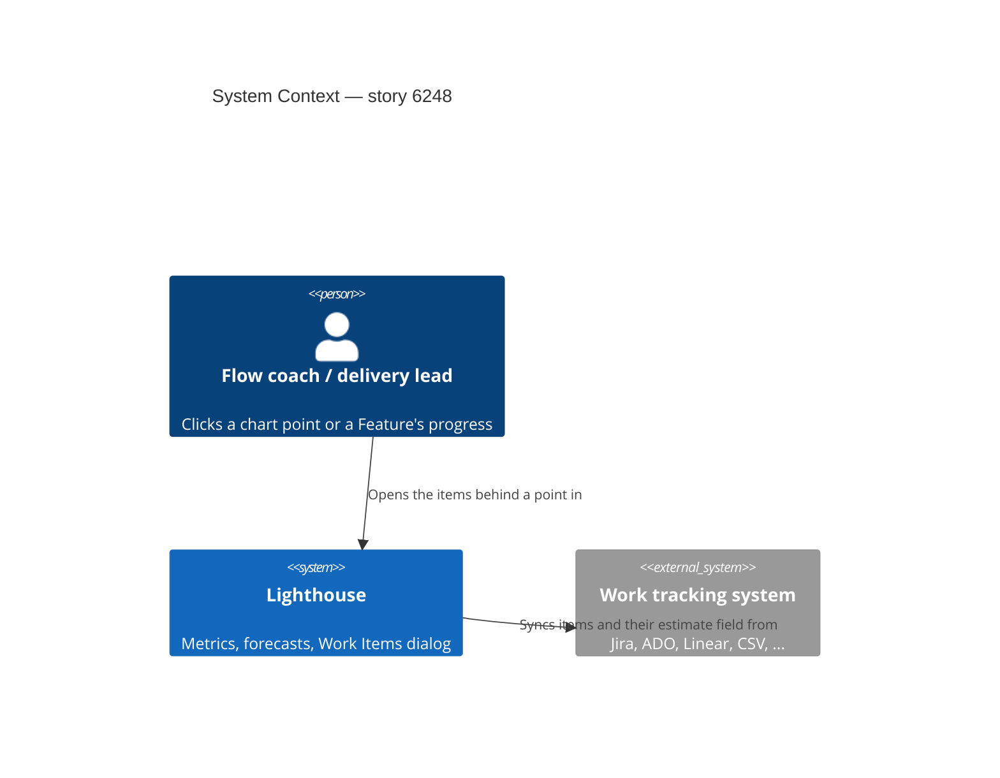
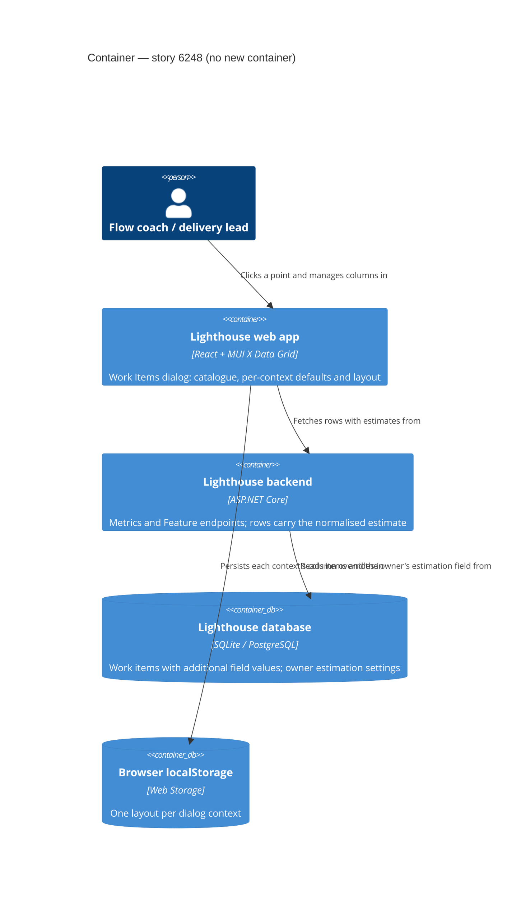
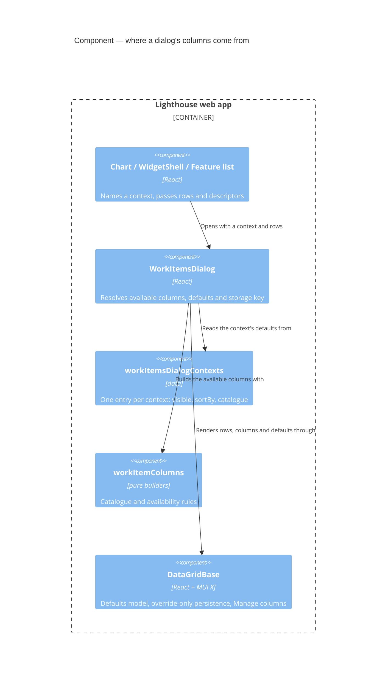

# Feature Delta — story-6248-work-items-dialog-context-columns

> ADO User Story #6248 "Additional Column(s) in Work Items Dialog based on Context". Active, no parent Epic,
> tagged `Release Notes`. Steve (community) clicked a bubble on the Estimation vs. Cycle Time chart and got a
> table without the estimate: "this datatable doesn't really provide enough detail to be more informative than
> the chart or help with a drill-down". The maintainer's assessment: rework the Work Items dialog so it always
> brings the columns that matter where it was opened; estimation is one case, others exist too.

Lean DISCUSS pass (2026-10-10). **The maintainer explicitly skipped DISCOVER and DIVERGE** (answered "Skip
DISCOVER+DIVERGE → DISCUSS" when asked where to start). Decisions D1–D5 were taken by the maintainer on
2026-10-10; their answers are quoted in the Verdict column. Grounded in a code read of `WorkItemsDialog.tsx`, its
16 call sites, `DataGridBase.tsx` / `DataGridToolbar.tsx`, `models/WorkItem.ts`, `models/Feature.ts`,
`BaseMetricsView.buildViewData`, `EstimationVsCycleTimeChart.tsx`, `WorkItemDto.cs`, `FeatureDto.cs`,
`RunChartDataDto.cs` and `BaseMetricsService.BuildEstimationVsCycleTimeResponse`.

---

## Wave: DISCUSS / [REF] Persona IDs

- **flow-coach**: clicks a point on a chart in a retro or standup and asks "which items are these, and why are
  they here?"
- **delivery-lead-rte** (secondary): opens a Feature's child items, or the items behind a Portfolio chart, to
  explain a number in a review.

## Wave: DISCUSS / [REF] JTBD One-Liners

New job **`job-flow-coach-see-why-each-item-sits-behind-the-point`** (added to `docs/product/jobs.yaml`):
*When I click a point or bar on a chart to see the items behind it, I want the list to show the values that
put each item there (its estimate, its dates, its age), so I can explain or question the point without going
back to the chart or the work tracking tool.*

It extends `job-flow-coach-drill-into-throughput-and-arrivals` and
`job-flow-coach-drill-into-blocked-trend-point`. Those made the dialog reachable from almost every chart; this
makes what it shows worth reaching.

## Wave: DISCUSS / [REF] Code reality (what the story walks into)

- **One dialog, 16 call sites.** Ten charts open it on click, `WidgetShell` opens it from every widget's
  *View Data*, `BaseMetricsView` from a Cumulative State Time bar, and the Delivery section, Delivery timeline and
  both feature lists from a Feature's progress cell or timeline bar.
- **One context column, reused for four meanings.** Fixed columns are ID, Name, Type, State, and *Owned by* when
  rows are Features. Each context adds at most one `highlightColumn` (field `additionalColumn`). It holds Cycle
  Time, Age, Size or Days Contributed depending on the caller, and is the default sort and the SLE colouring.
  Optional descriptors add Age band, SLE risk, Time in State (aging chart, WIP and stale widgets) and Warnings
  (Delivery timeline).
- **The estimate never reaches a row.** `IWorkItem` has no estimate. The value lives in
  `WorkItemBase.AdditionalFieldValues[owner.EstimationAdditionalFieldDefinitionId]` and is normalised by
  `EstimateNormalizer` only inside `BuildEstimationVsCycleTimeResponse`, which hands the frontend
  `{workItemIds[], estimationDisplayValue}` per chart point. `WorkItemDto` / `FeatureDto` don't carry it.
- **Rows already carry more than the dialog shows:** started/closed dates, cycle time, age, parent reference,
  blocked-since, time in state, named cycle times; Features add size, owning team and forecasts.
- **One layout for every context.** `DataGridBase` persists visibility, order and widths under
  `lighthouse:datagrid:{storageKey}:state`, and every dialog uses `work-items-dialog`. Hiding a column in one
  chart's dialog hides it in all of them, Team and Portfolio, and `additionalColumn`'s width carries across its
  four meanings.
- **No hidden-by-default columns.** The visibility model starts empty; `useColumnVisibility(initialHiddenColumns)`
  in `DataGrid/hooks.ts` exists but is unused. Users hide columns through MUI's column menu (*Manage columns*).
- **Feature Size *View Data* highlights Age/Cycle Time, not Size**, though its chart is about size.
- **Aging, Stale and the WIP overview sort by Time in State today**: the dialog switches its sort to Time in State
  whenever a caller passes `timeInStateColumn`. The defaults table below sorts them by Age instead (confirmed in
  DESIGN, M8).
- **Cumulative State Time rows are synthetic**: built on the frontend with ages 0 and dates at the epoch.

## Wave: DISCUSS / [REF] Locked Decisions

| ID | Decision | Verdict |
|----|----------|---------|
| D1 | **A full column catalogue; the context picks the defaults.** The dialog knows every column a row can have. Each opening context names which are visible by default and which one sorts; the rest are hidden but reachable through *Manage columns*. | Maintainer, 2026-10-10: "Full catalogue, context picks defaults" |
| D2 | **Catalogue = what rows already carry, plus the Estimate from the backend.** Started, Closed, Cycle Time, Age, Parent, Blocked since, Time in State, named cycle times; for Features also Size, Owned by and the forecast. The normalised Estimate is added to the work-item payload, so it is offered in every context where estimation is configured for the Team or Portfolio. Tags are not added. *Amended downstream: the Delivery timeline offers no Estimate (M3) and no Blocked since (R2); a Feature's child items take the estimate from each item's own Team (DDD-4); named cycle times are offered only where the caller passes their definitions (M4); Owned by stays a fixed column for Feature rows, not a catalogue column (M10).* | Maintainer, 2026-10-10: "Frontend fields + Estimate from backend" |
| D3 | **Layout persists per context.** Each context remembers its own visibility, order and widths; a change in one dialog never leaks into another. *Amended in DESIGN (M2): a context is one row of the defaults table, split by Team and Portfolio; dialogs grouped in one row share one layout.* | Maintainer, 2026-10-10: "Per context" |
| D4 | **The per-context defaults table below is locked**, and it is declared as configuration in one place, so changing a context's defaults is a one-line edit. The maintainer expects their manual review to find rows to adjust. | Maintainer, 2026-10-10: "yes lock … the config should allow to simply adjust this in future" |
| D5 | **Clients (CLI + MCP): N/A for this story.** The Estimate is an additive field; the CLI ignores it and the MCP tools relay it to agents unchanged (amended in DESIGN, M5). | Maintainer, 2026-10-10 |
| D6 | **No Estimate column where estimation isn't configured.** It is not offered, not offered-and-empty. A configured estimate that is missing on an item shows an empty cell. | Locked in DISCUSS, from D2 |
| D7 | **Terminology.** Column headers for configurable terms (Cycle Time, Work Item Age, Blocked, Feature, Team) use the instance's terms, as the dialog's other copy already does. "Estimate" is not a configurable term; the column header carries the estimation unit when one is set (`Estimate (Story Points)`), as the chart's axis does. | Locked |

### Per-context defaults (D4)

ID, Name, Type and State are always shown, and *Owned by* for Feature rows (M10). `*` marks the sort column
(descending, as today). Pointers (M…, R…) mark what the maintainer added or changed later, in DESIGN or in
review round 1.

| Context (what was clicked) | Default columns besides ID / Name / Type / State |
|---|---|
| Throughput bar; Cycle Time scatter dot; Cycle Time percentiles, Throughput and Cycle Time PBC *View Data* | Closed, Cycle Time* (SLE colouring where passed today) |
| **Estimation vs. Cycle Time** bubble / *View Data* | Estimate, Cycle Time*, Closed |
| Arrivals bar / *View Data* | Started, Age / Cycle Time* |
| WIP over time; WIP / in-progress widgets; Total Work Item Age (run chart, PBC); Features being Worked On *View Data* *(M9)* | Started, Age*, plus Time in State / SLE risk where shown today |
| Work Item Aging chart dot | Age*, Age band, SLE risk, Time in State (sort moves from Time in State to Age, M8) |
| Blocked over time; Blocked overview | Age*, Blocked since |
| Stale overview | Age*, Time in State |
| Work Distribution slice | Parent, Age / Cycle Time* |
| Feature Size dot / PBC (rows are Features) | Size*, Cycle Time / Age, Closed (fixes today's Age highlight) |
| A Feature's child items (Delivery section, Team / Portfolio feature lists) | Started, Closed, Age / Cycle Time*, Estimate (each item's own Team's, DDD-4) |
| Delivery timeline bar | Warnings (unchanged); no Estimate (M3) and no Blocked since (R2) offered |
| Cumulative State Time bar | Days Contributed* only; no catalogue (synthetic rows) |
| Started and Closed *View Data* *(M9)* | Started, Closed, Age / Cycle Time* |

"Age / Cycle Time" is today's combined value: cycle time for a closed item, age for an open one.

## Wave: DISCUSS / [REF] User Stories

### US-01: The Estimation dialog shows each item's estimate

As a **flow coach** looking at Estimation vs. Cycle Time, I want the items behind a bubble listed with their
estimate, cycle time and closed date, so I can say which items broke the pattern without opening the tracker.

`job_id: job-flow-coach-see-why-each-item-sits-behind-the-point`

#### Elevator Pitch
Before: click a bubble on a Team's Estimation vs. Cycle Time chart → a table of ID, Name, Type, State and Cycle Time; the estimate that put the items there is only in the dialog title, and *View Data* across all bubbles shows no estimate at all.
After: click a bubble (or *View Data*) → the table shows Estimate, Cycle Time and Closed for every row, and *Manage columns* offers Started, Age, Parent and the rest.
Decision enabled: the coach picks out the 3-point items that took 20 days and asks about them, instead of only seeing that some did.

#### Acceptance Criteria
- **AC-1.1** From a bubble or *View Data* on Estimation vs. Cycle Time, Team or Portfolio, the dialog shows Estimate, Cycle Time and Closed by default, sorted by Cycle Time descending (D4).
- **AC-1.2** Each row's Estimate is that item's normalised display value, the same value the chart plots it at (a category estimate shows its category name, e.g. `M`). Only values the chart can place are shown: a category not in the owner's list, an empty value, or a non-numeric value in a numeric field leaves the cell empty (M1). The header reads `Estimate (<unit>)`, e.g. `Estimate (Story Points)`, when every row with an estimate shares one unit, and plain `Estimate` when no unit is set or the units are mixed (D7, S1).
- **AC-1.3** *Manage columns* lists every catalogue column the rows can fill (D1, D2). Catalogue columns outside this context's defaults are hidden until turned on; turning one on shows it in its place in the fixed column order (S3, R4).
- **AC-1.4** A layout change (hide, show, reorder, resize) in this context is remembered for this context on the next open, and no dialog of another context changes (D3). A context is one row of the defaults table, kept apart for Teams and Portfolios (M2), so the dialogs that share a row share its layout. *Reset layout* returns this context to its defaults.
- **AC-1.5** Where the Team or Portfolio has no estimation field configured, Estimate is not offered in any context (D6).
- **AC-1.6** A context not yet adopted (until slices 02 and 03) keeps today's columns and today's sort: a dialog opened without a context renders exactly as today, and its *Manage columns* lists today's columns only, with nothing from the catalogue added (DDD-8).

### US-02: Every chart's dialog brings the columns that explain its point

As a **flow coach**, I want each chart's and widget's dialog to open with the columns that explain why its items
are there, so the table tells me more than the chart did.

`job_id: job-flow-coach-see-why-each-item-sits-behind-the-point`

#### Elevator Pitch
Before: click a bar on Blocked over time → ID, Name, Type, State and nothing about how long each item has been blocked; click a Feature Size dot → the list highlights age, not size.
After: click a bar on Blocked over time → Age and Blocked since per row; click a Feature Size dot → Size, Cycle Time / Age and Closed, sorted by Size.
Decision enabled: the coach sees which blocked item has waited longest and raises it first.

#### Acceptance Criteria
- **AC-2.1** Each chart and *View Data* context in the defaults table (all rows except a Feature's child items, the Delivery timeline and Cumulative State Time) opens with exactly its default columns and sort.
- **AC-2.2** Feature Size, from a dot or *View Data*, sorts by Size.
- **AC-2.3** Existing judgements keep their look: SLE colouring on Cycle Time where the caller passes an SLE today; Age band, SLE risk and Time in State as today. Aging, Stale and the in-progress *View Data* now sort by Age instead of Time in State (M8); no colouring moves.
- **AC-2.4** Cumulative State Time keeps Days Contributed only and offers no catalogue columns.
- **AC-2.5** AC-1.3 to AC-1.5 hold in every context.
- **AC-2.6** *(added in review round 1)* A Cumulative State Time bar opens the dialog at once in its loading look: the title, the context's headers and the grid's loading overlay, never "No items to display" while the items are on their way. If they cannot be loaded, the dialog says so ("These {Work Items} couldn't be loaded. Close and reopen to try again.") instead of opening nothing. A late answer for an earlier bar never lands in the next one's dialog (DDD-14, S5, S6).

### US-03: A Feature's child items show their progress at a glance

As a **delivery lead**, I want a Feature's child items listed with their dates, age and estimate, so I can see
what is finished, what is moving and what is big without leaving the Delivery or Feature list.

`job_id: job-flow-coach-see-why-each-item-sits-behind-the-point`

#### Elevator Pitch
Before: on a Portfolio's Deliveries, click a Feature's progress → ID, Name, Type, State; nothing says when anything started or finished.
After: click the progress → Started, Closed, Age / Cycle Time and Estimate per child item.
Decision enabled: the lead sees the one large child item still not started and raises it before the date slips.

#### Acceptance Criteria
- **AC-3.1** The child-items dialog from the Delivery section and from the Team and Portfolio feature lists opens with Started, Closed, Age / Cycle Time* and Estimate (D4, D6). Each child item's Estimate comes from its own Team's estimation field (DDD-4).
- **AC-3.2** The Delivery timeline keeps Warnings as its only extra column; the catalogue is offered there too, without Estimate (M3) and without Blocked since (R2).
- **AC-3.3** AC-1.3 to AC-1.5 hold in these contexts, with the Delivery timeline's two exceptions of AC-3.2.
- **AC-3.4** *(added in review round 1)* The child-items dialog opens at once in its loading look (title, the context's headers, the grid's loading overlay, never "No items to display"); if the items cannot be loaded it shows the could-not-load message; reopening asks again; a previously clicked Feature's late answer never lands in the next one's dialog (DDD-14, S5, S6). The Delivery timeline fetches nothing and needs neither look.

## Wave: DISCUSS / [REF] Out of Scope

- Tags, assignee, arbitrary additional fields as columns (D2). A user-configurable column set per instance.
- Formatting or summarising the Estimate in the CLI or the MCP tools (D5). The MCP tools pass it through as part of the row (M5).
- Any change to which items a dialog lists, or to the charts themselves.
- Other grids (feature lists, Refinement, Delivery grid).
- Migrating the old shared `work-items-dialog` layout into the per-context ones; every context starts from its defaults.

## Wave: DISCUSS / [REF] Cross-cutting Impact

- **RBAC**: **No permission change; one accepted exposure.** No endpoint, permission or `/authorization/my-summary`
  read is added, and on the metrics endpoints the Estimate comes from the Team or Portfolio the reader already has
  open. *The exposure, accepted by the maintainer in review round 1 (R3):* a Feature's
  child items carry their own Team's estimate, so a reader who can see the Feature sees those values and that
  Team's estimation unit even without access to the Team. The maintainer accepted this; nothing else is exposed.
- **Lighthouse-Clients (CLI + MCP)**: **No clients change and no clients release (D5, amended by M5).** The CLI
  ignores the new field. The MCP tools relay a row's JSON to the agent as it comes, so from this release an agent
  reading work items also sees `estimate`; no tool's input or name changes, so no clients version bump is needed.
  The clients have no strict response schemas (checked in DESIGN), so nothing in them breaks.
- **Website**: **N/A, because** the website shows charts, not the drill-down table. Re-check at finalize.
- **Premium**: **N/A, because** the dialog is free; CSV export stays premium and exports the visible columns, as today.
- **Docs**: owed at finalize. `docs/metrics/widgets.md:55` describes *View Data*; it gains a line on context
  columns and *Manage columns*. `docs/metrics/flow-metrics.md` (Estimation vs. Cycle Time) mentions the Estimate
  column.
- **Screenshots**: check at finalize whether any `@screenshot` captures an open dialog; regenerate if so.
- **E2E**: low risk. Specs that read dialog cells by column must not assume today's column order; DISTILL checks
  the dialog POM. Walking skeleton: demo data, Estimation chart bubble, Estimate column present. *DESIGN found no
  estimation field on demo data; slice 01a adds one on Team Zenith (S7), so the skeleton runs on demo data.*
- **Usage data**: for **DEVOPS** to answer. Candidate: a name-only event when a user shows a catalogue column
  that was hidden by default, as evidence the catalogue is used (and as the signal for the D4 table review).

## Wave: DISCUSS / [REF] WS Strategy

Strategy **B (extend existing)**, no skeleton. DISCUSS planned three slices of about a day each; review round 1
split slice 01 in two (R1), so there are four, each releasable on its own and ordered so each builds only on a
finished one. Estimates are bottom-up from DESIGN's component decomposition:

1. **slice-01a-estimate-on-the-row** (US-01, backend half): the estimate on the 12 owner-known sites through
   `EstimateOf` / `EstimatesOf`, and Team Zenith's demo estimation field (S7). Visible in the API (and so to MCP agents, M5)
   and, on demo data, in the Estimation chart on Team Zenith; no dialog change. On a customer instance nothing on
   screen changes, so 01a may also ship together with 01b. About a day.
2. **slice-01b-estimation-dialog** (US-01): the catalogue, the defaults map, `DataGridBase`'s defaults model with
   override-only persistence, per-context layout keys, and the `estimation` context. About 1 to 1.5 days.
3. **slice-02-chart-contexts** (US-02): every chart and *View Data* context adopts its defaults (about 30 call
   sites), plus the Cumulative State Time keyed query with its loading and could-not-load look (DDD-14). About
   1.5 to 2 days.
4. **slice-03-feature-children** (US-03): the child-items contexts with their keyed query and loading /
   could-not-load look (DDD-14), the Delivery timeline, `FeatureSchema` gaining `currentStateEnteredAt` (R2), and
   `highlightColumn` removed. About 1 to 1.5 days.

No close reference class: story 5884 added one column to this same dialog, which is smaller than any slice here.

## Wave: DISCUSS / [REF] Driving Ports

- UI: the Work Items dialog, opened from chart clicks, *View Data*, a Feature's progress cell and the Delivery timeline.
- HTTP: the work-item and Feature payloads (`WorkItemDto`, `FeatureDto`) gain the normalised estimate (set at the
  12 owner-known sites only, DDD-4).

## Wave: DISCUSS / [REF] Scope Assessment: PASS

Three stories, four slices (slice 01 split in review round 1, R1). One frontend component plus its call sites, one
additive backend DTO field, one demo-data change. Each slice 1 to 2 days and releasable alone (see WS Strategy);
about 5 to 6 days in all. DISCUSS's largest unknown, how the backend gets the owner's estimation config to every
place a `WorkItemDto` is built, was answered in DESIGN (DDD-1, DDD-4). No oversized signals: the story stays
under ten days and one component.

## Wave: DISCUSS / [REF] Outcome KPIs

| KPI | Target | Measurement |
|-----|--------|-------------|
| `OUT-6248-estimate-in-the-drill-down` | 100 % of Estimation vs. Cycle Time dialog rows show an Estimate cell when estimation is configured; the cell is empty only where D6 allows (the item has no value the chart can place) | Component test + E2E walking skeleton on demo data (Team Zenith gains the field in 01a, S7) |
| `OUT-6248-no-layout-leak` | 0 contexts change when another context's layout changes | Component test across two contexts |
| ~~`OUT-6248-catalogue-used`~~ | ~~Catalogue columns turned on in ≥ 10 % of opted-in instances within 60 days of release~~ *Retired in DEVOPS: no usage-data event (maintainer, N/A).* | ~~Usage-data event, if DEVOPS adopts one~~ |
| `OUT-6248-no-repeat-request` | No new "column X missing in the dialog" request in 60 days for a column already in the catalogue | ADO / community channels |

## Wave: DISCUSS / [REF] Definition of Done

1. Every context in the defaults table opens with its locked defaults and sort.
2. The Estimate is in the work-item and Feature payloads at the 12 owner-known sites (DDD-4), normalised exactly as
   the chart normalises it.
3. Catalogue columns are hidden by default and reachable through *Manage columns*; Estimate is offered only where configured.
4. Layout persists per context; *Reset layout* restores that context's defaults.
5. The defaults live in one declared map; changing a context's defaults touches one entry.
6. `pnpm test`, `pnpm build` (Biome applied: `prebuild` runs `biome check --write`, so the build leaves no unstaged
   fixes), `dotnet build` (0 warnings), filtered `dotnet test` and the E2E walking skeleton on demo data (Team
   Zenith, S7) are green.
7. No new SonarCloud issues. StrykerJS and Stryker.NET ≥ 80 % on changed files.
8. Docs updated at finalize (`widgets.md`, `flow-metrics.md`), and `features/metrics/workitemsdialog.png`
   regenerated (it changes in slice 02).
9. A release-notes line is drafted on #6248 (`Release Notes` tag, already set), crediting Steve.

## Wave: DISCUSS / [REF] DoR Validation

| # | DoR item | Status | Evidence |
|---|----------|--------|----------|
| 1 | Problem statement clear, in domain language | ✅ | Header quote; job `job-flow-coach-see-why-each-item-sits-behind-the-point` (new) |
| 2 | User / persona identified | ✅ | flow-coach, delivery-lead-rte |
| 3 | At least 3 domain examples with real data | ✅ | Worked examples, with the values the DISTILL scenarios use: (a) a Team whose estimation field is Story Points: `ST-1`, 3 points, started 2026-09-01, closed 2026-09-20, Cycle Time 20 (both days count, as Lighthouse counts cycle time), shows `3` under `Estimate (Story Points)`, while `ST-2`, 8 points, closed in 4 days, sorts below it (`WorkItemsDialog.contexts.test.tsx`; on demo data, Team Zenith from 01a, S7); (b) a Team using category estimation: `ST-1` estimated `M` shows `M`, sorts by the category's place (S < M < L), and the header is plain `Estimate` with no unit (same file); (c) a Feature's child items: `ST-11` "Pay by invoice", closed, Cycle Time 6, 5 points, and `ST-12` "Address autocomplete", In Progress, Age 14, 13 points, listed with Started, Closed, Age / Cycle Time and Estimate (`FeatureListDataGrid/featureChildItemsDialog.test.tsx`) |
| 4 | UAT scenarios | ✅ (project convention) | This project writes no Gherkin: DISCUSS states observable ACs and DISTILL turns them into executable test cases, as story #6249 did. They exist: see "Wave: DISTILL / Scenario list with tags" (222 cases, 214 pending and 8 pins). Counted as scenarios, not Given/When/Then text, so the 3-7 per story range of the standard checklist does not apply as written |
| 5 | AC derived from UAT | ✅ | AC-1.1–1.6, AC-2.1–2.6, AC-3.1–3.4, each traced to D1–D7 and the DESIGN / DISTILL decisions; the DISTILL scenario list maps every scenario to its AC |
| 6 | Story right-sized | ✅ | Four slices after the R1 split (01a, 01b, 02, 03), each 1 to 2 days and releasable alone (WS Strategy); test cases per story: US-01 94, US-02 92, US-03 28 pending (DISTILL) |
| 7 | Technical notes | ✅ | Code reality; Out of Scope; one additive backend field |
| 8 | Dependencies | ✅ | None outside the story. 01b builds on 01a's estimate; 02 and 03 build on 01b's catalogue and config |
| 9 | Outcome KPIs | ✅ | Four KPIs with targets (one retired in DEVOPS). This ninth item is the project's own addition to the standard eight; the gate is the eight, this one is advisory |

Cross-cutting checklist (RBAC, Clients, Website, Premium, Docs, Screenshots, E2E, Usage data) answered above.

## Wave: DISCUSS / [REF] Wave Decisions Summary

- **Key decisions:** D1 full catalogue, context picks defaults; D2 catalogue = row fields + Estimate from
  the backend, no tags; D3 layout per context; D4 locked defaults table, declared in one place; D5 clients N/A;
  D6 no Estimate column without estimation configured.
- **Feature type:** user-facing; frontend plus one additive backend field.
- **Constraints:** reuse `DataGridBase` and its *Manage columns*; keep the existing judgement cells; the
  estimate is normalised by the same code as the chart.
- **Upstream changes:** none. DISCOVER and DIVERGE were skipped by the maintainer.
- **Amended downstream** (pointers placed at each decision): D2 by M3, M4, M10, R2; D3 by M2; the D4 table by M8,
  M9; D5 by M5; the slices by R1; the RBAC answer by R3.

## Wave: DISCUSS / [REF] Open questions for DESIGN

- How does `WorkItemDto` / `FeatureDto` get the owner's estimation config to normalise the value? Every place
  that builds one would need it; is a per-response enrichment (owner known at the controller) cheaper than
  threading it through the DTO constructors? Does `EstimateNormalizer` normalise one value without its batch?
- Where does the defaults config live, and what shape does a context key take (one per row of the table, or per
  call site)? It must be the single edit point (D4).
- Hidden-by-default in `DataGridBase`: revive `useColumnVisibility(initialHiddenColumns)` or seed the visibility
  model from a new prop? How does it combine with a persisted per-context state and *Reset layout*?
- The per-context storage key: should the old shared `work-items-dialog` key be removed from localStorage?
- Synthetic Cumulative State Time rows: a context flag "no catalogue", or rows typed so the catalogue cannot apply?
- The Feature zod schema drops `blockedSince`, `currentStateEnteredAt` and `namedCycleTimes`; do Feature rows need them for the catalogue?

## Wave: DISCUSS / [REF] Open checks for DISTILL

- UI sketch walk-through with the maintainer at the start of DISTILL: the Estimation dialog, the *Manage
  columns* list, and the Estimate header with and without a unit.
- The dialog POM reads cells by column header, not position.

---

## Wave: DESIGN / [REF] Overview

Lean DESIGN pass (2026-10-10), Morgan, **PROPOSE mode**. Application scope: one backend DTO field, one frontend
dialog, one grid component. Grounded in a read of `WorkItemsDialog.tsx`, `DataGridBase.tsx`, `DataGrid/hooks.ts`,
`DataGrid/types.ts`, `models/WorkItem.ts`, `models/Feature.ts`, `BaseApiService.deserializeFeatures`,
`MetricsService.ts` (work items pass through as raw JSON; only `FeatureService` parses through `FeatureSchema`),
`BaseMetricsView.buildViewData` and the Cumulative State Time drill-down, `WidgetShell.tsx`, all ten chart call
sites, `DeliverySection`, `DeliveryTimelineTab`, both feature lists, `useParentWorkItems`, `ParentWorkItemCell`,
`WorkItemDto.cs`, `FeatureDto.cs`, `RunChartDataDto.cs`, `EstimateNormalizer.cs`,
`BaseMetricsService.BuildEstimationVsCycleTimeResponse` / `BuildFeatureSizeEstimationResponse`, every
`WorkItemDto` / `FeatureDto` construction site, the `WorkItemsDialog` E2E POM, and the Lighthouse-Clients sources.
ADRs: [ADR-234](../../product/architecture/adr-234-the-work-items-dialog-takes-its-columns-from-one-catalogue-and-its-defaults-from-one-map.md),
[ADR-235](../../product/architecture/adr-235-a-work-item-carries-its-estimate-normalised-by-the-code-the-estimation-chart-uses.md).
The maintainer confirmed the open decisions on 2026-10-10 (see "Maintainer decisions", M1-M10).

## Wave: DESIGN / [REF] Decisions

| ID | Decision | Options weighed (rejected → why) | Status |
|----|----------|----------------------------------|--------|
| DDD-1 | **The estimate rides on the row as an init-only property, set by the controller where the owner is known.** `WorkItemDto` gains `Estimate { get; init; }` of a new record `WorkItemEstimateDto(double? Value, string? DisplayValue, string? Unit)`. `null` means "the owner has no estimation field"; an object with `DisplayValue = null` means "configured, this item has none" (D6). Sites set it in an object initializer: `new WorkItemDto(...) { Estimate = WorkItemEstimateDto.For(owner, item) }`; the run-chart `toDto` lambda does the same. No constructor gains a parameter. | (a) A new constructor parameter on `WorkItemDto` / `FeatureDto` / both run-chart DTOs → the first two are past Sonar's 7-parameter limit already (both carry an S107 pragma) and the run-chart DTOs pass their arguments down to them; every one of the 16 sites changes, including the 4 that have no owner. (b) A dedicated `GET …/estimates?ids=` endpoint the dialog calls → a new fetch per dialog open, with its own loading and failure look and a race on fast re-clicks, to fetch data the server already had in hand. (c) Map the Estimation chart's `{workItemIds, estimationDisplayValue}` onto rows in the browser → only works in the one context that has that response; D2 wants the column everywhere. | Proposed |
| DDD-2 | **One normalisation path.** `EstimateNormalizer` gains one private reader and two public functions over it. The reader returns nothing when `owner.EstimationAdditionalFieldDefinitionId` (an `int?`) has no value; otherwise it reads `item.AdditionalFieldValues.TryGetValue(fieldId.Value, out var raw)` (a `Dictionary<int, string?>`, so an indexer would throw on an item that lacks the field), and a missing key reads as no value, which normalises to `Invalid` and so to no display value (D6), exactly as `BaseMetricsService` reads it today (~line 1232). The functions: `EstimateOf(WorkTrackingSystemOptionsOwner owner, WorkItemBase item) → EstimateNormalizationResult?` (the existing status-bearing result; `null` when the owner has no field) and `EstimatesOf(owner, IReadOnlyList<WorkItemBase> items) → EstimateNormalizationBatchResult?` (the existing batch result, counts included). Both chart builders (`BuildEstimationVsCycleTimeResponse`, `BuildFeatureSizeEstimationResponse`) switch to `EstimatesOf` and keep taking their diagnostics from its counts, so the refactor commit is behaviour-preserving; `WorkItemEstimateDto.For` calls `EstimateOf`. Pure, static, no DI registration (so no `Program.cs` edit and no forced full connector suite). | A new injected `IEstimateReader` service → a DI registration and a constructor parameter on two controllers already near S107, for a pure function. Leaving the builders on their own read → two copies of "which field, which parse", the exact drift D2's "same code" forbids. | Proposed |
| DDD-3 | **Only a mapped estimate is shown.** `Mapped` → `DisplayValue` (the chart's label, e.g. `M` or `3.5`) and `Value` (the number the chart plots, used to sort, so `XS < S < M` sorts by the category order, not alphabetically). `Unmapped` (a category not in the owner's list) and `Invalid` (empty, or non-numeric in numeric mode) → `DisplayValue = null`, an empty cell, which is what the chart does with them (it leaves them out). `Unit` = `owner.EstimationUnit`. | Show an unmapped category's raw text → more informative, but the column would then disagree with the chart that excludes those items (AC-1.2), and numeric-mode junk would need the same treatment. Easy to add later. | Confirmed (M1) |
| DDD-4 | **Which owner, per site.** 12 of the 16 construction sites know one owner and set the estimate: Team metrics (run charts throughput / arrivals / WIP via one lambda, `wip`, `cycleTimeData`, blocked-at-date ×2) with the route's Team; Portfolio metrics (run charts, in-progress Features, `cycleTimeData`, size chart, blocked-at-date ×2) with the route's Portfolio; a Feature's child items (`FeaturesController.GetFeatureWorkItems`) with each item's own `Team` (an item with no Team gets `Estimate = null`, the same guard the controller already uses for `IsBlocked`). The other 4 build Features with no single owner (a Feature can sit in several Portfolios with different estimation fields): `FeaturesController.BuildFeatureDto`, `DeliveryRulesController.Validate`, `DeliverySourcesController.FeaturesComingAlong`, `TeamMetricsController.GetFeaturesInProgress` (a Team's field describes its Work Items, not Features). They leave `Estimate = null`, so no Estimate column is offered there (D6). **This narrows D2 in one dialog context: the Delivery timeline lists a Feature from `/features/ids` (`BuildFeatureDto`), so it never offers Estimate even when its Portfolio has estimation configured.** Carrying it there would need the Portfolio passed into the feature-list endpoint for one single-row dialog. | Pick the first Portfolio for a multi-Portfolio Feature → silently wrong for the second. Add a `portfolioId` query parameter to `/features/ids` for the timeline → a contract change on a shared endpoint for a one-row dialog whose locked default is Warnings only. | Confirmed (M3) |
| DDD-5 | **Context = one row of the D4 table, declared once.** NEW `components/Common/WorkItemsDialog/workItemsDialogContexts.ts` exports the type `WorkItemsDialogContextId` (a closed union) and `WORK_ITEMS_DIALOG_CONTEXTS: Record<WorkItemsDialogContextId, { visible: ColumnId[]; sortBy: ColumnId; catalogue: boolean }>`, one entry per row, in the table's order. `visible` lists the default columns besides the four fixed ones, in display order; `sortBy` is sorted descending and carries today's highlight treatment (SLE colouring and bold only when the caller passes `sle`, which today only the closed-items contexts do; the blocked marker always). Time in State keeps its own badge colouring wherever it is shown, whichever column sorts, so moving Aging / Stale / WIP overview's sort to Age moves no colouring; `catalogue: false` offers nothing else. This file is the single edit point (D4). Entries (ids): `closedItems`, `estimation`, `arrivals`, `inProgress`, `aging`, `blocked`, `stale`, `workDistribution`, `featureSize`, `featureChildren`, `deliveryTimeline`, `cumulativeStateTime`, and a 13th, `startedAndClosed`, for the Started and Closed *View Data* (confirmed, M9). After a context's defaults, the other available columns follow in one fixed order (S3, completed by R4): Started, Closed, Cycle Time, Work Item Age, Age / Cycle Time, Estimate, Parent, Blocked since, Time in State, Age band, SLE risk, named cycle times, Warnings, then Size and Forecasted Completion. Call sites pass `context="…"` instead of `highlightColumn`. | One key per call site (~30) mapping to a row → D4's "one-line edit" becomes "find every site of this row"; and the row grouping is DISCUSS's own definition of a context. Defaults computed per call site → today's problem. | Proposed |
| DDD-6 | **Layout is stored per context and per owner kind.** `storageKey = "work-items-dialog:" + contextId + ":" + ("team" \| "portfolio")` → `lighthouse:datagrid:work-items-dialog:<contextId>:<ownerKind>:state` (`featureChildren` and `deliveryTimeline` are Portfolio/Feature-list scoped and use the page's kind). Team and Portfolio never share a layout, which DISCUSS named as part of today's problem. Within one context, the dialogs DISCUSS grouped in one table row (e.g. Throughput bar and Cycle Time scatter, both "closed items") share one layout, as they share one set of defaults: DISCUSS's table defines a context as a row, so this reads D3 as "per row". The owner kind reaches the dialog as a prop `ownerKind?: "team" | "portfolio"` (the name DISTILL gave it), passed with every `context`: `BaseMetricsView` and `WidgetShell` pass the metrics view's kind (Team or Portfolio metrics) and forward it to the charts they render; `TeamFeatureList` passes `team`; `PortfolioFeatureList`, `DeliverySection` and `DeliveryTimelineTab` pass `portfolio`. `DataGridBase` is rendered with `key={storageKey}` so a dialog whose key changes while mounted re-reads its layout. | (a) Per row only, Team and Portfolio shared → leaks across Team/Portfolio, which D3 set out to stop. (b) Per call site (~30 keys) → no sharing at all; the user hides a column once per chart instead of once per meaning. Either is a key change only. | Confirmed (M2) |
| DDD-7 | **Catalogue = row-backed columns + descriptor-backed columns.** NEW `components/Common/WorkItemsDialog/workItemColumns.tsx` holds one builder per `ColumnId` and an availability rule. *Row-backed* (offered when the rows can fill them): `startedDate`, `closedDate`, `cycleTime`, `workItemAge`, `ageOrCycleTime`, `parent`, `blockedSince`, `timeInState`, `estimate` (offered when any row carries a non-null `estimate`); Feature-only, offered when rows are Features: `size`, `forecast` (offered when rows carry `forecasts`; *amended by S4:* it reuses the Features grid's `createForecastsColumn` whole, header "Forecasted Completion", its percentile list and its cannot-forecast state, instead of an 85 % date; the grid field is therefore `forecasts`). `blockedSince` is never offered on the Delivery timeline, whose rows cannot fill it (R2). *Owned by* is not a catalogue column: it stays a fixed column for Feature rows, as today. *Descriptor-backed* (offered only when the caller passes the descriptor, exactly as today): `ageBand`, `sleRisk`, `warnings`, `daysContributed`, and one `namedCycleTime:<id>` per definition when the caller passes `namedCycleTimeDefinitions`. A context's `visible` entries that are not available on these rows are dropped silently (e.g. Estimate where not configured). The existing ageBand / sleRisk / warnings builders move into this file unchanged (refactor commit first). | Keep growing the column `useMemo` in `WorkItemsDialog.tsx` → it was 563 lines at the DESIGN read (commit `96018a291`) and the memo already carries 11 dependencies; Sonar's cognitive-complexity limit (S3776) is the next CI cycle. | Proposed |
| DDD-8 | **Three new caller inputs, for values only the caller knows.** `ageOn?: Date` (Total Work Item Age run chart and PBC, WIP PBC: Age is measured on the clicked day, as `calculateHistoricalAge` does today); `cycleTimeScope?: number` with `namedCycleTimeDefinitions` (named percentiles: the Cycle Time column reads that definition's days and takes its name, as today's highlight does); `daysContributedColumn` (Cumulative State Time). Existing descriptors (`sle`, `ageBandColumn`, `sleRiskColumn`, `warningsColumn`, `timeInStateColumn`) keep their names and meaning. `highlightColumn` is removed at the end of slice 03; until then a dialog without `context` renders exactly as today (AC-1.6). | A generic "caller value column" replacing `highlightColumn` → keeps the per-call-site column the story removes, under another name. | Proposed |
| DDD-9 | **Hidden by default = a defaults model, and only the user's overrides are persisted.** `DataGridBase` gains `defaultColumnVisibilityModel?: GridColumnVisibilityModel` (every available catalogue column not in `visible` → `false`). Effective model = `{ ...defaults, ...persistedOverrides }`. On change, only the entries that differ from the defaults are persisted. *Reset layout* clears the overrides (and order/widths, as today) and lands on the defaults, not on "everything visible" (`setColumnVisibilityModel({})` today). So a later change to a context's defaults reaches every column the user never touched, while a column the user turned on or off stays as they left it. A column newly added to the catalogue is hidden (absent from overrides → default `false`), never shown because MUI reads an absent key as visible. The sanitize effect that forces non-hideable columns visible (`DataGridBase.tsx:101-115`) writes through the same override-only diff, or it would freeze the defaults too. `useColumnVisibility` is not revived (unused, unpersisted, and parallel to MUI's model). | Seed the model with the defaults and persist the whole model (today's code path) → the first hide persists every default, freezing the user on today's defaults forever, so D4's later edits never reach them. Revive `useColumnVisibility` → a second visibility state beside MUI's, with no persistence. | Proposed |
| DDD-10 | **The old shared key is left alone.** `lighthouse:datagrid:work-items-dialog:state` stops being read once slice 03 migrates the last caller; nothing deletes it (well under 1 KB, no reader). | One-time `removeItem` on dialog mount → permanent code for a one-time purpose. | Confirmed (M6) |
| DDD-11 | **Synthetic rows: the context says "no catalogue".** `cumulativeStateTime` is `{ visible: ["daysContributed"], sortBy: "daysContributed", catalogue: false }`; nothing else is offered, so the epoch dates and zero ages built in `BaseMetricsView` never appear. | A separate row type for synthetic rows → touches `IWorkItem` consumers for one context. | Proposed |
| DDD-12 | **`FeatureSchema` adds `currentStateEnteredAt`** (`.nullable().optional()`; the date guarded so `null` never becomes 1970). *Amended in DISTILL (R2): `blockedSince` is not added, because `/features/ids` never carries a blocked-since date; Blocked since is not offered on the Delivery timeline.* Not `estimate`: no Feature that reaches the schema carries one (DDD-4). Needed by one context only: the Delivery timeline lists a Feature that came through `FeatureService` (`useDeliveryManagement` → `getFeaturesByIds`), and without it the catalogue's Time in State would be empty there. `namedCycleTimes` is not added: `BuildFeatureDto` always sends `[]`. Every other Feature row in a dialog comes from a metrics endpoint as raw JSON and already carries everything. | Leave the schema → Time in State offered and always blank on the timeline. | Confirmed (R2) |
| DDD-13 | **Parent shows the parent's name, looked up only while the column is visible.** The dialog runs a keyed TanStack query (`["work-items-dialog-parents", …sortedUniqueReferences]`, enabled only when `parent` is visible) through `featureService.getFeaturesByReferences`, and renders with the existing `ParentWorkItemCell`. While loading and on failure the cell shows the reference itself, which is true and current, never blank and never a previous dialog's name. | `useParentWorkItems` as is → fetches even when Parent is hidden, its effect depends on the array identity (the dialog re-sorts on every render, so it would refetch in a loop), and a late answer can land on the next dialog. Raw reference only, no fetch → simplest, but Work Distribution's slices are labelled with names and the dialog would show ids. | Confirmed (M7) |
| DDD-14 | **The child-items dialog gets a loading and a failure look** (CLAUDE.md "every new view has a loading look and a failure look"; slice 03 changes this view). Today it opens with `[]` and says "No items to display" while the request is out, and stays so if it fails: an empty area that reads as "no data". `WorkItemsDialog` gains `status?: "loading" \| "error" \| "ready"` (the vocabulary of `WidgetShell`, default `ready`): `loading` → the grid's own `loading` overlay, no "No items" text; `error` → a fixed message (copy at the DISTILL sketch). `DeliverySection`, `TeamFeatureList`, `PortfolioFeatureList` fetch the child items through a TanStack query keyed by Feature id, so the answer for a previously clicked Feature never lands in the next one's dialog. **Cumulative State Time gets the same treatment** (slice 02 changes that dialog): today it awaits the fetch before opening and an unhandled failure opens nothing at all. The bar click now opens the dialog at once with `status="loading"`, the items come from a TanStack query keyed (owner, state, window, selected item ids), and a failure shows the could-not-load message. The Delivery timeline dialog fetches nothing: it lists a Feature its page already loaded, and the page owns that load's look. | Keep the fetch-then-set pattern → the race and the false "no items" stay. Leave Cumulative State Time as is → a changed view with no failure look, against the project rule. | Proposed |
| DDD-15 | **Headers.** Configurable terms through `getTerm` (Cycle Time, Work Item Age, Blocked, Team for "Owned by"), D7. Estimate: `Estimate (<unit>)` when every row that has an estimate agrees on one unit, else `Estimate`. Dates render as local days via `utils/date/localDate.ts`; a date column's value is the `formatLocalDate` string, so it sorts correctly and exports readably (null and the epoch render empty). | | Proposed |

## Wave: DESIGN / [REF] Component decomposition

Slice column amended for the R1 split: 01a is the backend estimate and demo data, 01b the dialog machinery.

| Path | Change | Slice |
|------|--------|-------|
| `Lighthouse.Backend/…/Services/Implementation/EstimateNormalizer.cs` | EXTEND: `EstimateOf(owner, item)` and `EstimatesOf(owner, items)` over one `TryGetValue` reader (DDD-2). | 01a |
| `…/Services/Implementation/BaseMetricsService.cs` | EXTEND (refactor commit): both estimation builders read through `EstimatesOf`. Behaviour unchanged. | 01a |
| `…/API/DTO/WorkItemEstimateDto.cs` | **CREATE**: record + `static For(owner, item)` → `null` when not configured. No DTO for this shape exists. | 01a |
| `…/API/DTO/WorkItemDto.cs` | EXTEND: `WorkItemEstimateDto? Estimate { get; init; }`. Inherited by `FeatureDto` and both run-chart DTOs. No constructor change. | 01a |
| `…/API/TeamMetricsController.cs`, `PortfolioMetricsController.cs`, `FeaturesController.cs` (`GetFeatureWorkItems` only) | EXTEND: set `Estimate` at the 12 owner-known sites (DDD-4). | 01a (all 12, so D2 holds in every context the moment a context adopts the catalogue) |
| Demo data (`Factories/DemoData/Team Zenith.csv`, the demo CSV connection, Team Zenith's settings) | EXTEND: a `Story Points` column (Fibonacci values), registered as an additional field and set as Team Zenith's estimation field with unit `Story Points` (S7). Other demo Teams unchanged. | 01a |
| `Lighthouse.Frontend/src/models/WorkItem.ts` | EXTEND: `estimate?: IWorkItemEstimate \| null` (`value`, `displayValue`, `unit`, each nullable): the TypeScript mirror of `WorkItemEstimateDto` for rows that arrive as raw JSON. | 01b |
| `src/models/Feature.ts` | EXTEND: `FeatureSchema` + `fromParsed` add `currentStateEnteredAt` only; not `blockedSince` (R2), not `estimate` (DDD-12). | 03 |
| `src/components/Common/WorkItemsDialog/workItemsDialogContexts.ts` | **CREATE**: the defaults map (DDD-5). Slice 01b adds `estimation`; 02 and 03 add the rest. | 01b-03 |
| `src/components/Common/WorkItemsDialog/workItemColumns.tsx` | **CREATE**: the catalogue (DDD-7); ageBand / sleRisk / warnings builders moved in by a refactor commit. | 01b |
| `src/components/Common/WorkItemsDialog/WorkItemsDialog.tsx` | EXTEND: `context`, `ownerKind` (DDD-6), the new inputs (DDD-8), `status` (DDD-14), per-context `storageKey` (DDD-6), defaults model to the grid; legacy path kept until slice 03 removes `highlightColumn`. | 01b-03 |
| `src/components/Common/DataGrid/DataGridBase.tsx`, `types.ts` | EXTEND: `defaultColumnVisibilityModel`, override-only persistence, Reset to defaults (DDD-9). Other grids pass nothing and behave as today. | 01b |
| `src/pages/Common/MetricsView/WidgetShell.tsx` | EXTEND: `ViewDataPayload` gains `context`, `ownerKind` and the DDD-8 inputs, forwarded untouched. | 01b (field), 02 |
| `src/pages/Common/MetricsView/BaseMetricsView.tsx` | EXTEND: `buildViewData` sets a context on every payload (`estimationVsCycleTime` in 01b, the rest in 02); Cumulative State Time passes `context="cumulativeStateTime"` + `daysContributedColumn`, opens at once and reads its items from a keyed query with `status` (DDD-14). | 01b, 02 |
| `src/components/Common/Charts/*` (10 charts) | EXTEND: `context` instead of `highlightColumn`. `BarRunChart` and `LineRunChart` serve several contexts, so they take a required `dialogContext` prop from their parents (`BaseMetricsView`, `ThroughputRunChartCard`, and `BacktestForecaster`'s two throughput charts → `closedItems`). `ProcessBehaviourChart.getHighlightColumnForType` becomes a type → context mapping. | 01b (Estimation), 02 |
| `src/pages/Portfolios/Detail/Components/DeliveryGrid/DeliverySection.tsx`, `timeline/DeliveryTimelineTab.tsx`, `pages/Portfolios/Detail/PortfolioFeatureList.tsx`, `pages/Teams/Detail/TeamFeatureList.tsx` | EXTEND: `featureChildren` / `deliveryTimeline` contexts with `ownerKind` (DDD-6); child-items fetch as a keyed query + `status` (DDD-14). | 03 |
| `Lighthouse.EndToEndTests/tests/models/metrics/WorkItemsDialog.ts` | EXTEND: `columnHeader(name)`, `cellIn(columnName, rowText)` read by header, and `openManageColumns()`. | 01b |

## Wave: DESIGN / [REF] Driving ports

- UI: the Work Items dialog (unchanged entry points). Internal contract replacing `highlightColumn`:
  `<WorkItemsDialog context=… ownerKind={"team" | "portfolio"} items=… status=… [sle, ageOn, cycleTimeScope,
  namedCycleTimeDefinitions, ageBandColumn, sleRiskColumn, warningsColumn, timeInStateColumn,
  daysContributedColumn] />`. Which callers pass which `ownerKind`: DDD-6.
- HTTP (additive, no new route): `estimate: { value, displayValue, unit } | null` on every work-item and Feature row
  of `/api/latest/teams/{id}/metrics/*`, `/api/latest/portfolios/{id}/metrics/*` and
  `/api/latest/features/{id}/workitems`.

## Wave: DESIGN / [REF] Driven ports

Unchanged. `IWorkItemRepository` / `IRepository<Feature>` already load the item, its `AdditionalFieldValues` and
its owner. `featureService.getFeaturesByReferences` is reused for parent names. No external integration is
touched: the estimate field is synced from the tracker today and only read here, so no contract-test annotation.

## Wave: DESIGN / [REF] Technology choices

No new dependency. MUI X Data Grid (MIT, installed) column visibility model and *Manage columns* menu; TanStack
Query (MIT, installed, `QueryClient` at the app root) for the two new keyed fetches; System.Text.Json for the
additive field.

## Wave: DESIGN / [REF] Reuse Analysis

| Existing | Verdict | Contract shape / note |
|----------|---------|-----------------------|
| `EstimateNormalizer` | **EXTEND** | Pure function (return-only). `EstimateOf` / `EstimatesOf` compose one reader with the existing `Normalize` / `NormalizeBatch`; the chart builders and the DTO both go through them. |
| `WorkItemEstimateDto` | **CREATE NEW** | Pure, return-only: `For(owner, item)` maps `EstimateOf`'s result; no DTO carries a per-row estimate today (the chart's `EstimationVsCycleTimeDataPoint` is per point). |
| `WorkItemDto` (and, by inheritance, `FeatureDto`, `RunChartWorkItemDto`, `PortfolioRunChartWorkItemDto`) | **EXTEND** | Bounded change: one init-only property; constructors untouched. |
| `WorkItemsDialog` | **EXTEND** | Bounded change. Universe: the catalogue's `ColumnId` set. Delta: which of them are offered (availability), visible (`visible`) and sorted (`sortBy`) per context, plus `status`. Judgement cells reused as they are. |
| `DataGridBase` / `usePersistedGridState` | **EXTEND** | Bounded change. Universe: the grid's columns and its persisted state under `lighthouse:datagrid:<storageKey>:state` (visibility, order, widths). Delta: an optional defaults model; when one is passed, only the reader's differences from it are written, and *Reset layout* returns to it. With none passed, every other grid behaves exactly as today (empty defaults = everything visible). |
| *Manage columns* (MUI column menu) | **REUSE** | Already wired by `DataGridBase`; no new control (D1). |
| `ParentWorkItemCell`, `featureService.getFeaturesByReferences` | **REUSE** | Rendering and lookup as in the feature lists. |
| `createParentColumn` (`FeatureListDataGrid/columns.tsx`) | **NOT REUSED as is** | It is typed to `IFeature` rows, has a fixed "Parent" header and takes a parent map built by its caller. The catalogue builds its own Parent column around the same `ParentWorkItemCell`, fed by the dialog's keyed lookup (DDD-13). |
| `createForecastsColumn` (`FeatureListDataGrid/columns.tsx`) | **REUSE** | Used whole for the Feature rows' forecast (S4): header "Forecasted Completion", the percentile list and the cannot-forecast state, as in the Features grid. It is typed to `IFeature` rows; the catalogue offers it only when the rows are Features (the dialog's existing `isFeature` guard), so it is used with the rows typed as `IFeature`, never by casting work-item rows. |
| `useParentWorkItems` | **NOT REUSED** | See DDD-13 (array-identity refetch, no visibility gate, no stale guard). Its three callers stay as they are. |
| `useColumnVisibility` | **NOT REVIVED** | Unused; parallel to MUI's model; see DDD-9. |
| `WidgetShell` `status` vocabulary (ADR-233) | **REUSE** | Same three words for the dialog's `status`. |
| `workItemsDialogContexts.ts` | **CREATE NEW** | No existing home for a declared per-context map; it must be one file (D4). Pure data. |
| `workItemColumns.tsx` | **CREATE NEW** | The dialog file cannot absorb ~15 column builders under S3776; the three existing builders move in. Pure builders. |
| `BaseMetricsService` (both estimation builders) | **EXTEND (refactor)** | Behaviour-preserving. Universe: the Estimation vs. Cycle Time and Feature Size estimation responses. Delta: none; they read through `EstimatesOf` instead of their own reader. |
| `TeamMetricsController`, `PortfolioMetricsController`, `FeaturesController` (12 owner-known sites) | **EXTEND** | Bounded change. Universe: the JSON of every work-item row they return. Delta: `estimate` added (an object, or `null` where not configured); every other field unchanged. |
| `DeliveryRulesController`, `DeliverySourcesController`, `FeaturesController.BuildFeatureDto`, `TeamMetricsController.GetFeaturesInProgress` | **UNCHANGED** | They leave `estimate` null (DDD-4). |
| `models/WorkItem.ts`, `models/Feature.ts` | **EXTEND** | Type-only plus one schema field. Universe: the parsed row. Delta: optional `estimate` on `IWorkItem`; `FeatureSchema` adds `currentStateEnteredAt` (DDD-12). |
| `WidgetShell` (`ViewDataPayload`) | **EXTEND** | Pass-through. Delta: `context`, `ownerKind` and the DDD-8 inputs forwarded to the dialog untouched. |
| `BaseMetricsView` (`buildViewData`, Cumulative State Time drill-down) | **EXTEND** | Universe: every *View Data* payload and the drill-down dialog. Delta: each payload names a context; the drill-down opens at once and reads a keyed query with `status` (DDD-14). |
| The ten charts that open the dialog | **EXTEND** | Delta: `context` (and `ownerKind`) instead of `highlightColumn`; nothing else in the chart changes. |
| `DeliverySection`, `DeliveryTimelineTab`, `TeamFeatureList`, `PortfolioFeatureList` | **EXTEND** | Delta: their dialog gets a context; the three child-items callers fetch through a query keyed by Feature id and pass `status` (DDD-14). |
| `WorkItemsDialog` E2E page object | **EXTEND** | Delta: `columnHeader`, `cellIn`, `cellsIn`, `openManageColumns`; existing members unchanged. |

## Wave: DESIGN / [REF] C4

## Wave: DESIGN / [REF] Answers to the DISCUSS open questions

1. **Estimation config to the DTOs** → DDD-1, DDD-2, DDD-4. 16 construction sites in 5 controllers (Team metrics 6,
   Portfolio metrics 6, Features 2, Delivery rules 1, Delivery sources 1); 12 know one owner and set the estimate
   through an init-only property, 4 cannot and leave it `null`. `EstimateNormalizer.Normalize` already normalises one
   value; `NormalizeBatch` only adds counts, so the per-row path uses `Normalize` through the new `EstimateOf`, the
   same function the chart builders move to.
2. **Defaults map** → DDD-5: one file, one entry per D4 row, call sites pass a context id. Judgement descriptors stay
   caller-supplied (DDD-7, DDD-8); the map only says which columns are visible and which sorts.
3. **Hidden by default** → DDD-9: a defaults model on `DataGridBase`, override-only persistence, Reset to defaults;
   later default changes reach every column the user never touched.
4. **Storage key** → DDD-6 (`work-items-dialog:<contextId>:<ownerKind>`, M2), DDD-10 (old key left in place).
5. **Synthetic rows** → DDD-11 (`catalogue: false`).
6. **Feature schema** → DDD-12: add `currentStateEnteredAt` only, for the Delivery timeline; `namedCycleTimes` not
   needed. *(Amended: this answer first listed `blockedSince` and `estimate` too; the DESIGN review dropped
   `estimate` (DDD-4) and review round 1 dropped `blockedSince` (R2).)*

Further questions from the dispatch:
- **Parent** → DDD-13. **Estimate header** → DDD-15. **Loading / failure look** → DDD-13 (parent names) and DDD-14
  (child items). The chart and *View Data* contexts fetch nothing new: rows are already loaded, and `WidgetShell`
  disables *View Data* while its widget is loading (ADR-233). Cumulative State Time, the one dialog context that
  fetches on click, gains a loading and a failure look (DDD-14).
- **Lighthouse-Clients** → no code change needed. A search of `/storage/repos/lighthouse-clients/packages` found no
  response schemas (no zod and no strict parsing of responses; the only `additionalProperties: false` are MCP tool
  *input* schemas, `packages/mcp-core/src/index.ts`), so nothing breaks on the extra field. **Correction to D5's
  wording:** the clients do not drop the field; MCP tools that relay raw rows will show `estimate` to agents. Nothing
  is built to display it in the CLI. The maintainer accepted this exposure (M5).

## Wave: DESIGN / [REF] Test seams

- **Backend, the one that matters:** an integration test on one fixture asserting that, for every item the
  Estimation chart plots, `cycleTimeData`'s row `estimate.displayValue` equals the point's `estimationDisplayValue`
  and `estimate.value` its `estimationNumericValue` (Team and Portfolio). This is D2's "same code" as a test.
- Unit: `EstimateOf` (not configured → null; mapped; unmapped and invalid → no display value); `WorkItemEstimateDto.For`.
- Controller tests per wired site: configured owner → object; unconfigured → `null`; the 4 unwired sites → `null`.
- Frontend: a table test over `WORK_ITEMS_DIALOG_CONTEXTS` (every `visible` / `sortBy` is a known `ColumnId`;
  `sortBy` is in `visible`; `catalogue: false` only for `cumulativeStateTime`). Dialog tests per context (default
  columns and sort), availability (Estimate absent when no row has one; Feature-only columns only for Features),
  `DataGridBase` (defaults applied; override-only persistence; Reset to defaults; a changed default reaches an
  untouched column), and two contexts side by side for `OUT-6248-no-layout-leak`.
- `buildViewData`'s existing "every payload is classified" test extends to "every payload names a context".

## Wave: DESIGN / [REF] E2E impact

- The POM reads `Time in State` by header name and counts rows; neither changes. No spec reads
  `additionalColumnContent` (the cell test id stays on the sort column's cell, so unit tests keep their locator).
- `SleRiskColumnReachable.spec` asserts the SLE risk column is on screen without scrolling. The aging context keeps
  today's columns; the in-progress *View Data* contexts gain Started. `inProgress.visible` keeps the defaults
  table's order (Started, Age, then Time in State / SLE risk); DISTILL checks that the spec still holds with that
  order, and it is re-run in slice 02.
- `@screenshot features/metrics/workitemsdialog.png` (Cycle Time percentiles *View Data*) changes in slice 02:
  regenerate at finalize (delete the PNG first, per the pixel-threshold trap).
- **Walking skeleton precondition:** demo data configures no estimation field (no `Estimat*` /
  `AdditionalField` in `DemoDataFactory` or `DemoDataService`), so the Estimation chart is hidden on demo data. The
  spec must set the field up itself (`BaseEditPage.setEstimationField` exists) on a team whose source carries a
  numeric field, or DISTILL picks another seed; it must not change a `DemoDataFactory` default. *Superseded in
  DISTILL (S7): the maintainer chose to give Team Zenith's demo CSV a `Story Points` column configured as its
  estimation field, a slice-01a DELIVER step; the skeleton then runs on demo data and configures nothing.*

## Wave: DESIGN / [REF] Architectural enforcement

- Backend: an ArchUnitNET seam test (pattern of `NamedCycleTimeSeamArchUnitTest`): no method outside
  `EstimateNormalizer` calls `EstimateNormalizer.Normalize` / `NormalizeBatch`, so every estimate goes through
  `EstimateOf` / `EstimatesOf` and their one reader.
- Frontend: compile-time. `context` is a closed union; `BarRunChart` / `LineRunChart` take a required
  `dialogContext`; slice 03 deletes `highlightColumn` from the props type, so a forgotten caller fails `tsc -b`.

## Wave: DESIGN / [REF] Changed Assumptions

- DISCUSS planned the walking skeleton on demo data; demo data has no estimation field (see E2E impact). Resolved
  in DISTILL by S7: slice 01a adds one on Team Zenith.
- DISCUSS listed "named cycle times" as catalogue columns everywhere. Rows carry only definition ids, so the
  columns are offered where the caller passes the definitions (*View Data* in `BaseMetricsView` and the Cycle Time
  scatter, which already have them), and only rows from `cycleTimeData` carry values.
- The locked table sorts Aging, Stale and the in-progress *View Data* (WIP overview) by Age. Today all three sort by
  Time in State (the dialog switches to it whenever `timeInStateColumn` is passed), and the Aging row said
  "(unchanged)" (since reworded in the table). The maintainer chose the table: Age (M8).
- Two *View Data* payloads are not in the table: **Started and Closed** (`stacked`) and **Features being Worked On**.
  Proposed: `stacked` → a 13th entry `startedAndClosed` (Started, Closed, Age / Cycle Time*); Features being Worked
  On → `inProgress`. Confirmed (M9).
- Today every Portfolio dialog shows *Owned by* for Feature rows. The table does not list it, so following it
  literally would drop the column. Proposed: *Owned by* stays a fixed column for Feature rows, beside the four fixed
  columns (DDD-7). Confirmed (M10).
- Run-chart payload size: the estimate object (~60 bytes with a unit) repeats with each item copy per day bucket. A
  90-day WIP-over-time window with 40 items in progress is ~3,600 copies, ~0.2 MB more before compression; each copy
  already carries the item's tags and every additional field value, so the relative growth is small.

## Wave: DESIGN / [REF] Sonar / ci-learnings risks pre-applied

- S107: no constructor gains a parameter (DDD-1). No `Program.cs` change (pure static, DDD-2), so no forced full
  connector suite.
- S3776: the catalogue lives in its own file; keep each builder small and the availability rules in a lookup.
- Zod: `.nullable()` for backend `T?`; never `z.coerce.date()` on a nullable date unguarded.
- S7735 (no negated ternary), S7770 (`.map(Fn)`), S1192 (column ids as constants, not repeated literals).
- POM / test id: `additionalColumnContent` stays; any renamed accessible name → grep `Lighthouse.EndToEndTests/`.
- Backend tests: NUnit2045 / NUnit2056 (`Assert.EnterMultipleScope`), CA1861, CA1859 on new private helpers.

## Wave: DESIGN / [REF] Maintainer decisions (2026-10-10)

All ten confirmations answered by the maintainer on 2026-10-10.

| ID | Decision | Verdict |
|----|----------|---------|
| M1 | DDD-3: only estimates the chart can place are shown; unmapped or invalid values give an empty cell. | "Accept all" |
| M2 | DDD-6: layout keyed per context row **and** owner kind (`team` / `portfolio`): every Team shares one layout per context, every Portfolio another. | "Split Team vs Portfolio" |
| M3 | DDD-4: the Delivery timeline offers no Estimate, an accepted exception to D2. | "Accept both" |
| M4 | Named cycle-time columns are offered only where the caller has the definitions (*View Data*, Cycle Time scatter). | "Accept all" |
| M5 | D5 amended: the MCP tools relay `estimate` to agents. Additive and harmless; no clients change or release. | "Accept both" |
| M6 | DDD-10: the old shared localStorage key is left in place. | "Accept all" |
| M7 | DDD-13: Parent shows the parent's name, the reference while loading or on failure. | "Accept all" |
| M8 | Aging, Stale and the WIP overview sort by **Age**, as the locked table says (a change from today's Time in State sort; no colouring moves). | "Age, as the table says" |
| M9 | A 13th entry `startedAndClosed` (Started, Closed, Age / Cycle Time*) for Started and Closed; Features being Worked On → `inProgress`. | "Accept all" |
| M10 | *Owned by* stays a fixed column for Feature rows. | "Accept all" |

## Wave: DESIGN / [REF] Open questions for DISTILL / DELIVER

For the DISTILL sketch walk-through (all answered there: S1-S7, with the column order completed by R4): the
*Manage columns* list order; the Estimate header with and without a unit
and with mixed units; date display format; the child-items loading and could-not-load copy (DDD-14); the Forecast
column's label.

For DELIVER: WIP over time rows include items closed inside the range, whose Age is 0; the dogfood decides whether
`inProgress` should sort by Age / Cycle Time for the run chart (D4 expects such adjustments).

## Wave: DESIGN / [REF] Wave Decisions Summary

- **Architecture:** unchanged ports-and-adapters; one additive DTO field set at the controller from a pure domain
  function; one declared defaults map and one column catalogue on the frontend; override-only layout persistence.
- **Key decisions:** DDD-1/2 estimate as an init-only property normalised by `EstimateOf`, which the chart builders
  share; DDD-5 context = D4 row in one file; DDD-9 defaults model with override-only persistence; DDD-14 loading and
  failure look for the child-items and Cumulative State Time dialogs.
- **Review (iteration 1, solution-architect-reviewer, conditionally approved, 0 critical / 3 high):** high issues
  resolved: layout keyed per owner kind and the D3 reading put to the maintainer (DDD-6); the Delivery timeline's
  missing Estimate recorded as a D2 exception and `estimate` kept out of `FeatureSchema` (DDD-4, DDD-12); Cumulative
  State Time given a loading and failure look (DDD-14). Mediums: diagnostics path (DDD-2), sort vs colouring (DDD-5),
  named-cycle-time narrowing and D5 wording added to the confirm list, contract shapes in Reuse Analysis. Lows:
  sanitize write (DDD-9), *Owned by* fixed (DDD-7), DTO parameter count, payload estimate.
- **Slices** (DESIGN kept DISCUSS's three; *amended in review round 1, R1*): 01a backend estimate (all 12 sites) +
  Team Zenith demo estimation field (S7); 01b catalogue + map with `estimation` + grid defaults + per-context
  layout keys; 02 chart and *View Data* contexts + Cumulative State Time keyed query and loading / failure look;
  03 child items with their keyed query and loading / failure look, Delivery timeline, `FeatureSchema` adds
  `currentStateEnteredAt`, `highlightColumn` removed.
- **RBAC:** no endpoint, permission or `/authorization/my-summary` change. A reader who can see a Feature sees its
  child items' estimates and their Team's estimation unit even without access to that Team; the maintainer
  accepted this (R3). Nothing else is exposed.
- **No new dependency, no new endpoint, no migration, clients N/A.**

---

Lean DEVOPS pass (2026-10-10). Decisions 1-9 are the project's standing answers, as in every recent story; the one
question asked was the usage-data event, which the maintainer answered **N/A**.

## Wave: DEVOPS / [REF] Decisions

| # | Decision | Answer | Source |
|---|---|---|---|
| 1 | Deployment target | **Unchanged.** Standalone release, Docker image and Helm chart ship the new backend and bundle as today. | Project fact |
| 2 | Container orchestration | **Unchanged.** | Project fact |
| 3 | CI/CD platform | **GitHub Actions, existing workflows.** No new workflow, job, runner or secret. | `.github/workflows/` |
| 4 | Existing infrastructure | Brownfield; reused as is. | same |
| 5 | Observability | **None new, on purpose.** No log line, no metric. A failure in building a row's estimate takes the existing error path: an unhandled exception becomes a 500 through the default handler (`UseExceptionHandler` in `Program.cs`; the developer exception page in Development), which logs it, as today. In the browser, a failed child-items or Cumulative State Time load shows its could-not-load look (DDD-14), which is the user-visible signal. A metric would count a pure function that has no I/O of its own. | DDD-14 |
| 6 | Deployment strategy | **Unchanged.** No migration, no setting. The API change is additive (`estimate` on work-item rows), so an old bundle ignores it and a new bundle against an old backend sees `estimate` absent, which reads as "not configured" (D6): no mixed-version breakage. One visible effect: a browser tab opened before a rollback keeps the new bundle until reloaded, and its Estimate column silently disappears once the rolled-back backend stops sending `estimate`. **Fast rollback:** redeploy the previous release as it stands (the previous Docker image tag, Helm chart version or standalone build); safe because the change is an additive field with no migration and no setting. The lasting fix (`git revert` of the feature commits, or a fix forward) then takes the ordinary release path, including the release approval gate the maintainer approves. Persisted per-context layouts left behind by a rollback are unread keys; an estimate of their size: at most 26 keys (13 contexts × 2 owner kinds) per browser, each a small JSON of the user's overrides, order and widths (typically a few hundred bytes), so a few KB at most. | ADR-234, ADR-235 |
| 7 | Continuous learning | **N/A, because** a column catalogue has nothing to flag or roll out progressively; D4's defaults map is the tuning knob. | D4 |
| 8 | Branching | **Trunk-based on `main`**, slice boundary ritual as usual (push, CI green, then ADO). | Project rule |
| 9 | Mutation testing | **`per-feature`, both stacks, kill rate ≥ 80 %** (Stryker.NET and StrykerJS). | `CLAUDE.md` § Mutation Testing Strategy |

**Contradictions with DESIGN: none.** No `Program.cs` change (DDD-2), so the full Integration suite is not forced.

## Wave: DEVOPS / [REF] Usage-data event

**N/A**, by the maintainer's choice on 2026-10-10 ("N/A"), over a name-only `WorkItemsDialogColumnShown` (fired when
a column hidden by default is turned on) and two variants with a closed context or column property. Nothing is
appended to `UsageDataEventName` (16 events, last `TeamRefinementDayVerdictShown = 15`), and
`docs/settings/usagedata.md` does not change. Plainly: **catalogue adoption is unmeasured.** Nothing tells us
whether anyone turns a catalogue column on, or which.

Consequence: `OUT-6248-catalogue-used` had no other instrument, so it is **retired** (see Changed Assumptions). The
catalogue's use is judged by `OUT-6248-no-repeat-request` and by the maintainer's own review of the defaults (D4).

## Wave: DEVOPS / [REF] Monitoring contracts (Outcome KPIs → instrument)

| KPI | Instrument | Where it is read |
|---|---|---|
| `OUT-6248-estimate-in-the-drill-down` | *Implementation contract verified in CI, not observed in production.* Backend integration test: every plotted item's row `estimate` equals its chart point's value (DESIGN Test seams). Vitest: the `estimation` context shows Estimate per row. E2E walking skeleton: Estimate column present on Team Zenith's demo data (S7; DEVOPS first planned to configure a field in the spec). | CI (`ci_backend.yml`, `ci_frontend.yml`, E2E in `ci_verifysqlite.yml` / `ci_verifypostgres.yml`) |
| `OUT-6248-no-layout-leak` | Vitest: two contexts (and Team vs Portfolio of one context) side by side; a change in one leaves the other's effective model unchanged. | CI (`ci_frontend.yml`) |
| `OUT-6248-catalogue-used` | **Retired** (no usage-data event). | n/a |
| `OUT-6248-no-repeat-request` | ADO items and community channels asking for a dialog column already in the catalogue, in the 60 days after the release carrying slice 03. Target 0. Checked by whoever runs `/release` after that window, in the release-notes pass. | The board |

**`docs/product/kpi-contracts.yaml`: no entries added**, following the #6249 / #6055 precedent: two KPIs are
CI-asserted and the third is a board query with no data pipeline behind it.

## Wave: DEVOPS / [REF] CI/CD pipeline outline

No pipeline change. Stages this feature passes through:

| Stage | Workflow | What it does for this feature |
|---|---|---|
| Change detection | `ci_changes.yml` | Flags `Lighthouse.Backend` (slice 01a), `Lighthouse.Frontend` (01b-03), `Lighthouse.EndToEndTests` (01b, 02) |
| Backend | `ci_backend.yml` | `dotnet build` (warnings are errors) and the tests, including the new ArchUnit seam test (no caller of `Normalize` / `NormalizeBatch` outside `EstimateNormalizer`). Checked: the seam test carries no test category, and `ci_backend.yml`'s filter always includes `Category!=Integration`, so it runs on every backend build. |
| Frontend | `ci_frontend.yml` | `pnpm run build` (`tsc -b` + Biome `--write` via `prebuild`) and Vitest with coverage |
| E2E | `ci_verifysqlite.yml`, `ci_verifypostgres.yml` | Playwright, twice, Chromium only |
| Quality gate | `ci_sonar_gates.yml` | SonarQube Cloud, no new issue of any severity |

**Pre-applied CI risks** (`docs/ci-learnings.md`, already listed in DESIGN "Sonar / ci-learnings risks"): S107
avoided by the init-only property; S3776 kept down by the catalogue's own file; NUnit2045/2056 and CA1861/CA1859 in
the new backend tests; zod `.nullable()` and guarded dates in `FeatureSchema` (slice 03); Vitest timeouts in
rendering-heavy dialog tests get an explicit `{ timeout }` rather than a retry.

## Wave: DEVOPS / [REF] E2E and screenshot implications

- **Walking skeleton (slice 01b, on 01a's demo data):** *amended by S7.* DEVOPS planned for the spec to configure
  an estimation field itself, because demo data had none; the maintainer instead chose to give Team Zenith a
  `Story Points` field configured for estimation in slice 01a. The spec opens Estimation vs. Cycle Time on Team
  Zenith, clicks a bubble and reads the Estimate column by header; it configures nothing. Kept to one flow.
- **POM:** `WorkItemsDialog` reads cells by column header (`cellIn`, `columnHeader`, `openManageColumns`), never by
  position (DESIGN E2E impact).
- **`SleRiskColumnReachable.spec`** re-run in slice 02. It drives only the aging dialog, whose columns do not
  change; the in-progress contexts keep the table order (Started, Age, Time in State, SLE risk), see DISTILL
  "Review round 1" F10 for the 1920px width check.
- **`@screenshot features/metrics/workitemsdialog.png`** changes in slice 02: regenerate at finalize (DoD-8).
  Preconditions as always: premium licence fixture, `rm` the target PNG first, `@auth` excluded.
- Persisted layouts live in localStorage, which each Playwright context starts empty, so no spec sees another's
  layout.

## Wave: DEVOPS / [REF] Mutation testing

`per-feature`, ≥ 80 %, run last on frozen code, results under `docs/feature/story-6248-work-items-dialog-context-columns/mutation/`.

- **Stryker.NET:** `EstimateNormalizer.cs` (new `EstimateOf` / `EstimatesOf`) and `WorkItemEstimateDto.cs`, with the
  acceptance suite excluded from the test run (it costs 80 minutes instead of 3). .NET ignores line spans, so
  controller wiring is covered by the controller tests, not mutated.
- **StrykerJS:** `workItemsDialogContexts.ts`, `workItemColumns.tsx`, the changed `DataGridBase.tsx` persistence
  (the override diff and Reset to defaults are the prime targets: a flipped merge order is the layout-leak and
  frozen-defaults failure), and `WorkItemsDialog.tsx`. Prove the harness with a standalone
  `vitest run --config <stryker vitest config>` first (StrykerJS can exit 0 having tested nothing).
- **Copy is outside StrykerJS's reach:** it does not mutate JSX text (`docs/ci-learnings.md`), so the Estimate
  header (S1), the could-not-load message (S5) and the loading look (S6) are pinned by behaviour tests against the
  exact text, not by the mutation score.

## Wave: DEVOPS / [REF] Environments and coexistence

Machine artifact: `environments.yaml` (this directory). Axes: owner type (Team and Portfolio: different rows,
different layout keys), estimation configured or not (D6; on demo data Team Zenith is configured from 01a, S7),
the child-items and Cumulative State Time loads (loaded, slow, failed; held by test-controlled deferred answers in
component tests, not by demo-data changes), and the CI browser (Chromium); Linux only. Must not
break: every other `DataGridBase` grid (they pass no defaults model and keep whole-model persistence as today), the
feature list grids that share `createParentColumn`, and the Lighthouse-Clients (additive field, M5).

## Wave: DEVOPS / [REF] Handoff

**To** `nw-acceptance-designer` (DISTILL): `environments.yaml`, the KPI → instrument table and the E2E notes.
DISTILL opens with the UI sketch walk-through: the Estimation dialog, the *Manage columns* list order, the Estimate
header (with a unit, without, mixed units), date format, the child-items loading and could-not-load copy, and the
Forecast column label. **Per-wave peer review: skipped**: no new deployment target, CI framework, observability or
security change. The rollback and KPI sections were re-read by the platform reviewer in the end-of-DISTILL review
round 1 and amended above (fast rollback path, the KPI instrument's label, unmeasured adoption).

## Wave: DEVOPS / [REF] Changed Assumptions

- DISCUSS "Outcome KPIs" set `OUT-6248-catalogue-used` ("Catalogue columns turned on in ≥ 10 % of opted-in instances
  within 60 days of release", measured by "Usage-data event, if DEVOPS adopts one"). DEVOPS adopted none
  (maintainer, N/A), so the KPI is **retired**, not measured another way: no other source sees a column turned on.
- DISCUSS "Cross-cutting Impact" named the usage-data candidate; it was put to the maintainer and declined.

---

## Wave: DISTILL / [REF] Maintainer decisions (2026-10-10, sketch walk-through)

Held with the maintainer at the start of DISTILL, one decision at a time, before any scenario was written.

| ID | Decision | Verdict |
|----|----------|---------|
| S1 | **Estimate header** reads `Estimate (<unit>)` when every row with an estimate shares one unit, plain `Estimate` when no unit is set or units are mixed (DDD-15). Cells show the display value only (`3`, `M`). | "Estimate (Story Points)" |
| S2 | **Dates** (Started, Closed, Blocked since) show the local day as `YYYY-MM-DD` (`formatLocalDate`), so they sort and export the same for every viewer. | "2026-09-30" |
| S3 | **Column order:** ID, Name, Type, State, then the context's defaults in table order, then every other available column in one fixed order: Started, Work Item Age, Age / Cycle Time, Parent, Blocked since, Time in State, named cycle times, then the Feature columns (Size, Forecasted Completion). *Manage columns* lists them in that order; a column turned on appears in its place in that order (the user can still reorder). | "Defaults first, then a fixed lifecycle order" |
| S4 | **Forecast column** for Feature rows reuses the Features grid's `createForecastsColumn`: header "Forecasted Completion", the same percentile list and the same cannot-forecast state. | "Reuse 'Forecasted Completion'" |
| S5 | **Could-not-load copy** for the child-items and Cumulative State Time dialogs: warning icon and "These {Work Items} couldn't be loaded. Close and reopen to try again." with the instance's term for Work Items (D7); no Retry button. | Recommended copy |
| S6 | **Loading look** for those two dialogs: the dialog and its title open at once; the grid shows the context's default headers and `DataGridBase`'s own loading overlay; never "No items to display" while loading. | "Grid's loading overlay, headers shown" |
| S7 | **Demo data gains an estimate, so the walking skeleton runs on demo data.** Team Zenith's CSV gets a `Story Points` column (Fibonacci values), the demo CSV connection registers it as an additional field, and Team Zenith has it configured as its estimation field with unit `Story Points`. The Estimation chart then shows on Zenith out of the box, and the E2E skeleton only opens it and clicks a bubble; it configures nothing. This is a slice-01a DELIVER step (demo data is production code); until it lands the skeleton stays skipped. Other demo Teams are unchanged. | Maintainer, 2026-10-10: "Add a numeric field to demo data", "Zenith: column + estimation on" |

### Maintainer decisions, review round 1 (2026-10-10)

The end-of-DISTILL review (product owner, architect, platform and acceptance reviewers) raised four questions only the maintainer could answer.

| ID | Decision | Verdict |
|----|----------|---------|
| R1 | **Slice 01 is split.** *01a*: the estimate on the 12 owner-known backend sites through `EstimateOf` / `EstimatesOf`, and the demo-data change (S7); visible in the API and in the Estimation chart on Team Zenith, no dialog change. *01b*: the catalogue, the defaults map, `DataGridBase`'s defaults model with override-only persistence, per-context layout keys and the `estimation` context. Each ships on its own; 01b builds on 01a. | "Split 01a / 01b" |
| R2 | **Blocked since is not offered on the Delivery timeline.** Its rows come from `/features/ids`, which never carries a blocked-since date, so the column could only be empty there. `FeatureSchema` adds `currentStateEnteredAt` only. No backend change. | "Not offered there" |
| R3 | **RBAC: the child items' estimate is acceptable as is.** A reader who can see a Feature sees its child items' estimate values and their Team's estimation unit, even without access to that Team. No other data is exposed. | "Acceptable" |
| R4 | **Full column order** (completes S3): ID, Name, Type, State, the context's defaults in table order, then every other available column in this order: Started, Closed, Cycle Time, Work Item Age, Age / Cycle Time, Estimate, Parent, Blocked since, Time in State, Age band, SLE risk, named cycle times, Warnings, then the Feature columns (Size, Forecasted Completion). Days Contributed exists only in its own context. | "Full lifecycle order" |

Also settled by earlier answers, recorded here so no reader has to infer it: dialogs that share a row of the defaults table share one layout (Throughput bar and Cycle Time scatter both use `closedItems`); the maintainer chose "per context row" and then the Team/Portfolio split (M2), not a layout per call site.

## Wave: DISTILL / [REF] Reconciliation

`[lang-mode] typescript + csharp`. The frontend uses Vitest and React Testing Library with co-located
`*.test.ts(x)` files. The backend uses NUnit 4 with EF InMemory and `WebApplicationFactory`. E2E uses Playwright
through page objects.

`[policy-mode] inherit`: one row was appended to `docs/architecture/atdd-infrastructure-policy.md` for the held
`IFeatureService` answers.

`[port-mode]` is n/a: the project asserts through its own observables (rendered columns, sort, cells, the JSON
body), not through a `state_delta` port. fast-check is not a devDependency, so property-shaped cases are written as
`it.each` / `[TestCase]` tables.

**Reconciliation passed — 0 contradictions.** DISCUSS, DESIGN, DEVOPS, S1–S7 and R1–R4 all live in this file;
there are no `wave-decisions.md`. Wherever a later decision moved an earlier one, the maintainer confirmed it as a
refinement. None is a contradiction:

- D2 → DDD-4 / M3: no Estimate on the Delivery timeline.
- D3 → DDD-6 / M2: layout per context **and** owner kind.
- D5 → M5: MCP relays `estimate`.
- The Aging row's "(unchanged)" → M8: sort by Age.
- The two unlisted *View Data* payloads → M9.
- *Owned by* → M10.
- D7's unit rule → S1: mixed units read plain `Estimate`.
- DDD-7's "85 % date" → S4: the Features grid's whole Forecasted Completion column.
- The DESIGN skeleton plan (configure a field on a demo Team) → S7: Team Zenith ships with Story Points.
- Slice 01 → R1: 01a / 01b.
- DDD-7's row-backed Blocked since → R2: not offered for Feature rows.
- S3's order → R4: the full order.

Two pieces of DESIGN text were stale when DISTILL first ran. Neither was a contradiction, and both were corrected
in the review round 1 documentation pass (DESIGN answer 6 now matches DDD-12 and R2; DESIGN "E2E impact" now keeps
the table order):

- DESIGN "Answers to the DISCUSS open questions" item 6 and the old slice-01 brief still say `FeatureSchema` keeps
  `estimate`. DDD-12 and R2 say it does not; the specs follow DDD-12 and R2.
- DESIGN "E2E impact" and DEVOPS say DISTILL keeps SLE risk declared **before** Started in `inProgress.visible`.
  After the architect's review (F10), the specs pin the **table order** instead: Started, Age, Time in State, SLE
  risk. See "Review round 1" for the width check behind that.

## Wave: DISTILL / [REF] Scenario list with tags

"Pending" means `it.skip` / `it.skip.each` / `[Ignore(Pending)]` / `test.skip`. A "pin" runs green today and must
stay green. Counts are test cases: each `each` row or `[TestCase]` counts as one. Every test carries a tag comment
in the form `// @us-NN @slice-NN … @contract-shape:…`, as `ModifyTeamSettings.readiness.test.tsx` does. The E2E
skeleton carries its tags in its title, as the other E2E skeletons do.

**Totals: 221 cases — 213 pending and 8 pins.**

- Frontend: 146 pending and 7 pins.
- Backend: 66 pending and 1 pin (the seam scanner's positive control).
- E2E: 1 pending.

By story: US-01 has 94 pending, US-02 has 91 and US-03 has 28. By slice: 01a has 67, 01b has 55, 02 has 63 and 03
has 28. `@example` marks a fixed table of examples; no case uses a generator, so none is tagged `@property`.

**Slice 01a — US-01, the backend estimate on the 12 owner-known sites, plus demo data (R1, S7).**

| File · scenarios | Cases | Tags | AC / decision |
|---|---|---|---|
| `EstimateNormalizerEstimateOfTest.cs` · not configured → nothing (×2) · numeric → the plotted number · category → its place and name · category not in the list → Unmapped · empty / non-numeric → Invalid (2) · **an item that never received the field → Invalid, nothing to show (numeric and category)** · the batch counts mapped / unmapped / invalid · single and batch agree (18-row table over both modes) | 28 | `@us-01 @slice-01a @example` / `@error` `@contract-shape:pure-function` | DDD-2, DDD-3, M1, F1 |
| `WorkItemEstimateDtoTest.cs` · not configured → null · numeric → value, label and unit · category → place, name and no unit · left out by the chart → configured but empty (3) · nothing usable in a numeric field, including a field never received → keeps the unit (2) | 8 | `@us-01 @slice-01a` (`@error`) `@contract-shape:pure-function` | DDD-1, DDD-3, D6, F1 |
| `WorkItemEstimateApiIntegrationTest.cs` · every plotted item's row estimate equals its chart point (Team, Portfolio) · every row of 6 Team and 8 Portfolio endpoints carries an estimate · not configured → `"estimate": null` (3 Team + 3 Portfolio) · nothing usable → no display value (Team, Portfolio) · a Feature's child items each carry their own Team's estimate · Team featuresInProgress and `/features/ids` carry `null` (no single owner) | 27 | `@us-01 @slice-01a @driving_port @real-io` (`@kpi` / `@error`) | AC-1.2, AC-1.5, D2, D6, DDD-4, M3, R3, `OUT-6248-estimate-in-the-drill-down` |
| `EstimateNormalizationSeamArchUnitTest.cs` · nothing outside the normaliser calls `Normalize` / `NormalizeBatch` · both chart builders read through `EstimatesOf` · the row reads through `EstimateOf` | 3 + **1 pin** (the scanner sees a call that is there) | `@us-01 @slice-01a @architecture @contract-shape:unbounded-preservation` | DESIGN Architectural enforcement |
| `Lighthouse.EndToEndTests/tests/specs/flow/WorkItemsDialogContextColumns.spec.ts` · on demo data, a coach opens Team Zenith's Estimation vs. Cycle Time, clicks a bubble and finds an estimate in the Estimate column (read by header) on every row listed; nothing is configured | 1 | `@walking_skeleton @driving_port @US-01` | AC-1.1, S7, `OUT-6248-estimate-in-the-drill-down`. Skipped until the 01a demo-data step lands; it also needs the 01b dialog column to go green. |

**Slice 01b — US-01, the catalogue, the defaults map, `DataGridBase` defaults, per-context keys and the
`estimation` context (R1).**

| File · scenarios | Cases | Tags | AC / decision |
|---|---|---|---|
| `WorkItemsDialog.contexts.test.tsx` (US-01 block) · Team bubble: Estimate, Cycle Time, Closed, longest first · Portfolio bubble: full row order, Owned by first among the extra columns · each row's plotted estimate, empty when nothing is usable · category name · header with a unit / no unit / mixed units (3) · Estimate sorts in category order · **Manage columns lists exactly the defaults, then the rest in the fixed order, all off** · a column turned on lands in its place · Work Item rows neither show nor offer Owned by (exact, unfiltered lists) · an older backend's rows read as not set up (exact catalogue) · dates as `YYYY-MM-DD`, epoch dates empty · the instance's word for Cycle Time | 14 | `@us-01 @slice-01b` (`@driving_port` / `@error` / `@boundary`) | AC-1.1–1.5, D6, D7, S1, S2, R4 |
| `WorkItemsDialog.layout.test.tsx` · a hidden column stays hidden next time · no leak to the closed-items context · no leak from Team to Portfolio · **a column turned on stays on in its own context, and the closed-items context is unchanged** · Reset layout → the context's defaults · the old shared layout reaches no context · a dialog switched to another context while open shows that context's layout | 7 | `@us-01 @slice-01b @kpi` / `@error` | AC-1.4, D3, DDD-6, DDD-10, M2, `OUT-6248-no-layout-leak` |
| `DataGridBase.defaults.test.tsx` · defaults hide · a column turned on is remembered · a later default reaches every untouched column · a column turned on survives the defaults starting to hide it · Reset → defaults · a non-hideable column stays on without freezing the other defaults | 6 + 3 pins | `@us-01 @slice-01b @contract-shape:bounded-change`; pins `@regression @contract-shape:unbounded-preservation` | DDD-9 |
| `workItemsDialogContexts.test.ts` · **invariants only**: exactly the 13 contexts · every context sorts by one of its defaults (13) · every default and sort column is a known column, named cycle times by prefix (13) · only Cumulative Time per State has no catalogue. The context and column lists are records checked against the types with `satisfies Record<…, true>`, so they cannot drift from them. | 28 | `@us-02 @slice-01b @example @contract-shape:pure-function` | DDD-5, DDD-11 |
| **Pins** in `WorkItemsDialog.contexts` · Feature rows keep Owned by · a dialog without a context keeps today's columns | 2 | `@us-01 @slice-01b @regression @contract-shape:unbounded-preservation` | AC-1.6, M10 |

**Slice 02 — US-02, every chart's dialog brings the columns that explain its point.**

| File · scenarios | Cases | Tags | AC / decision |
|---|---|---|---|
| `WorkItemsDialog.contexts.test.tsx` (US-02 block) · each of the 10 chart contexts opens with **exactly its defaults, in order**, and its sort · Feature Size lists the largest first · Aging / Stale / in-progress list the oldest first (3) · Cycle Time keeps its SLE colour and bold · a blocked item keeps its marker on the sort column · Time in State keeps its badge under the Age sort · Age on a past day's point · a named percentile reads its named cycle time under its name, and exactly the named cycle times are offered · Cumulative Time per State: Days Contributed only, nothing else offered · Feature rows add Size and Forecasted Completion, last, to what Manage columns offers · Forecasted Completion is offered **right after Size** (Size compared by field), turned on through the kit and drawn by the Features grid's cell | 22 | `@us-02 @slice-02` (`@driving_port` / `@regression` / `@error` / `@boundary`) | AC-2.1–2.5, DDD-7, DDD-8, M4, M8, M9, S4, R4 |
| `WorkItemsDialog.contexts.test.tsx` · **every chart context that offers more columns** (10 each): without estimation, exactly its defaults and catalogue minus Estimate · Manage columns lists exactly its defaults, then the rest in the R4 order · the reader's own layout (a default hidden, another column turned on) comes back on reopen | 30 | `@us-02 @slice-02` (`@error`) `@contract-shape:pure-function` / `bounded-change` | R4, DDD-6, DDD-7 |
| `BaseMetricsView.cumulativeStateTimeDialog.test.tsx` (**the real dialog now**) · a bar opens the dialog at once with the grid's loading overlay and the Days Contributed header (Team, Portfolio) · the items arrive with the days each contributed, most first (Team, Portfolio) · a failure shows the could-not-load copy · a late answer for the previous bar never lands | 6 | `@us-02 @slice-02` (`@driving_port` / `@error`) | AC-2.4, DDD-14, S5, S6 |
| `WorkItemsDialog.loading.test.tsx` (Parent block) · **asks once for the shown rows' parents while Parent is shown, compared in any order, and shows their names** (the request is read directly because it is the cost being guarded) · the name once known · the reference while it is on its way · the reference on failure · a late answer for the previous dialog never names the next one's parents | 5 | `@us-02 @slice-02` (`@driving_port` / `@boundary` / `@error`) | DDD-13, M7 |
| **Pin** in `WorkItemsDialog.loading` · asks for no parent names while Parent is hidden | 1 | `@us-02 @slice-02 @regression` | DDD-13 |

**Slice 03 — US-03, a Feature's child items show their progress at a glance.**

| File · scenarios | Cases | Tags | AC / decision |
|---|---|---|---|
| `WorkItemsDialog.contexts.test.tsx` (US-03 block) · child items: Started, Closed, Age / Cycle Time, Estimate · without estimation, no Estimate · the Delivery timeline keeps Warnings only and never offers Estimate **or Blocked since** · featureChildren and deliveryTimeline under the same three catalogue rules (2 each) | 9 | `@us-03 @slice-03` (`@driving_port` / `@error`) | AC-3.1–3.3, D6, DDD-4, M3, R2, R4 |
| `WorkItemsDialog.loading.test.tsx` (loading block) · title (heading text exactly), **exactly** the context's headers and the grid's overlay · never "No items to display" while loading, with the overlay present · the could-not-load copy with the warning icon, and exactly the Close and Enlarge buttons · the instance's word for Work Items in it | 4 + 1 pin | `@us-03 @slice-03` (`@driving_port` / `@error`); pin `@regression` | DDD-14, S5, S6 |
| `components/Common/FeatureListDataGrid/featureChildItemsDialog.test.tsx` (**replaces `TeamFeatureList.childItems.test.tsx`**) · one table over the **Team's Feature list, the Portfolio's Feature list and a Delivery's Features**: opens at once in its loading look · Started, Closed, Age / Cycle Time and Estimate once the items arrive, oldest first · says they couldn't be loaded · asked for again after close and reopen · the previous Feature's late answer never shows | 15 | `@us-03 @slice-03` (`@driving_port` / `@error`) | AC-3.1, DDD-14, S5, S6 |

## Wave: DISTILL / [REF] WS strategy

Strategy B (extend existing), as DISCUSS decided.

- **Component skeleton:** the US-01 Team bubble scenario, which renders the real dialog over the real
  `DataGridBase` and MUI X grid.
- **Browser skeleton:** `WorkItemsDialogContextColumns.spec.ts`, one flow through page objects only. It runs on demo
  scenario 0, using Team Zenith as it ships after 01a (S7), and configures nothing. It is skipped until that demo
  change lands.
- **Backend wiring proof:** the integration fixture, running through the real host and real EF for both Team and
  Portfolio.

## Wave: DISTILL / [REF] Test placement

Tests sit beside the code they cover, as every dialog and grid test does. New files were created rather than adding
to `WorkItemsDialog.test.tsx` (1,875 lines) and `DataGridBase.test.tsx`, which pin today's behaviour and stay
untouched.

The shared fixtures and readers live in `Lighthouse.Frontend/src/tests/WorkItemsDialogTestKit.tsx`:
`openTheDialog`, `contextColumnsShown`, `sortedDescendingBy`, `rowOrder`, `cellText`, `openManageColumns`,
`turnColumn`, `resetTheLayout`, `aWorkItem`, `aFeature` and `estimateOf`. `openManageColumns`, `turnColumn` and
`resetTheLayout` now take a `GridScope`, so `DataGridBase.defaults.test.tsx` reuses them on a grid shown outside a
dialog.

The child-items table sits under `components/Common/FeatureListDataGrid/`, beside `FeatureProgressIndicator`, the
cell all three lists open it from.

The specs read a column by its grid field, which is its `ColumnId`. The Features grid's forecast column is the
exception: its field is `forecasts`. Header text is pinned only where a decision fixed it:

- S1: Estimate.
- S4: Forecasted Completion.
- D7: the Cycle Time term.
- The named cycle time's name.

Backend tests sit beside their peers: `Services/Implementation` and `API/DTO` for the unit tests, `API/Integration`
for the HTTP fixture and `Architecture` for the seam test. The HTTP fixture has no `Integration` category, so the
filtered run executes it.

## Wave: DISTILL / [REF] Driving-port coverage

| Driving port | How the specs reach it | Files |
|---|---|---|
| `WorkItemsDialog` (`context`, `ownerKind`, `status`, `ageOn`, `cycleTimeScope`, `namedCycleTimeDefinitions`, `daysContributedColumn`, existing descriptors) | Rendered directly on the real grid. Manage columns is opened through the column menu, and the Reset layout button is used. | contexts, layout, loading |
| `DataGridBase` `defaultColumnVisibilityModel` | Rendered directly, toggled through Manage columns (the kit's `turnColumn`), and remounted to read persistence | DataGridBase.defaults |
| Feature lists → child items dialog | The real `TeamFeatureList`, `PortfolioFeatureList` and `DeliverySection`, each through its real progress cell's Team button, with `getFeatureWorkItems` answers held | featureChildItemsDialog |
| Metrics dashboard → Cumulative Time per State drill-down | The real `BaseMetricsView` and the **real `WorkItemsDialog`**. Stand-in chart bars call the real `onBarClick`, and the metrics service is held. | BaseMetricsView.cumulativeStateTimeDialog |
| HTTP `estimate` on `/teams/{id}/metrics/*`, `/portfolios/{id}/metrics/*`, `/features/{id}/workitems`, `/features/ids` | `WebApplicationFactory` plus real EF; the JSON body is read through null-safe readers | WorkItemEstimateApiIntegrationTest |
| `EstimateNormalizer.EstimateOf` / `EstimatesOf`, `WorkItemEstimateDto.For` | Called directly (they are pure functions) | unit tests |
| Browser: Team Zenith → metrics → Estimation bubble | Playwright through the `OverviewPage`, `MetricsPage` and `WorkItemsDialog` page objects | WorkItemsDialogContextColumns.spec |

Adapter coverage: there is no new driven adapter. The estimate is read from `AdditionalFieldValues`, which is
already synced, and the integration fixture exercises the real EF path.

## Wave: DISTILL / [REF] Scaffolds

| File | What | Marker |
|---|---|---|
| `Lighthouse.Frontend/src/components/Common/WorkItemsDialog/workItemsDialogContexts.ts` (new) | `ColumnId`, `WorkItemsDialogContextId` (13), `WorkItemsDialogOwnerKind` and `WorkItemsDialogContextDefaults`. `WORK_ITEMS_DIALOG_CONTEXTS` is a Proxy that throws `Not yet implemented -- RED scaffold` on any read or key listing. | `export const __SCAFFOLD__ = true` |
| `…/WorkItemsDialog/workItemColumns.tsx` (new) | `availableColumnIds(items)` and `buildWorkItemColumn(columnId)`, both throwing. No spec imports them; the specs go through the dialog. | `export const __SCAFFOLD__ = true` |
| `…/WorkItemsDialog/WorkItemsDialog.tsx` | Props `context`, `ownerKind`, `status`, `ageOn`, `cycleTimeScope`, `namedCycleTimeDefinitions` and `daysContributedColumn`; types `WorkItemsDialogStatus` and `DaysContributedColumnDescriptor { daysFor }`. Declared, not read. | comment "not read yet" |
| `…/DataGrid/types.ts` | `defaultColumnVisibilityModel?` on `DataGridBaseProps`. Declared, not read. | doc comment "Not read yet" |
| `Lighthouse.Frontend/src/models/WorkItem.ts` | `estimate?: IWorkItemEstimate \| null` and `IWorkItemEstimate { value, displayValue, unit }`, each nullable. Type only. | — |
| `Lighthouse.Backend/…/Services/Implementation/EstimateNormalizer.cs` | `EstimateOf(owner, item) → EstimateNormalizationResult?` and `EstimatesOf(owner, IReadOnlyList<WorkItemBase> items) → EstimateNormalizationBatchResult?`, throwing `InvalidOperationException` with the `NotYetImplemented` const | `RED scaffold written by DISTILL` |
| `Lighthouse.Backend/…/API/DTO/WorkItemEstimateDto.cs` (new) | `record WorkItemEstimateDto(double? Value, string? DisplayValue, string? Unit)` with `static For(owner, item)` throwing | same |
| `Lighthouse.EndToEndTests/tests/models/metrics/WorkItemsDialog.ts` | `columnHeader(name)`, `cellIn(columnName, reference)` (by the header's `aria-colindex`, on the row whose ID matches exactly), `cellsIn(columnName)` (every row's cell in that column) and `openManageColumns()` (exact names). These are real methods, not scaffolds, and were **run live** against today's aging dialog. | — |

`WorkItemDto` does **not** gain `Estimate` in DISTILL. An init-only property would put `"estimate": null` on every
payload today, which is a behaviour change. The integration specs read JSON, so they compile without it.

**For DELIVER.** The GREEN step that implements each scaffold removes its marker, its constant, its comment and the
"not read yet" notes. The specs pin these names:

- The grid field of each catalogue column is its `ColumnId`, except the forecast column, whose field is
  `forecasts` (from `createForecastsColumn`).
- The sort column's cell keeps `data-testid="additionalColumnContent"`.
- The could-not-load copy reads *"These {Work Items} couldn't be loaded. Close and reopen to try again."*, with
  `WarningAmberIcon`.
- The loading look is the grid's own loading overlay (`role="progressbar"`).
- The estimate reader uses `TryGetValue`: a missing key gives Invalid, with nothing to show.

RED classification: `docs/feature/story-6248-work-items-dialog-context-columns/red-classification.md`. 212 of the
213 pending cases ran and all of them are `MISSING_FUNCTIONALITY`; the E2E skeleton is blocked until 01a. All 8
pins are green.

## Wave: DISTILL / [REF] Existing-test disposition

Nothing here changes in DISTILL. Each change lands in the DELIVER commit that changes the behaviour it covers.

| File | What changes | Slice |
|---|---|---|
| `WorkItemsDialog.test.tsx` | Stays as the legacy path's pin until `highlightColumn` is removed. Then its `highlightColumn` cases move to `context` or are deleted, and the "Time in State sorts the list" cases follow M8 (Age sorts). | 03 (02 for the M8 sort) |
| `WorkItemsDialog.contexts.test.tsx` › "a dialog opened without a context keeps today's columns" | Delete it in the commit that removes `highlightColumn` | 03 |
| `DataGridBase.test.tsx` › "should clear persisted state when reset layout is clicked" | Unchanged: a grid without defaults keeps clearing as it does today | — |
| `TeamFeatureList.test.tsx`, `PortfolioFeatureList.test.tsx`, `DeliverySection.test.tsx` (and its siblings that stand in for `WorkItemsDialog`) | Wrap renders in a `QueryClientProvider` when the child-items fetch becomes a query | 03 |
| `BaseMetricsView.test.tsx` › the Cumulative State Time drill-down cases (stand-in chart with `onBarClick`) | Re-point at the open-at-once flow and the keyed query. `buildViewData`'s "every payload is classified" test gains "every payload names a context". | 02 (01b for the Estimation payload) |
| `BaseMetricsService` estimation tests (`TeamMetricsServiceTests`, `PortfolioMetricsServiceTests`) | Unchanged. The refactor to `EstimatesOf` preserves behaviour, and these tests guard it. | 01a |
| `EstimateNormalizerTest.cs` | Unchanged. Its tests call `Normalize` from the test assembly; the seam test scans production code only. | — |
| `RunChartPayloadContractIntegrationTest.cs` | May add `estimate` to its required fields once every site sets it | 01a |
| `SleRiskColumnReachable.spec.ts` | Re-run in slice 02. It drives only the aging dialog (both entries), whose columns are unchanged, so the in-progress order change does not touch it. | 02 |
| `DemoDataFactory` tests / demo CSV fixtures | Gain Zenith's `Story Points` column, its field definition and the estimation setting | 01a |

## Wave: DISTILL / [REF] E2E impact

The page object `Lighthouse.EndToEndTests/tests/models/metrics/WorkItemsDialog.ts` gains `columnHeader`,
`cellIn`, `cellsIn` and `openManageColumns`. Existing members are untouched, so `BlockedItems.spec` and
the Time in State readers keep working.

All four new members were exercised live on 2026-10-10 against today's aging dialog (`cellsIn` in a second run).
Each run used demo scenario 0 on a throwaway instance on port 5199 with its own SQLite file and key store.
Temporary probe specs passed and were then deleted. `firstRowReference` was dropped once the skeleton checked
every row instead of the first.

`MetricsWidget.openDialogFromBubble()` already reaches the Estimation chart's markers. The skeleton compiles
(`tsc --noEmit`), is Biome-clean, and is listed by Playwright as one skipped test.

The live probe turned up two things now built into the page object:

- **A sorted column's header name gains " Sort"** (for example "Time in State Sort"). An exact name match therefore
  fails on whichever column the context sorts by. `columnHeader` keeps Playwright's default match, and callers
  pass anchored regexes such as `/^Estimate/`. Only the Name header, which is never the sort column, is matched
  exactly.
- **`cellIn` picks the row by its exact ID** rather than by substring, so `ST-1` never also matches `ST-12`.

The `@screenshot features/metrics/workitemsdialog.png` changes in slice 02: regenerate it at finalize, deleting the
PNG first. Persisted layouts live in localStorage, which each Playwright context starts empty.

## Wave: DISTILL / [REF] Completeness checklist (15 items)

| Item | Verdict |
|---|---|
| C1a empty / zero input | pass: no rows while loading, an empty answer, an item that never received the field, an owner with no field, a backend that sends no estimate |
| C1b partition boundaries | pass: SLE colour above the SLE; an epoch date renders empty; category position 0 (`XS`) sorts first |
| C2a state machine documented | pass: the dialog's `loading → ready / error` (DDD-14, S5, S6) and a column's `default → overridden → reset` (DDD-9) |
| C2b illegal event per state | pass: a late answer while another Feature, bar or dialog is shown (3 places, and 3 Feature lists); Reset while overridden |
| C3 0 / 1 / many | pass: 0, 1 and many rows; 1 and 2 named cycle times; 1 and 2 units |
| C4a apply twice | pass: close and reopen after a failure asks again; reopening restores the reader's layout in each of the 12 catalogue contexts |
| C4b inverse without prerequisite | pass: Reset with nothing overridden lands on the defaults |
| C5a every mode combination | pass: every context × its defaults, catalogue and estimation-off variant; Team × Portfolio; numeric × category; configured × not |
| C5b flag orthogonality | pass: a layout change in one context leaves another context and the other owner kind unchanged |
| C6a malformed input | pass: non-numeric in a numeric field, an unlisted category, an empty value, a missing key |
| C6b each declared error | pass: child items (three lists), Cumulative Time per State items and parent names each fail once |
| C6c closed error set | pass: every declared failure ends in the could-not-load look (dialogs) or the reference (Parent) |
| C7a degraded resource | pass: an older backend without `estimate` reads as not configured (DEVOPS decision 6) |
| C7b interruption mid-operation | pass: switching Feature, bar or dialog while a request is in flight |
| C7c concurrent actors | N/A, because there is one reader per dialog and localStorage is per browser |

**15 / 15 → COMPLETE.** The audit log entry is (story-6248, C1–C7, 0 open findings, none).

## Wave: DISTILL / [REF] Upstream findings

Resolved by review round 1:

- No demo Team carried a numeric field → **S7**. The skeleton is rewritten to Team Zenith on demo data.
- S3 left Closed, Cycle Time and Estimate unplaced → **R4**. It is pinned per context in the catalogue-order table.
- Only `TeamFeatureList` was scenario'd → the child-items table now covers all three lists.
- The forecast column's field → pinned as `forecasts` (the field `createForecastsColumn` uses). Specs that
  compare its place read Size by field and the forecast by its label.

Still open:

1. **Header wording for Started, Closed, Age / Cycle Time, Work Item Age, Blocked since, Size and Days Contributed
   is not decided.** D7 says the configured terms are used, but not the exact words. The specs identify these
   columns by field.
2. ~~**Stale DESIGN text** about `FeatureSchema` keeping `estimate`.~~ Corrected in the review round 1 documentation pass.
3. **Names DISTILL had to give:** `ownerKind` (DDD-6 needs Team / Portfolio per dialog but named no prop),
   `DaysContributedColumnDescriptor { daysFor }` (DDD-8 named the input, not its shape), and
   `WorkItemsDialogStatus`.
4. `deliveryTimeline.sortBy = "warnings"`. DDD-5's invariant puts the sort column among the defaults. The dialog
   lists one Feature, so the choice changes nothing a reader sees.
5. **What "offered when the rows can fill it" means, as pinned.**
   - Row-backed columns are offered by row kind, not by whether any row happens to hold a value.
   - Work Item rows offer Started, Closed, Cycle Time, Work Item Age, Age / Cycle Time, Parent, Blocked since and
     Time in State.
   - Feature rows offer the same minus Blocked since (R2), plus Size and Forecasted Completion. Owned by stands
     first after the four fixed columns and is listed in Manage columns there. Work Item rows never show or offer
     it.
   - Estimate is offered when any row carries a non-null estimate.
   - Age band, SLE risk, Warnings and named cycle times are offered only with their descriptor.
   - DESIGN can overrule this if it meant something else.
6. **The `inProgress` default order follows the table (Started, Age, Time in State, SLE risk), not DESIGN's "SLE
   risk before Started".** See the F10 check in "Review round 1". Portfolio in-progress dialogs are close to the
   1920px edge.
7. Not scenario'd: `blockedItemsAtDate` for a past day (only today's branch is covered), and the two other sites
   with no single owner (`DeliveryRulesController.Validate`, `DeliverySourcesController.FeaturesComingAlong`).
8. Neither the child-items request nor the Cumulative Time per State request has a `catch` today. Un-skipping
   their failure specs reds the run through an unhandled rejection (7 in total) until the query with its error
   state lands.

## Wave: DISTILL / [REF] Review round 1 — findings, waiver and checks

| Finding | Outcome |
|---|---|
| B1 the map test copied product data | Done. `workItemsDialogContexts.test.ts` holds invariants only (28 cases). Each context's defaults are pinned through the dialog. |
| **B2 MCP output (M5)** | **Waived, no test.** M5 means no code change in this repository: the MCP clients live in the separate Lighthouse-Clients repository and relay the rows as they come, and nothing in this repository produces MCP output. The HTTP integration fixture is the contract they relay. |
| B3 tag comments | Done. Every `it` / `it.each` / `[Test]` / `[TestCase]` carries `// @us-NN @slice-NN … @contract-shape:…` with slice ids 01a / 01b / 02 / 03. The E2E skeleton carries its tags in its title. |
| H1 every catalogue context | Done. 3 rules × 12 contexts (36 cases): no Estimate when unconfigured (exact lists), the R4 order, and the reader's layout coming back on reopen. |
| H2 the other child-items callers | Done. One table over the three lists (15 cases); the old Team-only file is deleted. |
| H3 skeleton | Done. Team Zenith on demo data, configures nothing, skipped until 01a. |
| H4 exact ordered defaults | Done. `toEqual(columns)`; the `arrayContaining` helper is gone. |
| M1 the real dialog in the Cumulative Time per State spec | Done |
| M2 positive sibling for the parent lookup | Done. It asks once, for exactly `["FTR-1", "FTR-2"]`, in `workDistribution`. |
| M3 exact lists and a fixed title | Done. The loading headers are an exact list, the heading text is matched exactly (`/^…$/`), and the Estimation catalogue is an exact list. |
| M4 anchored matchers; Size by field | Done (`/^\d+d in Review$/`, the exact "Forecasted Completion" header, Size by field `size`) |
| M5 page object with auto-wait and no innerText parsing; run it live | Done. The members were run live (see E2E impact). After round 2 the skeleton checks every row through `cellsIn` rather than the first through `firstRowReference`, which is gone. |
| L1 plain `[Ignore]` reasons | Done. For example: "Not built yet: the estimate on each Work Item row. Unskip one at a time while building it." |
| L2 anchored regex | Done |
| L3 honest title | Done. "Stays on in its own context only" now also checks that the closed-items context is unchanged. |
| L4 null-safe integration readers | Done. None of the readers throws. Only `EstimateOf` (no `estimate` field) and `FindRow` (no row with that ID) record a failure and hand back null. `PropertyOf`, `KindOf`, `TextOf` and `NumberOf` hand back null or `Undefined` without recording anything, so each caller asserts on what it gets back. The plotted-items check asserts that the chart point's label and value are present before comparing. |
| L5 IL walked by opcode, with a positive control | Done. The scanner decodes with the `OpCodes` table, and `TheScanner_SeesACallThatIsThere` is a pin that runs today. |
| L6 `{ exact: true }` in `openManageColumns` | Done for the menu button, the menu item and the Name header. `columnHeader` keeps the default match, because a sorted header's name gains " Sort". |
| L7 reuse the kit's `turnColumn` | Done. `DataGridBase.defaults` and the forecast spec use the kit, with a `GridScope`. |
| F1 a missing key in the estimate reader | Done. A normaliser case (numeric and category) and a DTO case cover an item that never received the field. |
| F10 SLE risk reachability | Checked. **`SleRiskColumnReachable.spec` drives only the aging dialog** (the widget's own dialog and a bubble), at 1280px. The aging context's columns and order are unchanged, so no adjustment is needed for that spec. The spec does not cover the in-progress contexts. The specs therefore keep the table order for `inProgress` (Started, Age, Time in State, SLE risk), as the architect preferred. By width arithmetic at 1920px the `xl` dialog gives the grid about 1,488px. A Team in-progress dialog needs about 1,350px (ID 120 + Name 300 + Type 120 + State 150 + Started ~130 + Age ~200 + Time in State 200 + SLE risk 130), so it fits. A Portfolio's adds Owned by (150), about 1,500px, which may push SLE risk about 15px past the edge depending on the Started and Age widths DELIVER picks. **Reported for DELIVER:** keep those two columns at 130px or narrower, or re-check the Portfolio WIP dialog at 1920px when slice 02 lands. |

## Wave: DISTILL / [REF] Final Wave Review Gate (2026-10-10)

Four reviewers ran in parallel over the whole document and the test code, then again on the revisions.

| Reviewer | Round 1 | Round 2 | Left for DELIVER |
|---|---|---|---|
| Product owner (DISCUSS) | needs revision: 1 blocker, 3 high | conditionally approved: 0 blockers; the one high (DoR item 4) answered by the project's convention, recorded in the DoR table; the mediums fixed | None that changes code |
| Solution architect (DESIGN, ADRs) | needs revision: 1 blocker, 2 high | conditionally approved: 0 blockers; the high (Reuse rows) and both mediums (Team-less child item, forecast column typing) fixed | None that changes code |
| Platform architect (DEVOPS) | conditionally approved: 0 blockers, 3 medium | (not re-run; its mediums were documentation and are fixed) | Check the Portfolio in-progress dialog width at 1920px in slice 02 |
| Acceptance designer (DISTILL) | rejected: 3 blockers, 4 high | conditionally approved: 0 blockers; the high and both mediums fixed in a third pass, the lows too | The walking skeleton stays skipped until slice 01a lands the demo estimate (S7) |

The decisions taken during the gate are R1 to R4 above (maintainer, 2026-10-10). The DISTILL hand-off was left to
run unattended at the maintainer's request: push to `main` once every gate was green and no reviewer blocker was
left, without starting DELIVER.

## Wave: DISTILL / [REF] Pre-requisites

- **DESIGN driving ports:** the `WorkItemsDialog` contract (DDD-5, DDD-8, DDD-14), `DataGridBase` defaults (DDD-9)
  and the additive `estimate` (DDD-1, DDD-4). TanStack Query is assumed through `QueryClientProvider` in the dialog
  kit, the three Feature lists and the dashboard wrapper.
- **DEVOPS environments:** `clean` (no estimation) and `estimation-configured` are both covered at component and
  HTTP level. `screenshot-capture` is a finalize step.
- **Un-skip by slice:**
  - **01a:** the backend normaliser, DTO, integration and seam specs; the E2E skeleton once the demo-data step is
    in and the 01b Estimate column exists.
  - **01b:** the US-01 block, the map invariants, the layout file, `DataGridBase.defaults` and the two pins'
    neighbours.
  - **02:** the US-02 blocks (including the 30 catalogue-rule cases), Cumulative Time per State and the Parent
    block.
  - **03:** the US-03 block, the loading block and `featureChildItemsDialog`.
- **Suite state at hand-off (2026-10-10, after review round 1):**
  - `pnpm test`: `Test Files 450 passed | 4 skipped (454)`, `Tests 6960 passed | 146 skipped (7106)`.
  - `pnpm build`: Biome `Checked 987 files … Fixed 1 file` (formatting of this story's new test file),
    `tsc -b` clean, `✓ built in 1.47s`, no warnings. A second `pnpm biome check ./src` gave `No fixes applied`.
  - `dotnet build`: 0 warnings, 0 errors.
  - Filtered `dotnet test`: `Passed: 9423, Skipped: 67, Failed: 0`. Of the skips, 66 are this story's; the 1 extra
    pass is the seam scanner's control.
  - E2E: `tsc --noEmit` clean, Biome clean on both files, and Playwright lists the skeleton as skipped.
