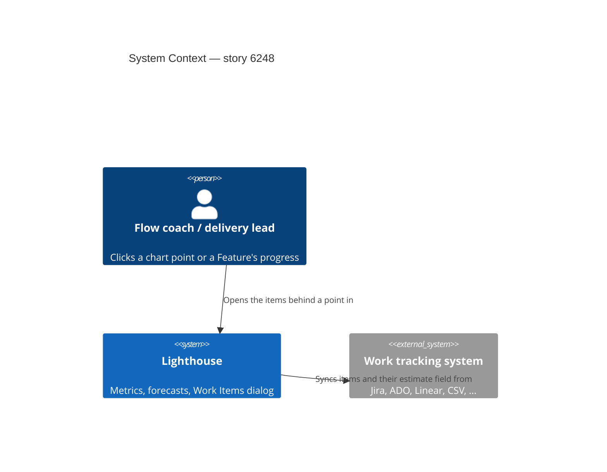
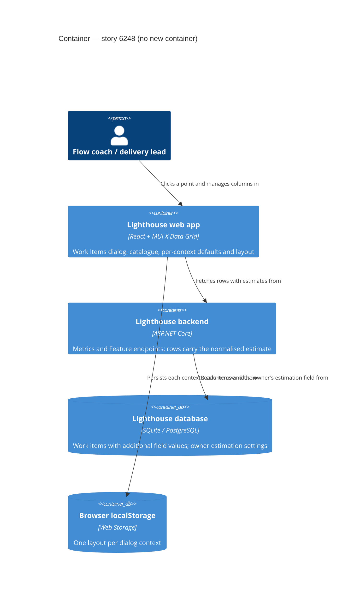
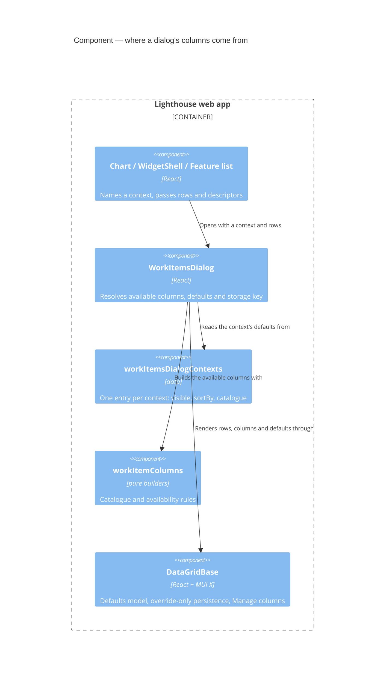

# Feature Delta — story-6248-work-items-dialog-context-columns

> ADO User Story #6248 "Additional Column(s) in Work Items Dialog based on Context". Active, no parent Epic,
> tagged `Release Notes`. Steve (community) clicked a bubble on the Estimation vs. Cycle Time chart and got a
> table without the estimate: "this datatable doesn't really provide enough detail to be more informative than
> the chart or help with a drill-down". The maintainer's assessment: rework the Work Items dialog so it always
> brings the columns that matter where it was opened; estimation is one case, others exist too.

Lean DISCUSS pass (2026-10-10). **The maintainer explicitly skipped DISCOVER and DIVERGE** (answered "Skip
DISCOVER+DIVERGE → DISCUSS" when asked where to start). Decisions D1–D5 were taken by the maintainer on
2026-10-10; their answers are quoted in the Verdict column. Grounded in a code read of `WorkItemsDialog.tsx`, its
16 call sites, `DataGridBase.tsx` / `DataGridToolbar.tsx`, `models/WorkItem.ts`, `models/Feature.ts`,
`BaseMetricsView.buildViewData`, `EstimationVsCycleTimeChart.tsx`, `WorkItemDto.cs`, `FeatureDto.cs`,
`RunChartDataDto.cs` and `BaseMetricsService.BuildEstimationVsCycleTimeResponse`.

---

## Wave: DISCUSS / [REF] Persona IDs

- **flow-coach**: clicks a point on a chart in a retro or standup and asks "which items are these, and why are
  they here?"
- **delivery-lead-rte** (secondary): opens a Feature's child items, or the items behind a Portfolio chart, to
  explain a number in a review.

## Wave: DISCUSS / [REF] JTBD One-Liners

New job **`job-flow-coach-see-why-each-item-sits-behind-the-point`** (added to `docs/product/jobs.yaml`):
*When I click a point or bar on a chart to see the items behind it, I want the list to show the values that
put each item there (its estimate, its dates, its age), so I can explain or question the point without going
back to the chart or the work tracking tool.*

It extends `job-flow-coach-drill-into-throughput-and-arrivals` and
`job-flow-coach-drill-into-blocked-trend-point`. Those made the dialog reachable from almost every chart; this
makes what it shows worth reaching.

## Wave: DISCUSS / [REF] Code reality (what the story walks into)

- **One dialog, 16 call sites.** Ten charts open it on click, `WidgetShell` opens it from every widget's
  *View Data*, `BaseMetricsView` from a Cumulative State Time bar, and the Delivery section, Delivery timeline and
  both feature lists from a Feature's progress cell or timeline bar.
- **One context column, reused for four meanings.** Fixed columns are ID, Name, Type, State, and *Owned by* when
  rows are Features. Each context adds at most one `highlightColumn` (field `additionalColumn`). It holds Cycle
  Time, Age, Size or Days Contributed depending on the caller, and is the default sort and the SLE colouring.
  Optional descriptors add Age band, SLE risk, Time in State (aging chart, WIP and stale widgets) and Warnings
  (Delivery timeline).
- **The estimate never reaches a row.** `IWorkItem` has no estimate. The value lives in
  `WorkItemBase.AdditionalFieldValues[owner.EstimationAdditionalFieldDefinitionId]` and is normalised by
  `EstimateNormalizer` only inside `BuildEstimationVsCycleTimeResponse`, which hands the frontend
  `{workItemIds[], estimationDisplayValue}` per chart point. `WorkItemDto` / `FeatureDto` don't carry it.
- **Rows already carry more than the dialog shows:** started/closed dates, cycle time, age, parent reference,
  blocked-since, time in state, named cycle times; Features add size, owning team and forecasts.
- **One layout for every context.** `DataGridBase` persists visibility, order and widths under
  `lighthouse:datagrid:{storageKey}:state`, and every dialog uses `work-items-dialog`. Hiding a column in one
  chart's dialog hides it in all of them, Team and Portfolio, and `additionalColumn`'s width carries across its
  four meanings.
- **No hidden-by-default columns.** The visibility model starts empty; `useColumnVisibility(initialHiddenColumns)`
  in `DataGrid/hooks.ts` exists but is unused. Users hide columns through MUI's column menu (*Manage columns*).
- **Feature Size *View Data* highlights Age/Cycle Time, not Size**, though its chart is about size.
- **Cumulative State Time rows are synthetic**: built on the frontend with ages 0 and dates at the epoch.

## Wave: DISCUSS / [REF] Locked Decisions

| ID | Decision | Verdict |
|----|----------|---------|
| D1 | **A full column catalogue; the context picks the defaults.** The dialog knows every column a row can have. Each opening context names which are visible by default and which one sorts; the rest are hidden but reachable through *Manage columns*. | Maintainer, 2026-10-10: "Full catalogue, context picks defaults" |
| D2 | **Catalogue = what rows already carry, plus the Estimate from the backend.** Started, Closed, Cycle Time, Age, Parent, Blocked since, Time in State, named cycle times; for Features also Size, Owned by and the forecast. The normalised Estimate is added to the work-item payload, so it is offered in every context where estimation is configured for the Team or Portfolio. Tags are not added. | Maintainer, 2026-10-10: "Frontend fields + Estimate from backend" |
| D3 | **Layout persists per context.** Each context remembers its own visibility, order and widths; a change in one dialog never leaks into another. | Maintainer, 2026-10-10: "Per context" |
| D4 | **The per-context defaults table below is locked**, and it is declared as configuration in one place, so changing a context's defaults is a one-line edit. The maintainer expects their manual review to find rows to adjust. | Maintainer, 2026-10-10: "yes lock … the config should allow to simply adjust this in future" |
| D5 | **Clients (CLI + MCP): N/A for this story.** The Estimate is an additive field; the CLI ignores it and the MCP tools relay it to agents unchanged (amended in DESIGN, M5). | Maintainer, 2026-10-10 |
| D6 | **No Estimate column where estimation isn't configured.** It is not offered, not offered-and-empty. A configured estimate that is missing on an item shows an empty cell. | Locked in DISCUSS, from D2 |
| D7 | **Terminology.** Column headers for configurable terms (Cycle Time, Work Item Age, Blocked, Feature, Team) use the instance's terms, as the dialog's other copy already does. "Estimate" is not a configurable term; the column header carries the estimation unit when one is set (`Estimate (Story Points)`), as the chart's axis does. | Locked |

### Per-context defaults (D4)

ID, Name, Type and State are always shown. `*` marks the sort column (descending, as today).

| Context (what was clicked) | Default columns besides ID / Name / Type / State |
|---|---|
| Throughput bar; Cycle Time scatter dot; Cycle Time percentiles, Throughput and Cycle Time PBC *View Data* | Closed, Cycle Time* (SLE colouring where passed today) |
| **Estimation vs. Cycle Time** bubble / *View Data* | Estimate, Cycle Time*, Closed |
| Arrivals bar / *View Data* | Started, Age / Cycle Time* |
| WIP over time; WIP / in-progress widgets; Total Work Item Age (run chart, PBC) | Started, Age*, plus Time in State / SLE risk where shown today |
| Work Item Aging chart dot | Age*, Age band, SLE risk, Time in State (unchanged) |
| Blocked over time; Blocked overview | Age*, Blocked since |
| Stale overview | Age*, Time in State |
| Work Distribution slice | Parent, Age / Cycle Time* |
| Feature Size dot / PBC (rows are Features) | Size*, Cycle Time / Age, Closed (fixes today's Age highlight) |
| A Feature's child items (Delivery section, Team / Portfolio feature lists) | Started, Closed, Age / Cycle Time*, Estimate |
| Delivery timeline bar | Warnings (unchanged) |
| Cumulative State Time bar | Days Contributed* only; no catalogue (synthetic rows) |

"Age / Cycle Time" is today's combined value: cycle time for a closed item, age for an open one.

## Wave: DISCUSS / [REF] User Stories

### US-01: The Estimation dialog shows each item's estimate

As a **flow coach** looking at Estimation vs. Cycle Time, I want the items behind a bubble listed with their
estimate, cycle time and closed date, so I can say which items broke the pattern without opening the tracker.

`job_id: job-flow-coach-see-why-each-item-sits-behind-the-point`

#### Elevator Pitch
Before: click a bubble on a Team's Estimation vs. Cycle Time chart → a table of ID, Name, Type, State and Cycle Time; the estimate that put the items there is only in the dialog title, and *View Data* across all bubbles shows no estimate at all.
After: click a bubble (or *View Data*) → the table shows Estimate, Cycle Time and Closed for every row, and *Manage columns* offers Started, Age, Parent and the rest.
Decision enabled: the coach picks out the 3-point items that took 20 days and asks about them, instead of only seeing that some did.

#### Acceptance Criteria
- **AC-1.1** From a bubble or *View Data* on Estimation vs. Cycle Time, Team or Portfolio, the dialog shows Estimate, Cycle Time and Closed by default, sorted by Cycle Time descending (D4).
- **AC-1.2** Each row's Estimate is that item's normalised display value, the same value the chart plots it at (non-numeric estimates show their category name). The header carries the unit when one is set (D7).
- **AC-1.3** *Manage columns* lists every catalogue column the rows can fill (D1, D2); turning one on shows it, and none of them is visible until turned on.
- **AC-1.4** A layout change (hide, show, reorder, resize) in this context is remembered for this context on the next open, and no other context's dialog changes (D3). *Reset layout* returns this context to its defaults.
- **AC-1.5** Where the Team or Portfolio has no estimation field configured, Estimate is not offered in any context (D6).
- **AC-1.6** Every other context looks exactly as today until it adopts its defaults (slices 02 and 03).

### US-02: Every chart's dialog brings the columns that explain its point

As a **flow coach**, I want each chart's and widget's dialog to open with the columns that explain why its items
are there, so the table tells me more than the chart did.

`job_id: job-flow-coach-see-why-each-item-sits-behind-the-point`

#### Elevator Pitch
Before: click a bar on Blocked over time → ID, Name, Type, State and nothing about how long each item has been blocked; click a Feature Size dot → the list highlights age, not size.
After: click a bar on Blocked over time → Age and Blocked since per row; click a Feature Size dot → Size, Cycle Time / Age and Closed, sorted by Size.
Decision enabled: the coach sees which blocked item has waited longest and raises it first.

#### Acceptance Criteria
- **AC-2.1** Each chart and *View Data* context in the defaults table (all rows except a Feature's child items, the Delivery timeline and Cumulative State Time) opens with exactly its default columns and sort.
- **AC-2.2** Feature Size, from a dot or *View Data*, sorts by Size.
- **AC-2.3** Existing judgements keep their look: SLE colouring on Cycle Time where `sle` is passed today, Age band, SLE risk and Time in State as today.
- **AC-2.4** Cumulative State Time keeps Days Contributed only and offers no catalogue columns.
- **AC-2.5** AC-1.3 to AC-1.5 hold in every context.

### US-03: A Feature's child items show their progress at a glance

As a **delivery lead**, I want a Feature's child items listed with their dates, age and estimate, so I can see
what is finished, what is moving and what is big without leaving the Delivery or Feature list.

`job_id: job-flow-coach-see-why-each-item-sits-behind-the-point`

#### Elevator Pitch
Before: on a Portfolio's Deliveries, click a Feature's progress → ID, Name, Type, State; nothing says when anything started or finished.
After: click the progress → Started, Closed, Age / Cycle Time and Estimate per child item.
Decision enabled: the lead sees the one large child item still not started and raises it before the date slips.

#### Acceptance Criteria
- **AC-3.1** The child-items dialog from the Delivery section and from the Team and Portfolio feature lists opens with Started, Closed, Age / Cycle Time* and Estimate (D4, D6).
- **AC-3.2** The Delivery timeline keeps Warnings as its only extra column; the catalogue is offered there too.
- **AC-3.3** AC-1.3 to AC-1.5 hold in these contexts.

## Wave: DISCUSS / [REF] Out of Scope

- Tags, assignee, arbitrary additional fields as columns (D2). A user-configurable column set per instance.
- Showing the Estimate in the CLI or MCP (D5).
- Any change to which items a dialog lists, or to the charts themselves.
- Other grids (feature lists, Refinement, Delivery grid).
- Migrating the old shared `work-items-dialog` layout into the per-context ones; every context starts from its defaults.

## Wave: DISCUSS / [REF] Cross-cutting Impact

- **RBAC**: **N/A, because** the Estimate comes from the same Team or Portfolio the user can already read; no
  endpoint, permission or `/authorization/my-summary` read is added.
- **Lighthouse-Clients (CLI + MCP)**: **N/A, because** the new `estimate` field is additive and the clients ignore
  unknown fields (D5). The clients' contract tests may need the field tolerated; DESIGN checks.
- **Website**: **N/A, because** the website shows charts, not the drill-down table. Re-check at finalize.
- **Premium**: **N/A, because** the dialog is free; CSV export stays premium and exports the visible columns, as today.
- **Docs**: owed at finalize. `docs/metrics/widgets.md:55` describes *View Data*; it gains a line on context
  columns and *Manage columns*. `docs/metrics/flow-metrics.md` (Estimation vs. Cycle Time) mentions the Estimate
  column.
- **Screenshots**: check at finalize whether any `@screenshot` captures an open dialog; regenerate if so.
- **E2E**: low risk. Specs that read dialog cells by column must not assume today's column order; DISTILL checks
  the dialog POM. Walking skeleton: demo data, Estimation chart bubble, Estimate column present.
- **Usage data**: for **DEVOPS** to answer. Candidate: a name-only event when a user shows a catalogue column
  that was hidden by default, as evidence the catalogue is used (and as the signal for the D4 table review).

## Wave: DISCUSS / [REF] WS Strategy

Strategy **B (extend existing)**, no skeleton. Three slices, each about a day and releasable on its own:

1. **slice-01-estimation-dialog**: US-01. The Estimate in the payload, the catalogue, hidden-by-default columns,
   the per-context layout and the one-place defaults config; only the Estimation context adopts it.
2. **slice-02-chart-contexts**: US-02. Every chart and *View Data* context adopts its defaults.
3. **slice-03-feature-children**: US-03. The child-items contexts and the Delivery timeline.

## Wave: DISCUSS / [REF] Driving Ports

- UI: the Work Items dialog, opened from chart clicks, *View Data*, a Feature's progress cell and the Delivery timeline.
- HTTP: the work-item and Feature payloads (`WorkItemDto`, `FeatureDto`) gain the normalised estimate.

## Wave: DISCUSS / [REF] Scope Assessment: PASS

Three stories, three slices. One frontend component plus its call sites, one additive backend DTO field. Each slice
≤ 1 day and releasable alone. The largest unknown is how the backend gets the owner's estimation config to every
place a `WorkItemDto` is built (a question for DESIGN). No oversized signals.

## Wave: DISCUSS / [REF] Outcome KPIs

| KPI | Target | Measurement |
|-----|--------|-------------|
| `OUT-6248-estimate-in-the-drill-down` | 100 % of Estimation vs. Cycle Time dialogs show an Estimate per row when estimation is configured | Component test + E2E walking skeleton on demo data |
| `OUT-6248-no-layout-leak` | 0 contexts change when another context's layout changes | Component test across two contexts |
| ~~`OUT-6248-catalogue-used`~~ | ~~Catalogue columns turned on in ≥ 10 % of opted-in instances within 60 days of release~~ *Retired in DEVOPS: no usage-data event (maintainer, N/A).* | ~~Usage-data event, if DEVOPS adopts one~~ |
| `OUT-6248-no-repeat-request` | No new "column X missing in the dialog" request in 60 days for a column already in the catalogue | ADO / community channels |

## Wave: DISCUSS / [REF] Definition of Done

1. Every context in the defaults table opens with its locked defaults and sort.
2. The Estimate is in the work-item and Feature payloads, normalised exactly as the chart normalises it.
3. Catalogue columns are hidden by default and reachable through *Manage columns*; Estimate is offered only where configured.
4. Layout persists per context; *Reset layout* restores that context's defaults.
5. The defaults live in one declared map; changing a context's defaults touches one entry.
6. `pnpm test`, `pnpm build` (Biome clean), `dotnet build` (0 warnings), filtered `dotnet test` and the E2E walking skeleton are green.
7. No new SonarCloud issues. StrykerJS and Stryker.NET ≥ 80 % on changed files.
8. Docs updated at finalize (`widgets.md`, `flow-metrics.md`).
9. A release-notes line is drafted on #6248 (`Release Notes` tag, already set), crediting Steve.

## Wave: DISCUSS / [REF] DoR Validation

| # | DoR item | Status | Evidence |
|---|----------|--------|----------|
| 1 | Problem statement clear, in domain language | ✅ | Header quote; job `job-flow-coach-see-why-each-item-sits-behind-the-point` (new) |
| 2 | User / persona identified | ✅ | flow-coach, delivery-lead-rte |
| 3 | At least 3 domain examples with real data | ✅ | (a) Estimation vs. Cycle Time bubble, demo data (US-01); (b) Blocked over time bar (US-02); (c) a Feature's child items on a Portfolio's Deliveries (US-03); (d) the dev instance `:5169` with an estimation field configured (slice-01 dogfood) |
| 4 | UAT scenarios | ✅ | ACs are observable outcomes; DISTILL writes them as scenarios |
| 5 | AC derived from UAT | ✅ | AC-1.1–1.6, AC-2.1–2.5, AC-3.1–3.3, each traced to D1–D7 |
| 6 | Story right-sized | ✅ | Three slices, each ≤ 1 day and releasable alone |
| 7 | Technical notes | ✅ | Code reality; Out of Scope; one additive backend field |
| 8 | Dependencies | ✅ | None outside the story. 02 and 03 build on 01's catalogue and config |
| 9 | Outcome KPIs | ✅ | Four KPIs with targets |

Cross-cutting checklist (RBAC, Clients, Website, Premium, Docs, Screenshots, E2E, Usage data) answered above.

## Wave: DISCUSS / [REF] Wave Decisions Summary

- **Key decisions:** D1 full catalogue, context picks defaults; D2 catalogue = row fields + Estimate from
  the backend, no tags; D3 layout per context; D4 locked defaults table, declared in one place; D5 clients N/A;
  D6 no Estimate column without estimation configured.
- **Feature type:** user-facing; frontend plus one additive backend field.
- **Constraints:** reuse `DataGridBase` and its *Manage columns*; keep the existing judgement cells; the
  estimate is normalised by the same code as the chart.
- **Upstream changes:** none. DISCOVER and DIVERGE were skipped by the maintainer.

## Wave: DISCUSS / [REF] Open questions for DESIGN

- How does `WorkItemDto` / `FeatureDto` get the owner's estimation config to normalise the value? Every place
  that builds one would need it; is a per-response enrichment (owner known at the controller) cheaper than
  threading it through the DTO constructors? Does `EstimateNormalizer` normalise one value without its batch?
- Where does the defaults config live, and what shape does a context key take (one per row of the table, or per
  call site)? It must be the single edit point (D4).
- Hidden-by-default in `DataGridBase`: revive `useColumnVisibility(initialHiddenColumns)` or seed the visibility
  model from a new prop? How does it combine with a persisted per-context state and *Reset layout*?
- The per-context storage key: should the old shared `work-items-dialog` key be removed from localStorage?
- Synthetic Cumulative State Time rows: a context flag "no catalogue", or rows typed so the catalogue cannot apply?
- The Feature zod schema drops `blockedSince`, `currentStateEnteredAt` and `namedCycleTimes`; do Feature rows need them for the catalogue?

## Wave: DISCUSS / [REF] Open checks for DISTILL

- UI sketch walk-through with the maintainer at the start of DISTILL: the Estimation dialog, the *Manage
  columns* list, and the Estimate header with and without a unit.
- The dialog POM reads cells by column header, not position.

---

Lean DESIGN pass (2026-10-10), Morgan, **PROPOSE mode**. Application scope: one backend DTO field, one frontend
dialog, one grid component. Grounded in a read of `WorkItemsDialog.tsx`, `DataGridBase.tsx`, `DataGrid/hooks.ts`,
`DataGrid/types.ts`, `models/WorkItem.ts`, `models/Feature.ts`, `BaseApiService.deserializeFeatures`,
`MetricsService.ts` (work items pass through as raw JSON; only `FeatureService` parses through `FeatureSchema`),
`BaseMetricsView.buildViewData` and the Cumulative State Time drill-down, `WidgetShell.tsx`, all ten chart call
sites, `DeliverySection`, `DeliveryTimelineTab`, both feature lists, `useParentWorkItems`, `ParentWorkItemCell`,
`WorkItemDto.cs`, `FeatureDto.cs`, `RunChartDataDto.cs`, `EstimateNormalizer.cs`,
`BaseMetricsService.BuildEstimationVsCycleTimeResponse` / `BuildFeatureSizeEstimationResponse`, every
`WorkItemDto` / `FeatureDto` construction site, the `WorkItemsDialog` E2E POM, and the Lighthouse-Clients sources.
ADRs: [ADR-234](../../product/architecture/adr-234-the-work-items-dialog-takes-its-columns-from-one-catalogue-and-its-defaults-from-one-map.md),
[ADR-235](../../product/architecture/adr-235-a-work-item-carries-its-estimate-normalised-by-the-code-the-estimation-chart-uses.md).
The maintainer confirmed the open decisions on 2026-10-10 (see "Maintainer decisions", M1-M10).

## Wave: DESIGN / [REF] Decisions

| ID | Decision | Options weighed (rejected → why) | Status |
|----|----------|----------------------------------|--------|
| DDD-1 | **The estimate rides on the row as an init-only property, set by the controller where the owner is known.** `WorkItemDto` gains `Estimate { get; init; }` of a new record `WorkItemEstimateDto(double? Value, string? DisplayValue, string? Unit)`. `null` means "the owner has no estimation field"; an object with `DisplayValue = null` means "configured, this item has none" (D6). Sites set it in an object initializer: `new WorkItemDto(...) { Estimate = WorkItemEstimateDto.For(owner, item) }`; the run-chart `toDto` lambda does the same. No constructor gains a parameter. | (a) A new constructor parameter on `WorkItemDto` / `FeatureDto` / both run-chart DTOs → the first two are past Sonar's 7-parameter limit already (both carry an S107 pragma) and the run-chart DTOs pass their arguments down to them; every one of the 16 sites changes, including the 4 that have no owner. (b) A dedicated `GET …/estimates?ids=` endpoint the dialog calls → a new fetch per dialog open, with its own loading and failure look and a race on fast re-clicks, to fetch data the server already had in hand. (c) Map the Estimation chart's `{workItemIds, estimationDisplayValue}` onto rows in the browser → only works in the one context that has that response; D2 wants the column everywhere. | Proposed |
| DDD-2 | **One normalisation path.** `EstimateNormalizer` gains one private reader (`item.AdditionalFieldValues[owner.EstimationAdditionalFieldDefinitionId]`) and two public functions over it: `EstimateOf(WorkTrackingSystemOptionsOwner owner, WorkItemBase item) → EstimateNormalizationResult?` (the existing status-bearing result; `null` when the owner has no field) and `EstimatesOf(owner, items) → EstimateNormalizationBatchResult?` (the existing batch result, counts included). Both chart builders (`BuildEstimationVsCycleTimeResponse`, `BuildFeatureSizeEstimationResponse`) switch to `EstimatesOf` and keep taking their diagnostics from its counts, so the refactor commit is behaviour-preserving; `WorkItemEstimateDto.For` calls `EstimateOf`. Pure, static, no DI registration (so no `Program.cs` edit and no forced full connector suite). | A new injected `IEstimateReader` service → a DI registration and a constructor parameter on two controllers already near S107, for a pure function. Leaving the builders on their own read → two copies of "which field, which parse", the exact drift D2's "same code" forbids. | Proposed |
| DDD-3 | **Only a mapped estimate is shown.** `Mapped` → `DisplayValue` (the chart's label, e.g. `M` or `3.5`) and `Value` (the number the chart plots, used to sort, so `XS < S < M` sorts by the category order, not alphabetically). `Unmapped` (a category not in the owner's list) and `Invalid` (empty, or non-numeric in numeric mode) → `DisplayValue = null`, an empty cell, which is what the chart does with them (it leaves them out). `Unit` = `owner.EstimationUnit`. | Show an unmapped category's raw text → more informative, but the column would then disagree with the chart that excludes those items (AC-1.2), and numeric-mode junk would need the same treatment. Easy to add later. | Confirmed (M1) |
| DDD-4 | **Which owner, per site.** 12 of the 16 construction sites know one owner and set the estimate: Team metrics (run charts throughput / arrivals / WIP via one lambda, `wip`, `cycleTimeData`, blocked-at-date ×2) with the route's Team; Portfolio metrics (run charts, in-progress Features, `cycleTimeData`, size chart, blocked-at-date ×2) with the route's Portfolio; a Feature's child items (`FeaturesController.GetFeatureWorkItems`) with each item's own `Team`. The other 4 build Features with no single owner (a Feature can sit in several Portfolios with different estimation fields): `FeaturesController.BuildFeatureDto`, `DeliveryRulesController.Validate`, `DeliverySourcesController.FeaturesComingAlong`, `TeamMetricsController.GetFeaturesInProgress` (a Team's field describes its Work Items, not Features). They leave `Estimate = null`, so no Estimate column is offered there (D6). **This narrows D2 in one dialog context: the Delivery timeline lists a Feature from `/features/ids` (`BuildFeatureDto`), so it never offers Estimate even when its Portfolio has estimation configured.** Carrying it there would need the Portfolio passed into the feature-list endpoint for one single-row dialog. | Pick the first Portfolio for a multi-Portfolio Feature → silently wrong for the second. Add a `portfolioId` query parameter to `/features/ids` for the timeline → a contract change on a shared endpoint for a one-row dialog whose locked default is Warnings only. | Confirmed (M3) |
| DDD-5 | **Context = one row of the D4 table, declared once.** NEW `components/Common/WorkItemsDialog/workItemsDialogContexts.ts` exports the type `WorkItemsDialogContextId` (a closed union) and `WORK_ITEMS_DIALOG_CONTEXTS: Record<WorkItemsDialogContextId, { visible: ColumnId[]; sortBy: ColumnId; catalogue: boolean }>`, one entry per row, in the table's order. `visible` lists the default columns besides the four fixed ones, in display order; `sortBy` is sorted descending and carries today's highlight treatment (SLE colouring and bold only when the caller passes `sle`, which today only the closed-items contexts do; the blocked marker always). Time in State keeps its own badge colouring wherever it is shown, whichever column sorts, so moving Aging / Stale / WIP overview's sort to Age moves no colouring; `catalogue: false` offers nothing else. This file is the single edit point (D4). Entries (ids): `closedItems`, `estimation`, `arrivals`, `inProgress`, `aging`, `blocked`, `stale`, `workDistribution`, `featureSize`, `featureChildren`, `deliveryTimeline`, `cumulativeStateTime`. Call sites pass `context="…"` instead of `highlightColumn`. | One key per call site (~30) mapping to a row → D4's "one-line edit" becomes "find every site of this row"; and the row grouping is DISCUSS's own definition of a context. Defaults computed per call site → today's problem. | Proposed |
| DDD-6 | **Layout is stored per context and per owner kind.** `storageKey = "work-items-dialog:" + contextId + ":" + ("team" \| "portfolio")` → `lighthouse:datagrid:work-items-dialog:<contextId>:<ownerKind>:state` (`featureChildren` and `deliveryTimeline` are Portfolio/Feature-list scoped and use the page's kind). Team and Portfolio never share a layout, which DISCUSS named as part of today's problem. Within one context, the dialogs DISCUSS grouped in one table row (e.g. Throughput bar and Cycle Time scatter, both "closed items") share one layout, as they share one set of defaults: DISCUSS's table defines a context as a row, so this reads D3 as "per row". `DataGridBase` is rendered with `key={storageKey}` so a dialog whose key changes while mounted re-reads its layout. | (a) Per row only, Team and Portfolio shared → leaks across Team/Portfolio, which D3 set out to stop. (b) Per call site (~30 keys) → no sharing at all; the user hides a column once per chart instead of once per meaning. Either is a key change only. | Confirmed (M2) |
| DDD-7 | **Catalogue = row-backed columns + descriptor-backed columns.** NEW `components/Common/WorkItemsDialog/workItemColumns.tsx` holds one builder per `ColumnId` and an availability rule. *Row-backed* (offered when the rows can fill them): `startedDate`, `closedDate`, `cycleTime`, `workItemAge`, `ageOrCycleTime`, `parent`, `blockedSince`, `timeInState`, `estimate` (offered when any row carries a non-null `estimate`); Feature-only, offered when rows are Features: `size`, `forecast` (85 % date; offered when rows carry `forecasts`). *Owned by* is not a catalogue column: it stays a fixed column for Feature rows, as today. *Descriptor-backed* (offered only when the caller passes the descriptor, exactly as today): `ageBand`, `sleRisk`, `warnings`, `daysContributed`, and one `namedCycleTime:<id>` per definition when the caller passes `namedCycleTimeDefinitions`. A context's `visible` entries that are not available on these rows are dropped silently (e.g. Estimate where not configured). The existing ageBand / sleRisk / warnings builders move into this file unchanged (refactor commit first). | Keep growing the column `useMemo` in `WorkItemsDialog.tsx` → it is 563 lines and the memo already carries 11 dependencies; Sonar's cognitive-complexity limit (S3776) is the next CI cycle. | Proposed |
| DDD-8 | **Three new caller inputs, for values only the caller knows.** `ageOn?: Date` (Total Work Item Age run chart and PBC, WIP PBC: Age is measured on the clicked day, as `calculateHistoricalAge` does today); `cycleTimeScope?: number` with `namedCycleTimeDefinitions` (named percentiles: the Cycle Time column reads that definition's days and takes its name, as today's highlight does); `daysContributedColumn` (Cumulative State Time). Existing descriptors (`sle`, `ageBandColumn`, `sleRiskColumn`, `warningsColumn`, `timeInStateColumn`) keep their names and meaning. `highlightColumn` is removed at the end of slice 03; until then a dialog without `context` renders exactly as today (AC-1.6). | A generic "caller value column" replacing `highlightColumn` → keeps the per-call-site column the story removes, under another name. | Proposed |
| DDD-9 | **Hidden by default = a defaults model, and only the user's overrides are persisted.** `DataGridBase` gains `defaultColumnVisibilityModel?: GridColumnVisibilityModel` (every available catalogue column not in `visible` → `false`). Effective model = `{ ...defaults, ...persistedOverrides }`. On change, only the entries that differ from the defaults are persisted. *Reset layout* clears the overrides (and order/widths, as today) and lands on the defaults, not on "everything visible" (`setColumnVisibilityModel({})` today). So a later change to a context's defaults reaches every column the user never touched, while a column the user turned on or off stays as they left it. A column newly added to the catalogue is hidden (absent from overrides → default `false`), never shown because MUI reads an absent key as visible. The sanitize effect that forces non-hideable columns visible (`DataGridBase.tsx:101-115`) writes through the same override-only diff, or it would freeze the defaults too. `useColumnVisibility` is not revived (unused, unpersisted, and parallel to MUI's model). | Seed the model with the defaults and persist the whole model (today's code path) → the first hide persists every default, freezing the user on today's defaults forever, so D4's later edits never reach them. Revive `useColumnVisibility` → a second visibility state beside MUI's, with no persistence. | Proposed |
| DDD-10 | **The old shared key is left alone.** `lighthouse:datagrid:work-items-dialog:state` stops being read once slice 03 migrates the last caller; nothing deletes it (well under 1 KB, no reader). | One-time `removeItem` on dialog mount → permanent code for a one-time purpose. | Confirmed (M6) |
| DDD-11 | **Synthetic rows: the context says "no catalogue".** `cumulativeStateTime` is `{ visible: ["daysContributed"], sortBy: "daysContributed", catalogue: false }`; nothing else is offered, so the epoch dates and zero ages built in `BaseMetricsView` never appear. | A separate row type for synthetic rows → touches `IWorkItem` consumers for one context. | Proposed |
| DDD-12 | **`FeatureSchema` keeps `currentStateEnteredAt` and `blockedSince`** (both `.nullable().optional()`; dates guarded so `null` never becomes 1970). Not `estimate`: no Feature that reaches the schema carries one (DDD-4). Needed by one context only: the Delivery timeline lists a Feature that came through `FeatureService` (`useDeliveryManagement` → `getFeaturesByIds`), and without these the catalogue's Time in State and Blocked since would be empty there. `namedCycleTimes` is not added: `BuildFeatureDto` always sends `[]`. Every other Feature row in a dialog comes from a metrics endpoint as raw JSON and already carries everything. | Leave the schema → two catalogue columns offered and always blank on the timeline. | Proposed |
| DDD-13 | **Parent shows the parent's name, looked up only while the column is visible.** The dialog runs a keyed TanStack query (`["work-items-dialog-parents", …sortedUniqueReferences]`, enabled only when `parent` is visible) through `featureService.getFeaturesByReferences`, and renders with the existing `ParentWorkItemCell`. While loading and on failure the cell shows the reference itself, which is true and current, never blank and never a previous dialog's name. | `useParentWorkItems` as is → fetches even when Parent is hidden, its effect depends on the array identity (the dialog re-sorts on every render, so it would refetch in a loop), and a late answer can land on the next dialog. Raw reference only, no fetch → simplest, but Work Distribution's slices are labelled with names and the dialog would show ids. | Confirmed (M7) |
| DDD-14 | **The child-items dialog gets a loading and a failure look** (CLAUDE.md "every new view has a loading look and a failure look"; slice 03 changes this view). Today it opens with `[]` and says "No items to display" while the request is out, and stays so if it fails: an empty area that reads as "no data". `WorkItemsDialog` gains `status?: "loading" \| "error" \| "ready"` (the vocabulary of `WidgetShell`, default `ready`): `loading` → the grid's own `loading` overlay, no "No items" text; `error` → a fixed message (copy at the DISTILL sketch). `DeliverySection`, `TeamFeatureList`, `PortfolioFeatureList` fetch the child items through a TanStack query keyed by Feature id, so the answer for a previously clicked Feature never lands in the next one's dialog. **Cumulative State Time gets the same treatment** (slice 02 changes that dialog): today it awaits the fetch before opening and an unhandled failure opens nothing at all. The bar click now opens the dialog at once with `status="loading"`, the items come from a TanStack query keyed (owner, state, window, selected item ids), and a failure shows the could-not-load message. The Delivery timeline dialog fetches nothing: it lists a Feature its page already loaded, and the page owns that load's look. | Keep the fetch-then-set pattern → the race and the false "no items" stay. Leave Cumulative State Time as is → a changed view with no failure look, against the project rule. | Proposed |
| DDD-15 | **Headers.** Configurable terms through `getTerm` (Cycle Time, Work Item Age, Blocked, Team for "Owned by"), D7. Estimate: `Estimate (<unit>)` when every row that has an estimate agrees on one unit, else `Estimate`. Dates render as local days via `utils/date/localDate.ts`; a date column's value is the `formatLocalDate` string, so it sorts correctly and exports readably (null and the epoch render empty). | | Proposed |

## Wave: DESIGN / [REF] Component decomposition

| Path | Change | Slice |
|------|--------|-------|
| `Lighthouse.Backend/…/Services/Implementation/EstimateNormalizer.cs` | EXTEND: `EstimateOf(owner, item)` (DDD-2). | 01 |
| `…/Services/Implementation/BaseMetricsService.cs` | EXTEND (refactor commit): both estimation builders read through `EstimateOf`. Behaviour unchanged. | 01 |
| `…/API/DTO/WorkItemEstimateDto.cs` | **CREATE**: record + `static For(owner, item)` → `null` when not configured. No DTO for this shape exists. | 01 |
| `…/API/DTO/WorkItemDto.cs` | EXTEND: `WorkItemEstimateDto? Estimate { get; init; }`. Inherited by `FeatureDto` and both run-chart DTOs. No constructor change. | 01 |
| `…/API/TeamMetricsController.cs`, `PortfolioMetricsController.cs`, `FeaturesController.cs` (`GetFeatureWorkItems` only) | EXTEND: set `Estimate` at the 12 owner-known sites (DDD-4). | 01 (all 12, so D2 holds in every context the moment a context adopts the catalogue) |
| `Lighthouse.Frontend/src/models/WorkItem.ts` | EXTEND: `estimate?: IWorkItemEstimate \| null` (`value`, `displayValue`, `unit`, each nullable). | 01 |
| `src/models/Feature.ts` | EXTEND: `FeatureSchema` + `fromParsed` keep `currentStateEnteredAt`, `blockedSince` (DDD-12). | 03 |
| `src/components/Common/WorkItemsDialog/workItemsDialogContexts.ts` | **CREATE**: the defaults map (DDD-5). Slice 01 adds `estimation`; 02 and 03 add the rest. | 01-03 |
| `src/components/Common/WorkItemsDialog/workItemColumns.tsx` | **CREATE**: the catalogue (DDD-7); ageBand / sleRisk / warnings builders moved in by a refactor commit. | 01 |
| `src/components/Common/WorkItemsDialog/WorkItemsDialog.tsx` | EXTEND: `context`, the new inputs (DDD-8), `status` (DDD-14), per-context `storageKey` (DDD-6), defaults model to the grid; legacy path kept until slice 03 removes `highlightColumn`. | 01-03 |
| `src/components/Common/DataGrid/DataGridBase.tsx`, `types.ts` | EXTEND: `defaultColumnVisibilityModel`, override-only persistence, Reset to defaults (DDD-9). Other grids pass nothing and behave as today. | 01 |
| `src/pages/Common/MetricsView/WidgetShell.tsx` | EXTEND: `ViewDataPayload` gains `context` and the DDD-8 inputs, forwarded untouched. | 01 (field), 02 |
| `src/pages/Common/MetricsView/BaseMetricsView.tsx` | EXTEND: `buildViewData` sets a context on every payload (`estimationVsCycleTime` in 01, the rest in 02); Cumulative State Time passes `context="cumulativeStateTime"` + `daysContributedColumn`, opens at once and reads its items from a keyed query with `status` (DDD-14). | 01, 02 |
| `src/components/Common/Charts/*` (10 charts) | EXTEND: `context` instead of `highlightColumn`. `BarRunChart` and `LineRunChart` serve several contexts, so they take a required `dialogContext` prop from their parents (`BaseMetricsView`, `ThroughputRunChartCard`, and `BacktestForecaster`'s two throughput charts → `closedItems`). `ProcessBehaviourChart.getHighlightColumnForType` becomes a type → context mapping. | 01 (Estimation), 02 |
| `src/pages/Portfolios/Detail/Components/DeliveryGrid/DeliverySection.tsx`, `timeline/DeliveryTimelineTab.tsx`, `pages/Portfolios/Detail/PortfolioFeatureList.tsx`, `pages/Teams/Detail/TeamFeatureList.tsx` | EXTEND: `featureChildren` / `deliveryTimeline` contexts; child-items fetch as a keyed query + `status` (DDD-14). | 03 |
| `Lighthouse.EndToEndTests/tests/models/metrics/WorkItemsDialog.ts` | EXTEND: `columnHeader(name)`, `cellIn(columnName, rowText)` read by header, and `openManageColumns()`. | 01 |

## Wave: DESIGN / [REF] Driving ports

- UI: the Work Items dialog (unchanged entry points). Internal contract replacing `highlightColumn`:
  `<WorkItemsDialog context=… items=… status=… [sle, ageOn, cycleTimeScope, namedCycleTimeDefinitions,
  ageBandColumn, sleRiskColumn, warningsColumn, timeInStateColumn, daysContributedColumn] />`.
- HTTP (additive, no new route): `estimate: { value, displayValue, unit } | null` on every work-item and Feature row
  of `/api/latest/teams/{id}/metrics/*`, `/api/latest/portfolios/{id}/metrics/*` and
  `/api/latest/features/{id}/workitems`.

## Wave: DESIGN / [REF] Driven ports

Unchanged. `IWorkItemRepository` / `IRepository<Feature>` already load the item, its `AdditionalFieldValues` and
its owner. `featureService.getFeaturesByReferences` is reused for parent names. No external integration is
touched: the estimate field is synced from the tracker today and only read here, so no contract-test annotation.

## Wave: DESIGN / [REF] Technology choices

No new dependency. MUI X Data Grid (MIT, installed) column visibility model and *Manage columns* menu; TanStack
Query (MIT, installed, `QueryClient` at the app root) for the two new keyed fetches; System.Text.Json for the
additive field.

## Wave: DESIGN / [REF] Reuse Analysis

| Existing | Verdict | Contract shape / note |
|----------|---------|-----------------------|
| `EstimateNormalizer` | **EXTEND** | Pure function (return-only). `EstimateOf` / `EstimatesOf` compose one reader with the existing `Normalize` / `NormalizeBatch`; the chart builders and the DTO both go through them. |
| `WorkItemEstimateDto` | **CREATE NEW** | Pure, return-only: `For(owner, item)` maps `EstimateOf`'s result; no DTO carries a per-row estimate today (the chart's `EstimationVsCycleTimeDataPoint` is per point). |
| `WorkItemDto` (and, by inheritance, `FeatureDto`, `RunChartWorkItemDto`, `PortfolioRunChartWorkItemDto`) | **EXTEND** | Bounded change: one init-only property; constructors untouched. |
| `WorkItemsDialog` | **EXTEND** | Bounded change. Universe: the catalogue's `ColumnId` set. Delta: which of them are offered (availability), visible (`visible`) and sorted (`sortBy`) per context, plus `status`. Judgement cells reused as they are. |
| `DataGridBase` / `usePersistedGridState` | **EXTEND** | Bounded change: an optional defaults model; with none passed, every other grid behaves exactly as today (empty defaults = everything visible). |
| *Manage columns* (MUI column menu) | **REUSE** | Already wired by `DataGridBase`; no new control (D1). |
| `ParentWorkItemCell`, `featureService.getFeaturesByReferences` | **REUSE** | Rendering and lookup as in the feature lists. |
| `useParentWorkItems` | **NOT REUSED** | See DDD-13 (array-identity refetch, no visibility gate, no stale guard). Its three callers stay as they are. |
| `useColumnVisibility` | **NOT REVIVED** | Unused; parallel to MUI's model; see DDD-9. |
| `WidgetShell` `status` vocabulary (ADR-233) | **REUSE** | Same three words for the dialog's `status`. |
| `workItemsDialogContexts.ts` | **CREATE NEW** | No existing home for a declared per-context map; it must be one file (D4). Pure data. |
| `workItemColumns.tsx` | **CREATE NEW** | The dialog file cannot absorb ~15 column builders under S3776; the three existing builders move in. Pure builders. |

## Wave: DESIGN / [REF] C4

## Wave: DESIGN / [REF] Answers to the DISCUSS open questions

1. **Estimation config to the DTOs** → DDD-1, DDD-2, DDD-4. 16 construction sites in 5 controllers (Team metrics 6,
   Portfolio metrics 6, Features 2, Delivery rules 1, Delivery sources 1); 12 know one owner and set the estimate
   through an init-only property, 4 cannot and leave it `null`. `EstimateNormalizer.Normalize` already normalises one
   value; `NormalizeBatch` only adds counts, so the per-row path uses `Normalize` through the new `EstimateOf`, the
   same function the chart builders move to.
2. **Defaults map** → DDD-5: one file, one entry per D4 row, call sites pass a context id. Judgement descriptors stay
   caller-supplied (DDD-7, DDD-8); the map only says which columns are visible and which sorts.
3. **Hidden by default** → DDD-9: a defaults model on `DataGridBase`, override-only persistence, Reset to defaults;
   later default changes reach every column the user never touched.
4. **Storage key** → DDD-6 (`work-items-dialog:<contextId>`), DDD-10 (old key left in place).
5. **Synthetic rows** → DDD-11 (`catalogue: false`).
6. **Feature schema** → DDD-12: add `currentStateEnteredAt`, `blockedSince`, `estimate` for the Delivery timeline;
   `namedCycleTimes` not needed.

Further questions from the dispatch:
- **Parent** → DDD-13. **Estimate header** → DDD-15. **Loading / failure look** → DDD-13 (parent names) and DDD-14
  (child items). The chart and *View Data* contexts fetch nothing new: rows are already loaded, and `WidgetShell`
  disables *View Data* while its widget is loading (ADR-233). Cumulative State Time, the one dialog context that
  fetches on click, gains a loading and a failure look (DDD-14).
- **Lighthouse-Clients** → no code change needed. A search of `/storage/repos/lighthouse-clients/packages` found no
  response schemas (no zod and no strict parsing of responses; the only `additionalProperties: false` are MCP tool
  *input* schemas, `packages/mcp-core/src/index.ts`), so nothing breaks on the extra field. **Correction to D5's
  wording:** the clients do not drop the field; MCP tools that relay raw rows will show `estimate` to agents. Nothing
  is built to display it in the CLI. The maintainer accepted this exposure (M5).

## Wave: DESIGN / [REF] Test seams

- **Backend, the one that matters:** an integration test on one fixture asserting that, for every item the
  Estimation chart plots, `cycleTimeData`'s row `estimate.displayValue` equals the point's `estimationDisplayValue`
  and `estimate.value` its `estimationNumericValue` (Team and Portfolio). This is D2's "same code" as a test.
- Unit: `EstimateOf` (not configured → null; mapped; unmapped and invalid → no display value); `WorkItemEstimateDto.For`.
- Controller tests per wired site: configured owner → object; unconfigured → `null`; the 4 unwired sites → `null`.
- Frontend: a table test over `WORK_ITEMS_DIALOG_CONTEXTS` (every `visible` / `sortBy` is a known `ColumnId`;
  `sortBy` is in `visible`; `catalogue: false` only for `cumulativeStateTime`). Dialog tests per context (default
  columns and sort), availability (Estimate absent when no row has one; Feature-only columns only for Features),
  `DataGridBase` (defaults applied; override-only persistence; Reset to defaults; a changed default reaches an
  untouched column), and two contexts side by side for `OUT-6248-no-layout-leak`.
- `buildViewData`'s existing "every payload is classified" test extends to "every payload names a context".

## Wave: DESIGN / [REF] E2E impact

- The POM reads `Time in State` by header name and counts rows; neither changes. No spec reads
  `additionalColumnContent` (the cell test id stays on the sort column's cell, so unit tests keep their locator).
- `SleRiskColumnReachable.spec` asserts the SLE risk column is on screen without scrolling. The aging context keeps
  today's columns; the in-progress *View Data* contexts gain Started, so DISTILL keeps SLE risk declared before
  Started in `inProgress.visible` and re-runs the spec.
- `@screenshot features/metrics/workitemsdialog.png` (Cycle Time percentiles *View Data*) changes in slice 02:
  regenerate at finalize (delete the PNG first, per the pixel-threshold trap).
- **Walking skeleton precondition:** demo data configures no estimation field (no `Estimat*` /
  `AdditionalField` in `DemoDataFactory` or `DemoDataService`), so the Estimation chart is hidden on demo data. The
  spec must set the field up itself (`BaseEditPage.setEstimationField` exists) on a team whose source carries a
  numeric field, or DISTILL picks another seed; it must not change a `DemoDataFactory` default.

## Wave: DESIGN / [REF] Architectural enforcement

- Backend: an ArchUnitNET seam test (pattern of `NamedCycleTimeSeamArchUnitTest`): no method outside
  `EstimateNormalizer` calls `EstimateNormalizer.Normalize` / `NormalizeBatch`, so every estimate goes through
  `EstimateOf` / `EstimatesOf` and their one reader.
- Frontend: compile-time. `context` is a closed union; `BarRunChart` / `LineRunChart` take a required
  `dialogContext`; slice 03 deletes `highlightColumn` from the props type, so a forgotten caller fails `tsc -b`.

## Wave: DESIGN / [REF] Changed Assumptions

- DISCUSS planned the walking skeleton on demo data; demo data has no estimation field (see E2E impact).
- DISCUSS listed "named cycle times" as catalogue columns everywhere. Rows carry only definition ids, so the
  columns are offered where the caller passes the definitions (*View Data* in `BaseMetricsView` and the Cycle Time
  scatter, which already have them), and only rows from `cycleTimeData` carry values.
- The locked table sorts Aging, Stale and the in-progress *View Data* (WIP overview) by Age. Today all three sort by
  Time in State (the dialog switches to it whenever `timeInStateColumn` is passed), and the Aging row says
  "(unchanged)". The maintainer chose the table: Age (M8).
- Two *View Data* payloads are not in the table: **Started and Closed** (`stacked`) and **Features being Worked On**.
  Proposed: `stacked` → a 13th entry `startedAndClosed` (Started, Closed, Age / Cycle Time*); Features being Worked
  On → `inProgress`. Confirmed (M9).
- Today every Portfolio dialog shows *Owned by* for Feature rows. The table does not list it, so following it
  literally would drop the column. Proposed: *Owned by* stays a fixed column for Feature rows, beside the four fixed
  columns (DDD-7). Confirmed (M10).
- Run-chart payload size: the estimate object (~60 bytes with a unit) repeats with each item copy per day bucket. A
  90-day WIP-over-time window with 40 items in progress is ~3,600 copies, ~0.2 MB more before compression; each copy
  already carries the item's tags and every additional field value, so the relative growth is small.

## Wave: DESIGN / [REF] Sonar / ci-learnings risks pre-applied

- S107: no constructor gains a parameter (DDD-1). No `Program.cs` change (pure static, DDD-2), so no forced full
  connector suite.
- S3776: the catalogue lives in its own file; keep each builder small and the availability rules in a lookup.
- Zod: `.nullable()` for backend `T?`; never `z.coerce.date()` on a nullable date unguarded.
- S7735 (no negated ternary), S7770 (`.map(Fn)`), S1192 (column ids as constants, not repeated literals).
- POM / test id: `additionalColumnContent` stays; any renamed accessible name → grep `Lighthouse.EndToEndTests/`.
- Backend tests: NUnit2045 / NUnit2056 (`Assert.EnterMultipleScope`), CA1861, CA1859 on new private helpers.

## Wave: DESIGN / [REF] Maintainer decisions (2026-10-10)

All ten confirmations answered by the maintainer on 2026-10-10.

| ID | Decision | Verdict |
|----|----------|---------|
| M1 | DDD-3: only estimates the chart can place are shown; unmapped or invalid values give an empty cell. | "Accept all" |
| M2 | DDD-6: layout keyed per context row **and** owner kind (`team` / `portfolio`): every Team shares one layout per context, every Portfolio another. | "Split Team vs Portfolio" |
| M3 | DDD-4: the Delivery timeline offers no Estimate, an accepted exception to D2. | "Accept both" |
| M4 | Named cycle-time columns are offered only where the caller has the definitions (*View Data*, Cycle Time scatter). | "Accept all" |
| M5 | D5 amended: the MCP tools relay `estimate` to agents. Additive and harmless; no clients change or release. | "Accept both" |
| M6 | DDD-10: the old shared localStorage key is left in place. | "Accept all" |
| M7 | DDD-13: Parent shows the parent's name, the reference while loading or on failure. | "Accept all" |
| M8 | Aging, Stale and the WIP overview sort by **Age**, as the locked table says (a change from today's Time in State sort; no colouring moves). | "Age, as the table says" |
| M9 | A 13th entry `startedAndClosed` (Started, Closed, Age / Cycle Time*) for Started and Closed; Features being Worked On → `inProgress`. | "Accept all" |
| M10 | *Owned by* stays a fixed column for Feature rows. | "Accept all" |

## Wave: DESIGN / [REF] Open questions for DISTILL / DELIVER

For the DISTILL sketch walk-through: the *Manage columns* list order; the Estimate header with and without a unit
and with mixed units; date display format; the child-items loading and could-not-load copy (DDD-14); the Forecast
column's label.

For DELIVER: WIP over time rows include items closed inside the range, whose Age is 0; the dogfood decides whether
`inProgress` should sort by Age / Cycle Time for the run chart (D4 expects such adjustments).

## Wave: DESIGN / [REF] Wave Decisions Summary

- **Architecture:** unchanged ports-and-adapters; one additive DTO field set at the controller from a pure domain
  function; one declared defaults map and one column catalogue on the frontend; override-only layout persistence.
- **Key decisions:** DDD-1/2 estimate as an init-only property normalised by `EstimateOf`, which the chart builders
  share; DDD-5 context = D4 row in one file; DDD-9 defaults model with override-only persistence; DDD-14 loading and
  failure look for the child-items and Cumulative State Time dialogs.
- **Review (iteration 1, solution-architect-reviewer, conditionally approved, 0 critical / 3 high):** high issues
  resolved: layout keyed per owner kind and the D3 reading put to the maintainer (DDD-6); the Delivery timeline's
  missing Estimate recorded as a D2 exception and `estimate` dropped from `FeatureSchema` (DDD-4, DDD-12); Cumulative
  State Time given a loading and failure look (DDD-14). Mediums: diagnostics path (DDD-2), sort vs colouring (DDD-5),
  named-cycle-time narrowing and D5 wording added to the confirm list, contract shapes in Reuse Analysis. Lows:
  sanitize write (DDD-9), *Owned by* fixed (DDD-7), DTO parameter count, payload estimate.
- **Slices unchanged:** 01 backend estimate (all 12 sites) + catalogue + map with `estimation` + grid defaults;
  02 chart and *View Data* contexts; 03 child items, Delivery timeline, `highlightColumn` removed.
- **No new dependency, no new endpoint, no migration, no RBAC change, clients N/A.**

---

Lean DEVOPS pass (2026-10-10). Decisions 1-9 are the project's standing answers, as in every recent story; the one
question asked was the usage-data event, which the maintainer answered **N/A**.

## Wave: DEVOPS / [REF] Decisions

| # | Decision | Answer | Source |
|---|---|---|---|
| 1 | Deployment target | **Unchanged.** Standalone release, Docker image and Helm chart ship the new backend and bundle as today. | Project fact |
| 2 | Container orchestration | **Unchanged.** | Project fact |
| 3 | CI/CD platform | **GitHub Actions, existing workflows.** No new workflow, job, runner or secret. | `.github/workflows/` |
| 4 | Existing infrastructure | Brownfield; reused as is. | same |
| 5 | Observability | **None new.** No log line, no metric. A failed child-items or Cumulative State Time load shows its could-not-load look (DDD-14), which is the user-visible signal. | DDD-14 |
| 6 | Deployment strategy | **Unchanged.** No migration, no setting. The API change is additive (`estimate` on work-item rows), so an old bundle ignores it and a new bundle against an old backend sees `estimate` absent, which reads as "not configured" (D6): no mixed-version breakage. Rollback = `git revert` of the feature commits, then the ordinary release path. Persisted per-context layouts left behind by a rollback are unread keys of under 1 KB (as DDD-10). | ADR-234, ADR-235 |
| 7 | Continuous learning | **N/A, because** a column catalogue has nothing to flag or roll out progressively; D4's defaults map is the tuning knob. | D4 |
| 8 | Branching | **Trunk-based on `main`**, slice boundary ritual as usual (push, CI green, then ADO). | Project rule |
| 9 | Mutation testing | **`per-feature`, both stacks, kill rate ≥ 80 %** (Stryker.NET and StrykerJS). | `CLAUDE.md` § Mutation Testing Strategy |

**Contradictions with DESIGN: none.** No `Program.cs` change (DDD-2), so the full Integration suite is not forced.

## Wave: DEVOPS / [REF] Usage-data event

**N/A**, by the maintainer's choice on 2026-10-10 ("N/A"), over a name-only `WorkItemsDialogColumnShown` (fired when
a column hidden by default is turned on) and two variants with a closed context or column property. Nothing is
appended to `UsageDataEventName` (16 events, last `TeamRefinementDayVerdictShown = 15`), and
`docs/settings/usagedata.md` does not change.

Consequence: `OUT-6248-catalogue-used` had no other instrument, so it is **retired** (see Changed Assumptions). The
catalogue's use is judged by `OUT-6248-no-repeat-request` and by the maintainer's own review of the defaults (D4).

## Wave: DEVOPS / [REF] Monitoring contracts (Outcome KPIs → instrument)

| KPI | Instrument | Where it is read |
|---|---|---|
| `OUT-6248-estimate-in-the-drill-down` | Backend integration test: every plotted item's row `estimate` equals its chart point's value (DESIGN Test seams). Vitest: the `estimation` context shows Estimate per row. E2E walking skeleton: Estimate column present after configuring an estimation field. | CI (`ci_backend.yml`, `ci_frontend.yml`, E2E in `ci_verifysqlite.yml` / `ci_verifypostgres.yml`) |
| `OUT-6248-no-layout-leak` | Vitest: two contexts (and Team vs Portfolio of one context) side by side; a change in one leaves the other's effective model unchanged. | CI (`ci_frontend.yml`) |
| `OUT-6248-catalogue-used` | **Retired** (no usage-data event). | n/a |
| `OUT-6248-no-repeat-request` | ADO items and community channels asking for a dialog column already in the catalogue, in the 60 days after the release carrying slice 03. Target 0. Checked by whoever runs `/release` after that window, in the release-notes pass. | The board |

**`docs/product/kpi-contracts.yaml`: no entries added**, following the #6249 / #6055 precedent: two KPIs are
CI-asserted and the third is a board query with no data pipeline behind it.

## Wave: DEVOPS / [REF] CI/CD pipeline outline

No pipeline change. Stages this feature passes through:

| Stage | Workflow | What it does for this feature |
|---|---|---|
| Change detection | `ci_changes.yml` | Flags `Lighthouse.Backend` (slice 01), `Lighthouse.Frontend` (01-03), `Lighthouse.EndToEndTests` (01, 02) |
| Backend | `ci_backend.yml` | `dotnet build` (warnings are errors) and the tests, including the new ArchUnit seam test (no caller of `Normalize` / `NormalizeBatch` outside `EstimateNormalizer`) |
| Frontend | `ci_frontend.yml` | `pnpm run build` (`tsc -b` + Biome `--write` via `prebuild`) and Vitest with coverage |
| E2E | `ci_verifysqlite.yml`, `ci_verifypostgres.yml` | Playwright, twice, Chromium only |
| Quality gate | `ci_sonar_gates.yml` | SonarQube Cloud, no new issue of any severity |

**Pre-applied CI risks** (`docs/ci-learnings.md`, already listed in DESIGN "Sonar / ci-learnings risks"): S107
avoided by the init-only property; S3776 kept down by the catalogue's own file; NUnit2045/2056 and CA1861/CA1859 in
the new backend tests; zod `.nullable()` and guarded dates in `FeatureSchema` (slice 03); Vitest timeouts in
rendering-heavy dialog tests get an explicit `{ timeout }` rather than a retry.

## Wave: DEVOPS / [REF] E2E and screenshot implications

- **Walking skeleton (slice 01):** demo data has no estimation field, so the spec configures one through
  `BaseEditPage.setEstimationField` on a demo Team whose source carries a numeric field, then clicks a bubble and
  reads the Estimate column by header. It must not change a `DemoDataFactory` default. Kept to one flow.
- **POM:** `WorkItemsDialog` reads cells by column header (`cellIn`, `columnHeader`, `openManageColumns`), never by
  position (DESIGN E2E impact).
- **`SleRiskColumnReachable.spec`** re-run in slice 02 (the in-progress contexts gain Started; SLE risk stays
  declared before it).
- **`@screenshot features/metrics/workitemsdialog.png`** changes in slice 02: regenerate at finalize. Preconditions
  as always: premium licence fixture, `rm` the target PNG first, `@auth` excluded.
- Persisted layouts live in localStorage, which each Playwright context starts empty, so no spec sees another's
  layout.

## Wave: DEVOPS / [REF] Mutation testing

`per-feature`, ≥ 80 %, run last on frozen code, results under `docs/feature/story-6248-work-items-dialog-context-columns/mutation/`.

- **Stryker.NET:** `EstimateNormalizer.cs` (new `EstimateOf` / `EstimatesOf`) and `WorkItemEstimateDto.cs`, with the
  acceptance suite excluded from the test run (it costs 80 minutes instead of 3). .NET ignores line spans, so
  controller wiring is covered by the controller tests, not mutated.
- **StrykerJS:** `workItemsDialogContexts.ts`, `workItemColumns.tsx`, the changed `DataGridBase.tsx` persistence
  (the override diff and Reset to defaults are the prime targets: a flipped merge order is the layout-leak and
  frozen-defaults failure), and `WorkItemsDialog.tsx`. Prove the harness with a standalone
  `vitest run --config <stryker vitest config>` first (StrykerJS can exit 0 having tested nothing).

## Wave: DEVOPS / [REF] Environments and coexistence

Machine artifact: `environments.yaml` (this directory). Axes: owner type (Team and Portfolio: different rows,
different layout keys), estimation configured or not (D6), and the CI browser (Chromium); Linux only. Must not
break: every other `DataGridBase` grid (they pass no defaults model and keep whole-model persistence as today), the
feature list grids that share `createParentColumn`, and the Lighthouse-Clients (additive field, M5).

## Wave: DEVOPS / [REF] Handoff

**To** `nw-acceptance-designer` (DISTILL): `environments.yaml`, the KPI → instrument table and the E2E notes.
DISTILL opens with the UI sketch walk-through: the Estimation dialog, the *Manage columns* list order, the Estimate
header (with a unit, without, mixed units), date format, the child-items loading and could-not-load copy, and the
Forecast column label. **Per-wave peer review: skipped**: no new deployment target, CI framework, observability or
security change.

## Wave: DEVOPS / [REF] Changed Assumptions

- DISCUSS "Outcome KPIs" set `OUT-6248-catalogue-used` ("Catalogue columns turned on in ≥ 10 % of opted-in instances
  within 60 days of release", measured by "Usage-data event, if DEVOPS adopts one"). DEVOPS adopted none
  (maintainer, N/A), so the KPI is **retired**, not measured another way: no other source sees a column turned on.
- DISCUSS "Cross-cutting Impact" named the usage-data candidate; it was put to the maintainer and declined.
