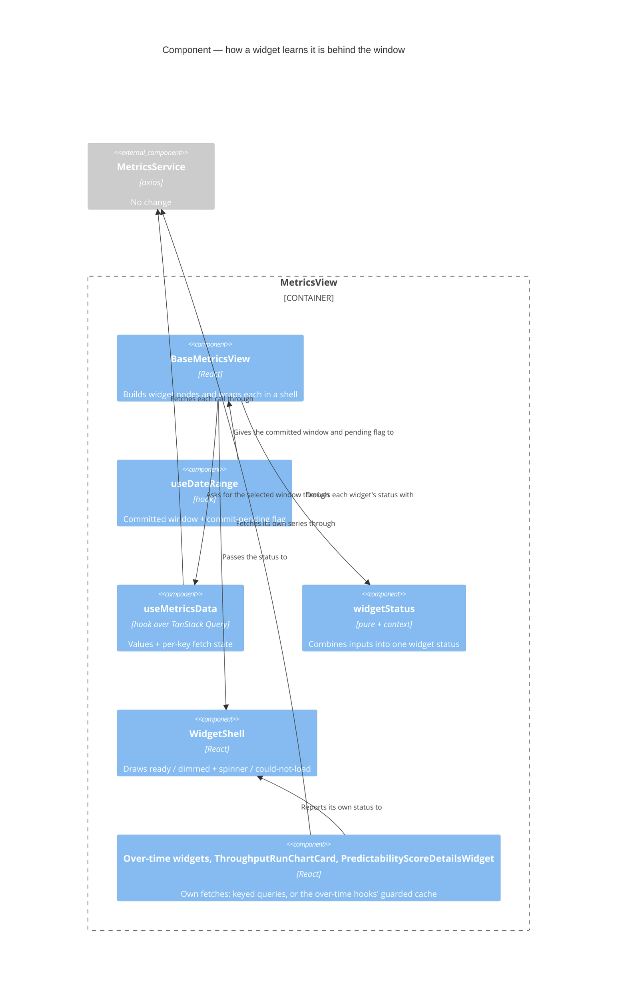

# Feature Delta — story-6249-chart-loading-indicators

> ADO User Story #6249 "Show loading indicators on Charts". Active, no parent Epic, tagged `Release Notes`.
> A user changed the metrics window and the charts kept showing the old window, with nothing to say new data
> was on its way (video on the ADO item). In their words, the people they need to convince "will see stuff
> like this and say: unreliable, inaccurate". The story proposes a loading state in the frame every chart
> shares.

Lean DISCUSS pass (2026-10-09). **The maintainer explicitly skipped DISCOVER and DIVERGE**, in their words: "skip
discover and diverge". The four product decisions below (D1–D4) were taken by the maintainer on 2026-10-09; their
answers are quoted in the Verdict column. Grounded in a code read of
`BaseMetricsView.tsx`, `WidgetShell.tsx`, `hooks/useMetricsData.ts`, `useDateRange.ts`,
`DashboardHeader.tsx`, `usePbcOverTime.ts`, `usePercentilesOverTime.ts`, `ThroughputRunChartCard.tsx` and
`LoadingAnimation.tsx`.

---

## Wave: DISCUSS / [REF] Persona IDs

- **flow-coach**: steps the Team metrics window at a standup or retro and reads the charts aloud.
- **delivery-lead-rte**: picks a preset (*Last 90 days*) on a Team or Portfolio dashboard in a review, with
  people watching.
- **forecasting-prospect** (secondary): the person being convinced. They judge Lighthouse's accuracy from what
  the screen shows, and a chart that lags the window reads as a wrong number, not as a slow one.

## Wave: DISCUSS / [REF] JTBD One-Liners

New job **`job-reader-trust-the-chart-shows-the-window-i-picked`** (added to `docs/product/jobs.yaml`):
*When I change the window on a metrics dashboard, I want every chart to show either the window I picked or
plainly that it is still getting there, so I can read the numbers out without wondering whether they are
the old ones.*

It sits under `job-lead-reach-the-metrics-window-i-mean-in-one-click` and
`job-lead-compare-this-period-against-the-one-before` (#5914). Those made changing the window one click,
and so made this gap visible much more often.

## Wave: DISCUSS / [REF] Code reality (what the story walks into)

- **No dashboard has a loading state.** `useMetricsData` (`hooks/useMetricsData.ts`) keeps one `useState`
  per metric and one effect per fetch key, re-run on `startDate`/`endDate`. It returns no pending flag, and
  it never clears a value when the window changes. The previous window's chart stays on screen until its
  `.then` replaces it.
- **Superseded responses win.** No effect in `useMetricsData` cancels or ignores a stale response, so a slow
  answer for the old window can land after the answer for the new one and overwrite it.
  `usePbcOverTime`/`usePercentilesOverTime` already guard against this with a `cancelled` cleanup, and
  so do two scope fetches inside `BaseMetricsView` (generation counter).
- **First load pops in.** Many widget nodes are `ctx.xData ? (...) : null`, and null nodes are filtered out
  of the dashboard, so a widget is absent until its data arrives and the layout shifts as each one lands.
- **Three overview widgets have their own spinner** (`FlowEfficiencyOverviewWidget`,
  `PredictabilityScoreOverviewWidget`, `TotalWorkItemAgeWidget`). It shows only on first load, because
  their value is never reset to null.
- **Over-time charts go blank.** `usePbcOverTime`/`usePercentilesOverTime` drop the old series as soon as
  the window changes. The widget then renders neither chart nor empty-state copy, so the area is empty with
  no spinner.
- **Only the header knows about the stepper.** `useDateRange.isCommitPending` covers the 500 ms stepper
  debounce, and `DashboardHeader` greys the label while it runs. Presets and the date picker commit at
  once and get no signal.
- **One frame.** `WidgetShell` wraps every dashboard item in exactly one place (`BaseMetricsView.tsx`
  ~1948). `ThroughputRunChartCard` is inside it, though it does its own filtered fetch.
- **Fetch failures are swallowed.** The `useMetricsData` effects `.catch` to `console.error` and leave the
  old value in place.

## Wave: DISCUSS / [REF] Locked Decisions

| ID | Decision | Verdict |
|----|----------|---------|
| D1 | **On a re-fetch, the old chart stays, dimmed, with a spinner over it.** The header (info, View Data, trend, RAG chip, title) stays as it is. The layout doesn't jump, and the chart is plainly out of date. A widget with nothing to dim (an over-time chart, whose series is already dropped) shows the spinner in an empty frame. *Header refined in DESIGN by S2 (View Data disabled while loading) and S4 (with nothing to dim, title + info only).* | Maintainer, 2026-10-09: "Dim + spinner overlay" |
| D2 | **First load shows the frame with a spinner.** Every widget of the open category renders its frame at once, with a centred spinner, and its data fills in place. Nothing pops in and nothing shifts. The three overview widgets' own spinners merge into this state, so there is one look. *Refined in review round 1 (R1): `estimationVsCycleTime` and `featureSize` keep today's presence rule and render nothing until their data says to show them; on a re-fetch, once shown, they dim like every other widget.* | Maintainer, 2026-10-09: "Show frame + spinner" |
| D3 | **Superseded responses are discarded, in this story.** A loading indicator that clears onto the previous window's numbers would make the "inaccurate" complaint worse. A response is applied only if it answers the window currently selected. | Maintainer, 2026-10-09: "Yes, same story" |
| D4 | **Scope is the Team and Portfolio metrics dashboards**, meaning every widget in `WidgetShell`, `ThroughputRunChartCard` and the over-time charts included. Forecast and backtest results keep the spinner in their Run button. | Maintainer, 2026-10-09: "Metrics dashboards only" |
| D5 | **"Loading" means the chart isn't showing the window that is selected.** A widget is in the loading state from the moment the window changes until its own data for that window arrives. This includes the stepper's 500 ms debounce, because by then the chart already shows a window the user has left. Each widget clears on its own, as its data lands; there is no all-or-nothing wait. | Locked in DISCUSS, from D1 + D3 |
| D6 | **A failed fetch never leaves a spinner, nor an undimmed old chart.** When a widget's fetch for the selected window fails, the spinner stops and the frame says it couldn't load. ~~The exact copy and the retry affordance (if any) are pinned in the DISTILL sketch walk-through.~~ *Pinned by S3 and confirmed by M4 (review round 2): warning icon, "This chart couldn't be loaded. Change the dates or reload to try again.", no Retry; header title + info only (M2).* Today's silent `console.error` that leaves the old window up is the same defect as the story. | Locked in DISCUSS; copy: S3, Maintainer 2026-10-09 (M4) |
| D7 | **Terminology.** Loading or error copy names no configurable term. If it ever names the chart, it uses the widget's rendered title, which already carries the instance's terms. | Locked |

## Wave: DISCUSS / [REF] User Stories

### US-01: A chart that is behind the window says so, and never settles on the wrong one

As a **delivery lead** in a review, I want every chart whose numbers are not yet for the window I just picked
to look visibly out of date, and to come back only with the right window's data, so that I never read an
old number out as the new one.

`job_id: job-reader-trust-the-chart-shows-the-window-i-picked`

#### Elevator Pitch
Before: on a Team's metrics dashboard, click *Last 90 days* after *Last 30 days*. Throughput, Cycle Time and the rest keep showing the 30-day picture for a second or more, looking final. A slow 30-day answer can even land after the 90-day one and stay.
After: click *Last 90 days* (or step the window back) → each chart dims at once with a spinner over it, and each one returns at full strength showing the 90-day data, one after the other as they arrive.
Decision enabled: the lead waits for a chart to come back before reading it out, and trusts what it shows once it has.

#### Acceptance Criteria
- **AC-1.1** After a window change through a preset, the date picker or the stepper, every visible widget whose data for the new window has not arrived renders the loading state: old content dimmed, spinner over it, header unchanged (D1, D5). *Header refined by S2/S4: View Data disabled while loading; title + info only when there is nothing to dim.* While loading, the widget's body (the chart and every control drawn inside it) takes no pointer input; the header's info button still works (M1). The frame is marked busy for assistive technology (`aria-busy="true"`) while loading, and no longer once it is ready or shows the could-not-load message, on re-fetch and on the US-02 first-load frames alike (was AC-1.8). All of this holds on both Team and Portfolio metrics dashboards, in light and dark theme (was AC-1.7). *AC-1.7 and AC-1.8 folded in here, review round 2 (E9).*
- **AC-1.2** Each widget leaves the loading state when its own data for the selected window arrives, independently of the others (D5).
- **AC-1.3** When two windows are selected in quick succession and the first window's response arrives last, the widget shows the second window's data, and it stays loading until that data arrives (D3).
- **AC-1.4** Percentiles Over Time and PBC Over Time show the spinner in their frame while their series loads, never an empty area with neither chart nor empty-state copy (D1).
- **AC-1.5** The Throughput run chart's own filtered fetch follows AC-1.1–1.3 too.
- **AC-1.6** When a widget's fetch for the selected window fails, the spinner stops and the frame shows the could-not-load message, "This chart couldn't be loaded. Change the dates or reload to try again." (M4), under a title + info header with no rating chip, trend or View Data (M2). It never shows the previous window's chart undimmed (D6).
- **AC-1.7** *Folded into AC-1.1 (review round 2, E9).* ~~Holds on both Team and Portfolio metrics dashboards, in light and dark theme.~~
- **AC-1.8** *Folded into AC-1.1 (review round 2, E9).* ~~A frame in the loading state is marked busy for assistive technology (`aria-busy="true"`), and is no longer marked busy once it is ready or shows the could-not-load message. Holds for the US-02 first-load frames too.~~

### US-02: A dashboard opens with every chart's frame in place

As a **flow coach** opening a Team's metrics, I want every chart of the category to be there from the first
moment, saying it is loading, so that I am not left wondering whether a chart is missing or still coming.

`job_id: job-reader-trust-the-chart-shows-the-window-i-picked`

#### Elevator Pitch
Before: open a Team's metrics. Charts appear one by one as their data arrives, the layout reshuffles each time, and until the last one lands you can't tell whether a chart is still coming or simply isn't there.
After: open a Team's metrics (or switch category) → every widget of the category is already in its place, with a spinner in each frame, and the charts fill in where they stand.
Decision enabled: the coach knows right away what the dashboard will show, and waits for the chart they came for instead of scanning for it.

#### Acceptance Criteria
- **AC-2.1** On first open, and on switching to a category not visited yet, every widget the category will show renders its frame at its final position with a centred spinner before any data has arrived (D2). Exceptions: the two widgets named in AC-2.2.
- **AC-2.2** No widget is inserted or removed after its data arrives: the dashboard layout is the same from first render to fully loaded. A widget whose rule hides it once data is known is out of scope for this AC. There are exactly two, and they keep today's rule (R1): **Estimation vs. Cycle Time** (hidden when estimation is not set up for the Team or Portfolio) and **Feature Size** (hidden while the window holds no Features). They show no frame and no spinner on first load, and appear when their data says so. When their own fetch fails, on first load or later, they show the could-not-load frame, with no spinner (M3, Maintainer 2026-10-09). *The first draft's example ("a feature the instance has switched off") named no real widget and was replaced in review round 1.*
- **AC-2.3** Flow Efficiency, Predictability Score and Total Work Item Age use the shared loading state, not their own spinner (D2).
- **AC-2.4** A first-load fetch failure behaves as AC-1.6, including for Estimation vs. Cycle Time and Feature Size (M3).

## Wave: DISCUSS / [REF] Out of Scope

- Forecast and backtest results, the Overview page, Feature and Delivery pages, and any page-level
  `LoadingAnimation` (D4).
- Making fetches faster, batching them, or caching across windows.
- A retry button, unless the DISTILL sketch review adds one under D6.
- Any backend or API change.

## Wave: DISCUSS / [REF] Cross-cutting Impact

- **RBAC**: **N/A, because** no data, endpoint or permission changes; nothing new reads `/authorization/my-summary`.
- **Lighthouse-Clients (CLI + MCP)**: **N/A, because** the change is in how the web dashboard renders while
  waiting. No contract, payload or client-visible behaviour changes.
- **Website**: **N/A, because** the website shows finished dashboards in its screenshots, never a loading one,
  and doesn't describe loading behaviour. Re-check at finalize, as always.
- **Premium**: **N/A, because** it applies to every dashboard, licensed or not.
- **Docs**: **N/A, because** the docs describe what charts show, not how they arrive. Finalize confirms that no
  page says a chart "appears when ready".
- **Screenshots**: risk. `@screenshot` tests must capture loaded charts, never a spinner. With US-02, a widget's
  frame exists before its data, so any wait for the frame alone is no longer a wait for the data (see E2E).
- **E2E**: risk. *Corrected in review round 1 (R13); the first draft said about ten specs located widgets by
  `widget-shell-*`.* Specs locate widgets by `dashboard-item-<key>` and the chart POMs, never `widget-shell-*`.
  17 specs read a visible widget as loaded (list in DISTILL "E2E impact"). Today a visible widget implies loaded
  data; the slice-01b dimming breaks that after a window change, and US-02 breaks it on first load. The POM waits
  (`MetricsWidget.waitUntilLoaded()` and the category-wide `MetricsPage.waitUntilEveryChartHasLoaded()`) exist
  since DISTILL; slice 01b routes the specs through them. The walking skeleton stays thin.
- **Usage data**: for **DEVOPS** to answer. The lean is **N/A, because** a loading state isn't something a
  user chooses to use, so no event could show the feature "is used".

## Wave: DISCUSS / [REF] WS Strategy

Strategy **B (extend existing)**, with no skeleton. Dashboards, the shell and the fetches exist end to end.
*Revised in review round 1 (R12): the first draft had one slice for US-01; it was more than a day, so it is now
three.* Four thin slices, each about a day and releasable on its own:

1. **slice-01a-right-window**: US-01's correctness half (AC-1.3, AC-1.5). A chart never settles on the wrong
   window. No visual change yet.
2. **slice-01b-loading-and-error-look**: US-01's look (AC-1.1, which now holds the former 1.7 and 1.8, AC-1.2,
   AC-1.6) for the charts the page feeds, the E2E waits and the re-pointed specs. ~~With 01a, this closes the
   complaint.~~ *Review round 2 (E10): the over-time and self-fetching charts are outside 01b's acceptance; 01a +
   01b + 01c close the complaint together.*
3. **slice-01c-self-fetching-charts**: the over-time charts and the self-fetching filtered views report
   through the frame (AC-1.4, AC-1.5's look).
4. **slice-02-first-load-frames**: US-02. Builds on 01b's loading state in the shell and on 01c's reporters
   (depends on 01c, review round 2, E8).

## Wave: DISCUSS / [REF] Driving Ports

- UI: Team metrics and Portfolio metrics dashboards. Window presets, date picker, stepper, category selector.
- The frontend services the hooks call (`metricsService.*`). No backend port changes.

## Wave: DISCUSS / [REF] Scope Assessment: PASS

Two stories, four slices (US-01 split in three in review round 1, R12). Frontend only, in one area
(`pages/Common/MetricsView` + `hooks/useMetricsData`). Each slice is ≤ 1 day and releasable on its own. The largest unknown is how a widget learns which fetch keys it waits on, and
`getFetchRequirementsForWidget` already maps widget → keys. No oversized signals.

## Wave: DISCUSS / [REF] Outcome KPIs

| KPI | Target | Measurement |
|-----|--------|-------------|
| `OUT-6249-never-wrong-window` | 0 widgets showing a superseded window's data once out of the loading state | Component tests with out-of-order responses (AC-1.3), plus a manual check on the dev instance with network throttling |
| `OUT-6249-visible-within-a-frame` | 100 % of affected widgets are in the loading state on the render right after the window changes | Component test: no `await` between the window change and the assertion |
| `OUT-6249-no-layout-shift` | 0 widgets inserted or removed between first render and fully loaded, per category | Component test comparing widget keys before and after data, plus E2E walking skeleton on demo data |
| `OUT-6249-no-repeat-report` | No new user report of "charts show old data" in the 60 days after release (target 0) | ADO / community channels, reviewed at the next release after that window. Owner: whoever runs `/release` |

## Wave: DISCUSS / [REF] Definition of Done

1. Every dashboard widget shows the dimmed-plus-spinner state while it's behind the selected window, and clears per widget.
2. Superseded responses are discarded everywhere the dashboard fetches, including `ThroughputRunChartCard` and
   `PredictabilityScoreDetailsWidget` (found in review round 1).
3. Over-time charts show a spinner, never an empty area, while loading.
4. A failed fetch ends in the could-not-load message, never a spinner or an undimmed stale chart. This holds for
   Estimation vs. Cycle Time and Feature Size too (M3). Two named exceptions: (R3) a failed named-percentiles scope
   fetch reverts the Cycle Time Percentiles widget to the Default percentiles, as today, because it is a scope
   choice and not a window change; (E6, review round 2) a failure to load the Cumulative Time per State picker's
   Work Items leaves the chart's numbers in place and the picker's list empty, as today, because it fails a list
   input, not a chart value.
5. First load renders every frame in place, except Estimation vs. Cycle Time and Feature Size, which keep today's
   presence rule (R1). The three overview widgets use the shared state.
6. E2E POM waits for "loaded" (`waitUntilLoaded` / `waitUntilEveryChartHasLoaded`), not "widget visible".
   `@screenshot` output is unchanged and shows no spinners.
7. `pnpm test`, `pnpm build` (Biome clean) and the E2E walking skeleton are green.
8. No new SonarCloud issues. StrykerJS ≥ 80 % on changed files.
9. A release-notes line is drafted on #6249 (`Release Notes` tag, already set).

## Wave: DISCUSS / [REF] DoR Validation

Mapped to the canonical DoR items in review round 1 (the first table used its own wording).

| # | DoR item (canonical) | Status | Evidence |
|---|----------|--------|----------|
| 1 | Problem statement clear, in domain language | ✅ | Header quote and US-01 / US-02 elevator pitches; the reporter's own words ("unreliable, inaccurate"). Job: `job-reader-trust-the-chart-shows-the-window-i-picked` (new) |
| 2 | User / persona identified with specific characteristics | ✅ | Persona IDs: flow-coach, delivery-lead-rte, forecasting-prospect |
| 3 | At least 3 domain examples with real data | ✅ | (a) a Team's metrics, *Last 90 days* picked after *Last 30 days* (US-01 pitch); (b) Team Zenith on demo data, Flow Overview, 90-day answers held back (DISTILL E2E skeleton); (c) the dev instance (`:5169`, real history), *Last 90 days* then *Last 7 days* under throttling (slice dogfood); (d) a Portfolio whose window holds no Features, where Feature Size stays absent (AC-2.2, R1) |
| 4 | UAT scenarios (Given/When/Then, 3-7 per story) | ✅ | ACs are observable outcomes; DISTILL wrote them as scenarios (DISTILL "Scenario list with tags") |
| 5 | AC derived from UAT | ✅ | AC-1.1-1.6 (1.7 and 1.8 folded into 1.1, E9), AC-2.1-2.4, each traced to D1-D6 |
| 6 | Story right-sized | ✅ | Four slices, each ≤ 1 day and releasable on its own (Scope Assessment; split in review round 1, R12) |
| 7 | Technical notes: constraints and dependencies | ✅ | Code reality; Out of Scope; frontend only, no backend or API change |
| 8 | Dependencies resolved or tracked | ✅ | None outside the story. Inside it: 01b needs 01a, 01c needs 01b, 02 needs 01c (each slice brief; 02's was 01b, corrected in review round 2, E8) |
| 9 | Outcome KPIs defined with measurable targets (*extra project check, not one of the eight canonical items*) | ✅ | Four KPIs with targets |

Also checked: cross-cutting (RBAC, Clients, Website, Premium, Docs, Screenshots, E2E, Usage data) all answered; no
blocking unknown (the mechanism is DESIGN's, the visuals were sketched in DESIGN, S1-S4).

## Wave: DISCUSS / [REF] Wave Decisions Summary

- **Key decisions:** D1 dim + spinner on re-fetch; D2 frames + spinner on first load; D3 discard superseded
  responses; D4 metrics dashboards only; D5 loading = not yet showing the selected window, per widget;
  D6 failure ends in a message, never a spinner or a stale chart.
- **Feature type:** user-facing, frontend only.
- **Constraints:** no backend change; reuse `WidgetShell` as the one place the state is drawn; keep the header
  usable while loading.
- **Upstream changes:** none. DISCOVER and DIVERGE were skipped by the maintainer.

## Wave: DISCUSS / [REF] Open questions for DESIGN

- How does a widget know it is loading? Options include a per-fetch-key pending/"window answered" state from
  `useMetricsData`, passed through `getFetchRequirementsForWidget`, or each widget node reporting its own
  state, as the over-time hooks and `ThroughputRunChartCard` own their fetches. Pick one way for all three
  sources.
- Race guard: reuse the `cancelled`-cleanup idiom the over-time hooks use, or an `AbortController` the
  services accept. Do the services take a signal today?
- Is there a widget whose presence depends on its data (AC-2.2's exception)? List them, so US-02 can say
  where the frame appears and then leaves.
- Should the dimmed old chart stay interactive (tooltips, View Data) while loading, or should the overlay block
  pointer events? View Data would open the old window's items.

## Wave: DISCUSS / [REF] Open checks for DISTILL

- UI sketch walk-through with the maintainer at the start of DISTILL. *Held: S1-S4 (sketch review) and M1-M4
  (review round 2) answer it. There is one spinner size, 24 px, so ~~spinner size per widget size~~ is closed (E11).*
- The `MetricsPage` POM gets a "widget loaded" wait. ~~Every spec that waits on `widget-shell-*` visibility is
  re-pointed in the slice-02 commit.~~ *Struck in review round 2 (E11): specs locate widgets by `dashboard-item-<key>`
  and the chart POMs; the waits exist since DISTILL; the 17 specs are re-pointed in slice 01b (R13).*

---

Lean DESIGN pass (2026-10-09), Morgan, **PROPOSE mode, maintainer AFK**. The DDDs below are *Proposed, for
maintainer confirmation*, except where the maintainer's sketch decisions (S1-S4, recorded next) settle them; none
blocks DISTILL. Grounded in a re-read of `useMetricsData.ts` (747 lines), `BaseMetricsView.tsx` (1998 lines),
`categoryMetadata.ts`, `WidgetShell.tsx`, `useDateRange.ts`, both over-time hooks and widgets,
`ThroughputRunChartCard.tsx`, `Dashboard.tsx`, `LoadingAnimation.tsx`, `BaseApiService.ts`, `App.tsx`
(`QueryClient`), `TeamMetricsView.tsx` and the `MetricsPage` POM. Revised after peer review (see Review), and again
after review round 2 (M1-M4 from the maintainer, E1-E11; see "Review round 2 decisions").
ADR: [ADR-233](../../product/architecture/adr-233-a-dashboard-widget-is-loading-until-its-data-answers-the-selected-window.md).

## Wave: DESIGN / [REF] Maintainer decisions (2026-10-09, sketch review, relayed by the coordinator)

Sketch record: the maintainer answered four sketch questions directly in the session on 2026-10-09; the
coordinator asked them with ASCII previews of each option. The answers, as given, are in the last column.

| ID | Decision | Answer as given |
|----|----------|-----------------|
| S1 | On a re-fetch the chart content drops to **40 % opacity** with a **24 px centred MUI `CircularProgress`** over it. The header stays at full strength. | "Dim 40% + small spinner (Recommended)" |
| S2 | While a widget is loading, the overlay **blocks pointer events on the chart** (no tooltips, no hover) **and View Data is disabled**. The info popover stays usable. Answers DISCUSS open question 4. ~~*Refined in review round 1 (R2): "the chart" is the chart surface; the controls rendered inside the widget body stay usable (list in "Review round 1 decisions").*~~ *R2 replaced by M1 (Maintainer, 2026-10-09): the whole body, controls included, takes no pointer input while loading.* | "Block chart + View Data (Recommended)" |
| S3 | On a fetch failure the old chart is **removed**, never shown undimmed. The frame shows a **warning icon** and the copy **"This chart couldn't be loaded. Change the dates or reload to try again."** **No Retry button.** | "Message only" |
| S4 | When there is nothing to dim (first load, or an over-time series reload), a **24 px spinner sits centred at the widget's normal height**. The header shows **title + info only**: no RAG chip or trend until data arrives. | "Centred spinner (Recommended)" |

## Wave: DESIGN / [REF] Decisions

| ID | Decision | Options weighed (rejected → why) | Status |
|----|----------|----------------------------------|--------|
| DDD-1 | **Every dashboard fetch becomes a TanStack Query whose key *is* the request** (*except the two over-time hooks, which keep their own guard and cache and only expose a status: review round 2, E5*) (fetch name + Team/Portfolio id + exactly the dates and choices the call sends). Keys carry dates as the local-day strings `formatLocalDate` gives, as `usePbcOverTime`'s `cacheKey` already does (R9). Every query function returns `null` where the service answered `undefined`, so a nullish answer is `ready` with nothing to show, never mistaken for missing data (R8). The library returns only the current key's data, so "loading" is derived in render from the selected window, never set: a query is `loading` while it has no data for its current key (`isPending`, or `isPlaceholderData` while it shows the previous key's data), `error` on `isError`, `ready` otherwise. `placeholderData: keepPreviousData` applies to the `useMetricsData` queries only, which gives S1's dimmed old chart; ~~the over-time queries use no placeholder, which gives S4's spinner in an empty frame (R7)~~ *the over-time hooks' series is null for a new key, which gives S4's spinner in an empty frame (E5)*. **One query per service call**; a fetch key's state combines its queries by the DDD-5 rule (any failed → `error`, else any in flight → `loading`), so one failing call marks only its own key (the cycle-time batch's five calls become five queries; the previous-period Work Item Age percentiles call belongs to `workItemAgePercentiles`). `useMetricsData` keeps its value-shaped return and adds `fetchStates` per key. Metrics query options live in **one shared `metricsQueryOptions` object that every metrics `useQuery` spreads** (R6): `staleTime: 0`, `gcTime: 0` (no caching across windows, out of scope in DISCUSS), `retry: false` (a failure shows at once, the reason `TerminologyContext` gives for the same setting), `refetchOnWindowFocus: false`. ~~**The over-time queries use a documented variant of it** (R5): no retry, no focus refetch, but a long `staleTime` and `gcTime`, so the per-selection cache they ship today survives within a window and toggling back to a selection costs no request; a window change still moves to a new key.~~ *Superseded in review round 2 (E5): there is no variant; the over-time hooks are not queries and sit outside the shared options.* A test asserts the resolved options of each metrics query. | (a) Hand-rolled per-key request identity recorded by each effect (this design's first draft) → each identity must list exactly what its effect sends, or a widget spins for ever or shows an old window as current; that rule is enforced only by tests. A query key cannot disagree with the call because the call reads its arguments from it. (b) A `pending` flag set when each effect starts → effects run after commit; when the commit comes from the stepper's timer the browser may paint the old chart undimmed first (`useLayoutEffect`/`flushSync` would close that gap but add a state write per key per window to ~30 keys). (c) Clear every value to `null` on a window change → throws away the chart S1 dims. | Proposed |
| DDD-2 | **Race guard: the query key, everywhere a window or a surviving choice is involved.** A late answer for an old key lands in the old key's cache entry and is never read. Per path: **Throughput run chart filter** → query keyed (filtered view, owner, window), enabled while the filter is on; **Throughput PBC filter** → its own query keyed on the view (DDD-10); **Cumulative State Time Work Item selection** (L1556-1568) → query keyed (item ids, owner, window), enabled when ids are chosen, so the selection survives a window change and is refetched for it; **Cumulative State Time scope** (L1507-1531) → query keyed (definition id, owner, window), enabled when a scope is chosen, the existing reset still clears the choice; *both are fetch keys of `stateTimeCumulative`, applicable by the DDD-11 predicates (review round 2, E4)*; **picker candidates** (L1533-1554) → query keyed (owner, window), enabled once the picker has been opened in this window (replaces `candidatesRequestedRef`); "opened in this window" is itself keyed on the window, so a window change resets it and the candidates are not fetched again until the picker is reopened (R10); *a candidates failure leaves the picker's list empty and the chart as it is, a DoD-4 exception; the request has no `catch` today (`BaseMetricsView.tsx:1550`), added in 01a (E6)*; **over-time series** → ~~their per-selection caches become queries keyed (selection, owner, window), keeping their cache within a window (R5)~~ *unchanged: their `cancelled` cleanup (`usePbcOverTime.ts:67-80`, `usePercentilesOverTime.ts:65-78`) already discards a stale answer and their per-mount cache stays as it is (E5)*; **Predictability Score details filter** (`PredictabilityScoreDetailsWidget.tsx` L38-57, found in review round 1) → query keyed (filtered view, owner, window), enabled while the filter is on, exactly as the run chart filter; **named percentiles scope** (L1380-1446) → **unchanged**: its generation counter already discards stale answers and the window change already resets it. A failed named fetch reverts to the Default percentiles, as today: a named exception to DoD-4, because it is a scope choice and not a window change (R3). | `AbortController` → no service method accepts a signal (0 matches in `services/Api`); ~40 methods and every test double to change, and it buys bandwidth, not correctness. The `cancelled` cleanup flag in every effect (first draft) → correct, but a second hand-written guard beside a library already wired at the app root. | Proposed |
| DDD-3 | **`WidgetShell` takes one `status` prop: `'loading' \| 'error' \| 'ready'`, default `'ready'`, plus whether there is content to dim.** It is the only place the state is drawn. It exposes `data-widget-status` on the existing `widget-shell-<key>` element and sets `aria-busy` while loading. | Two booleans (`isLoading`, `hasError`, the `LoadingAnimation` shape) → admits "loading and failed" at once. | Proposed |
| DDD-4 | **Self-fetching widgets report up through the shell.** The shell provides a status reporter in React context; `PbcOverTimeWidget`, `PercentilesOverTimeWidget`, `ThroughputRunChartCard` and `PredictabilityScoreDetailsWidget` call one hook with their own (query-derived) status. **This is the one place a status is *set* rather than derived**: the shell cannot read a child's queries during its own render, so the child writes it in a layout effect, which lands before paint. ~~**The reported status starts as `loading`** (R11), so a self-fetching widget's first render is never `ready` before its child has reported.~~ *Review round 2 (E1): a shell with no reporting child contributes nothing, and its status comes from the page's keys alone. The child's hook reports `loading` from its own first render (layout effect, before paint); that hook is the only place the loading default applies. In 01b no child reports yet, so the self-fetching charts read `ready`.* Outside a shell (unit tests) the hook does nothing. | (a) Lift those queries into `BaseMetricsView` → grows a 2000-line component and needs an "enabled" gate per category; (b) each self-fetching widget draws the overlay itself → two places draw the state, and `data-widget-status` would be wrong for exactly those widgets. | Proposed |
| DDD-5 | **One precedence rule** (restated in review round 1, R4; the first draft had `loading` > `error` > `ready` and waited for every sibling before showing an error). A widget's inputs are the page's commit-pending flag, every fetch key it needs (`getFetchRequirementsForWidget`) and anything its child reports. ~~(1) While the stepper debounce is pending (`isCommitPending`), every widget is `loading`. (2) Once the window is committed, if any of the widget's inputs has failed for the committed window, the widget is `error` at once, without waiting for its in-flight siblings. (3) Otherwise it is `loading` while any input is in flight. (4) Otherwise `ready`.~~ *Restated in review round 2 (E3, option A):* (1) while the stepper debounce is pending (`isCommitPending`), the page's own fetch keys read `loading`, whatever their state; a self-fetching child's report is not rewritten. (2) Then any input `error` → the widget is `error` at once, without waiting for in-flight siblings. (3) Otherwise `loading` while any input is `loading`. (4) Otherwise `ready`. So a child's own failure shows during a pending step, and a page key's failure does not, because a new window is on its way. | `loading` > `error` (first draft) → a widget whose first input failed keeps spinning until its slowest sibling answers, then flips to the message; the spinner promises data that cannot come. A page key's error for an *uncommitted* window cannot show under (1), and an old window's failure sits under the old key and is never read. Option B of round 2 (pending wins over every input, children included) → needs a second rule for children, and hides a self-fetching chart's real failure behind a spinner that the window change does not affect. | Proposed, revised R4, restated E3 (review round 2) |
| DDD-6 | **Drawn over the shell's body box only** (`WidgetShell.tsx` L385, named `widget-shell-body-<key>`; the earlier L381 cite was off, review round 2, E8), per S1/S4: content at 40 % opacity with a 24 px `CircularProgress` centred over it; with nothing to dim, the spinner alone, centred, the frame at its normal height. Per S3, error replaces the body with a warning icon and the fixed copy. | Extend `LoadingAnimation` → its contract is *replace*, not *overlay*, and ten page-level screens use it (out of scope, D4); MUI `Backdrop` → viewport-positioned by default, so it needs the same absolute box anyway. | **Maintainer (S1, S3, S4)**; mechanism Proposed |
| DDD-7 | **The whole widget body takes no pointer input while loading, and View Data is disabled; info stays usable** (S2, M1). *Replaced in review round 2 by M1 (Maintainer, 2026-10-09):* the shell sets `pointer-events: none` on one element, the body box `widget-shell-body-<key>` (`WidgetShell.tsx:385`), and no child opts back in, so the chart and every control inside it (the list in "Review round 1 decisions", now the list of what is blocked) take no pointer input. The over-time toggles sit under S4's lone spinner anyway. ~~*Refined in review round 1 (R2):* the controls rendered inside the body (listed in "Review round 1 decisions") stay usable while loading; using one only starts another fetch or changes what the dimmed chart draws. They dim with the body, since the body is dimmed as one box. Recommended means: the body takes no pointer input while loading and its controls opt back in (a child that accepts pointer input still receives it under a parent that refuses it).~~ `inert` stays rejected: it would also drop the dimmed chart from the accessibility tree, where `aria-busy` is the signal, and M1 names `pointer-events`. On error, S3 replaces the body and the controls go with it; changing the dates or reloading is the stated recovery. | Leave it interactive → View Data lists the old window's Work Items, and the Cumulative State Time bar click (L1570-1592) and PBC point drill would query the new window from the old chart. | **Maintainer (S2; M1, 2026-10-09)**, mechanism included (`pointer-events: none` on the body box) |
| DDD-8 | **Header chrome by state.** Loading with old content: full header (S1), View Data disabled (S2). Loading with nothing to dim: title + info only (S4). Error: title + info only, so no RAG chip, trend or View Data describes a chart that is no longer there (M2). | Keep RAG and trend on error → a chip about the previous window next to "couldn't be loaded", the stale signal D6 forbids. | S1/S2/S4 maintainer; error case ~~Proposed~~ **Maintainer, 2026-10-09 (M2)**: "Title + info only (Recommended)" |
| DDD-9 | **Slice 02: the frame decides its presence from the widget's placement, not its data.** At the wrap site (L1942-1959) an item is kept when its node exists *or* its status is not `ready`; its children are `null` until every fetch key it needs has had data at least once (so a first load is S4's spinner, not a dimmed `0`). The three overview widgets lose their own `CircularProgress` and get non-null props, built `x ? <Widget/> : null` like every other node. **Two exceptions keep today's presence rule (R1):** `estimationVsCycleTime` and `featureSize` are kept only once their node exists, so they show no frame and no spinner on first load; once shown, a re-fetch dims them like any widget. *The first draft's "`featureSize` drops its empty-list gate" is withdrawn.* *Review round 2 (M3, Maintainer 2026-10-09):* they are also kept when their own fetch key is `error`, on first load or later, so a failure shows the could-not-load frame, with no spinner. | Per-widget "if null render spinner" in each node → 25 copies of one rule. | Proposed |
| DDD-10 | **Throughput PBC filter becomes a fetch key of its own** (`throughputPbc`, its query keyed on the raw/filtered view). `refetchThroughputPbc` is replaced by a view setter. | Leave it in the `pbcCharts` group → toggling the filter would dim Cycle Time and Arrivals PBCs too; keep the imperative callback → nothing stops its old-window answer landing after a window change. | Proposed |
| DDD-11 | **A fetch key the service cannot answer is `ready`, decided by the same predicate that disables its query.** One predicate per key, the ones the effects use today: `providesSleRisk` (`sleRisk`), `isProjectMetricsService` (the four `featureSize*` keys), `isTeamMetricsService` (`featuresWorkedOnInfo`); flow efficiency keeps choosing its Team or Portfolio call by `isTeamOwnedMetricsService`, which never disables it. `blackoutPeriods` failing is `ready` with no periods (optional today). *Review round 2 (E4):* the two Cumulative Time per State keys get predicates of their own: the selection query applies only while Work Items are chosen, the scope query only while a scope is chosen; otherwise each is `ready`. Both are inputs to the `stateTimeCumulative` status. | Leave them `pending` → the Portfolio `wipOverview` (which lists `sleRisk`) spins for ever. | Proposed |
| DDD-12 | **No client timeout in this story.** A request that never returns leaves the widget loading, which is the truth. | An axios timeout → changes every API call in the app, and the right value differs per endpoint. | Proposed; see O1 |

## Wave: DESIGN / [REF] Component decomposition

All under `Lighthouse.Frontend/src/`. No backend, no new dependency.

| Path | Change | Slice |
|------|--------|-------|
| `pages/Common/MetricsView/widgetStatus.ts` | **CREATE (scaffolded in DISTILL).** Exports, as scaffolded: types `WidgetStatus` (`'loading' \| 'error' \| 'ready'`), `FetchKeyState` (`status`, `hasData`), `FetchKeyStates` (partial record per `MetricsFetchKey`), `QueryProgress` (`isPending`, `isError`, `isPlaceholderData`); functions `combineWidgetStatuses(statuses) → WidgetStatus` (the DDD-5 rule; the pending flag rewrites only the page's keys, never a child's report, E3), `widgetStatusFor(widgetKey, keyStates, isCommitPending) → WidgetStatus` and `widgetHasData(widgetKey, keyStates) → boolean` over `getFetchRequirementsForWidget`, `fetchKeyStateOf(queries, applicable) → FetchKeyState` (the query-result → status mapping, DDD-1, DDD-11, `isPlaceholderData` read as `loading`), and the hook `useReportWidgetStatus(status) → void` (DDD-4) with its reporter context. A separate module so `WidgetShell.tsx` keeps exporting only a component. | 01a (`fetchKeyStateOf`, behind `fetchStates`), 01b (the widget rules), 01c (the reporter) |
| `pages/Common/MetricsView/WidgetShell.tsx` | EXTEND. `status` prop, reporter provider ~~(defaulting to `loading`, R11)~~ (*a shell with no reporting child contributes nothing; status from the page's keys alone, E1*), S1/S4 overlay or lone spinner, S3 error body, `data-widget-status`, `aria-busy`, ~~chart surface without pointer input while in-body controls stay usable (R2)~~ *`data-testid="widget-shell-body-<key>"` on the body box (L385) and `pointer-events: none` on it while loading, no child opting back in (M1)*, View Data disabled, header chrome by state, error header title + info only (M2) (DDD-3, 6, 7, 8). Keep the status branches in a small sub-component so the render body stays under Sonar's cognitive-complexity limit. | 01b |
| `hooks/useMetricsData.ts` | EXTEND. Each effect becomes a `useQuery` (one per service call, `enabled` = needed and applicable, spreading the shared `metricsQueryOptions` it exports (R6), `keepPreviousData`, query functions normalising `undefined` to `null` (R8), keys on local-day strings (R9)); returns the same values plus `fetchStates` per key; failures surface as `error` instead of only `console.error`; `throughputPbc` query + view setter replace `refetchThroughputPbc` (DDD-10). *Review round 2 (E2):* in 01a a failed fetch for the selected window keeps that metric's last successful value, as today, through a per-metric last-success reference reset when the owner (id or type) changes; 01b drops it for the could-not-load frame. | 01a (E2 reference removed in 01b) |
| `pages/Common/MetricsView/categoryMetadata.ts` | EXTEND. New fetch key `throughputPbc`; `throughputPbc` widget requires it; `pbcCharts` keeps Cycle Time and Arrivals PBCs. *Review round 2 (E4):* two new fetch keys for the Cumulative Time per State Work Item selection and scope queries, added to `stateTimeCumulative`'s requirements beside `cumulativeStateTime` (L306), each with its applicability predicate (DDD-11). | 01a |
| `pages/Common/MetricsView/BaseMetricsView.tsx` | EXTEND. Slice 01a: Cumulative State Time scope, Work Item selection and candidates become queries per DDD-2 (L1486-1568); the candidates request gains the `catch` it lacks today (L1550), with its spec un-skipped in the same commit (E6); throughput PBC toggle calls the view setter. Slice 01b: pass `status` at the wrap site. Slice 02: wrap-site presence and null children (DDD-9); `estimationVsCycleTime` and `featureSize` keep their presence gates (R1), but are also kept when their own key is `error`, so a failure shows the could-not-load frame (M3); overview nodes built `x ? … : null`. | 01a, 01b, 02 |
| `pages/Common/MetricsView/usePbcOverTime.ts`, `usePercentilesOverTime.ts` | EXTEND. ~~The hand-kept per-selection cache becomes a query keyed (selection, owner, window) on the over-time variant of the options (R5), no placeholder (R7); return `status`.~~ *Review round 2 (E5):* not moved to TanStack Query. The `cancelled` cleanup and the per-mount cache stay exactly as they are; the hook only returns a `status`: `loading` while the series is null for the current key, `error` when that fetch failed, `ready` otherwise. | 01c |
| `pages/Common/MetricsView/PbcOverTimeWidget.tsx`, `PercentilesOverTimeWidget.tsx` | EXTEND. Report `status` (the hook reports `loading` from the first render, E1). | 01c |
| `pages/Common/MetricsView/ThroughputRunChartCard.tsx`, `PredictabilityScoreDetailsWidget.tsx` | EXTEND. The filtered fetch becomes a query keyed (view, owner, window), enabled while filtered. Fixes today's bug where the old window's filtered series (or score) stays up after a window change. Reporting its status through the shell follows in 01c. | 01a, 01c |
| `pages/Common/MetricsView/FlowEfficiencyOverviewWidget.tsx`, `PredictabilityScoreOverviewWidget.tsx`, `components/Common/Charts/TotalWorkItemAgeWidget.tsx` | EXTEND. Drop the own spinner; props non-null. | 02 |
| Tests rendering `useMetricsData`, `BaseMetricsView`, ~~the over-time widgets,~~ `ThroughputRunChartCard` or `PredictabilityScoreDetailsWidget` | EXTEND. Wrap in a `QueryClientProvider` with a fresh client per test (`retry: false`). The over-time hooks are not queries (E5), so their own tests need none. | 01a, 01c |
| `Lighthouse.EndToEndTests/tests/models/metrics/MetricsPage.ts` and the 17 specs | EXTEND. The waits `MetricsWidget.waitUntilLoaded()` and `MetricsPage.waitUntilEveryChartHasLoaded()` exist since DISTILL; slice 01b re-points every spec that reads values after a window change, and `Screenshots.spec` calls the category-wide wait before every metrics capture (R13). | 01b |

*Revised in review round 1 (R12):* the first draft had one slice-01 with a three-step seam inside it. It is now three
slices, each ≤ 1 day and releasable on its own: **01a** right window (the `useMetricsData` queries, the race guard,
nullish normalisation, the filtered views and Cumulative State Time paths following the window; no visual change);
**01b** loading and error look for the charts the page feeds (WidgetShell S1-S3, `data-widget-status`, `aria-busy`,
View Data disabled, ~~the chart surface not interactive~~ the whole body not interactive (M1), and the E2E waits with
every affected spec re-pointed in the same slice); **01c** self-fetching charts (the over-time charts, the run chart
and the Predictability Score details report through the shell, S4 for the over-time reload). Slice 02 is unchanged
apart from R1 and M3, and depends on 01c (E8).

## Wave: DESIGN / [REF] Driving ports

Unchanged: the Team and Portfolio metrics dashboards (presets, date picker, stepper, category selector, the
in-widget filter and scope controls). Internal contracts this story adds, both consumed only inside `MetricsView`:
`WidgetShell`'s `status` prop and `useReportWidgetStatus(status)`.

## Wave: DESIGN / [REF] Driven ports

`IMetricsService<T>` / `ITeamMetricsService` / `IProjectMetricsService` (`services/Api/MetricsService.ts`):
**unchanged**, no `AbortSignal`. The backend metrics endpoints: unchanged. No external integration, so no
contract-test annotation.

## Wave: DESIGN / [REF] Technology choices

No new dependency. **TanStack Query** (`@tanstack/react-query` ^5, MIT) is already installed, its
`QueryClient` provided at the app root (`App.tsx` L70-77) and used by `TerminologyContext` and
`LicenseStatusIcon`; the metrics queries override its defaults (5 min stale, 30 min cache, 2 retries) per DDD-1.
React 19.3 (the repo's real version; `CLAUDE.md` still says 18). MUI 9
`CircularProgress` and a warning icon from `@mui/icons-material`. Vitest + RTL; Playwright.

## Wave: DESIGN / [REF] Reuse Analysis

| Existing | Verdict | Contract shape / note |
|----------|---------|-----------------------|
| `WidgetShell` | **EXTEND** | The one frame (L1948). Gains `status`; bounded change: body wrapper and header chrome only. |
| `useMetricsData` | **EXTEND** | Internals move from effects to queries; its value-shaped return stays, plus `fetchStates`, so `BaseMetricsView` keeps reading the same names. |
| TanStack Query (`App.tsx` `QueryClient`) | **REUSE** | Installed and provided app-wide; its query key is the request identity and its observer returns only the current key's data, which is the whole of DDD-1 and DDD-2. |
| `getFetchRequirementsForWidget` | **REUSE** as is | Already "what a widget needs to render completely"; exactly the input set for a widget's status. |
| Generation counter (`BaseMetricsView` L1380-1446) | **REUSE** unchanged | Named percentiles scope only; already correct. |
| `useDateRange.isCommitPending` | **REUSE** | Feeds DDD-5 for the debounce. |
| `usePbcOverTime` / `usePercentilesOverTime` guard and cache | **REUSE** unchanged (review round 2, E5) | Their `cancelled` cleanup already discards a stale answer and their per-mount cache stays as is; the hooks only gain a returned `status`. Return-only addition. |
| `LoadingAnimation` | **NOT EXTENDED** | Replace-not-overlay contract, ten page-level callers out of scope (D4). Its primitive (`CircularProgress`) is reused. |
| `FeatureSizeScatterPlotChart` empty state (L414/L805) | ~~REUSE~~ **not used** (R1) | The first draft let the `featureSize` node drop its `length > 0` gate; review round 1 keeps the gate, so this empty state stays unreachable from the dashboard, as today. |
| `widgetStatus.ts` | **CREATE NEW** | No existing home for a pure status combinator plus a reporter context: `categoryMetadata.ts` is placement data, `WidgetShell.tsx` should export only its component, and `BaseMetricsView` must not grow. Pure functions: return-only. |

## Wave: DESIGN / [REF] C4

```mermaid
C4Container
  title Container — story 6249 (unchanged containers; the change is inside the SPA)
  Person(lead, "Delivery lead / flow coach")
  Container(spa, "Lighthouse web app", "React 19 + MUI", "Team and Portfolio metrics dashboards")
  Container(api, "Lighthouse backend", "ASP.NET Core", "Metrics endpoints")
  Rel(lead, spa, "Changes the window on")
  Rel(spa, api, "Requests one window's metrics from")
```



## Wave: DESIGN / [REF] Answers to the DISCUSS open questions

1. **How a widget knows it is loading.** One rule for all three sources: *a widget is loading while any input it
   shows has no data for the request the current window would send* (DDD-1). ~~All three sources are keyed
   queries;~~ *The page's fetches and the filtered views are keyed queries; the over-time hooks keep their own
   guarded cache and return a status from it (review round 2, E5);* `useMetricsData` exposes them as `fetchStates`, mapped to widgets through
   `getFetchRequirementsForWidget`; the over-time widgets and `ThroughputRunChartCard` report theirs to the shell
   (DDD-4). D5's debounce is covered by `isCommitPending`, D6 by `isError` and the precedence rule (DDD-5).
2. **Race guard.** The query key (DDD-2), decided per path there. The services take no `AbortSignal`.
3. **Widgets whose presence depends on data** (from `buildWidgetNodes`, `BaseMetricsView.tsx` L998-1232):
   *Superseded in review round 1 (R1): both exceptions below keep today's presence rule, with no frame and no
   spinner on first load; the original answers are kept for the record.*
   - `estimationVsCycleTime` L1145-1152 — hidden when the response says `NotConfigured` (and the chart itself
     returns `null` then, `EstimationVsCycleTimeChart.tsx` L150). **The only real exception.** Slice 02: on first
     load its frame shows the S4 spinner, then leaves if the answer is `NotConfigured`. On a later window change
     the previous answer is kept as placeholder, so it does not flicker. Alternative: keep the frame and say
     "not configured", as Flow Efficiency does (O2).
   - `featureSize` L1153-1160 — hidden while the Feature list is empty. That gate was only a loading proxy: the
     chart has its own "No data available" (L414/L805). **Slice 02 drops the gate**, so a Portfolio with no
     Features in the window shows that empty state instead of nothing (O3).
   - `featuresWorkedOnOverview` L1019-1025 — gated on the `featuresInProgress` prop, which a Team always passes
     (`[]` before its own fetch, `TeamMetricsView.tsx` L35/L143), and the widget is Team-only. Not an exception.
   - Loading-only nulls, which become loading frames in slice 02: `throughput` L1058, `wipOverTime` L1107,
     `totalWorkItemAgeOverTime` L1116, `stacked` L1123, `arrivals` L1161, `totalThroughput` L1194,
     `totalArrivals` L1197, `featureSizePercentiles` L1200, `stateTimeCumulative` L1203, and the six PBC nodes
     via `buildPbcNode` L821.
4. **Interactivity while loading.** Answered by the maintainer (S2): no pointer input on the chart, View Data
   disabled, info usable (DDD-7). *Widened by M1 (Maintainer, 2026-10-09): the whole body, its controls included.*

## Wave: DESIGN / [REF] Test seams

- **Out-of-order responses, deterministically:** the fake `IMetricsService` returns a promise the test holds
  and settles by hand, one per call. Render, change the window, settle the *new* window's promise, then the *old*
  one, and assert the widget shows the new data and `ready`; then the reverse order, asserting it stays
  `loading` until the new answer. `tsconfig.app.json` targets ES2021 (`Promise.withResolvers` is ES2024), so a
  five-line deferred helper in the test utilities. Every render under a fresh `QueryClient` (`retry: false`).
- **Partial failure of a former batch:** reject one of the five cycle-time calls; assert only its key goes
  `error` and the other four land `ready` (DDD-1, one query per call).
- **Error does not wait for siblings (R4):** a widget needing keys A and B; A fails while B is still held → the
  widget shows could-not-load at once, with no spinner.
- **Pending step versus failure (E3):** during the stepper debounce, a page key that failed reads `loading`; a
  self-fetching child's own reported failure shows `error`.
- **01a keeps the last success (E2):** in 01a a failed fetch keeps the previous value, with no visual change; a
  change of owner clears it.
- **Cumulative Time per State predicates (E4):** with no Work Items chosen and no scope chosen, the selection and
  scope keys read `ready`; with them chosen, they count toward `stateTimeCumulative`.
- **Nullish answer (R8):** the service resolves `undefined` → the widget is `ready`, not `error`, and not loading.
- **Query options (R6):** read back the resolved options of each metrics query from the test's `QueryClient`; assert
  no retry and no cross-window cache ~~, and the over-time variant (R5) where it applies~~. *The over-time hooks are
  not queries and have no options to assert (E5).*
- **Over-time reload (R7):** pin that an over-time widget shows S4's lone spinner, not a dimmed old series, while a
  new window's series loads; and that toggling back to a selection already seen in this window costs no request,
  pinned as today's behaviour (E5, which supersedes R5).
- **Picker candidates (R10):** open the picker, change the window, assert no candidates request until the picker is
  opened again. **Picker failure (E6, slice 01a):** a failed candidates request leaves the picker's list empty and
  the chart's numbers in place, with no unhandled rejection.
- **Each click-started path of DDD-2:** change the window while the scope, selection, candidates or filtered
  fetch is in flight, settle the old answer last, assert it is not shown.
- `widgetStatus.ts`: table tests of the combinator, `widgetStatusFor` and the inapplicable-key rule (pure; the
  mutation target).
- `WidgetShell`: per status and content-to-dim, assert `data-widget-status`, the S1 dim and spinner, the S4 lone
  spinner and title + info header, ~~a chart surface that takes no pointer input while an in-body control still
  responds (R2)~~ a body (`widget-shell-body-<key>`) that takes no pointer input while loading, an in-body control
  included, while the info button still responds (M1), disabled View Data, the S3 icon and exact copy (M4) under a
  title + info header (M2); a test child
  calling `useReportWidgetStatus` for DDD-4/5.
- `BaseMetricsView`: one test per AC with the deferred fake. KPI `OUT-6249-visible-within-a-frame` is tested as
  *the status is `loading` in the render that changes the window* (no `await` in between); that no stale frame
  is painted follows from render-derivation and is argued, not tested.

## Wave: DESIGN / [REF] E2E impact (slice 01b)

*Moved from slice 02 to slice 01b and corrected in review round 1 (R12, R13).* `widget-shell-<key>` carries
`data-widget-status`. Specs never locate `widget-shell-*`: they reach widgets through `dashboard-item-<key>` and the
chart POMs. The waits exist since DISTILL: `MetricsWidget.waitUntilLoaded()` expects `ready` (and fails fast on
`error`), and `MetricsPage.waitUntilEveryChartHasLoaded()` waits for every widget of the open category.
`Screenshots.spec` calls `waitUntilEveryChartHasLoaded()` before every metrics capture. The 17 specs that read a
visible widget as "loaded" (list in DISTILL "E2E impact") go through the waits in slice 01b, because 01b is where a
widget first stays visible with an older window's numbers (the `ci-learnings` rule on POM getters that read "not
rendered yet" as a value applies: wait for `ready` first, then read). Status is derived in render for every widget the
page feeds; ~~for a self-fetching widget the reporter starts at `loading` (R11), so no fresh shell is briefly `ready`
before its fetch starts.~~ *Review round 2 (E1):* a self-fetching widget's hook reports `loading` from its first
render, in a layout effect before paint, so from 01c no such shell is painted `ready` before its fetch starts. In 01b
no child reports, so those widgets read `ready` on the page's keys alone, and 01b's E2E acceptance does not cover
them. The S3 copy is pinned in component tests, not E2E.

## Wave: DESIGN / [REF] Architectural enforcement

- `categoryMetadata.test.ts` gains the invariant that, for each owner type and category, every fetch key any of
  the category's widgets requires is in `getFetchKeysForCategories([category], ownerType)`; a widget whose key is
  never enabled would otherwise spin for ever. It keeps pinning that the only widgets with an empty requirements
  entry are the ones that report their own status.
- The applicability predicate per fetch key lives in one `Record<MetricsFetchKey, …>` used by both `enabled` and
  the status mapping (DDD-11), so a new key cannot compile without one and the two cannot disagree.
- One shared `metricsQueryOptions` (R6), and a test that reads back the resolved options of every metrics query, so a
  query that forgets to spread it (and so silently retries or caches across windows) fails the suite. The over-time
  hooks are outside it (E5).
- Earned Trust, as it applies to a browser: the backend may answer out of order, fail, fail for one call of
  several, be asked for a key the service cannot serve, or never answer. The first four are component tests
  above; the last is O1.

## Wave: DESIGN / [REF] Changed Assumptions

- DISCUSS D1: *"The header (info, View Data, trend, RAG chip, title) stays as it is."* → It stays at full
  strength while old content is dimmed, but **View Data is disabled** (S2). With nothing to dim, and on failure,
  the header shows **title + info only** (S4, DDD-8).
- DISCUSS D6: *"The exact copy and the retry affordance (if any) are pinned in the DISTILL sketch walk-through."*
  → Pinned already by S3: warning icon, "This chart couldn't be loaded. Change the dates or reload to try again.",
  no Retry.
- DISCUSS "Code reality": *"`ThroughputRunChartCard` is inside it, though it does its own filtered fetch."* →
  Also: its filtered series is never refetched on a window change, so with the filter on it shows the old
  window today. Fixed in slice 01a (DDD-2).
- DISCUSS "Code reality": *"…and so do two scope fetches inside `BaseMetricsView` (generation counter)."* →
  True of the two named-percentiles fetches only. The **Cumulative State Time** scope fetch (L1507-1525) has no
  guard, and its Work Item selection and candidates are never reset on a window change (the reset effect at L1488
  runs once). Brought under DDD-2 in slice 01a; the selection is kept and refetched for the new window.
- DISCUSS Out of Scope: *"Making fetches faster, batching them, or caching across windows."* → Still honoured.
  ~~*as corrected in review round 1 (R5)*: the `useMetricsData` queries set `gcTime: 0` and `staleTime: 0`; the
  over-time queries keep the per-selection cache they already ship, within a window, so toggling back to a selection
  costs no request, as today. Neither adds caching across windows, so moving TanStack Query under them changes no
  fetch timing or caching a user could notice. (The first draft put `gcTime: 0` on every metrics query, which would
  have removed the over-time cache.)~~ *Review round 2 (E5):* the `useMetricsData` queries set `gcTime: 0` and
  `staleTime: 0`; the over-time hooks are not moved to TanStack Query at all and keep their per-mount cache exactly
  as today. Neither adds caching across windows.
- DISCUSS "Code reality" lists `ThroughputRunChartCard` as the one self-fetching widget inside the shell besides the
  over-time charts. → *Found in review round 1:* `PredictabilityScoreDetailsWidget` (L38-57) does its own filtered
  fetch too, kept like the run chart's and never refetched on a window change, so with the filter on it shows the
  old window's score. Brought under DDD-2 in slice 01a and reporting in 01c, as the run chart.
- DISCUSS D2 / AC-2.1-2.2 → two widgets keep today's presence rule (R1); see the Locked Decisions and AC notes.
- DISCUSS Cross-cutting E2E (*"about ten specs … locate widgets by `widget-shell-*`"*) → 17 specs, located by
  `dashboard-item-<key>` and the chart POMs; re-pointed in slice 01b (R13).
- Project `CLAUDE.md` says React 18; the frontend is on **React 19.3**.

## Wave: DESIGN / [REF] Review

Peer review (solution-architect-reviewer, iteration 1): **conditionally approved**, 0 critical, 3 high. All
three highs addressed: (1) the installed TanStack Query was not weighed → weighed, and adopted (DDD-1/2, ADR-233);
(2) batched effects had no failure-attribution rule → one query per call, partial-failure test; (3) click-started
reset paths said "keeps or gains" → decided per path in DDD-2 with a test each. Mediums: fetch-key reachability
invariant added (enforcement); the reporter named as the one *set* path (DDD-4); slice-01 step seam proposed.
Lows: one predicate per key (DDD-11); KPI test reworded; the layout-effect pending-flag variant recorded under
DDD-1. Not re-reviewed at the time.

**Iteration 2** is the Final Wave Review Gate of 2026-10-09 (Atlas, after DISTILL): **rejected pending revisions**,
1 blocker (error precedence) and 9 highs. Every item is addressed in "Review round 1 decisions" below, and the
sections each one changes are amended in place.

**Round 2** of the same gate (Atlas): **rejected**, 2 blockers and 5 highs (N-01 to N-04, N-07 to N-11). The review
iterations were then spent. The maintainer answered the product questions (M1-M4) and the coordinator decided the
rest (E1-E11), all in "Review round 2 decisions"; the coordinator, not a third review, checks each one is closed.

## Wave: DESIGN / [REF] Open questions for DISTILL / DELIVER

- **O1 (maintainer):** a request that never returns keeps its widget loading indefinitely (DDD-12). Accept, or
  add a per-request timeout in a follow-up?
- **O2 (maintainer / DISTILL):** `estimationVsCycleTime` frame that appears then leaves on first load when
  `NotConfigured`, or a "not configured" frame like Flow Efficiency's? *Settled by R1: neither; today's rule.*
- **O3 (maintainer / DISTILL):** `featureSize` empty state now visible on a Portfolio with no Features in the
  window. *Settled by R1: not shown; today's rule.*
- **O4 (maintainer):** confirm adopting TanStack Query for the metrics fetches (DDD-1/2): the `useMetricsData`
  fetches and the filtered views. It reverses the first draft after review; the fallback is the hand-rolled per-key
  identity with a `cancelled` cleanup, recorded in ADR-233's alternatives. *Review round 2 (E5): O4 says nothing
  about the over-time charts; they are not moved and keep their own guard and cache.*
- **O5 (out of scope, noted):** the named-percentiles scope shows the default percentiles under a named
  selection while its fetch is in flight, and Features Being Worked On shows `0` until `TeamMetricsView`'s own
  fetch lands. Neither is a window change; candidates for a follow-up. Next to them (R3): a failed named-percentiles
  fetch silently reverts to the Default percentiles instead of saying it could not load.
- **O6 (DELIVER):** a Team/Portfolio change that reuses the mounted view now dims the previous owner's charts
  (the key includes the id). Confirm on the dev instance that routes remount instead.

## Wave: DESIGN / [REF] Wave Decisions Summary

- **Maintainer decisions:** S1 40 % dim + 24 px spinner, header full strength; S2 no pointer input on the chart,
  View Data disabled, info usable; S3 chart removed, warning icon + fixed copy, no Retry; S4 lone 24 px spinner
  at normal height, header title + info only. Review round 2: M1 the whole body blocked while loading, controls
  included; M2 error header title + info only; M3 Estimation vs. Cycle Time and Feature Size show could-not-load on
  their own failure; M4 copy confirmed.
- **Key decisions (Proposed):** DDD-1 every dashboard fetch a TanStack Query keyed by its request, one per call,
  one shared options object, status derived in render; DDD-2 the query key as race guard, decided per path; DDD-3/4
  one `status` union on `WidgetShell`, self-fetching widgets report into it (their hook reports `loading` from its
  first render; a shell with no reporter contributes nothing, E1); DDD-5 pending window → the page's keys read
  `loading`, then any failed input (a child's included) → `error` at once, then in flight → `loading`, else `ready`
  (revised R4, restated E3); DDD-6/7/8 drawing, ~~chart surface not interactive while in-body controls stay usable~~
  the whole body not interactive (M1), header chrome by state; over-time hooks unchanged but for a status (E5);
  DDD-9 slice 02 frames by placement, two widgets keep today's presence rule (R1); DDD-10 `throughputPbc` fetch key;
  DDD-11 inapplicable keys `ready` by one predicate; DDD-12 no timeout.
- **Slices (R12):** 01a right window, 01b loading and error look, 01c self-fetching charts, 02 first-load frames.
- **One new module** (`widgetStatus.ts`), everything else EXTEND. No backend, API, new dependency or RBAC change.
- **ADR-233** (Proposed). `brief.md` gains a short section; `ARCHITECTURE.md` unchanged (it does not describe
  widget loading).
- **Upstream changes:** D1 and D6 refined (Changed Assumptions); D2 and AC-2.1/2.2 refined by R1; three
  pre-existing stale-window bugs (run chart filter, Predictability Score details filter, Cumulative Time per State)
  folded into slice 01a.

---

## Wave: DESIGN / [REF] AFK defaults taken on the open questions (2026-10-09)

The maintainer is away (AFK mode). Each default below either follows from a DISCUSS decision the maintainer already
made, or is an engineering choice that doesn't change what a user sees. All are open to revisit at the hold.

- **O1 → accepted.** No client timeout (DDD-12). A request that never returns keeps its widget loading, which is
  the truth. A timeout would be a follow-up.
- **O2 → the frame appears, then leaves when the answer is `NotConfigured`.** This is the exception AC-2.2
  already carves out. A new "not configured" frame would add a widget that instances don't show today, which is
  a product change this story didn't ask for. *Reversed by R1 (review round 1): no frame at all on first load.*
- **O3 → accepted.** The `featureSize` empty state shows on a Portfolio with no Features in the window. AC-2.2
  (no widget removed after its data arrives) implies it. *Reversed by R1 (review round 1): today's rule kept.*
- **O4 → TanStack Query adopted** for the metrics fetches (DDD-1/2). It's already installed and wired at the app
  root. Each query overrides the app defaults: no caching across windows, no retries. The hand-rolled fallback
  stays recorded in ADR-233.
- **O6 → checked in DELIVER** on the dev instance, as written.

## Wave: DESIGN / [REF] Review round 1 decisions

The Final Wave Review Gate (four reviewers, 2026-10-09) returned DISCUSS needs-revision, DESIGN rejected pending
revisions, DEVOPS approved, DISTILL rejected pending revisions. The maintainer is away, so the coordinator decided
each item: a safe default that keeps today's behaviour, or an engineering choice. Every line below is an **AFK
default, review round 1 (2026-10-09)**, open to revisit at the hold. The sections each one changes are amended in
place, with the first-draft text kept visible where a locked DISCUSS decision is refined.

| # | Decision (AFK default, review round 1 (2026-10-09)) | Amended |
|---|---|---|
| R1 | `estimationVsCycleTime` and `featureSize` keep today's presence rule: nothing rendered until their data says to show them; no frame and no spinner on first load. Once shown, a re-fetch dims them like every widget. They are the named exceptions to AC-2.1/AC-2.2. No new empty state, no appear-then-leave frame. "`featureSize` drops its empty-list gate" is withdrawn; O2/O3 reversed. | D2, AC-2.1, AC-2.2, DoD-5, DDD-9, Reuse Analysis, open-question answer 3, O2, O3, AFK defaults, slice-02 brief, journey step 1 |
| R2 | ***Replaced by M1 (Maintainer, 2026-10-09): the whole body, controls included, takes no pointer input; see "Review round 2 decisions".*** ~~The chart surface takes no pointer input while loading (no tooltips, hover or clicks on plotted points; View Data disabled). The controls rendered inside the body stay usable; using one only starts another fetch or redraws the dimmed chart. `inert` on the whole body is withdrawn. On error the body, controls included, is replaced by S3; changing the dates or reloading is the recovery.~~ The controls are listed below, now as what is blocked. | S2, DDD-7, component table, ADR-233, brief |
| R3 | A failed named-percentiles scope fetch keeps today's behaviour, reverting to the Default percentiles: an explicit exception to DoD-4 (a scope choice, not a window change), and a follow-up candidate next to O5. | DoD-4, DDD-2, O5 |
| R4 | *Restated by E3 (review round 2): while pending, the page's keys read `loading`; a child's own failure still shows `error`.* ~~While the stepper debounce is pending every widget is `loading`.~~ Once committed, any input failed for the committed window makes the widget `error` at once, without waiting for in-flight siblings; otherwise `loading` while anything is in flight; otherwise `ready`. | DDD-5, DDD-1, Test seams, ADR-233, brief |
| R5 | ***Superseded by E5 (review round 2): the over-time hooks are not moved to TanStack Query; their guard and cache stay as today and they only expose a status.*** ~~The over-time queries keep their per-selection cache within a window (long `staleTime` and `gcTime`, keyed on selection, owner and window), so toggling back costs no request, as today. No `gcTime: 0` for them. A window change still moves to a new key.~~ | DDD-1, DDD-2, Changed Assumptions, ADR-233, brief |
| R6 | One shared `metricsQueryOptions` object; every metrics `useQuery` spreads it; a test asserts each metrics query's resolved options (no retry, no cross-window cache). ~~The over-time queries use their own documented variant (R5).~~ *The over-time hooks are outside it (E5).* | DDD-1, component table, Test seams, Architectural enforcement, ADR-233 |
| R7 | `keepPreviousData` on the `useMetricsData` queries only (S1's dimmed old chart); no placeholder on the over-time queries (S4's spinner in an empty frame), pinned in the over-time specs. *Review round 2 (E5): the over-time hooks are not queries; their series is null for a new key, which gives the same empty-frame spinner.* The status mapping reads `isPlaceholderData` as `loading`. | DDD-1, component table, Test seams, ADR-233, brief |
| R8 | Every query function returns `null` where the service answered `undefined`; a spec pins that such a widget is `ready`, not `error`. | DDD-1, Test seams, ADR-233 |
| R9 | Query keys carry dates as `formatLocalDate` strings, as `usePbcOverTime`'s `cacheKey` does. | DDD-1, ADR-233 |
| R10 | "Picker opened in this window" is keyed on the window, so a window change resets it. | DDD-2, Test seams |
| R11 | *Replaced by E1 (review round 2): the child's hook reports `loading` from its first render; a shell with no reporter contributes nothing.* ~~The status reporter starts at `loading`: a self-fetching widget's first render is never `ready`.~~ The "derived in render" claim in E2E impact is qualified accordingly. | DDD-4, E2E impact, component table, ADR-233 |
| R12 | Slice 01 split into **01a** right window, **01b** loading and error look (with the E2E waits and every spec that reads values after a window change re-pointed in the same slice), **01c** self-fetching charts. Slice 02 unchanged apart from R1. Each ≤ 1 day and releasable on its own. | WS Strategy, Scope Assessment, DoR, component table, slice briefs |
| R13 | The E2E premise is corrected everywhere: specs locate widgets by `dashboard-item-<key>` and the chart POMs, not `widget-shell-*`; 17 specs; the POM waits exist since DISTILL; the category-wide wait is `waitUntilEveryChartHasLoaded`, which `Screenshots.spec` calls before every metrics capture (slice 01b scope and acceptance check). | Cross-cutting E2E, Open checks, E2E impact, DEVOPS E2E, environments.yaml, slice-01b brief |

**Found while applying R2 (engineering default, same label):** `PredictabilityScoreDetailsWidget` does its own
filtered fetch (L38-57), cached and never refetched on a window change, the same stale-window bug as the run chart's.
It is treated exactly as `ThroughputRunChartCard`: a query keyed (filtered view, owner, window) in 01a, reporting its
status in 01c. Amended in DDD-2, DDD-4, the component table, C4 and Changed Assumptions.

**R2: every control rendered inside a widget body on the metrics dashboards, and where it renders.** Paths under
`Lighthouse.Frontend/src/`. ~~All stay usable while their widget loads;~~ *Under M1 (review round 2) all are blocked
while their widget loads, by `pointer-events: none` on the body box;* all go with the body on error. The table's
"Using it" column says what each control does once the widget is ready.

| Widget | Control | Rendered at | Using it |
|---|---|---|---|
| Throughput (run chart) | Throughput filter switch (`ThroughputChartFilterToggle`, its `Switch` at `components/Common/Charts/ThroughputChart/ThroughputChartFilterToggle.tsx:38`) | `pages/Common/MetricsView/ThroughputRunChartCard.tsx:63`, placed by `components/Common/Charts/BarRunChart.tsx:73` | fetches the filtered series |
| Throughput PBC | Throughput filter switch | `pages/Common/MetricsView/BaseMetricsView.tsx:854`, placed by `components/Common/Charts/ProcessBehaviourChart.tsx:359` | fetches the filtered PBC (DDD-10) |
| every PBC | Special-cause chips | `components/Common/Charts/ProcessBehaviourChart.tsx:369` | highlights points on the drawn chart |
| Predictability Score details | Throughput filter switch | `pages/Common/MetricsView/PredictabilityScoreDetailsWidget.tsx:78` | fetches the filtered score |
| PBC Over Time | Metric type toggle (`ToggleButtonGroup`) | `pages/Common/MetricsView/PbcOverTimeWidget.tsx:188-211` | fetches that metric's series |
| Percentiles Over Time | Percentiles selection toggle | `pages/Common/MetricsView/PercentilesOverTimeWidget.tsx:138-162` | fetches that selection's series |
| Cycle Time Percentiles | Cycle time scope `Select` | `components/Common/Charts/CycleTimePercentiles.tsx:106` | fetches the named percentiles (R3 on failure) |
| Cycle Time scatterplot | Cycle time definition `Select` | `components/Common/Charts/CycleTimeScatterPlotChart.tsx:302`, placed at `:355` | fetches named percentiles (`:189-205`) |
| Cycle Time scatterplot | Percentile legend chips; Work Item type legend chips | `CycleTimeScatterPlotChart.tsx:370`, `:387` (`PercentileLegend.tsx:35/61`, `LegendChip.tsx:33`) | shows or hides lines and points |
| Work Item Aging | Background mode toggle | `components/Common/Charts/WorkItemAgingChart.tsx:539` | redraws the chart |
| Work Item Aging | Percentile legend chips; reference-line source toggle; state legend chips | `WorkItemAgingChart.tsx:584`, `:593`, `:627` | redraws the chart |
| Feature Size | Percentile legend chips; Y-axis mode toggle; state category legend chips | `components/Common/Charts/FeatureSizeScatterPlotChart.tsx:649`, `:654`, `:696` | redraws the chart |
| Simplified CFD | "Show Trend" switch | `components/Common/Charts/StackedAreaChart.tsx:129-138` | redraws the chart |
| Work In Progress over time | System WIP limit chip | `components/Common/Charts/LineRunChart.tsx:94` | shows or hides the limit line |
| Cumulative Time per State | Scope `Select` (`CumulativeStateTimeScopeControl.tsx:35`); Work Item picker `Autocomplete` (`CumulativeStateTimeItemPicker.tsx:71`, `:88`) | slots placed at `components/Common/Charts/CumulativeStateTimeChart.tsx:455-456`, passed from `BaseMetricsView.tsx:1212-1227` | fetch the scoped or selected times, and the candidates |
| Cumulative Time per State | Completion legend buttons | `CumulativeStateTimeChart.tsx:234-260`, placed at `:467` | shows or hides completed/not completed |

On the chart surface (blocked while loading): tooltips and hover on every chart, the Cumulative Time per State bar
click, the PBC point drill, the Blocked Items Over Time point click (`BlockedItemsOverTimeChart.tsx:77` fetches the
blocked items for a date), and the scatterplots' point clicks that open Work Items. Outside the body, and so
unaffected: the header (info stays usable, View Data disabled per S2) and the dashboard's own Expand button
(`Dashboard.tsx:189`), which sits on the dashboard item, not in the shell.

**Text fixes applied in the same round:** sketch answers quoted (S table, Locked Decisions); D1 and AC-1.1 annotated
with the S2/S4 header refinement; AC-2.1/2.2 exceptions named and the wrong example replaced; DoR mapped to the
canonical items with real-data examples; Docs answered "N/A, because …"; AC-1.8 for `aria-busy`; the skip words
quoted; KPI owner named; the WidgetShell body cited at L381; `widgetStatus.ts` marked CREATE (scaffolded in DISTILL)
with its exports; this gate recorded as the DESIGN iteration-2 review; DEVOPS fixes (KPI target 0 kept, CI runs
`pnpm run sonarreport`, Linux-only platform, Sonar rule in the SonarCloud project gate). Slice copy comes from S3.

## Wave: DESIGN / [REF] Review round 2 decisions

Round 2 of the Final Wave Review Gate (2026-10-09) rejected DISCUSS (Eclipse: 3 blockers, 2 high) and DESIGN
(Atlas: 2 blockers, 5 high), and conditionally approved DISTILL (Sentinel: 0 blockers, 3 high). That was the last
review iteration. The maintainer came back and answered the product questions in the session (M1-M4); the
coordinator decided the engineering items (E1-E11). No third review runs: the coordinator checks that each finding
is closed. The sections each decision changes are amended in place, and superseded text stays visible, marked.

**Maintainer, 2026-10-09** (answered in the session; answers quoted exactly as given)

| ID | Decision | Answer as given | Replaces / closes | Amended |
|----|----------|-----------------|-------------------|---------|
| M1 | **Controls inside a chart while it loads are blocked too.** The whole body of a loading widget takes no pointer input: the chart, filter switches, percentile and metric toggles, legend chips, scope selectors and the Cumulative Time per State picker. The header's info button still works; View Data is disabled. The shell sets `pointer-events: none` on one element, the body box, named `widget-shell-body-<key>` (today `<Box sx={{ flex: 1, minHeight: 0 }}>{children}</Box>` at `WidgetShell.tsx:385`, with no test id yet); no child opts back in. The over-time toggles already sit under S4's lone spinner, which agrees. The R2 controls table stays, as the list of what is blocked. | "Blocked too (Recommended)" | **Replaces R2** | S2, DDD-7, component table, Test seams, open-question answer 4, R2 controls table, ADR-233, brief, journey, slice 01b |
| M2 | **Header on a could-not-load frame: title + info only.** No rating chip, trend or View Data. | "Title + info only (Recommended)" | Closes Eclipse NF-01. DDD-8's error case is now a maintainer decision, no longer Proposed | DDD-8, AC-1.6, ADR-233 |
| M3 | **Estimation vs. Cycle Time and Feature Size, own fetch fails: show could-not-load.** They keep today's rule of staying hidden while not configured or holding no Features. When their own fetch fails, on first load or later, the could-not-load frame shows, with no spinner. DoD-4 holds for them. | "Show could-not-load (Recommended)" | Closes Atlas N-02; refines R1 | AC-2.2, AC-2.4, DoD-4, DDD-9, slice 02, journey |
| M4 | **Error copy:** "This chart couldn't be loaded. Change the dates or reload to try again." | "Yes, exactly that" | Closes Eclipse NF-08; confirms S3 | D6, AC-1.6 |

**Engineering decisions, review round 2**

| # | Decision (review round 2) | Finding | Amended |
|---|---|---|---|
| E1 | **Reporter default.** A shell with no reporting child contributes nothing, so its status comes from the page's keys alone. A self-fetching child's hook reports `loading` from its first render (in a layout effect, before paint), and that hook is the only place the loading default applies. In 01b no child reports yet, so the self-fetching charts read `ready`, which is honest about what 01b covers. Replaces R11's "the provider defaults to `loading`". | Atlas N-01 | DDD-4, component table, E2E impact, ADR-233, slices 01b and 01c |
| E2 | **Slice 01a on failure.** When a fetch for the selected window fails, `useMetricsData` keeps the last successful value of that metric, exactly as today, so 01a changes nothing visible and "as today" is true. It holds that value in a per-metric last-success reference, reset when the owner (Team or Portfolio, id or type) changes, so one owner's numbers never show under another. Slice 01b replaces it with the could-not-load frame. | Atlas N-03 | component table, slice 01a |
| E3 | **A pending step versus a child failure (option A).** While the stepper debounce is pending, the page's own fetch keys read `loading`. A self-fetching child's own reported failure still shows `error`. One `status` prop and one combinator hold: any input `error` → `error`; else any input `loading` → `loading`; else `ready`. The pending flag only rewrites the page's keys, so a page key that failed for the committed window reads `loading` during a pending step (a new window is on its way). | Atlas N-04 | R4, DDD-5, component table, ADR-233, brief, slice 01b. (DISTILL's precedence rows: the DISTILL agent.) |
| E4 | **Cumulative Time per State selection and scope.** Two applicability predicates in DDD-11: the selection query applies only while Work Items are chosen, the scope query only while a scope is chosen; otherwise each is `ready`. Both are inputs to the `stateTimeCumulative` status, as two new fetch keys beside `cumulativeStateTime` (`categoryMetadata.ts:306` lists only that one today). | Atlas N-07 | DDD-2, DDD-11, component table |
| E5 | **The over-time charts are not moved to TanStack Query.** `usePbcOverTime` and `usePercentilesOverTime` already discard a stale answer with their `cancelled` cleanup (`usePbcOverTime.ts:67-80`, `usePercentilesOverTime.ts:65-78`) and keep a per-mount cache keyed (selection, start, end) in `useState` (`usePbcOverTime.ts:57-58`, `usePercentilesOverTime.ts:55-56`). They stay as they are and only expose a status: `loading` while the series is null for the current key, `error` when that fetch failed, `ready` otherwise. Their cache is today's exactly, so there is no new cross-visit cache. The "long `staleTime`/`gcTime` variant" is removed everywhere. R6's shared options apply to every TanStack metrics query; the over-time hooks are outside it. **Supersedes R5** (and Sentinel NF-5). | Atlas N-08 | R5, R6, DDD-1, DDD-2, component table, Reuse Analysis, C4, open-question answer 1, Test seams, Changed Assumptions, O4, ADR-233, brief, slice 01c |
| E6 | **Picker candidates failure.** A failure to load the Cumulative Time per State picker's Work Items is a DoD-4 exception beside R3: it fails a list input, not a chart value. The chart keeps its numbers and the picker shows its empty list, as today. Today the request has no `catch` (`BaseMetricsView.tsx:1550`, `void request.then(...)`), so a failure is an unhandled rejection. The `catch` is added in the same commit that un-skips that spec, in slice 01a. | Atlas N-09 | DoD-4, DDD-2, component table, slice 01a |
| E7 | **brief.md.** The 6249 section (already present) covers: status derived from queries keyed by the request; one `status` on `WidgetShell`; the body-level pointer block; the over-time hooks exposing a status; ADR-233. | Atlas N-10 | brief |
| E8 | **Cites and dependency.** The WidgetShell body is cited at L385 and named `widget-shell-body-<key>` (Atlas N-11, Eclipse NF-11). Slice 02 depends on 01c (Atlas N-12). | Atlas N-11, N-12 | DDD-6, DoR row 8, slice 02 |
| E9 | **US-01's ACs.** AC-1.7 (both dashboards, both themes) and AC-1.8 (`aria-busy`) fold into AC-1.1. The old ids stay, marked "folded into AC-1.1", so DISTILL's references still resolve. The decision said this leaves seven; folding two of eight leaves six live ACs (AC-1.1 to AC-1.6), inside the 3-7 range either way. | Eclipse NF-03 | US-01, WS Strategy, slices 01b and 02, environments.yaml |
| E10 | **Slice 01b's claims.** 01b covers the charts the page feeds. The over-time and self-fetching charts are outside its acceptance and arrive in 01c. "Closes the complaint" and "every chart dims" are gone from 01b's goal, dogfood and hypothesis: 01a + 01b + 01c close it together. | Eclipse NF-04 | WS Strategy, slice 01b |
| E11 | **Text cleanups.** The stale `widget-shell-*` / slice-02 sentence in Open checks is struck (NF-06). D6 and the DISTILL sketch-walkthrough pointers point to S1-S4 and M1-M4; there is one spinner size (24 px), so "spinner size per widget size" is closed (NF-07). O4 no longer claims anything about the over-time charts (NF-09). DoR row 9 is labelled an extra project check (NF-10). The L385 cite (NF-11, with E8). | Eclipse NF-06, NF-07, NF-09, NF-10, NF-11 | Open checks, D6, O4, DoR |

---

Lean DEVOPS pass (2026-10-09), Apex, **maintainer AFK**: every decision below is a fixed project fact or the
recommended option, recorded rather than asked. Frontend only; nothing to install, provision, migrate or configure.

## Wave: DEVOPS / [REF] Decisions

| # | Decision | Answer | Source |
|---|---|---|---|
| 1 | Deployment target | **Unchanged.** The standalone release, Docker image and Helm chart ship the built frontend bundle as today. No new environment. | Project fact |
| 2 | Container orchestration | **Unchanged.** Nothing here touches the container or the chart. | Project fact |
| 3 | CI/CD platform | **GitHub Actions, existing workflows.** No new workflow, job, runner or secret. | 27 workflows under `.github/workflows/` |
| 4 | Existing infrastructure | Brownfield; reused as is. | same |
| 5 | Observability | **None new.** Fetch failures already reach `console.error`; the story turns them into the S3 frame, which is the user-visible signal. No log line, no metric. | Project fact; DDD-1 |
| 6 | Deployment strategy | **Unchanged.** Rollback = `git revert` of the feature commits, then the ordinary release path. No migration, no setting, no persisted data, no API change, so no mixed-version window: an old bundle and a new bundle call the same endpoints with the same payloads. | ADR-233 (frontend only) |
| 7 | Continuous learning | **N/A, because** a loading state has nothing to flag, A/B or roll out progressively. Gating it would ship two readings of the same dashboard. | — |
| 8 | Branching | **Trunk-based on `main`**, slice boundary ritual as usual (push, CI green, then ADO Resolved). | Project rule |
| 9 | Mutation testing | **`per-feature`, StrykerJS on the changed frontend files, kill rate ≥ 80 %.** | `CLAUDE.md` § Mutation Testing Strategy |

**Contradictions with DESIGN: none.** DESIGN said no backend, API, dependency or RBAC change, and nothing here needs one.

## Wave: DEVOPS / [REF] Usage-data event

**N/A, because** a loading state is not a feature anyone chooses to use. It appears whenever a dashboard fetches,
for every user, so there is no "use" to count; any count of it is a count of page loads and window changes, which
`TeamTabOpened`/`PortfolioTabOpened` (with `/teams/:id/metrics` and `/portfolios/:id/metrics`) already approximate. Nothing is appended to
`UsageDataEventName` (16 events today, last `TeamRefinementDayVerdictShown = 15`; the catalog in
`docs/settings/usagedata.md` lists what each one says), and nothing changes in `docs/settings/usagedata.md`.

Rejected candidates:

- **"A chart failed to load"** (fired on the S3 error frame). Rejected: it is client-error telemetry, an
  operational stream the usage-data catalog is not for. Every catalog event records a deliberate user action
  (opened, created, ran, connected, voted, switched); this one would record the backend or network failing. To be
  useful it would also need *which* chart, i.e. the widget key as a property. That is ~30 values that grow with
  every widget, not the small closed enum the rule allows, and the catalog's own pattern (`Which tab was opened` is
  one of eleven published addresses) shows how much ceremony a single such property costs.
- **"A window was changed on a metrics dashboard"**. Rejected: it counts #5914's window controls, not this story,
  and would be read as evidence this feature is used when it says nothing about the loading state.

## Wave: DEVOPS / [REF] Monitoring contracts (Outcome KPIs → instrument)

No KPI needs runtime instrumentation; each is a test, a manual dev-instance check, or a board review.

| KPI | Instrument | Where it is read |
|---|---|---|
| `OUT-6249-never-wrong-window` | Vitest + RTL with the hand-settled deferred fake: old window answers last, widget shows the new data and `ready`; reverse order stays `loading` (AC-1.3, AC-1.5, each DDD-2 path). **Plus** a manual check at DELIVER on the dev instance with DevTools network throttling (Slow 3G), stepping the window twice quickly. | CI (`ci_frontend.yml`); DELIVER checklist |
| `OUT-6249-visible-within-a-frame` | Vitest: `data-widget-status="loading"` asserted in the render that changes the window, no `await` in between (DESIGN Test seams). | CI (`ci_frontend.yml`) |
| `OUT-6249-no-layout-shift` | Vitest: widget keys of a category identical before and after data (AC-2.2, `estimationVsCycleTime` and `featureSize` the named exceptions, R1). **Plus** the E2E walking skeleton on demo data, waiting through `waitUntilLoaded()`. | CI (`ci_frontend.yml`; E2E in `ci_verifysqlite.yml` and `ci_verifypostgres.yml`) |
| `OUT-6249-no-repeat-report` | ADO items (Bug or User Story, project `Lighthouse`) and community channels naming charts that show old or stale data, created in the 60 days after the release that carries slice 01b. **Target 0, as DISCUSS set it: a single report misses the target.** Checked by whoever runs `/release` for the first release after that window, in the release-notes pass that already reads the board. | The board |

**`docs/product/kpi-contracts.yaml`: no entries added.** Following the #6055 precedent: that file is the contract
for outcomes with a *data collection* story, and three of these four are CI-asserted, so their `data_collection`
would read "none"; the fourth is a board query with no data pipeline behind it, exactly like #6055's KPI-4, which
was also kept here instead. (#6094 did register CI-asserted KPIs there; the #6055 shape is the one asked to be
mirrored and the more recent small-story precedent.) Recorded here, where a reader of this feature looks.

## Wave: DEVOPS / [REF] CI/CD pipeline outline

No pipeline change. The stages this feature passes through:

| Stage | Workflow | What it does for this feature |
|---|---|---|
| Change detection | `ci_changes.yml` | Flags `Lighthouse.Frontend` (and `Lighthouse.EndToEndTests` in slices 01b and 02) |
| Frontend | `ci_frontend.yml` (`build-frontend` action) | `pnpm run build` (`tsc -b` + Biome via `prebuild`, which runs `--write`) and `pnpm run sonarreport` (Vitest with coverage; `.github/actions/build-frontend/action.yml` L57, L63). CI does not run `pnpm test` itself; locally `pnpm test` is the same suite |
| E2E | `ci_verifysqlite.yml`, `ci_verifypostgres.yml` | The Playwright suite, **twice**, Chromium only. `ci_e2e.yml` only compiles it |
| Quality gate | `ci_sonar_gates.yml` | SonarQube Cloud analysis. The "no new issue of any severity" rule lives in the SonarCloud project's quality gate, not in the workflow |

**Pre-applied CI risks** (from `docs/ci-learnings.md`):

- **Vitest `Test timed out in 5000ms`** on rendering-heavy files: `BaseMetricsView` and `useMetricsData` tests gain
  a `QueryClientProvider` and deferred promises. A timeout in an untouched rendering file is that entry, not a
  flake; give it an explicit `{ timeout }`.
- **Sonar cognitive complexity** on `WidgetShell`: DESIGN already moves the status branches into a sub-component.
- **POM getters that read "not rendered yet" as a value**: `waitUntilLoaded()` first, then read (DESIGN E2E impact).

## Wave: DEVOPS / [REF] E2E and screenshot implications

- *Corrected in review round 1 (R13).* From slice 01b, a visible widget no longer means its data for the selected
  window has arrived (and from slice 02, not even on first load). Specs locate widgets by `dashboard-item-<key>` and
  the chart POMs, not `widget-shell-*`. The `MetricsPage` POM waits exist since DISTILL:
  `MetricsWidget.waitUntilLoaded()` (waits for `data-widget-status="ready"`, fails fast on `error`) and the
  category-wide `MetricsPage.waitUntilEveryChartHasLoaded()`. The 17 specs that read a visible widget as "loaded"
  go through them in the slice-01b commit.
- **`@screenshot` must never capture a spinner.** `Screenshots.spec` calls `waitUntilEveryChartHasLoaded()` before
  every metrics capture (slice 01b). The preconditions of a screenshot run are unchanged (premium licence fixture, `rm` the target PNG first,
  `@auth` excluded); this story should leave every PNG byte-identical in content, so a regenerated image that
  differs is a finding.
- E2E runs in CI twice (SQLite and Postgres), so a race in the wait shows up as a flake on either. Run the
  touched specs locally before committing them.
- The walking skeleton stays thin (one flow on demo data): open a Team's metrics, wait for loaded, change the
  preset, see `loading` then `ready`.

## Wave: DEVOPS / [REF] Mutation testing

`per-feature`, StrykerJS, ≥ 80 %, on the changed frontend files: `widgetStatus.ts` (the pure combinator is the
prime target: a flipped precedence is AC-1.3's failure), `WidgetShell.tsx`, `useMetricsData.ts`,
`usePbcOverTime.ts`, `usePercentilesOverTime.ts`, `ThroughputRunChartCard.tsx`,
`PredictabilityScoreDetailsWidget.tsx`, and the changed ranges of `BaseMetricsView.tsx`. Per-story config `Lighthouse.Frontend/stryker-6249-frontend.json`, results under
`docs/feature/story-6249-chart-loading-indicators/mutation/`. Two rules from the ledger: prove the harness with a
standalone `vitest run --config <stryker vitest config>` first (StrykerJS exits 0 having tested nothing), and run
it last, on frozen code.

## Wave: DEVOPS / [REF] Environments and coexistence

Machine artifact: `docs/feature/story-6249-chart-loading-indicators/environments.yaml`. Axes: theme (light and
dark, AC-1.1, formerly AC-1.7 (E9)), owner type (Team and Portfolio, same AC), CI's Playwright browser (Chromium). Platform is Linux only,
because that is all CI covers. OS, provider and licence are deliberately not axes: the behaviour is browser rendering over a payload the tests supply. Must not break:
the forecast/backtest Run-button spinners and page-level `LoadingAnimation` (out of scope, D4), `TerminologyContext`
and `LicenseStatusIcon` queries on the shared `QueryClient` (metrics queries override defaults per query, never the
client's), and the 17 E2E specs that locate widgets by `dashboard-item-<key>` and the chart POMs (R13).

## Wave: DEVOPS / [REF] Handoff

**To** `nw-acceptance-designer` (DISTILL): `environments.yaml`, the KPI → instrument table above, and the E2E
implications. Start DISTILL with the UI sketch walk-through the project rule requires; DESIGN's S1-S4 and the
maintainer's M1-M4 (review round 2) pin it. **Per-wave peer review: skipped**: no new deployment target, CI framework, observability or security
change.

## Wave: DEVOPS / [REF] Changed Assumptions

**None.** DISCUSS leaned "N/A" on usage data and DEVOPS confirms it with the rejected candidates above. The
`OUT-6249-no-repeat-report` target stays DISCUSS's 0. Review round 1 corrected facts this section relied on (the E2E
premise and its slice, R12/R13; CI's frontend command; the platform), without changing a decision. Review round 2
changes none either: the over-time hooks stay off TanStack Query (E5), which removes nothing DEVOPS relied on, and
the theme and owner axes now trace to AC-1.1 (E9).

---

Lean DISTILL pass (2026-10-09), Quinn, **maintainer AFK**: every engineering choice below took the recommended
option and is recorded, not asked. The UI sketch walk-through the project rule asks for at the start of DISTILL was
held in DESIGN (S1-S4, relayed by the coordinator) and completed by the maintainer's own answers in review round 2
(M1-M4), so DISTILL pinned those decisions and re-sketched nothing.
**Revised the same day after the Final Wave Review Gate** (review round 1): every R-decision that changes what a spec
asserts, Sentinel's B-01, H-01 to H-07 and the lows are applied below and in the test files.
**Revised again after review round 2**: the maintainer's M1-M4, the coordinator's E1-E9 where they change what a
spec asserts, and Sentinel's round-2 findings (H-03, NF-2 to NF-7, C6c) are applied below and in the test files.

## Wave: DISTILL / [REF] Reconciliation

`[lang-mode] typescript` (Vitest + React Testing Library, co-located `*.test.tsx`; Playwright through POMs).
`[policy-mode] inherit`: the React component and Playwright rows already exist in
`docs/architecture/atdd-infrastructure-policy.md`; one row was appended for the held-answer metrics fake.
`[port-mode]` n/a: the project asserts through its own observables (`data-widget-status`, rendered text, the requests
a widget sends), not a `state_delta` port. fast-check is **not** a devDependency, so property-shaped specifications are
`it.each` example tables (every arrival order of three answers, every precedence combination, every placed widget,
every fetch key); no dependency added.

Reconciliation passed — 0 contradictions. The three waves live in this file; there are no `wave-decisions.md`.
DISCUSS D1 and D6 were refined by the maintainer's own S2/S3/S4 (DESIGN Changed Assumptions) and by M1-M4; D2 and
AC-2.1/2.2 are refined by R1 and M3, which DISCUSS now carries as named exceptions. DEVOPS states no contradiction with
DESIGN and none was found. Round 2 left DISCUSS, DESIGN and the slice briefs saying the same thing about M1 (whole body
blocked), E1 (no reporter, page keys alone), E3 (pending rewrites only the page's keys) and E5 (over-time hooks are not
queries); the specs follow them.

**What review round 1 changed in the specs** (AFK default, review round 1 (2026-10-09)), as still in force:

| Decision | What the specs now assert |
|---|---|
| R1 | Estimation vs. Cycle Time and Feature Size are **not framed** before their data, stay away when their data says so (not set up / no Features), and once shown dim on a re-fetch like any chart. The first-load tables leave both out. M3 adds their failure case (below). |
| ~~R2~~ | *Replaced by M1 in round 2; see below.* |
| R4 | Error beats loading once the window is committed; a key that fails while a sibling is still on its way shows could-not-load at once. Restated by E3 (below). |
| ~~R5~~ / R7 | Over-time: a window change shows the spinner in an empty frame (the older series out of sight, never dimmed); switching selections and back within one window asks for nothing new (pin). R5's query cache is superseded by E5. |
| R6 | One spec per query family reads back the resolved options from a `QueryClient` carrying the app's defaults (retry 2, 5 min stale, 30 min cache): every metrics query resolves to no retry, `gcTime` 0, `staleTime` 0, no focus refetch. Round 2 widened it (NF-2, below) and dropped the over-time variant (E5). |
| R8 | A service answering with nothing (`undefined`) leaves its chart `ready`, never could-not-load (`answerWithNothing` on the held fake). |
| R10 | After a window change, the picker asks for no Work Items of the new window until it is opened again. |
| R11 | Replaced by E1 (below): the self-fetching specs still assert `loading` in the very render that mounts the chart. |
| R12 | Every spec is mapped to 01a / 01b / 01c / 02 below; a spec that asserted both the data and the look was split in two. |
| R13 | The E2E waits, the 17 re-pointed specs, `Screenshots.spec`'s `waitUntilEveryChartHasLoaded()` before each metrics capture, and the walking skeleton's un-skip all belong to slice 01b. |
| Found in round 1 | Predictability Score details' filtered score gets the run chart's specs: `PredictabilityScoreDetailsWidget.loading.test.tsx`. |

**What review round 2 changed in the specs** (Maintainer, 2026-10-09, and review round 2):

| Decision / finding | What the specs now assert |
|---|---|
| M1 (replaces R2) | The whole body refuses the pointer while loading: `widget-shell-body-<key>` carries `pointer-events: none`, and a click on the Throughput filter switch inside a loading chart is rejected for it, with no filtered request sent (frame, run chart card, Predictability Score details, dashboard: 4 pending). The four "switch works while loading" pins are **removed**. The info button still opens (pin); View Data is disabled. |
| M2 | A could-not-load frame shows its title and info only: no rating, trend or View Data, and info is its only button (pending, unchanged in substance, now a maintainer decision). |
| M3 | Estimation vs. Cycle Time and Feature Size show the could-not-load frame, with no spinner, when their own request fails, on first load and on a re-fetch once shown (4 pending, slice 02); the five "stays away" pins are unchanged. |
| M4 | The copy pin reads exactly "This chart couldn't be loaded. Change the dates or reload to try again." (unchanged). |
| E1 | A frame with nothing inside reporting reads what the page says, for each of loading / error / ready (3 pending, 01b). A self-fetching chart's frame is `loading` in the render that mounts it (01c, unchanged). |
| E2 | Pin, slice 01a: a window whose throughput fails leaves the older chart in place, as today. **Slice 01b deletes it** when the could-not-load specs go green. The owner-change reset of the last-success reference is a `useMetricsData` unit test for DELIVER, not a dashboard spec. |
| E3 | Re-pinned: a page input that failed reads `loading` while a stepped window waits (pure rule, and "stepping the window after a failure" on the dashboard); a self-fetching chart's own failure still reads `error` while a step waits (new, 2 pending, 01c, over-time on the real dashboard); the frame table keeps page `loading` + child `error` → `error`. |
| E4 | A 6-row table: the Work Item choice and the stretch choice, each still being counted (`loading`), failed (`error`) or not made (inapplicable, `ready`), with the totals answered. |
| E5 (supersedes NF-5) | The over-time options spec is **removed**, and so is the `QueryClientProvider` around the over-time file: the hooks are not queries. "Switch and back asks for nothing new" stays a pin, as today's behaviour. |
| E6 / NF-6 | The picker-failure spec is slice 01a's; the `catch` ships in the commit that un-skips it. |
| E9 | AC ids re-mapped: AC-1.7 and AC-1.8 are cited as AC-1.1 in the tables below. |
| H-03 | Titles that say "every" or "only" now loop: every chart the page feeds on the category dims (both owners, both themes); picking the window already showing leaves every chart ready; after a failure every chart that does not show throughput comes back; a filter toggle leaves every other chart on its category ready (run chart and Throughput PBC). |
| NF-2 | The options spec is an `it.each` over owner × category (8 rows), plus one for the run chart card's filtered query and one for the Predictability Score details' filtered query. |
| NF-3 | Retitled: "a window change drops the chosen stretch, as it does today, and a late answer for it never shows". The reset is today's behaviour and stays. |
| NF-4 | The dashboard's theme rows assert the 40 % dim on the Throughput body. |
| NF-7 | The header pin was mutation-checked (red when the header fades, reverted); recorded in `red-classification.md`. |
| C6c | One `it.each` over every fetch key that can fail (29 rows; unreadable blackout periods are "no periods", never a failure): a failed key ends every placed chart that needs it in could-not-load and leaves every other chart ready. |

**Fetch-key names given in DISTILL (E4 left them unnamed):** `cumulativeStateTimeSelection` (the chosen Work Items,
`getCumulativeStateTimeItemsForTeam` / `…ForPortfolio`) and `cumulativeStateTimeScope` (the chosen stretch, the scoped
`getCumulativeStateTimeForTeam` call), beside `cumulativeStateTime`, in `categoryMetadata.ts`'s camelCase
noun-phrase style. Slice 01a adds both to `metricsFetchKeys` and to `stateTimeCumulative`'s requirements; until then
`widgetStatus.test.ts` names them through a cast, which DELIVER may drop once the type lists them.

## Wave: DISTILL / [REF] Scenario list with tags

All under `Lighthouse.Frontend/src/pages/Common/MetricsView/`. Pending = `it.skip` / `it.skip.each`; pin = runs green
today and must stay green through the slice named. Counts are test cases (an `each` row is a case). Files:
`widgetStatus` (WS), `WidgetShell.status` (Shell), `ThroughputRunChartCard.loading` (Run), `PredictabilityScoreDetailsWidget.loading`
(Pred), `OverTimeWidgets.loading` (Over), `BaseMetricsView.loading` (Dash).

**Totals: 253 cases, 233 pending, 20 pins.** Per slice: 01a 38 pending + 5 pins; 01b 139 + 4; 01c 30 + 4; 02 26 + 7.
Per file: WS 102 (102 pending), Shell 26 (22 + 4), Run 8 (7 + 1), Pred 8 (7 + 1), Over 12 (8 + 4), Dash 97 (87 + 10).

**Slice 01a — a chart never settles on the wrong window.** 38 pending, 5 pins.

| File · scenarios | Cases | Tags | AC / decision |
|---|---|---|---|
| WS · one request's progress: 7-row table (on its way, showing the previous window, failed, answered, and mixed pairs; failed beside on-its-way reads `error`); older picture to dim (2); inapplicable ⇒ ready (4-row table) | 13 | `@property @contract-shape:pure-function` | DDD-1, DDD-11, R4, R7 |
| Run · with the filter on, a new window fetches the filtered series for it; a left window's filtered series never replaces the current one; its filtered request is asked without retrying and kept for no other window | 3 | `@driving_port @error` | AC-1.5, DDD-2, R6 (NF-2) |
| Pred · the same three for the filtered score | 3 | `@driving_port @error` | DDD-2, R6 (NF-2) |
| Dash · the second window shows when the first answers last; 4-row table of arrival orders where the last window picked does not answer last, each request asserted pending before any answer | 5 | `@driving_port @property @kpi @error` | AC-1.3, D3, `OUT-6249-never-wrong-window` |
| Dash · every chart request on a {team, portfolio}'s {four categories} is asked without retrying and kept for no other window | 8 | `@driving_port @property` | R6 (NF-2) |
| Dash · Cumulative Time per State: a window change drops the chosen stretch (today's reset) and a late answer for it never shows; chosen Work Items stay chosen and are counted again; a late choice for a left window never lands; the picker offers the new window's Work Items; the picker asks nothing for the new window until reopened; the numbers stay when the picker's Work Items cannot be loaded | 6 | `@driving_port @error` | DDD-2, R10, E6, NF-3 |
| **Pins:** Run and Pred · with the filter off, a new window shows the page's own data and sends nothing; Dash · 2 arrival orders where the last window picked answers last; Dash · until a chart can say it could not be loaded, a failed window leaves its older chart in place (**deleted in 01b**) | 5 | `@error` (the last) | guard the unfiltered path, the in-order case and E2's "as today" |

**Slice 01b — a chart the page feeds says when it is behind the window.** 139 pending, 4 pins.

| File · scenarios | Cases | Tags | AC / decision |
|---|---|---|---|
| WS · precedence: 7-row table and order independence (2); every placed widget (35 rows) loading while a stepped window waits; one input behind ⇒ loading; one input failed ⇒ could-not-load at once; a failed page input while a step waits ⇒ loading; a failure in something not shown leaves it ready; Percentiles / PBC Over Time held back by the page while a step waits (2); older picture to dim (3) | 53 | `@property @contract-shape:pure-function` | DDD-5 (R4, E3), DDD-11 |
| WS · Cumulative Time per State: the Work Item choice and the stretch choice × still being counted / failed / not made | 6 | `@property @error @contract-shape:pure-function` | E4, DDD-11 |
| WS · every fetch key that can fail (29 rows): a failed key ends every chart that shows it in could-not-load, and nothing else | 29 | `@property @error @contract-shape:pure-function` | AC-1.6, DDD-5, C6c |
| Shell · ready when nobody gave a status; ready at full strength and clickable; dimmed 40 % under a 24 px spinner; the body refuses the pointer (`pointer-events: none` on `widget-shell-body-<key>`) and View Data is disabled; a switch inside a loading chart does not respond; lone spinner under title + info; dimmed under a spinner in the light and dark themes (2); failure removes the chart with `WarningAmberIcon` and the copy; title + info only on failure; no retry; with nothing inside reporting, the frame reads what the page says (3) | 14 | `@driving_port @error @contract-shape:pure-function` | S1-S4, DDD-3, DDD-6, DDD-7 (M1), DDD-8 (M2), AC-1.1, AC-1.6, E1 |
| Run, Pred · the filter switch does not respond while the page has the chart loading | 2 | `@driving_port` | AC-1.1, M1 |
| Dash · {team, portfolio} × {light, dark}: every chart the page feeds on Flow Metrics dims at once, the body at 40 %, keeping its older picture; each comes back on its own | 8 | `@walking_skeleton @driving_port @kpi @contract-shape:bounded-change` | AC-1.1, AC-1.2, NF-4, H-03, `OUT-6249-visible-within-a-frame` |
| Dash · while the window is changing: an earlier start date dims; a step dims at once, before it is asked for; picking the window already showing leaves every chart ready; a chart behind the window cannot be pointed at or opened for its data; its Throughput filter switch does not respond | 5 | `@driving_port @contract-shape:bounded-change` | AC-1.1, D5, S2, M1, H-03 |
| Dash · stays loading when the first window answers first; literal 6-row table of the status after each of three arrivals | 7 | `@driving_port @property @error` | AC-1.3 |
| Dash · whose data cannot be loaded (chained: picked 90 days → 90-day throughput failed → next step): removes the chart and says so; every chart that does not show throughput comes back; comes back on a window that loads; a step after a failure shows loading at once; no failure reported for a left window; one failed request shows could-not-load while its sibling is still on its way; one failed request marks only the charts that show it; an empty answer comes back ready | 8 | `@driving_port @error @contract-shape:bounded-change` | AC-1.6, D6, S3, DDD-1, R4, E3, R8, H-03 |
| Dash · waiting on something this owner never has (portfolio Work In Progress, blackout periods unreadable) | 2 | `@driving_port @error` | DDD-11 |
| Dash · Cumulative Time per State loading while chosen Work Items are counted again; a stretch whose numbers cannot be loaded says so | 2 | `@driving_port @error` | DDD-2, AC-1.6, E4 |
| Dash · the Throughput PBC filter dims only that chart, every other Predictability chart ready | 1 | `@driving_port` | DDD-10, H-03 |
| Dash · Estimation vs. Cycle Time and Feature Size, once shown, dim on a window change | 2 | `@driving_port` | R1 |
| **Pins:** Shell · defaults unchanged; title, rating and trend outside anything faded (mutation-checked); info still opens; the could-not-load copy reads exactly as agreed | 4 | | S1, S3, M1, M4 |

**Slice 01c — charts that fetch for themselves say so too.** 30 pending, 4 pins.

| File · scenarios | Cases | Tags | AC / decision |
|---|---|---|---|
| WS · a chart reporting outside a frame breaks nothing | 1 | `@contract-shape:pure-function` | DDD-4 |
| Shell · a self-fetching child puts its frame into loading in its first render; 7-row table of page status × child report (page `loading` + child `error` → `error`) | 8 | `@driving_port @error` | DDD-4, E1, E3 |
| Run · turning the filter on keeps the chart loading until its series arrives; a new window with the filter on keeps it loading until that window's series arrives; a failed filtered series ends in the message | 3 | `@driving_port @error` | AC-1.5, AC-1.6 |
| Pred · the same three for the filtered score | 3 | `@driving_port @error` | DDD-2, DDD-4 |
| Over (× PBC Over Time, Percentiles Over Time) · spinner in the frame while the series is on its way, never an empty area; back to the spinner on another window with the older series out of sight; never shows a left window's series; ends in the message on failure | 8 | `@driving_port @error` | AC-1.4, S4, R7, E5 |
| Dash · the run chart filter puts only that chart into loading, every other Flow Metrics chart ready; Percentiles / PBC Over Time on the real dashboard: spinner in its own frame, message on failure, message still shown while a stepped window waits (3 × 2) | 7 | `@driving_port @error` | B-01, DDD-4, E3, H-03 |
| **Pins:** Over · an empty answer reads as nothing recorded yet (× 2); switching to another selection and back asks nothing new (× 2) | 4 | | D1, E5 |

**Slice 02 — a dashboard opens with every chart's frame in place.** 26 pending, 7 pins, all in Dash.

| Scenarios | Cases | Tags | AC / decision |
|---|---|---|---|
| 8-row table (team, portfolio × the four categories by name): every frame in place with a spinner before any data, self-fetching charts included, the two R1 exceptions left out | 8 | `@driving_port @kpi @property` | AC-2.1, S4, R1, AC-1.1 (`aria-busy` on first load) |
| Literal placements: a team's Flow Metrics frames its ten charts; a portfolio's Portfolio & Features frames only the Work Item distribution | 2 | `@driving_port` | AC-2.1, R1 |
| 6-row table: no chart added or removed once the data arrives (R1 exceptions aside) | 6 | `@driving_port @kpi @property` | AC-2.2, `OUT-6249-no-layout-shift` |
| A frame waiting for its first data shows its info button, no rating or trend; Flow Efficiency, Predictability Score, Total Work Item Age under one spinner (3); a category not visited yet frames all its charts at once; a first visit that cannot load says so | 6 | `@driving_port @error` | AC-2.3, AC-2.4, DDD-8 |
| Estimation vs. Cycle Time and Feature Size: could-not-load with no spinner when their first answer fails; could-not-load when a re-fetch fails once shown (2 × 2) | 4 | `@driving_port @error` | AC-2.2, AC-2.4, M3, DDD-9 |
| **Pins:** 2 rows (Portfolio & Features, both owners) of the add/remove table; Estimation vs. Cycle Time not framed while its first answer is on its way, stays away when not set up, stays away on a window change; Feature Size not framed until its Features arrive, stays away when there are none | 7 | `@error` | R1, M3 (the "stays hidden" half), AC-2.2's named exceptions |

**E2E (slice 01b):** `Lighthouse.EndToEndTests/tests/specs/flow/ChartLoadingIndicators.spec.ts`, one
`@walking_skeleton`, `test.skip` until slice 01b: Team Zenith (demo scenario 0), Flow Overview, a non-preset starting
window, the 90-day answers held back with `page.route`, pick *Last 90 days*, Total Throughput reads `loading`,
release, it reads `ready`, then every chart on the category is loaded. Un-skipped in 01b because that is where a
frame first carries `data-widget-status`; slice 02 re-checks it on first load. Unchanged in round 2: M1 changes no
browser step (the skeleton clicks nothing inside a loading chart).

**Error and edge share.** In the dashboard and component files (Shell, Run, Pred, Over, Dash: 151 cases), 65 are
error or edge cases, **43 %, above the 40 % threshold**:

| Kind | Cases | Where |
|---|---|---|
| failure | 31 | Shell 9 (removes the chart, title + info only, no retry, the copy pin, the four error rows of the child table, the page's error row); Run 1; Pred 1; Over 2; Dash 18 (the failure describe's six failure cases, the 01a "older chart stays" pin, the stretch and the picker failures, two over-time failures, two over-time failures during a step, a first visit, four Estimation vs. Cycle Time / Feature Size failures) |
| race and left window | 21 | Run 1, Pred 1, Over 2, Dash 17 (arrival orders and their pins, the status table, a late stretch, a late choice, a left window's failure) |
| inapplicable, exception, empty | 13 | two inapplicable or degraded inputs, five R1 pins, two R1 re-fetch cases, a nullish answer, the picker reset, two empty over-time answers (the step after a failure is counted under failure) |

The blocked-control specs (4) and "the window already showing" are not counted, though both are illegal-event cases.
`widgetStatus.test.ts` adds the 29-row every-key table,
the 6-row Cumulative Time per State table, the 35 pending-step rows and its precedence and inapplicable rows.
Chaining: the failure describe builds each scenario on the one before
(`givenTheReaderPicked90DaysAfterEverythingLoaded` → `givenThe90DayThroughputFailed` → the next step).

## Wave: DISTILL / [REF] WS strategy

Strategy B (extend existing), as DISCUSS decided. The component skeleton is the dashboard's first 01b scenario (a
reader picks *Last 90 days*, every chart the page feeds dims, each returns with its own data), run for a Team and a
Portfolio in the light and dark themes. The thin browser skeleton is the E2E above, un-skipped in 01b.

## Wave: DISTILL / [REF] Test placement

Co-located beside the components, as every MetricsView test is. New files rather than additions to
`BaseMetricsView.test.tsx`: that file (6,953 lines) mocks `WidgetShell` and `Dashboard`, so it cannot see the frame's
status. The dashboard file renders the **real** `WidgetShell`, `BaseMetricsView`, `useMetricsData`, `useDateRange`,
`ThroughputRunChartCard`, `PredictabilityScoreDetailsWidget`, `PercentilesOverTimeWidget` and `PbcOverTimeWidget` (only
MUI's `LineChart` is a stand-in), under a fresh `QueryClient` (`retry: false`), a real `ApiServiceContext` and an MUI
theme, with the other charts, the header and the grid replaced by stand-ins that print what they were given. The
over-time file renders the frame and the two over-time widgets with no `QueryClientProvider` (E5). The held-answer fake
lives in `src/tests/HeldMetricsService.ts`; round 2 needed nothing new from it.

## Wave: DISTILL / [REF] Driving-port coverage

| Driving port | How the specs reach it | Files |
|---|---|---|
| Team and Portfolio metrics dashboard (`BaseMetricsView`): presets, date picker, stepper, category selector | header stand-in buttons calling the real `onSelectPreset` / `onStartDateChange` / `onStepWindow` / `onSelectCategory`; the real `useDateRange` debounce runs | Dash |
| In-body controls: the Throughput filter (run chart, PBC, Predictability Score details), the over-time selection toggles, Cumulative Time per State stretch and picker | the real `ThroughputChartFilterToggle` and over-time toggles; stand-in scope control and picker calling the real callbacks; blocked while loading through `userEvent`, which honours `pointer-events` | Dash, Run, Pred, Over, Shell |
| `WidgetShell` `status` / `hasContentToDim` and `useReportWidgetStatus` (internal contracts DESIGN names) | rendered directly, and through the over-time widgets, the run chart card and the Predictability Score details | Shell, Over, Run, Pred, Dash |
| `widgetStatus` pure rules | called directly; the mutation target DEVOPS named | WS |
| Browser: Team metrics page | Playwright through `MetricsPage` / `MetricsDateRange` POMs | `ChartLoadingIndicators.spec.ts` |

Adapter coverage: no new driven adapter. The metrics services are faked by `createHeldMetricsService` (policy row
appended); the real HTTP path is exercised by the E2E skeleton on both CI databases.

## Wave: DISTILL / [REF] Scaffolds

| File | What | Marker |
|---|---|---|
| `Lighthouse.Frontend/src/pages/Common/MetricsView/widgetStatus.ts` (new) | `WidgetStatus`, `FetchKeyState`, `FetchKeyStates`, `QueryProgress`; `combineWidgetStatuses`, `widgetStatusFor`, `widgetHasData`, `fetchKeyStateOf`, `useReportWidgetStatus`, each throwing `Not yet implemented -- RED scaffold`. Unchanged in round 2: E3 and E4 change what the bodies must do, not the signatures | `export const __SCAFFOLD__ = true` |
| `WidgetShell.tsx` (two optional props, type only) | `status?: WidgetStatus`, `hasContentToDim?: boolean`, not read by the component, so behaviour is unchanged | — |
| `WidgetShell.tsx` (one constant) | `COULD_NOT_LOAD_MESSAGE`, the S3/M4 copy, exported so the specs import it from one place; `WidgetShell.status.test.tsx` alone pins its literal. Not drawn yet | — |

**For DELIVER:** the first GREEN step that implements `widgetStatus.ts` removes `__SCAFFOLD__`, the
`NOT_YET_IMPLEMENTED` constant and the scaffold comment at the top of the file, and the "Not drawn yet" notes on the
two `WidgetShell` props and the constant once the frame draws them. Slice 01a adds `cumulativeStateTimeSelection` and
`cumulativeStateTimeScope` to `metricsFetchKeys` and to `stateTimeCumulative`'s requirements (the every-key table then
covers them on its own).

Names the specs pin for DELIVER: `data-widget-status` and `aria-busy` on `widget-shell-<key>`; the body box
`widget-shell-body-<key>` (`WidgetShell.tsx:385`, no test id today) carries the 40 % opacity **and**
`pointer-events: none` while loading, and no child opts back in (M1), so a click anywhere in the body, the in-chart
controls included, is rejected; **no `inert`** anywhere; the warning icon `WarningAmberIcon`; the copy *"This chart
couldn't be loaded. Change the dates or reload to try again."*

RED classification: `docs/feature/story-6249-chart-loading-indicators/red-classification.md` — 233/233
`MISSING_FUNCTIONALITY` (232 at an assertion, one through the unhandled rejection the picker's failing request
raises today), 20 pins green, the header pin mutation-checked.

## Wave: DISTILL / [REF] Existing-test disposition

Untouched in DISTILL; each change lands in the DELIVER commit that changes the behaviour it covers, so no commit is
red. Paths under `Lighthouse.Frontend/src/`.

| File | What changes | Slice |
|---|---|---|
| `hooks/useMetricsData.test.ts`, `pages/Common/MetricsView/BaseMetricsView.test.tsx`, `ThroughputRunChartCard.test.tsx`, `PredictabilityScoreDetailsWidget.test.tsx` | wrap renders in a `QueryClientProvider` with a fresh client per test (`retry: false`) | 01a |
| `hooks/useMetricsData.test.ts` | gains the owner-change reset of the per-metric last-success reference (E2): a failure after switching Team or Portfolio never shows the previous owner's value | 01a |
| `PbcOverTimeWidget.test.tsx`, `PercentilesOverTimeWidget.test.tsx`, `usePbcOverTime.test.ts`, `usePercentilesOverTime.test.ts` | **no wrapper** (E5: the hooks are not queries); they gain the returned `status` (`loading` while the series is null for the current key, `error` on failure, `ready` otherwise) | 01c |
| `BaseMetricsView.test.tsx` › `refetches throughput PBC with view=filtered when the toggle flips to Filtered` (and `useMetricsData` tests of `refetchThroughputPbc`) | re-point at the view setter that replaces the callback | 01a |
| `BaseMetricsView.test.tsx` › `handles API errors gracefully`, `handles predictability data fetch errors gracefully`, `includes predictability data fetch in error handling test` | 01a: unchanged, the old value stays (E2); 01b: a failure ends in the could-not-load frame, so drop any expectation that the old value stays | 01b |
| `BaseMetricsView.loading.test.tsx` › "until a chart can say it could not be loaded, a failed window leaves its older chart in place" | delete, in the commit that un-skips "stops its spinner, removes the older chart and says it couldn't be loaded" | 01b |
| `BaseMetricsView.test.tsx` budget-guard counts of service calls | the cycle-time batch becomes one query per call; re-check counts, keep the "no other category fetched" intent | 01a |
| `usePbcOverTime.test.ts` / `usePercentilesOverTime.test.ts` / both over-time widget tests › "replays a range already fetched without a second request", "re-plots a previously visited family without a second request" | **keep as is** (E5 keeps that cache) | 01c |
| `PredictabilityScoreOverviewWidget.test.tsx` › `renders loading state when score is null`; `components/Common/Charts/TotalWorkItemAgeWidget.test.tsx` › `renders the loading branch while totalAge is null`; the null-info case of `FlowEfficiencyOverviewWidget.test.tsx` | delete with the widgets' own spinners; props become non-null | 02 |
| `BaseMetricsView.test.tsx` tests asserting a widget is absent before its data | absent → framed and loading, **except** `featureSize` and `estimationVsCycleTime`, whose absence tests stay as they are (R1) | 02 |
| `categoryMetadata.test.ts` | gains `throughputPbc`, `cumulativeStateTimeSelection`, `cumulativeStateTimeScope` and the reachability invariant (DESIGN enforcement) | 01a |
| `WidgetShell.test.tsx`, `DashboardHeader*.test.tsx`, `DateWindowStepper.test.tsx`, `useDateRange.test.tsx` | unchanged | — |

## Wave: DISTILL / [REF] E2E impact

All in **slice 01b** (R12, R13). POM additions in `Lighthouse.EndToEndTests/tests/models/metrics/MetricsPage.ts`,
compiled and Biome-clean today: `MetricsWidget.Frame`, `MetricsWidget.waitUntilLoaded()` (`ready`, fails at once on
`error`), `MetricsWidget.waitUntilLoading()`, `MetricsPage.waitUntilEveryChartHasLoaded()`,
`MetricsDateRange.selectPresetWithoutWaiting()` and `MetricsDateRange.holdAnswersForWindowStarting()`. Round 2
changed nothing in the POM or the skeleton: no E2E step clicks inside a chart while it loads, so M1 does not reach it.

**No spec locates `widget-shell-*` today.** They reach widgets through `dashboard-item-<key>`
(`MetricsWidget.Widget`) and six chart POMs that build the same locator: `CumulativeStateTimeChart.ts`,
`CycleTimeScatterPlotChart.ts`, `FlowEfficiencyWidget.ts`, `RagChip.ts`, `WorkItemAgingChart.ts`, and in
`MetricsPage.ts` `CycleTimePercentilesWidget`, `WorkItemAgePercentilesCard`, `WorkItemAgingReferenceLineSelector`.
The 17 specs that read a visible widget as "loaded", re-pointed **in the slice-01b commit**:
`flow/AgingPacePercentiles`, `flow/BlockedItems`, `flow/CumulativeStateTime`, `flow/FlowEfficiency`,
`flow/MetricsTimeHorizon`, `flow/NamedCycleTimePercentiles`, `flow/PbcOverTime`, `flow/PercentilesOverTime`,
`flow/PredictabilityOverTime`, `flow/SleRiskColumnReachable`, `flow/TimeInStateAndStaleness`,
`flow/TotalThroughputViewData`, `flow/WorkItemAgeAsOfRangeEnd`, `flow/WorkItemAgePercentilesStatus`,
`metrics/MultipleCycleTimes`, `teams/ForecastFilter`, `screenshots/Screenshots` (including its
`dashboard-item-predictabilityScore` locator at line 940). Recommended: re-point in the POMs, not the specs —
`MetricsPage.switchCategory`, `MetricsDateRange.apply/applyAndWaitFor/selectPreset` and the chart POMs'
constructors-or-first-read call `waitUntilEveryChartHasLoaded()` / `waitUntilLoaded()` — so the specs change
little. **M1 adds one rule for that re-pointing:** a spec that toggles a control inside a chart (for instance the Throughput
filter in `teams/ForecastFilter`, the over-time toggles in `flow/PbcOverTime` / `flow/PercentilesOverTime`, the
Cumulative Time per State picker and scope in `flow/CumulativeStateTime`, the percentile scope in
`flow/NamedCycleTimePercentiles`) must wait for that chart's `waitUntilLoaded()` before the click, or Playwright's
actionability check waits on a body that refuses the pointer. **`Screenshots.spec` calls
`waitUntilEveryChartHasLoaded()` before every metrics capture**; regenerated PNGs must be identical in content. The
walking skeleton is un-skipped in the same commit. Over-time and the other self-fetching charts read `ready` in 01b
(no reporter yet, E1), so the category-wide wait does not hang on them before 01c.

## Wave: DISTILL / [REF] Completeness checklist (15 items)

Scored item by item over the 253 cases; an item that does not apply counts as passing with its reason.

| Item | Verdict |
|---|---|
| C1a empty / zero input | pass: an empty over-time answer (× 2), a service answering nothing, a window with no Features, an empty status list, a Cumulative Time per State choice not made |
| C1b partition boundaries | N/A, because nothing in this story branches on a size or range: window lengths are presets the specs pick (7, 14, 30, 60, 90 days) and every length takes the same path |
| C2a state machine documented | pass: the widget status machine (ready → loading on a window change or step → ready or could-not-load; could-not-load → loading on the next window; a child's own failure stays could-not-load during a step) is DDD-5 as restated by E3 and is spelled out by the precedence tables; no module docstring, by the project's rule that comments are rare |
| C2b illegal event per state | pass: a left window answering late while ready or loading, a left window failing while loading, a page failure while a step waits, a child failure while a step waits, an inapplicable request answering in any state, a click on a control inside a loading chart |
| C3 0 / 1 / many | pass: status lists of 0, 2 and 3 inputs; one and two requests per key; three windows in flight with every arrival order |
| C4a apply twice | pass: picking the window already showing (every chart stays ready); switching an over-time selection away and back |
| C4b inverse without prerequisite | N/A, because the story adds no operation with an inverse; the filters and narrowings that have one keep today's behaviour |
| C5a every mode combination | pass: owner × theme for the skeleton, owner × category for first load and for the request options, page status × child report, filter on/off × window change, Cumulative Time per State choice × state |
| C5b flag orthogonality | pass: the theme rows assert the same status, body dim and spinner in light and dark; a filter switch flips only its own chart, every other chart on the category checked |
| C6a malformed input | pass: a service answering `undefined` instead of a payload |
| C6b each declared error | pass: the one declared error, a request that fails, is triggered per path: page key, one of several keys, filtered series, filtered score, over-time series, Cumulative Time per State stretch, picker Work Items, first visit, Estimation vs. Cycle Time and Feature Size on first load and on a re-fetch |
| C6c closed error set | **pass (closed in round 2)**: the every-key table asserts that a failure of any fetch key ends every chart that needs it in could-not-load and leaves the rest ready; the frame specs assert that `error` is drawn only as the could-not-load body; the named exceptions (unreadable blackout periods, the picker's Work Items, the named percentiles scope) each have their own spec or are recorded as out of scope |
| C7a degraded resource | pass: blackout periods unreadable; a request that never answers is O1, true by construction and not scenario'd |
| C7b interruption mid-operation | pass: the window changes while requests are in flight, and the left window then answers or fails; a step starts after a failure |
| C7c concurrent actors | N/A for multiple actors (one reader per dashboard); concurrent requests for three windows are covered under C3 |

**15 / 15 → COMPLETE.** No `AT_GAP_IN_DELIVERY_SCOPE` left open; no `SPECIFICATION_AMBIGUITY` blocker. Audit log:
(story-6249, C6, 0 findings, none) after round 2; round 1's C6c finding is closed.

## Wave: DISTILL / [REF] Upstream findings

1. **A self-fetching chart must stay mounted in every state (engineering default, unchanged).** The frame keeps its
   child mounted and out of sight under the spinner or the message, so the child's report is not lost. The specs
   assert "out of sight", which hiding satisfies.
2. ~~One `status` prop cannot tell "a step is waiting" from "a request is in flight"~~ **Closed by E3 (review round
   2).** The pending flag rewrites only the page's keys, so the frame's single prop carries the page's `loading` and a
   child's own `error` still wins. **How DISTILL reads E3 for a chart with no page keys** (Percentiles / PBC Over
   Time): the page still says `loading` for it while a step waits, as DDD-5 lists the commit-pending flag among every
   widget's inputs, and AC-1.1 asks every chart not yet showing the new window to dim. The WS rows pin that; if
   DELIVER reads E3 the other way (no page keys, so nothing to rewrite, so `ready`), those two rows are the ones to
   revisit, with the coordinator.
3. **S4's empty frame hides the over-time toggles while their series loads.** Under M1 they are blocked anyway, so
   whether DELIVER keeps the toggle row visible above the spinner changes nothing a reader can do; the specs pin the
   spinner and the absent older series only.
4. **The picker's Work Items failing is not a chart failure (E6, now a decision).** The chart keeps its numbers; the
   request has no `catch` today, and the pending spec reds the run on exactly that.
5. **Error copy hides in-chart controls**: on failure the controls go with the body; changing the dates or reloading
   is the way back (D6, M2).
6. **The 17 E2E specs that click inside a chart must wait for that chart first (new, M1).** See E2E impact. Not a
   contradiction, a consequence the 01b re-pointing must carry.
7. Not scenario'd, by decision: O1 (a request that never answers stays loading; true by construction, no timeout to
   test), O5 and R3 (named-percentiles scope, out of scope and kept as today), O6 (dev-instance check in DELIVER),
   AC-1.1's dark theme in a browser (covered at the frame and on the dashboard in both themes; screenshots stay light),
   and E2's owner-change reset at the dashboard (a `useMetricsData` unit test, listed under disposition).

Settled since the first pass: the factual E2E slip (R13), the over-time cache (R5, then E5: not queries at all), and
over-time dim versus lone spinner (R7: lone spinner, now pinned), controls while loading (R2, then M1: blocked), the
error header (M2), the two hidden-until-data charts on failure (M3), and the copy (M4).

Mandate compliance, briefly: specs enter through the dashboard, the frame and the self-fetching widgets, never
through `useMetricsData`'s internals; names are domain language (window, chart, frame, Work Items, the categories'
display names) with no internal references in titles or comments; the SUT is the real component tree with only the
backend hop and chart drawing replaced. Layer 1-2 throughout, so the property-shaped cases are example tables in place
of fast-check. Mandate-12's types module and step-reuse ratio do not map onto Vitest; the vocabulary lives in helper
verbs (`openTheDashboard`, `theReaderPicks`, `throughputAnswersFor`, `everythingHasLoaded`, `expectThroughputToRead`,
`expectEveryChartToRead`, `chartsThePageFeedsOn`) and the held fake.

## Wave: DISTILL / [REF] Pre-requisites

- DESIGN's TanStack Query adoption (O4) is assumed by the specs through `QueryClientProvider` in the dashboard, run
  chart and details wrappers, and by the R6 specs, which read options back from the query cache. The over-time specs
  assume no query (E5).
- Un-skip by slice, in order: **01a** the request-progress rules, the filtered views' data halves and their options
  specs, the arrival-order data table, the eight dashboard options rows and the Cumulative Time per State data specs
  (the picker failure with its `catch`); **01b** the precedence, Cumulative Time per State and every-key rules, the
  frame, the blocked controls, the dashboard look and failure specs (deleting the "older chart stays" pin), the R1
  re-fetch cases and the E2E skeleton (with the POM re-pointing and `Screenshots.spec`); **01c** the reporter, the
  self-fetching frame specs, the over-time file, the run chart and Predictability Score details look halves and the
  over-time cases on the dashboard; **02** "a dashboard as it opens" and the Estimation vs. Cycle Time / Feature Size
  failure cases.
- Suite state at hand-off (2026-10-09, after the round-2 revision): `pnpm test` → `Test Files 445 passed | 1 skipped
  (446)`, `Tests 6575 passed | 233 skipped (6808)`, no unhandled errors. `pnpm build` → Biome `Checked 974 files …
  No fixes applied`, `tsc -b` clean, `✓ built in 1.10s`, no warnings; `git diff` shows no rewrite outside this story's
  files. E2E project: `tsc --noEmit` clean, Biome clean on `MetricsPage.ts` and `ChartLoadingIndicators.spec.ts`
  (neither changed in round 2). The E2E skeleton was not run (it is skipped until slice 01b).
- Round 2 was the last review iteration; the coordinator verifies that each finding is closed. No third Sentinel pass
  runs.
