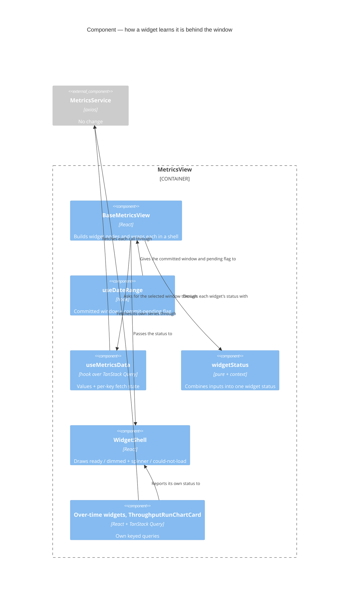

# Feature Delta — story-6249-chart-loading-indicators

> ADO User Story #6249 "Show loading indicators on Charts". Active, no parent Epic, tagged `Release Notes`.
> A user changed the metrics window and the charts kept showing the old window, with nothing to say new data
> was on its way (video on the ADO item). In their words, the people they need to convince "will see stuff
> like this and say: unreliable, inaccurate". The story proposes a loading state in the frame every chart
> shares.

Lean DISCUSS pass (2026-10-09). **The maintainer explicitly skipped DISCOVER and DIVERGE.** The four product
decisions below (D1–D4) were taken by the maintainer on 2026-10-09. Grounded in a code read of
`BaseMetricsView.tsx`, `WidgetShell.tsx`, `hooks/useMetricsData.ts`, `useDateRange.ts`,
`DashboardHeader.tsx`, `usePbcOverTime.ts`, `usePercentilesOverTime.ts`, `ThroughputRunChartCard.tsx` and
`LoadingAnimation.tsx`.

---

## Wave: DISCUSS / [REF] Persona IDs

- **flow-coach**: steps the Team metrics window at a standup or retro and reads the charts aloud.
- **delivery-lead-rte**: picks a preset (*Last 90 days*) on a Team or Portfolio dashboard in a review, with
  people watching.
- **forecasting-prospect** (secondary): the person being convinced. They judge Lighthouse's accuracy from what
  the screen shows, and a chart that lags the window reads as a wrong number, not as a slow one.

## Wave: DISCUSS / [REF] JTBD One-Liners

New job **`job-reader-trust-the-chart-shows-the-window-i-picked`** (added to `docs/product/jobs.yaml`):
*When I change the window on a metrics dashboard, I want every chart to show either the window I picked or
plainly that it is still getting there, so I can read the numbers out without wondering whether they are
the old ones.*

It sits under `job-lead-reach-the-metrics-window-i-mean-in-one-click` and
`job-lead-compare-this-period-against-the-one-before` (#5914). Those made changing the window one click,
and so made this gap visible much more often.

## Wave: DISCUSS / [REF] Code reality (what the story walks into)

- **No dashboard has a loading state.** `useMetricsData` (`hooks/useMetricsData.ts`) keeps one `useState`
  per metric and one effect per fetch key, re-run on `startDate`/`endDate`. It returns no pending flag, and
  it never clears a value when the window changes. The previous window's chart stays on screen until its
  `.then` replaces it.
- **Superseded responses win.** No effect in `useMetricsData` cancels or ignores a stale response, so a slow
  answer for the old window can land after the answer for the new one and overwrite it.
  `usePbcOverTime`/`usePercentilesOverTime` already guard against this with a `cancelled` cleanup, and
  so do two scope fetches inside `BaseMetricsView` (generation counter).
- **First load pops in.** Many widget nodes are `ctx.xData ? (...) : null`, and null nodes are filtered out
  of the dashboard, so a widget is absent until its data arrives and the layout shifts as each one lands.
- **Three overview widgets have their own spinner** (`FlowEfficiencyOverviewWidget`,
  `PredictabilityScoreOverviewWidget`, `TotalWorkItemAgeWidget`). It shows only on first load, because
  their value is never reset to null.
- **Over-time charts go blank.** `usePbcOverTime`/`usePercentilesOverTime` drop the old series as soon as
  the window changes. The widget then renders neither chart nor empty-state copy, so the area is empty with
  no spinner.
- **Only the header knows about the stepper.** `useDateRange.isCommitPending` covers the 500 ms stepper
  debounce, and `DashboardHeader` greys the label while it runs. Presets and the date picker commit at
  once and get no signal.
- **One frame.** `WidgetShell` wraps every dashboard item in exactly one place (`BaseMetricsView.tsx`
  ~1948). `ThroughputRunChartCard` is inside it, though it does its own filtered fetch.
- **Fetch failures are swallowed.** The `useMetricsData` effects `.catch` to `console.error` and leave the
  old value in place.

## Wave: DISCUSS / [REF] Locked Decisions

| ID | Decision | Verdict |
|----|----------|---------|
| D1 | **On a re-fetch, the old chart stays, dimmed, with a spinner over it.** The header (info, View Data, trend, RAG chip, title) stays as it is. The layout doesn't jump, and the chart is plainly out of date. A widget with nothing to dim (an over-time chart, whose series is already dropped) shows the spinner in an empty frame. | Maintainer, 2026-10-09 |
| D2 | **First load shows the frame with a spinner.** Every widget of the open category renders its frame at once, with a centred spinner, and its data fills in place. Nothing pops in and nothing shifts. The three overview widgets' own spinners merge into this state, so there is one look. | Maintainer, 2026-10-09 |
| D3 | **Superseded responses are discarded, in this story.** A loading indicator that clears onto the previous window's numbers would make the "inaccurate" complaint worse. A response is applied only if it answers the window currently selected. | Maintainer, 2026-10-09 |
| D4 | **Scope is the Team and Portfolio metrics dashboards**, meaning every widget in `WidgetShell`, `ThroughputRunChartCard` and the over-time charts included. Forecast and backtest results keep the spinner in their Run button. | Maintainer, 2026-10-09 |
| D5 | **"Loading" means the chart isn't showing the window that is selected.** A widget is in the loading state from the moment the window changes until its own data for that window arrives. This includes the stepper's 500 ms debounce, because by then the chart already shows a window the user has left. Each widget clears on its own, as its data lands; there is no all-or-nothing wait. | Locked in DISCUSS, from D1 + D3 |
| D6 | **A failed fetch never leaves a spinner, nor an undimmed old chart.** When a widget's fetch for the selected window fails, the spinner stops and the frame says it couldn't load. The exact copy and the retry affordance (if any) are pinned in the DISTILL sketch walk-through. Today's silent `console.error` that leaves the old window up is the same defect as the story. | Locked in DISCUSS; copy at DISTILL |
| D7 | **Terminology.** Loading or error copy names no configurable term. If it ever names the chart, it uses the widget's rendered title, which already carries the instance's terms. | Locked |

## Wave: DISCUSS / [REF] User Stories

### US-01: A chart that is behind the window says so, and never settles on the wrong one

As a **delivery lead** in a review, I want every chart whose numbers are not yet for the window I just picked
to look visibly out of date, and to come back only with the right window's data, so that I never read an
old number out as the new one.

`job_id: job-reader-trust-the-chart-shows-the-window-i-picked`

#### Elevator Pitch
Before: on a Team's metrics dashboard, click *Last 90 days* after *Last 30 days*. Throughput, Cycle Time and the rest keep showing the 30-day picture for a second or more, looking final. A slow 30-day answer can even land after the 90-day one and stay.
After: click *Last 90 days* (or step the window back) → each chart dims at once with a spinner over it, and each one returns at full strength showing the 90-day data, one after the other as they arrive.
Decision enabled: the lead waits for a chart to come back before reading it out, and trusts what it shows once it has.

#### Acceptance Criteria
- **AC-1.1** After a window change through a preset, the date picker or the stepper, every visible widget whose data for the new window has not arrived renders the loading state: old content dimmed, spinner over it, header unchanged (D1, D5).
- **AC-1.2** Each widget leaves the loading state when its own data for the selected window arrives, independently of the others (D5).
- **AC-1.3** When two windows are selected in quick succession and the first window's response arrives last, the widget shows the second window's data, and it stays loading until that data arrives (D3).
- **AC-1.4** Percentiles Over Time and PBC Over Time show the spinner in their frame while their series loads, never an empty area with neither chart nor empty-state copy (D1).
- **AC-1.5** The Throughput run chart's own filtered fetch follows AC-1.1–1.3 too.
- **AC-1.6** When a widget's fetch for the selected window fails, the spinner stops and the frame shows the could-not-load message. It never shows the previous window's chart undimmed (D6).
- **AC-1.7** Holds on both Team and Portfolio metrics dashboards, in light and dark theme.

### US-02: A dashboard opens with every chart's frame in place

As a **flow coach** opening a Team's metrics, I want every chart of the category to be there from the first
moment, saying it is loading, so that I am not left wondering whether a chart is missing or still coming.

`job_id: job-reader-trust-the-chart-shows-the-window-i-picked`

#### Elevator Pitch
Before: open a Team's metrics. Charts appear one by one as their data arrives, the layout reshuffles each time, and until the last one lands you can't tell whether a chart is still coming or simply isn't there.
After: open a Team's metrics (or switch category) → every widget of the category is already in its place, with a spinner in each frame, and the charts fill in where they stand.
Decision enabled: the coach knows right away what the dashboard will show, and waits for the chart they came for instead of scanning for it.

#### Acceptance Criteria
- **AC-2.1** On first open, and on switching to a category not visited yet, every widget the category will show renders its frame at its final position with a centred spinner before any data has arrived (D2).
- **AC-2.2** No widget is inserted or removed after its data arrives: the dashboard layout is the same from first render to fully loaded. A widget whose rule hides it once data is known (for example, a feature the instance has switched off) is out of scope for this AC. DESIGN lists which ones, if any, exist.
- **AC-2.3** Flow Efficiency, Predictability Score and Total Work Item Age use the shared loading state, not their own spinner (D2).
- **AC-2.4** A first-load fetch failure behaves as AC-1.6.

## Wave: DISCUSS / [REF] Out of Scope

- Forecast and backtest results, the Overview page, Feature and Delivery pages, and any page-level
  `LoadingAnimation` (D4).
- Making fetches faster, batching them, or caching across windows.
- A retry button, unless the DISTILL sketch review adds one under D6.
- Any backend or API change.

## Wave: DISCUSS / [REF] Cross-cutting Impact

- **RBAC**: **N/A, because** no data, endpoint or permission changes; nothing new reads `/authorization/my-summary`.
- **Lighthouse-Clients (CLI + MCP)**: **N/A, because** the change is in how the web dashboard renders while
  waiting. No contract, payload or client-visible behaviour changes.
- **Website**: **N/A, because** the website shows finished dashboards in its screenshots, never a loading one,
  and doesn't describe loading behaviour. Re-check at finalize, as always.
- **Premium**: **N/A, because** it applies to every dashboard, licensed or not.
- **Docs**: likely **N/A, because** the docs describe what charts show, not how they arrive. Finalize confirms
  that no page says a chart "appears when ready".
- **Screenshots**: risk. `@screenshot` tests must capture loaded charts, never a spinner. With US-02, a widget's
  frame exists before its data, so any wait for the frame alone is no longer a wait for the data (see E2E).
- **E2E**: risk. `MetricsPage.ts` and about ten specs (`Screenshots`, `ForecastFilter`,
  `TotalThroughputViewData`, `WorkItemAgeAsOfRangeEnd`, `BlockedItems`, `CumulativeStateTime`,
  `FlowEfficiency`, `NamedCycleTimePercentiles`, `TimeInStateAndStaleness`, …) locate widgets by
  `widget-shell-*`. Today a visible shell implies loaded data, and US-02 breaks that assumption. DISTILL
  gives the POM a "widget loaded" wait (no spinner present) and routes the specs through it. The walking
  skeleton stays thin.
- **Usage data**: for **DEVOPS** to answer. The lean is **N/A, because** a loading state isn't something a
  user chooses to use, so no event could show the feature "is used".

## Wave: DISCUSS / [REF] WS Strategy

Strategy **B (extend existing)**, with no skeleton. Dashboards, the shell and the fetches exist end to end.
Two thin slices, each releasable on its own:

1. **slice-01-refetch-shows-loading**: US-01. This is the complaint, and on its own it closes it.
2. **slice-02-first-load-frames**: US-02. Builds on slice 01's loading state in the shell.

## Wave: DISCUSS / [REF] Driving Ports

- UI: Team metrics and Portfolio metrics dashboards. Window presets, date picker, stepper, category selector.
- The frontend services the hooks call (`metricsService.*`). No backend port changes.

## Wave: DISCUSS / [REF] Scope Assessment: PASS

Two stories, two slices. Frontend only, in one area (`pages/Common/MetricsView` + `hooks/useMetricsData`).
Each slice is about a day. The largest unknown is how a widget learns which fetch keys it waits on, and
`getFetchRequirementsForWidget` already maps widget → keys. No oversized signals.

## Wave: DISCUSS / [REF] Outcome KPIs

| KPI | Target | Measurement |
|-----|--------|-------------|
| `OUT-6249-never-wrong-window` | 0 widgets showing a superseded window's data once out of the loading state | Component tests with out-of-order responses (AC-1.3), plus a manual check on the dev instance with network throttling |
| `OUT-6249-visible-within-a-frame` | 100 % of affected widgets are in the loading state on the render right after the window changes | Component test: no `await` between the window change and the assertion |
| `OUT-6249-no-layout-shift` | 0 widgets inserted or removed between first render and fully loaded, per category | Component test comparing widget keys before and after data, plus E2E walking skeleton on demo data |
| `OUT-6249-no-repeat-report` | No new user report of "charts show old data" in the 60 days after release | ADO / community channels, reviewed at the next release after that window |

## Wave: DISCUSS / [REF] Definition of Done

1. Every dashboard widget shows the dimmed-plus-spinner state while it's behind the selected window, and clears per widget.
2. Superseded responses are discarded everywhere the dashboard fetches, including `ThroughputRunChartCard`.
3. Over-time charts show a spinner, never an empty area, while loading.
4. A failed fetch ends in the could-not-load message, never a spinner or an undimmed stale chart.
5. First load renders every frame in place. The three overview widgets use the shared state.
6. E2E POM waits for "loaded", not "frame visible". `@screenshot` output is unchanged and shows no spinners.
7. `pnpm test`, `pnpm build` (Biome clean) and the E2E walking skeleton are green.
8. No new SonarCloud issues. StrykerJS ≥ 80 % on changed files.
9. A release-notes line is drafted on #6249 (`Release Notes` tag, already set).

## Wave: DISCUSS / [REF] DoR Validation

| # | DoR item | Status | Evidence |
|---|----------|--------|----------|
| 1 | User value clear | ✅ | US-01 / US-02 elevator pitches; the reporter's own words |
| 2 | Job traceability | ✅ | `job-reader-trust-the-chart-shows-the-window-i-picked` (new) |
| 3 | ACs testable | ✅ | Each AC is observable in a component render or E2E. D6 copy is pinned at DISTILL |
| 4 | Dependencies known | ✅ | None. Frontend only |
| 5 | Scope bounded | ✅ | D4 + Out of Scope |
| 6 | KPIs defined | ✅ | Four KPIs with targets |
| 7 | Cross-cutting addressed | ✅ | RBAC, Clients, Website, Premium, Docs, Screenshots, E2E, Usage data |
| 8 | Sized ≤ 1 day per slice | ✅ | Scope Assessment PASS |
| 9 | No blocking unknowns | ✅ | The mechanism (how loading reaches the shell) is DESIGN's. The visuals are sketched at DISTILL |

## Wave: DISCUSS / [REF] Wave Decisions Summary

- **Key decisions:** D1 dim + spinner on re-fetch; D2 frames + spinner on first load; D3 discard superseded
  responses; D4 metrics dashboards only; D5 loading = not yet showing the selected window, per widget;
  D6 failure ends in a message, never a spinner or a stale chart.
- **Feature type:** user-facing, frontend only.
- **Constraints:** no backend change; reuse `WidgetShell` as the one place the state is drawn; keep the header
  usable while loading.
- **Upstream changes:** none. DISCOVER and DIVERGE were skipped by the maintainer.

## Wave: DISCUSS / [REF] Open questions for DESIGN

- How does a widget know it is loading? Options include a per-fetch-key pending/"window answered" state from
  `useMetricsData`, passed through `getFetchRequirementsForWidget`, or each widget node reporting its own
  state, as the over-time hooks and `ThroughputRunChartCard` own their fetches. Pick one way for all three
  sources.
- Race guard: reuse the `cancelled`-cleanup idiom the over-time hooks use, or an `AbortController` the
  services accept. Do the services take a signal today?
- Is there a widget whose presence depends on its data (AC-2.2's exception)? List them, so US-02 can say
  where the frame appears and then leaves.
- Should the dimmed old chart stay interactive (tooltips, View Data) while loading, or should the overlay block
  pointer events? View Data would open the old window's items.

## Wave: DISCUSS / [REF] Open checks for DISTILL

- UI sketch walk-through with the maintainer at the start of DISTILL: dim level and spinner size per widget size,
  the could-not-load copy (D6), and the over-time empty-frame spinner.
- The `MetricsPage` POM gets a "widget loaded" wait. Every spec that waits on `widget-shell-*` visibility is
  re-pointed in the slice-02 commit.

---

Lean DESIGN pass (2026-10-09), Morgan, **PROPOSE mode, maintainer AFK**. The DDDs below are *Proposed, for
maintainer confirmation*, except where the maintainer's sketch decisions (S1-S4, recorded next) settle them; none
blocks DISTILL. Grounded in a re-read of `useMetricsData.ts` (747 lines), `BaseMetricsView.tsx` (1998 lines),
`categoryMetadata.ts`, `WidgetShell.tsx`, `useDateRange.ts`, both over-time hooks and widgets,
`ThroughputRunChartCard.tsx`, `Dashboard.tsx`, `LoadingAnimation.tsx`, `BaseApiService.ts`, `App.tsx`
(`QueryClient`), `TeamMetricsView.tsx` and the `MetricsPage` POM. Revised once after peer review (see Review).
ADR: [ADR-233](../../product/architecture/adr-233-a-dashboard-widget-is-loading-until-its-data-answers-the-selected-window.md).

## Wave: DESIGN / [REF] Maintainer decisions (2026-10-09, sketch review, relayed by the coordinator)

| ID | Decision |
|----|----------|
| S1 | On a re-fetch the chart content drops to **40 % opacity** with a **24 px centred MUI `CircularProgress`** over it. The header stays at full strength. |
| S2 | While a widget is loading, the overlay **blocks pointer events on the chart** (no tooltips, no hover) **and View Data is disabled**. The info popover stays usable. Answers DISCUSS open question 4. |
| S3 | On a fetch failure the old chart is **removed**, never shown undimmed. The frame shows a **warning icon** and the copy **"This chart couldn't be loaded. Change the dates or reload to try again."** **No Retry button.** |
| S4 | When there is nothing to dim (first load, or an over-time series reload), a **24 px spinner sits centred at the widget's normal height**. The header shows **title + info only**: no RAG chip or trend until data arrives. |

## Wave: DESIGN / [REF] Decisions

| ID | Decision | Options weighed (rejected → why) | Status |
|----|----------|----------------------------------|--------|
| DDD-1 | **Every dashboard fetch becomes a TanStack Query whose key *is* the request** (fetch name + Team/Portfolio id + exactly the dates and choices the call sends). The library returns only the current key's data, so "loading" is derived in render from the selected window, never set: a query is `loading` while it has no data for its current key (`isPending`, or showing the previous key's data as `placeholderData: keepPreviousData`), `error` on `isError`, `ready` otherwise. **One query per service call**; a fetch key's state is the most-behind of its queries, so one failing call marks only its own key (the cycle-time batch's five calls become five queries; the previous-period Work Item Age percentiles call belongs to `workItemAgePercentiles`). `useMetricsData` keeps its value-shaped return and adds `fetchStates` per key. Metrics query options: `staleTime: 0`, `gcTime: 0` (no caching across windows, out of scope in DISCUSS), `retry: false` (a failure shows at once, the reason `TerminologyContext` gives for the same setting), `refetchOnWindowFocus: false`. | (a) Hand-rolled per-key request identity recorded by each effect (this design's first draft) → each identity must list exactly what its effect sends, or a widget spins for ever or shows an old window as current; that rule is enforced only by tests. A query key cannot disagree with the call because the call reads its arguments from it. (b) A `pending` flag set when each effect starts → effects run after commit; when the commit comes from the stepper's timer the browser may paint the old chart undimmed first (`useLayoutEffect`/`flushSync` would close that gap but add a state write per key per window to ~30 keys). (c) Clear every value to `null` on a window change → throws away the chart S1 dims. | Proposed |
| DDD-2 | **Race guard: the query key, everywhere a window or a surviving choice is involved.** A late answer for an old key lands in the old key's cache entry and is never read. Per path: **Throughput run chart filter** → query keyed (filtered view, owner, window), enabled while the filter is on; **Throughput PBC filter** → its own query keyed on the view (DDD-10); **Cumulative State Time Work Item selection** (L1556-1568) → query keyed (item ids, owner, window), enabled when ids are chosen, so the selection survives a window change and is refetched for it; **Cumulative State Time scope** (L1507-1531) → query keyed (definition id, owner, window), enabled when a scope is chosen, the existing reset still clears the choice; **picker candidates** (L1533-1554) → query keyed (owner, window), enabled once the picker has been opened in this window (replaces `candidatesRequestedRef`); **over-time series** → their per-selection caches become queries keyed (selection, owner, window); **named percentiles scope** (L1380-1446) → **unchanged**: its generation counter already discards stale answers and the window change already resets it. | `AbortController` → no service method accepts a signal (0 matches in `services/Api`); ~40 methods and every test double to change, and it buys bandwidth, not correctness. The `cancelled` cleanup flag in every effect (first draft) → correct, but a second hand-written guard beside a library already wired at the app root. | Proposed |
| DDD-3 | **`WidgetShell` takes one `status` prop: `'loading' \| 'error' \| 'ready'`, default `'ready'`, plus whether there is content to dim.** It is the only place the state is drawn. It exposes `data-widget-status` on the existing `widget-shell-<key>` element and sets `aria-busy` while loading. | Two booleans (`isLoading`, `hasError`, the `LoadingAnimation` shape) → admits "loading and failed" at once. | Proposed |
| DDD-4 | **Self-fetching widgets report up through the shell.** The shell provides a status reporter in React context; `PbcOverTimeWidget`, `PercentilesOverTimeWidget` and `ThroughputRunChartCard` call one hook with their own (query-derived) status. **This is the one place a status is *set* rather than derived**: the shell cannot read a child's queries during its own render, so the child writes it in a layout effect, which lands before paint. Outside a shell (unit tests) the hook does nothing. | (a) Lift those queries into `BaseMetricsView` → grows a 2000-line component and needs an "enabled" gate per category; (b) each self-fetching widget draws the overlay itself → two places draw the state, and `data-widget-status` would be wrong for exactly those widgets. | Proposed |
| DDD-5 | **One precedence rule: `loading` > `error` > `ready`.** A widget is as far behind as its furthest-behind input: the page's commit-pending flag, every fetch key it needs (`getFetchRequirementsForWidget`), and anything its child reports. It shows its error only once nothing it waits on is in flight. During the stepper debounce (`isCommitPending`) every widget is `loading`. | `error` > `loading` → "couldn't load" for a window the user has already stepped away from. | Proposed |
| DDD-6 | **Drawn over the shell's body box only** (`WidgetShell.tsx` L417), per S1/S4: content at 40 % opacity with a 24 px `CircularProgress` centred over it; with nothing to dim, the spinner alone, centred, the frame at its normal height. Per S3, error replaces the body with a warning icon and the fixed copy. | Extend `LoadingAnimation` → its contract is *replace*, not *overlay*, and ten page-level screens use it (out of scope, D4); MUI `Backdrop` → viewport-positioned by default, so it needs the same absolute box anyway. | **Maintainer (S1, S3, S4)**; mechanism Proposed |
| DDD-7 | **The dimmed chart takes no pointer input while loading, and View Data is disabled; info stays usable** (S2). Recommended means: the `inert` attribute on the body wrapper (native in React 19), which also keeps keyboard focus out of a chart a mouse cannot reach. | Leave it interactive → View Data lists the old window's Work Items, and the Cumulative State Time bar click (L1570-1592) and PBC point drill would query the new window from the old chart. | **Maintainer (S2)**; `inert` Proposed |
| DDD-8 | **Header chrome by state.** Loading with old content: full header (S1), View Data disabled (S2). Loading with nothing to dim: title + info only (S4). Error: title + info only, so no RAG chip, trend or View Data describes a chart that is no longer there. | Keep RAG and trend on error → a chip about the previous window next to "couldn't be loaded", the stale signal D6 forbids. | S1/S2/S4 maintainer; error case Proposed |
| DDD-9 | **Slice 02: the frame decides its presence from the widget's placement, not its data.** At the wrap site (L1942-1959) an item is kept when its node exists *or* its status is not `ready`; its children are `null` until every fetch key it needs has had data at least once (so a first load is S4's spinner, not a dimmed `0`). The three overview widgets lose their own `CircularProgress` and get non-null props, built `x ? <Widget/> : null` like every other node. | Per-widget "if null render spinner" in each node → 25 copies of one rule. | Proposed |
| DDD-10 | **Throughput PBC filter becomes a fetch key of its own** (`throughputPbc`, its query keyed on the raw/filtered view). `refetchThroughputPbc` is replaced by a view setter. | Leave it in the `pbcCharts` group → toggling the filter would dim Cycle Time and Arrivals PBCs too; keep the imperative callback → nothing stops its old-window answer landing after a window change. | Proposed |
| DDD-11 | **A fetch key the service cannot answer is `ready`, decided by the same predicate that disables its query.** One predicate per key, the ones the effects use today: `providesSleRisk` (`sleRisk`), `isProjectMetricsService` (the four `featureSize*` keys), `isTeamMetricsService` (`featuresWorkedOnInfo`); flow efficiency keeps choosing its Team or Portfolio call by `isTeamOwnedMetricsService`, which never disables it. `blackoutPeriods` failing is `ready` with no periods (optional today). | Leave them `pending` → the Portfolio `wipOverview` (which lists `sleRisk`) spins for ever. | Proposed |
| DDD-12 | **No client timeout in this story.** A request that never returns leaves the widget loading, which is the truth. | An axios timeout → changes every API call in the app, and the right value differs per endpoint. | Proposed; see O1 |

## Wave: DESIGN / [REF] Component decomposition

All under `Lighthouse.Frontend/src/`. No backend, no new dependency.

| Path | Change | Slice |
|------|--------|-------|
| `pages/Common/MetricsView/widgetStatus.ts` | **NEW.** `WidgetStatus` type; the pure precedence combinator (DDD-5); `widgetStatusFor(widgetKey, keyStates, isCommitPending)` and `widgetHasData(widgetKey, keyStates)` over `getFetchRequirementsForWidget`; the query-result → status mapping (DDD-1, DDD-11); the reporter context and `useReportWidgetStatus` hook (DDD-4). A separate module so `WidgetShell.tsx` keeps exporting only a component. | 01 |
| `pages/Common/MetricsView/WidgetShell.tsx` | EXTEND. `status` prop, reporter provider, S1/S4 overlay or lone spinner, S3 error body, `data-widget-status`, `aria-busy`, `inert`, View Data disabled, header chrome by state (DDD-3, 6, 7, 8). Keep the status branches in a small sub-component so the render body stays under Sonar's cognitive-complexity limit. | 01 |
| `hooks/useMetricsData.ts` | EXTEND. Each effect becomes a `useQuery` (one per service call, `enabled` = needed and applicable, metrics options of DDD-1, `keepPreviousData`); returns the same values plus `fetchStates` per key; failures surface as `error` instead of only `console.error`; `throughputPbc` query + view setter replace `refetchThroughputPbc` (DDD-10). | 01 |
| `pages/Common/MetricsView/categoryMetadata.ts` | EXTEND. New fetch key `throughputPbc`; `throughputPbc` widget requires it; `pbcCharts` keeps Cycle Time and Arrivals PBCs. | 01 |
| `pages/Common/MetricsView/BaseMetricsView.tsx` | EXTEND. Pass `status` at the wrap site; Cumulative State Time scope, Work Item selection and candidates become queries per DDD-2 (L1486-1568); throughput PBC toggle calls the view setter. Slice 02: wrap-site presence and null children (DDD-9); `featureSize` node no longer gated on `length > 0`; overview nodes built `x ? … : null`. | 01, 02 |
| `pages/Common/MetricsView/usePbcOverTime.ts`, `usePercentilesOverTime.ts` | EXTEND. The hand-kept per-selection cache becomes a query keyed (selection, owner, window); return `status`. | 01 |
| `pages/Common/MetricsView/PbcOverTimeWidget.tsx`, `PercentilesOverTimeWidget.tsx` | EXTEND. Report `status`. | 01 |
| `pages/Common/MetricsView/ThroughputRunChartCard.tsx` | EXTEND. Filtered fetch becomes a query keyed (view, owner, window), enabled while filtered; reports its status. Fixes today's bug where the old window's filtered series stays up after a window change. | 01 |
| `pages/Common/MetricsView/FlowEfficiencyOverviewWidget.tsx`, `PredictabilityScoreOverviewWidget.tsx`, `components/Common/Charts/TotalWorkItemAgeWidget.tsx` | EXTEND. Drop the own spinner; props non-null. | 02 |
| Tests rendering `useMetricsData`, `BaseMetricsView`, the over-time widgets or `ThroughputRunChartCard` | EXTEND. Wrap in a `QueryClientProvider` with a fresh client per test (`retry: false`). | 01 |
| `Lighthouse.EndToEndTests/tests/models/metrics/MetricsPage.ts` | EXTEND. `MetricsWidget.waitUntilLoaded()` (shell's `data-widget-status="ready"`), a category-wide wait, specs re-pointed. | 02 |

Slice 01 is large for a day. A seam that keeps every step shippable, for DELIVER's roadmap: (1) `widgetStatus` +
`WidgetShell` status with the page passing it from `useMetricsData` queries; (2) the self-fetching widgets and the
throughput PBC key; (3) the Cumulative State Time paths. The slice boundary is unchanged.

## Wave: DESIGN / [REF] Driving ports

Unchanged: the Team and Portfolio metrics dashboards (presets, date picker, stepper, category selector, the
in-widget filter and scope controls). Internal contracts this story adds, both consumed only inside `MetricsView`:
`WidgetShell`'s `status` prop and `useReportWidgetStatus(status)`.

## Wave: DESIGN / [REF] Driven ports

`IMetricsService<T>` / `ITeamMetricsService` / `IProjectMetricsService` (`services/Api/MetricsService.ts`):
**unchanged**, no `AbortSignal`. The backend metrics endpoints: unchanged. No external integration, so no
contract-test annotation.

## Wave: DESIGN / [REF] Technology choices

No new dependency. **TanStack Query** (`@tanstack/react-query` ^5, MIT) is already installed, its
`QueryClient` provided at the app root (`App.tsx` L70-77) and used by `TerminologyContext` and
`LicenseStatusIcon`; the metrics queries override its defaults (5 min stale, 30 min cache, 2 retries) per DDD-1.
React 19.3 (the repo's real version; `CLAUDE.md` still says 18) supplies the native `inert` attribute. MUI 9
`CircularProgress` and a warning icon from `@mui/icons-material`. Vitest + RTL; Playwright.

## Wave: DESIGN / [REF] Reuse Analysis

| Existing | Verdict | Contract shape / note |
|----------|---------|-----------------------|
| `WidgetShell` | **EXTEND** | The one frame (L1948). Gains `status`; bounded change: body wrapper and header chrome only. |
| `useMetricsData` | **EXTEND** | Internals move from effects to queries; its value-shaped return stays, plus `fetchStates`, so `BaseMetricsView` keeps reading the same names. |
| TanStack Query (`App.tsx` `QueryClient`) | **REUSE** | Installed and provided app-wide; its query key is the request identity and its observer returns only the current key's data, which is the whole of DDD-1 and DDD-2. |
| `getFetchRequirementsForWidget` | **REUSE** as is | Already "what a widget needs to render completely"; exactly the input set for a widget's status. |
| Generation counter (`BaseMetricsView` L1380-1446) | **REUSE** unchanged | Named percentiles scope only; already correct. |
| `useDateRange.isCommitPending` | **REUSE** | Feeds DDD-5 for the debounce. |
| `LoadingAnimation` | **NOT EXTENDED** | Replace-not-overlay contract, ten page-level callers out of scope (D4). Its primitive (`CircularProgress`) is reused. |
| `FeatureSizeScatterPlotChart` empty state (L414/L805) | **REUSE** | Lets the `featureSize` node drop its `length > 0` gate (slice 02). |
| `widgetStatus.ts` | **CREATE NEW** | No existing home for a pure status combinator plus a reporter context: `categoryMetadata.ts` is placement data, `WidgetShell.tsx` should export only its component, and `BaseMetricsView` must not grow. Pure functions: return-only. |

## Wave: DESIGN / [REF] C4

```mermaid
C4Container
  title Container — story 6249 (unchanged containers; the change is inside the SPA)
  Person(lead, "Delivery lead / flow coach")
  Container(spa, "Lighthouse web app", "React 19 + MUI", "Team and Portfolio metrics dashboards")
  Container(api, "Lighthouse backend", "ASP.NET Core", "Metrics endpoints")
  Rel(lead, spa, "Changes the window on")
  Rel(spa, api, "Requests one window's metrics from")
```



## Wave: DESIGN / [REF] Answers to the DISCUSS open questions

1. **How a widget knows it is loading.** One rule for all three sources: *a widget is loading while any input it
   shows has no data for the request the current window would send* (DDD-1). All three sources are keyed
   queries; `useMetricsData` exposes them as `fetchStates`, mapped to widgets through
   `getFetchRequirementsForWidget`; the over-time widgets and `ThroughputRunChartCard` report theirs to the shell
   (DDD-4). D5's debounce is covered by `isCommitPending`, D6 by `isError` and the precedence rule (DDD-5).
2. **Race guard.** The query key (DDD-2), decided per path there. The services take no `AbortSignal`.
3. **Widgets whose presence depends on data** (from `buildWidgetNodes`, `BaseMetricsView.tsx` L998-1232):
   - `estimationVsCycleTime` L1145-1152 — hidden when the response says `NotConfigured` (and the chart itself
     returns `null` then, `EstimationVsCycleTimeChart.tsx` L150). **The only real exception.** Slice 02: on first
     load its frame shows the S4 spinner, then leaves if the answer is `NotConfigured`. On a later window change
     the previous answer is kept as placeholder, so it does not flicker. Alternative: keep the frame and say
     "not configured", as Flow Efficiency does (O2).
   - `featureSize` L1153-1160 — hidden while the Feature list is empty. That gate was only a loading proxy: the
     chart has its own "No data available" (L414/L805). **Slice 02 drops the gate**, so a Portfolio with no
     Features in the window shows that empty state instead of nothing (O3).
   - `featuresWorkedOnOverview` L1019-1025 — gated on the `featuresInProgress` prop, which a Team always passes
     (`[]` before its own fetch, `TeamMetricsView.tsx` L35/L143), and the widget is Team-only. Not an exception.
   - Loading-only nulls, which become loading frames in slice 02: `throughput` L1058, `wipOverTime` L1107,
     `totalWorkItemAgeOverTime` L1116, `stacked` L1123, `arrivals` L1161, `totalThroughput` L1194,
     `totalArrivals` L1197, `featureSizePercentiles` L1200, `stateTimeCumulative` L1203, and the six PBC nodes
     via `buildPbcNode` L821.
4. **Interactivity while loading.** Answered by the maintainer (S2): no pointer input on the chart, View Data
   disabled, info usable (DDD-7).

## Wave: DESIGN / [REF] Test seams

- **Out-of-order responses, deterministically:** the fake `IMetricsService` returns a promise the test holds
  and settles by hand, one per call. Render, change the window, settle the *new* window's promise, then the *old*
  one, and assert the widget shows the new data and `ready`; then the reverse order, asserting it stays
  `loading` until the new answer. `tsconfig.app.json` targets ES2021 (`Promise.withResolvers` is ES2024), so a
  five-line deferred helper in the test utilities. Every render under a fresh `QueryClient` (`retry: false`).
- **Partial failure of a former batch:** reject one of the five cycle-time calls; assert only its key goes
  `error` and the other four land `ready` (DDD-1, one query per call).
- **Each click-started path of DDD-2:** change the window while the scope, selection, candidates or filtered
  fetch is in flight, settle the old answer last, assert it is not shown.
- `widgetStatus.ts`: table tests of the combinator, `widgetStatusFor` and the inapplicable-key rule (pure; the
  mutation target).
- `WidgetShell`: per status and content-to-dim, assert `data-widget-status`, the S1 dim and spinner, the S4 lone
  spinner and title + info header, `inert` body, disabled View Data, the S3 icon and exact copy; a test child
  calling `useReportWidgetStatus` for DDD-4/5.
- `BaseMetricsView`: one test per AC with the deferred fake. KPI `OUT-6249-visible-within-a-frame` is tested as
  *the status is `loading` in the render that changes the window* (no `await` in between); that no stale frame
  is painted follows from render-derivation and is argued, not tested.

## Wave: DESIGN / [REF] E2E impact (slice 02)

`widget-shell-<key>` carries `data-widget-status`. `MetricsWidget.waitUntilLoaded()` expects it to be `ready`
(and fails fast on `error`); a `MetricsPage` helper waits for every widget of the open category.
`Screenshots.spec` calls it before every capture. The specs that today treat a visible `widget-shell-*` as
"loaded" go through it (the `ci-learnings` rule on POM getters that read "not rendered yet" as a value applies:
wait for `ready` first, then read). Status is derived in render, so a fresh shell is never briefly `ready`
before its fetch starts. The S3 copy is pinned in component tests, not E2E.

## Wave: DESIGN / [REF] Architectural enforcement

- `categoryMetadata.test.ts` gains the invariant that, for each owner type and category, every fetch key any of
  the category's widgets requires is in `getFetchKeysForCategories([category], ownerType)`; a widget whose key is
  never enabled would otherwise spin for ever. It keeps pinning that the only widgets with an empty requirements
  entry are the ones that report their own status.
- The applicability predicate per fetch key lives in one `Record<MetricsFetchKey, …>` used by both `enabled` and
  the status mapping (DDD-11), so a new key cannot compile without one and the two cannot disagree.
- Earned Trust, as it applies to a browser: the backend may answer out of order, fail, fail for one call of
  several, be asked for a key the service cannot serve, or never answer. The first four are component tests
  above; the last is O1.

## Wave: DESIGN / [REF] Changed Assumptions

- DISCUSS D1: *"The header (info, View Data, trend, RAG chip, title) stays as it is."* → It stays at full
  strength while old content is dimmed, but **View Data is disabled** (S2). With nothing to dim, and on failure,
  the header shows **title + info only** (S4, DDD-8).
- DISCUSS D6: *"The exact copy and the retry affordance (if any) are pinned in the DISTILL sketch walk-through."*
  → Pinned already by S3: warning icon, "This chart couldn't be loaded. Change the dates or reload to try again.",
  no Retry.
- DISCUSS "Code reality": *"`ThroughputRunChartCard` is inside it, though it does its own filtered fetch."* →
  Also: its filtered series is never refetched on a window change, so with the filter on it shows the old
  window today. Fixed in slice 01 (DDD-2).
- DISCUSS "Code reality": *"…and so do two scope fetches inside `BaseMetricsView` (generation counter)."* →
  True of the two named-percentiles fetches only. The **Cumulative State Time** scope fetch (L1507-1525) has no
  guard, and its Work Item selection and candidates are never reset on a window change (the reset effect at L1488
  runs once). Brought under DDD-2 in slice 01; the selection is kept and refetched for the new window.
- DISCUSS Out of Scope: *"Making fetches faster, batching them, or caching across windows."* → Still honoured:
  the metrics queries set `gcTime: 0` and `staleTime: 0`, so moving TanStack Query under them changes no fetch
  timing or caching a user could notice.
- Project `CLAUDE.md` says React 18; the frontend is on **React 19.3** (which is what makes `inert` free).

## Wave: DESIGN / [REF] Review

Peer review (solution-architect-reviewer, iteration 1): **conditionally approved**, 0 critical, 3 high. All
three highs addressed: (1) the installed TanStack Query was not weighed → weighed, and adopted (DDD-1/2, ADR-233);
(2) batched effects had no failure-attribution rule → one query per call, partial-failure test; (3) click-started
reset paths said "keeps or gains" → decided per path in DDD-2 with a test each. Mediums: fetch-key reachability
invariant added (enforcement); the reporter named as the one *set* path (DDD-4); slice-01 step seam proposed.
Lows: one predicate per key (DDD-11); KPI test reworded; the layout-effect pending-flag variant recorded under
DDD-1. Not re-reviewed (iteration 2 not run).

## Wave: DESIGN / [REF] Open questions for DISTILL / DELIVER

- **O1 (maintainer):** a request that never returns keeps its widget loading indefinitely (DDD-12). Accept, or
  add a per-request timeout in a follow-up?
- **O2 (maintainer / DISTILL):** `estimationVsCycleTime` frame that appears then leaves on first load when
  `NotConfigured`, or a "not configured" frame like Flow Efficiency's?
- **O3 (maintainer / DISTILL):** `featureSize` empty state now visible on a Portfolio with no Features in the
  window.
- **O4 (maintainer):** confirm adopting TanStack Query for the metrics fetches (DDD-1/2). It reverses the first
  draft after review; the fallback is the hand-rolled per-key identity with a `cancelled` cleanup, recorded in
  ADR-233's alternatives.
- **O5 (out of scope, noted):** the named-percentiles scope shows the default percentiles under a named
  selection while its fetch is in flight, and Features Being Worked On shows `0` until `TeamMetricsView`'s own
  fetch lands. Neither is a window change; candidates for a follow-up.
- **O6 (DELIVER):** a Team/Portfolio change that reuses the mounted view now dims the previous owner's charts
  (the key includes the id). Confirm on the dev instance that routes remount instead.

## Wave: DESIGN / [REF] Wave Decisions Summary

- **Maintainer decisions:** S1 40 % dim + 24 px spinner, header full strength; S2 no pointer input on the chart,
  View Data disabled, info usable; S3 chart removed, warning icon + fixed copy, no Retry; S4 lone 24 px spinner
  at normal height, header title + info only.
- **Key decisions (Proposed):** DDD-1 every dashboard fetch a TanStack Query keyed by its request, one per call,
  status derived in render; DDD-2 the query key as race guard, decided per path; DDD-3/4 one `status` union on
  `WidgetShell`, self-fetching widgets report into it; DDD-5 `loading` > `error` > `ready`; DDD-6/7/8 drawing,
  `inert`, header chrome by state; DDD-9 slice 02 frames by placement; DDD-10 `throughputPbc` fetch key; DDD-11
  inapplicable keys `ready` by one predicate; DDD-12 no timeout.
- **One new module** (`widgetStatus.ts`), everything else EXTEND. No backend, API, new dependency or RBAC change.
- **ADR-233** (Proposed). `brief.md` gains a short section; `ARCHITECTURE.md` unchanged (it does not describe
  widget loading).
- **Upstream changes:** D1 and D6 refined (Changed Assumptions); two pre-existing stale-window bugs folded into
  slice 01.

---

## Wave: DESIGN / [REF] AFK defaults taken on the open questions (2026-10-09)

The maintainer is away (AFK mode). Each default below either follows from a DISCUSS decision the maintainer already
made, or is an engineering choice that doesn't change what a user sees. All are open to revisit at the hold.

- **O1 → accepted.** No client timeout (DDD-12). A request that never returns keeps its widget loading, which is
  the truth. A timeout would be a follow-up.
- **O2 → the frame appears, then leaves when the answer is `NotConfigured`.** This is the exception AC-2.2
  already carves out. A new "not configured" frame would add a widget that instances don't show today, which is
  a product change this story didn't ask for.
- **O3 → accepted.** The `featureSize` empty state shows on a Portfolio with no Features in the window. AC-2.2
  (no widget removed after its data arrives) implies it.
- **O4 → TanStack Query adopted** for the metrics fetches (DDD-1/2). It's already installed and wired at the app
  root. Each query overrides the app defaults: no caching across windows, no retries. The hand-rolled fallback
  stays recorded in ADR-233.
- **O6 → checked in DELIVER** on the dev instance, as written.

---

Lean DEVOPS pass (2026-10-09), Apex, **maintainer AFK**: every decision below is a fixed project fact or the
recommended option, recorded rather than asked. Frontend only; nothing to install, provision, migrate or configure.

## Wave: DEVOPS / [REF] Decisions

| # | Decision | Answer | Source |
|---|---|---|---|
| 1 | Deployment target | **Unchanged.** The standalone release, Docker image and Helm chart ship the built frontend bundle as today. No new environment. | Project fact |
| 2 | Container orchestration | **Unchanged.** Nothing here touches the container or the chart. | Project fact |
| 3 | CI/CD platform | **GitHub Actions, existing workflows.** No new workflow, job, runner or secret. | 27 workflows under `.github/workflows/` |
| 4 | Existing infrastructure | Brownfield; reused as is. | same |
| 5 | Observability | **None new.** Fetch failures already reach `console.error`; the story turns them into the S3 frame, which is the user-visible signal. No log line, no metric. | Project fact; DDD-1 |
| 6 | Deployment strategy | **Unchanged.** Rollback = `git revert` of the feature commits, then the ordinary release path. No migration, no setting, no persisted data, no API change, so no mixed-version window: an old bundle and a new bundle call the same endpoints with the same payloads. | ADR-233 (frontend only) |
| 7 | Continuous learning | **N/A, because** a loading state has nothing to flag, A/B or roll out progressively. Gating it would ship two readings of the same dashboard. | — |
| 8 | Branching | **Trunk-based on `main`**, slice boundary ritual as usual (push, CI green, then ADO Resolved). | Project rule |
| 9 | Mutation testing | **`per-feature`, StrykerJS on the changed frontend files, kill rate ≥ 80 %.** | `CLAUDE.md` § Mutation Testing Strategy |

**Contradictions with DESIGN: none.** DESIGN said no backend, API, dependency or RBAC change, and nothing here needs one.

## Wave: DEVOPS / [REF] Usage-data event

**N/A, because** a loading state is not a feature anyone chooses to use. It appears whenever a dashboard fetches,
for every user, so there is no "use" to count; any count of it is a count of page loads and window changes, which
`TeamTabOpened`/`PortfolioTabOpened` (with `/teams/:id/metrics` and `/portfolios/:id/metrics`) already approximate. Nothing is appended to
`UsageDataEventName` (16 events today, last `TeamRefinementDayVerdictShown = 15`; the catalog in
`docs/settings/usagedata.md` lists what each one says), and nothing changes in `docs/settings/usagedata.md`.

Rejected candidates:

- **"A chart failed to load"** (fired on the S3 error frame). Rejected: it is client-error telemetry, an
  operational stream the usage-data catalog is not for. Every catalog event records a deliberate user action
  (opened, created, ran, connected, voted, switched); this one would record the backend or network failing. To be
  useful it would also need *which* chart, i.e. the widget key as a property. That is ~30 values that grow with
  every widget, not the small closed enum the rule allows, and the catalog's own pattern (`Which tab was opened` is
  one of eleven published addresses) shows how much ceremony a single such property costs.
- **"A window was changed on a metrics dashboard"**. Rejected: it counts #5914's window controls, not this story,
  and would be read as evidence this feature is used when it says nothing about the loading state.

## Wave: DEVOPS / [REF] Monitoring contracts (Outcome KPIs → instrument)

No KPI needs runtime instrumentation; each is a test, a manual dev-instance check, or a board review.

| KPI | Instrument | Where it is read |
|---|---|---|
| `OUT-6249-never-wrong-window` | Vitest + RTL with the hand-settled deferred fake: old window answers last, widget shows the new data and `ready`; reverse order stays `loading` (AC-1.3, AC-1.5, each DDD-2 path). **Plus** a manual check at DELIVER on the dev instance with DevTools network throttling (Slow 3G), stepping the window twice quickly. | CI (`ci_frontend.yml`); DELIVER checklist |
| `OUT-6249-visible-within-a-frame` | Vitest: `data-widget-status="loading"` asserted in the render that changes the window, no `await` in between (DESIGN Test seams). | CI (`ci_frontend.yml`) |
| `OUT-6249-no-layout-shift` | Vitest: widget keys of a category identical before and after data (AC-2.2, `estimationVsCycleTime` the named exception). **Plus** the E2E walking skeleton on demo data, waiting through `waitUntilLoaded()`. | CI (`ci_frontend.yml`; E2E in `ci_verifysqlite.yml` and `ci_verifypostgres.yml`) |
| `OUT-6249-no-repeat-report` | ADO items (Bug or User Story, project `Lighthouse`) and community channels naming charts that show old or stale data, created in the 60 days after the release that carries slice 01. **Target 0; one is a signal.** Checked by whoever runs `/release` for the first release after that window, in the release-notes pass that already reads the board. | The board |

**`docs/product/kpi-contracts.yaml`: no entries added.** Following the #6055 precedent: that file is the contract
for outcomes with a *data collection* story, and three of these four are CI-asserted, so their `data_collection`
would read "none"; the fourth is a board query with no data pipeline behind it, exactly like #6055's KPI-4, which
was also kept here instead. (#6094 did register CI-asserted KPIs there; the #6055 shape is the one asked to be
mirrored and the more recent small-story precedent.) Recorded here, where a reader of this feature looks.

## Wave: DEVOPS / [REF] CI/CD pipeline outline

No pipeline change. The stages this feature passes through:

| Stage | Workflow | What it does for this feature |
|---|---|---|
| Change detection | `ci_changes.yml` | Flags `Lighthouse.Frontend` (and `Lighthouse.EndToEndTests` in slice 02) |
| Frontend | `ci_frontend.yml` (`build-frontend` action) | `pnpm test` (Vitest) and `pnpm build` (`tsc -b` + Biome via `prebuild`, which runs `--write`) |
| E2E | `ci_verifysqlite.yml`, `ci_verifypostgres.yml` | The Playwright suite, **twice**, Chromium only. `ci_e2e.yml` only compiles it |
| Quality gate | `ci_sonar_gates.yml` | SonarQube Cloud, no new issue of any severity |

**Pre-applied CI risks** (from `docs/ci-learnings.md`):

- **Vitest `Test timed out in 5000ms`** on rendering-heavy files: `BaseMetricsView` and `useMetricsData` tests gain
  a `QueryClientProvider` and deferred promises. A timeout in an untouched rendering file is that entry, not a
  flake; give it an explicit `{ timeout }`.
- **Sonar cognitive complexity** on `WidgetShell`: DESIGN already moves the status branches into a sub-component.
- **POM getters that read "not rendered yet" as a value**: `waitUntilLoaded()` first, then read (DESIGN E2E impact).

## Wave: DEVOPS / [REF] E2E and screenshot implications

- With slice 02, a visible `widget-shell-<key>` no longer means its data has arrived. The `MetricsPage` POM gets
  `MetricsWidget.waitUntilLoaded()` (waits for `data-widget-status="ready"`, fails fast on `error`) and a
  category-wide wait; every spec that treats shell visibility as "loaded" goes through it, in the slice-02 commit.
- **`@screenshot` must never capture a spinner.** `Screenshots.spec` calls the category-wide wait before every
  capture. The preconditions of a screenshot run are unchanged (premium licence fixture, `rm` the target PNG first,
  `@auth` excluded); this story should leave every PNG byte-identical in content, so a regenerated image that
  differs is a finding.
- E2E runs in CI twice (SQLite and Postgres), so a race in the wait shows up as a flake on either. Run the
  touched specs locally before committing them.
- The walking skeleton stays thin (one flow on demo data): open a Team's metrics, wait for loaded, change the
  preset, see `loading` then `ready`.

## Wave: DEVOPS / [REF] Mutation testing

`per-feature`, StrykerJS, ≥ 80 %, on the changed frontend files: `widgetStatus.ts` (the pure combinator is the
prime target: a flipped precedence is AC-1.3's failure), `WidgetShell.tsx`, `useMetricsData.ts`,
`usePbcOverTime.ts`, `usePercentilesOverTime.ts`, `ThroughputRunChartCard.tsx`, and the changed ranges of
`BaseMetricsView.tsx`. Per-story config `Lighthouse.Frontend/stryker-6249-frontend.json`, results under
`docs/feature/story-6249-chart-loading-indicators/mutation/`. Two rules from the ledger: prove the harness with a
standalone `vitest run --config <stryker vitest config>` first (StrykerJS exits 0 having tested nothing), and run
it last, on frozen code.

## Wave: DEVOPS / [REF] Environments and coexistence

Machine artifact: `docs/feature/story-6249-chart-loading-indicators/environments.yaml`. Axes: theme (light and
dark, AC-1.7), owner type (Team and Portfolio, AC-1.7), CI's Playwright browser (Chromium). OS, provider and licence
are deliberately not axes: the behaviour is browser rendering over a payload the tests supply. Must not break:
the forecast/backtest Run-button spinners and page-level `LoadingAnimation` (out of scope, D4), `TerminologyContext`
and `LicenseStatusIcon` queries on the shared `QueryClient` (metrics queries override defaults per query, never the
client's), and the ~10 E2E specs locating `widget-shell-*`.

## Wave: DEVOPS / [REF] Handoff

**To** `nw-acceptance-designer` (DISTILL): `environments.yaml`, the KPI → instrument table above, and the E2E
implications. Start DISTILL with the UI sketch walk-through the project rule requires; DESIGN's S1-S4 already pin
most of it. **Per-wave peer review: skipped**: no new deployment target, CI framework, observability or security
change.

## Wave: DEVOPS / [REF] Changed Assumptions

**None.** DISCUSS leaned "N/A" on usage data and DEVOPS confirms it with the rejected candidates above.
