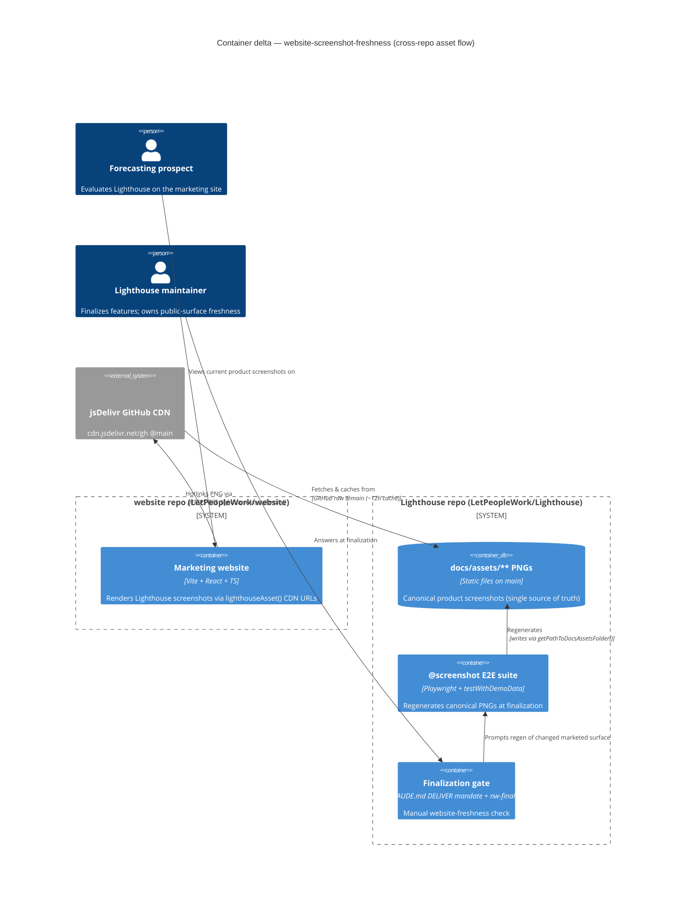

# Feature Delta — website-screenshot-freshness

ADO: #5259 "Use up to date screenshots on Website" (User Story, Active, no parent Epic)
Repos: `LetPeopleWork/Lighthouse` (canonical asset generation) + `LetPeopleWork/website` (consumer)
Feature type: Cross-cutting (E2E tooling + website repo + finalization process)

---

## Wave: DISCUSS / [REF] Persona IDs

- **lighthouse-maintainer** (NEW persona, primary actor) — the person finalizing a Lighthouse
  feature who is responsible for keeping public-facing surfaces (docs site AND marketing website)
  current. Wants the website to stay accurate with near-zero per-release effort.
- **forecasting-prospect** (existing persona, downstream beneficiary) — a delivery lead / EM / coach
  evaluating Lighthouse on the marketing website. Current, real screenshots are what make the
  marketing claims credible enough to try the product.

## Wave: DISCUSS / [REF] JTBD one-liners

- **job-maintainer-keep-website-current** — *When I finish a Lighthouse feature that changes a UI
  surface the website markets, I want the website's screenshot of that surface to become current
  without me manually re-exporting and committing an image into a separate repo, so keeping the
  marketing site honest costs me nothing per release.*
- **job-prospect-trust-current-screenshots** — *When I evaluate Lighthouse on the website, I want the
  screenshots to show the product as it actually looks today, so I can trust that what I'm being sold
  is what I'll get when I install it.*

## Wave: DISCUSS / [REF] Locked decisions

- **D1 — Approach: GitHub-hosted latest images.** *(user)* The website references the canonical
  `docs/assets/**` PNGs that the Lighthouse `@screenshot` E2E suite already regenerates per-feature,
  instead of bundling stale local copies under `website/src/assets/screenshots/`. The asset pipeline
  that already keeps the docs site current becomes the single source of truth for marketing images too.
- **D2 — CDN host: jsDelivr over raw.githubusercontent (RECOMMENDED, DESIGN to finalize).** Serve via
  `https://cdn.jsdelivr.net/gh/LetPeopleWork/Lighthouse@<ref>/docs/assets/<path>.png` rather than
  `raw.githubusercontent.com`. Rationale: raw.githubusercontent is not a CDN, is rate-limited, sends
  `Content-Type: text/plain`, and is explicitly discouraged for hotlinking; jsDelivr is the standard,
  cached, correctly-typed CDN front for GitHub files. This is the riskiest assumption → the walking
  skeleton (US-01) proves it live before any bulk migration.
- **D3 — Freshness target: `@main` (RESOLVED — "use what is simpler", user 2026-06-14).** Pin the
  jsDelivr URL to `@main` (`cdn.jsdelivr.net/gh/LetPeopleWork/Lighthouse@main/docs/assets/...`). The
  user judged released-tag vs main "not that big of a deal" and asked for the simpler option; `@main`
  needs no release-tag resolution and tracks the default branch where `@screenshot` regen already
  lands at feature finalization (before release). Only trade-off: jsDelivr caches branch refs ~12h
  (irrelevant for marketing stills). Release-tag pin remains a trivial later swap if ever wanted.
- **D4 — Video OUT of scope.** *(user — not selected)* The website's `.mp4` walkthrough assets
  (`Forecasts_*.mp4`, `Metrics_*.mp4`, `Installation.mp4`) are unchanged by this story. Automated video
  capture is a potential follow-up, not this feature.
- **D5 — OG/SEO image stays website-hosted.** `website/public/forecasts-project.png`
  (`https://letpeople.work/forecasts-project.png`, referenced by `SEO.tsx`, `sitemap.xml`, JSON-LD)
  is NOT migrated to a GitHub-hosted URL. Social scrapers and SEO crawlers need a stable, same-origin
  absolute URL and reject many cross-origin/redirecting sources. It is refreshed manually, separately.
- **D6 — One-time refresh scope = the 10 current website still-screenshots.** Each maps to a canonical
  `docs/assets` PNG depicting the current UI, OR a focused `@screenshot` test is added in Lighthouse to
  produce a marketing-suitable canonical asset where none fits. No silent omission — gaps are listed.
- **D7 — Finalization gate is a manual checklist step.** Added to the in-repo CLAUDE.md "DELIVER Wave —
  Docs & Screenshots at Finalization" mandate (and referenced from `nw-finalize`), mirroring the
  existing per-feature docs-screenshot discipline. No automated drift detection this story.

## Wave: DISCUSS / [REF] Cross-cutting impact (CLAUDE.md DISCUSS mandate)

- **RBAC** — **N/A.** No authorization surface. The deliverable is build-time/runtime static-asset
  linking on a public marketing site plus a developer-process checklist. No `IRbacAdministrationService`
  interaction; no `useRbac()` gating; the assets are already public on the docs site.
- **Lighthouse-Clients (CLI + MCP)** — **N/A.** No API contract is added or changed. There is nothing
  for the CLI/MCP clients to wrap and no new endpoint, so no `FEATURE_REQUIRES_SERVER_NEWER_THAN` gate.
- **Website** — **PRIMARY surface.** This feature *is* substantially a website change: switching
  bundled Lighthouse-screenshot imports in `website/src/pages/Lighthouse.tsx` and
  `website/src/components/LighthouseSection.tsx` to GitHub-hosted URLs, coordinated with Lighthouse-side
  canonical-asset generation. Spans both repos (user: "Both, coordinated").

## Wave: DISCUSS / [REF] Driving ports / inbound surfaces

- **Website React markup** — `` in
  `Lighthouse.tsx` / `LighthouseSection.tsx` (replaces `import x from '@/assets/screenshots/*.png'`).
- **Lighthouse `@screenshot` E2E suite** — `Lighthouse.EndToEndTests/.../Screenshots.spec.ts`,
  writing canonical PNGs into `docs/assets/**` via `getPathToDocsAssetsFolder()` (the existing pipeline).
- **Finalization checklist** — CLAUDE.md DELIVER mandate + `nw-finalize` (the process gate).

No HTTP endpoint, no CLI subcommand, no backend change.

## Wave: DISCUSS / [REF] Pre-requisites

- Existing `@screenshot` pipeline — present (`docs/assets` has 105 canonical PNGs).
- Website repo — present at `/storage/repos/website` (`LetPeopleWork/website`, Vite + React + TS + Tailwind).
- No prior-wave dependency; no Epic. Standalone story.

## Wave: DISCUSS / [REF] User stories with elevator pitches & acceptance criteria

### US-01 — Walking skeleton: one website screenshot served live from a GitHub-hosted canonical asset
`job_id: job-maintainer-keep-website-current`  ·  slice-01  ·  persona: lighthouse-maintainer

#### Elevator Pitch
Before: the website bundles a stale local copy of a Lighthouse screenshot; updating it means manually re-exporting and committing an image into a separate repo.
After: load the running website Lighthouse page → the chosen screenshot renders from `https://cdn.jsdelivr.net/gh/LetPeopleWork/Lighthouse@<ref>/docs/assets/...png` (browser Network panel shows the remote fetch; image displays at correct dimensions).
Decision enabled: maintainer confirms GitHub-hosted hotlinking renders reliably on the live site, and commits to migrating the rest (or falls back if it doesn't).

#### Acceptance Criteria
- One canonical screenshot that already exists in `docs/assets` and is marketing-suitable is chosen.
- The website's reference for that one image is changed from a bundled `import` to a remote URL string in ``.
- Running the website locally (`bun`/vite dev) shows the image loading from the remote URL (verified in the browser Network panel), correct dimensions, no broken-image icon.
- The URL convention (CDN host + repo + ref + `docs/assets` path) is captured as a small constant/helper in the website repo so US-02 reuses it.
- AC verifies the "After" end-to-end: the live page fetches and renders the remote image.

**Learning hypothesis:** disproves *"GitHub-hosted hotlinking renders reliably for our marketing site"* if the image fails to load, is CORS-blocked, rate-limited, or served with a wrong content-type that breaks rendering. Highest-uncertainty → ships first.

### US-02 — One-time refresh: all current website Lighthouse still-screenshots are current and GitHub-hosted
`job_id: job-prospect-trust-current-screenshots`  ·  slice-02  ·  persona: forecasting-prospect (primary), lighthouse-maintainer

#### Elevator Pitch
Before: the website shows up to 10 outdated Lighthouse screenshots that no longer match the shipped UI.
After: load the website Lighthouse/overview sections → every Lighthouse screenshot renders from a GitHub-hosted canonical asset that matches the current released UI.
Decision enabled: a prospect evaluating Lighthouse sees the real, current product and trusts the marketing enough to try it.

#### Acceptance Criteria
- Each of the 10 current website screenshots (`ALM_Connection`, `Forecasts_Project`, `Forecasts_Team_Epics`, `Forecasts_Team_Manual`, `GitHub`, `Metrics_Project_1`, `Metrics_Project_2`, `Metrics_Team_1`, `Metrics_Team_2`, `Query_Configuration`) is either (a) re-pointed to a canonical `docs/assets` PNG depicting the current UI, or (b) backed by a newly-added focused `@screenshot` test in Lighthouse that produces a marketing-suitable canonical asset, then re-pointed to it.
- Any screenshot with no acceptable canonical equivalent is listed explicitly with the gap, and the `@screenshot` test added to close it (no silent omission).
- Any new `@screenshot` test is **run live** against a clean backend before commit (per project rule), not just type-checked.
- The website builds (`bun run build`) and all migrated Lighthouse screenshots render from remote URLs on the running site.
- The stale bundled local copies under `website/src/assets/screenshots/` for migrated images are removed (no dead imports remain).

**Learning hypothesis:** disproves *"the docs/assets canonical set covers the website's marketing needs"* if more than a couple of the 10 images need bespoke marketing framing the docs shots can't provide (→ those need their own `@screenshot` tests, sized in this slice).

### US-03 — Finalization gate: feature finalization explicitly checks website screenshot freshness
`job_id: job-maintainer-keep-website-current`  ·  slice-03  ·  persona: lighthouse-maintainer

#### Elevator Pitch
Before: nothing in the finalize flow prompts a website-freshness check; website screenshots silently drift after a UI change.
After: run feature finalization → the checklist asks "did this feature change a UI surface the website markets? If so, is the canonical asset regenerated and does the website reference current?" and won't close out until it's answered (explicit "N/A, because…" allowed).
Decision enabled: the maintainer decides per-feature whether a website update is owed, catching drift at the source instead of at release time.

#### Acceptance Criteria
- The in-repo CLAUDE.md "DELIVER Wave — Docs & Screenshots at Finalization" mandate gains an explicit **Website-freshness gate** item, mirroring the existing docs/screenshot discipline, and `nw-finalize` references it.
- The gate names the concrete check: changed marketed UI surface → regenerate the canonical `docs/assets` asset (already auto-served to the website via D1/D2) → confirm the website still references the correct asset path.
- The gate is recorded as part of finalization output and cannot be silently skipped — an explicit "N/A, because…" is required when no marketed surface changed.

**Learning hypothesis:** disproves *"a lightweight manual gate prevents re-drift"* if the next finalized UI-changing feature still ships with a stale website image (→ escalate to an automated check in a follow-up).

This is a maintainer-facing value story (the maintainer is a first-class persona here; observable output = the finalization checklist now shows and blocks on the website gate). It is **not** `@infrastructure` — so slice-03 satisfies the slice-composition gate.

## Wave: DISCUSS / [REF] Out of scope

- Video / walkthrough refresh and automated video capture (D4).
- OG/SEO image migration — `public/forecasts-project.png` stays website-hosted (D5).
- Automated drift detection / CI check that the website matches the latest assets (the gate is manual this story; US-03 names the escalation trigger).
- Redesigning the website's marketing layout or adding new marketed surfaces.
- The docs site (`docs/`) screenshot discipline — already exists and is unchanged; this feature reuses its output.

## Wave: DISCUSS / [REF] Walking-skeleton strategy

**Brownfield vertical slice (B).** The walking skeleton is US-01: one real screenshot, end-to-end, from canonical asset → GitHub-hosted URL → live render on the running website. It proves the riskiest assumption (hotlink viability, D2) before the bulk migration (US-02) and the process gate (US-03) build on it. The URL-convention abstraction is shipped *inside* the skeleton and reused by US-02 (abstraction-first).

## Wave: DISCUSS / [REF] Outcome KPIs

- **Screenshot currency** — % of Lighthouse screenshots on the website matching the latest released UI. Target **100%** after US-02 (measure: visual diff of each website Lighthouse image vs current shipped surface).
- **Per-release website effort** — manual website screenshot commits per release for covered surfaces. Target **0** (auto-served via D1/D2). Measure: count of `website` commits touching `src/assets/screenshots/` per release after the feature.
- **Drift recurrence (gate efficacy)** — finalized UI-changing features that ship with a stale website screenshot. Target **0** over the next 5 finalizations. Measure: spot-check at each `nw-finalize`.
- **Hotlink reliability** — Lighthouse-image load success rate on the live site. Target **100%** (no broken images). Measure: link-check / browser Network panel on the deployed site.

## Wave: DISCUSS / [REF] Definition of Done (9)

1. Every story traces to a `job_id` in `docs/product/jobs.yaml` — ✅ (US-01/03 → keep-website-current; US-02 → trust-current-screenshots).
2. Each non-infra story has a complete Elevator Pitch with a real entry point + observable output — ✅.
3. All ACs are testable without ambiguity and verify the "After" end-to-end — ✅.
4. Cross-cutting checklist (RBAC / Clients / Website) answered with evidence — ✅ (RBAC N/A, Clients N/A, Website primary).
5. Slices ≤1 day, each with a named learning hypothesis and its own brief — ✅ (slices 01–03).
6. Outcome KPIs have numeric targets + measurement method — ✅.
7. Out-of-scope explicit — ✅.
8. SSOT updated (jobs, persona, journey) — ✅ (this wave's SSOT writes).
9. Handoff to DESIGN accepted (CDN host D2 + freshness-pin D3 to finalize) — pending DESIGN.

## Wave: DISCUSS / [REF] Story-map & slices

Backbone: **Keep the marketing website's product imagery honest, automatically.**

1. **Prove the mechanism** → slice-01 / US-01 (walking skeleton).
2. **Make it true everywhere now** → slice-02 / US-02 (one-time refresh of all 10).
3. **Keep it true forever** → slice-03 / US-03 (finalization gate).

Execution order = learning leverage: hotlink viability (highest uncertainty) first, then coverage, then process. Slice briefs at `docs/feature/website-screenshot-freshness/slices/slice-0{1,2,3}-*.md`.

Carpaccio taste tests: PASS. Note on the slice-01/slice-02 "identical except scale" test — they are **not** identical: slice-01 tests *hotlink viability* (does it render at all), slice-02 tests *canonical-set coverage* (and adds new `@screenshot` tests + removes stale imports). Different hypotheses, different work — a legitimate skeleton-then-rollout split.

## Wave: DISCUSS / [REF] ADO

Story #5259 exists (Active). Slices US-01/02/03 would mirror as child Tasks/Stories — **gated on user confirmation** per ADO-sync rules; not created in this wave. No Epic parent today.

---

## Wave: DESIGN / [REF] Meta

Architect: Morgan (Solution Architect) · Mode: PROPOSE (autonomous; all decisions pre-locked in DISCUSS) · Date: 2026-06-14 · Density: lean.
Scope: application/component. Cross-repo wiring + process feature; **no new backend architectural style, no API contract, no persistence, no RBAC surface.**
Outcome Collision Check (`nwave-ai outcomes check-delta`): **SKIPPED** — this feature adds no new backend typed-contract surface (website markup + E2E screenshots + a process gate), so per the registry's code-feature-pipeline gating it is out of scope.
ADR number: **073** (lowest free above committed max-on-disk 066 and above Epic #5074's reserved-but-unwritten 067–072).

## Wave: DESIGN / [REF] Design decisions (DDD)

DDD-1..DDD-7 restate DISCUSS D1–D7 as architecture decisions; DDD-8..DDD-10 are new DESIGN-introduced decisions.

- **DDD-1 (= D1) — `docs/assets` is the single source of truth for marketing screenshots.** The website references the canonical PNGs the `@screenshot` E2E suite already regenerates per-feature, instead of bundling local copies. No parallel pipeline.
- **DDD-2 (= D2) — Host = jsDelivr GitHub CDN.** `https://cdn.jsdelivr.net/gh/LetPeopleWork/Lighthouse@main/docs/assets/<path>.png`. raw.githubusercontent rejected (not a CDN, rate-limited, `text/plain`). Proven live by the US-01 walking skeleton before bulk migration.
- **DDD-3 (= D3) — Ref = `@main`.** Tracks the default branch where regen lands at finalization. ~12h jsDelivr branch cache accepted for marketing stills. Release-tag pin is a one-line later swap (localized to the helper, DDD-8).
- **DDD-4 (= D4) — Video out of scope.** Website `.mp4` walkthroughs unchanged.
- **DDD-5 (= D5) — OG/SEO image stays website-hosted.** `public/forecasts-project.png` is NOT migrated; SEO/social scrapers need a stable same-origin URL.
- **DDD-6 (= D6) — One-time refresh = the 10 current website screenshots.** Each maps to a canonical `docs/assets` PNG OR a focused new `@screenshot` test produces one OR is an explicit structural exclusion (no silent omission). See the mapping table below.
- **DDD-7 (= D7) — Freshness held by a manual finalization gate**, added to in-repo `CLAUDE.md` DELIVER mandate + referenced from `nw-finalize`. No automated drift detection this story.
- **DDD-8 (NEW) — URL convention lives in one ~10-LOC website helper.** `lighthouseAsset(path: string): string` at `website/src/lib/lighthouseAsset.ts` builds the jsDelivr `@main` URL from a `docs/assets`-relative path. Single source for host + repo + ref; the ref swap (DDD-3) is a one-line change here. Shipped inside the US-01 walking skeleton, reused by US-02 (abstraction-first).
- **DDD-9 (NEW) — `GitHub.png` is a structural exclusion**, not a gap to fill. It is a screenshot of github.com (the repo README), not a Lighthouse product UI; the `@screenshot` suite screenshots the running app and cannot produce it. It stays website-bundled / manually refreshed (same exclusion class as the OG image, DDD-5). Named here so US-02's "no silent omission" rule is satisfied.
- **DDD-10 (NEW) — Marketing-gap `@screenshot` tests are added to the EXISTING suite**, not a new file: `Lighthouse.EndToEndTests/tests/specs/screenshots/Screenshots.spec.ts` driven from `testWithDemoData`, writing into `docs/assets/**` via the existing `getPathToDocsAssetsFolder()` pipeline. Per-theme, run live before commit (project rule).

## Wave: DESIGN / [REF] 10 → canonical `docs/assets` mapping (sizes slice-02)

Each website screenshot (`website/src/assets/screenshots/*.png`, all stale 2025-era UI) → best-fit current canonical asset, or a required action. Verified by reading the actual PNGs on both sides.

| # | Website screenshot | Maps to canonical `docs/assets/**` | Verdict |
|---|---|---|---|
| 1 | `ALM_Connection.png` | `concepts/worktrackingsystem_AzureDevOps.png` | **MAP** — current "Create Work Tracking System Connection" form; same content the website crop shows. |
| 2 | `Query_Configuration.png` | `concepts/jira_team_wizard.png` (or `concepts/azuredevops_team_wizard.png`) | **MAP (verify crop)** — query/issue-query config is a wizard sub-step captured in the current connector-wizard assets. If the marketing crop needs just the Name+Query fields in isolation, a focused shot may be cleaner → confirm at slice-02 audit. |
| 3 | `Metrics_Team_1.png` | `features/metrics/metricsoverview.png` | **MAP** — current team Metrics → Flow Overview (tiles + cycle-time percentiles). Direct successor of the stale website shot. |
| 4 | `Metrics_Team_2.png` | `features/metrics/metricsoverview.png` (or a Flow-Metrics-tab asset, e.g. `features/metrics/cycleScatter.png` / `throughput.png`) | **MAP** — the second team-metrics marketing shot; pick the canonical Flow-Metrics view that best carries the marketing message at the slice-02 audit. |
| 5 | `Metrics_Project_1.png` | _(portfolio Metrics tab — no exact composite crop)_ | **LIKELY GAP** — current portfolio metrics view has no single canonical equivalent (`features/portfoliodetail.png` is the Features tab, not Metrics). Candidate NEW `@screenshot`: portfolio → Metrics tab overview. |
| 6 | `Metrics_Project_2.png` | _(portfolio metrics charts: Issue Aging / Epics-over-time / CFD)_ | **LIKELY GAP** — composite portfolio-metrics charts; no single canonical crop. Candidate NEW `@screenshot`: portfolio → Metrics charts. |
| 7 | `Forecasts_Team_Manual.png` | `features/teamdetail.png` | **MAP** — current team Forecasts → Manual tab (the website shot is exactly this surface). |
| 8 | `Forecasts_Team_Epics.png` | _(team Forecasts → Features/Epics tab)_ | **GAP-OR-MAP** — the team-detail Forecasts "FEATURES" tab; if `features/teamdetail.png` captures only the Manual tab, a focused Features-tab shot is needed. Confirm at audit. |
| 9 | `Forecasts_Project.png` | `features/portfoliodetail.png` (or `features/creationforecast.png`) | **MAP** — current portfolio/project detail. Pick the framing (Features list vs creation-forecast) that best matches the marketing copy at audit. |
| 10 | `GitHub.png` | — (github.com README, **not** a product surface) | **EXCLUDE (DDD-9)** — structural exclusion; stays website-bundled / manual. Cannot be produced by `@screenshot`. |

**Sizing for slice-02:** 5 map cleanly (1, 3, 4, 7, 9), 1 verify-crop (2), 2 gap-or-map needing audit confirmation (8, plus crop call on 2/4), 2 likely-new-`@screenshot` gaps (5, 6 — portfolio Metrics tab + charts), 1 permanent exclusion (10). **Net: ~2 confirmed new `@screenshot` tests likely (portfolio metrics), up to ~2 more pending the slice-02 crop/tab audit.** This sits at the DISCUSS US-02 learning-hypothesis threshold (0–2 gaps ⇒ canonical set sufficient; >2 ⇒ marketing needs a dedicated shot set) — so the audit's first task is to confirm whether items 2/4/8 reuse existing assets or push the gap count above 2 (which would justify splitting the bespoke-shot work into a follow-up slice).

## Wave: DESIGN / [REF] Component decomposition

| Component | Repo · Path | Change type | Responsibility |
|---|---|---|---|
| `lighthouseAsset(path)` helper | website · `src/lib/lighthouseAsset.ts` | **CREATE NEW** (~10 LOC) | Build the jsDelivr `@main` CDN URL from a `docs/assets`-relative path. Single source of the URL convention (DDD-8). |
| `LighthouseSection.tsx` | website · `src/components/LighthouseSection.tsx` | **EXTEND** | Swap `import metricsTeam1 from '@/assets/screenshots/Metrics_Team_1.png'` (+ `forecastsTeamManual`) for `lighthouseAsset('features/...')` in `mediaItems`. |
| `Lighthouse.tsx` | website · `src/pages/Lighthouse.tsx` | **EXTEND** | Swap the 6 screenshot `import`s (`metricsTeam1`, `metricsProject1`, `forecastsTeamManual`, `forecastsProject`, `almConnectionImage`, `queryConfigurationImage`, `gitHubImage`) for `lighthouseAsset(...)` URLs in `detailedFeatures[].mediaItems` — **except `gitHubImage`** (DDD-9 exclusion stays an import). Leave the `ogImage` / `structuredData.screenshot` same-origin (DDD-5). |
| `src/assets/screenshots/*.png` | website · `src/assets/screenshots/` | **DELETE (migrated only)** | Remove the now-dead bundled copies for migrated images; keep `GitHub.png` (DDD-9) and anything OG-related. |
| `Screenshots.spec.ts` | Lighthouse · `Lighthouse.EndToEndTests/tests/specs/screenshots/Screenshots.spec.ts` | **EXTEND** | Add focused per-theme marketing-gap `@screenshot` tests (portfolio Metrics tab + charts; any confirmed gap) driven from `testWithDemoData`, writing into `docs/assets/**`. |
| `CLAUDE.md` DELIVER mandate | Lighthouse · `CLAUDE.md` | **EXTEND** | Add the Website-freshness gate item to "DELIVER Wave — Docs & Screenshots at Finalization". |
| `nw-finalize` | Lighthouse · finalize flow | **EXTEND (reference)** | Reference the CLAUDE.md gate so it surfaces at finalization; require an explicit answer ("N/A, because…"). |

## Wave: DESIGN / [REF] Driving ports / inbound surfaces

- **Website React markup** — `` in `Lighthouse.tsx` / `LighthouseSection.tsx` (replaces bundled `import`). The `MediaCarousel`/`Carousel` consumers are unchanged; only the `src` value moves from a bundled module to a CDN URL string.
- **Lighthouse `@screenshot` E2E suite** — `Screenshots.spec.ts`, writing canonical PNGs into `docs/assets/**` via `getPathToDocsAssetsFolder()` (existing pipeline; gains marketing-gap shots only).
- **Finalization checklist** — `CLAUDE.md` DELIVER mandate + `nw-finalize` (the process gate).

No HTTP endpoint, no CLI subcommand, no backend change.

## Wave: DESIGN / [REF] Driven ports & adapters

- **jsDelivr GitHub CDN (`cdn.jsdelivr.net/gh`)** — a **driven dependency of the website at runtime**. The website's `` GETs the canonical PNG from the CDN; the CDN fronts the GitHub `docs/assets` files on `@main`. This is the highest-risk boundary (external CDN availability + `main` not regressing an asset). **Probe/earned-trust note:** the US-01 walking skeleton IS the probe — it exercises the real boundary live (Network-panel: 200, correct `Content-Type: image/png`, correct dimensions, no broken-image icon) before any bulk migration. At the platform-architect handoff this becomes a lightweight **deployed-site link-check / image smoke test** (the contract-test analogue for a static-asset CDN — no Pact, as there is no typed API surface). KPI "hotlink reliability = 100%" measures it.
- **Produced artifact: `docs/assets/**` canonical PNGs** — written by the existing `@screenshot` suite; consumed (read-only, over HTTP) by the website. The website is a pure consumer; it never writes back. The producer's mechanism (`takePageScreenshot`/`takeDialogScreenshot` → `getPathToDocsAssetsFolder()`) is unchanged.

No new backend driven adapter; no new repository; no new persistence.

## Wave: DESIGN / [REF] Technology choices

| Choice | Decision | Rationale / License |
|---|---|---|
| Asset CDN | jsDelivr `cdn.jsdelivr.net/gh` pinned `@main` | Standard, cached, correctly-typed (`image/png`) CDN front for public GitHub files; free; no account. raw.githubusercontent rejected (not a CDN, rate-limited, `text/plain`). |
| Website stack | Vite + React 19 + TypeScript (existing) | Unchanged. Only `` values move from bundled imports to CDN URL strings + one helper. |
| E2E pipeline | Playwright `@screenshot` suite (existing) | Unchanged mechanism; reuses `testWithDemoData` + `getPathToDocsAssetsFolder()`. OSS. |
| URL helper | Plain TS function (~10 LOC), no new dependency | DDD-8. Localizes the convention; no library warranted. |

## Wave: DESIGN / [REF] Decisions table

| ID | Decision | Source |
|---|---|---|
| DDD-1..7 | = DISCUSS D1–D7 (see DDD list above) | locked in DISCUSS |
| DDD-8 | URL convention in one website helper `lighthouseAsset()` | NEW (DESIGN) |
| DDD-9 | `GitHub.png` is a structural exclusion (non-product surface) | NEW (DESIGN) |
| DDD-10 | Marketing-gap shots extend the existing `Screenshots.spec.ts`, not a new file | NEW (DESIGN) |
| ADR-073 | The hotlink-vs-bundle + jsDelivr@main + OG-exclusion + finalization-gate mechanism | this wave |

## Wave: DESIGN / [REF] Reuse Analysis (HARD GATE)

| Existing asset | Location | Verdict | Rationale |
|---|---|---|---|
| `@screenshot` → `docs/assets` pipeline | `Lighthouse.EndToEndTests/tests/specs/screenshots/Screenshots.spec.ts` + `tests/helpers/screenshots.ts` (`getPathToDocsAssetsFolder()`, `takePageScreenshot`, `takeDialogScreenshot`) | **REUSE / EXTEND** | The canonical-asset producer already exists and is per-feature maintained. Marketing-gap shots are added here (DDD-10). Building a parallel pipeline is forbidden. |
| `testWithDemoData` fixture | `Lighthouse.EndToEndTests/tests/fixutres/LighthouseFixture` | **REUSE** | Drives new `@screenshot` tests cheaply with seeded demo data (per project rule; destructure `testData` or the fixture won't run). |
| Canonical `docs/assets/**` PNGs (105 present) | `docs/assets/**` | **REUSE** | 5–8 of the 10 website shots map to existing current-UI assets (see mapping table). No re-capture where a canonical equivalent exists. |
| `Lighthouse.tsx` / `LighthouseSection.tsx` | website `src/pages/` · `src/components/` | **EXTEND** | Swap bundled `import` → `lighthouseAsset(...)` URL in the existing `mediaItems`/`detailedFeatures` arrays. No layout/markup redesign. |
| `MediaCarousel` / `Carousel` components | website `src/components/` | **REUSE (unchanged)** | Already accept an `src` string; nothing changes but the value passed. |
| `CLAUDE.md` DELIVER mandate + `nw-finalize` | Lighthouse `CLAUDE.md` · finalize flow | **EXTEND** | The per-feature docs/screenshot discipline already exists; the Website-freshness gate mirrors it (D7). No new process framework. |
| `lighthouseAsset()` URL helper | website `src/lib/lighthouseAsset.ts` | **CREATE NEW (justified)** | No remote-asset helper exists in the website repo today (verified — all screenshot refs are bundled `import`s). ~10 LOC; localizes the URL convention (DDD-8). No existing alternative to extend. |

## Wave: DESIGN / [REF] C4 delta

System Context & Container are **unchanged for the Lighthouse product** (no new backend actor, system, endpoint, or store). The delta is a **cross-repo asset-flow wiring**: the website (separate container/repo) now reads canonical PNGs over the jsDelivr CDN from the Lighthouse repo's `docs/assets`, which the `@screenshot` E2E suite produces; a manual finalization gate keeps it fresh.

## Wave: DESIGN / [REF] Quality attributes

- **Maintainability (primary driver)** — single source of truth for marketing imagery; the URL convention localized to one helper; gap shots reuse the existing E2E pipeline. KPI: 0 per-release website screenshot commits for covered surfaces.
- **Reliability** — external CDN dependency is the main risk; mitigated by the US-01 live probe + a deployed-site link-check at the platform handoff + the ~12h-cache tolerance of marketing stills.
- **Honesty/trust (prospect-facing)** — covered screenshots match the released UI automatically. KPI: screenshot currency 100% after US-02.
- **Process resilience (drift)** — the manual finalization gate; KPI: 0 drift recurrences over the next 5 finalizations, with the named escalation to automation if it fails.

## Wave: DESIGN / [REF] Cross-cutting (restated)

- **RBAC — N/A.** No authorization surface; public static-asset linking + a developer-process checklist. No `IRbacAdministrationService`, no `useRbac()`.
- **Lighthouse-Clients (CLI + MCP) — N/A.** No API contract added or changed; nothing to wrap, no `FEATURE_REQUIRES_SERVER_NEWER_THAN` gate.
- **Website — PRIMARY surface.** The feature's main deliverable is the website change (bundled imports → jsDelivr `@main` URLs), coordinated with Lighthouse-side canonical-asset generation. Spans both repos.

## Wave: DESIGN / [REF] Open questions (for the user)

- **OQ-1 (slice-02 audit, low-risk):** items 2 (`Query_Configuration`), 4 (`Metrics_Team_2`), 8 (`Forecasts_Team_Epics`) — do the existing connector-wizard / metrics / team-detail assets crop acceptably for marketing, or do they need a focused new `@screenshot`? This is the gap-count call that confirms whether slice-02 stays ≤2 new tests or warrants a follow-up bespoke-shot slice. **Resolvable inside slice-02's first task (the audit); not blocking DESIGN.**
- **OQ-2 (confirm, not blocking):** the 2 likely portfolio-metrics gaps (items 5, 6) — accept adding 2 focused portfolio-Metrics `@screenshot` tests, or re-point those website slots to existing team-metrics / portfolio-Features assets to avoid new shots? Default assumption: add the 2 tests (most honest marketing).

---

## Wave: DISTILL / [REF] Reconciliation & stack reality

**Wave-decision reconciliation: PASSED — 0 contradictions.** DISCUSS D1–D7 vs DESIGN DDD-1..10: DESIGN only formalized D1–D7 and added DDD-8 (helper placement), DDD-9 (`GitHub.png` exclusion), DDD-10 (gap-shots in the existing suite) — none alter a story, AC, or KPI. No `distill/upstream-issues.md` needed.

**Stack reality (why the standard pytest-bdd/PBT/scaffold machinery does NOT apply here).** This feature touches no Python `des` pipeline and no C# backend. Its observable behavior lives in two real project stacks:
- **Lighthouse repo — Playwright `@screenshot` E2E** (`Lighthouse.EndToEndTests`, TS): produces the canonical `docs/assets/**` PNGs. The acceptance artifact for the one-time refresh is *new per-theme marketing-gap shots* extending `Screenshots.spec.ts` (DDD-10).
- **Website repo — Vitest + RTL** (`vitest run`; no Playwright present): the `lighthouseAsset()` pure helper and the migrated `` references.

Therefore: **`Property:`/Hypothesis/state-delta and `src/` `__SCAFFOLD__` stubs are N/A** (no Python layer); **Register Outcomes is SKIPPED** (methodology + no new typed backend contract — consistent with DESIGN's skipped collision-check, per the registry's code-feature-pipeline gating); **Tier B state machine is SKIPPED** (config-shaped, no domain-rich journey). The acceptance specs below are expressed in the project's actual stacks, authored-and-run in DELIVER per the project's Outside-In TDD + "never commit an unrun spec" rule.

## Wave: DISTILL / [REF] Scenario list with tags

| # | Scenario (business language) | Story | Tags | Stack / where |
|---|---|---|---|---|
| S1 | One marketed Lighthouse screenshot renders from the GitHub-hosted CDN URL, not a bundled copy | US-01 | `@walking_skeleton @US-01 @real-io @manual-live` | Website: live local browser load (Network: 200, `image/png`, dimensions, no broken icon) — the WS probe of the jsDelivr boundary |
| S2 | `lighthouseAsset(path)` builds the canonical jsDelivr `@main` URL for a `docs/assets`-relative path | US-01 | `@US-01 @unit` | Website Vitest: `src/lib/lighthouseAsset.test.ts` |
| S3 | `lighthouseAsset` normalizes inputs (leading slash, nested path) without producing a double slash or dropping segments | US-01 | `@US-01 @unit @edge` | Website Vitest (same file) |
| S4 | Every migrated Lighthouse `mediaItems` entry references a jsDelivr `@main` URL (no `/src/assets/screenshots/` bundled import remains for migrated images) | US-02 | `@US-02 @unit @regression` | Website Vitest: `LighthouseSection.test.tsx` / `Lighthouse.test.tsx` (render/inspect `mediaItems`) |
| S5 | `GitHub.png` stays a bundled import and the OG/SEO image stays same-origin (exclusions hold) | US-02 | `@US-02 @unit @error` (negative: migration must NOT touch these) | Website Vitest |
| S6 | The portfolio-metrics marketing surface is captured as a canonical asset in `docs/assets/**` | US-02 | `@US-02 @screenshot @real-io` | Lighthouse Playwright: new per-theme test in `Screenshots.spec.ts`, driven from `testWithDemoData`, **run live** before commit |
| S7 | Each confirmed crop-gap surface (resolved at the slice-02 audit) is captured as a canonical asset | US-02 | `@US-02 @screenshot @real-io` | Lighthouse Playwright (count fixed by the audit; OQ-1/OQ-2) |
| S8 | Feature finalization presents a non-skippable website-freshness check requiring an explicit answer (incl. "N/A, because…") | US-03 | `@US-03 @process` | Inspection: `CLAUDE.md` DELIVER mandate + `nw-finalize` reference (process gate, not an executable test) |

**Error/edge coverage:** S3 + S5 are the negative/edge guards (input normalization; exclusions must be preserved). Given the feature's shape (URL construction + reference migration + a process gate), this is the meaningful sad-path set — there is no runtime input domain to fuzz.

## Wave: DISTILL / [REF] `lighthouseAsset()` contract (executable-ready for DELIVER)

Base = `https://cdn.jsdelivr.net/gh/LetPeopleWork/Lighthouse@main/docs/assets/`. The function takes a `docs/assets`-relative path and returns base + normalized path.

| Input | Expected output |
|---|---|
| `features/metrics/metricsoverview.png` | `…@main/docs/assets/features/metrics/metricsoverview.png` |
| `/features/teamdetail.png` (leading slash) | `…@main/docs/assets/features/teamdetail.png` (no double slash) |
| `concepts/worktrackingsystem_AzureDevOps.png` | `…@main/docs/assets/concepts/worktrackingsystem_AzureDevOps.png` |

DELIVER turns this table into the `src/lib/lighthouseAsset.test.ts` Vitest spec (author RED — helper absent → fail; implement ~10-LOC helper → GREEN).

## Wave: DISTILL / [REF] Driven-adapter / external-dependency coverage

| Dependency | Class | Coverage |
|---|---|---|
| jsDelivr GitHub CDN (`cdn.jsdelivr.net/gh` `@main`) | Driven external (runtime) | S1 live probe (US-01 walking skeleton) + the deployed-site link-check / image smoke test specified at the platform-architect handoff (DESIGN). No Pact — no typed API surface. |
| `docs/assets/**` canonical PNGs | Produced artifact (read-only by website) | S6/S7 produce the gap shots via the existing `@screenshot` pipeline; the website is a pure consumer. |

No backend driven adapter, repository, or persistence — nothing else to cover.

## Wave: DISTILL / [REF] Scaffolds & test placement

- **Lighthouse Playwright:** extend `Lighthouse.EndToEndTests/tests/specs/screenshots/Screenshots.spec.ts` (per-theme `@screenshot`, `testWithDemoData` — destructure `testData` or the fixture won't run; `rm` a stale target PNG first if a small change wouldn't clear the 0.5% diff threshold).
- **Website Vitest:** `src/lib/lighthouseAsset.ts` (helper) + `src/lib/lighthouseAsset.test.ts`; migration-guard assertion in `LighthouseSection.test.tsx` / `Lighthouse.test.tsx` (co-located `*.test.tsx` convention already used, e.g. `AdminAssessment.test.tsx`).
- **Mandate-7 RED scaffolds deferred to DELIVER (rationale):** cross-repo + non-Python TS stacks where "RED" is a failing Vitest/Playwright run, not a Python `AssertionError` stub; the helper is ~10 LOC created in slice-01. Pre-writing unrun specs would violate the project's "never commit an unrun spec/locator" rule. DELIVER authors each spec RED-first, runs it live, then implements.

## Wave: DISTILL / [REF] Pre-DELIVER fail-for-the-right-reason gate (mapped to this stack)

Each DELIVER slice authors its spec so the first run fails for the RIGHT reason:
- S2/S3: fail because `lighthouseAsset` is unimplemented (not import error) → implement helper → GREEN.
- S4/S5: fail because the migration hasn't moved the refs (or wrongly touched an exclusion) → migrate → GREEN.
- S6/S7: the `@screenshot` test writes a NEW canonical PNG (no prior file) → produces it live; reviewed visually.
- S8: inspection gate — the CLAUDE.md/`nw-finalize` text is present and demands an explicit answer.

## Wave: DISTILL / [REF] Pre-requisites

- DESIGN driving ports (website markup, `@screenshot` suite, finalization gate) — defined.
- No DEVOPS wave ran; default infra applies (no new environment). The one external runtime dependency (jsDelivr) is covered by S1 + the platform link-check.
- Website repo at `/storage/repos/website` (Vitest 3.x, `src/lib/` present); Lighthouse `@screenshot` suite present.

## Wave: DISTILL / [REF] Open questions (carried to DELIVER)

- OQ-1 / OQ-2 (from DESIGN) — the slice-02 mapping audit fixes the exact count of S7 shots. Non-blocking.