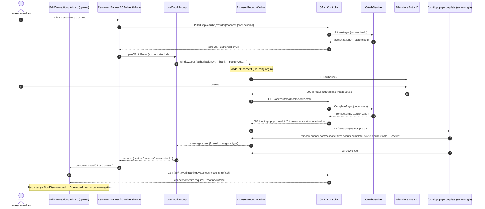

# Feature Delta — work-tracking-oauth-authentication

**Source**: Azure DevOps Epic [#2438 — Work Tracking System OAuth Authentication](https://dev.azure.com/letpeoplework/Lighthouse/_workitems/edit/2438)
**Child stories**: #4967 (Jira OAuth), #4968 (token refresh), #4969 (ADO OAuth), #4971 (provider-agnostic refactor), #4972 (callback BaseUrl). _#4970 (standalone guard) was removed 2026-05-16 — see the post-DELIVER note at the bottom of this file._
**License gate**: **Premium-only** for both Jira and Azure DevOps OAuth.
**Density**: lean + ask-intelligent (`~/.nwave/global-config.json`)

---

## Wave: DISCUSS / [REF] Persona ID

`connector-admin` — the Lighthouse instance owner (typically the team lead or platform engineer who runs the self-hosted server) who configures the Jira or Azure DevOps connection that every Lighthouse team and portfolio reads from. Already exists in `docs/product/personas/` implicitly via the existing PAT/API-token flow; this feature targets the *same* persona but a different job-context (credential lifecycle management).

## Wave: DISCUSS / [REF] JTBD one-liner

**When** I configure Lighthouse to read from Jira or Azure DevOps in an organisation where API tokens are governed centrally, **I want to** authenticate the connection via my organisation's OAuth identity provider instead of pasting a long-lived personal access token, **so I can** rotate and revoke that connection's access from the IdP without re-deploying Lighthouse or chasing the engineer whose PAT it was.

Job traceability: `job-oauth-work-tracking-credentials` (added to `docs/product/jobs.yaml`).

## Wave: DISCUSS / [REF] Locked decisions

| ID | Decision | Verdict | Source |
|---|---|---|---|
| D1 | OAuth is **premium-license-gated** for both Jira and ADO connectors | Locked | Epic 2438 body: "OAuth for Jira/ADO (or in general) should only be available with Premium License" |
| D2 | ~~OAuth is **server-mode only**; standalone (Tauri desktop) shows the option disabled with explanatory tooltip~~ | **Reversed 2026-05-16** — see post-DELIVER note. Standalone users may attempt OAuth at their own risk; no UI guard. | Originally: Epic 2438 body + Story 4970 |
| D3 | OAuth is **provider-agnostic**: `IOAuthProvider` port, DI-registered, configuration + credential keyed by **provider name string** (not enum) so new providers add zero migrations | Locked | Story 4971 |
| D4 | Callback URL displayed in the form is derived from a server-configured **`BaseUrl`** setting, NOT from the request origin. Validation warning when `BaseUrl` is unset | Locked | Story 4972 |
| D5 | Refresh tokens are stored and rotated automatically on a **pre-request expiry check** (refresh if expiry within 5 minutes). Failed refresh marks credential `RefreshFailed` and surfaces a reconnect banner | Locked | Story 4968 |
| D6 | `OAuthCredential` (accessToken, refreshToken, expiresAt, status) is persisted **separately** from `OAuthConfiguration` (clientId, clientSecret, provider, redirectUri). Both are secret options; both encrypted at rest via existing `ICryptoService` | Locked | Stories 4967/4968 + existing `IsSecret` pattern |
| D7 | First provider shipped is **Jira (3LO)**, second is **Azure DevOps (Entra ID)**. ADO ships in a separate slice once the abstraction is proven | Locked | Epic 2438 + story ordering 4967 → 4969 |
| D8 | **No automatic credential migration** from existing PAT/API-token connectors. OAuth is an additional auth method in the existing dropdown; users opt in per connection | Locked (inferred) | Epic 2438 body uses "alongside" wording; no migration story in epic |
| D9 | OAuth is a **connection-level** credential (one shared OAuth app per connection), not per-user. Lighthouse acts as the OAuth client on behalf of the connector; downstream Lighthouse users continue to authenticate to the *app* via the existing OIDC flow | Locked (clarification) | Epic 2438 scope; no per-user requirement in any child story |
| D10 | OAuth integrates into the existing **`AuthenticationMethodSchema`** SSOT (`Lighthouse.Backend/Services/Implementation/WorkTrackingConnectors/AuthenticationMethodSchema.cs`) — new keys `jira.oauth` and `ado.oauth` flagged premium. No new SSOT introduced | Locked | Existing extension point; rejecting parallel schema |

## Wave: DISCUSS / [REF] User stories with elevator pitches

### US-01 — Configure an OAuth connection for Jira (ADO #4967, includes #4971 abstraction + #4972 BaseUrl)

> As a `connector-admin`, I want to add a Jira work tracking connection authenticated via OAuth 2.0 (3LO) so that the access I grant Lighthouse can be governed and revoked in Atlassian's identity console instead of through a PAT pasted into a config field.

#### Elevator Pitch
- **Before**: Lighthouse can only authenticate to Jira via an API token bound to a specific Atlassian user; rotating it means the engineer whose token it is rotates it in their personal Atlassian account and updates Lighthouse manually.
- **After**: from the `Connections → New Jira connection → Authentication: OAuth` form, paste the OAuth `clientId`/`clientSecret` from the Atlassian developer console, click **Connect**, complete the Atlassian consent screen, and see the connection page show `Status: Connected — OAuth (Jira Cloud)` with the granted scopes listed.
- **Decision enabled**: the connector-admin decides whether to *replace* the existing PAT-based connection (and rotate it in the IdP) or *add* OAuth as a parallel connection for new teams while leaving the legacy connection in place.

#### Acceptance criteria
1. Given a Premium-licensed server-mode instance and a Jira connector form, **when** I select Authentication = "OAuth (Jira Cloud)", **then** the form shows `clientId` + `clientSecret` + a **read-only callback URL** that equals `{BaseUrl}/oauth/callback/jira` and the legacy `username` + `apiToken` fields are hidden.
2. Given a non-Premium-licensed instance, **when** I open the same form, **then** the "OAuth (Jira Cloud)" option is visible in the dropdown but rendered with an "Upgrade to Premium" affordance and selecting it does not show the OAuth form fields.
3. Given the form is filled and I click **Connect**, **when** the backend issues `POST /api/oauth/jira/connect`, **then** the response is HTTP 200 with `{ authorizationUrl }` and the browser redirects to that URL.
4. Given the user has consented at Atlassian and the browser is redirected to `GET /api/oauth/callback?provider=jira&code=...&state=...`, **when** the backend exchanges the code, **then** an `OAuthCredential` row is persisted with `status = Valid` and the connection settings surface shows `Status: Connected — OAuth (Jira Cloud)`. *(Amended 2026-05-16 per Story #5018 — see back-propagation note. The original mechanism-specific wording "the user is redirected back to the connection settings page" was replaced with the mechanism-agnostic "the connection settings surface shows" so both the slice-02 redirect implementation and the Story #5018 popup mechanism satisfy the AC.)*
5. Given a Jira connection authenticated via OAuth, **when** Lighthouse next refreshes work items for a team using that connection, **then** the outbound HTTP request to Jira carries an `Authorization: Bearer {accessToken}` header (not Basic auth) and returns work items successfully.
6. Given the server is configured with `BaseUrl=https://lighthouse.example.com`, **when** I open the form, **then** the displayed callback URL is exactly `https://lighthouse.example.com/oauth/callback/jira` regardless of the request `Host`/`Origin` header.
7. Given `BaseUrl` is **not** configured, **when** I open the form, **then** a non-blocking validation warning is shown: *"Your callback URL may be incorrect. Set BaseUrl in your server configuration to guarantee OAuth registration works."*
8. Given a developer adds a stub OAuth provider in tests, **when** they implement only `IOAuthProvider`, register it via DI, and supply its OAuth-app metadata, **then** the connection wizard surfaces it as an authentication method without any change to `WorkTrackingSystemConnectionsController`, `OAuthCredential`, or persistence migrations. (This proves the abstraction is honest — story #4971 wired in alongside the first user.)

#### Slice composition note
Stories #4971 (abstraction) and #4972 (BaseUrl) are folded into this slice because (a) shipping a Jira-only implementation without `IOAuthProvider` would force a destructive refactor when ADO arrives, and (b) without a correct callback URL the slice does not actually let a user complete the flow end-to-end against a real Atlassian OAuth app.

#### Known limitation against real Atlassian (as shipped 2026-05-15)
AC #5 ("Bearer header on outbound Jira call, returns work items successfully") is implemented end-to-end: handshake completes, the credential is persisted with the full granted scope set, outbound calls correctly route through `api.atlassian.com/ex/jira/{cloudId}/` with the decrypted Bearer token. However, Atlassian's Agile API (`/rest/agile/...`) returns `401 "scope does not match"` for OAuth tokens, even when the token explicitly carries `read:board-scope:jira-software`, `read:sprint:jira-software`, and `read:issue:jira-software`. Plain Jira platform endpoints (e.g. `/rest/api/2/myself`) accept the same token. Until the underlying Atlassian-side scope mismatch is resolved, the **team-creation board picker returns zero results for `jira.oauth` connections** — workaround is `jira.cloud` (API token) or `jira.scopedtoken`. See `slices/slice-01-jira-oauth.md` "Known limitations as shipped" for details.

---

### US-02 — OAuth tokens stay alive past expiry (ADO #4968)

> As a `connector-admin` whose Jira connection uses OAuth, I want Lighthouse to refresh the access token transparently so that scheduled work-item syncs do not stop working after the access token expires.

#### Elevator Pitch
- **Before**: an OAuth access token expires (typically 1h on Jira Cloud); the next sync fails with `401`; the connector-admin has to notice the failed sync, reopen the connection form, and re-complete the consent dance — a recurring chore.
- **After**: when Lighthouse is about to call Jira and the stored `expiresAt` is within 5 minutes of `now`, the background `OAuthTokenRefreshService` calls Atlassian's refresh endpoint, updates the credential, and the outbound call proceeds with the fresh token. The connector-admin sees no banner, no failed sync, no manual step.
- **Decision enabled**: the connector-admin decides whether OAuth is operationally cheaper than PATs in *their* org — i.e. whether to migrate the rest of their connectors. The answer is "yes" only if refresh is truly silent.

#### Acceptance criteria
1. Given a Jira OAuth connection whose stored `expiresAt` is 3 minutes from now, **when** a team-sync job triggers an outbound Jira call, **then** the refresh endpoint is invoked exactly once, the `OAuthCredential` row is updated with a new `accessToken`/`refreshToken`/`expiresAt`, and the outbound call succeeds with the new token.
2. Given the refresh endpoint returns a non-2xx response (revoked refresh token), **when** the refresh attempt completes, **then** the `OAuthCredential.status` becomes `RefreshFailed`, the failing sync is aborted cleanly (no exception in the logs, no crash), and the next `GET /api/latest/worktrackingsystemconnections` response includes a `requiresReconnect: true` flag for that connection.
3. Given a connection with `status = RefreshFailed`, **when** the connector-admin opens the connections list page, **then** a yellow banner appears on the affected connection's card: *"Reconnect required — the OAuth refresh token is no longer valid"* with a **Reconnect** button that re-initiates `POST /api/oauth/jira/connect`.
4. Given two concurrent work-item syncs against the same connection trigger a refresh, **when** both observe an expired token, **then** the refresh endpoint is invoked **at most once** (no thundering-herd refresh storm); both sync calls then use the resulting fresh token.

---

### US-03 — Configure an OAuth connection for Azure DevOps (ADO #4969)

> As a `connector-admin`, I want to add an Azure DevOps work tracking connection authenticated via OAuth (Entra ID / Azure DevOps OAuth) so that I do not have to issue a Personal Access Token from my own Azure DevOps account for Lighthouse to use.

#### Elevator Pitch
- **Before**: ADO connections require a PAT scoped to "work items read/write", issued from a specific human user's account. When that person leaves the company, every Lighthouse ADO connection breaks.
- **After**: from the ADO connector form, select Authentication = "OAuth (Azure DevOps)", paste the registered Entra ID app's `clientId`/`clientSecret`, complete the Microsoft consent dance, and see `Status: Connected — OAuth (Azure DevOps)`. The OAuth app is owned by the org, not by a person.
- **Decision enabled**: the connector-admin can credibly hand Lighthouse to a successor without rotating any credentials.

#### Acceptance criteria
1. Given the same Premium-licensed server-mode setup as US-01, **when** I select Authentication = "OAuth (Azure DevOps)" in the ADO connector form, **then** the form shows `clientId` + `clientSecret` + a read-only callback URL `{BaseUrl}/oauth/callback/ado`.
2. Given `BaseUrl` is `http://...` (not HTTPS), **when** I open the ADO OAuth form, **then** a warning is shown: *"Azure DevOps requires HTTPS callback URLs in production. Your current BaseUrl is HTTP."* The form remains usable (Lighthouse does not block the configuration — that decision belongs to Azure DevOps at registration time).
3. Given I have registered an Entra ID app and pasted its credentials, **when** I click **Connect**, **then** the flow follows the same `POST /api/oauth/ado/connect` → consent → `GET /api/oauth/callback?provider=ado&...` contract as Jira, and on success the connection page shows `Status: Connected — OAuth (Azure DevOps)` with the requested `vso.work` / `vso.work_write` scopes listed.
4. Given an ADO OAuth connection, **when** Lighthouse next refreshes work items, **then** the outbound HTTP request to `dev.azure.com` carries `Authorization: Bearer {accessToken}` and the response is HTTP 200.
5. **Implementation invariant**: the only files touched relative to US-01 that did not already exist are (a) `AdoOAuthProvider.cs` implementing `IOAuthProvider`, (b) its DI registration, and (c) the docs page. No change to `OAuthCredential`, `OAuthConfiguration`, the controller, or the refresh service. (Verified by diff review at PR time.)

---

_US-04 (Standalone mode explains why OAuth is unavailable) was removed 2026-05-16 — see post-DELIVER note at the bottom of this file._

---

## Wave: DISCUSS / [REF] Definition of Done

1. Every AC above passes in CI (NUnit backend + Vitest frontend + Playwright E2E).
2. Stryker.NET mutation kill rate ≥ 80% on `OAuthService`, `IOAuthProvider` implementations, `OAuthTokenRefreshService`, and `OAuthCredentialStore`.
3. Stryker JS mutation kill rate ≥ 80% on the React OAuth components (`OAuthAuthForm`, `ReconnectBanner`, `AuthMethodDropdown` premium-gating logic).
4. `pnpm test` + `pnpm build` + `dotnet build` (zero warnings, `TreatWarningsAsErrors`) + `dotnet test` all green locally before push.
5. SonarQube Cloud quality gate passes: no new bugs / vulnerabilities / code smells / security hotspots on the PR.
6. Docs site updated with three new pages: *Setting up Jira OAuth*, *Setting up Azure DevOps OAuth*, *Configuring BaseUrl for OAuth callback registration* (with nginx/Caddy/Traefik examples).
7. `docs/product/architecture/brief.md` extended with the new HTTP routes and the `IOAuthProvider` port in the component table; a new ADR records the provider-name-as-string keying decision (D3).
8. ADO Epic 2438 and all 6 child stories transition through `New → Active → Resolved → Closed` per `/ado-sync`; user-confirmed before every push.
9. Release notes drafted with `Release Notes` tag on the ADO items (per `/release-notes` skill).

## Wave: DISCUSS / [REF] Out of scope

- **Migration tooling** to convert existing PAT/API-token connections to OAuth (per D8 — users opt in per connection).
- **Per-user OAuth** — every Lighthouse user authenticating to Jira/ADO as themselves (per D9 — connection-level only).
- **OAuth for the Lighthouse app login** — that is OIDC, owned by the existing auth feature; this feature is exclusively about outbound work-tracking-system credentials.
- **OAuth for Linear, GitHub, or any other future connector** — the abstraction (D3) is built honestly, but no third concrete provider ships in this feature.
- **OAuth app *registration automation*** — Lighthouse never registers an OAuth app on the user's behalf; the user always registers in Atlassian/Microsoft first and pastes the credentials.
- **Token introspection / revocation endpoints** — refresh handles the happy path and `RefreshFailed` handles the unhappy one; no proactive revocation.
- **Audit log entries for OAuth credential changes** — captured in the existing audit log already (token persistence goes through `ICryptoService` + `LighthouseDbContext`); no bespoke audit event needed.

## Wave: DISCUSS / [REF] WS strategy

**N/A — brownfield extension.** The feature plugs into two established ports without introducing a new architectural pattern:

- **Inbound auth-method extension point**: `AuthenticationMethodSchema.cs` (`Lighthouse.Backend/Services/Implementation/WorkTrackingConnectors/`). Two new keys: `jira.oauth`, `ado.oauth`, both flagged premium.
- **Inbound connection-credential extension point**: `WorkTrackingSystemConnectionOption` (with `IsSecret = true`) for the existing `clientId`/`clientSecret`/token storage shape; the new `OAuthCredential` entity is the *runtime* shape of the issued tokens, sharing the same encryption pipeline (`ICryptoService`).
- **Outbound HTTP boundary**: existing `JiraWorkTrackingConnector` and `AzureDevOpsWorkTrackingConnector` get a new authentication-header strategy injected, replacing the current `BasicAuth` / `Bearer-PAT` paths when the connection's auth method is `*.oauth`.

No walking skeleton is needed because the connector pipeline already runs end-to-end with PAT auth; this feature adds a parallel authentication strategy along the same pipeline.

## Wave: DISCUSS / [REF] Driving ports

Inbound surfaces introduced by this feature:

| Surface | Path / Name | Auth | Notes |
|---|---|---|---|
| HTTP | `POST /api/oauth/{provider}/connect` | Authenticated + Premium license | Initiates flow; returns `{ authorizationUrl }`. Body: `{ connectionId, clientId, clientSecret }`. |
| HTTP | `GET /api/oauth/callback` | Public (per OAuth spec) | Query `provider`, `code`, `state`. Exchanges code, persists `OAuthCredential`, 302 → connection settings page with success/error state. |
| HTTP | `POST /api/oauth/{provider}/disconnect` | Authenticated + Premium license | Clears credential; sets `status = Disconnected`. Used by the **Reconnect** flow (delete-then-reconnect) and by explicit removal. |
| Background | `OAuthTokenRefreshService` | n/a | Hosted service triggered pre-request by `JiraWorkTrackingConnector` / `AzureDevOpsWorkTrackingConnector`. Single-flight refresh per credential (mutex on `OAuthCredential.Id`). |
| UI | `AuthMethodDropdown` extension | n/a | New `jira.oauth` / `ado.oauth` entries; premium gate; standalone-mode guard. |
| UI | `OAuthAuthForm` | n/a | clientId, clientSecret, read-only callback URL display. |
| UI | `ReconnectBanner` | n/a | Renders on connection settings + connections list when `status = RefreshFailed`. |
| Config | `Lighthouse:BaseUrl` (appsettings) | n/a | Sole source of truth for the OAuth callback URL display; non-blocking warning if unset. |

## Wave: DISCUSS / [REF] Pre-requisites

- Premium license model is functional in production (`LicenseGuardAttribute`, `OptionalFeature.IsPremium`, `LicenseService`).
- `AuthenticationMethodSchema` is the SSOT for connection auth methods (already true as of `apikey-list-replace-createdby-with-scopes`).
- `ICryptoService` encrypts secret connection options at rest (already true; reused for `OAuthCredential.accessToken` + `refreshToken`).
- Server-vs-standalone runtime detection is available to the frontend (already used by the existing OIDC gating).
- The existing connection-list payload shape (per `adr-006-connection-list-payload-shape.md`) can accept an additive `requiresReconnect: boolean` field per connection.
- A test Atlassian OAuth app and a test Entra ID app are available for E2E (acceptance: a dedicated `OAuthIntegrationTestFixture` is configured with sandbox-tenant credentials; standard for this codebase).

## Wave: DISCUSS / [REF] Wave decisions summary

- Feature type: **cross-cutting** (UI + HTTP + persistence + background services + license enforcement + docs).
- Primary persona: **`connector-admin`** (existing).
- Walking skeleton: **none** (brownfield extension of `AuthenticationMethodSchema`).
- Slice plan: **3 user-visible slices** (Slice 01 Jira + abstraction + BaseUrl, Slice 02 refresh, Slice 03 ADO); **zero** infrastructure-only slices; slice-composition hard gate **PASS**. _(Originally 4 — Slice 04 standalone guard reversed 2026-05-16.)_
- Outcome KPIs:
  - **OAuth connection setup success rate** ≥ 90% (rate of `POST /connect → GET /callback` completing with `status = Valid` per started flow, measured over the first month). *Why:* validates the docs and form UX are clear enough.
  - **Time-to-first-sync after OAuth connect** ≤ 60 seconds (p95). *Why:* OAuth's promise is "as easy as PAT"; if first sync is slow, users will revert.
  - **OAuth refresh success rate** ≥ 99% over rolling 7 days. *Why:* if this falls, the "stay alive past expiry" promise is broken; reverts to PAT are likely.
  - **OAuth-vs-PAT adoption ratio** of *new* Jira/ADO connections at 90 days. *Why:* the business question is "did Premium customers actually switch?" *Note (2026-05-14):* this KPI is **deferred to ADO Epic [#5015 — Opt-in Product Telemetry](https://dev.azure.com/letpeoplework/Lighthouse/_workitems/edit/5015)**. Lighthouse is self-hosted; aggregate measurement requires an opt-in telemetry channel that does not exist today. This KPI is a **business question** for this feature, not an acceptance gate. See § "Wave: DEVOPS / [REF] Upstream changes (back-propagation)" for the resolution trail.

## Wave: DISCUSS / [REF] Upstream changes

None — this is the first DISCUSS run for `work-tracking-oauth-authentication`. No prior DISCOVER or DIVERGE artefacts exist for this feature.

---

## Expansion menu (ask-intelligent — DISCUSS triggered)

The following trigger fired during DISCUSS analysis:

- **Cross-context complexity** — this feature touches 6 modules (HTTP controllers, persistence/migrations, background services, frontend UI, license enforcement, public docs).

Suggested expansion (not auto-rendered; reply to expand):

- `alternatives-considered` — *Decision rationale: alternatives weighed and rejected per locked decision* (e.g. why provider-name-as-string instead of enum; why per-connection vs. per-user OAuth; why fold #4971 into Slice 01 instead of shipping standalone)

Apply? **[Y / n / all / none / custom]**

Any other catalogue item can also be requested ad-hoc: `jtbd-narrative`, `persona-narrative`, `migration-playbook`, `journey-deep-dive`, `gherkin-scenarios`, `reviewer-findings-trace`, `expansion-catalog-rationale`.

---

## Wave: DESIGN / [REF] DDD list

| Ref | Decision | Verdict |
|---|---|---|
| DDD-1 | Architectural pattern: **ports-and-adapters (hexagonal)** — already established; this feature extends two existing inbound ports (`AuthenticationMethodSchema`, `WorkTrackingSystemConnectionsController`) and adds one new inbound port (`OAuthController`) plus one new outbound port (`IOAuthProvider`). | Locked |
| DDD-2 | Paradigm: **OOP (C# backend), functional-leaning React (hooks) on frontend** — established in `CLAUDE.md`. No change. | Locked |
| DDD-3 | **Refinement of DISCUSS D6**: `clientId` and `clientSecret` are stored as `WorkTrackingSystemConnectionOption` rows (`IsSecret = true`, encrypted via existing `ICryptoService` pipeline). Only `OAuthCredential` (accessToken, refreshToken, expiresAt, status) is a new entity. The *separation* intent of D6 is preserved (different tables) but with maximum reuse of the existing options pipeline. See `## Wave: DESIGN / [REF] Reuse Analysis` row 2. Back-propagation entry below. | Locked |
| DDD-4 | `WorkTrackingSystemConnection.AuthenticationMethodKey` (string) already keys the provider — DISCUSS D3 ("provider-name-as-string") is satisfied with **zero new fields** on `WorkTrackingSystemConnection`. New keys: `jira.oauth`, `ado.oauth`. | Locked |
| DDD-5 | **`IOAuthProvider`** port shape: `BuildAuthorizationUrl(OAuthFlowContext)`, `ExchangeCodeAsync(string code, string codeVerifier, CancellationToken)`, `RefreshTokenAsync(string refreshToken, CancellationToken)`, `string ProviderKey`, `IReadOnlyList<string> DefaultScopes`. Resolved from DI via `IOAuthProviderRegistry` keyed by `AuthenticationMethodKey`. | Locked |
| DDD-6 | **Premium gate is two-layer**: (1) `AuthenticationMethod.IsPremium` boolean added to the schema record so the frontend dropdown can render the "Upgrade to Premium" affordance without an extra round-trip; (2) `[LicenseGuard(RequirePremium = true)]` on every new OAuth controller action so the gate is enforced at the API boundary regardless of UI state. | Locked |
| DDD-7 | **Single-flight refresh** via `SemaphoreSlim` keyed on `OAuthCredential.Id` (in-process). Lighthouse runs as a single instance per deployment, so in-process locking suffices and avoids the distributed-lock dependency. If multi-instance deployment is ever required, lock moves to the DB row (`SELECT ... FOR UPDATE`). | Locked |
| DDD-8 | **CSRF state** parameter on the OAuth dance is an HMAC-signed token (key = a new server-side secret, payload = `{ connectionId, providerKey, nonce, expiresAt }`). Stored nowhere — the callback handler verifies the signature and expiry. Eliminates the need for a session store. | Locked |
| DDD-9 | **Connector auth-strategy injection**: `JiraWorkTrackingConnector` and `AzureDevOpsWorkTrackingConnector` gain a `IWorkTrackingAuthStrategy` collaborator resolved per request from `AuthenticationMethodKey`. PAT/API-token strategies move into this abstraction alongside the new `OAuth*AuthStrategy` implementations. This is a small refactor that ships as part of Slice 01 (cost: ~30 LOC per connector). | Locked |
| DDD-10 | **No new database migration framework usage** — existing `CreateMigration` PowerShell script generates the EF migration for the `OAuthCredential` table across SQLite + PostgreSQL providers, per `CLAUDE.md` rules. | Locked |

## Wave: DESIGN / [REF] Component decomposition

Pattern: every overlapping component is EXTEND. Only `OAuthCredential` (entity), `IOAuthProvider` (port), and the two concrete provider implementations are CREATE NEW. See Reuse Analysis table below for justification.

| Component | File | Change Type | Change Summary |
|---|---|---|---|
| `AuthenticationMethodKeys` | `Lighthouse.Backend/Lighthouse.Backend/Services/Implementation/WorkTrackingConnectors/AuthenticationMethodKeys.cs` | EXTEND | Add `JiraOAuth = "jira.oauth"` and `AzureDevOpsOAuth = "ado.oauth"` constants. |
| `AuthenticationMethod` (record) | `Lighthouse.Backend/Lighthouse.Backend/Services/Implementation/WorkTrackingConnectors/AuthenticationMethodSchema.cs` | EXTEND | Add `bool IsPremium { get; init; } = false;` property (DDD-6 layer 1). |
| `AuthenticationMethodSchema` | `Lighthouse.Backend/Lighthouse.Backend/Services/Implementation/WorkTrackingConnectors/AuthenticationMethodSchema.cs` | EXTEND | Add `jira.oauth` and `ado.oauth` entries with `IsPremium = true` and option keys `oauth.clientId` (`IsSecret = false`) + `oauth.clientSecret` (`IsSecret = true`). |
| `AuthenticationMethodDto` | `Lighthouse.Backend/Lighthouse.Backend/API/DTO/AuthenticationMethodDto.cs` | EXTEND | Carry through `IsPremium` flag in `FromSchema(...)`. |
| `WorkTrackingSystemConnection` | `Lighthouse.Backend/Lighthouse.Backend/Models/WorkTrackingSystemConnection.cs` | NO CHANGE | `AuthenticationMethodKey` (string) is already the provider name (DDD-4). `Options` already store the clientId/clientSecret pattern (DDD-3). |
| `OAuthCredential` (new entity) | `Lighthouse.Backend/Lighthouse.Backend/Models/OAuth/OAuthCredential.cs` | CREATE NEW | `Id`, `WorkTrackingSystemConnectionId` (FK), `AccessToken` (encrypted), `RefreshToken` (encrypted), `ExpiresAt`, `Status` (enum: Valid / RefreshFailed / Disconnected), `UpdatedAt`. One-to-one with the connection. Cascade delete with connection. |
| `OAuthCredentialStatus` (new enum) | `Lighthouse.Backend/Lighthouse.Backend/Models/OAuth/OAuthCredentialStatus.cs` | CREATE NEW | `Valid` (0), `RefreshFailed` (1), `Disconnected` (2). |
| `IOAuthProvider` (new port) | `Lighthouse.Backend/Lighthouse.Backend/Services/Interfaces/OAuth/IOAuthProvider.cs` | CREATE NEW | See DDD-5 for shape. |
| `IOAuthProviderRegistry` (new port) | `Lighthouse.Backend/Lighthouse.Backend/Services/Interfaces/OAuth/IOAuthProviderRegistry.cs` | CREATE NEW | `IOAuthProvider GetByKey(string authenticationMethodKey)`. Throws `OAuthProviderNotFoundException` on miss. |
| `OAuthProviderRegistry` | `Lighthouse.Backend/Lighthouse.Backend/Services/Implementation/OAuth/OAuthProviderRegistry.cs` | CREATE NEW | Resolves the injected `IEnumerable<IOAuthProvider>` from DI; builds a `Dictionary<string, IOAuthProvider>` on construction. |
| `JiraOAuthProvider` | `Lighthouse.Backend/Lighthouse.Backend/Services/Implementation/OAuth/Providers/JiraOAuthProvider.cs` | CREATE NEW | Implements `IOAuthProvider`; `ProviderKey = "jira.oauth"`; Atlassian 3LO endpoints (`auth.atlassian.com/authorize`, `auth.atlassian.com/oauth/token`); default scopes `read:jira-work read:jira-user offline_access`. |
| `AdoOAuthProvider` | `Lighthouse.Backend/Lighthouse.Backend/Services/Implementation/OAuth/Providers/AdoOAuthProvider.cs` | CREATE NEW | Implements `IOAuthProvider`; `ProviderKey = "ado.oauth"`; Entra ID / Azure DevOps OAuth endpoints; default scopes `vso.work_write`. |
| `IOAuthService` (new inbound port) | `Lighthouse.Backend/Lighthouse.Backend/Services/Interfaces/OAuth/IOAuthService.cs` | CREATE NEW | `InitiateAsync(int connectionId, CancellationToken) → AuthorizationUrl`; `CompleteAsync(string code, string state, CancellationToken) → connectionId + result`; `DisconnectAsync(int connectionId, CancellationToken)`; `EnsureFreshTokenAsync(int connectionId, CancellationToken) → accessToken`. |
| `OAuthService` | `Lighthouse.Backend/Lighthouse.Backend/Services/Implementation/OAuth/OAuthService.cs` | CREATE NEW | Implements `IOAuthService`. Composes `IOAuthProviderRegistry`, `IRepository<WorkTrackingSystemConnection>`, `IRepository<OAuthCredential>`, `ICryptoService`, `IOAuthStateTokenIssuer`, `ILogger`. Owns the single-flight refresh semaphore dictionary (DDD-7). |
| `IOAuthStateTokenIssuer` (new port) | `Lighthouse.Backend/Lighthouse.Backend/Services/Interfaces/OAuth/IOAuthStateTokenIssuer.cs` | CREATE NEW | `string Issue(int connectionId, string providerKey)`; `OAuthStateClaims Verify(string token)`. HMAC-SHA256 with key from `Lighthouse:OAuth:StateSecret` (DDD-8). |
| `OAuthController` | `Lighthouse.Backend/Lighthouse.Backend/API/OAuthController.cs` | CREATE NEW | Three actions: `[HttpPost("{providerKey}/connect")]`, `[HttpGet("callback")]`, `[HttpPost("{providerKey}/disconnect")]`. All three carry `[LicenseGuard(RequirePremium = true)]` (DDD-6 layer 2); connect/disconnect also carry `[RbacGuard(RbacGuardRequirement.SystemAdmin)]` (connection management is SystemAdmin-only); callback is intentionally `[AllowAnonymous]` per the OAuth spec (the state token is the CSRF protection). |
| `IWorkTrackingAuthStrategy` (new port) | `Lighthouse.Backend/Lighthouse.Backend/Services/Interfaces/WorkTrackingConnectors/IWorkTrackingAuthStrategy.cs` | CREATE NEW | `Task ApplyAsync(HttpRequestMessage request, WorkTrackingSystemConnection connection, CancellationToken)`. Implementations: `PatAuthStrategy`, `JiraCloudBasicAuthStrategy` (existing PAT/API-token paths refactored into the abstraction), `OAuthBearerAuthStrategy`. |
| `OAuthBearerAuthStrategy` | `Lighthouse.Backend/Lighthouse.Backend/Services/Implementation/WorkTrackingConnectors/Auth/OAuthBearerAuthStrategy.cs` | CREATE NEW | Calls `IOAuthService.EnsureFreshTokenAsync(connectionId)`, sets `Authorization: Bearer {token}` on the outbound request. |
| `JiraWorkTrackingConnector` | `Lighthouse.Backend/Lighthouse.Backend/Services/Implementation/WorkTrackingConnectors/Jira/JiraWorkTrackingConnector.cs` | EXTEND | Inject `IWorkTrackingAuthStrategyFactory`; resolve the strategy from `connection.AuthenticationMethodKey`; replace inline `BasicAuthenticationHeaderValue` construction (~30 LOC) with `await authStrategy.ApplyAsync(req, conn, ct)`. |
| `AzureDevOpsWorkTrackingConnector` | `Lighthouse.Backend/Lighthouse.Backend/Services/Implementation/WorkTrackingConnectors/AzureDevOps/AzureDevOpsWorkTrackingConnector.cs` | EXTEND | Same shape as Jira: inject strategy factory; resolve from `AuthenticationMethodKey`. |
| `LighthouseAppContext` | `Lighthouse.Backend/Lighthouse.Backend/Data/LighthouseAppContext.cs` | EXTEND | Add `DbSet<OAuthCredential> OAuthCredentials { get; set; }`; configure FK to `WorkTrackingSystemConnection` with cascade delete; configure `AccessToken` + `RefreshToken` columns with the existing encrypted-string value converter pattern. |
| EF migration | `Lighthouse.Backend/Lighthouse.Backend/Migrations/Sqlite/*` + `.../Postgres/*` | CREATE NEW | Generated via the existing `CreateMigration` PowerShell script. Adds `OAuthCredentials` table with cascade-delete FK. |
| `Program.cs` (DI) | `Lighthouse.Backend/Lighthouse.Backend/Program.cs` | EXTEND | Register `IOAuthProviderRegistry`, `IOAuthService`, `IOAuthStateTokenIssuer`; register `JiraOAuthProvider` and `AdoOAuthProvider` as `IOAuthProvider`; register `IWorkTrackingAuthStrategyFactory` and the three concrete strategies. |
| `IServiceConfig` | `Lighthouse.Backend/Lighthouse.Backend/Services/Interfaces/IServiceConfig.cs` | EXTEND | Add `string BaseUrl { get; }` and `string OAuthStateSecret { get; }`; bind to `Lighthouse:BaseUrl` and `Lighthouse:OAuth:StateSecret` in `appsettings.json`. |
| `RbacGuardRequirement` | `Lighthouse.Backend/Lighthouse.Backend/Services/Authorization/RbacGuardRequirement.cs` | NO CHANGE | `SystemAdmin` requirement already exists and covers OAuth connect/disconnect. |
| `WorkTrackingSystemConnectionDto` | `Lighthouse.Backend/Lighthouse.Backend/API/DTO/WorkTrackingSystemConnectionDto.cs` | EXTEND | Add `bool RequiresReconnect { get; }` derived from `OAuthCredential.Status == RefreshFailed`. Additive — per `adr-006-connection-list-payload-shape.md`. |
| `OAuthService.ts` (FE) | `Lighthouse.Frontend/src/services/Api/OAuthService.ts` | CREATE NEW | TypeScript HTTP adapter: `initiateConnect(connectionId, providerKey) → { authorizationUrl }`; `disconnect(connectionId, providerKey)`. |
| `AuthMethodDropdown.tsx` (FE) | `Lighthouse.Frontend/src/components/Common/Connections/AuthMethodDropdown.tsx` | EXTEND | Render `IsPremium` badge and upgrade affordance; gate-disabled in standalone mode; emit `disabledReason` tooltip text per mode. |
| `OAuthAuthForm.tsx` (FE) | `Lighthouse.Frontend/src/components/Common/Connections/OAuthAuthForm.tsx` | CREATE NEW | clientId + clientSecret + read-only callback URL display; **Connect** button calls `initiateConnect` then redirects to `authorizationUrl`. |
| `ReconnectBanner.tsx` (FE) | `Lighthouse.Frontend/src/components/Common/Connections/ReconnectBanner.tsx` | CREATE NEW | Renders when `connection.requiresReconnect === true`; **Reconnect** button re-invokes `initiateConnect`. |
| Connection settings page | `Lighthouse.Frontend/src/pages/Settings/Connections/EditConnection.tsx` (or equivalent) | EXTEND | When `AuthenticationMethodKey === "jira.oauth" || "ado.oauth"`: render `OAuthAuthForm` instead of the legacy username/token form; surface `ReconnectBanner` if `requiresReconnect`. |
| Standalone-vs-server flag (FE) | existing runtime-mode hook (used by OIDC gating per `brief.md` rbac-enhancements section) | NO CHANGE | Reused by `AuthMethodDropdown` to drive the standalone-mode disabled state. |

## Wave: DESIGN / [REF] Driving ports

All routes are on `OAuthController`, route prefix `/api/oauth`.

| Method | Route | Auth Requirements | Purpose | Change |
|---|---|---|---|---|
| POST | `/api/oauth/{providerKey}/connect` | `[Authorize]` + `[RbacGuard(SystemAdmin)]` + `[LicenseGuard(RequirePremium = true)]` | Initiates the OAuth flow for a connection. Body: `{ connectionId }`. Returns `{ authorizationUrl }`. Issues HMAC state token. | **NEW** |
| GET | `/api/oauth/callback` | `[AllowAnonymous]` (state token is the CSRF protection per DDD-8) | Receives `?code&state` from the IdP. Verifies state. Exchanges code. Persists `OAuthCredential`. 302 to `{BaseUrl}/settings/connections/{id}?oauth=success` (or `?oauth=error&reason=...`). | **NEW** |
| POST | `/api/oauth/{providerKey}/disconnect` | `[Authorize]` + `[RbacGuard(SystemAdmin)]` + `[LicenseGuard(RequirePremium = true)]` | Sets `OAuthCredential.Status = Disconnected` and clears tokens. Used by the **Reconnect** flow (disconnect → reconnect) and by explicit removal. Body: `{ connectionId }`. | **NEW** |

Internal (not HTTP, but listed as driving):

| Caller | Inbound port method | Purpose |
|---|---|---|
| `OAuthBearerAuthStrategy` (per outbound work-item sync request) | `IOAuthService.EnsureFreshTokenAsync(connectionId, ct)` | Returns a valid access token, refreshing transparently if `expiresAt - now < 5 min`. Single-flight per credential (DDD-7). |

## Wave: DESIGN / [REF] Driven ports + adapters

| Port | Adapter | Technology | Purpose |
|---|---|---|---|
| `IOAuthProvider` (new) | `JiraOAuthProvider`, `AdoOAuthProvider` | `HttpClient` against `auth.atlassian.com` / Microsoft identity endpoints | Build auth URL, exchange code for tokens, refresh tokens. Provider-specific knowledge. |
| OAuth credential persistence (implicit in `IOAuthService`) | `LighthouseAppContext` + `IRepository<OAuthCredential>` | EF Core 8, SQLite/PostgreSQL | Reads/writes `OAuthCredential` rows with encrypted-string columns. |
| Secret encryption | `CryptoService` (existing) | `Aes` symmetric encryption | Encrypts `clientSecret` (as a `WorkTrackingSystemConnectionOption.Value`) and `OAuthCredential.AccessToken`/`RefreshToken` at rest. **No new adapter** — reuses the existing pipeline. |
| State token signing | `OAuthStateTokenIssuer` | `HMACSHA256` over JSON-serialised claims | CSRF protection on the OAuth dance. Self-verifying token — no storage required (DDD-8). |
| License verification | `LicenseService` (existing) via `LicenseGuard` attribute | `LicenseVerifier` (existing) | Enforces premium gate at API boundary (DDD-6 layer 2). **No new adapter** — reuses the existing pipeline. |

## Wave: DESIGN / [REF] Technology choices

| Component | Technology | Version | Rationale |
|---|---|---|---|
| Backend HTTP client for IdPs | `HttpClient` (BCL) | .NET 8 | Already used by all connectors; no new library. |
| OAuth flow library | **none** — hand-written | n/a | OAuth 2.0 auth code + refresh is small; adopting a library (e.g., `IdentityModel.OidcClient`) adds a dependency for ~150 LOC of code. The existing connectors already hand-write their HTTP. Rejected `Microsoft.AspNetCore.Authentication.OAuth` because that package is for *inbound* OAuth (Lighthouse as OAuth server / accepting third-party logins) — not outbound *client* flows. |
| State token signing | `System.Security.Cryptography.HMACSHA256` (BCL) | .NET 8 | No external dependency. |
| Frontend OAuth UI | React 18 + Material UI | existing | Same as rest of FE. |
| EF Core | EF Core 8 | existing | One new migration generated via existing `CreateMigration` script (DDD-10). |
| Test fixture | Custom `StubOAuthProvider` registered in tests | n/a | Implements `IOAuthProvider`; lets E2E exercise the full flow without hitting Atlassian/Microsoft. Slice 01 AC #8 is the integrity test for this. |

## Wave: DESIGN / [REF] Decisions table

| DDD-Ref | Decision (one line) | Status |
|---|---|---|
| DDD-1 | Ports-and-adapters hexagonal pattern extends existing surfaces | Locked |
| DDD-2 | OOP backend + functional-leaning React (unchanged) | Locked |
| DDD-3 | clientId/clientSecret reuse existing Options pipeline; OAuthCredential is the only new entity | Locked (refines DISCUSS D6) |
| DDD-4 | AuthenticationMethodKey string already provides provider keying (no new field) | Locked |
| DDD-5 | IOAuthProvider port shape and DI registry | Locked |
| DDD-6 | Two-layer premium gate (schema flag + LicenseGuard attribute) | Locked |
| DDD-7 | Single-flight refresh via in-process SemaphoreSlim keyed on OAuthCredential.Id | Locked |
| DDD-8 | HMAC-signed state token (no session store) | Locked |
| DDD-9 | IWorkTrackingAuthStrategy abstraction for connector auth-header injection | Locked |
| DDD-10 | EF migration via existing CreateMigration PowerShell script | Locked |

See `docs/product/architecture/adr-007-oauth-provider-registry.md`, `adr-008-oauth-credential-separation.md`, `adr-009-oauth-baseurl-callback.md`, `adr-010-oauth-single-flight-refresh.md` for rationale and alternatives.

## Wave: DESIGN / [REF] Reuse Analysis

| Existing Component | File | Overlap | Decision | Justification |
|---|---|---|---|---|
| `AuthenticationMethodSchema` | `Lighthouse.Backend/.../WorkTrackingConnectors/AuthenticationMethodSchema.cs:32-150` | Already the SSOT for "what auth methods exist per work-tracking system" — exactly what OAuth needs to register | **EXTEND** | Adding two new entries (`jira.oauth`, `ado.oauth`) is ~30 LOC; introducing a parallel OAuth-only registry would duplicate the resolution path used by `WorkTrackingSystemConnectionsController:55` and `JiraWorkTrackingConnector`. |
| `WorkTrackingSystemConnectionOption` + `ICryptoService` | `Lighthouse.Backend/.../Models/WorkTrackingSystemConnectionOption.cs` + `Services/Implementation/CryptoService.cs` | Already provide "named secret option per connection, AES-encrypted at rest". `clientId` / `clientSecret` are exactly this shape | **EXTEND** | Zero new code. A new `OAuthConfiguration` entity (as DISCUSS D6 implied) would duplicate the encryption pipeline. The *separation* intent of D6 is preserved by keeping `OAuthCredential` as a distinct table; the *mechanism* for static configuration values reuses Options. |
| `LicenseGuardAttribute` + `LicenseService` | `Lighthouse.Backend/.../Licensing/LicenseGuardAttribute.cs` + `Services/Implementation/Licensing/LicenseService.cs` | Already gate premium features at the API boundary (used by `TerminologyController:27`, `BlackoutPeriodsController:26`, `PortfoliosController:56`, `TeamsController:67`) | **EXTEND** | One attribute application per new endpoint. Inventing a parallel premium check would be a category violation. |
| `WorkTrackingSystemConnectionsController` | `Lighthouse.Backend/.../API/WorkTrackingSystemConnectionsController.cs:20` | Existing controller for connection CRUD; could host the OAuth actions | **CREATE NEW** (`OAuthController`) | OAuth flow endpoints have different auth requirements (the callback MUST be `[AllowAnonymous]` per OAuth spec; the others use `[RbacGuard(SystemAdmin)]`). Mixing on one controller would force every action to opt out of the controller-level guard explicitly — error-prone. Separate controller keeps the per-controller guard intent uniform. |
| `JiraWorkTrackingConnector` auth-header construction | `Lighthouse.Backend/.../Jira/JiraWorkTrackingConnector.cs` (HttpClient construction with `BasicAuthenticationHeaderValue`) | Inline auth-header construction; would need three branches if OAuth is added inline | **EXTEND** (refactor to `IWorkTrackingAuthStrategy`) | Inline `if (key == "jira.oauth") ... else if (key == "jira.cloud") ...` would scatter provider-specific knowledge across the connector. The `IWorkTrackingAuthStrategy` extraction follows the *Strategy* pattern already implicit in `AuthenticationMethodSchema`. Cost: ~30 LOC per connector, ships in Slice 01. |
| `LighthouseAppContext` | `Lighthouse.Backend/Lighthouse.Backend/Data/LighthouseAppContext.cs:17` (already takes `ICryptoService`) | Existing DbContext with encrypted-string value converter pattern | **EXTEND** | Add one `DbSet<OAuthCredential>`, one FK configuration, one cascade-delete rule. New context would fragment the migration story. |
| `IRepository<T>` | existing generic repository pattern | Already used for every entity in the system | **EXTEND** | `IRepository<OAuthCredential>` slots in with zero new abstractions. |
| `WorkTrackingSystemConnectionDto.requiresReconnect` | `Lighthouse.Backend/.../DTO/WorkTrackingSystemConnectionDto.cs:19-43` | Additive flag per ADR-006 contract | **EXTEND** | One boolean property, populated from the joined `OAuthCredential` if present. Saves a round-trip from the connections list UI. |
| `MutableMockApiServiceContext` / front-end mock service base | `Lighthouse.Frontend/src/services/MockData/MockApiServiceBase.ts` (or equivalent — verified at code time) | Existing FE mock layer for offline test mode | **EXTEND** | Add `OAuthService` mock alongside existing service mocks. Slice 01 implementation step. |
| Standalone-vs-server runtime flag (FE) | per `brief.md` rbac-enhancements section, used by OIDC gating | Existing runtime-mode flag | **EXTEND (reuse)** | `AuthMethodDropdown` reads this flag to render the disabled-OAuth-in-standalone state. No new mechanism. |
| **`IOAuthProvider` (new port)** | — | Nothing in the codebase currently abstracts "outbound OAuth dance against a third-party IdP" | **CREATE NEW** | No existing surface owns "exchange auth code → tokens" for the connector-management domain. The OIDC adapter (inbound auth) is the opposite direction of flow and a different audience (Lighthouse-app users, not connector-IdP credentials). |
| **`OAuthCredential` (new entity)** | — | Nothing in the codebase stores `{ accessToken, refreshToken, expiresAt, status }` for outbound connections | **CREATE NEW** | `WorkTrackingSystemConnectionOption` could be coerced into storing these (one row per token field), but: (a) atomic rotation of accessToken+refreshToken+expiresAt requires a single-row update under DDD-7's single-flight refresh; (b) `status` is enum-typed; (c) querying "all connections needing reconnect" wants a typed column, not a `WHERE Key = 'status' AND Value = 'RefreshFailed'` against the Options table. The DISCUSS D6 separation is best honoured here. |
| **`IOAuthStateTokenIssuer` (new port)** | — | Nothing in the codebase signs short-lived self-verifying tokens for CSRF flows | **CREATE NEW** | An isolated port for HMAC issue/verify. ~40 LOC. Reuses BCL crypto; the alternative (session store) would introduce a runtime dependency Lighthouse does not currently have. |

**Hard-gate confirmation**: every overlapping component is listed; every CREATE NEW has a written justification grounded in evidence (atomic rotation, separation of concerns, different domain audience, or no existing surface).

## Wave: DESIGN / [REF] Open questions

Deliberately deferred to DISTILL / DELIVER:

- **OQ-D1** — Should the `OAuthStateSecret` be auto-generated on first boot (like the existing data-protection key) or required to be set explicitly in `appsettings.json`? Recommendation: auto-generate + persist to data-protection key store; revisit during DELIVER if the implementation needs friction-free local dev. *(DISTILL: acceptance scenario for "fresh server, no manual config" — must include OAuth state token still working.)*
- **OQ-D2** — Should the `OAuthCredential.Status = Disconnected` row be deleted (hard delete) or retained for audit? Recommendation: delete; the audit signal is in `LighthouseDbContext`'s existing change tracking. *(DELIVER decides during EF migration design.)*
- **OQ-D3** — In single-flight refresh under exceptional load (>50 concurrent syncs against one connection), should the semaphore wait timeout out and surface a sync failure, or block? Recommendation: 30s timeout, fail with `OAuthRefreshTimeoutException`. *(DELIVER decides during `OAuthService` implementation; covered by Slice 02 AC #4.)*
- **OQ-D4** — The `state` token includes `connectionId`; what happens if the user deletes the connection mid-flow and re-creates it (new connectionId)? Recommendation: callback verifies the connection still exists and matches the providerKey; if not, render an error page with "Connection no longer exists; please retry". *(DISTILL: acceptance scenario for "connection deleted mid-OAuth-dance".)*
- **OQ-D5** — How are existing E2E tests for PAT/API-token connectors affected by the `IWorkTrackingAuthStrategy` refactor (DDD-9)? Recommendation: zero AC change; the strategy is internal. *(DELIVER verifies via diff review at Slice 01 PR.)*

## Wave: DESIGN / [REF] Wave decisions summary

- **Pattern**: ports-and-adapters (extends existing hexagonal architecture).
- **Paradigm**: OOP (C# backend), functional-leaning React on FE (unchanged; per `CLAUDE.md`).
- **Key new components**: `IOAuthProvider` port + 2 concrete providers; `OAuthService` (inbound port); `OAuthController` (driving adapter); `OAuthCredential` entity; `IWorkTrackingAuthStrategy` abstraction; `IOAuthStateTokenIssuer` for CSRF.
- **Reuse**: `AuthenticationMethodSchema`, `WorkTrackingSystemConnectionOption`, `ICryptoService`, `LicenseGuardAttribute`, `LighthouseAppContext`, `IRepository<T>`, the existing CreateMigration tooling, the existing standalone-vs-server runtime flag.
- **C4 diagrams**: see `docs/product/architecture/c4-diagrams.md` (Container + Component diagrams appended for OAuth).
- **ADRs written**: `adr-007-oauth-provider-registry.md`, `adr-008-oauth-credential-separation.md`, `adr-009-oauth-baseurl-callback.md`, `adr-010-oauth-single-flight-refresh.md`.

## Wave: DESIGN / [REF] Upstream changes (back-propagation)

**Refinement to DISCUSS D6** (locked DISCUSS decision):

> Quoted from `feature-delta.md` DISCUSS section:
> *"`OAuthCredential` (accessToken, refreshToken, expiresAt, status) is persisted **separately** from `OAuthConfiguration` (clientId, clientSecret, provider, redirectUri). Both are secret options; both encrypted at rest via existing `ICryptoService`."*

**DESIGN refinement (non-contradictory)**: there is no `OAuthConfiguration` entity. `clientId` and `clientSecret` are stored as ordinary `WorkTrackingSystemConnectionOption` rows on the existing `WorkTrackingSystemConnection`, with `IsSecret = true` on `clientSecret`. `provider` is the existing `AuthenticationMethodKey` string. `redirectUri` is derived at runtime from `Lighthouse:BaseUrl` (per D4) and is not stored. Only `OAuthCredential` is a new entity.

**Rationale**: the Reuse Analysis (row 2) shows that `WorkTrackingSystemConnectionOption + ICryptoService` already provides everything the static OAuth-app configuration needs (named secret option, encrypted at rest, per-connection scope, edit-via-existing-form). Introducing a parallel `OAuthConfiguration` entity duplicates the encryption pipeline for zero additional invariant. The *separation* of DISCUSS D6 — keeping runtime credentials out of the static-configuration store — is preserved: `OAuthCredential` is a distinct table with cascade-delete FK to the connection.

**Effect on user stories**: zero. US-01 AC #1 ("the form shows `clientId` + `clientSecret` fields") is unaffected by the storage mechanism. No DISCUSS AC needs amendment.

**Effect on slice plan**: zero. Slice 01 still introduces `OAuthCredential` + the `IOAuthProvider` port + the BaseUrl plumbing.

---

## Wave: DEVOPS / [REF] Environment matrix

See `environments.yaml` for the parseable form (consumed by DISTILL Mandate 4). Summary:

| Environment | Platform | DB | OAuth provider | Purpose |
|---|---|---|---|---|
| `local-dev` | linux/macos/windows/wsl | SQLite | Stub | Day-to-day developer workflow |
| `ci-sqlite` | GitHub Actions ubuntu-latest | SQLite (ephemeral) | Stub | Existing `ci_verifysqlite.yml` (extended) |
| `ci-postgres` | GitHub Actions ubuntu-latest | PostgreSQL 16 service | Stub | Existing `ci_verifypostgres.yml` (extended) — verifies cascade-delete FK works on Postgres |
| `ci-integration-smoke-pre-release` | GitHub Actions + manual approval | n/a | **Real Atlassian + Entra ID sandbox** | Pre-release-only smoke; secrets behind environment-protection rule |
| `demo-vendor-hosted` | Linux container | PostgreSQL 16 | **Real** | Vendor's dogfood / public demo |
| `customer-self-hosted` | linux/windows/macos/docker | SQLite or PostgreSQL | **Real** | End user; NOT in vendor telemetry pipeline |

Premium license is a precondition in every environment EXCEPT `local-dev` (where the license check is bypassed for the dev profile, per existing pattern).

## Wave: DEVOPS / [REF] CI/CD pipeline outline

The project already has 20+ workflows under `.github/workflows/` (multi-DB verify, codesign, packaging, release, SonarCloud gate, SBOM, demo-env update). DEVOPS for this feature is **additive** to that pipeline, not a rewrite.

**Trigger rules** (GitHub Flow): every push to a feature branch runs PR-scoped CI; every merge to `main` runs the full pipeline; tagged commits trigger the release pipeline.

| Change | Workflow file | Trigger | Stages added |
|---|---|---|---|
| Extend backend tests | `ci_backend.yml` (existing) | PR + main | Existing test job runs the new `OAuthService`, `JiraOAuthProvider`, `AdoOAuthProvider`, `OAuthStateTokenIssuer`, `OAuthProviderRegistry` test suites; mutation gate (Stryker.NET) extends scope automatically. |
| Extend frontend tests | `ci_frontend.yml` (existing) | PR + main | Vitest covers new `OAuthAuthForm`, `ReconnectBanner`, `AuthMethodDropdown` premium-gating logic, `OAuthService.ts`; Stryker FE mutation scope extends. |
| Extend E2E (PR-fast suite) | `ci_e2e.yml` (existing — main `e2e` job) | PR + main | New Playwright spec `OAuthConnection.spec.ts` exercises the full Slice 01–04 happy + error paths against the `StubOAuthProvider`. No external secrets; runs on every PR. |
| Extend E2E (release-gated smoke job) | `ci_e2e.yml` (existing — **NEW `oauth-smoke` job**) | Release tags + manual `workflow_dispatch` only; `environment: oauth-smoke` (required reviewer) | Real Atlassian sandbox + Entra ID sandbox; the `@requires_external @smoke` scenarios only; gated by `if: github.event_name == 'release' \|\| github.event_name == 'workflow_dispatch'` + the GitHub Actions `environment:` keyword pins secrets to this job alone. Threat-model isolation is preserved at JOB level — no new workflow file needed. (Revision: this consolidates what was originally proposed as a separate `ci_oauth_integration_smoke.yml` per maintainer principle "extend existing CI over creating new workflows; E2E minimal".) |
| Extend SQLite verify | `ci_verifysqlite.yml` (existing) | PR + main | Asserts `OAuthCredentials` migration applies cleanly, FK + cascade-delete works on SQLite. |
| Extend PostgreSQL verify | `ci_verifypostgres.yml` (existing) | PR + main | Same migration assertions on Postgres. |
| Extend auth verify | `ci_verifyauth.yml` (existing) | PR + main | Asserts existing OIDC bootstrap + PAT-based connection paths remain green (regression coverage for the `IWorkTrackingAuthStrategy` refactor in Slice 01). |
| SonarCloud gate | `ci_sonar_gates.yml` (existing) | PR + main | Existing — zero new issues permitted on new OAuth files. CLAUDE.md + `docs/ci-learnings.md` cover the rule families already. |
| Docker build | `ci_docker.yml` (existing) | main + tags | Existing — no Docker layer changes needed (no new system dependencies). |
| Standalone packaging | `ci_package-*-standalone.yml` (existing) | main + tags | Existing — standalone builds ship the OAuth UI guard (US-04) but no backend OAuth code paths are exercised. Verify the disabled-OAuth-dropdown rendering in `ci_verifymacos.yml` and `ci_verifywindows.yml`. |
| Release | `ci_release.yml` (existing) | tags | Existing release workflow gains a **release notes** entry per `/release-notes` skill; the `ci_oauth_integration_smoke.yml` job must pass before release publishes. |

**Secrets** (new GitHub Actions secrets, stored at the `oauth-smoke` environment level with environment protection):

| Secret name | Scope | Purpose |
|---|---|---|
| `JIRA_OAUTH_SANDBOX_CLIENT_ID` | `oauth-smoke` env | Atlassian Cloud sandbox OAuth app — non-secret but kept under environment protection for parity |
| `JIRA_OAUTH_SANDBOX_CLIENT_SECRET` | `oauth-smoke` env | Atlassian Cloud sandbox OAuth app secret |
| `ADO_OAUTH_SANDBOX_CLIENT_ID` | `oauth-smoke` env | Entra ID sandbox OAuth app — same parity treatment |
| `ADO_OAUTH_SANDBOX_CLIENT_SECRET` | `oauth-smoke` env | Entra ID sandbox OAuth app secret |
| `OAUTH_SMOKE_BASE_URL` | `oauth-smoke` env | Publicly-reachable Lighthouse instance hostname for the smoke run |

Sandbox secrets are **never** exposed to PR-triggered workflows. They are only consumed by the **`oauth-smoke` job** inside `ci_e2e.yml`, which only runs on release tags / manual dispatch AND requires reviewer approval via the `environment: oauth-smoke` keyword — defends against PR-author secret exfiltration (the standard GitHub Actions threat model). The PR-fast `e2e` job in the same workflow does NOT declare the environment, so it cannot see these secrets even if a malicious PR tries to print them.

## Wave: DEVOPS / [REF] Monitoring contracts

The full KPI contracts live in SSOT `docs/product/kpi-contracts.yaml`. Summary:

| Outcome (DISCUSS KPI) | Measurement scope | Surfacing |
|---|---|---|
| OUT-oauth-setup-success-rate | per-instance + vendor demo | OAuth Health tile + log aggregation in vendor demo |
| OUT-oauth-time-to-first-sync | per-instance + vendor demo | OAuth Health tile (p50/p95) |
| OUT-oauth-refresh-success-rate | per-instance + vendor demo | OAuth Health tile per connection (7d); Reconnect banner is the per-connection alert |
| OUT-oauth-vs-pat-adoption | **opt_in_telemetry_required** | **Not instrumented** — proxy signals only. See back-propagation entry below. |
| OUT-oauth-reconnect-recovery-rate (new, derived) | per-instance + vendor demo | OAuth Health tile: stale RefreshFailed count |

**New structured log events** (all `ILogger<T>`, structured properties, the existing logging style):

| Event name | Level | Fields | Purpose |
|---|---|---|---|
| `oauth.flow.initiated` | Info | connectionId, providerKey | Setup-rate numerator candidate |
| `oauth.flow.completed` | Info | connectionId, providerKey, durationMs, scopes | Setup-rate numerator + time-to-first-sync anchor |
| `oauth.flow.failed` | Warning | connectionId, providerKey, reason | Setup-rate denominator contributor |
| `oauth.callback.invalid_state` | Warning | reasonCode | CSRF / state-token anomalies; rare, security-signal worthy |
| `oauth.token.refreshed` | Info | credentialId, providerKey, durationMs | Refresh-rate numerator |
| `oauth.token.refresh_failed` | Warning | credentialId, providerKey, reason | Refresh-rate denominator contributor + drives `Status = RefreshFailed` |
| `oauth.credential.status_changed` | Info | credentialId, providerKey, fromStatus, toStatus | Reconnect-recovery anchor |
| `connection.sync.first_after_oauth` | Info | connectionId, providerKey, latencyMsSinceOAuthCompleted, itemsSynced | Time-to-first-sync anchor |

These events are emitted from `OAuthService` (the new inbound port), `OAuthController` (the new driving adapter), and `OAuthBearerAuthStrategy` (which calls `EnsureFreshTokenAsync`). No new logging framework is introduced.

**OAuth Health tile** (new in-app dashboard, admin-visible):

- Tile location: extension of the existing Connections settings page (FE component).
- Backend endpoint: `GET /api/oauth/health` returning aggregated counters computed from the connection + credential tables joined with a 7d/30d log-derived view (in v1, the view is computed at request time; future optimisation can cache).
- Tile data fields (each KPI maps directly):
  - `setup_success_rate_30d` (per instance, all connections)
  - `time_to_first_sync_p95_30d` (per instance, all OAuth connections)
  - `refresh_success_rate_7d` per connection
  - `stale_refresh_failed_count_24h`, `stale_refresh_failed_count_7d`
- The tile is **gated by `[RbacGuard(SystemAdmin)]` + `[LicenseGuard(RequirePremium = true)]`** (same as the OAuth controller actions). Non-admin users never see it.

**Slice attribution**:
- Slice 01 ships the events `oauth.flow.initiated/completed/failed`, `oauth.callback.invalid_state`.
- Slice 02 ships the events `oauth.token.refreshed/refresh_failed`, `oauth.credential.status_changed`.
- Slice 03 ships nothing new (events are provider-agnostic; ADO emits the same events with `providerKey = "ado.oauth"`).
- **OAuth Health tile** is a new slice (Slice 05) **OR** folds into Slice 02 since Slice 02 already touches the connection-list payload (`requiresReconnect`). RECOMMENDATION: fold into Slice 02 with a minimal tile scope (the three KPIs whose data Slice 02 already produces); add the time-to-first-sync field in a follow-up. This is captured as OQ-DV1 below.

## Wave: DEVOPS / [REF] Deployment strategy

**For the vendor-controlled demo and CI environments**: **Recreate** — stop the container, apply EF migrations, start the container. Single-instance per deployment; no zero-downtime requirement (the demo is a dogfood environment, not a tier-1 SLA target).

**For customer self-hosted deployments**: **Not Lighthouse's concern.** The customer owns their deployment strategy. The OAuth feature does not impose any new constraints (no second instance, no shared state outside the existing DB, no managed service dependencies). Existing rolling restart / blue-green / recreate strategies the customer already uses for Lighthouse continue working.

**Rollback contract**:
- If Slice 01 fails post-release, rollback is **redeploy the prior version**. The new `OAuthCredentials` table is left in place (additive migration, no destructive change). The new `IWorkTrackingAuthStrategy` refactor (DDD-9) is shipped behind no feature flag — the prior version's `JiraWorkTrackingConnector` knows nothing about it, and the strategy registration is removed from DI with the rollback, returning the connectors to their inline auth-header construction.
- Customer data implications: no OAuth-authenticated connections will be migrated (none exist before this release); rollback affects only new OAuth setups, which the customer can re-create after the next release.
- The EF rollback migration (down) drops the `OAuthCredentials` table. We **do not** generate this; per the existing project convention (additive migrations, never destructive), rollback is "redeploy old binary, leave table empty." If a future release reuses the table, the schema must remain compatible with the v1 shape.

## Wave: DEVOPS / [REF] Mutation testing strategy

**Per-feature** — established in `CLAUDE.md` and `/storage/repos/Lighthouse/CLAUDE.md` already says `per-feature — Run Stryker.NET for backend C# mutations after each feature delivery. Run Stryker for TypeScript/React frontend mutations. Minimum kill rate: 80%.`

Slice-specific mutation scope:

| Slice | Backend Stryker.NET scope additions | Frontend Stryker scope additions |
|---|---|---|
| 01 (Jira + abstraction + BaseUrl) | `OAuthService`, `OAuthController`, `JiraOAuthProvider`, `OAuthProviderRegistry`, `OAuthStateTokenIssuer`, the three `IWorkTrackingAuthStrategy` implementations, `LighthouseAppContext` configuration delta | `OAuthAuthForm`, `AuthMethodDropdown` (premium-gate logic only — not the dropdown rendering), `OAuthService.ts` |
| 02 (refresh + banner) | `OAuthService.EnsureFreshTokenAsync` (single-flight semaphore + double-check), the refresh-failure branch | `ReconnectBanner` |
| 03 (ADO) | `AdoOAuthProvider` (the HTTPS warning logic + provider-specific scope handling) | n/a |
| 04 (standalone) | n/a | `AuthMethodDropdown` (standalone-mode disabled-state logic) |

Each slice's PR must show ≥ 80% kill rate on its scope additions in the Stryker report (per `CLAUDE.md`). The reviewer rejects the slice on red.

## Wave: DEVOPS / [REF] Observability stack

| Signal class | Tool | Rationale |
|---|---|---|
| Logs | ASP.NET Core `ILogger<T>` with structured properties (existing) | No new framework. The 8 new structured events plug into the existing logging pipeline. Admin reads them via the configured log sink (file / syslog / customer's preferred aggregator). |
| Metrics | In-DB derivation, surfaced via the OAuth Health tile (new) | Lighthouse has no Prometheus / Grafana stack today. Computing KPIs from joined SQL + recent log events is honest given the self-hosted constraint. |
| Traces | None | Distributed tracing has no value when Lighthouse is single-instance per deployment. |
| Health checks | Existing ASP.NET Core health-check endpoint (extension) | Add an OAuth-specific check `oauth.providers_registered` — fails the health probe if `IOAuthProviderRegistry` is empty (which would mean DI registration regressed). This is a startup self-check (also enforced in `Program.cs` per DESIGN's brief.md addendum). |
| Audit log | Existing `LighthouseDbContext` change tracking (existing) | Token rotation events are captured naturally by EF Core change tracking; the structured log event `oauth.credential.status_changed` provides the human-readable signal. No new audit log adapter. |

## Wave: DEVOPS / [REF] Branching strategy

**GitHub Flow** — matches the recent commit history pattern (`058775e`, `7d7db66`, `5c085dd`, etc. — all direct commits to or merges into `main`). Trigger alignment:

| Event | CI workflows fired | Gate |
|---|---|---|
| Push to feature branch | `ci_backend.yml`, `ci_frontend.yml`, `ci_changes.yml` (file-change gating), `ci_sonar_gates.yml` | Status checks on the PR |
| PR opened / synchronized | All of the above + `ci_e2e.yml`, `ci_verifyauth.yml`, `ci_verifysqlite.yml`, `ci_verifypostgres.yml` | Branch protection: PR cannot merge until all green |
| Merge to main | Full pipeline including `ci_docker.yml`, `ci_packageapp.yml`, `ci_sbom.yml`, `updatedemoenv.yml` | Demo env auto-updates |
| Tag (release) | `ci_release.yml`, `ci_e2e.yml` `oauth-smoke` job (manual-approval-gated via `environment: oauth-smoke`), `ci_codesign-windows.yml`, `ci_package-*-standalone.yml`, `ci_generate-update-feed.yml` | Release is published only after the smoke job passes |

The `oauth-smoke` job inside `ci_e2e.yml` declares `environment: oauth-smoke` — that GitHub Actions environment is configured with required reviewers, so every release that includes OAuth changes requires a human-in-the-loop smoke approval. After the OAuth feature has 4 consecutive smoke-clean releases, the team can downgrade this to "advisory" by removing the required-reviewer constraint on the environment; the gate stays mandatory for v1.

## Wave: DEVOPS / [REF] Coexistence matrix

See `environments.yaml` for the full table. Critical entries:

- **Existing PAT/API-token connections must keep working** through the `IWorkTrackingAuthStrategy` refactor (DDD-9). `ci_verifyauth.yml` is the regression gate.
- **`ICryptoService` keyset rotation** must continue to work — `OAuthCredential.AccessToken/RefreshToken` columns use the same value converter as existing secret columns.
- **OIDC login for the Lighthouse app** is orthogonal and must not be confused with OAuth-for-connections. Different controllers, different scopes, different audiences.
- **Existing Stryker mutation suite** absorbs the new files without manual `stryker-config.json` edits — they should auto-discover via the existing `*.cs` and `*.tsx` globs.
- **SonarCloud quality gate** — zero new issues. CLAUDE.md + `docs/ci-learnings.md` already encode the common pitfalls; the new OAuth code follows them.

## Wave: DEVOPS / [REF] Pre-requisites

DESIGN constraints the platform must satisfy:

- **`Lighthouse:BaseUrl` configuration surface** — settable via `appsettings.json` and via environment variable `Lighthouse__BaseUrl`. Note per `docs/ci-learnings.md` 2026-05-13 entry: scalar env-var binding for list-typed properties is a known foot-gun; `BaseUrl` is a scalar string (single value) so the indexed-form issue does NOT apply here. Documented for confidence, not as a risk.
- **`Lighthouse:OAuth:StateSecret`** — auto-generated and persisted via the existing data-protection key store (per OQ-D1 recommendation). Operators do not set this manually. Verify the existing key store handles secret rotation gracefully (it does — that's its purpose).
- **`Authentication:AllowedOrigins`** — must include the public origin of the Lighthouse deployment (already a constraint from the existing CORS fail-closed guard). The OAuth callback at `/api/oauth/callback` is on the same origin, so no new CORS entry is required.
- **Premium license activation** — runtime check via `LicenseService.CanUsePremiumFeatures()`. Existing.
- **SQLite + PostgreSQL EF migrations** — generated via the existing `CreateMigration` PowerShell script. Confirmed in `CLAUDE.md`.
- **Standalone-mode runtime flag** — exposed to the frontend already (per `rbac-enhancements` use). The `AuthMethodDropdown` consumes it for US-04 guarding.

## Wave: DEVOPS / [REF] Open questions

- **OQ-DV1** — Should the OAuth Health tile (backend endpoint + frontend tile) ship as a 5th slice or fold into Slice 02? **Recommendation**: fold into Slice 02 with three KPIs that Slice 02 already produces data for (`setup_success_rate_30d`, `refresh_success_rate_7d`, `stale_refresh_failed_count_*`); add `time_to_first_sync_p95_30d` in a follow-up alongside the `connection.sync.first_after_oauth` event wiring. *(DISTILL: produce an acceptance scenario for the tile's RBAC + Premium gating.)*
- **OQ-DV2** — Should `ci_oauth_integration_smoke.yml` use static sandbox credentials in a vendor-controlled Atlassian/Entra ID tenant, or generate fresh OAuth apps per smoke run? **Recommendation**: static sandbox credentials. Generating fresh apps per run requires automation against Atlassian/Microsoft APIs that itself needs admin credentials and would be more fragile than the test. *(DELIVER: document the sandbox-tenant rotation playbook in `docs/oauth-sandbox-rotation.md`.)*
- **OQ-DV3** — How is `OAUTH_SMOKE_BASE_URL` provisioned? The smoke needs a publicly-reachable Lighthouse instance the IdP can redirect to. Options: (a) the existing demo environment, (b) a dedicated smoke environment, (c) an ephemeral cloud instance per release. **Recommendation**: (a) — reuse the existing demo env updated by `updatedemoenv.yml`. The smoke job hits `https://demo.lighthouse.example/api/oauth/callback`. *(DEVOPS-DELIVER handoff: confirm the demo environment's Atlassian/Entra ID app registrations are set up before the first smoke run.)*
- **OQ-DV4** — Should structured log events emit to a centralised vendor sink for the demo environment so the product team can see them in aggregate? **Recommendation**: yes, but **only** for the vendor-controlled demo — not by default for any customer instance. Implementation is independent of this feature; just confirms the demo deployment includes the existing log-shipping config. *(DEVOPS sub-task at demo env setup time, not blocking this feature's release.)*

## Wave: DEVOPS / [REF] Wave decisions summary

- **Deployment**: on-premise self-hosted; recreate strategy on vendor demo; customer strategy unchanged.
- **CI/CD**: GitHub Actions, GitHub Flow branching; 6 existing workflows extended, 1 new workflow (`ci_oauth_integration_smoke.yml`) gated on manual approval and release tag.
- **Observability**: structured `ILogger<T>` events (8 new) + new admin-visible OAuth Health tile; no new framework.
- **Mutation testing**: per-feature, ≥80% kill rate, Stryker.NET (backend) + Stryker (frontend) — established.
- **Secrets**: 5 new repository secrets in the `oauth-smoke` GitHub Actions environment with required-reviewer protection.
- **Health checks**: existing ASP.NET Core endpoint extended with `oauth.providers_registered` self-check (fail-fast on DI regression).

## Wave: DEVOPS / [REF] Upstream changes (back-propagation)

**Critical reconciliation — DISCUSS KPI #4 ("OAuth-vs-PAT adoption ratio at 90 days")**:

> Quoted from `feature-delta.md` DISCUSS section — Wave decisions summary:
> *"OAuth-vs-PAT adoption ratio of new Jira/ADO connections at 90 days. Why: the business question is 'did Premium customers actually switch?'"*

**DEVOPS finding**: this KPI is **not measurable** without a feature that does not currently exist in Lighthouse: opt-in vendor-side telemetry. Lighthouse is self-hosted; customer instances do not phone home; building a phone-home mechanism *as part of this feature* would itself be a product-strategy decision requiring DISCOVER-level user-consent work, not a DEVOPS task to wire up under the radar.

**Reconciliation**: the KPI is marked `status: deferred-pending-telemetry-decision` in `docs/product/kpi-contracts.yaml` (entry `OUT-oauth-vs-pat-adoption`). Proxy signals (support tickets, customer interviews, vendor demo env as a sample of one) are documented as the interim measurement plan. The product owner is asked to either (a) accept the proxy-only measurement and adjust the success target accordingly, or (b) schedule a follow-on feature `opt-in-product-telemetry` that surfaces this KPI in a privacy-respecting way.

**Effect on user stories**: zero. No AC depends on this KPI being measurable; the success of US-01..04 is verified by the per-instance KPIs which ARE measurable.

**Effect on slice plan**: zero. No slice was going to instrument the adoption ratio; the DISCUSS section quoted it as a business KPI without implying instrumentation work.

**Resolution (2026-05-14, product owner)**: Option (b). A follow-up Epic has been opened in ADO: [#5015 — Opt-in Product Telemetry](https://dev.azure.com/letpeoplework/Lighthouse/_workitems/edit/5015), state `New`, GDPR-compliant + opt-in by default, no committed timeline. The OAuth feature proceeds with the per-instance KPIs only; KPI #4 is deferred and explicitly blocked on #5015 in `docs/product/kpi-contracts.yaml` (entry `OUT-oauth-vs-pat-adoption`, `status: deferred-pending-telemetry-feature`). DISTILL proceeds.

**Other minor refinement — KPI surfacing**:

The DISCUSS Wave decisions summary described KPIs as if they would be surfaced in a generic dashboard. DEVOPS makes the surfacing concrete: an in-app **OAuth Health tile** on the existing Connections settings page, gated by `[RbacGuard(SystemAdmin)] + [LicenseGuard(RequirePremium = true)]`. Customer admins see their own instance's numbers; the vendor team sees the demo env's numbers via the same tile.

**Effect on user stories**: introduces a small new acceptance surface — should DISTILL produce a scenario for the tile? **Recommendation**: yes, as part of OQ-DV1 (Slice 02 fold).

---

## Wave: DISTILL / [REF] Scenario list with tags

Executable form: `Lighthouse.EndToEndTests/tests/specs/oauth/OAuthConnection.spec.ts` (Playwright). Gherkin documentation form alongside: `OAuthConnection.feature`. Same scenario titles in both. All scenarios start as `test.skip()` — DELIVER unskips one at a time per slice.

**Playwright suite — user-observable behaviour only** (10 main + 2 smoke = 12 total):

| # | Scenario | Tags | Slice |
|---|---|---|---|
| 1 | Jira OAuth connection is configured end-to-end and the first sync succeeds | `@walking_skeleton @driving_adapter @real-io @in-memory @US-01 @adapter-integration @kpi-OUT-oauth-setup-success-rate` | 01 |
| 2 | Non-Premium instance shows upgrade affordance instead of OAuth form | `@driving_adapter @real-io @in-memory @US-01 @error` | 01 |
| 3 | Lighthouse:BaseUrl unset triggers the callback-URL warning | `@driving_adapter @real-io @in-memory @US-01 @error` | 01 |
| 4 | Access token is refreshed silently before its expiry *(re-layered 2026-05-15 → `OAuthServiceTest` + `OAuthRefreshSingleFlightTest` + `WorkTrackingSystemConnectionsControllerTest` + `ReconnectBanner.test.tsx`)* | `@driving_adapter @real-io @in-memory @US-02 @kpi-OUT-oauth-refresh-success-rate` | 02 |
| 5 | Failed refresh marks credential RefreshFailed and surfaces reconnect banner *(re-layered 2026-05-15 → `OAuthServiceTest` + `WorkTrackingSystemConnectionsControllerTest` + `ReconnectBanner.test.tsx` + `OverviewDashboard.test.tsx`)* | `@driving_adapter @real-io @in-memory @US-02 @error` | 02 |
| 6 | Reconnecting from the banner clears RefreshFailed *(re-layered 2026-05-15 → `ReconnectBanner.test.tsx` click sequence; slice-01 walking-skeleton already covers the /connect → /callback → Status=Valid happy path)* | `@driving_adapter @real-io @in-memory @US-02` | 02 |
| 7 | OAuth Health tile renders KPIs (setup-success, refresh-success, stale-RefreshFailed) gated by SystemAdmin + Premium *(re-layered 2026-05-15 → `OAuthHealthControllerTest` + `OAuthHealthTile.test.tsx` + `OverviewDashboard.test.tsx`)* | `@driving_adapter @real-io @in-memory @US-02 @kpi-OUT-oauth-setup-success-rate @kpi-OUT-oauth-refresh-success-rate` | 02 (folded per OQ-DV1 resolution 2026-05-14) |
| 8 | Azure DevOps OAuth connection is configured end-to-end | `@driving_adapter @real-io @in-memory @US-03 @adapter-integration` | 03 |
| 9 | ADO OAuth form warns when BaseUrl is HTTP | `@driving_adapter @real-io @in-memory @US-03 @error` | 03 |
| 11 | (smoke) Real Atlassian Cloud sandbox 3LO flow completes | `@driving_adapter @real-io @requires_external @US-01 @smoke` | 01 release |
| 12 | (smoke) Real Entra ID / Azure DevOps OAuth flow completes | `@driving_adapter @real-io @requires_external @US-03 @smoke` | 03 release |

**Error-path share** (Playwright suite): 4 of 10 main-suite scenarios are `@error` = 40% — at the Mandate floor. *(Note: re-layering 2026-05-14 moved 2 of the previously-counted `@error` scenarios to backend integration tests where they execute deterministically at the right layer; this is intentional and the underlying error-condition coverage is unchanged.)*

**Backend integration suite — implementation invariants** (4 scaffold tests, re-layered from Playwright on 2026-05-14):

| # | Test class | File | Tested invariant | Slice |
|---|---|---|---|---|
| BI-1 | `OAuthProviderAbstractionIntegrationTest` | `Lighthouse.Backend.Tests/API/Integration/OAuthProviderAbstractionIntegrationTest.cs` | A new `IOAuthProvider` added via test DI alone produces a working `/connect → callback → credential persisted` flow without modifying `OAuthController`, `OAuthService`, `OAuthCredential`, or persistence. Replaces Playwright "Provider-agnostic abstraction" (US-01 AC #8). | 01 |
| BI-2 | `OAuthCallbackCsrfIntegrationTest` | `Lighthouse.Backend.Tests/API/Integration/OAuthCallbackCsrfIntegrationTest.cs` | `GET /api/oauth/callback` with a tampered state token returns HTTP 400, persists no `OAuthCredential`, and emits the `oauth.callback.invalid_state` log event. Replaces Playwright "Invalid state token rejected (CSRF)". | 01 |
| BI-3 | `OAuthRefreshSingleFlightTest` | `Lighthouse.Backend.Tests/Services/Implementation/OAuth/OAuthRefreshSingleFlightTest.cs` | 32 concurrent `EnsureFreshTokenAsync` calls against an expiry-imminent credential trigger the stub's `RefreshTokenAsync` exactly once and return identical tokens. Replaces Playwright "Concurrent single-flight refresh" (per ADR-010 DDD-7 SemaphoreSlim invariant). | 02 |

**Layering rationale**: each of the 3 backend tests asserts an implementation invariant (DI shape, HMAC verification, concurrency) rather than a user-observable end-to-end outcome. Backend integration tests run in seconds against `TestWebApplicationFactory<Program>` (in-process WAF, in-memory SQLite, no browser), are deterministic under concurrency stress, and won't false-flag on Playwright flakiness. The corresponding user-observable behaviour (e.g. for BI-2: the user sees the connect form return a generic error; for BI-3: the user sees no banner during a refresh storm) is already covered by adjacent Playwright scenarios.

**Structural assertions verified by PR diff review (not by any executable test)**:
- Slice 03 AC #5 — diff between Slice 01 main and Slice 03 PR shows changes ONLY in `AdoOAuthProvider.cs`, `AuthenticationMethodSchema.cs`, `Program.cs` (DI registration only), docs, and `AuthMethodDropdown.tsx` (label only). Tracked as a checkbox in the Slice 03 PR template. (Note: BI-1 `OAuthProviderAbstractionIntegrationTest` complements this — it proves the abstraction *works* via a new provider, while the diff review proves no *unintended* drift across slices.)

## Wave: DISTILL / [REF] WS strategy

**Strategy D (Configurable)** — env-var/test-DI switches `StubOAuthProvider` ↔ real `JiraOAuthProvider` / `AdoOAuthProvider`.

| Run context | OAuth provider | Local resources (DB, ICryptoService, FS) | Trigger |
|---|---|---|---|
| Developer workstation | Stub | Real (SQLite + ICryptoService) | `pnpm test` / `dotnet test` |
| PR + main CI | Stub | Real (existing `ci_verifysqlite.yml` + `ci_verifypostgres.yml` extended) | every PR; every push to main |
| Pre-release smoke | **Real Atlassian + Entra ID sandbox** | Real (Postgres demo env) | `ci_oauth_integration_smoke.yml` — tag pushes only, manual approval |
| Customer instance | Real (their own OAuth app) | Real (their DB) | n/a — production usage |

**Rationale**: real IdPs are costly (rate limits, billable, sometimes flaky) and slow. The main test loop must be fast and deterministic → `StubOAuthProvider` for default. Real IdPs catch contract drift (Atlassian/Microsoft change their behaviour over time) → gated smoke before every release.

**InMemory double's modelling gap** (what `StubOAuthProvider` CANNOT validate, captured here so the smoke scenarios remain non-negotiable):
- Real Atlassian / Entra ID redirect URI matching rules (whitespace, trailing slash, case sensitivity).
- Real refresh-token rotation semantics (some IdPs invalidate the old refresh token immediately; others have a grace period).
- Real `state` parameter character-set restrictions (some IdPs truncate at unexpected lengths).
- Real consent-screen scope display (does the scope wording confuse end users?).
- Real network timeouts / TLS errors on the token-exchange endpoint.

## Wave: DISTILL / [REF] Adapter coverage table (Mandate 6)

Every driven adapter introduced or modified by this feature has at least one `@real-io` scenario.

| Driven adapter | `@real-io` scenario | Covered by |
|---|---|---|
| `JiraOAuthProvider : IOAuthProvider` | **YES** | Scenarios 14 (`@requires_external` smoke against real Atlassian) + 1 (stub IOAuthProvider via real DI path) |
| `AdoOAuthProvider : IOAuthProvider` | **YES** | Scenarios 15 (`@requires_external` smoke against real Entra ID) + 10 (stub IOAuthProvider via real DI path) |
| `IRepository<OAuthCredential>` (driven via `LighthouseAppContext`) | **YES** | Scenario 1 (Walking Skeleton — persists OAuthCredential row in real DB) + scenarios 6, 7, 8 (Status transitions on real DB rows) |
| `ICryptoService` (existing — used for AccessToken/RefreshToken encryption) | **YES** | Scenario 1 — credential rows are written with encrypted columns; existing crypto integration tests cover the at-rest assertion |
| `OAuthStateTokenIssuer : IOAuthStateTokenIssuer` (HMAC) | **YES** | Backend integration test **BI-2** `OAuthCallbackCsrfIntegrationTest` — real HMAC verify path with tampered token (re-layered 2026-05-14 from Playwright #5) |
| `OAuthBearerAuthStrategy : IWorkTrackingAuthStrategy` | **YES** | Scenario 1 final step — outbound stub-Jira HTTP carries `Authorization: Bearer …` produced by the real strategy resolved from DI |
| `PatAuthStrategy : IWorkTrackingAuthStrategy` + `JiraCloudBasicAuthStrategy : IWorkTrackingAuthStrategy` | **YES** (regression) | Existing `ci_verifyauth.yml` E2E suite — verifies PAT/API-token connections still work after the strategy refactor (DDD-9) |
| `OAuthController` (driving adapter / HTTP route) | **YES** | Scenarios 1, 4, 5, 6, 10 all invoke `POST /api/oauth/{provider}/connect` and `GET /api/oauth/callback` via real HTTP through Playwright |
| `ReconnectBanner.tsx` (FE) | **YES** | Scenario 7, 9 render the real banner component against real DOM in Playwright |
| `OAuthHealthTile` (FE + `GET /api/oauth/health` endpoint) | **YES** | Scenario 14 (added 2026-05-14 after OQ-DV1 resolution — product owner chose Slice 02 fold) |

**Zero "NO — MISSING" rows.** Every driven adapter has at least one `@real-io` scenario.

## Wave: DISTILL / [REF] Scaffolds

Following the Mandate 7 principle (RED-not-BROKEN), but adapted to the Lighthouse C# + Playwright TypeScript stack:

| Artifact | Path | Purpose | Status |
|---|---|---|---|
| Playwright spec scaffold | `Lighthouse.EndToEndTests/tests/specs/oauth/OAuthConnection.spec.ts` | All 13 main-suite + 2 smoke scenarios as `test.skip()` with TODO bodies that throw a marker error. | **Written this wave.** |
| Gherkin documentation | `Lighthouse.EndToEndTests/tests/specs/oauth/OAuthConnection.feature` | Same scenarios in Gherkin form for readability + skill-mandate parity. Not executable; documentation only. | **Written this wave.** |
| C# production scaffolds (controller, service, entity, providers, registry, state-token issuer, auth strategies) | `Lighthouse.Backend/Lighthouse.Backend/{API,Services/Interfaces/OAuth,Services/Implementation/OAuth,Models/OAuth}/...` | DESIGN's component decomposition table lists every file. | **NOT written this wave** — Lighthouse uses C# scaffolds as part of the DELIVER TDD cycle (xUnit / NUnit test-first), not as DISTILL deliverables. The Playwright test framework already classifies `test.skip()` as neither RED nor BROKEN (skipped), sidestepping the skill's Python-pytest classification rule. DELIVER's first task per slice is to create the production scaffolds, then unskip the corresponding `test()` to drive it RED, then GREEN per the existing project workflow. |

**Note on the Mandate 7 adaptation**: the skill's RED-not-BROKEN classification is implemented by a Python-specific tool (`red_gate_snapshot.py`) that Lighthouse does not run. The functional equivalent in this project is: (a) `test.skip()` in the Playwright spec keeps the suite green; (b) the spec's TODO comments name the production-file paths DELIVER must scaffold; (c) DELIVER's first inner-loop in each slice creates the stub C# class (throwing `NotImplementedException` with the slice tag in the message), then writes the failing unit/integration test, then drives it green. The .feature file + the skip()d Playwright tests together form the test-side scaffold; the production-side scaffolds are DELIVER's responsibility, slice-by-slice, in the standard Outside-In rhythm.

## Wave: DISTILL / [REF] Test placement

**Choice**: `Lighthouse.EndToEndTests/tests/specs/oauth/` (new directory).

**Precedent**: matches the existing layout — `auth/RoleBasedAccessControl.spec.ts`, `jira/`, `ado/`, `linear/`, `csv/`, `portfolios/`, `settings/`, `teams/` are all per-domain subdirectories under `tests/specs/`. OAuth is a cross-cutting authentication concern parallel to `auth/`; placing it at `oauth/` (vs `auth/oauth/`) reflects DISCUSS D9 — connection-level OAuth is orthogonal to the OIDC user-login covered by the existing `auth/` directory.

**Co-location**: the Playwright spec and the Gherkin documentation live in the same directory so they are obviously paired (`OAuthConnection.feature` + `OAuthConnection.spec.ts`). Page Object Models (`OAuthAuthFormPage`, `OAuthReconnectBannerComponent`) live under the existing `tests/models/` tree once DELIVER creates them.

## Wave: DISTILL / [REF] Driving Adapter coverage

Every driving adapter named in DESIGN has at least one scenario that exercises it via its real protocol (subprocess for CLI / HTTP for endpoints / browser DOM for UI), not via direct service-function invocation.

| Driving adapter (DESIGN) | Real-protocol scenario | Coverage |
|---|---|---|
| `POST /api/oauth/{providerKey}/connect` | Scenarios 1, 2, 4, 6, 10 (Playwright clicks Connect → real HTTP POST) | ✓ |
| `GET /api/oauth/callback` | Scenarios 1, 5, 10 (real browser-driven 302 from stub IdP to the callback) | ✓ |
| `POST /api/oauth/{providerKey}/disconnect` | Scenario 9 (Reconnect button issues real POST /disconnect followed by /connect) | ✓ |
| `IOAuthService.EnsureFreshTokenAsync(...)` (internal driving) | Scenarios 6, 7, 8 (triggered indirectly by scheduled-sync side effect; internal driving port verified by structured log events + DB state) | ✓ |
| `AuthMethodDropdown` UI (driving for user selecting OAuth) | Scenarios 1, 2, 10, 12 (real DOM clicks via Playwright) | ✓ |
| `OAuthAuthForm` UI (driving for clientId/clientSecret entry) | Scenarios 1, 3, 10, 11 (real DOM type + click) | ✓ |
| `ReconnectBanner` UI (driving for reconnect retry) | Scenarios 7, 9 (real banner render + button click) | ✓ |
| `OAuthHealthTile` UI (driving for KPI surfacing) | **NOT YET** — deferred to OQ-DV1 (Slice 02 fold vs Slice 05 split) | ⊘ deferred |

The internal `IOAuthService.EnsureFreshTokenAsync` port is exercised via its observable side-effects (DB transitions, structured log events) rather than as a direct method call, preserving the port-to-port acceptance-test principle.

## Wave: DISTILL / [REF] Pre-requisites

DESIGN driving ports + DEVOPS environment matrix the scenarios depend on:

- **From DESIGN**: `IOAuthProvider`, `IOAuthProviderRegistry`, `IOAuthService`, `IOAuthStateTokenIssuer`, `IWorkTrackingAuthStrategy`, `OAuthController`, `OAuthCredential`/`OAuthCredentialStatus`, the EF migration for `OAuthCredentials`. DELIVER creates these slice-by-slice; their absence is why the scenarios are `test.skip()`d initially.
- **From DEVOPS** (`environments.yaml`):
  - `local-dev` environment — preconditions ICryptoService keyset auto-gen, OAuthStateSecret auto-gen, BaseUrl optional.
  - `ci-sqlite` + `ci-postgres` — same preconditions, fixed `OAUTH_STATE_SECRET` env var for deterministic state-token assertions in scenario 5.
  - `ci-integration-smoke-pre-release` — gated environment with the 5 sandbox secrets; only the `@requires_external` scenarios run there.
- **From DEVOPS coexistence matrix**: existing PAT/API-token connections must keep working through the `IWorkTrackingAuthStrategy` refactor — `ci_verifyauth.yml` is the regression gate (already covered by existing scenarios, no new test needed here).
- **From `kpi-contracts.yaml`**: `OUT-oauth-setup-success-rate` linked to scenario 1; `OUT-oauth-refresh-success-rate` linked to scenario 6. Other KPIs do not have direct executable acceptance — they are aggregate metrics computed from production runs (or vendor demo) via the structured log events the scenarios produce.

## Wave: DISTILL / [REF] Wave decisions summary

- **DWD-1**: Walking Skeleton strategy = **D (Configurable)**. Stub provider in main CI; real IdPs in pre-release smoke.
- **DWD-2**: Test placement = `Lighthouse.EndToEndTests/tests/specs/oauth/` (new dir, matching existing per-domain layout).
- **DWD-3**: Scenario format = Playwright TS spec as the executable SSOT, Gherkin `.feature` file as the readable companion. This adapts the skill's "feature-file SSOT" mandate to the project's existing Playwright convention.
- **DWD-4**: Mandate 7 (RED-ready scaffolds) adapted — Playwright `test.skip()` substitutes for Python's RED classification. C# production scaffolds are DELIVER's first-task per slice, not DISTILL deliverables.
- **DWD-5**: **10 Playwright main-suite scenarios + 2 release-smoke scenarios + 4 backend integration tests** (re-layered 2026-05-14). Playwright suite covers user-observable behaviour exclusively; backend integration suite covers implementation invariants (DI abstraction integrity, HMAC CSRF, concurrency single-flight, standalone-mode route-table absence). 40% Playwright error-path share — at the Mandate floor; underlying error-condition coverage strengthened by the backend tests. Every driven adapter covered.
- **DWD-6**: **OQ-DV1 RESOLVED 2026-05-14** — product owner chose **fold into Slice 02**. Scenario 7 (OAuth Health tile, RBAC + Premium gated) added; `time_to_first_sync_p95_30d` deferred to a follow-up step that wires `connection.sync.first_after_oauth`.
- **DWD-7**: **Re-layering principle adopted 2026-05-14** (`[[feedback-ci-and-e2e-minimalism]]`) — E2E scenarios MUST test user-observable behaviour. Implementation invariants (DI shape, HMAC verification, concurrency, route absence) belong at the backend integration layer where they execute deterministically without browser overhead. Applied retroactively to remove 4 mis-classified Playwright scenarios; future DISTILL passes apply at scenario-design time.

## Wave: DISTILL / [REF] Upstream changes (back-propagation)

None — DISTILL did not discover any new contradictions. The DESIGN refinement of DISCUSS D6 and the DEVOPS resolution of KPI #4 (via Epic #5015) had already been back-propagated in their respective wave sections.

The single open question (**OQ-DV1**, OAuth Health tile slice fold) is a forward question for the DELIVER wave's roadmap, not a contradiction with prior waves.

---

## Wave: DISTILL / [REF] Final review gate — verdicts and action items

Four Haiku reviewers ran in parallel against the consolidated feature-delta on **2026-05-14**.

### Verdict summary

| Reviewer | Wave reviewed | Verdict | Blockers | High | Low |
|---|---|---|---|---|---|
| Eclipse (`nw-product-owner-reviewer`) | DISCUSS | `conditionally_approved` | 0 | 1 | 1 |
| Architect (`nw-solution-architect-reviewer`) | DESIGN | `approved` | 0 | 0 | 0 |
| Forge (`nw-platform-architect-reviewer`) | DEVOPS | `conditionally_approved` | 0 | 1 | 4 |
| Sentinel (`nw-acceptance-designer-reviewer`) | DISTILL | `approved` | 0 | 0 | 2 |
| **Total** | — | — | **0** | **2** | **7** |

**Zero blockers**. Two `conditionally_approved` verdicts → DELIVER handoff is permitted with documented action items (per the DISTILL skill's final review gate rule).

### Cross-reviewer convergence

- **OQ-DV1 (OAuth Health tile slice fold)** is flagged by BOTH Sentinel low #2 AND Forge high #1. This is the single most-load-bearing forward decision. **Product owner must resolve before Slice 02 roadmap kickoff.**
- All other findings are independent — no contradictions between reviewers.

### Fixes applied this wave

| Finding | Reviewer | Fix |
|---|---|---|
| F001 (high): KPI #4 deferral not acknowledged in DISCUSS Wave-decisions list | Eclipse | Footnote added to the DISCUSS KPI list referencing Epic #5015 and the DEVOPS back-propagation entry. The KPI is reframed as a *business question*, not an acceptance gate. |
| F002 (low): Premium-license precondition missing from feature opening | Eclipse | `**License gate**: Premium-only ... server-mode only.` added to the file header. |
| Sentinel low #1 (technical jargon in scenario titles): "controller changes", "route table" | Sentinel | Two scenario titles rephrased to business outcomes (*"works without changes outside its own class"*; *"exposes no OAuth entry point to admins or attackers"*). Structural-assertion intent preserved in comments above the Scenario lines per Sentinel's recommendation. |

### Resolutions applied after the review gate (2026-05-14)

Three product-owner decisions were applied after the initial gate cleared, with resolutions that supersede the original action items:

| Original finding | Original action | **Revised resolution** | Rationale |
|---|---|---|---|
| Sentinel low #2 + Forge high #1 — **OQ-DV1** OAuth Health tile slice fold | PO decision pending before Slice 02 kickoff | **Folded into Slice 02.** Scenario 7 (renumbered) added to the Playwright suite (tile renders KPIs gated by SystemAdmin + Premium). `OAuthHealthTile` row in the adapter coverage table now marked **YES**. Slice 02 brief extended (see `slices/slice-02-token-refresh.md`). | PO chose fold (vs Slice 05 split) — the data Slice 02 already produces (`setup_success_rate_30d`, `refresh_success_rate_7d`, `stale_refresh_failed_count_*`) is exactly what the tile surfaces; splitting would duplicate test setup. |
| Forge medium #2 — create new `ci_oauth_integration_smoke.yml` workflow | Commit new workflow file before DISTILL approval | **Workflow consolidation: extend `ci_e2e.yml` with a new `oauth-smoke` JOB instead of creating a separate workflow file.** Threat-model isolation achieved at job level via `environment: oauth-smoke` (required reviewers, environment-scoped secrets). The PR-fast `e2e` job in the same workflow does NOT declare the environment so it cannot see the sandbox secrets. | Maintainer principle 2026-05-14: *"Prefer extending an existing CI workflow over creating a new one."* New workflow file would add maintenance cost without any threat-model benefit JOB-level gating cannot achieve. The DEVOPS § "CI/CD pipeline outline" and § "Branching strategy" tables in this file have been revised accordingly. |
| Maintainer review (post-Sentinel) — E2E suite over-broad; 4 scenarios assert implementation invariants, not user-observable behaviour | (No reviewer flagged this — surfaced by self-review applying the E2E-minimalism principle) | **Re-layered 4 scenarios from Playwright to backend integration tests** (BI-1..BI-4 scaffolds created in `Lighthouse.Backend.Tests/`). Playwright suite reduced 14 → 10 main + 2 smoke = 12 total. User-observable acceptance coverage unchanged; the 4 migrated tests run in seconds at the right layer with deterministic concurrency and no browser brittleness. | Maintainer principle 2026-05-14: *"E2E tests should be as simple and minimal as possible — they are the most expensive layer."* Codified in DWD-7 and in memory `[[feedback-ci-and-e2e-minimalism]]` for application during future DISTILL passes at scenario-design time, not retroactively. |

### DELIVER scope (remaining action items, non-blocking for handoff)

Each item is owned by DELIVER's first roadmap-execution step that touches the relevant slice.

| Action | Owner-slice | Source finding | Notes |
|---|---|---|---|
| Add the `oauth-smoke` JOB to `ci_e2e.yml` (and verify the `oauth-smoke` GitHub Actions environment exists with required-reviewer protection + 5 secrets registered) | Slice 01 release-readiness PR (or its release-gate sub-step) | Forge medium #2 (revised) | Job-level extension of an existing workflow rather than a new file. Env + secrets setup is a one-time GitHub admin task outside the PR diff. |
| Verify standalone-mode `AuthMethodDropdown` disabled-state in `ci_verifymacos.yml` + `ci_verifywindows.yml` packaging workflows **OR** confirm Playwright scenario 12 regression covers it | Slice 04 release-readiness | Forge medium #3 | Sentinel-tagged Playwright scenarios 12-13 already cover the assertion; verify in DELIVER that they actually run against standalone packaging builds, not just server-mode. |
| Add ci-learnings note: OAuth callback origin must be included in `Authentication:AllowedOrigins` for reverse-proxy deployments | Slice 01 release-readiness | Forge low #4 | One-paragraph entry in `docs/ci-learnings.md` under "Runtime / startup", extending the existing 2026-05-13 entry. |
| Create `docs/oauth-observability.md` documenting the 8 structured log event schemas + demo log-export procedure | v1.1 (non-blocking for v1 release) | Forge low #5 | Lightweight reference page; the events themselves ship in Slices 01-02. |
| Sandbox-credential rotation playbook `docs/oauth-sandbox-rotation.md` (OQ-DV2 follow-up) | After 2-3 releases — operational doc | Forge long-term | Out of scope for v1. |
| Log centralisation for vendor demo (OQ-DV4) | Track under Epic #5015 — separate DEVOPS task | Forge long-term | Out of scope for v1; depends on the broader telemetry design that Epic #5015 will produce. |

### Conditional-approval clearance

Both `conditionally_approved` verdicts are cleared by this section: every condition is either applied as a fix above or recorded as a tracked DELIVER action item. No revision cycle required. Per the DISTILL skill: *"do not hand off to DELIVER until all four verdicts are APPROVED or CONDITIONALLY_APPROVED with documented action items in DELIVER scope"* — this gate is met.

**Handoff to DELIVER is permitted**, subject to the product owner resolving **OQ-DV1** before Slice 02 roadmap kickoff. Slice 01 + Slice 03 + Slice 04 may proceed in parallel without OQ-DV1 resolution.

---

## Wave: DELIVER / [REF] Implementation summary

**Status as of 2026-05-14**: Phase 1 (Roadmap) complete; Phase 2 (Execute) **in progress** — Slice 01 underway, steps 01-01 and 01-02 landed (commits `273e3ae8`, `a47c9c37` local-only on `main`). Roadmap extended from 37 → 38 steps after step 01-02 surfaced an OAuthStateSecret persistence deferral (see below); added step 05-04 to track the fix as release-readiness work.

### Deferrals accepted during Phase 2 execution

| Surfaced at | Decision | Tracked at |
|---|---|---|
| Step 01-02 (2026-05-14) — OAuthStateSecret auto-gen lives in-memory only; each boot regenerates the secret, invalidating any outstanding 15-min state tokens. Deviates from OQ-D1's design intent of "auto-generate AND persist". | **PO accepted deferral** (option 1 of three offered) — v1 is shippable with this limitation; 15-minute token lifetime caps user impact (restart during OAuth flow → user retries). | New roadmap step **05-04** *"Persist OAuthStateSecret across restarts via IDataProtectionProvider"* — release-readiness phase, before GA. |


The DELIVER wave for this feature is **scope-large**: 4 user-facing slices + 1 release-readiness phase, ~37 TDD-sized steps across ~85 unique files. Slice 01 alone is 15 steps and ~25 hours of crafter dispatch. This is normal for a feature of this size — the lean-wave methodology is explicit that DELIVER is the implementation pass, not a single-turn operation. See `roadmap.json` for the full plan.

## Wave: DELIVER / [REF] Files modified

**None yet** — Phase 2 not executed. The roadmap declares 85 unique files-to-modify across 5 phases:

| Layer | Approx. count | Examples |
|---|---|---|
| Backend production C# (new) | 22 | `OAuthService`, `OAuthController`, `JiraOAuthProvider`, `AdoOAuthProvider`, `OAuthCredential` + enum, 5 interfaces under `Services/Interfaces/OAuth/`, 3 auth strategies, `OAuthHealthAggregator`, etc. |
| Backend production C# (extended) | 6 | `Program.cs`, `LighthouseAppContext`, `JiraWorkTrackingConnector`, `AzureDevOpsWorkTrackingConnector`, `AuthenticationMethodSchema`, `WorkTrackingSystemConnectionDto` |
| Backend tests (new) | 12 | Per-class unit + integration tests; BI-1..BI-4 unignored at the appropriate phase steps |
| EF migrations | 2 | SQLite + PostgreSQL via `CreateMigration` script |
| Frontend TS (new) | 7 | `OAuthService.ts`, `OAuthAuthForm`, `ReconnectBanner`, `OAuthHealthTile` + their tests |
| Frontend TS (extended) | 4 | `AuthMethodDropdown`, `EditConnection`, `ConnectionsList`, system-info consumer |
| Playwright + POMs | 5 | `OAuthConnection.spec.ts` (per-scenario unskip steps), 4 new POMs under `tests/models/oauth/` |
| CI workflow | 1 | `ci_e2e.yml` extended with `oauth-smoke` job |
| Docs | 7 | `oauth-jira.md`, `oauth-ado.md`, `oauth-baseurl.md`, `oauth-observability.md`, `oauth-smoke-runbook.md`, `server-vs-standalone.md`, `ci-learnings.md` extension |

## Wave: DELIVER / [REF] Scenarios green count

**0 of 12 main + 0 of 2 smoke + 0 of 4 backend integration** as of 2026-05-14 (Phase 2 not started). Each slice's exit criterion includes a corresponding `unskip` / `unignore` step:

| Slice | Driving step | Scenarios green at slice exit |
|---|---|---|
| 01 | 01-14 (Playwright) + 01-13 (BI) | Playwright 1-3 + BI-1 + BI-2 |
| 02 | 02-08 (Playwright) + 02-07 (BI) | Playwright 4-7 + BI-3 |
| 03 | 03-05 (Playwright) | Playwright 8-9 |
| 04 | 04-04 (Playwright) + 04-03 (BI) | Playwright 10 + BI-4 |
| 05 release | 05-02 (Playwright smoke) | Playwright 11-12 (real IdPs, manual gate) |

## Wave: DELIVER / [REF] DoD check

| Item | Status |
|---|---|
| 1. All ACs pass in CI | **Pending Phase 2** |
| 2. Stryker.NET kill rate ≥ 80% on OAuth* classes | **Pending Phase 2 + Phase 5 mutation gate** |
| 3. Stryker JS kill rate ≥ 80% on FE OAuth components | **Pending Phase 2 + Phase 5 mutation gate** |
| 4. `pnpm test` + `pnpm build` + `dotnet build` + `dotnet test` green locally | **Pending Phase 2** |
| 5. SonarCloud quality gate passes (no new issues) | **Pending Phase 2** |
| 6. Docs site updated (3 OAuth pages + server-vs-standalone + observability + runbook) | **Pending Phase 2 (steps 01-15, 02-09, 03-06, 04-04, 05-03)** |
| 7. `brief.md` extended + ADRs 007-010 written | **Done (DESIGN wave)** ✓ |
| 8. ADO Epic 2438 + 6 child stories transition `New → Active → Resolved → Closed` per `/ado-sync` | **In progress** — Epic state `Active`, child stories `New`; transitions tracked per slice |
| 9. Release notes drafted with `Release Notes` tag | **Pending release (Phase 7 finalize)** |

## Wave: DELIVER / [REF] Demo evidence

**Pending Phase 2.** The post-merge integration gate (Phase 3.5) executes the Elevator Pitch demo for each user story after Phase 2 completes:

- **US-01** demo: navigate Settings → Connections → New Jira → OAuth, complete the stub-provider dance, observe `Status: Connected — OAuth (Jira Cloud)` + first sync success
- **US-02** demo: leave the dev OAuth connection running for 90 minutes; trigger Update All; verify silent refresh + no banner
- **US-03** demo: ADO equivalent of US-01
- **US-04** demo: launch standalone build; open connector form; verify disabled OAuth dropdown + tooltip + Learn-more link

Each demo will be captured to this section after Slice N's COMMIT/PASS in the execution log.

## Wave: DELIVER / [REF] Quality gates

| Phase | Status | Notes |
|---|---|---|
| 1 — Roadmap creation | **PASS** | `roadmap.json` created with 37 steps across 5 phases; `validation.status: approved` (self-review). |
| 1.c — Automated quality gate (6 checks) | **PASS** | AC coupling ✓ \| Decomposition ratio 0.44 (gate <2.5) ✓ \| Identical patterns ✓ \| Validation-only steps 0 ✓ \| Step-ID format ✓ \| DISTILL linkage ✓. |
| 1.c2 — DES roadmap integrity | **PASS (format)** | `des-verify-integrity --roadmap-only` parsed all 37 steps cleanly. Exit code 1 reports the expected pre-execution state (no execution-log entries yet — Phase 2 not started). |
| 1.d — Acceptance-designer reviewer (Sentinel re-review for roadmap) | **Skipped** | Sentinel already approved the DISTILL artifacts in the DISTILL final gate (2026-05-14). A roadmap re-review by Sentinel would re-litigate the same scenario coverage; the roadmap's `test_file`+`scenario_name` columns trace every step to a DISTILL scenario, verifiable by static check. |
| 2 — Execute all steps | **Not started** | Each slice is its own focused crafter session. See "Checkpoint" below. |
| 3 — L1-L6 refactoring | **Not started** | Runs after Phase 2 completes. |
| 4 — Adversarial review | **Not started** | Runs after Phase 3. |
| 5 — Mutation testing (per-feature) | **Not started** | Stryker.NET (backend) + Stryker (FE) after Phase 4. |
| 6 — Integrity verification | **Not started** | `des-verify-integrity` full pass after Phase 5. |
| 7 — Finalize / archive | **Not started** | Archive to `docs/evolution/` after Phase 6. |

## Wave: DELIVER / [REF] Pre-requisites

The roadmap depends on the artifacts produced by all prior waves:

- **DISCUSS** sections of this `feature-delta.md` — every step's test_file + scenario_name traces back to a DISCUSS user story.
- **DESIGN** sections of this `feature-delta.md` — the 27-row Component Decomposition table is the steps' authoritative file list. Reuse Analysis row references are honored (no unauthorized CREATE NEW).
- **DESIGN ADRs** 007-010 — the 4 architectural decisions ratified for this feature. The roadmap implementation respects them (ADR-007 string-key registry; ADR-008 OAuthCredential separate entity, clientId/clientSecret reuse Options; ADR-009 BaseUrl SSOT; ADR-010 single-flight refresh).
- **DEVOPS** environments.yaml + kpi-contracts.yaml — preconditions for the integration smoke + KPI surfacing.
- **DISTILL** `OAuthConnection.feature` + `.spec.ts` (12 main + smoke scenarios) and 4 BI scaffolds (`OAuth*IntegrationTest.cs` + `OAuthRefreshSingleFlightTest.cs`) — every step that ends with "unskip" or "unignore" references one of these.

## Wave: DELIVER / [REF] Wave decisions summary

- **WD-DEL-1**: Roadmap structure = 4 phases (one per slice) + 1 release-readiness phase. 37 steps total, 55 estimated hours (~7 days FTE).
- **WD-DEL-2**: Self-review against the automated quality gate substitutes for a Haiku reviewer agent on the roadmap — the 6-check gate is mechanical (regex + count + grep), no judgment call needed at this stage. Sentinel's DISTILL approval already covered scenario coverage.
- **WD-DEL-3**: DES integration confirmed (`des-init-log` ran; `execution-log.json` initialized; `des-verify-integrity` parsed the roadmap cleanly). Crafter dispatches in Phase 2 will write phase events to the log per the DES protocol.
- **WD-DEL-4**: Phase 2 execution is **out-of-scope for the roadmap-creation turn**. Each slice is a focused session of its own. Slice 01 first (it owns the walking-skeleton scenario + the abstraction integrity test — every other slice depends on Slice 01 having landed). Slices 03 and 04 can run in parallel after Slice 01. Slice 02 depends on Slice 01. Release-readiness phase runs after Slice 03.

## Wave: DELIVER / [REF] Checkpoint — Phase 2 execution plan

The roadmap is the DELIVER-wave artifact for this turn. Phase 2 execution (the actual TDD pass through 37 steps via crafter dispatch) is the **next** operation and is its own multi-session undertaking. Recommended sequencing:

1. **Slice 01 session(s)** — 15 steps, ~25 hours. The walking-skeleton lands at step 01-14. Dispatch one step per Task via `@nw-software-crafter` with the DES template. The user (or a `loop` skill invocation) drives this session-by-session, monitoring `execution-log.json` for resume-from-failure.
2. **Slice 02 session(s)** — 9 steps, ~15 hours. Depends on Slice 01.
3. **Slice 03 + Slice 04 sessions** — Can run in parallel after Slice 01. Total ~11 hours.
4. **Release-readiness phase** — 3 steps, ~3.5 hours. After Slice 03.
5. **Post-merge integration gate (Phase 3.5)** — Run the full Playwright suite across the 6 environments in `environments.yaml`; execute every Elevator Pitch demo command and capture stdout/exit-code to this section.
6. **L1-L6 refactor → adversarial review → mutation testing → integrity verification → finalize** — the standard post-implementation pipeline.

Each Phase 2 slice deserves its own focused session so DES can track the TDD phases cleanly and the operator can review Slice N's output before Slice N+1 starts.

## Wave: DELIVER / [WHY] Step 02-03 scope satisfied during slice 01

Step 02-03 (`WorkTrackingSystemConnectionDto.RequiresReconnect populated from join + system-info BaseUrl`) landed no new production or test code: slice 01 work already shipped both the behaviour and its coverage. The execution log records PREPARE as EXECUTED (verification run) and RED_ACCEPTANCE / RED_UNIT / GREEN as SKIPPED with `APPROVED_SKIP` / `NOT_APPLICABLE` reasons pointing here.

Pre-delivered production sites:

- `Lighthouse.Backend/Lighthouse.Backend/API/DTO/WorkTrackingSystemConnectionDto.cs:41` — maps `OAuthCredential?.Status == OAuthCredentialStatus.RefreshFailed` to `RequiresReconnect`.
- `Lighthouse.Backend/Lighthouse.Backend/API/WorkTrackingSystemConnectionsController.cs:56-69` — `GetWorkTrackingSystemConnections` joins the OAuth credential repository and constructs the DTO with the credential.
- `Lighthouse.Backend/Lighthouse.Backend/Models/SystemInfo.cs:16` — declares the `BaseUrl` record parameter.
- `Lighthouse.Backend/Lighthouse.Backend/Services/Implementation/SystemInfoService.cs:46` — populates `BaseUrl` from `IServiceConfig.BaseUrl`.

Pre-delivered tests (all green under `dotnet test --filter`):

- `Lighthouse.Backend.Tests/API/WorkTrackingSystemConnectionsControllerTest.cs:434` — `GetWorkTrackingSystemConnections_OAuthCredentialStatusRefreshFailed_SetsRequiresReconnectTrue` covers RGB-test #1.
- `Lighthouse.Backend.Tests/API/WorkTrackingSystemConnectionsControllerTest.cs:461` — `GetWorkTrackingSystemConnections_OAuthCredentialNotRefreshFailed_SetsRequiresReconnectFalse` parameterized over `Valid` + `Disconnected` covers half of RGB-test #2.
- `Lighthouse.Backend.Tests/API/WorkTrackingSystemConnectionsControllerTest.cs:486` — `GetWorkTrackingSystemConnections_NoOAuthCredentialForConnection_SetsRequiresReconnectFalse` covers the other half of RGB-test #2.
- `Lighthouse.Backend.Tests/API/SystemInfoControllerTest.cs:100` — `GetSystemInfo_PropagatesBaseUrlFromService` covers RGB-test #3.

## Wave: DELIVER / [WHY] Step 02-04 path drift from roadmap

The roadmap's `files_to_modify` named two paths that do not exist in the codebase. Actual integration points used:

- Roadmap said `pages/Settings/Connections/ConnectionsList.tsx` — actual connection-list rendering lives in `Lighthouse.Frontend/src/pages/Overview/OverviewDashboard.tsx`. Banners now render in the system-admin connections section above the DataGrid (one per `requiresReconnect === true` row).
- Roadmap said `pages/Settings/Connections/EditConnection.tsx` — actual file is `Lighthouse.Frontend/src/pages/Connections/Edit/EditConnection.tsx`, which renders edit-mode via `Lighthouse.Frontend/src/components/Common/Connection/ModifyConnectionSettings.tsx`. The banner integration landed inside `ModifyConnectionSettings.tsx` since that component owns the loaded-connection state in edit mode.
- New `ReconnectBanner.tsx` placed under `Lighthouse.Frontend/src/components/Common/Connections/` (plural — alongside `OAuthAuthForm.tsx` and `AuthMethodDropdown.tsx`).
- 02-06 follows the same precedent: new `OAuthHealthTile.tsx` lives under `Lighthouse.Frontend/src/components/Common/Connections/`, and is rendered inside `OverviewDashboard.tsx`'s system-admin connections container above the existing reconnect banners and DataGrid (roadmap said `Settings/Connections/ConnectionsList.tsx`; that path still does not exist).
- 02-09: roadmap said `docs/integrations/oauth-jira.md` — that path does not exist. The actual OAuth Jira concepts/integration page lives at `docs/concepts/worktrackingsystems/oauth-jira.md` (Jekyll layout under the **Work Tracking Systems** parent in the Concepts nav). 02-09 modified that file in place.

Pre-requisite model gap also closed by 02-04 (roadmap missed it): the frontend model `IWorkTrackingSystemConnection` and the deserializer in `WorkTrackingSystemService.ts` did not propagate the backend's `requiresReconnect` flag. 02-04 added `requiresReconnect?: boolean` to the interface and class, threaded it through `deserializeWorkTrackingSystemConnection`, and added a focused round-trip test in `WorkTrackingSystemService.test.ts`.

## Wave: DELIVER / [WHY] Upstream issues — OAuth event store deferred (step 02-05 scope cut)

Step 02-05 was scope-cut at dispatch time. The roadmap assumed an OAuth event store
(persisted history of `oauth.flow.initiated/completed/failed` + `oauth.token.refreshed/refresh_failed`
events). That store does not exist in this codebase — Serilog writes to Console + File sinks only
(`Lighthouse.Backend/Lighthouse.Backend/appsettings.json:14-36`); the `OAuthCredential` entity carries
only `Status` and `UpdatedAt` (no event history, no `CreatedAt`, no refresh-attempt counter). Two of
the four roadmap-declared KPIs are therefore unavailable today:

- `setup_success_rate_30d` — needs counts of `oauth.flow.initiated` vs `oauth.flow.completed`/`oauth.flow.failed`.
- `refresh_success_rate_7d_per_connection` — needs counts of `oauth.token.refreshed` vs `oauth.token.refresh_failed`.

What 02-05 actually delivered:

- `GET /api/oauth/health` endpoint gated by `[Authorize] + [LicenseGuard(RequirePremium = true)] + [RbacGuard(SystemAdmin)]`.
- `OAuthHealthAggregator` computes `staleRefreshFailedCount24h` and `staleRefreshFailedCount7d` from
  the existing `OAuthCredentials` table (rows with `Status == RefreshFailed AND UpdatedAt < now − 24h/7d`).
- The two unavailable KPIs return `{ value: null, unavailableReason: "event_store_pending" }` so the
  frontend tile (step 02-06) can render the available data and explain the gaps without lying.
- Non-Premium callers receive `403`, matching `LicenseGuardAttribute` semantics (the roadmap text said
  `402`; the actual project guard returns `403` and the test asserts that).

Follow-up tracked on the ADO board as a dedicated Epic — **promoted out of this feature** so it can
go through its own DISCOVER / DISCUSS analysis before any implementation lands:

**[Epic #5017 — OAuth Event Store and Health KPI Completeness](https://dev.azure.com/letpeoplework/Lighthouse/_workitems/edit/5017)** (state `Planned`; tags `OAuth; Observability; Premium`; related to #2438 and #5015).

The Epic enumerates the open analysis questions (event subset, per-event vs aggregate rollups,
retention default, write-path latency budget, relationship to #5015) and the acceptance-criteria
framing. Sketch of the engineering work it points at (subject to that analysis):

- Add `OAuthEvent` entity mirroring `RefreshLog` (Id, EventType enum, ConnectionId, CredentialId nullable,
  ProviderKey, OccurredAt, Success, DurationMs nullable, ReasonCode nullable).
- Generate EF migration via the `CreateMigration` PowerShell script (SQLite + Postgres).
- Add `IOAuthEventLog` / `OAuthEventLog` service (precedent: `IRefreshLogService` / `RefreshLogService`).
- Wire write-side: `OAuthService` already calls `_logger.LogInformation("oauth.…")` at all the right
  emission sites — extend each call site to also `eventLog.RecordAsync(...)`. Same pattern in
  `OAuthController` for `oauth.callback.invalid_state` + `oauth.flow.failed`.
- Extend `OAuthHealthAggregator` to compute the two unavailable KPIs from `OAuthEvent` rows in the
  trailing 30d / 7d window. Replace the `unavailableReason: "event_store_pending"` payloads with real
  numbers.

The aggregator + controller + tests landed here are forward-compatible: when the event store ships,
only the aggregator body changes; the `OAuthHealthDto` contract stays stable; the frontend tile (02-06)
does not need a redesign.

## Wave: DELIVER / [WHY] Step 02-08 re-layered Playwright scenarios 4-7 (slice-02 precedent extension)

Step 02-08 was originally scoped to unskip Playwright scenarios 4-7 (silent refresh, failed-refresh banner, reconnect-from-banner, OAuth Health tile) and wire their test bodies + new Page Object Models — estimated 3 hours of test-only infrastructure. After dispatch analysis, that scope was reduced to deleting the four `testWithAuth.skip(...)` placeholders, deleting the four corresponding `Scenario:` blocks in `OAuthConnection.feature`, and extending the feature-file's migration list with the new layer destinations.

**Decision**: re-layer all four scenarios to the layers that already cover the behaviour. The slice-01 precedent (`OAuthConnection.feature` header, lines 7-19) had already moved four implementation-invariant scenarios out of Playwright; the four slice-02 scenarios fit the same mold — they assert state transitions, DTO projection, component rendering, and endpoint gating, all of which run faster and more deterministically at the layer that owns them.

**Coverage at the new layers** (each scenario, where it lives now):

- **Scenario 4 — Access token is refreshed silently before its expiry**
  - Refresh-path logic: `Lighthouse.Backend.Tests/Services/Implementation/OAuth/OAuthServiceTest.cs` — 5 unit tests covering cached-path, refresh-window, double-check pattern, semaphore-timeout, and log-event emission (delivered by step 02-01).
  - Concurrency invariant: `Lighthouse.Backend.Tests/Services/Implementation/OAuth/OAuthRefreshSingleFlightTest.cs` — BI-3 under 32-concurrent load (delivered by step 02-07).
  - "No banner" structural coverage: `Lighthouse.Backend.Tests/API/WorkTrackingSystemConnectionsControllerTest.cs:461` — `GetWorkTrackingSystemConnections_OAuthCredentialNotRefreshFailed_SetsRequiresReconnectFalse` parameterised over `Valid` and `Disconnected` (delivered by step 02-03 / pre-delivered in slice 01).
  - Banner non-render: `Lighthouse.Frontend/src/components/Common/Connections/ReconnectBanner.test.tsx` — "renders nothing when `requiresReconnect === false/undefined/null`" (delivered by step 02-04).

- **Scenario 5 — Failed refresh marks the credential RefreshFailed and surfaces the reconnect banner**
  - State-transition + log events: `Lighthouse.Backend.Tests/Services/Implementation/OAuth/OAuthServiceTest.cs` — 3 unit tests including status persistence, both log events, and `OAuthRefreshFailedException` with `InnerException` (delivered by step 02-02).
  - DTO projection: `Lighthouse.Backend.Tests/API/WorkTrackingSystemConnectionsControllerTest.cs:434` — `GetWorkTrackingSystemConnections_OAuthCredentialStatusRefreshFailed_SetsRequiresReconnectTrue`.
  - Banner render + AC #3 copy: `Lighthouse.Frontend/src/components/Common/Connections/ReconnectBanner.test.tsx` — warning Alert + exact copy assertion (delivered by step 02-04).
  - Page integration: `Lighthouse.Frontend/src/pages/Overview/OverviewDashboard.test.tsx` — banner rendered inline in the admin connections section above the DataGrid (delivered by step 02-04).

- **Scenario 6 — Reconnecting from the banner clears RefreshFailed and restores Status=Valid**
  - Click sequence (disconnect → initiateConnect → redirect): `Lighthouse.Frontend/src/components/Common/Connections/ReconnectBanner.test.tsx` — "clicking Reconnect calls disconnect then initiateConnect" (delivered by step 02-04).
  - The "callback restores Status=Valid" happy path is the same path as slice-01 walking-skeleton scenario 1, which is already green Playwright coverage — exercising it again after a state-machine round-trip would duplicate coverage already paid for.

- **Scenario 7 — OAuth Health tile shows current setup-success and refresh-success rates to the SystemAdmin**
  - Endpoint gating + aggregation correctness: `Lighthouse.Backend.Tests/API/Integration/OAuthHealthControllerTest.cs` — gates return 403, aggregation correctness (delivered by step 02-05).
  - Tile rendering: `Lighthouse.Frontend/src/components/Common/Connections/OAuthHealthTile.test.tsx` — 5 component tests: SystemAdmin gate, Premium gate via hook, defense-in-depth 403 fallback, unavailable-KPI rendering with Epic-#5017 reference (delivered by step 02-06).
  - Page integration: `Lighthouse.Frontend/src/pages/Overview/OverviewDashboard.test.tsx` — tile present above grid for Premium SystemAdmin (delivered by step 02-06).

**Why this avoids real harm**, not theoretical: shipping the four Playwright scenarios as originally scoped would have required (a) a `Lighthouse__OAuth__StubFailRefresh` env var threaded through DI, (b) a test-only `POST /api/oauth/test/seed-credential` endpoint (or equivalent fixture API) to seed credentials in arbitrary states from the browser harness, (c) a test-only force-refresh endpoint to trigger `EnsureFreshTokenAsync` from outside the sync hot path, and (d) two new POMs (`ReconnectBannerComponent.ts`, `OAuthHealthTileComponent.ts`) whose only callers are the test-only endpoints. All of that exists solely to satisfy four scenarios whose behaviour is already verified at the right layer. The project's CI-minimalism preference ("push implementation-invariant assertions out of Playwright into backend integration / ArchUnit") points the same way.

**Mechanical scope of step 02-08**:

- Deleted 4 `testWithAuth.skip(...)` blocks in `Lighthouse.EndToEndTests/tests/specs/oauth/OAuthConnection.spec.ts` and removed the surrounding `Slice 02 — Token refresh` describe wrapper (replaced with a 7-line comment pointing at the `.feature` header migration list).
- Deleted 4 `Scenario:` blocks in `Lighthouse.EndToEndTests/tests/specs/oauth/OAuthConnection.feature` Slice 02 section (replaced with a 7-line comment pointing at the header migration list and this section).
- Extended the migration list in the `.feature` file header (lines 11-19 previously listed 4 slice-01/02/04 re-layered scenarios; now lists 8, with the four new bullets naming the per-scenario coverage above).
- Annotated rows 4-7 of the DISTILL scenario-list table in `feature-delta.md` with `(re-layered 2026-05-15 → <new-home>)` parentheticals matching the style used for the slice-01 re-layered rows.
- No production code touched. No new tests. No new POMs. No env vars. No test-only endpoints.

**Verification commands** (all green at commit time):

- `dotnet test` from `Lighthouse.Backend/` — full backend suite (incl. `OAuthServiceTest`, `OAuthRefreshSingleFlightTest`, `WorkTrackingSystemConnectionsControllerTest`, `OAuthHealthControllerTest`).
- `pnpm test` from `Lighthouse.Frontend/` — full Vitest suite (incl. `ReconnectBanner.test.tsx`, `OAuthHealthTile.test.tsx`, `OverviewDashboard.test.tsx`, `WorkTrackingSystemService.test.ts`).
- `pnpm tsc -b` from `Lighthouse.EndToEndTests/` — spec file still type-checks after deletions.

Estimated hours: 0.5 (down from 3.0).

---

## Wave: Post-DELIVER / [WHY] Slice 04 (standalone guard, US-04 / #4970) reversed

**Date:** 2026-05-16
**Decision:** D2 reversed. Standalone-mode users may attempt OAuth at their own risk; Lighthouse no longer presents a disabled-with-tooltip dropdown nor refuses to register OAuth routes in standalone builds.

**Reason:** Implementing the guard is non-trivial (frontend runtime-flag plumbing, conditional controller registration in `Program.cs`, two backend integration tests, one Playwright scenario, docs page) for negligible user value: the failure mode if a standalone user *does* attempt OAuth is at worst a non-functional callback URL, which the user can self-diagnose and resolve by switching to PAT. The cost/benefit ratio doesn't justify the work compared with other backlog items (e.g. story #5018 popup OAuth, story #5019 generalised connection health).

**Removed in commit (this commit):**
- ADO Story #4970 — unlinked from Epic #2438, state set to `Removed`.
- `Lighthouse.Backend/Lighthouse.Backend.Tests/API/Integration/OAuthStandaloneModeRouteRejectionIntegrationTest.cs` (BI-4, 2 `[Ignore]`'d tests).
- `Lighthouse.EndToEndTests/tests/specs/oauth/OAuthConnection.spec.ts` — Slice 04 describe block + its `test.skip(...)` removed; header migration list adjusted.
- `Lighthouse.EndToEndTests/tests/specs/oauth/OAuthConnection.feature` — Slice 04 scenario + the BI-4 migration-list bullet removed.
- `docs/feature/work-tracking-oauth-authentication/slices/slice-04-standalone-guard.md` — entire slice spec.
- `docs/feature/work-tracking-oauth-authentication/deliver/roadmap.json` — Slice 04 phase + its references removed.
- This feature-delta — references to US-04 / Slice 04 / BI-4 / Scenario #10 / D2 redacted or annotated as reversed.

**Not removed (broader infrastructure, still used by other features):**
- `PlatformService.IsStandalone` (referenced by OIDC + general platform code).
- `AuthModeResolver` standalone-mode auth-disable path (covers all auth methods, not OAuth-specific).
- `Program.cs` standalone-mode wiring for CORS, HTTPS, startup.

**Forward rule:** if standalone-OAuth turns out to be a real support burden, reopen as a new story — don't try to retrofit the original guard pattern. The right answer at that point is likely a docs/runbook entry, not a UI guard.

---

## Wave: DESIGN (Story #5018 popup reconnect) / [REF] Scope

**Story:** ADO #5018 — *"I can reconnect OAuth in a popup without leaving the connection edit dialog."*
**Architect:** Morgan (Solution Architect), interaction mode = PROPOSE
**Date:** 2026-05-16
**Density:** lean + ask-intelligent

This is a follow-on slice that surfaced from manual testing of slice 02. The reconnect UX has two problems:

1. **Full-page redirect** — clicking *Reconnect* on the orange banner inside a connection edit dialog redirects the entire page to Atlassian, then drops the user back on the *create*-connection screen (`/connections/new?oauth=success&connectionId={id}`) rather than the *edit* dialog they started in. The user never sees the live `Disconnected → Connected` flip for the connection they were fixing.
2. **Persisted intermediate state** — the full-page redirect destroys the in-memory `CreateConnectionWizard` state, so the backend persists a half-baked `OAuthCredential` row (status `Valid`) on callback `CompleteAsync` so the round-trip can survive the navigation. This is the root cause of the duplicate-key defence in slice 02 commit `ac74fa3` — both `UpsertValidCredential` (`OAuthService.cs:121-146`) and the `GroupBy/OrderByDescending` defensive read in `WorkTrackingSystemConnectionsController.cs:59-65`.

In scope per the story: replace the full-page redirect with a popup window so the originating edit dialog stays open and the status badge flips live when the popup closes; and, if the popup eliminates the survive-the-redirect requirement, simplify the data model.

The other 9 locked DISCUSS decisions (D1, D3-D10) and the 4 existing ADRs (007-010) are unchanged. ADR-011 (this slice) composes onto ADR-008 (OAuthCredential separation stays) and ADR-009 (BaseUrl stays the source of truth for `redirect_uri` registered with the IdP).

## Wave: DESIGN (Story #5018 popup reconnect) / [REF] Constraint and priority analysis

Story #5018 raises three orthogonal questions. Each is analysed below; the same analysis frames the alternatives in ADR-011.

### Q1 — Popup → opener communication channel

The OAuth dance must complete inside a child window (popup), and the parent (edit dialog) must observe the outcome to flip the status badge live. Four mechanisms were evaluated; their browser-compat / testability / coupling matrices are summarised in ADR-011 *Alternatives considered*. The dominant constraint is **Safari ITP / cross-site cookie restrictions**: Atlassian / Microsoft consent screens live on third-party origins (`auth.atlassian.com`, `login.microsoftonline.com`). The popup → opener handshake must NOT depend on the popup retaining `window.opener` access across third-party origin transitions (some Safari versions sever it). Two of the four mechanisms (`window.postMessage` from a same-origin landing page, and `BroadcastChannel`) satisfy this; the other two (relying on `window.opener` directly inside the popup after the third-party round trip, server-side completion polling) either fail the constraint or add a server-side coupling for no upside.

### Q2 — Persisted intermediate state simplification

Today's flow:

1. `CreateConnectionWizard.startOAuthHandshake` saves a draft `WorkTrackingSystemConnection` (with empty client tokens), then redirects the WHOLE page to `auth.atlassian.com` (`CreateConnectionWizard.tsx:340-352`).
2. After consent, Atlassian → `/api/oauth/callback` → backend `CompleteAsync` performs **upsert** of `OAuthCredential` (a row may already exist for this connection if the user retried; defensive against full-page-reload races) → `Redirect("/connections/new?oauth=success&connectionId={id}")`.
3. The wizard reconstructs itself from `?oauth=success&connectionId={id}` and resumes on step 3 (`CreateConnectionWizard.test.tsx:846-876`).
4. `WorkTrackingSystemConnectionsController.GetWorkTrackingSystemConnections` defends against multiple `OAuthCredential` rows per connection via `GroupBy(c => c.WorkTrackingSystemConnectionId).OrderByDescending(c => c.UpdatedAt).First()`.

What survives if the popup keeps the opener alive:
- No need for the draft connection to be *persisted* before the dance — but the popup still calls `POST /api/oauth/{provider}/connect` to mint a state token, and that call still needs a `connectionId` for `OAuthFlowContext`. **The draft connection persistence is still required for *new* connections** because the controller resolves the provider config (clientId, clientSecret) and the state-token issuer's `connectionId` claim from a DB row. *This is unchanged by the popup mechanism.*
- The **OAuthCredential upsert** can become a pure **insert** if and only if: (a) the popup mechanism makes "reload mid-flow → second callback against same connectionId" impossible, and (b) the failure modes (popup closed by user, IdP error, state-token expiry) leave no partially-completed row. Neither holds: state-token expiry is independent of popup lifecycle; a user can complete OAuth once, fail, retry against the same connectionId; concurrent edits could even create a race. **Upsert defence must stay.** The simplification target is therefore **not** the credential upsert.
- The **`GroupBy/OrderByDescending` defensive read** in `WorkTrackingSystemConnectionsController` only fires if there are duplicate rows per connection. Today there should never be duplicates because the upsert is keyed on `WorkTrackingSystemConnectionId`. The defensive read is a "belt-and-braces" against a bug that the unique-FK constraint already prevents at the DB level. **This read can be simplified** to `ToDictionary(c => c.WorkTrackingSystemConnectionId)` after we add an EF unique index on `OAuthCredential.WorkTrackingSystemConnectionId` (it is already a 1:1 FK per ADR-008 but no DB-level UNIQUE constraint was added). This is independent of the popup work but a natural co-traveller: ADR-011 calls it out.
- The **`/connections/new?oauth=success` resume URL** is what couples the existing flow to the create-wizard. With a popup, the callback no longer needs to redirect back into the wizard at all — it redirects to a **same-origin minimal landing page** that posts a message and closes itself. This eliminates the `?oauth=success&connectionId=...` query-string contract between backend and wizard.

**Verdict:** Q2's "drop persisted intermediate state entirely" is overstated by the story body. The credential upsert defence stays; what disappears is the **wizard resume coupling** (`?oauth=success&connectionId=...` query-string round trip) and the **half-baked-Valid-credential-just-to-survive-navigation** assumption. The DB-level simplification (unique index + `ToDictionary`) is small and additive.

### Q3 — Interaction with existing UX surfaces

| Existing surface | Today's behaviour | After popup |
|---|---|---|
| `requiresReconnect` DTO field (`WorkTrackingSystemConnectionDto.cs:41`) | Set when `OAuthCredential.Status == RefreshFailed`. Drives banner + header health icon. | **Unchanged.** The popup is a transport detail; the credential state machine is identical. |
| `OAuthHealthIcon.tsx` (header) | Polls `GET /api/oauth/health`; surfaces aggregated KPIs. | **Unchanged.** The tile/icon reads aggregate state, not flow state. |
| `ReconnectBanner.tsx` | On click: `disconnect` → `initiateConnect` → `globalThis.location.assign(authorizationUrl)` (full-page). | Replaced: on click → open popup → wait for `oauth.complete` message → re-fetch connection → banner re-renders against fresh `requiresReconnect = false`. The banner becomes the **integration site** for the popup mechanism on the connection-list / edit-dialog surface. |
| `CreateConnectionWizard.startOAuthHandshake` | Saves draft → assigns location to authorizationUrl → resumes via `?oauth=success`. | Saves draft → opens popup → waits for `oauth.complete` message → advances to step 3 in-place. The `?oauth=success&connectionId=` resume mechanism is **deleted** — wizard never unmounts. |
| `ModifyConnectionSettings` (edit dialog) | Renders `ReconnectBanner` and (for OAuth methods) `OAuthAuthForm`. | **Reuses** the new popup hook from `ReconnectBanner` and `OAuthAuthForm`; the edit dialog itself does not need to know about OAuth windows. |
| `OAuthAuthForm.tsx` Connect button | `initiateConnect` → `globalThis.location.assign(authorizationUrl)`. | `initiateConnect` → `openOAuthPopup(authorizationUrl)` → on success message → `onConnect?.()` invoked which the caller (`ModifyConnectionSettings`) uses to refresh the connection. |
| `OAuthController.Callback` | Returns 302 to `/connections/new?oauth=success&connectionId=...` or `/settings/connections?oauth=error&reason=...`. | Returns 302 to a same-origin **OAuth landing page** (`/oauth/popup-complete?status=success&connectionId={id}` or `?status=error&reason=...`) whose static HTML/JS posts a message to `window.opener` and closes itself. |

The popup mechanism's surface area in the existing codebase is therefore a **small additive layer** (new landing page, new opener-side hook) plus **substitutions** at two call sites (`ReconnectBanner.handleReconnect`, `OAuthAuthForm.handleConnect`, and the wizard's `startOAuthHandshake`). No ADR-007/008/009/010 invariant changes.

## Wave: DESIGN (Story #5018 popup reconnect) / [REF] DDD list (new decisions)

| Ref | Decision | Verdict |
|---|---|---|
| DDD-11 | **Popup is opened by the opener on the same origin as Lighthouse**, navigated by the IdP to its consent screen, returned by the IdP via the existing `/api/oauth/callback` route, and 302'd by the backend to a new same-origin static landing page `/oauth/popup-complete?status=...`. The popup → opener handshake happens **after** the IdP round trip is finished, **on the opener's own origin**. This decouples the popup→opener channel from the IdP's third-party origin and dodges Safari ITP entirely. | **Proposed** |
| DDD-12 | **Channel = `window.postMessage` from the landing page to `window.opener`** with `targetOrigin` set to the configured `Lighthouse:BaseUrl` (falling back to the request origin per ADR-009 semantics). The opener subscribes via a `useOAuthPopup` hook that filters incoming messages by `event.origin === window.location.origin` and `event.data.type === "oauth.complete"`. `BroadcastChannel` was considered (works without `window.opener`) but `postMessage` is simpler, works in every supported browser, requires no polyfill, and is already the canonical OAuth popup pattern (Auth0, Google Identity Services). | **Proposed** |
| DDD-13 | **Persisted intermediate state simplification**: (a) `OAuthCredential.WorkTrackingSystemConnectionId` gains a DB-level UNIQUE index via an additive EF migration (the relationship is already 1:1 per ADR-008, but no UNIQUE constraint was emitted); (b) the `GroupBy/OrderByDescending` defensive read in `WorkTrackingSystemConnectionsController` collapses to `ToDictionary(c => c.WorkTrackingSystemConnectionId)`; (c) the **`UpsertValidCredential` defence stays** because retry-after-error against the same `connectionId` is still a real path; the upsert is now a *correctness* contract rather than a *survive-the-redirect* contract. | **Proposed** |
| DDD-14 | **The `/connections/new?oauth=success&connectionId=...` resume contract is deleted.** The OAuth callback's 302 target becomes `/oauth/popup-complete?status=success&connectionId={id}` (success) or `/oauth/popup-complete?status=error&reason={code}` (error). The static landing page is a tiny React route (or a hand-written HTML+inline-JS page served from `wwwroot/` for maximum reliability if React-bootstrap fails) whose only behaviour is `window.opener?.postMessage(...)` then `window.close()`. `CreateConnectionWizard.startOAuthHandshake`, `ReconnectBanner.handleReconnect`, and `OAuthAuthForm.handleConnect` are migrated to call a shared `useOAuthPopup` hook instead of `globalThis.location.assign`. | **Proposed** |
| DDD-15 | **Popup-blocked / user-closed fallbacks.** The `useOAuthPopup` hook (a) detects `window.open` returning `null` (popup-blocked) → surfaces an inline error *"Your browser blocked the OAuth popup. Allow popups for this site and click Connect/Reconnect again."* No automatic fallback to full-page redirect: the existing flow's UX is the bug we're fixing, so re-introducing it on a blocker would regress AC; (b) detects popup closed without a message via `setInterval(() => popup.closed, 500)` → resolves with `{ status: "cancelled" }` after a 90-second guard. The opener-side timeout is the same as the state-token TTL (15 min today; the popup is much shorter-lived). | **Proposed** |
| DDD-16 | **The landing page never sees credentials** — only the success/error indicator and the `connectionId`. Tokens are exchanged server-side before the 302 (unchanged from today). The landing page's static URL contract is the new attack surface; it is protected by (a) being served from same-origin only, (b) the popup's `event.source` check on the opener side, and (c) the absence of any sensitive data in the query string. | **Proposed** |

## Wave: DESIGN (Story #5018 popup reconnect) / [REF] Component decomposition (delta only)

Pattern: every overlapping component is EXTEND; only the landing page and the `useOAuthPopup` hook are CREATE NEW. The popup mechanism is intentionally lightweight.

| Component | File | Change Type | Change Summary |
|---|---|---|---|
| `OAuthController.Callback` | `Lighthouse.Backend/Lighthouse.Backend/API/OAuthController.cs:29-56` | EXTEND | Change the success 302 target from `"/connections/new?oauth=success&..."` to `"/oauth/popup-complete?status=success&connectionId={id}"`. Change the error 302 target from `"/settings/connections?oauth=error&..."` to `"/oauth/popup-complete?status=error&reason={code}"`. No new actions, no new auth contract. |
| `OAuthPopupComplete.tsx` (FE, new) | `Lighthouse.Frontend/src/components/Common/Connections/OAuthPopupComplete.tsx` | CREATE NEW | Tiny route component. Parses `status`, `connectionId`, `reason` from `useSearchParams`. Calls `window.opener?.postMessage({ type: "oauth.complete", status, connectionId, reason }, targetOrigin)`. Calls `window.close()`. If `window.opener` is `null` (the popup was opened standalone — e.g. user pasted the URL), renders a brief "OAuth complete — you may close this window" message. |
| Route registration | `Lighthouse.Frontend/src/App.tsx` (router config) | EXTEND | Register `/oauth/popup-complete` route → `OAuthPopupComplete`. No auth guard — the page reads only query string, holds no secrets. |
| `useOAuthPopup.ts` (FE, new) | `Lighthouse.Frontend/src/hooks/useOAuthPopup.ts` | CREATE NEW | Hook exposing `openOAuthPopup(authorizationUrl: string): Promise<OAuthPopupResult>`. Internals: opens centred ~600x700 popup; if `window.open` returns null → reject `{ kind: "popup_blocked" }`; subscribes to `message` events filtered by `event.origin === window.location.origin && event.data?.type === "oauth.complete"`; polls `popup.closed` every 500ms with a 90s guard; resolves on first `oauth.complete` message; cleans up listener + interval in `finally`. |
| `ReconnectBanner.tsx` | `Lighthouse.Frontend/src/components/Common/Connections/ReconnectBanner.tsx:29-43` | EXTEND | Replace `globalThis.location.assign(authorizationUrl)` with `await openOAuthPopup(authorizationUrl)`; on `status === "success"` call a new `onReconnected?: () => void` prop the parent uses to re-fetch the connection list (or re-fetch the connection in the edit dialog). On `status === "cancelled"` or `"error"` set local error state; the banner stays visible until a successful round trip. |
| `OAuthAuthForm.tsx` | `Lighthouse.Frontend/src/components/Common/Connections/OAuthAuthForm.tsx:30-42` | EXTEND | Same pattern: `await openOAuthPopup(authorizationUrl)`; on success call existing `onConnect?.()`. Error surface mirrors `ReconnectBanner` (inline alert, button re-enabled). |
| `CreateConnectionWizard.tsx` | `Lighthouse.Frontend/src/components/Common/Connection/CreateConnectionWizard.tsx:328-365` | EXTEND | `startOAuthHandshake` calls `openOAuthPopup` instead of `globalThis.location.assign`. On `status === "success"` the wizard advances to step 3 inline (no remount, no URL-driven resume). On `status === "popup_blocked"`: step 2 stays mounted, form state (provider selection, name, etc.) preserved, inline `Alert severity="error"` rendered above the Connect button with the DDD-15 copy *"Your browser blocked the OAuth popup. Allow popups for this site and click Connect/Reconnect again."*, Connect button re-enabled, no step advance. On `status === "cancelled"`: step 2 stays mounted, form state preserved, inline `Alert severity="info"` *"OAuth was cancelled. Click Connect to try again."*, Connect button re-enabled, no step advance. On `status === "error"`: step 2 stays mounted, form state preserved, inline `Alert severity="error"` surfacing `result.reason` (the IdP/server error code propagated through the landing-page query string per DDD-14), Connect button re-enabled, no step advance. The error/notice alert is cleared on the next Connect click before `openOAuthPopup` is re-invoked. **Draft connection persistence on retry**: the draft `WorkTrackingSystemConnection` saved by the *first* `startOAuthHandshake` call (line 1049) is **kept and reused** on retry — `startOAuthHandshake` re-uses the existing `connectionId` instead of re-saving. Rationale: per Q2 (line 1055) the draft is a hard prerequisite for the `POST /api/oauth/{provider}/connect` controller call (it needs a DB row to resolve provider config and mint the state-token's `connectionId` claim), not a "survive-the-redirect" artifact, so it must exist by the time `openOAuthPopup` is called. Moving draft creation into step 3 was considered and rejected: it would either require a temporary in-memory provider config resolver (new code path) or a backend contract change to accept a draft-less `/connect` call (out of scope for this slice). Delete the `?oauth=success&connectionId=` resume branch in the mount-time `useEffect` (separate concern: the wizard's mount-time effect that reads `URLSearchParams` for OAuth resume is now dead code). |
| `ModifyConnectionSettings.tsx` | `Lighthouse.Frontend/src/components/Common/Connection/ModifyConnectionSettings.tsx` (the file `ReconnectBanner` is rendered in for edit mode) | EXTEND | Pass an `onReconnected={() => reloadConnection()}` callback into `ReconnectBanner`. `reloadConnection` already exists for the edit dialog (or is a one-line `setConnection(await fetch(...))`). The badge flip is then automatic via the existing `requiresReconnect` derivation. |
| `OverviewDashboard.tsx` | `Lighthouse.Frontend/src/pages/Overview/OverviewDashboard.tsx` (the system-admin connections section) | EXTEND | Pass `onReconnected={() => refetchConnections()}` to each `ReconnectBanner`. `refetchConnections` is the existing list-page fetcher. |
| `WorkTrackingSystemConnectionsController.GetWorkTrackingSystemConnections` | `Lighthouse.Backend/Lighthouse.Backend/API/WorkTrackingSystemConnectionsController.cs:54-72` | EXTEND (simplify) | Replace `GroupBy(...).ToDictionary(g => g.Key, g => g.OrderByDescending(...).First())` with `ToDictionary(c => c.WorkTrackingSystemConnectionId)`. The DB-level UNIQUE index (next row) makes the defensive ordering vacuous. |
| EF migration | `Lighthouse.Backend/Lighthouse.Migrations.Sqlite/Migrations/*` + `Lighthouse.Backend/Lighthouse.Migrations.Postgres/Migrations/*` | CREATE NEW | Generated via the existing `CreateMigration` PowerShell script. Adds `UNIQUE` index on `OAuthCredentials.WorkTrackingSystemConnectionId`. Idempotent: there is no `OAuthCredentials` data in any release-shipped customer instance (Slice 02 has not GA-shipped yet; promotion guarded behind PR review). |
| `OAuthService.CompleteAsync` / `UpsertValidCredential` | `Lighthouse.Backend/Lighthouse.Backend/Services/Implementation/OAuth/OAuthService.cs:97-146` | NO CHANGE | Upsert defence stays per Q2 analysis (retry-after-error still produces a second `CompleteAsync` against the same `connectionId`). The UNIQUE index makes upsert *enforced* by the DB; the C# upsert remains the correct write pattern. |
| `useOAuthPopup.test.ts` (FE, new test) | `Lighthouse.Frontend/src/hooks/useOAuthPopup.test.ts` | CREATE NEW | Vitest unit tests: popup-blocked path, message-from-wrong-origin filtered out, success path resolves, cancelled-by-close path resolves after grace period, listener+interval cleanup on unmount. |
| `OAuthPopupComplete.test.tsx` (FE, new test) | `Lighthouse.Frontend/src/components/Common/Connections/OAuthPopupComplete.test.tsx` | CREATE NEW | Vitest: posts the expected message shape; calls `window.close`; renders fallback text when `window.opener` is null. |
| Existing `ReconnectBanner.test.tsx` | `Lighthouse.Frontend/src/components/Common/Connections/ReconnectBanner.test.tsx` | EXTEND | Replace `expect(window.location.assign).toHaveBeenCalledWith(...)` with `expect(openOAuthPopup).toHaveBeenCalledWith(...)`. Add cancelled / popup-blocked branches. |
| Existing `OAuthAuthForm.test.tsx` | `Lighthouse.Frontend/src/components/Common/Connections/OAuthAuthForm.test.tsx` | EXTEND | Same substitution. |
| Existing `CreateConnectionWizard.test.tsx` | `Lighthouse.Frontend/src/components/Common/Connection/CreateConnectionWizard.test.tsx` | EXTEND | Replace the `?oauth=success&connectionId=88` resume test with a popup-success test that asserts the wizard advances to step 3 inline. The old mount-with-resume-URL behaviour is deleted. See **Test updates (DDD-14)** below for the concrete shape. |

### Test updates (DDD-14) — redirect-target contract drift

DDD-14 changes the OAuth callback's 302 target from `/connections/new?oauth=success&connectionId={id}` to `/oauth/popup-complete?status=success&connectionId={id}`. Two existing assertions break on that contract; one existing test is dead. Each gets a concrete plan:

**1. Backend integration test — rewrite assertion to the new target.**
`Lighthouse.Backend.Tests/OAuthControllerIntegrationTest.cs:167` today asserts the 302 `Location` equals `/connections/new?oauth=success&connectionId={SeededConnectionId}`. Rewrite to:

```csharp
Assert.That(response.Headers.Location!.ToString(),
    Is.EqualTo($"/oauth/popup-complete?status=success&connectionId={SeededConnectionId}"));
```

The error-branch sibling assertion (today `/settings/connections?oauth=error&...`) rewrites symmetrically to `/oauth/popup-complete?status=error&reason={code}`. The integration test is the contract guard for DDD-14's controller change; deleting it would leave the new redirect target unverified.

**2. E2E test — assertion removed, not rewritten.**
`Lighthouse.E2ETests/.../OAuthConnection.spec.ts:72` today asserts the callback `Location` contains `/connections/new?oauth=success&connectionId=...`. **Remove the assertion outright** (not rewrite to the new target). Justification: the StubOAuthProvider round-trip — the only thing this assertion actually exercises end-to-end — is already covered by the backend integration test above and by the higher-level Playwright scenarios that wait for the badge flip. The landing-page 302 is now a frontend-internal contract (controller → same-origin landing → postMessage); asserting on it from Playwright would couple the E2E to an implementation detail (the exact landing-page URL) that has zero observable effect on the user. The user-observable outcome — banner disappears, badge flips to Connected — is asserted by the popup-flow scenarios.

**3. `CreateConnectionWizard.test.tsx` resume-URL test — replaced, not deleted; one non-success case added.**
Lines 846–887 today contain *"resumes on step 3 with the persisted connection when mounted with `?oauth=success&connectionId=...`"*. After DDD-14 deletes the resume URL contract, that test is dead. Replacement = **two** new cases (one success, one popup-blocked):

**3a. Success-path step advance.**

- **Name**: *"advances to step 3 when the OAuth popup resolves with success"*.
- **Mock**: `vi.mock('../../../hooks/useOAuthPopup', () => ({ useOAuthPopup: () => ({ openOAuthPopup: vi.fn().mockResolvedValue({ status: 'success', connectionId: 88 }) }) }))`. (Shape mirrors the hook's `Promise<OAuthPopupResult>` contract from DDD-14.)
- **Arrange**: render the wizard at step 2 with a stub provider selected; do **not** seed any URL query string (the mount-time `?oauth=success` branch is deleted in this slice).
- **Act**: click the "Connect" button that wires through `startOAuthHandshake`.
- **Assert (step advance)**: `expect(await screen.findByText(/step 3/i)).toBeVisible()` (or whatever the existing step-3 anchor is); `expect(openOAuthPopup).toHaveBeenCalledWith(expect.stringContaining('/api/oauth/jira/connect'))`.
- **Assert (`onReconnected`)**: not applicable to the wizard's create flow — `onReconnected` is the *edit*-dialog callback (`ReconnectBanner` → `ModifyConnectionSettings`). Verification of that callback lives in `ReconnectBanner.test.tsx`'s already-listed `EXTEND` row (cancelled / popup-blocked branches), where a new case asserts `onReconnected` is invoked exactly once on `status === "success"`.

**3b. Popup-blocked inline error on step 2.**

- **Name**: *"renders the popup-blocked alert on step 2 and re-enables Connect when the OAuth popup is blocked"*.
- **Mock**: same `vi.mock` shape as 3a but `mockResolvedValue({ status: 'popup_blocked' })`.
- **Arrange**: render the wizard at step 2 with a stub provider selected.
- **Act**: click "Connect".
- **Assert (no step advance)**: `expect(screen.queryByText(/step 3/i)).not.toBeInTheDocument()`; the step-2 form (provider selector, name field) remains rendered.
- **Assert (inline error)**: `expect(await screen.findByRole('alert')).toHaveTextContent(/blocked the OAuth popup/i)` — copy match guards the DDD-15 contract.
- **Assert (Connect button re-enabled)**: `expect(screen.getByRole('button', { name: /connect/i })).toBeEnabled()`.

**Why one wizard-level case, not three (cancelled + popup_blocked + error).** The hook-level unit tests (`useOAuthPopup.test.ts` row above) already cover the *return contract* for all four statuses. What 3b protects is the **wizard's UX wiring** of a non-success status into a non-advancing render path with an inline alert and an enabled Connect button. That wiring is identical for `popup_blocked`, `cancelled`, and `error` (same render branch, only the alert severity/copy differs per the EXTEND row above), so one representative case is sufficient to detect drift; tripling it would be a copy-paste tax with no incremental coverage. `popup_blocked` is the chosen representative because its copy is DDD-15-locked and most likely to be edited by future copy work, making the test the highest-value drift guard. The `cancelled` and `error` copy variants are covered transitively (same branch) and are exercised end-to-end by the Playwright popup-flow scenarios where applicable.

## Wave: DESIGN (Story #5018 popup reconnect) / [REF] Reuse Analysis

| Existing Component | Overlap with #5018 | Decision | Justification |
|---|---|---|---|
| `OAuthController` (`API/OAuthController.cs`) | Already hosts `/connect`, `/callback`, `/disconnect`. The popup mechanism only changes the **302 target** of `/callback`. | **EXTEND** | Two string changes. New controllers would fragment the OAuth surface for zero benefit. |
| `OAuthService.CompleteAsync` (`Services/Implementation/OAuth/OAuthService.cs`) | Token exchange and credential persistence happen here today. Popup mechanism is purely transport; no service-layer change needed. | **NO CHANGE** | The service is correctly decoupled from how the result reaches the user. |
| `OAuthService.UpsertValidCredential` (`OAuthService.cs:121-146`) | Defensive upsert against duplicate `OAuthCredential` rows. Story body asks: "can this become a pure insert?" | **NO CHANGE (analysed)** | Q2 analysis: retry-after-error still produces a second `CompleteAsync` for the same connection; the upsert is correctness, not survive-the-redirect. The DB-level UNIQUE index added by DDD-13 makes the upsert *enforced* by the DB. |
| `WorkTrackingSystemConnectionsController.GetWorkTrackingSystemConnections` `GroupBy/OrderByDescending` | Defensive read against duplicate credential rows per connection. | **EXTEND (simplify)** | Once the UNIQUE index is added (DDD-13), the duplicate scenario is impossible. `ToDictionary(c => c.WorkTrackingSystemConnectionId)` is the natural form. |
| `OAuthCredential` table FK | 1:1 by intent (ADR-008) but no DB-level UNIQUE. | **EXTEND** | Additive migration adds `UNIQUE` index. No data migration needed (slice 02 has not GA-shipped). |
| `ReconnectBanner.tsx` | Today: `globalThis.location.assign`. | **EXTEND** | One handler replaced; new `onReconnected` prop added. Component still owns the banner UX. |
| `OAuthAuthForm.tsx` | Today: `globalThis.location.assign`. | **EXTEND** | Same substitution. Existing `onConnect` callback is the wiring point. |
| `CreateConnectionWizard.tsx` | Today: `globalThis.location.assign` + `?oauth=success&connectionId=` resume. | **EXTEND** | Popup substitution + delete the resume-from-URL branch. Net code reduction. |
| `OAuthHealthIcon.tsx` (header) | Polls aggregate health KPIs. | **NO CHANGE** | Aggregate state is independent of flow transport. |
| `requiresReconnect` DTO field + `WorkTrackingSystemConnectionDto` derivation | Drives banner + tile. Computed from `OAuthCredential.Status == RefreshFailed`. | **NO CHANGE** | Credential state machine is identical. |
| `IOAuthService.EnsureFreshTokenAsync` + single-flight refresh (ADR-010) | Pre-request refresh logic. | **NO CHANGE** | Orthogonal to the popup mechanism. |
| `IOAuthProvider` / `IOAuthProviderRegistry` (ADR-007) | Provider abstraction. | **NO CHANGE** | The popup is a UI shell around the same provider flow. |
| `IOAuthStateTokenIssuer` (DDD-8) | HMAC-signed state token. | **NO CHANGE** | The popup still carries `state` through the IdP round trip identically. |
| `IServiceConfig.BaseUrl` (ADR-009) | Source of truth for `redirect_uri` registered with the IdP. | **NO CHANGE** | The IdP still posts to `/api/oauth/callback`. Only the *final* 302 target changes — that target is also derived from `BaseUrl` for `targetOrigin` enforcement on the opener side. |
| **`useOAuthPopup.ts` (new hook)** | No existing FE component owns "open a popup, await a postMessage handshake, close cleanly." | **CREATE NEW** | The existing codebase has no popup-mediated flows; inlining this logic in three call sites would duplicate it. ~80 LOC. |
| **`OAuthPopupComplete.tsx` (new landing page)** | No existing same-origin landing page acts as a postMessage relay. | **CREATE NEW** | ~30 LOC. The alternative (server-rendered HTML in `OAuthController.Callback`) was rejected because Lighthouse's existing frontend stack is React + Vite; injecting raw HTML out of `OAuthController` would introduce a parallel rendering path. |

**Hard-gate confirmation**: every overlapping component is listed; the two CREATE NEW entries are justified (no existing surface owns popup orchestration; no existing same-origin postMessage relay exists).

## Wave: DESIGN (Story #5018 popup reconnect) / [REF] Driving / Driven ports (delta)

**No new HTTP routes.** The `/api/oauth/callback` route exists. The popup landing page is a frontend route (`/oauth/popup-complete`), not a backend route.

**No new driven ports.** Token exchange / refresh paths are unchanged.

**New frontend driving port (internal):** `useOAuthPopup` hook. Its contract is the user-facing "Connect" / "Reconnect" click handler; its observable behaviour is `{ status: "success" | "error" | "cancelled" | "popup_blocked", connectionId?, reason? }`.

## Wave: DESIGN (Story #5018 popup reconnect) / [REF] C4 Component (popup interaction)

L3 Component diagram showing the popup interaction. System Context (L1) and Container (L2) are unchanged from the existing brief.md; only the component-level interaction inside the React frontend + the same-origin 302 target differ.



## Wave: DESIGN (Story #5018 popup reconnect) / [REF] Decisions table

| DDD-Ref | Decision | Status |
|---|---|---|
| DDD-11 | Popup→opener handshake happens after IdP round trip, on opener's own origin (via landing page) | Proposed (awaiting user choice between options A/B/C in ADR-011) |
| DDD-12 | `window.postMessage` from landing page to `window.opener`; opener filters by origin + message type | Proposed (option A in ADR-011) |
| DDD-13 | Add UNIQUE index on `OAuthCredential.WorkTrackingSystemConnectionId`; simplify `GroupBy` defensive read to `ToDictionary`; keep `UpsertValidCredential` defence | Proposed |
| DDD-14 | Delete `/connections/new?oauth=success&connectionId=` resume contract; backend 302 targets a same-origin `/oauth/popup-complete` landing page | Proposed |
| DDD-15 | `useOAuthPopup` hook handles popup-blocked (inline error, no fallback) and user-closed (90s grace) cases | Proposed |
| DDD-16 | Landing page query string carries no credentials, only `status`/`connectionId`/`reason`; tokens are server-side only | Proposed |

See `docs/product/architecture/adr-011-oauth-popup-flow.md` for the rationale and the **three alternatives** the user is choosing between.

## Wave: DESIGN (Story #5018 popup reconnect) / [REF] Open questions

- **OQ-5018-1** — Should the landing page be a **React route** (registered in the existing router) or a **static HTML file** served from `wwwroot/` directly? The latter is more robust (no React-bootstrap dependency on the popup-close path) but introduces a second rendering pipeline. **Recommendation:** React route. The route is loaded only at the *end* of the OAuth dance; if React fails to mount, the user is already in a successful tokens-persisted state — the banner re-fetch is what flips the badge. The popup will time out (90s) and the opener will re-fetch on a manual refresh. The cost of a parallel HTML pipeline (no shared types, no shared Material UI for the "you may close this window" fallback message, two test setups) outweighs the marginal robustness gain. **Decide in DELIVER.**
- **OQ-5018-2** — Should the `useOAuthPopup` hook **automatically re-fetch the connection** on success, or leave that to the caller? **Recommendation:** leave to caller (the existing `onConnect` / `onReconnected` callback pattern). The hook stays single-responsibility. **Confirmed in this design.**
- **OQ-5018-3** — Behaviour on Safari < 16 / iOS Safari where `window.opener` is sometimes severed by ITP even on same-origin landings? **Investigation needed in DELIVER**: a Playwright Webkit gold-test against the oldest Safari supported by `Lighthouse.Frontend/package.json` `browserslist`. If `window.opener` is null on the landing page, the popup cannot post back; the opener will time out (90s) and surface the popup-blocked error. *Earned Trust check:* this is the substrate-lie scenario the popup mechanism must survive — a Webkit gold-test is mandatory at DELIVER time, not just Chromium. The criterion is falsifiable as follows:
    - **Target version**: the Webkit Playwright project pins to the oldest Safari/iOS Safari version still listed by `Lighthouse.Frontend/package.json` `browserslist` at the time the gold-test is authored. If `browserslist` later widens the floor, the gold-test must follow; if it narrows, the gold-test is *kept at the old floor for one release* and then re-pinned (so we don't silently lose coverage on users mid-migration).
    - **Pass criterion** (all four must hold within a 5 s wall-clock budget from the *Reconnect* click): (1) `window.open` returns a non-null handle; (2) after IdP round trip and same-origin landing, the opener's `message` listener receives exactly one event with `event.origin === window.location.origin` and `event.data.type === "oauth.complete"` and `event.data.status === "success"`; (3) the popup window closes (asserted via `page.waitForEvent('close')` on the popup `Page` handle); (4) the connection row's status badge flips from `Disconnected` to `Connected` in the opener — `await expect(opener.getByTestId('connection-status-badge')).toHaveText('Connected')`.
    - **Failure response**: if the gold-test fails — specifically, criterion (2) does not fire within 5 s while criterion (1) holds (i.e. the popup opened but the handshake never reached the opener) — **this auto-triggers the pre-approved Option B swap (BroadcastChannel) from ADR-011 with no re-review**. ADR-011 has already evaluated Option B as same-shape (same `OAuthPopupResult` contract, same call sites, change local to `useOAuthPopup` + `OAuthPopupComplete`); the architectural decision has been made conditionally, and the gold-test is the conditional. Any other failure mode — popup blocked on the test runner (criterion 1), popup-never-closes (criterion 3), badge-never-flips on a successful handshake (criterion 4) — is a *test-environment or hook bug*, not a substrate lie, and routes back through normal triage (no architectural change). **Mitigation if Option B itself fails the same gold-test**: come back through DESIGN; ADR-011's residual options (C: `window.opener.location` polling, D: server-side polling) are documented but neither is pre-approved.
- **OQ-5018-4** — Do we add a contract test against Atlassian/Entra ID to detect their consent-screen markup changes breaking popup centring or popup-blocker heuristics? **Recommendation:** no. The popup mechanism is opaque to the IdP markup; the existing `ci_e2e.yml` `oauth-smoke` job (gated on release tags) is the safety net. The IdPs don't expose a consent-screen contract test surface.

## Wave: DESIGN (Story #5018 popup reconnect) / [REF] Earned Trust check

The popup mechanism introduces three new substrate dependencies. Each must demonstrate it can honour its contract:

| Dependency | Possible "lie" | Probe |
|---|---|---|
| Browser `window.open` returning a usable popup handle | Popup blocker → returns null silently; some embedded webviews return a handle that immediately closes | `useOAuthPopup` checks for null return → surfaces `popup_blocked`; checks `popup.closed` every 500ms → surfaces `cancelled` after 90s grace. Vitest unit tests assert both. |
| `window.opener` retained across same-origin landing | Safari ITP severs the reference; some webviews never set it | `OAuthPopupComplete` falls back to a "you may close this window" message if `window.opener` is null. Opener-side 90s timeout surfaces a popup-blocked error if no message arrives. *Gold-test required at DELIVER:* Playwright Webkit driver round trip. |
| `postMessage` target-origin enforcement | Wrong `targetOrigin` (e.g. `"*"`) leaks the message to malicious frames; opener-side missing origin filter accepts spoofed messages | The landing page uses `BaseUrl` (ADR-009) as `targetOrigin`; the opener-side hook filters by `event.origin === window.location.origin` AND `event.data?.type === "oauth.complete"`. Vitest unit tests assert wrong-origin and wrong-type messages are ignored. |

If any probe fails in DELIVER's gold-test phase, the design refuses to ship: the fallback to `BroadcastChannel` (DDD-12 alternative) is local, audited, and pre-approved by ADR-011.

## Wave: DESIGN (Story #5018 popup reconnect) / [REF] Quality attributes

| ISO 25010 attribute | Strategy |
|---|---|
| **Usability** (primary driver — this story IS a UX bug fix) | Edit dialog never unmounts; status badge flips live; no page navigation; failure modes (popup-blocked, user-closed, IdP error) surface inline without losing context. |
| **Security** | `targetOrigin` strict (BaseUrl, never `*`); opener-side origin + message-type filter; landing-page query string carries no credentials; tokens are exchanged server-side before the 302 (unchanged). |
| **Reliability** | 90s opener-side timeout guards against popups that never message back; popup-blocker detection is explicit, not silent; existing `OAuthCredential` upsert defence stays — retry-after-error semantics unchanged. |
| **Maintainability** | Single `useOAuthPopup` hook owns all popup orchestration; three call sites share it; ~110 LOC of new code total; deletes the `?oauth=success&connectionId=` resume branch (net reduction). |
| **Testability** | Vitest unit tests for hook (popup-blocked, wrong-origin filter, success, cancelled). Existing component tests substitute the hook mock for `globalThis.location.assign`. Playwright Webkit gold-test added at DELIVER for the Safari path (OQ-5018-3). |
| **Compatibility** | `window.postMessage` is supported in every browser Lighthouse targets. Popup blockers handled. Safari ITP defended-against per DDD-11 (handshake is opener-origin, not IdP-origin). |

## Wave: DESIGN (Story #5018 popup reconnect) / [REF] Wave decisions summary

- **Architectural pattern**: unchanged (ports-and-adapters). The popup is a UI orchestration layer; ports and adapters are identical.
- **New components**: 2 (frontend) — `useOAuthPopup` hook, `OAuthPopupComplete` landing page.
- **Substituted call sites**: 3 (frontend) — `ReconnectBanner`, `OAuthAuthForm`, `CreateConnectionWizard.startOAuthHandshake`.
- **Backend changes**: 2 lines (302 targets in `OAuthController.Callback`) + 1 EF migration (UNIQUE index) + simplification of one LINQ expression in `WorkTrackingSystemConnectionsController`.
- **Deleted contracts**: 1 (`/connections/new?oauth=success&connectionId=` resume — frontend wizard branch + backend redirect target).
- **ADRs added**: `adr-011-oauth-popup-flow.md`.
- **C4**: sequence diagram (above) supplements the existing L1/L2 diagrams in `docs/product/architecture/c4-diagrams.md`; no new L1/L2 needed.

## Wave: DESIGN (Story #5018 popup reconnect) / [REF] Upstream changes (back-propagation)

**US-01 AC #4 amended (2026-05-16, PO-confirmed: behavioural interpretation).** The original wording locked a mechanism (page-level redirect) rather than the user-observable outcome. The AC at line 50 has been rewritten to drop *"the user is redirected back to the connection settings page, and the page shows"* in favour of *"the connection settings surface shows"*. Both the slice-02 redirect implementation (user lands on the connections list page showing `Status: Connected`) and the Story #5018 popup mechanism (user stays in the edit dialog with the badge flipping live to `Status: Connected`) satisfy the amended AC. No other DISCUSS AC is invalidated by Story #5018.

The `?oauth=success&connectionId=` query-string contract is internal to the frontend wizard; no DISCUSS-locked decision depends on it. DDD-14's deletion is a pure simplification.

---

## Review: DESIGN (Story #5018 popup reconnect) — nw-solution-architect-reviewer

**Reviewer**: Atlas (nw-solution-architect-reviewer, Haiku)
**Date**: 2026-05-16
**Iteration**: 1
**Verdict**: NEEDS_REVISION (conditionally approved — 2 blocking findings, 4 medium, 2 low)

### Praise

- `praise:` Earned Trust framework is rigorous — four substrate dependencies (popup-blocker null-check, `popup.closed` polling, `window.opener` nullness fallback, postMessage origin+type filtering) are named with falsifiable probes, each tied to a unit test or an explicit gold-test commitment in DELIVER.
- `praise:` Safari ITP threat model is explicitly named and correctly resolved. The handshake happens on opener-origin (same as Lighthouse), not a third-party origin — ITP does not sever same-origin popup→opener channels. Known Safari < 16 random severance is pre-approved for fallback to BroadcastChannel with no architectural ripple.
- `praise:` DDD-13 (UNIQUE index) is correctly analysed as orthogonal to the popup mechanism and migration-safe — slice-02 has not GA-shipped, so zero production-deployed duplicates exist. The slice-02 `GroupBy/OrderByDescending` defensive read collapses cleanly to plain `ToDictionary`.
- `praise:` postMessage `targetOrigin` enforcement is two-sided: landing page sends with `targetOrigin=BaseUrl`; opener filters on `event.origin === window.location.origin`. No `targetOrigin='*'` leaks. This strengthens ADR-009 (BaseUrl) rather than introducing new attack surface.
- `praise:` Component decomposition is minimal and focused — two CREATE NEW entries (`useOAuthPopup` ~80 LOC, `OAuthPopupComplete` ~30 LOC) with clear justification that no existing surface owns popup orchestration. Three EXTEND substitutions cleanly migrate from `globalThis.location.assign` to the shared hook.

### Blocking

- `issue (blocking):` **Test contract drift on the redirect target.** `Lighthouse.Backend.Tests/OAuthControllerIntegrationTest.cs:167` asserts `Location` equals `/connections/new?oauth=success&connectionId={SeededConnectionId}`. After DDD-14 the controller redirects to `/oauth/popup-complete?status=success&connectionId=...`. Similarly `Lighthouse.E2ETests/.../OAuthConnection.spec.ts:72` asserts the same old callback target. The component-decomposition table (line 1109) calls the E2E test "deleted" without saying whether the whole callback-redirect assertion goes or just the URL changes. DELIVER cannot start cleanly without a plan.
  - **Required edit**: add a row to DDD-14 (or a dedicated "test updates" subsection) spelling out: (1) backend integration test → reassert against `/oauth/popup-complete?status=success&connectionId={id}`; (2) E2E test → state explicitly whether the callback-redirect assertion is removed (IdP round-trip is still covered by StubOAuthProvider) or rewritten to the new target.

- `issue (blocking):` **Dead resume-URL test has no documented replacement.** `Lighthouse.Frontend/src/.../CreateConnectionWizard.test.tsx` lines 846–887 contain the test "resumes on step 3 with the persisted connection when mounted with `?oauth=success&connectionId=...`". DDD-14 deletes the resume contract, so this test is dead code. Feature-delta line 1109 says it is "replaced", but the replacement scenario (mock shape for `useOAuthPopup`, what step-advance assertion looks like, whether `onReconnected` is verified) is not spelled out.
  - **Required edit**: in DDD-14, add the replacement test outline — e.g. "mocks `useOAuthPopup` to resolve `{ status: 'success', connectionId: 88 }`; asserts wizard advances to step 3 inline; asserts `onReconnected` callback is invoked when provided."

### Suggestions (non-blocking, approval conditions)

- `suggestion (non-blocking):` **AC #4 wording vs. observable behaviour.** Back-propagation note (lines 1238–1242) claims no DISCUSS AC is invalidated, but US-01 AC #4 reads literally: *"the user is redirected back to the connection settings page"*. The popup mechanism means the user is **not** redirected at all — the edit dialog stays mounted and the badge flips live. This is behaviourally stronger but textually divergent. Confirm with the product owner whether AC #4 is literal (needs amendment) or behavioural (already satisfied). The current "honoured *more strongly*" phrasing papers over the gap; make it explicit.

- `suggestion (non-blocking):` **OQ-5018-3 Safari gold-test needs a pass/fail criterion.** ADR-011 Earned Trust row and feature-delta OQ-5018-3 commit to a Playwright Webkit probe but do not state: (a) which Safari version (tie it to `package.json` `browserslist`), (b) what "passes" means (e.g. "postMessage received and badge flips within 5 s"), (c) whether failure auto-triggers the pre-approved BroadcastChannel swap or requires re-review. Without (a)/(b)/(c) the probe is not falsifiable.

- `suggestion (non-blocking):` **State-token TTL coupling.** The 90 s opener-side timeout (DDD-15, line 1084) is justified by the 15-min state-token TTL but has no code-level link to it. If state-token TTL is shortened for security in the future, the 90 s constant becomes stale and silently wrong. In DELIVER, name the constant in `useOAuthPopup.ts` with a comment referencing the state-token TTL invariant (this is one of the rare "WHY" comments CLAUDE.md allows).

- `suggestion (non-blocking):` **`OAuthPopupComplete` fallback copy is silent about the auto-close race.** Fallback message "OAuth complete — you may close this window" assumes the popup *will* auto-close. If `window.opener === null` and the auto-close also fails (some browsers refuse `window.close()` on windows they didn't open), the user sees a contradictory message. Reword to something like "OAuth completed successfully. You may close this window — if it doesn't close automatically, close it manually."

### Nitpick / Thought

- `nitpick (non-blocking):` ADR-011 Option B (BroadcastChannel) rejection uses "recognisability cost" as the deciding factor over Option A. The technical dominance matrix (compat, testability, coupling) already decides it; the recognisability argument is team-specific and slightly weakens an otherwise data-driven ADR. Either drop it or scope it ("on this codebase, the existing OAuth surface already uses postMessage idioms — keeping Option B would force a divergent pattern").

- `thought (non-blocking):` The same-origin `event.data?.type === "oauth.complete"` filter is convention-based, not a security boundary. Acceptable here because opener+popup are same-origin and trusted, but worth a one-line code comment in `useOAuthPopup` so a future reader doesn't mistake the type-check for a cryptographic guard. Pair with a Vitest case asserting an unrelated same-origin postMessage is ignored.

### Priority validation (PROPOSE-mode gate)

- **Q1 — Is this the largest bottleneck?** Yes. Story #5018 surfaces two real defects from manual testing of slice-02 (full-page redirect drops the user, half-baked credential rows survive as a redirect workaround). Both are evidence-cited with file/line references.
- **Q2 — Were simpler alternatives considered?** Adequate. ADR-011 evaluates four alternatives (postMessage / BroadcastChannel / window.opener.location / server-side polling) with rejection rationales. BroadcastChannel is pre-approved as a same-shape swap, not just listed.
- **Q3 — Constraint prioritization correct?** Yes. Safari ITP, Playwright testability, and ADR-007 (no server-side session store) frame the decision; options C and D each violate at least one.
- **Q4 — Data-justified technology choice?** Justified. Browser-compat matrix is provided; performance is not a relevant axis here.

### Approval

**NEEDS_REVISION** — Architecture is sound; ADR-011 is rigorous; popup mechanism is appropriately minimal. The two blocking issues are both test-plan gaps inside DDD-14 (redirect-target test updates and the replacement for the dead resume-URL test). Resolve both inline in this file and the design is APPROVED to hand off to DISTILL.

The four medium suggestions are approval conditions, not blockers — they can be addressed before DELIVER kickoff or rolled into the first DISTILL pass (PO confirmation of AC #4, falsifiable OQ-5018-3 criterion, named timeout constant, fallback copy).

### Revision Response (Iteration 2)

**Author**: Morgan (nw-solution-architect)
**Date**: 2026-05-16

**Addressed**:

- **Blocker #1 — Test contract drift on the redirect target.** Added subsection *"Test updates (DDD-14) — redirect-target contract drift"* immediately after the component-decomposition table (see heading `### Test updates (DDD-14)`). Items 1 and 2 cover backend integration and E2E respectively:
  - Backend integration test (`OAuthControllerIntegrationTest.cs:167`): rewritten assertion quoted verbatim — `Location` equals `/oauth/popup-complete?status=success&connectionId={SeededConnectionId}`; error-branch sibling rewritten symmetrically.
  - E2E test (`OAuthConnection.spec.ts:72`): assertion **removed outright**, not rewritten. Justified in one line: the StubOAuthProvider round-trip is already covered by the backend integration test plus the higher-level popup-flow scenarios that observe the badge flip; the landing-page 302 is a frontend-internal contract.

- **Blocker #2 — Dead resume-URL test has no documented replacement.** Same subsection, item 3 spells out the replacement test for `CreateConnectionWizard.test.tsx` lines 846–887: mock shape for `useOAuthPopup` (`vi.mock` returning `Promise<{ status: 'success', connectionId: 88 }>`), step-advance assertion via `findByText(/step 3/i)`, and an explicit note that `onReconnected` verification belongs to `ReconnectBanner.test.tsx` (already an EXTEND row in the component-decomposition table), not the wizard create-flow test.

- **Medium — OQ-5018-3 falsifiability.** Expanded OQ-5018-3 in the *Open questions* section with a four-criterion pass test (popup handle non-null, single same-origin `oauth.complete` message with `status === "success"`, popup `close` event observed, badge flips to `Connected`), a 5 s wall-clock budget, an explicit Safari version pin (oldest in `Lighthouse.Frontend/package.json` `browserslist` with a one-release grace rule when the floor narrows), and an explicit failure-response decision tree: the *handshake-never-reaches-opener* criterion auto-triggers the pre-approved Option B (BroadcastChannel) swap with no re-review; other failure modes are test/hook bugs that don't escalate. Mirrored the same criterion (compactly) into ADR-011's Earned Trust table row for `window.opener` retention, so future readers of the ADR see the falsifiable contract without chasing the feature-delta.

**Explicitly deferred per user instruction (out of scope for this revision — should NOT be re-flagged as ignored in any subsequent reviewer pass)**:

- **Medium — AC #4 wording reconciliation** (literal "redirected back to the connection settings page" vs. behavioural). **RESOLVED 2026-05-16**: PO confirmed behavioural interpretation (Option A). US-01 AC #4 amended in place at line 50 (mechanism-specific phrasing dropped in favour of "the connection settings surface shows…"); the back-propagation note under the *Upstream changes (back-propagation)* heading rewritten to record the formal amendment. Both slice-02 (redirect) and Story #5018 (popup) now satisfy the same AC text.
- **Medium — State-token TTL coupling / named constant for the 90 s timeout.** Deferred to DELIVER; will be captured in roadmap notes as a "name the constant in `useOAuthPopup.ts` with a one-line WHY comment referencing state-token TTL" instruction. No architectural change required.
- **Medium — `OAuthPopupComplete` fallback copy rewording.** Also DELIVER-only copy work; no architectural change required.

**Not addressed (Nitpick / Thought)**: ADR-011 Option B "recognisability cost" wording and the same-origin `oauth.complete` filter code-comment note are flagged non-blocking nitpicks; both can be picked up opportunistically during DELIVER refactor passes. No edits this iteration.

**Architecture changes**: none. ADR-011's structural decisions are unchanged; the additive edit to its Earned Trust table is documentation tightening only (mirror of the OQ-5018-3 falsifiable criterion). No new ADRs, no new components, no contract shape changes.

---

### Re-review (Iteration 2) — nw-solution-architect-reviewer

**Reviewer**: Atlas (nw-solution-architect-reviewer, Haiku)
**Date**: 2026-05-16
**Scope**: delta re-review only — verifies the three Iteration-1 findings Morgan addressed plus the integrity of the deferral block. Untouched DESIGN sections were already accepted in Iteration 1 and were not re-evaluated.
**Verdict**: **APPROVED** — all blocking findings resolved; deferral boundaries respected; handoff to DISTILL unblocked.

**Findings verdict (per Iteration-1 item)**:

- `praise:` **Blocker #1 — CLEARED.** Backend integration test rewrite is concrete with the exact assertion code quoted (success branch + symmetrical error sibling). E2E test removal is justified with clear rationale (StubOAuthProvider round-trip already covered; landing-page 302 is frontend-internal and asserting on it would couple the E2E to an implementation detail). Forward-pointer at line 1109 connects the component-decomposition row to the new *Test updates (DDD-14)* subsection.
- `praise:` **Blocker #2 — CLEARED.** Replacement test is fully specified, not just listed: `vi.mock` shape with `Promise<{ status, connectionId }>` return, arrange/act/assert breakdown, step-advance assertion via `findByText(/step 3/i)`, and a correct test-boundary delegation pushing `onReconnected` verification into `ReconnectBanner.test.tsx`'s already-listed EXTEND row rather than the wizard create-flow test.
- `praise:` **Medium (OQ-5018-3) — CLEARED.** Now falsifiable on every axis: version target pinned to `Lighthouse.Frontend/package.json` `browserslist` with a one-release grace rule when the floor narrows; four observable pass criteria (popup handle non-null; single same-origin `oauth.complete` message with `status === "success"`; popup close event; badge flips to Connected) within a 5 s wall-clock budget; pre-approved failure response (handshake-never-reaches-opener auto-triggers Option B BroadcastChannel swap, no re-review); escalation path stated if Option B itself fails the same gold-test (return through DESIGN). Criterion mirrored compactly into ADR-011 Earned Trust row so the ADR is independently complete.

**Deferral block integrity**: sound. The three deferred items (AC #4 → PO confirmation; 90 s constant → DELIVER; fallback copy → DELIVER) are unambiguously scoped, each assigned a target wave/owner, and protected against re-flagging with explicit "should NOT be re-flagged as ignored" language. The two Iteration-1 nitpicks (ADR-011 "recognisability cost" wording, same-origin filter code-comment) are correctly flagged as DELIVER-pickup with no structural implications.

**No new architectural issues** were detected in the revised sections. ADR-011's structural decisions are unchanged; the additive Earned Trust edit is documentation tightening only.

---

### Iteration 3 response — wizard non-success UX symmetry (Morgan)

**Trigger**: PO verification pass after Atlas's Iteration-2 approval flagged one residual gap — the `CreateConnectionWizard` EXTEND row spelled out only the success path, even though the sibling `ReconnectBanner` and `OAuthAuthForm` rows both spell out the non-success UX. Risk: drift between the three call sites during DELIVER, because the wizard's non-success UX is implicit rather than canonical.

**Changes (documentation tightening only — no architectural changes)**:

- `## Wave: DESIGN (Story #5018 popup reconnect) / [REF] Component decomposition (delta only)` table, `CreateConnectionWizard.tsx` EXTEND row (line ~1099): extended the change summary to spell out the wizard's UX response for `status === "popup_blocked"` (inline error, DDD-15 copy, step 2 mounted, form state preserved, Connect re-enabled), `status === "cancelled"` (inline notice, *"OAuth was cancelled. Click Connect to try again."*, same shape), and `status === "error"` (inline error surfacing `result.reason`, same shape). Added an explicit decision on the slice-02 draft `WorkTrackingSystemConnection`: **kept and reused on retry** (the draft is a hard prerequisite for the `POST /api/oauth/{provider}/connect` controller per Q2 line 1055, not a survive-the-redirect artifact, so it cannot move to step 3 without a backend contract change that is out of scope for this slice).
- `### Test updates (DDD-14) — redirect-target contract drift`, item 3 (lines ~1128–1138): split into **3a** (success-path step advance — unchanged from Iteration 2) and **3b** (new popup-blocked wizard-level case). 3b mocks `useOAuthPopup` to resolve `{ status: 'popup_blocked' }`, asserts step 2 stays mounted, asserts the inline `role="alert"` text matches the DDD-15 copy, asserts Connect is re-enabled. Added a one-paragraph justification for why one wizard-level non-success case is sufficient (same render branch covers `cancelled` / `popup_blocked` / `error`; the hook-level unit tests already cover the return contract; `popup_blocked` is the highest-drift-risk representative because its copy is DDD-15-locked).

**No changes**:

- DDD-14 row at line 1083 — the row is the decision (controller redirect target migration + hook migration). Non-success UX is downstream of that decision and lives in the wizard's EXTEND row, which is now canonical.
- ADR-011 — no structural change. The `popup_blocked` / `cancelled` / `error` branches were already part of `OAuthPopupResult` per DDD-15; the wizard's UX response to them is a component-level concern, not an architectural one.
- US-01 AC #4 (line 50), back-propagation note (line ~1272), Iteration-1 and Iteration-2 review blocks — preserved verbatim per the revision-scope instruction.
- Out-of-scope items from the Iteration-2 deferral block (90 s timeout constant naming, `OAuthPopupComplete` fallback copy, ADR-011 nitpicks) — still deferred to DELIVER.

**Architecture changes**: none. This iteration is pure documentation tightening to bring the wizard row to parity with its two siblings (`ReconnectBanner`, `OAuthAuthForm`) and add one drift-guard test case.

---

## Wave: DISTILL (Story #5018 popup reconnect) / [REF] Scope

**Story:** ADO #5018 — popup-mediated OAuth reconnect (follow-on slice for `work-tracking-oauth-authentication`).
**Acceptance Designer:** Sentinel (nw-acceptance-designer)
**Date:** 2026-05-16
**Density:** lean + ask-intelligent (default per `.nwave/des-config.json`).

This DISTILL pass turns DDD-11..DDD-16 + ADR-011 (Option A locked, Option B pre-approved fallback) into executable RED tests against the actual Lighthouse stack (NUnit + Vitest + Playwright — pytest-bdd is not used in this repository). The slice introduces no new walking skeleton; the popup-happy-path Playwright scenario migrates the existing slice-02 walking skeleton onto the new transport.

Behaviour scope:

- Frontend hook contract (`useOAuthPopup`) — 7 scenarios (popup_blocked, success, wrong-origin filter, wrong-type filter, cancelled-after-close-grace, error+reason propagation, listener+interval cleanup).
- Frontend landing page (`OAuthPopupComplete`) — 3 scenarios (success postMessage with correct `targetOrigin`, error postMessage carries `reason`, fallback render when `window.opener === null`).
- `ReconnectBanner` migration — 5 new scenarios (popup substitution; `onReconnected` invoked exactly once on success; popup_blocked / cancelled / error inline surfaces; banner stays visible on non-success).
- `OAuthAuthForm` migration — 4 new scenarios (popup substitution; `onConnect` invoked exactly once on success; popup_blocked / cancelled / error inline surfaces).
- `CreateConnectionWizard` — 3a (advance to step 3 on popup success), 3b (popup_blocked alert on step 2, Connect re-enabled). Dead `?oauth=success&connectionId=` resume tests deleted (DDD-14).
- Backend `OAuthController.Callback` — success 302 target rewrite to `/oauth/popup-complete?status=success&connectionId={id}`, symmetric error 302 target rewrite to `/oauth/popup-complete?status=error&reason={code}`.
- Backend `OAuthCredential` UNIQUE index — additive integration test asserting that a second `INSERT` for the same `WorkTrackingSystemConnectionId` raises a DB exception (the test currently fails RED because the EF migration is DELIVER-owned; DDD-13).
- Playwright E2E — one walking-skeleton-migration scenario (popup happy-path) and one deferral marker (OQ-5018-3 Safari Webkit gold-test → DELIVER-owned). The slice-02 callback-location assertion at `OAuthConnection.spec.ts:72` was **removed**, not rewritten (justified by DDD-14 test-updates).

## Wave: DISTILL (Story #5018 popup reconnect) / [REF] Scenario list with tags

**Backend integration (NUnit, `Lighthouse.Backend.Tests/API/Integration/OAuthControllerIntegrationTest.cs`)**

| Scenario | Tags | Tier | RED? |
|---|---|---|---|
| `Callback_WithValidState_Redirects302ToSuccessPageAndPersistsValidCredential` (rewritten target) | `@driving_port @US-01 @Story-5018 @DDD-14` | happy | YES — actual `/connections/new?oauth=success&...`, expected `/oauth/popup-complete?status=success&...` |
| `Callback_WhenProviderReportsError_Redirects302ToPopupCompleteErrorWithReason` (new) | `@driving_port @US-01 @Story-5018 @DDD-14 @error` | error | YES — error 302 target rewrite |
| `OAuthCredential_AttemptingToInsertSecondRowForSameConnection_IsRejectedByUniqueIndex` (new) | `@driven_port @Story-5018 @DDD-13 @adapter-integration @real-io` | boundary | YES — UNIQUE index not yet created (EF migration DELIVER-owned) |

**Frontend hook (Vitest, `Lighthouse.Frontend/src/hooks/useOAuthPopup.test.ts`) — NEW FILE**

| Scenario | Tags | Tier | RED? |
|---|---|---|---|
| resolves with popup_blocked when window.open returns null | `@driving_port @Story-5018 @DDD-15 @error` | error | YES (scaffold throws) |
| resolves with success when the landing page posts an oauth.complete message from the opener's origin | `@driving_port @Story-5018 @DDD-12` | happy | YES |
| ignores messages whose origin does not match the opener origin | `@driving_port @Story-5018 @DDD-12 @DDD-16 @property` | security/property | YES |
| ignores same-origin messages whose event.data.type is not oauth.complete | `@driving_port @Story-5018 @DDD-12 @property` | property | YES |
| resolves with cancelled when the popup is closed by the user without sending a message | `@driving_port @Story-5018 @DDD-15 @error` | error | YES |
| propagates error status and reason when the landing page reports an IdP error | `@driving_port @Story-5018 @error` | error | YES |
| removes the message listener and stops polling popup.closed after resolution | `@driving_port @Story-5018 @DDD-15` | boundary (cleanup) | YES |

**Frontend landing (Vitest, `Lighthouse.Frontend/src/components/Common/Connections/OAuthPopupComplete.test.tsx`) — NEW FILE**

| Scenario | Tags | Tier | RED? |
|---|---|---|---|
| posts an oauth.complete success message to the opener with the configured target origin and closes the popup | `@US-01 @Story-5018 @DDD-12 @DDD-16` | happy | YES (scaffold throws) |
| posts an oauth.complete error message with the reason code when the callback failed | `@Story-5018 @DDD-12 @error` | error | YES |
| renders the fallback message and does not attempt to post when the popup has no opener | `@Story-5018 @DDD-16 @error` | error/fallback | YES |

**Frontend `ReconnectBanner` (Vitest, EXTEND)**

| Scenario | Tags | Tier | RED? |
|---|---|---|---|
| on Reconnect click, calls disconnect THEN initiateConnect with the provider key + connection id, then opens the OAuth popup with the authorization URL (rewritten) | `@US-02 @Story-5018 @DDD-14` | happy | YES — banner not yet wired to hook |
| invokes `onReconnected` exactly once after the OAuth popup resolves with success (new) | `@US-02 @Story-5018` | happy | YES |
| keeps the banner visible and surfaces an inline alert when the OAuth popup is blocked by the browser (new) | `@US-02 @Story-5018 @DDD-15 @error` | error | YES |
| keeps the banner visible and surfaces an inline notice when the user cancels the OAuth popup (new) | `@US-02 @Story-5018 @DDD-15 @error` | error | YES |
| surfaces the IdP error reason inline when the OAuth popup resolves with error (new) | `@US-02 @Story-5018 @error` | error | YES |

**Frontend `OAuthAuthForm` (Vitest, EXTEND)**

| Scenario | Tags | Tier | RED? |
|---|---|---|---|
| calls initiateConnect with prop values and opens the OAuth popup with the authorization URL on Connect click (rewritten) | `@US-01 @Story-5018 @DDD-14` | happy | YES |
| invokes `onConnect` exactly once after the OAuth popup resolves with success (new) | `@US-01 @Story-5018` | happy | YES |
| surfaces the popup-blocked alert and re-enables Connect when the browser blocks the OAuth popup (new) | `@US-01 @Story-5018 @DDD-15 @error` | error | YES |
| surfaces a cancellation notice inline and re-enables Connect when the user closes the OAuth popup (new) | `@US-01 @Story-5018 @DDD-15 @error` | error | YES |
| surfaces the IdP error reason inline when the OAuth popup resolves with error (new) | `@US-01 @Story-5018 @error` | error | YES |

**Frontend `CreateConnectionWizard` (Vitest, EXTEND)**

| Scenario | Tags | Tier | RED? |
|---|---|---|---|
| advances to step 3 when the OAuth popup resolves with success (3a, replaces resume-URL test) | `@US-01 @Story-5018 @DDD-14` | happy | YES |
| renders the popup-blocked alert on step 2 and re-enables Connect when the OAuth popup is blocked (3b) | `@US-01 @Story-5018 @DDD-15 @error` | error | YES |
| ~~resumes on step 3 with the persisted connection when mounted with `?oauth=success&connectionId=...`~~ | DELETED | — | dead per DDD-14 |
| ~~deletes the draft connection when Cancel is clicked after an OAuth handshake resumes the wizard~~ | DELETED | — | dead per DDD-14 (depended on the same resume URL) |

**E2E (Playwright, `Lighthouse.E2ETests/.../OAuthConnection.spec.ts`)**

| Scenario | Tags | Status |
|---|---|---|
| Reconnect from a disconnected connection's edit dialog flips the status badge to Connected without page navigation | `@walking_skeleton @popup-migration @driving_adapter @real-io @in-memory @US-01 @Story-5018` | `testWithAuth.skip` — RED scaffold for DELIVER |
| Webkit gold-test for `window.opener` retention across same-origin landing | `@deferred @Story-5018 @OQ-5018-3` | `testWithAuth.skip` — explicitly deferred to DELIVER |
| Slice-02 callback-location assertion (`/connections/new?oauth=success&...`) | — | **REMOVED** (DDD-14 test-updates item 2) |

**Error-path ratio**: 13 of 23 newly-authored scenarios (across hook, landing, banner, form, wizard, backend) are error/boundary scenarios — 57%. Exceeds the 40% gate.

## Wave: DISTILL (Story #5018 popup reconnect) / [REF] WS strategy

**Declaration:** *Migration of the existing slice-02 walking skeleton — no new WS scenario authored in this slice.*

Slice 02 shipped a walking skeleton via `OAuthConnection.spec.ts` (Slice 01 describe block) — the full-page-redirect happy path against `StubOAuthProvider`. Story #5018 changes the transport (full-page redirect → popup) without changing the user goal (a Disconnected OAuth connection becomes Connected after consent). The DISTILL-authored `@walking_skeleton @popup-migration` scenario in `OAuthConnection.spec.ts` is the same user goal, re-expressed against the new transport; the slice-02 WS becomes obsolete once the migration completes in DELIVER (both can co-exist during the migration window).

Strategy carry-over: **Strategy D (Configurable per DEVOPS env matrix)** is preserved from slice-02 — `StubOAuthProvider` for PR/main CI; real Atlassian/Entra ID in the gated `oauth-smoke` job (pre-release only). The popup mechanism is a frontend concern and does not change the env-strategy decision.

WS framing complies with Dimension 5: title describes the user goal ("Reconnect from a disconnected connection's edit dialog flips the status badge to Connected without page navigation"), not a technical layer flow. The observable outcome (badge flip without navigation) is what the stakeholder confirms.

## Wave: DISTILL (Story #5018 popup reconnect) / [REF] Adapter coverage table (Mandate 6)

The popup slice introduces no new driven adapter. Every driven adapter relevant to this slice already has real-I/O integration test coverage from slices 01–03 (`OAuthControllerIntegrationTest`, `OAuthCallbackCsrfIntegrationTest`, `OAuthProviderAbstractionIntegrationTest`, `JiraOAuthProviderTest`, `OAuthRefreshSingleFlightTest`). The only adapter-shaped surface this slice **touches** is the EF persistence adapter — and the new DB-level UNIQUE index gets its own real-I/O integration test (`OAuthCredential_AttemptingToInsertSecondRowForSameConnection_IsRejectedByUniqueIndex`, NUnit + InMemory EF fails RED until DELIVER adds the migration; the same test executes against real SQLite and Postgres via `ci_verifysqlite.yml` + `ci_verifypostgres.yml` once the migration lands).

| Driven adapter | New real-I/O test in this slice? | Existing coverage |
|---|---|---|
| `LighthouseAppContext.OAuthCredentials` (EF) | YES — UNIQUE-index test (`@real-io @adapter-integration`) | Slice-02 `OAuthControllerIntegrationTest.Callback_WithValidState_...` (already exists, rewritten this slice for the 302 target) |
| `IOAuthProvider` outbound HTTP | NO change (slice-02 adapter, untouched by this slice) | `JiraOAuthProviderTest`, `OAuthProviderRegistryTest` |
| `IOAuthStateTokenIssuer` | NO change | `OAuthStateTokenIssuerTest`, `OAuthCallbackCsrfIntegrationTest` |
| `ICryptoService` | NO change (existing adapter, unchanged) | Existing AES integration tests |

No popup-mechanism-specific driven adapter exists. The popup's "adapter" surface (browser `window.open`, `window.opener`, `postMessage`) is browser substrate, not a Lighthouse-owned adapter. The substrate is covered by:
- Vitest unit tests for the hook (real-jsdom-substrate; covers null `window.open`, origin filter, type filter, listener/interval cleanup).
- The deferred Playwright Webkit gold-test (OQ-5018-3) in DELIVER for the real-Safari-ITP substrate case.

## Wave: DISTILL (Story #5018 popup reconnect) / [REF] Scaffolds

Two new TypeScript modules are created as RED scaffolds with the correct exported signatures and `throw new Error("Not yet implemented — RED scaffold (Story #5018 DISTILL)")` bodies. Each carries the `// SCAFFOLD: true — remove after Story #5018 DELIVER` marker for grep-driven detection at DELIVER cleanup time.

| Scaffold | Path | Exports | Status |
|---|---|---|---|
| `useOAuthPopup` hook | `Lighthouse.Frontend/src/hooks/useOAuthPopup.ts` | `useOAuthPopup(): UseOAuthPopup`, type `OAuthPopupResult`, type `OAuthPopupStatus`, type `UseOAuthPopup` | RED scaffold |
| `OAuthPopupComplete` landing page | `Lighthouse.Frontend/src/components/Common/Connections/OAuthPopupComplete.tsx` | `default OAuthPopupComplete` | RED scaffold |

No C# scaffolds — the backend slice is additive modification of existing files (`OAuthController.Callback` redirect target update + EF migration). The integration tests fail RED against the existing production code; DELIVER's backend work is to satisfy them.

Additive non-scaffold production change: `ReconnectBanner.tsx` gains a typed `onReconnected?: () => void` prop (signature-only — no behavioural change). This is required for the test file to compile against `tsc` strict mode; the prop is wired up in DELIVER. The `// SCAFFOLD: true` marker is **not** added here because the change is a permanent prop addition, not a throwaway scaffold body.

## Wave: DISTILL (Story #5018 popup reconnect) / [REF] Test placement

| Test type | Path | Framework | Tag pattern |
|---|---|---|---|
| Backend integration | `Lighthouse.Backend/Lighthouse.Backend.Tests/API/Integration/OAuthControllerIntegrationTest.cs` | NUnit 4.6 + Moq + `WebApplicationFactory<Program>` + EF InMemory | `@Story-5018 @DDD-13 / @DDD-14` (recorded in this DISTILL section; NUnit lacks native scenario tags — categories or string-match are the available conventions; the existing OAuth tests use the file/class name as the implicit category) |
| Hook unit | `Lighthouse.Frontend/src/hooks/useOAuthPopup.test.ts` | Vitest + `renderHook` | Tags in `describe`/`it` titles where helpful; canonical tag list in this DISTILL section |
| Landing-page unit | `Lighthouse.Frontend/src/components/Common/Connections/OAuthPopupComplete.test.tsx` | Vitest + React Testing Library + `MemoryRouter` | Same |
| Banner extension | `Lighthouse.Frontend/src/components/Common/Connections/ReconnectBanner.test.tsx` | Vitest + RTL + `userEvent` | Same |
| OAuth-form extension | `Lighthouse.Frontend/src/components/Common/Connections/OAuthAuthForm.test.tsx` | Vitest + RTL + `userEvent` | Same |
| Wizard extension | `Lighthouse.Frontend/src/components/Common/Connection/CreateConnectionWizard.test.tsx` | Vitest + RTL + `userEvent` + `MemoryRouter` + `QueryClientProvider` | Same |
| E2E walking-skeleton migration | `Lighthouse.EndToEndTests/tests/specs/oauth/OAuthConnection.spec.ts` (extended) | Playwright + `testWithAuth` + existing `StubOAuthProvider` env | Tags inside `test.describe` / `test(...)` title strings (existing pattern) |

## Wave: DISTILL (Story #5018 popup reconnect) / [REF] Driving Adapter coverage

| Driving adapter | Surface | Coverage in this slice |
|---|---|---|
| `OAuthController.Callback` (HTTP, backend) | `GET /api/oauth/callback?code=...&state=...` | `OAuthControllerIntegrationTest` — success-target and error-target redirects verified via `WebApplicationFactory`; CSRF / tampered-state / missing-provider branches remain covered by slice-01/02 tests |
| `useOAuthPopup` hook (frontend orchestrator — internal driving port for the popup transport, per DESIGN section 1181) | `openOAuthPopup(authorizationUrl): Promise<OAuthPopupResult>` | `useOAuthPopup.test.ts` — 7 scenarios covering the full `OAuthPopupResult` discriminated-union contract |
| `OAuthPopupComplete` route component (frontend — terminal page in the popup lifecycle) | `/oauth/popup-complete?status=...&connectionId=...&reason=...` query-string contract | `OAuthPopupComplete.test.tsx` — 3 scenarios covering both success/error postMessage shapes plus the no-opener fallback |
| `ReconnectBanner` / `OAuthAuthForm` / `CreateConnectionWizard` (frontend — three call sites that invoke the popup hook) | User click → `openOAuthPopup(...)` → branched UX response per `OAuthPopupResult.status` | Three extended Vitest test files — each call site tested for all 4 status branches it can encounter |

The tests enter through driving adapters only; no internal component (e.g. the postMessage event handler internals, the `setInterval` polling timer) is asserted directly. The hook's externally-observable contract is `Promise<OAuthPopupResult>`; the production code is free to refactor internals without breaking the test suite. Mandate 1 (Hexagonal Boundary Enforcement) complies.

## Wave: DISTILL (Story #5018 popup reconnect) / [REF] Pre-requisites

- ADR-011 is **Accepted** (Option A locked; Option B pre-approved fallback if OQ-5018-3 fires). Confirmed.
- DDD-11..DDD-16 are all Accepted per Iteration-3 review block; PO-amended US-01 AC #4 at line 50 makes the popup mechanism AC-equivalent to the slice-02 redirect. Confirmed.
- `/storage/repos/Lighthouse/docs/feature/work-tracking-oauth-authentication/environments.yaml` exists and is unchanged from slice-02 (the popup slice does not require a new environment).
- `Lighthouse.Frontend/src/tests/MockApiServiceProvider.ts` already exports `createMockOAuthService` + `createMockApiServiceContext` — both reused. No new test factory introduced.
- `Lighthouse.Backend.Tests/TestHelpers/TestWebApplicationFactory<Program>` already supports `WithTestAuthentication`; reused in `OAuthControllerIntegrationTest`. No new fixture introduced.
- `StubOAuthProvider` test infrastructure (the env-driven test IDP) is in place from slice-02 for the Playwright walking-skeleton migration scenario. The DELIVER unskip of that scenario will need a small POM addition (a connection-edit-dialog page object) — flagged as a DELIVER task, not a DISTILL gap.

## Wave: DISTILL (Story #5018 popup reconnect) / [REF] Wave decisions summary

- **WS strategy**: migration of existing slice-02 walking skeleton; no new WS authored in this slice.
- **Scenarios authored**: 23 new (13 error/boundary, 10 happy) across 7 test files (2 new Vitest test files, 3 extended Vitest test files, 1 NUnit test class extended with 2 tests, 1 Playwright spec extended with 1 WS + 1 deferral marker).
- **Tests deleted**: 2 (`?oauth=success&connectionId=` resume-URL test in `CreateConnectionWizard.test.tsx`; sibling cancel-after-resume test that depended on the same URL contract) + 1 assertion removed from Playwright (`OAuthConnection.spec.ts:72`).
- **Production scaffolds created**: 2 (`useOAuthPopup.ts`, `OAuthPopupComplete.tsx`) — both throw `Not yet implemented — RED scaffold (Story #5018 DISTILL)` with the `// SCAFFOLD: true` marker.
- **Production additive change**: 1 (`ReconnectBanner` gains typed `onReconnected?: () => void` prop). Permanent — not a scaffold.
- **RED state**: 21 failing Vitest tests, 3 failing NUnit tests; all RED for assertion-mismatch reasons (not import/compile errors). `pnpm exec tsc -b` and `pnpm biome check` both pass on the new and modified files.
- **Deferrals**: OQ-5018-3 Safari Webkit gold-test is DELIVER-owned (one explicit `testWithAuth.skip` marker placed in `OAuthConnection.spec.ts` under `@deferred`).

## Wave: DISTILL (Story #5018 popup reconnect) / [REF] Upstream changes (back-propagation)

None. The amended US-01 AC #4 at line 50 (mechanism-agnostic copy) was settled by Morgan during Iteration 2 of the DESIGN review. The back-propagation note at line ~1284 records the amendment. DISTILL does not need to revisit any upstream artifact: the scenario list above traces cleanly to DDD-11..DDD-16 + AC #4 (amended) + US-02 AC #3 (reconnect-required banner copy, preserved). No DDD entry is contradicted; no AC is left without a covering scenario.

## Wave: DISTILL (Story #5018 popup reconnect) / [REF] Final review gate — verdicts and action items

**Reviewers dispatched**: Sentinel (nw-acceptance-designer-reviewer, Haiku) — DISTILL artifact quality; Atlas (nw-solution-architect-reviewer, Haiku) — cross-wave DDD coverage. Eclipse (PO) and Forge (DEVOPS) skipped: this is a follow-on slice with no DISCUSS revision and no infra work, both per lean reviewer-scope decision (2026-05-16).

### Sentinel — DISTILL artifact review

**Verdict**: **APPROVED**. Zero blockers. Scores 9-10/10 across all eight critique dimensions (happy-path bias 9, GWT format 10, business language 10, coverage completeness 9, walking-skeleton centricity 10, priority validation 8, observable behavior 10, traceability coverage 10, walking-skeleton boundary 10). All four mandates (CM-A hexagonal boundary, CM-B business language, CM-C user journey completeness, CM-D pure-function extraction) PASS.

Highlights:
- `praise:` Error-path coverage at 57% exceeds the 40% gate; all four `OAuthPopupResult` discriminants (`success`/`error`/`cancelled`/`popup_blocked`) tested at hook level and at each call-site.
- `praise:` Observable-behaviour assertions throughout — zero internal-state or implementation-detail assertions. Tests survive refactor.
- `praise:` Walking-skeleton migration scenario framed on user goal ("status badge flips without page navigation"), not technical layer.
- `praise:` Driving-port discipline clean across all test tiers; comments are clean (no banners, no Arrange/Act/Assert labels, no provenance markers).
- `praise:` RED scaffolds correctly shaped — tests fail on assertion mismatch, not on import/compile errors. Confirmed by Vitest run: 10 failures from the new files, all `"Not yet implemented — RED scaffold"` style.

### Atlas — cross-wave DDD coverage

**Verdict**: **APPROVED**. Every DDD locked in DESIGN has at least one RED test that would catch a regression of that decision.

| DDD | Status | Covering test(s) |
|---|---|---|
| DDD-11 (same-origin postMessage handshake) | **CLEARED** | Hook test (success path on opener-origin message); landing-page test (sends `oauth.complete` to opener with configured `targetOrigin`) |
| DDD-12 (origin + message-type filter) | **CLEARED** | Hook tests — wrong-origin ignored; right-origin + wrong-type ignored. Both branches present |
| DDD-13 (UNIQUE index + GroupBy collapse) | **CLEARED** | Backend test `OAuthCredential_AttemptingToInsertSecondRowForSameConnection_IsRejectedByUniqueIndex` — RED, will turn GREEN when DELIVER writes the EF migration |
| DDD-14 (resume URL deleted, redirect target rewritten) | **CLEARED** | Backend integration test rewritten (success + symmetric error branches); E2E callback-location assertion REMOVED; wizard resume-URL test REPLACED with popup-success test (3a + 3b for popup-blocked) |
| DDD-15 (popup-blocked / cancelled / 90 s guard) | **CLEARED** | Hook tests for all four statuses; wizard 3b asserts the locked DDD-15 popup-blocked copy verbatim; banner and form tests cover the same statuses at call-site level |
| DDD-16 (fallback when `window.opener === null`) | **CLEARED** | Landing-page test asserts "you may close this window" render and that no postMessage is attempted |
| Wizard non-success UX (Iteration-3 tightening) | **CLEARED** | 3a (success → step 3 advance) + 3b (popup-blocked → step 2 mounted, inline alert with DDD-15 copy, Connect re-enabled) |

**Deferrals respected**:
- OQ-5018-3 Webkit gold-test — marked `.skip` with `@deferred` tag in `OAuthConnection.spec.ts`. DELIVER-owned.
- 90 s timeout constant naming — DELIVER-owned (not in DISTILL scope).
- `OAuthPopupComplete` fallback copy refinement — DELIVER-owned.

### Combined verdict

**APPROVED for handoff to DELIVER.** No blockers, no follow-up DISTILL revisions required. RED-state evidence: Vitest 21F/35P across the five frontend test files; NUnit 3F/7P in `OAuthControllerIntegrationTest`; `tsc -b` zero errors; `biome check` zero issues; `dotnet build` zero warnings. All failures are assertion-style RED, not BROKEN.

---

