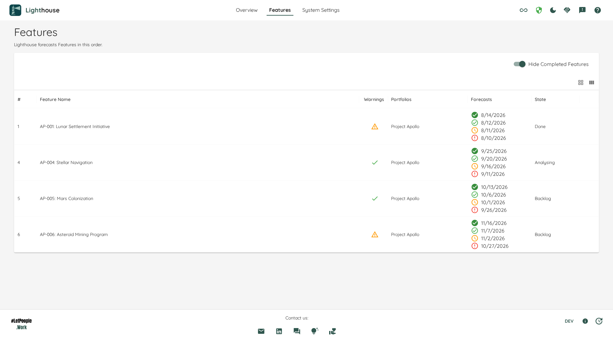

# Features

The Features page lists every Feature Lighthouse knows about, across all your Portfolios, in the order it forecasts them. You reach it from the top navigation, between *Overview* and *System Settings*.

Every other list in Lighthouse shows you a slice: the Features of one Portfolio, or the Features one Team contributes to. This page shows the whole backlog in one place, which is the only view that matches how forecasting actually works — Lighthouse always takes all Features of all Portfolios into account. See [Why the Backlog Order Matters](../concepts/howlighthouseforecasts.html#why-the-backlog-order-matters).

## The position column

The `#` column is the Feature's place in the order Lighthouse simulates, counted across the whole instance. Its heading reads *Manual* instead of `#` when Lighthouse owns the order (see below).

It is **not** the row number. Two rows shown one after the other can read `26` and `77`, and that is correct — the numbers in between belong to Features that are filtered out of your current view. Positions count:

- completed Features, which keep their place even while hidden
- Features in Portfolios you cannot see

So the position tells you where a Feature sits in the real forecast sequence, not where it sits on your screen. A Feature ordered above another gets your Teams' throughput first, which is what moves the forecasted dates.

### Where the order comes from

By default it comes from your work tracking system — the rank or backlog order your Features already carry there. Lighthouse reads it on every refresh, and never writes it back.

That also means the tracker decides: a rank someone changes there re-sequences your forecast. If you would rather Lighthouse owned the order, turn on *Feature Order* under [System Settings → Configuration](../settings/configuration.html#feature-order-premium). Nothing moves when you do — Lighthouse records the order you are already looking at — but from then on refreshes stop re-sequencing it, and this column's heading reads *Manual* so you can tell which order you are reading. Turning it back off returns your tracker's order immediately.

{: .note}
Owning the order is a [Premium](../licensing/licensing.html#licensed-features) capability. Reading it — this page and this column — is not.

## Moving a Feature

Once Lighthouse owns the order, every row carries an action menu with four moves:

- **Move to Top**
- **Move Up**
- **Move Down**
- **Move to Bottom**

The same menu appears in the Feature lists on the [Portfolio](../portfolios/detail.html#features) and [Team](../teams/detail.html#features) pages. There is one order, so a move made anywhere is the move everyone sees.

A move takes effect at once — Lighthouse re-forecasts immediately rather than waiting for the next refresh from your work tracking system.

### What "up" and "down" mean in a filtered list

**Move Up** and **Move Down** step to the neighbouring row *you can see*. Hidden completed Features and rows filtered out of your view are jumped over, not landed on. The Feature takes the place of the row it was moved past, and everything in between keeps its relative order.

The two ends are not symmetric, and this is deliberate:

- **Move to Top** puts the Feature above the first row of the list you are looking at. In a Portfolio's Feature list that is that Portfolio's first Feature, not the instance's.
- **Move to Bottom** sends the Feature to the end of the whole order, not the end of your view.

### When you cannot move something

The menu opens either way and says why the moves are unavailable:

- **A Feature shared with a Portfolio you do not run.** You need write access to *every* Portfolio a Feature belongs to, because moving it re-sequences their delivery too. The message names the blocking Portfolios you are allowed to see.
- **A Feature in no Portfolio at all.** Nobody decides where it sits.
- **The grid is sorted by another column.** Up and down have no meaning when a column decides what you are looking at. Sort by position again to move.

On an instance where Lighthouse does not own the order, or without a Premium licence, the move actions are absent entirely rather than shown greyed out.

{: .note}
The whole menu is keyboard operable, and each move announces its outcome to a screen reader — the grid re-sorting silently says nothing on its own.

### "I moved it and nothing happened"

If you move a Feature up and a lower one is still forecast to finish first, that is usually [Feature WIP](../concepts/howlighthouseforecasts.html#the-impact-of-feature-wip), not the order. Your Teams work on the top *Feature WIP* Features in parallel, so a small Feature anywhere inside that window can finish before a large one above it — and several Features can even share the same forecasted dates. The order bites at the edge of that window, not inside it.

## What you see

- **Completed Features are hidden by default.** The *Hide Completed Features* toggle reveals them. Turning it off does not renumber anything: every position stays exactly as it was, and the hidden Features simply reappear in their places.
- **Portfolio membership** is shown per row. A Feature that belongs to several Portfolios appears once and lists all of them.
- **Sorting** the grid by any other column leaves the positions untouched, so you can sort by name or state and still read where each Feature really sits.

## Who sees what

The page is available on every Lighthouse instance, including the community edition.

When authorization is enabled, the list is filtered to the Portfolios you are allowed to read. Positions are still the instance-wide ones, so the numbers you see are the same numbers a colleague with wider access would see for those Features — you simply see fewer rows.

## Feedback

We'd love to hear from you! Reach out at [contact@letpeople.work](mailto:contact@letpeople.work) or through our [Slack Channel](https://join.slack.com/t/let-people-work/shared_invite/zt-38df4z4sy-iqJEo6S8kmIgIfsgsV0J1A).
