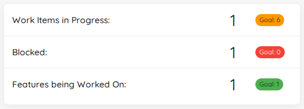
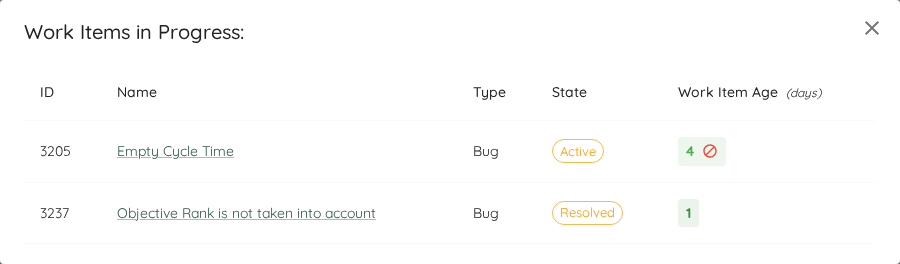
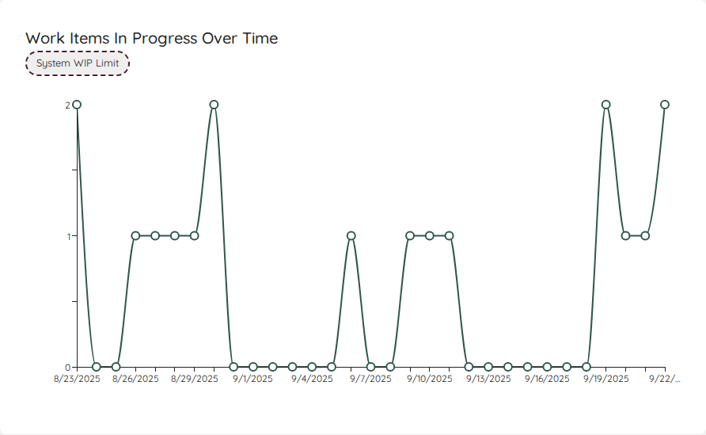
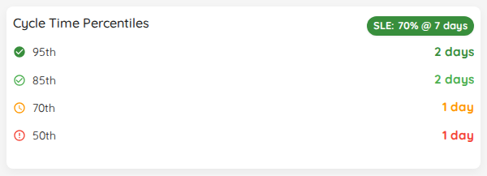
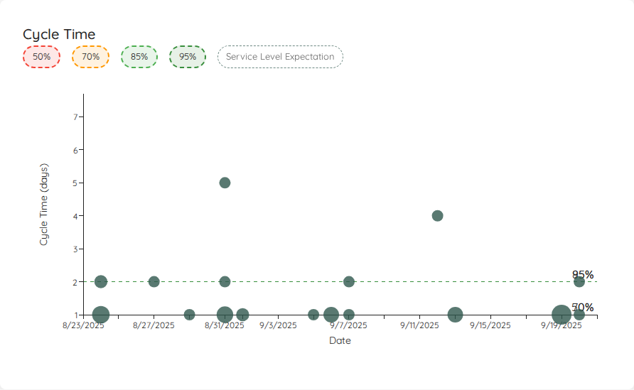

Lighthouse collects metrics about your team, so you can inspect those numbers whenever needed and create experiment to improve your efficiency, effectiveness, and predictability.

- TOC
{:toc}

# About the Metrics
In general the metrics collected are the same  (with some differences) for *Teams* and *Projects*. Lighthouse is using the respective settings of a team or project to get the information. It looks at all work items that fit your *Work Item Query*, takes into account the *Work Item Types*, and categorizes items based on the configured *States*.

{: .note}
Many metrics can only be collected on finished items. It is therefore important to make sure **not to exclude** done items in your query if you want to use the metrics.

## Flow Metrics
The foundation of the metrics are the measures of flow as defined in the [Kanban Guide](https://kanbanguides.org/english/#elementor-toc__heading-anchor-10):

{: .definition}
**Work in Progress (WIP)**: The number of work items started but not finished.  
**Throughput**: The number of work items finished per unit of time. Note the measurement of throughput is the exact count of work items.  
**Work Item Age**: The amount of elapsed time between when a work item started and the current time.  
**Cycle Time**: The amount of elapsed time between when a work item started and when a work item finished.  

Each widget will focus on one or more of those Flow Metrics.

# Filtering
You can filter for a time range of your choice when you look at metrics. By default, you'll see the last 30 days (for teams) or last 90 days (for projects). Just change start and/or end date via the date pickers, and Lighthouse will update most metrics. Some metric widgets are not affected by the time filter - read on to see which ones.

# Metrics
Following a brief overview over the various metric widgets that are available in Lighthouse.

## Work Items In Progress

|--------------|-------------------------|
| **Applies to** | Teams and Projects |
| **Flow Metric** | WIP, Work Item Age |
| **Affected by Filtering** | No |

This widget shows the total number of items in progress **right now**, based on the Work Items that are in a *Doing* state as per your configuration.

These are all the items that match your *Work Item Query* and are in a *Doing State*. You can see the total number of items in progress right now. If you want to know more details, you click on the widget, you can see the specific work items in progress, together with their *Work Item Age*.

{: .important}
This widget is **not affected** by the date filtering. It always shows the **current** Work In Progress.

## Features being Worked On

|--------------|-------------------------|
| **Applies to** | Teams |
| **Flow Metric** | WIP, Work Item Age |
| **Affected by Filtering** | No |

This widget shows the Features that are currently being worked on. As with the [Work in Progress](#work-in-progress), it shows the total, and with a click on it will reveal more details. The teams [Feature WIP](../teams/edit.html#feature-wip) is visualized as a *Goal* on the widget.

Similar to the Work in Progress widget, it is **not affected** by the date selection.

{: .note}
The number being shown here is based on the parent items that are currently *in progress*. It **does not** matter whether your Feature is in a *To Do*, *Doing*, or *Done* state. If you work on an item that links to a feature, that feature is being worked on, and it will show up here. Thus this widget is not available for *Projects*, but only for *Teams*.

## WIP Over Time

|--------------|-------------------------|
| **Applies to** | Teams and Projects |
| **Flow Metric** | WIP |
| **Affected by Filtering** | Yes |

The WIP Over Time chart shows you how the WIP evolved over the selected time range. You can spot whether you increased, decreased, or stayed stable. It also helps to see patterns in WIP.

## Started vs. Closed

|--------------|-------------------------|
| **Applies to** | Teams and Projects |
| **Flow Metric** | Throughput, WIP |
| **Affected by Filtering** | Yes |

The *Started vs. Closed* widget shows you how many items you were completing (your total Throughput) and how many items were started (also called *Arrival rate*) during the selected time frame. It will also show you how many items were closed and started on average per day with your current settings:

The goal is to quickly see whether you are having a stable WIP, or if you either start more items than you close (increasing WIP) or close more than you start (decreasing WIP). The widget includes a visual indication that shows you a *Red/Amber/Green* kind of scale, depending on how *far apart* the arrival and throughput numbers are.

As a rule of thumb, you should try to match your started items with how many items leave your process. This is where the daily average can help: If you close 1.1 items per day, you know that you should more or less start:
- 1 new item per day OR
- 5 items per week OR
- 11 items every two weeks

This can help you to prepare just enough items for your team(s). Whether you do it daily or in bigger batches (for example having a refinement session per week), using this information helps you make sure you are neither under- nor over-prepared.

## Throughput

|--------------|-------------------------|
| **Applies to** | Teams and Projects |
| **Flow Metric** | Throughput |
| **Affected by Filtering** | Yes |

To visualize the Throughput, there is a Run Chart shows the Throughput over time, sampled by days.

You can see how many items were closed each day over the last several days. The more 'stable' your throughput is, the more accurate your forecast will be.

This widget will adjust based on the selected time range.

## Cycle Time Percentiles

|--------------|-------------------------|
| **Applies to** | Teams and Projects |
| **Flow Metric** | Cycle Time |
| **Affected by Filtering** | Yes |

In this widget you can see the different percentiles of your Cycle Time. It's to get a quick view of where you stand, for example if you want to compare it to your Service Level Expectation.

## Cycle Time Scatterplot

|--------------|-------------------------|
| **Applies to** | Teams and Projects |
| **Flow Metric** | Cycle Time |
| **Affected by Filtering** | Yes |

The Scatterplot shows the individual items in a chart, where the x-axis shows the dates the items were closed, and the y-axis how long they were in progress.

This visual allows you to see patterns or outliers. Hovering over a dot will give you more information about the item, and with a click you'll get to the item in your work tracking system.

## Simplified Cumulative Flow Diagram (CFD)

|--------------|-------------------------|
| **Applies to** | Teams and Projects |
| **Flow Metric** | Cycle Time, WIP, Throughput |
| **Affected by Filtering** | Yes |

This simplified version of a Cumulative Flow Diagram shows you how many items were in which state category (*Doing* or *Done*) over the selected time period. This helps you see patterns and problems with your flow. It's a *simplified* CFD because you will not see the detailed state itself, but just the overall category.

If you enable the trend lines, the start and end points of both areas will be connected. In general you want to aim for:
1. Making the lines parallel - this means you control your WIP well. If the lines are not parallel, you either start more than you finish or finish more than you start.
2. Bring the lines closer together - this means you will decrease your Cycle Time.
3. Increase the *angle* of the lines - this means you will increase your Throughput.