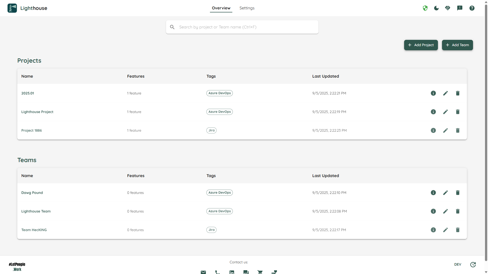

The *Overview* page is the first page that is shown if you browse to Lighthouse. It shows you all your projects that are defined and is intended, as the name suggests, to give you an overview over everything that is going on:

Every Project is visualized as a dedicated card, that has the following information on it:

- TOC
{:toc}

# Project Name
On top of every card, you can see the name of your Project. This is also a link, so you can click it and get to the [Project Detail Page](../projects/projectdetail.html) for this specific project.

# Progress and Remaining Work.
Below the Project Name, you can see how many work items are left (summed up over all the features in your project). Then you can also see what's the progress (work done divided by total work).

# Involved Teams
A project may involve one to many teams. The project overview card will show you all the teams that are involved in this project. You can click on a specific team and get to the [Team Detail Page](../teams/teamdetail.html).

# Projected Completion
The projected completion is showing when all the Features of a project are expected to be completed. It contains four different dates with different probabilities/risk levels:

| Description | Probability |
|------------|------------|
| Certain | 95% |
| Confident | 85% |
| Realistic | 70% |
| Risky | 50% |

# Last Updated Date
Every time the project is reforecasted, this date is updated. That way you always know how current the data is you are looking at.