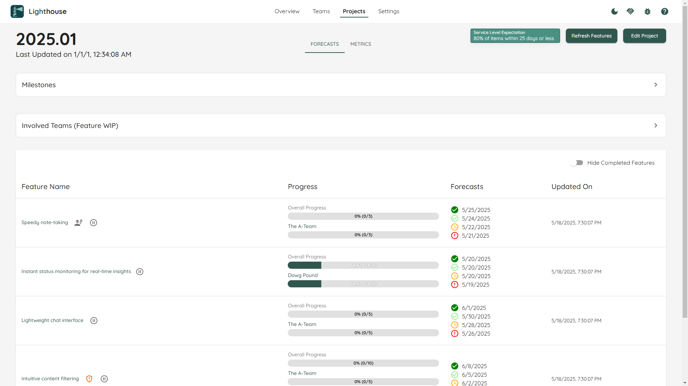
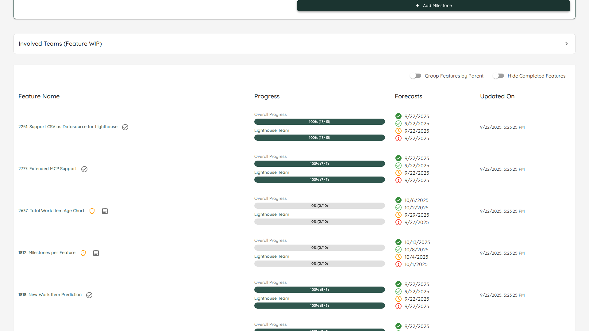

Once you have created your project, you can see all the details on this page.
                
Browse through all the features from this project and see which teams are involved, which features are being actively worked on, and what the progress as well as the projected completion is.

- TOC
{:toc}

{: .note}
You can directly go to the project detail page if you bookmark the specific URL. Even if the project name changes, the URL will stay the same.

# General Project Information
On top you can see general project information, which includes the name of the project and it was last updated.

# Refresh Features
While projects are continuously updated, you can trigger a refresh manually by clicking on the *Refresh Features* button. This will update the [Features](#features) and all associated forecasts.

A manual update can be useful if you just made significant changes (for example added new features to the projects) and do not want to wait for the periodic update to kick in.

{: .note}
After you trigger the manual update, the button *Refresh Features* will be disabled while the project is updated. Depending on the load of the server and other operations which might be in progress, it can take a while. While every context and project is different, an update should normally not take longer than two minutes.

# Edit Project
You can modify the project settings by clicking on the *Edit Project* button on the top right. This will bring you to the [Project Modification Page](./edit.html).

# Features
For every project, all the features are listed with additional details.

## Feature Order
Features are ordered based on the [order in your Work Tracking System](../../concepts/concepts.html#feature-order).

{: .important}
You **can't** reorder Features in Lighthouse itself, but have to adjust your Work Tracking System and [Refresh the Features](#refresh-features).  
The order is crucial, as Lighthouse forecasts based on the [Feature WIP of each Team](#feature-wip) from highest to lowest ordered Feature.

## Feature Name
The name of the feature. This is also a clickable link, that points to this specific item in your work tracking system.

Furthermore, there can be two indicators for each feature:
- A ⚠️ emoji symbolizes that this specific feature is using the *Default Feature Size* and is not broken down yet. Check the [Project Modification Page](./edit.html#default-feature-size) for details on what that means.
- A ⚙️ emoji symbolizes that there are child items of this specific feature that are currently being **actively** worked on (meaning they are in a [Doing State](./edit.html#states)) by any involved team.

{: .recommendation}
> In general you should be working on the top-most features, while the ones *further down* the order may not be broken down yet. If features on top are not yet broken down, this may be a signal that you should invest some time in breaking them down.  
If features towards the bottom are in progress, you may focus on the wrong thing.  
> 
> Use Lighthouse to make such things transparent and trigger a discussion around what to focus on!

## Feature Progress
In the progress column, you can see how many items are done and how many are pending for this feature. This is split by the total amount for the feature and a more detailed view for every involved team.

{: .note}
If a team is working solo on a feature, both bars will show the same numbers.

## Forecasts
For each Feature you will see the forecasted completion date. You'll get [four different probabilities](../overview/overview.html#projected-completion), from *Certain* to *Risky*. Naturally, the riskier the forecast, the earlier the projected completion.

{: .note}
The completion dates of each feature will take into account **all teams** that are involved. If a single item is planned to be done by one team, but this is far down their priority, this will mean that the feature completion will be moving backwards. Lighthouse cares about delivering complete features. You may be able to use such scenarios to kick off a discussion about how work or teams are sliced (as less dependencies mean more effective delivery).

## Milestone Probability
If you have [Milestones](#milestones) defined, you will see the likelihood to get the Feature done in time for each milestone.

# Milestones  

{: .definition}
Milestones are relevant events that have a specific date.

You can define Milestones as you please when using Lighthouse. This works via the [Edit Page of a Project](./edit.html#milestones) or directly in the Project Detail. Simply give it a name and a date, and Lighthouse will automatically add it to the Feature View and display the [Milestone Probability](#milestone-probability):

We know sometimes life happens, and things may shift. You can always adjust the date of a milestone. When doing so, Lighthousue will automatically reforecast and update the probabilities.

{: .note}
Milestones that are in the past will not be displayed in the Features to save space.

# Feature WIP
[Lighthouse forecasts](../../concepts/howlighthouseforecasts.html) based on the [Order](#feature-order) and the [Feature WIP](../teams/edit.html#feature-wip) of each involved team. You can change this via the [Edit Page of a Team](../teams/edit.html#feature-wip) or directly in the Project Detail View. If you expand the *Involved Teams (Feature WIP)* box, you can see the current Feature WIP for each team of this project.  

You can adjust the Feature WIP, and it will automatically reforecast the completion dates and likelihoods for each milestone:

If you compare the above picture to the one in [Milestones](#milestones), you can see that adjusting the Feature WIP for *The A-Team* from 1 to 3 caused the probabilities to change. In general, increasing the Feature WIP will mean that *lower ordered* features will be completed sooner, while *higher ordered features* take longer to finish.  
A Feature WIP of 1 means, the team will **only** work on the top most feature, and move to the next one only when this is all done. The single focus of this team is on one feature.  
On the other side of the extreme, if we have a Feature WIP of 10, we will split our efforts across ten things, dilluting any kind of focus, and doing many things in parallel.

{: .recommendation}
You should strive for a Feature WIP that is as low as possible, ideally 1 or 2. However, if your reality looks different, it makes more sense to set Lighthouse up accordingly, as otherwise the forecasts will be off.  
You may use Lighthouse to make it transparent what a change in Feature WIP can mean in terms of Feature delivery, which could be a good conversation starter to make a change.

{: .note}
If a team is configured to [Automatically Adjust Feature WIP](../teams/edit.html#automatically-adjust-feature-wip), you can still change the settings manually. However, they will be overridden the next time the Team Data will be updated.

