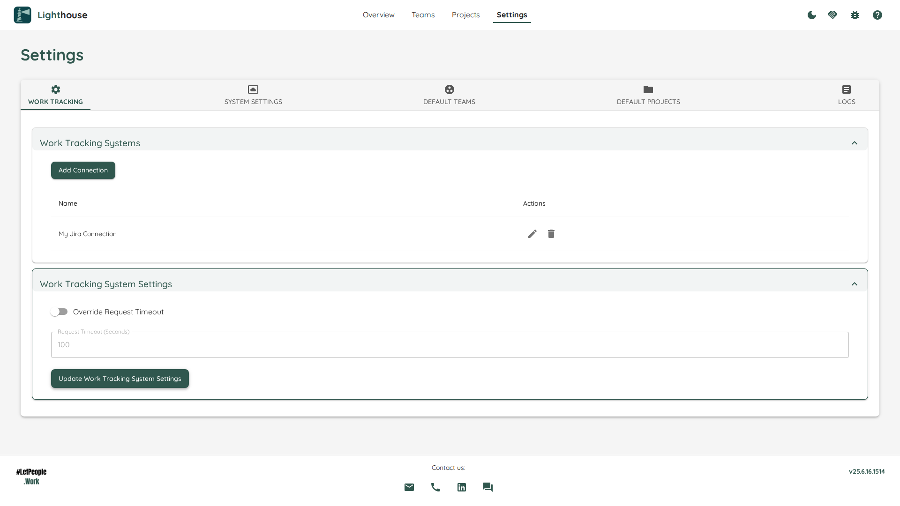
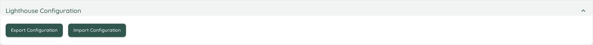
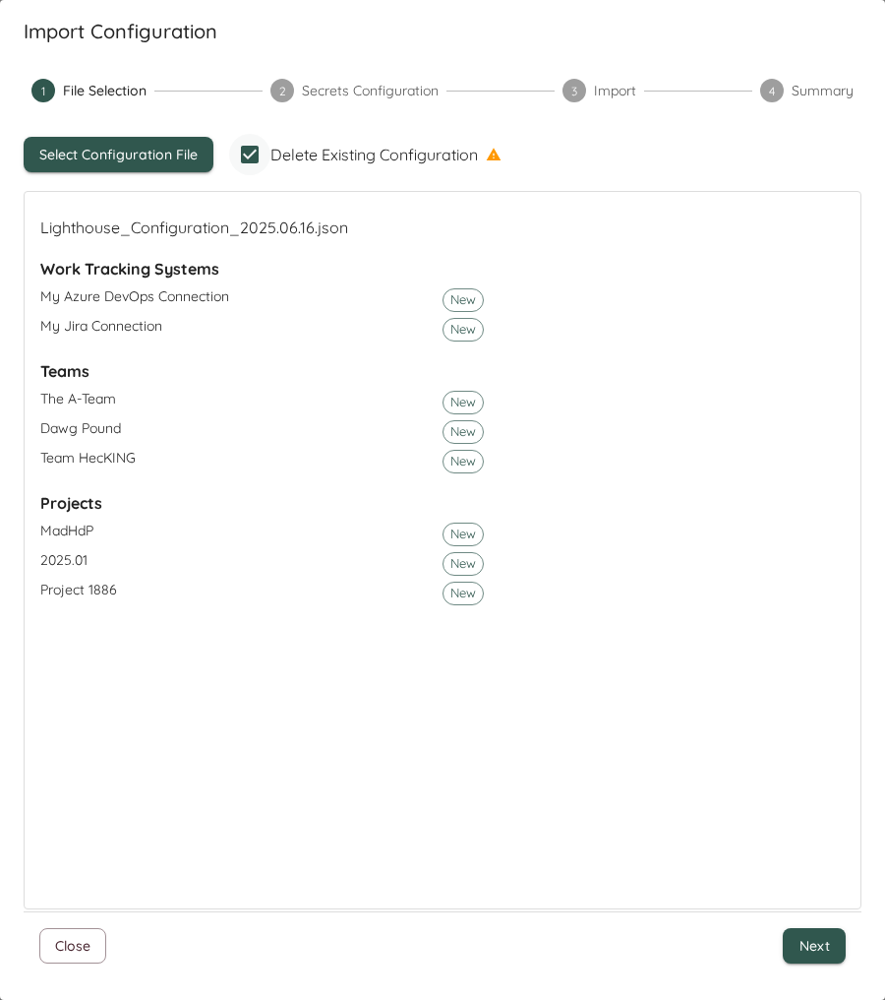
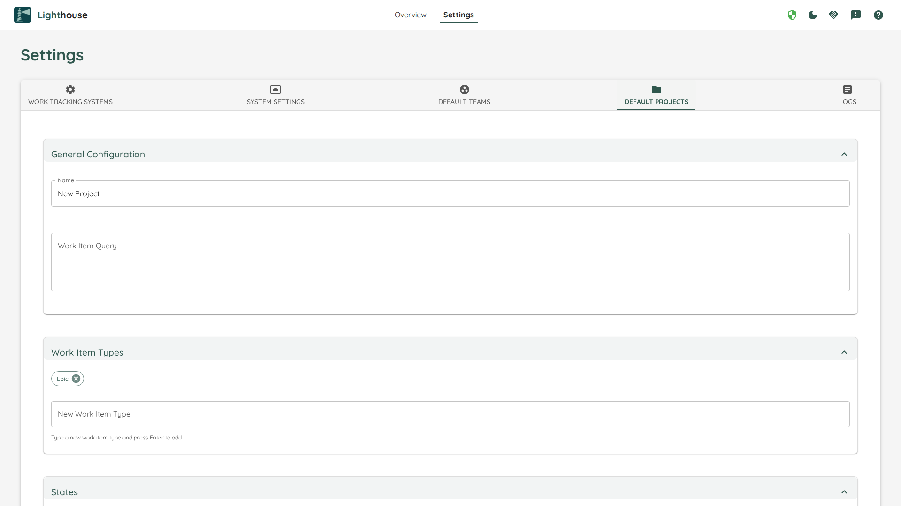
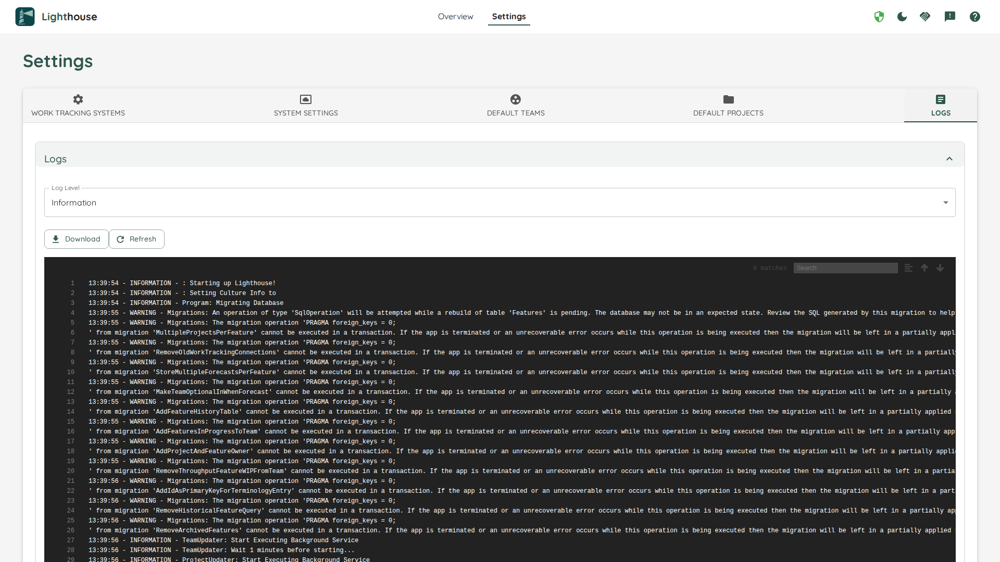

Lighthouse has various options to fine-tune it based on your needs. This page lists what can be configured via the Lighthouse settings page:

- TOC
{:toc}

# Work Tracking Systems
While you can add new Work Tracking Systems via the [Teams](../teams/edit.html#work-tracking-system) and [Project Creation Pages](../projects/edit.html#work-tracking-system), you can manage all Work Tracking Systems via the settings.

## Adding New Work Tracking Systems
You can set up new Connections via the *Add Connection* button, and have to provide the details according to the selected Work Tracking System Type.
See [the concepts](../../concepts/concepts.html#work-tracking-system) for more details and how to specify it for your specific system.

## Modifying Existing Systems
It may happen that you want to adjust your existing connections. For example if the URL changes, you want to adjust your connection details (due to an updated token), or simply want to rename it.
You can do so by clicking on the 🖊️ icon on the right side of the work tracking system, and then adjust your settings as needed.

{: .important}
As the secret information (like API Tokens) are not available to the end user, you will **always** have to provide this information again on any change.

## Deleting Systems
You can also delete Work Tracking Systems if they are not needed anymore. To do so, you can click on the 🗑️ icon on the right side of the work tracking system. This will permantenly delete this work tracking system.

{: .note}
You can only delete a Work Tracking System if no team and project is using this. Either remove those teams and projects, or change them to use a different work tracking system.

# System Settings
The System Settings Page shows some generally applicable settings that affect the overall Lighthouse behaviour.

## Lighthouse Configuration
This section allows you to export your configuration to a file, as well as import it back into your Lighthouse instance.

### Export
The export can be useful for various reasons:
- As a backup of your configuration
- To share a configuration with colleagues

When you click export, Lighthouse will create a *.json* file that includes the full configuration of your Lighthouse instance. The configuration includes:
- Work Tracking Systems
- Teams
- Projects

The export does *not* include any data (work items, features, metrics, etc.) for any team or project. It's just the settings itself. If you fetch the data from your work tracking system, you should then see the same information.

As the config is stored as a file, you can easily share it, as well as store it in a version control system.

{: .important}
The exported file does **not** include any secrets. Your work tracking systems api keys will not be exported. They will have to be entered on import.

### Import

#### File Selection
To start the import, you got to select a *.json* file. Lighthouse will then guide you through the configuration.

As a first step, Lighthouse will check if the file is valid. If it can't read it for whatever reason, it will not allow an import and display an error message.

If it can be read, it will check whether the the Work Tracking Systems, Teams, and Projects are new or exist already. An update of an existing item will mean that the data is kept, and the settings like *work item query*, *states configuration*, etc. will be updated.

{: .note}
The detection whether something exists already is done via checking the name. The name has to match exactly.

You can also chose to *Clear* the existing configuration. This means, all Work Tracking Systems, Teams, and Projects that you may have configured will be removed as part of the import process.

#### Secrets Configuration
If a new work tracking system is added, you'll have to specify all options that are secret on import (for example API Tokens). This makes sure that, while we can share the configuration, you will not share access tokens and reuse the token from another person.

#### Import
Once you've validated the secrets, you can start the import. Please note that this might take a while, depending on the size of your configuration.

{: .important}
Once you have started the import, you can't undo the changes!

#### Import Summary
After you've imported, you'll see a summary and potential errors or problems. For every imported item, a validation is run to check whether it worked. If the validation failed, it means the import worked but some setting may need to be adjusted.

At the end, you can choose whether you want to update all imported Teams and Projects or just close the dialog. If you decide to not update, you will not have any data for some time, until the period update kicks in. This may be desired if you want to double check the settings first (for example in case of validation errors).

## Optional Features
Some features might not make sense to be enabled in all situations. And occasionally some new features will be deployed with the latest version of Lighthouse that we deem not ready for general use. In such a case you would find a toggle in the *Optional Features* setting which you can selectively enable or disable.

Eventually, the Features in preview will be integrated into the regular functionality, and the preview flag will be removed. In rare cases, a preview feature might get removed.

{: .recommendation}
While preview features should be relatively stable, it can be that they will not work perfectly yet. If you enable them and encounter issues, please let us know about it. We're looking forward to your feedback!

## Periodic Refresh Settings
One of the main advantages of Lighthouse is the fact that it's not only offering to run the forecasts on demand, but also **continuously**. To fine-tune this, you can adjust the several settings:

### Refresh Types
There are two types of refreshes:
- Team
- Feature

The Team refresh fetches all items related to your team, and is doing what can manually be done via the [Update Team Data Button](../teams/detail.html#update-team-data), while the Features relate to the different projects and is doing what can be manually trigger via the [Refresh Feature Button](../projects/detail.html#refresh-features).

### Setting Details
Each refresh type contains three different settings. All settings are specified in minutes. After adjusting the setting, the *Update Settings* button must be pressed for the changes to become effective.

| Name | Description |
|------|-------------|
| Interval (Minutes) | The time between checks if the data should be updated. This means, after *x minutes* Lighthouse will check if the last update was older than what was defined in *Refresh After*. |
| Refresh After (Minutes) | The time after which a refresh will be triggered if the last one was more than this time ago. |
| Start Delay (Minutes) | The delay before the background task is started when the application starts. This can be useful as you may not want to trigger updates just after startup. |

## Data Retention
Lighthouse stores Feature data in order to process/visualize it later on. The data includes the forecast for this feature, how many items were pending and how many were done, and which teams were involved.

This settings allows you to define how many entries you want to keep. Older entries will be deleted from Lighthouse permanently.

{: .note}
Setting this to a lower number can help you save space, especially if you have many projects in one Lighthouse instance.

# Default Team Settings
To simplify [Team Creation](../teams/edit.html), you can adjust the default values that are used when you create a new team. While not all settings can be changed, you preconfigure many different settings to make the creation process smoother.

This should help to prevent common mistakes (for example when you configure [States](../teams/edit.html#states) and [Work Item Types](../teams/edit.html#work-item-types)) under the assumption that certain things will look the same for most of your teams.

{: .note}
You can't validate the default settings, as there is not enough information to do that.
You must hit the *Save* button at the bottom of the page for the changes to become effective.

{: .recommendation}
We recommend to create one team, as you can validate all the settings. After this, we suggest to go and adjust the default settings accordingly, to make future team creation more effective.

# Default Project Settings
Similarly to the [Default Team Settings](#default-team-settings), you can adjust the default values for the [Project Creation](../projects/edit.html). While not all settings can be changed, you preconfigure many different settings to make the creation process smoother.

This should help to prevent common mistakes (for example when you configure [States](../projects/edit.html#states) and [Work Item Types](../projects/edit.html#work-item-types)) under the assumption that certain things will look the same for most of your projects.

{: .note}
You can't validate the default settings, as there is not enough information to do that.
You must hit the *Save* button at the bottom of the page for the changes to become effective.

{: .recommendation}
We recommend to create one project, as you can validate all the settings. After this, we suggest to go and adjust the default settings accordingly, to make future project creation more effective.

# Logs
We really hope you don't need this...but then again, Software is complex and it's very possible that once you run into a problem and need some more details on what was going on (or we ask for this info to better find the problem).  
For this case, you can check the *Logs*.

## Log Level
Log levels describe the level of detail that should end up in the log. The more "sensitive", the more messages will be added. Following *Log Levels* can be selected:

| Level | Description |
|-------|-------------|
| Verbose | Most detailed logging level, includes all messages |
| Debug | Includes detailed information useful for debugging |
| Information | General information about application flow |
| Warning | Potentially harmful situations that aren't errors |
| Error | Error events that might still allow the application to continue |
| Fatal | Very severe errors that will terminate the application |

{: .recommendation}
For normal operations, we recommend to keep the log level at *Warning* or *Information*. *Debug* and *Verbose* should only be used selectively to analyze errors, as otherwise the log will grow a lot, and most likely you'll have too much information in there for it to be truly useful.

## View Logs
You can check the *Live Logs* in the built-in Log View. This also supports a *Search* with syntax highlighting, for example if you want to find a specific feature by name or ID.

{: .note}
The latest logs are the **bottom** of the Log Viewer. So for newer things you have to scroll down

The logs won't be updated automatically. If you want to get the latest ones, hit the *Refresh* button and the viewer will reload the latest ones.

## Download
For a quick glance, the built-in [Log Viewer](#view-logs) is nice. However, for some extended analysis or to provide Logs to other people (for example as part of a bug report), you can download the full Log file. Simply hit the *Download* button, and the file will be downloaded to your computer.