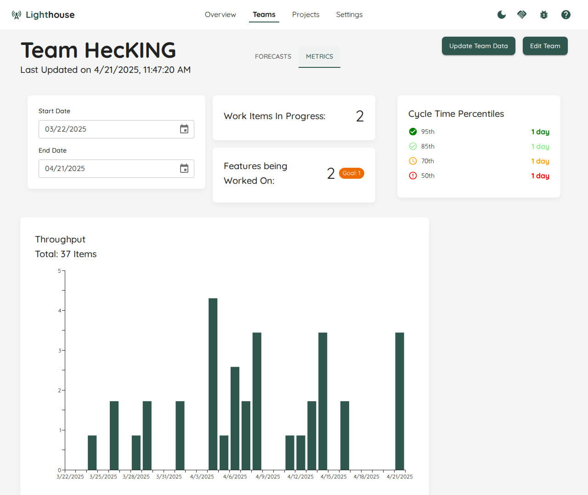

Once you have created your team, you can see all the details on this page. It's split into *Forecasts* and *Metrics*.

In the [Forecasts Tab](#forecasts), you can browse through all the features from the various projects the team is involved in, and see how many items are left to do for this team in each feature. Furthermore, you can run manual forecasts.
In the [Metrics Tab](#metrics), you can see various charts for Metrics for this team.

- TOC
{:toc}

{: .note}
You can directly go to the team detail page if you bookmark the specific URL. Even if the team name changes, the URL will stay the same.

# General Team Information and Actions
On top you can see general team information, which includes the Team name, an indication if a [fixed Throughput](./edit.html#throughput-start-and-end-date) is used, and when it was the last time this team was updated.

## Update Team Data
While teams are continuously updated, you can trigger an update manually by clicking on the *Update Team Data* button. This will update all data related to the team, including the forecasts for any project the team is involved in, as well as the Metrics.

A manual update can be useful if you just made significant changes (for example closed a couple of item for this team) and do not want to wait for the periodic update to kick in.

{: .note}
After you trigger the manual update, the button *Update Team Data* will be disabled while the team is updated. Depending on the load of the server and other operations which might be in progress, it can take a while. While every context and team is different, a team data update should normally not take longer than ~60~ seconds. If it does, please reach out to us via Slack, so we can analyze and propose improvements and adjust Lighthouse to be more performant.

## Edit Team
You can modify the team settings by clicking on the *Edit Team* button on the top right. This will bring you to the [Team Modification Page](./edit.html).

# Forecasts
The *Forecasts* section is the default section. It shows you all things related to forecasting for this specific team.

## Features
If a team is involved in one (or more) projects, all the features where this specific team has work for in their backlog are listed.

For every feature, you can see the following details.

### Feature Name
The name of the feature. This is also a clickable link, that points to this specific item in your work tracking system.

Furthermore, there can be two indicators for each feature:
- A ⚠️ emoji symbolizes that this specific feature is using the *Default Feature Size* and is not broken down yet. Check the [Project Modification Page](../projects/edit.html#default-feature-size) for details on what that means.
- A ⚙️ emoji symbolizes that there are child items of this specific feature that are currently being **actively** worked on (meaning they are in a [Doing State](./edit.html#states)) by this team.

### Feature Progress
In the progress column, you can see how many items are done and how many are pending for this feature. This is split by the total amount (containing all  items that including the ones from other teams working on the same feature) and items that are specifically relevant for the current team.

{: .note}
If a team is working solo on a feature, both bars will show the same numbers. If not, this means at least one other team is involved in this feature.

### Feature Forecasts
For each Feature you will see the forecasted completion date. You'll get [four different probabilities](../overview/overview.html#projected-completion), from *Certain* to *Risky*.

{: .note}
The completion dates of each feature will take into account **all teams** that are involved, not just the one you are currently looking at.

## Manual Forecasts
Based on the team's [throughput](#metrics), you can run [Monte Carlo Simulations](../../concepts/montecarlosimulations.html) to answer two important questions for many teams and organizations.

Both questions will be answered with a forecast, which means you'll get multiple results that vary in probability, from certain (95% likelihood) to risky (50% likelihood).
Additionally, you'll also get the likelihood of closing the specified number of items by the set target date.

### When
The first question is: When will 'x' items be done? If you have a certain number of items (e.g., remaining for a feature, part of the sprint goal, etc.), you might want to know when you can expect them to be completed.

### How Many
The second question is: How many items will you get done by a certain date? You might have an important customer visit coming up, or simply want to know what is a sensible number of items to plan for in your next sprint.

### Usage
Forecasts done on team-level are *on-demand*, meaning you have to trigger them as needed. Only forecasts for projects will be re-run continuously. This is still useful if you want to quickly check something without setting up a full project. Examples could be:
- How much will fit into the next Sprint (for example as preparation for a Sprint Planning)
- When will this Feature most likely be done?
- Will an additional feature fit for a release without having to move a target date?

# Metrics
Lighthouse collects metrics about your team, so you can inspect those numbers whenever needed and create experiment to improve your efficiency, effectiveness, and predictability. You can filter the time frame you are interested in via the date pickers, as soon as you change them, the data will be updated.

Following a brief overview over the various metrics that are supported.

## Work in Progress (WIP)
There are different visuals for the WIP.

{: .definition}
**WIP**: The number of work items started but not finished. - [The Kanban Guide](https://kanbanguides.org/english/)

### Total Work In Progress
This widget shows the total number of items in progress right now. These are all the items that match your [Work Item Query](./edit.html#work-item-query) and are in a [Doing State](./edit.html#states). You can see the total number of items in progress right now. If you want to know more details, you click on the widget, you can see the specific work items in progress.

{: .important}
This widget is **not affected** by the date selection. It always shows the **current** Work In Progress.

### Features being Worked On
This widget shows the Features that are currently being worked on. As with the [Work in Progress](#work-in-progress), it shows the total, and with a click on it will reveal more details. The teams [Feature WIP](./edit.html#feature-wip) is visualized as a *Goal* on the widget.

Similar to the Work in Progress widget, it is **not affected** by the date selection.

{: .note}
The number being shown here is based on the parent items that are currently [in progress](#work-in-progress). It **does not** matter whether your Feature is in a *To Do*, *Doing*, or *Done* state. If you work on an item that links to a feature, that feature is being worked on, and it will show up here.

### WIP Run Chart
The WIP Over Time chart shows you how the WIP evolved over the selected time range. You can spot whether you increased, decreased, or stayed stable. It also helps to see patterns in WIP.

## Throughput
To visualize the Throughput, there is a Run Chart shows the Throughput over time, sampled by days.

{: .definition}
**Throughput**: The number of work items finished per unit of time. Note the measurement of throughput is the exact count of work items. - [The Kanban Guide](https://kanbanguides.org/english/)  
This is the input for the forecasts done in Lighthouse.
                
You can see how many items were closed each day over the last several days. The more 'stable' your throughput is, the more accurate your forecast will be.

This widget will adjust based on the selected time range.

## Cycle Time
There are two widgets revolving around the Cycle Time. One shows the percentiles, and one the individual items. Both widgets are showing the data based on the selected time range.

{: .definition}
**Cycle Time**: The amount of elapsed time between when a work item started and when a work item finished. - [The Kanban Guide](https://kanbanguides.org/english/)

### Percentiles
In this widget you can see the different percentiles of your Cycle Time. It's to get a quick view of where you stand, for example if you want to compare it to your Service Level Expectation.

### Scatterplot
The Scatterplot shows the individual items in a chart, where the x-axis shows the dates the items were closed, and the y-axis how long they were in progress.

This visual allows you to see patterns or outliers. Hovering over a dot will give you more information about the item, and with a click you'll get to the item in your work tracking system.