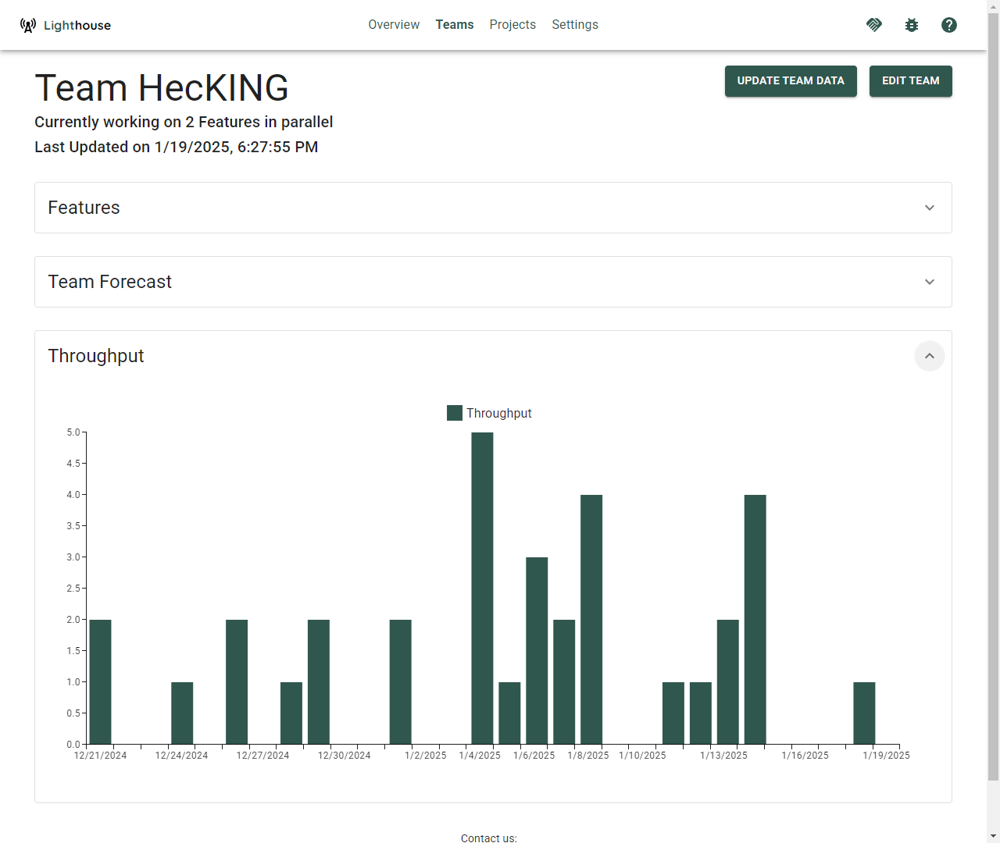

Once you have created your team, you can see all the details on this page.
                
Browse through all the features from the various projects the team is involved in, and see how many items are left to do for this team in each feature. Furthermore, you can inspect the team's throughput (how many items they closed per day) and run manual forecasts.

- TOC
{:toc}

{: .note}
You can directly go to the team detail page if you bookmark the specific URL. Even if the team name changes, the URL will stay the same.

# General Team Information
On top you can see general team information, which includes the Team name, how many features they are currently working on in parallel (based on the data from your Work Tracking System), and when it was the last time this team was updated.

# Update Team Data
While teams are continuously updated, you can trigger an update manually by clicking on the *Update Team Data* button. This will update the [General Information](#general-team-information) as well as the [Throughput](#throughput).

{: .note}
The [Features](#features) are not re-forecasted upon a team update. Please go to the [Project Details](../projects/detail.html) to manually trigger an update of the project forecasts.

A manual update can be useful if you just made significant changes (for example closed a couple of item for this team) and do not want to wait for the periodic update to kick in.

{: .note}
After you trigger the manual update, the button *Update Team Data* will be disabled while the team is updated. Depending on the load of the server and other operations which might be in progress, it can take a while. While every context and team is different, a team data update should normally not take longer than 30 seconds.

# Edit Team
You can modify the team settings by clicking on the *Edit Team* button on the top right. This will bring you to the [Team Modification Page](./edit.html).

# Features
If a team is involved in one (or more) projects, all the features where this specific team has work for in their backlog are listed.

For every feature, you can see the following details.

## Feature Name
The name of the feature. This is also a clickable link, that points to this specific item in your work tracking system.

Furthermore, there can be two indicators for each feature:
- A ⚠️ emoji symbolizes that this specific feature is using the *Default Feature Size* and is not broken down yet. Check the [Project Modification Page](../projects/edit.html#default-feature-size) for details on what that means.
- A ⚙️ emoji symbolizes that there are child items of this specific feature that are currently being **actively** worked on (meaning they are in a [Doing State](./edit.html#states)) by this team.

## Feature Progress
In the progress column, you can see how many items are done and how many are pending for this feature. This is split by the total amount (containing all  items that including the ones from other teams working on the same feature) and items that are specifically relevant for the current team.

{: .note}
If a team is working solo on a feature, both bars will show the same numbers. If not, this means at least one other team is involved in this feature.

## Feature Forecasts
For each Feature you will see the forecasted completion date. You'll get [four different probabilities](../overview/overview.html#projected-completion), from *Certain* to *Risky*.

{: .note}
The completion dates of each feature will take into account **all teams** that are involved, not just the one you are currently looking at.

# Manual Forecasts
Based on the team's [throughput](#throughput), you can run [Monte Carlo Simulations](../../concepts/montecarlosimulations.html) to answer two important questions for many teams and organizations.

Both questions will be answered with a forecast, which means you'll get multiple results that vary in probability, from certain (95% likelihood) to risky (50% likelihood).
Additionally, you'll also get the likelihood of closing the specified number of items by the set target date.

## When
The first question is: When will 'x' items be done? If you have a certain number of items (e.g., remaining for a feature, part of the sprint goal, etc.), you might want to know when you can expect them to be completed.

## How Many
The second question is: How many items will you get done by a certain date? You might have an important customer visit coming up, or simply want to know what is a sensible number of items to plan for in your next sprint.

## Usage
Forecasts done on team-level are *on-demand*, meaning you have to trigger them as needed. Only forecasts for projects will be re-run continuously. This is still useful if you want to quickly check something without setting up a full project. Examples could be:
- How much will fit into the next Sprint (for example as preparation for a Sprint Planning)
- When will this Feature most likely be done?
- Will an additional feature fit for a release without having to move a target date?

# Throughput
Here you can see your Throughput over the period you defined it in the [Team Settings](./edit.html#throughput-history).

{: .definition}
Throughput is the historical performance of the team, measured in items closed per unit of time, and is the input to any forecast done within Lighthouse.
                
You can see how many items were closed each day over the last several days. The more 'stable' your throughput is, the more accurate your forecast will be.

