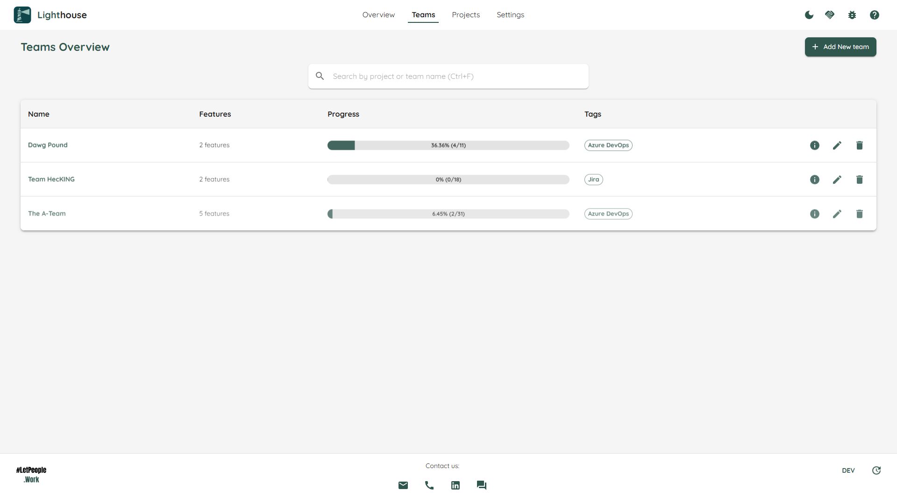
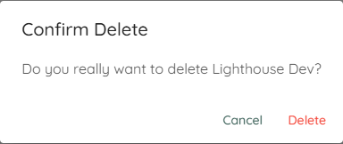

The *Team Overview* page shows you all teams that are defined. , as the name suggests, to give you an overview over everything that is going on. You can do the following things from this page:

- TOC
{:toc}

# Gain an Overview
The overview, as the name suggests, shows you a rough overview over all the teams. You can see which teams are defined, how many Features they are contributing to (based on the the features in all defined projects), how many work items they working on in total and how many items were already closed.

# Create a new Team
If you want to create a new team, click on the *Add New* button on top. That will bring you to the [Team Creation Page](./edit.html).

# Navigate to the Team Details
If you want to see more details for a specific team, either click on the ℹ️ icon on the right side of the team or the team name to navigate to the [Team Details](./detail.html).

# Modify an existing Team
If you want to modify the settings of an existing team, click on the 🖊️ icon on the right side of the team. This will bring you to the [Team Modification Page](./edit.html).

# Delete a Team
If you want to delete a team, you can click on the 🗑️ icon on the right side of the team. This will permantenly delete this team.

{: .important}
Deleting a team will remove from Lighthouse with no functionality to undo this change. This will also remove the team from all the involved projects. Ideally you make sure that this team is not involved in any projects before you delete it.

{: .note}
You can always add a team again using the same queries. Deleting a team has no effect at all on the data in your Work Tracking System.