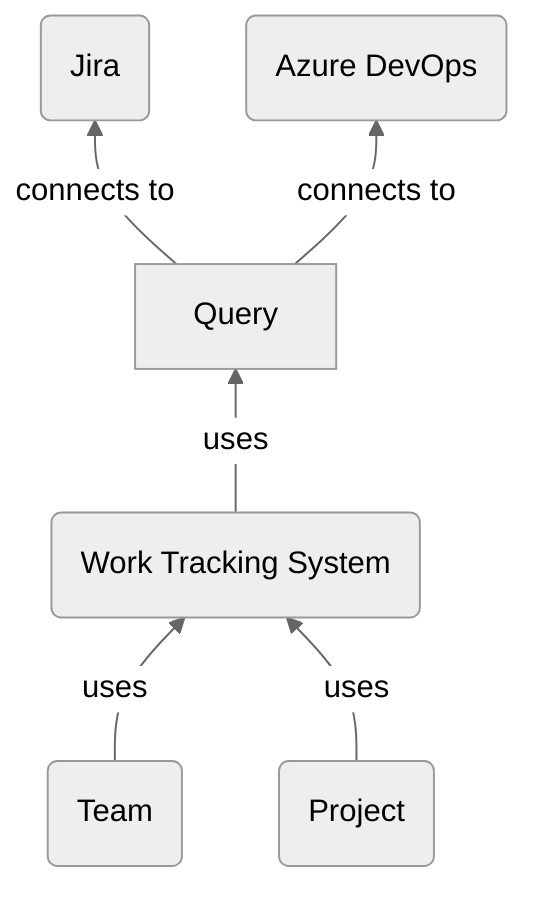

This section will give you a brief overview over how to set up Lighthouse with connections to your work tracking system, add teams and create projects.

Lighthouse currently works with [Jira](./jira.html) and [Azure DevOps](./azuredevops.html). Check out the dedicated subpages for details on how to configure it Lighthouse for the respective systems.

- TOC
{:toc}

Once you're done with the basics, check out the detailed description of the [Features](../features/features.html).

# Overview
Lighthouse has a few basic components that you need to be aware of:
- Work Tracking Systems that define how to connect to your systems
- Queries are how you can filter data for Teams and Projects
- Team are entities that have a Throughput and work on a dedicated backlog
- Projects are having Features where one or more teams work on

The following chart shows those building blocks and how they interact.

# Work Tracking System

# Query

# Add Team

# Add Project