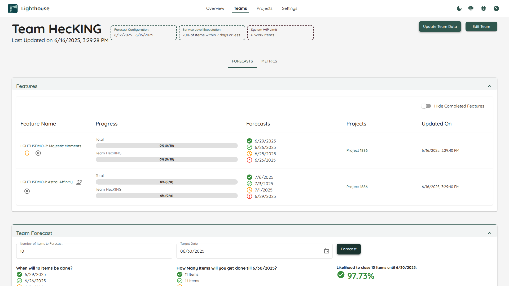

Lighthouse is a tool that helps you run probabilistic forecasts using Monte Carlo Simulations in a continuous and simple way. It connects to your Work Tracking Tool (currently Jira, Azure DevOps, and CSV are supported) and will automatically update your team's Throughput and your project's forecasted delivery dates.

    

You can use it with a single team for doing manual "When" and "How Many" forecasts, as well as for tracking projects with one or multiple teams.

Lighthouse is provided free of charge as open-source software by [Let People Work](https://letpeople.work). If you want to learn more about the tool, what we can offer you and your company, or just want to chat, [please reach out](https://letpeople.work#contact).

## Documentation Structure
The documentation is structured into chapters. In [Installation](./installation/installation.html) you can find information about how to get started with setting up Lighthouse.

Under [Configuration](./installation/configuration.html) you'll find all options that are supported. This includes various ways of how to configure Lighthouse itself, as well as how you can connect to Work Tracking Systems like Jira and Azure DevOps.

[Concepts](./concepts/concepts.html) guides you with your first steps in Lighthouse. For specific product areas see the top-level sections: [Teams](./teams/teams.html), [Projects](./projects/projects.html), [Metrics](./metrics/metrics.html), [AI Integration](./aiintegration.html), and [Settings](./settings/settings.html).

In [FAQ](./faq/faq.html) you find frequently asked questions.

## Contributions
If you want to help us improve the documentation, please check out the options unde [Contributions](./contributions/contributions.html).