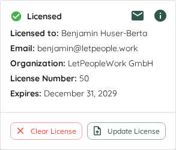
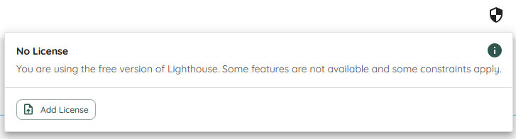
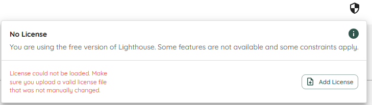
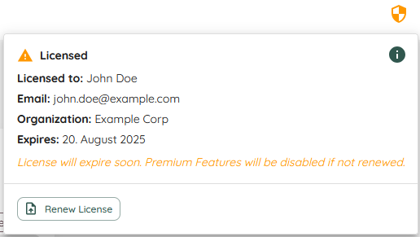
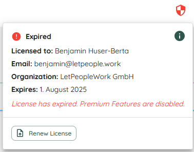

# Two different licenses

Two separate things on this page are called a "license", and they are not related:

- **The source code license** governs what you may do with Lighthouse's source code. It applies to everyone. That is the section immediately below.
- **The premium license key** is the *license.json* file you buy to unlock premium capabilities. Everything from *About Licenses* onwards is about that.

# The source code license

Lighthouse is **source available**. The source is public on GitHub, you can read it, run it, audit it and change it for your own use. It is not open source under the Open Source Initiative's definition, and it is not closed.

## What changed, and when

Lighthouse was published under the MIT License from 2025 until **v26.9.9.9**, released on 9 September 2026. Everything up to and including that release **remains MIT licensed in perpetuity** — that does not change, and it is not retroactive. If you are running one of those versions, or hold a copy or a fork of one, your rights under the MIT License are untouched.

Source from after that point is under the Lighthouse Source Available License 1.0. The full text is in the [LICENSE file](https://github.com/LetPeopleWork/Lighthouse/blob/main/LICENSE).

## What it means if you run Lighthouse

For almost everyone, nothing changes. You can still:

- run Lighthouse on your own infrastructure, for as many people in your company as you like;
- read and audit every line of the source — which is what makes "your data never leaves your network" a checkable claim rather than a promise;
- change the code for your own needs, as much as you like, and run your modified version;
- use a code assistant to help you do it.

The restrictions are about what you may provide to **other people**, not about what you do with your own instance.

## Allowed, and not allowed

These examples are guidance to help you find the boundary. They do not expand or restrict the rights the LICENSE file grants — where an example and the LICENSE disagree, the LICENSE governs.

**Allowed**

| You want to | Fine? |
|---|---|
| Run Lighthouse for your whole company from one instance | Yes |
| Modify Lighthouse heavily and run your own version internally | Yes |
| Use a code assistant or AI agent to make those modifications | Yes |
| Write a plugin or extension for Lighthouse | Yes |
| Integrate Lighthouse with another tool you use | Yes |
| Build a dashboard or report that consumes Lighthouse's output or API | Yes |
| Fork the repository and keep your changes to yourself | Yes |
| Read, study and test the source to understand how it works | Yes — and no license can take that right away |
| Install, configure, operate, train on or consult about Lighthouse **on a client's own deployment** | Yes |
| Analyze a client's data on **your own** instance and hand them the forecast, report or advice | Yes |

**Not allowed**

| Someone wants to | Why not |
|---|---|
| Offer Lighthouse, or a modified Lighthouse, as a hosted or managed service to others | It is a hosted service built on our software |
| Run Lighthouse **for** a client, on infrastructure you control, so they get access rather than running it | Same reason — the client must run their own instance |
| Give a client a login, a shared dashboard, or an embedded view of *your* instance | Same reason — they are getting access to the software, not your analysis of their data |
| Remove or bypass the license key check, or hide the features it protects | Named directly in the license |
| Remove or alter the licensing and copyright notices | Named directly in the license |
| Build a separate forecasting product out of Lighthouse's source that replaces it | It is a competing substitute — and this holds even if it is free, even if it is only used inside one company, and even if it is rewritten in a different language |
| Feed the source to an AI to produce any of the above | The result is what matters, not how it was produced |

{: .note}
> If you are a consultant or coach working with Lighthouse, both of these are explicitly permitted, and stay permitted even though we offer such services ourselves:
>
> - helping a client set up, run and get value from **their own** Lighthouse deployment; and
> - pulling a client's data into **your own** instance, and handing them the forecast, report or advice that comes out of it.
>
> The line is what the client ends up with. Your analysis of their data is your work product. Access to a running Lighthouse is the software itself, and giving them that — a login, a shared dashboard, an embedded view — makes your instance a hosted service for them, which is not permitted.
>
> Two practical notes for that second case. A premium license covers the **organization that bought it**, so your own instance is covered by your license; a client running their own instance needs their own. And pulling a client's delivery data onto your infrastructure is a data-protection question as well as a licensing one — our "your data never leaves your network" claim is about *their* network, so agree that move with them in writing.

**If you are not sure**, ask us at [letpeople.work](https://letpeople.work#contact){:target="_blank"}. A question is cheaper for both of us than a guess.

## Why we changed it

The short version: publishing the source is how we let you verify that Lighthouse keeps your delivery data on your own infrastructure, and we want to keep doing that. What we did not intend was to hand someone a complete forecasting product to resell, or to make the paid tier trivially removable. The MIT License permitted both. This one does not, and changes nothing else.

There is a free Community edition, and there always will be.

# About Licenses
Lighthouse is free to use in the basic version, and certain features require a license key. The license key can be acquired through the https://letpeople.work website.

A license unlocks [Premium Capabilities](#licensed-features) that are aimed at enterprises and make your life easier if you want to scale the usage of Lighthouse.

The revenue we are making through the licenses fund the development, and most of the premium features will eventually be made available in the free version as well.

After you purchased a license through our website, you will get an email with your license which comes in form of a *license.json* file. This license file than can be loaded in your Lighthouse instance and will instantly unlock the premium capabilities of this instance.

{: .important}
Be aware that **any** manual modification in the license file will lead to the file becoming invalid and thus will not unlock any premium capability in Lighthouse

The license can be used in up to 50 instances within the organization that has aquired the license. The license is valid for one year, from the date of purchase. After this, Lighthouse will go back to the non-premium version, until you renew your license.

{: .note}
Please check https://letpeople.work for the complete and up to date terms and conditions

# Licensed Features
There are two kind of "Premium Features" that you unlock with a license. Some features are constraints that are meant to be permanent, as they are mainly useful when the tool adoption is scaling within an organization. These are the constraints that are in place if you are a free user:
- Maximum of three teams per Lighthouse instance (compared to unlimited teams with a license)
- Maximum of one portfolio per Lighthouse instance (compared to unlimited portfolios with a license)
- No possibility to export and import the Lighthouse configuration through the settings
- No possibility to configure [Mappings](../settings/worktrackingsystems.html#write-back-mappings) to sync metrics and forecasts back to your work tracking system

{: .important}
If you have more than the maximum amount of teams or portfolios, the continuous update for **all** teams and portfolios will stop, until you will get under the limit again.

On top of those permanent constraints on the free version, there will be some features that become available to premium users first, and eventually will make their way to the free tier.

{: .note}
For an up to date list of Premium Features please consult our [Website](https://letpeople.work/lighthouse#lighthouse-premium)

# License Information In Lighthouse
In Lighthouse, you can see the License Status in the toolbar:

The color of the 🛡️ icon indicates the license status. You will also see this on hover:
- Gray: No License (Free user)
- Green: License Valid
- Orange: License Active but will expire in the next 30 days
- Red: License invalid (may have been tampered with or has expired)

When you click on the License icon, you will see the full license details:

This includes the details of the person who ordered the license as well as the organization.

{: .important}
This information cannot be changed. If you try to manually adjust this, Lighthouse will mark the license as invalid.

# Loading a License
You can load a license if you have no license yet:

1. Click on the license icon and then *Add License*
2. This will bring up a file dialog - select the *license.json* file that was sent to you

After this, you will see the license information. Ideally the icon turns green and your license was successfully loaded.

It could also be that the license is not valid or invalid.

# Updating a License
If you have an existing license and receive an updated license file (for example, after extending your license period), you can update it:

1. Click on the license icon
2. Select *Update License*
3. Choose the new *license.json* file that was sent to you

The new license information will replace the existing one, and your premium features will be updated accordingly.

# Clearing a License
If you need to remove a license from your Lighthouse instance:

1. Click on the license icon
2. Select *Clear License*
3. Confirm the action

After clearing the license, your instance will revert to the free version with its constraints. You can load a new license at any time using the *Add License* option.

# Renewing a License
When your license is about to expire or has expired, you can purchase a license extension directly:

1. Click on the license icon
2. Select *Renew License*
3. You will be redirected to the https://letpeople.work website where you can purchase a license extension

After completing the purchase, you will receive a new license file via email that you can load using the *Update License* option.

# Invalid Licenses
If you try to load a file that was not an official license, or an official license that was manually modified, Lighthouse will detect this and display the information:

Simply upload the correct license file again and it will load correctly.

{: .note}
I know someone smart will try to outsmart us. So just for your information, the same check is done with already loaded licenses. So no, you cannot go tamper with the database and artificially prolong the duration. Also that would be against our terms and conditions - we much rather prefer if you'd be reaching out to see how you can contribute and we could find a way to make a license more affordable for you if that is a problem

# Expired Licenses
Valid licenses can expire. After the expiration date, the premium features will not be available anymore and the constraints of the free version will take effect.
If you are nearing the expiration, Lighthouse will show a warning indication in orange:

After the expiration, it will change to red:  
