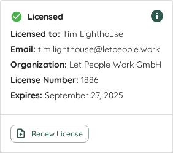
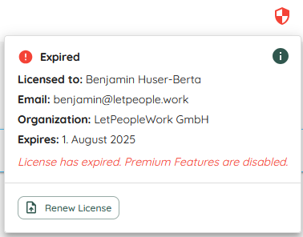

# About Licenses
While Lighthouse is Open-Source and free to use in the basic version, there are certain features that require a license. The license can be aquired through the https://letpeople.work website.

A license unlocks [Premium Capabilities](#licensed-features) that are aimed at enterprises and make your life easier if you want to scale the usage of Lighthouse.

The revenue we are making through the licenses fund the development, and most of the premium features will eventually be made available in the free version as well.

After you purchased a license through our website, you will get an email with your license which comes in form of a *license.json* file. This license file than can be loaded in your Lighthouse instance and will instantly unlock the premium capabilities of this instance.

{: .important}
Be aware that **any** manual modification in the license file will lead to the file becoming invalid and thus will not unlock any premium capability in Lighthouse

The license can be used in up to 50 instances within the organization that has aquired the license. The license is valid for one year, from the date of purchase. After this, Lighthouse will go back to the non-premium version, until you renew your license.

{: .note}
Please check https://letpeople.work for the complete and up to date terms and conditions

# Licensed Features
There are two kind of "Premium Features" that you unlock with a license. Some features are constraints that are meant to be permanent, as they are mainly useful when the tool adoption is scaling within an organization. These are the constraints that are in place if you are a free user:
- Maximum of three teams per Lighthouse instance (compared to unlimited teams with a license)
- Maximum of one project per Lighthouse instance (compared to unlimited projects with a license)
- No possibility to export and import the Lighthouse configuration through the settings

{: .important}
If you have more than the maximum amount of teams or projects, the continuous update for **all** teams and projects will stop, until you will get under the limit again.

On top of those permanent constraints on the free version, there will be some features that become available to premium users first, and eventually will make their way to the free tier.

{: .note}
For an up to date list of Premium Features please consult our [Website](https://letpeople.work/lighthouse#lighthouse-premium)

# License Information In Lighthouse
In Lighthouse, you can see the License Status in the toolbar:

The color of the 🛡️ icon indicates the license status. You will also see this on hover:
- Gray: No License (Free user)
- Green: License Valid
- Orange: License Active but will expire in the next 30 days
- Red: License invalid (may have been tampered with or has expired)

When you click on the License icon, you will see the full license details:

This includes the details of the person who ordered the license as well as the organization.

{: .important}
This information cannot be changed. If you try to manually adjust this, Lighthouse will mark the license as invalid.

# Loading/Renewing a License
You can load a license if you have no license yet:

1. Click on the license icon and then *Add License*
2. This will bring up a file dialog - select the *license.json* file that was sent to you

After this, you will see the license information. Ideally the icon turns green and your license was successfully loaded.

It could also be that the license is not valid or invalid.

# Invalid Licenses
If you try to load a file that was not an official license, or an official license that was manually modified, Lighthouse will detect this and display the information:

Simply upload the correct license file again and it will load correctly.

{: .note}
I know someone smart will try to outsmart us. So just for your information, the same check is done with already loaded licenses. So no, you cannot go tamper with the database and artificially prolong the duration. Also that would be against our terms and conditions - we much rather prefer if you'd be reaching out to see how you can contribute and we could find a way to make a license more affordable for you if that is a problem

# Expired Licenses
Valid licenses can expire. After the expiration date, the premium features will not be available anymore and the constraints of the free version will take effect.
If you are nearing the expiration, Lighthouse will show a warning indication in orange:

After the expiration, it will change to red:  
