The **Flow Metrics** category answers *what do the detailed trends look like*. Where [Flow Overview](./flow-overview.html) gives you one number per question, these charts show the distribution and the movement behind that number — every item, every day, over the selected range.

Most charts here are clickable: selecting a bubble, bar, or data point opens the work items behind it.

- TOC
{:toc}

# Cycle Time Scatterplot

|--------------|-------------------------|
| **Applies to** | Teams and Portfolios |
| **Flow Metric** | Cycle Time |
| **Affected by Filtering** | Yes |

The Scatterplot shows the individual items in a chart, where the x-axis shows the dates the items were closed, and the y-axis how long they were in progress.
If there are items that were closed on the same day with the same cycle time, they are represented in a single bubble. The more items a bubble is representing, the bigger it is.

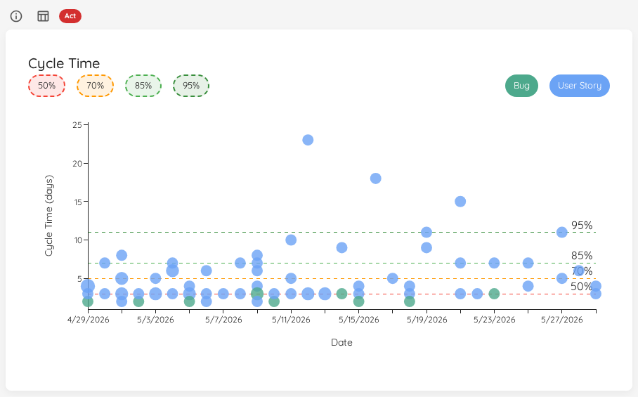

This visual allows you to see patterns or outliers. Hovering over a dot will give you additional information, and with a click you'll get a more detailed view about the item(s) represented by the specific dot.

You can click on the percentiles on top in the legend to show/hide them. Additionally, if you have defined an SLE, you can show the line on your scatterplot as well.

The chart also distinguishes items by type, using different colors for each item type. The legend allows you to show or hide specific item types.

{: .note}
If [Blackout Periods](../settings/configuration.html#blackout-periods) are configured, the corresponding date ranges are highlighted with a hatched overlay on this chart, helping you distinguish expected gaps from anomalies.

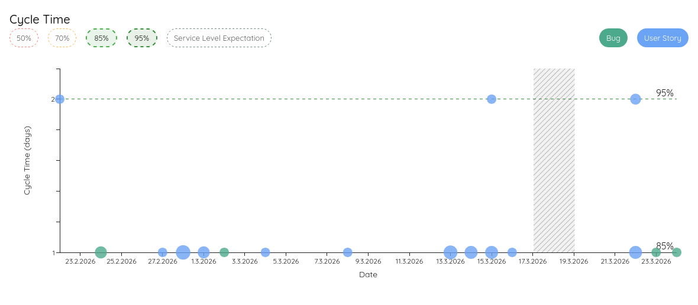

## Named Cycle Times (Premium)

The built-in Cycle Time measures the whole in-progress span. Often you also want to track a *different* start→end window — for example a "Lead Time" from Backlog all the way to Done, or an "Analysis to Done" from your analysis state onwards. Define these as **named cycle times** in your [Team](../teams/edit.html#cycle-times) or [Portfolio](../portfolios/edit.html#cycle-times) settings, and a selector appears in the top-left of the scatterplot.

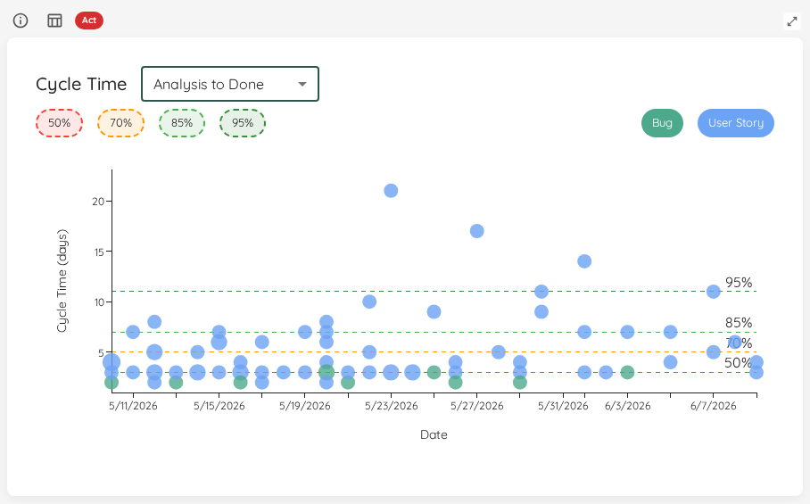

Pick **Default** for the built-in Cycle Time, or any named cycle time to re-plot every dot over that window and recompute the percentiles for it. A definition whose start or end state you have since removed is shown disabled with a hint to fix its states; the chart simply stays on the Default until you do.

{: .note}
A named cycle time uses half-open `[enter start … enter end)` boundaries: an item's time is measured from when it first reaches the start state up to (but not including) when it reaches the end state.

## Status Indicator

The allowed percentage of items above the SLE is `100% − SLE percentile` (e.g. 15% for an 85th-percentile SLE).

| Status | Condition |
|---|---|
| 🔴 Act | No SLE is configured, *or* the percentage of items exceeding the SLE is more than 10 percentage points above the allowed threshold. |
| 🟡 Observe | The percentage of items exceeding the SLE is above the allowed threshold but within 10 percentage points of it. |
| 🟢 Sustain | The percentage of items exceeding the SLE is within the expected threshold. |

# Work Item Aging Chart

|--------------|-------------------------|
| **Applies to** | Teams and Portfolios |
| **Flow Metric** | WIP, Work Item Age |
| **Affected by Filtering** | Yes |

The Work Item Aging Chart shows you all in progress items on a scatter plot:

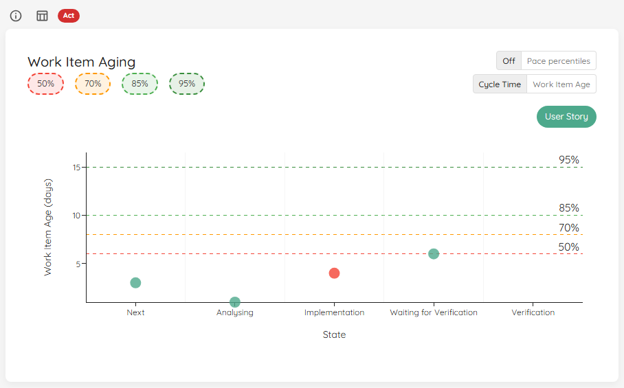

On the x-axis you will find the different states you've configured in the settings of your team/portfolio.
On the y-axis, you'll see how long each particular item is in progress already.

Similar to the [Cycle Time Scatterplot](#cycle-time-scatterplot), multiple items are grouped in a bubble that is shown bigger. If you want more details, you can click on a specific bubble.
You can selectively show various percentiles from your cycle time for the selected range, as well as the Service Level Expectation if you have configured it.

The chart distinguishes items by type, using different colors for each item type. The legend allows you to show or hide specific item types.

{: .note}
If there is a blocked item, it will appear as a red dot in the chart.

## Cycle Time vs. Work Item Age Reference Lines

The **Cycle Time / Work Item Age** selector in the top-right of the chart swaps the horizontal reference lines between two sources:

- **Cycle Time** — the historical cycle-time percentiles of completed work for the selected range (the default).
- **Work Item Age** — the [Work Item Age percentiles](flow-overview.html#work-item-age-percentiles) of the current in-progress items, letting you compare each item against how long today's work in progress is actually taking.

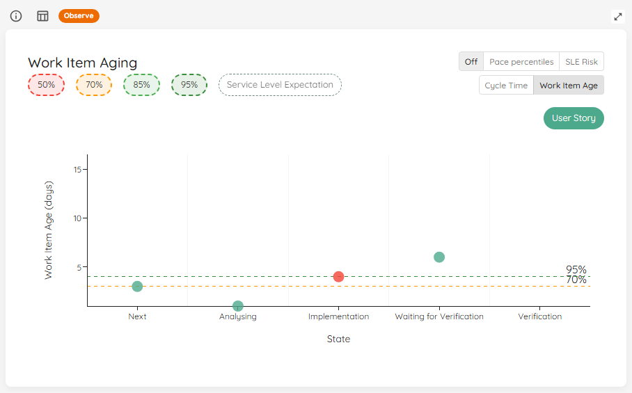

The y-axis stays anchored to cycle time regardless of the selection, so the [pace percentile bands](#pace-percentile-bands) keep their scale when you switch. When two percentiles fall on the same value, only the highest percentile's line and label are drawn.

## Pace Percentile Bands

Toggle the **pace percentiles** control in the top-right of the chart to overlay per-state background bands.

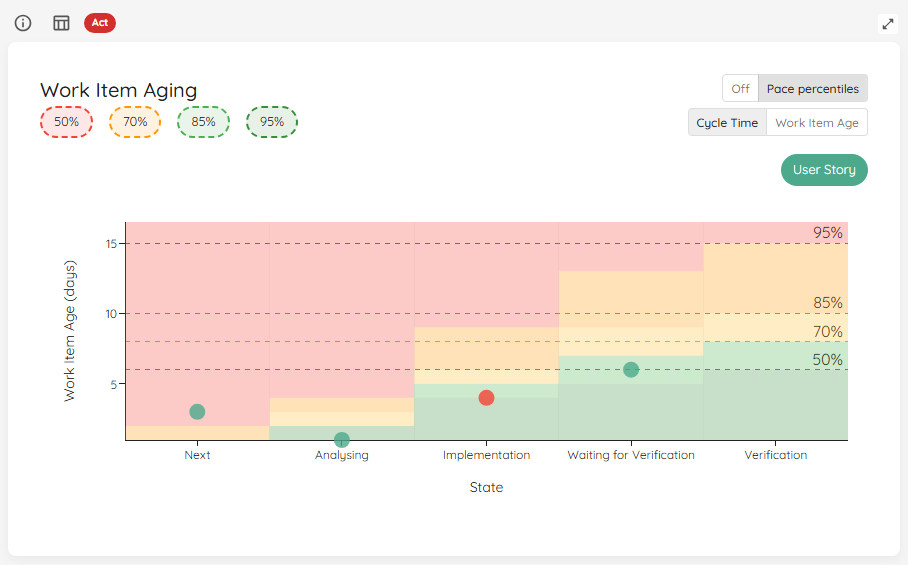

For each *Doing* state, Lighthouse draws horizontal background bands at that state's historical cycle-time percentiles, shaded from cool (faster than typical) at the bottom to red (slower than typical) at the top. Unlike the SLE line — which is a single threshold across the whole chart — these bands let you judge whether an item is aging faster or slower than your usual pace **for the specific state it is currently in**. States without their own percentile data inherit the bands carried over from the previous state.

{: .note}
A **stale** item (one that has been in its current state longer than the configured staleness threshold) appears red in the chart, just like a blocked item. Clicking its bubble shows the item's **Time in State** highlighted in red. An item that is blocked *and* over the threshold is treated as blocked, not stale.

## Status Indicator

| Status | Condition |
|---|---|
| 🔴 Act | No SLE is configured, *or* no blocked indicators are configured, *or* the percentage of items exceeding the SLE is greater than the allowed percentage (100% − SLE percentile) *and* at least one item is also blocked. |
| 🟡 Observe | Some items exceed the SLE or at least one item is blocked, but not both conditions together. |
| 🟢 Sustain | All in-progress items are within the SLE and no items are blocked. |

# Throughput Run Chart

|--------------|-------------------------|
| **Applies to** | Teams and Portfolios |
| **Flow Metric** | Throughput |
| **Affected by Filtering** | Yes |

To visualize the Throughput, there is a Run Chart shows the Throughput over time, sampled by days.

You can see how many items were closed each day over the last several days. The more 'stable' your throughput is, the more accurate your forecast will be.

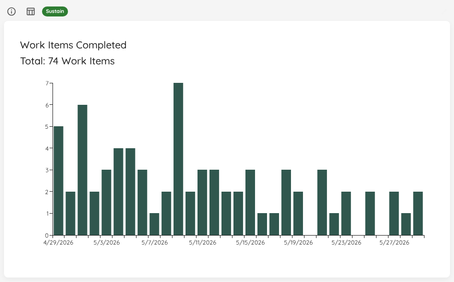

This widget will adjust based on the selected time range. If you want to know which exact items were closed, you can click on a specific day and get more details.

{: .note}
If [Blackout Periods](../settings/configuration.html#blackout-periods) are configured, those days are highlighted with a hatched overlay on this chart, so you can immediately see why Throughput was zero on certain days:

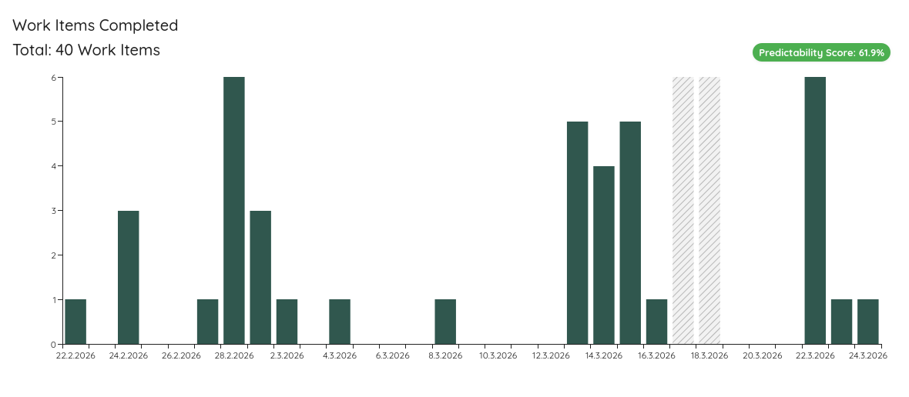

On the top right, you will see the *Predictability Score*. If you click on it, another widget is brought up:

## Status Indicator

The Throughput Run Chart checks for runs of 3 or more consecutive zero-throughput days (excluding configured Blackout Periods).

| Status | Condition |
|---|---|
| 🔴 Act | 2 or more separate runs of 3+ consecutive zero-throughput days detected. |
| 🟡 Observe | Exactly 1 run of 3 consecutive zero-throughput days detected. |
| 🟢 Sustain | No extended zero-throughput runs detected. |

# WIP Over Time

|--------------|-------------------------|
| **Applies to** | Teams and Portfolios |
| **Flow Metric** | WIP |
| **Affected by Filtering** | Yes |

The WIP Over Time chart shows you how the WIP evolved over the selected time range. You can spot whether you increased, decreased, or stayed stable. It also helps to see patterns in WIP.

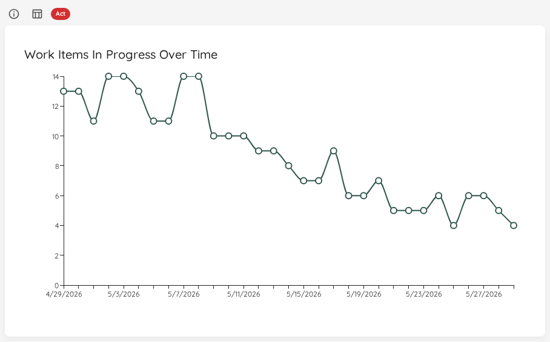

If you click on a specific day, it will show you the details of which items were in progress on that specific day.

If you have defined a *System WIP Limit*, you can show this as a horizontal line on your chart.

{: .note}
If [Blackout Periods](../settings/configuration.html#blackout-periods) are configured, those days are highlighted with a hatched overlay on this chart, making it easy to identify expected gaps in your WIP data.

## Status Indicator

| Status | Condition |
|---|---|
| 🔴 Act | No System WIP Limit is configured, *or* WIP exceeded the limit on more days than it was at or below the limit. |
| 🟡 Observe | WIP was below the limit on more days than it was at or above it, *or* the distribution across above/at/below is uneven without a clear majority. |
| 🟢 Sustain | WIP was exactly at the System WIP Limit on more than 50% of days. |

# Total Work Item Age Over Time

|--------------|-------------------------|
| **Applies to** | Teams and Portfolios |
| **Flow Metric** | Work Item Age, WIP |
| **Affected by Filtering** | Yes |

To see how your total work item age has evolved, there's also a run chart showing the historical trend:

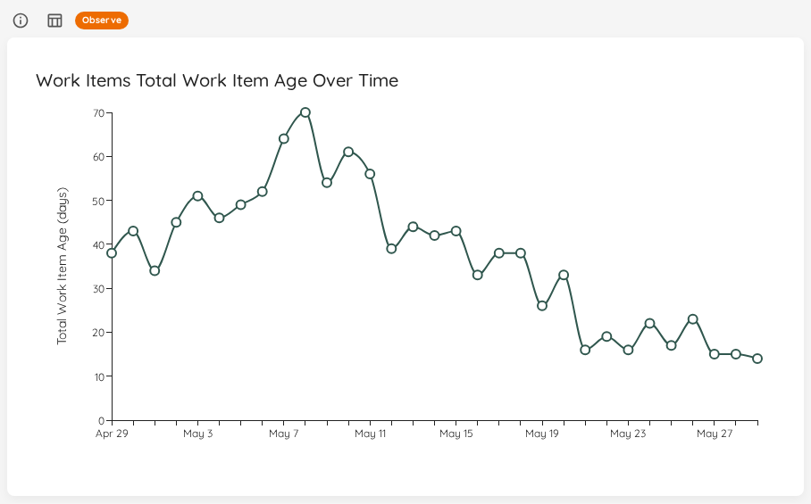

This chart visualizes how the cumulative age of your WIP has changed over the selected time period. You can use this to:
- Identify periods where age accumulated (indicating items getting stuck)
- See the impact of finishing old items (sharp drops in total age)
- Monitor whether your overall WIP age is trending up or down

If you click on a specific day, it will show you which items contributed to the total age on that date, along with each item's individual age at that point in time.

{: .note}
The age calculation for historical dates shows how old each item was on that specific date, not its current age. An item started 10 days ago would show age 1 on its first day, age 2 on its second day, and so on.

## Status Indicator

The over-time chart compares the total work item age at the **start** of the selected period to the value at the **end**.

| Status | Condition |
|---|---|
| 🔴 Act | Total age grew from 0 to a positive value, *or* it grew by more than 10% over the period. |
| 🟡 Observe | Total age dropped by more than 10% — items may have been removed or completed in a burst; verify the data. |
| 🟢 Sustain | Total age is stable (within ±10% change), or is 0 throughout. |

# Arrivals Run Chart

|--------------|-------------------------|
| **Applies to** | Teams and Portfolios |
| **Flow Metric** | Arrivals (items started) |
| **Affected by Filtering** | Yes |

The Arrivals Run Chart shows the daily count of work items that were started (arrived into the system) over the selected date range. This complements the Throughput Run Chart by visualizing the intake side of flow: how much new work is entering the system each day.

Comparing Arrivals with Throughput helps you understand whether your flow is balanced — whether you are starting work at roughly the same rate you finish it — and whether arrivals are continuous or batched.

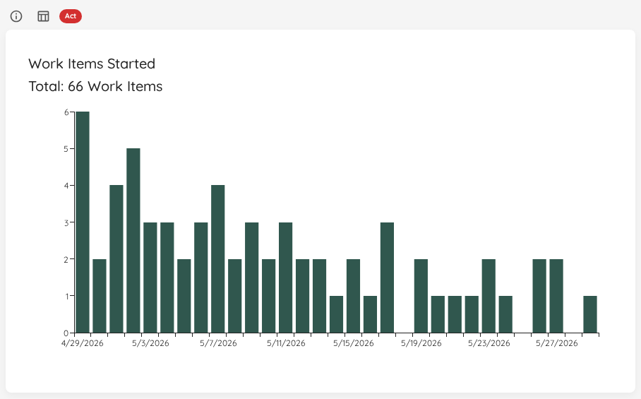

If you click on a specific day, it will show you which items were started on that day.

{: .note}
If [Blackout Periods](../settings/configuration.html#blackout-periods) are configured, those days are highlighted with a hatched overlay on this chart, so you can immediately see why arrivals were zero on certain days.

## Status Indicator

The Arrivals Run Chart uses a two-factor status:

1. **Primary signal:** Arrivals-versus-departures balance (using the same thresholds as Started vs. Closed).
2. **Secondary signal:** Batching detection — 3-day windows with zero arrivals (excluding Blackout Periods) suggest work is starting in bursts rather than continuously.

| Status | Condition |
|---|---|
| 🔴 Act | No System WIP Limit is configured, *or* started count exceeds closed count by more than 5%. |
| 🟡 Observe | Closed significantly exceeds started (process may be starving), *or* started and closed are otherwise balanced but 2 or more 3-day windows with zero arrivals are detected (excluding Blackout Periods). |
| 🟢 Sustain | Started and closed are balanced (within 5% or an absolute difference of less than 2) and no significant batching is detected. |

# Simplified Cumulative Flow Diagram (CFD)

|--------------|-------------------------|
| **Applies to** | Teams and Portfolios |
| **Flow Metric** | Cycle Time, WIP, Throughput |
| **Affected by Filtering** | Yes |

This simplified version of a Cumulative Flow Diagram shows you how many items were in which state category (*Doing* or *Done*) over the selected time period. This helps you see patterns and problems with your flow. It's a *simplified* CFD because you will not see the detailed state itself, but just the overall category.

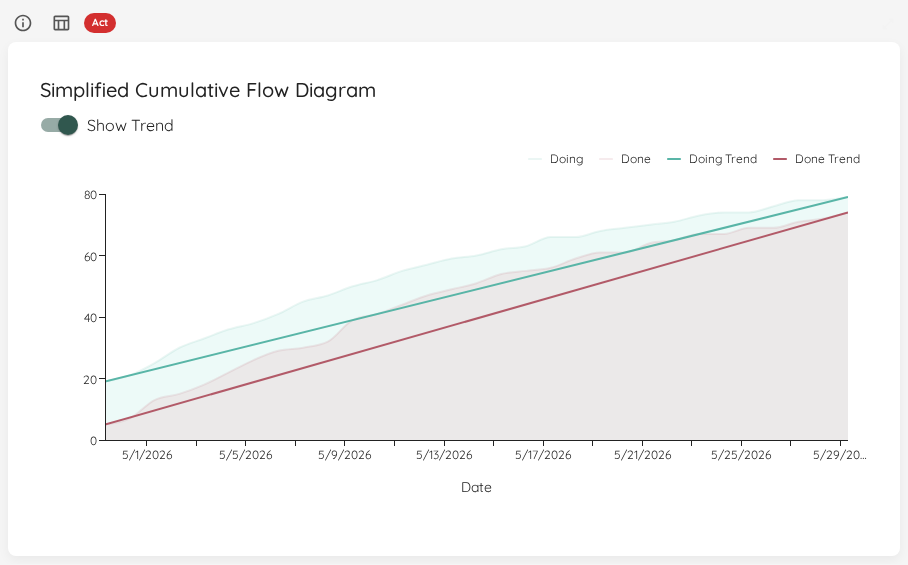

If you enable the trend lines, the start and end points of both areas will be connected. In general you want to aim for:
1. Making the lines parallel - this means you control your WIP well. If the lines are not parallel, you either start more than you finish or finish more than you start.
2. Bring the lines closer together - this means you will decrease your Cycle Time.
3. Increase the *angle* of the lines - this means you will increase your Throughput.

## Status Indicator

The CFD uses the same logic as [Started vs. Closed](flow-overview.html#total-throughput): it compares the total number of items started against the total number of items closed over the selected period.

| Status | Condition |
|---|---|
| 🔴 Act | No System WIP Limit is configured, *or* started count exceeds closed count by more than 5%. |
| 🟡 Observe | Closed significantly exceeds started (process may be starving). |
| 🟢 Sustain | Started and closed are balanced (within 5% or an absolute difference of less than 2). |

# Load Balance Matrix

|--------------|-------------------------|
| **Applies to** | Teams and Portfolios |
| **Flow Metric** | WIP, Total Work Item Age |
| **Affected by Filtering** | Yes |

The Load Balance Matrix visualizes current load and short-term inventory risk in a single view:

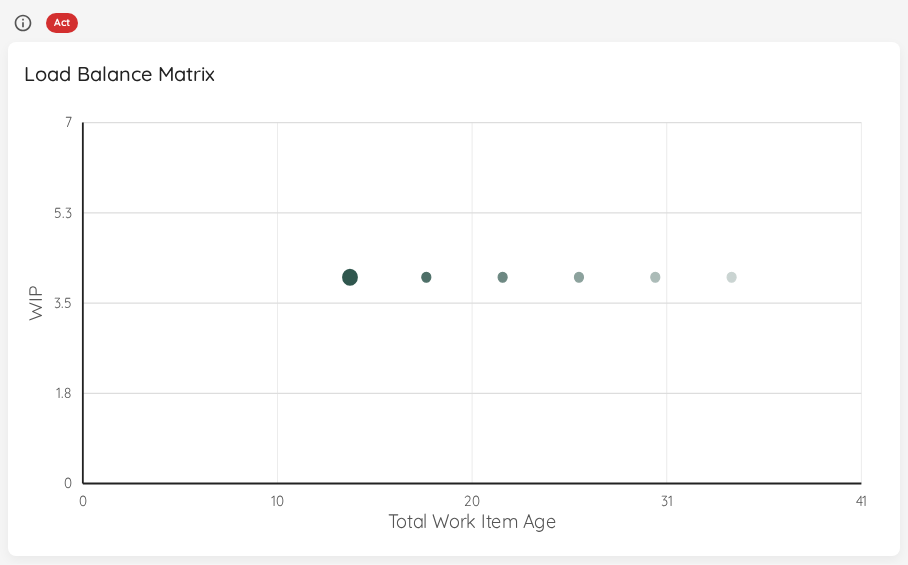

- X-axis: Total Work Item Age
- Y-axis: Work in Progress (WIP)
- Divider lines: baseline averages from WIP PBC and Total Work Item Age PBC
- Points: one selected end-date snapshot plus 5 projected days

The first point always represents the currently selected **end date** in the date range selector. The five projected points assume WIP remains constant and Total Work Item Age increases by the current WIP each day.

This interpretation intentionally favors a slightly higher-than-average WIP while keeping Total Work Item Age below average. The goal is to keep flow from running dry while staying conservative on inventory age.

{: .note}
You can find more details on this approach in our blog posts: [Exploring Alternatives to WIP Limits using Total Work Item Age](https://blog.letpeople.work/p/limit-work-in-progress-without-work-in-progress-limits-08325db60a0b) and [Limit Work in Progress without Work In Progress Limits - A Case Study](https://blog.letpeople.work/p/limit-work-in-progress-without-work-in-progress-limits-33ee889f661d)

## Status Indicator

| Status | Condition |
|---|---|
| 🔴 Act | Baseline is missing, *or* today's Total Work Item Age is above the baseline average. Close ongoing work before starting new things. |
| 🟡 Observe | Today's WIP is at or below the baseline average while today's Total Work Item Age is at or below baseline. Consider starting more work. |
| 🟢 Sustain | Today's WIP is above the baseline average while today's Total Work Item Age is at or below baseline. |

# Cumulative Time per State

|--------------|-------------------------|
| **Applies to** | Teams and Portfolios |
| **Flow Metric** | Work Item Age, Cycle Time |
| **Affected by Filtering** | Yes |

This chart shows how much **total time** your work spends in each workflow state, making it easy to see where work waits and where bottlenecks form.

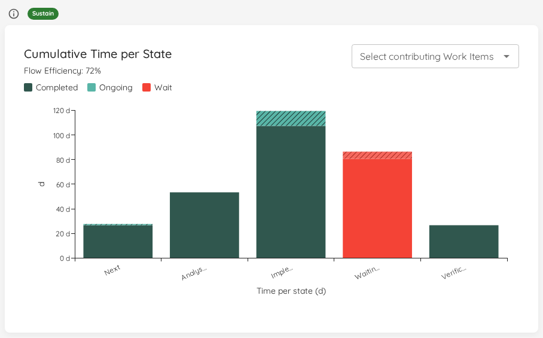

Each bar represents one *Doing* state. Every item that accumulated time in that state within the selected range contributes to the bar, split into two segments:

- **Completed segment** (solid): time contributed by items that have since moved out of the state.
- **Ongoing segment** (hatched): time still accumulating on items that are currently in the state.

Hovering over a state shows its breakdown — total, completed, and ongoing time, plus the mean, median, and item counts. Clicking the constraint (tallest) bar opens a drill-in dialog listing the items that contributed to it.

## Wait States and Flow Efficiency

When you configure [wait states](../teams/edit.html#wait-states), the bars for those states are colour-highlighted and the chart header shows the resulting **Flow Efficiency** — the share of time spent actively working rather than waiting.

This makes the cost of waiting tangible: you can see at a glance how much of your total state time is consumed by queues and hand-offs versus value-adding work. The same headline figure is also available as a standalone [Flow Efficiency](flow-overview.html#flow-efficiency) overview tile.

## Filtering to specific items

Use the work-item picker above the chart to scope it to one or more selected items. This is useful to trace how a specific item — or a small set of them — spent its time across the states.

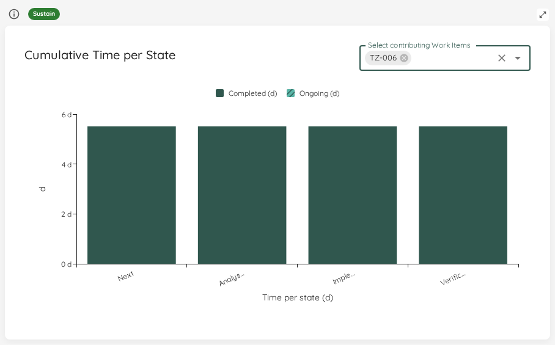

## Scope to a Named Cycle Time (Premium)

If you have defined [named cycle times](#named-cycle-times-premium), a **Scope to cycle time** selector appears in the chart header. By default the chart bars all *Doing* states; choose a named cycle time to narrow it to exactly the states in that window's span — from its start state up to (but not including) its end state.

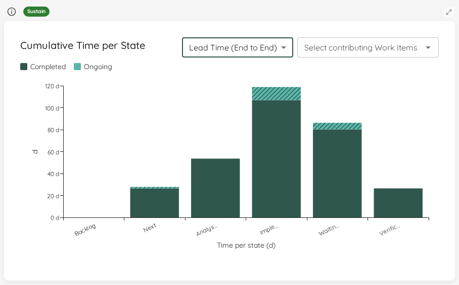

Scoping changes *which* states are shown — earlier states that the default view omits (for example a Backlog state) appear, and the end state drops out — while keeping the same completed/ongoing split. This lets you see where time accumulates within a specific lead-time window rather than across the whole workflow.

## Status Indicator

| Status | Condition |
|---|---|
| 🔴 Act | One state holds more than 60% of the total time, *or* no time is in scope. Investigate the bottleneck or widen the filter. |
| 🟡 Observe | One state holds between 40% and 60% of the total time. |
| 🟢 Sustain | No single state holds 40% or more of the total time. |

# Blocked Over Time

|--------------|-------------------------|
| **Applies to** | Teams and Portfolios |
| **Flow Metric** | Work Item Age |
| **Affected by Filtering** | Yes — bars span the selected date range |

This chart plots how many items were blocked on each recorded day, so you can see whether blocking is trending up or down over time. Values come from the forward-only blocked-count snapshots Lighthouse records each sync — history begins when the instance first started recording, not retroactively.

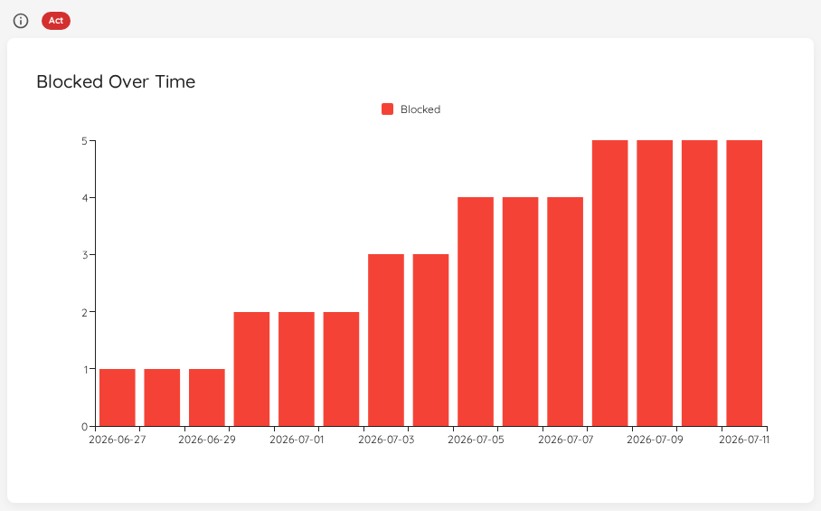

Click any bar to drill into the items that were blocked on that date. Lighthouse reconstructs the point-in-time membership from its blocked-transition history and lists those items in the standard **View Data** dialog. When the reconstructed list is smaller than the recorded count for that day — because capture began part-way through, or a sync gap dropped a transition — the dialog title carries an honest capture-gap note so the number is never silently misrepresented.

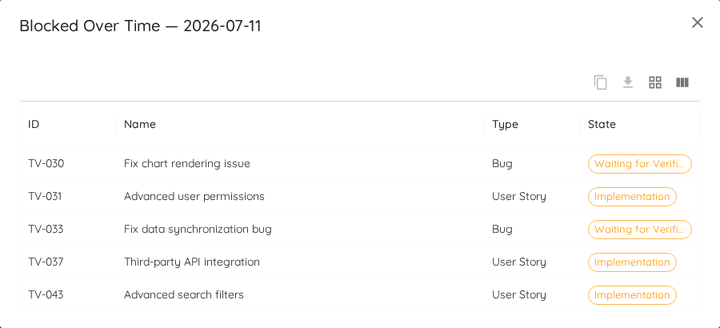

## Status Indicator
The status reflects how long the oldest currently-blocked item has been blocked, relative to the blocked staleness threshold (`t` days). The amber band starts at 75% of the threshold.

| Status | Condition |
|---|---|
| 🔴 Act | No blocked staleness threshold is configured, *or* the oldest blocked item has been blocked ≥ `t` days. |
| 🟡 Observe | The oldest blocked item has been blocked ≥ 75% of `t` (aging toward the threshold) but less than `t`. |
| 🟢 Sustain | No items are blocked, *or* the oldest blocked item is well within the threshold. |
