The **Flow Overview** category answers *how is my system doing right now*. It collects the at-a-glance tiles: a handful of numbers you can read in seconds, each with a [status indicator](./widgets.html#status-indicators) and — where it makes sense — a [trend indicator](./widgets.html#trend-indicators) comparing the selected range to the period before it.

{: .note}
The **Predictability Score** tile also lives in this category. It is documented with its detail chart on the [Predictability](./predictability.html#predictability-score) page.

- TOC
{:toc}

# WIP Overview

|--------------|-------------------------|
| **Applies to** | Teams and Portfolios |
| **Flow Metric** | WIP |
| **Affected by Filtering** | Yes — snapshot as of selected end date |

This widget shows the total number of items currently in progress based on the states you configured as *Doing*.

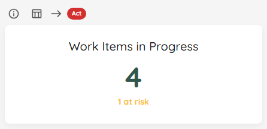

If a *System WIP Limit* is configured for the Team or Portfolio, the widget visualizes that goal and colors the value accordingly.

Use the **View Data** button to open the full list of in-progress items that currently contribute to the count.

## Status Indicator

| Status | Condition |
|---|---|
| 🔴 Act | No System WIP Limit is configured, *or* current WIP exceeds the limit. |
| 🟡 Observe | WIP is below the limit (capacity is available). |
| 🟢 Sustain | WIP exactly matches the System WIP Limit. |

# Blocked Overview

|--------------|-------------------------|
| **Applies to** | Teams and Portfolios |
| **Flow Metric** | Work Item Age |
| **Affected by Filtering** | Yes — snapshot as of selected end date |

This widget shows how many items were blocked on the last day of the selected range. The status is driven by the **count** of blocked items — the target is always zero, so even a single blocked item raises a warning. It also shows a previous-period trend (see [Trend Indicators](widgets.html#trend-indicators)).

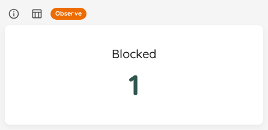

The target is always zero blocked items. Use the **View Data** button to see all currently blocked items.

{: .important}
The blocked **count** is a snapshot as of the **last day of the selected date range**. On a range ending today that is the current blocked state.

For both **Teams** and **Portfolios**, a historical range is answered from blocked-transition history — "was this item blocked *then*" — rather than from today's tags and state, so an item (or feature) unblocked since is not retroactively reported as blocked. Items and features that predate blocked-history capture fall back to the live rule, which is the only answer available for them.

The trend indicator compares against the previous period of the selected date range (see [Trend Indicators](widgets.html#trend-indicators)).

## Status Indicator

| Status | Condition |
|---|---|
| 🔴 Act | No blocked indicators are configured, *or* 2 or more items are blocked. |
| 🟡 Observe | Exactly 1 item is blocked. |
| 🟢 Sustain | No items are blocked. |

# Stale Items Overview

|--------------|-------------------------|
| **Applies to** | Teams and Portfolios |
| **Flow Metric** | Work Item Age |
| **Affected by Filtering** | Yes — snapshot as of selected end date |

This widget shows how many in-progress items had been sitting in their current state longer than the configured **staleness threshold** — items that may be silently stuck even though no one flagged them.

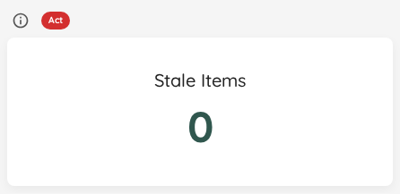

The staleness threshold (in days) is configured in your Team or Portfolio settings. Blocked items are **not** counted here — they are reported by the [Blocked Overview](#blocked-overview) instead, so a single item is never counted as both blocked and stale. The target is always zero stale items. Use the **View Data** button to see all currently stale items.

{: .important}
Staleness is measured against the **last day of the selected date range**, not against today. On a historical range an item that sat still is judged by how long it had been still *on that end date*, so closing a range in the past no longer makes everything in it read as stale.

## Status Indicator

| Status | Condition |
|---|---|
| 🔴 Act | No staleness threshold is configured, *or* 2 or more items are stale. |
| 🟡 Observe | Exactly 1 item is stale. |
| 🟢 Sustain | No items are stale. |

# Features Worked On Overview

|--------------|-------------------------|
| **Applies to** | Teams only |
| **Flow Metric** | WIP |
| **Affected by Filtering** | Yes — snapshot as of selected end date |

This widget shows how many parent features currently have at least one child item in progress.

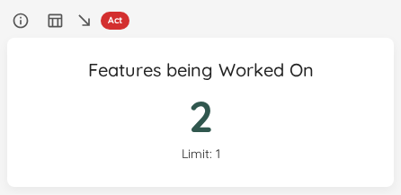

The team's [Feature WIP](../teams/edit.html#feature-wip) is visualized as a goal on the widget.

{: .note}
The number is based on parent items that are actively being worked on. It does not matter whether the parent feature is in *To Do*, *Doing*, or *Done*.

{: .note}
This metric is only available for Teams.

## Status Indicator

| Status | Condition |
|---|---|
| 🔴 Act | No Feature WIP is configured, *or* the number of features being worked on exceeds the limit. |
| 🟡 Observe | Fewer features are being worked on than the Feature WIP limit. |
| 🟢 Sustain | Feature count exactly matches the Feature WIP limit. |

# Total Work Item Age

|--------------|-------------------------|
| **Applies to** | Teams and Portfolios |
| **Flow Metric** | Work Item Age, WIP |
| **Affected by Filtering** | Yes — snapshot as of selected end date (Widget), Yes (Chart) |

The Total Work Item Age widget shows the cumulative age of all items currently in progress. This metric helps you understand the overall "inventory" age of your work in progress.

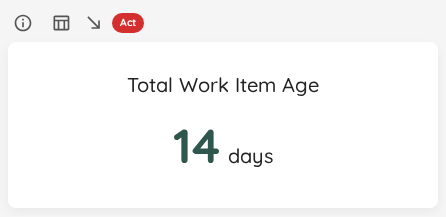

The widget displays a single number representing the sum of ages (in days) of all items currently in a *Doing* state. This gives you a quick view of your total WIP "burden" - the higher the number, the more accumulated age you're carrying in your system.

For example, if you have:
- Item A: 5 days old
- Item B: 3 days old  
- Item C: 2 days old

Your Total Work Item Age would be 10 days.

{: .important}
The widget reports the total age as of the **last day of the selected date range**. On a range ending today that is the current total; on a historical range it is the total the items carried on that end date, so the number lines up with the rest of the range instead of silently jumping to today.

## Status Indicator

The reference value is calculated as: **System WIP Limit × SLE days**. This represents the maximum acceptable total age if every in-progress item were exactly at the SLE boundary.

| Status | Condition |
|---|---|
| 🔴 Act | System WIP Limit or SLE is not configured, *or* the current total age already exceeds the reference value. |
| 🟡 Observe | The current total age is within the reference value, but adding today's WIP count (one additional day of aging) would push it over. |
| 🟢 Sustain | The current total age is within the reference value and not projected to exceed it tomorrow. |

# Flow Efficiency

|--------------|-------------------------|
| **Applies to** | Teams and Portfolios |
| **Flow Metric** | Cycle Time, Work Item Age |
| **Affected by Filtering** | Yes |

Flow Efficiency is the share of time your work spends **actively progressing** versus **waiting**. A value of 100% would mean work never sat idle; in practice most systems sit far lower, and that gap is where the biggest delivery improvements usually hide.

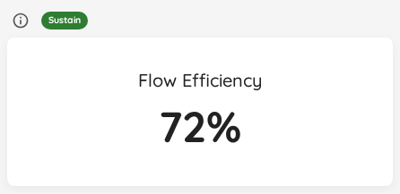

The figure is derived from the [wait states](../teams/edit.html#wait-states) you configure: time spent in a wait state counts as waiting, all other *Doing* time counts as active. The same number, together with the contributing wait time highlighted on each bar, also appears on the [Cumulative Time per State](flow-metrics.html#cumulative-time-per-state) chart.

{: .important}
This widget shows *Not configured* until you mark at least one [wait state](../teams/edit.html#wait-states) in your Team or Portfolio settings. Without wait states there is no way to tell active time from waiting time.

## Status Indicator

Unlike most widgets, a **higher** value is better here, so the thresholds are inverted.

| Status | Condition |
|---|---|
| 🔴 Act | No wait states are configured — the status reads Act with a *define wait states in settings* prompt, the same pattern used when an SLE is missing elsewhere. |
| 🔴 Act | Flow efficiency is below 40% — waiting dominates; investigate the wait states draining your value-adding time. |
| 🟡 Observe | Flow efficiency is between 40% and 60% — watch which wait states hold work the longest. |
| 🟢 Sustain | Flow efficiency is at or above 60% — a healthy balance between active and waiting time. |

# Cycle Time Percentiles

|--------------|-------------------------|
| **Applies to** | Teams and Portfolios |
| **Flow Metric** | Cycle Time |
| **Affected by Filtering** | Yes |

In this widget you can see the different percentiles of your Cycle Time. It's to get a quick view of where you stand, for example if you want to compare it to your Service Level Expectation.

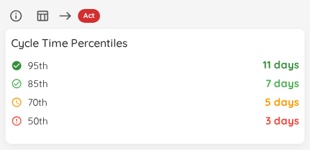

In case you have defined a [Service Level Expectation](../teams/edit.html#service-level-expectation), you will see the SLE on the top right.

Use the **View Data** button in the widget header to see all items that were closed in the respective date range. If you have defined an SLE, the Cycle Time coloring is based on how close (or above) the item got to the SLE.

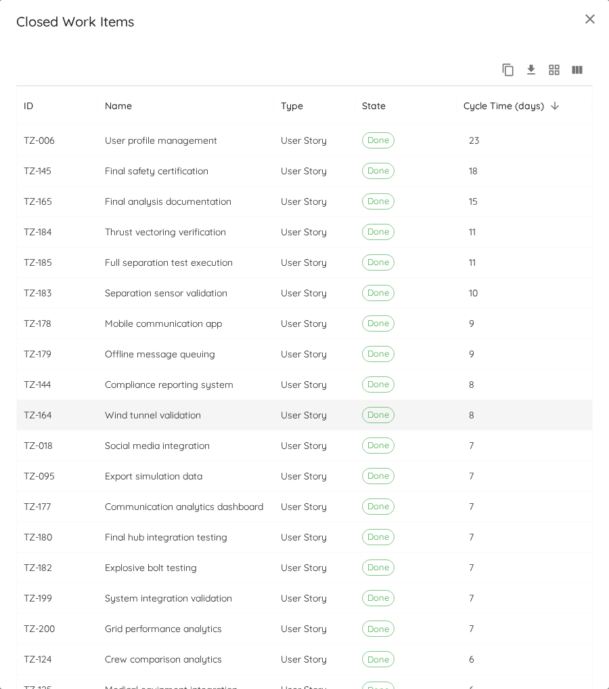

## Named Cycle Times

{: .note}
This is a **Premium** feature. It appears only once you have defined at least one [named Cycle Time](../teams/edit.html#cycle-times) for the Team or Portfolio.

The default Cycle Time measures from the first *Doing* state to *Done*. That is rarely the whole story: your customer's clock may start when the idea lands in the backlog, and your analysts may care only about the stretch from *Analysing* onward. A named Cycle Time lets you define those windows once and read them here.

The selector in the widget header switches which window the percentiles are computed over. **Default** is the regular Cycle Time and behaves exactly as before.

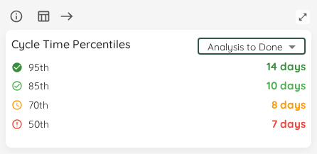

Selecting a named Cycle Time changes three things together:

- The **percentiles** recompute over that definition's window. A wider window cannot be faster than a narrower one, so expect the numbers to grow when the definition starts earlier.
- The **status indicator goes neutral**. Your SLE targets the default Cycle Time — it is a single target defined against the default window. Judging a deliberately wider window against it would report a breach you never actually agreed to, so Lighthouse reports no verdict instead of a misleading red. Hover the ℹ️ icon in the widget header for the reminder.
- **View Data** lists the items with a column for that named Cycle Time, showing only items that have a value for it, and draws no SLE line.

The trend indicator follows the selection too, comparing the named window against the same-length preceding period.

The selection is per-widget and not persisted: it does not affect the [Cycle Time Scatterplot](flow-metrics.html#cycle-time-scatterplot)'s own selector, and it resets when you change the date range or reload.

If a definition later becomes invalid — for example because one of its boundary states was removed from the Team's configuration — it is greyed out in the selector, and a selection that pointed at it falls back to **Default**.

## Status Indicator

The status indicator applies to the **Default** selection. Under a named Cycle Time it is neutral, as explained above.

| Status | Condition |
|---|---|
| 🔴 Act | No SLE is configured, *or* no closed items exist in the range, *or* the percentage of items within the SLE is more than 20 percentage points below the SLE target. |
| 🟡 Observe | The percentage of items within the SLE is below the target by up to 20 percentage points. |
| 🟢 Sustain | The percentage of items within the SLE meets or exceeds the configured target percentile. Consider tightening the target. |

# Work Item Age Percentiles

|--------------|-------------------------|
| **Applies to** | Teams and Portfolios |
| **Flow Metric** | Work Item Age |
| **Affected by Filtering** | Yes |

This overview widget shows the 50th, 70th, 85th, and 95th percentiles of **Work Item Age** for the items that are currently in progress. Unlike [Cycle Time Percentiles](#cycle-time-percentiles), which summarizes completed work, this is a live snapshot of how long your in-progress work has been ageing right now.

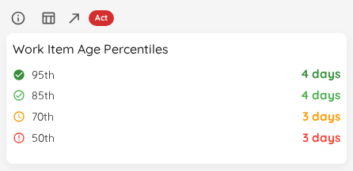

The same percentiles can be overlaid as reference lines on the [Work Item Aging Chart](flow-metrics.html#cycle-time-vs-work-item-age-reference-lines) via its Cycle Time / Work Item Age selector.

When no work is in progress, the widget shows an empty state instead of percentile values.

{: .note}
On a historical date range the widget reports the ages the items had **on the last day of that range**, not their age today — so a range that ends three weeks ago answers "how old was the work back then", which is the only reading that makes the number comparable to the rest of the range.

The trend footer compares the **highest configured percentile** against the same-length window immediately preceding the selected range, and is labelled *Highest Work Item Age Percentile* to distinguish it from the widget's own percentile list.

## Status Indicator

The status bands on how many in-progress items have already outlived your [Service Level Expectation](../teams/edit.html), using the SLE's **day value** only. Counts, not percentages: at the sizes this widget usually sees, a percentage over three or four items is noise rather than signal.

| Status | Condition |
|---|---|
| 🔴 Act | No SLE is configured, *or* more than one in-progress item is older than the SLE day value. Act on the oldest ones first. |
| 🟡 Observe | Exactly one item is older than the SLE day value, *or* one or more items sit exactly on it. |
| 🟢 Sustain | Every in-progress item is younger than the SLE day value — or nothing is in progress in this range, which is not a bad state (an empty board is already reported by the [WIP Overview](#wip-overview)). |

{: .note}
The bands deliberately do **not** scale with WIP: two breaching items read Act whether you are running three items or forty.

# Total Throughput

|--------------|-------------------------|
| **Applies to** | Teams and Portfolios |
| **Flow Metric** | Throughput |
| **Affected by Filtering** | Yes |

This overview widget shows the total number of items closed in the selected date range, together with the average number closed per day.

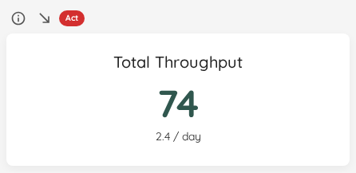

The trend indicator compares the selected date range against the immediately preceding period of the same length.

Use the **View Data** button to list the items closed in the selected range. For a day-by-day breakdown, use the [Throughput Run Chart](flow-metrics.html#throughput-run-chart).

## Status Indicator

Although the widget displays only closed items, its status is based on the same started-versus-closed balance logic used elsewhere in Lighthouse.

| Status | Condition |
|---|---|
| 🔴 Act | No System WIP Limit is configured, *or* started count exceeds closed count by more than 5%. |
| 🟡 Observe | Closed significantly exceeds started (process may be starving). |
| 🟢 Sustain | Started and closed are balanced (within 5% or an absolute difference of less than 2). |

# Total Arrivals

|--------------|-------------------------|
| **Applies to** | Teams and Portfolios |
| **Flow Metric** | Arrivals (items started) |
| **Affected by Filtering** | Yes |

This overview widget shows the total number of items started in the selected date range, together with the average number started per day.

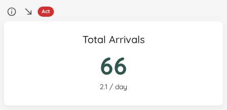

The trend indicator compares the selected date range against the immediately preceding period of the same length.

Use the **View Data** button to list the items started in the selected range. For day-level detail and batching patterns, use the [Arrivals Run Chart](flow-metrics.html#arrivals-run-chart).

## Status Indicator

Although the widget displays only started items, its status is based on the same started-versus-closed balance logic used elsewhere in Lighthouse.

| Status | Condition |
|---|---|
| 🔴 Act | No System WIP Limit is configured, *or* started count exceeds closed count by more than 5%. |
| 🟡 Observe | Closed significantly exceeds started (process may be starving). |
| 🟢 Sustain | Started and closed are balanced (within 5% or an absolute difference of less than 2). |

# Feature Size Percentiles

|--------------|-------------------------|
| **Applies to** | Portfolios |
| **Flow Metric** | Feature Size |
| **Affected by Filtering** | Yes |

This overview widget shows the 50th, 70th, 85th, and 95th percentiles of feature size for completed features in the selected date range. Feature size is measured as the number of child work items linked to each feature.

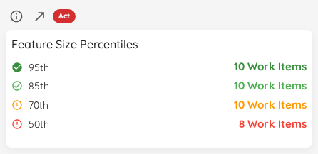

The trend indicator compares the selected date range against the immediately preceding period of the same length. Its direction is derived from the 50th percentile, while the tooltip shows a per-percentile breakdown in `previous → **current**` format.

{: .note}
This widget is only available for Portfolios.

{: .note}
The displayed percentiles summarize historical feature sizes, but the status indicator evaluates your currently active features against the 85th and 70th percentile thresholds derived from those same historical sizes.

## Status Indicator

| Status | Condition |
|---|---|
| 🔴 Act | At least one active (To Do or In Progress) feature has more child items than the 85th percentile size of completed features. |
| 🟡 Observe | No feature exceeds the 85th percentile, but at least one active feature has more child items than the 70th percentile size — it may grow further. |
| 🟢 Sustain | All active features are at or below the 70th percentile size, or no historical size data is available yet. |

{: .note}
If no active features exist, the status defaults to **Sustain**.
