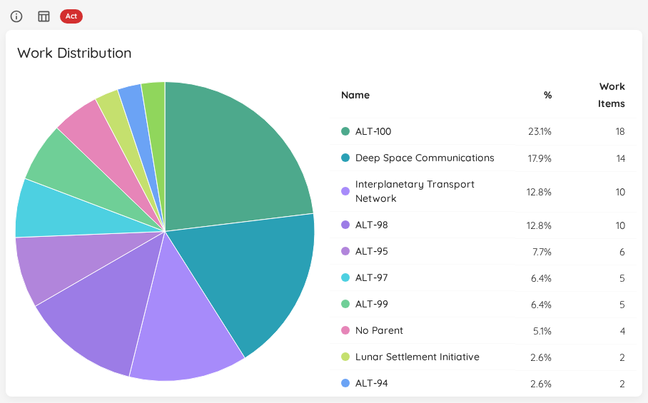
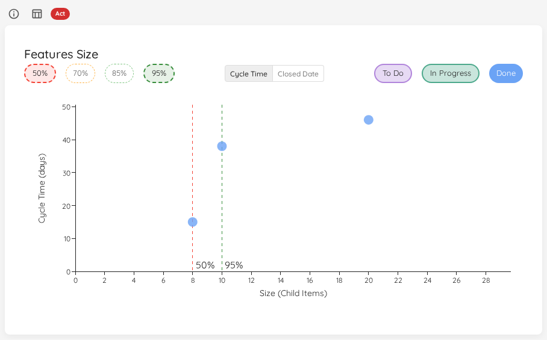
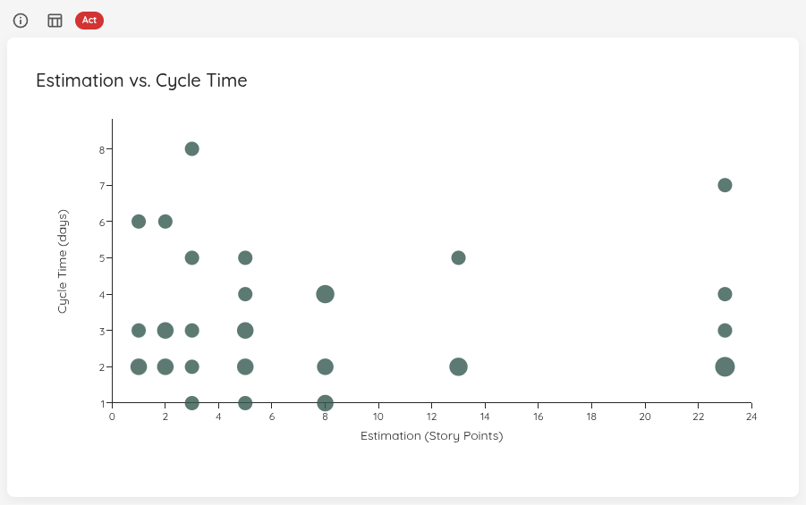

The **Portfolio & Features** category answers *how do features flow through the system*. These widgets look one level above individual work items: how work is distributed across features, how big features get, and how estimates compare to what actually happened.

{: .note}
Some widgets in this category are only available for Portfolios, as they need the context of parent features. This is noted per widget.

- TOC
{:toc}

# Work Distribution

|--------------|-------------------------|
| **Applies to** | Teams and Portfolios |
| **Flow Metric** | WIP, Cycle Time |
| **Affected by Filtering** | Yes |

The Work Distribution chart provides a visual breakdown of how work items are distributed across their parent work items (such as Features, Epics, or Initiatives). This pie chart helps you understand where your team's effort is focused.

The chart displays:
- Each segment represents a parent work item and its associated child items
- The size of each segment corresponds to the number of child work items
- Hovering over a segment shows the exact count and percentage
- Items without a parent are grouped under "No Parent"

Additionally, the widget includes a table that presents the same data in tabular form, allowing for easy sorting and filtering of the work distribution information.

## Viewing Details

Click on any segment of the pie chart to open a detailed dialog showing:
- The parent work item reference
- List of all child work items in that group
- Each work item's cycle time (for completed items) or work item age (for items in progress)
- Additional work item details (title, ID, state)

This visualization helps you:
- Identify which features or epics are consuming the most team capacity
- Spot imbalances in work distribution across different initiatives
- Understand the relationship between parent initiatives and actual work being done
- Find work items that may not be properly linked to parent items

{: .note}
The chart combines both completed work items (from the selected date range) and items currently in progress to give you a complete picture of work distribution. This means you can see not just what was done, but also what's currently being worked on under each parent item.

## Status Indicator

| Status | Condition |
|---|---|
| 🔴 Act | 20% or more of work items are not linked to a feature, *or* no Feature WIP is configured, *or* work is spread across more than 120% of the Feature WIP limit. |
| 🟡 Observe | Work is spread across slightly more features than the Feature WIP limit (up to 120% of it), *or* unlinked items are below 20%. |
| 🟢 Sustain | Work is spread across a number of features within the Feature WIP limit, and fewer than 20% of items are unlinked. |

# Feature Size

|--------------|-------------------------|
| **Applies to** | Portfolios |
| **Flow Metric** | Cycle Time, Work Item Age, Throughput |
| **Affected by Filtering** | Yes |

This chart shows the size of your Features on a scatter plot, with the ability to filter by state category.

The chart displays features from your selected time range. A toggle above the chart lets you choose what gets plotted on which axis:

| Mode | X-axis | Y-axis | Available when |
|---|---|---|---|
| **Cycle Time** (default when no estimation field) | Feature size (child items) | Cycle time / Work item age (see below) | Always |
| **\<Estimation Unit\>** (default when an estimation field is configured) | Feature size (child items) | Estimation value | Estimation field configured |
| **Closed Date** | Closed date | Feature size (child items) | Always |

{: .note}
The toggle is shown whenever there is data to plot — you don't need an estimation field to switch into **Closed Date** mode. The previously-shipped behaviour of hiding the toggle when no estimation field is configured has been replaced by a permanent two-option toggle (**Cycle Time** / **Closed Date**) in that case.

## Closed Date Mode

In **Closed Date** mode the axes swap: feature size moves to the Y axis and the X axis becomes a timeline of close dates. This view is useful for spotting when oversized features are landing and how that distribution shifts over time.

- **Closed features** are plotted at their `closedDate` on the X axis.
- **In Progress** and **To Do** features have no closed date — they are pinned to **today** on the X axis so they remain visible alongside the closed work. They keep their state-category colour and chip-toggle behaviour.
- The **right edge of the X axis is always today**, regardless of which state-category chips are active. Toggling **To Do** or **In Progress** off won't make today disappear off-screen.
- The **size percentile reference lines** are drawn horizontally in this mode (they cut across the chart at the percentile size value), so a feature plotted above the 85% line is in the upper 15% by size.

## State Filtering

The chart includes three filter chips on the right side to show or hide features by state:

- **Done** (enabled by default): Shows completed features using their cycle time
- **To Do** (disabled by default): Shows unstarted features positioned at the y=0 baseline
- **In Progress** (disabled by default): Shows features currently being worked on using their work item age

{: .note}
Features in the To Do category with a size of 0 (no child work items) are automatically filtered out, as they represent features that haven't been broken down yet.

## Time Metrics by State (Cycle Time mode)

In **Cycle Time** mode the y-axis value differs based on the feature's state:
- **Done features**: Display their **cycle time** (how long they took from start to completion)
- **In Progress features**: Display their **work item age** (how long they've been in progress)
- **To Do features**: Appear at **y=0** (no time elapsed yet)

This allows you to see:
- How feature size correlates with cycle time for completed features
- How long current features have been in progress relative to their size
- The size distribution of features in your backlog

In **Closed Date** mode the y-axis is feature size and the state-by-state rules above no longer apply — see [Closed Date Mode](#closed-date-mode) above.

## Percentile Lines

Similar to the [Cycle Time Scatterplot](flow-metrics.html#cycle-time-scatterplot), you can show percentile lines to understand your feature delivery patterns. Multiple features with the same size and time value are grouped in a bubble - the larger the bubble, the more features it represents.

Click on any bubble to see detailed information about the feature(s) it represents.

## Status Indicator

The Feature Size chart evaluates every active (To Do and In Progress) feature against the **85th and 70th percentile sizes** derived from historically completed features in the selected date range.

| Status | Condition |
|---|---|
| 🔴 Act | At least one active (To Do or In Progress) feature has more child items than the 85th percentile size of completed features. |
| 🟡 Observe | No feature exceeds the 85th percentile, but at least one active feature has more child items than the 70th percentile size — it may grow further. |
| 🟢 Sustain | All active features are at or below the 70th percentile size, or no historical size data is available yet. |

{: .note}
If no active features exist, the status defaults to **Sustain**.

# Estimation vs. Cycle Time

|--------------|-------------------------|
| **Applies to** | Teams and Portfolios |
| **Flow Metric** | Cycle Time |
| **Affected by Filtering** | Yes |

This scatter plot helps you understand how work item estimates correlate with actual cycle time. By visualizing this relationship, you can spot whether your estimations are in any way trustworthy compared with actual time it took to deliver.

## Configuration

To use this chart, you first need to configure an estimation field in your Team or Portfolio settings. You can configure:
- **Numeric estimates**: Story points, t-shirt sizes with numeric values, or any custom numeric field
- **Categorical estimates**: T-shirt sizes (XS/S/M/L/XL) or other categorical fields with explicit ordering

## Chart Layout

The scatter plot displays:
- **X-axis**: Estimation values (story points, t-shirt sizes, or custom estimates)
- **Y-axis**: Cycle time (how long items took to complete)
- Each dot or bubble represents one or more completed work items from the selected time range
- Larger bubbles indicate multiple items with the same estimation and cycle time

Similar to the [Cycle Time Scatterplot](flow-metrics.html#cycle-time-scatterplot), you can click on any data point to drill into the underlying work items and see their details.

{: .note}
This chart only appears after you've configured an estimation field. If no estimation field is configured, the chart will not be visible.

## Status Indicator

The status is based on the **Spearman rank correlation** between estimates and actual cycle times — a measure of whether higher estimates consistently lead to longer cycle times.

| Status | Condition |
|---|---|
| 🔴 Act | Estimation is not configured, *or* the Spearman correlation is below 0.3 — no meaningful relationship between estimates and cycle time. |
| 🟡 Observe | Correlation is between 0.3 and 0.6 — a weak relationship exists; review your estimation approach. |
| 🟢 Sustain | Correlation is 0.6 or above — estimates correlate well with actual cycle time. |

{: .note}
A minimum of 2 data points is required to calculate correlation. With fewer items, the status defaults to **Sustain** until enough data is available.
