The **Predictability** category answers *can we trust our forecasts*. Forecasts are only as good as the stability of the system they are drawn from, so these widgets are about variability: how much your system fluctuates, whether a change is a real signal or just noise, and whether that picture is holding steady over time.

- TOC
{:toc}

# Predictability Score

|--------------|-------------------------|
| **Applies to** | Teams and Portfolios |
| **Flow Metric** | Throughput |
| **Affected by Filtering** | Yes |

The Predictability Score is showing you the result of a how many forecast, based on the Throughput Run Chart of the currently selected range. Lighthouse will forecast how many items you can close in the next 30 days based on the specific Throughput run chart.

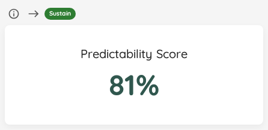

The overview widget gives you the score at a glance. If you want to inspect how the distribution was calculated, open the details view.

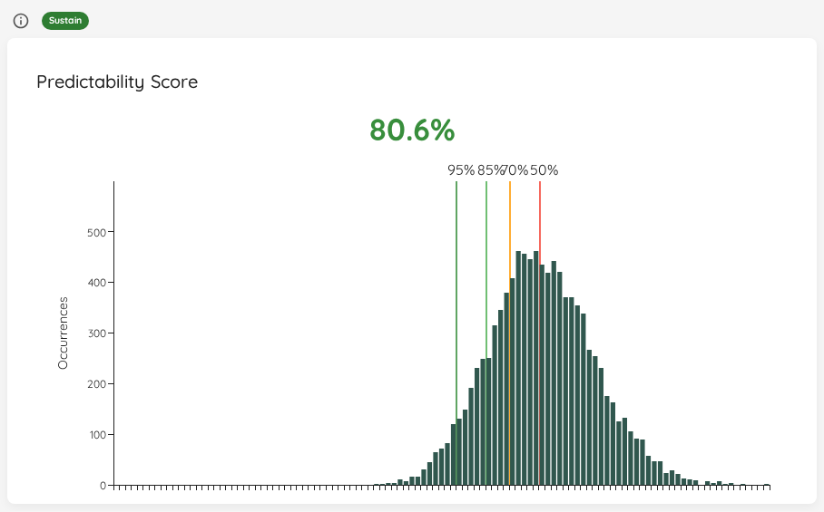

The score is calculated like this:
> (*Value at 95th Percentile* / *Value at 50% Percentile*) * 100

You can interprete the value as follows:
- The closer you are to 100%, the closer together your 50% and 95% chance are
- If you were at 100%, this means that every single day, you closed exactly the same amount of items, and thus are *perfectly predictable*

The idea behind the score is that, if your percentiles are very much "away" from each other (meaning the values are far off), the forecast will most likely not be of much use to you. So if your goal is predictability, this can be a trigger for a discussion to see how to "get the score up" and thus become more predictable. Ways to do that include (but are not limited to, and highly depend on your context):
- Asking LetPeopleWork to help you out
- Trying to reduce your batch size, favoring more frequent but smaller delivery
- Reducing WIP and focusing on old items first and get them to done as fast as possible

{: .important}
The goal is not to be at 100%. In fact, that's far from realistic. We believe any value above 60% is decent. The intent of this chart is to show the results of an MCS for various inputs. For example if the throughput is distributed differently, or you take a longer or different range.

## Status Indicator

| Status | Condition |
|---|---|
| 🔴 Act | Score is below 40% — throughput is highly variable and forecasts will be unreliable. |
| 🟡 Observe | Score is between 40% and 60% — investigate whether bulk closings or other patterns are affecting stability. |
| 🟢 Sustain | Score is above 60% — forecasts are considered trustworthy. |

# Percentiles Over Time

|--------------|-------------------------|
| **Applies to** | Teams and Portfolios |
| **Flow Metric** | Cycle Time, Work Item Age |
| **Affected by Filtering** | Yes — the chart plots the days inside the selected range, so by default you see the last 30 days for a Team (or whatever range that Team is configured with) and the last 90 for a Portfolio. Widen the pickers to see further back. With [filling in past days](#filling-in-past-days-preview) switched on, the selected range is also the stretch whose missing days get filled in. |

The percentile widgets tell you where you stand *today*. This chart tells you which way you are moving: Lighthouse records the 50th, 70th, 85th, and 95th percentile once per day and plots each as its own line, so you can see whether your percentiles are tightening, drifting apart, or holding steady.

The lines keep the same red→green ramp as the point-in-time percentile widgets: the 50th percentile is red (least certain), the 95th is green (most certain).

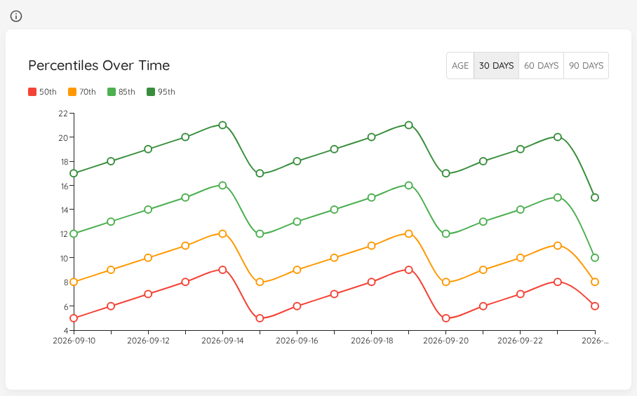

Use the toggle in the widget header to pick what is plotted:

| Selection | What it shows |
|---|---|
| **Age** | The Work Item Age percentiles of the items that were in progress on each recorded day. |
| **30 days** | The Cycle Time percentiles over the trailing 30 days. This is the default. |
| **60 days** | The Cycle Time percentiles over the trailing 60 days. |
| **90 days** | The Cycle Time percentiles over the trailing 90 days. |

The three Cycle Time horizons are recorded separately, so switching between them looks at the same days through a shorter or longer lens. The 30-day line reacts quickly to a change, the 90-day line smooths it out — if the short horizon moves and the long one does not, you are looking at something recent.

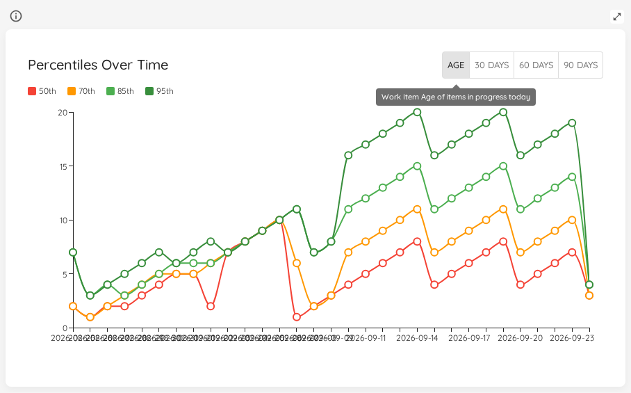

Work Item Age is measured as of the day it was recorded, so it carries no horizon and gets its own tab rather than a set of day options.

A day with nothing to measure draws no point rather than a point at zero. On a Cycle Time tab that is a day on which no Work Item finished in the 30, 60 or 90 days leading up to it; on the Age tab, a day on which nothing was in progress. This holds for the days Lighthouse records as they happen as well as for [filled-in days](#filling-in-past-days-preview), and whether or not filling in is switched on.

{: .important}
On a quiet Team you will notice this: where the lines used to drop to zero, they now break off and pick up again once there is something to measure. Days recorded at zero by an earlier version of Lighthouse stay as they were.

{: .note}
When there is nothing to show for the range you picked, the chart says *"Nothing to show for the selected range. Days appear here as Lighthouse records them."* It is the same sentence whatever the reason — the range lies before anything Lighthouse holds for this Team or Portfolio, nothing has been recorded yet, syncing stopped before the range began, or the days are still being filled in — and whether filling in is switched on or off. With it on, a range that can be filled shows this sentence the first time you open it; open it again shortly.

## Filling in past days (Preview)

Out of the box, this chart and [PBC Over Time](#pbc-over-time) show only the days Lighthouse recorded: one point a day, from the day your instance started recording. A Team added last week, or an instance that does not run every day, leaves the line short or full of holes — even though the Work Items Lighthouse already stores say what those days looked like.

Switch on **Fill in past days on over-time charts** under [Behaviour Settings](../settings/configuration.html#fill-in-past-days-on-over-time-charts-preview) and Lighthouse works those missing days out from the stored history. It is a **Preview** and it is **off by default**, on a new instance and on one that upgrades alike. Only a System Admin can switch it, and it takes effect without a restart.

How the fill proceeds:

- **In the background, when a chart is opened.** Opening either chart for a range with missing days starts the fill; the chart does not wait for it. What you are looking at is what was there already, and the filled days appear the next time you open the chart.
- **A bounded amount per visit.** Each visit works out up to 90 days, oldest first, so a long range — a year, say — fills in over several visits.
- **Every over-time chart of that Team or Portfolio at once.** A filled day covers every tab of this chart and every metric of PBC Over Time, not just the one you opened.
- **Only where the stored history reaches.** Days before the first Work Item that Team or Portfolio finished, and days after its last successful sync, stay empty: nothing stored says what they looked like.
- **Missing days only.** A day that was already recorded is never changed.

A filled day looks exactly like a recorded one, but it is worked out afterwards, against **today's** configuration — state mappings, Cycle Time definitions, blocked rules, blackout configuration and the current set of Work Items. Where any of those changed since, or a Work Item was deleted or moved to a different parent, a filled day may differ from what would have been recorded on that day. If the past looks different from what you remember, let us know.

{: .important}
Switching the fill off stops any further filling, but **the days already filled stay**. They cannot be told apart from recorded ones, so there is no way to single them out afterwards. If you might want your unfilled history back, [take a backup](../settings/databasemanagement.html#backup) before you switch it on.

The demo data ships with a backdated history, so its charts are populated as soon as it is loaded. Loading demo data does not switch the fill on. If you switch it on, the fill leaves the demo's backdated days as they are and works out only the days that are still missing.

## Status Indicator
This widget has no status indicator. It shows a direction of travel rather than a value that is healthy or unhealthy on its own — read it alongside [Cycle Time Percentiles](flow-overview.html#cycle-time-percentiles) and [Work Item Age Percentiles](flow-overview.html#work-item-age-percentiles), which do carry one.

# PBC Over Time

|--------------|-------------------------|
| **Applies to** | Teams and Portfolios |
| **Flow Metric** | Throughput, Work Item Age, Work In Progress, Cycle Time, Arrivals, and Feature Size (Portfolios only) |
| **Affected by Filtering** | Yes — the chart plots the days inside the selected range, so by default you see the last 30 days for a Team (or whatever range that Team is configured with) and the last 90 for a Portfolio. Widen the pickers to see further back. With [filling in past days](#filling-in-past-days-preview) switched on, the selected range is also the stretch whose missing days get filled in. |

A [Process Behaviour Chart](#process-behaviour-charts) tells you whether a given data point is normal *for your system*. This chart tells you whether your system's idea of "normal" is itself moving: Lighthouse records the average and both natural process limits once per day and plots all three over time.

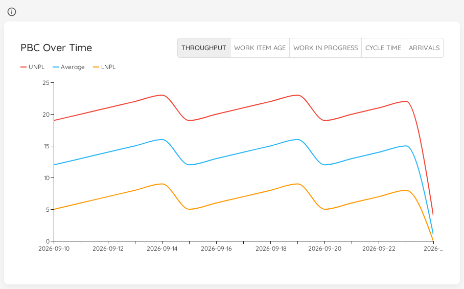

| Line | Meaning |
|---|---|
| **UNPL** | The Upper Natural Process Limit on that day. |
| **Average** | The average the limits were derived from. |
| **LNPL** | The Lower Natural Process Limit on that day. |

On the point-in-time Process Behaviour Charts the limits are neutral, dashed reference lines drawn over your measured data. Here the limits *are* the data, so each one is drawn solid and in its own colour.

What the shape tells you:

- **The band widens** — variability is growing. The same process is producing an ever-wider range of outcomes, and forecasts built on it get less useful.
- **The band narrows** — variability is shrinking and the process is becoming more predictable.
- **The whole band shifts up or down** — the average level moved. Together with the special-cause signals on the point-in-time chart, this is how you tell whether a change you made actually stuck.

Use the toggle in the widget header to pick the metric family. Lighthouse records natural process limits for **Throughput**, **Work Item Age**, **Work In Progress**, **Cycle Time**, and **Arrivals**, plus **Feature Size** on a Portfolio — a Team has no feature sizes to chart, so that family is not offered there.

{: .important}
The limits are only as meaningful as the *baseline* they are computed from. Configure it in your Team ([Create/Edit Teams](../teams/edit.html#process-behaviour-chart-baseline)) or Portfolio ([Create/Edit Portfolios](../portfolios/edit.html#process-behaviour-chart-baseline)) settings. Without one, Lighthouse falls back to a rolling window ending today — so the recorded limits move as that window slides, for reasons that have nothing to do with your process. On a fixed baseline, movement in this chart is a real signal.

{: .note}
Like [Percentiles Over Time](#percentiles-over-time), this chart shows the days Lighthouse recorded and, once [filling in past days](#filling-in-past-days-preview) is switched on (a Preview, off by default), the past days it worked out from the stored history — for every metric, on every Team and Portfolio. A filled day's limits are worked out as they stood on that day: without a fixed baseline, the rolling window ends on that day rather than today. A day on which no limits could be worked out draws no point. An empty chart says *"Nothing to show for the selected range. Days appear here as Lighthouse records them."*

{: .note}
The demo data ships with a backdated history for **Throughput** only. With filling in switched off — and loading demo data does not switch it on — the other metrics start empty on demo data and build up from today, one day at a time. With it switched on, they are filled in from the demo Work Items like any other Team's or Portfolio's, while the backdated Throughput days are left as they are.

## Status Indicator
This widget has no status indicator. The point-in-time [Process Behaviour Charts](#process-behaviour-charts) carry the special-cause status; this chart shows how the limits behind it have moved.

# Process Behaviour Charts

|--------------|-------------------------|
| **Applies to** | Teams and Portfolios |
| **Flow Metric** | Cycle Time, Throughput, WIP, Work Item Age |
| **Affected by Filtering** | Yes |

Process Behaviour Charts (PBCs) help you understand whether changes in your system are likely just normal variability, or whether you are seeing a *special cause* (something worth investigating).

{: .important}
These charts need a *baseline* to work. You can configure the bsaeline in your Team/Portfolio settings. If no baseline is set, Lighthouse will use the selected time frame as a baseline. Please note that we recommend setting a baseline in order to make proper use of the PBC functionality.

Configure it here:
- Team: [Create/Edit Teams](../teams/edit.html#process-behaviour-chart-baseline)
- Portfolio: [Create/Edit Portfolios](../portfolios/edit.html#process-behaviour-chart-baseline)

On each chart, Lighthouse visualizes:
- **Average** line
- **Natural process limits** (UNPL / LNPL)
- **Special causes** (via the chips in the top-right)

You can click a chip (e.g. *Large Change*) to highlight points that match that special-cause rule. Clicking on a data point opens a dialog with the work items that make up that point.

{: .note}
If [Blackout Periods](../settings/configuration.html#blackout-periods) are configured, those days are highlighted with a hatched overlay on all PBC charts. This prevents you from misinterpreting expected gaps or dips as special causes.

## Status Indicator (all PBC charts)

All PBC charts share the same status logic:

| Status | Condition |
|---|---|
| 🔴 Act | No baseline is configured, *or* a **Large Change** special cause is detected in any data point. |
| 🟡 Observe | A **Moderate Change** special cause is detected (but no Large Change). |
| 🟢 Sustain | A baseline is configured and no special causes are detected. |

## Cycle Time Process Behaviour Chart

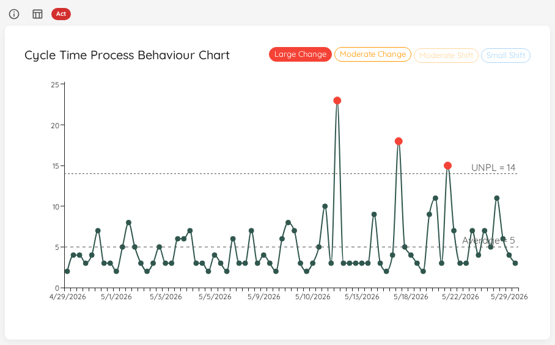

## Throughput Process Behaviour Chart

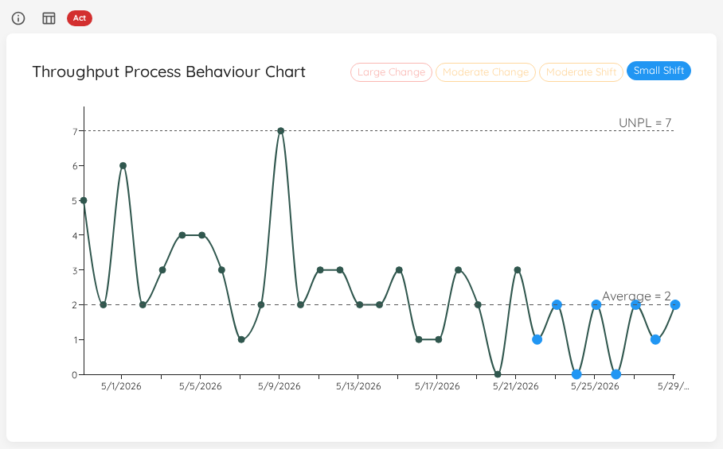

## Total Work Item Age Process Behaviour Chart

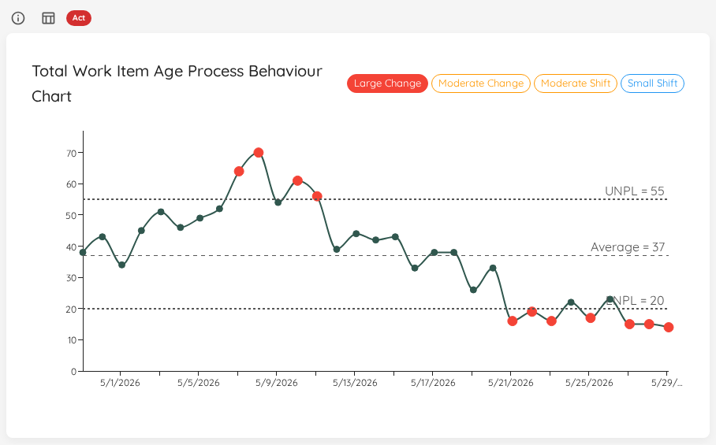

## Work In Progress Process Behaviour Chart

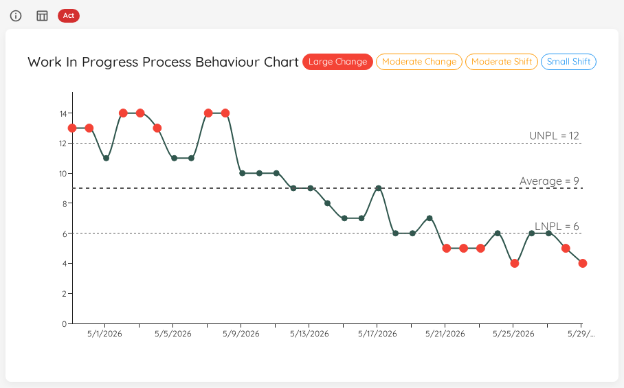

## Feature Size Process Behaviour Chart

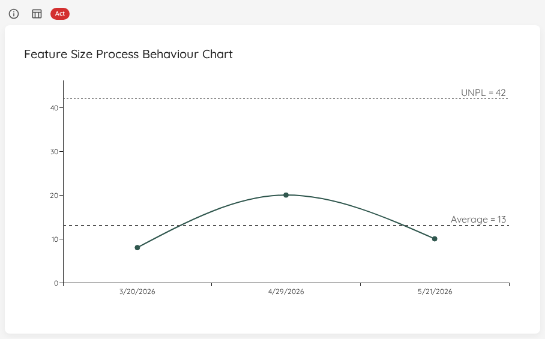

{: .note}
The Feature Size PBC only exists for Portfolios.

## Learn More

- [Deming Alliance](https://demingalliance.org/resources/articles/process-behaviour-charts-an-introduction)
- [Actionable Agile Metrics for Predictability Volume II](https://leanpub.com/actionableagilemetricsii)

# Arrivals Process Behaviour Chart

|--------------|-------------------------|
| **Applies to** | Teams and Portfolios |
| **Flow Metric** | Arrivals (items started) |
| **Affected by Filtering** | Yes |

The Arrivals PBC applies the same XmR-chart analysis as the other PBC widgets, but focused on the intake rate. It highlights special-cause variation in how many items are started per day, helping you detect unexpected changes in your arrival pattern.

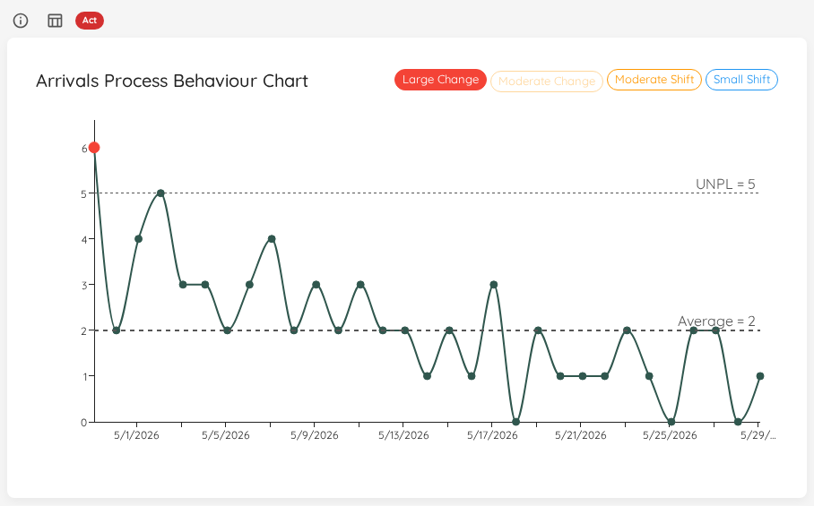

The Arrivals PBC shares the same status logic as all other PBC charts (see [Status Indicator](#status-indicator-all-pbc-charts)).
