Following a brief overview over the various metric widgets that are available in Lighthouse.

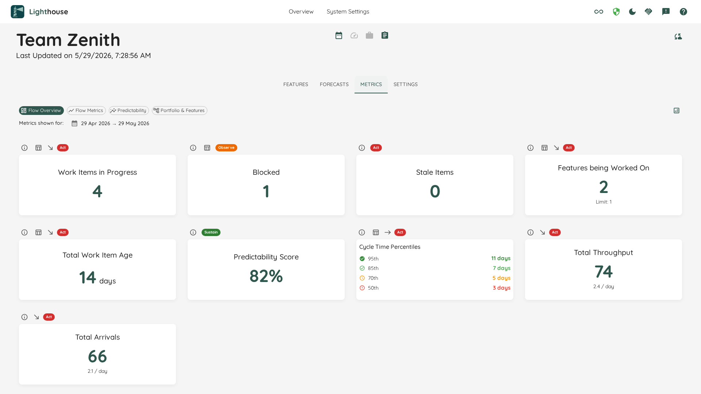

- TOC
{:toc}

# Details
Every widget on the Metrics Dashboard includes a **View Data** button (table icon) in its header. Clicking it opens a dialog showing the full set of work items that feed the widget. This gives you quick access to the underlying data without navigating away.

Some charts also support **chart-specific drill-ins**: clicking a bar, bubble, data point, or pie segment opens a dialog scoped to that particular subset (e.g. items for a single day or a specific parent feature). These context-specific interactions remain unchanged.

# Status Indicators

Most widgets display a status indicator in one of three states. The labels used in the UI are:

| Status | Colour | Meaning |
|---|---|---|
| **Sustain** | 🟢 Green | The metric is healthy. Keep doing what you're doing. |
| **Observe** | 🟡 Amber | Something warrants attention. Monitor closely and consider action. |
| **Act** | 🔴 Red | Something requires immediate action or configuration is missing. |

Each widget section below documents exactly how the status is calculated.

# Dashboard Categories

Widgets are organized into four dashboard categories. Each category groups related metrics around a specific question. Use the category selector at the top of the metrics page to switch between them.

| Category | Question it answers | Widgets |
|---|---|---|
| **Flow Overview** | How is my system doing at a glance? | WIP Overview, Blocked Overview, Features Worked On Overview (Teams only), Total Work Item Age, Predictability Score, Cycle Time Percentiles, Started vs. Closed (Total Throughput & Total Arrivals), Feature Size Percentiles (Portfolios only) |
| **Flow Metrics** | What do detailed flow trends look like? | Cycle Time Scatterplot, Work Item Aging Chart, Throughput Run Chart, Simplified CFD, WIP Over Time, Total Work Item Age Over Time |
| **Predictability** | Can we trust our forecasts? | Predictability Score Details, Arrivals Run Chart, Throughput PBC, Arrivals PBC, WIP PBC, Total Work Item Age PBC, Cycle Time PBC, Feature Size PBC (Portfolios only) |
| **Portfolio & Features** | How do features flow through the system? | Work Distribution, Feature Size (Portfolios only), Estimation vs. Cycle Time |

{: .note}
Some widgets appear in more than one category when they are relevant to multiple questions. A few widgets are scoped to Teams only or Portfolios only as noted above.

## Trend Indicators

Flow Overview widgets display trend indicators comparing the current date range to a prior period of equal length. Each widget's trend uses one of two comparison methods:

| Method | Widgets | How it works |
|---|---|---|
| **Snapshot compare** | WIP Overview, Features Worked On (Teams), Total Work Item Age | Compares the snapshot value at the end date against the snapshot value at the start date. |
| **Previous period** | Total Throughput, Total Arrivals, Predictability Score, Cycle Time Percentiles, Feature Size Percentiles | Compares the aggregate for the selected date range against the same-length window immediately preceding the start date. |

Blocked Overview does not show a trend indicator.

For percentile widgets (Cycle Time Percentiles and Feature Size Percentiles), the trend tooltip shows a per-percentile breakdown in `previous → **current**` format with the current-period values emphasized.

## Date-Aware Snapshots

The WIP Overview, Features Worked On, and Total Work Item Age widgets use the selected date range to determine which items to include. The backend resolves the snapshot as of the end date rather than always returning the current state. This means changing the date range will change the displayed values to reflect the system state at the selected date.

# WIP Overview

|--------------|-------------------------|
| **Applies to** | Teams and Portfolios |
| **Flow Metric** | WIP |
| **Affected by Filtering** | Yes — snapshot as of selected end date |

This widget shows the total number of items currently in progress based on the states you configured as *Doing*.

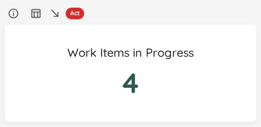

If a *System WIP Limit* is configured for the Team or Portfolio, the widget visualizes that goal and colors the value accordingly.

Use the **View Data** button to open the full list of in-progress items that currently contribute to the count.

## Status Indicator

| Status | Condition |
|---|---|
| 🔴 Act | No System WIP Limit is configured, *or* current WIP exceeds the limit. |
| 🟡 Observe | WIP is below the limit (capacity is available). |
| 🟢 Sustain | WIP exactly matches the System WIP Limit. |

# Blocked Overview

|--------------|-------------------------|
| **Applies to** | Teams and Portfolios |
| **Flow Metric** | Work Item Age |
| **Affected by Filtering** | No |

This widget shows how many items are currently blocked.

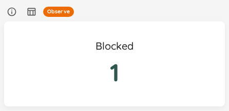

The target is always zero blocked items. Use the **View Data** button to see all currently blocked items.

{: .important}
This widget is **not affected** by the date filtering. It always shows the **current** blocked state.

## Status Indicator

| Status | Condition |
|---|---|
| 🔴 Act | No blocked indicators are configured, *or* 2 or more items are blocked. |
| 🟡 Observe | Exactly 1 item is blocked. |
| 🟢 Sustain | No items are blocked. |

# Features Worked On Overview

|--------------|-------------------------|
| **Applies to** | Teams only |
| **Flow Metric** | WIP |
| **Affected by Filtering** | Yes — snapshot as of selected end date |

This widget shows how many parent features currently have at least one child item in progress.

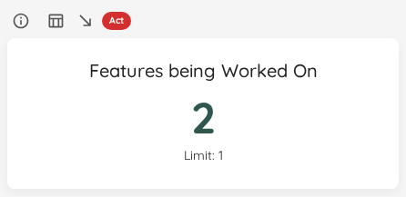

The team's [Feature WIP](../teams/edit.html#feature-wip) is visualized as a goal on the widget.

{: .note}
The number is based on parent items that are actively being worked on. It does not matter whether the parent feature is in *To Do*, *Doing*, or *Done*.

{: .note}
This metric is only available for Teams.

## Status Indicator

| Status | Condition |
|---|---|
| 🔴 Act | No Feature WIP is configured, *or* the number of features being worked on exceeds the limit. |
| 🟡 Observe | Fewer features are being worked on than the Feature WIP limit. |
| 🟢 Sustain | Feature count exactly matches the Feature WIP limit. |

# WIP Over Time

|--------------|-------------------------|
| **Applies to** | Teams and Portfolios |
| **Flow Metric** | WIP |
| **Affected by Filtering** | Yes |

The WIP Over Time chart shows you how the WIP evolved over the selected time range. You can spot whether you increased, decreased, or stayed stable. It also helps to see patterns in WIP.

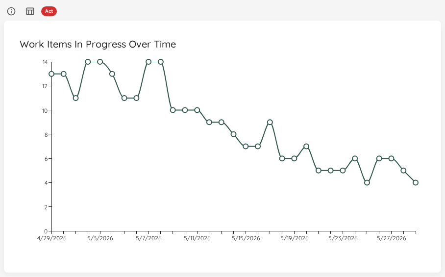

If you click on a specific day, it will show you the details of which items were in progress on that specific day.

If you have defined a *System WIP Limit*, you can show this as a horizontal line on your chart.

{: .note}
If [Blackout Periods](../settings/configuration.html#blackout-periods) are configured, those days are highlighted with a hatched overlay on this chart, making it easy to identify expected gaps in your WIP data.

## Status Indicator

| Status | Condition |
|---|---|
| 🔴 Act | No System WIP Limit is configured, *or* WIP exceeded the limit on more days than it was at or below the limit. |
| 🟡 Observe | WIP was below the limit on more days than it was at or above it, *or* the distribution across above/at/below is uneven without a clear majority. |
| 🟢 Sustain | WIP was exactly at the System WIP Limit on more than 50% of days. |

# Work Item Aging Chart

|--------------|-------------------------|
| **Applies to** | Teams and Portfolios |
| **Flow Metric** | WIP, Work Item Age |
| **Affected by Filtering** | Yes |

The Work Item Aging Chart shows you all in progress items on a scatter plot:

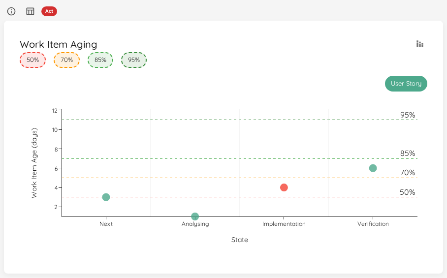

On the x-axis you will find the different states you've configured in the settings of your team/portfolio.
On the y-axis, you'll see how long each particular item is in progress already.

Similar to the [Cycle Time Scatterplot](#cycle-time-scatterplot), multiple items are grouped in a bubble that is shown bigger. If you want more details, you can click on a specific bubble.
You can selectively show various percentiles from your cycle time for the selected range, as well as the Service Level Expectation if you have configured it.

The chart distinguishes items by type, using different colors for each item type. The legend allows you to show or hide specific item types.

{: .note}
If there is a blocked item, it will appear as a red dot in the chart.

{: .note}
Jira note: Lighthouse identifies blocked items using the blocked tags or blocked states configured on Teams/Portfolios. If you use Jira's built-in `Flag` feature, add a `Flagged` label to your blocked tags so flagged issues appear as blocked in charts and widgets.

## Status Indicator

| Status | Condition |
|---|---|
| 🔴 Act | No SLE is configured, *or* no blocked indicators are configured, *or* the percentage of items exceeding the SLE is greater than the allowed percentage (100% − SLE percentile) *and* at least one item is also blocked. |
| 🟡 Observe | Some items exceed the SLE or at least one item is blocked, but not both conditions together. |
| 🟢 Sustain | All in-progress items are within the SLE and no items are blocked. |

# Work Distribution

|--------------|-------------------------|
| **Applies to** | Teams and Portfolios |
| **Flow Metric** | WIP, Cycle Time |
| **Affected by Filtering** | Yes |

The Work Distribution chart provides a visual breakdown of how work items are distributed across their parent work items (such as Features, Epics, or Initiatives). This pie chart helps you understand where your team's effort is focused.

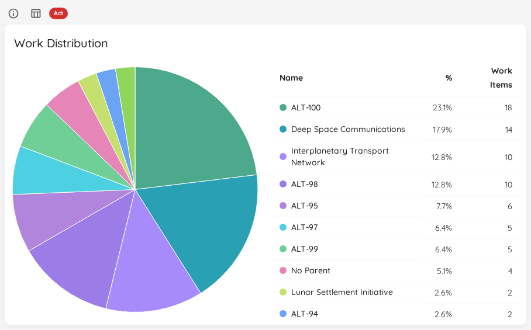

The chart displays:
- Each segment represents a parent work item and its associated child items
- The size of each segment corresponds to the number of child work items
- Hovering over a segment shows the exact count and percentage
- Items without a parent are grouped under "No Parent"

Additionally, the widget includes a table that presents the same data in tabular form, allowing for easy sorting and filtering of the work distribution information.

## Viewing Details

Click on any segment of the pie chart to open a detailed dialog showing:
- The parent work item reference
- List of all child work items in that group
- Each work item's cycle time (for completed items) or work item age (for items in progress)
- Additional work item details (title, ID, state)

This visualization helps you:
- Identify which features or epics are consuming the most team capacity
- Spot imbalances in work distribution across different initiatives
- Understand the relationship between parent initiatives and actual work being done
- Find work items that may not be properly linked to parent items

{: .note}
The chart combines both completed work items (from the selected date range) and items currently in progress to give you a complete picture of work distribution. This means you can see not just what was done, but also what's currently being worked on under each parent item.

## Status Indicator

| Status | Condition |
|---|---|
| 🔴 Act | 20% or more of work items are not linked to a feature, *or* no Feature WIP is configured, *or* work is spread across more than 120% of the Feature WIP limit. |
| 🟡 Observe | Work is spread across slightly more features than the Feature WIP limit (up to 120% of it), *or* unlinked items are below 20%. |
| 🟢 Sustain | Work is spread across a number of features within the Feature WIP limit, and fewer than 20% of items are unlinked. |

# Started vs. Closed

|--------------|-------------------------|
| **Applies to** | Teams and Portfolios |
| **Flow Metric** | Throughput, WIP |
| **Affected by Filtering** | Yes |

The *Started vs. Closed* widget shows you how many items you were completing (your total Throughput) and how many items were started (also called *Arrival rate*) during the selected time frame. It will also show you how many items were closed and started on average per day with your current settings:

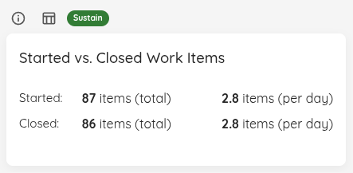

The goal is to quickly see whether you are having a stable WIP, or if you either start more items than you close (increasing WIP) or close more than you start (decreasing WIP). The widget includes a visual indication that shows you a *Red/Amber/Green* kind of scale, depending on how *far apart* the arrival and throughput numbers are.

As a rule of thumb, you should try to match your started items with how many items leave your process. This is where the daily average can help: If you close 1.1 items per day, you know that you should more or less start:
- 1 new item per day OR
- 5 items per week OR
- 11 items every two weeks

This can help you to prepare just enough items for your team(s). Whether you do it daily or in bigger batches (for example having a refinement session per week), using this information helps you make sure you are neither under- nor over-prepared.

If you want to know more details, use the **View Data** button in the widget header to see all started and closed items for the selected time range.

## Status Indicator

| Status | Condition |
|---|---|
| 🔴 Act | No System WIP Limit is configured, *or* started count exceeds closed count by more than 5%. |
| 🟡 Observe | Closed significantly exceeds started (process may be starving for new work). |
| 🟢 Sustain | Both are 0, *or* the absolute difference is less than 2, *or* the relative difference is within 5%. |

# Throughput Run Chart

|--------------|-------------------------|
| **Applies to** | Teams and Portfolios |
| **Flow Metric** | Throughput |
| **Affected by Filtering** | Yes |

To visualize the Throughput, there is a Run Chart shows the Throughput over time, sampled by days.

You can see how many items were closed each day over the last several days. The more 'stable' your throughput is, the more accurate your forecast will be.

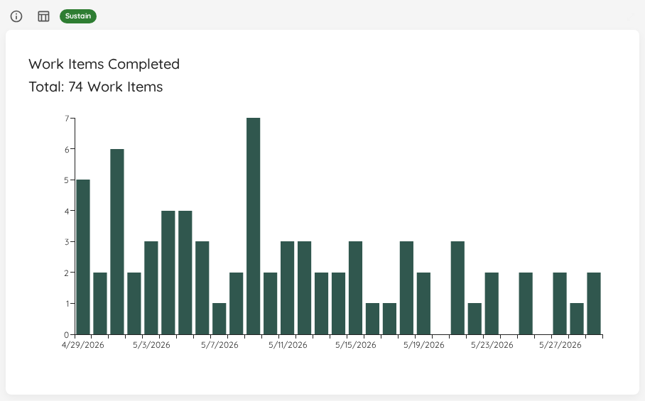

This widget will adjust based on the selected time range. If you want to know which exact items were closed, you can click on a specific day and get more details.

{: .note}
If [Blackout Periods](../settings/configuration.html#blackout-periods) are configured, those days are highlighted with a hatched overlay on this chart, so you can immediately see why Throughput was zero on certain days:

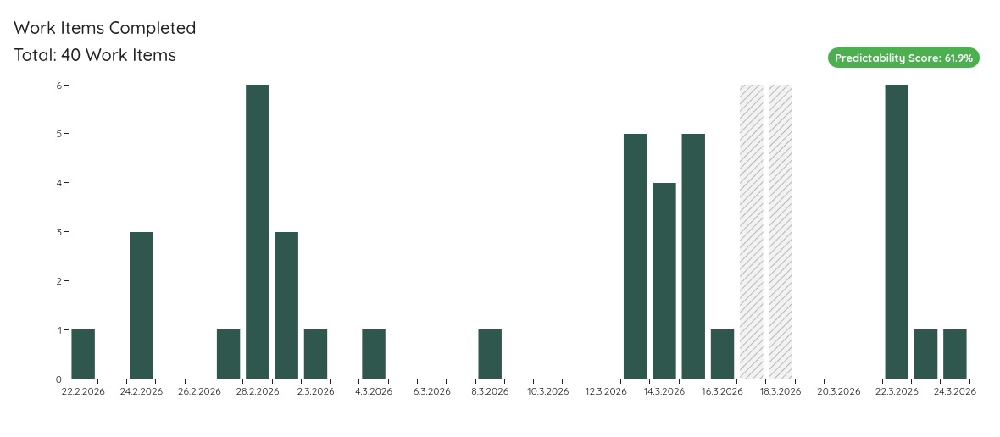

On the top right, you will see the *Predictability Score*. If you click on it, another widget is brought up:

## Status Indicator

The Throughput Run Chart checks for runs of 3 or more consecutive zero-throughput days (excluding configured Blackout Periods).

| Status | Condition |
|---|---|
| 🔴 Act | 2 or more separate runs of 3+ consecutive zero-throughput days detected. |
| 🟡 Observe | Exactly 1 run of 3 consecutive zero-throughput days detected. |
| 🟢 Sustain | No extended zero-throughput runs detected. |

# Arrivals Run Chart

|--------------|-------------------------|
| **Applies to** | Teams and Portfolios |
| **Flow Metric** | Arrivals (items started) |
| **Affected by Filtering** | Yes |

The Arrivals Run Chart shows the daily count of work items that were started (arrived into the system) over the selected date range. This complements the Throughput Run Chart by visualizing the intake side of flow: how much new work is entering the system each day.

Comparing Arrivals with Throughput helps you understand whether your flow is balanced — whether you are starting work at roughly the same rate you finish it — and whether arrivals are continuous or batched.

{: .note}
If [Blackout Periods](../settings/configuration.html#blackout-periods) are configured, those days are highlighted with a hatched overlay on this chart, so you can immediately see why arrivals were zero on certain days.

## Status Indicator

The Arrivals Run Chart uses a two-factor status:

1. **Primary signal:** Arrivals-versus-departures balance (using the same thresholds as Started vs. Closed).
2. **Secondary signal:** Batching detection — runs of 3+ consecutive zero-arrival days (excluding Blackout Periods) suggest work is starting in bursts rather than continuously.

| Status | Condition |
|---|---|
| 🔴 Act | No System WIP Limit is configured, *or* arrivals materially exceed departures. |
| 🟡 Observe | Arrivals are balanced overall, but noticeable batching (2+ runs of 3+ consecutive zero-arrival days) suggests work is starting in bursts. *Or* closed significantly exceeds started (process may be starving). |
| 🟢 Sustain | Arrivals are balanced with departures and no significant batching is detected. |

# Arrivals Process Behaviour Chart

|--------------|-------------------------|
| **Applies to** | Teams and Portfolios |
| **Flow Metric** | Arrivals (items started) |
| **Affected by Filtering** | Yes |

The Arrivals PBC applies the same XmR-chart analysis as the other PBC widgets, but focused on the intake rate. It highlights special-cause variation in how many items are started per day, helping you detect unexpected changes in your arrival pattern.

The Arrivals PBC shares the same status logic as all other PBC charts (see [Status Indicator](#status-indicator-all-pbc-charts)).

# Predictability Score

|--------------|-------------------------|
| **Applies to** | Teams and Portfolios |
| **Flow Metric** | Throughput |
| **Affected by Filtering** | Yes |

The Predictability Score is showing you the result of a how many forecast, based on the Throughput Run Chart of the currently selected range. Lighthouse will forecast how many items you can close in the next 30 days based on the specific Throughput run chart.

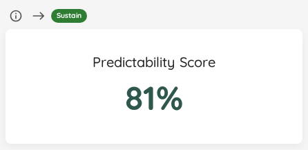

The overview widget gives you the score at a glance. If you want to inspect how the distribution was calculated, open the details view.

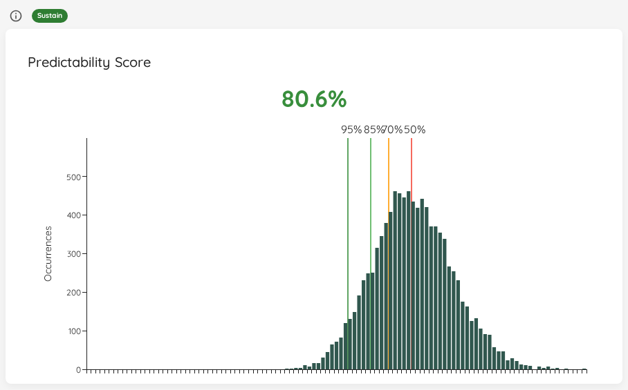

The score is calculated like this:
> (*Value at 95th Percentile* / *Value at 50% Percentile*) * 100

You can interprete the value as follows:
- The closer you are to 100%, the closer together your 50% and 95% chance are
- If you were at 100%, this means that every single day, you closed exactly the same amount of items, and thus are *perfectly predictable*

The idea behind the score is that, if your percentiles are very much "away" from each other (meaning the values are far off), the forecast will most likely not be of much use to you. So if your goal is predictability, this can be a trigger for a discussion to see how to "get the score up" and thus become more predictable. Ways to do that include (but are not limited to, and highly depend on your context):
- Asking LetPeopleWork to help you out
- Trying to reduce your batch size, favoring more frequent but smaller delivery
- Reducing WIP and focusing on old items first and get them to done as fast as possible

{: .important}
The goal is not to be at 100%. In fact, that's far from realistic. We believe any value above 60% is decent. The intent of this chart is to show the results of an MCS for various inputs. For example if the throughput is distributed differently, or you take a longer or different range.

## Status Indicator

| Status | Condition |
|---|---|
| 🔴 Act | Score is below 40% — throughput is highly variable and forecasts will be unreliable. |
| 🟡 Observe | Score is between 40% and 60% — investigate whether bulk closings or other patterns are affecting stability. |
| 🟢 Sustain | Score is above 60% — forecasts are considered trustworthy. |

# Process Behaviour Charts

|--------------|-------------------------|
| **Applies to** | Teams and Portfolios |
| **Flow Metric** | Cycle Time, Throughput, WIP, Work Item Age |
| **Affected by Filtering** | Yes |

Process Behaviour Charts (PBCs) help you understand whether changes in your system are likely just normal variability, or whether you are seeing a *special cause* (something worth investigating).

{: .important}
These charts need a *baseline* to work. You can configure the bsaeline in your Team/Portfolio settings. If no baseline is set, Lighthouse will use the selected time frame as a baseline. Please note that we recommend setting a baseline in order to make proper use of the PBC functionality.

Configure it here:
- Team: [Create/Edit Teams](../teams/edit.html#process-behaviour-chart-baseline)
- Portfolio: [Create/Edit Portfolios](../portfolios/edit.html#process-behaviour-chart-baseline)

On each chart, Lighthouse visualizes:
- **Average** line
- **Natural process limits** (UNPL / LNPL)
- **Special causes** (via the chips in the top-right)

You can click a chip (e.g. *Large Change*) to highlight points that match that special-cause rule. Clicking on a data point opens a dialog with the work items that make up that point.

{: .note}
If [Blackout Periods](../settings/configuration.html#blackout-periods) are configured, those days are highlighted with a hatched overlay on all PBC charts. This prevents you from misinterpreting expected gaps or dips as special causes.

## Status Indicator (all PBC charts)

All PBC charts share the same status logic:

| Status | Condition |
|---|---|
| 🔴 Act | No baseline is configured, *or* a **Large Change** special cause is detected in any data point. |
| 🟡 Observe | A **Moderate Change** special cause is detected (but no Large Change). |
| 🟢 Sustain | A baseline is configured and no special causes are detected. |

## Cycle Time Process Behaviour Chart

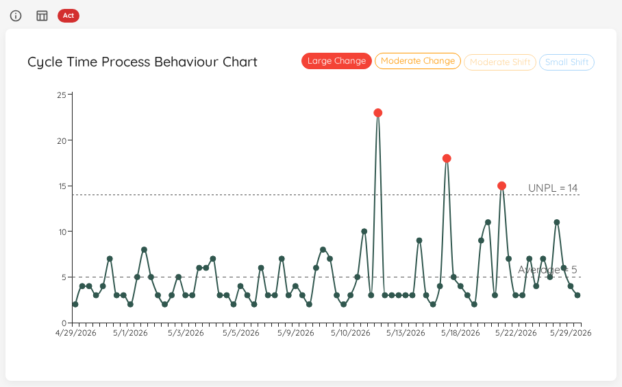

## Throughput Process Behaviour Chart

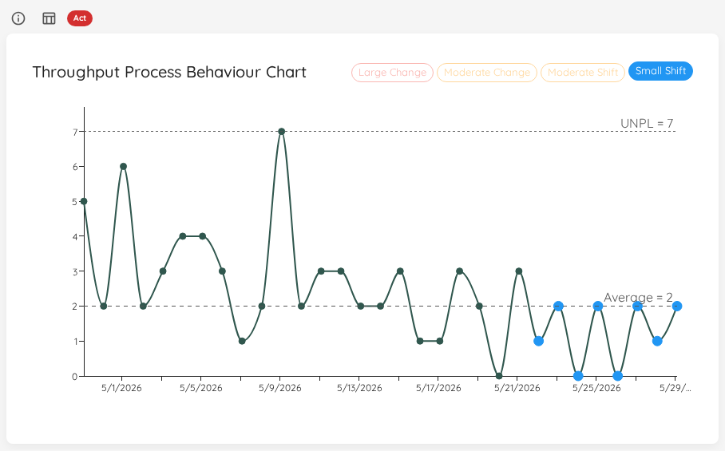

## Total Work Item Age Process Behaviour Chart

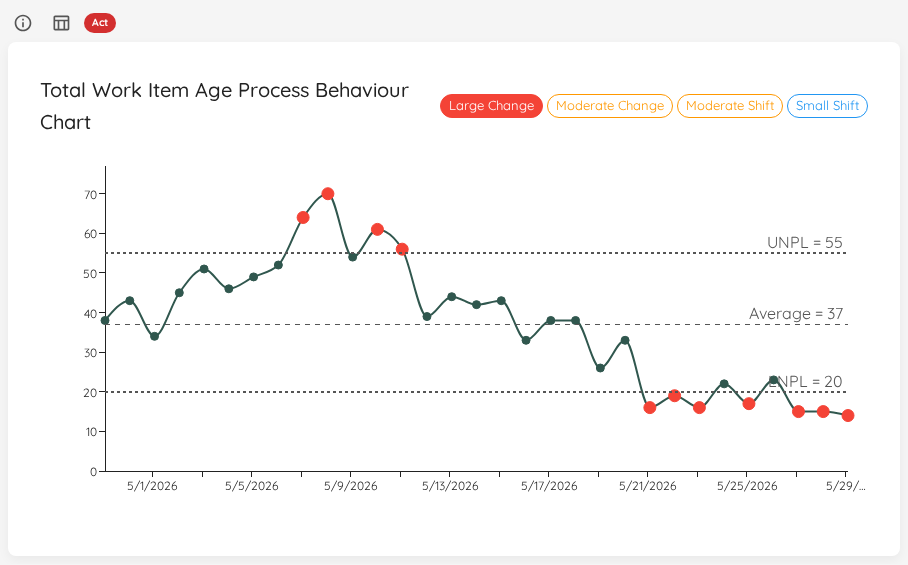

## Work In Progress Process Behaviour Chart

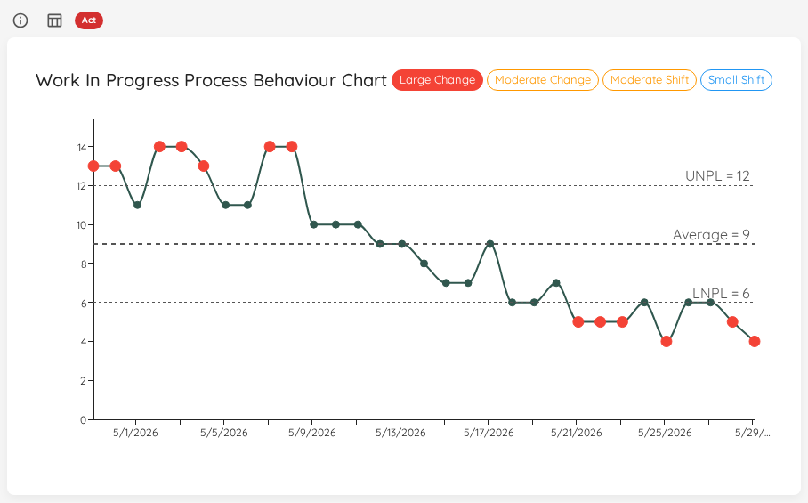

## Feature Size Process Behaviour Chart

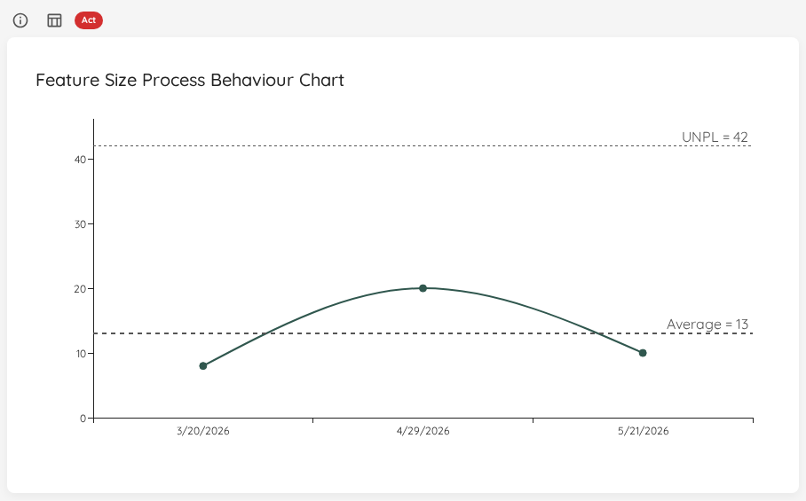

{: .note}
The Feature Size PBC only exists for Portfolios.

## Learn More

- [Deming Alliance](https://demingalliance.org/resources/articles/process-behaviour-charts-an-introduction)
- [Actionable Agile Metrics for Predictability Volume II](https://leanpub.com/actionableagilemetricsii)

# Cycle Time Percentiles

|--------------|-------------------------|
| **Applies to** | Teams and Portfolios |
| **Flow Metric** | Cycle Time |
| **Affected by Filtering** | Yes |

In this widget you can see the different percentiles of your Cycle Time. It's to get a quick view of where you stand, for example if you want to compare it to your Service Level Expectation.

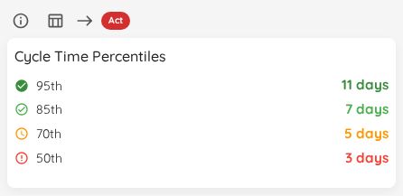

In case you have defined a [Service Level Expectation](../teams/edit.html#service-level-expectation), you will see the SLE on the top right.

Use the **View Data** button in the widget header to see all items that were closed in the respective date range. If you have defined an SLE, the Cycle Time coloring is based on how close (or above) the item got to the SLE.

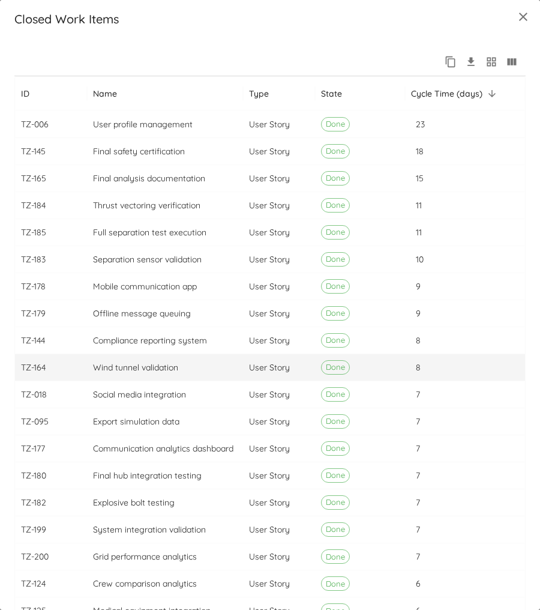

## Status Indicator

| Status | Condition |
|---|---|
| 🔴 Act | No SLE is configured, *or* no closed items exist in the range, *or* the percentage of items within the SLE is more than 20 percentage points below the SLE target. |
| 🟡 Observe | The percentage of items within the SLE is below the target by up to 20 percentage points. |
| 🟢 Sustain | The percentage of items within the SLE meets or exceeds the configured target percentile. Consider tightening the target. |

# Cycle Time Scatterplot

|--------------|-------------------------|
| **Applies to** | Teams and Portfolios |
| **Flow Metric** | Cycle Time |
| **Affected by Filtering** | Yes |

The Scatterplot shows the individual items in a chart, where the x-axis shows the dates the items were closed, and the y-axis how long they were in progress.
If there are items that were closed on the same day with the same cycle time, they are represented in a single bubble. The more items a bubble is representing, the bigger it is.

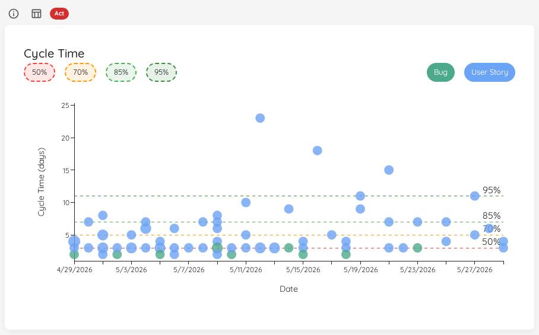

This visual allows you to see patterns or outliers. Hovering over a dot will give you additional information, and with a click you'll get a more detailed view about the item(s) represented by the specific dot.

You can click on the percentiles on top in the legend to show/hide them. Additionally, if you have defined an SLE, you can show the line on your scatterplot as well.

The chart also distinguishes items by type, using different colors for each item type. The legend allows you to show or hide specific item types.

{: .note}
If [Blackout Periods](../settings/configuration.html#blackout-periods) are configured, the corresponding date ranges are highlighted with a hatched overlay on this chart, helping you distinguish expected gaps from anomalies.

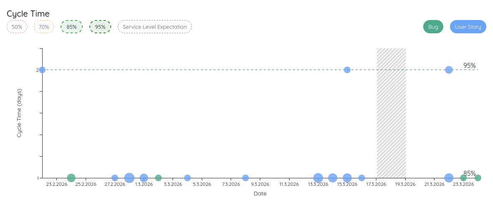

## Status Indicator

The allowed percentage of items above the SLE is `100% − SLE percentile` (e.g. 15% for an 85th-percentile SLE).

| Status | Condition |
|---|---|
| 🔴 Act | No SLE is configured, *or* the percentage of items exceeding the SLE is more than 10 percentage points above the allowed threshold. |
| 🟡 Observe | The percentage of items exceeding the SLE is above the allowed threshold but within 10 percentage points of it. |
| 🟢 Sustain | The percentage of items exceeding the SLE is within the expected threshold. |

# Estimation vs. Cycle Time

|--------------|-------------------------|
| **Applies to** | Teams and Portfolios |
| **Flow Metric** | Cycle Time |
| **Affected by Filtering** | Yes |

This scatter plot helps you understand how work item estimates correlate with actual cycle time. By visualizing this relationship, you can spot whether your estimations are in any way trustworthy compared with actual time it took to deliver.

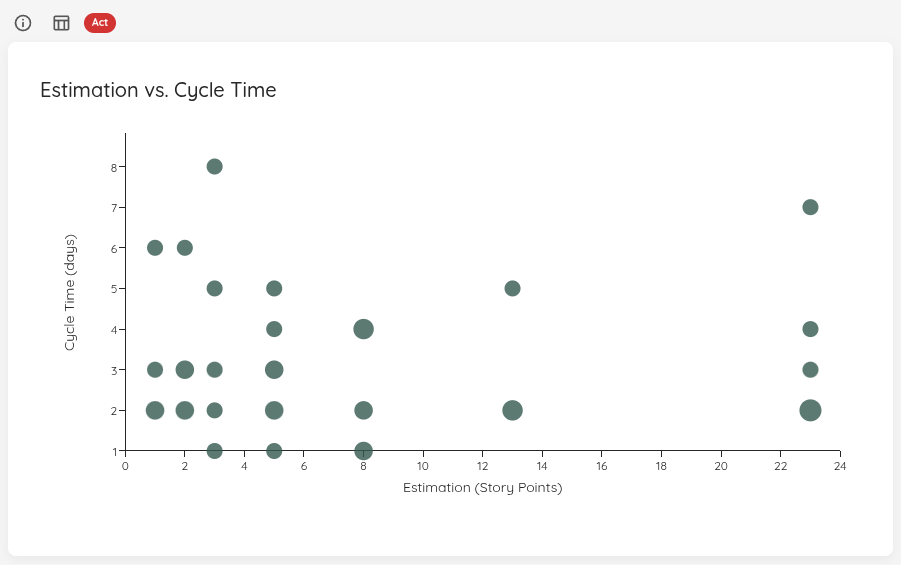

## Configuration

To use this chart, you first need to configure an estimation field in your Team or Portfolio settings. You can configure:
- **Numeric estimates**: Story points, t-shirt sizes with numeric values, or any custom numeric field
- **Categorical estimates**: T-shirt sizes (XS/S/M/L/XL) or other categorical fields with explicit ordering

## Chart Layout

The scatter plot displays:
- **X-axis**: Estimation values (story points, t-shirt sizes, or custom estimates)
- **Y-axis**: Cycle time (how long items took to complete)
- Each dot or bubble represents one or more completed work items from the selected time range
- Larger bubbles indicate multiple items with the same estimation and cycle time

Similar to the [Cycle Time Scatterplot](#cycle-time-scatterplot), you can click on any data point to drill into the underlying work items and see their details.

{: .note}
This chart only appears after you've configured an estimation field. If no estimation field is configured, the chart will not be visible.

## Status Indicator

The status is based on the **Spearman rank correlation** between estimates and actual cycle times — a measure of whether higher estimates consistently lead to longer cycle times.

| Status | Condition |
|---|---|
| 🔴 Act | Estimation is not configured, *or* the Spearman correlation is below 0.3 — no meaningful relationship between estimates and cycle time. |
| 🟡 Observe | Correlation is between 0.3 and 0.6 — a weak relationship exists; review your estimation approach. |
| 🟢 Sustain | Correlation is 0.6 or above — estimates correlate well with actual cycle time. |

{: .note}
A minimum of 2 data points is required to calculate correlation. With fewer items, the status defaults to **Sustain** until enough data is available.

# Simplified Cumulative Flow Diagram (CFD)

|--------------|-------------------------|
| **Applies to** | Teams and Portfolios |
| **Flow Metric** | Cycle Time, WIP, Throughput |
| **Affected by Filtering** | Yes |

This simplified version of a Cumulative Flow Diagram shows you how many items were in which state category (*Doing* or *Done*) over the selected time period. This helps you see patterns and problems with your flow. It's a *simplified* CFD because you will not see the detailed state itself, but just the overall category.

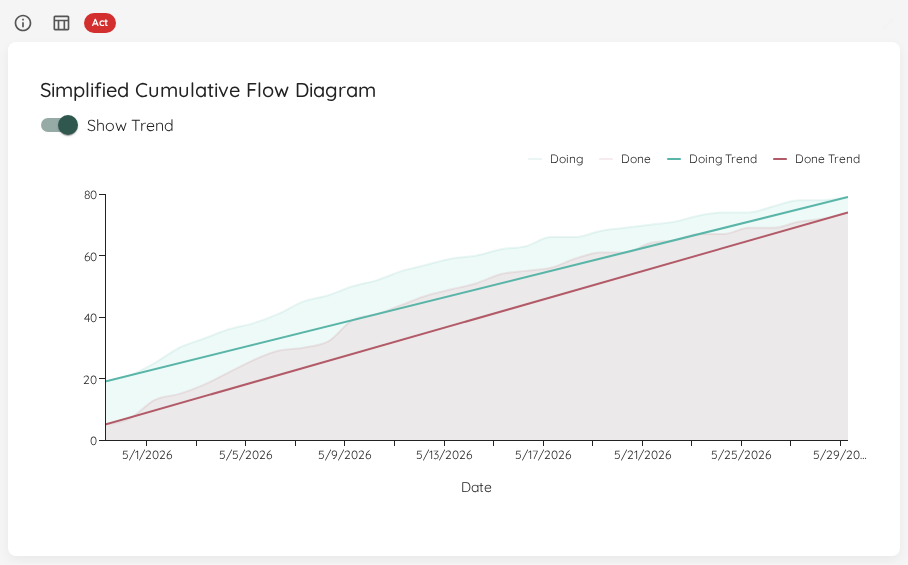

If you enable the trend lines, the start and end points of both areas will be connected. In general you want to aim for:
1. Making the lines parallel - this means you control your WIP well. If the lines are not parallel, you either start more than you finish or finish more than you start.
2. Bring the lines closer together - this means you will decrease your Cycle Time.
3. Increase the *angle* of the lines - this means you will increase your Throughput.

## Status Indicator

The CFD uses the same logic as [Started vs. Closed](#started-vs-closed): it compares the total number of items started against the total number of items closed over the selected period.

| Status | Condition |
|---|---|
| 🔴 Act | No System WIP Limit is configured, *or* started count exceeds closed count by more than 5%. |
| 🟡 Observe | Closed significantly exceeds started (process may be starving). |
| 🟢 Sustain | Started and closed are balanced (within 5% or an absolute difference of less than 2). |

# Total Work Item Age

|--------------|-------------------------|
| **Applies to** | Teams and Portfolios |
| **Flow Metric** | Work Item Age, WIP |
| **Affected by Filtering** | Yes — snapshot as of selected end date (Widget), Yes (Chart) |

The Total Work Item Age widget shows the cumulative age of all items currently in progress. This metric helps you understand the overall "inventory" age of your work in progress.

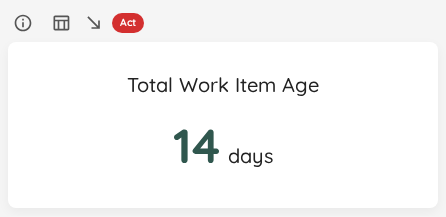

The widget displays a single number representing the sum of ages (in days) of all items currently in a *Doing* state. This gives you a quick view of your total WIP "burden" - the higher the number, the more accumulated age you're carrying in your system.

For example, if you have:
- Item A: 5 days old
- Item B: 3 days old  
- Item C: 2 days old

Your Total Work Item Age would be 10 days.

{: .important}
This widget is **not affected** by date filtering. It always shows the **current** total age of all items in progress.

## Status Indicator

The reference value is calculated as: **System WIP Limit × SLE days**. This represents the maximum acceptable total age if every in-progress item were exactly at the SLE boundary.

| Status | Condition |
|---|---|
| 🔴 Act | System WIP Limit or SLE is not configured, *or* the current total age already exceeds the reference value. |
| 🟡 Observe | The current total age is within the reference value, but adding today's WIP count (one additional day of aging) would push it over. |
| 🟢 Sustain | The current total age is within the reference value and not projected to exceed it tomorrow. |

## Total Work Item Age Over Time

To see how your total work item age has evolved, there's also a run chart showing the historical trend:

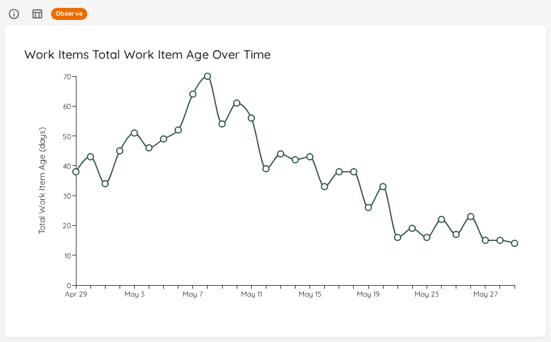

This chart visualizes how the cumulative age of your WIP has changed over the selected time period. You can use this to:
- Identify periods where age accumulated (indicating items getting stuck)
- See the impact of finishing old items (sharp drops in total age)
- Monitor whether your overall WIP age is trending up or down

If you click on a specific day, it will show you which items contributed to the total age on that date, along with each item's individual age at that point in time.

{: .note}
The age calculation for historical dates shows how old each item was on that specific date, not its current age. An item started 10 days ago would show age 1 on its first day, age 2 on its second day, and so on.

### Status Indicator (Over Time chart)

The over-time chart compares the total work item age at the **start** of the selected period to the value at the **end**.

| Status | Condition |
|---|---|
| 🔴 Act | Total age grew from 0 to a positive value, *or* it grew by more than 10% over the period. |
| 🟡 Observe | Total age dropped by more than 10% — items may have been removed or completed in a burst; verify the data. |
| 🟢 Sustain | Total age is stable (within ±10% change), or is 0 throughout. |

# Feature Size

|--------------|-------------------------|
| **Applies to** | Portfolios |
| **Flow Metric** | Cycle Time, Work Item Age, Throughput |
| **Affected by Filtering** | Yes |

This chart shows the size of your Features on a scatter plot, with the ability to filter by state category.

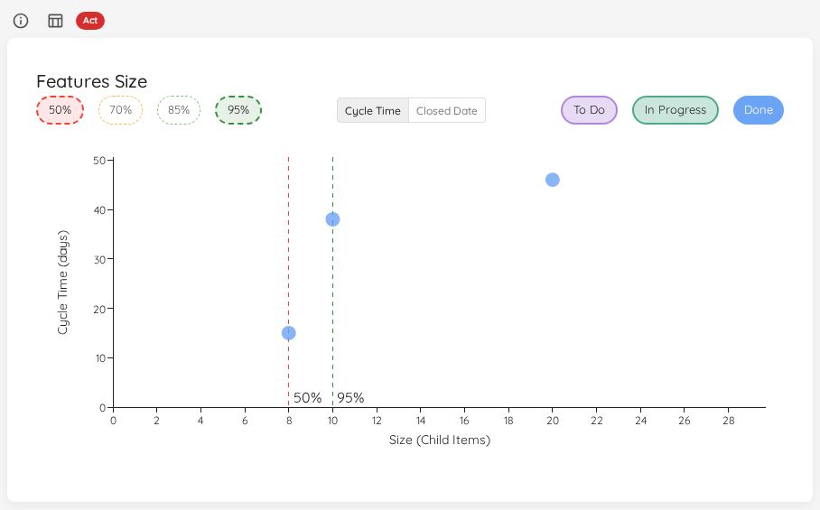

The chart displays features from your selected time range, with:
- **X-axis**: Feature size (number of child work items)
- **Y-axis**: Time metric (varies by state - see below)

{: .note}
When an estimation field is configured, the **Feature Size** chart includes a toggle that lets you switch the y-axis between estimation values and cycle time directly on the chart. If no estimation field is set, the chart continues to use cycle time as before.

## State Filtering

The chart includes three filter chips on the right side to show or hide features by state:

- **Done** (enabled by default): Shows completed features using their cycle time
- **To Do** (disabled by default): Shows unstarted features positioned at the y=0 baseline
- **In Progress** (disabled by default): Shows features currently being worked on using their work item age

{: .note}
Features in the To Do category with a size of 0 (no child work items) are automatically filtered out, as they represent features that haven't been broken down yet.

## Time Metrics by State

The y-axis value differs based on the feature's state:
- **Done features**: Display their **cycle time** (how long they took from start to completion)
- **In Progress features**: Display their **work item age** (how long they've been in progress)
- **To Do features**: Appear at **y=0** (no time elapsed yet)

This allows you to see:
- How feature size correlates with cycle time for completed features
- How long current features have been in progress relative to their size
- The size distribution of features in your backlog

## Percentile Lines

Similar to the [Cycle Time Scatterplot](#cycle-time-scatterplot), you can show percentile lines to understand your feature delivery patterns. Multiple features with the same size and time value are grouped in a bubble - the larger the bubble, the more features it represents.

Click on any bubble to see detailed information about the feature(s) it represents.

## Status Indicator

The Feature Size chart compares active (in-progress) features against a configured **Feature Size Target** percentile, derived from historical feature sizes.

| Status | Condition |
|---|---|
| 🔴 Act | No Feature Size Target is configured, *or* more than `(100% − target percentile) + 10%` of active features exceed the historical size at the target percentile. |
| 🟡 Observe | More than `100% − target percentile` of active features exceed the threshold, but within the 10 percentage point buffer. |
| 🟢 Sustain | The proportion of oversized active features is within the expected range. |

{: .note}
If no active features or no historical size data exist yet, the status defaults to **Sustain**.