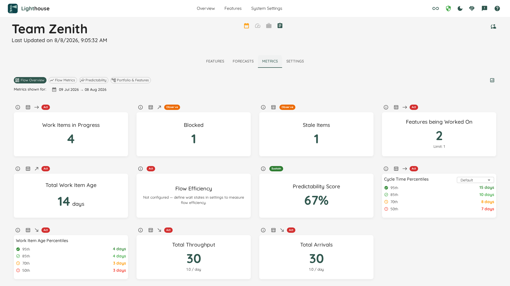
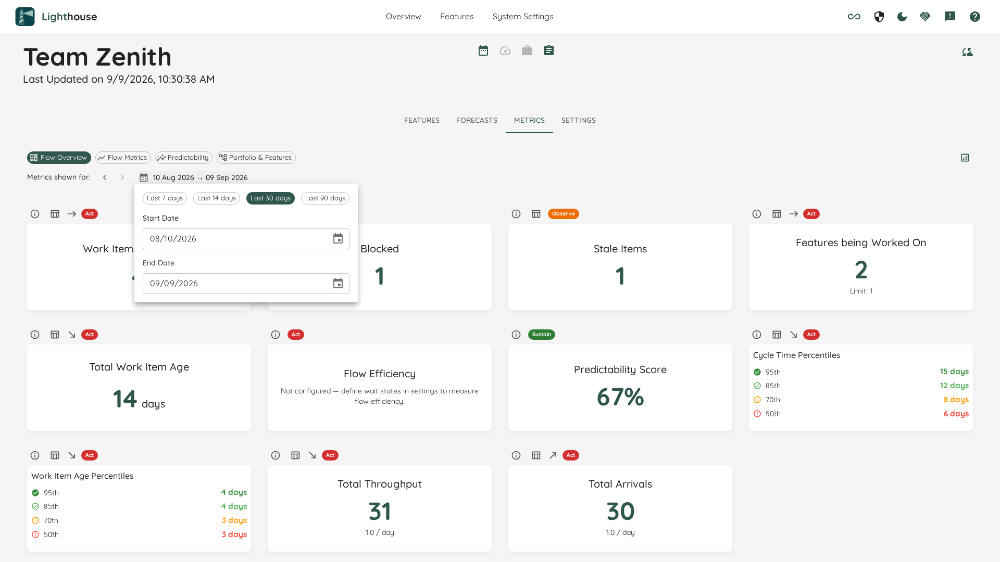

Lighthouse shows your metrics as a set of **widgets** on the metrics page of every team and portfolio. Each widget answers one question, and each one is documented in detail on the page for its category.

- TOC
{:toc}

# Widget Categories

Widgets are grouped into four categories, each built around a different question. Use the category selector at the top of the metrics page to switch between them.

| Category | Question it answers | Widgets |
|---|---|---|
| [**Flow Overview**](./flow-overview.html) | How is my system doing at a glance? | WIP Overview, Blocked Overview, Stale Items Overview, Features Worked On Overview (Teams only), Total Work Item Age, Flow Efficiency, Predictability Score, Cycle Time Percentiles, Work Item Age Percentiles, Total Throughput, Total Arrivals, Feature Size Percentiles (Portfolios only) |
| [**Flow Metrics**](./flow-metrics.html) | What do detailed flow trends look like? | Cycle Time Scatterplot, Work Item Aging Chart, Throughput Run Chart, WIP Over Time, Total Work Item Age Over Time, Arrivals Run Chart, Simplified CFD, Load Balance Matrix, Cumulative Time per State, Blocked Over Time |
| [**Predictability**](./predictability.html) | Can we trust our forecasts? | Predictability Score Details, Percentiles Over Time, PBC Over Time, Process Behaviour Charts (Throughput, Cycle Time, WIP, Total Work Item Age, Feature Size), Arrivals Process Behaviour Chart |
| [**Portfolio & Features**](./portfolio-features.html) | How do features flow through the system? | Work Distribution, Feature Size (Portfolios only), Estimation vs. Cycle Time |

{: .note}
A few widgets are scoped to Teams only or Portfolios only, as noted above and in each widget's own section.

# Working with the Dashboard

## Filtering

You can filter for a time range of your choice. Portfolios open on the last 90 days. Teams open on the range their throughput is configured over, so a team measuring throughput across six weeks opens on six weeks — unless it uses fixed throughput dates, in which case it opens on the last 30 days.

Click the date range in the header to change it. There are three ways to do so, and all of them move both ends of the range together except the pickers:

- **Named ranges.** The row of chips at the top of the panel jumps straight to a range ending today: 7, 14, 30 or 90 days for a team, and 30, 90 or 180 days for a portfolio. The chip matching the range on show is highlighted, and stops being highlighted as soon as you pick dates that don't match it.
- **The date pickers.** Set the start and end yourself, for anything the chips don't cover.
- **The arrows either side of the date range**, which walk the range you already have backwards and forwards a week at a time for a team, four weeks at a time for a portfolio. The length of the range never changes, so this is how you compare the same span of time across consecutive periods. The forward arrow is disabled once the range ends today, because Lighthouse has no data past it.

{: .note}
The arrows are meant to be clicked several times in a row, so Lighthouse waits about half a second after your last click before it reloads. While it waits, the date range in the header is greyed and italic to show that the widgets below still show the previous range.

Not every widget reacts to this the same way: some recalculate completely, some report a snapshot as of the selected end date, and a few ignore the range entirely. Every widget section states which of the three applies under **Affected by Filtering**.

## Expanding a Widget

Hovering over a widget reveals an **Expand** button in its top-right corner. Clicking it opens the widget full-screen, which helps with the denser charts.

## Viewing the Data Behind a Widget

Widgets that are backed by a concrete set of work items include a **View Data** button (table icon) in their header. Clicking it opens a dialog showing the full set of work items that feed the widget. This gives you quick access to the underlying data without navigating away.

**Total Throughput** and **Total Arrivals** carry a **View Data** button too: it lists the items closed (respectively started) in the selected date range, so the rollup number can always be traced back to the items behind it. **Feature Size Percentiles** and **Predictability Score** remain rollup-only — they summarize a distribution rather than a concrete item set.

Some charts also support **chart-specific drill-ins**: clicking a bar, bubble, data point, or pie segment opens a dialog scoped to that particular subset (e.g. items for a single day or a specific parent feature).

# Status Indicators

Most widgets display a status indicator in one of three states. The labels used in the UI are:

| Status | Colour | Meaning |
|---|---|---|
| **Sustain** | 🟢 Green | The metric is healthy. Keep doing what you're doing. |
| **Observe** | 🟡 Amber | Something warrants attention. Monitor closely and consider action. |
| **Act** | 🔴 Red | Something requires immediate action or configuration is missing. |

Each widget section documents exactly how its status is calculated.

## Trend Indicators

Flow Overview widgets display trend indicators comparing the current date range to a prior period of equal length. Each widget's trend uses one of two comparison methods:

| Method | Widgets | How it works |
|---|---|---|
| **Snapshot compare** | WIP Overview, Features Worked On (Teams), Total Work Item Age | Compares the snapshot value at the end date against the snapshot value at the start date. |
| **Previous period** | Total Throughput, Total Arrivals, Predictability Score, Cycle Time Percentiles, Work Item Age Percentiles, Feature Size Percentiles, Blocked Overview | Compares the aggregate for the selected date range against the same-length window immediately preceding the start date. |

Blocked Overview compares the current blocked count against the blocked-count snapshot on the day before the selected range starts. Because blocked-count history is recorded going forward, a freshly-recording instance may have no snapshot on that boundary day yet; the trend then treats the baseline as **zero**, so a day-one instance reads "+N since we started recording" rather than a dash that looks like breakage. The comparison always names the boundary day it stands for, so an assumed baseline is never dressed up as a measured one. The neutral `—` is reserved for the one case where nothing can honestly be compared: the history holds no record at or before the selected end date at all, meaning recording began after the range you are looking at.

For percentile widgets (Cycle Time Percentiles and Feature Size Percentiles), the trend tooltip shows a per-percentile breakdown in `previous → **current**` format with the current-period values emphasized.

## Date-Aware Snapshots

The WIP Overview, Features Worked On, and Total Work Item Age widgets use the selected date range to determine which items to include. The backend resolves the snapshot as of the end date rather than always returning the current state. This means changing the date range will change the displayed values to reflect the system state at the selected date.
