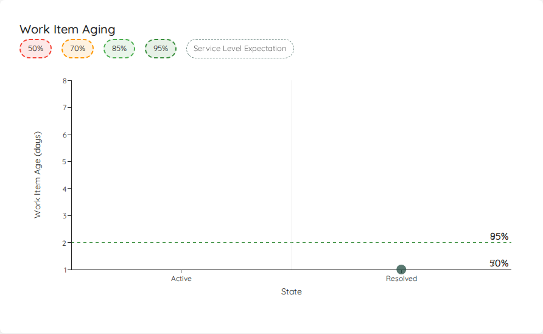
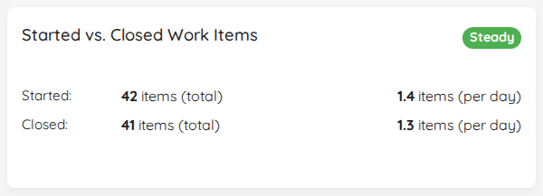
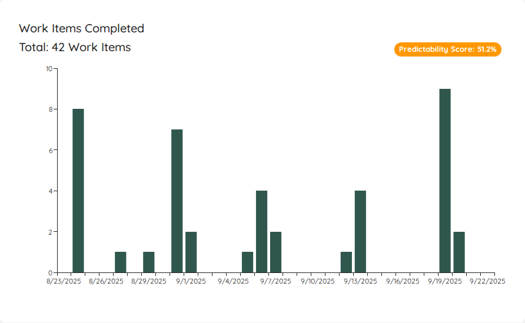
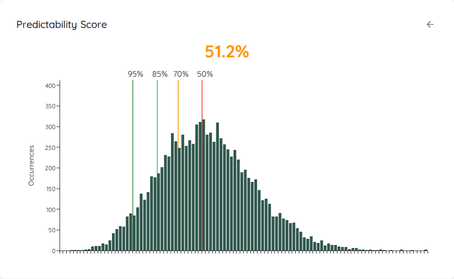
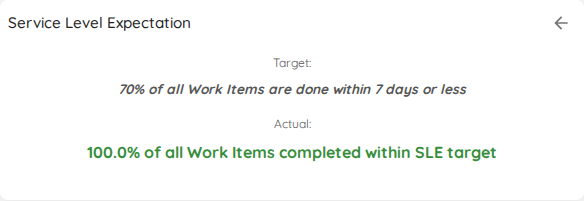
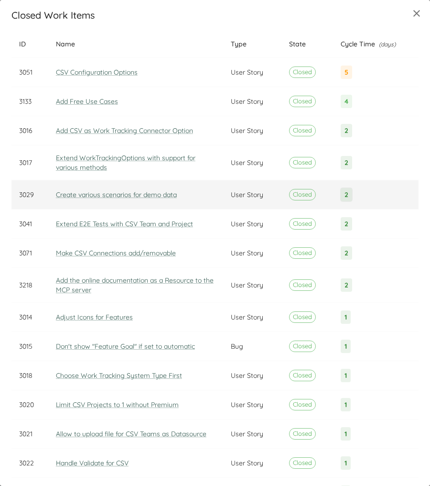
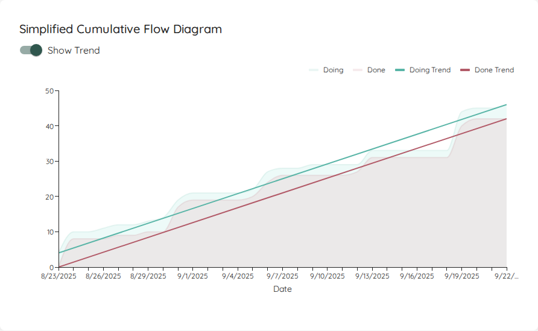

# Widgets
Following a brief overview over the various metric widgets that are available in Lighthouse.

# Details
Many Charts and Widgets are clickable and will provide you more details about the work items they visualize. You will see the mouse changing to a "hand" icon - in such a case you can click and a dialog with more details will pop up.

## Work Items In Progress

|--------------|-------------------------|
| **Applies to** | Teams and Projects |
| **Flow Metric** | WIP, Work Item Age |
| **Affected by Filtering** | No |

This widget shows details to the items in progress.

First, you will see the total number of items in progress **right now**, based on the Work Items that are in a *Doing* state as per your configuration. If a *System WIP Limit* is specified for the Team or Project, this is visualized as well on the Widget and colored accordingly.
These are all the items that match your *Work Item Query* and are in a *Doing State*. You can see the total number of items in progress right now. If you want to know more details, you click on the widget, you can see the specific work items in progress, together with their *Work Item Age*.

Then you will also see the number of the Features that are currently being worked on. With a click on it will reveal more details. The teams [Feature WIP](../teams/edit.html#feature-wip) is visualized as a *Goal* on the widget.

{: .note}
The number being shown here is based on the parent items that are currently *in progress*. It **does not** matter whether your Feature is in a *To Do*, *Doing*, or *Done* state. If you work on an item that links to a feature, that feature is being worked on, and it will show up here. Thus this metric is not available for *Projects*, but only for *Teams*.

Lastly, you can see the number of items that are currently blocked. The *Goal* is always set to 0.

{: .important}
This widget is **not affected** by the date filtering. It always shows the **current** Work In Progress.

## WIP Over Time

|--------------|-------------------------|
| **Applies to** | Teams and Projects |
| **Flow Metric** | WIP |
| **Affected by Filtering** | Yes |

The WIP Over Time chart shows you how the WIP evolved over the selected time range. You can spot whether you increased, decreased, or stayed stable. It also helps to see patterns in WIP.

If you click on a specific day, it will show you the details of which items were in progress on that specific day.

If you have defined a *System WIP Limit*, you can show this as a horizontal line on your chart.

## Work Item Aging Chart

|--------------|-------------------------|
| **Applies to** | Teams and Projects |
| **Flow Metric** | WIP, Work Item Age |
| **Affected by Filtering** | Yes |

The Work Item Aging Chart shows you all in progress items on a scatter plot:

On the x-axis you will find the different states you've configured in the settings of your team/project.
On the y-axis, you'll see how long each particular item is in progress already.

Similar to the [Cycle Time Scatterplot](#cycle-time-scatterplot), multiple items are grouped in a bubble that is shown bigger. If you want more details, you can click on a specific bubble.
You can selectively show various percentiles from your cycle time for the selected range, as well as the Service Level Expectation if you have configured it.

{: .note}
If there is a blocked item, it will appear as a red dot in the chart.

## Started vs. Closed

|--------------|-------------------------|
| **Applies to** | Teams and Projects |
| **Flow Metric** | Throughput, WIP |
| **Affected by Filtering** | Yes |

The *Started vs. Closed* widget shows you how many items you were completing (your total Throughput) and how many items were started (also called *Arrival rate*) during the selected time frame. It will also show you how many items were closed and started on average per day with your current settings:

The goal is to quickly see whether you are having a stable WIP, or if you either start more items than you close (increasing WIP) or close more than you start (decreasing WIP). The widget includes a visual indication that shows you a *Red/Amber/Green* kind of scale, depending on how *far apart* the arrival and throughput numbers are.

As a rule of thumb, you should try to match your started items with how many items leave your process. This is where the daily average can help: If you close 1.1 items per day, you know that you should more or less start:
- 1 new item per day OR
- 5 items per week OR
- 11 items every two weeks

This can help you to prepare just enough items for your team(s). Whether you do it daily or in bigger batches (for example having a refinement session per week), using this information helps you make sure you are neither under- nor over-prepared.

If you want to know more details, you can click on the widget, and it will show you the specific items that were closed and opened in the selected time range.

## Throughput Run Chart

|--------------|-------------------------|
| **Applies to** | Teams and Projects |
| **Flow Metric** | Throughput |
| **Affected by Filtering** | Yes |

To visualize the Throughput, there is a Run Chart shows the Throughput over time, sampled by days.

You can see how many items were closed each day over the last several days. The more 'stable' your throughput is, the more accurate your forecast will be.

This widget will adjust based on the selected time range. If you want to know which exact items were closed, you can click on a specific day and get more details.

On the top right, you will see the *Predictability Score*. If you click on it, another widget is brought up:

## Predictability Score

|--------------|-------------------------|
| **Applies to** | Teams and Projects |
| **Flow Metric** | Throughput |
| **Affected by Filtering** | Yes |

The Predictability Score is showing you the result of a how many forecast, based on the Throughput Run Chart of the currently selected range. Lighthouse will run an *MCS How Many* forecast for the number of days in the date range. For example, if you have selected the last 30 days, Lighthouse will forecast how many items you can close in the next 30 days based on the specific Throughput run chart.

The score is calculated like this:
> (*Value at 95th Percentile* / *Value at 50% Percentile*) * 100

You can interprete the value as follows:
- The closer you are to 100%, the closer together your 50% and 95% chance are
- If you were at 100%, this means that every single day, you closed exactly the same amount of items, and thus are *perfectly predictable*

The idea behind the score is that, if your percentiles are very much "away" from each other (meaning the values are far off), the forecast will most likely not be of much use to you. So if your goal is predictability, this can be a trigger for a discussion to see how to "get the score up" and thus become more predictable. Ways to do that include (but are not limited to, and highly depend on your context):
- Asking LetPeopleWork to help you out
- Trying to reduce your batch size, favoring more frequent but smaller delivery
- Reducing WIP and focusing on old items first and get them to done as fast as possible

{: .important}
The goal is not to be at 100%. In fact, that's far from realistic. We believe any value above 60% is decent. The intent of this chart is to show the results of an MCS for various inputs. For example if the throughput is distributed differently, or you take a longer or different range.

## Cycle Time Percentiles

|--------------|-------------------------|
| **Applies to** | Teams and Projects |
| **Flow Metric** | Cycle Time |
| **Affected by Filtering** | Yes |

In this widget you can see the different percentiles of your Cycle Time. It's to get a quick view of where you stand, for example if you want to compare it to your Service Level Expectation.

In case you have defined a [Service Level Expectation](../teams/edit.html#service-level-expectation), you will see the SLE on the top right. You can *click* on this to see additional details:

If you click anywhere on the widget (independent if you look at percentiles or the SLE), a dialog will open that will show you all the items that were closed in the respective date range. If you have defined an SLE, the Cycle Time coloring is based on how close (or above) the item got to the SLE.

## Cycle Time Scatterplot

|--------------|-------------------------|
| **Applies to** | Teams and Projects |
| **Flow Metric** | Cycle Time |
| **Affected by Filtering** | Yes |

The Scatterplot shows the individual items in a chart, where the x-axis shows the dates the items were closed, and the y-axis how long they were in progress.
If there are items that were closed on the same day with the same cycle time, they are represented in a single bubble. The more items a bubble is representing, the bigger it is.

This visual allows you to see patterns or outliers. Hovering over a dot will give you additional information, and with a click you'll get a more detailed view about the item(s) represented by the specific dot.

You can click on the percentiles on top in the legend to show/hide them. Additionally, if you have defined an SLE, you can show the line on your scatterplot as well.

## Simplified Cumulative Flow Diagram (CFD)

|--------------|-------------------------|
| **Applies to** | Teams and Projects |
| **Flow Metric** | Cycle Time, WIP, Throughput |
| **Affected by Filtering** | Yes |

This simplified version of a Cumulative Flow Diagram shows you how many items were in which state category (*Doing* or *Done*) over the selected time period. This helps you see patterns and problems with your flow. It's a *simplified* CFD because you will not see the detailed state itself, but just the overall category.

If you enable the trend lines, the start and end points of both areas will be connected. In general you want to aim for:
1. Making the lines parallel - this means you control your WIP well. If the lines are not parallel, you either start more than you finish or finish more than you start.
2. Bring the lines closer together - this means you will decrease your Cycle Time.
3. Increase the *angle* of the lines - this means you will increase your Throughput.

## Feature Size

|--------------|-------------------------|
| **Applies to** | Projects |
| **Flow Metric** | Cycle Time, Throughput |
| **Affected by Filtering** | Yes |

This chart is showing you the size of your done Features over the selected time range on a scatter plot.
