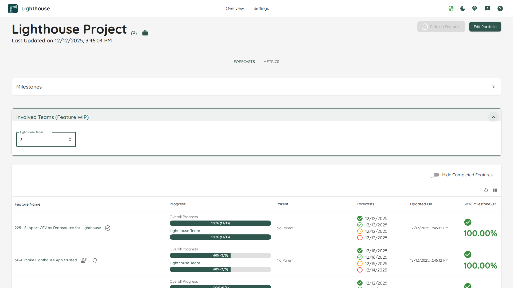

Once you have created your portfolio, you can see all the details on this page.
                
Browse through all the features from this portfolio and see which teams are involved, which features are being actively worked on, and what the progress as well as the projected completion is.

- TOC
{:toc}

{: .note}
You can directly go to the portfolio detail page if you bookmark the specific URL. Even if the portfolio name changes, the URL will stay the same.

# General Portfolio Information and Actions
On top you can see general portfolio information, which includes the name of the portfolio and it was last updated.

## Refresh Features
While portfolios are continuously updated, you can trigger a refresh manually by clicking on the *Refresh Features* button. This will update the [Features](#features) and all associated forecasts.

A manual update can be useful if you just made significant changes (for example added new features to the portfolios) and do not want to wait for the periodic update to kick in.

{: .note}
After you trigger the manual update, the button *Refresh Features* will be disabled while the portfolio is updated. Depending on the load of the server and other operations which might be in progress, it can take a while. While every context and portfolio is different, an update should normally not take longer than two minutes.

## Edit Portfolio
You can modify the portfolio settings by clicking on the *Edit Portfolio* button on the top right. This will bring you to the [Portfolio Modification Page](./edit.html).

# Forecasts

## Features
For every portfolio, all the features are listed with additional details.

### Table Options
The Feature table offers two options that you can toggle on/off:
- Group Features by Parent
- Hide Completed Features

The settings will be stored for this specific portfolio, so next time you won't have to toggle it off/on again.

#### Group Features by Parent
If this is toggled on, the Features will not be shown in a flat list, but grouped by their respective parents. This can be useful if your Features (for example *Epics*) have parent items that are of relevance to you. This could be something like an *Initiative* or *Objective* (if you use OKRs or some kind of quarterly planning).

#### Hide Completed Features
If you have many Features that are already completed, you may not want to show all of them. In such a scenario, you can hide the completed features.

### Feature Order
Features are ordered based on the [order in your Work Tracking System](../../concepts/concepts.html#feature-order).

{: .important}
You **can't** reorder Features in Lighthouse itself, but have to adjust your Work Tracking System and [Refresh the Features](#refresh-features).  
The order is crucial, as Lighthouse forecasts based on the [Feature WIP of each Team](#feature-wip) from highest to lowest ordered Feature.

{: .note}
If you have toggled on the [Group Features by Parent](#group-features-by-parent), the respective Parent Features are shown in the order coming from your Work Tracking System.

### Feature Name
The name of the feature. This is also a clickable link, that points to this specific item in your work tracking system.

Furthermore, there can be two indicators for each feature:
- A ⚠️ emoji symbolizes that this specific feature is using the *Default Feature Size* and is not broken down yet. Check the [Portfolio Modification Page](./edit.html#default-feature-size) for details on what that means.
- A ⚙️ emoji symbolizes that there are child items of this specific feature that are currently being **actively** worked on (meaning they are in a [Doing State](./edit.html#states)) by any involved team.

{: .recommendation}
> In general you should be working on the top-most features, while the ones *further down* the order may not be broken down yet. If features on top are not yet broken down, this may be a signal that you should invest some time in breaking them down.  
If features towards the bottom are in progress, you may focus on the wrong thing.  
> 
> Use Lighthouse to make such things transparent and trigger a discussion around what to focus on!

### Feature Progress
In the progress column, you can see how many items are done and how many are pending for this feature. This is split by the total amount for the feature and a more detailed view for every involved team.

{: .note}
If a team is working solo on a feature, both bars will show the same numbers.

### Forecasts
For each Feature you will see the forecasted completion date. You'll get four different probabilities, from *Certain* to *Risky*. Naturally, the riskier the forecast, the earlier the projected completion.

{: .note}
The completion dates of each feature will take into account **all teams** that are involved. If a single item is planned to be done by one team, but this is far down their priority, this will mean that the feature completion will be moving backwards. Lighthouse cares about delivering complete features. You may be able to use such scenarios to kick off a discussion about how work or teams are sliced (as less dependencies mean more effective delivery).

## Feature WIP
[Lighthouse forecasts](../../concepts/howlighthouseforecasts.html) based on the [Order](#feature-order) and the [Feature WIP](../teams/edit.html#feature-wip) of each involved team. You can change this via the [Edit Page of a Team](../teams/edit.html#feature-wip) or directly in the Portfolio Detail View. If you expand the *Involved Teams (Feature WIP)* box, you can see the current Feature WIP for each team of this portfolio.  

You can adjust the Feature WIP, and it will automatically reforecast the completion dates:

Adjusting the Feature WIP will cause the forecasted completion dates to change. In general, increasing the Feature WIP will mean that *lower ordered* features will be completed sooner, while *higher ordered features* take longer to finish.  
A Feature WIP of 1 means, the team will **only** work on the top most feature, and move to the next one only when this is all done. The single focus of this team is on one feature.  
On the other side of the extreme, if we have a Feature WIP of 10, we will split our efforts across ten things, dilluting any kind of focus, and doing many things in parallel.

{: .recommendation}
You should strive for a Feature WIP that is as low as possible, ideally 1 or 2. However, if your reality looks different, it makes more sense to set Lighthouse up accordingly, as otherwise the forecasts will be off.  
You may use Lighthouse to make it transparent what a change in Feature WIP can mean in terms of Feature delivery, which could be a good conversation starter to make a change.

{: .note}
If a team is configured to [Automatically Adjust Feature WIP](../teams/edit.html#automatically-adjust-feature-wip), you can still change the settings manually. However, they will be overridden the next time the Team Data will be updated.

# Metrics
Similar to the Team Details, the Portfolio contains metrics. The visuals are mostly the same as for the teams, the difference is that they are applied at feature level on the Portfolio. Check the [Metrics Page](../metrics/metrics.html) for more details.