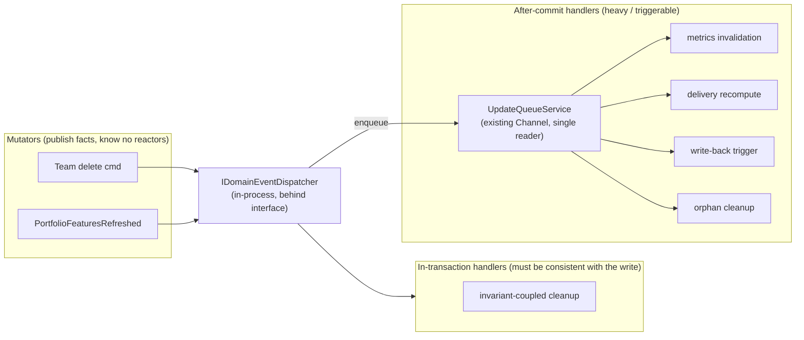
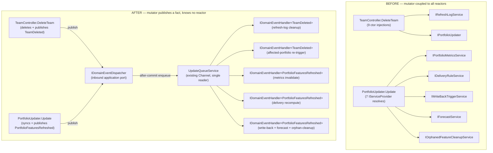
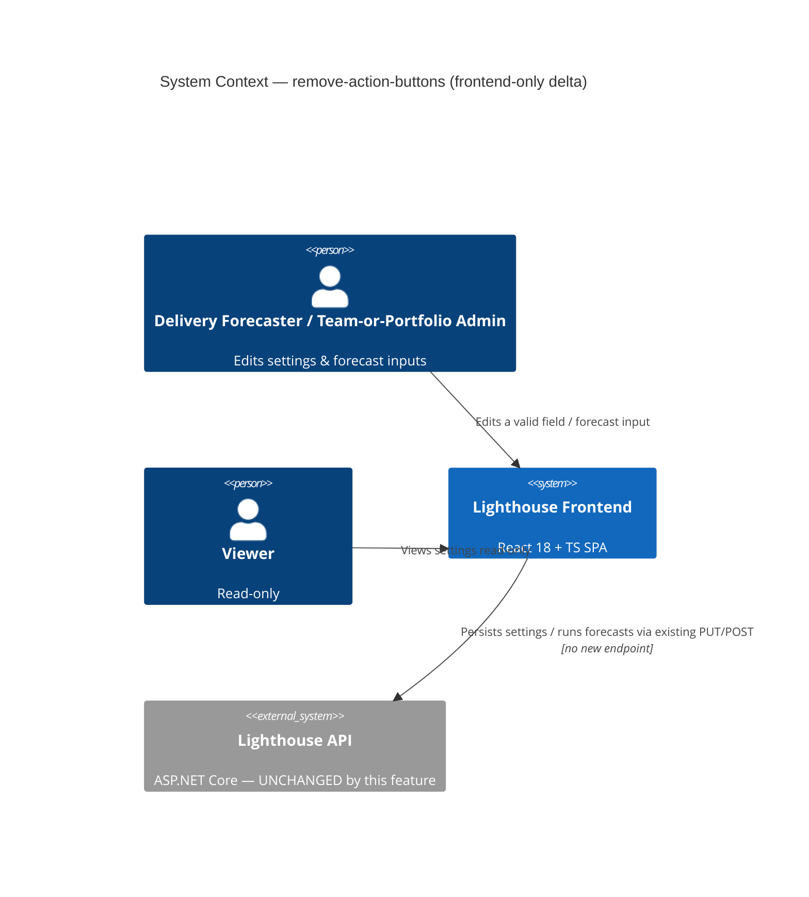
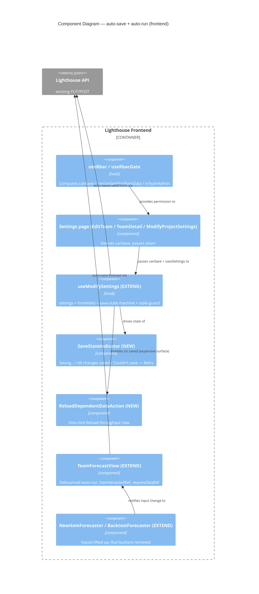
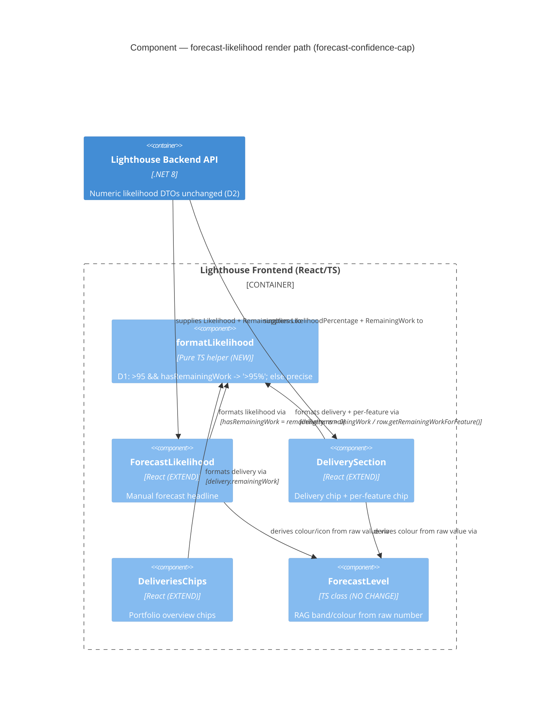

# Architecture Brief — Lighthouse

## Application Architecture

Feature: rbac-enhancements
Wave: DESIGN
Date: 2026-05-10
Architect: Morgan (Solution Architect)
Paradigm: OOP (C# backend), functional-leaning React (hooks, pure components) on the frontend

---

### Architectural Pattern

**Ports-and-Adapters (Hexagonal Architecture)** — already established in the codebase. This feature extends existing ports and adapters; it introduces no new architectural style.

Key invariants upheld:
- `IRbacAdministrationService` is the single inbound port for all RBAC business logic. `AuthorizationController` calls only the interface, never the concrete class.
- `LighthouseDbContext` is the driven adapter for persistence. `RbacAdministrationService` depends on EF Core abstractions, not on raw SQL.
- `useRbac` hook is the single RBAC state source on the frontend. All page and component gating derives from it. No component fetches `/my-summary` independently.
- `PERMISSIVE_SUMMARY` fallback in `useRbac` is an invariant: a failed RBAC call never locks users out. This must not be changed.

---

### System Context and Capabilities

Lighthouse is a software delivery forecasting tool. The RBAC enhancements feature adds:

1. Bootstrap flow: first-time System Admin self-assignment with no config file required.
2. Emergency admin: distinct, non-revocable display in the user table.
3. RBAC Status diagnostic panel: replaces status chips with a collapsible disclosure section.
4. User removal: hard-delete with confirmation; GDPR hygiene.
5. Access tab visibility gating: Access and System Admins tabs rendered only when `isRbacEnabled`.
6. Scoped admin self-service: Settings and Access tabs visible to Team/Portfolio Admins for their own scope.
7. Bug fix (US-08): `ScopedGroupMappingManager` calls the scoped endpoint, not the global endpoint.
8. Write control hiding: all write controls hidden (not disabled) from Viewers.
9. Viewer experience: clean read-only view of Deliveries; no admin controls visible.
10. Create button fix: non-system-admins bypass the connections-required check.
11. E2E test coverage: 7 scenarios across bootstrap, System Admin flow, scoped access, and SSO group equivalence.

See `docs/product/architecture/c4-diagrams.md` for C4 diagrams (L1, L2, L3).

---

### Component Decomposition

All components listed here are EXTEND. No new components are required by this feature; every change is an additive modification to an existing file.

| Component | File | Change Type | Change Summary |
|---|---|---|---|
| AuthorizationController | `Lighthouse.Backend/Lighthouse.Backend/API/AuthorizationController.cs` | EXTEND | Add `DELETE /authorization/users/{userProfileId}` (US-04). Add `GET /authorization/teams/{teamId}/group-mappings` scoped read endpoint (US-08). |
| IRbacAdministrationService | `Lighthouse.Backend/Lighthouse.Backend/Services/Interfaces/Authorization/IRbacAdministrationService.cs` | EXTEND | Add `DeleteUserAsync(int userProfileId, CancellationToken)` and `GetTeamGroupMappingsAsync(int teamId, CancellationToken)` method signatures. |
| RbacAdministrationService | `Lighthouse.Backend/Lighthouse.Backend/Services/Implementation/Authorization/RbacAdministrationService.cs` | EXTEND | Implement the two new methods. Emergency admin detection: `isEmergencyAdmin` derived from config subject match. |
| RbacUserSummary | `Lighthouse.Backend/Lighthouse.Backend/Models/Authorization/RbacUserSummary.cs` | EXTEND | Add `IsEmergencyAdmin` boolean property (US-02). |
| UserAuthorizationSummary | `Lighthouse.Backend/Lighthouse.Backend/Models/Authorization/UserAuthorizationSummary.cs` | NO CHANGE | The emergency admin, when logged in, receives `IsSystemAdmin: true` in their `/my-summary`. They are indistinguishable from a normal System Admin from their own perspective — this is intentional. The `IsEmergencyAdmin` flag is only needed in the user list (`RbacUserSummary`) for System Admins managing the table. `UserAuthorizationSummary` does not need this field. |
| RbacModels.ts | `Lighthouse.Frontend/src/models/Authorization/RbacModels.ts` | EXTEND | Add `isEmergencyAdmin?: boolean` to `RbacUser` interface (US-02). |
| RbacService.ts | `Lighthouse.Frontend/src/services/Api/RbacService.ts` | EXTEND | Add `deleteUser(userProfileId: number): Promise<void>` to `IRbacService` interface and `RbacService` class (US-04). Add `getTeamGroupMappings(teamId: number): Promise<RbacGroupMapping[]>` (US-08). |
| RbacSettings.tsx | `Lighthouse.Frontend/src/pages/Settings/Rbac/RbacSettings.tsx` | EXTEND | Replace 6 chips with collapsed `<Accordion>` "RBAC Status" panel (US-03). Render `isEmergencyAdmin` state in user table row with lock indicator and no Revoke button (US-02). Add "Remove" button per row (US-04) with `DeleteConfirmationDialog`. |
| ScopedGroupMappingManager.tsx | `Lighthouse.Frontend/src/components/Common/Authorization/ScopedGroupMappingManager.tsx` | EXTEND (bug fix) | Change the `loadGroupMappings` data fetch from the global endpoint to the scoped endpoint passed as a prop (US-08). Parent components (TeamDetail, PortfolioDetail) already hold the scoped `teamId`/`portfolioId` — they pass the correct fetcher. |
| Settings.tsx | `Lighthouse.Frontend/src/pages/Settings/Settings.tsx` | EXTEND | Gate the "System Admins" tab (value "50") on `rbac.isRbacEnabled` in the `visibleTabs` filter (US-05). Currently gated on `rbac.isSystemAdmin` only — must additionally check `isRbacEnabled`. Log Level gating handled inside `SystemSettingsTab` (WD-10). |
| SystemSettingsTab.tsx | `Lighthouse.Frontend/src/pages/Settings/System/SystemSettingsTab.tsx` | EXTEND | Gate Log Level section on `isSystemAdmin` from `useRbac()` (WD-10, US-09). |
| TeamDetail.tsx | `Lighthouse.Frontend/src/pages/Teams/Detail/TeamDetail.tsx` | EXTEND | Gate Settings and Access tabs: `showSettingsTab` and `showAccessTab` already use `rbac.isTeamAdmin(team.id)` — add `&& rbac.isRbacEnabled` guard for the Access tab (US-05, US-06). Gate CloudSync (Update All), Clone, and Delete controls on `rbac.isTeamAdmin(teamId)` (US-07). Fix `loadTeamGroupMappings` to call the scoped endpoint via `rbacService.getTeamGroupMappings(teamId)` instead of `rbacService.getGroupMappings()` with client-side filter (US-08). Gate QuickSettingsBar on `rbac.isTeamAdmin(teamId)` (US-09). |
| PortfolioDetail.tsx | `Lighthouse.Frontend/src/pages/Portfolios/Detail/PortfolioDetail.tsx` | EXTEND | Gate Deliveries tab, Settings tab, and Access tab: `showDeliveriesAndSettingsTabs` already uses `rbac.isPortfolioAdmin(portfolio.id)` — add `&& rbac.isRbacEnabled` guard for the Access tab (US-05). Gate CloudSync, Clone, Delete controls on `rbac.isPortfolioAdmin(portfolioId)` (US-07). Fix `loadPortfolioGroupMappings` to call scoped endpoint (US-08). Gate QuickSettingsBar on `rbac.isPortfolioAdmin(portfolioId)` (US-09). For Deliveries tab: gate Add/Edit/Delete delivery actions within `PortfolioDeliveryView` on `isPortfolioAdmin` (US-09, WD-12). |
| PortfolioDeliveryView.tsx | `Lighthouse.Frontend/src/pages/Portfolios/Detail/PortfolioDeliveryView.tsx` | EXTEND | Accept or derive `canEdit` prop (from `isPortfolioAdmin`). Hide Add/Edit/Delete delivery action controls when `canEdit` is false (US-09, WD-12). |
| OverviewDashboard.tsx | `Lighthouse.Frontend/src/pages/Overview/OverviewDashboard.tsx` | EXTEND | Hide connections section for non-System-Admins (WD-11, US-09). Gate Add Connection button on `rbac.isSystemAdmin` (already done — verify). Fix "Add Team" disabled logic: `disabled={!canCreateTeam || (rbac.isSystemAdmin && !hasConnections)}` so non-system-admin canCreateTeam users are never blocked by the connections check (US-10). Gate `OnboardingStepper` on `rbac.canCreateTeam || rbac.canCreatePortfolio` (already done via props — verify WD-13). |
| RoleBasedAccessControl.spec.ts | `Lighthouse.EndToEndTests/tests/specs/auth/RoleBasedAccessControl.spec.ts` | EXTEND | Implement all 7 E2E scenarios replacing the scaffold comment. Use `testWithAuth` fixture, `TestConfig` credentials for 4 test users. New Page Object additions as needed. |

---

### Driving Ports (Inbound HTTP Endpoints)

All routes are on `AuthorizationController` at `/api/latest/authorization` and `/api/v1/authorization`.

| Method | Route | Auth Requirement | Purpose | Change |
|---|---|---|---|---|
| GET | `/authorization/status` | Authenticated | RBAC status for diagnostic panel | Existing |
| GET | `/authorization/my-summary` | Authenticated | User's own authorisation summary (feeds `useRbac`) | Existing |
| POST | `/authorization/bootstrap/system-admin` | Authenticated | Bootstrap first System Admin | Existing |
| GET | `/authorization/users` | CanManageRbac (System Admin) | List all known users | Existing |
| DELETE | `/authorization/users/{userProfileId}` | CanManageRbac (System Admin) | Hard-delete user and all their role assignments | **NEW (US-04)** |
| POST | `/authorization/system-admins/{userProfileId}` | CanManageRbac | Grant System Admin | Existing |
| DELETE | `/authorization/system-admins/{userProfileId}` | CanManageRbac | Revoke System Admin | Existing |
| GET | `/authorization/teams/{teamId}/members` | CanManageTeamMembership | Get team members | Existing |
| PUT | `/authorization/teams/{teamId}/members/{userProfileId}` | CanManageTeamMembership | Upsert team member | Existing |
| DELETE | `/authorization/teams/{teamId}/members/{userProfileId}` | CanManageTeamMembership | Remove team member | Existing |
| GET | `/authorization/teams/{teamId}/group-mappings` | CanManageTeamMembership | Get scoped group mappings for a team | **NEW (US-08)** |
| GET | `/authorization/portfolios/{portfolioId}/members` | CanManagePortfolioMembership | Get portfolio members | Existing |
| PUT | `/authorization/portfolios/{portfolioId}/members/{userProfileId}` | CanManagePortfolioMembership | Upsert portfolio member | Existing |
| DELETE | `/authorization/portfolios/{portfolioId}/members/{userProfileId}` | CanManagePortfolioMembership | Remove portfolio member | Existing |
| GET | `/authorization/group-mappings` | CanManageRbac (System Admin) | Get all group mappings (global) | Existing |
| POST | `/authorization/group-mappings` | CanManageRbac | Create group mapping | Existing |
| DELETE | `/authorization/group-mappings/{mappingId}` | CanManageRbac | Remove group mapping | Existing |

Note: A portfolio-scoped `GET /authorization/portfolios/{portfolioId}/group-mappings` endpoint should also be added symmetrically with the team-scoped one (WD-08 applies equally to portfolios, enforced by `CanManagePortfolioMembership`).

---

### Driven Ports (Outbound)

| Port | Adapter | Technology | Purpose |
|---|---|---|---|
| RBAC persistence port (implicit in `RbacAdministrationService`) | `LighthouseDbContext` | EF Core 8, SQLite/PostgreSQL | Reads/writes `UserPermission`, `RbacGroupMapping`, `UserProfile` entities |
| OIDC token introspection port (implicit in ASP.NET Core auth middleware) | ASP.NET Core OIDC middleware | Microsoft.AspNetCore.Authentication.OpenIdConnect | Validates JWT, extracts `sub` claim and group claims for role elevation |

Both driven ports are existing adapters. This feature extends their usage but introduces no new driven port implementations.

---

### Technology Stack

| Component | Technology | Version | License | Rationale |
|---|---|---|---|---|
| Backend framework | ASP.NET Core Web API | .NET 8 | MIT (open source) | Established in codebase; no change |
| Backend ORM | Entity Framework Core | 8.x | MIT | Established in codebase; no change |
| Backend test database | SQLite in-memory | — | Public Domain | Fast isolation per test; existing pattern |
| Frontend framework | React | 18 | MIT | Established in codebase |
| Frontend language | TypeScript | 5.x | Apache 2.0 | Established in codebase |
| Frontend UI library | Material UI (MUI) | 5.x | MIT | Established in codebase; `Accordion` used for status panel (US-03) |
| Frontend routing | React Router | 6.x | MIT | Established in codebase |
| E2E test framework | Playwright | 1.x | Apache 2.0 | Established in codebase; `testWithAuth` fixture reused |
| OIDC provider (test) | Keycloak | — | Apache 2.0 | Established in test environment |

No new technologies are introduced by this feature. All choices reuse the existing stack.

---

### Reuse Analysis

For every component modified, the decision to EXTEND (not CREATE NEW) is justified below.

| Existing Component | File | Overlap | Decision | Justification |
|---|---|---|---|---|
| AuthorizationController | `Lighthouse.Backend/Lighthouse.Backend/API/AuthorizationController.cs` | CRUD for all RBAC resources | EXTEND | Existing controller handles all /authorization/* routes. Adding 2 endpoints (DELETE users/{id}, GET teams/{teamId}/group-mappings) follows the established pattern. No new controller needed. |
| IRbacAdministrationService | `Lighthouse.Backend/Lighthouse.Backend/Services/Interfaces/Authorization/IRbacAdministrationService.cs` | RBAC business logic port | EXTEND | 2 new method signatures added to the existing interface. No new port needed; the existing port is the correct abstraction boundary. |
| RbacAdministrationService | `Lighthouse.Backend/Lighthouse.Backend/Services/Implementation/Authorization/RbacAdministrationService.cs` | Full RBAC business logic | EXTEND | Implements the 2 new interface methods. Emergency admin detection belongs here (config-sourced subject match). |
| RbacUserSummary | `Lighthouse.Backend/Lighthouse.Backend/Models/Authorization/RbacUserSummary.cs` | User data model for RBAC user list | EXTEND | Add `IsEmergencyAdmin bool`. No new model: existing record captures all user-level RBAC data. |
| RbacModels.ts | `Lighthouse.Frontend/src/models/Authorization/RbacModels.ts` | TypeScript RBAC types | EXTEND | Add `isEmergencyAdmin?: boolean` to `RbacUser`. No new type file. |
| RbacService.ts | `Lighthouse.Frontend/src/services/Api/RbacService.ts` | HTTP adapter for /authorization/* | EXTEND | Add 2 methods to existing interface and class. Keeps all RBAC HTTP calls in one adapter. |
| RbacSettings.tsx | `Lighthouse.Frontend/src/pages/Settings/Rbac/RbacSettings.tsx` | System Admin management UI | EXTEND | Replace chips with Accordion status panel, add emergency admin display, add user removal. All within the same bounded component. |
| ScopedGroupMappingManager.tsx | `Lighthouse.Frontend/src/components/Common/Authorization/ScopedGroupMappingManager.tsx` | Group mapping UI | EXTEND (bug fix) | Fix API call from global to scoped endpoint. The component's interface and responsibilities are unchanged; only the data source is corrected. |
| Settings.tsx | `Lighthouse.Frontend/src/pages/Settings/Settings.tsx` | Settings page tab orchestrator | EXTEND | Add `isRbacEnabled` guard to the System Admins tab filter. Minimal, isolated change. |
| SystemSettingsTab.tsx | `Lighthouse.Frontend/src/pages/Settings/System/SystemSettingsTab.tsx` | Configuration settings tab | EXTEND | Gate Log Level section on `isSystemAdmin`. Single conditional render addition. |
| TeamDetail.tsx | `Lighthouse.Frontend/src/pages/Teams/Detail/TeamDetail.tsx` | Team detail page | EXTEND | Settings tab: gated on `isTeamAdmin(teamId)` only — no `isRbacEnabled` guard (settings tab predates RBAC and is a general team administration concern). Access tab: gated on `isRbacEnabled AND isTeamAdmin(teamId)` — both conditions must be true (US-05, US-06). Gate write controls (Update All, Clone, Delete, QuickSettingsBar) on `isTeamAdmin(teamId)` (US-07). Fix `loadTeamGroupMappings` to call the scoped endpoint (US-08). |
| PortfolioDetail.tsx | `Lighthouse.Frontend/src/pages/Portfolios/Detail/PortfolioDetail.tsx` | Portfolio detail page | EXTEND | Settings tab: gated on `isPortfolioAdmin(portfolioId)` only. Deliveries tab: gated on `isPortfolioAdmin(portfolioId)` (unchanged — `showDeliveriesAndSettingsTabs`). Access tab: gated on `isRbacEnabled AND isPortfolioAdmin(portfolioId)`. Gate write controls on `isPortfolioAdmin(portfolioId)` (US-07). Fix `loadPortfolioGroupMappings` to call scoped endpoint (US-08). |
| PortfolioDeliveryView.tsx | `Lighthouse.Frontend/src/pages/Portfolios/Detail/PortfolioDeliveryView.tsx` | Portfolio deliveries view | EXTEND | Gate Add/Edit/Delete delivery controls on admin rights. Deliveries tab remains visible to Viewers (WD-12). |
| OverviewDashboard.tsx | `Lighthouse.Frontend/src/pages/Overview/OverviewDashboard.tsx` | Overview dashboard | EXTEND | Hide connections section for non-admins, fix Add Team/Portfolio disabled logic for non-system-admin canCreate users. |
| RoleBasedAccessControl.spec.ts | `Lighthouse.EndToEndTests/tests/specs/auth/RoleBasedAccessControl.spec.ts` | RBAC E2E spec | EXTEND | Implement all 7 scenarios. Scaffold file exists with zero tests; this is a pure implementation task. |

---

### Integration Patterns

**Frontend → Backend**: All communication is synchronous REST over HTTPS. The `useRbac` hook fetches `/authorization/my-summary` once on component mount and re-fetches after any role mutation. No polling; no WebSocket; no event streaming for RBAC state.

**OIDC group claim processing**: The OIDC middleware extracts the `groups` claim (claim name configurable via `RbacStatus.groupClaimName`). `RbacAdministrationService` evaluates group-to-role mappings stored in `RbacGroupMapping` during each `GetAuthorizationSummaryAsync` call. This is a read-time resolution, not a sync/import.

**Permissive fallback**: If `/authorization/my-summary` fails (network error, 5xx), `useRbac` falls back to `PERMISSIVE_SUMMARY` (`isRbacEnabled: false`, `isSystemAdmin: true`). This ensures users are never locked out by RBAC infrastructure failures.

**No new integration points** are introduced by this feature. All communication paths exist already.

---

### Quality Attribute Strategies

**Correctness**: The single RBAC state source (`useRbac` hook) and the permissive fallback invariant together ensure that all gating decisions are consistent. No component owns its own RBAC fetch. E2E scenario 7 (group-based rights = individual rights) is the regression gate for correctness of the permission model.

**Maintainability**: Adding a new guarded control requires touching only two files: the component that renders it (add the `useRbac()` conditional) and, if a new permission check is needed, `useRbac.ts`. The `IRbacAdministrationService` interface is the single boundary for backend RBAC changes.

**Testability**: Backend: `IRbacAdministrationService` as a port enables full mock isolation in unit tests. Frontend: `useRbac` is a pure React hook; component gating is testable by passing different hook return values. E2E: 4 dedicated test users in Keycloak cover all permission combinations.

**RBAC-disabled regression safety**: All gating conditions are behind `isRbacEnabled`. When `isRbacEnabled === false`, all `isSystemAdmin` / `isTeamAdmin` / `isPortfolioAdmin` calls return `true` (PERMISSIVE_SUMMARY). The app behaves identically to its pre-RBAC state.

---

### Deployment Architecture

No infrastructure changes. The feature is a combination of:
- Backend code changes (C# — build and deploy with existing pipeline)
- Frontend code changes (TypeScript/React — build with existing Vite pipeline)
- E2E test additions (Playwright — run in existing CI stage)

The test environment requires 4 dedicated Keycloak users with configurable group memberships. This is a test-environment configuration item, not a production code change.

---

### ADR References

- [ADR-001](./adr-001-rbac-ui-gating-strategy.md): UI Gating Strategy — Hidden vs Disabled Controls for Viewers
- [ADR-002](./adr-002-scoped-group-mapping-endpoint.md): Scoped vs Global Endpoint for Group Mappings
- [ADR-003](./adr-003-emergency-admin-display.md): Emergency Admin Display Approach

---

### Architectural Enforcement

Language-appropriate enforcement tooling for the architectural rules in this feature:

| Rule | Enforcement Mechanism |
|---|---|
| All RBAC gating must derive from `useRbac()` — no component fetches `/my-summary` directly | ESLint custom rule or import-linter contract: components in `/pages/` and `/components/` must not import `RbacService` directly; only `useRbac` is permitted as the entry point |
| `IRbacAdministrationService` is the only inbound dependency for `AuthorizationController` | ArchUnitNET test: `AuthorizationController` must not directly reference `RbacAdministrationService` (the concrete class) |
| Driven adapters depend inward: `RbacAdministrationService` must not depend on controllers | ArchUnitNET test: classes in `Services.Implementation` must not reference classes in `API` |

---

## Application Architecture — work-tracking-oauth-authentication (DESIGN delta)

Feature: work-tracking-oauth-authentication
Wave: DESIGN
Date: 2026-05-14
Architect: Morgan (Solution Architect)

This section is **additive** to the rbac-enhancements baseline above. The architectural pattern (ports-and-adapters), paradigm (OOP backend + functional-leaning React), and core invariants are unchanged. The OAuth feature plugs into two established extension points: `AuthenticationMethodSchema` (auth-method registry) and `WorkTrackingSystemConnectionOption` (encrypted per-option storage).

### Key invariants introduced

- **`IRbacAdministrationService` is the single inbound port for RBAC business logic** — unchanged; OAuth uses `[RbacGuard(SystemAdmin)]` and `[LicenseGuard(RequirePremium = true)]` at the controller-action boundary. No new authorisation rules.
- **`IOAuthService` is the single inbound port for the OAuth flow**. `OAuthController` and `OAuthBearerAuthStrategy` both depend on this interface, never on `OAuthService` (the concrete class).
- **`IOAuthProvider` is the single outbound port for IdP-specific OAuth knowledge.** Resolved via `IOAuthProviderRegistry` keyed on `AuthenticationMethodKey` (a string). Adding a third provider requires zero changes to `OAuthController`, `OAuthService`, `OAuthCredential`, or the registry. See ADR-007.
- **`OAuthCredential` is the only new entity.** Static configuration (`clientId`, `clientSecret`) reuses the existing `WorkTrackingSystemConnectionOption` pattern with `IsSecret = true`. See ADR-008.
- **`Lighthouse:BaseUrl` is the sole source of truth for the OAuth callback URL display.** Not derived from `Request.Host`. See ADR-009.
- **Refresh is pre-request, single-flight, in-process** via a `ConcurrentDictionary<int, SemaphoreSlim>` keyed on `OAuthCredential.Id`. See ADR-010.

### New driving ports (HTTP)

| Method | Route | Auth Requirements |
|---|---|---|
| POST | `/api/oauth/{providerKey}/connect` | `[Authorize]` + `[RbacGuard(SystemAdmin)]` + `[LicenseGuard(RequirePremium = true)]` |
| GET | `/api/oauth/callback` | `[AllowAnonymous]` (state-token CSRF) |
| POST | `/api/oauth/{providerKey}/disconnect` | `[Authorize]` + `[RbacGuard(SystemAdmin)]` + `[LicenseGuard(RequirePremium = true)]` |

### New driven ports

| Port | Adapter | Purpose |
|---|---|---|
| `IOAuthProvider` | `JiraOAuthProvider`, `AdoOAuthProvider` | Per-IdP OAuth dance (auth URL, code exchange, refresh) |
| `IOAuthStateTokenIssuer` | `OAuthStateTokenIssuer` | HMAC-signed CSRF token (no session store) |
| `IWorkTrackingAuthStrategy` | `PatAuthStrategy`, `JiraCloudBasicAuthStrategy`, `OAuthBearerAuthStrategy` | Per-connection outbound auth-header construction |

### Reused (no new adapter introduced)

- `ICryptoService` — encrypts `clientSecret`, `AccessToken`, `RefreshToken` at rest.
- `LicenseGuardAttribute` + `LicenseService` — premium gate enforcement.
- `LighthouseAppContext` — extended with one `DbSet<OAuthCredential>`, FK with cascade delete.
- `AuthenticationMethodSchema` — extended with `jira.oauth` and `ado.oauth` entries (premium-flagged).
- Existing FE standalone-vs-server runtime flag (used by US-04 standalone-mode guard).

### ADR References (this feature)

- [ADR-007](./adr-007-oauth-provider-registry.md): OAuth Provider Registry — String Key, DI-Resolved
- [ADR-008](./adr-008-oauth-credential-separation.md): OAuth Credential Storage — Separate Entity, Configuration Reuses Options
- [ADR-009](./adr-009-oauth-baseurl-callback.md): OAuth Callback URL Derived From a Server-Configured BaseUrl
- [ADR-010](./adr-010-oauth-single-flight-refresh.md): OAuth Token Refresh — Pre-Request, Single-Flight, In-Process

### Architectural Enforcement (this feature)

| Rule | Enforcement Mechanism |
|---|---|
| `OAuthController` depends only on `IOAuthService` (never `OAuthService` concrete) | ArchUnitNET test (extend existing suite) |
| `IOAuthProvider` implementations are registered in DI with unique `ProviderKey` strings matching `AuthenticationMethodKeys` constants | Startup self-check in `Program.cs` iterates `AuthenticationMethodSchema` and asserts every `*.oauth` key has a matching `IOAuthProvider`; app fails fast at boot on mismatch |
| Outbound IdP HTTP calls only via `IOAuthProvider` implementations — connectors never call IdPs directly | ArchUnitNET test: classes outside `Services.Implementation.OAuth.Providers` must not import `auth.atlassian.com` / `login.microsoftonline.com` URL constants |
| `OAuthCredential.AccessToken` / `RefreshToken` columns are stored encrypted | EF value-converter configured in `LighthouseAppContext`; integration test asserts encrypted bytes on disk differ from cleartext |

---

## Application Architecture — work-tracking-oauth-authentication / Story #5018 popup reconnect (DESIGN delta)

Feature: work-tracking-oauth-authentication (follow-on slice)
Wave: DESIGN
Date: 2026-05-16
Architect: Morgan (Solution Architect), interaction mode = PROPOSE

This section is **additive** to the OAuth DESIGN delta above. The architectural pattern, paradigm, and all existing OAuth invariants (ADR-007 through ADR-010) are unchanged. Story #5018 fixes a UX defect in the reconnect flow by replacing the full-page redirect with a popup window plus a same-origin postMessage handshake.

### Invariants extended (not changed)

- **`IServiceConfig.BaseUrl` (ADR-009) is now also the `targetOrigin` for popup→opener postMessage** — the same configuration value that the IdP's `redirect_uri` is built from. A misconfigured BaseUrl that breaks one will break the other; the existing warning in `OAuthAuthForm` covers both.
- **`OAuthCredential.WorkTrackingSystemConnectionId` is enforced 1:1 at the DB level**, not just at the C# level. An additive EF migration adds a UNIQUE index (the cardinality was already 1:1 per ADR-008; the index makes it enforced).
- **The OAuth flow's transport (popup vs full-page) is a frontend orchestration concern** — `IOAuthService`, `IOAuthProvider`, `IOAuthStateTokenIssuer` are unaware of it. The popup mechanism cannot weaken any backend invariant.

### New frontend orchestration

| Component | Purpose | Path |
|---|---|---|
| `useOAuthPopup` hook | Opens centred popup; subscribes to `message` events with origin + type filter; polls `popup.closed` with 90s grace; returns `{ status: "success" | "error" | "cancelled" | "popup_blocked", connectionId?, reason? }` | `Lighthouse.Frontend/src/hooks/useOAuthPopup.ts` |
| `OAuthPopupComplete` landing page | Same-origin route served at `/oauth/popup-complete`. Reads `status`/`connectionId`/`reason` from query string; posts `{ type: "oauth.complete", ... }` to `window.opener` with `targetOrigin = BaseUrl`; closes itself | `Lighthouse.Frontend/src/components/Common/Connections/OAuthPopupComplete.tsx` |

### Backend changes (minimal)

- `OAuthController.Callback` 302 success target changes from `/connections/new?oauth=success&connectionId={id}` to `/oauth/popup-complete?status=success&connectionId={id}`. Error target changes from `/settings/connections?oauth=error&reason={code}` to `/oauth/popup-complete?status=error&reason={code}`. No new actions, no new auth contract.
- `WorkTrackingSystemConnectionsController.GetWorkTrackingSystemConnections` simplifies the defensive `GroupBy(c => c.WorkTrackingSystemConnectionId).OrderByDescending(c => c.UpdatedAt).First()` to `ToDictionary(c => c.WorkTrackingSystemConnectionId)`, justified by the new DB-level UNIQUE index.
- Additive EF migration generated via the existing `CreateMigration` PowerShell script — UNIQUE index on `OAuthCredentials.WorkTrackingSystemConnectionId`.

### ADR References (this slice)

- [ADR-011](./adr-011-oauth-popup-flow.md): OAuth Reconnect via Popup Window with Same-Origin postMessage Handshake (Proposed — awaiting user selection between Options A/B/C)

### Architectural Enforcement (this slice)

| Rule | Enforcement Mechanism |
|---|---|
| `useOAuthPopup` is the only call site for `window.open` with an OAuth authorization URL | Vitest test asserts the three call sites (`ReconnectBanner`, `OAuthAuthForm`, `CreateConnectionWizard.startOAuthHandshake`) call the hook, not `window.open` directly; Biome rule `lint/suspicious/noWindowOpen` (or equivalent) enforced via `pnpm biome` in CI |
| `OAuthPopupComplete` is the only React route that may call `window.opener.postMessage` | Vitest grep / Biome custom rule asserting `window.opener` is only referenced in `OAuthPopupComplete.tsx` and `useOAuthPopup.ts` test files |
| `OAuthController.Callback` 302 targets only the same-origin landing page path, never a third-party URL | Backend integration test asserts the `Location` header on the 302 response begins with `/oauth/popup-complete` and contains no scheme/host |
| `OAuthCredential.WorkTrackingSystemConnectionId` is unique at the DB level | EF migration UNIQUE index; verified by `ci_verifysqlite.yml` + `ci_verifypostgres.yml` |

---

## Application Architecture — filter-forecast-throughput

Feature: filter-forecast-throughput (Epic 4896, customer ask Liz / JLP)
Wave: DESIGN
Date: 2026-05-20
Architect: Morgan (Solution Architect), interaction mode = PROPOSE

> Status update — DELIVER complete 2026-05-23; open defect at TeamMetricsView round-trip (chip + toggle do not render on Team detail → Metrics tab); follow-ups documented in `docs/evolution/filter-forecast-throughput-evolution.md`.

This section is **additive** to the rbac-enhancements baseline and the work-tracking-oauth-authentication deltas above. Architectural pattern (ports-and-adapters), paradigm (OOP backend + functional-leaning React frontend), and core invariants are unchanged. This feature plugs into three established extension points: the existing `DeliveryRuleSet` rule-engine value-objects, the existing `ITeamMetricsService` throughput-vector seam, and the existing premium-gated `ILicenseService`.

### Architectural Pattern

**Ports-and-Adapters (Hexagonal)** — extended. New inbound port `IRuleEvaluator<T>` (generic) sits beside the existing `IDeliveryRuleService` (Feature-scoped) and the new `IForecastFilterRuleService` (WorkItem-scoped); both higher-level services delegate to the same evaluator. Driven adapters reused as-is (`LighthouseAppContext`, `LicenseService`).

### Key invariants introduced

- **`IRuleEvaluator<T>` is a pure function port — no I/O.** Enforced by an NUnit constructor-inspection test (no `IRepository<>`, no `DbContext`, no `HttpClient`, no `ILogger`). See ADR-012.
- **`DeliveryRuleSet` JSON shape is shared verbatim between delivery rules and the forecast-throughput filter.** Canary test `RuleEngineReuseCanaryTests` is the CI gate. See ADR-012.
- **Match-vs-include semantics is a property of the caller, not of the storage.** `RuleSetSemantics` enum is passed at the application layer; the persisted JSON does not encode it. See ADR-013.
- **The throughput-filter step lives inside `ITeamMetricsService` at exactly two seams**: `GetCurrentThroughputForTeamForecast(team, mode)` and `GetBlackoutAwareThroughputForTeam(team, start, end, mode)`. A new `ThroughputFilterMode` enum (default `RespectTeamSetting`) makes the filter invisible to non-forecast callers. ArchUnitNET test forbids any other class from invoking `IForecastFilterRuleService.Filter` directly.
- **Premium license is enforced on the READ path** (`ForecastFilterRuleService.GetEffectiveRuleSet` returns `null` on free tenants), not on the WRITE path. This preserves the non-destructive license-downgrade invariant (US-07 / invariant #7).
- **Throughput chart toggle delivery splits by endpoint payload shape**: Run Chart filters client-side (per-item granular payload already); PBC requires a backend `?view=raw|filtered` query param (payload carries only `WorkItemIds`). See ADR-014.

### System Context and Capabilities

Adds, for premium tenants only:

1. Per-team forecast-throughput filter rule set (`DeliveryRuleSet`-compatible JSON, persisted as a nullable column on `Team`).
2. Schema endpoint for the rule editor (WorkItem field schema, D9).
3. Filter applied automatically to all Feature Forecasts (no toggle, D3).
4. Per-run override on Team Forecast + Backtest.
5. Per-view Raw/Filtered toggle on Throughput Run Chart and Throughput PBC charts (default `Raw`, D1).
6. "Filtered throughput" chip + rule-list tooltip on every filter-using surface (US-03).
7. Premium gate (license-downgrade non-destructive — invariant #7).

See `docs/product/architecture/c4-diagrams.md` for the C4 diagrams added by this feature.

### Component Decomposition

See `docs/feature/filter-forecast-throughput/feature-delta.md` → **Wave: DESIGN / [REF] Component decomposition** for the full table (24 rows: 8 NEW, 14 EXTEND, 2 NO CHANGE). Headline elements:

- **NEW (backend)**: `IRuleEvaluator<T>` + `RuleEvaluator<T>`, `IRuleFieldProvider<T>` + `FeatureFieldProvider` + `WorkItemFieldProvider`, `IForecastFilterRuleService` + `ForecastFilterRuleService`, `ThroughputFilterMode` enum, EF migration for `Team.ForecastFilterRuleSetJson` (Sqlite + Postgres), `GET /api/team/{teamId}/forecast-filter/schema` endpoint, `RuleEngineReuseCanaryTests`.
- **EXTEND (backend)**: `DeliveryRuleService` (internal refactor, public surface preserved), `Team`, `TeamSettingDto`, `TeamController` (validation), `TeamMetricsController` (PBC `?view`), `ForecastController` (override + chip fields on DTOs), `ITeamMetricsService` + `TeamMetricsService` (filter seams), `BacktestInputDto`, `BacktestResultDto`, `ManualForecastInputDto`, `ManualForecastDto`.
- **NEW (frontend)**: `ForecastFilterEditor` (composes the existing rule builder), `FilteredThroughputChip`.
- **EXTEND (frontend)**: `DeliveryRuleBuilder` (two new optional props — `title` and `emptyStateMessage`), team settings page (new section), throughput chart widgets (header toggle + chip), team forecast form (toggle), backtest input form (toggle).

### Driving Ports (HTTP)

| Method | Route | Auth | Status |
|---|---|---|---|
| PUT | `/api/team/{teamId}` | `[RbacGuard(TeamWrite)]` | EXTEND — DTO gains `forecastFilterRuleSetJson` |
| GET | `/api/team/{teamId}/forecast-filter/schema` | `[RbacGuard(TeamRead)]` | NEW — returns `DeliveryRuleSchema` (WorkItem field schema) |
| POST | `/api/forecast/manual/{id}` | `[RbacGuard(TeamRead)]` | EXTEND — request: optional `applyFilterOverride`; response: `filterApplied` + `excludedSummary` |
| POST | `/api/forecast/backtest/{teamId}` | `[RbacGuard(TeamRead)]` | EXTEND — request: optional `applyFilterOverride`; response: same |
| GET | `/api/teamMetrics/{teamId}/throughput` | `[RbacGuard(TeamRead)]` | NO CHANGE — payload already per-item granular |
| GET | `/api/teamMetrics/{teamId}/throughput/pbc` | `[RbacGuard(TeamRead)]` | EXTEND — `?view=raw\|filtered` query param (default `raw`) |

### Driven Ports

| Port | Adapter | Status |
|---|---|---|
| `IRuleEvaluator<T>` | `RuleEvaluator<T>` (pure function) | NEW |
| `IRuleFieldProvider<T>` | `FeatureFieldProvider`, `WorkItemFieldProvider` | NEW |
| `Team.ForecastFilterRuleSetJson` persistence | `LighthouseAppContext` (EF Core, Sqlite + Postgres) | EXTEND (additive column) |
| `ILicenseService.CanUsePremiumFeatures()` | `LicenseService` | NO CHANGE |
| Throughput vector source | `ITeamMetricsService` / `TeamMetricsService` | EXTEND (two new optional parameters) |

### ADR References (this feature)

- [ADR-012](./adr-012-rule-engine-generalisation.md): Rule-engine generalisation strategy — Hybrid (value-objects shared, generic evaluator + field-provider extracted, public surfaces of `DeliveryRuleService` preserved)
- [ADR-013](./adr-013-rule-match-semantics.md): Rule-match semantics — `RuleSetSemantics` enum decided at the caller, not embedded in the persisted `DeliveryRuleSet`
- [ADR-014](./adr-014-throughput-chart-toggle.md): Throughput chart toggle delivery mechanism — Run Chart client-side, PBC backend `?view=` (split by payload shape)

### Architectural Enforcement (this feature)

| Rule | Enforcement Mechanism |
|---|---|
| `IRuleEvaluator<T>` implementations are pure (no I/O constructor dependencies) | NUnit constructor-inspection test |
| `DeliveryRuleService` public API surface unchanged through the refactor | NUnit reflection test asserting `GetRuleSchema(Portfolio)`, `GetMatchingFeaturesForRuleset`, `RecomputeRuleBasedDeliveries` still exist with original signatures |
| Forecast filter is invoked ONLY from `TeamMetricsService` and `ForecastFilterRuleService` (single-seam invariant — DDD-4) | ArchUnitNET test extending the existing suite: any class outside those two namespaces must not invoke `IForecastFilterRuleService.Filter` |
| Premium license gate is checked ONLY inside `ForecastFilterRuleService.GetEffectiveRuleSet` (DDD-9) | ArchUnitNET test: `TeamMetricsService` may not depend on `ILicenseService` directly |
| `DeliveryRuleSet` JSON shape is reused verbatim across delivery rules and forecast-throughput filter (D7 invariant) | `RuleEngineReuseCanaryTests` parameterised over representative rule sets — CI gate |
| `ForecastFilterEditor` composes `DeliveryRuleBuilder` rather than reimplementing | Vitest structural test asserting `<DeliveryRuleBuilder>` is rendered with the throughput-specific title and emptyStateMessage props |
| EF migrations exist for both Sqlite and Postgres in lockstep | Existing `ci_verifysqlite.yml` + `ci_verifypostgres.yml` workflows (no change) |

---

## Application Architecture — time-in-state-and-staleness

Feature: time-in-state-and-staleness (Epic 4144 MVP bundle, slice A+B1+D — data foundation + per-item triage signal + Team/Portfolio staleness threshold)
Wave: DESIGN
Date: 2026-05-24
Architect: Morgan (Solution Architect), interaction mode = PROPOSE

This section is **additive** to the four prior `## Application Architecture` deltas (rbac-enhancements, work-tracking-oauth-authentication, filter-forecast-throughput). Architectural pattern (ports-and-adapters), paradigm (OOP backend + functional-leaning React frontend), and core invariants are unchanged. This feature plugs into established extension points: the existing `IWorkTrackingConnector` factory and its 4 implementations, the existing `WorkItemService.RefreshWorkItems` upsert loop, the existing `WorkTrackingSystemOptionsOwner` settings inheritance (covers both Team and Portfolio), the existing `WorkItemDto` projection, the existing `TeamSettingDto`/`PortfolioSettingDto` round-trip, and the existing `useRbac()` hook. It introduces one new persisted entity (`WorkItemStateTransition`), one new persisted column on `WorkItem` (`CurrentStateEnteredAt`), one new persisted column on `WorkTrackingSystemOptionsOwner` (`StalenessThresholdDays`), and one new boolean capability flag on `IWorkTrackingConnector` (`SupportsTransitionHistory`). Everything else is reuse.

### Architectural Pattern

**Ports-and-Adapters (Hexagonal)** — extended. The driving ports (HTTP routes) are extensions of existing routes only — NO new top-level routes. The driven ports gain one new repository (`IWorkItemStateTransitionRepository`) and one new capability on the existing `IWorkTrackingConnector` port. The transition-capture dispatch (ADR-017) is a one-property capability flag on the existing connector interface; the connector implementations branch via a single seam in `WorkItemService.RefreshWorkItems`.

### Key invariants introduced

- **`WorkItemStateTransition` is a standalone entity, not a navigation collection on `WorkItem`** — sibling-consumer queries are aggregate-friendly and the read path for the work-item table loads zero transition rows. See ADR-015.
- **`WorkItem.CurrentStateEnteredAt` is the single sync-time-persisted source of truth for the badge value** — the work-item table renders the badge with zero transition-table queries; query-time joins are not used. See ADR-016.
- **`WorkItemService.RefreshWorkItems` is the ONLY mutator of `WorkItem.CurrentStateEnteredAt` and the ONLY writer of `WorkItemStateTransition` rows** — both writes flush in a single `SaveChangesAsync`. ArchUnitNET test guards this invariant. See ADR-017.
- **Source-of-truth-vs-sync-delta dispatch is per-connector via the `IWorkTrackingConnector.SupportsTransitionHistory` flag** — `true` for Jira / ADO / Linear (with runtime downgrade if GraphQL `history` field fails); `false` for CSV. See ADR-017.
- **`IPerStateAggregationService` is explicitly NOT introduced by this DESIGN.** Sibling MVP consumers (`aging-pace-percentiles`, `state-time-cumulative-view`) consume `IWorkItemStateTransitionRepository` directly. See ADR-018.
- **`StalenessThresholdDays` lives on the existing `WorkTrackingSystemOptionsOwner` base class** — single column, inherited by both `Team` (default 7) and `Portfolio` (default 14) per DISCUSS D8. Round-trips via the existing `TeamSettingDto` / `PortfolioSettingDto`.
- **The badge's "approximate vs source-of-truth" annotation is the ONLY UX surface that distinguishes connector capability** — downstream consumers (sibling features) reason about `WorkItemStateTransition` rows uniformly. The "Approximate — based on sync cadence" tooltip (DISCUSS US-01 AC line 3) is rendered when the badge sources from a sync-delta-fallback transition; this is a single FE conditional driven by a new `Approximate: bool` flag on `WorkItemDto`.

### System Context and Capabilities

Adds, for ALL tenants (not premium-gated):

1. New `WorkItemStateTransition` persistence (1 table, FK→WorkItem with cascade delete).
2. New `WorkItem.CurrentStateEnteredAt` persisted column.
3. New `WorkTrackingSystemOptionsOwner.StalenessThresholdDays` persisted column (defaults: 7 team / 14 portfolio).
4. Per-connector transition capture: Jira (extend existing `IssueFactory` changelog walker), ADO (extend existing `GetStateTransitionDateThrottled` revisions walker), Linear (extend GraphQL query with `history` field; runtime downgrade if unsupported per connection), CSV (sync-delta fallback in `WorkItemService.RefreshWorkItems`).
5. Frontend: "Time in State" column on the team-detail and portfolio-detail work-item views (extends the existing `WorkItemsDialog` `highlightColumn` mechanism); red-emphasis treatment via existing blocked-emphasis colour token when `daysInState > stalenessThresholdDays`; staleness-threshold input on Team and Portfolio settings (`useRbac()` gates: `isTeamAdmin(id)` / `isPortfolioAdmin(id)` respectively).

See `docs/product/architecture/c4-diagrams.md` → "C4 Architecture Diagrams — time-in-state-and-staleness" for the C4 diagrams added by this feature (System Context delta, Container delta, Component for the transition-capture subsystem).

### Component Decomposition

See `docs/feature/time-in-state-and-staleness/feature-delta.md` → **Wave: DESIGN / [REF] Component decomposition** for the full table. Headline elements:

- **NEW (backend)**: `WorkItemStateTransition` entity, `IWorkItemStateTransitionRepository` + `WorkItemStateTransitionRepository`, EF migration (`Create-Migration.ps1` lockstep Sqlite + Postgres) for the new table + the two new columns (`WorkItems.CurrentStateEnteredAt`, `WorkTrackingSystemOptionsOwner.StalenessThresholdDays`).
- **EXTEND (backend)**: `WorkItemBase` (adds `CurrentStateEnteredAt`, transient `[NotMapped] SyncedTransitions`), `WorkTrackingSystemOptionsOwner` (adds `StalenessThresholdDays`), `IWorkTrackingConnector` (adds `SupportsTransitionHistory`), `IssueFactory` (Jira — extend changelog walker), `AzureDevOpsWorkTrackingConnector` (extend revisions walker), `LinearWorkTrackingConnector` (extend GraphQL query + runtime downgrade), `CsvWorkTrackingConnector` (sets `SupportsTransitionHistory = false`), `WorkItemService.RefreshWorkItems` (transition persistence + sync-delta fallback), `WorkItemDto` (adds `CurrentStateEnteredAt`, `Approximate`), `SettingsOwnerDtoBase` (adds `StalenessThresholdDays`), `TeamController.UpdateTeam` (accepts the new field), `PortfolioController.UpdatePortfolio` (accepts the new field).
- **NEW (frontend)**: `TimeInStateBadge` component (renders `<integer>d in <stateName>` with optional red emphasis + approximate tooltip).
- **EXTEND (frontend)**: `IWorkItem` model (adds `currentStateEnteredAt: Date | null`, `approximate: boolean`), `WorkItemsDialog` (adds optional `timeInStateColumn` slot — pattern-parallel to existing `highlightColumn`), `ITeamSettings` / `IPortfolioSettings` (adds `stalenessThresholdDays: number`), `ForecastSettingsComponent` (adds the `Staleness Threshold (days)` `InputGroup` section gated by `useRbac().isTeamAdmin(teamId)` — parallel structure for the portfolio settings form), `ItemsInProgress` and equivalent in `TeamMetricsView` / `PortfolioMetricsView` (passes the new column to `WorkItemsDialog`).
- **NO CHANGE**: `TeamMetricsController`, `PortfolioMetricsController` endpoint surfaces — the new `currentStateEnteredAt` field flows through `WorkItemDto` automatically; existing routes (`/metrics/wip`, `/metrics/cycleTimeData`) inherit the addition. `useRbac` hook unchanged (existing `isTeamAdmin(id)` / `isPortfolioAdmin(id)` are sufficient).

### Driving Ports (HTTP)

| Method | Route | Auth | Status |
|---|---|---|---|
| GET | `/api/v1/teams/{teamId}/metrics/wip?asOfDate=…` | `[RbacGuard(TeamRead)]` | EXTEND — `WorkItemDto` payload gains `currentStateEnteredAt`, `approximate` |
| GET | `/api/v1/teams/{teamId}/metrics/cycleTimeData?startDate&endDate` | `[RbacGuard(TeamRead)]` | EXTEND — same `WorkItemDto` payload additions (closed items also carry the field for completeness; FE only renders for in-flight) |
| GET | `/api/v1/teams/{teamId}` | `[RbacGuard(TeamRead)]` | NO CHANGE (Team metadata, no work-items) |
| PUT | `/api/v1/teams/{teamId}` | `[RbacGuard(TeamWrite)]` | EXTEND — `TeamSettingDto` accepts `stalenessThresholdDays` ([0,365], default 7) |
| GET | `/api/v1/portfolios/{portfolioId}` (settings round-trip via GET) | `[RbacGuard(PortfolioRead)]` | EXTEND — `PortfolioSettingDto` gains `stalenessThresholdDays` |
| PUT | `/api/v1/portfolios/{portfolioId}` | `[RbacGuard(PortfolioWrite)]` | EXTEND — `PortfolioSettingDto` accepts `stalenessThresholdDays` ([0,365], default 14) |

NOTE on the DISCUSS feature-delta's route shorthand: DISCUSS lists the work-item endpoints as `GET /api/teams/{teamId}/work-items` — the actual codebase routes are `GET /api/v1/teams/{teamId}/metrics/wip` and `/cycleTimeData` on `TeamMetricsController`. Same semantic surface (returns `WorkItemDto`); the DISCUSS shorthand is preserved in the feature-delta with this correction surfaced under Driving Ports.

No new top-level routes. No premium gate (the feature is part of the free-tier baseline per Epic 4144 framing).

### Driven Ports

| Port | Adapter | Status |
|---|---|---|
| `IWorkItemStateTransitionRepository` (extends `IRepository<WorkItemStateTransition>`) | `WorkItemStateTransitionRepository` (EF Core via `LighthouseAppContext`) | NEW |
| `IWorkTrackingConnector.SupportsTransitionHistory` (capability flag) | `JiraWorkTrackingConnector` (true), `AzureDevOpsWorkTrackingConnector` (true), `LinearWorkTrackingConnector` (true with per-connection runtime downgrade), `CsvWorkTrackingConnector` (false) | EXTEND (1 property on existing interface, implementations) |
| `WorkItem.CurrentStateEnteredAt` persistence | `LighthouseAppContext` (EF Core, Sqlite + Postgres) | EXTEND (additive nullable column) |
| `WorkTrackingSystemOptionsOwner.StalenessThresholdDays` persistence | `LighthouseAppContext` (EF Core, Sqlite + Postgres) | EXTEND (additive non-null column with provider defaults applied via the entity initialiser) |
| `WorkItemStateTransitions` table persistence | `LighthouseAppContext` (EF Core, Sqlite + Postgres) | NEW (new `DbSet<>`, single migration lockstep) |

External integrations REUSED unchanged: Jira REST API (changelog already requested via `expand=changelog`), Azure DevOps Work Item Tracking API (revisions already fetched), Linear GraphQL (query EXTENDED with `history` connection — see ADR-017), CSV file system (no change). No new external integration is introduced.

### Technology Stack

| Component | Technology | Version | License | Rationale |
|---|---|---|---|---|
| Backend framework | ASP.NET Core Web API | .NET 8 | MIT | Established; no change |
| Backend ORM | Entity Framework Core | 8.x | MIT | Established; no change |
| Backend test framework | NUnit 4.6 + Moq + Microsoft.EntityFrameworkCore.InMemory + Microsoft.AspNetCore.Mvc.Testing | current pins per Lighthouse.Backend.Tests.csproj | MIT / Apache 2.0 | Established (per CLAUDE.md and project reality memory); no change |
| Backend mutation testing | Stryker.NET | current | MIT | Established per-feature gate ≥80% kill rate |
| Backend EF migration tool | `Create-Migration.ps1` (Lighthouse.Backend/Create-Migration.ps1) | n/a (in-repo PowerShell script) | MIT (Lighthouse project) | CLAUDE.md hard rule: do NOT invoke `dotnet ef migrations add` directly |
| Backend ArchUnit | ArchUnitNET | current per existing test suite | Apache 2.0 | Established; new tests extend the existing suite per ADR-015/016/017 |
| Frontend framework | React | 18 | MIT | Established |
| Frontend language | TypeScript (strict) | 5.x | Apache 2.0 | Established |
| Frontend UI library | Material UI (MUI) | 5.x | MIT | Established |
| Frontend test framework | Vitest + React Testing Library | current | MIT | Established |
| Frontend mutation testing | Stryker (TS) | current | Apache 2.0 | Established per-feature gate ≥80% kill rate |
| Frontend linter | Biome | current | MIT | Established CI gate per CLAUDE.md |
| E2E test framework | Playwright (Page Object Model) | 1.x | Apache 2.0 | Established |

NO new technology is introduced. Every choice reuses the existing stack.

### Reuse Analysis

See `docs/feature/time-in-state-and-staleness/feature-delta.md` → **Wave: DESIGN / [REF] Reuse Analysis** for the full table (15 rows: 9 EXTEND, 6 CREATE NEW — all CREATE NEW rows are net-new persistence or net-new presentational components with no existing overlap).

### Integration Patterns

**Sync path → persistence**: in-process. The transition-capture lives inside the existing sync background service (`TeamUpdater` → `TeamDataService.UpdateTeamData` → `WorkItemService.UpdateWorkItemsForTeam`). The cadence is the existing team data refresh cadence (`IAppSettingService.GetTeamDataRefreshSettings().Interval`). No new background service, no new queue, no new event bus.

**Frontend → Backend**: synchronous REST over HTTPS (unchanged). The extended `WorkItemDto` flows through existing endpoints. The extended `TeamSettingDto` / `PortfolioSettingDto` flows through existing settings PUT routes. No new endpoints, no polling, no WebSocket additions.

**Per-render staleness comparison**: client-side. The FE computes `daysInState = floor((now - currentStateEnteredAt).days)` and compares to `team.stalenessThresholdDays`. Threshold edits take effect on next render with no sync invocation (DISCUSS US-02 AC line 3).

### Quality Attribute Strategies

**Performance** (ISO 25010: Performance Efficiency): Read path for the work-item table stays at one `SELECT` per request (ADR-016). Sync path adds bounded work per item per sync (Jira/ADO: one bounded changelog walk that already runs today; Linear: one extra GraphQL field; CSV: one extra equality check per item). No N+1 in production code paths. Sibling consumers query the transitions table with EF `GroupBy` translations that should fold to single SQL queries on both Sqlite + Postgres.

**Reliability** (ISO 25010: Reliability — Fault tolerance / Recoverability): The Linear runtime downgrade (ADR-017) is a structured, logged, observable degradation. CSV cannot fail because there is nothing to fail at the source — sync-delta is always available as the fallback. Backfill of pre-feature transitions is explicitly out of scope (DISCUSS); first-observation items show `—` until the next sync.

**Maintainability** (ISO 25010: Maintainability — Modularity / Modifiability / Testability): All architectural invariants (ADR-015/016/017/018) carry explicit ArchUnitNET-enforced rules. Adding a 5th connector means: implement `IWorkTrackingConnector`, set `SupportsTransitionHistory`, optionally populate `SyncedTransitions` — zero modifications to `WorkItemService.RefreshWorkItems` or any consumer.

**Testability** (ISO 25010): Per-connector NUnit integration tests against canned fixtures assert the invariants from ADR-015/016/017. Mutation testing (Stryker.NET) ≥80% on new code per DoD. Per-render staleness comparison is unit-testable in Vitest with a frozen `now`.

**Security** (ISO 25010): The settings round-trip for `stalenessThresholdDays` is gated by the existing `RbacGuard` attributes (`TeamWrite` / `PortfolioWrite`). No new auth surface; no new data leak surface. `WorkItemStateTransition` rows are scoped via `WorkItemId` FK; the existing `RbacGuard(TeamRead)` on the work-item routes inherits scope enforcement transitively. The FE settings field is gated by `useRbac().isTeamAdmin(teamId)` / `isPortfolioAdmin(portfolioId)` per the established RBAC invariant.

**Observability** (ISO 25010 ancillary): Linear runtime downgrade emits a structured warning log per connection per process. Sync timing flows through the existing `RefreshLogService` instrumentation. The new fields are visible in EF migrations and in the existing `ci_verifysqlite.yml` + `ci_verifypostgres.yml` workflows.

### Deployment Architecture

No infrastructure changes. Migration is generated via `Create-Migration.ps1` (CLAUDE.md hard rule) and ships in the existing Sqlite + Postgres migration lockstep. The new table and the two new columns are additive — no breaking schema change.

### ADR References (this feature)

- [ADR-015](./adr-015-work-item-state-transition-placement.md): `WorkItemStateTransition` — Standalone Entity with FK → WorkItem (not owned-collection)
- [ADR-016](./adr-016-current-state-entered-at-derivation.md): `currentStateEnteredAt` — Sync-Time Derived, Persisted on `WorkItem` (not query-time computed)
- [ADR-017](./adr-017-transition-capture-dispatch.md): Transition Capture — Source-of-Truth-First in Connectors, Sync-Delta Fallback in `WorkItemService`
- [ADR-018](./adr-018-shared-per-state-aggregation-deferred.md): Shared `IPerStateAggregationService` — Deferred to Sibling Consumers' DESIGNs

### Architectural Enforcement (this feature)

| Rule | Mechanism |
|---|---|
| `WorkItem` MUST NOT hold a navigation collection of `WorkItemStateTransition` | NUnit reflection test (ADR-015) |
| `WorkItem.CurrentStateEnteredAt` is updated ONLY by `WorkItemService.RefreshWorkItems` | ArchUnitNET test (ADR-016) |
| `WorkItemStateTransition` rows are written ONLY by `WorkItemService.RefreshWorkItems` | ArchUnitNET test (ADR-017) |
| The invariant `CurrentStateEnteredAt == MAX(transitions.TransitionedAt WHERE ToState = State)` holds after every full sync | Per-connector integration test (ADR-016) |
| Running the same sync twice produces no duplicate transitions (idempotency) | Per-connector integration test (ADR-017) |
| EF migrations exist for both Sqlite and Postgres in lockstep | Existing `ci_verifysqlite.yml` + `ci_verifypostgres.yml` workflows (no change) |
| The settings PUT for `stalenessThresholdDays` is gated by `RbacGuard(TeamWrite)` / `RbacGuard(PortfolioWrite)` | ASP.NET Core integration test with a non-admin user asserts 403 |
| FE settings field is hidden when `useRbac().isTeamAdmin(teamId) === false` | Vitest + RTL test driving the hook's return value |
| No class named `*PerStateAggregation*` is introduced in this feature's commit set | Code-review gate; canonical reference ADR-018 |

---

## Application Architecture — aging-pace-percentiles

Feature: aging-pace-percentiles (Epic 4144 MVP bundle, slice F — per-state age-at-state-exit percentile bands on the Work Item Aging chart, plus legend toggle group, plus per-dot tooltip annotation)
Wave: DESIGN
Date: 2026-05-24
Architect: Morgan (Solution Architect), interaction mode = PROPOSE

This section is **additive** to the five prior `## Application Architecture` deltas (rbac-enhancements, work-tracking-oauth-authentication, filter-forecast-throughput, time-in-state-and-staleness). Architectural pattern (ports-and-adapters), paradigm (OOP backend + functional-leaning React frontend), and core invariants are unchanged. This feature is a downstream consumer of the data foundation shipped by sibling `time-in-state-and-staleness` (ADRs 015/016/017): it reads `WorkItemStateTransition` rows and `WorkItem.CurrentStateEnteredAt` (read-only) to compute per-state age-at-state-exit percentile distributions, surfaced via one new endpoint per scope (team + portfolio) and rendered as a per-state band overlay inside the existing `WorkItemAgingChart` alongside the existing full-width cycle-time bands. NO new persistence; NO new top-level routes; NO new external integration; NO new external library; NO premium gate.

### Architectural Pattern

**Ports-and-Adapters (Hexagonal)** — unchanged. The driving ports gain one new HTTP endpoint per scope. The driven ports gain zero new entries: every external dependency is satisfied by sibling 1's `IWorkItemStateTransitionRepository` (consumed via the inherited `IRepository<T>.GetAllByPredicate` API). The per-state computation lives as a `protected` helper inside the existing `BaseMetricsService`, consumed by `TeamMetricsService` and `PortfolioMetricsService` via the established inheritance pattern — NOT exposed via a new interface.

### Key invariants introduced

- **Per-state percentile computation is visit-level (not item-level)** — an item with N completed visits through state `S` contributes N independent observations to the `S` distribution. Re-work surfaces as elevated bands for the state that experienced the re-work. See ADR-019.
- **Item-membership rule mirrors `cycleTimePercentiles` exactly** — items contribute iff `W.ClosedDate ∈ [startDate, endDate]`. Keeps the new per-state bands comparable to the existing full-width CT bands shown on the same chart. **Explicitly different** from sibling B3's frame-intersection rule (D12 of B3 DISCUSS); the divergence is permanent and enforced. See ADR-019.
- **Percentile algorithm reuses `PercentileCalculator.CalculatePercentile`** — algorithmic parity with `cycleTimePercentiles`. Defaults 50/70/85/95 per DISCUSS D2. See ADR-019.
- **Per-state bands render as a custom SVG `<line>` overlay inside the existing `<ChartsContainer>`** — anchored to each state column via the chart's coordinate system; same dashed style as today's CT bands; same `ForecastLevel(percentile).color` palette. NOT `ChartsReferenceLine` (no X-range support); NOT a sibling widget; NOT a chart replacement. See ADR-020.
- **`WorkItemAgingChart` remains backwards-compatible** — new `perStatePercentileValues` prop is optional; absent / empty renders byte-identical to today (guarded by a snapshot test). See ADR-020.
- **ADR-018 UPHELD** — no `IPerStateAggregationService` introduced. Per-state percentile computation lives as a `protected` helper inside `BaseMetricsService`. Sibling B3 will write its own service-layer method when it DESIGNs; ArchUnitNET rules prevent silent consolidation. See ADR-021.

### System Context and Capabilities

Adds, for ALL tenants (not premium-gated):

1. New `GET /api/teams/{teamId}/metrics/ageInStatePercentiles?startDate&endDate` endpoint returning `IReadOnlyList<AgeInStatePercentilesDto>`.
2. New `GET /api/portfolios/{portfolioId}/metrics/ageInStatePercentiles?startDate&endDate` endpoint (same shape, portfolio scope).
3. Per-state percentile bands rendered as a custom SVG overlay inside the existing `WorkItemAgingChart` on both team and portfolio detail pages.
4. Independent legend chip-group for `Age-in-State %iles (per state)` with per-percentile toggle (independent of the existing `Cycle Time %iles (overall)` chip group).
5. Per-dot tooltip annotation surfacing the dot's percentile bucket for its current state (US-03, client-side computation from `daysInState` + per-state values already in chart state).
6. Per-segment hover tooltip surfacing `<percentile>th %ile for <state>: <value>d (n=<sampleSize>)` (slice 02).

See `docs/product/architecture/c4-diagrams.md` → "C4 Architecture Diagrams — aging-pace-percentiles" for the C4 diagrams added by this feature (System Context delta = no change, Container delta showing the new endpoint, Component diagram for the per-state percentile computation subsystem).

### Component Decomposition

See `docs/feature/aging-pace-percentiles/feature-delta.md` → **Wave: DESIGN / [REF] Component decomposition** for the full table (21 rows). Headline elements:

- **NEW (backend)**: `AgeInStatePercentilesDto` (record), one new method per scope on `TeamMetricsService` / `PortfolioMetricsService`, one new `protected` helper on `BaseMetricsService`, two new HTTP endpoints (mirror existing `cycleTimePercentiles` controllers), new NUnit tests (in existing test classes), new ArchUnitNET rules (in existing suite).
- **EXTEND (backend)**: `ITeamMetricsService` (add method), `IPortfolioMetricsService` (add method), `BaseMetricsService` (add protected helper + shared `GroupTransitionsByItem`/`BuildWorkflowStateOrder`), `TeamMetricsService` + `PortfolioMetricsService` (implement; each loads transitions via its own repository — `IWorkItemStateTransitionRepository` for teams, `IFeatureStateTransitionRepository` for portfolios), `TeamMetricsController` + `PortfolioMetricsController` (add endpoint). Zero changes to any persistence-layer file. **(SHIPPED)** `CsvWorkTrackingConnector` was extended to synthesize a multi-state From→To journey from per-state `StateEnteredDate_<state>` columns so demo data renders bands (the single-column time-in-state path is preserved) — the original "zero connector changes" assumption did not survive the demo-data requirement.
- **NEW (frontend)**: `IPerStatePercentileValues` TS model, one new E2E spec, new Vitest tests in existing test files.
- **EXTEND (frontend)**: `MetricsService` / `IMetricsService` (add `getAgeInStatePercentiles`), `useMetricsData` (parallel fetch + new ctx field), `BaseMetricsView` (pass new prop), `WorkItemAgingChart` (new optional prop + filled `<rect>` SVG band overlay behind the dots + a single off-by-default `showPaceBands` local state wired to one legend chip), `PercentileLegend` (one optional **Pace percentiles** toggle chip — NOT a chip group). `useChartVisibility` is **unchanged** (the single boolean needs no map). NO tooltip/hover annotation (US-03 cut 2026-05-25).
- **REUSE AS-IS**: `PercentileCalculator` (algorithmic parity per ADR-019), `PercentileValue` (C# model + TS `IPercentileValue`), `IWorkItemStateTransitionRepository` (sibling 1's port, consumed via `GetAllByPredicate`), `WorkItem.CurrentStateEnteredAt` (read-only via sibling 1 ADR-016), `BaseMetricsService.GetFromCacheIfExists` (new cache-key namespace slots in), `GetWorkItemsClosedInDateRange` predicate, MUI-X `<ChartsContainer>` coordinate system, `ForecastLevel` color palette, `useRbac` hook.

### Driving Ports (HTTP)

| Method | Route | Auth | Status |
|---|---|---|---|
| GET | `/api/teams/{teamId:int}/metrics/ageInStatePercentiles?startDate&endDate` | `[RbacGuard(TeamRead)]` (existing class-level) | NEW |
| GET | `/api/portfolios/{portfolioId:int}/metrics/ageInStatePercentiles?startDate&endDate` | `[RbacGuard(PortfolioRead)]` | NEW |
| GET | `/api/teams/{teamId:int}/metrics/cycleTimePercentiles` | Existing | NO CHANGE (D11 of DISCUSS) |
| GET | `/api/portfolios/{portfolioId:int}/metrics/cycleTimePercentiles` | Existing | NO CHANGE |

Validation pattern mirrors `cycleTimePercentiles` exactly: HTTP 400 with `StartDateMustBeBeforeEndDateErrorMessage` when `startDate.Date > endDate.Date`. Response: `[{ state: string, percentiles: [{ percentile: int, value: int }] }]` — **no `sampleSize` field** (low-sample messaging cut 2026-05-25); a state with zero observations is simply omitted; states ordered to match the workflow `doingStates`. Each `value` is the cumulative total age (days) at the moment items left that state, so values rise across states in workflow order.

No new top-level routes. No premium gate.

### Driven Ports

| Port | Adapter | Status |
|---|---|---|
| `IWorkItemStateTransitionRepository` (sibling 1) | `WorkItemStateTransitionRepository` (sibling 1) | REUSE AS-IS via `GetAllByPredicate` |
| `IWorkItemRepository.GetAllByPredicate` + `GetWorkItemsClosedInDateRange` predicate | `WorkItemRepository` (existing) | REUSE AS-IS |
| `WorkItem.CurrentStateEnteredAt` read access | Direct property (sibling 1 ADR-016) | REUSE AS-IS (read-only) |
| Cache: `BaseMetricsService.GetFromCacheIfExists` with key `AgeInStatePercentiles_{startDate:yyyy-MM-dd}_{endDate:yyyy-MM-dd}` | Existing in-process cache | REUSE AS-IS (new cache-key namespace) |

External integrations introduced by this feature: **NONE**. The endpoint reads only Lighthouse-internal persisted data. **No contract tests recommended** at the platform-architect handoff: there is no external integration to verify.

### Technology Stack

| Component | Technology | Version | License | Rationale |
|---|---|---|---|---|
| Backend framework | ASP.NET Core Web API | .NET 8 | MIT | Established; no change |
| Backend ORM | Entity Framework Core | 8.x | MIT | Established; no change |
| Backend test framework | NUnit 4.6 + Moq + EF InMemory + `Microsoft.AspNetCore.Mvc.Testing` | per Lighthouse.Backend.Tests.csproj | MIT / Apache 2.0 | Established (project_test_stack memory); no change |
| Backend mutation testing | Stryker.NET | current | MIT | Established per-feature gate ≥80% kill rate |
| Backend ArchUnit | ArchUnitNET | current per existing suite | Apache 2.0 | Existing suite extended with ADR-021 rules |
| Frontend framework | React | 18 | MIT | Established |
| Frontend language | TypeScript (strict) | 5.x | Apache 2.0 | Established |
| Frontend UI library | Material UI (MUI) + MUI-X-charts | 5.x / current | MIT | Established — the SVG overlay (ADR-020) uses the existing `<ChartsContainer>` coordinate system |
| Frontend test framework | Vitest + React Testing Library | current | MIT | Established |
| Frontend mutation testing | Stryker (TS) | current | Apache 2.0 | Established per-feature gate ≥80% kill rate |
| Frontend linter | Biome | current | MIT | Established CI gate per CLAUDE.md |
| E2E test framework | Playwright (Page Object Model) | 1.x | Apache 2.0 | Established |

NO new technology is introduced. NO new library dependency. NO new third-party service.

### Reuse Analysis

See `docs/feature/aging-pace-percentiles/feature-delta.md` → **Wave: DESIGN / [REF] Reuse Analysis** for the full table (17 rows: 7 EXTEND, 10 REUSE-AS-IS, 0 CREATE-NEW at the OVERLAP level — every NEW entry in the Component decomposition has zero existing overlap per the codebase greps documented under the table).

### Integration Patterns

**Frontend → Backend**: synchronous REST over HTTPS (unchanged). The new endpoint follows the exact shape of the existing `cycleTimePercentiles` endpoint — same URL pattern, same query-string format, same auth, same error shape, same response-element type (`PercentileValue`).

**Computation in process**: the per-state walk runs inside the existing request handler thread for the new endpoint. No background service, no message queue, no event bus. Cache via the existing `BaseMetricsService.GetFromCacheIfExists` shared with `cycleTimePercentiles`.

**No sync-path coupling**: this feature is purely a downstream reader. Sibling 1's `WorkItemService.RefreshWorkItems` is the only writer of the transition rows; this feature does not touch the sync path.

### Quality Attribute Strategies

**Performance** (ISO 25010: Performance Efficiency): The per-state walk is `O(transitions × completed-items-in-window)`. At MVP scale (~200 completed items × ~12 transitions = ~2400 row-level operations) the uncached path is expected sub-100ms. Cache via the existing `GetFromCacheIfExists` hook deduplicates repeat requests. A profiling spike at slice-01 start (30 min per slice spec) validates the assumption against the project's own ADO instance with 6 months of transition data. Materialised-cache fallback documented as a non-MVP option; not needed unless profiling fails the assumption.

**Reliability** (ISO 25010: Reliability — Fault tolerance / Recoverability): Bands derived from sync-cadence-approximate transitions (Linear runtime downgrade case from sibling 1 ADR-017) inherit the approximation; the band-height is "approximate" in the same sense the badge is "approximate" for those items. No new failure mode; degradation surfaces via the sibling-1 badge tooltip and via the empty/low-sample states already specified.

**Maintainability** (ISO 25010: Maintainability — Modularity / Modifiability / Testability): ADR-019/020/021 each carry explicit ArchUnitNET-enforced rules. Adding a fifth `Doing`-category state to a team's workflow means the new state shows up automatically in both the X axis (existing behaviour) and in the API response (new behaviour) with zero code change. Mutating the percentile algorithm requires changing `PercentileCalculator` — and the test suite already covers both `cycleTimePercentiles` and `ageInStatePercentiles` against the same function, so a change is caught at both sites.

**Testability** (ISO 25010): `BaseMetricsService.ComputeAgeInStatePercentiles` is unit-testable against a fixture of in-memory `WorkItem` + `WorkItemStateTransition` rows (EF InMemory). The chart's SVG overlay is testable in Vitest via DOM queries inside the `<ChartsContainer>` root. Per-bucket tooltip annotation is testable from the same component test. Mutation testing (Stryker.NET + Stryker TS) ≥80% on new code per DoD.

**Security** (ISO 25010): The new endpoints inherit the existing `RbacGuard(TeamRead)` / `RbacGuard(PortfolioRead)` from the controllers' class-level guards. No new auth surface; no new data leak surface. Transition rows are scoped via `WorkItemId` FK transitively bound to team / portfolio scope via the existing `WorkItemRepository` predicate.

**Observability** (ISO 25010 ancillary): The new endpoints use the existing `LogDateBoundaries` pattern (logs request boundaries at debug level) shared with `cycleTimePercentiles`. No new structured-event types. Cache hit/miss visibility follows the existing `GetFromCacheIfExists` log channels.

### Deployment Architecture

NO infrastructure changes. NO new persistence (no new EF migration; ADR-019 confirmed the 4-field schema sibling 1 ships is sufficient). The new endpoints deploy with the next backend image; the FE changes deploy with the next frontend bundle. Backwards-compatible by construction — the FE chart absent the new prop, or with the new endpoint returning an empty array, renders identically to today.

### ADR References (this feature)

- [ADR-019](./adr-019-per-state-percentile-algorithm-and-window.md): Per-State Age-at-State-Exit Percentile Algorithm and Window Semantics
- [ADR-020](./adr-020-per-state-bands-chart-rendering-approach.md): Per-State Bands — Extend Existing `WorkItemAgingChart` via Custom SVG Overlay (not new widget; not `ChartsReferenceLine` per-state)
- [ADR-021](./adr-021-uphold-adr-018-no-shared-per-state-aggregation.md): Uphold ADR-018 — Compute Per-State Percentiles Independently inside `TeamMetricsService` / `PortfolioMetricsService` (no shared aggregation service)

### Architectural Enforcement (this feature)

| Rule | Mechanism |
|---|---|
| Per-state percentiles computed via the SAME `PercentileCalculator.CalculatePercentile` function used by `cycleTimePercentiles` | NUnit test (ADR-019) |
| Item-membership predicate matches `GetWorkItemsClosedInDateRange` (the predicate used by `cycleTimePercentiles`) | NUnit boundary test (ADR-019) |
| Visit-level (not item-level) sampling: multi-visit items contribute multiple observations | NUnit fixture test (ADR-019) |
| Cache key matches `AgeInStatePercentiles_{startDate:yyyy-MM-dd}_{endDate:yyyy-MM-dd}` shape | NUnit test asserting the key passed to `GetFromCacheIfExists` (ADR-019) |
| `WorkItemAgingChart` with `perStatePercentileValues` undefined / empty renders identically to today | Vitest snapshot/behavioural test (ADR-020) |
| Per-state bands render inside the existing `<ChartsContainer>` (shared coordinate system) | Vitest DOM-descendant assertion (ADR-020) |
| The two legend chip groups have distinct sub-headers and toggle independently | Vitest RTL test (ADR-020) |
| No class or interface named `*PerStateAggregation*` is introduced by this feature's commit set | ArchUnitNET test extending the suite (ADR-021) |
| Metrics services read transitions only via `IWorkItemStateTransitionRepository`, never `DbSet<WorkItemStateTransition>` | ArchUnitNET test extending the ADR-015 rule (ADR-021) |
| `BaseMetricsService.ComputeAgeInStatePercentiles` is `protected` (intra-inheritance), never `public` and never exposed via an interface | NUnit reflection test (ADR-021) |

---

## Application Architecture — state-time-cumulative-view

Feature: state-time-cumulative-view (Epic 4144 MVP bundle, slice B3 — cumulative time-per-state horizontal-bar chart on team and portfolio detail pages, stacked completed-vs-ongoing segments per bar, tooltip with inclusion breakdown, per-item drill-down dialog on bar click)
Wave: DESIGN
Date: 2026-05-24
Architect: Morgan (Solution Architect), interaction mode = PROPOSE

This section is **additive** to the six prior `## Application Architecture` deltas (rbac-enhancements, work-tracking-oauth-authentication, work-tracking-oauth-authentication / Story #5018 popup reconnect, filter-forecast-throughput, time-in-state-and-staleness, aging-pace-percentiles). Architectural pattern (ports-and-adapters), paradigm (OOP backend + functional-leaning React frontend), and core invariants are unchanged. This feature is the **third and final downstream consumer** of the data foundation shipped by sibling `time-in-state-and-staleness` (ADRs 015/016/017): it reads `WorkItemStateTransition` rows and `WorkItem.CurrentStateEnteredAt` (read-only) plus `WorkItem.State` / `StateCategory` (existing, read-only) to compute per-state cumulative time across an item set selected by the D12 inclusion rule (frame-intersection OR currently-in-flight at windowEnd) with D5 full-duration attribution (visit durations and in-flight contributions both unclipped). Surfaced via four new endpoints (two per scope: bar data + per-state drill-down items) and rendered as a NEW horizontal-bar widget on the Flow Metrics category alongside the existing widgets. NO new persistence; NO new top-level routes; NO new external integration; NO new external library; NO premium gate.

### Architectural Pattern

**Ports-and-Adapters (Hexagonal)** — unchanged. The driving ports gain four new HTTP endpoints (team + portfolio × bar + drill-down). The driven ports gain zero new entries: every external dependency is satisfied by sibling 1's `IWorkItemStateTransitionRepository` (consumed via the inherited `IRepository<T>.GetAllByPredicate` API) and the existing `IWorkItemRepository`. The per-state cumulative computation lives as two new `protected` helpers inside the existing `BaseMetricsService`, parallel to sibling F's `ComputeAgeInStatePercentiles` (ADR-021); consumed by `TeamMetricsService` and `PortfolioMetricsService` via the established inheritance pattern — NOT exposed via a new interface.

### Key invariants introduced

- **Item-membership rule (D12)**: any item whose timeline intersects the window OR which is currently in-flight at windowEnd. Concretely: UNION of (a) `∃ transition pair (entry_i, exit_i) for W with entry_i ≤ windowEnd AND exit_i ≥ windowStart` and (b) `W.StateCategory != Done AND W.CurrentStateEnteredAt ≤ windowEnd`. **Explicitly different** from sibling F's `ClosedDate ∈ window` rule; the divergence is permanent and enforced. See ADR-022 §1.
- **Per-visit attribution (D5)**: each completed visit through state `S` contributes its FULL `(exitTransition.TransitionedAt - entryTransition.TransitionedAt)` regardless of window boundaries. Window selects which items count; it does NOT clip durations. See ADR-022 §2.
- **In-flight attribution (D11)**: each in-flight item contributes its FULL `now - currentStateEnteredAt` to the ongoing segment of its current state. Single `now` snapshot per request for determinism. See ADR-022 §3.
- **Segment split (D6)**: each bar splits into a solid `completedContribution` (sum of completed-visit durations across included items) and a hatched `ongoingContribution` (sum of in-flight current-state durations across included items still in that state). See ADR-022 §4.
- **Per-item drill-down (US-04)**: `daysContributed(W, S) = Σ visitDuration + (inFlightDuration if W.State == S AND in-flight else 0)`. The drill-down endpoint's row sum equals the bar's `totalDays[S]` within ±0.1d tolerance by construction. See ADR-022 §5.
- **Drill-down endpoint shape (US-04)**: SEPARATE endpoint (`/cumulativeStateTime/items?state=X`) per scope — NOT an `?expand=items` parameter on the bar endpoint. Keeps the bar payload slim for the common case. See ADR-023.
- **Drill-down UI primitive (US-04)**: MUI `Dialog` modal following the in-codebase precedent set by `WorkItemsDialog`. No `Drawer` precedent exists in the codebase; Dialog is the universal "table-from-chart-click" pattern. See ADR-023.
- **Chart widget**: NEW `CumulativeStateTimeChart.tsx` component using MUI-X `<BarChart>` with stacked horizontal bars and SVG `<pattern>`-based hatching for the ongoing segment. NOT an extension of `WorkItemAgingChart` (different data shape, different question). See ADR-025.
- **Widget registration**: single entry `stateTimeCumulative` in `categoryMetadata.ts` (under `flow-metrics`, size `large`, no `ownerFilter`), `widgetInfoMetadata.ts`, and `ragRules.ts` (new `computeCumulativeStateTimeRag` with 40%/60% thresholds). Dispatched by `BaseMetricsView.tsx` to both team and portfolio scopes via the existing `widgetKey`-based dispatch. See ADR-025.
- **ADR-018 + ADR-021 UPHELD (ADR-024)** — no `IPerStateAggregationService` introduced. Per-state cumulative computation lives as two sibling `protected` helpers inside `BaseMetricsService` (`ComputeCumulativeStateTime`, `ComputeCumulativeStateTimeItems`) alongside sibling F's `ComputeAgeInStatePercentiles`. ArchUnitNET rule (from ADR-021) extends to forbid silent consolidation across all three sibling features. Three independent DESIGN re-litigations converge on the same conclusion. See ADR-024.

### System Context and Capabilities

Adds, for ALL tenants (not premium-gated):

1. New `GET /api/teams/{teamId}/metrics/cumulativeStateTime?startDate&endDate` endpoint returning `CumulativeStateTimeDto` (one entry per workflow state with `totalDays`, segment-split, counts, mean, median).
2. New `GET /api/portfolios/{portfolioId}/metrics/cumulativeStateTime?startDate&endDate` endpoint (same shape, portfolio scope).
3. New `GET /api/teams/{teamId}/metrics/cumulativeStateTime/items?state={stateName}&startDate&endDate` endpoint returning `CumulativeStateTimeItemsDto` (per-item `daysContributed` rows for one selected state, sorted descending).
4. New `GET /api/portfolios/{portfolioId}/metrics/cumulativeStateTime/items?state={stateName}&startDate&endDate` endpoint (same shape, portfolio scope).
5. New `CumulativeStateTimeChart` widget rendered in the Flow Metrics category on both team and portfolio detail pages — horizontal stacked-segment bars in workflow order, adaptive display unit (D16), click-to-drill-down, with an in-chart item picker (US-05).
6. New `CumulativeStateTimeDrillDownDialog` (MUI `Dialog`) opened on bar click — table of contributing items with default sort by `daysContributed` descending; ARIA + keyboard accessibility per US-04 AC; composes with an active picker selection.
7. Tooltip showing the completed/ongoing item COUNTS (US-01) — `Items: {C} ({A} closed in window, {B} still in flight)` — computed server-side and returned in the bar endpoint's payload (no extra round-trip). The standalone inclusion+attribution EXPLANATION lives in `widgetInfoMetadata.ts` learn-more text (US-03 withdrawn, D13).
8. New `CumulativeStateTimeItemPicker` (MUI `Autocomplete`+`Chip`) — multi-select by Reference ID or Name with parent-expand; narrows the bars to a selected subset via the `itemIds` query param; default cleared = systemic view (US-05, D14).
9. New `GET .../metrics/cumulativeStateTime/candidates?startDate&endDate` endpoint per scope feeding the picker with the D12-included items for the window (D17).

> **AMENDED 2026-05-26 (D13–D18)**: capabilities 5–9 reflect the amend (picker, candidate endpoint, adaptive units, US-03→US-01 tooltip reframe). See the **Amend delta** subsection at the end of this feature's section and ADR-028.

See `docs/product/architecture/c4-diagrams.md` → "C4 Architecture Diagrams — state-time-cumulative-view" for the C4 diagrams added by this feature (L1 no-delta; L2 delta showing the new endpoints — now SIX with the candidate endpoints; L3 component diagram for the per-state cumulative computation subsystem and the chart + picker + dialog wiring, amended 2026-05-26).

### Component Decomposition

See `docs/feature/state-time-cumulative-view/feature-delta.md` → **Wave: DESIGN / [REF] Component decomposition** for the full table. Headline elements:

- **NEW (backend)**: `CumulativeStateTimeDto` + `CumulativeStateTimeItemsDto` + `CumulativeStateTimeCandidatesDto` (+ their row records), SIX new methods per scope across `TeamMetricsService` / `PortfolioMetricsService` (bar + items + candidates × team + portfolio), two new `protected` helpers on `BaseMetricsService` (`ComputeCumulativeStateTime`, `ComputeCumulativeStateTimeItems`; the `itemIds` intersection + candidate projection live in the derived services), six new HTTP endpoints (mirror existing `cycleTimePercentiles` controllers), new NUnit tests (in existing test classes), new ArchUnitNET rules (extending the existing suite).
- **EXTEND (backend)**: `ITeamMetricsService` (add 3 methods), `IPortfolioMetricsService` (add 3 methods), `BaseMetricsService` (add 2 protected helpers), `TeamMetricsService` + `PortfolioMetricsService` (implement, incl. `itemIds` intersection + candidate projection), `TeamMetricsController` + `PortfolioMetricsController` (add 3 endpoints each, bar+items carry optional `int[]? itemIds`). Zero changes to any persistence-layer file; zero changes to any connector; NO new EF migration (sibling 1's `WorkItemStateTransitions` table + `WorkItem.CurrentStateEnteredAt` column + the existing `WorkItemBase.ParentReferenceId` suffice — DISCUSS D9 held).
- **NEW (frontend)**: `CumulativeStateTimeChart.tsx` (picker-integrated, adaptive unit), `CumulativeStateTimeItemPicker.tsx` (US-05), `CumulativeStateTimeDrillDownDialog.tsx`, `formatDuration.ts` util (adaptive unit, D16), `ICumulativeStateTimeStateRow` + `…Response` + `…ItemRow` + `…ItemsResponse` + `…CandidateRow` + `…CandidatesResponse` TS interfaces, one new E2E spec, new Vitest tests (chart, picker, formatDuration) in new test files.
- **EXTEND (frontend)**: `MetricsService` / `IMetricsService` (add 6 methods — bar+items carry optional `itemIds`, + 2 candidate methods), `useMetricsData` (parallel systemic fetch + new ctx field — the RAG source per D18), `BaseMetricsView` (dispatch the new `widgetKey`; hold picker selection + narrowed bar response + candidate list + drill-down dialog state; RAG always from the systemic response), `categoryMetadata.ts` (add `stateTimeCumulative` entry), `widgetInfoMetadata.ts` (add `stateTimeCumulative` description + RAG guidance + the relocated inclusion explanation per D13), `ragRules.ts` (add `computeCumulativeStateTimeRag`).
- **REUSE AS-IS**: `IWorkItemStateTransitionRepository` (sibling 1's port, consumed via `GetAllByPredicate`), `IWorkItemRepository` (existing), `WorkItem.CurrentStateEnteredAt` / `WorkItem.State` / `WorkItem.StateCategory` (read-only), `WorkItemBase.ParentReferenceId` (read-only, vendor-neutral — drives US-05 parent-expand), `BaseMetricsService.GetFromCacheIfExists` (new cache-key namespaces slot in), `PercentileCalculator.CalculatePercentile` (used for median per state — algorithmic parity with sibling F and `cycleTimePercentiles`), `WorkItemBase.GetDateDifference` (day-counting convention), MUI-X `<BarChart>` + `<ChartsContainer>` + `<ChartsTooltip>`, MUI `Autocomplete` + `Chip` (picker idiom from `ManualForecaster.tsx`), MUI `Dialog` + `DialogTitle` + `DialogContent`, `DataGridBase` (for the drill-down table), `WidgetShell` (loading/empty-state shell), `useRbac` hook.

### Driving Ports (HTTP)

| Method | Route | Auth | Status |
|---|---|---|---|
| GET | `/api/teams/{teamId:int}/metrics/cumulativeStateTime?startDate&endDate&itemIds` | `[RbacGuard(TeamRead)]` (existing class-level) | NEW |
| GET | `/api/teams/{teamId:int}/metrics/cumulativeStateTime/items?state={stateName}&startDate&endDate&itemIds` | `[RbacGuard(TeamRead)]` | NEW |
| GET | `/api/teams/{teamId:int}/metrics/cumulativeStateTime/candidates?startDate&endDate` | `[RbacGuard(TeamRead)]` | NEW (US-05, 2026-05-26 amend) |
| GET | `/api/portfolios/{portfolioId:int}/metrics/cumulativeStateTime?startDate&endDate&itemIds` | `[RbacGuard(PortfolioRead)]` | NEW |
| GET | `/api/portfolios/{portfolioId:int}/metrics/cumulativeStateTime/items?state={stateName}&startDate&endDate&itemIds` | `[RbacGuard(PortfolioRead)]` | NEW |
| GET | `/api/portfolios/{portfolioId:int}/metrics/cumulativeStateTime/candidates?startDate&endDate` | `[RbacGuard(PortfolioRead)]` | NEW (US-05, 2026-05-26 amend) |

Validation pattern mirrors `cycleTimePercentiles` exactly: HTTP 400 with `StartDateMustBeBeforeEndDateErrorMessage` when `startDate.Date > endDate.Date`. The drill-down endpoints additionally require a non-empty `state` parameter (HTTP 400 if missing); unknown state names return HTTP 200 with empty `items: []`. The optional `itemIds` (`[FromQuery] int[]?`, nullable; repeated query params per ADR-028 §5) narrows the bar/items computation to the selected subset (intersected with the D12 set post-inclusion, never a bypass); absent ⇒ systemic all-items view. The `candidates` endpoint takes no `state` and no `itemIds` — it returns the full D12-included candidate set for the window (D17).

Bar response (per scope): `{ states: [{ state, workflowOrder, totalDays, completedContributionDays, ongoingContributionDays, itemCount, completedItemCount, ongoingItemCount, meanDays, medianDays }] }`. States ordered by `workflowOrder` ascending; zero-contributing states still appear with `totalDays: 0`; empty `states: []` when no items match the filter.

Drill-down response (per scope): `{ state, items: [{ workItemId, title, workItemType, currentState, daysContributed }] }`. Items ordered by `daysContributed` descending; empty `items: []` when no contributors.

No new top-level routes. No premium gate.

### Driven Ports

| Port | Adapter | Status |
|---|---|---|
| `IWorkItemStateTransitionRepository` (sibling 1) | `WorkItemStateTransitionRepository` (sibling 1) | REUSE AS-IS via `GetAllByPredicate` |
| `IWorkItemRepository.GetAllByPredicate` for D12 candidate resolution | `WorkItemRepository` (existing) | REUSE AS-IS |
| `WorkItem.CurrentStateEnteredAt` / `State` / `StateCategory` read access | Direct properties (sibling 1 ADR-016 + existing) | REUSE AS-IS (read-only) |
| `WorkItem.ParentReferenceId` read access (US-05 parent-expand) | Direct property on `WorkItemBase` (existing, vendor-neutral; projected as `WorkItemDto.ParentWorkItemReference`) | REUSE AS-IS (read-only) — populated by every connector + `DemoDataFactory`; no schema change, no new driven port |
| Cache: `BaseMetricsService.GetFromCacheIfExists` with keys `CumulativeStateTime_{startDate}_{endDate}`, `CumulativeStateTime_Items_{state}_{startDate}_{endDate}`, and `CumulativeStateTime_Candidates_{startDate}_{endDate}` (+ a selection-hash suffix when `itemIds` is present) | Existing in-process cache | REUSE AS-IS (new cache-key namespaces, parallel to sibling F's `AgeInStatePercentiles_…`) |

External integrations introduced by this feature: **NONE**. The endpoints read only Lighthouse-internal persisted data. **No contract tests recommended** at the platform-architect handoff: there is no external integration to verify.

### Technology Stack

| Component | Technology | Version | License | Rationale |
|---|---|---|---|---|
| Backend framework | ASP.NET Core Web API | .NET 8 | MIT | Established; no change |
| Backend ORM | Entity Framework Core | 8.x | MIT | Established; no change |
| Backend test framework | NUnit 4.6 + Moq + EF InMemory + `Microsoft.AspNetCore.Mvc.Testing` | per Lighthouse.Backend.Tests.csproj | MIT / Apache 2.0 | Established (project_test_stack memory); no change |
| Backend mutation testing | Stryker.NET | current | MIT | Established per-feature gate ≥80% kill rate |
| Backend ArchUnit | ArchUnitNET | current per existing suite | Apache 2.0 | Existing suite extended with ADR-024 rules |
| Frontend framework | React | 18 | MIT | Established |
| Frontend language | TypeScript (strict) | 5.x | Apache 2.0 | Established |
| Frontend UI library | Material UI (MUI) + MUI-X-charts | 5.x / current | MIT | Established — `<BarChart>` + `<ChartsContainer>` + `Dialog` + `DialogTitle` + `DialogContent` all reused |
| Frontend test framework | Vitest + React Testing Library | current | MIT | Established |
| Frontend mutation testing | Stryker (TS) | current | Apache 2.0 | Established per-feature gate ≥80% kill rate |
| Frontend linter | Biome | current | MIT | Established CI gate per CLAUDE.md |
| E2E test framework | Playwright (Page Object Model) | 1.x | Apache 2.0 | Established |

NO new technology is introduced. NO new library dependency. NO new third-party service.

### Reuse Analysis

See `docs/feature/state-time-cumulative-view/feature-delta.md` → **Wave: DESIGN / [REF] Reuse Analysis** for the full table (amended 2026-05-26). Net counts: **N EXTEND = 14, M REUSE-AS-IS = 14, K CREATE-NEW (overlap rows with rejected-extend justification) = 3** (`formatDuration` vs `age.ts`/`chartAxisUtils.ts`; the picker vs `ManualForecaster`'s single-select Autocomplete and vs `FilterBar`). 12 NEW files (3 DTOs, chart, picker, dialog, `formatDuration` util, 3 TS-model files, Vitest test files, E2E spec, NUnit integration test) — every NEW item has zero existing semantic duplicate per the codebase greps documented in the feature-delta. The US-05 picker reuses the `Autocomplete`+`Chip` idiom (not a new dependency); parent-expand reuses the existing vendor-neutral `WorkItemBase.ParentReferenceId`.

### Integration Patterns

**Frontend → Backend**: synchronous REST over HTTPS (unchanged). The four new endpoints follow the exact shape of the existing `cycleTimePercentiles` endpoint — same URL pattern, same query-string format, same auth, same error shape; only the response payload shape differs (and is documented in the new DTOs).

**Computation in process**: the per-state walk runs inside the existing request handler thread for each endpoint. The D12 inclusion-rule resolution (item candidates query) and the segment-split computation share a single deterministic `now` snapshot per request. No background service, no message queue, no event bus. Cache via the existing `BaseMetricsService.GetFromCacheIfExists` shared with `cycleTimePercentiles` and `AgeInStatePercentiles_…`.

**No sync-path coupling**: this feature is purely a downstream reader. Sibling 1's `WorkItemService.RefreshWorkItems` is the only writer of the transition rows and `CurrentStateEnteredAt`; this feature does not touch the sync path.

**Drill-down dialog data flow**: the chart fires `onBarClick(stateName)`; the parent (the widget dispatch in `BaseMetricsView.tsx`) fetches the drill-down items via `MetricsService.getCumulativeStateTimeItems…` and passes the resolved items into the `CumulativeStateTimeDrillDownDialog`. The dialog is dumb (presentation only); fetch + state ownership lives at the chart-parent layer. Mirrors `WorkItemsDialog`'s data-flow pattern (ADR-023).

### Quality Attribute Strategies

**Performance** (ISO 25010: Performance Efficiency): The per-state walk is `O(transitions × included-items)`. The D12 inclusion-rule resolution is `O(items + transitions)`. At MVP scale (~200 included items × ~12 transitions = ~2400 row-level operations for the bar endpoint; the drill-down endpoint is bounded by `O(transitions for items contributing to selected state)`) the uncached path is expected sub-100ms. Cache via the existing `GetFromCacheIfExists` hook deduplicates repeat requests. A profiling spike at slice-01 start validates the assumption against the project's own ADO instance with 6 months of transition data. Materialised-cache fallback documented as a non-MVP option; not needed unless profiling fails the assumption.

**Reliability** (ISO 25010: Reliability — Fault tolerance / Recoverability): Bars derived from sync-cadence-approximate transitions (Linear runtime downgrade case from sibling 1 ADR-017) inherit the approximation; the bar-height is "approximate" in the same sense the badge is "approximate" for those items. No new failure mode; degradation surfaces via sibling 1's badge tooltip on the per-item drill-down view (the panel's `currentState` cell is unchanged from the work-item display).

**Maintainability** (ISO 25010: Maintainability — Modularity / Modifiability / Testability): ADR-022/023/024/025 each carry explicit ArchUnitNET-enforced rules. Adding a fifth `Doing`-category state to a team's workflow means the new state shows up automatically in both the X axis (existing behaviour) and in the API response (new behaviour) with zero code change. The bar arithmetic and the drill-down arithmetic share their formula by construction; mutation testing exercises both sides of the invariant.

**Testability** (ISO 25010): `BaseMetricsService.ComputeCumulativeStateTime` and `ComputeCumulativeStateTimeItems` are unit-testable against a fixture of in-memory `WorkItem` + `WorkItemStateTransition` rows (EF InMemory). The chart component is testable in Vitest via MUI-X `<BarChart>`'s data-testid attributes and the rendered SVG structure. The drill-down dialog is testable in isolation (props in, behaviour out). Mutation testing (Stryker.NET + Stryker TS) ≥80% on new code per DoD.

**Security** (ISO 25010): The four new endpoints inherit the existing `RbacGuard(TeamRead)` / `RbacGuard(PortfolioRead)` from the controllers' class-level guards. No new auth surface; no new data leak surface. Transition rows are scoped via `WorkItemId` FK transitively bound to team / portfolio scope via the existing `IWorkItemRepository` predicate.

**Observability** (ISO 25010 ancillary): The new endpoints use the existing `LogDateBoundaries` pattern (logs request boundaries at debug level) shared with `cycleTimePercentiles`. No new structured-event types. Cache hit/miss visibility follows the existing `GetFromCacheIfExists` log channels.

**Accessibility (US-04 AC)**: The drill-down dialog uses MUI `Dialog` defaults (`role="dialog"`, focus trap, Escape closes), `aria-labelledby` pointing at `DialogTitle`, and `DataGridBase` for the table providing keyboard navigation and column sorting. The chart's per-bar tooltip is announced via `aria-label`. The US-03 inclusion-breakdown line is announced in plain language including the full-duration attribution clarification.

### Deployment Architecture

NO infrastructure changes. NO new persistence (no new EF migration; ADR-022 confirmed the data foundation shipped by sibling 1 is sufficient; the amend's `parentReferenceId` reuses an existing column). The six new endpoints deploy with the next backend image; the FE changes deploy with the next frontend bundle. Backwards-compatible by construction — the chart with the new endpoint returning an empty array, or with the endpoint absent, renders the empty-state message without breaking the rest of the Flow Metrics category; the optional `itemIds` param is additive (absent ⇒ prior systemic behaviour).

### ADR References (this feature)

- [ADR-022](./adr-022-cumulative-state-time-algorithm.md): Cumulative State-Time — Full-Duration Attribution Algorithm, D12 Inclusion Rule, and Stacked Completed-vs-Ongoing Segment Computation
- [ADR-023](./adr-023-drill-down-endpoint-shape.md): Per-State Drill-Down — Separate Endpoint (not expand-param on the bar endpoint), Mirrors `cycleTimePercentiles` Shape, MUI `Dialog` Following `WorkItemsDialog` Precedent
- [ADR-024](./adr-024-uphold-adr-018-and-adr-021-no-shared-per-state-aggregation.md): Uphold ADR-018 + ADR-021 — Compute Cumulative State-Time Independently inside `TeamMetricsService` / `PortfolioMetricsService` via a Sibling `protected` Helper in `BaseMetricsService` (no shared `IPerStateAggregationService`)
- [ADR-025](./adr-025-cumulative-state-time-chart-new-widget.md): Cumulative State-Time Chart — New `CumulativeStateTimeChart` Widget (Not Extension of `WorkItemAgingChart`), Stacked Horizontal Bars via MUI-X `BarChart`, Single `flow-metrics` Widget Registration

### Architectural Enforcement (this feature)

| Rule | Mechanism |
|---|---|
| Item-inclusion follows D12 (union of transition-intersection AND in-flight-at-windowEnd) — items entirely outside the window are excluded | NUnit fixture test (ADR-022) |
| Per-visit duration is the FULL `(exit - entry)` regardless of window boundaries; in-flight contribution is `now - currentStateEnteredAt` unclipped | NUnit fixture test (ADR-022) |
| Single `now` snapshot per request (deterministic) | NUnit injected-clock test (ADR-022) |
| Day-counting via `GetDateDifference` convention (parity with `WorkItemAge` + `cycleTimePercentiles`) | NUnit test (ADR-022) |
| Cache keys: `CumulativeStateTime_{startDate}_{endDate}` and `CumulativeStateTime_Items_{state}_{startDate}_{endDate}` — distinct from sibling F's `AgeInStatePercentiles_…` namespace | NUnit + ArchUnitNET tests (ADR-022) |
| Drill-down endpoint's `Σ daysContributed` = bar endpoint's `totalDays[S]` within ±0.1d | Integration test (ADR-022) |
| Bar endpoint does NOT accept `expand` parameter; drill-down rows ONLY available via the separate `/items?state=X` endpoint | Integration test (ADR-023) |
| Drill-down dialog uses MUI `Dialog` (NOT a custom drawer / popover / accordion); consumes `DataGridBase` for the table | Vitest RTL test (ADR-023) |
| Drill-down dialog has `role="dialog"` + `aria-labelledby` + focus trap + Escape closes | Vitest RTL + axe-style test (ADR-023) |
| `CumulativeStateTimeChart` is a NEW component (does NOT extend `WorkItemAgingChart`); uses MUI-X `<BarChart>` (NOT custom SVG bars) | Code review + Vitest assertion (ADR-025) |
| Hatching for ongoing segment via SVG `<pattern>` (NOT a different shade) | Vitest DOM test (ADR-025) |
| `computeCumulativeStateTimeRag` thresholds: green ≤ 40%, amber 40–60%, red > 60% | ragRules.test.ts unit test (ADR-025) |
| Widget registration in `categoryMetadata.ts` has NO `ownerFilter` (renders in both scopes) | Vitest categoryMetadata.test.ts assertion (ADR-025) |
| No class or interface named `*PerStateAggregation*` introduced (extends ADR-021 rule across the third MVP feature) | ArchUnitNET test (ADR-024) |
| Metrics services read transitions only via `IWorkItemStateTransitionRepository` (extends ADR-015 rule) | ArchUnitNET test (ADR-024) |
| `BaseMetricsService.ComputeCumulativeStateTime` and `ComputeCumulativeStateTimeItems` are `protected` (intra-inheritance), never exposed via an interface | NUnit reflection test (ADR-024) |
| This feature's services do NOT call `ComputeAgeInStatePercentiles` (sibling F's helper); sibling F's services do not call this feature's helpers | NUnit reflection test (ADR-024) |

### Amend delta (2026-05-26 — D13–D18, ADR-028)

The 2026-05-26 DISCUSS revision (D13–D18) is reconciled into this feature's DESIGN by an amend pass. The 2026-05-24 content above remains valid for the math (ADR-022), drill-down (ADR-023), no-shared-service (ADR-024), and chart-widget (ADR-025) decisions. The amend adds, via [ADR-028](./adr-028-cumulative-state-time-item-picker-adaptive-units-and-itemids-subset.md):

- **US-03 withdrawn (D13)**: the bar tooltip retains the completed/ongoing COUNTS (US-01); the standalone "included items" inclusion+attribution EXPLANATION moves to `widgetInfoMetadata.ts` learn-more text. No contract change.
- **In-chart item picker (US-05, D14)**: NEW `CumulativeStateTimeItemPicker.tsx` on MUI `Autocomplete`(`multiple`)+`Chip` (the `ManualForecaster.tsx` idiom), chart-toolbar placement, search by Reference ID OR Name only, parent-expand as an inline "Select all N children" row action. Default cleared = systemic all-items view.
- **`candidates` endpoint per scope (D17)**: NEW `GET .../metrics/cumulativeStateTime/candidates?startDate&endDate` returns the D12-included items for the window (`{ workItemId, referenceId, title, workItemType, parentReferenceId? }`), feeding the picker. Reuses the existing D12 query; `parentReferenceId` reads the existing vendor-neutral `WorkItemBase.ParentReferenceId` (no schema change, no new driven port; works across Jira/ADO/Linear/CSV).
- **`itemIds` subset filter (D17)**: the bar + drill-down endpoints gain an optional `[FromQuery] int[]? itemIds` (nullable; repeated query params; endpoints stay GET). When present it is INTERSECTED with the D12 set post-inclusion — a selection narrows the population but never bypasses the window rule. A non-empty selection caches under a distinct (selection-hash-suffixed) key.
- **Adaptive display units (D16)**: NEW pure util `Lighthouse.Frontend/src/utils/date/formatDuration.ts` chooses one display unit (minutes→hours→days→weeks) per render from the largest bar; the backend contract stays `totalDays` (double, full precision) — units are an FE presentation concern. Wall-clock, not business-hours.
- **RAG on the whole set (D18)**: `computeCumulativeStateTimeRag` is computed from the systemic (no-`itemIds`) response held in `useMetricsData` ctx; the picker selection never changes the RAG (analogy: hiding a work-item-type in the cycle-time chart leaves its RAG unchanged).
- **B2 distribution absorbed (D15)**: a single-item selection renders the n=1 per-state distribution via the identical arithmetic (the absorbed-B2 lens); chronology is NOT built. Adds secondary persona `product-owner` + job `job-po-deep-dive-item-state-time`.
- **Shared per-state aggregation (D10)**: re-litigated a fourth time at the amend; UPHELD (stay independent). The `itemIds` asymmetry vs sibling F reinforces the keep-separate decision. ADR-018+021+024 unchanged.

**Net surface delta**: six endpoints (three per scope) instead of four; +1 FE component (picker); +1 util (`formatDuration`); +1 DTO/model pair (candidates); the chart gains picker integration, the adaptive unit, and the US-03-line removal; RAG pinned to the systemic set. No new top-level routes, no new external integration, no new external library, no new persistence, no premium gate, no breaking change (the `itemIds` param is optional).

**Amended enforcement (ADR-028)** — in addition to the table above:

| Rule | Mechanism |
|---|---|
| `itemIds` is optional (`int[]?`, nullable); absent ⇒ systemic set; missing param does NOT 400 | Integration test (ADR-028) |
| `itemIds` is a post-inclusion intersection — an out-of-window selected id is ignored, never smuggled in | NUnit test (ADR-028) |
| `candidates` endpoint returns exactly the D12-included items for the window, projecting `parentReferenceId` | Integration test (ADR-028) |
| `formatDuration` chooses one unit from the largest bar and applies it uniformly; sub-day magnitude renders in hours/minutes | Vitest unit test (ADR-028) |
| RAG computed from the systemic (no-`itemIds`) response; unchanged by a picker selection | Vitest `BaseMetricsView` test (ADR-028) |
| US-01 tooltip retains completed/ongoing counts; NO standalone US-03 explanation line | Vitest chart-tooltip test (ADR-028) |
| Picker uses MUI `Autocomplete`(`multiple`)+`Chip`; search matches Reference ID OR Name only | Vitest picker test (ADR-028) |

### ADR References (this feature)

- [ADR-028](./adr-028-cumulative-state-time-item-picker-adaptive-units-and-itemids-subset.md): In-Chart Item Picker (US-05), Adaptive Display Units, `itemIds` Subset Filter + Candidate Endpoint, RAG-on-Whole-Set, and B2-Distribution Absorption (2026-05-26 amend — adds to, does not supersede, ADR-022/023/024/025)

---

## System Architecture — target-architecture-4618 (analysis)

Story: ADO #4618 "Analyze best target Architecture" (Active, **analysis-only** — "This is just about analyzing where we are now, and where we want to go in future. Not the implementation.")
Wave: DESIGN
Date: 2026-05-26
Architect: Titan (System Designer), interaction mode = PROPOSE
Layer scope: **system / infrastructure only**. Domain-model shape (aggregate boundaries, CQRS split, event vocabulary) is deferred to the DDD architect; application-layer wiring is deferred to the solution architect. This section establishes *constraints* those layers must respect, not their internal designs.

This section is **additive analysis**. It locks in no implementation. Each of the four questions below presents 2–3 options with explicit trade-offs and a recommendation right-sized for the real load. Nothing here changes the established ports-and-adapters modular monolith.

### Grounding: what the codebase actually is today (verified, not assumed)

| Concern | Current reality (file evidence) | Implication |
|---|---|---|
| Architecture | Ports-and-adapters modular monolith, single ASP.NET Core process. | One deployable unit. No service mesh, no inter-service network hops to reason about. |
| Persistence provider switch | `DatabaseConfigurator.AddDbContext` switches on `Database:Provider` config string: `sqlite` (WAL, `busy_timeout=10000`, `synchronous=NORMAL`) vs `postgresql` (retry-on-failure x3, 30s command timeout, split-query). Two migration assemblies (`Lighthouse.Migrations.Sqlite` / `Lighthouse.Migrations.Postgres`). | A **single code path** already serves both standalone-SQLite and hosted-Postgres. The provider is a deployment config value, not a fork. This is the linchpin for question 3. |
| Background work | `UpdateServiceBase<TEntity> : BackgroundService` (in-process `IHostedService`) periodically scans entities and calls `TriggerUpdate(id)`. Work is funnelled into `UpdateQueueService`: an **unbounded in-process `System.Threading.Channels.Channel<Func<Task>>` drained by a single `Task.Run` reader loop** (`StartProcessingQueue`). De-dup via `ConcurrentDictionary<UpdateKey, UpdateStatus>` (`TryAdd` rejects a second enqueue of the same key). Progress pushed to clients over **SignalR** (`UpdateNotificationHub`). | Lighthouse **already has an in-process event/job bus** — a serialized single-consumer queue with idempotent enqueue and live push. This is the existing answer to "react to add/delete" and it works in-process for all four topologies. Question 4 is largely about whether to formalize it, not whether to introduce one. |
| Concurrency control | **No explicit optimistic-concurrency token anywhere** — grep for `RowVersion` / `IsRowVersion` / `IsConcurrencyToken` / `xmin` returns zero domain mappings. `LighthouseAppContext.SaveChangesAsync` wraps a `SaveWithRetry`: on `DbUpdateConcurrencyException` it `ReloadAsync()` the conflicting entries and retries up to 3× — i.e. **reload-and-last-writer-wins**, triggered only by EF's implicit "expected 1 row affected, got 0" detection (typically a delete/update of an already-removed/changed row). | Concurrency today is **coarse serialization + retry**, not fine-grained optimistic locking. The serialized queue means two background mutations of the same entity can't race. The gap is the user-facing path (REST writes) and the queue-vs-REST cross path. |
| Maintenance vs work race | `DatabaseMaintenanceGate` is a process-singleton lock: backup/restore operations call `TryAcquire`, which refuses if `HasActiveBackgroundWork()`; and `UpdateQueueService.EnqueueUpdate` refuses to enqueue while a maintenance op is active. `PortfolioDeleteSerialisationTests` proves a DELETE awaits queue-drain and produces **no `DbUpdateConcurrencyException`**. | There is already a deliberate, tested **mutual-exclusion design** between user writes, background work, and DB maintenance. The "queue another update while someone deletes" scenario in the story is *already handled* by serialization, not by a distributed lock. |
| Packaging | Single `Dockerfile`: .NET publish (`PublishSingleFile=false`, framework-dependent) + Vite FE bundled into `wwwroot`, served by Kestrel. `LIGHTHOUSE_DOCKER=true` env marker. Postgres client tools baked in for backup/restore. | The dockerized and standalone builds are the **same binary** with different `Database:Provider` config. SQLite path even auto-creates its data directory. |

The single most important grounding fact: **Lighthouse is already a correctly-sized modular monolith with an in-process queue, SignalR push, and a tested serialization-based concurrency story. The "target architecture" question is mostly "what should we deliberately keep, name, and harden" — not "what large thing should we build."** The strongest architectural risk here is over-engineering, exactly as the story warns.

### Quality-attribute framing (the lens for every recommendation below)

| Attribute | Weight for Lighthouse | Why |
|---|---|---|
| **Simplicity / operability** | **Highest** | A meaningful share of installs are a single person running one binary. Every moving part is a part *they* must operate. |
| **Standalone-friendliness** | **Highest** | The single-binary SQLite entry point is the product's lowest-friction adoption path; nothing may require an out-of-process dependency to run. |
| **Correctness under concurrency** | High | A forecasting tool that shows stale or torn data erodes the trust it exists to provide. But concurrency is *low-volume*, so correctness can be bought with cheap serialization rather than expensive distributed coordination. |
| **Scalability (throughput)** | **Low** | See sizing below: peak load is double-digit QPS. Horizontal scale is a non-goal today. |
| **SaaS-readiness (extensibility)** | Medium | Should not be *precluded*, must not be *paid for* now. The bar is "no decision that forecloses multi-tenancy", not "build multi-tenancy". |

### Back-of-envelope sizing (this is what licenses "no broker, no horizontal scale")

Assumptions (stated, rounded aggressively):
- **Users**: 20–150 total per instance, "rarely concurrent." Take a deliberately pessimistic peak of **30 simultaneously-active users** on the largest instance.
- **Human-driven request rate**: an actively-clicking user generates at most ~1 request / 3s while navigating dashboards; most are idle. Peak human QPS ≈ `30 users × (1/3) ≈ 10 QPS`. Round up generously to **~30 QPS peak** to absorb dashboard fan-out (a page load firing several metrics endpoints at once).
- **Background sync**: periodic, interval-driven (`RefreshSettings.Interval`, minutes), serialized through the single queue reader. Effective background concurrency = **1** by construction. Even with hundreds of teams/portfolios, work is spread across minutes, not bursts.
- **Read/write ratio**: heavily read-dominated (dashboards, metrics, forecasts). Writes are config edits + sync-driven upserts. Estimate **~20:1 read:write**.

Derived:
- Peak **~30 QPS** is ~2–3 orders of magnitude below what a single ASP.NET Core + EF Core process on commodity hardware serves comfortably (a single instance handles hundreds–low-thousands of QPS for cached/in-memory-metric reads). **Headroom: ~30–100×.**
- Storage: dominated by `WorkItem` + `WorkItemStateTransition` rows. Even a large instance (say 50k work items × ~12 transitions × ~few hundred bytes) is **single-digit GB** — comfortably inside SQLite's practical envelope and trivial for Postgres.
- Connection count: SignalR holds one long-lived connection per active browser → **≤ ~150 concurrent connections** worst case. A single Kestrel handles this without tuning.

**Conclusion the numbers force**: the workload is *small and serial-tolerant*. There is **no throughput bottleneck that a message broker, read replica, cache cluster, shard, or second app instance would relieve** — because there is no throughput bottleneck. Introducing any of them would add operational surface (a process to run, monitor, back up, secure, and — per the Earned-Trust principle below — *probe*) to solve a problem the instance does not have. The sizing is the justification for "right-size, don't scale."

---

### Question 1 — Scalability stance (right-sized, guard against over-engineering)

**Option 1A — Single vertically-scaled instance; no horizontal scaling, no caching tier, no replicas. (Status quo, formalized.)**
- *What it is*: keep exactly today's shape — one process, in-process metric cache (`GetFromCacheIfExists`), SQLite or Postgres behind it. Capacity grows by giving the box more CPU/RAM if ever needed.
- *Trade-offs*: + maximal simplicity & operability; + identical across all four topologies; + zero new failure modes; + the sizing shows ~30–100× headroom. − single-process availability (a crash = downtime until restart); − no read-scaling lever if the workload were to 100× (it won't, per sizing).
- *Cost*: zero new infrastructure.

**Option 1B — Stateless app tier + load balancer + N instances (classic horizontal scale).**
- *Trade-offs*: + survives one instance dying; + read-scaling headroom. − **breaks the in-process singletons that today provide correctness**: `UpdateQueueService` (single channel reader), `DatabaseMaintenanceGate` (process-singleton lock), in-process metric cache, and SignalR group fan-out all assume one process. Going multi-instance forces a distributed lock, a shared/external queue, sticky-session or backplane for SignalR, and a shared cache — i.e. it *drags in* the very broker question 4 wants to avoid. − **fatal for standalone**: a single-binary user cannot run a load balancer + N replicas. − solves a throughput problem that does not exist.
- *Cost*: high operational + architectural; negative ROI at this scale.

**Option 1C — Vertical now, with two cheap availability hedges: fast restart + external-managed DB option for hosted.**
- *What it is*: 1A plus (a) ensure clean fast startup / liveness+readiness probes so an orchestrator (Docker restart policy, k8s) restarts a crashed instance in seconds, and (b) for hosted/k8s, allow the Postgres connection string to point at a managed/replicated Postgres so the *data* is HA even though the *app* is single-instance.
- *Trade-offs*: + keeps every in-process correctness mechanism intact; + buys "instance can die and come back" without distributed coordination; + the only HA that matters at this scale (data durability) is delegated to the DB layer where it's cheap; − app itself still has a brief restart-window unavailability (acceptable for an internal forecasting tool).
- *Cost*: near-zero app-side; HA-Postgres cost is the operator's existing choice.

**Recommendation: 1C.** Stay single-instance and vertical; the sizing proves there is no throughput problem to solve, and horizontal scaling would *destroy* the in-process correctness primitives that currently make concurrency cheap (Q2) and force in the broker that Q4 should avoid. Add only the two no-regret hedges — health-probe-driven fast restart and the *option* of a managed/replicated Postgres for hosted/k8s. This is right-sized: availability is bought where it's cheap (DB durability + container restart), not where it's expensive (app-tier distribution). **Explicit guard against over-engineering: do not add a load balancer, second app instance, read replica routing, Redis cache, or shard. None addresses a measured bottleneck.**

### Question 2 — Concurrency & consistency

The concrete scenarios from the story: (a) multiple users hit "refresh" for the same entity; (b) someone queues an update while another deletes it; (c) two users edit the same config concurrently.

Observed today: scenario (a) is **already idempotent** — `UpdateQueueService.EnqueueUpdate` keys on `UpdateKey(updateType, id)` and `TryAdd` *drops* a duplicate enqueue ("already queued or being processed"); `EnqueueAndAwaitAsync` instead *attaches* the caller to the in-flight completion. Scenario (b) is **already serialized & tested** — `PortfolioDeleteSerialisationTests` proves a DELETE awaits queue-drain with no concurrency exception. Scenario (c) is the genuinely under-specified case: there is no optimistic-concurrency token, so two concurrent REST writes to the same config are **last-writer-wins with silent loss of the first writer's intent**.

**Option 2A — Keep coarse serialization + retry; add nothing.**
- *Trade-offs*: + zero new code, already proven; + correct for all background-vs-background and background-vs-delete races. − scenario (c) (two humans editing the same team/portfolio settings) silently loses one edit. At 20–150 rarely-concurrent users this is *rare* but, for a trust-centric tool, *not harmless* when it happens (a vanished threshold/filter edit looks like a bug).

**Option 2B — Add optimistic concurrency tokens on user-editable aggregates only (`xmin` for Postgres / `rowversion`-style for SQLite), surfaced as HTTP 409.**
- *What it is*: add a concurrency token to the small set of human-edited config aggregates (Team, Portfolio, Connection, RBAC settings — *not* high-churn sync entities). On conflict, return 409 so the UI can prompt "this was changed by someone else, reload." Provider note: Postgres exposes the system `xmin` column as a zero-storage concurrency token; SQLite needs an explicit incrementing/`rowversion`-style column maintained in `SaveChanges`. Both are within the existing EF model — no schema fork beyond a per-provider mapping, which the codebase already does for everything else.
- *Trade-offs*: + closes the only real lost-update gap exactly where it matters; + makes "someone else changed this" an explicit, honest UX instead of silent loss; + bounded blast radius (only low-churn human-edited aggregates); − adds a token column + a 409 path + a tiny FE conflict affordance; − the existing blanket `SaveWithRetry` reload-retry must **not** be applied to these tokened aggregates (auto-retry would defeat the point by silently overwriting) — the retry policy must be scoped so tokened writes surface the 409 rather than being swallowed.
- *Cost*: small, one-time; no runtime infrastructure.

**Option 2C — Pessimistic locking (DB row locks / advisory locks) on edits.**
- *Trade-offs*: + hard guarantee no concurrent edit; − holds locks across human think-time (a user opens an edit form and goes to lunch → lock held); − SQLite has no real row-level pessimistic locking (whole-DB write lock) — **breaks standalone semantics**; − pessimism is the wrong default for a low-contention workload (you pay coordination cost on every edit to defend against a rare event). Reject.

**Recommendation: 2A for everything machine-driven (keep it — it's correct and proven) + 2B for the small set of human-edited config aggregates.** Optimistic, not pessimistic: contention is rare, so detect-and-prompt is far cheaper than lock-and-wait, and optimistic concurrency degrades gracefully on SQLite where pessimistic locking does not. Keep idempotent enqueue (2A) as the canonical answer to "multiple refresh clicks." **Scope the existing `SaveWithRetry` so it does not silently auto-resolve conflicts on tokened aggregates** — that retry is appropriate for delete-of-already-deleted races but must not mask a genuine lost-update on a human edit.

**Consistency model recommendation — where eventual consistency is warranted vs harmful:**
- **Strong (read-your-writes) consistency is REQUIRED** for: a user's own config edits (after I save a staleness threshold, the next read must reflect it) and any value shown next to an editable control. A forecasting tool that shows a number that contradicts what the user just saved is *harmful* — it reads as a defect and erodes trust.
- **Eventual / bounded-staleness consistency is WARRANTED and already in effect** for: sync-derived data (work items, transitions, forecasts) and cached metric reads. These are *inherently* eventually consistent — they reflect the last sync, minutes old by nature, and the UI already communicates "last updated" semantics via SignalR push. Forcing strong consistency here would mean synchronous sync-on-read (slow, fragile, couples the UI to external work-tracking latency) — that would be harmful. The honest contract is: **"forecasts and metrics are as-of the last sync; your own configuration changes are immediate."**
- Because the app is single-instance (Q1), there is **no replication lag and no cross-node consistency problem to model**. Eventual consistency here is purely *temporal* (sync cadence), not *spatial* (replica divergence) — a much simpler thing to reason about and to explain to users. Keeping it single-instance keeps it that way.

### Question 3 — Deployment topologies (must serve all four without forking)

The four required topologies and what each demands at the system level:

| Topology | Substrate demands | What it needs from the architecture |
|---|---|---|
| **Standalone single-binary (SQLite)** | One process, one file DB, no external dependencies, runnable by a non-operator. | Everything in-process. No mandatory broker/cache/replica. Auto-create data dir (already done). WAL + busy_timeout for the rare concurrent write (already configured). |
| **Dockerized enterprise (Postgres)** | One container + a Postgres they manage. Config-driven provider switch. Backup/restore via baked-in `pg_dump` (already present). | Provider = `postgresql` via config. Health/readiness endpoint for the container runtime. Externalized secrets/connection string. |
| **k8s + Helm (Postgres + Auth) — ADO #4599** | Liveness/readiness/startup probes; config via ConfigMap/Secret; stateless-friendly app (state in Postgres); ingress for HTTPS + SignalR (WebSocket-capable). | The app must expose proper probes and externalize *all* state to Postgres so the pod is restart-/reschedule-safe. **Single replica** (see note) — the in-process queue/lock/cache singletons mean `replicas: 1` in the chart; HA comes from the managed Postgres + k8s rescheduling, per Q1/1C. |
| **Future SaaS multi-tenant** | Tenant isolation, per-tenant data partitioning, central operability. NOT built now. | Architecture must merely *not preclude* it: keep a clean persistence boundary so a tenant discriminator (or DB-per-tenant) can be added later; keep auth pluggable (already OIDC); avoid hard process-global singletons that assume a single tenant's data. |

**Option 3A — One architecture, provider-switched, single-replica everywhere (current shape, made explicit).**
- *What it is*: exactly today's `Database:Provider` switch. Standalone = `sqlite`; the other three = `postgresql`. Same binary, same code path, different config + (for k8s) a Helm chart that sets `replicas: 1`, wires probes, and mounts Postgres creds from a Secret.
- *Trade-offs*: + **no fork** — one codebase serves all four, which the `DatabaseConfigurator` switch already demonstrates is real, not aspirational; + standalone keeps zero external deps; + k8s/docker get Postgres durability; + SaaS is not precluded (clean EF persistence boundary remains). − k8s users accustomed to `replicas: N` must accept `replicas: 1` (documented constraint, justified by the in-process singletons and the sizing).
- *Cost*: the only net-new artifact is the Helm chart (#4599) — which is packaging, not architecture.

**Option 3B — Two builds: a "lite" SQLite single-binary and a "server" Postgres-only distributed build.**
- *Trade-offs*: + each build optimized for its substrate. − **this is the fork the story explicitly wants to avoid**; doubles the test matrix, the release pipeline, and the surface where the two drift; − the server build would only diverge to add horizontal scale, which the sizing says is unnecessary. Reject.

**Option 3C — Single architecture but make the queue/lock/cache pluggable (in-process impl + optional external impl) now, for future SaaS.**
- *Trade-offs*: + future-proofs the multi-instance path. − builds an abstraction (and its external adapters, and their probes) *before* there is a tenant or a load that needs it — textbook speculative generality; − the ports-and-adapters structure already means these *can* be swapped later behind their interfaces (`IUpdateQueueService` is already an interface) *when* SaaS is real. Defer, don't build.

**Recommendation: 3A.** A single provider-switched architecture already serves all four topologies — the codebase proves it. The k8s story (#4599) is satisfied by a Helm chart that runs **one replica**, wires liveness/readiness/startup probes, and sources Postgres credentials from a Secret; HA is the managed Postgres's job, not the app tier's (consistent with 1C). SaaS is *kept open* by preserving the clean EF persistence boundary and the existing `IUpdateQueueService` interface — but **no SaaS-specific abstraction is built now** (3C deferred). The single most important non-fork guarantee: **state lives entirely in the database; the app process holds only ephemeral coordination state (queue, gate, cache) that is safe to lose on restart.** That property is what lets the same binary be a desktop single-binary and a k8s pod without forking.

### Question 4 — Message / event infrastructure (in-process vs external broker)

The story wants to reduce the "many services injected to react on add/delete" coupling via an "event bus." System-level question: does that bus need to be *out-of-process* (a real broker)?

The decisive constraint: **the standalone single-binary topology forbids a mandatory external broker.** If the event bus were Kafka/RabbitMQ/Redis-Streams/etc., the lowest-friction adoption path — one person, one binary — would suddenly require running and operating a message broker. That is a non-starter against the "lowest friction" goal in Q3. So any broker would have to be *optional*, which means the in-process path must exist anyway — at which point the broker earns its keep only if there's a load it relieves. The sizing (Q1) says there isn't.

**Option 4A — In-process domain events (in-memory dispatcher / mediator). No external broker.**
- *What it is*: a single in-process event-dispatch seam (publish a domain event; in-process handlers subscribe). The existing `UpdateQueueService` channel + SignalR push already *is* a working in-process async mechanism for the heavy work (sync/forecast); a lightweight synchronous in-process domain-event dispatcher would cover the "react on add/delete" decoupling the story names.
- *Trade-offs*: + runs identically in all four topologies including standalone; + zero new infrastructure to operate/monitor/secure/back up; + decouples publishers from subscribers (the story's actual goal) without a network hop; + transactional simplicity — handlers can run in the same `SaveChanges` transaction or be enqueued onto the existing channel for after-commit work; − no cross-process delivery (irrelevant: single instance); − in-memory events are lost on crash (mitigated: durable state is the DB; events that *must* survive should be derived from DB state on restart, not held only in memory).
- *Cost*: minimal; it's a code-organization pattern, not infrastructure.

**Option 4B — External broker (RabbitMQ / Redis Streams / cloud queue), optional.**
- *Trade-offs*: + cross-process, durable, replayable delivery; + the natural substrate *if* the app ever goes multi-instance or multi-tenant SaaS. − **mandatory dependency would break standalone** → must be optional → forces the in-process path to exist anyway → broker becomes dead weight at current scale; − adds an entire operational surface: a process to run, secure, monitor, back up, and (Earned-Trust) *probe* for the "exactly-once that isn't" lie; − introduces eventual-consistency and ordering complexity the single-instance model otherwise doesn't have. **Negative ROI at 20–150 users.**

**Option 4C — In-process events now, behind an interface, with an external-broker adapter deferred to SaaS.**
- *What it is*: 4A, but the dispatch is a port (interface) so a broker-backed adapter *could* be slotted in if/when multi-instance SaaS is real — mirroring how `IUpdateQueueService` is already an interface.
- *Trade-offs*: + zero present cost beyond defining one interface (which good design wants anyway); + the SaaS growth path is *named and open* without being *built*; − must resist the temptation to build the broker adapter speculatively.

**Recommendation: 4C (which is 4A today + a clean seam for tomorrow).** Implement the event bus **in-process** — an in-memory domain-event dispatcher for the add/delete reaction decoupling, reusing the existing `Channel`-based `UpdateQueueService` for after-commit heavy work. Define it behind an interface so a future external-broker adapter is a *replacement*, not a *rewrite*. **No out-of-process broker is justified today**, and crucially, **the standalone single-binary topology actively forbids a mandatory one** — the sizing shows no throughput need, and a broker's only real future role (multi-instance / multi-tenant fan-out) is a SaaS concern that is explicitly not the focus now. The decoupling the story wants is a *code-structure* win (publishers don't know subscribers), achievable entirely in-process; it does **not** require, and should not pull in, messaging infrastructure.

### Earned-Trust note (probing the substrate — applies to whatever the later layers build)

Even an in-process design rests on substrate lies that the implementation layers must probe, not assume:
- **SQLite `fsync` honesty**: on some container overlay/networked filesystems `fsync`/WAL-checkpoint durability is silently a no-op. A standalone instance that believes it persisted a forecast but didn't is dishonest with its single operator. A startup probe should write-fsync-readback-after-reopen on the *actual* data directory and refuse to start (structured `health.startup.refused` naming the directory + suggesting a real disk) if durability can't be demonstrated.
- **Single-writer assumption**: the whole concurrency model (Q2) leans on "one process, one queue reader." If a deployment accidentally runs two app instances against one SQLite file or one Postgres DB (e.g. a k8s chart misconfigured to `replicas: 2`), the singletons silently stop being singletons. A startup probe / advisory-lock acquisition on a well-known key should detect "another live instance already owns this database" and refuse to start, naming the conflict — because the architecture's correctness *depends* on single-writer and that assumption must be verified, not trusted.
- **Probe-the-probe (recursive)**: these checks must themselves be re-verified after any EF Core / driver / base-image upgrade, since a provider change can silently alter `fsync` or locking semantics.

These are **infrastructure design responsibilities to hand to the implementation wave**, flagged here so the DDD/solution/platform layers carry them forward rather than discovering them in production.

### Summary of established system-level constraints (binding on later layers)

1. **Single-instance, vertically-scaled, no horizontal scale / no broker / no cache cluster / no replica routing.** Justified by sizing (~30 QPS peak, 30–100× headroom). HA is bought at the DB layer (managed/replicated Postgres for hosted) and via container/k8s restart, never at the app tier.
2. **One provider-switched architecture serves all four topologies; no fork.** State lives entirely in the DB; the app holds only ephemeral coordination state safe to lose on restart. k8s = `replicas: 1` + probes; SaaS kept open but not built.
3. **Concurrency = idempotent in-process queue (keep, proven) + optimistic concurrency tokens on human-edited config aggregates surfaced as HTTP 409.** Pessimistic locking rejected (breaks SQLite, wrong for low contention). Existing `SaveWithRetry` must be scoped so it doesn't silently mask lost updates on tokened aggregates.
4. **Consistency: strong/read-your-writes for a user's own config edits; eventual (temporal, sync-cadence) for sync-derived metrics/forecasts — and honestly labeled as "as-of last sync."** Single-instance means no spatial/replica consistency problem exists.
5. **Event bus is in-process, behind an interface; no out-of-process broker.** Standalone forbids a mandatory broker; the decoupling goal is a code-structure win, not an infrastructure one.

---

## Domain Model — target-architecture-4618 (analysis)

Story: ADO #4618 "Analyze best target Architecture" (Active, **analysis-only** — "Not the implementation").
Wave: DESIGN
Date: 2026-05-26
Architect: Hera (DDD Architect), interaction mode = PROPOSE
Layer scope: **domain-model shape only** — aggregate & consistency boundaries, the domain-event vocabulary + in-process dispatch seam, and the CQRS/Event-Sourcing verdicts. This section is **additive analysis**; it locks in no implementation. It *respects* the System Designer's five binding constraints (single-instance/single-writer, no fork, optimistic-concurrency-on-config-only, in-process events behind an interface, strong-for-config / temporal-eventual-for-sync) and never contradicts them. The Solution Architect (next) turns these into concrete component boundaries and a draft ADR-027.

Right-sizing note up front: at 20–150 users, single-instance, the dominant risk is **over-engineering**. Three of the four answers below are deliberately *minimal* — name and harden what exists rather than build new machinery. Only the event-dispatch seam (Q2) is a genuine new construct, and it is a code-organisation pattern, not infrastructure.

### Grounding: the aggregate model as it actually is today (verified against `Models/` + `Services/`)

| Type (file) | Shape today | Lifecycle owner |
|---|---|---|
| `Team : WorkTrackingSystemOptionsOwner` | Config root + `List<WorkItem> WorkItems` (sync-owned children) + `List<Portfolio> Portfolios` (read-only nav) + rich config (states, staleness, throughput, forecast-filter JSON). | Human edits via `TeamController` PUT; work items via `TeamUpdater`→`TeamDataService`. |
| `Portfolio : WorkTrackingSystemOptionsOwner` | Config root + `List<Feature> Features` (sync-owned children) + `OwningTeamId` + `Teams` is a *computed* projection (`f.FeatureWork.Select(fw=>fw.Team)`), not a stored edge. | Human edits via `PortfolioController` PUT; features via `PortfolioUpdater`→`WorkItemService.UpdateFeaturesForPortfolio`. |
| `WorkTrackingSystemConnection : IEntity` | Config root + `Options` (incl. secrets) + `AdditionalFieldDefinitions` + `WriteBackMappingDefinitions`. Referenced by `Team`/`Portfolio` via `WorkTrackingSystemConnectionId` (FK by id — already correct). | Human edits via `WorkTrackingSystemConnectionController` (SystemAdmin). |
| `WorkItem : WorkItemBase` | High-churn sync entity. `TeamId` + `Team` nav. Holds `CurrentStateEnteredAt`; transitions live in the *separate* `WorkItemStateTransition` table (no nav — by ADR-015). | **Sync only** — `WorkItemService.RefreshWorkItems`. Never human-edited. |
| `Feature : WorkItemBase` | High-churn sync entity. `List<FeatureWork>` (per-team remaining/total) + `List<Portfolio>` (many-to-many) + `List<WhenForecast>`. `Teams` is `[NotMapped]` (derived from FeatureWork). | **Sync only** — `WorkItemService.UpdateFeaturesForPortfolio`; orphan-cleanup via `OrphanedFeatureCleanupService`. |
| `FeatureWork` | Join entity: `(FeatureId, TeamId, RemainingWorkItems, TotalWorkItems)`. The structural edge between a Feature and the Teams doing its work. | Recomputed every portfolio sync. |
| `Delivery : IEntity` | `PortfolioId` + `List<Feature> Features` + optional rule JSON. Self-validating ctor (name non-empty, date in future) — the *one* model with real invariant enforcement today. | Human-created; rule-based selection recomputed on portfolio sync. |
| RBAC: `UserProfile`, `UserPermission`, `RbacGroupMapping`, `ApiKey`/`ApiKeyPermission` | Identity/authz config roots. Edited by SystemAdmin / scoped admins. | `RbacAdministrationService`. |

The model is **persistence-shaped, not domain-shaped** (Database-Driven Design smell, per tactical SKILL): entities mirror EF tables, business rules sit in services/controllers, and there is **one generic `IRepository<T>` per entity** (not per aggregate) backed by a single `RepositoryBase<T>.Save()` that calls the shared `LighthouseAppContext.SaveChangesAsync`. That is acceptable at this scale — but it means *aggregate boundaries today are implicit and unenforced*. The value of this analysis is to **name them**, not to rebuild them.

### The "many injected services" smell — located precisely (the story's core pain)

The story's pain ("having to inject so many services to react on deletion/adding") is real and reproducible in two concrete shapes:

1. **`TeamController.DeleteTeam`** injects **9** collaborators and *hand-orchestrates the reaction* to a delete: remove team → save → `refreshLogService.RemoveRefreshLogsForEntity` → loop `portfolioUpdater.TriggerUpdate(portfolioId)` over affected + owning portfolios. The controller has to *know every downstream consumer* of "a team was deleted." Add a 4th reactor (e.g. RBAC scope cleanup) and you edit this method again.
2. **`PortfolioUpdater.Update`** resolves **7** services *from `IServiceProvider`* (`IWorkItemService`, `IForecastService`, `IPortfolioMetricsService`, `IDeliveryRepository`, `IDeliveryRuleService`, `IWriteBackTriggerService`, + injected `IOrphanedFeatureCleanupService`) — a **Service-Locator anti-pattern** that *hides* the fan-out from the constructor. "React to a portfolio refresh" is a fixed pipeline wired imperatively, so each new reaction is another `GetRequiredService` + call inside one growing method.

Both are the same root cause: **the mutator is coupled to the full set of reactors.** This is exactly what an in-process domain-event seam dissolves (Q2).

---

### Question 1 — Aggregate & consistency boundaries (which roots carry the optimistic-concurrency token)

**The invariant analysis (Vernon Rule 1 — model only true transactional invariants):**

| Aggregate root | True invariants inside the boundary | Children IN the boundary | Referenced BY ID (Rule 3) | Token? (per System constraint #2) |
|---|---|---|---|---|
| **Team** (config) | State-category lists are internally consistent; staleness/throughput settings validate as a set; changing work-item-related settings forces a work-item reset (already enforced in PUT). | config value-objects only (`StateMapping`, blocked lists, estimation settings) | `WorkTrackingSystemConnectionId`; its `WorkItems` are a *separate* aggregate referenced by `TeamId` | **YES** — human-edited, low-churn |
| **Portfolio** (config) | Default-size / percentile settings consistent; owning-team reference valid; override-state lists consistent. | config value-objects only | `WorkTrackingSystemConnectionId`, `OwningTeamId`; its `Features`/`Deliveries` are separate aggregates | **YES** — human-edited, low-churn |
| **WorkTrackingSystemConnection** (config) | Options/secrets coherent; write-back mappings validate against field definitions (already validated in PUT); cannot be deleted while referenced (already enforced). | `Options`, `AdditionalFieldDefinition`, `WriteBackMappingDefinition` (true children — meaningless without the connection) | nothing | **YES** — human-edited, low-churn |
| **RBAC settings** (`UserProfile` + its `UserPermission`s; `RbacGroupMapping`; `ApiKey` + `ApiKeyPermission`) | A user's permission set is internally consistent; an emergency admin is non-revocable; a key's scope set is coherent. | permission rows / scope rows | scope target ids (TeamId/PortfolioId) by id | **YES** — human-edited, low-churn, security-sensitive |
| **Delivery** | name non-empty; date in the future (already enforced in ctor); rule schema version coherent. | `Feature` references | `PortfolioId`, `Feature` ids | **YES (light)** — human-created config-like; low-churn |
| **WorkItem** | none cross-entity that needs a *human-edit* transaction; `CurrentStateEnteredAt` derived during sync; cycle-time/age are computed. | none (transitions are a *separate* table by ADR-015) | `TeamId` | **NO** — high-churn sync entity; tokening it would create false 409s every sync (System constraint #2) |
| **Feature** | per-team work totals coherent within a sync; orphan = no portfolios → cleaned up. | `FeatureWork` (true child — the team↔feature edge), `WhenForecast` (derived) | `Portfolio` ids, `Team` ids (via FeatureWork) | **NO** — high-churn sync entity; same reasoning |
| **WorkItemStateTransition** | append-only historical fact; immutable once written. | none | `WorkItemId` | **NO** — append-only projection, never concurrently edited |

**Recommendation (the domain call):**

- **Five-and-a-bit true config aggregate roots carry the optimistic-concurrency token: Team, Portfolio, WorkTrackingSystemConnection, RBAC settings (UserProfile/RbacGroupMapping/ApiKey), and — lightly — Delivery.** These are the *only* roots edited by two humans racing each other, where last-writer-wins silently destroys intent. This is precisely the set the System Designer scoped in constraint #2; the domain invariant analysis independently arrives at the same set, which is corroboration, not coincidence — they are the low-churn, human-authored, invariant-bearing roots.
- **WorkItem, Feature, FeatureWork, WorkItemStateTransition must NOT carry a token.** They are mutated only by the single-writer sync path (`WorkItemService` / updaters), serialised through the `UpdateQueueService` channel — so two sync mutations *cannot* race by construction (System constraint #1). A token here would manufacture spurious `DbUpdateConcurrencyException`s on every routine sync and force the `SaveWithRetry` reload-loop to thrash. They are correctly left under coarse serialization (System Q2 Option 2A).
- **The `SaveWithRetry` reload-and-retry in `LighthouseAppContext.SaveChangesAsync` must be SCOPED OUT for tokened aggregates.** Today it is a blanket last-writer-wins: on `DbUpdateConcurrencyException` it `ReloadAsync`es and retries 3× — which is *correct* for "delete-of-already-deleted" sync races but would **silently swallow the very 409 we want to surface** on a human config edit. The domain decision: tokened-aggregate saves must bypass the auto-retry and propagate the conflict as a 409. (This is *how* constraint #2's "must be scoped out" is realised at the model layer — flagged here for the Solution Architect to make concrete.)

**Aggregate-size verdict (Vernon Rule 2 — small aggregates):** every root above is a root + value-typed config, or a root + one true child collection. None is a god aggregate. The *temptations* to over-grow are: (a) pulling `WorkItems` into `Team` — **reject**, their lifecycles are independent (sync vs human edit) and `WorkItem` is referenced by `TeamId` (Rule 3); (b) pulling `Features` into `Portfolio` — **reject**, same reasoning, plus `Feature`↔`Portfolio` is many-to-many. The existing `[NotMapped] Teams` projections on `Feature`/`Portfolio` are already the right instinct: *derive* cross-aggregate views, don't *own* cross-aggregate state. **Keep aggregates small; reference across boundaries by id; reach the other aggregate via the event seam (Q2), not a navigation property in a shared transaction (Vernon Rule 4).**

### Question 2 — Domain events & the in-process dispatch seam (dissolving the "many injected services")

**Goal restated in domain terms:** a *mutator* (delete a team, finish a portfolio sync) should announce a **fact** and be ignorant of *who reacts*. Reactors *subscribe* to the fact. This inverts the dependency: `TeamController` no longer injects `portfolioUpdater` + `refreshLogService`; it publishes `TeamDeleted` and is done.

**Proposed domain-event vocabulary** (past tense, one fact per event, self-contained — tactical SKILL naming rules). Grounded in the lifecycle reactions that *already exist imperatively today*:

| Event (past tense) | Published by | Carries | Replaces today's hand-wiring |
|---|---|---|---|
| `TeamDeleted(teamId, affectedPortfolioIds)` | Team delete command | ids only | the `RemoveRefreshLogsForEntity` + `portfolioUpdater.TriggerUpdate` loop in `TeamController.DeleteTeam` |
| `TeamConfigurationChanged(teamId, workItemSettingsReset)` | Team PUT | id + a flag | the inline `RemoveWorkItemsForTeam` + re-sync trigger |
| `PortfolioDeleted(portfolioId)` | Portfolio delete command | id | the `RemoveRefreshLogsForEntity` inside the queued delete |
| `ConnectionDeleted(connectionId)` | Connection delete command | id | (today blocked if referenced) — lets future reactors clean up dependent state |
| `WorkItemsRefreshed(teamId, itemCount)` | `WorkItemService` after team sync | ids/count | the `TriggerWriteBackForTeam` call hard-wired in `TeamUpdater` |
| `PortfolioFeaturesRefreshed(portfolioId, featureCount)` | `WorkItemService` after portfolio sync | ids/count | the **7-service pipeline** in `PortfolioUpdater.Update` (metrics invalidation, delivery recompute, write-back, forecast, orphan cleanup all become *subscribers*) |
| `ForecastsRecomputed(portfolioId)` | Forecast service | id | the write-back-of-forecast call |

Note the discipline (System constraint #3): **every event above is derivable from DB state** — it announces a fact that has *already been persisted*. Nothing models an event whose only record is in memory, so a crash loses at worst a *reaction*, never a *fact*; reactions are recoverable because the next scheduled sync re-derives them.

**Dispatch seam — two tiers, both in-process (System constraint #3, Option 4C):**



- **In-transaction handlers** run inside the *same* `SaveChanges` as the mutation. Use only for reactions that must be transactionally consistent with the write (rare here — most Lighthouse reactions are recompute/refresh that are *fine* to be eventually consistent). Example: nothing today strictly needs this; keep the tier available but expect it near-empty.
- **After-commit handlers** are the common case. The dispatcher, *after the write commits*, routes heavy work onto the **existing `UpdateQueueService` channel** (the single-reader, idempotent-enqueue queue the System Designer identified as already the right in-process async substrate). The 7-service `PortfolioUpdater` pipeline becomes 7 independent subscribers to `PortfolioFeaturesRefreshed`, each enqueued. Adding an 8th reaction = add a subscriber; **zero edits to the mutator** (this is the maintainability win the story asks for).

**In-transaction vs after-commit — the rule:** publish the event object during command handling; **dispatch after-commit by default**, in-transaction only for an explicit invariant. This matches the System Designer's "publish-on-state-change, after-commit heavy work routes to UpdateQueueService."

**Idempotency / replay story (the honest part, given in-process + crash-loss):**
- Events are **at-most-once in memory**: an after-commit handler enqueued but not yet run is lost if the process crashes. That is *acceptable* because (a) the **fact is already in the DB** (constraint #3), and (b) every reaction is also reachable by the **periodic scheduled sync** (`UpdateServiceBase` re-scans every interval and re-triggers). So the queue is an *optimisation for promptness*, not the system of record — losing a reaction delays it by one refresh interval, it does not lose data.
- **Idempotency comes free from the existing de-dup**: `UpdateQueueService.EnqueueUpdate` keys on `UpdateKey(updateType, id)` and `TryAdd`-drops duplicates. So publishing `PortfolioFeaturesRefreshed` twice (e.g. manual refresh + scheduled sync overlapping) collapses to one in-flight reaction per id. Handlers must therefore be **id-keyed and replayable** (recompute-from-current-state, not append-delta) — which the metrics-invalidation / forecast-recompute / delivery-recompute handlers already are.
- **No event store, no outbox needed at this scale.** An outbox would only be justified if a *lost reaction* were unrecoverable — but the scheduled re-sync makes every reaction recoverable. Adding an outbox table + relay would be over-engineering (explicitly called out).

**Seam shape:** define `IDomainEventDispatcher` + `IDomainEventHandler<TEvent>` as interfaces in the application/domain layer (mirroring how `IUpdateQueueService` is already an interface). In-process MediatR-style dispatch is sufficient; **do not pull in a library if a 30-line dispatcher suffices** — but a library is acceptable if the team prefers. A future external-broker adapter is a *replacement* of the dispatcher, not a rewrite (System Option 4C). **This seam is the single highest-value structural change the story motivates.**

### Question 3 — CQRS verdict: lightweight command/query separation (same store, distinct models). NOT full CQRS. NOT status quo-only.

**The contested call, made with evidence.**

What is true today (verified): the **read side already diverges informally**. `BaseMetricsService` / `TeamMetricsService` / `PortfolioMetricsService` compute *metric DTOs* (percentiles, throughput, run-charts, forecasts) that are **not** the write model — they are projections cached via `GetFromCacheIfExists` and *explicitly invalidated* on write (`InvalidatePortfolioMetrics` is called right after a sync in `PortfolioUpdater`). DTOs (`TeamDto`, `PortfolioDto`, `WorkItemDto`) are hand-built read shapes distinct from the entities. **Lighthouse is already doing read/write separation — it just hasn't named it.**

The **#4778 "Delivery Team Update Issue"** motivation: that class of bug is the signature failure of an *un-named* read/write split — a write path (team/feature-work update) and a read/derive path (delivery team membership, computed via `Portfolio.Teams` = `FeatureWork.Select(Team)`) that must stay coherent, but whose coherence is maintained by *imperative invalidation calls scattered across services* rather than by a disciplined "write commits → projection rebuilds via the event seam" flow. When someone adds a write path and forgets the matching invalidation, the read goes stale — a "not-so-nice fix" because the fix is *another* scattered invalidation call rather than a structural guarantee.

**Option 3A — Status quo (informal divergence, imperative invalidation).** + zero work; − the #4778 class of bug recurs every time a new write path forgets an invalidation; − the divergence is undocumented, so each developer re-discovers it.

**Option 3B — Lightweight command/query separation: one store, two *named* model sets, projections rebuilt via the Q2 event seam. (RECOMMENDED.)** Commands mutate aggregate roots through repositories (write model); queries read purpose-built projections (the metric DTOs / read DTOs that already exist). The difference from status quo is **discipline, not infrastructure**: (1) name the two sides; (2) make projection-refresh a **subscriber to the domain events** from Q2 (`PortfolioFeaturesRefreshed` → invalidate-and-recompute metrics) instead of an imperative call the mutator must remember; (3) read models never mutate write state. + structurally prevents the #4778 bug class (a new write path publishes its event; the projection subscriber fires automatically — no one has to *remember* the invalidation); + zero new infrastructure (same DB, same EF, same cache); + names what's already half-built. − requires the Q2 seam first (dependency, not a blocker); − light discipline cost in code review (don't let queries leak into write paths).

**Option 3C — Full CQRS (separate read store / read database).** + independent read scaling, denormalised read store. − **rejected as over-engineering at this scale.** The System Designer's sizing (~30 QPS peak, 30–100× headroom, read-dominated but in-memory-cached) shows *no read-throughput problem a separate read store would relieve*. A separate read store would add a second persistence target to keep consistent (a projection-lag problem the single-instance model otherwise *does not have* per System constraint #4), would need its own sync/rebuild path, and would **violate the no-fork / standalone-friendliness constraints** (a single-binary user now runs two stores). It buys scaling the instance will never need and pays in exactly the operability the product optimises for.

**Recommendation: 3B.** Adopt **lightweight command/query separation on the single store**: name the read side (it exists), and *route projection refresh through the Q2 domain-event seam* so read-model coherence becomes a structural guarantee rather than a remembered call. This is the honest, minimal answer to #4778: it fixes the *cause* (scattered imperative invalidation) without the *cure being worse than the disease* (a second store). **Explicitly reject full CQRS** — there is no read-throughput bottleneck, and a separate read store fights the single-instance, no-fork, standalone constraints the System layer locked in.

### Question 4 — Event Sourcing: reject (with the one-sentence rationale for the ADR).

**Reject Event Sourcing as the domain's persistence model.** Lighthouse's aggregates are **last-state-wins config + re-derivable sync snapshots** — there is no business requirement to reconstruct an aggregate's past state from an event log, no temporal-query need at the *domain* level, and the audit/history that *does* matter (work-item state transitions) is already captured as an explicit **historical projection** (`WorkItemStateTransition`, an append-only table populated *from the source system's changelog*, per ADR-015/016/017). 

**Critical clarification for the ADR (so the distinction is not lost):** capturing `WorkItemStateTransition` history is **NOT** event sourcing of the Lighthouse domain. Those rows are a *read-side historical projection of an external fact* (Jira/ADO/Linear changelog) — the source of truth is the external work-tracking system, and Lighthouse derives the current `WorkItem` state directly (not by folding transition events). Event-sourcing the domain would mean making the *event log the source of truth* for Team/Portfolio/Connection state and reconstructing them by replay — which buys temporal reconstruction nobody asked for, imposes event-versioning and snapshotting costs on a 2-person-edit config model, and adds eventual-consistency complexity the single-instance model otherwise avoids. **The historical-projection pattern already in place is the right and sufficient amount of "history"; full event sourcing is not warranted.**

### Handoff-relevant domain decisions, summarised (binding inputs to the Solution Architect)

1. **Config aggregate roots carry the optimistic-concurrency token; sync entities do not.** Tokened: **Team, Portfolio, WorkTrackingSystemConnection, RBAC (UserProfile/RbacGroupMapping/ApiKey), Delivery (light)**. Not tokened: **WorkItem, Feature, FeatureWork, WorkItemStateTransition**. The blanket `SaveWithRetry` reload-retry must be **scoped to bypass tokened-aggregate saves** so a human-edit conflict surfaces as HTTP 409 rather than being silently swallowed.
2. **Introduce an in-process `IDomainEventDispatcher` seam** with the past-tense vocabulary above (`TeamDeleted`, `PortfolioFeaturesRefreshed`, `WorkItemsRefreshed`, …). Mutators publish facts; reactors subscribe. **Dispatch after-commit by default, routing heavy work onto the existing `UpdateQueueService` channel**; reserve a near-empty in-transaction tier for true invariants. Idempotency = id-keyed replayable handlers riding the existing `TryAdd` de-dup; recovery = the periodic scheduled re-sync (no outbox, no event store). This dissolves the 9-injection `TeamController.DeleteTeam` and the 7-service-locator `PortfolioUpdater.Update`.
3. **CQRS = lightweight command/query separation on the SAME store** (Option 3B): name the already-existing read side and make projection refresh a *subscriber to the domain events* (fixes the #4778-class bug structurally). **Full CQRS / separate read store: rejected** (no read-throughput need; fights no-fork + standalone).
4. **Event Sourcing: rejected.** `WorkItemStateTransition` is a historical projection of an external changelog, not domain event sourcing — keep it; do not generalise it into ES.

---

## Application Architecture — target-architecture-4618 (analysis)

Story: ADO #4618 "Analyze best target Architecture" (Active, **analysis-only** — "This is just about analyzing where we are now, and where we want to go in future. Not the implementation.")
Wave: DESIGN
Date: 2026-05-26
Architect: Morgan (Solution Architect), interaction mode = PROPOSE
Layer scope: **application-layer wiring** — turning the System Designer's five constraints and the DDD architect's domain decisions into concrete C# component boundaries: where the `IDomainEventDispatcher` seam lives in the hexagon, what the candidate modules inside the monolith are and whether to enforce them, how CQRS-lite maps onto existing components, and the mandatory Reuse Analysis table. This is the **third and final** architect layer for this story; it respects (never relitigates) the binding constraints above and hands a draft ADR-027 decision list to the synthesis step.

Paradigm confirmed: **OOP (C# .NET 8 backend), ports-and-adapters / hexagonal — unchanged.** Nothing in this analysis proposes a paradigm shift; CLAUDE.md is not touched.

Right-sizing posture (inherited and reaffirmed): at 20–150 users, single-instance, the dominant risk is **over-engineering**. Q1 (the dispatcher) is the single genuinely new construct and it is a ~code-organisation pattern, not infrastructure. Q2 (modules) and Q3 (CQRS-lite) are *name and harden what already exists*. The default verdict throughout is EXTEND, not CREATE-NEW.

### Grounding — the two smells, verified in code (not assumed)

| Smell | File / member | Verified shape | Coupling count |
|---|---|---|---|
| Mutator knows every reactor | `API/TeamController.cs` → `TeamController(...)` ctor + `DeleteTeam(int teamId)` | Ctor injects **9** collaborators (`IRepository<Team>`, `IRepository<Portfolio>`, `IWorkItemRepository`, `ITeamUpdater`, `IPortfolioUpdater`, `IRepository<BlackoutPeriod>`, `IRefreshLogService`, `IRbacAdministrationService`, `IForecastFilterRuleService`). `DeleteTeam` hand-orchestrates the delete reaction: `Remove` → `Save` → `refreshLogService.RemoveRefreshLogsForEntity(Team, teamId)` → `foreach(affectedPortfolioId) portfolioUpdater.TriggerUpdate(id)`. Adding a 4th reactor (e.g. RBAC scope cleanup on team delete) means editing this method and adding a 10th injection. | **9 ctor injections; 3 hand-wired reactions in one method** |
| Mutator hides fan-out via Service Locator | `Services/Implementation/BackgroundServices/Update/PortfolioUpdater.cs` → `Update(int id, IServiceProvider serviceProvider)` | Resolves **7** services through `serviceProvider.GetRequiredService<…>` (`IRepository<Portfolio>`, `ILicenseService`, `IRefreshLogService`, `IWorkItemService`, `IForecastService`, `IPortfolioMetricsService`, `IDeliveryRepository`, `IDeliveryRuleService`, `IWriteBackTriggerService`) plus the ctor-injected `IOrphanedFeatureCleanupService`. The post-sync reaction (metrics-invalidate → delivery-recompute → write-back → forecast → forecast-write-back → orphan-cleanup) is a fixed imperative pipeline. A new reaction is another `GetRequiredService` + call inside this one growing method. | **7 service-locator resolutions; 6-step imperative pipeline in one method** |

Both confirm the DDD architect's diagnosis exactly: **the mutator is coupled to the full set of reactors.** This is the structural pain ADO #4618 names, and it is what the dispatcher seam dissolves.

Read-side grounding (for Q3), also verified: `TeamMetricsService` / `PortfolioMetricsService` build metric DTOs via `GetFromCacheIfExists(...)` and expose `InvalidateTeamMetrics(team)` / `InvalidatePortfolioMetrics(team)`, which `PortfolioUpdater.Update` calls imperatively right after a sync. **The read/write split already exists; the invalidation is a remembered imperative call, not a structural subscription.** That is the #4778 bug class in one sentence.

---

### Question 1 — The dispatcher seam in concrete component terms (where it lives in the hexagon)

**The before/after, as a component sketch.**



**Where the dispatcher lives in the hexagonal layering — the precise call:**

- **`IDomainEventDispatcher` is an INBOUND (driving) application port**, declared in `Services/Interfaces` (alongside `IUpdateQueueService`, which is already an interface there). It is *driving* because mutators *invoke* it to drive a reaction — same direction as a controller invoking a service. Publishers (controllers, updaters) depend only on this interface.
- **`IDomainEventHandler<TEvent>` is also an application-layer abstraction** in `Services/Interfaces`. Concrete handlers live in `Services.Implementation` next to the reactor they wrap (e.g. the metrics-invalidation handler sits in the Metrics module, the refresh-log-cleanup handler in the RefreshLog area). Handlers are the *re-homed* bodies of today's imperative reactions — not new behaviour.
- **The dispatcher implementation (`DomainEventDispatcher`) is a thin application-layer service**, NOT a driven adapter. It holds no infrastructure: it resolves `IDomainEventHandler<TEvent>` from DI and, for after-commit handlers, **routes onto the existing `UpdateQueueService.EnqueueUpdate(...)` channel** — it does not own a queue, a broker, or a DB. The actual async substrate (the `Channel<Func<Task>>` single reader) stays exactly where it is. The dispatcher is a *router*, the queue is the *transport*. This is why no new driven port is introduced.
- **After-commit by default; in-transaction tier reserved but near-empty** (per System constraint #3 / DDD Q2). The dispatcher exposes two publish modes: `PublishAfterCommit(event)` (the common case → enqueue) and `PublishInTransaction(event)` (rare, runs inside the same `SaveChanges`). At this scale almost everything is after-commit.

**Does it violate the existing ports-and-adapters invariants? No — and here is the check against each:**

| Invariant | Holds? | Why |
|---|---|---|
| Controllers depend on interfaces only, never concrete services | **HOLDS** | `TeamController` swaps `IPortfolioUpdater` + `IRefreshLogService` (concrete reactions) for a single `IDomainEventDispatcher` injection. Net ctor injections **drop from 9 toward ~5** (it still needs its own repositories to perform the delete). It depends on *fewer* concretions, not more. |
| `Services.Implementation` must not depend on `API` | **HOLDS — and is strengthened** | Domain events are POCO records (`TeamDeleted(int TeamId, IReadOnlyList<int> AffectedPortfolioIds)`) declared in the **domain/model layer** (`Models` or a new `Models/Events` folder), NOT in `API`. Handlers in `Services.Implementation` reference only those records + their existing service interfaces. No handler imports anything from `API`. The dispatcher must be defined so that `PortfolioUpdater` (already in `Services.Implementation`) publishing an event does not create an `Implementation → API` edge — events live below both. |
| The dispatcher does not become a god-object / hidden service locator | **HOLDS, with a rule** | `PortfolioUpdater.Update` today *is* a service locator (`GetRequiredService` ×7). The seam **removes** that: the 7 resolutions become 7 (or fewer, grouped) handlers each injected normally by DI. The dispatcher must resolve handlers via typed `IEnumerable<IDomainEventHandler<TEvent>>` injection, **not** by calling `IServiceProvider.GetRequiredService` itself — otherwise we would have moved the service-locator smell, not removed it. This is an enforceable rule (see Enforcement below). |

**Options considered for the seam mechanism:**

- **Option 1A — In-house ~30-line dispatcher (`IDomainEventDispatcher` + `IDomainEventHandler<TEvent>`), handlers injected as `IEnumerable<IDomainEventHandler<TEvent>>`, after-commit routing reusing `UpdateQueueService`. (RECOMMENDED.)** + zero new dependency; + mirrors the existing `IUpdateQueueService` interface idiom the codebase already uses; + total control over the after-commit-vs-in-transaction routing onto the existing channel; + nothing to license. − ~30–60 lines of dispatcher + DI registration to own and test (trivial, and the gold-test/probe story below covers it).
- **Option 1B — Adopt MediatR for `INotification` / `INotificationHandler`.** + battle-tested, familiar publish/subscribe; − **MediatR went commercial (paid licensing from v12.5/13)** — adopting it now introduces a license obligation and a future cost decision onto a product whose top quality attribute is operability/simplicity and whose standalone story is "one person, one binary." Pulling a commercial dependency in to replace ~30 lines of glue is poor ROI and a supply-chain/licensing liability. − MediatR's pipeline/behaviours are far more than this seam needs (we need publish + typed handlers + an after-commit hop, nothing more). **Reject** unless the team independently wants MediatR's broader mediator usage elsewhere — which is not motivated by this story.
- **Option 1C — Use .NET's built-in `IServiceProvider` + a hand-rolled event aggregator with reflection.** − reflection-based dispatch is harder to make AOT/trim-safe and harder to enforce statically; the typed `IEnumerable<IDomainEventHandler<TEvent>>` of 1A is simpler and DI-native. Reject.

**Recommendation (Q1): Option 1A.** A lightweight in-house `IDomainEventDispatcher` (inbound application port) + `IDomainEventHandler<TEvent>` (application abstraction), with handlers DI-injected as `IEnumerable<…>` and after-commit work routed onto the existing `UpdateQueueService` channel. It lives in the application layer as a router, introduces **no driven adapter and no new infrastructure**, *reduces* controller coupling (9→~5 on `TeamController`), *eliminates* the `PortfolioUpdater` service-locator, and **does not pull in commercial MediatR**. The events are POCO records in the model layer, preserving `Implementation ↛ API`.

**Earned-Trust note for Q1 (probe the seam, don't trust it):** the dispatcher's contract is "every published event reaches every registered handler, after-commit work survives onto the queue, and a handler failure does not lose the *fact*." That contract must be **probed, not assumed**: (a) a gold-test that publishes each catalogued event and asserts every registered handler fired (catches a handler silently unregistered in DI); (b) a test injecting a throwing handler and asserting the *fact* (DB row) survives and the reaction is recoverable on next scheduled re-sync (catches "a reaction failure corrupts the write"); (c) an enforcement test asserting the dispatcher resolves handlers via typed injection, not `GetRequiredService` (catches the service-locator smell reappearing). These are implementation-wave responsibilities, flagged here as first-class.

---

### Question 2 — Modular monolith module boundaries vs microservices

**Microservices: rejected — explicitly, on this story's own constraints.** The System layer locked in single-instance / single-writer correctness primitives (`UpdateQueueService` single channel reader, `DatabaseMaintenanceGate` process-singleton, in-process metric cache, SignalR in-process fan-out) and a standalone single-binary topology that forbids out-of-process dependencies. Splitting into microservices would (a) shatter every one of those singletons, forcing in a distributed lock + external queue + cache backplane — the very broker Q4 of the System analysis rejected; (b) make the single-binary standalone topology impossible (a non-operator cannot run N services + a mesh); (c) solve a throughput problem that the sizing (~30 QPS peak, 30–100× headroom) proves does not exist. **There is no driver for microservices here — only resume-driven risk.** ADO #4599 (the k8s/Helm example) is a **packaging concern, not an architecture split**: it is satisfied by a Helm chart running `replicas: 1` with probes + a Postgres Secret (System Q3 Option 3A), and changes nothing about module boundaries.

**Modular monolith — the candidate modules already exist as namespace seams** (verified under `Services/Implementation/*`). The honest finding is that Lighthouse is *already* a loosely-modular monolith organised by folder; the question is only whether to *name and enforce* the boundaries.

| Candidate module (bounded-context slice) | Existing namespace anchor(s) | Owns | Cross-module today |
|---|---|---|---|
| **WorkTracking-Integration** | `Services.Implementation.WorkTrackingConnectors.*` (Jira/ADO/Linear/CSV), `OAuth.*`, `Auth strategies` | External-system adapters, connector auth, sync ingestion | Feeds WorkItems + Portfolio via `IWorkItemService` |
| **WorkItems / Sync** | `Services.Implementation.WorkItems`, `TeamData`, `BackgroundServices.Update` | `WorkItem`/`Feature`/`FeatureWork` lifecycle, the update queue, the updaters | Publishes the refresh events (Q1) |
| **Forecasting** | `Services.Implementation.Forecast.*`, `PercentileCalculator`, `XmRCalculator` | Monte-Carlo / forecast computation, forecast filter rules | Subscribes to `PortfolioFeaturesRefreshed` |
| **Portfolio / Delivery** | `Services.Implementation.DeliveryRuleService`, `PortfolioMetricsService`, delivery repos | Portfolio + Delivery config, delivery rule recompute | Subscribes to refresh events |
| **Metrics / Time-in-state** | `Services.Implementation.BaseMetricsService`, `TeamMetricsService`, `PortfolioMetricsService`, `Cache` | Read-side metric projections + cache + invalidation | The CQRS-lite read side (Q3) |
| **RBAC / Identity** | `Services.Implementation.Authorization.*`, `Auth.*`, `ApiKey*` | Authn/authz, group mappings, API keys | Cross-cutting guard at controller boundary |
| **Platform / Persistence** | `Services.Implementation.Repositories.*`, `DatabaseManagement.*` | `IRepository<T>`, provider switch, backup/restore, maintenance gate | Shared kernel for all modules |

**Options for boundary enforcement:**

- **Option 2A — Keep boundaries logical (namespace-only), document them, no automated enforcement. (Status quo.)** + zero work; − boundaries erode silently (a Metrics class reaches into a Connector internal and nobody notices until it's load-bearing); − the modules stay implicit, so each developer re-discovers them.
- **Option 2B — Logical boundaries (namespaces) + ArchUnitNET enforcement rules; single assembly. (RECOMMENDED.)** Keep one `Lighthouse.Backend` assembly (no project split), but add ArchUnitNET tests that codify the dependency rules: e.g. *Metrics must not depend on WorkTrackingConnectors*; *Forecasting must not depend on API*; *only WorkItems/Sync may publish refresh events*; the existing aspirational rules (`Implementation ↛ API`, controllers→interfaces). + makes the boundaries *real and regression-proof* without the cost of an assembly split; + ArchUnitNET is the language-appropriate enforcement tool (NuGet, used the same way the brief already references for OAuth/forecast rules); + the rules become living documentation; − one-time cost to author the rule suite and add the `TngTech.ArchUnitNET` NuGet (it is **not yet a dependency** — verified; the existing brief references to ArchUnitNET tests are aspirational and would be realised here).
- **Option 2C — Physical assembly split (one `.csproj` per module) with project-reference-enforced boundaries.** + the compiler enforces boundaries (can't reference what you don't project-reference); − heavy: re-slicing one cohesive assembly into 6–7 projects is a large mechanical change, complicates the build/publish/single-file story, and risks circular-reference churn given today's shared `IRepository<T>` and cross-cutting `Models`; − **buys compile-time enforcement the ArchUnitNET tests already give us at test-time** for a fraction of the cost. Over-engineering at this scale. Defer indefinitely; revisit only if the team grows past the point where one assembly is a merge-contention bottleneck (Conway's-Law trigger — not present today; the project is effectively a small team / trunk-based on `main`).

**Recommendation (Q2): Option 2B — logical modules made enforceable via ArchUnitNET, single assembly.** Name the seven slices above (they already exist as folders), and add an ArchUnitNET rule suite that (1) forbids the dependency edges that would erode them, (2) realises the long-aspirational `Implementation ↛ API` and controllers→interfaces rules, and (3) guards the new dispatcher invariants from Q1. **No assembly split** (2C) — it pays for compile-time enforcement that the test-time rules already deliver, and it complicates the single-binary publish that the standalone topology depends on. This is the Conway's-Law-honest call: the team is small and trunk-based, so a logical boundary policed by CI is the right weight; a physical split is org-structure overhead the org doesn't have.

---

### Question 3 — Where CQRS-lite fits in the hexagonal style (concrete component mapping)

The DDD architect's verdict is **lightweight command/query separation on the SAME store** (Option 3B), full CQRS rejected. The application-layer job is to say *which existing components are the two sides* and *how the read side stays fresh*.

**The mapping onto real components (verified):**

| Side | Components today | Role |
|---|---|---|
| **Write model** | `*Updater` (`TeamUpdater`, `PortfolioUpdater`, `ForecastUpdater`) + `IRepository<T>` / `RepositoryBase.Save()` + the aggregate roots (`Team`, `Portfolio`, `Connection`, …) | Commands mutate aggregate roots through repositories; `SaveChangesAsync` commits. The tokened-aggregate 409 path (DDD Q1) lives here. |
| **Read model** | `BaseMetricsService` → `TeamMetricsService` / `PortfolioMetricsService` building metric DTOs via `GetFromCacheIfExists(...)`; hand-built `TeamDto` / `PortfolioDto` / `WorkItemDto` read shapes | Queries read purpose-built projections, cached. **Never mutate write state.** This side already exists — it just isn't *named* as the query side. |
| **Coherence mechanism (today, the bug source)** | `PortfolioUpdater.Update` imperatively calls `projectMetricsService.InvalidatePortfolioMetrics(project)` right after the sync | A *remembered* imperative invalidation. Forget it on a new write path → stale read → the #4778 "Delivery Team Update Issue" class. |

**Options for keeping the read side fresh:**

- **Option 3A — Status quo: imperative invalidation calls inside each mutator.** − the #4778 bug class recurs whenever a new write path forgets the matching `Invalidate…` call; − coherence is a convention, not a guarantee.
- **Option 3B — Invalidation becomes a domain-event *subscriber* (RECOMMENDED).** Move `InvalidatePortfolioMetrics` / `InvalidateTeamMetrics` out of the mutator body and into an `IDomainEventHandler<PortfolioFeaturesRefreshed>` / `IDomainEventHandler<WorkItemsRefreshed>`. Now any write path that publishes the refresh event gets the invalidation **automatically** — the coherence is *structural*, not remembered. This is the direct, minimal fix for #4778: the cause (scattered imperative invalidation) is removed; the cure (a second store) is avoided. + reuses the Q1 seam (dependency, not new infra); + zero new persistence; + a new write path can't forget to refresh the read model because it doesn't *do* the refresh — it publishes the fact and the subscriber handles it. − requires Q1 first; − light review discipline (don't let a query leak a write).
- **Option 3C — On-read recomputation (drop the cache, compute projections lazily on each query).** + no invalidation problem at all (always fresh); − throws away the existing cache that keeps dashboard reads fast under fan-out; − recomputing percentiles/forecasts on every read is wasteful at the read-dominated ~20:1 ratio. The cache earns its keep; keep it. Reject as the default (though individual cheap projections *may* be on-read where caching adds no value — a per-projection judgement, not an architecture decision).

**Recommendation (Q3): Option 3B — name the read side (it exists) and make projection/cache refresh a *subscriber* to the Q1 domain events.** Keep `MediatR`-free: the same lightweight `IDomainEventHandler<TEvent>` from Q1 carries the invalidation handlers — no separate command/query bus, no `IMediator`, no library. The write side stays the `*Updater` + repository path; the read side stays `BaseMetricsService` + cached metric DTOs; the *coherence* moves from a remembered call to an automatic subscription. **Full CQRS / separate read store stays rejected** (no read-throughput bottleneck; a second store fights no-fork + standalone). This is CQRS-lite as discipline-on-the-existing-store, exactly right-sized.

**Earned-Trust note for Q3:** the read-side contract is "after a write's event fires, the next query reflects it (read-your-writes for config; as-of-last-sync for metrics)." Probe it: a gold-test that performs a write, lets the refresh event drain the queue, and asserts the cached projection changed — catching a subscriber that was registered for the wrong event type (a silent-staleness regression that today's scattered-invalidation design produces as #4778).

---

### Question 4 — Reuse Analysis (MANDATORY HARD GATE)

Default is **EXTEND**. Every component this target architecture would touch/introduce, classified. Because this is *analysis*, the table describes *what the migration would do*, not a build order.

| Existing component | File / anchor | Overlap with target arch | Decision | Justification |
|---|---|---|---|---|
| `IUpdateQueueService` / `UpdateQueueService` | `Services/.../Update/UpdateQueueService.cs` | The async after-commit transport the dispatcher routes onto | **EXTEND (reuse as-is)** | Already the correct in-process single-reader, idempotent-enqueue substrate. The dispatcher *uses* it; it is not modified. Zero change. |
| `TeamController` | `API/TeamController.cs` | The 9-injection mutator | **EXTEND** | Replace the `IPortfolioUpdater` + `IRefreshLogService` reaction injections with a single `IDomainEventDispatcher`; `DeleteTeam` publishes `TeamDeleted`. Ctor shrinks ~9→~5. No new controller. |
| `PortfolioUpdater` | `.../Update/PortfolioUpdater.cs` | The 7-service-locator mutator | **EXTEND** | `Update` publishes `PortfolioFeaturesRefreshed`; the 7 `GetRequiredService` resolutions become DI-injected handlers. The class stays; its body sheds the pipeline. |
| `TeamMetricsService` / `PortfolioMetricsService` / `BaseMetricsService` | `Services/Implementation/*MetricsService.cs` | The CQRS-lite read side | **EXTEND** | `InvalidateTeamMetrics` / `InvalidatePortfolioMetrics` move from being *called by the mutator* to being invoked by an event *handler*. The services and cache are unchanged; only the *trigger* relocates. |
| `IRefreshLogService` / `RefreshLogService` | `Services/Implementation/RefreshLogService.cs` | Delete-reaction (`RemoveRefreshLogsForEntity`) | **EXTEND (wrap)** | The existing call becomes the body of an `IDomainEventHandler<TeamDeleted>` / `<PortfolioDeleted>`. Service unchanged; it gains a handler that calls it. |
| Aggregate roots (`Team`, `Portfolio`, `WorkTrackingSystemConnection`, RBAC, `Delivery`) | `Models/*` | Optimistic-concurrency token carriers (DDD Q1) | **EXTEND** | Add a concurrency token mapping (Postgres `xmin` / SQLite rowversion-style) on the five config roots only — per-provider mapping, the codebase already does per-provider mappings. No new entities. |
| `LighthouseAppContext.SaveChangesAsync` / `SaveWithRetry` | `*/LighthouseAppContext.cs` | The blanket reload-retry | **EXTEND (scope, do not replace)** | Scope the auto-retry so it bypasses tokened aggregates (surface 409) while still handling delete-of-already-deleted sync races. A scoping change, not a rewrite. |
| `Models` layer | `Models/` (proposed `Models/Events/`) | Domain-event POCO records | **CREATE NEW (small, justified)** | The past-tense event records (`TeamDeleted`, `PortfolioFeaturesRefreshed`, `WorkItemsRefreshed`, …) do not exist. They are tiny immutable `record`s and **must** live below both `API` and `Services.Implementation` to preserve `Implementation ↛ API`. No existing type carries this role → CREATE NEW is the only option. |
| `IDomainEventDispatcher` + `IDomainEventHandler<TEvent>` | `Services/Interfaces/` (proposed) | The publish/subscribe seam | **CREATE NEW (small, justified)** | No existing abstraction does in-process domain-event publish/subscribe (`IUpdateQueueService` is a *job* queue keyed by `UpdateType`+id, not a typed-event publisher). The dispatcher *reuses* the queue as transport but is a distinct, thin abstraction. ~30–60 lines + DI registration. CREATE NEW, deliberately minimal; **MediatR rejected** (commercial license). |
| `DomainEventDispatcher` (impl) | `Services/Implementation/` (proposed) | Router from event → handlers → queue | **CREATE NEW (small, justified)** | Thin application-layer router; resolves `IEnumerable<IDomainEventHandler<TEvent>>` (typed DI, not service-locator) and enqueues after-commit work. No infrastructure. |
| Module boundaries | namespace folders under `Services/Implementation/*` | The seven candidate modules | **EXTEND (name + enforce)** | The folders already exist; the migration *names* them and adds enforcement. No code moves required to *declare* the boundary. |
| ArchUnitNET rule suite | `Lighthouse.Backend.Tests` (proposed) | Boundary + invariant enforcement | **CREATE NEW (test-only)** | `TngTech.ArchUnitNET` is **not yet a dependency** (verified). The existing brief references to ArchUnitNET tests are aspirational; this story would realise them. Test-project-only; zero production-code or runtime impact. |
| Helm chart (#4599) | (packaging) | k8s deployment of the same binary | **CREATE NEW (packaging, not architecture)** | A `replicas: 1` chart with probes + Postgres Secret. Packaging concern; no module split, no architecture change. Handed to platform-architect. |

Hard-gate summary: **of 14 rows, 9 are EXTEND/reuse and 5 are CREATE-NEW** — and every CREATE-NEW is either a tiny abstraction (events, dispatcher) that no existing type can carry, a test-only enforcement suite, or a packaging artifact. **No new infrastructure, no new persistence, no new runtime process.** The bias is strongly toward reuse, as the right-sizing demands.

---

### Quality-attribute trade-off summary (ATAM-lite sensitivity points)

| Decision | Primary attribute bought | Trade-off point | Verdict at this scale |
|---|---|---|---|
| In-process dispatcher (1A) | Maintainability (mutator ↛ reactors), testability | Slight indirection vs explicit calls | Worth it — kills the 9-injection / 7-locator smells |
| Logical modules + ArchUnitNET (2B) | Modifiability, analyzability | One-time rule-authoring cost | Worth it — boundaries become regression-proof without an assembly split |
| CQRS-lite via subscription (3B) | Correctness (#4778 structurally fixed), maintainability | Light review discipline | Worth it — removes a recurring bug class with zero new store |
| MediatR rejected | Cost (no commercial license), operability | Slightly more in-house code | Correct — ~30 lines is cheaper than a license obligation |
| Microservices / assembly split / separate read store rejected | (would buy scale we don't need) | Operability, standalone-friendliness, no-fork | Correct rejections — all are over-engineering at 20–150 users |

### Architectural enforcement (language-appropriate, this analysis)

| Rule | Enforcement mechanism |
|---|---|
| `IDomainEventDispatcher` resolves handlers via typed `IEnumerable<IDomainEventHandler<TEvent>>`, never `IServiceProvider.GetRequiredService` | ArchUnitNET test: `DomainEventDispatcher` must not reference `IServiceProvider`/`GetRequiredService` (prevents the service-locator smell re-appearing) |
| Domain-event records live below `API` and below `Services.Implementation` | ArchUnitNET test: `Models.Events` types depend on neither `API` nor `Services.Implementation` (preserves `Implementation ↛ API`) |
| Module boundaries (the seven slices) | ArchUnitNET dependency rules per edge (e.g. Metrics ↛ WorkTrackingConnectors; Forecasting ↛ API) |
| Controllers depend on interfaces only | ArchUnitNET test (realises the long-aspirational rule) |
| Every published event reaches every registered handler; a handler failure never loses the fact | NUnit gold-test (publish each event, assert all handlers fire; inject a throwing handler, assert DB fact survives + recovers on re-sync) — the Earned-Trust probe for the seam |

No external integrations are *introduced* by this target architecture (the connectors to Jira/ADO/Linear already exist and already carry their own contract-test annotation from prior features). Nothing here changes that boundary.

---

## Application Architecture — remove-action-buttons

Feature: remove-action-buttons (ADO #5077)
Wave: DESIGN -> DELIVER (SHIPPED 2026-05-29, HEAD `2770d739`)
Date: 2026-05-29
Architect: Morgan (Solution Architect), interaction mode = PROPOSE

**Status: SHIPPED.** All six surfaces converted; full Vitest suite (3090) green; mutation 81.82%
(above the 80% gate); walking skeleton verified live against demo scenario 0. Both stopgap Alerts
deleted. See `docs/evolution/remove-action-buttons-evolution.md`.

This section is **additive** to all prior `## Application Architecture` deltas. Architectural pattern (ports-and-adapters), paradigm (OOP backend + functional-leaning React frontend), and core invariants are unchanged. The change is **frontend-only**: no backend port, no endpoint, no DTO touched (cross-cutting checklist confirms). It extends the already-shared `useModifySettings` hook with an opt-in auto-save capability and a save-state machine, reuses the shipped `TeamForecastView` auto-run orchestration for the forecast surfaces, and conforms to ADR-001 (`useRbac()`-only UI gating).

### Architectural Pattern

**Ports-and-Adapters (Hexagonal)** — unchanged. On the frontend the relevant seam is the `useModifySettings` hook (the application-state port for settings forms) and the existing API services (`teamService`, `forecastService`, `teamMetricsService` — the driven adapters). Auto-save changes only *when* an existing driven call fires (on debounced validity), never *what* it sends.

### Key invariants introduced

- **One save mechanism, one indicator, one state machine** for all four settings surfaces — `useModifySettings` is the single owner. Enforced by a frontend guard test that no settings surface renders a bespoke save indicator (realises journey `integration_validation.saveState`). See ADR-029.
- **RBAC permission is injected, never re-derived.** `useModifySettings` receives `canSave: boolean`; it does not call `useRbac()` itself. Parent pages compute it from `useRbac()`/`useRbacGate` (`EditTeam.tsx:35`, `TeamDetail.tsx:543`, `ModifyProjectSettings.tsx:276`) exactly as they do for today's `disableSave`. Conforms to ADR-001. See ADR-029.
- **A save fires only from a fully-valid, dirty, permitted form; only the latest sequence's response is applied; a failed save retains the edit.** The stale-guard (`requestSeqRef`) and validity-gate (`formValid`) have a single owner in the hook. See ADR-029.
- **Dependent-data reload after auto-save is cost-based:** cheap (State Mappings) → silent auto-refresh; expensive (Forecast Filter throughput) → one-click in-place "Reload throughput now". Never a navigate-away instruction (D-RELOAD). Both stopgap Alerts deleted. See ADR-030.
- **Forecast auto-run reuses the shipped pattern** (`hasInteractedRef` + `requestSeqRef` + `DEBOUNCE_MS=300`, `TeamForecastView.tsx:70-72,181-196`) — no divergent debounce/stale-guard. D-REUSE-SHIPPED-PATTERN.

### System Context and Capabilities

No backend change; the FE continues to talk to the same Lighthouse API. The feature retires the explicit Save/Run click on six surfaces:

1. General team settings — debounced auto-save on valid (linchpin).
2. State Mappings — auto-save + silent metrics auto-refresh.
3. Forecast Filter (premium) — auto-save + one-click throughput reload; `forecast-filter-takeeffect-hint` Alert deleted.
4. Portfolio settings — auto-save with `canUpdatePortfolioData` parity.
5. New-item forecast — auto-run on valid input (reuses shipped orchestration).
6. Backtest — auto-run on valid input (reuses shipped orchestration).

### Component Decomposition

See `docs/feature/remove-action-buttons/feature-delta.md` → **Wave: DESIGN / [REF] Component decomposition** for the full table (real paths + EXTEND/CREATE NEW/NO CHANGE). Headline:

- **CREATE NEW (frontend, 2 small presentational components) — SHIPPED**: `SaveStateIndicator` (passive status affordance), `ReloadDependentDataAction` (one-click reload for the expensive surface).
- **EXTEND (frontend) — SHIPPED**: `useModifySettings` (opt-in `autoSave` + save-state machine), `ModifyTeamSettings`, `ModifyProjectSettings`, `StateMappingsEditor`, `ForecastSettingsComponent`, `TeamForecastView`, `NewItemForecaster`, `BacktestForecaster`.
- **NO CHANGE**: `ValidationActions` (retained for its ~6 non-settings callers), `ForecastFilterEditor` (`readOnly` gate already correct), all backend.
- **SHIPPED surfaces (6/6)**: general team settings (Save button removed), state mappings (auto-save + silent auto-refresh), forecast filter (auto-save + one-click "Reload throughput now"; `forecast-filter-takeeffect-hint` Alert deleted), portfolio settings (`canUpdatePortfolioData` parity), new-item forecast auto-run, backtest auto-run (empty rolling window on load). Both stopgap Alerts deleted.

### Save-state machine

```
idle --(formValid && canSave && dirty)--> savingDebounced --(300ms quiet)--> saving
saving --(success, seq current)--> saved        saving --(fail)--> error --(retry)--> saving
saved  --(cheap)--> auto-refresh    saved --(expensive)--> one-click "Reload throughput now"
any --(!formValid)--> idle  (inline error is primary)    any --(!canSave)--> suppressed (read-only)
```

### Driving Ports (UI actions) — unchanged

Reuse `PUT /api/teams/{id}`, portfolio PUT, `POST runItemPrediction`, `POST runBacktest`. Auto-save/auto-run change only the trigger (debounced validity), not the contract.

### Driven Ports

| Port | Adapter | Status |
|---|---|---|
| Settings persist (`saveSettings` callback) | `teamService` / portfolio update | NO CHANGE (reuse) |
| New-item / backtest run | `forecastService.runItemPrediction` / `runBacktest` | NO CHANGE (reuse) |
| Dependent-data refresh | `teamMetricsService` / existing throughput recompute | NO CHANGE (reuse) |
| RBAC gating | `useRbac()` / `useRbacGate` (parent pages) | NO CHANGE (ADR-001) |

### ADR References (this feature)

- [ADR-029](./adr-029-autosave-on-valid-mechanism-placement-and-save-state-machine.md): Auto-save-on-valid mechanism placement (extend `useModifySettings`) + save-state machine + RBAC-by-injection.
- [ADR-030](./adr-030-dependent-data-reload-after-autosave-cost-based-split.md): Dependent-data reload after auto-save — cost-based auto vs one-click split (D-RELOAD).

### Architectural Enforcement (this feature)

| Rule | Enforcement Mechanism |
|---|---|
| Auto-save fires only on `formValid && canSave && dirty`; rapid edits persist only the latest (stale-guard); failed save retains edit; `canSave=false` → zero `saveSettings` calls | Vitest fault-injection suite on `useModifySettings` (reject / rapid-edit / RBAC-suppressed scenarios) |
| One save mechanism + one indicator across all four settings surfaces | Vitest/Biome guard test: no settings surface renders a bespoke save indicator (realises `integration_validation.saveState`) |
| Forecast auto-run reuses `hasInteractedRef`/`requestSeqRef`/`DEBOUNCE_MS` — no divergent debounce | Vitest test asserting no-run-on-mount + stale-discard on both forecast surfaces |
| Both stopgap Alerts removed | grep + Vitest absence assertions (`forecast-filter-takeeffect-hint`, "a data reload is needed") |
| RBAC gating derives only from `useRbac()` (no direct `/my-summary` fetch); `useModifySettings` does not import `useRbac` | Biome/grep guard (ADR-001 invariant) |

### C4 — System Context (L1)



### C4 — Component (L3, frontend save + forecast flow)



---

## Application Architecture — forecast-confidence-cap

Feature: forecast-confidence-cap (ADO #5126 "Never show 100% Confidence")
Wave: DESIGN
Date: 2026-05-30
Architect: Morgan (Solution Architect), interaction mode = PROPOSE

This section is **additive** to all prior `## Application Architecture` deltas. Architectural pattern (ports-and-adapters), paradigm (OOP backend + functional-leaning React frontend), and core invariants are unchanged. **This feature is frontend-only**: it adds no endpoint, no DTO change, no domain rule, no driven adapter. It plugs into one new pure view-layer helper consumed by four existing render sites.

### Architectural Pattern

Ports-and-Adapters (Hexagonal) — **no port change**. The cap is a presentation policy, not a domain concern. The Monte Carlo likelihood (`ForecastBase.GetLikelihood`, `Feature.GetLikelhoodForDate`) and its semantics — including returning `100` when no remaining work — are the domain truth and are untouched (D2, D4 exempt path preserved at source).

### Key decision

The `">95%"` rule lives in a single frontend pure helper `formatLikelihood(value, { hasRemainingWork, precision })`, consumed by all four likelihood-rendering surfaces. Numeric DTOs (`ManualForecastDto.Likelihood`, `DeliveryWithLikelihoodDto.LikelihoodPercentage`, `FeatureLikelihoodDto.LikelihoodPercentage`) stay `double` and unchanged. See **ADR-038**.

The decisive finding: **the D4 remaining-work signal is already available at every frontend call site** — `remainingItems` (manual), `delivery.remainingWork` (delivery + overview chips), `row.getRemainingWorkForFeature()` (per-feature chip, via the feature row already bound in the cell). No DTO field is needed to enforce the completed-item exemption. This is what makes the FE-only design (Option A) strictly better than a backend display field (Option B, redundant once the old-server fallback is considered) or a hybrid DTO field (Option C, an unnecessary contract change).

### Component Decomposition

See `docs/feature/forecast-confidence-cap/feature-delta.md` → **Wave: DESIGN / [REF] Component decomposition** for the full table. Headline: **1 CREATE NEW** (`formatLikelihood`), **4 EXTEND** (`ForecastLikelihood`, `DeliverySection` delivery chip + per-feature chip, `DeliveriesChips`), **3 NO CHANGE** (`ForecastLevel`, all backend DTOs). No backend code touched.

### Driving / Driven Ports

None changed. No new/changed HTTP route, no new driven adapter.

### ADR References (this feature)

- [ADR-038](./adr-038-forecast-confidence-cap-display-formatter.md): Cap lives in a FE shared formatter, not a backend display field — D2-preserving; D4 sourced locally per call site.

### Architectural Enforcement (this feature)

| Rule | Enforcement Mechanism |
|---|---|
| Every likelihood-rendering FE surface routes through `formatLikelihood` (no raw `Math.round(likelihood)%` / `toFixed(2)%` on a forecast likelihood) | Vitest structural/grep test asserting the four call sites call `formatLikelihood`; no inline likelihood formatting remains |
| Numeric DTO fields unchanged (D2) | NUnit reflection test asserting `ManualForecastDto.Likelihood`, `DeliveryWithLikelihoodDto.LikelihoodPercentage`, `FeatureLikelihoodDto.LikelihoodPercentage` remain `double` with no new band/cap field |
| D4 exemption (completed items still read 100%/Done) | Vitest boundary tests on `formatLikelihood` at 94.9 / 95.0 / 95.01 / 100 with `hasRemainingWork` true and false |

### Clients consistency

No new endpoint → no `FEATURE_REQUIRES_SERVER_NEWER_THAN` version gate. CLI/MCP clients adopt the `">95%"` rule **only if** they render a likelihood to a human; raw-JSON-only ⇒ N/A. Non-blocking follow-up in the clients repo. The numeric value clients receive is unchanged, so a client that does nothing remains correct.

### C4 — Component (L3, forecast-likelihood render path)

System Context (L1) and Container (L2) for Lighthouse exist in earlier `brief.md` sections / `c4-diagrams.md` — referenced, not recreated.



---

## Application Architecture — forecast-minimum-data-guard

Feature: forecast-minimum-data-guard (ADO #5125 "Don't Forecast with too little Data")
Wave: DESIGN
Date: 2026-05-31
Architect: Morgan (Solution Architect), interaction mode = PROPOSE

This section is **additive** to all prior `## Application Architecture` deltas. Pattern (ports-and-adapters), paradigm (OOP backend + functional-leaning React), and core invariants unchanged. It is the data-sufficiency **gate** that the sibling `forecast-confidence-cap` deferred (its D3). **It deliberately diverges from ADR-038's frontend-only shape** and composes in front of it.

### Key decision (the contrast with ADR-038)

The cap could be FE-only because its D4 signal (`hasRemainingWork`) was already at every call site. This feature's D1 signal — **days with ≥1 completion** — is **not** on the wire (`RunChartData.WorkItemsPerUnitOfTime` is backend-only; `RunChartData.History` is the *total* window length, not the active-day count) and is costly to send. So the sufficiency decision is **backend-computed** and carried as an additive boolean `HasSufficientData` on the existing forecast DTOs. See **ADR-039**.

The decision is made **once** at the single choke point every forecast path traverses — `ITeamMetricsService.GetForecastThroughputStatus(team, mode)` — by a one-rule pure policy `ForecastDataSufficiencyPolicy.HasEnoughData` (`const MinimumActiveDays = 5`, reading a new `RunChartData.DaysWithThroughput` accessor). The flag rides the existing `ForecastThroughputStatus → WhenForecast → DTO` carrier chain (the same rails as `FilterApplied`/`ExcludedSummary`). The simulation gate `if (Total > 0)` becomes `if (HasSufficientData)`, excluding a data-thin team so no misleading number is computed. D6 (post-fallback throughput) holds for free because the policy reads the resolved `status.Throughput`.

Frontend branches on a pure predicate `isForecastDataInsufficient = hasRemainingWork && !hasSufficientData` and renders a shared `InsufficientForecastDataIndicator` instead of the likelihood — so the suppression sits in front of `formatLikelihood`/`ForecastLevel` (untouched), and D4 composes (completed items, `hasRemainingWork === false`, are never suppressed).

### Component Decomposition

See `docs/feature/forecast-minimum-data-guard/feature-delta.md` → **Wave: DESIGN / [REF] Component decomposition**. Headline: **2 CREATE NEW** (`ForecastDataSufficiencyPolicy` backend, `InsufficientForecastDataIndicator` + `isForecastDataInsufficient` frontend), the rest **EXTEND** (one `RunChartData` accessor, the `ForecastThroughputStatus`/`WhenForecast`/3 DTO additive booleans, 4 FE render sites + 2 FE models), **NO CHANGE** to `formatLikelihood`/`ForecastLevel`. **No EF migration** (threshold is a constant, not persisted — contrast filter-forecast-throughput).

### Driving / Driven Ports

No new routes. `forecast/manual` and the deliveries response gain the additive `hasSufficientData` boolean; `itemprediction` and `backtest` are OUT of scope (creation-forecast / historical-accuracy, not the live delivery forecast). **No new driven port** — pure computation, no DB/external/migration.

### ADR References (this feature)

- [ADR-039](./adr-039-forecast-data-sufficiency-backend-signal.md): Sufficiency is a backend-computed boolean on the forecast DTOs (not a FE heuristic) — the mirror image of ADR-038; one-rule policy at the `GetForecastThroughputStatus` choke point; FE suppression composes with the cap via `hasRemainingWork`.

### Architectural Enforcement (this feature)

| Rule | Enforcement Mechanism |
|---|---|
| The sufficiency rule (const 5 + predicate) exists in exactly one place | NUnit/grep test: referenced only from `ForecastDataSufficiencyPolicy` + `GetForecastThroughputStatus` |
| `ForecastDataSufficiencyPolicy` is pure (no I/O) | NUnit static/constructor-inspection test |
| Every FE likelihood surface branches on `isForecastDataInsufficient` before showing a number | Vitest structural test over the four call sites |
| D1 boundary (4/5/6 active days, 0) and D4 (`hasRemainingWork === false` never suppressed) | NUnit policy tests + Vitest predicate tests |
| Numeric likelihood DTOs unchanged (additive boolean only) | NUnit reflection test |

### Clients consistency

Additive boolean on existing endpoints → no new endpoint, **no `FEATURE_REQUIRES_SERVER_NEWER_THAN` gate**; FE defaults a missing field to `hasSufficientData = true` (old server degrades to today's behaviour). Clients adopt the suppression only if they render a likelihood to a human — non-blocking follow-up.

