# Architecture Brief — Lighthouse

## Application Architecture

Feature: rbac-enhancements
Wave: DESIGN
Date: 2026-05-10
Architect: Morgan (Solution Architect)
Paradigm: OOP (C# backend), functional-leaning React (hooks, pure components) on the frontend

---

### Architectural Pattern

**Ports-and-Adapters (Hexagonal Architecture)** — already established in the codebase. This feature extends existing ports and adapters; it introduces no new architectural style.

Key invariants upheld:
- `IRbacAdministrationService` is the single inbound port for all RBAC business logic. `AuthorizationController` calls only the interface, never the concrete class.
- `LighthouseDbContext` is the driven adapter for persistence. `RbacAdministrationService` depends on EF Core abstractions, not on raw SQL.
- `useRbac` hook is the single RBAC state source on the frontend. All page and component gating derives from it. No component fetches `/my-summary` independently.
- `PERMISSIVE_SUMMARY` fallback in `useRbac` is an invariant: a failed RBAC call never locks users out. This must not be changed.

---

### System Context and Capabilities

Lighthouse is a software delivery forecasting tool. The RBAC enhancements feature adds:

1. Bootstrap flow: first-time System Admin self-assignment with no config file required.
2. Emergency admin: distinct, non-revocable display in the user table.
3. RBAC Status diagnostic panel: replaces status chips with a collapsible disclosure section.
4. User removal: hard-delete with confirmation; GDPR hygiene.
5. Access tab visibility gating: Access and System Admins tabs rendered only when `isRbacEnabled`.
6. Scoped admin self-service: Settings and Access tabs visible to Team/Portfolio Admins for their own scope.
7. Bug fix (US-08): `ScopedGroupMappingManager` calls the scoped endpoint, not the global endpoint.
8. Write control hiding: all write controls hidden (not disabled) from Viewers.
9. Viewer experience: clean read-only view of Deliveries; no admin controls visible.
10. Create button fix: non-system-admins bypass the connections-required check.
11. E2E test coverage: 7 scenarios across bootstrap, System Admin flow, scoped access, and SSO group equivalence.

See `docs/product/architecture/c4-diagrams.md` for C4 diagrams (L1, L2, L3).

---

### Component Decomposition

All components listed here are EXTEND. No new components are required by this feature; every change is an additive modification to an existing file.

| Component | File | Change Type | Change Summary |
|---|---|---|---|
| AuthorizationController | `Lighthouse.Backend/Lighthouse.Backend/API/AuthorizationController.cs` | EXTEND | Add `DELETE /authorization/users/{userProfileId}` (US-04). Add `GET /authorization/teams/{teamId}/group-mappings` scoped read endpoint (US-08). |
| IRbacAdministrationService | `Lighthouse.Backend/Lighthouse.Backend/Services/Interfaces/Authorization/IRbacAdministrationService.cs` | EXTEND | Add `DeleteUserAsync(int userProfileId, CancellationToken)` and `GetTeamGroupMappingsAsync(int teamId, CancellationToken)` method signatures. |
| RbacAdministrationService | `Lighthouse.Backend/Lighthouse.Backend/Services/Implementation/Authorization/RbacAdministrationService.cs` | EXTEND | Implement the two new methods. Emergency admin detection: `isEmergencyAdmin` derived from config subject match. |
| RbacUserSummary | `Lighthouse.Backend/Lighthouse.Backend/Models/Authorization/RbacUserSummary.cs` | EXTEND | Add `IsEmergencyAdmin` boolean property (US-02). |
| UserAuthorizationSummary | `Lighthouse.Backend/Lighthouse.Backend/Models/Authorization/UserAuthorizationSummary.cs` | NO CHANGE | The emergency admin, when logged in, receives `IsSystemAdmin: true` in their `/my-summary`. They are indistinguishable from a normal System Admin from their own perspective — this is intentional. The `IsEmergencyAdmin` flag is only needed in the user list (`RbacUserSummary`) for System Admins managing the table. `UserAuthorizationSummary` does not need this field. |
| RbacModels.ts | `Lighthouse.Frontend/src/models/Authorization/RbacModels.ts` | EXTEND | Add `isEmergencyAdmin?: boolean` to `RbacUser` interface (US-02). |
| RbacService.ts | `Lighthouse.Frontend/src/services/Api/RbacService.ts` | EXTEND | Add `deleteUser(userProfileId: number): Promise<void>` to `IRbacService` interface and `RbacService` class (US-04). Add `getTeamGroupMappings(teamId: number): Promise<RbacGroupMapping[]>` (US-08). |
| RbacSettings.tsx | `Lighthouse.Frontend/src/pages/Settings/Rbac/RbacSettings.tsx` | EXTEND | Replace 6 chips with collapsed `<Accordion>` "RBAC Status" panel (US-03). Render `isEmergencyAdmin` state in user table row with lock indicator and no Revoke button (US-02). Add "Remove" button per row (US-04) with `DeleteConfirmationDialog`. |
| ScopedGroupMappingManager.tsx | `Lighthouse.Frontend/src/components/Common/Authorization/ScopedGroupMappingManager.tsx` | EXTEND (bug fix) | Change the `loadGroupMappings` data fetch from the global endpoint to the scoped endpoint passed as a prop (US-08). Parent components (TeamDetail, PortfolioDetail) already hold the scoped `teamId`/`portfolioId` — they pass the correct fetcher. |
| Settings.tsx | `Lighthouse.Frontend/src/pages/Settings/Settings.tsx` | EXTEND | Gate the "System Admins" tab (value "50") on `rbac.isRbacEnabled` in the `visibleTabs` filter (US-05). Currently gated on `rbac.isSystemAdmin` only — must additionally check `isRbacEnabled`. Log Level gating handled inside `SystemSettingsTab` (WD-10). |
| SystemSettingsTab.tsx | `Lighthouse.Frontend/src/pages/Settings/System/SystemSettingsTab.tsx` | EXTEND | Gate Log Level section on `isSystemAdmin` from `useRbac()` (WD-10, US-09). |
| TeamDetail.tsx | `Lighthouse.Frontend/src/pages/Teams/Detail/TeamDetail.tsx` | EXTEND | Gate Settings and Access tabs: `showSettingsTab` and `showAccessTab` already use `rbac.isTeamAdmin(team.id)` — add `&& rbac.isRbacEnabled` guard for the Access tab (US-05, US-06). Gate CloudSync (Update All), Clone, and Delete controls on `rbac.isTeamAdmin(teamId)` (US-07). Fix `loadTeamGroupMappings` to call the scoped endpoint via `rbacService.getTeamGroupMappings(teamId)` instead of `rbacService.getGroupMappings()` with client-side filter (US-08). Gate QuickSettingsBar on `rbac.isTeamAdmin(teamId)` (US-09). |
| PortfolioDetail.tsx | `Lighthouse.Frontend/src/pages/Portfolios/Detail/PortfolioDetail.tsx` | EXTEND | Gate Deliveries tab, Settings tab, and Access tab: `showDeliveriesAndSettingsTabs` already uses `rbac.isPortfolioAdmin(portfolio.id)` — add `&& rbac.isRbacEnabled` guard for the Access tab (US-05). Gate CloudSync, Clone, Delete controls on `rbac.isPortfolioAdmin(portfolioId)` (US-07). Fix `loadPortfolioGroupMappings` to call scoped endpoint (US-08). Gate QuickSettingsBar on `rbac.isPortfolioAdmin(portfolioId)` (US-09). For Deliveries tab: gate Add/Edit/Delete delivery actions within `PortfolioDeliveryView` on `isPortfolioAdmin` (US-09, WD-12). |
| PortfolioDeliveryView.tsx | `Lighthouse.Frontend/src/pages/Portfolios/Detail/PortfolioDeliveryView.tsx` | EXTEND | Accept or derive `canEdit` prop (from `isPortfolioAdmin`). Hide Add/Edit/Delete delivery action controls when `canEdit` is false (US-09, WD-12). |
| OverviewDashboard.tsx | `Lighthouse.Frontend/src/pages/Overview/OverviewDashboard.tsx` | EXTEND | Hide connections section for non-System-Admins (WD-11, US-09). Gate Add Connection button on `rbac.isSystemAdmin` (already done — verify). Fix "Add Team" disabled logic: `disabled={!canCreateTeam || (rbac.isSystemAdmin && !hasConnections)}` so non-system-admin canCreateTeam users are never blocked by the connections check (US-10). Gate `OnboardingStepper` on `rbac.canCreateTeam || rbac.canCreatePortfolio` (already done via props — verify WD-13). |
| RoleBasedAccessControl.spec.ts | `Lighthouse.EndToEndTests/tests/specs/auth/RoleBasedAccessControl.spec.ts` | EXTEND | Implement all 7 E2E scenarios replacing the scaffold comment. Use `testWithAuth` fixture, `TestConfig` credentials for 4 test users. New Page Object additions as needed. |

---

### Driving Ports (Inbound HTTP Endpoints)

All routes are on `AuthorizationController` at `/api/latest/authorization` and `/api/v1/authorization`.

| Method | Route | Auth Requirement | Purpose | Change |
|---|---|---|---|---|
| GET | `/authorization/status` | Authenticated | RBAC status for diagnostic panel | Existing |
| GET | `/authorization/my-summary` | Authenticated | User's own authorisation summary (feeds `useRbac`) | Existing |
| POST | `/authorization/bootstrap/system-admin` | Authenticated | Bootstrap first System Admin | Existing |
| GET | `/authorization/users` | CanManageRbac (System Admin) | List all known users | Existing |
| DELETE | `/authorization/users/{userProfileId}` | CanManageRbac (System Admin) | Hard-delete user and all their role assignments | **NEW (US-04)** |
| POST | `/authorization/system-admins/{userProfileId}` | CanManageRbac | Grant System Admin | Existing |
| DELETE | `/authorization/system-admins/{userProfileId}` | CanManageRbac | Revoke System Admin | Existing |
| GET | `/authorization/teams/{teamId}/members` | CanManageTeamMembership | Get team members | Existing |
| PUT | `/authorization/teams/{teamId}/members/{userProfileId}` | CanManageTeamMembership | Upsert team member | Existing |
| DELETE | `/authorization/teams/{teamId}/members/{userProfileId}` | CanManageTeamMembership | Remove team member | Existing |
| GET | `/authorization/teams/{teamId}/group-mappings` | CanManageTeamMembership | Get scoped group mappings for a team | **NEW (US-08)** |
| GET | `/authorization/portfolios/{portfolioId}/members` | CanManagePortfolioMembership | Get portfolio members | Existing |
| PUT | `/authorization/portfolios/{portfolioId}/members/{userProfileId}` | CanManagePortfolioMembership | Upsert portfolio member | Existing |
| DELETE | `/authorization/portfolios/{portfolioId}/members/{userProfileId}` | CanManagePortfolioMembership | Remove portfolio member | Existing |
| GET | `/authorization/group-mappings` | CanManageRbac (System Admin) | Get all group mappings (global) | Existing |
| POST | `/authorization/group-mappings` | CanManageRbac | Create group mapping | Existing |
| DELETE | `/authorization/group-mappings/{mappingId}` | CanManageRbac | Remove group mapping | Existing |

Note: A portfolio-scoped `GET /authorization/portfolios/{portfolioId}/group-mappings` endpoint should also be added symmetrically with the team-scoped one (WD-08 applies equally to portfolios, enforced by `CanManagePortfolioMembership`).

---

### Driven Ports (Outbound)

| Port | Adapter | Technology | Purpose |
|---|---|---|---|
| RBAC persistence port (implicit in `RbacAdministrationService`) | `LighthouseDbContext` | EF Core 8, SQLite/PostgreSQL | Reads/writes `UserPermission`, `RbacGroupMapping`, `UserProfile` entities |
| OIDC token introspection port (implicit in ASP.NET Core auth middleware) | ASP.NET Core OIDC middleware | Microsoft.AspNetCore.Authentication.OpenIdConnect | Validates JWT, extracts `sub` claim and group claims for role elevation |

Both driven ports are existing adapters. This feature extends their usage but introduces no new driven port implementations.

---

### Technology Stack

| Component | Technology | Version | License | Rationale |
|---|---|---|---|---|
| Backend framework | ASP.NET Core Web API | .NET 8 | MIT (open source) | Established in codebase; no change |
| Backend ORM | Entity Framework Core | 8.x | MIT | Established in codebase; no change |
| Backend test database | SQLite in-memory | — | Public Domain | Fast isolation per test; existing pattern |
| Frontend framework | React | 18 | MIT | Established in codebase |
| Frontend language | TypeScript | 5.x | Apache 2.0 | Established in codebase |
| Frontend UI library | Material UI (MUI) | 5.x | MIT | Established in codebase; `Accordion` used for status panel (US-03) |
| Frontend routing | React Router | 6.x | MIT | Established in codebase |
| E2E test framework | Playwright | 1.x | Apache 2.0 | Established in codebase; `testWithAuth` fixture reused |
| OIDC provider (test) | Keycloak | — | Apache 2.0 | Established in test environment |

No new technologies are introduced by this feature. All choices reuse the existing stack.

---

### Reuse Analysis

For every component modified, the decision to EXTEND (not CREATE NEW) is justified below.

| Existing Component | File | Overlap | Decision | Justification |
|---|---|---|---|---|
| AuthorizationController | `Lighthouse.Backend/Lighthouse.Backend/API/AuthorizationController.cs` | CRUD for all RBAC resources | EXTEND | Existing controller handles all /authorization/* routes. Adding 2 endpoints (DELETE users/{id}, GET teams/{teamId}/group-mappings) follows the established pattern. No new controller needed. |
| IRbacAdministrationService | `Lighthouse.Backend/Lighthouse.Backend/Services/Interfaces/Authorization/IRbacAdministrationService.cs` | RBAC business logic port | EXTEND | 2 new method signatures added to the existing interface. No new port needed; the existing port is the correct abstraction boundary. |
| RbacAdministrationService | `Lighthouse.Backend/Lighthouse.Backend/Services/Implementation/Authorization/RbacAdministrationService.cs` | Full RBAC business logic | EXTEND | Implements the 2 new interface methods. Emergency admin detection belongs here (config-sourced subject match). |
| RbacUserSummary | `Lighthouse.Backend/Lighthouse.Backend/Models/Authorization/RbacUserSummary.cs` | User data model for RBAC user list | EXTEND | Add `IsEmergencyAdmin bool`. No new model: existing record captures all user-level RBAC data. |
| RbacModels.ts | `Lighthouse.Frontend/src/models/Authorization/RbacModels.ts` | TypeScript RBAC types | EXTEND | Add `isEmergencyAdmin?: boolean` to `RbacUser`. No new type file. |
| RbacService.ts | `Lighthouse.Frontend/src/services/Api/RbacService.ts` | HTTP adapter for /authorization/* | EXTEND | Add 2 methods to existing interface and class. Keeps all RBAC HTTP calls in one adapter. |
| RbacSettings.tsx | `Lighthouse.Frontend/src/pages/Settings/Rbac/RbacSettings.tsx` | System Admin management UI | EXTEND | Replace chips with Accordion status panel, add emergency admin display, add user removal. All within the same bounded component. |
| ScopedGroupMappingManager.tsx | `Lighthouse.Frontend/src/components/Common/Authorization/ScopedGroupMappingManager.tsx` | Group mapping UI | EXTEND (bug fix) | Fix API call from global to scoped endpoint. The component's interface and responsibilities are unchanged; only the data source is corrected. |
| Settings.tsx | `Lighthouse.Frontend/src/pages/Settings/Settings.tsx` | Settings page tab orchestrator | EXTEND | Add `isRbacEnabled` guard to the System Admins tab filter. Minimal, isolated change. |
| SystemSettingsTab.tsx | `Lighthouse.Frontend/src/pages/Settings/System/SystemSettingsTab.tsx` | Configuration settings tab | EXTEND | Gate Log Level section on `isSystemAdmin`. Single conditional render addition. |
| TeamDetail.tsx | `Lighthouse.Frontend/src/pages/Teams/Detail/TeamDetail.tsx` | Team detail page | EXTEND | Settings tab: gated on `isTeamAdmin(teamId)` only — no `isRbacEnabled` guard (settings tab predates RBAC and is a general team administration concern). Access tab: gated on `isRbacEnabled AND isTeamAdmin(teamId)` — both conditions must be true (US-05, US-06). Gate write controls (Update All, Clone, Delete, QuickSettingsBar) on `isTeamAdmin(teamId)` (US-07). Fix `loadTeamGroupMappings` to call the scoped endpoint (US-08). |
| PortfolioDetail.tsx | `Lighthouse.Frontend/src/pages/Portfolios/Detail/PortfolioDetail.tsx` | Portfolio detail page | EXTEND | Settings tab: gated on `isPortfolioAdmin(portfolioId)` only. Deliveries tab: gated on `isPortfolioAdmin(portfolioId)` (unchanged — `showDeliveriesAndSettingsTabs`). Access tab: gated on `isRbacEnabled AND isPortfolioAdmin(portfolioId)`. Gate write controls on `isPortfolioAdmin(portfolioId)` (US-07). Fix `loadPortfolioGroupMappings` to call scoped endpoint (US-08). |
| PortfolioDeliveryView.tsx | `Lighthouse.Frontend/src/pages/Portfolios/Detail/PortfolioDeliveryView.tsx` | Portfolio deliveries view | EXTEND | Gate Add/Edit/Delete delivery controls on admin rights. Deliveries tab remains visible to Viewers (WD-12). |
| OverviewDashboard.tsx | `Lighthouse.Frontend/src/pages/Overview/OverviewDashboard.tsx` | Overview dashboard | EXTEND | Hide connections section for non-admins, fix Add Team/Portfolio disabled logic for non-system-admin canCreate users. |
| RoleBasedAccessControl.spec.ts | `Lighthouse.EndToEndTests/tests/specs/auth/RoleBasedAccessControl.spec.ts` | RBAC E2E spec | EXTEND | Implement all 7 scenarios. Scaffold file exists with zero tests; this is a pure implementation task. |

---

### Integration Patterns

**Frontend → Backend**: All communication is synchronous REST over HTTPS. The `useRbac` hook fetches `/authorization/my-summary` once on component mount and re-fetches after any role mutation. No polling; no WebSocket; no event streaming for RBAC state.

**OIDC group claim processing**: The OIDC middleware extracts the `groups` claim (claim name configurable via `RbacStatus.groupClaimName`). `RbacAdministrationService` evaluates group-to-role mappings stored in `RbacGroupMapping` during each `GetAuthorizationSummaryAsync` call. This is a read-time resolution, not a sync/import.

**Permissive fallback**: If `/authorization/my-summary` fails (network error, 5xx), `useRbac` falls back to `PERMISSIVE_SUMMARY` (`isRbacEnabled: false`, `isSystemAdmin: true`). This ensures users are never locked out by RBAC infrastructure failures.

**No new integration points** are introduced by this feature. All communication paths exist already.

---

### Quality Attribute Strategies

**Correctness**: The single RBAC state source (`useRbac` hook) and the permissive fallback invariant together ensure that all gating decisions are consistent. No component owns its own RBAC fetch. E2E scenario 7 (group-based rights = individual rights) is the regression gate for correctness of the permission model.

**Maintainability**: Adding a new guarded control requires touching only two files: the component that renders it (add the `useRbac()` conditional) and, if a new permission check is needed, `useRbac.ts`. The `IRbacAdministrationService` interface is the single boundary for backend RBAC changes.

**Testability**: Backend: `IRbacAdministrationService` as a port enables full mock isolation in unit tests. Frontend: `useRbac` is a pure React hook; component gating is testable by passing different hook return values. E2E: 4 dedicated test users in Keycloak cover all permission combinations.

**RBAC-disabled regression safety**: All gating conditions are behind `isRbacEnabled`. When `isRbacEnabled === false`, all `isSystemAdmin` / `isTeamAdmin` / `isPortfolioAdmin` calls return `true` (PERMISSIVE_SUMMARY). The app behaves identically to its pre-RBAC state.

---

### Deployment Architecture

No infrastructure changes. The feature is a combination of:
- Backend code changes (C# — build and deploy with existing pipeline)
- Frontend code changes (TypeScript/React — build with existing Vite pipeline)
- E2E test additions (Playwright — run in existing CI stage)

The test environment requires 4 dedicated Keycloak users with configurable group memberships. This is a test-environment configuration item, not a production code change.

---

### ADR References

- [ADR-001](./adr-001-rbac-ui-gating-strategy.md): UI Gating Strategy — Hidden vs Disabled Controls for Viewers
- [ADR-002](./adr-002-scoped-group-mapping-endpoint.md): Scoped vs Global Endpoint for Group Mappings
- [ADR-003](./adr-003-emergency-admin-display.md): Emergency Admin Display Approach

---

### Architectural Enforcement

Language-appropriate enforcement tooling for the architectural rules in this feature:

| Rule | Enforcement Mechanism |
|---|---|
| All RBAC gating must derive from `useRbac()` — no component fetches `/my-summary` directly | ESLint custom rule or import-linter contract: components in `/pages/` and `/components/` must not import `RbacService` directly; only `useRbac` is permitted as the entry point |
| `IRbacAdministrationService` is the only inbound dependency for `AuthorizationController` | ArchUnitNET test: `AuthorizationController` must not directly reference `RbacAdministrationService` (the concrete class) |
| Driven adapters depend inward: `RbacAdministrationService` must not depend on controllers | ArchUnitNET test: classes in `Services.Implementation` must not reference classes in `API` |

---

## Application Architecture — work-tracking-oauth-authentication (DESIGN delta)

Feature: work-tracking-oauth-authentication
Wave: DESIGN
Date: 2026-05-14
Architect: Morgan (Solution Architect)

This section is **additive** to the rbac-enhancements baseline above. The architectural pattern (ports-and-adapters), paradigm (OOP backend + functional-leaning React), and core invariants are unchanged. The OAuth feature plugs into two established extension points: `AuthenticationMethodSchema` (auth-method registry) and `WorkTrackingSystemConnectionOption` (encrypted per-option storage).

### Key invariants introduced

- **`IRbacAdministrationService` is the single inbound port for RBAC business logic** — unchanged; OAuth uses `[RbacGuard(SystemAdmin)]` and `[LicenseGuard(RequirePremium = true)]` at the controller-action boundary. No new authorisation rules.
- **`IOAuthService` is the single inbound port for the OAuth flow**. `OAuthController` and `OAuthBearerAuthStrategy` both depend on this interface, never on `OAuthService` (the concrete class).
- **`IOAuthProvider` is the single outbound port for IdP-specific OAuth knowledge.** Resolved via `IOAuthProviderRegistry` keyed on `AuthenticationMethodKey` (a string). Adding a third provider requires zero changes to `OAuthController`, `OAuthService`, `OAuthCredential`, or the registry. See ADR-007.
- **`OAuthCredential` is the only new entity.** Static configuration (`clientId`, `clientSecret`) reuses the existing `WorkTrackingSystemConnectionOption` pattern with `IsSecret = true`. See ADR-008.
- **`Lighthouse:BaseUrl` is the sole source of truth for the OAuth callback URL display.** Not derived from `Request.Host`. See ADR-009.
- **Refresh is pre-request, single-flight, in-process** via a `ConcurrentDictionary<int, SemaphoreSlim>` keyed on `OAuthCredential.Id`. See ADR-010.

### New driving ports (HTTP)

| Method | Route | Auth Requirements |
|---|---|---|
| POST | `/api/oauth/{providerKey}/connect` | `[Authorize]` + `[RbacGuard(SystemAdmin)]` + `[LicenseGuard(RequirePremium = true)]` |
| GET | `/api/oauth/callback` | `[AllowAnonymous]` (state-token CSRF) |
| POST | `/api/oauth/{providerKey}/disconnect` | `[Authorize]` + `[RbacGuard(SystemAdmin)]` + `[LicenseGuard(RequirePremium = true)]` |

### New driven ports

| Port | Adapter | Purpose |
|---|---|---|
| `IOAuthProvider` | `JiraOAuthProvider`, `AdoOAuthProvider` | Per-IdP OAuth dance (auth URL, code exchange, refresh) |
| `IOAuthStateTokenIssuer` | `OAuthStateTokenIssuer` | HMAC-signed CSRF token (no session store) |
| `IWorkTrackingAuthStrategy` | `PatAuthStrategy`, `JiraCloudBasicAuthStrategy`, `OAuthBearerAuthStrategy` | Per-connection outbound auth-header construction |

### Reused (no new adapter introduced)

- `ICryptoService` — encrypts `clientSecret`, `AccessToken`, `RefreshToken` at rest.
- `LicenseGuardAttribute` + `LicenseService` — premium gate enforcement.
- `LighthouseAppContext` — extended with one `DbSet<OAuthCredential>`, FK with cascade delete.
- `AuthenticationMethodSchema` — extended with `jira.oauth` and `ado.oauth` entries (premium-flagged).
- Existing FE standalone-vs-server runtime flag (used by US-04 standalone-mode guard).

### ADR References (this feature)

- [ADR-007](./adr-007-oauth-provider-registry.md): OAuth Provider Registry — String Key, DI-Resolved
- [ADR-008](./adr-008-oauth-credential-separation.md): OAuth Credential Storage — Separate Entity, Configuration Reuses Options
- [ADR-009](./adr-009-oauth-baseurl-callback.md): OAuth Callback URL Derived From a Server-Configured BaseUrl
- [ADR-010](./adr-010-oauth-single-flight-refresh.md): OAuth Token Refresh — Pre-Request, Single-Flight, In-Process

### Architectural Enforcement (this feature)

| Rule | Enforcement Mechanism |
|---|---|
| `OAuthController` depends only on `IOAuthService` (never `OAuthService` concrete) | ArchUnitNET test (extend existing suite) |
| `IOAuthProvider` implementations are registered in DI with unique `ProviderKey` strings matching `AuthenticationMethodKeys` constants | Startup self-check in `Program.cs` iterates `AuthenticationMethodSchema` and asserts every `*.oauth` key has a matching `IOAuthProvider`; app fails fast at boot on mismatch |
| Outbound IdP HTTP calls only via `IOAuthProvider` implementations — connectors never call IdPs directly | ArchUnitNET test: classes outside `Services.Implementation.OAuth.Providers` must not import `auth.atlassian.com` / `login.microsoftonline.com` URL constants |
| `OAuthCredential.AccessToken` / `RefreshToken` columns are stored encrypted | EF value-converter configured in `LighthouseAppContext`; integration test asserts encrypted bytes on disk differ from cleartext |

---

## Application Architecture — work-tracking-oauth-authentication / Story #5018 popup reconnect (DESIGN delta)

Feature: work-tracking-oauth-authentication (follow-on slice)
Wave: DESIGN
Date: 2026-05-16
Architect: Morgan (Solution Architect), interaction mode = PROPOSE

This section is **additive** to the OAuth DESIGN delta above. The architectural pattern, paradigm, and all existing OAuth invariants (ADR-007 through ADR-010) are unchanged. Story #5018 fixes a UX defect in the reconnect flow by replacing the full-page redirect with a popup window plus a same-origin postMessage handshake.

### Invariants extended (not changed)

- **`IServiceConfig.BaseUrl` (ADR-009) is now also the `targetOrigin` for popup→opener postMessage** — the same configuration value that the IdP's `redirect_uri` is built from. A misconfigured BaseUrl that breaks one will break the other; the existing warning in `OAuthAuthForm` covers both.
- **`OAuthCredential.WorkTrackingSystemConnectionId` is enforced 1:1 at the DB level**, not just at the C# level. An additive EF migration adds a UNIQUE index (the cardinality was already 1:1 per ADR-008; the index makes it enforced).
- **The OAuth flow's transport (popup vs full-page) is a frontend orchestration concern** — `IOAuthService`, `IOAuthProvider`, `IOAuthStateTokenIssuer` are unaware of it. The popup mechanism cannot weaken any backend invariant.

### New frontend orchestration

| Component | Purpose | Path |
|---|---|---|
| `useOAuthPopup` hook | Opens centred popup; subscribes to `message` events with origin + type filter; polls `popup.closed` with 90s grace; returns `{ status: "success" | "error" | "cancelled" | "popup_blocked", connectionId?, reason? }` | `Lighthouse.Frontend/src/hooks/useOAuthPopup.ts` |
| `OAuthPopupComplete` landing page | Same-origin route served at `/oauth/popup-complete`. Reads `status`/`connectionId`/`reason` from query string; posts `{ type: "oauth.complete", ... }` to `window.opener` with `targetOrigin = BaseUrl`; closes itself | `Lighthouse.Frontend/src/components/Common/Connections/OAuthPopupComplete.tsx` |

### Backend changes (minimal)

- `OAuthController.Callback` 302 success target changes from `/connections/new?oauth=success&connectionId={id}` to `/oauth/popup-complete?status=success&connectionId={id}`. Error target changes from `/settings/connections?oauth=error&reason={code}` to `/oauth/popup-complete?status=error&reason={code}`. No new actions, no new auth contract.
- `WorkTrackingSystemConnectionsController.GetWorkTrackingSystemConnections` simplifies the defensive `GroupBy(c => c.WorkTrackingSystemConnectionId).OrderByDescending(c => c.UpdatedAt).First()` to `ToDictionary(c => c.WorkTrackingSystemConnectionId)`, justified by the new DB-level UNIQUE index.
- Additive EF migration generated via the existing `CreateMigration` PowerShell script — UNIQUE index on `OAuthCredentials.WorkTrackingSystemConnectionId`.

### ADR References (this slice)

- [ADR-011](./adr-011-oauth-popup-flow.md): OAuth Reconnect via Popup Window with Same-Origin postMessage Handshake (Proposed — awaiting user selection between Options A/B/C)

### Architectural Enforcement (this slice)

| Rule | Enforcement Mechanism |
|---|---|
| `useOAuthPopup` is the only call site for `window.open` with an OAuth authorization URL | Vitest test asserts the three call sites (`ReconnectBanner`, `OAuthAuthForm`, `CreateConnectionWizard.startOAuthHandshake`) call the hook, not `window.open` directly; Biome rule `lint/suspicious/noWindowOpen` (or equivalent) enforced via `pnpm biome` in CI |
| `OAuthPopupComplete` is the only React route that may call `window.opener.postMessage` | Vitest grep / Biome custom rule asserting `window.opener` is only referenced in `OAuthPopupComplete.tsx` and `useOAuthPopup.ts` test files |
| `OAuthController.Callback` 302 targets only the same-origin landing page path, never a third-party URL | Backend integration test asserts the `Location` header on the 302 response begins with `/oauth/popup-complete` and contains no scheme/host |
| `OAuthCredential.WorkTrackingSystemConnectionId` is unique at the DB level | EF migration UNIQUE index; verified by `ci_verifysqlite.yml` + `ci_verifypostgres.yml` |

---

## Application Architecture — filter-forecast-throughput

Feature: filter-forecast-throughput (Epic 4896, customer ask Liz / JLP)
Wave: DESIGN
Date: 2026-05-20
Architect: Morgan (Solution Architect), interaction mode = PROPOSE

> Status update — DELIVER complete 2026-05-23; open defect at TeamMetricsView round-trip (chip + toggle do not render on Team detail → Metrics tab); follow-ups documented in `docs/evolution/filter-forecast-throughput-evolution.md`.

This section is **additive** to the rbac-enhancements baseline and the work-tracking-oauth-authentication deltas above. Architectural pattern (ports-and-adapters), paradigm (OOP backend + functional-leaning React frontend), and core invariants are unchanged. This feature plugs into three established extension points: the existing `DeliveryRuleSet` rule-engine value-objects, the existing `ITeamMetricsService` throughput-vector seam, and the existing premium-gated `ILicenseService`.

### Architectural Pattern

**Ports-and-Adapters (Hexagonal)** — extended. New inbound port `IRuleEvaluator<T>` (generic) sits beside the existing `IDeliveryRuleService` (Feature-scoped) and the new `IForecastFilterRuleService` (WorkItem-scoped); both higher-level services delegate to the same evaluator. Driven adapters reused as-is (`LighthouseAppContext`, `LicenseService`).

### Key invariants introduced

- **`IRuleEvaluator<T>` is a pure function port — no I/O.** Enforced by an NUnit constructor-inspection test (no `IRepository<>`, no `DbContext`, no `HttpClient`, no `ILogger`). See ADR-012.
- **`DeliveryRuleSet` JSON shape is shared verbatim between delivery rules and the forecast-throughput filter.** Canary test `RuleEngineReuseCanaryTests` is the CI gate. See ADR-012.
- **Match-vs-include semantics is a property of the caller, not of the storage.** `RuleSetSemantics` enum is passed at the application layer; the persisted JSON does not encode it. See ADR-013.
- **The throughput-filter step lives inside `ITeamMetricsService` at exactly two seams**: `GetCurrentThroughputForTeamForecast(team, mode)` and `GetBlackoutAwareThroughputForTeam(team, start, end, mode)`. A new `ThroughputFilterMode` enum (default `RespectTeamSetting`) makes the filter invisible to non-forecast callers. ArchUnitNET test forbids any other class from invoking `IForecastFilterRuleService.Filter` directly.
- **Premium license is enforced on the READ path** (`ForecastFilterRuleService.GetEffectiveRuleSet` returns `null` on free tenants), not on the WRITE path. This preserves the non-destructive license-downgrade invariant (US-07 / invariant #7).
- **Throughput chart toggle delivery splits by endpoint payload shape**: Run Chart filters client-side (per-item granular payload already); PBC requires a backend `?view=raw|filtered` query param (payload carries only `WorkItemIds`). See ADR-014.

### System Context and Capabilities

Adds, for premium tenants only:

1. Per-team forecast-throughput filter rule set (`DeliveryRuleSet`-compatible JSON, persisted as a nullable column on `Team`).
2. Schema endpoint for the rule editor (WorkItem field schema, D9).
3. Filter applied automatically to all Feature Forecasts (no toggle, D3).
4. Per-run override on Team Forecast + Backtest.
5. Per-view Raw/Filtered toggle on Throughput Run Chart and Throughput PBC charts (default `Raw`, D1).
6. "Filtered throughput" chip + rule-list tooltip on every filter-using surface (US-03).
7. Premium gate (license-downgrade non-destructive — invariant #7).

See `docs/product/architecture/c4-diagrams.md` for the C4 diagrams added by this feature.

### Component Decomposition

See `docs/feature/filter-forecast-throughput/feature-delta.md` → **Wave: DESIGN / [REF] Component decomposition** for the full table (24 rows: 8 NEW, 14 EXTEND, 2 NO CHANGE). Headline elements:

- **NEW (backend)**: `IRuleEvaluator<T>` + `RuleEvaluator<T>`, `IRuleFieldProvider<T>` + `FeatureFieldProvider` + `WorkItemFieldProvider`, `IForecastFilterRuleService` + `ForecastFilterRuleService`, `ThroughputFilterMode` enum, EF migration for `Team.ForecastFilterRuleSetJson` (Sqlite + Postgres), `GET /api/team/{teamId}/forecast-filter/schema` endpoint, `RuleEngineReuseCanaryTests`.
- **EXTEND (backend)**: `DeliveryRuleService` (internal refactor, public surface preserved), `Team`, `TeamSettingDto`, `TeamController` (validation), `TeamMetricsController` (PBC `?view`), `ForecastController` (override + chip fields on DTOs), `ITeamMetricsService` + `TeamMetricsService` (filter seams), `BacktestInputDto`, `BacktestResultDto`, `ManualForecastInputDto`, `ManualForecastDto`.
- **NEW (frontend)**: `ForecastFilterEditor` (composes the existing rule builder), `FilteredThroughputChip`.
- **EXTEND (frontend)**: `DeliveryRuleBuilder` (two new optional props — `title` and `emptyStateMessage`), team settings page (new section), throughput chart widgets (header toggle + chip), team forecast form (toggle), backtest input form (toggle).

### Driving Ports (HTTP)

| Method | Route | Auth | Status |
|---|---|---|---|
| PUT | `/api/team/{teamId}` | `[RbacGuard(TeamWrite)]` | EXTEND — DTO gains `forecastFilterRuleSetJson` |
| GET | `/api/team/{teamId}/forecast-filter/schema` | `[RbacGuard(TeamRead)]` | NEW — returns `DeliveryRuleSchema` (WorkItem field schema) |
| POST | `/api/forecast/manual/{id}` | `[RbacGuard(TeamRead)]` | EXTEND — request: optional `applyFilterOverride`; response: `filterApplied` + `excludedSummary` |
| POST | `/api/forecast/backtest/{teamId}` | `[RbacGuard(TeamRead)]` | EXTEND — request: optional `applyFilterOverride`; response: same |
| GET | `/api/teamMetrics/{teamId}/throughput` | `[RbacGuard(TeamRead)]` | NO CHANGE — payload already per-item granular |
| GET | `/api/teamMetrics/{teamId}/throughput/pbc` | `[RbacGuard(TeamRead)]` | EXTEND — `?view=raw\|filtered` query param (default `raw`) |

### Driven Ports

| Port | Adapter | Status |
|---|---|---|
| `IRuleEvaluator<T>` | `RuleEvaluator<T>` (pure function) | NEW |
| `IRuleFieldProvider<T>` | `FeatureFieldProvider`, `WorkItemFieldProvider` | NEW |
| `Team.ForecastFilterRuleSetJson` persistence | `LighthouseAppContext` (EF Core, Sqlite + Postgres) | EXTEND (additive column) |
| `ILicenseService.CanUsePremiumFeatures()` | `LicenseService` | NO CHANGE |
| Throughput vector source | `ITeamMetricsService` / `TeamMetricsService` | EXTEND (two new optional parameters) |

### ADR References (this feature)

- [ADR-012](./adr-012-rule-engine-generalisation.md): Rule-engine generalisation strategy — Hybrid (value-objects shared, generic evaluator + field-provider extracted, public surfaces of `DeliveryRuleService` preserved)
- [ADR-013](./adr-013-rule-match-semantics.md): Rule-match semantics — `RuleSetSemantics` enum decided at the caller, not embedded in the persisted `DeliveryRuleSet`
- [ADR-014](./adr-014-throughput-chart-toggle.md): Throughput chart toggle delivery mechanism — Run Chart client-side, PBC backend `?view=` (split by payload shape)

### Architectural Enforcement (this feature)

| Rule | Enforcement Mechanism |
|---|---|
| `IRuleEvaluator<T>` implementations are pure (no I/O constructor dependencies) | NUnit constructor-inspection test |
| `DeliveryRuleService` public API surface unchanged through the refactor | NUnit reflection test asserting `GetRuleSchema(Portfolio)`, `GetMatchingFeaturesForRuleset`, `RecomputeRuleBasedDeliveries` still exist with original signatures |
| Forecast filter is invoked ONLY from `TeamMetricsService` and `ForecastFilterRuleService` (single-seam invariant — DDD-4) | ArchUnitNET test extending the existing suite: any class outside those two namespaces must not invoke `IForecastFilterRuleService.Filter` |
| Premium license gate is checked ONLY inside `ForecastFilterRuleService.GetEffectiveRuleSet` (DDD-9) | ArchUnitNET test: `TeamMetricsService` may not depend on `ILicenseService` directly |
| `DeliveryRuleSet` JSON shape is reused verbatim across delivery rules and forecast-throughput filter (D7 invariant) | `RuleEngineReuseCanaryTests` parameterised over representative rule sets — CI gate |
| `ForecastFilterEditor` composes `DeliveryRuleBuilder` rather than reimplementing | Vitest structural test asserting `<DeliveryRuleBuilder>` is rendered with the throughput-specific title and emptyStateMessage props |
| EF migrations exist for both Sqlite and Postgres in lockstep | Existing `ci_verifysqlite.yml` + `ci_verifypostgres.yml` workflows (no change) |

---

## Application Architecture — time-in-state-and-staleness

Feature: time-in-state-and-staleness (Epic 4144 MVP bundle, slice A+B1+D — data foundation + per-item triage signal + Team/Portfolio staleness threshold)
Wave: DESIGN
Date: 2026-05-24
Architect: Morgan (Solution Architect), interaction mode = PROPOSE

This section is **additive** to the four prior `## Application Architecture` deltas (rbac-enhancements, work-tracking-oauth-authentication, filter-forecast-throughput). Architectural pattern (ports-and-adapters), paradigm (OOP backend + functional-leaning React frontend), and core invariants are unchanged. This feature plugs into established extension points: the existing `IWorkTrackingConnector` factory and its 4 implementations, the existing `WorkItemService.RefreshWorkItems` upsert loop, the existing `WorkTrackingSystemOptionsOwner` settings inheritance (covers both Team and Portfolio), the existing `WorkItemDto` projection, the existing `TeamSettingDto`/`PortfolioSettingDto` round-trip, and the existing `useRbac()` hook. It introduces one new persisted entity (`WorkItemStateTransition`), one new persisted column on `WorkItem` (`CurrentStateEnteredAt`), one new persisted column on `WorkTrackingSystemOptionsOwner` (`StalenessThresholdDays`), and one new boolean capability flag on `IWorkTrackingConnector` (`SupportsTransitionHistory`). Everything else is reuse.

### Architectural Pattern

**Ports-and-Adapters (Hexagonal)** — extended. The driving ports (HTTP routes) are extensions of existing routes only — NO new top-level routes. The driven ports gain one new repository (`IWorkItemStateTransitionRepository`) and one new capability on the existing `IWorkTrackingConnector` port. The transition-capture dispatch (ADR-017) is a one-property capability flag on the existing connector interface; the connector implementations branch via a single seam in `WorkItemService.RefreshWorkItems`.

### Key invariants introduced

- **`WorkItemStateTransition` is a standalone entity, not a navigation collection on `WorkItem`** — sibling-consumer queries are aggregate-friendly and the read path for the work-item table loads zero transition rows. See ADR-015.
- **`WorkItem.CurrentStateEnteredAt` is the single sync-time-persisted source of truth for the badge value** — the work-item table renders the badge with zero transition-table queries; query-time joins are not used. See ADR-016.
- **`WorkItemService.RefreshWorkItems` is the ONLY mutator of `WorkItem.CurrentStateEnteredAt` and the ONLY writer of `WorkItemStateTransition` rows** — both writes flush in a single `SaveChangesAsync`. ArchUnitNET test guards this invariant. See ADR-017.
- **Source-of-truth-vs-sync-delta dispatch is per-connector via the `IWorkTrackingConnector.SupportsTransitionHistory` flag** — `true` for Jira / ADO / Linear (with runtime downgrade if GraphQL `history` field fails); `false` for CSV. See ADR-017.
- **`IPerStateAggregationService` is explicitly NOT introduced by this DESIGN.** Sibling MVP consumers (`aging-pace-percentiles`, `state-time-cumulative-view`) consume `IWorkItemStateTransitionRepository` directly. See ADR-018.
- **`StalenessThresholdDays` lives on the existing `WorkTrackingSystemOptionsOwner` base class** — single column, inherited by both `Team` (default 7) and `Portfolio` (default 14) per DISCUSS D8. Round-trips via the existing `TeamSettingDto` / `PortfolioSettingDto`.
- **The badge's "approximate vs source-of-truth" annotation is the ONLY UX surface that distinguishes connector capability** — downstream consumers (sibling features) reason about `WorkItemStateTransition` rows uniformly. The "Approximate — based on sync cadence" tooltip (DISCUSS US-01 AC line 3) is rendered when the badge sources from a sync-delta-fallback transition; this is a single FE conditional driven by a new `Approximate: bool` flag on `WorkItemDto`.

### System Context and Capabilities

Adds, for ALL tenants (not premium-gated):

1. New `WorkItemStateTransition` persistence (1 table, FK→WorkItem with cascade delete).
2. New `WorkItem.CurrentStateEnteredAt` persisted column.
3. New `WorkTrackingSystemOptionsOwner.StalenessThresholdDays` persisted column (defaults: 7 team / 14 portfolio).
4. Per-connector transition capture: Jira (extend existing `IssueFactory` changelog walker), ADO (extend existing `GetStateTransitionDateThrottled` revisions walker), Linear (extend GraphQL query with `history` field; runtime downgrade if unsupported per connection), CSV (sync-delta fallback in `WorkItemService.RefreshWorkItems`).
5. Frontend: "Time in State" column on the team-detail and portfolio-detail work-item views (extends the existing `WorkItemsDialog` `highlightColumn` mechanism); red-emphasis treatment via existing blocked-emphasis colour token when `daysInState > stalenessThresholdDays`; staleness-threshold input on Team and Portfolio settings (`useRbac()` gates: `isTeamAdmin(id)` / `isPortfolioAdmin(id)` respectively).

See `docs/product/architecture/c4-diagrams.md` → "C4 Architecture Diagrams — time-in-state-and-staleness" for the C4 diagrams added by this feature (System Context delta, Container delta, Component for the transition-capture subsystem).

### Component Decomposition

See `docs/feature/time-in-state-and-staleness/feature-delta.md` → **Wave: DESIGN / [REF] Component decomposition** for the full table. Headline elements:

- **NEW (backend)**: `WorkItemStateTransition` entity, `IWorkItemStateTransitionRepository` + `WorkItemStateTransitionRepository`, EF migration (`Create-Migration.ps1` lockstep Sqlite + Postgres) for the new table + the two new columns (`WorkItems.CurrentStateEnteredAt`, `WorkTrackingSystemOptionsOwner.StalenessThresholdDays`).
- **EXTEND (backend)**: `WorkItemBase` (adds `CurrentStateEnteredAt`, transient `[NotMapped] SyncedTransitions`), `WorkTrackingSystemOptionsOwner` (adds `StalenessThresholdDays`), `IWorkTrackingConnector` (adds `SupportsTransitionHistory`), `IssueFactory` (Jira — extend changelog walker), `AzureDevOpsWorkTrackingConnector` (extend revisions walker), `LinearWorkTrackingConnector` (extend GraphQL query + runtime downgrade), `CsvWorkTrackingConnector` (sets `SupportsTransitionHistory = false`), `WorkItemService.RefreshWorkItems` (transition persistence + sync-delta fallback), `WorkItemDto` (adds `CurrentStateEnteredAt`, `Approximate`), `SettingsOwnerDtoBase` (adds `StalenessThresholdDays`), `TeamController.UpdateTeam` (accepts the new field), `PortfolioController.UpdatePortfolio` (accepts the new field).
- **NEW (frontend)**: `TimeInStateBadge` component (renders `<integer>d in <stateName>` with optional red emphasis + approximate tooltip).
- **EXTEND (frontend)**: `IWorkItem` model (adds `currentStateEnteredAt: Date | null`, `approximate: boolean`), `WorkItemsDialog` (adds optional `timeInStateColumn` slot — pattern-parallel to existing `highlightColumn`), `ITeamSettings` / `IPortfolioSettings` (adds `stalenessThresholdDays: number`), `ForecastSettingsComponent` (adds the `Staleness Threshold (days)` `InputGroup` section gated by `useRbac().isTeamAdmin(teamId)` — parallel structure for the portfolio settings form), `ItemsInProgress` and equivalent in `TeamMetricsView` / `PortfolioMetricsView` (passes the new column to `WorkItemsDialog`).
- **NO CHANGE**: `TeamMetricsController`, `PortfolioMetricsController` endpoint surfaces — the new `currentStateEnteredAt` field flows through `WorkItemDto` automatically; existing routes (`/metrics/wip`, `/metrics/cycleTimeData`) inherit the addition. `useRbac` hook unchanged (existing `isTeamAdmin(id)` / `isPortfolioAdmin(id)` are sufficient).

### Driving Ports (HTTP)

| Method | Route | Auth | Status |
|---|---|---|---|
| GET | `/api/v1/teams/{teamId}/metrics/wip?asOfDate=…` | `[RbacGuard(TeamRead)]` | EXTEND — `WorkItemDto` payload gains `currentStateEnteredAt`, `approximate` |
| GET | `/api/v1/teams/{teamId}/metrics/cycleTimeData?startDate&endDate` | `[RbacGuard(TeamRead)]` | EXTEND — same `WorkItemDto` payload additions (closed items also carry the field for completeness; FE only renders for in-flight) |
| GET | `/api/v1/teams/{teamId}` | `[RbacGuard(TeamRead)]` | NO CHANGE (Team metadata, no work-items) |
| PUT | `/api/v1/teams/{teamId}` | `[RbacGuard(TeamWrite)]` | EXTEND — `TeamSettingDto` accepts `stalenessThresholdDays` ([0,365], default 7) |
| GET | `/api/v1/portfolios/{portfolioId}` (settings round-trip via GET) | `[RbacGuard(PortfolioRead)]` | EXTEND — `PortfolioSettingDto` gains `stalenessThresholdDays` |
| PUT | `/api/v1/portfolios/{portfolioId}` | `[RbacGuard(PortfolioWrite)]` | EXTEND — `PortfolioSettingDto` accepts `stalenessThresholdDays` ([0,365], default 14) |

NOTE on the DISCUSS feature-delta's route shorthand: DISCUSS lists the work-item endpoints as `GET /api/teams/{teamId}/work-items` — the actual codebase routes are `GET /api/v1/teams/{teamId}/metrics/wip` and `/cycleTimeData` on `TeamMetricsController`. Same semantic surface (returns `WorkItemDto`); the DISCUSS shorthand is preserved in the feature-delta with this correction surfaced under Driving Ports.

No new top-level routes. No premium gate (the feature is part of the free-tier baseline per Epic 4144 framing).

### Driven Ports

| Port | Adapter | Status |
|---|---|---|
| `IWorkItemStateTransitionRepository` (extends `IRepository<WorkItemStateTransition>`) | `WorkItemStateTransitionRepository` (EF Core via `LighthouseAppContext`) | NEW |
| `IWorkTrackingConnector.SupportsTransitionHistory` (capability flag) | `JiraWorkTrackingConnector` (true), `AzureDevOpsWorkTrackingConnector` (true), `LinearWorkTrackingConnector` (true with per-connection runtime downgrade), `CsvWorkTrackingConnector` (false) | EXTEND (1 property on existing interface, implementations) |
| `WorkItem.CurrentStateEnteredAt` persistence | `LighthouseAppContext` (EF Core, Sqlite + Postgres) | EXTEND (additive nullable column) |
| `WorkTrackingSystemOptionsOwner.StalenessThresholdDays` persistence | `LighthouseAppContext` (EF Core, Sqlite + Postgres) | EXTEND (additive non-null column with provider defaults applied via the entity initialiser) |
| `WorkItemStateTransitions` table persistence | `LighthouseAppContext` (EF Core, Sqlite + Postgres) | NEW (new `DbSet<>`, single migration lockstep) |

External integrations REUSED unchanged: Jira REST API (changelog already requested via `expand=changelog`), Azure DevOps Work Item Tracking API (revisions already fetched), Linear GraphQL (query EXTENDED with `history` connection — see ADR-017), CSV file system (no change). No new external integration is introduced.

### Technology Stack

| Component | Technology | Version | License | Rationale |
|---|---|---|---|---|
| Backend framework | ASP.NET Core Web API | .NET 8 | MIT | Established; no change |
| Backend ORM | Entity Framework Core | 8.x | MIT | Established; no change |
| Backend test framework | NUnit 4.6 + Moq + Microsoft.EntityFrameworkCore.InMemory + Microsoft.AspNetCore.Mvc.Testing | current pins per Lighthouse.Backend.Tests.csproj | MIT / Apache 2.0 | Established (per CLAUDE.md and project reality memory); no change |
| Backend mutation testing | Stryker.NET | current | MIT | Established per-feature gate ≥80% kill rate |
| Backend EF migration tool | `Create-Migration.ps1` (Lighthouse.Backend/Create-Migration.ps1) | n/a (in-repo PowerShell script) | MIT (Lighthouse project) | CLAUDE.md hard rule: do NOT invoke `dotnet ef migrations add` directly |
| Backend ArchUnit | ArchUnitNET | current per existing test suite | Apache 2.0 | Established; new tests extend the existing suite per ADR-015/016/017 |
| Frontend framework | React | 18 | MIT | Established |
| Frontend language | TypeScript (strict) | 5.x | Apache 2.0 | Established |
| Frontend UI library | Material UI (MUI) | 5.x | MIT | Established |
| Frontend test framework | Vitest + React Testing Library | current | MIT | Established |
| Frontend mutation testing | Stryker (TS) | current | Apache 2.0 | Established per-feature gate ≥80% kill rate |
| Frontend linter | Biome | current | MIT | Established CI gate per CLAUDE.md |
| E2E test framework | Playwright (Page Object Model) | 1.x | Apache 2.0 | Established |

NO new technology is introduced. Every choice reuses the existing stack.

### Reuse Analysis

See `docs/feature/time-in-state-and-staleness/feature-delta.md` → **Wave: DESIGN / [REF] Reuse Analysis** for the full table (15 rows: 9 EXTEND, 6 CREATE NEW — all CREATE NEW rows are net-new persistence or net-new presentational components with no existing overlap).

### Integration Patterns

**Sync path → persistence**: in-process. The transition-capture lives inside the existing sync background service (`TeamUpdater` → `TeamDataService.UpdateTeamData` → `WorkItemService.UpdateWorkItemsForTeam`). The cadence is the existing team data refresh cadence (`IAppSettingService.GetTeamDataRefreshSettings().Interval`). No new background service, no new queue, no new event bus.

**Frontend → Backend**: synchronous REST over HTTPS (unchanged). The extended `WorkItemDto` flows through existing endpoints. The extended `TeamSettingDto` / `PortfolioSettingDto` flows through existing settings PUT routes. No new endpoints, no polling, no WebSocket additions.

**Per-render staleness comparison**: client-side. The FE computes `daysInState = floor((now - currentStateEnteredAt).days)` and compares to `team.stalenessThresholdDays`. Threshold edits take effect on next render with no sync invocation (DISCUSS US-02 AC line 3).

### Quality Attribute Strategies

**Performance** (ISO 25010: Performance Efficiency): Read path for the work-item table stays at one `SELECT` per request (ADR-016). Sync path adds bounded work per item per sync (Jira/ADO: one bounded changelog walk that already runs today; Linear: one extra GraphQL field; CSV: one extra equality check per item). No N+1 in production code paths. Sibling consumers query the transitions table with EF `GroupBy` translations that should fold to single SQL queries on both Sqlite + Postgres.

**Reliability** (ISO 25010: Reliability — Fault tolerance / Recoverability): The Linear runtime downgrade (ADR-017) is a structured, logged, observable degradation. CSV cannot fail because there is nothing to fail at the source — sync-delta is always available as the fallback. Backfill of pre-feature transitions is explicitly out of scope (DISCUSS); first-observation items show `—` until the next sync.

**Maintainability** (ISO 25010: Maintainability — Modularity / Modifiability / Testability): All architectural invariants (ADR-015/016/017/018) carry explicit ArchUnitNET-enforced rules. Adding a 5th connector means: implement `IWorkTrackingConnector`, set `SupportsTransitionHistory`, optionally populate `SyncedTransitions` — zero modifications to `WorkItemService.RefreshWorkItems` or any consumer.

**Testability** (ISO 25010): Per-connector NUnit integration tests against canned fixtures assert the invariants from ADR-015/016/017. Mutation testing (Stryker.NET) ≥80% on new code per DoD. Per-render staleness comparison is unit-testable in Vitest with a frozen `now`.

**Security** (ISO 25010): The settings round-trip for `stalenessThresholdDays` is gated by the existing `RbacGuard` attributes (`TeamWrite` / `PortfolioWrite`). No new auth surface; no new data leak surface. `WorkItemStateTransition` rows are scoped via `WorkItemId` FK; the existing `RbacGuard(TeamRead)` on the work-item routes inherits scope enforcement transitively. The FE settings field is gated by `useRbac().isTeamAdmin(teamId)` / `isPortfolioAdmin(portfolioId)` per the established RBAC invariant.

**Observability** (ISO 25010 ancillary): Linear runtime downgrade emits a structured warning log per connection per process. Sync timing flows through the existing `RefreshLogService` instrumentation. The new fields are visible in EF migrations and in the existing `ci_verifysqlite.yml` + `ci_verifypostgres.yml` workflows.

### Deployment Architecture

No infrastructure changes. Migration is generated via `Create-Migration.ps1` (CLAUDE.md hard rule) and ships in the existing Sqlite + Postgres migration lockstep. The new table and the two new columns are additive — no breaking schema change.

### ADR References (this feature)

- [ADR-015](./adr-015-work-item-state-transition-placement.md): `WorkItemStateTransition` — Standalone Entity with FK → WorkItem (not owned-collection)
- [ADR-016](./adr-016-current-state-entered-at-derivation.md): `currentStateEnteredAt` — Sync-Time Derived, Persisted on `WorkItem` (not query-time computed)
- [ADR-017](./adr-017-transition-capture-dispatch.md): Transition Capture — Source-of-Truth-First in Connectors, Sync-Delta Fallback in `WorkItemService`
- [ADR-018](./adr-018-shared-per-state-aggregation-deferred.md): Shared `IPerStateAggregationService` — Deferred to Sibling Consumers' DESIGNs

### Architectural Enforcement (this feature)

| Rule | Mechanism |
|---|---|
| `WorkItem` MUST NOT hold a navigation collection of `WorkItemStateTransition` | NUnit reflection test (ADR-015) |
| `WorkItem.CurrentStateEnteredAt` is updated ONLY by `WorkItemService.RefreshWorkItems` | ArchUnitNET test (ADR-016) |
| `WorkItemStateTransition` rows are written ONLY by `WorkItemService.RefreshWorkItems` | ArchUnitNET test (ADR-017) |
| The invariant `CurrentStateEnteredAt == MAX(transitions.TransitionedAt WHERE ToState = State)` holds after every full sync | Per-connector integration test (ADR-016) |
| Running the same sync twice produces no duplicate transitions (idempotency) | Per-connector integration test (ADR-017) |
| EF migrations exist for both Sqlite and Postgres in lockstep | Existing `ci_verifysqlite.yml` + `ci_verifypostgres.yml` workflows (no change) |
| The settings PUT for `stalenessThresholdDays` is gated by `RbacGuard(TeamWrite)` / `RbacGuard(PortfolioWrite)` | ASP.NET Core integration test with a non-admin user asserts 403 |
| FE settings field is hidden when `useRbac().isTeamAdmin(teamId) === false` | Vitest + RTL test driving the hook's return value |
| No class named `*PerStateAggregation*` is introduced in this feature's commit set | Code-review gate; canonical reference ADR-018 |

---

## Application Architecture — aging-pace-percentiles

Feature: aging-pace-percentiles (Epic 4144 MVP bundle, slice F — per-state age-at-state-exit percentile bands on the Work Item Aging chart, plus legend toggle group, plus per-dot tooltip annotation)
Wave: DESIGN
Date: 2026-05-24
Architect: Morgan (Solution Architect), interaction mode = PROPOSE

This section is **additive** to the five prior `## Application Architecture` deltas (rbac-enhancements, work-tracking-oauth-authentication, filter-forecast-throughput, time-in-state-and-staleness). Architectural pattern (ports-and-adapters), paradigm (OOP backend + functional-leaning React frontend), and core invariants are unchanged. This feature is a downstream consumer of the data foundation shipped by sibling `time-in-state-and-staleness` (ADRs 015/016/017): it reads `WorkItemStateTransition` rows and `WorkItem.CurrentStateEnteredAt` (read-only) to compute per-state age-at-state-exit percentile distributions, surfaced via one new endpoint per scope (team + portfolio) and rendered as a per-state band overlay inside the existing `WorkItemAgingChart` alongside the existing full-width cycle-time bands. NO new persistence; NO new top-level routes; NO new external integration; NO new external library; NO premium gate.

### Architectural Pattern

**Ports-and-Adapters (Hexagonal)** — unchanged. The driving ports gain one new HTTP endpoint per scope. The driven ports gain zero new entries: every external dependency is satisfied by sibling 1's `IWorkItemStateTransitionRepository` (consumed via the inherited `IRepository<T>.GetAllByPredicate` API). The per-state computation lives as a `protected` helper inside the existing `BaseMetricsService`, consumed by `TeamMetricsService` and `PortfolioMetricsService` via the established inheritance pattern — NOT exposed via a new interface.

### Key invariants introduced

- **Per-state pace bands = per-state exit age, with a cycle-time terminal column (connector-agnostic)** — for each mapped `Doing` state `S` (in the team's configured `DoingStates` order, which *is* the chart axis — no padding from observed transitions), the band is the percentiles of `(last exit from S).TransitionedAt − StartedDate` over **only the items that actually left `S`** (rework → last exit); no imputation. The **rightmost column simply reuses the existing cycle-time percentiles**, so it sits on the horizontal cycle-time lines **by definition, on every connector**, rather than over a subset of items that reached the last *Doing* state. A backend **non-decreasing clamp** over all columns guarantees bands never drop — a misconfigured `DoingStates` order renders at worst *equal* to its predecessor (a zero-height band), never a drop. Operates only on the **normalized `WorkItem.SyncedTransitions` model** + mapped `DoingStates` + the cycle-time percentiles — **no per-connector branching** (no `switch (WorkTrackingSystem)`). The sibling cumulative-state-time chart is unaffected (separate `BuildCumulativeWorkflowStateOrder`). No schema / contract / cache-key / frontend change. See **ADR-053** (bug #5145, second pass; supersedes ADR-047's cumulative-population + imputation metric, which still recurred on real Jira).
- **Item-membership rule mirrors `cycleTimePercentiles` exactly** — items contribute iff `W.ClosedDate ∈ [startDate, endDate]`. Keeps the per-state bands comparable to the existing full-width CT bands shown on the same chart. **Explicitly different** from sibling B3's frame-intersection rule (D12 of B3 DISCUSS); the divergence is permanent and enforced. Unchanged by the bug #5145 redesign. See ADR-019.
- **Percentile algorithm reuses `PercentileCalculator.CalculatePercentile`** — algorithmic parity with `cycleTimePercentiles`. Defaults 50/70/85/95 per DISCUSS D2. See ADR-019.
- **Per-state bands render as a custom SVG `<line>` overlay inside the existing `<ChartsContainer>`** — anchored to each state column via the chart's coordinate system; same dashed style as today's CT bands; same `ForecastLevel(percentile).color` palette. NOT `ChartsReferenceLine` (no X-range support); NOT a sibling widget; NOT a chart replacement. See ADR-020.
- **`WorkItemAgingChart` remains backwards-compatible** — new `perStatePercentileValues` prop is optional; absent / empty renders byte-identical to today (guarded by a snapshot test). See ADR-020.
- **ADR-018 UPHELD** — no `IPerStateAggregationService` introduced. Per-state percentile computation lives as a `protected` helper inside `BaseMetricsService`. Sibling B3 will write its own service-layer method when it DESIGNs; ArchUnitNET rules prevent silent consolidation. See ADR-021.

### System Context and Capabilities

Adds, for ALL tenants (not premium-gated):

1. New `GET /api/teams/{teamId}/metrics/ageInStatePercentiles?startDate&endDate` endpoint returning `IReadOnlyList<AgeInStatePercentilesDto>`.
2. New `GET /api/portfolios/{portfolioId}/metrics/ageInStatePercentiles?startDate&endDate` endpoint (same shape, portfolio scope).
3. Per-state percentile bands rendered as a custom SVG overlay inside the existing `WorkItemAgingChart` on both team and portfolio detail pages.
4. Independent legend chip-group for `Age-in-State %iles (per state)` with per-percentile toggle (independent of the existing `Cycle Time %iles (overall)` chip group).
5. Per-dot tooltip annotation surfacing the dot's percentile bucket for its current state (US-03, client-side computation from `daysInState` + per-state values already in chart state).
6. Per-segment hover tooltip surfacing `<percentile>th %ile for <state>: <value>d (n=<sampleSize>)` (slice 02).

See `docs/product/architecture/c4-diagrams.md` → "C4 Architecture Diagrams — aging-pace-percentiles" for the C4 diagrams added by this feature (System Context delta = no change, Container delta showing the new endpoint, Component diagram for the per-state percentile computation subsystem).

### Component Decomposition

See `docs/feature/aging-pace-percentiles/feature-delta.md` → **Wave: DESIGN / [REF] Component decomposition** for the full table (21 rows). Headline elements:

- **NEW (backend)**: `AgeInStatePercentilesDto` (record), one new method per scope on `TeamMetricsService` / `PortfolioMetricsService`, one new `protected` helper on `BaseMetricsService`, two new HTTP endpoints (mirror existing `cycleTimePercentiles` controllers), new NUnit tests (in existing test classes), new ArchUnitNET rules (in existing suite).
- **EXTEND (backend)**: `ITeamMetricsService` (add method), `IPortfolioMetricsService` (add method), `BaseMetricsService` (add protected helper + shared `GroupTransitionsByItem`/`BuildWorkflowStateOrder`), `TeamMetricsService` + `PortfolioMetricsService` (implement; each loads transitions via its own repository — `IWorkItemStateTransitionRepository` for teams, `IFeatureStateTransitionRepository` for portfolios), `TeamMetricsController` + `PortfolioMetricsController` (add endpoint). Zero changes to any persistence-layer file. **(SHIPPED)** `CsvWorkTrackingConnector` was extended to synthesize a multi-state From→To journey from per-state `StateEnteredDate_<state>` columns so demo data renders bands (the single-column time-in-state path is preserved) — the original "zero connector changes" assumption did not survive the demo-data requirement.
- **NEW (frontend)**: `IPerStatePercentileValues` TS model, one new E2E spec, new Vitest tests in existing test files.
- **EXTEND (frontend)**: `MetricsService` / `IMetricsService` (add `getAgeInStatePercentiles`), `useMetricsData` (parallel fetch + new ctx field), `BaseMetricsView` (pass new prop), `WorkItemAgingChart` (new optional prop + filled `<rect>` SVG band overlay behind the dots + a single off-by-default `showPaceBands` local state wired to one legend chip), `PercentileLegend` (one optional **Pace percentiles** toggle chip — NOT a chip group). `useChartVisibility` is **unchanged** (the single boolean needs no map). NO tooltip/hover annotation (US-03 cut 2026-05-25).
- **REUSE AS-IS**: `PercentileCalculator` (algorithmic parity per ADR-019), `PercentileValue` (C# model + TS `IPercentileValue`), `IWorkItemStateTransitionRepository` (sibling 1's port, consumed via `GetAllByPredicate`), `WorkItem.CurrentStateEnteredAt` (read-only via sibling 1 ADR-016), `BaseMetricsService.GetFromCacheIfExists` (new cache-key namespace slots in), `GetWorkItemsClosedInDateRange` predicate, MUI-X `<ChartsContainer>` coordinate system, `ForecastLevel` color palette, `useRbac` hook.

### Driving Ports (HTTP)

| Method | Route | Auth | Status |
|---|---|---|---|
| GET | `/api/teams/{teamId:int}/metrics/ageInStatePercentiles?startDate&endDate` | `[RbacGuard(TeamRead)]` (existing class-level) | NEW |
| GET | `/api/portfolios/{portfolioId:int}/metrics/ageInStatePercentiles?startDate&endDate` | `[RbacGuard(PortfolioRead)]` | NEW |
| GET | `/api/teams/{teamId:int}/metrics/cycleTimePercentiles` | Existing | NO CHANGE (D11 of DISCUSS) |
| GET | `/api/portfolios/{portfolioId:int}/metrics/cycleTimePercentiles` | Existing | NO CHANGE |

Validation pattern mirrors `cycleTimePercentiles` exactly: HTTP 400 with `StartDateMustBeBeforeEndDateErrorMessage` when `startDate.Date > endDate.Date`. Response: `[{ state: string, percentiles: [{ percentile: int, value: int }] }]` — **no `sampleSize` field** (low-sample messaging cut 2026-05-25); a state with zero observations is simply omitted; states ordered to match the workflow `doingStates`. Each `value` is a percentile of the **cumulative reached-at-least-this-state population** (per ADR-047, connector-agnostic over the normalized `SyncedTransitions` model), so values rise monotonically across mapped states in workflow order by construction.

No new top-level routes. No premium gate.

### Driven Ports

| Port | Adapter | Status |
|---|---|---|
| `IWorkItemStateTransitionRepository` (sibling 1) | `WorkItemStateTransitionRepository` (sibling 1) | REUSE AS-IS via `GetAllByPredicate` |
| `IWorkItemRepository.GetAllByPredicate` + `GetWorkItemsClosedInDateRange` predicate | `WorkItemRepository` (existing) | REUSE AS-IS |
| `WorkItem.CurrentStateEnteredAt` read access | Direct property (sibling 1 ADR-016) | REUSE AS-IS (read-only) |
| Cache: `BaseMetricsService.GetFromCacheIfExists` with key `AgeInStatePercentiles_{startDate:yyyy-MM-dd}_{endDate:yyyy-MM-dd}` | Existing in-process cache | REUSE AS-IS (new cache-key namespace) |

External integrations introduced by this feature: **NONE**. The endpoint reads only Lighthouse-internal persisted data. **No contract tests recommended** at the platform-architect handoff: there is no external integration to verify.

### Technology Stack

| Component | Technology | Version | License | Rationale |
|---|---|---|---|---|
| Backend framework | ASP.NET Core Web API | .NET 8 | MIT | Established; no change |
| Backend ORM | Entity Framework Core | 8.x | MIT | Established; no change |
| Backend test framework | NUnit 4.6 + Moq + EF InMemory + `Microsoft.AspNetCore.Mvc.Testing` | per Lighthouse.Backend.Tests.csproj | MIT / Apache 2.0 | Established (project_test_stack memory); no change |
| Backend mutation testing | Stryker.NET | current | MIT | Established per-feature gate ≥80% kill rate |
| Backend ArchUnit | ArchUnitNET | current per existing suite | Apache 2.0 | Existing suite extended with ADR-021 rules |
| Frontend framework | React | 18 | MIT | Established |
| Frontend language | TypeScript (strict) | 5.x | Apache 2.0 | Established |
| Frontend UI library | Material UI (MUI) + MUI-X-charts | 5.x / current | MIT | Established — the SVG overlay (ADR-020) uses the existing `<ChartsContainer>` coordinate system |
| Frontend test framework | Vitest + React Testing Library | current | MIT | Established |
| Frontend mutation testing | Stryker (TS) | current | Apache 2.0 | Established per-feature gate ≥80% kill rate |
| Frontend linter | Biome | current | MIT | Established CI gate per CLAUDE.md |
| E2E test framework | Playwright (Page Object Model) | 1.x | Apache 2.0 | Established |

NO new technology is introduced. NO new library dependency. NO new third-party service.

### Reuse Analysis

See `docs/feature/aging-pace-percentiles/feature-delta.md` → **Wave: DESIGN / [REF] Reuse Analysis** for the full table (17 rows: 7 EXTEND, 10 REUSE-AS-IS, 0 CREATE-NEW at the OVERLAP level — every NEW entry in the Component decomposition has zero existing overlap per the codebase greps documented under the table).

### Integration Patterns

**Frontend → Backend**: synchronous REST over HTTPS (unchanged). The new endpoint follows the exact shape of the existing `cycleTimePercentiles` endpoint — same URL pattern, same query-string format, same auth, same error shape, same response-element type (`PercentileValue`).

**Computation in process**: the per-state walk runs inside the existing request handler thread for the new endpoint. No background service, no message queue, no event bus. Cache via the existing `BaseMetricsService.GetFromCacheIfExists` shared with `cycleTimePercentiles`.

**No sync-path coupling**: this feature is purely a downstream reader. Sibling 1's `WorkItemService.RefreshWorkItems` is the only writer of the transition rows; this feature does not touch the sync path.

### Quality Attribute Strategies

**Performance** (ISO 25010: Performance Efficiency): The per-state walk is `O(transitions × completed-items-in-window)`. At MVP scale (~200 completed items × ~12 transitions = ~2400 row-level operations) the uncached path is expected sub-100ms. Cache via the existing `GetFromCacheIfExists` hook deduplicates repeat requests. A profiling spike at slice-01 start (30 min per slice spec) validates the assumption against the project's own ADO instance with 6 months of transition data. Materialised-cache fallback documented as a non-MVP option; not needed unless profiling fails the assumption.

**Reliability** (ISO 25010: Reliability — Fault tolerance / Recoverability): Bands derived from sync-cadence-approximate transitions (Linear runtime downgrade case from sibling 1 ADR-017) inherit the approximation; the band-height is "approximate" in the same sense the badge is "approximate" for those items. No new failure mode; degradation surfaces via the sibling-1 badge tooltip and via the empty/low-sample states already specified.

**Maintainability** (ISO 25010: Maintainability — Modularity / Modifiability / Testability): ADR-019/020/021 each carry explicit ArchUnitNET-enforced rules. Adding a fifth `Doing`-category state to a team's workflow means the new state shows up automatically in both the X axis (existing behaviour) and in the API response (new behaviour) with zero code change. Mutating the percentile algorithm requires changing `PercentileCalculator` — and the test suite already covers both `cycleTimePercentiles` and `ageInStatePercentiles` against the same function, so a change is caught at both sites.

**Testability** (ISO 25010): `BaseMetricsService.ComputeAgeInStatePercentiles` is unit-testable against a fixture of in-memory `WorkItem` + `WorkItemStateTransition` rows (EF InMemory). The chart's SVG overlay is testable in Vitest via DOM queries inside the `<ChartsContainer>` root. Per-bucket tooltip annotation is testable from the same component test. Mutation testing (Stryker.NET + Stryker TS) ≥80% on new code per DoD.

**Security** (ISO 25010): The new endpoints inherit the existing `RbacGuard(TeamRead)` / `RbacGuard(PortfolioRead)` from the controllers' class-level guards. No new auth surface; no new data leak surface. Transition rows are scoped via `WorkItemId` FK transitively bound to team / portfolio scope via the existing `WorkItemRepository` predicate.

**Observability** (ISO 25010 ancillary): The new endpoints use the existing `LogDateBoundaries` pattern (logs request boundaries at debug level) shared with `cycleTimePercentiles`. No new structured-event types. Cache hit/miss visibility follows the existing `GetFromCacheIfExists` log channels.

### Deployment Architecture

NO infrastructure changes. NO new persistence (no new EF migration; ADR-019 confirmed the 4-field schema sibling 1 ships is sufficient). The new endpoints deploy with the next backend image; the FE changes deploy with the next frontend bundle. Backwards-compatible by construction — the FE chart absent the new prop, or with the new endpoint returning an empty array, renders identically to today.

### ADR References (this feature)

- [ADR-019](./adr-019-per-state-percentile-algorithm-and-window.md): Per-State Age-at-State-Exit Percentile Algorithm and Window Semantics
- [ADR-020](./adr-020-per-state-bands-chart-rendering-approach.md): Per-State Bands — Extend Existing `WorkItemAgingChart` via Custom SVG Overlay (not new widget; not `ChartsReferenceLine` per-state)
- [ADR-021](./adr-021-uphold-adr-018-no-shared-per-state-aggregation.md): Uphold ADR-018 — Compute Per-State Percentiles Independently inside `TeamMetricsService` / `PortfolioMetricsService` (no shared aggregation service)
- [ADR-053](./adr-053-aging-pace-state-exit-with-cycle-time-terminal.md): Aging-Pace Bands — Per-State Exit Age with a Cycle-Time Terminal Column, Connector-Agnostic (bug #5145, second pass; **supersedes ADR-047**) — CURRENT
- [ADR-047](./adr-047-aging-pace-cumulative-population.md): Aging-Pace Bands — Cumulative Reached-At-Least-This-State Population, Connector-Agnostic (bug #5145; **SUPERSEDED by ADR-053** — recurred on real Jira)

### Architectural Enforcement (this feature)

| Rule | Mechanism |
|---|---|
| Per-state percentiles computed via the SAME `PercentileCalculator.CalculatePercentile` function used by `cycleTimePercentiles` | NUnit test (ADR-019) |
| Item-membership predicate matches `GetWorkItemsClosedInDateRange` (the predicate used by `cycleTimePercentiles`) | NUnit boundary test (ADR-019) |
| Visit-level (not item-level) sampling: multi-visit items contribute multiple observations | NUnit fixture test (ADR-019) |
| Cache key matches `AgeInStatePercentiles_{startDate:yyyy-MM-dd}_{endDate:yyyy-MM-dd}` shape | NUnit test asserting the key passed to `GetFromCacheIfExists` (ADR-019) |
| `WorkItemAgingChart` with `perStatePercentileValues` undefined / empty renders identically to today | Vitest snapshot/behavioural test (ADR-020) |
| Per-state bands render inside the existing `<ChartsContainer>` (shared coordinate system) | Vitest DOM-descendant assertion (ADR-020) |
| The two legend chip groups have distinct sub-headers and toggle independently | Vitest RTL test (ADR-020) |
| No class or interface named `*PerStateAggregation*` is introduced by this feature's commit set | ArchUnitNET test extending the suite (ADR-021) |
| Metrics services read transitions only via `IWorkItemStateTransitionRepository`, never `DbSet<WorkItemStateTransition>` | ArchUnitNET test extending the ADR-015 rule (ADR-021) |
| `BaseMetricsService.ComputeAgeInStatePercentiles` is `protected` (intra-inheritance), never `public` and never exposed via an interface | NUnit reflection test (ADR-021) |

---

## Application Architecture — state-time-cumulative-view

Feature: state-time-cumulative-view (Epic 4144 MVP bundle, slice B3 — cumulative time-per-state horizontal-bar chart on team and portfolio detail pages, stacked completed-vs-ongoing segments per bar, tooltip with inclusion breakdown, per-item drill-down dialog on bar click)
Wave: DESIGN
Date: 2026-05-24
Architect: Morgan (Solution Architect), interaction mode = PROPOSE

This section is **additive** to the six prior `## Application Architecture` deltas (rbac-enhancements, work-tracking-oauth-authentication, work-tracking-oauth-authentication / Story #5018 popup reconnect, filter-forecast-throughput, time-in-state-and-staleness, aging-pace-percentiles). Architectural pattern (ports-and-adapters), paradigm (OOP backend + functional-leaning React frontend), and core invariants are unchanged. This feature is the **third and final downstream consumer** of the data foundation shipped by sibling `time-in-state-and-staleness` (ADRs 015/016/017): it reads `WorkItemStateTransition` rows and `WorkItem.CurrentStateEnteredAt` (read-only) plus `WorkItem.State` / `StateCategory` (existing, read-only) to compute per-state cumulative time across an item set selected by the D12 inclusion rule (frame-intersection OR currently-in-flight at windowEnd) with D5 full-duration attribution (visit durations and in-flight contributions both unclipped). Surfaced via four new endpoints (two per scope: bar data + per-state drill-down items) and rendered as a NEW horizontal-bar widget on the Flow Metrics category alongside the existing widgets. NO new persistence; NO new top-level routes; NO new external integration; NO new external library; NO premium gate.

### Architectural Pattern

**Ports-and-Adapters (Hexagonal)** — unchanged. The driving ports gain four new HTTP endpoints (team + portfolio × bar + drill-down). The driven ports gain zero new entries: every external dependency is satisfied by sibling 1's `IWorkItemStateTransitionRepository` (consumed via the inherited `IRepository<T>.GetAllByPredicate` API) and the existing `IWorkItemRepository`. The per-state cumulative computation lives as two new `protected` helpers inside the existing `BaseMetricsService`, parallel to sibling F's `ComputeAgeInStatePercentiles` (ADR-021); consumed by `TeamMetricsService` and `PortfolioMetricsService` via the established inheritance pattern — NOT exposed via a new interface.

### Key invariants introduced

- **Item-membership rule (D12)**: any item whose timeline intersects the window OR which is currently in-flight at windowEnd. Concretely: UNION of (a) `∃ transition pair (entry_i, exit_i) for W with entry_i ≤ windowEnd AND exit_i ≥ windowStart` and (b) `W.StateCategory != Done AND W.CurrentStateEnteredAt ≤ windowEnd`. **Explicitly different** from sibling F's `ClosedDate ∈ window` rule; the divergence is permanent and enforced. See ADR-022 §1.
- **Per-visit attribution (D5)**: each completed visit through state `S` contributes its FULL `(exitTransition.TransitionedAt - entryTransition.TransitionedAt)` regardless of window boundaries. Window selects which items count; it does NOT clip durations. See ADR-022 §2.
- **In-flight attribution (D11)**: each in-flight item contributes its FULL `now - currentStateEnteredAt` to the ongoing segment of its current state. Single `now` snapshot per request for determinism. See ADR-022 §3.
- **Segment split (D6)**: each bar splits into a solid `completedContribution` (sum of completed-visit durations across included items) and a hatched `ongoingContribution` (sum of in-flight current-state durations across included items still in that state). See ADR-022 §4.
- **Per-item drill-down (US-04)**: `daysContributed(W, S) = Σ visitDuration + (inFlightDuration if W.State == S AND in-flight else 0)`. The drill-down endpoint's row sum equals the bar's `totalDays[S]` within ±0.1d tolerance by construction. See ADR-022 §5.
- **Drill-down endpoint shape (US-04)**: SEPARATE endpoint (`/cumulativeStateTime/items?state=X`) per scope — NOT an `?expand=items` parameter on the bar endpoint. Keeps the bar payload slim for the common case. See ADR-023.
- **Drill-down UI primitive (US-04)**: MUI `Dialog` modal following the in-codebase precedent set by `WorkItemsDialog`. No `Drawer` precedent exists in the codebase; Dialog is the universal "table-from-chart-click" pattern. See ADR-023.
- **Chart widget**: NEW `CumulativeStateTimeChart.tsx` component using MUI-X `<BarChart>` with stacked horizontal bars and SVG `<pattern>`-based hatching for the ongoing segment. NOT an extension of `WorkItemAgingChart` (different data shape, different question). See ADR-025.
- **Widget registration**: single entry `stateTimeCumulative` in `categoryMetadata.ts` (under `flow-metrics`, size `large`, no `ownerFilter`), `widgetInfoMetadata.ts`, and `ragRules.ts` (new `computeCumulativeStateTimeRag` with 40%/60% thresholds). Dispatched by `BaseMetricsView.tsx` to both team and portfolio scopes via the existing `widgetKey`-based dispatch. See ADR-025.
- **ADR-018 + ADR-021 UPHELD (ADR-024)** — no `IPerStateAggregationService` introduced. Per-state cumulative computation lives as two sibling `protected` helpers inside `BaseMetricsService` (`ComputeCumulativeStateTime`, `ComputeCumulativeStateTimeItems`) alongside sibling F's `ComputeAgeInStatePercentiles`. ArchUnitNET rule (from ADR-021) extends to forbid silent consolidation across all three sibling features. Three independent DESIGN re-litigations converge on the same conclusion. See ADR-024.

### System Context and Capabilities

Adds, for ALL tenants (not premium-gated):

1. New `GET /api/teams/{teamId}/metrics/cumulativeStateTime?startDate&endDate` endpoint returning `CumulativeStateTimeDto` (one entry per workflow state with `totalDays`, segment-split, counts, mean, median).
2. New `GET /api/portfolios/{portfolioId}/metrics/cumulativeStateTime?startDate&endDate` endpoint (same shape, portfolio scope).
3. New `GET /api/teams/{teamId}/metrics/cumulativeStateTime/items?state={stateName}&startDate&endDate` endpoint returning `CumulativeStateTimeItemsDto` (per-item `daysContributed` rows for one selected state, sorted descending).
4. New `GET /api/portfolios/{portfolioId}/metrics/cumulativeStateTime/items?state={stateName}&startDate&endDate` endpoint (same shape, portfolio scope).
5. New `CumulativeStateTimeChart` widget rendered in the Flow Metrics category on both team and portfolio detail pages — horizontal stacked-segment bars in workflow order, adaptive display unit (D16), click-to-drill-down, with an in-chart item picker (US-05).
6. New `CumulativeStateTimeDrillDownDialog` (MUI `Dialog`) opened on bar click — table of contributing items with default sort by `daysContributed` descending; ARIA + keyboard accessibility per US-04 AC; composes with an active picker selection.
7. Tooltip showing the completed/ongoing item COUNTS (US-01) — `Items: {C} ({A} closed in window, {B} still in flight)` — computed server-side and returned in the bar endpoint's payload (no extra round-trip). The standalone inclusion+attribution EXPLANATION lives in `widgetInfoMetadata.ts` learn-more text (US-03 withdrawn, D13).
8. New `CumulativeStateTimeItemPicker` (MUI `Autocomplete`+`Chip`) — multi-select by Reference ID or Name with parent-expand; narrows the bars to a selected subset via the `itemIds` query param; default cleared = systemic view (US-05, D14).
9. New `GET .../metrics/cumulativeStateTime/candidates?startDate&endDate` endpoint per scope feeding the picker with the D12-included items for the window (D17).

> **AMENDED 2026-05-26 (D13–D18)**: capabilities 5–9 reflect the amend (picker, candidate endpoint, adaptive units, US-03→US-01 tooltip reframe). See the **Amend delta** subsection at the end of this feature's section and ADR-028.

See `docs/product/architecture/c4-diagrams.md` → "C4 Architecture Diagrams — state-time-cumulative-view" for the C4 diagrams added by this feature (L1 no-delta; L2 delta showing the new endpoints — now SIX with the candidate endpoints; L3 component diagram for the per-state cumulative computation subsystem and the chart + picker + dialog wiring, amended 2026-05-26).

### Component Decomposition

See `docs/feature/state-time-cumulative-view/feature-delta.md` → **Wave: DESIGN / [REF] Component decomposition** for the full table. Headline elements:

- **NEW (backend)**: `CumulativeStateTimeDto` + `CumulativeStateTimeItemsDto` + `CumulativeStateTimeCandidatesDto` (+ their row records), SIX new methods per scope across `TeamMetricsService` / `PortfolioMetricsService` (bar + items + candidates × team + portfolio), two new `protected` helpers on `BaseMetricsService` (`ComputeCumulativeStateTime`, `ComputeCumulativeStateTimeItems`; the `itemIds` intersection + candidate projection live in the derived services), six new HTTP endpoints (mirror existing `cycleTimePercentiles` controllers), new NUnit tests (in existing test classes), new ArchUnitNET rules (extending the existing suite).
- **EXTEND (backend)**: `ITeamMetricsService` (add 3 methods), `IPortfolioMetricsService` (add 3 methods), `BaseMetricsService` (add 2 protected helpers), `TeamMetricsService` + `PortfolioMetricsService` (implement, incl. `itemIds` intersection + candidate projection), `TeamMetricsController` + `PortfolioMetricsController` (add 3 endpoints each, bar+items carry optional `int[]? itemIds`). Zero changes to any persistence-layer file; zero changes to any connector; NO new EF migration (sibling 1's `WorkItemStateTransitions` table + `WorkItem.CurrentStateEnteredAt` column + the existing `WorkItemBase.ParentReferenceId` suffice — DISCUSS D9 held).
- **NEW (frontend)**: `CumulativeStateTimeChart.tsx` (picker-integrated, adaptive unit), `CumulativeStateTimeItemPicker.tsx` (US-05), `CumulativeStateTimeDrillDownDialog.tsx`, `formatDuration.ts` util (adaptive unit, D16), `ICumulativeStateTimeStateRow` + `…Response` + `…ItemRow` + `…ItemsResponse` + `…CandidateRow` + `…CandidatesResponse` TS interfaces, one new E2E spec, new Vitest tests (chart, picker, formatDuration) in new test files.
- **EXTEND (frontend)**: `MetricsService` / `IMetricsService` (add 6 methods — bar+items carry optional `itemIds`, + 2 candidate methods), `useMetricsData` (parallel systemic fetch + new ctx field — the RAG source per D18), `BaseMetricsView` (dispatch the new `widgetKey`; hold picker selection + narrowed bar response + candidate list + drill-down dialog state; RAG always from the systemic response), `categoryMetadata.ts` (add `stateTimeCumulative` entry), `widgetInfoMetadata.ts` (add `stateTimeCumulative` description + RAG guidance + the relocated inclusion explanation per D13), `ragRules.ts` (add `computeCumulativeStateTimeRag`).
- **REUSE AS-IS**: `IWorkItemStateTransitionRepository` (sibling 1's port, consumed via `GetAllByPredicate`), `IWorkItemRepository` (existing), `WorkItem.CurrentStateEnteredAt` / `WorkItem.State` / `WorkItem.StateCategory` (read-only), `WorkItemBase.ParentReferenceId` (read-only, vendor-neutral — drives US-05 parent-expand), `BaseMetricsService.GetFromCacheIfExists` (new cache-key namespaces slot in), `PercentileCalculator.CalculatePercentile` (used for median per state — algorithmic parity with sibling F and `cycleTimePercentiles`), `WorkItemBase.GetDateDifference` (day-counting convention), MUI-X `<BarChart>` + `<ChartsContainer>` + `<ChartsTooltip>`, MUI `Autocomplete` + `Chip` (picker idiom from `ManualForecaster.tsx`), MUI `Dialog` + `DialogTitle` + `DialogContent`, `DataGridBase` (for the drill-down table), `WidgetShell` (loading/empty-state shell), `useRbac` hook.

### Driving Ports (HTTP)

| Method | Route | Auth | Status |
|---|---|---|---|
| GET | `/api/teams/{teamId:int}/metrics/cumulativeStateTime?startDate&endDate&itemIds` | `[RbacGuard(TeamRead)]` (existing class-level) | NEW |
| GET | `/api/teams/{teamId:int}/metrics/cumulativeStateTime/items?state={stateName}&startDate&endDate&itemIds` | `[RbacGuard(TeamRead)]` | NEW |
| GET | `/api/teams/{teamId:int}/metrics/cumulativeStateTime/candidates?startDate&endDate` | `[RbacGuard(TeamRead)]` | NEW (US-05, 2026-05-26 amend) |
| GET | `/api/portfolios/{portfolioId:int}/metrics/cumulativeStateTime?startDate&endDate&itemIds` | `[RbacGuard(PortfolioRead)]` | NEW |
| GET | `/api/portfolios/{portfolioId:int}/metrics/cumulativeStateTime/items?state={stateName}&startDate&endDate&itemIds` | `[RbacGuard(PortfolioRead)]` | NEW |
| GET | `/api/portfolios/{portfolioId:int}/metrics/cumulativeStateTime/candidates?startDate&endDate` | `[RbacGuard(PortfolioRead)]` | NEW (US-05, 2026-05-26 amend) |

Validation pattern mirrors `cycleTimePercentiles` exactly: HTTP 400 with `StartDateMustBeBeforeEndDateErrorMessage` when `startDate.Date > endDate.Date`. The drill-down endpoints additionally require a non-empty `state` parameter (HTTP 400 if missing); unknown state names return HTTP 200 with empty `items: []`. The optional `itemIds` (`[FromQuery] int[]?`, nullable; repeated query params per ADR-028 §5) narrows the bar/items computation to the selected subset (intersected with the D12 set post-inclusion, never a bypass); absent ⇒ systemic all-items view. The `candidates` endpoint takes no `state` and no `itemIds` — it returns the full D12-included candidate set for the window (D17).

Bar response (per scope): `{ states: [{ state, workflowOrder, totalDays, completedContributionDays, ongoingContributionDays, itemCount, completedItemCount, ongoingItemCount, meanDays, medianDays }] }`. States ordered by `workflowOrder` ascending; zero-contributing states still appear with `totalDays: 0`; empty `states: []` when no items match the filter.

Drill-down response (per scope): `{ state, items: [{ workItemId, title, workItemType, currentState, daysContributed }] }`. Items ordered by `daysContributed` descending; empty `items: []` when no contributors.

No new top-level routes. No premium gate.

### Driven Ports

| Port | Adapter | Status |
|---|---|---|
| `IWorkItemStateTransitionRepository` (sibling 1) | `WorkItemStateTransitionRepository` (sibling 1) | REUSE AS-IS via `GetAllByPredicate` |
| `IWorkItemRepository.GetAllByPredicate` for D12 candidate resolution | `WorkItemRepository` (existing) | REUSE AS-IS |
| `WorkItem.CurrentStateEnteredAt` / `State` / `StateCategory` read access | Direct properties (sibling 1 ADR-016 + existing) | REUSE AS-IS (read-only) |
| `WorkItem.ParentReferenceId` read access (US-05 parent-expand) | Direct property on `WorkItemBase` (existing, vendor-neutral; projected as `WorkItemDto.ParentWorkItemReference`) | REUSE AS-IS (read-only) — populated by every connector + `DemoDataFactory`; no schema change, no new driven port |
| Cache: `BaseMetricsService.GetFromCacheIfExists` with keys `CumulativeStateTime_{startDate}_{endDate}`, `CumulativeStateTime_Items_{state}_{startDate}_{endDate}`, and `CumulativeStateTime_Candidates_{startDate}_{endDate}` (+ a selection-hash suffix when `itemIds` is present) | Existing in-process cache | REUSE AS-IS (new cache-key namespaces, parallel to sibling F's `AgeInStatePercentiles_…`) |

External integrations introduced by this feature: **NONE**. The endpoints read only Lighthouse-internal persisted data. **No contract tests recommended** at the platform-architect handoff: there is no external integration to verify.

### Technology Stack

| Component | Technology | Version | License | Rationale |
|---|---|---|---|---|
| Backend framework | ASP.NET Core Web API | .NET 8 | MIT | Established; no change |
| Backend ORM | Entity Framework Core | 8.x | MIT | Established; no change |
| Backend test framework | NUnit 4.6 + Moq + EF InMemory + `Microsoft.AspNetCore.Mvc.Testing` | per Lighthouse.Backend.Tests.csproj | MIT / Apache 2.0 | Established (project_test_stack memory); no change |
| Backend mutation testing | Stryker.NET | current | MIT | Established per-feature gate ≥80% kill rate |
| Backend ArchUnit | ArchUnitNET | current per existing suite | Apache 2.0 | Existing suite extended with ADR-024 rules |
| Frontend framework | React | 18 | MIT | Established |
| Frontend language | TypeScript (strict) | 5.x | Apache 2.0 | Established |
| Frontend UI library | Material UI (MUI) + MUI-X-charts | 5.x / current | MIT | Established — `<BarChart>` + `<ChartsContainer>` + `Dialog` + `DialogTitle` + `DialogContent` all reused |
| Frontend test framework | Vitest + React Testing Library | current | MIT | Established |
| Frontend mutation testing | Stryker (TS) | current | Apache 2.0 | Established per-feature gate ≥80% kill rate |
| Frontend linter | Biome | current | MIT | Established CI gate per CLAUDE.md |
| E2E test framework | Playwright (Page Object Model) | 1.x | Apache 2.0 | Established |

NO new technology is introduced. NO new library dependency. NO new third-party service.

### Reuse Analysis

See `docs/feature/state-time-cumulative-view/feature-delta.md` → **Wave: DESIGN / [REF] Reuse Analysis** for the full table (amended 2026-05-26). Net counts: **N EXTEND = 14, M REUSE-AS-IS = 14, K CREATE-NEW (overlap rows with rejected-extend justification) = 3** (`formatDuration` vs `age.ts`/`chartAxisUtils.ts`; the picker vs `ManualForecaster`'s single-select Autocomplete and vs `FilterBar`). 12 NEW files (3 DTOs, chart, picker, dialog, `formatDuration` util, 3 TS-model files, Vitest test files, E2E spec, NUnit integration test) — every NEW item has zero existing semantic duplicate per the codebase greps documented in the feature-delta. The US-05 picker reuses the `Autocomplete`+`Chip` idiom (not a new dependency); parent-expand reuses the existing vendor-neutral `WorkItemBase.ParentReferenceId`.

### Integration Patterns

**Frontend → Backend**: synchronous REST over HTTPS (unchanged). The four new endpoints follow the exact shape of the existing `cycleTimePercentiles` endpoint — same URL pattern, same query-string format, same auth, same error shape; only the response payload shape differs (and is documented in the new DTOs).

**Computation in process**: the per-state walk runs inside the existing request handler thread for each endpoint. The D12 inclusion-rule resolution (item candidates query) and the segment-split computation share a single deterministic `now` snapshot per request. No background service, no message queue, no event bus. Cache via the existing `BaseMetricsService.GetFromCacheIfExists` shared with `cycleTimePercentiles` and `AgeInStatePercentiles_…`.

**No sync-path coupling**: this feature is purely a downstream reader. Sibling 1's `WorkItemService.RefreshWorkItems` is the only writer of the transition rows and `CurrentStateEnteredAt`; this feature does not touch the sync path.

**Drill-down dialog data flow**: the chart fires `onBarClick(stateName)`; the parent (the widget dispatch in `BaseMetricsView.tsx`) fetches the drill-down items via `MetricsService.getCumulativeStateTimeItems…` and passes the resolved items into the `CumulativeStateTimeDrillDownDialog`. The dialog is dumb (presentation only); fetch + state ownership lives at the chart-parent layer. Mirrors `WorkItemsDialog`'s data-flow pattern (ADR-023).

### Quality Attribute Strategies

**Performance** (ISO 25010: Performance Efficiency): The per-state walk is `O(transitions × included-items)`. The D12 inclusion-rule resolution is `O(items + transitions)`. At MVP scale (~200 included items × ~12 transitions = ~2400 row-level operations for the bar endpoint; the drill-down endpoint is bounded by `O(transitions for items contributing to selected state)`) the uncached path is expected sub-100ms. Cache via the existing `GetFromCacheIfExists` hook deduplicates repeat requests. A profiling spike at slice-01 start validates the assumption against the project's own ADO instance with 6 months of transition data. Materialised-cache fallback documented as a non-MVP option; not needed unless profiling fails the assumption.

**Reliability** (ISO 25010: Reliability — Fault tolerance / Recoverability): Bars derived from sync-cadence-approximate transitions (Linear runtime downgrade case from sibling 1 ADR-017) inherit the approximation; the bar-height is "approximate" in the same sense the badge is "approximate" for those items. No new failure mode; degradation surfaces via sibling 1's badge tooltip on the per-item drill-down view (the panel's `currentState` cell is unchanged from the work-item display).

**Maintainability** (ISO 25010: Maintainability — Modularity / Modifiability / Testability): ADR-022/023/024/025 each carry explicit ArchUnitNET-enforced rules. Adding a fifth `Doing`-category state to a team's workflow means the new state shows up automatically in both the X axis (existing behaviour) and in the API response (new behaviour) with zero code change. The bar arithmetic and the drill-down arithmetic share their formula by construction; mutation testing exercises both sides of the invariant.

**Testability** (ISO 25010): `BaseMetricsService.ComputeCumulativeStateTime` and `ComputeCumulativeStateTimeItems` are unit-testable against a fixture of in-memory `WorkItem` + `WorkItemStateTransition` rows (EF InMemory). The chart component is testable in Vitest via MUI-X `<BarChart>`'s data-testid attributes and the rendered SVG structure. The drill-down dialog is testable in isolation (props in, behaviour out). Mutation testing (Stryker.NET + Stryker TS) ≥80% on new code per DoD.

**Security** (ISO 25010): The four new endpoints inherit the existing `RbacGuard(TeamRead)` / `RbacGuard(PortfolioRead)` from the controllers' class-level guards. No new auth surface; no new data leak surface. Transition rows are scoped via `WorkItemId` FK transitively bound to team / portfolio scope via the existing `IWorkItemRepository` predicate.

**Observability** (ISO 25010 ancillary): The new endpoints use the existing `LogDateBoundaries` pattern (logs request boundaries at debug level) shared with `cycleTimePercentiles`. No new structured-event types. Cache hit/miss visibility follows the existing `GetFromCacheIfExists` log channels.

**Accessibility (US-04 AC)**: The drill-down dialog uses MUI `Dialog` defaults (`role="dialog"`, focus trap, Escape closes), `aria-labelledby` pointing at `DialogTitle`, and `DataGridBase` for the table providing keyboard navigation and column sorting. The chart's per-bar tooltip is announced via `aria-label`. The US-03 inclusion-breakdown line is announced in plain language including the full-duration attribution clarification.

### Deployment Architecture

NO infrastructure changes. NO new persistence (no new EF migration; ADR-022 confirmed the data foundation shipped by sibling 1 is sufficient; the amend's `parentReferenceId` reuses an existing column). The six new endpoints deploy with the next backend image; the FE changes deploy with the next frontend bundle. Backwards-compatible by construction — the chart with the new endpoint returning an empty array, or with the endpoint absent, renders the empty-state message without breaking the rest of the Flow Metrics category; the optional `itemIds` param is additive (absent ⇒ prior systemic behaviour).

### ADR References (this feature)

- [ADR-022](./adr-022-cumulative-state-time-algorithm.md): Cumulative State-Time — Full-Duration Attribution Algorithm, D12 Inclusion Rule, and Stacked Completed-vs-Ongoing Segment Computation
- [ADR-023](./adr-023-drill-down-endpoint-shape.md): Per-State Drill-Down — Separate Endpoint (not expand-param on the bar endpoint), Mirrors `cycleTimePercentiles` Shape, MUI `Dialog` Following `WorkItemsDialog` Precedent
- [ADR-024](./adr-024-uphold-adr-018-and-adr-021-no-shared-per-state-aggregation.md): Uphold ADR-018 + ADR-021 — Compute Cumulative State-Time Independently inside `TeamMetricsService` / `PortfolioMetricsService` via a Sibling `protected` Helper in `BaseMetricsService` (no shared `IPerStateAggregationService`)
- [ADR-025](./adr-025-cumulative-state-time-chart-new-widget.md): Cumulative State-Time Chart — New `CumulativeStateTimeChart` Widget (Not Extension of `WorkItemAgingChart`), Stacked Horizontal Bars via MUI-X `BarChart`, Single `flow-metrics` Widget Registration

### Architectural Enforcement (this feature)

| Rule | Mechanism |
|---|---|
| Item-inclusion follows D12 (union of transition-intersection AND in-flight-at-windowEnd) — items entirely outside the window are excluded | NUnit fixture test (ADR-022) |
| Per-visit duration is the FULL `(exit - entry)` regardless of window boundaries; in-flight contribution is `now - currentStateEnteredAt` unclipped | NUnit fixture test (ADR-022) |
| Single `now` snapshot per request (deterministic) | NUnit injected-clock test (ADR-022) |
| Day-counting via `GetDateDifference` convention (parity with `WorkItemAge` + `cycleTimePercentiles`) | NUnit test (ADR-022) |
| Cache keys: `CumulativeStateTime_{startDate}_{endDate}` and `CumulativeStateTime_Items_{state}_{startDate}_{endDate}` — distinct from sibling F's `AgeInStatePercentiles_…` namespace | NUnit + ArchUnitNET tests (ADR-022) |
| Drill-down endpoint's `Σ daysContributed` = bar endpoint's `totalDays[S]` within ±0.1d | Integration test (ADR-022) |
| Bar endpoint does NOT accept `expand` parameter; drill-down rows ONLY available via the separate `/items?state=X` endpoint | Integration test (ADR-023) |
| Drill-down dialog uses MUI `Dialog` (NOT a custom drawer / popover / accordion); consumes `DataGridBase` for the table | Vitest RTL test (ADR-023) |
| Drill-down dialog has `role="dialog"` + `aria-labelledby` + focus trap + Escape closes | Vitest RTL + axe-style test (ADR-023) |
| `CumulativeStateTimeChart` is a NEW component (does NOT extend `WorkItemAgingChart`); uses MUI-X `<BarChart>` (NOT custom SVG bars) | Code review + Vitest assertion (ADR-025) |
| Hatching for ongoing segment via SVG `<pattern>` (NOT a different shade) | Vitest DOM test (ADR-025) |
| `computeCumulativeStateTimeRag` thresholds: green ≤ 40%, amber 40–60%, red > 60% | ragRules.test.ts unit test (ADR-025) |
| Widget registration in `categoryMetadata.ts` has NO `ownerFilter` (renders in both scopes) | Vitest categoryMetadata.test.ts assertion (ADR-025) |
| No class or interface named `*PerStateAggregation*` introduced (extends ADR-021 rule across the third MVP feature) | ArchUnitNET test (ADR-024) |
| Metrics services read transitions only via `IWorkItemStateTransitionRepository` (extends ADR-015 rule) | ArchUnitNET test (ADR-024) |
| `BaseMetricsService.ComputeCumulativeStateTime` and `ComputeCumulativeStateTimeItems` are `protected` (intra-inheritance), never exposed via an interface | NUnit reflection test (ADR-024) |
| This feature's services do NOT call `ComputeAgeInStatePercentiles` (sibling F's helper); sibling F's services do not call this feature's helpers | NUnit reflection test (ADR-024) |

### Amend delta (2026-05-26 — D13–D18, ADR-028)

The 2026-05-26 DISCUSS revision (D13–D18) is reconciled into this feature's DESIGN by an amend pass. The 2026-05-24 content above remains valid for the math (ADR-022), drill-down (ADR-023), no-shared-service (ADR-024), and chart-widget (ADR-025) decisions. The amend adds, via [ADR-028](./adr-028-cumulative-state-time-item-picker-adaptive-units-and-itemids-subset.md):

- **US-03 withdrawn (D13)**: the bar tooltip retains the completed/ongoing COUNTS (US-01); the standalone "included items" inclusion+attribution EXPLANATION moves to `widgetInfoMetadata.ts` learn-more text. No contract change.
- **In-chart item picker (US-05, D14)**: NEW `CumulativeStateTimeItemPicker.tsx` on MUI `Autocomplete`(`multiple`)+`Chip` (the `ManualForecaster.tsx` idiom), chart-toolbar placement, search by Reference ID OR Name only, parent-expand as an inline "Select all N children" row action. Default cleared = systemic all-items view.
- **`candidates` endpoint per scope (D17)**: NEW `GET .../metrics/cumulativeStateTime/candidates?startDate&endDate` returns the D12-included items for the window (`{ workItemId, referenceId, title, workItemType, parentReferenceId? }`), feeding the picker. Reuses the existing D12 query; `parentReferenceId` reads the existing vendor-neutral `WorkItemBase.ParentReferenceId` (no schema change, no new driven port; works across Jira/ADO/Linear/CSV).
- **`itemIds` subset filter (D17)**: the bar + drill-down endpoints gain an optional `[FromQuery] int[]? itemIds` (nullable; repeated query params; endpoints stay GET). When present it is INTERSECTED with the D12 set post-inclusion — a selection narrows the population but never bypasses the window rule. A non-empty selection caches under a distinct (selection-hash-suffixed) key.
- **Adaptive display units (D16)**: NEW pure util `Lighthouse.Frontend/src/utils/date/formatDuration.ts` chooses one display unit (minutes→hours→days→weeks) per render from the largest bar; the backend contract stays `totalDays` (double, full precision) — units are an FE presentation concern. Wall-clock, not business-hours.
- **RAG on the whole set (D18)**: `computeCumulativeStateTimeRag` is computed from the systemic (no-`itemIds`) response held in `useMetricsData` ctx; the picker selection never changes the RAG (analogy: hiding a work-item-type in the cycle-time chart leaves its RAG unchanged).
- **B2 distribution absorbed (D15)**: a single-item selection renders the n=1 per-state distribution via the identical arithmetic (the absorbed-B2 lens); chronology is NOT built. Adds secondary persona `product-owner` + job `job-po-deep-dive-item-state-time`.
- **Shared per-state aggregation (D10)**: re-litigated a fourth time at the amend; UPHELD (stay independent). The `itemIds` asymmetry vs sibling F reinforces the keep-separate decision. ADR-018+021+024 unchanged.

**Net surface delta**: six endpoints (three per scope) instead of four; +1 FE component (picker); +1 util (`formatDuration`); +1 DTO/model pair (candidates); the chart gains picker integration, the adaptive unit, and the US-03-line removal; RAG pinned to the systemic set. No new top-level routes, no new external integration, no new external library, no new persistence, no premium gate, no breaking change (the `itemIds` param is optional).

**Amended enforcement (ADR-028)** — in addition to the table above:

| Rule | Mechanism |
|---|---|
| `itemIds` is optional (`int[]?`, nullable); absent ⇒ systemic set; missing param does NOT 400 | Integration test (ADR-028) |
| `itemIds` is a post-inclusion intersection — an out-of-window selected id is ignored, never smuggled in | NUnit test (ADR-028) |
| `candidates` endpoint returns exactly the D12-included items for the window, projecting `parentReferenceId` | Integration test (ADR-028) |
| `formatDuration` chooses one unit from the largest bar and applies it uniformly; sub-day magnitude renders in hours/minutes | Vitest unit test (ADR-028) |
| RAG computed from the systemic (no-`itemIds`) response; unchanged by a picker selection | Vitest `BaseMetricsView` test (ADR-028) |
| US-01 tooltip retains completed/ongoing counts; NO standalone US-03 explanation line | Vitest chart-tooltip test (ADR-028) |
| Picker uses MUI `Autocomplete`(`multiple`)+`Chip`; search matches Reference ID OR Name only | Vitest picker test (ADR-028) |

### ADR References (this feature)

- [ADR-028](./adr-028-cumulative-state-time-item-picker-adaptive-units-and-itemids-subset.md): In-Chart Item Picker (US-05), Adaptive Display Units, `itemIds` Subset Filter + Candidate Endpoint, RAG-on-Whole-Set, and B2-Distribution Absorption (2026-05-26 amend — adds to, does not supersede, ADR-022/023/024/025)

---

## Application Architecture — delivery-metrics

Feature: delivery-metrics (Epic 3993 — over-time delivery metrics on the Portfolio → Delivery detail surface: a backlog/done/inferred-estimate/forecast burnup, a likelihood/when-distribution predictability trend, and a stretch fever chart, all read from one snapshot store)
Wave: DESIGN
Date: 2026-06-02
Architect: Morgan (Solution Architect), interaction mode = PROPOSE
Status: PROPOSED — the six forking decisions below are pending user confirmation (see `docs/feature/delivery-metrics/design/wave-decisions.md`); the locked DISCUSS decisions (D1-D12) are inherited.

This section is **additive** to the prior `## Application Architecture` deltas. Architectural pattern (ports-and-adapters), paradigm (OOP backend + functional-leaning React frontend), and core invariants are unchanged. Unlike the sibling `state-time-cumulative-view` (a pure downstream reader, no new persistence), this feature **introduces the first delivery time-series persistence**: ONE `DeliveryMetricSnapshot` store fed by ONE feed — the **forward recorder**. Every series (backlog, done, inferred-estimate, forecast, likelihood/when-distribution) is forward-only: it accrues daily from the day recording begins, exactly like the forecast/likelihood trends. There is NO retroactive reconstruction of history from item dates; the chart starts empty at launch and fills one day at a time. All three charts read from the one store. Surfaced via ONE new endpoint and rendered as up to three new chart components on the existing per-delivery `DeliverySection` accordion. Charts live in a **"Metrics" tab inside the per-delivery `DeliverySection` accordion** (the existing feature grid becomes a "Work Items" tab); the Metrics tab is the lazy fetch trigger for `metrics-history`. Premium-gated by inheritance (the delivery surface already gates on `canUsePremiumFeatures`); RBAC by inheritance (existing `PortfolioRead` path + `useRbac()`); NO new top-level route; NO new external integration; NO new external library.

### Architectural Pattern

**Ports-and-Adapters (Hexagonal)** — unchanged. New driving port: ONE HTTP endpoint `GET .../deliveries/{deliveryId}/metrics-history` (ADR-050). New driven port: `IDeliveryMetricSnapshotRepository : IRepository<DeliveryMetricSnapshot>` over EF (the store, ADR-048). New application-service responsibility: a `DeliveryMetricSnapshotRecordingHandler : IDomainEventHandler<PortfolioForecastsUpdated>` owning the forward-recording projection (the sole feed), reacting to the new `PortfolioForecastsUpdated` domain event dispatched after the portfolio forecast update completes (ADR-049). The forward recorder reuses the current-snapshot projection logic in `DeliveryWithLikelihoodDto.FromDelivery` (DRY of the metric KNOWLEDGE) rather than duplicating the likelihood/forecast math.

### Key invariants introduced

- **One store, one feed (ADR-048)**: `DeliveryMetricSnapshot` is the single time-series source of truth, fed solely by the forward recorder (the `DeliveryMetricSnapshotRecordingHandler`). Each day the recorder records the then-current actual-item `totalWork`/`doneWork`/`remainingWork` (re-opens handled naturally — the next day's snapshot reflects the then-current count) plus the forward-only `estimatedTotalWork`/`forecastHowMany`/`likelihoodPercentage`/`whenDistribution`. No live-query read path and no historical reconstruction; every series accrues forward from the first recorded day.
- **Date-keyed idempotency (ADR-049)**: row identity is `(deliveryId, recordedAt.Date)` with a unique index; the recorder upserts on that key. NOT a `=true` sentinel (the forecast-minimum-data-guard non-idempotency trap). At most one row per delivery per day.
- **Forward-only honesty (D6, now universal)**: the whole series starts empty at launch — ALL charts (burnup included) render the forward-only empty state "builds forward from today — no snapshots recorded yet", and forward-only forecasting columns are null before the recorder began. Never rendered as zero.
- **Recorder is event-driven (ADR-049)**: the recorder is a domain-event handler reacting to a NEW `PortfolioForecastsUpdated(int PortfolioId) : IDomainEvent`, dispatched at the genuinely-fresh moment — AFTER `UpdateForecastsForPortfolio` + the forecast write-back in BOTH `PortfolioUpdater.Update` (after ~line 84) and `ForecastUpdater.Update`. It is NOT an inline step in the updater. The existing `PortfolioFeaturesRefreshed` event is NOT reused because it fires pre-forecast (line 73, before the recompute + forecast at lines 76/82/84) and would record stale forecast/likelihood. The recorder is modeled on the precedent handlers `PortfolioFeaturesRefreshedMetricsInvalidationHandler` and `TeamDeletedRefreshLogCleanupHandler` on the Epic 5121 / ADR-027 bus — fresh-by-construction, no second cadence, no GET-with-side-effect.
- **Snapshot delete lifecycle = EF FK cascade (ADR-048)**: `DeliveryMetricSnapshot.DeliveryId` → `Delivery` is `ON DELETE CASCADE`, so deleting a delivery (`DeliveriesController.DeleteDelivery`) removes its snapshot rows at the DB. No `DeliveryDeleted` event is introduced — FK cascade is the simplest correct cleanup.
- **Event scope for Epic 3993**: the ONLY new domain event 3993 introduces is `PortfolioForecastsUpdated`. Retrofitting events onto existing delivery CRUD (create/update/delete) is out of scope (Epic 5121's remit; no 3993 consumer — delete cleanup is the FK cascade above).
- **One endpoint, all series, wide nullable schema (ADR-050)**: `metrics-history` returns every series; the snapshot is one wide row per (delivery, day) with nullable forward columns; `whenDistribution` is a value-converted JSON column (the established `AdditionalFieldValues`/`StateMappings` pattern). One endpoint = one Lighthouse-Clients version-gate entry from Slice 1.
- **Three charts, not five (D12)**: `DeliveryBurnupChart` (enriched across Slices 1-3: done + actual-backlog + inferred-estimate + forecast band against the delivery-date marker), `DeliveryPredictabilityChart` (likelihood-over-time RAG-banded via the existing `getLikelihoodLevel` thresholds + a when-distribution toggle, Slice 4), and a stretch fever-chart widget (Slice 5). Each of Slices 1-3 adds a SERIES to the burnup, not a new component.
- **On-track read is geometric (D8)**: no new RAG endpoint in MVP; "done + forecast ≥ backlog at the delivery-date marker ⇒ on track" is read off burnup geometry.
- **Charts placement (PROPOSED, Decision 5)**: TABS inside the per-delivery `DeliverySection` accordion `AccordionDetails` — a "Work Items" tab (the existing feature grid) and a "Metrics" tab (the charts), behind the inherited premium gate. The Metrics tab is the lazy fetch trigger for `metrics-history`. The when-distribution is a TOGGLE on `DeliveryPredictabilityChart` (D12), not a separate view.

### System Context and Capabilities

Adds, for premium instances only (inheriting the delivery surface's `canUsePremiumFeatures` gate):

1. New `DeliveryMetricSnapshot` table (DbSet + EF migration via the `CreateMigration` script across all providers) — the single delivery time-series store.
2. New `PortfolioForecastsUpdated` domain event + **forward recorder** `DeliveryMetricSnapshotRecordingHandler` (the sole feed) recording each delivery's current backlog/done counts (Slice 1) plus the forward-only inferred-estimate (Slice 2), forecast-how-many (Slice 3), likelihood/when-distribution (Slice 4) per delivery per day, reacting to the new event dispatched after the portfolio forecast update completes. No backfill — the store accrues forward from the day recording begins.
3. New `GET /api/v1/deliveries/{deliveryId}/metrics-history` (+ `api/latest/…`) endpoint returning all series from the store (ADR-050), `[RbacGuard(PortfolioRead)]`.
4. New `DeliveryBurnupChart` widget on the per-delivery `DeliverySection` "Metrics" tab — backlog + done + inferred-estimate + forecast band on one count axis against the delivery-date marker; forward-only (empty until recording accrues).
5. New `DeliveryPredictabilityChart` widget (Slice 4) — likelihood-over-time line, RAG-banded, with a when-distribution-spread toggle.
6. Stretch `DeliveryFeverChart` widget (Slice 5) — buffer-consumed vs schedule-consumed bubble + trail (greenlight-gated, out of committed MVP).

See `docs/product/architecture/c4-diagrams.md` → "C4 Architecture Diagrams — delivery-metrics" for L1 (no-delta), L2 (container delta: new store + endpoint + new `PortfolioForecastsUpdated` event + its recording handler + chart widgets), and L3 (component diagram for the snapshot store / event-driven forward-recorder subsystem — the complex part).

### Component Decomposition

See `docs/feature/delivery-metrics/feature-delta.md` → **Wave: DESIGN / [REF] Component decomposition** for the full table. Headline elements:

- **NEW (backend)**: `DeliveryMetricSnapshot` model + DbSet + EF migration (all providers via `CreateMigration`); `IDeliveryMetricSnapshotRepository` + `DeliveryMetricSnapshotRepository` (driven port + EF adapter); `PortfolioForecastsUpdated(int PortfolioId) : IDomainEvent` (the recorder's trigger, mirroring `PortfolioFeaturesRefreshed`); `DeliveryMetricSnapshotRecordingHandler : IDomainEventHandler<PortfolioForecastsUpdated>` (the forward-record projection, the sole feed — modeled on `PortfolioFeaturesRefreshedMetricsInvalidationHandler`); `DeliveryMetricsHistoryDto` (+ point record); a new endpoint on `DeliveriesController` (or a thin `DeliveryMetricsController` mirroring the controller precedent); NUnit integration tests (recorder count/forecast exactness + idempotency + migration-on-real-provider + recorder freshness + event dispatched once on both update paths).
- **EXTEND (backend)**: `PortfolioUpdater.Update` and `ForecastUpdater.Update` (dispatch `PortfolioForecastsUpdated` via `IDomainEventDispatcher.PublishAsync` after `UpdateForecastsForPortfolio` + the forecast write-back — once per portfolio-forecast-completion on each path); `LighthouseAppContext` (DbSet + `OnModelCreating` config: cascade-delete FK `DeliveryMetricSnapshot.DeliveryId` → `Delivery`, unique `(DeliveryId, RecordedAt)` index, `WhenDistributionJson` value converter). Reuse the `DeliveryWithLikelihoodDto.FromDelivery` projection for the recorder's forward figures. (`ForecastUpdater` is no longer the recorder host — it only dispatches the event.)
- **NEW (frontend)**: `DeliveryBurnupChart.tsx`, `DeliveryPredictabilityChart.tsx`, (stretch) `DeliveryFeverChart.tsx`; `deliveryMetricsHistorySchema` (Zod) + inferred `IDeliveryMetricsHistory` model; `DeliveryMetricsService` methods (or extend the existing delivery service); Vitest tests; one E2E spec.
- **EXTEND (frontend)**: `DeliverySection.tsx` (split into a "Work Items" tab and a "Metrics" tab in `AccordionDetails` behind the inherited premium gate; the Metrics tab lazily fetches the history on first open); the delivery API service / context (add the history fetch).
- **REUSE AS-IS**: `IRepository<T>` base port + EF repository pattern; `ForecastUpdater` / `UpdateServiceBase<Portfolio>` cadence; `IForecastService` + `Feature.Forecasts`; `DeliveryWithLikelihoodDto.FromDelivery` projection (recorder source); `Feature.EstimatedSize`/`IsUsingDefaultFeatureSize` (inferred-estimate source); the JSON value-converter pattern in `LighthouseAppContext`; MUI-X `LineChart` (the `StackedAreaChart` idiom — area + line series, `scaleType: "time"` x-axis); `getLikelihoodLevel` / `ForecastLevel` RAG thresholds; `useRbac()`; `useLicenseRestrictions` / `canUsePremiumFeatures` gate; existing empty-chart tone.

### Driving Ports (HTTP)

| Method | Route | Auth | Status |
|---|---|---|---|
| GET | `/api/v1/deliveries/{deliveryId:int}/metrics-history` (+ `api/latest/…`) | `[RbacGuard(PortfolioRead)]` (scope resolved from the delivery's portfolio) | NEW (Slice 1; Slices 2-4 add nullable series, no new route) |

Response shape: ADR-050 (`{ deliveryDate, firstSnapshotDate, points: [{ date, totalWork, doneWork, remainingWork, estimatedTotalWork?, forecastHowMany?, likelihoodPercentage?, whenDistribution? }] }`). Empty `points: []` for a delivery with no items. Forward fields null until the recorder accrues them (D6). One endpoint → one Lighthouse-Clients version-gate entry. No new top-level route.

### Driven Ports

| Port | Adapter | Status |
|---|---|---|
| `IDeliveryMetricSnapshotRepository : IRepository<DeliveryMetricSnapshot>` | `DeliveryMetricSnapshotRepository` (EF, over the new DbSet) | NEW (Slice 1) |
| `IForecastService` (for the recorder's forward figures, via the existing `Feature.Forecasts` refreshed by the pipeline) | `ForecastService` (existing) | REUSE AS-IS |
| `Feature.FeatureWork` / `Feature.EstimatedSize` read (the recorder's current backlog/done + inferred-estimate source) | existing model / repositories | REUSE AS-IS (read-only) |

External integrations introduced by this feature: **NONE**. The endpoint and recorder read only Lighthouse-internal persisted data. **No contract tests recommended** at the platform-architect handoff — there is no external integration to verify. (The FE↔BE contract is probed by the Zod schema at the trust boundary, ADR-050.)

### Technology Stack

| Component | Technology | Version | License | Rationale |
|---|---|---|---|---|
| Backend framework | ASP.NET Core Web API | .NET 8 | MIT | Established; no change |
| Backend ORM | Entity Framework Core | 8.x | MIT | Established; the new store + migration use it via the `CreateMigration` script (Sqlite + Postgres assemblies) |
| Backend test framework | NUnit 4.6 + Moq + EF InMemory + `Microsoft.AspNetCore.Mvc.Testing` | per Lighthouse.Backend.Tests.csproj | MIT / Apache 2.0 | Established; migration test runs on a REAL provider (InMemory misses the migration trap) |
| Backend mutation testing | Stryker.NET | current | MIT | Per-feature gate ≥80% kill rate |
| Frontend framework | React | 18 | MIT | Established |
| Frontend language | TypeScript (strict) | 5.x | Apache 2.0 | Established |
| Frontend UI / charts | Material UI + MUI-X-charts (`LineChart`) | 5.x / current | MIT | Established — burnup/predictability reuse the `StackedAreaChart` area+line idiom |
| Frontend schema validation | Zod | current | MIT | Established trust-boundary pattern; parses the metrics-history response |
| Frontend test framework | Vitest + React Testing Library | current | MIT | Established |
| Frontend mutation testing | Stryker (TS) | current | Apache 2.0 | Per-feature gate ≥80% kill rate |
| E2E test framework | Playwright (Page Object Model) | 1.x | Apache 2.0 | Established |

NO new technology, library dependency, or third-party service is introduced.

### Reuse Analysis

See `docs/feature/delivery-metrics/feature-delta.md` → **Wave: DESIGN / [REF] Reuse Analysis** for the full table. The two unavoidable CREATE-NEWs are the `DeliveryMetricSnapshot` store/recorder (no time-series persistence exists for deliveries — verified) and the three chart components (the existing charts are run-charts/scatter/aging over a different unit; the burnup is delivery-count over calendar time against a target-date marker — a different question, like state-time-cumulative-view's chart was). Both are justified against the closest in-repo analogs (the `RefreshLog`/`UpdateServiceBase` persisted-recorder pattern for the store/recorder; the `state-time-cumulative-view` new-chart-+-endpoint precedent for the charts).

### Integration Patterns

**Frontend → Backend**: synchronous REST over HTTPS; one GET, parsed by Zod at the boundary.
**Recording**: event-driven on the in-process domain-event bus (Epic 5121 / ADR-027). `PortfolioUpdater.Update` and `ForecastUpdater.Update` dispatch the new `PortfolioForecastsUpdated` event after the forecast update + write-back; the `DeliveryMetricSnapshotRecordingHandler` reacts and records the day's current counts plus the forward figures from the just-saved fresh `Feature.Forecasts`. No external message queue, no second schedule, no backfill pass — the same in-process cadence, decoupled via the existing event bus.

### Quality Attribute Strategies

**Performance Efficiency**: charts read pre-stored ordered rows (no per-request reconstruction over item history — the reason the live-query alternative was rejected, ADR-048). The recorder is one projection + one upsert per delivery per pipeline run; there is no one-time backfill cost. A Slice-1 SPIKE validates per-day-per-delivery row volume on real data.
**Reliability**: date-keyed idempotency makes the recorder safe under re-run, restart, and concurrent triggers (DB unique index backstop). A failing/disabled forecast update simply records no rows that day — the chart shows the honest forward-only empty/sparse state, no crash.
**Maintainability**: one store, one endpoint, one recorder, one feed; each ADR carries enforcement rules (below). Slices 2-4 add a populated column, not a migration or a route.
**Testability**: the recorder unit-tests against EF InMemory fixtures; the migration test runs on a real provider; charts test in Vitest off the parsed schema; mutation ≥80% (DoD).
**Security**: the endpoint inherits `[RbacGuard(PortfolioRead)]`; the recorder is server-side (no user action, no GET side effect). No new auth surface. Premium gating inherited.
**Observability**: recorder runs adjacent to the existing `RefreshLog` write in the pipeline; the KPI-4 row-count guardrail is a backend integration assertion.

### Deployment Architecture

ONE new persistence object (`DeliveryMetricSnapshot` + EF migration across Sqlite/Postgres via `CreateMigration`). The endpoint deploys with the next backend image; the charts with the next FE bundle. Backwards-compatible by construction (Type-A additive walking skeleton, D10): absent endpoint ⇒ empty chart slot, no regression to the current-snapshot delivery metrics; forward fields null until accrued.

### ADR References (this feature)

- [ADR-048](./adr-048-delivery-metric-snapshot-store.md): Unified `DeliveryMetricSnapshot` Store Fed by a Forward Recorder (forward-only, no backfill)
- [ADR-049](./adr-049-forward-recorder-hook-point-and-idempotency.md): Forward-Recorder Hook Point (forecast-update pipeline) and Date-Keyed Idempotency
- [ADR-050](./adr-050-metrics-history-endpoint-and-snapshot-schema.md): Single `metrics-history` Endpoint and Wide Nullable-Column Snapshot Schema

### Architectural Enforcement (this feature)

| Rule | Mechanism |
|---|---|
| Recorder writes the day's exact current `totalWork`/`doneWork`/`remainingWork` for a fixture delivery; a re-open lowers the next recorded `doneWork` | NUnit fixture test (ADR-048) |
| Recorder is idempotent on `(deliveryId, recordedAt.Date)`; NO `=true` sentinel; unique index enforced | NUnit + DB-index test (ADR-048/049) |
| EF migration applies on a REAL provider (Sqlite + Postgres), not just InMemory | Migration test (ADR-048) |
| Recorder reacts to `PortfolioForecastsUpdated` (post-forecast), NOT `PortfolioFeaturesRefreshed` (pre-forecast); recorded forward values match the just-computed forecast, not the stale pre-forecast values | NUnit integration test (ADR-049) |
| `PortfolioForecastsUpdated` is dispatched exactly once per portfolio-forecast-completion on BOTH `PortfolioUpdater.Update` and `ForecastUpdater.Update` | NUnit integration test (ADR-049) |
| Deleting a delivery cascade-deletes its `DeliveryMetricSnapshot` rows (FK `ON DELETE CASCADE`); no orphans, no `DeliveryDeleted` event | NUnit integration test (ADR-048) |
| Metrics access flows through `IDeliveryMetricSnapshotRepository` — charts read the store, never a live reconstruction | ArchUnitNET + integration test (ADR-048) |
| ONE `metrics-history` endpoint returns all series; forward fields null until accrued; empty `points` for no-item delivery | Integration test (ADR-050) |
| FE parses the response via the `deliveryMetricsHistorySchema` Zod schema at the boundary | Vitest test (ADR-050) |
| Charts render the D6 forward-only annotation when forward fields are null (no zero-render) | Vitest test (ADR-050) |
| Predictability RAG bands reuse the existing `getLikelihoodLevel` thresholds (<50/<70/<85/≥85) | Vitest test (D12) |

---

## System Architecture — target-architecture-4618 (analysis)

Story: ADO #4618 "Analyze best target Architecture" (Active, **analysis-only** — "This is just about analyzing where we are now, and where we want to go in future. Not the implementation.")
Wave: DESIGN
Date: 2026-05-26
Architect: Titan (System Designer), interaction mode = PROPOSE
Layer scope: **system / infrastructure only**. Domain-model shape (aggregate boundaries, CQRS split, event vocabulary) is deferred to the DDD architect; application-layer wiring is deferred to the solution architect. This section establishes *constraints* those layers must respect, not their internal designs.

This section is **additive analysis**. It locks in no implementation. Each of the four questions below presents 2–3 options with explicit trade-offs and a recommendation right-sized for the real load. Nothing here changes the established ports-and-adapters modular monolith.

### Grounding: what the codebase actually is today (verified, not assumed)

| Concern | Current reality (file evidence) | Implication |
|---|---|---|
| Architecture | Ports-and-adapters modular monolith, single ASP.NET Core process. | One deployable unit. No service mesh, no inter-service network hops to reason about. |
| Persistence provider switch | `DatabaseConfigurator.AddDbContext` switches on `Database:Provider` config string: `sqlite` (WAL, `busy_timeout=10000`, `synchronous=NORMAL`) vs `postgresql` (retry-on-failure x3, 30s command timeout, split-query). Two migration assemblies (`Lighthouse.Migrations.Sqlite` / `Lighthouse.Migrations.Postgres`). | A **single code path** already serves both standalone-SQLite and hosted-Postgres. The provider is a deployment config value, not a fork. This is the linchpin for question 3. |
| Background work | `UpdateServiceBase<TEntity> : BackgroundService` (in-process `IHostedService`) periodically scans entities and calls `TriggerUpdate(id)`. Work is funnelled into `UpdateQueueService`: an **unbounded in-process `System.Threading.Channels.Channel<Func<Task>>` drained by a single `Task.Run` reader loop** (`StartProcessingQueue`). De-dup via `ConcurrentDictionary<UpdateKey, UpdateStatus>` (`TryAdd` rejects a second enqueue of the same key). Progress pushed to clients over **SignalR** (`UpdateNotificationHub`). | Lighthouse **already has an in-process event/job bus** — a serialized single-consumer queue with idempotent enqueue and live push. This is the existing answer to "react to add/delete" and it works in-process for all four topologies. Question 4 is largely about whether to formalize it, not whether to introduce one. |
| Concurrency control | **No explicit optimistic-concurrency token anywhere** — grep for `RowVersion` / `IsRowVersion` / `IsConcurrencyToken` / `xmin` returns zero domain mappings. `LighthouseAppContext.SaveChangesAsync` wraps a `SaveWithRetry`: on `DbUpdateConcurrencyException` it `ReloadAsync()` the conflicting entries and retries up to 3× — i.e. **reload-and-last-writer-wins**, triggered only by EF's implicit "expected 1 row affected, got 0" detection (typically a delete/update of an already-removed/changed row). | Concurrency today is **coarse serialization + retry**, not fine-grained optimistic locking. The serialized queue means two background mutations of the same entity can't race. The gap is the user-facing path (REST writes) and the queue-vs-REST cross path. |
| Maintenance vs work race | `DatabaseMaintenanceGate` is a process-singleton lock: backup/restore operations call `TryAcquire`, which refuses if `HasActiveBackgroundWork()`; and `UpdateQueueService.EnqueueUpdate` refuses to enqueue while a maintenance op is active. `PortfolioDeleteSerialisationTests` proves a DELETE awaits queue-drain and produces **no `DbUpdateConcurrencyException`**. | There is already a deliberate, tested **mutual-exclusion design** between user writes, background work, and DB maintenance. The "queue another update while someone deletes" scenario in the story is *already handled* by serialization, not by a distributed lock. |
| Packaging | Single `Dockerfile`: .NET publish (`PublishSingleFile=false`, framework-dependent) + Vite FE bundled into `wwwroot`, served by Kestrel. `LIGHTHOUSE_DOCKER=true` env marker. Postgres client tools baked in for backup/restore. | The dockerized and standalone builds are the **same binary** with different `Database:Provider` config. SQLite path even auto-creates its data directory. |

The single most important grounding fact: **Lighthouse is already a correctly-sized modular monolith with an in-process queue, SignalR push, and a tested serialization-based concurrency story. The "target architecture" question is mostly "what should we deliberately keep, name, and harden" — not "what large thing should we build."** The strongest architectural risk here is over-engineering, exactly as the story warns.

### Quality-attribute framing (the lens for every recommendation below)

| Attribute | Weight for Lighthouse | Why |
|---|---|---|
| **Simplicity / operability** | **Highest** | A meaningful share of installs are a single person running one binary. Every moving part is a part *they* must operate. |
| **Standalone-friendliness** | **Highest** | The single-binary SQLite entry point is the product's lowest-friction adoption path; nothing may require an out-of-process dependency to run. |
| **Correctness under concurrency** | High | A forecasting tool that shows stale or torn data erodes the trust it exists to provide. But concurrency is *low-volume*, so correctness can be bought with cheap serialization rather than expensive distributed coordination. |
| **Scalability (throughput)** | **Low** | See sizing below: peak load is double-digit QPS. Horizontal scale is a non-goal today. |
| **SaaS-readiness (extensibility)** | Medium | Should not be *precluded*, must not be *paid for* now. The bar is "no decision that forecloses multi-tenancy", not "build multi-tenancy". |

### Back-of-envelope sizing (this is what licenses "no broker, no horizontal scale")

Assumptions (stated, rounded aggressively):
- **Users**: 20–150 total per instance, "rarely concurrent." Take a deliberately pessimistic peak of **30 simultaneously-active users** on the largest instance.
- **Human-driven request rate**: an actively-clicking user generates at most ~1 request / 3s while navigating dashboards; most are idle. Peak human QPS ≈ `30 users × (1/3) ≈ 10 QPS`. Round up generously to **~30 QPS peak** to absorb dashboard fan-out (a page load firing several metrics endpoints at once).
- **Background sync**: periodic, interval-driven (`RefreshSettings.Interval`, minutes), serialized through the single queue reader. Effective background concurrency = **1** by construction. Even with hundreds of teams/portfolios, work is spread across minutes, not bursts.
- **Read/write ratio**: heavily read-dominated (dashboards, metrics, forecasts). Writes are config edits + sync-driven upserts. Estimate **~20:1 read:write**.

Derived:
- Peak **~30 QPS** is ~2–3 orders of magnitude below what a single ASP.NET Core + EF Core process on commodity hardware serves comfortably (a single instance handles hundreds–low-thousands of QPS for cached/in-memory-metric reads). **Headroom: ~30–100×.**
- Storage: dominated by `WorkItem` + `WorkItemStateTransition` rows. Even a large instance (say 50k work items × ~12 transitions × ~few hundred bytes) is **single-digit GB** — comfortably inside SQLite's practical envelope and trivial for Postgres.
- Connection count: SignalR holds one long-lived connection per active browser → **≤ ~150 concurrent connections** worst case. A single Kestrel handles this without tuning.

**Conclusion the numbers force**: the workload is *small and serial-tolerant*. There is **no throughput bottleneck that a message broker, read replica, cache cluster, shard, or second app instance would relieve** — because there is no throughput bottleneck. Introducing any of them would add operational surface (a process to run, monitor, back up, secure, and — per the Earned-Trust principle below — *probe*) to solve a problem the instance does not have. The sizing is the justification for "right-size, don't scale."

---

### Question 1 — Scalability stance (right-sized, guard against over-engineering)

**Option 1A — Single vertically-scaled instance; no horizontal scaling, no caching tier, no replicas. (Status quo, formalized.)**
- *What it is*: keep exactly today's shape — one process, in-process metric cache (`GetFromCacheIfExists`), SQLite or Postgres behind it. Capacity grows by giving the box more CPU/RAM if ever needed.
- *Trade-offs*: + maximal simplicity & operability; + identical across all four topologies; + zero new failure modes; + the sizing shows ~30–100× headroom. − single-process availability (a crash = downtime until restart); − no read-scaling lever if the workload were to 100× (it won't, per sizing).
- *Cost*: zero new infrastructure.

**Option 1B — Stateless app tier + load balancer + N instances (classic horizontal scale).**
- *Trade-offs*: + survives one instance dying; + read-scaling headroom. − **breaks the in-process singletons that today provide correctness**: `UpdateQueueService` (single channel reader), `DatabaseMaintenanceGate` (process-singleton lock), in-process metric cache, and SignalR group fan-out all assume one process. Going multi-instance forces a distributed lock, a shared/external queue, sticky-session or backplane for SignalR, and a shared cache — i.e. it *drags in* the very broker question 4 wants to avoid. − **fatal for standalone**: a single-binary user cannot run a load balancer + N replicas. − solves a throughput problem that does not exist.
- *Cost*: high operational + architectural; negative ROI at this scale.

**Option 1C — Vertical now, with two cheap availability hedges: fast restart + external-managed DB option for hosted.**
- *What it is*: 1A plus (a) ensure clean fast startup / liveness+readiness probes so an orchestrator (Docker restart policy, k8s) restarts a crashed instance in seconds, and (b) for hosted/k8s, allow the Postgres connection string to point at a managed/replicated Postgres so the *data* is HA even though the *app* is single-instance.
- *Trade-offs*: + keeps every in-process correctness mechanism intact; + buys "instance can die and come back" without distributed coordination; + the only HA that matters at this scale (data durability) is delegated to the DB layer where it's cheap; − app itself still has a brief restart-window unavailability (acceptable for an internal forecasting tool).
- *Cost*: near-zero app-side; HA-Postgres cost is the operator's existing choice.

**Recommendation: 1C.** Stay single-instance and vertical; the sizing proves there is no throughput problem to solve, and horizontal scaling would *destroy* the in-process correctness primitives that currently make concurrency cheap (Q2) and force in the broker that Q4 should avoid. Add only the two no-regret hedges — health-probe-driven fast restart and the *option* of a managed/replicated Postgres for hosted/k8s. This is right-sized: availability is bought where it's cheap (DB durability + container restart), not where it's expensive (app-tier distribution). **Explicit guard against over-engineering: do not add a load balancer, second app instance, read replica routing, Redis cache, or shard. None addresses a measured bottleneck.**

### Question 2 — Concurrency & consistency

The concrete scenarios from the story: (a) multiple users hit "refresh" for the same entity; (b) someone queues an update while another deletes it; (c) two users edit the same config concurrently.

Observed today: scenario (a) is **already idempotent** — `UpdateQueueService.EnqueueUpdate` keys on `UpdateKey(updateType, id)` and `TryAdd` *drops* a duplicate enqueue ("already queued or being processed"); `EnqueueAndAwaitAsync` instead *attaches* the caller to the in-flight completion. Scenario (b) is **already serialized & tested** — `PortfolioDeleteSerialisationTests` proves a DELETE awaits queue-drain with no concurrency exception. Scenario (c) is the genuinely under-specified case: there is no optimistic-concurrency token, so two concurrent REST writes to the same config are **last-writer-wins with silent loss of the first writer's intent**.

**Option 2A — Keep coarse serialization + retry; add nothing.**
- *Trade-offs*: + zero new code, already proven; + correct for all background-vs-background and background-vs-delete races. − scenario (c) (two humans editing the same team/portfolio settings) silently loses one edit. At 20–150 rarely-concurrent users this is *rare* but, for a trust-centric tool, *not harmless* when it happens (a vanished threshold/filter edit looks like a bug).

**Option 2B — Add optimistic concurrency tokens on user-editable aggregates only (`xmin` for Postgres / `rowversion`-style for SQLite), surfaced as HTTP 409.**
- *What it is*: add a concurrency token to the small set of human-edited config aggregates (Team, Portfolio, Connection, RBAC settings — *not* high-churn sync entities). On conflict, return 409 so the UI can prompt "this was changed by someone else, reload." Provider note: Postgres exposes the system `xmin` column as a zero-storage concurrency token; SQLite needs an explicit incrementing/`rowversion`-style column maintained in `SaveChanges`. Both are within the existing EF model — no schema fork beyond a per-provider mapping, which the codebase already does for everything else.
- *Trade-offs*: + closes the only real lost-update gap exactly where it matters; + makes "someone else changed this" an explicit, honest UX instead of silent loss; + bounded blast radius (only low-churn human-edited aggregates); − adds a token column + a 409 path + a tiny FE conflict affordance; − the existing blanket `SaveWithRetry` reload-retry must **not** be applied to these tokened aggregates (auto-retry would defeat the point by silently overwriting) — the retry policy must be scoped so tokened writes surface the 409 rather than being swallowed.
- *Cost*: small, one-time; no runtime infrastructure.

**Option 2C — Pessimistic locking (DB row locks / advisory locks) on edits.**
- *Trade-offs*: + hard guarantee no concurrent edit; − holds locks across human think-time (a user opens an edit form and goes to lunch → lock held); − SQLite has no real row-level pessimistic locking (whole-DB write lock) — **breaks standalone semantics**; − pessimism is the wrong default for a low-contention workload (you pay coordination cost on every edit to defend against a rare event). Reject.

**Recommendation: 2A for everything machine-driven (keep it — it's correct and proven) + 2B for the small set of human-edited config aggregates.** Optimistic, not pessimistic: contention is rare, so detect-and-prompt is far cheaper than lock-and-wait, and optimistic concurrency degrades gracefully on SQLite where pessimistic locking does not. Keep idempotent enqueue (2A) as the canonical answer to "multiple refresh clicks." **Scope the existing `SaveWithRetry` so it does not silently auto-resolve conflicts on tokened aggregates** — that retry is appropriate for delete-of-already-deleted races but must not mask a genuine lost-update on a human edit.

**Consistency model recommendation — where eventual consistency is warranted vs harmful:**
- **Strong (read-your-writes) consistency is REQUIRED** for: a user's own config edits (after I save a staleness threshold, the next read must reflect it) and any value shown next to an editable control. A forecasting tool that shows a number that contradicts what the user just saved is *harmful* — it reads as a defect and erodes trust.
- **Eventual / bounded-staleness consistency is WARRANTED and already in effect** for: sync-derived data (work items, transitions, forecasts) and cached metric reads. These are *inherently* eventually consistent — they reflect the last sync, minutes old by nature, and the UI already communicates "last updated" semantics via SignalR push. Forcing strong consistency here would mean synchronous sync-on-read (slow, fragile, couples the UI to external work-tracking latency) — that would be harmful. The honest contract is: **"forecasts and metrics are as-of the last sync; your own configuration changes are immediate."**
- Because the app is single-instance (Q1), there is **no replication lag and no cross-node consistency problem to model**. Eventual consistency here is purely *temporal* (sync cadence), not *spatial* (replica divergence) — a much simpler thing to reason about and to explain to users. Keeping it single-instance keeps it that way.

### Question 3 — Deployment topologies (must serve all four without forking)

The four required topologies and what each demands at the system level:

| Topology | Substrate demands | What it needs from the architecture |
|---|---|---|
| **Standalone single-binary (SQLite)** | One process, one file DB, no external dependencies, runnable by a non-operator. | Everything in-process. No mandatory broker/cache/replica. Auto-create data dir (already done). WAL + busy_timeout for the rare concurrent write (already configured). |
| **Dockerized enterprise (Postgres)** | One container + a Postgres they manage. Config-driven provider switch. Backup/restore via baked-in `pg_dump` (already present). | Provider = `postgresql` via config. Health/readiness endpoint for the container runtime. Externalized secrets/connection string. |
| **k8s + Helm (Postgres + Auth) — ADO #4599** | Liveness/readiness/startup probes; config via ConfigMap/Secret; stateless-friendly app (state in Postgres); ingress for HTTPS + SignalR (WebSocket-capable). | The app must expose proper probes and externalize *all* state to Postgres so the pod is restart-/reschedule-safe. **Single replica** (see note) — the in-process queue/lock/cache singletons mean `replicas: 1` in the chart; HA comes from the managed Postgres + k8s rescheduling, per Q1/1C. |
| **Future SaaS multi-tenant** | Tenant isolation, per-tenant data partitioning, central operability. NOT built now. | Architecture must merely *not preclude* it: keep a clean persistence boundary so a tenant discriminator (or DB-per-tenant) can be added later; keep auth pluggable (already OIDC); avoid hard process-global singletons that assume a single tenant's data. |

**Option 3A — One architecture, provider-switched, single-replica everywhere (current shape, made explicit).**
- *What it is*: exactly today's `Database:Provider` switch. Standalone = `sqlite`; the other three = `postgresql`. Same binary, same code path, different config + (for k8s) a Helm chart that sets `replicas: 1`, wires probes, and mounts Postgres creds from a Secret.
- *Trade-offs*: + **no fork** — one codebase serves all four, which the `DatabaseConfigurator` switch already demonstrates is real, not aspirational; + standalone keeps zero external deps; + k8s/docker get Postgres durability; + SaaS is not precluded (clean EF persistence boundary remains). − k8s users accustomed to `replicas: N` must accept `replicas: 1` (documented constraint, justified by the in-process singletons and the sizing).
- *Cost*: the only net-new artifact is the Helm chart (#4599) — which is packaging, not architecture.

**Option 3B — Two builds: a "lite" SQLite single-binary and a "server" Postgres-only distributed build.**
- *Trade-offs*: + each build optimized for its substrate. − **this is the fork the story explicitly wants to avoid**; doubles the test matrix, the release pipeline, and the surface where the two drift; − the server build would only diverge to add horizontal scale, which the sizing says is unnecessary. Reject.

**Option 3C — Single architecture but make the queue/lock/cache pluggable (in-process impl + optional external impl) now, for future SaaS.**
- *Trade-offs*: + future-proofs the multi-instance path. − builds an abstraction (and its external adapters, and their probes) *before* there is a tenant or a load that needs it — textbook speculative generality; − the ports-and-adapters structure already means these *can* be swapped later behind their interfaces (`IUpdateQueueService` is already an interface) *when* SaaS is real. Defer, don't build.

**Recommendation: 3A.** A single provider-switched architecture already serves all four topologies — the codebase proves it. The k8s story (#4599) is satisfied by a Helm chart that runs **one replica**, wires liveness/readiness/startup probes, and sources Postgres credentials from a Secret; HA is the managed Postgres's job, not the app tier's (consistent with 1C). SaaS is *kept open* by preserving the clean EF persistence boundary and the existing `IUpdateQueueService` interface — but **no SaaS-specific abstraction is built now** (3C deferred). The single most important non-fork guarantee: **state lives entirely in the database; the app process holds only ephemeral coordination state (queue, gate, cache) that is safe to lose on restart.** That property is what lets the same binary be a desktop single-binary and a k8s pod without forking.

### Question 4 — Message / event infrastructure (in-process vs external broker)

The story wants to reduce the "many services injected to react on add/delete" coupling via an "event bus." System-level question: does that bus need to be *out-of-process* (a real broker)?

The decisive constraint: **the standalone single-binary topology forbids a mandatory external broker.** If the event bus were Kafka/RabbitMQ/Redis-Streams/etc., the lowest-friction adoption path — one person, one binary — would suddenly require running and operating a message broker. That is a non-starter against the "lowest friction" goal in Q3. So any broker would have to be *optional*, which means the in-process path must exist anyway — at which point the broker earns its keep only if there's a load it relieves. The sizing (Q1) says there isn't.

**Option 4A — In-process domain events (in-memory dispatcher / mediator). No external broker.**
- *What it is*: a single in-process event-dispatch seam (publish a domain event; in-process handlers subscribe). The existing `UpdateQueueService` channel + SignalR push already *is* a working in-process async mechanism for the heavy work (sync/forecast); a lightweight synchronous in-process domain-event dispatcher would cover the "react on add/delete" decoupling the story names.
- *Trade-offs*: + runs identically in all four topologies including standalone; + zero new infrastructure to operate/monitor/secure/back up; + decouples publishers from subscribers (the story's actual goal) without a network hop; + transactional simplicity — handlers can run in the same `SaveChanges` transaction or be enqueued onto the existing channel for after-commit work; − no cross-process delivery (irrelevant: single instance); − in-memory events are lost on crash (mitigated: durable state is the DB; events that *must* survive should be derived from DB state on restart, not held only in memory).
- *Cost*: minimal; it's a code-organization pattern, not infrastructure.

**Option 4B — External broker (RabbitMQ / Redis Streams / cloud queue), optional.**
- *Trade-offs*: + cross-process, durable, replayable delivery; + the natural substrate *if* the app ever goes multi-instance or multi-tenant SaaS. − **mandatory dependency would break standalone** → must be optional → forces the in-process path to exist anyway → broker becomes dead weight at current scale; − adds an entire operational surface: a process to run, secure, monitor, back up, and (Earned-Trust) *probe* for the "exactly-once that isn't" lie; − introduces eventual-consistency and ordering complexity the single-instance model otherwise doesn't have. **Negative ROI at 20–150 users.**

**Option 4C — In-process events now, behind an interface, with an external-broker adapter deferred to SaaS.**
- *What it is*: 4A, but the dispatch is a port (interface) so a broker-backed adapter *could* be slotted in if/when multi-instance SaaS is real — mirroring how `IUpdateQueueService` is already an interface.
- *Trade-offs*: + zero present cost beyond defining one interface (which good design wants anyway); + the SaaS growth path is *named and open* without being *built*; − must resist the temptation to build the broker adapter speculatively.

**Recommendation: 4C (which is 4A today + a clean seam for tomorrow).** Implement the event bus **in-process** — an in-memory domain-event dispatcher for the add/delete reaction decoupling, reusing the existing `Channel`-based `UpdateQueueService` for after-commit heavy work. Define it behind an interface so a future external-broker adapter is a *replacement*, not a *rewrite*. **No out-of-process broker is justified today**, and crucially, **the standalone single-binary topology actively forbids a mandatory one** — the sizing shows no throughput need, and a broker's only real future role (multi-instance / multi-tenant fan-out) is a SaaS concern that is explicitly not the focus now. The decoupling the story wants is a *code-structure* win (publishers don't know subscribers), achievable entirely in-process; it does **not** require, and should not pull in, messaging infrastructure.

### Earned-Trust note (probing the substrate — applies to whatever the later layers build)

Even an in-process design rests on substrate lies that the implementation layers must probe, not assume:
- **SQLite `fsync` honesty**: on some container overlay/networked filesystems `fsync`/WAL-checkpoint durability is silently a no-op. A standalone instance that believes it persisted a forecast but didn't is dishonest with its single operator. A startup probe should write-fsync-readback-after-reopen on the *actual* data directory and refuse to start (structured `health.startup.refused` naming the directory + suggesting a real disk) if durability can't be demonstrated.
- **Single-writer assumption**: the whole concurrency model (Q2) leans on "one process, one queue reader." If a deployment accidentally runs two app instances against one SQLite file or one Postgres DB (e.g. a k8s chart misconfigured to `replicas: 2`), the singletons silently stop being singletons. A startup probe / advisory-lock acquisition on a well-known key should detect "another live instance already owns this database" and refuse to start, naming the conflict — because the architecture's correctness *depends* on single-writer and that assumption must be verified, not trusted.
- **Probe-the-probe (recursive)**: these checks must themselves be re-verified after any EF Core / driver / base-image upgrade, since a provider change can silently alter `fsync` or locking semantics.

These are **infrastructure design responsibilities to hand to the implementation wave**, flagged here so the DDD/solution/platform layers carry them forward rather than discovering them in production.

### Summary of established system-level constraints (binding on later layers)

1. **Single-instance, vertically-scaled, no horizontal scale / no broker / no cache cluster / no replica routing.** Justified by sizing (~30 QPS peak, 30–100× headroom). HA is bought at the DB layer (managed/replicated Postgres for hosted) and via container/k8s restart, never at the app tier.
2. **One provider-switched architecture serves all four topologies; no fork.** State lives entirely in the DB; the app holds only ephemeral coordination state safe to lose on restart. k8s = `replicas: 1` + probes; SaaS kept open but not built.
3. **Concurrency = idempotent in-process queue (keep, proven) + optimistic concurrency tokens on human-edited config aggregates surfaced as HTTP 409.** Pessimistic locking rejected (breaks SQLite, wrong for low contention). Existing `SaveWithRetry` must be scoped so it doesn't silently mask lost updates on tokened aggregates.
4. **Consistency: strong/read-your-writes for a user's own config edits; eventual (temporal, sync-cadence) for sync-derived metrics/forecasts — and honestly labeled as "as-of last sync."** Single-instance means no spatial/replica consistency problem exists.
5. **Event bus is in-process, behind an interface; no out-of-process broker.** Standalone forbids a mandatory broker; the decoupling goal is a code-structure win, not an infrastructure one.

---

## Domain Model — target-architecture-4618 (analysis)

Story: ADO #4618 "Analyze best target Architecture" (Active, **analysis-only** — "Not the implementation").
Wave: DESIGN
Date: 2026-05-26
Architect: Hera (DDD Architect), interaction mode = PROPOSE
Layer scope: **domain-model shape only** — aggregate & consistency boundaries, the domain-event vocabulary + in-process dispatch seam, and the CQRS/Event-Sourcing verdicts. This section is **additive analysis**; it locks in no implementation. It *respects* the System Designer's five binding constraints (single-instance/single-writer, no fork, optimistic-concurrency-on-config-only, in-process events behind an interface, strong-for-config / temporal-eventual-for-sync) and never contradicts them. The Solution Architect (next) turns these into concrete component boundaries and a draft ADR-027.

Right-sizing note up front: at 20–150 users, single-instance, the dominant risk is **over-engineering**. Three of the four answers below are deliberately *minimal* — name and harden what exists rather than build new machinery. Only the event-dispatch seam (Q2) is a genuine new construct, and it is a code-organisation pattern, not infrastructure.

### Grounding: the aggregate model as it actually is today (verified against `Models/` + `Services/`)

| Type (file) | Shape today | Lifecycle owner |
|---|---|---|
| `Team : WorkTrackingSystemOptionsOwner` | Config root + `List<WorkItem> WorkItems` (sync-owned children) + `List<Portfolio> Portfolios` (read-only nav) + rich config (states, staleness, throughput, forecast-filter JSON). | Human edits via `TeamController` PUT; work items via `TeamUpdater`→`TeamDataService`. |
| `Portfolio : WorkTrackingSystemOptionsOwner` | Config root + `List<Feature> Features` (sync-owned children) + `OwningTeamId` + `Teams` is a *computed* projection (`f.FeatureWork.Select(fw=>fw.Team)`), not a stored edge. | Human edits via `PortfolioController` PUT; features via `PortfolioUpdater`→`WorkItemService.UpdateFeaturesForPortfolio`. |
| `WorkTrackingSystemConnection : IEntity` | Config root + `Options` (incl. secrets) + `AdditionalFieldDefinitions` + `WriteBackMappingDefinitions`. Referenced by `Team`/`Portfolio` via `WorkTrackingSystemConnectionId` (FK by id — already correct). | Human edits via `WorkTrackingSystemConnectionController` (SystemAdmin). |
| `WorkItem : WorkItemBase` | High-churn sync entity. `TeamId` + `Team` nav. Holds `CurrentStateEnteredAt`; transitions live in the *separate* `WorkItemStateTransition` table (no nav — by ADR-015). | **Sync only** — `WorkItemService.RefreshWorkItems`. Never human-edited. |
| `Feature : WorkItemBase` | High-churn sync entity. `List<FeatureWork>` (per-team remaining/total) + `List<Portfolio>` (many-to-many) + `List<WhenForecast>`. `Teams` is `[NotMapped]` (derived from FeatureWork). | **Sync only** — `WorkItemService.UpdateFeaturesForPortfolio`; orphan-cleanup via `OrphanedFeatureCleanupService`. |
| `FeatureWork` | Join entity: `(FeatureId, TeamId, RemainingWorkItems, TotalWorkItems)`. The structural edge between a Feature and the Teams doing its work. | Recomputed every portfolio sync. |
| `Delivery : IEntity` | `PortfolioId` + `List<Feature> Features` + optional rule JSON. Self-validating ctor (name non-empty, date in future) — the *one* model with real invariant enforcement today. | Human-created; rule-based selection recomputed on portfolio sync. |
| RBAC: `UserProfile`, `UserPermission`, `RbacGroupMapping`, `ApiKey`/`ApiKeyPermission` | Identity/authz config roots. Edited by SystemAdmin / scoped admins. | `RbacAdministrationService`. |

The model is **persistence-shaped, not domain-shaped** (Database-Driven Design smell, per tactical SKILL): entities mirror EF tables, business rules sit in services/controllers, and there is **one generic `IRepository<T>` per entity** (not per aggregate) backed by a single `RepositoryBase<T>.Save()` that calls the shared `LighthouseAppContext.SaveChangesAsync`. That is acceptable at this scale — but it means *aggregate boundaries today are implicit and unenforced*. The value of this analysis is to **name them**, not to rebuild them.

### The "many injected services" smell — located precisely (the story's core pain)

The story's pain ("having to inject so many services to react on deletion/adding") is real and reproducible in two concrete shapes:

1. **`TeamController.DeleteTeam`** injects **9** collaborators and *hand-orchestrates the reaction* to a delete: remove team → save → `refreshLogService.RemoveRefreshLogsForEntity` → loop `portfolioUpdater.TriggerUpdate(portfolioId)` over affected + owning portfolios. The controller has to *know every downstream consumer* of "a team was deleted." Add a 4th reactor (e.g. RBAC scope cleanup) and you edit this method again.
2. **`PortfolioUpdater.Update`** resolves **7** services *from `IServiceProvider`* (`IWorkItemService`, `IForecastService`, `IPortfolioMetricsService`, `IDeliveryRepository`, `IDeliveryRuleService`, `IWriteBackTriggerService`, + injected `IOrphanedFeatureCleanupService`) — a **Service-Locator anti-pattern** that *hides* the fan-out from the constructor. "React to a portfolio refresh" is a fixed pipeline wired imperatively, so each new reaction is another `GetRequiredService` + call inside one growing method.

Both are the same root cause: **the mutator is coupled to the full set of reactors.** This is exactly what an in-process domain-event seam dissolves (Q2).

---

### Question 1 — Aggregate & consistency boundaries (which roots carry the optimistic-concurrency token)

**The invariant analysis (Vernon Rule 1 — model only true transactional invariants):**

| Aggregate root | True invariants inside the boundary | Children IN the boundary | Referenced BY ID (Rule 3) | Token? (per System constraint #2) |
|---|---|---|---|---|
| **Team** (config) | State-category lists are internally consistent; staleness/throughput settings validate as a set; changing work-item-related settings forces a work-item reset (already enforced in PUT). | config value-objects only (`StateMapping`, blocked lists, estimation settings) | `WorkTrackingSystemConnectionId`; its `WorkItems` are a *separate* aggregate referenced by `TeamId` | **YES** — human-edited, low-churn |
| **Portfolio** (config) | Default-size / percentile settings consistent; owning-team reference valid; override-state lists consistent. | config value-objects only | `WorkTrackingSystemConnectionId`, `OwningTeamId`; its `Features`/`Deliveries` are separate aggregates | **YES** — human-edited, low-churn |
| **WorkTrackingSystemConnection** (config) | Options/secrets coherent; write-back mappings validate against field definitions (already validated in PUT); cannot be deleted while referenced (already enforced). | `Options`, `AdditionalFieldDefinition`, `WriteBackMappingDefinition` (true children — meaningless without the connection) | nothing | **YES** — human-edited, low-churn |
| **RBAC settings** (`UserProfile` + its `UserPermission`s; `RbacGroupMapping`; `ApiKey` + `ApiKeyPermission`) | A user's permission set is internally consistent; an emergency admin is non-revocable; a key's scope set is coherent. | permission rows / scope rows | scope target ids (TeamId/PortfolioId) by id | **YES** — human-edited, low-churn, security-sensitive |
| **Delivery** | name non-empty; date in the future (already enforced in ctor); rule schema version coherent. | `Feature` references | `PortfolioId`, `Feature` ids | **YES (light)** — human-created config-like; low-churn |
| **WorkItem** | none cross-entity that needs a *human-edit* transaction; `CurrentStateEnteredAt` derived during sync; cycle-time/age are computed. | none (transitions are a *separate* table by ADR-015) | `TeamId` | **NO** — high-churn sync entity; tokening it would create false 409s every sync (System constraint #2) |
| **Feature** | per-team work totals coherent within a sync; orphan = no portfolios → cleaned up. | `FeatureWork` (true child — the team↔feature edge), `WhenForecast` (derived) | `Portfolio` ids, `Team` ids (via FeatureWork) | **NO** — high-churn sync entity; same reasoning |
| **WorkItemStateTransition** | append-only historical fact; immutable once written. | none | `WorkItemId` | **NO** — append-only projection, never concurrently edited |

**Recommendation (the domain call):**

- **Five-and-a-bit true config aggregate roots carry the optimistic-concurrency token: Team, Portfolio, WorkTrackingSystemConnection, RBAC settings (UserProfile/RbacGroupMapping/ApiKey), and — lightly — Delivery.** These are the *only* roots edited by two humans racing each other, where last-writer-wins silently destroys intent. This is precisely the set the System Designer scoped in constraint #2; the domain invariant analysis independently arrives at the same set, which is corroboration, not coincidence — they are the low-churn, human-authored, invariant-bearing roots.
- **WorkItem, Feature, FeatureWork, WorkItemStateTransition must NOT carry a token.** They are mutated only by the single-writer sync path (`WorkItemService` / updaters), serialised through the `UpdateQueueService` channel — so two sync mutations *cannot* race by construction (System constraint #1). A token here would manufacture spurious `DbUpdateConcurrencyException`s on every routine sync and force the `SaveWithRetry` reload-loop to thrash. They are correctly left under coarse serialization (System Q2 Option 2A).
- **The `SaveWithRetry` reload-and-retry in `LighthouseAppContext.SaveChangesAsync` must be SCOPED OUT for tokened aggregates.** Today it is a blanket last-writer-wins: on `DbUpdateConcurrencyException` it `ReloadAsync`es and retries 3× — which is *correct* for "delete-of-already-deleted" sync races but would **silently swallow the very 409 we want to surface** on a human config edit. The domain decision: tokened-aggregate saves must bypass the auto-retry and propagate the conflict as a 409. (This is *how* constraint #2's "must be scoped out" is realised at the model layer — flagged here for the Solution Architect to make concrete.)

**Aggregate-size verdict (Vernon Rule 2 — small aggregates):** every root above is a root + value-typed config, or a root + one true child collection. None is a god aggregate. The *temptations* to over-grow are: (a) pulling `WorkItems` into `Team` — **reject**, their lifecycles are independent (sync vs human edit) and `WorkItem` is referenced by `TeamId` (Rule 3); (b) pulling `Features` into `Portfolio` — **reject**, same reasoning, plus `Feature`↔`Portfolio` is many-to-many. The existing `[NotMapped] Teams` projections on `Feature`/`Portfolio` are already the right instinct: *derive* cross-aggregate views, don't *own* cross-aggregate state. **Keep aggregates small; reference across boundaries by id; reach the other aggregate via the event seam (Q2), not a navigation property in a shared transaction (Vernon Rule 4).**

### Question 2 — Domain events & the in-process dispatch seam (dissolving the "many injected services")

**Goal restated in domain terms:** a *mutator* (delete a team, finish a portfolio sync) should announce a **fact** and be ignorant of *who reacts*. Reactors *subscribe* to the fact. This inverts the dependency: `TeamController` no longer injects `portfolioUpdater` + `refreshLogService`; it publishes `TeamDeleted` and is done.

**Proposed domain-event vocabulary** (past tense, one fact per event, self-contained — tactical SKILL naming rules). Grounded in the lifecycle reactions that *already exist imperatively today*:

| Event (past tense) | Published by | Carries | Replaces today's hand-wiring |
|---|---|---|---|
| `TeamDeleted(teamId, affectedPortfolioIds)` | Team delete command | ids only | the `RemoveRefreshLogsForEntity` + `portfolioUpdater.TriggerUpdate` loop in `TeamController.DeleteTeam` |
| `TeamConfigurationChanged(teamId, workItemSettingsReset)` | Team PUT | id + a flag | the inline `RemoveWorkItemsForTeam` + re-sync trigger |
| `PortfolioDeleted(portfolioId)` | Portfolio delete command | id | the `RemoveRefreshLogsForEntity` inside the queued delete |
| `ConnectionDeleted(connectionId)` | Connection delete command | id | (today blocked if referenced) — lets future reactors clean up dependent state |
| `WorkItemsRefreshed(teamId, itemCount)` | `WorkItemService` after team sync | ids/count | the `TriggerWriteBackForTeam` call hard-wired in `TeamUpdater` |
| `PortfolioFeaturesRefreshed(portfolioId, featureCount)` | `WorkItemService` after portfolio sync | ids/count | the **7-service pipeline** in `PortfolioUpdater.Update` (metrics invalidation, delivery recompute, write-back, forecast, orphan cleanup all become *subscribers*) |
| `ForecastsRecomputed(portfolioId)` | Forecast service | id | the write-back-of-forecast call |

Note the discipline (System constraint #3): **every event above is derivable from DB state** — it announces a fact that has *already been persisted*. Nothing models an event whose only record is in memory, so a crash loses at worst a *reaction*, never a *fact*; reactions are recoverable because the next scheduled sync re-derives them.

**Dispatch seam — two tiers, both in-process (System constraint #3, Option 4C):**

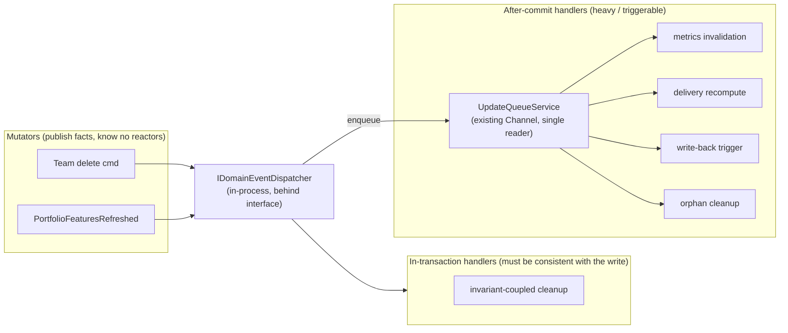

- **In-transaction handlers** run inside the *same* `SaveChanges` as the mutation. Use only for reactions that must be transactionally consistent with the write (rare here — most Lighthouse reactions are recompute/refresh that are *fine* to be eventually consistent). Example: nothing today strictly needs this; keep the tier available but expect it near-empty.
- **After-commit handlers** are the common case. The dispatcher, *after the write commits*, routes heavy work onto the **existing `UpdateQueueService` channel** (the single-reader, idempotent-enqueue queue the System Designer identified as already the right in-process async substrate). The 7-service `PortfolioUpdater` pipeline becomes 7 independent subscribers to `PortfolioFeaturesRefreshed`, each enqueued. Adding an 8th reaction = add a subscriber; **zero edits to the mutator** (this is the maintainability win the story asks for).

**In-transaction vs after-commit — the rule:** publish the event object during command handling; **dispatch after-commit by default**, in-transaction only for an explicit invariant. This matches the System Designer's "publish-on-state-change, after-commit heavy work routes to UpdateQueueService."

**Idempotency / replay story (the honest part, given in-process + crash-loss):**
- Events are **at-most-once in memory**: an after-commit handler enqueued but not yet run is lost if the process crashes. That is *acceptable* because (a) the **fact is already in the DB** (constraint #3), and (b) every reaction is also reachable by the **periodic scheduled sync** (`UpdateServiceBase` re-scans every interval and re-triggers). So the queue is an *optimisation for promptness*, not the system of record — losing a reaction delays it by one refresh interval, it does not lose data.
- **Idempotency comes free from the existing de-dup**: `UpdateQueueService.EnqueueUpdate` keys on `UpdateKey(updateType, id)` and `TryAdd`-drops duplicates. So publishing `PortfolioFeaturesRefreshed` twice (e.g. manual refresh + scheduled sync overlapping) collapses to one in-flight reaction per id. Handlers must therefore be **id-keyed and replayable** (recompute-from-current-state, not append-delta) — which the metrics-invalidation / forecast-recompute / delivery-recompute handlers already are.
- **No event store, no outbox needed at this scale.** An outbox would only be justified if a *lost reaction* were unrecoverable — but the scheduled re-sync makes every reaction recoverable. Adding an outbox table + relay would be over-engineering (explicitly called out).

**Seam shape:** define `IDomainEventDispatcher` + `IDomainEventHandler<TEvent>` as interfaces in the application/domain layer (mirroring how `IUpdateQueueService` is already an interface). In-process MediatR-style dispatch is sufficient; **do not pull in a library if a 30-line dispatcher suffices** — but a library is acceptable if the team prefers. A future external-broker adapter is a *replacement* of the dispatcher, not a rewrite (System Option 4C). **This seam is the single highest-value structural change the story motivates.**

### Question 3 — CQRS verdict: lightweight command/query separation (same store, distinct models). NOT full CQRS. NOT status quo-only.

**The contested call, made with evidence.**

What is true today (verified): the **read side already diverges informally**. `BaseMetricsService` / `TeamMetricsService` / `PortfolioMetricsService` compute *metric DTOs* (percentiles, throughput, run-charts, forecasts) that are **not** the write model — they are projections cached via `GetFromCacheIfExists` and *explicitly invalidated* on write (`InvalidatePortfolioMetrics` is called right after a sync in `PortfolioUpdater`). DTOs (`TeamDto`, `PortfolioDto`, `WorkItemDto`) are hand-built read shapes distinct from the entities. **Lighthouse is already doing read/write separation — it just hasn't named it.**

The **#4778 "Delivery Team Update Issue"** motivation: that class of bug is the signature failure of an *un-named* read/write split — a write path (team/feature-work update) and a read/derive path (delivery team membership, computed via `Portfolio.Teams` = `FeatureWork.Select(Team)`) that must stay coherent, but whose coherence is maintained by *imperative invalidation calls scattered across services* rather than by a disciplined "write commits → projection rebuilds via the event seam" flow. When someone adds a write path and forgets the matching invalidation, the read goes stale — a "not-so-nice fix" because the fix is *another* scattered invalidation call rather than a structural guarantee.

**Option 3A — Status quo (informal divergence, imperative invalidation).** + zero work; − the #4778 class of bug recurs every time a new write path forgets an invalidation; − the divergence is undocumented, so each developer re-discovers it.

**Option 3B — Lightweight command/query separation: one store, two *named* model sets, projections rebuilt via the Q2 event seam. (RECOMMENDED.)** Commands mutate aggregate roots through repositories (write model); queries read purpose-built projections (the metric DTOs / read DTOs that already exist). The difference from status quo is **discipline, not infrastructure**: (1) name the two sides; (2) make projection-refresh a **subscriber to the domain events** from Q2 (`PortfolioFeaturesRefreshed` → invalidate-and-recompute metrics) instead of an imperative call the mutator must remember; (3) read models never mutate write state. + structurally prevents the #4778 bug class (a new write path publishes its event; the projection subscriber fires automatically — no one has to *remember* the invalidation); + zero new infrastructure (same DB, same EF, same cache); + names what's already half-built. − requires the Q2 seam first (dependency, not a blocker); − light discipline cost in code review (don't let queries leak into write paths).

**Option 3C — Full CQRS (separate read store / read database).** + independent read scaling, denormalised read store. − **rejected as over-engineering at this scale.** The System Designer's sizing (~30 QPS peak, 30–100× headroom, read-dominated but in-memory-cached) shows *no read-throughput problem a separate read store would relieve*. A separate read store would add a second persistence target to keep consistent (a projection-lag problem the single-instance model otherwise *does not have* per System constraint #4), would need its own sync/rebuild path, and would **violate the no-fork / standalone-friendliness constraints** (a single-binary user now runs two stores). It buys scaling the instance will never need and pays in exactly the operability the product optimises for.

**Recommendation: 3B.** Adopt **lightweight command/query separation on the single store**: name the read side (it exists), and *route projection refresh through the Q2 domain-event seam* so read-model coherence becomes a structural guarantee rather than a remembered call. This is the honest, minimal answer to #4778: it fixes the *cause* (scattered imperative invalidation) without the *cure being worse than the disease* (a second store). **Explicitly reject full CQRS** — there is no read-throughput bottleneck, and a separate read store fights the single-instance, no-fork, standalone constraints the System layer locked in.

### Question 4 — Event Sourcing: reject (with the one-sentence rationale for the ADR).

**Reject Event Sourcing as the domain's persistence model.** Lighthouse's aggregates are **last-state-wins config + re-derivable sync snapshots** — there is no business requirement to reconstruct an aggregate's past state from an event log, no temporal-query need at the *domain* level, and the audit/history that *does* matter (work-item state transitions) is already captured as an explicit **historical projection** (`WorkItemStateTransition`, an append-only table populated *from the source system's changelog*, per ADR-015/016/017). 

**Critical clarification for the ADR (so the distinction is not lost):** capturing `WorkItemStateTransition` history is **NOT** event sourcing of the Lighthouse domain. Those rows are a *read-side historical projection of an external fact* (Jira/ADO/Linear changelog) — the source of truth is the external work-tracking system, and Lighthouse derives the current `WorkItem` state directly (not by folding transition events). Event-sourcing the domain would mean making the *event log the source of truth* for Team/Portfolio/Connection state and reconstructing them by replay — which buys temporal reconstruction nobody asked for, imposes event-versioning and snapshotting costs on a 2-person-edit config model, and adds eventual-consistency complexity the single-instance model otherwise avoids. **The historical-projection pattern already in place is the right and sufficient amount of "history"; full event sourcing is not warranted.**

### Handoff-relevant domain decisions, summarised (binding inputs to the Solution Architect)

1. **Config aggregate roots carry the optimistic-concurrency token; sync entities do not.** Tokened: **Team, Portfolio, WorkTrackingSystemConnection, RBAC (UserProfile/RbacGroupMapping/ApiKey), Delivery (light)**. Not tokened: **WorkItem, Feature, FeatureWork, WorkItemStateTransition**. The blanket `SaveWithRetry` reload-retry must be **scoped to bypass tokened-aggregate saves** so a human-edit conflict surfaces as HTTP 409 rather than being silently swallowed.
2. **Introduce an in-process `IDomainEventDispatcher` seam** with the past-tense vocabulary above (`TeamDeleted`, `PortfolioFeaturesRefreshed`, `WorkItemsRefreshed`, …). Mutators publish facts; reactors subscribe. **Dispatch after-commit by default, routing heavy work onto the existing `UpdateQueueService` channel**; reserve a near-empty in-transaction tier for true invariants. Idempotency = id-keyed replayable handlers riding the existing `TryAdd` de-dup; recovery = the periodic scheduled re-sync (no outbox, no event store). This dissolves the 9-injection `TeamController.DeleteTeam` and the 7-service-locator `PortfolioUpdater.Update`.
3. **CQRS = lightweight command/query separation on the SAME store** (Option 3B): name the already-existing read side and make projection refresh a *subscriber to the domain events* (fixes the #4778-class bug structurally). **Full CQRS / separate read store: rejected** (no read-throughput need; fights no-fork + standalone).
4. **Event Sourcing: rejected.** `WorkItemStateTransition` is a historical projection of an external changelog, not domain event sourcing — keep it; do not generalise it into ES.

---

## Application Architecture — target-architecture-4618 (analysis)

Story: ADO #4618 "Analyze best target Architecture" (Active, **analysis-only** — "This is just about analyzing where we are now, and where we want to go in future. Not the implementation.")
Wave: DESIGN
Date: 2026-05-26
Architect: Morgan (Solution Architect), interaction mode = PROPOSE
Layer scope: **application-layer wiring** — turning the System Designer's five constraints and the DDD architect's domain decisions into concrete C# component boundaries: where the `IDomainEventDispatcher` seam lives in the hexagon, what the candidate modules inside the monolith are and whether to enforce them, how CQRS-lite maps onto existing components, and the mandatory Reuse Analysis table. This is the **third and final** architect layer for this story; it respects (never relitigates) the binding constraints above and hands a draft ADR-027 decision list to the synthesis step.

Paradigm confirmed: **OOP (C# .NET 8 backend), ports-and-adapters / hexagonal — unchanged.** Nothing in this analysis proposes a paradigm shift; CLAUDE.md is not touched.

Right-sizing posture (inherited and reaffirmed): at 20–150 users, single-instance, the dominant risk is **over-engineering**. Q1 (the dispatcher) is the single genuinely new construct and it is a ~code-organisation pattern, not infrastructure. Q2 (modules) and Q3 (CQRS-lite) are *name and harden what already exists*. The default verdict throughout is EXTEND, not CREATE-NEW.

### Grounding — the two smells, verified in code (not assumed)

| Smell | File / member | Verified shape | Coupling count |
|---|---|---|---|
| Mutator knows every reactor | `API/TeamController.cs` → `TeamController(...)` ctor + `DeleteTeam(int teamId)` | Ctor injects **9** collaborators (`IRepository<Team>`, `IRepository<Portfolio>`, `IWorkItemRepository`, `ITeamUpdater`, `IPortfolioUpdater`, `IRepository<BlackoutPeriod>`, `IRefreshLogService`, `IRbacAdministrationService`, `IForecastFilterRuleService`). `DeleteTeam` hand-orchestrates the delete reaction: `Remove` → `Save` → `refreshLogService.RemoveRefreshLogsForEntity(Team, teamId)` → `foreach(affectedPortfolioId) portfolioUpdater.TriggerUpdate(id)`. Adding a 4th reactor (e.g. RBAC scope cleanup on team delete) means editing this method and adding a 10th injection. | **9 ctor injections; 3 hand-wired reactions in one method** |
| Mutator hides fan-out via Service Locator | `Services/Implementation/BackgroundServices/Update/PortfolioUpdater.cs` → `Update(int id, IServiceProvider serviceProvider)` | Resolves **7** services through `serviceProvider.GetRequiredService<…>` (`IRepository<Portfolio>`, `ILicenseService`, `IRefreshLogService`, `IWorkItemService`, `IForecastService`, `IPortfolioMetricsService`, `IDeliveryRepository`, `IDeliveryRuleService`, `IWriteBackTriggerService`) plus the ctor-injected `IOrphanedFeatureCleanupService`. The post-sync reaction (metrics-invalidate → delivery-recompute → write-back → forecast → forecast-write-back → orphan-cleanup) is a fixed imperative pipeline. A new reaction is another `GetRequiredService` + call inside this one growing method. | **7 service-locator resolutions; 6-step imperative pipeline in one method** |

Both confirm the DDD architect's diagnosis exactly: **the mutator is coupled to the full set of reactors.** This is the structural pain ADO #4618 names, and it is what the dispatcher seam dissolves.

Read-side grounding (for Q3), also verified: `TeamMetricsService` / `PortfolioMetricsService` build metric DTOs via `GetFromCacheIfExists(...)` and expose `InvalidateTeamMetrics(team)` / `InvalidatePortfolioMetrics(team)`, which `PortfolioUpdater.Update` calls imperatively right after a sync. **The read/write split already exists; the invalidation is a remembered imperative call, not a structural subscription.** That is the #4778 bug class in one sentence.

---

### Question 1 — The dispatcher seam in concrete component terms (where it lives in the hexagon)

**The before/after, as a component sketch.**

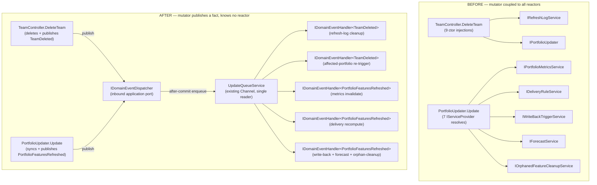

**Where the dispatcher lives in the hexagonal layering — the precise call:**

- **`IDomainEventDispatcher` is an INBOUND (driving) application port**, declared in `Services/Interfaces` (alongside `IUpdateQueueService`, which is already an interface there). It is *driving* because mutators *invoke* it to drive a reaction — same direction as a controller invoking a service. Publishers (controllers, updaters) depend only on this interface.
- **`IDomainEventHandler<TEvent>` is also an application-layer abstraction** in `Services/Interfaces`. Concrete handlers live in `Services.Implementation` next to the reactor they wrap (e.g. the metrics-invalidation handler sits in the Metrics module, the refresh-log-cleanup handler in the RefreshLog area). Handlers are the *re-homed* bodies of today's imperative reactions — not new behaviour.
- **The dispatcher implementation (`DomainEventDispatcher`) is a thin application-layer service**, NOT a driven adapter. It holds no infrastructure: it resolves `IDomainEventHandler<TEvent>` from DI and, for after-commit handlers, **routes onto the existing `UpdateQueueService.EnqueueUpdate(...)` channel** — it does not own a queue, a broker, or a DB. The actual async substrate (the `Channel<Func<Task>>` single reader) stays exactly where it is. The dispatcher is a *router*, the queue is the *transport*. This is why no new driven port is introduced.
- **After-commit by default; in-transaction tier reserved but near-empty** (per System constraint #3 / DDD Q2). The dispatcher exposes two publish modes: `PublishAfterCommit(event)` (the common case → enqueue) and `PublishInTransaction(event)` (rare, runs inside the same `SaveChanges`). At this scale almost everything is after-commit.

**Does it violate the existing ports-and-adapters invariants? No — and here is the check against each:**

| Invariant | Holds? | Why |
|---|---|---|
| Controllers depend on interfaces only, never concrete services | **HOLDS** | `TeamController` swaps `IPortfolioUpdater` + `IRefreshLogService` (concrete reactions) for a single `IDomainEventDispatcher` injection. Net ctor injections **drop from 9 toward ~5** (it still needs its own repositories to perform the delete). It depends on *fewer* concretions, not more. |
| `Services.Implementation` must not depend on `API` | **HOLDS — and is strengthened** | Domain events are POCO records (`TeamDeleted(int TeamId, IReadOnlyList<int> AffectedPortfolioIds)`) declared in the **domain/model layer** (`Models` or a new `Models/Events` folder), NOT in `API`. Handlers in `Services.Implementation` reference only those records + their existing service interfaces. No handler imports anything from `API`. The dispatcher must be defined so that `PortfolioUpdater` (already in `Services.Implementation`) publishing an event does not create an `Implementation → API` edge — events live below both. |
| The dispatcher does not become a god-object / hidden service locator | **HOLDS, with a rule** | `PortfolioUpdater.Update` today *is* a service locator (`GetRequiredService` ×7). The seam **removes** that: the 7 resolutions become 7 (or fewer, grouped) handlers each injected normally by DI. The dispatcher must resolve handlers via typed `IEnumerable<IDomainEventHandler<TEvent>>` injection, **not** by calling `IServiceProvider.GetRequiredService` itself — otherwise we would have moved the service-locator smell, not removed it. This is an enforceable rule (see Enforcement below). |

**Options considered for the seam mechanism:**

- **Option 1A — In-house ~30-line dispatcher (`IDomainEventDispatcher` + `IDomainEventHandler<TEvent>`), handlers injected as `IEnumerable<IDomainEventHandler<TEvent>>`, after-commit routing reusing `UpdateQueueService`. (RECOMMENDED.)** + zero new dependency; + mirrors the existing `IUpdateQueueService` interface idiom the codebase already uses; + total control over the after-commit-vs-in-transaction routing onto the existing channel; + nothing to license. − ~30–60 lines of dispatcher + DI registration to own and test (trivial, and the gold-test/probe story below covers it).
- **Option 1B — Adopt MediatR for `INotification` / `INotificationHandler`.** + battle-tested, familiar publish/subscribe; − **MediatR went commercial (paid licensing from v12.5/13)** — adopting it now introduces a license obligation and a future cost decision onto a product whose top quality attribute is operability/simplicity and whose standalone story is "one person, one binary." Pulling a commercial dependency in to replace ~30 lines of glue is poor ROI and a supply-chain/licensing liability. − MediatR's pipeline/behaviours are far more than this seam needs (we need publish + typed handlers + an after-commit hop, nothing more). **Reject** unless the team independently wants MediatR's broader mediator usage elsewhere — which is not motivated by this story.
- **Option 1C — Use .NET's built-in `IServiceProvider` + a hand-rolled event aggregator with reflection.** − reflection-based dispatch is harder to make AOT/trim-safe and harder to enforce statically; the typed `IEnumerable<IDomainEventHandler<TEvent>>` of 1A is simpler and DI-native. Reject.

**Recommendation (Q1): Option 1A.** A lightweight in-house `IDomainEventDispatcher` (inbound application port) + `IDomainEventHandler<TEvent>` (application abstraction), with handlers DI-injected as `IEnumerable<…>` and after-commit work routed onto the existing `UpdateQueueService` channel. It lives in the application layer as a router, introduces **no driven adapter and no new infrastructure**, *reduces* controller coupling (9→~5 on `TeamController`), *eliminates* the `PortfolioUpdater` service-locator, and **does not pull in commercial MediatR**. The events are POCO records in the model layer, preserving `Implementation ↛ API`.

**Earned-Trust note for Q1 (probe the seam, don't trust it):** the dispatcher's contract is "every published event reaches every registered handler, after-commit work survives onto the queue, and a handler failure does not lose the *fact*." That contract must be **probed, not assumed**: (a) a gold-test that publishes each catalogued event and asserts every registered handler fired (catches a handler silently unregistered in DI); (b) a test injecting a throwing handler and asserting the *fact* (DB row) survives and the reaction is recoverable on next scheduled re-sync (catches "a reaction failure corrupts the write"); (c) an enforcement test asserting the dispatcher resolves handlers via typed injection, not `GetRequiredService` (catches the service-locator smell reappearing). These are implementation-wave responsibilities, flagged here as first-class.

---

### Question 2 — Modular monolith module boundaries vs microservices

**Microservices: rejected — explicitly, on this story's own constraints.** The System layer locked in single-instance / single-writer correctness primitives (`UpdateQueueService` single channel reader, `DatabaseMaintenanceGate` process-singleton, in-process metric cache, SignalR in-process fan-out) and a standalone single-binary topology that forbids out-of-process dependencies. Splitting into microservices would (a) shatter every one of those singletons, forcing in a distributed lock + external queue + cache backplane — the very broker Q4 of the System analysis rejected; (b) make the single-binary standalone topology impossible (a non-operator cannot run N services + a mesh); (c) solve a throughput problem that the sizing (~30 QPS peak, 30–100× headroom) proves does not exist. **There is no driver for microservices here — only resume-driven risk.** ADO #4599 (the k8s/Helm example) is a **packaging concern, not an architecture split**: it is satisfied by a Helm chart running `replicas: 1` with probes + a Postgres Secret (System Q3 Option 3A), and changes nothing about module boundaries.

**Modular monolith — the candidate modules already exist as namespace seams** (verified under `Services/Implementation/*`). The honest finding is that Lighthouse is *already* a loosely-modular monolith organised by folder; the question is only whether to *name and enforce* the boundaries.

| Candidate module (bounded-context slice) | Existing namespace anchor(s) | Owns | Cross-module today |
|---|---|---|---|
| **WorkTracking-Integration** | `Services.Implementation.WorkTrackingConnectors.*` (Jira/ADO/Linear/CSV), `OAuth.*`, `Auth strategies` | External-system adapters, connector auth, sync ingestion | Feeds WorkItems + Portfolio via `IWorkItemService` |
| **WorkItems / Sync** | `Services.Implementation.WorkItems`, `TeamData`, `BackgroundServices.Update` | `WorkItem`/`Feature`/`FeatureWork` lifecycle, the update queue, the updaters | Publishes the refresh events (Q1) |
| **Forecasting** | `Services.Implementation.Forecast.*`, `PercentileCalculator`, `XmRCalculator` | Monte-Carlo / forecast computation, forecast filter rules | Subscribes to `PortfolioFeaturesRefreshed` |
| **Portfolio / Delivery** | `Services.Implementation.DeliveryRuleService`, `PortfolioMetricsService`, delivery repos | Portfolio + Delivery config, delivery rule recompute | Subscribes to refresh events |
| **Metrics / Time-in-state** | `Services.Implementation.BaseMetricsService`, `TeamMetricsService`, `PortfolioMetricsService`, `Cache` | Read-side metric projections + cache + invalidation | The CQRS-lite read side (Q3) |
| **RBAC / Identity** | `Services.Implementation.Authorization.*`, `Auth.*`, `ApiKey*` | Authn/authz, group mappings, API keys | Cross-cutting guard at controller boundary |
| **Platform / Persistence** | `Services.Implementation.Repositories.*`, `DatabaseManagement.*` | `IRepository<T>`, provider switch, backup/restore, maintenance gate | Shared kernel for all modules |

**Options for boundary enforcement:**

- **Option 2A — Keep boundaries logical (namespace-only), document them, no automated enforcement. (Status quo.)** + zero work; − boundaries erode silently (a Metrics class reaches into a Connector internal and nobody notices until it's load-bearing); − the modules stay implicit, so each developer re-discovers them.
- **Option 2B — Logical boundaries (namespaces) + ArchUnitNET enforcement rules; single assembly. (RECOMMENDED.)** Keep one `Lighthouse.Backend` assembly (no project split), but add ArchUnitNET tests that codify the dependency rules: e.g. *Metrics must not depend on WorkTrackingConnectors*; *Forecasting must not depend on API*; *only WorkItems/Sync may publish refresh events*; the existing aspirational rules (`Implementation ↛ API`, controllers→interfaces). + makes the boundaries *real and regression-proof* without the cost of an assembly split; + ArchUnitNET is the language-appropriate enforcement tool (NuGet, used the same way the brief already references for OAuth/forecast rules); + the rules become living documentation; − one-time cost to author the rule suite and add the `TngTech.ArchUnitNET` NuGet (it is **not yet a dependency** — verified; the existing brief references to ArchUnitNET tests are aspirational and would be realised here).
- **Option 2C — Physical assembly split (one `.csproj` per module) with project-reference-enforced boundaries.** + the compiler enforces boundaries (can't reference what you don't project-reference); − heavy: re-slicing one cohesive assembly into 6–7 projects is a large mechanical change, complicates the build/publish/single-file story, and risks circular-reference churn given today's shared `IRepository<T>` and cross-cutting `Models`; − **buys compile-time enforcement the ArchUnitNET tests already give us at test-time** for a fraction of the cost. Over-engineering at this scale. Defer indefinitely; revisit only if the team grows past the point where one assembly is a merge-contention bottleneck (Conway's-Law trigger — not present today; the project is effectively a small team / trunk-based on `main`).

**Recommendation (Q2): Option 2B — logical modules made enforceable via ArchUnitNET, single assembly.** Name the seven slices above (they already exist as folders), and add an ArchUnitNET rule suite that (1) forbids the dependency edges that would erode them, (2) realises the long-aspirational `Implementation ↛ API` and controllers→interfaces rules, and (3) guards the new dispatcher invariants from Q1. **No assembly split** (2C) — it pays for compile-time enforcement that the test-time rules already deliver, and it complicates the single-binary publish that the standalone topology depends on. This is the Conway's-Law-honest call: the team is small and trunk-based, so a logical boundary policed by CI is the right weight; a physical split is org-structure overhead the org doesn't have.

---

### Question 3 — Where CQRS-lite fits in the hexagonal style (concrete component mapping)

The DDD architect's verdict is **lightweight command/query separation on the SAME store** (Option 3B), full CQRS rejected. The application-layer job is to say *which existing components are the two sides* and *how the read side stays fresh*.

**The mapping onto real components (verified):**

| Side | Components today | Role |
|---|---|---|
| **Write model** | `*Updater` (`TeamUpdater`, `PortfolioUpdater`, `ForecastUpdater`) + `IRepository<T>` / `RepositoryBase.Save()` + the aggregate roots (`Team`, `Portfolio`, `Connection`, …) | Commands mutate aggregate roots through repositories; `SaveChangesAsync` commits. The tokened-aggregate 409 path (DDD Q1) lives here. |
| **Read model** | `BaseMetricsService` → `TeamMetricsService` / `PortfolioMetricsService` building metric DTOs via `GetFromCacheIfExists(...)`; hand-built `TeamDto` / `PortfolioDto` / `WorkItemDto` read shapes | Queries read purpose-built projections, cached. **Never mutate write state.** This side already exists — it just isn't *named* as the query side. |
| **Coherence mechanism (today, the bug source)** | `PortfolioUpdater.Update` imperatively calls `projectMetricsService.InvalidatePortfolioMetrics(project)` right after the sync | A *remembered* imperative invalidation. Forget it on a new write path → stale read → the #4778 "Delivery Team Update Issue" class. |

**Options for keeping the read side fresh:**

- **Option 3A — Status quo: imperative invalidation calls inside each mutator.** − the #4778 bug class recurs whenever a new write path forgets the matching `Invalidate…` call; − coherence is a convention, not a guarantee.
- **Option 3B — Invalidation becomes a domain-event *subscriber* (RECOMMENDED).** Move `InvalidatePortfolioMetrics` / `InvalidateTeamMetrics` out of the mutator body and into an `IDomainEventHandler<PortfolioFeaturesRefreshed>` / `IDomainEventHandler<WorkItemsRefreshed>`. Now any write path that publishes the refresh event gets the invalidation **automatically** — the coherence is *structural*, not remembered. This is the direct, minimal fix for #4778: the cause (scattered imperative invalidation) is removed; the cure (a second store) is avoided. + reuses the Q1 seam (dependency, not new infra); + zero new persistence; + a new write path can't forget to refresh the read model because it doesn't *do* the refresh — it publishes the fact and the subscriber handles it. − requires Q1 first; − light review discipline (don't let a query leak a write).
- **Option 3C — On-read recomputation (drop the cache, compute projections lazily on each query).** + no invalidation problem at all (always fresh); − throws away the existing cache that keeps dashboard reads fast under fan-out; − recomputing percentiles/forecasts on every read is wasteful at the read-dominated ~20:1 ratio. The cache earns its keep; keep it. Reject as the default (though individual cheap projections *may* be on-read where caching adds no value — a per-projection judgement, not an architecture decision).

**Recommendation (Q3): Option 3B — name the read side (it exists) and make projection/cache refresh a *subscriber* to the Q1 domain events.** Keep `MediatR`-free: the same lightweight `IDomainEventHandler<TEvent>` from Q1 carries the invalidation handlers — no separate command/query bus, no `IMediator`, no library. The write side stays the `*Updater` + repository path; the read side stays `BaseMetricsService` + cached metric DTOs; the *coherence* moves from a remembered call to an automatic subscription. **Full CQRS / separate read store stays rejected** (no read-throughput bottleneck; a second store fights no-fork + standalone). This is CQRS-lite as discipline-on-the-existing-store, exactly right-sized.

**Earned-Trust note for Q3:** the read-side contract is "after a write's event fires, the next query reflects it (read-your-writes for config; as-of-last-sync for metrics)." Probe it: a gold-test that performs a write, lets the refresh event drain the queue, and asserts the cached projection changed — catching a subscriber that was registered for the wrong event type (a silent-staleness regression that today's scattered-invalidation design produces as #4778).

---

### Question 4 — Reuse Analysis (MANDATORY HARD GATE)

Default is **EXTEND**. Every component this target architecture would touch/introduce, classified. Because this is *analysis*, the table describes *what the migration would do*, not a build order.

| Existing component | File / anchor | Overlap with target arch | Decision | Justification |
|---|---|---|---|---|
| `IUpdateQueueService` / `UpdateQueueService` | `Services/.../Update/UpdateQueueService.cs` | The async after-commit transport the dispatcher routes onto | **EXTEND (reuse as-is)** | Already the correct in-process single-reader, idempotent-enqueue substrate. The dispatcher *uses* it; it is not modified. Zero change. |
| `TeamController` | `API/TeamController.cs` | The 9-injection mutator | **EXTEND** | Replace the `IPortfolioUpdater` + `IRefreshLogService` reaction injections with a single `IDomainEventDispatcher`; `DeleteTeam` publishes `TeamDeleted`. Ctor shrinks ~9→~5. No new controller. |
| `PortfolioUpdater` | `.../Update/PortfolioUpdater.cs` | The 7-service-locator mutator | **EXTEND** | `Update` publishes `PortfolioFeaturesRefreshed`; the 7 `GetRequiredService` resolutions become DI-injected handlers. The class stays; its body sheds the pipeline. |
| `TeamMetricsService` / `PortfolioMetricsService` / `BaseMetricsService` | `Services/Implementation/*MetricsService.cs` | The CQRS-lite read side | **EXTEND** | `InvalidateTeamMetrics` / `InvalidatePortfolioMetrics` move from being *called by the mutator* to being invoked by an event *handler*. The services and cache are unchanged; only the *trigger* relocates. |
| `IRefreshLogService` / `RefreshLogService` | `Services/Implementation/RefreshLogService.cs` | Delete-reaction (`RemoveRefreshLogsForEntity`) | **EXTEND (wrap)** | The existing call becomes the body of an `IDomainEventHandler<TeamDeleted>` / `<PortfolioDeleted>`. Service unchanged; it gains a handler that calls it. |
| Aggregate roots (`Team`, `Portfolio`, `WorkTrackingSystemConnection`, RBAC, `Delivery`) | `Models/*` | Optimistic-concurrency token carriers (DDD Q1) | **EXTEND** | Add a concurrency token mapping (Postgres `xmin` / SQLite rowversion-style) on the five config roots only — per-provider mapping, the codebase already does per-provider mappings. No new entities. |
| `LighthouseAppContext.SaveChangesAsync` / `SaveWithRetry` | `*/LighthouseAppContext.cs` | The blanket reload-retry | **EXTEND (scope, do not replace)** | Scope the auto-retry so it bypasses tokened aggregates (surface 409) while still handling delete-of-already-deleted sync races. A scoping change, not a rewrite. |
| `Models` layer | `Models/` (proposed `Models/Events/`) | Domain-event POCO records | **CREATE NEW (small, justified)** | The past-tense event records (`TeamDeleted`, `PortfolioFeaturesRefreshed`, `WorkItemsRefreshed`, …) do not exist. They are tiny immutable `record`s and **must** live below both `API` and `Services.Implementation` to preserve `Implementation ↛ API`. No existing type carries this role → CREATE NEW is the only option. |
| `IDomainEventDispatcher` + `IDomainEventHandler<TEvent>` | `Services/Interfaces/` (proposed) | The publish/subscribe seam | **CREATE NEW (small, justified)** | No existing abstraction does in-process domain-event publish/subscribe (`IUpdateQueueService` is a *job* queue keyed by `UpdateType`+id, not a typed-event publisher). The dispatcher *reuses* the queue as transport but is a distinct, thin abstraction. ~30–60 lines + DI registration. CREATE NEW, deliberately minimal; **MediatR rejected** (commercial license). |
| `DomainEventDispatcher` (impl) | `Services/Implementation/` (proposed) | Router from event → handlers → queue | **CREATE NEW (small, justified)** | Thin application-layer router; resolves `IEnumerable<IDomainEventHandler<TEvent>>` (typed DI, not service-locator) and enqueues after-commit work. No infrastructure. |
| Module boundaries | namespace folders under `Services/Implementation/*` | The seven candidate modules | **EXTEND (name + enforce)** | The folders already exist; the migration *names* them and adds enforcement. No code moves required to *declare* the boundary. |
| ArchUnitNET rule suite | `Lighthouse.Backend.Tests` (proposed) | Boundary + invariant enforcement | **CREATE NEW (test-only)** | `TngTech.ArchUnitNET` is **not yet a dependency** (verified). The existing brief references to ArchUnitNET tests are aspirational; this story would realise them. Test-project-only; zero production-code or runtime impact. |
| Helm chart (#4599) | (packaging) | k8s deployment of the same binary | **CREATE NEW (packaging, not architecture)** | A `replicas: 1` chart with probes + Postgres Secret. Packaging concern; no module split, no architecture change. Handed to platform-architect. |

Hard-gate summary: **of 14 rows, 9 are EXTEND/reuse and 5 are CREATE-NEW** — and every CREATE-NEW is either a tiny abstraction (events, dispatcher) that no existing type can carry, a test-only enforcement suite, or a packaging artifact. **No new infrastructure, no new persistence, no new runtime process.** The bias is strongly toward reuse, as the right-sizing demands.

---

### Quality-attribute trade-off summary (ATAM-lite sensitivity points)

| Decision | Primary attribute bought | Trade-off point | Verdict at this scale |
|---|---|---|---|
| In-process dispatcher (1A) | Maintainability (mutator ↛ reactors), testability | Slight indirection vs explicit calls | Worth it — kills the 9-injection / 7-locator smells |
| Logical modules + ArchUnitNET (2B) | Modifiability, analyzability | One-time rule-authoring cost | Worth it — boundaries become regression-proof without an assembly split |
| CQRS-lite via subscription (3B) | Correctness (#4778 structurally fixed), maintainability | Light review discipline | Worth it — removes a recurring bug class with zero new store |
| MediatR rejected | Cost (no commercial license), operability | Slightly more in-house code | Correct — ~30 lines is cheaper than a license obligation |
| Microservices / assembly split / separate read store rejected | (would buy scale we don't need) | Operability, standalone-friendliness, no-fork | Correct rejections — all are over-engineering at 20–150 users |

### Architectural enforcement (language-appropriate, this analysis)

| Rule | Enforcement mechanism |
|---|---|
| `IDomainEventDispatcher` resolves handlers via typed `IEnumerable<IDomainEventHandler<TEvent>>`, never `IServiceProvider.GetRequiredService` | ArchUnitNET test: `DomainEventDispatcher` must not reference `IServiceProvider`/`GetRequiredService` (prevents the service-locator smell re-appearing) |
| Domain-event records live below `API` and below `Services.Implementation` | ArchUnitNET test: `Models.Events` types depend on neither `API` nor `Services.Implementation` (preserves `Implementation ↛ API`) |
| Module boundaries (the seven slices) | ArchUnitNET dependency rules per edge (e.g. Metrics ↛ WorkTrackingConnectors; Forecasting ↛ API) |
| Controllers depend on interfaces only | ArchUnitNET test (realises the long-aspirational rule) |
| Every published event reaches every registered handler; a handler failure never loses the fact | NUnit gold-test (publish each event, assert all handlers fire; inject a throwing handler, assert DB fact survives + recovers on re-sync) — the Earned-Trust probe for the seam |

No external integrations are *introduced* by this target architecture (the connectors to Jira/ADO/Linear already exist and already carry their own contract-test annotation from prior features). Nothing here changes that boundary.

---

## Application Architecture — remove-action-buttons

Feature: remove-action-buttons (ADO #5077)
Wave: DESIGN -> DELIVER (SHIPPED 2026-05-29, HEAD `2770d739`)
Date: 2026-05-29
Architect: Morgan (Solution Architect), interaction mode = PROPOSE

**Status: SHIPPED.** All six surfaces converted; full Vitest suite (3090) green; mutation 81.82%
(above the 80% gate); walking skeleton verified live against demo scenario 0. Both stopgap Alerts
deleted. See `docs/evolution/remove-action-buttons-evolution.md`.

This section is **additive** to all prior `## Application Architecture` deltas. Architectural pattern (ports-and-adapters), paradigm (OOP backend + functional-leaning React frontend), and core invariants are unchanged. The change is **frontend-only**: no backend port, no endpoint, no DTO touched (cross-cutting checklist confirms). It extends the already-shared `useModifySettings` hook with an opt-in auto-save capability and a save-state machine, reuses the shipped `TeamForecastView` auto-run orchestration for the forecast surfaces, and conforms to ADR-001 (`useRbac()`-only UI gating).

### Architectural Pattern

**Ports-and-Adapters (Hexagonal)** — unchanged. On the frontend the relevant seam is the `useModifySettings` hook (the application-state port for settings forms) and the existing API services (`teamService`, `forecastService`, `teamMetricsService` — the driven adapters). Auto-save changes only *when* an existing driven call fires (on debounced validity), never *what* it sends.

### Key invariants introduced

- **One save mechanism, one indicator, one state machine** for all four settings surfaces — `useModifySettings` is the single owner. Enforced by a frontend guard test that no settings surface renders a bespoke save indicator (realises journey `integration_validation.saveState`). See ADR-029.
- **RBAC permission is injected, never re-derived.** `useModifySettings` receives `canSave: boolean`; it does not call `useRbac()` itself. Parent pages compute it from `useRbac()`/`useRbacGate` (`EditTeam.tsx:35`, `TeamDetail.tsx:543`, `ModifyProjectSettings.tsx:276`) exactly as they do for today's `disableSave`. Conforms to ADR-001. See ADR-029.
- **A save fires only from a fully-valid, dirty, permitted form; only the latest sequence's response is applied; a failed save retains the edit.** The stale-guard (`requestSeqRef`) and validity-gate (`formValid`) have a single owner in the hook. See ADR-029.
- **Dependent-data reload after auto-save is cost-based:** cheap (State Mappings) → silent auto-refresh; expensive (Forecast Filter throughput) → one-click in-place "Reload throughput now". Never a navigate-away instruction (D-RELOAD). Both stopgap Alerts deleted. See ADR-030.
- **Forecast auto-run reuses the shipped pattern** (`hasInteractedRef` + `requestSeqRef` + `DEBOUNCE_MS=300`, `TeamForecastView.tsx:70-72,181-196`) — no divergent debounce/stale-guard. D-REUSE-SHIPPED-PATTERN.

### System Context and Capabilities

No backend change; the FE continues to talk to the same Lighthouse API. The feature retires the explicit Save/Run click on six surfaces:

1. General team settings — debounced auto-save on valid (linchpin).
2. State Mappings — auto-save + silent metrics auto-refresh.
3. Forecast Filter (premium) — auto-save + one-click throughput reload; `forecast-filter-takeeffect-hint` Alert deleted.
4. Portfolio settings — auto-save with `canUpdatePortfolioData` parity.
5. New-item forecast — auto-run on valid input (reuses shipped orchestration).
6. Backtest — auto-run on valid input (reuses shipped orchestration).

### Component Decomposition

See `docs/feature/remove-action-buttons/feature-delta.md` → **Wave: DESIGN / [REF] Component decomposition** for the full table (real paths + EXTEND/CREATE NEW/NO CHANGE). Headline:

- **CREATE NEW (frontend, 2 small presentational components) — SHIPPED**: `SaveStateIndicator` (passive status affordance), `ReloadDependentDataAction` (one-click reload for the expensive surface).
- **EXTEND (frontend) — SHIPPED**: `useModifySettings` (opt-in `autoSave` + save-state machine), `ModifyTeamSettings`, `ModifyProjectSettings`, `StateMappingsEditor`, `ForecastSettingsComponent`, `TeamForecastView`, `NewItemForecaster`, `BacktestForecaster`.
- **NO CHANGE**: `ValidationActions` (retained for its ~6 non-settings callers), `ForecastFilterEditor` (`readOnly` gate already correct), all backend.
- **SHIPPED surfaces (6/6)**: general team settings (Save button removed), state mappings (auto-save + silent auto-refresh), forecast filter (auto-save + one-click "Reload throughput now"; `forecast-filter-takeeffect-hint` Alert deleted), portfolio settings (`canUpdatePortfolioData` parity), new-item forecast auto-run, backtest auto-run (empty rolling window on load). Both stopgap Alerts deleted.

### Save-state machine

```
idle --(formValid && canSave && dirty)--> savingDebounced --(300ms quiet)--> saving
saving --(success, seq current)--> saved        saving --(fail)--> error --(retry)--> saving
saved  --(cheap)--> auto-refresh    saved --(expensive)--> one-click "Reload throughput now"
any --(!formValid)--> idle  (inline error is primary)    any --(!canSave)--> suppressed (read-only)
```

### Driving Ports (UI actions) — unchanged

Reuse `PUT /api/teams/{id}`, portfolio PUT, `POST runItemPrediction`, `POST runBacktest`. Auto-save/auto-run change only the trigger (debounced validity), not the contract.

### Driven Ports

| Port | Adapter | Status |
|---|---|---|
| Settings persist (`saveSettings` callback) | `teamService` / portfolio update | NO CHANGE (reuse) |
| New-item / backtest run | `forecastService.runItemPrediction` / `runBacktest` | NO CHANGE (reuse) |
| Dependent-data refresh | `teamMetricsService` / existing throughput recompute | NO CHANGE (reuse) |
| RBAC gating | `useRbac()` / `useRbacGate` (parent pages) | NO CHANGE (ADR-001) |

### ADR References (this feature)

- [ADR-029](./adr-029-autosave-on-valid-mechanism-placement-and-save-state-machine.md): Auto-save-on-valid mechanism placement (extend `useModifySettings`) + save-state machine + RBAC-by-injection.
- [ADR-030](./adr-030-dependent-data-reload-after-autosave-cost-based-split.md): Dependent-data reload after auto-save — cost-based auto vs one-click split (D-RELOAD).

### Architectural Enforcement (this feature)

| Rule | Enforcement Mechanism |
|---|---|
| Auto-save fires only on `formValid && canSave && dirty`; rapid edits persist only the latest (stale-guard); failed save retains edit; `canSave=false` → zero `saveSettings` calls | Vitest fault-injection suite on `useModifySettings` (reject / rapid-edit / RBAC-suppressed scenarios) |
| One save mechanism + one indicator across all four settings surfaces | Vitest/Biome guard test: no settings surface renders a bespoke save indicator (realises `integration_validation.saveState`) |
| Forecast auto-run reuses `hasInteractedRef`/`requestSeqRef`/`DEBOUNCE_MS` — no divergent debounce | Vitest test asserting no-run-on-mount + stale-discard on both forecast surfaces |
| Both stopgap Alerts removed | grep + Vitest absence assertions (`forecast-filter-takeeffect-hint`, "a data reload is needed") |
| RBAC gating derives only from `useRbac()` (no direct `/my-summary` fetch); `useModifySettings` does not import `useRbac` | Biome/grep guard (ADR-001 invariant) |

### C4 — System Context (L1)

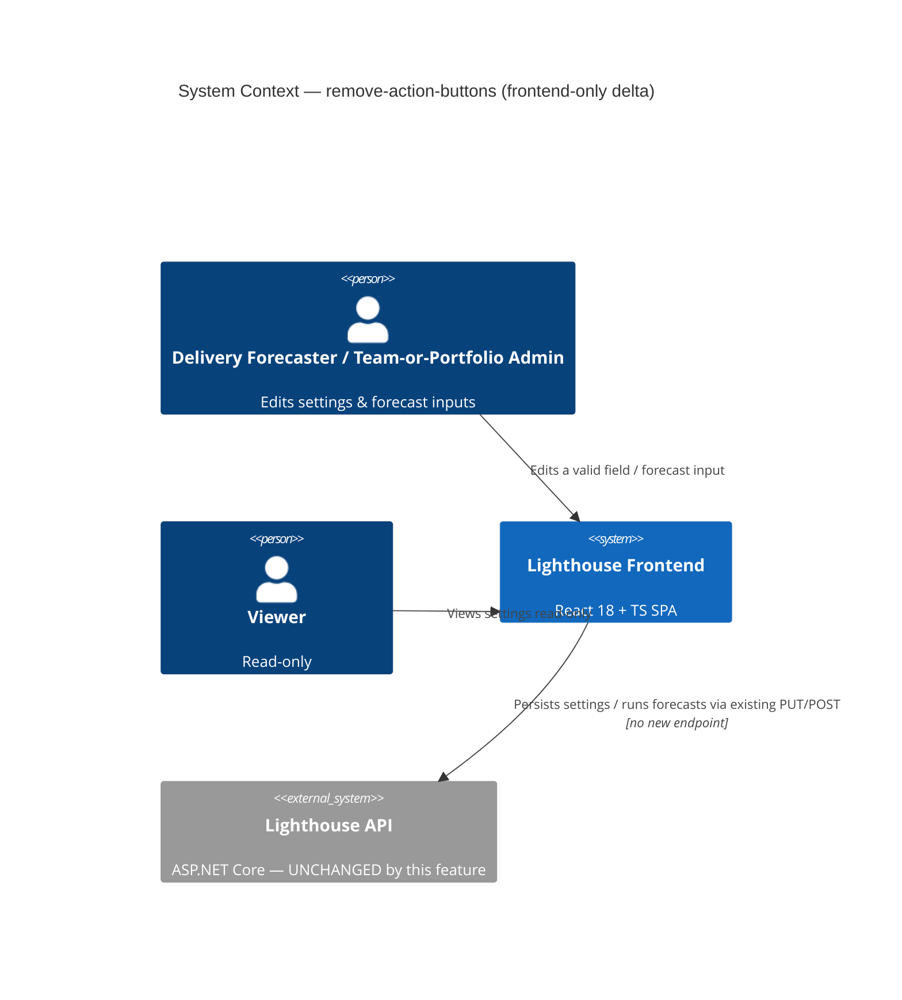

### C4 — Component (L3, frontend save + forecast flow)

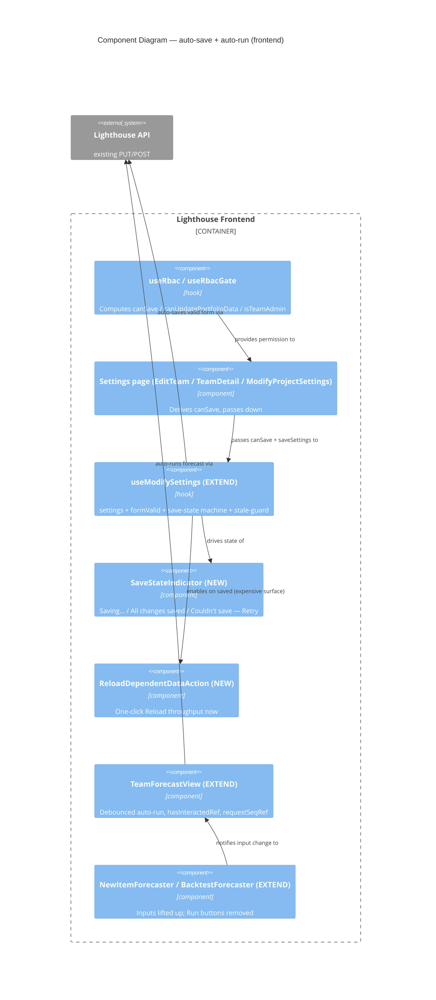

---

## Application Architecture — forecast-confidence-cap

Feature: forecast-confidence-cap (ADO #5126 "Never show 100% Confidence")
Wave: DESIGN
Date: 2026-05-30
Architect: Morgan (Solution Architect), interaction mode = PROPOSE

This section is **additive** to all prior `## Application Architecture` deltas. Architectural pattern (ports-and-adapters), paradigm (OOP backend + functional-leaning React frontend), and core invariants are unchanged. **This feature is frontend-only**: it adds no endpoint, no DTO change, no domain rule, no driven adapter. It plugs into one new pure view-layer helper consumed by four existing render sites.

### Architectural Pattern

Ports-and-Adapters (Hexagonal) — **no port change**. The cap is a presentation policy, not a domain concern. The Monte Carlo likelihood (`ForecastBase.GetLikelihood`, `Feature.GetLikelhoodForDate`) and its semantics — including returning `100` when no remaining work — are the domain truth and are untouched (D2, D4 exempt path preserved at source).

### Key decision

The `">95%"` rule lives in a single frontend pure helper `formatLikelihood(value, { hasRemainingWork, precision })`, consumed by all four likelihood-rendering surfaces. Numeric DTOs (`ManualForecastDto.Likelihood`, `DeliveryWithLikelihoodDto.LikelihoodPercentage`, `FeatureLikelihoodDto.LikelihoodPercentage`) stay `double` and unchanged. See **ADR-038**.

The decisive finding: **the D4 remaining-work signal is already available at every frontend call site** — `remainingItems` (manual), `delivery.remainingWork` (delivery + overview chips), `row.getRemainingWorkForFeature()` (per-feature chip, via the feature row already bound in the cell). No DTO field is needed to enforce the completed-item exemption. This is what makes the FE-only design (Option A) strictly better than a backend display field (Option B, redundant once the old-server fallback is considered) or a hybrid DTO field (Option C, an unnecessary contract change).

### Component Decomposition

See `docs/feature/forecast-confidence-cap/feature-delta.md` → **Wave: DESIGN / [REF] Component decomposition** for the full table. Headline: **1 CREATE NEW** (`formatLikelihood`), **4 EXTEND** (`ForecastLikelihood`, `DeliverySection` delivery chip + per-feature chip, `DeliveriesChips`), **3 NO CHANGE** (`ForecastLevel`, all backend DTOs). No backend code touched.

### Driving / Driven Ports

None changed. No new/changed HTTP route, no new driven adapter.

### ADR References (this feature)

- [ADR-038](./adr-038-forecast-confidence-cap-display-formatter.md): Cap lives in a FE shared formatter, not a backend display field — D2-preserving; D4 sourced locally per call site.

### Architectural Enforcement (this feature)

| Rule | Enforcement Mechanism |
|---|---|
| Every likelihood-rendering FE surface routes through `formatLikelihood` (no raw `Math.round(likelihood)%` / `toFixed(2)%` on a forecast likelihood) | Vitest structural/grep test asserting the four call sites call `formatLikelihood`; no inline likelihood formatting remains |
| Numeric DTO fields unchanged (D2) | NUnit reflection test asserting `ManualForecastDto.Likelihood`, `DeliveryWithLikelihoodDto.LikelihoodPercentage`, `FeatureLikelihoodDto.LikelihoodPercentage` remain `double` with no new band/cap field |
| D4 exemption (completed items still read 100%/Done) | Vitest boundary tests on `formatLikelihood` at 94.9 / 95.0 / 95.01 / 100 with `hasRemainingWork` true and false |

### Clients consistency

No new endpoint → no `FEATURE_REQUIRES_SERVER_NEWER_THAN` version gate. CLI/MCP clients adopt the `">95%"` rule **only if** they render a likelihood to a human; raw-JSON-only ⇒ N/A. Non-blocking follow-up in the clients repo. The numeric value clients receive is unchanged, so a client that does nothing remains correct.

### C4 — Component (L3, forecast-likelihood render path)

System Context (L1) and Container (L2) for Lighthouse exist in earlier `brief.md` sections / `c4-diagrams.md` — referenced, not recreated.

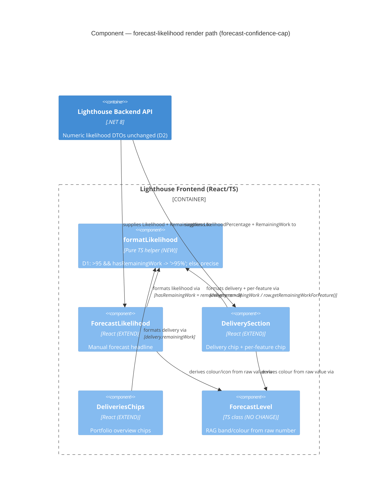

---

## Application Architecture — forecast-minimum-data-guard

Feature: forecast-minimum-data-guard (ADO #5125 "Don't Forecast with too little Data")
Wave: DESIGN
Date: 2026-05-31
Architect: Morgan (Solution Architect), interaction mode = PROPOSE

This section is **additive** to all prior `## Application Architecture` deltas. Pattern (ports-and-adapters), paradigm (OOP backend + functional-leaning React), and core invariants unchanged. It is the data-sufficiency **gate** that the sibling `forecast-confidence-cap` deferred (its D3). **It deliberately diverges from ADR-038's frontend-only shape** and composes in front of it.

### Key decision (the contrast with ADR-038)

The cap could be FE-only because its D4 signal (`hasRemainingWork`) was already at every call site. This feature's D1 signal — **days with ≥1 completion** — is **not** on the wire (`RunChartData.WorkItemsPerUnitOfTime` is backend-only; `RunChartData.History` is the *total* window length, not the active-day count) and is costly to send. So the sufficiency decision is **backend-computed** and carried as an additive boolean `HasSufficientData` on the existing forecast DTOs. See **ADR-039**.

The decision is made **once** at the single choke point every forecast path traverses — `ITeamMetricsService.GetForecastThroughputStatus(team, mode)` — by a one-rule pure policy `ForecastDataSufficiencyPolicy.HasEnoughData` (`const MinimumActiveDays = 5`, reading a new `RunChartData.DaysWithThroughput` accessor). The flag rides the existing `ForecastThroughputStatus → WhenForecast → DTO` carrier chain (the same rails as `FilterApplied`/`ExcludedSummary`). The simulation gate `if (Total > 0)` becomes `if (HasSufficientData)`, excluding a data-thin team so no misleading number is computed. D6 (post-fallback throughput) holds for free because the policy reads the resolved `status.Throughput`.

Frontend branches on a pure predicate `isForecastDataInsufficient = hasRemainingWork && !hasSufficientData` and renders a shared `InsufficientForecastDataIndicator` instead of the likelihood — so the suppression sits in front of `formatLikelihood`/`ForecastLevel` (untouched), and D4 composes (completed items, `hasRemainingWork === false`, are never suppressed).

### Component Decomposition

See `docs/feature/forecast-minimum-data-guard/feature-delta.md` → **Wave: DESIGN / [REF] Component decomposition**. Headline: **2 CREATE NEW** (`ForecastDataSufficiencyPolicy` backend, `InsufficientForecastDataIndicator` + `isForecastDataInsufficient` frontend), the rest **EXTEND** (one `RunChartData` accessor, the `ForecastThroughputStatus`/`WhenForecast`/3 DTO additive booleans, 4 FE render sites + 2 FE models), **NO CHANGE** to `formatLikelihood`/`ForecastLevel`. **No EF migration** (threshold is a constant, not persisted — contrast filter-forecast-throughput).

### Driving / Driven Ports

No new routes. `forecast/manual` and the deliveries response gain the additive `hasSufficientData` boolean; `itemprediction` and `backtest` are OUT of scope (creation-forecast / historical-accuracy, not the live delivery forecast). **No new driven port** — pure computation, no DB/external/migration.

### ADR References (this feature)

- [ADR-039](./adr-039-forecast-data-sufficiency-backend-signal.md): Sufficiency is a backend-computed boolean on the forecast DTOs (not a FE heuristic) — the mirror image of ADR-038; one-rule policy at the `GetForecastThroughputStatus` choke point; FE suppression composes with the cap via `hasRemainingWork`.

### Architectural Enforcement (this feature)

| Rule | Enforcement Mechanism |
|---|---|
| The sufficiency rule (const 5 + predicate) exists in exactly one place | NUnit/grep test: referenced only from `ForecastDataSufficiencyPolicy` + `GetForecastThroughputStatus` |
| `ForecastDataSufficiencyPolicy` is pure (no I/O) | NUnit static/constructor-inspection test |
| Every FE likelihood surface branches on `isForecastDataInsufficient` before showing a number | Vitest structural test over the four call sites |
| D1 boundary (4/5/6 active days, 0) and D4 (`hasRemainingWork === false` never suppressed) | NUnit policy tests + Vitest predicate tests |
| Numeric likelihood DTOs unchanged (additive boolean only) | NUnit reflection test |

### Clients consistency

Additive boolean on existing endpoints → no new endpoint, **no `FEATURE_REQUIRES_SERVER_NEWER_THAN` gate**; FE defaults a missing field to `hasSufficientData = true` (old server degrades to today's behaviour). Clients adopt the suppression only if they render a likelihood to a human — non-blocking follow-up.

## Application Architecture — lighthouse-user-survey (ADO Epic #5124)

This section is **additive** to all prior `## Application Architecture` deltas. It is a **multi-surface / cross-repo** feature; most production code lands in the **WEBSITE repo** (`/storage/repos/website`), with a small **LIGHTHOUSE-repo** in-app nudge. It **EXTENDS the 5123 shared Supabase platform** (ADR-031..037) without redesigning it (D6). ADRs: **ADR-040..046**.

### Cross-repo split

- **WEBSITE repo** (functional-core/imperative-shell hexagonal idiom continued from 5123, ADR-035): the stable hidden `/survey` page + zod-validated survey content module (ADR-043); a single `service_role` **`submit-survey` Edge Function** that writes the anonymous response, the optional trial lead, AND sends a per-submission team-notification email to `survey.answer@letpeople.work` (ADR-046, consolidating what ADR-040/041/042 first split); the survey view on 5123's internal dashboard (ADR-042). Paradigm: functional React (website is a separate codebase from the OOP Lighthouse product — recorded, not re-decided).
- **LIGHTHOUSE repo** (OOP, ports-and-adapters): the in-app nudge FE component (Lighthouse's own design system, D7) + two per-instance settings on the existing AppSettings mechanism (`installTimestamp`, `lastShownAt`, ADR-045). Eligibility is **FE-derived** from existing signals (ADR-044, user-confirmed 2026-05-31).

### Platform reuse (EXTEND, not redesign — D6)

| Concern | Verdict | How |
|---|---|---|
| `responses` table | EXTEND | new `source='user-survey'`; nullable `raw_sum/score/band` reused; written via `service_role` (ADR-040/046) |
| Survey write path | CREATE NEW | one `service_role` `submit-survey` Edge Fn: response + optional trial lead + team email (ADR-046); supersedes the anon-INSERT path + migration `0003` RLS-widen + the separate `capture-survey-lead` |
| Team notification email | CREATE NEW renderer / EXTEND transport | `surveyNotificationEmail` to `survey.answer@letpeople.work` via the shared `_shared/mailgun.ts`; degrade-open (ADR-046) |
| `leads` table | EXTEND | reuse nullable `score/band` + `wants_trial`; `source='user-survey-trial'`, `service_role`-only (ADR-046) |
| Shared ports (`ports/index.ts`) | EXTEND | widen `ResponseSource` union + guarded non-scored shape + `SurveySubmission.submit` port (ADR-040/046) |
| Dashboard auth/layout | EXTEND | reuse 5123 Supabase Auth + `Card`/`Table` shell; new survey tab + `summarizeSurvey` core (ADR-042/033) |
| `/survey` route + content module | CREATE NEW | unscored single-page survey; mirrors the ADR-035/036 idiom, not the scoring machine (ADR-043) |
| Per-instance settings | EXTEND | two keys on the existing `AppSetting`/`AppSettingService` mechanism (ADR-045) |
| Nudge FE component | CREATE NEW | Lighthouse design system; nudge-with-a-link, never embeds the survey (ADR-044) |
| Non-admin nudge settings read | CREATE NEW | the existing `AppSettingsController` is `[RbacGuard]`-admin; the community-user nudge needs a non-admin read (ADR-045) |

### Invariants (test-anchored)

- **Premium fails CLOSED** — a premium instance NEVER renders the nudge at any install age; enforced by a deterministic test, not telemetry (KPI 5 = 0). Premium evaluated FIRST, absolute (ADR-044).
- **UTC-stable install age** — comparisons on server-supplied UTC instants; a backward clock jump never fires a nudge early; on any anomaly/uncertainty, fail closed = no nudge (ADR-044/045).
- **PII discipline** — the only PII is the trial email, via the `service_role` `submit-survey` Edge Fn, never anon, in the separate `leads` table with NO join to `responses` (structural anonymity, ADR-034/046). The team-notification email correlates answers↔email ONLY for trial opt-ins (who chose to identify); anonymous-only submissions carry no identity (ADR-046).
- **No auto-issuance** — trial opt-in records a signal + email only; never creates a license (D4, ADR-041/046).
- **Notification degrade-open** — a Mailgun failure never blocks a submission; the response is recorded and the thank-you shown regardless (ADR-046).
- **Stable hidden route** — `/survey` never changes when questions change; ships hidden (no nav, no sitemap, no robots Disallow); `deploy.yml` SPA fallback `cp dist/index.html dist/survey/` (ADR-043).

### Earned Trust

The per-instance settings store is a driven adapter (EF over Sqlite/Postgres). A **startup probe** asserts write-once durability + read-after-write UTC-stability of `installTimestamp`; a failed/uncertain probe degrades the nudge to **not eligible (fail closed)** — never a day-0 fire or a bothered premium user — without blocking core app startup (ADR-045).

### Clients consistency

Under ADR-044 Option (a) FE-derived eligibility, **no new feature endpoint** → CLI/MCP clients **N/A**, no `FEATURE_REQUIRES_SERVER_NEWER_THAN` gate. If the user selects ADR-044 Option (b) (server-side eligibility endpoint), the clients version-gate rule applies and is added to the DEVOPS handoff.


## Application Architecture — delivery-target-date-tracking (Epic 3993 follow-up)

Make the delivery over-time charts honest when a delivery's **target date moves**. A thin, reuse-heavy extension of the shipped `delivery-metrics` stack (this brief, the `delivery-metrics` section above). No new endpoint, no new RBAC, no new dependency, no new chart. Two slices (ADO #5174, #5175); the burnup slice (#5176) was dropped at DESIGN.

### Key invariant introduced

Every target-relative metric (`LikelihoodPercentage`, fever `100 − likelihood`) is computed against `Delivery.Date`, but the snapshot stored only the computed value, not the target it referenced — so a target move silently re-scored the whole recorded history. The snapshot now records the target **as of each day** (`TargetDateAtSnapshot`), forward-only, so the predictability charts contrast each day's forecast against the target that actually applied.

### Component changes (EXTEND-only, plus two pure helpers)

- `DeliveryMetricSnapshot` (+`TargetDateAtSnapshot DateTime?`), one EF migration per provider via `Create-Migration.ps1` (forward-only; verify on a real provider — InMemory skips migrations).
- `DeliveryMetricSnapshotRecordingHandler` sets `snapshot.TargetDateAtSnapshot = delivery.Date` in the existing daily per-delivery loop (ADR-049 idempotency preserved).
- `DeliveryMetricsHistoryPointDto` + the FE `DeliveryMetricsHistory.ts` parser each gain one nullable `targetDateAtSnapshot` (additive field on the existing metrics-history contract — ADR-050 re-affirmed).
- `DeliveryPredictabilityChart`: **When?** view renders the target as a `curve:"stepAfter"` series on its existing time y-axis (flat `ChartsReferenceLine` fallback when all-null); **How Likely?** view adds a marks-only change-dot overlay at target-change snapshots (neutral date-pair on hover, D4).
- NEW pure helper `models/Delivery/deliveryTargetHistory.ts` (`targetChanges` / `steppedTargetData`) — derivation kept out of the components for testability (the UI-1 lesson). The only CREATE-NEW, and it is pure functions, not a class.
- `DeliveryBurnupChart` and the fever chart: **untouched** (the delivery date is not wanted on the burnup; the fever chart has no clean time axis).

### Driving / driven ports

No new driving port (additive nullable field on `GET .../deliveries/{id}/metrics-history`, `[RbacGuard(PortfolioRead)]`, premium-gated — unchanged). No new driven port (`Delivery.Date` read by the recorder; the existing snapshot repository persists the extra column with no interface change).

### Clients consistency

**N/A** — no new endpoint, only an additive nullable field on an existing response. No `FEATURE_REQUIRES_SERVER_NEWER_THAN` gate (that rule guards new endpoints old servers 404). Old clients ignore the field; new clients treat null as "no recorded target".

### ADR References (this feature)

- **ADR-051** — per-snapshot target capture (`TargetDateAtSnapshot` + recorder), forward-only.
- **ADR-052** — moving-target predictability rendering (When? step line + How Likely? change dots + pure derivation helper); supersedes the dropped burnup treatment.
- Re-affirms **ADR-050** (single metrics-history endpoint, wide nullable schema).

---

## Application Architecture — wait-states-flow-efficiency (Story #5173)

Feature: wait-states-flow-efficiency (additive, brownfield extension of the shipped `state-time-cumulative-view` chart, Epic 4144, plus a new Flow Overview tile). Lets a config-admin mark idle "wait" Doing-states (raw OR a whole State Mapping in one click), then surfaces **flow efficiency = active-Doing-time / total-Doing-time** on three surfaces: an overview tile, a number on the cumulative chart (aggregate + per-item via the existing US-05 picker), and colour-highlighted wait bars on that chart.
Wave: DESIGN · Date: 2026-06-05 · Architect: Morgan (Solution Architect), interaction mode = PROPOSE · Paradigm: OOP (C# backend), functional-leaning React frontend.

This section is **additive** to all prior `## Application Architecture` deltas. Pattern (ports-and-adapters / hexagonal), paradigm, and core invariants are **unchanged**. NO new architectural style, NO new external integration, NO new external library, NO premium gate, NO new top-level route. Exactly ONE new persisted field (`WaitStates`, mapping-aware), ONE new small read endpoint per scope (the overview tile), and three thin presentation surfaces over data the client already round-trips. ADRs: **ADR-054 / ADR-055 / ADR-056 / ADR-057**.

### Key invariants introduced

- **Mapping-aware `WaitStates` (D11, ADR-056)**: a new `List<string> WaitStates` on `WorkTrackingSystemOptionsOwner` (next to `BlockedStates`/`StateMappings`); entries are raw Doing-states OR `StateMapping.Name`, resolved through the EXISTING `GetRawStatesForCategory(WaitStates)` — the same expansion the state categories use. No second resolver on the backend; a pure TS twin `resolveWaitRawStates(...)` on the frontend.
- **Flow-efficiency derivation (D2/D8a, ADR-054)**: `efficiency = (totalDoingTime − waitTime) / totalDoingTime`, where `totalDoingTime = Σ totalDays[Doing-state]` and `waitTime = Σ totalDays[s] for s ∈ GetRawStatesForCategory(WaitStates)`. It is a pure FOLD over the per-state `totalDays` the cumulative computation already produces — NO new per-state aggregation pass (ADR-024 upheld for the fifth time across this lineage; no `IPerStateAggregationService`).
- **Chart number + wait-bar highlight FE-derived (ADR-054/057)**: both read the SAME `resolveWaitRawStates(...)` over the per-state rows the chart already has (already `itemIds`-narrowed ⇒ per-item efficiency is the free n=1 case, mirroring ADR-028 §7). The `cumulativeStateTime` contract is **UNCHANGED** — no `efficiency` field, no `isWaitState` row flag. Single FE source closes the registry HIGH-risk "two surfaces read different lists" divergence structurally.
- **Tile is BE-computed, never the picker (D5/D18, ADR-055)**: the overview tile value is computed server-side over the WHOLE in-scope set via a new `protected` fold `BaseMetricsService.ComputeFlowEfficiency`, served by a small dedicated `flowEfficiencyInfo` endpoint per scope (the established `wipOverviewInfo`/`totalWorkItemAgeInfo` tile pattern). It takes NO `itemIds`.
- **D3 vs D4 are contract-level booleans (ADR-055)**: `FlowEfficiencyInfoDto { IsConfigured, HasDataInScope, EfficiencyPercent, … }` — "not configured" (never 100%) and "no data in scope" (no division) are distinct flags, not magic sentinels.
- **Inverted RAG (D10, ADR-057)**: NEW `computeFlowEfficiencyRag` in `ragRules.ts` — red < 40 / amber 40–60 / green ≥ 60 (efficiency is higher-is-better, the OPPOSITE polarity of `computeCumulativeStateTimeRag`). Confirms the D10 40/60 thresholds; separate function, not a wrap.
- **UI placement (D12, ADR-056)**: a NEW sibling `WaitStatesEditor` immediately after `StateMappingsEditor` in both settings forms — the existing `StateMappingsEditor` is **NOT relocated/re-propped** (Option (b); the relocating wrapper Option (a) was rejected for blast radius — pure structural churn on a shipped component with a `reconcileDoingStates` coupling). Suggestions = raw Doing-states ∪ mapping names. Decoupled from Blocked States (`FlowMetricsConfigurationComponent` NO-CHANGE).
- **Labelling overlay only (D9)**: wait states change throughput / forecasts / cycle-time / aging / the existing cumulative bars+RAG by ZERO. The only consumers are the efficiency computation and the highlight.

### Component decomposition (headline)

- **NEW (backend)**: `WaitStates` field on `WorkTrackingSystemOptionsOwner` (+ EF migration via `CreateMigration` script, DELIVER task; persists like `BlockedStates`); `FlowEfficiencyInfoDto`; `BaseMetricsService.ComputeFlowEfficiency` (`protected` fold); `flowEfficiencyInfo` endpoint on `TeamMetricsController` + `PortfolioMetricsController`; `GetFlowEfficiencyInfoForTeam`/`…ForPortfolio` on the services + interfaces.
- **EXTEND (backend)**: settings DTO/validator (`waitStates` additive field), `ITeamMetricsService`/`IPortfolioMetricsService` (+1 method each), `BaseMetricsService` (+1 helper).
- **NEW (frontend)**: `WaitStatesEditor.tsx`; `flowEfficiency.ts` util (`flowEfficiency()` fold + `resolveWaitRawStates()` resolver); `FlowEfficiencyOverviewWidget.tsx` (small KPI tile, `BlockedOverviewWidget` shape); `computeFlowEfficiencyRag` in `ragRules.ts`; `flowEfficiency` entries in `categoryMetadata.ts` (`flow-overview`, `small`, `trendPolicy: none`) + `widgetInfoMetadata.ts`; TS model + Zod for `FlowEfficiencyInfoDto`; Vitest tests.
- **EXTEND (frontend)**: settings TS model/Zod (`waitStates`), `ModifyTeamSettings.tsx` + `ModifyProjectSettings.tsx` (render `WaitStatesEditor` sibling), `MetricsService`/`IMetricsService` (+ `getFlowEfficiencyInfo…`), the cumulative chart component (wait-bar `isWait` predicate + efficiency number slot), `BaseMetricsView` (dispatch the `flowEfficiency` tile).
- **REUSE-AS-IS**: `GetRawStatesForCategory` (BE resolver), `StateMappingsEditor` / `StatesList` / `FlowMetricsConfigurationComponent` (UNTOUCHED), `InputGroup` + `ItemListManager` idiom, the cumulative `CumulativeStateTimeDto` + endpoints + US-05 picker, MUI-X `<BarChart>` + `<pattern>` hatch, `RagResult`/`ragRules.ts` idiom, `BaseMetricsService.GetFromCacheIfExists`, the `…Info`-tile controller scaffolding, `useRbac`.

### Driving ports (HTTP)

| Method | Route | Auth | Status |
|---|---|---|---|
| GET | `/api/teams/{teamId:int}/metrics/flowEfficiencyInfo?startDate&endDate` | `[RbacGuard(TeamRead)]` | **NEW (ADR-055)** |
| GET | `/api/portfolios/{portfolioId:int}/metrics/flowEfficiencyInfo?startDate&endDate` | `[RbacGuard(PortfolioRead)]` | **NEW (ADR-055)** |

`waitStates` rides the EXISTING team/portfolio settings GET/PUT (additive field, like `blockedStates`). The chart efficiency number + wait-bar highlight add NO endpoint (FE-derived from the existing `cumulativeStateTime` + settings round-trips, ADR-054). The tile endpoints mirror `wipOverviewInfo` exactly (same validation, same `RbacGuard`, no `itemIds`).

### Driven ports

NONE new. The tile fold reads only the existing per-state cumulative computation (over `WorkItemStateTransition` + `CurrentStateEnteredAt`, already wired by sibling 1). No new persistence adapter (the `WaitStates` column rides the existing settings aggregate's EF mapping). **No external integration ⇒ no contract tests recommended at the platform-architect handoff.**

### Lighthouse-Clients consistency (version-gate)

- Config write (`waitStates`): additive field on the existing settings contract ⇒ **NO version gate**.
- Chart number + wait-bar highlight: FE-derived, no new endpoint ⇒ **NO version gate**.
- Overview tile (`flowEfficiencyInfo`): the ONE new endpoint. **IF** the CLI/MCP clients wrap it, the wrapping method MUST be version-gated (`FEATURE_REQUIRES_SERVER_NEWER_THAN`, strictly newer than the last released version); **IF NOT wrapped** (a product-UI-only read), the gate is N/A. Decision recorded at wrap-or-skip time in the clients repo. (ADR-055.)

### Quality attributes

- **Performance**: the efficiency value is an O(states) fold (~5–15 states) over the per-state totals the cumulative computation already produces — negligible. The tile endpoint caches under `FlowEfficiency_{startDate}_{endDate}` via the existing hook.
- **Maintainability/Testability**: the formula lives in exactly two pure, mutation-testable folds (`flowEfficiency.ts` FE, `ComputeFlowEfficiency` BE), pinned to agree by a cross-surface equality test (picker-cleared chart number == tile value). The RAG and resolver are pure functions. The highlight is largely presentational (justified mutation survivors).
- **Reliability**: D9 guardrail — throughput/forecast/cycle-time/aging and the existing cumulative bars+RAG are byte-identical before/after defining wait states (regression test).
- **Security**: tile endpoints inherit the existing class-level `RbacGuard(TeamRead)`/`(PortfolioRead)`; `waitStates` edit inherits the existing settings-edit gating (no new permission, no new `useRbac()` gate).

### ADR References (this feature)

- [ADR-054](./adr-054-flow-efficiency-derivation-and-contract.md): Flow Efficiency — Derivation From Existing Per-State Day Totals; FE-Computed Chart Number + Wait-Bar Flag (No New Cumulative Field); BE-Computed Tile Value.
- [ADR-055](./adr-055-flow-efficiency-tile-transport-and-client-version-gate.md): Overview Tile — Small Dedicated `flowEfficiencyInfo` Endpoint (Established Tile Pattern), `trendPolicy: none`, and the Lighthouse-Clients Version-Gate Consequence.
- [ADR-056](./adr-056-wait-states-config-placement-and-mapping-aware-resolution.md): Wait States Config — Mapping-Aware `WaitStates` + Sibling `WaitStatesEditor` (No `StateMappingsEditor` Relocation), Resolved via `GetRawStatesForCategory`.
- [ADR-057](./adr-057-wait-bar-highlight-and-flow-efficiency-rag.md): Wait-Bar Colour-Highlight (FE-Derived, Colour-Blind-Safe, Composing With Segments) + `computeFlowEfficiencyRag` (Inverted 40/60 Thresholds).

### Delivered status (2026-06-05)

Shipped (DISCUSS → DESIGN → DISTILL → DELIVER complete). Mutation baselines: backend core logic **86.2%** (`ComputeFlowEfficiency` 100%, controllers 100%; survivors logging-only equivalents), frontend core logic **89.0%** raw / **99.1%** excluding equivalents (`flowEfficiency.ts` 100%, `computeFlowEfficiencyRag` 100%, `FlowEfficiencyOverviewWidget` 100% logic, `WaitStatesEditor` 80.49%). The shared `CumulativeStateTimeChart` aggregate (58.25%) is presentational-bound under the `state-time-cumulative-view` baseline. ADR-057 deviation: the wait distinction shipped **colour-only** (red-ish bars) + interactive legend per explicit user choice — the D6 pattern/icon reinforcement was dropped. Evolution: [`docs/evolution/2026-06-05-wait-states-flow-efficiency.md`](../../evolution/2026-06-05-wait-states-flow-efficiency.md).

---

## Application Architecture — blackout-day-forecast-shift (Epic 4974)

Feature: blackout-day-forecast-shift — the **forward day↔date working-day translation** layer for forecasts. Turns the Monte Carlo's *days* into a calendar date that skips configured `BlackoutPeriod`s and never lands on one (days→date, D3), and converts a target date into a working-day count for likelihood/how-many-by-date (date→working-days). Config + historical-throughput stripping + backtest are shipped & LOCKED (D1); this delta adds ONLY the missing translation.
Wave: DESIGN · Date: 2026-06-05 · Architect: Morgan (Solution Architect), interaction mode = PROPOSE · Paradigm: OOP (C# backend).

This section is **additive** to all prior `## Application Architecture` deltas. Pattern (ports-and-adapters / hexagonal), paradigm, and core invariants are **unchanged**. NO new architectural style, NO new external integration, NO new external library, NO new endpoint, NO new DTO field, NO EF migration, NO new DI registration. ADR: **ADR-058**.

### Key invariants introduced

- **Two pure functions on the existing static `BlackoutDaysExtensions` (ADR-058, DDD-1)**: `ProjectWorkingDays(periods, start, workingDayCount) → DateTime` (days→date, rolls forward off a landing blackout day, D3) and `CountWorkingDays(periods, start, target) → int` (date→working-days). Both pure — the clock is a passed-in parameter, the period list a passed-in argument. They live beside the shipped `GetBlackoutDayIndices`/`IsBlackoutDay` (D7) — single home for all blackout math. NO new `IWorkingDayProjector` service (Option C rejected: pure functions with no collaborators).
- **Fetch-once, pass-inward (DDD-2/D9)**: the global blackout set (`blackoutPeriodRepository.GetAll()`, unscoped) is fetched **once per inbound request** in the DI-aware assembly layer (`ForecastController`, `DeliveriesController`→`DeliveryWithLikelihoodDto.FromDelivery`, `WriteBackTriggerService`) and threaded inward as a materialised `IReadOnlyList<BlackoutPeriod>`. Mirrors the shipped `GetBlackoutAwareThroughputForTeam` fetch-once pattern. No N+1.
- **Models acquire NO repository/service dependency (DDD-3)**: `WhenForecastDto`, `Feature`, `Delivery` receive the periods as a **method/ctor parameter** (shape **A1, LOCKED**: `IReadOnlyList<BlackoutPeriod>`; A2 pre-bound delegate rejected). Upholds the brief's Models ↛ Repositories invariant (ArchUnitNET-guarded — `BlackoutForecastShiftSeamArchUnitTest`, green).
- **D6 byte-identical is a property of the math, not a branch (DDD-4)**: empty period list ⇒ `ProjectWorkingDays == AddDays`, `CountWorkingDays == (t − d).Days`. The no-blackout regression golden test passes `periods = []`.
- **D4 Monte Carlo untouched (DDD-5)**: `ForecastService`, `ForecastBase.GetProbability`/`GetLikelihood`, `Trials`, percentile math are NOT edited. Only their date *inputs* (date→days) and date *outputs* (days→date) are wrapped at the assembly layer. `GetProbability(p)` is asserted identical with/without periods (US-01 AC4).
- **Orthogonality vs shipped stripping (DDD-6, US-04 AC3)**: historical stripping changes the throughput SAMPLE (past days, feeds the days value); forward projection changes only the rendered DATE (future days). Opposite sides of "today" — they never act on the same day, so they cannot double-count. Pinned by the compose-guard test.

### New / reused ports

- **No new port.** Reused driven port: `IRepository<BlackoutPeriod>` (`GetAll()` global, D9) — already injected in `TeamMetricsService`; **newly injected into `WriteBackTriggerService`** (US-04). Driving ports unchanged (existing forecast/delivery/write-back surfaces carry shifted values; existing `TeamRead`/`PortfolioRead`/`PortfolioWrite` guards unchanged).
- **No driven adapter, no external integration ⇒ no contract tests at the platform-architect handoff.** The primitives are pure in-process functions over data from the existing repo — no external substrate, so no probe contract is owed.

### Component decomposition (headline)

- **EXTEND (backend, the only changes)**: `BlackoutDaysExtensions` (+2 pure functions); `WhenForecastDto` + `DtoExtensions.CreateForecastDtos` (project When dates over periods); `ForecastController` (fetch once; `CountWorkingDays` at the by-date seams ~57/80/93/103; pass periods to When DTOs); `HowManyForecast.TargetDate`, `Feature.GetLikelhoodForDate(date, periods)`, `Delivery.CalculateMetrics(periods, …)` (line 102 projection), `DeliveryWithLikelihoodDto.FromDelivery(delivery, periods)` + `DeliveriesController` (fetch + thread); `WriteBackTriggerService` (inject repo, fetch once, project line 226).
- **REUSE AS-IS (untouched)**: `ForecastService` / `ForecastBase` / Monte Carlo (D4); `TeamMetricsService` blackout-aware throughput (D1, orthogonal); `GetBlackoutDayIndices`/`IsBlackoutDay`/`HasOverlapWithDateRange`; `IRepository<BlackoutPeriod>`.
- **CREATE NEW**: none in production code. (`IWorkingDayProjector` service candidate explicitly rejected — ADR-058 Option C.)

### DELIVER outcome — as-built (shipped 2026-06-06, HEAD past `a5137088`)

Shipped on `main` over 5 DELIVER slices (Epic 4974 stories #5185-5188). Deltas vs the DESIGN decomposition above, all recorded in the feature-delta `## Wave: DELIVER / [WHY] Upstream Issues`:

- **`HowManyForecast.TargetDate` — NOT touched** (DESIGN listed it EXTEND): it has no production consumer on a forecast-date surface, so threading periods into it was dropped to avoid dead churn.
- **Consistency surfaces ADDED beyond the original decomposition**: `FeatureDto` percentile dates (+ its 4 building controllers `FeaturesController`/`DeliveryRulesController`/`PortfolioMetricsController`/`TeamMetricsController`) and the **`DeliveryMetricSnapshotRecordingHandler`** (so recorded over-time snapshots match the now-blackout-aware live delivery read). Both make feature dates blackout-aware on *every* read surface, not just inside a Delivery.
- **Backtest forward horizon (UI-2) — touched despite D1-lock**, on explicit user request: `ForecastController.RunBacktest` now sets `forecastDays = CountWorkingDays(periodStart, periodEnd)` so the forecast horizon matches its already-blackout-aware sample (was raw calendar days → over-predicted). The shipped historical-stripping itself is unchanged.
- **Item-creation prediction (`/forecast/itemprediction`) — deliberately left calendar-based (UI-1)**: its created-items history sample is NOT blackout-aware, so a working-day horizon there would under-predict. Tracked as a follow-up, not shipped.
- **Mutation**: new shift code (the two primitives) 100% effective kill rate (15/15 non-equivalent); 4 documented equivalent defensive-guard mutants. Report at `docs/feature/blackout-day-forecast-shift/deliver/mutation/`.

### Reuse analysis

Default EXTEND honoured everywhere. The single CREATE-NEW candidate (an injectable projector service) is rejected because the translation is two pure functions with no collaborators to mock and D7 mandates reuse of the existing blackout-math home. Full table in the feature-delta `## Wave: DESIGN / [REF] Reuse Analysis`.

### Lighthouse-Clients consistency (version-gate)

The translation changes the *value* of existing date fields (`ExpectedDate`, write-back date) on existing endpoints — no new route, no new field ⇒ **NO `FEATURE_REQUIRES_SERVER_NEWER_THAN` gate**. Clients render whatever date the server sends; dates become more accurate. (Matches the feature-delta cross-cutting checklist.)

### Premium gating

`BlackoutPeriod` CRUD and `ComputeBlackoutAwareThroughput` carry **no premium gate** (verified — `GetBlackoutAwareThroughputForTeam` does not reference `ILicenseService`). The shift inherits **no premium gate** for US-01/02/03 (activates whenever periods are configured, D2). US-04 write-back already sits behind the existing `licenseService.CanUsePremiumFeatures()` gate (`WriteBackTriggerService` line 34); the shift inherits it unchanged. No new gate anywhere.

### Quality attributes

- **Functional suitability / reliability**: D3 roll-forward + D6 byte-identical are pinned by boundary + golden tests; KPI "forecast date stability across a known weekend" verified by a Fri-vs-Mon clock-pinned integration test; "0 dates landing on a blackout day" asserted across all surfaces.
- **Maintainability / testability**: the whole translation lives in two pure, mutation-testable functions in one home; ≥80% Stryker gate (D8). D4/D6/AC3 are direct assertions because the day logic and date logic are not entangled.
- **Performance**: one `GetAll().ToList()` per request (global set, D9), then O(days) projection — negligible; no N+1.
- **Security**: no new endpoint, no RBAC surface, no new permission (DISCUSS RBAC verdict N/A).

### Architectural Enforcement (this feature)

| Rule | Mechanism |
|---|---|
| Day↔date translation exists in exactly one place (`ProjectWorkingDays`/`CountWorkingDays`) — no inline `AddDays`/`(target − Today).Days` on a forecast date at the six seams after this feature | NUnit/grep + ArchUnitNET test extending the existing suite |
| `ProjectWorkingDays`/`CountWorkingDays` are pure (no `IRepository<>`, `DbContext`, `HttpClient`, `ILogger`, `DateTime.UtcNow`/`Today`) | NUnit static-inspection test |
| Forecast models (`Models.Forecast.*`, `Feature`, `Delivery`) depend on NO repository/service | ArchUnitNET test: `Models.*` ↛ `Services.Interfaces.Repositories`/`Services.Interfaces` |
| Monte Carlo day-values unchanged | NUnit: `GetProbability(p)`/`GetLikelihood(d)` identical with/without periods (US-01 AC4) |
| D3 roll-forward / D6 identity / US-04 AC3 compose-guard | NUnit boundary, golden, and compose-guard tests (ADR-058) |

### ADR References (this feature)

- [ADR-058](./adr-058-blackout-forecast-date-shift-translation-placement.md): The forward day↔date blackout translation is two pure functions on `BlackoutDaysExtensions`, threaded through the DTO/projection assembly layer — never inside the forecast models. (Alternatives B "logic in models" and C "injectable projector service" considered and rejected.)

### C4 — Container (this feature, backend translation seam)

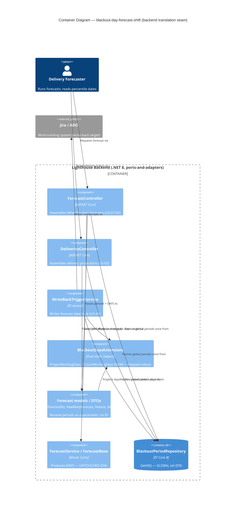

### C4 — Component (the translation seam detail)

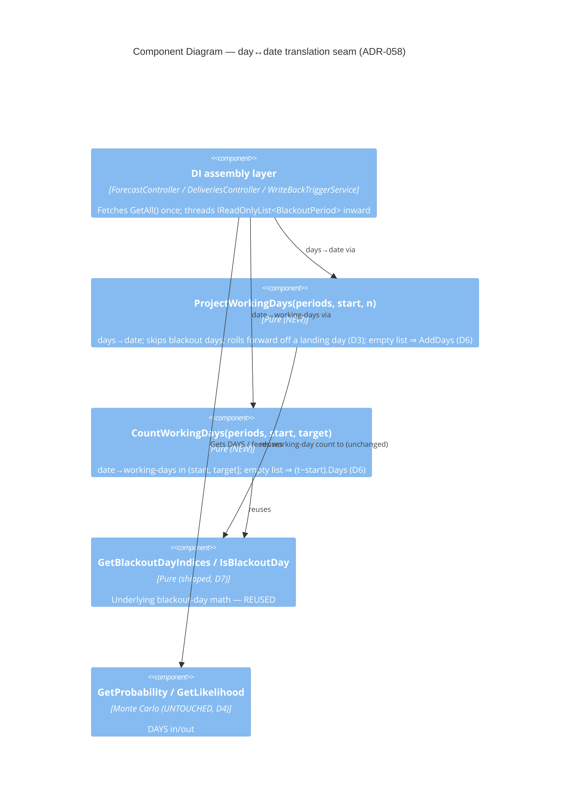

---

## Application Architecture — recurring-blackout-events (Epic 4577)

Feature: recurring-blackout-events — adds a **`RecurringBlackoutRule`** entity (weekday set + every-X-weeks interval + concrete start + optional open-ended end) **alongside** the shipped one-off `BlackoutPeriod`. Recurring days **materialize into synthetic single-day `BlackoutPeriod` instances** and join the global blackout-day set behind a single unifying service seam, so the shipped #4974 day↔date shift (ADR-058), the historical-throughput stripping, and the chart overlays consume them **with no per-surface change** (D4 unified evaluation; D7 shift untouched). Sibling of the SHIPPED #4974.
Wave: DESIGN · Date: 2026-06-06 · Architect: Morgan (Solution Architect), interaction mode = PROPOSE · Paradigm: **OOP (C# backend), functional-leaning React frontend**. ADRs: **ADR-059** (unified evaluation via materialization), **ADR-060** (entity + weekday storage + expansion). Cross-refs **ADR-058**.

This section is **additive** to all prior `## Application Architecture` deltas. Pattern (ports-and-adapters / hexagonal), paradigm, and core invariants are **unchanged**. NO new architectural style, NO new external integration, NO new external library. There IS a new endpoint family, a new entity + EF migration, a new DI registration, and a new settings UI section — all mirroring the shipped one-off blackout-period stack (D2).

### Key invariants introduced

- **Recurring days reach evaluation by materialization, not by signature change (ADR-059, the pivotal decision).** A `RecurringBlackoutRule` expands (pure) into one single-day `BlackoutPeriod { Start = End = matchedDay }` per matching day in the consumer's window. Because every shipped helper (`IsBlackoutDay`, `GetBlackoutDayIndices`, `ProjectWorkingDays`, `CountWorkingDays`, `AnnotateBlackoutDays`) speaks `BlackoutPeriod`, a materialized recurring day is **indistinguishable downstream** (D4) and the #4974 A1 contract is **untouched** (D7). Chosen over (A) per-consumer duplication across the 13 fetch sites and (B) generalizing the seam behind an `IBlackoutDaySource` interface (large blast radius, re-touches the shipped shift; deferred per ADR-058's own YAGNI threshold).
- **Union in exactly one place — the fetch seam (ADR-059).** `IBlackoutPeriodService.GetEffectiveBlackoutDays(windowStart, windowEnd) → IReadOnlyList<BlackoutPeriod>` fetches both repos once, expands rules over the window, returns one-off ∪ recurring in the **unchanged `IReadOnlyList<BlackoutPeriod>` shape**. The ~13 existing fetch sites (`blackoutPeriodRepository.GetAll().ToList()` in `ForecastController`, `DeliveriesController`, `FeaturesController`, `DeliveryRulesController`, `TeamMetricsController`, `PortfolioMetricsController`, `TeamController`/`TeamsController`, `WriteBackTriggerService`, `TeamMetricsService`, `DeliveryMetricSnapshotRecordingHandler`) migrate to this same-shape call, each threading the window it already owns. Mirrors the #4974 "fetch once in the service/assembly layer, pass materialised list inward" pattern (ADR-058 DDD-2) — the union just fetches two repos.
- **Bounded expansion.** Open-ended rules (`End == null`) are expanded **only across the consumer's window** (forecast horizon / chart range / delivery date) — never to infinity. O(window-days) per rule; no N+1 (global set, #4974 D9).
- **Interval anchoring is week-index modulo (ADR-060).** Anchor on the ISO-Monday of the rule's start week; a day matches iff its weekday is selected AND `weeksBetween(anchorMonday, dMonday) % IntervalWeeks == 0` AND `d ∈ [Start, End]`. Interval 1 ⇒ `% 1` always true ⇒ plain weekly (US-02 AC4, no special case). Worked against every US-02 AC in ADR-060.
- **Entity mirrors `BlackoutPeriod`; weekday set stored as JSON-converted `List<DayOfWeek>` + `ValueComparer` (ADR-060)** — reusing the `Team.StateMappings` converter idiom in `LighthouseAppContext` (the `ValueComparer` is mandatory; omitting it is the EF-misses-mutation trap that precedent already solved). `Start`/`End` are native `DateOnly`/`DateOnly?` (no converter; `BlackoutPeriod` already maps `DateOnly`). Chosen over a `[Flags]` enum bitmask (diverges from codebase idiom; `DayOfWeek` is the natural boundary type) and a child weekday table (over-normalized for a ≤7-element value set).
- **Models acquire NO repository/service dependency.** `RecurringBlackoutRule` is a persistence projection; expansion is a pure extension method (`RecurringBlackoutRuleExtensions.ExpandToBlackoutDays`) with the window passed in. ArchUnitNET-guarded (same `Models.* ↛ Services.*` rule that guards `BlackoutPeriod`/`Feature`/`Delivery`).
- **No-rule / no-period regression byte-identical** (inherits #4974 D6): no rules ⇒ `GetEffectiveBlackoutDays ≡ blackoutPeriodRepository.GetAll()`; no rules + no periods ⇒ empty list ⇒ identity math everywhere.

### New / reused ports

- **New driving ports**: `POST` / `GET` / `PUT/{id}` / `DELETE/{id}` on `RecurringBlackoutRulesController` at `api/{v1|latest}/recurring-blackout-rules` — `GET` open, writes `[LicenseGuard(RequirePremium=true)]` + `[RbacGuard(SystemAdmin)]` (D5; mirrors `BlackoutPeriodsController`). Plus the "Recurring Blackout Rules" settings-UI section action.
- **New driven port**: `IRepository<RecurringBlackoutRule>` (`GetAll()` global, D6) + `RecurringBlackoutRuleRepository` (mirrors `BlackoutPeriodRepository : RepositoryBase<>`). Newly injected into `IBlackoutPeriodService` for the union. No new external integration, no driven adapter to a foreign substrate ⇒ **no probe contract / no contract tests owed** at the platform-architect handoff (the union is a pure in-process function over data from the existing repos).
- **No new forecast/chart endpoint** — recurring days flow into existing #4974 surfaces via `GetEffectiveBlackoutDays` (US-03).

### Component decomposition (headline)

- **CREATE NEW (backend)**: `Models/RecurringBlackoutRule.cs` (entity); `Models/RecurringBlackoutRuleDto.cs`; `Services/Implementation/RecurringBlackoutRuleExtensions.cs` (pure `ExpandToBlackoutDays`); `Services/Interfaces/IRecurringBlackoutRuleService.cs` + `Services/Implementation/RecurringBlackoutRuleService.cs` (CRUD + `Validate`); `Services/Implementation/Repositories/RecurringBlackoutRuleRepository.cs`; `API/RecurringBlackoutRulesController.cs`. (Each is the recurring twin of a shipped one-off file — CREATE NEW because the entity is genuinely new per D4, not a variant of `BlackoutPeriod`.)
- **CREATE NEW (frontend)**: `models/RecurringBlackoutRule.ts` (+ Zod schema at the trust boundary); `services/Api/RecurringBlackoutRuleService.ts`; `pages/Settings/System/BlackoutSettings.tsx`. **VF-2 (DELIVER, user verification 2026-06-06) reversed DESIGN Decision 6's sibling-component shape**: instead of a second `RecurringBlackoutRulesSettings.tsx` section, the one-off `BlackoutPeriodsSettings.tsx` and the recurring component were **merged into one `BlackoutSettings.tsx` section** titled "Blackout Periods & Recurring Rules" — two Add buttons (Add Blackout Period / Add Recurring Rule), two separate Add/Edit dialogs, and ONE merged read grid (**Schedule | Description | Actions**; Schedule = `start → end` for a one-off, recurrence summary for a recurring rule). One-off and recurring stay *distinct concepts* (per D4) — the distinction lives in the two buttons/dialogs and the Schedule-column text — while sharing one box for less real estate and easier management. The earlier "merging entangles two form shapes" concern did not materialise because only the read grid + section frame unified; the two dialogs stayed separate.
- **EXTEND (backend)**: `IBlackoutPeriodService` + `BlackoutPeriodService` (add `GetEffectiveBlackoutDays(window)`, inject `IRepository<RecurringBlackoutRule>`); `LighthouseAppContext` (`DbSet<RecurringBlackoutRule>` + weekday converter/comparer + key config); `Program.cs` (register repo + nothing else — service already registered); the ~13 eval fetch sites (same-shape swap `GetAll().ToList()` → `GetEffectiveBlackoutDays(window)`).
- **REUSE AS-IS (untouched)**: `BlackoutPeriod` model/DTO/service-CRUD/controller/repo; all `BlackoutDaysExtensions` helpers; the #4974 shift (`ProjectWorkingDays`/`CountWorkingDays` and their A1 callers); `ForecastService`/Monte Carlo (D7); chart overlays (`Blackout`/`PbcBlackout`/`TimeBlackout`Overlay.tsx) — they consume server-derived `blackoutDayLabels`, transparent to the union; `LicenseTooltip`, `useRbac`, the premium/RBAC guard attributes.

### Reuse analysis

Default EXTEND honoured for the **shared/union seam** (`IBlackoutPeriodService`, `LighthouseAppContext`, the fetch sites) and for everything the recurring days flow *into* (helpers, shift, overlays, Monte Carlo — all REUSE AS-IS). The **new entity stack** is CREATE NEW with evidence: D4 locks a *separate entity* (a recurring rule is not a date range — it has weekdays + interval + open-endedness that `BlackoutPeriod` cannot express), so reusing `BlackoutPeriod` for storage is impossible; each new file is the recurring twin of a shipped one-off file, so the *pattern* is reused even though the type is new. Full table in the feature-delta `## Wave: DESIGN / [REF] Reuse Analysis`.

### Premium gating

Inherits the #4974 / one-off verdict (ADR-058, re-confirmed): `BlackoutPeriod` CRUD and `ComputeBlackoutAwareThroughput` carry **no premium gate on the read/eval path**. Recurring rules therefore **inherit no premium gate on `GetEffectiveBlackoutDays`** — once configured, they act on every forecast/chart surface for every viewer, exactly like one-off periods. Only the **writes** (POST/PUT/DELETE on the new controller) are gated Premium + SystemAdmin (D5). GET (list rules) open. No new permission.

### Lighthouse-Clients consistency (version-gate)

A **NEW endpoint family** `api/{v1|latest}/recurring-blackout-rules` is introduced. CLI/MCP clients, **if they surface blackout-period CRUD**, need a matching wrapped method that is **version-gated** (`FEATURE_REQUIRES_SERVER_NEWER_THAN`, pinned strictly newer than the last released version; dev/unparseable never blocked). If the clients do not currently wrap one-off blackout-period CRUD, the recurring-rule method is **deferred — recorded explicitly in the clients repo, not silently skipped**. DESIGN/DELIVER to confirm whether the clients touch blackout config. The *evaluation-path* changes (recurring days in existing forecast/delivery/chart endpoints) change only field **values** ⇒ no client gate (as #4974).

### Quality attributes

- **Functional suitability / reliability**: D4 indistinguishability is a direct equality assertion on helper outputs (recurring day-set ≡ same days as one-off periods); D6 byte-identical pinned by the no-rule golden test; anchoring pinned by US-02 AC table tests; "0 percentile dates land on a recurring-rule day" asserted across all surfaces (US-03, KPI 3 — measurable today without telemetry).
- **Maintainability / testability**: the only genuinely new logic is the pure `ExpandToBlackoutDays` and the one-line union — both mutation-testable; ≥80% Stryker gate (KPI 4). Union in one place + an ArchUnitNET rule forbidding raw-repo eval-path fetches prevents the "missed seam" drift.
- **Performance**: one `GetAll()` per repo per request (global, D6), O(window-days) expansion — negligible; no N+1. Historical-strip cache-key staleness note carries over from ADR-058 (acceptable; rules are planned in advance).
- **Security**: writes gated Premium + SystemAdmin via existing attributes through `IRbacAdministrationService`; GET open; no new permission (DISCUSS RBAC verdict).

### Architectural Enforcement (this feature)

| Rule | Mechanism |
|---|---|
| Union exists in exactly one place (`GetEffectiveBlackoutDays`) — no forecast/chart consumer calls `blackoutPeriodRepository.GetAll()` for the eval path after this feature | NUnit/grep + ArchUnitNET test |
| Recurring-rule day ≡ one-off `BlackoutPeriod` day across every helper (D4, US-01 AC3) | NUnit parity test (expand vs hand-built one-off set; assert helper outputs equal) |
| `ExpandToBlackoutDays` pure (no `IRepository<>`, `DbContext`, `HttpClient`, `ILogger`, `DateTime.UtcNow`/`Today`) | NUnit static-inspection test |
| `RecurringBlackoutRule` (Models) ↛ repository/service | ArchUnitNET (extends the existing `Models.* ↛ Services.*` suite) |
| Interval anchoring (US-02 AC1/AC2/AC4) | NUnit table tests against ADR-060's worked examples |
| Weekday set persists + round-trips incl. in-place mutation (the `ValueComparer` is present) | NUnit InMemory + provider integration test |
| No-rule regression byte-identical (inherits #4974 D6) | NUnit golden test: no rules ⇒ `GetEffectiveBlackoutDays ≡ GetAll()` |
| Synthetic (expanded) periods never persist | NUnit: expansion output `Id == 0`; `GetEffectiveBlackoutDays` performs no `Add`/`Save` |

### ADR References (this feature)

- [ADR-059](./adr-059-recurring-blackout-rule-unified-evaluation-via-materialization.md): recurring rules reach the unified evaluation by materializing into synthetic single-day `BlackoutPeriod` instances behind the `GetEffectiveBlackoutDays` fetch seam — not by generalizing every consumer signature. (Alternatives A "per-consumer duplication" and B "generalize behind `IBlackoutDaySource`" considered and rejected.)
- [ADR-060](./adr-060-recurring-blackout-rule-entity-weekday-storage-and-expansion.md): `RecurringBlackoutRule` entity — weekday set as JSON-converted `List<DayOfWeek>` + `ValueComparer`, with a pure interval-anchored expansion. (Alternatives `[Flags]` bitmask, delimited string, child table considered and rejected.)
- Cross-refs [ADR-058](./adr-058-blackout-forecast-date-shift-translation-placement.md) (the #4974 shift the expanded days feed unchanged).

### C4 — Container (this feature, backend recurring-rule + union seam)

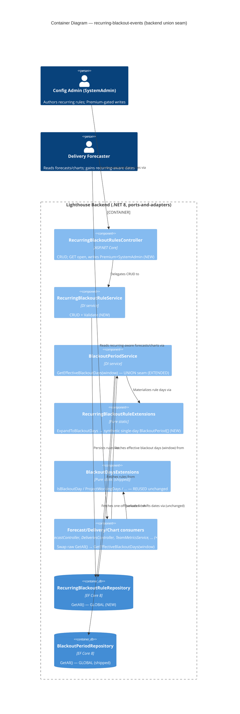

### C4 — Component (the union/materialization seam detail)

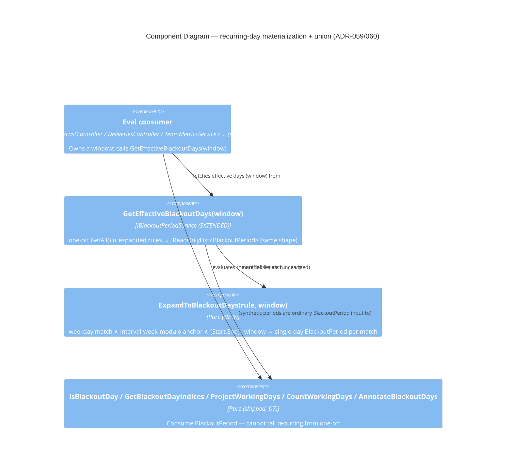

---

## Application Architecture — multiple-cycle-times (Epic 5251)

Feature: multiple-cycle-times — Premium **named cycle times** (`{ name, startState, endState }`, ordered-boundary semantics over `WorkTrackingSystemOptionsOwner.AllStates`) defined in Team/Portfolio settings and visualised on the Cycle Time Scatterplot (selector re-plots a named series) and the cumulative-time-per-state chart (scope-to-window switch). Regular cycle time is the conceptual special case; analysis only (forecasting out of scope, D1/D10).
Wave: DESIGN · Date: 2026-06-08 · Architect: Morgan (Solution Architect), interaction mode = PROPOSE · Paradigm: **OOP (C# backend), functional-leaning React frontend**. ADRs: **ADR-061** (computation placement), **ADR-062** (read endpoint + client gate), **ADR-063** (validity SSOT + US-04 cumulative scope), **ADR-064** (definition persistence). Cross-refs **ADR-056** (mapping-aware resolution / settings idiom), **ADR-055** (client version-gate pattern), **ADR-022** (cumulative algorithm).

This section is **additive** to all prior `## Application Architecture` deltas. Pattern (ports-and-adapters / hexagonal), paradigm, and core invariants are **unchanged**. **NO new architectural style, NO new external integration, NO new external library, NO new endpoint route, NO new computation engine, NO new mapping resolver.** The only new artifacts are a small `CycleTimeDefinition` entity + DTO + EF migration, a settings config editor, two selector controls, and one TS validity predicate.

> **Three forks are PROVISIONAL (PROPOSE mode) pending user confirmation** — Fork 1 computation placement (ADR-061), Fork 2 read-endpoint contract (ADR-062), Fork 3 validity SSOT (ADR-063). Each ADR carries 2–3 options + rejection rationale. The rest of the architecture is designed assuming the recommendations.

### Key invariants introduced

- **The named ordered-boundary duration is computed in the metrics layer reusing the existing transition-ordering primitive — NOT on `WorkItemBase` (ADR-061, the pivotal Fork-1 decision).** A new pure `BaseMetricsService.NamedCycleTimeDays(item, allStatesInOrder, startState, endState)` walks `SyncedTransitions` exactly as the shipped `CompletedVisits` helper does (same `OrderBy(TransitionedAt)`, same `StartedDate` anchor), parameterised by boundary states: first entry into start-or-later → first subsequent entry into end-or-later (D1), first-crossing on re-entry (D2), half-open `[enter start … enter end)` window so the end-state dwell is excluded (D10), `null` when both boundaries are not crossed (D9 exclusion). `WorkItemBase.CycleTime` is **untouched** (a model→settings coupling and a high-blast-radius change to the hot default property are avoided; the default scatter render-time guardrail is protected). Chosen over (B) generalising the model property and (C) a standalone calculator that would duplicate the ordering and break cross-surface consistency.
- **Named reads ride the EXISTING endpoints via an additive `definitionId` — zero new routes, zero new client version-gate touch-points (ADR-062, Fork 2).** `cycleTimeData` / `cycleTimePercentiles` / `cumulativeStateTime` (Team + Portfolio) each gain an optional `definitionId`: absent ⇒ byte-identical default; present ⇒ the named series in the SAME `WorkItemDto` (`CycleTime` carries the named duration, so the FE scatter render path is unchanged) / `PercentileValue` / windowed-cumulative shape. An additive query param **degrades gracefully on old servers** (unknown param ignored — no opaque 404) ⇒ **NO `FEATURE_REQUIRES_SERVER_NEWER_THAN` gate** (contrast ADR-055's new endpoint). Boundaries are resolved server-side from the saved definition (never on the wire). Chosen over (A) a new definition-by-id endpoint and (B) inline start/end-state params (both gate + bypass D5 / duplicate scaffolding).
- **Definition validity (D5) has ONE source of truth, retiring the DISCUSS HIGH cross-surface risk by construction (ADR-063, Fork 3).** `WorkTrackingSystemOptionsOwner.IsCycleTimeDefinitionValid(definition)` (one method, reusing `AllStates` + `GetRawStatesForCategory`) is the only backend validity predicate; its verdict is **stamped as `IsValid` into every read DTO** (config list, scatter read, cumulative read consume the stamp, never recompute). ONE pure TS predicate `isCycleTimeDefinitionValid` mirrors it for live selector reasoning, imported by the config list + both selectors. The config list + scatter selector + cumulative scope therefore **cannot disagree** on validity. Chosen over (ii) a domain service wrapping the aggregate and (iii) ad-hoc per-surface checks (the silent-divergence failure mode D5 forbids).
- **US-04 cumulative scope reuses the scatter's boundary resolution — same span by construction (ADR-063 §4).** `cumulativeStateTime` + `definitionId` restricts `ComputeCumulativeStateTime` (over `BuildCumulativeWorkflowStateOrder`) to the half-open `[enter start … enter end)` window using the SAME index logic as `NamedCycleTimeDays`; the end state contributes no in-window bar (D10). The scatter duration and the cumulative scope cover the identical span — no separate inclusive/exclusive toggle.
- **`CycleTimeDefinition` persists as an owned collection mirroring `StateMappings` (ADR-064).** `{ Id, Name, StartState, EndState }` on the aggregate next to `StateMappings`; additive `CycleTimeDefinitionDto` (stamped `IsValid`) on `SettingsOwnerDtoBase`; rides the **existing tokened settings write** (D8 — no new write contract; epic-5121 concurrency inherited). Id-stable for `definitionId` reads + KPI-2 telemetry. Chosen over a JSON column (no stable id, idiom divergence) and a separate table (definitions have no lifecycle independent of the owner).

### New / reused ports

- **Driving (inbound)**: `GET cycleTimeData?…&definitionId` and `cycleTimePercentiles?…&definitionId` (named series + percentiles, premium-gated named branch); `GET cumulativeStateTime?…&definitionId` (windowed scope) — all Team + Portfolio, **extending existing endpoints** (additive param). The settings write (existing) persists/validates `CycleTimeDefinitions` (D4 end-after-start + name unique/non-empty; D3 mapping resolution).
- **Driven (outbound)**: work-item repository reads (`GetClosedItemsForTeam` / `GetWorkItemsClosedInDateRange` — same source as the default scatter; items carry `SyncedTransitions`); settings persistence on the tokened aggregate (`CycleTimeDefinitions` owned collection); the in-process mapping resolver `GetRawStatesForCategory` / `AllStates` on the aggregate. **No new external integration, no driven adapter to a foreign substrate ⇒ no probe contract / no contract tests owed** at the platform-architect handoff — the named computation is a pure in-process function over data from the existing repos.

### Component decomposition (headline)

- **CREATE NEW (backend)**: `Models/CycleTimeDefinition.cs` (small entity, mirrors `StateMapping`); `API/DTO/CycleTimeDefinitionDto.cs` (`{ Id, Name, StartState, EndState, IsValid }`); EF migration for the new field via the `CreateMigration` PS script (DELIVER, all providers).
- **CREATE NEW (frontend)**: cycle-time config editor (Team + Portfolio settings; mapping-aware workflow-ordered boundary picker reusing the `WaitStatesEditor`/`ItemListManager` idiom, ADR-056); cycle-time selector on the scatter; scope switch + selector on the cumulative chart; `isCycleTimeDefinitionValid` TS predicate (one fn, three call sites); `CycleTimeDefinitionDto` Zod schema at the settings + metrics boundaries.
- **EXTEND (backend)**: `WorkTrackingSystemOptionsOwner` (`CycleTimeDefinitions` list + `IsCycleTimeDefinitionValid`); `SettingsOwnerDtoBase` (project `CycleTimeDefinitions` with stamped `IsValid`); `BaseMetricsService` (`NamedCycleTimeDays` + window-restricted cumulative path); `Team/PortfolioMetricsService` (named series + percentiles + scoped cumulative; cache key `_Def_{id}` via the `SelectionCacheSuffix` idiom); `Team/PortfolioMetricsController` (optional `definitionId` on the three reads; premium gate on the named branch); the existing settings-write validator (D4/D3).
- **REUSE AS-IS (untouched)**: `WorkItemBase.CycleTime` and the whole default scatter/percentile/PBC/estimation surface; `WorkItemDto`; `CycleTimeScatterPlotChart` render path (keyed on `item.cycleTime`); `GetRawStatesForCategory` / `AllStates`; `PercentileCalculator`; `CompletedVisits` / `GroupTransitionsByItem` ordering; premium key + `useRbac()` gating; the tokened settings write / epic-5121 concurrency.

### Reuse analysis

Default EXTEND honoured everywhere. **No CREATE NEW of a metrics computation, endpoint route, mapping resolver, or chart was justified** — the named duration reuses the `CompletedVisits` ordering, the reads extend existing endpoints, validity reuses `GetRawStatesForCategory`, and the charts reuse their render paths. The only CREATE-NEW artifacts are the genuinely-absent `CycleTimeDefinition` entity/DTO (no existing structured "named window" type), the config editor, two thin selector controls, and one TS predicate. Full table in the feature-delta `## Wave: DESIGN / [REF] Reuse Analysis`.

### Premium gating

Premium + config-admin (team-admin / portfolio-admin) per D8. The named read branch is premium-gated **server-side** (defence-in-depth) behind `useRbac()` UI gating; the config write rides the `IRbacAdministrationService`-governed settings write. **No new authz surface, no new permission.** Premium-off hides the feature regardless of role; Default cycle time behaves as today for everyone.

### Lighthouse-Clients consistency (version-gate)

**NO new version gate.** `definitionId` is an additive optional query param on the existing `cycleTimeData`/`cycleTimePercentiles`/`cumulativeStateTime` endpoints, and `CycleTimeDefinitions` is an additive settings field — both ride existing contracts (D8). An old server ignores the unknown param and returns the default series (graceful degrade), so the opaque-404 problem ADR-055 guards against does not arise. If the clients ever expose named cycle-time reads, they pass `definitionId` to the existing wrapped method — record the no-gate decision (N/A) in the clients repo at wrap-or-skip time. This is the **only** feature in the recent series with zero new version-gate touch-points (a concrete advantage of the Fork-2 choice).

### Quality attributes

- **Functional suitability / reliability**: D9 exclusion (`null` for non-crossing items), D2 first-crossing, and D10 half-open window asserted on `NamedCycleTimeDays` (PHX-204 ⇒ 47, PHX-211 re-open first-crossing). D5 invalid-on-removal is a cross-surface integration test (removed boundary ⇒ all three surfaces report invalid; no 500, no crash — KPI guardrail "no increase in chart-crash telemetry"). The scatter named-duration span ≡ the US-04 cumulative scoped span by construction (single boundary-resolution impl).
- **Maintainability / testability**: the only genuinely new compute logic is the pure `NamedCycleTimeDays` and the window restriction of an existing aggregation — both mutation-testable; ≥80% Stryker.NET / Stryker FE per-feature gate. ArchUnitNET/grep guards: no second transition-ordering walk, no second mapping resolver, no recompute of validity outside the one aggregate method.
- **Performance**: named series + cumulative scope reuse the existing closed-items source + transition log; cache keyed by `_Def_{id}` (parallel to `SelectionCacheSuffix`). **Default scatter render-time is untouched** (`WorkItemBase.CycleTime` unchanged) — the DISCUSS render-time guardrail is protected by construction.
- **Security**: named branch premium-gated server-side through the existing guards; settings write governed by `IRbacAdministrationService`; no boundary states on the wire (server-side definition lookup); no new permission.

### Architectural Enforcement (this feature)

| Rule | Mechanism |
|---|---|
| Named duration reuses the `CompletedVisits` ordering — no second transition-ordering walk | NUnit on `NamedCycleTimeDays`; ArchUnitNET/grep |
| `WorkItemBase.CycleTime` NOT modified | Git-diff review gate; decomposition marks it NO-CHANGE |
| `definitionId` absent ⇒ byte-identical default (all three reads) | Integration golden-equality tests |
| `definitionId` present ⇒ same DTO shape, `CycleTime` = named duration; PHX-204 ⇒ 47 | `Team/PortfolioMetricsControllerTests` |
| ONE validity method; surfaces consume the stamped `IsValid`, never recompute | ArchUnitNET/grep; cross-surface integration test (removed boundary ⇒ all invalid) |
| ONE TS validity predicate, three call sites; C#↔TS parity | Vitest + shared-fixture parity test |
| Half-open window (D10): end-state contributes no cumulative bar | NUnit: end=Done ⇒ no "Done" bar |
| Scatter named span ≡ cumulative scoped span (same definition) | NUnit cross-computation test |
| `CycleTimeDefinitions` persists like `StateMappings`; read-your-writes | NUnit InMemory + real-provider integration; migration via `CreateMigration` (DELIVER) |
| Additive `definitionId` / settings field ⇒ no client version gate | Clients-repo handoff note (N/A recorded) |

### ADR References (this feature)

- [ADR-061](./adr-061-named-cycle-time-ordered-boundary-computation-placement.md): named ordered-boundary duration computed in `BaseMetricsService` reusing the `CompletedVisits` primitive; `WorkItemBase.CycleTime` untouched. (Alternatives B "generalise the model property" and C "standalone calculator" considered and rejected.) PROVISIONAL (Fork 1).
- [ADR-062](./adr-062-named-cycle-time-read-endpoint-contract-and-client-version-gate.md): extend existing `cycleTimeData`/`cycleTimePercentiles` with optional `definitionId`; same `WorkItemDto` contract; additive param ⇒ no client version gate. (Alternatives A "new definition-by-id endpoint" and B "inline boundary params" considered and rejected.) PROVISIONAL (Fork 2).
- [ADR-063](./adr-063-named-cycle-time-definition-validity-single-source-of-truth.md): validity is one aggregate method, stamped `IsValid` into every DTO, mirrored by one TS predicate; US-04 cumulative scope via additive `definitionId` reusing the scatter boundary resolution. (Alternatives ii "domain service" and iii "ad-hoc per surface" considered and rejected.) PROVISIONAL (Fork 3).
- [ADR-064](./adr-064-cycle-time-definitions-storage-as-owned-collection-on-settings-aggregate.md): `CycleTimeDefinition` owned collection mirroring `StateMappings`; additive DTO; rides the tokened settings write. (Alternatives JSON column, separate table considered and rejected.)
- Cross-refs [ADR-056](./adr-056-wait-states-config-placement-and-mapping-aware-resolution.md) (mapping-aware resolution / settings editor idiom), [ADR-055](./adr-055-flow-efficiency-tile-transport-and-client-version-gate.md) (client version-gate pattern), [ADR-022](./adr-022-cumulative-state-time-algorithm.md) (cumulative algorithm reused for US-04 scope).

### C4 — Container (this feature, named-read + config-write)

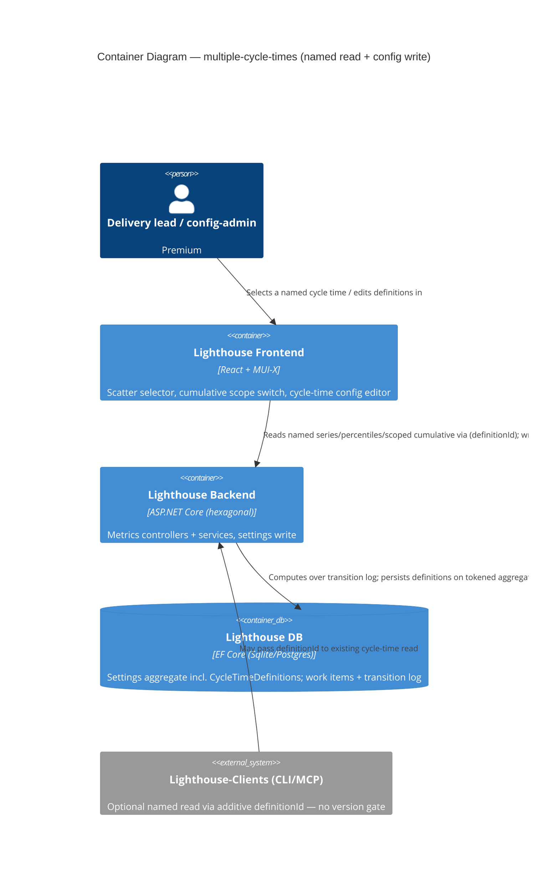

### C4 — Component (backend named-read + config-write paths)

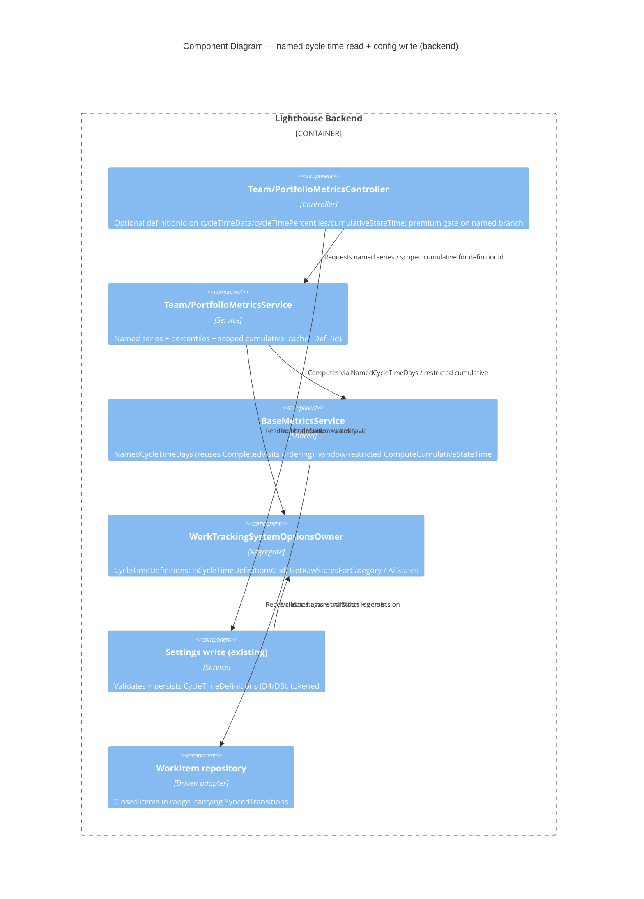

---

## Application Architecture — work-item-age-percentiles (Story #5257)

Feature: work-item-age-percentiles — Non-premium, brownfield. (1) A "Work Item Age Percentiles" overview card showing the 50/70/85/95 of the **current in-progress population's** `WorkItemAge` (snapshot of live WIP, **not** windowed). (2) A Cycle-Time↔Work-Item-Age switch on the Work Item Aging chart that **swaps** its horizontal reference lines between the two server-fetched percentile sets (mutually exclusive, CT default). Team + Portfolio.
Wave: DESIGN → DELIVER (**SHIPPED 2026-06-09**, Story #5257) · Architect: Morgan (Solution Architect), interaction mode = PROPOSE · Paradigm: **OOP (C# backend), functional-leaning React frontend** (unchanged). ADRs: **ADR-065** (compute location — **server-side endpoint**, user-confirmed), **ADR-066** (chart line-source swap between two server-fetched arrays). Cross-refs **ADR-020** (orthogonal pace-band overlay), **ADR-062** (sibling endpoint + client version-gate pattern), **ADR-055** (client version-gate precedent), **ADR-019** (`PercentileCalculator` convention).

**Status: SHIPPED.** All planned components below are implemented and CI-green (BE 13+4 integration scenarios, FE 74 scoped Vitest tests, 1 live `@screenshot`; mutation BE 83.3% / FE 95.9% adjusted; both Sonar gates clean). **Delta beyond the original ADR-066:** the aging chart now also **de-dupes overlapping reference-line values** (parity with the existing cycle-time line handling, which `useChartVisibility` already collapses) and **anchors its x-axis to cycle time** so the plot does not re-scale when the CT↔WIA source is swapped (user-review feedback, commit `23f5eccc`). The CT↔WIA control is a segmented `ToggleButtonGroup` (the AC-neutral affordance DESIGN deferred to DELIVER). Evolution: `docs/evolution/2026-06-09-work-item-age-percentiles.md`.

This section is **additive** to all prior `## Application Architecture` deltas. Pattern (ports-and-adapters / hexagonal), paradigm, and core invariants are **unchanged**. **NO new persistence, NO EF migration, NO premium/RBAC gate, NO new external integration, NO new external library, NO new DTO (reuse `PercentileValue`).** The new artifacts are: **backend** — 2 new read endpoints (Team + Portfolio) + 2 thin service methods composing existing primitives; **frontend** — one small overview card (mirroring `CycleTimePercentiles.tsx`), one `MetricsService` method + a new ctx field, one optional prop + one local toggle on `WorkItemAgingChart`, and one `categoryMetadata` widget entry per scope; **Lighthouse-Clients (separate repo)** — version-gated CLI + MCP wrappers for the new endpoint.

> **D8 is LOCKED (user-confirmed 2026-06-09): backend compute.** The chart line-source-swap mechanism (ADR-066) is likewise accepted. Each ADR carries ≥2 alternatives + rejection rationale (client-side compute is now the documented rejected alternative).

### The D8 fork resolution (the one real decision)

**Verdict: compute the WIA percentiles SERVER-SIDE on a new read endpoint per scope (ADR-065).** The user overrode the prior pass's client-side recommendation: *"WIA percentiles should be calculated in the BACKEND, with an extension to the API (and thus also the client packages). We want to do as little production work in the frontend."* The endpoint mirrors `cycleTimePercentiles` exactly — `GET …/metrics/workItemAgePercentiles` (Team + Portfolio), returning a flat `IEnumerable<PercentileValue>` (50/70/85/95), under the existing class-level `[RbacGuard(TeamRead/PortfolioRead)]`. The service method composes **existing** primitives: the current in-progress selection (`GetWipSnapshotForTeam` / `GetInProgressFeaturesForPortfolio`) → each item's `WorkItemAge` → `BuildPercentiles` → `PercentileCalculator`. This restores percentile-computation **uniformity** with `cycleTimePercentiles`/`ageInStatePercentiles` (one server-side algorithm, no second-language fork, no parity test) and keeps production logic out of the frontend. The accepted cost — a NEW endpoint × 2 scopes ⇒ **version-gated** CLI + MCP client wrappers — is small and well-trodden (ADR-055/062 pattern).

### Key invariants introduced

- **WIA percentiles are computed server-side via `BuildPercentiles` → `PercentileCalculator` over the in-progress population's `WorkItemAge` (ADR-065).** No new algorithm, no new DTO — the response is `IEnumerable<PercentileValue>` (50/70/85/95), identical in shape to `cycleTimePercentiles`. The frontend consumes the server-computed `PercentileValue[]` exactly as it already does for CT percentiles.
- **WIA percentiles are NEVER windowed (D4).** The population is the current WIP snapshot keyed on `endDate` only. `startDate`/`endDate` are kept on the endpoint signature for parity with `cycleTimePercentiles` (shared `startDate>endDate ⇒ 400` guard, date-keyed cache) but `startDate` MUST NOT filter the population — enforced by an integration test asserting identical percentiles across different `startDate` values. The two populations carry distinct UI labels (cross-story invariant) so users never conflate "how old is my WIP now" with "how long did finished work take".
- **The in-progress selection is REUSED, not duplicated.** Team: `TeamMetricsService.GetWipSnapshotForTeam(team, endDate)` (the same set behind `/metrics/wip`, feeding the aging-chart dots). Portfolio: `PortfolioMetricsService.GetInProgressFeaturesForPortfolio(portfolio, endDate)`. Each `WorkItem`/`Feature` already exposes `WorkItemBase.WorkItemAge`.
- **The aging chart swaps the line *source*, not the line *renderer* (ADR-066).** One new optional `workItemAgePercentileValues?: IPercentileValue[]` prop + one local `percentileSource: "cycleTime" | "workItemAge"` state (default `"cycleTime"`). A single derived `activePercentiles` feeds the existing single `ChartsReferenceLine` block and the existing `useChartVisibility({ percentiles: activePercentiles })`. Both arrays are **server-fetched** (CT from `cycleTimePercentiles`, WIA from the new endpoint) and fetched in parallel into ctx; the toggle is a pure client-side source swap with no per-flip network call. Exactly one line set on the canvas at any time — **mutual exclusivity is structural**. `useChartVisibility` is unchanged.
- **The pace-band overlay chip (ADR-020) is orthogonal and untouched (D2).** The CT↔WIA toggle affects only the horizontal reference-line source; the per-state pace bands, dots, SLE line, and vertical grid are independent.
- **Empty / single-item WIP is graceful, no special low-sample gate (D6).** Zero in-progress items ⇒ `BuildPercentiles([])` yields 50/70/85/95 with `0` values (never a 500); the card renders its graceful empty state and the chart shows no WIA lines. A single item still yields percentiles (behaves like the data it has).
- **No premium gate, no RBAC change (D3).** The new endpoints ride the existing class-level `[RbacGuard(TeamRead/PortfolioRead)]`. No `ILicenseService` on the read path, no `useRbac()` UI gating, no `IRbacAdministrationService` interaction, no new authorization surface.

### New / reused ports

- **Driving (inbound)**: **2 NEW HTTP endpoints** — `GET /api/teams/{teamId:int}/metrics/workItemAgePercentiles?startDate&endDate` `[RbacGuard(TeamRead)]` and `GET /api/portfolios/{portfolioId:int}/metrics/workItemAgePercentiles?startDate&endDate` `[RbacGuard(PortfolioRead)]`, each returning `IEnumerable<PercentileValue>`. Mirror the existing `cycleTimePercentiles` controller actions (same guard, same 400-guard, same date-keyed cache idiom). FE driving surface: the OverviewCategory WIA card + the `WorkItemAgingChart` CT↔WIA toggle.
- **Driven (outbound)**: **NONE NEW.** The service methods read through the existing `workItemRepository` / `featureRepository` via the **already-existing** in-progress selections and the **already-existing** `BaseMetricsService.GetFromCacheIfExists` cache. No new repository, no persistence, no external integration. **No probe contract / no contract tests owed** at the platform-architect handoff — there is no new driven adapter to a foreign substrate; the new endpoints read existing repositories already under integration coverage.

### Component decomposition (headline)

- **CREATE NEW (backend) — SHIPPED**: 2 controller actions (`TeamMetricsController.GetWorkItemAgePercentilesForTeam`, `PortfolioMetricsController` sibling) + 2 service methods (`TeamMetricsService.GetWorkItemAgePercentilesForTeam`, `PortfolioMetricsService.GetWorkItemAgePercentilesForPortfolio`). Each service method = `<existing in-progress selection>(entity, endDate).Select(i => i.WorkItemAge).Where(a => a > 0).ToList()` → `BuildPercentiles(...)`, cached under `WorkItemAgePercentiles_{endDate:yyyy-MM-dd}`. NUnit service tests + WebApplicationFactory integration tests (golden percentiles, empty/single-item WIP, date-range-invariance).
- **CREATE NEW (frontend) — SHIPPED**: `WorkItemAgePercentiles.tsx` overview card (mirrors `CycleTimePercentiles.tsx` — descending rows, `ForecastLevel` colouring, graceful empty state, distinct title); `MetricsService.getWorkItemAgePercentiles(id, …)` + `IMetricsService` addition; a new `MetricsData` ctx field `workItemAgePercentilesValues`; one `categoryMetadata.ts` `flow-overview` entry `workItemAgePercentiles` (size `small`, both scopes); Vitest tests for card + toggle; one per-theme `@screenshot` (Team card + Team aging selector run live; a dedicated Portfolio `@screenshot` deferred — the Portfolio surface is component-identical via `BaseMetricsView`).
- **CREATE NEW (Lighthouse-Clients — separate repo)**: version-gated `getWorkItemAgePercentiles` wrapper in the CLI + MCP clients; `FEATURE_REQUIRES_SERVER_NEWER_THAN` registry entry pinned strictly-newer-than the last released Lighthouse version. **Committed in the clients repo, awaiting release — a release-gate (confirm merged before the feature releases).**
- **EXTEND (frontend) — SHIPPED**: `WorkItemAgingChart.tsx` (one optional `workItemAgePercentileValues` prop + one local `percentileSource` state + a segmented CT↔WIA `ToggleButtonGroup`; `activePercentiles` feeds the existing single `ChartsReferenceLine` block — and **now de-dupes overlapping percentile-line values** + **anchors the x-axis to cycle time** so the plot is stable across the source swap, a review-feedback delta beyond ADR-066); `useMetricsData` (parallel-fetch the WIA array into the new ctx field); `BaseMetricsView.tsx` (render the new card via the `workItemAgePercentiles` widget key, pass the WIA array to the `aging` widget).
- **REUSE AS-IS (untouched)**: `PercentileValue` / `IPercentileValue` (response + card/chart shape — **no new DTO**); `PercentileCalculator` + `BaseMetricsService.BuildPercentiles` (percentile algorithm); `GetWipSnapshotForTeam` / `GetInProgressFeaturesForPortfolio` (in-progress selection); `BaseMetricsService.GetFromCacheIfExists` (cache); `WorkItemBase.WorkItemAge` (the age value); `ForecastLevel` palette + icons; `CycleTimePercentiles.tsx` (template, not modified); `ChartsReferenceLine` + `<ChartsContainer>`; `useChartVisibility` (single-`percentiles` contract unchanged); the OverviewCategory card grid + dispatch.

### Reuse analysis

Default EXTEND/REUSE honoured. The only CREATE-NEW backend artifacts are 2 thin service methods + 2 controller actions — every primitive they compose (in-progress selection, `BuildPercentiles`/`PercentileCalculator`, the cache, `PercentileValue`, `WorkItemAge`) already exists and is reused verbatim. No new DTO, no new persistence, no new algorithm. The frontend CREATE-NEW set is the card, one service method, one ctx field, and the widget registration; the chart/plumbing are EXTEND. Full table in the feature-delta `## Wave: DESIGN / [REF] Reuse Analysis`.

### Cross-cutting (settled)

- **RBAC — N/A (no new authorization).** D3 non-premium; the new endpoints ride the existing class-level `[RbacGuard(TeamRead)]` / `[RbacGuard(PortfolioRead)]`. No `useRbac()` change, no `IRbacAdministrationService` interaction, no `ILicenseService` on the read path.
- **Lighthouse-Clients — AFFECTED: version-gated wrappers (RESOLVED by ADR-065).** A NEW endpoint × 2 scopes ⇒ the CLI + MCP clients add a `getWorkItemAgePercentiles` wrapper that **pre-checks the server version** (an old server 404s opaquely) and fails with a clear "upgrade Lighthouse" error; pinned **strictly newer than the last released version**, recorded in `FEATURE_REQUIRES_SERVER_NEWER_THAN` (dev/unparseable versions never blocked). This **reverses** the prior pass's "unaffected" conclusion. The clients live in a **separate repo** — work tracked there, called out so DELIVER/finalize does not forget it.
- **Website — marketing N/A** (enhances an existing free metric surface, not a new premium feature). **Docs are NOT N/A**: `docs/metrics/` gains the WIA card + chart-toggle description with a per-theme `@screenshot` at finalization (DELIVER docs discipline).

### Quality attributes

- **Functional suitability / reliability**: WIA percentiles are exactly 50/70/85/95 wherever they appear; computed over the full in-progress set, never windowed (D4 integration test). Empty/single-item WIP graceful (D6) — `BuildPercentiles([])` ⇒ `0`-valued set, card empty state + chart no-lines, no crash. The CT↔WIA toggle round-trips without a page reload (US-02 AC2).
- **Maintainability / testability**: the only new compute logic is two thin service methods composing existing, tested primitives — mutation-testable; ≥80% Stryker BE per-feature gate on `GetWorkItemAgePercentilesForTeam`/`…ForPortfolio` + FE gate on the toggle logic. No second-language percentile fork (uniformity restored). `WorkItemAgingChart` stays presentational (receives both server-fetched arrays as props, computes nothing).
- **Performance / interaction cost**: the WIA array is fetched in parallel with the other metrics reads (one extra cached request per scope load); the toggle is then a pure client-side `percentileSource` state swap — **no per-flip network round-trip** (satisfies KPI-2 <200 ms by construction). The server compute is `BuildPercentiles` over a handful of in-progress items — negligible, cached.
- **Security**: the new endpoints expose only the 50/70/85/95 of in-progress ages, derived from data already served under the existing RBAC-guarded metrics reads. No new sensitive data, no new auth surface, no new permission.

### Architectural Enforcement (this feature)

| Rule | Mechanism |
|---|---|
| `workItemAgePercentiles` returns a flat `IEnumerable<PercentileValue>` (50/70/85/95), reusing `PercentileValue` — no new DTO | `TeamMetricsControllerTest` / `PortfolioMetricsControllerTests` + integration: response shape equals `cycleTimePercentiles` |
| Percentiles computed via `BuildPercentiles` → `PercentileCalculator` over the in-progress selection's `WorkItemAge` | `TeamMetricsServiceTests` / `PortfolioMetricsServiceTests`: golden percentiles over a known in-progress fixture |
| In-progress selection REUSED (`GetWipSnapshotForTeam` / `GetInProgressFeaturesForPortfolio`), not duplicated | Service test asserts the population equals the `/wip` (Team) / in-progress-features (Portfolio) set |
| `startDate` does NOT filter the population; percentiles identical across ranges (D4) | Integration: two calls, differing `startDate`, same `endDate` ⇒ identical percentiles |
| Zero in-progress ⇒ 50/70/85/95 with `0` values, never 500 (D6); one item ⇒ percentiles over the single value, no low-sample gate | Integration: empty-WIP and single-item-WIP fixtures |
| Read controllers do NOT reference `ILicenseService` (non-premium, D3) | Grep/ArchUnit: no `ILicenseService` on the `workItemAgePercentiles` path |
| The chart shows exactly one reference-line set at a time; default CT; toggle round-trips (D2 / US-02) | Vitest RTL toggle round-trip + snapshot test |
| `workItemAgePercentileValues` undefined/empty ⇒ chart renders identically to today (no WIA lines, no crash) | Vitest snapshot/behavioural test |
| The pace-band overlay chip is unaffected by the CT↔WIA toggle (orthogonal, D2 / US-02 AC3) | Vitest test toggling one control, asserting the other unchanged |
| NEW endpoint ⇒ version-gated client wrapper | Clients-repo handoff note: `getWorkItemAgePercentiles` pre-checks server version; `FEATURE_REQUIRES_SERVER_NEWER_THAN` entry pinned strictly-newer-than the last release; dev/unparseable versions never blocked |

### ADR References (this feature)

- [ADR-065](./adr-065-work-item-age-percentiles-compute-location.md): WIA percentiles computed **server-side** on a new read endpoint per scope (Team + Portfolio), reusing the in-progress selection + `BuildPercentiles`/`PercentileCalculator` + `PercentileValue`; the new endpoint ⇒ version-gated client wrappers. (Alternative A "client-side derivation" and B-prime/C signature variants considered and rejected; client-side was the prior provisional recommendation, overridden by the user.) ACCEPTED (Fork D8, user-confirmed 2026-06-09).
- [ADR-066](./adr-066-aging-chart-ct-wia-line-source-swap.md): the aging chart **swaps the line source** between two **server-fetched** `IPercentileValue[]` arrays — one `activePercentiles` feeds the existing single `ChartsReferenceLine` block; mutual exclusivity is structural. (Alternatives "two line sets toggled", "dedicated WIA chart", "extend useChartVisibility", "lazy re-fetch on flip" considered and rejected.) ACCEPTED.
- Cross-refs [ADR-020](./adr-020-per-state-bands-chart-rendering-approach.md) (orthogonal pace-band overlay), [ADR-062](./adr-062-named-cycle-time-read-endpoint-contract-and-client-version-gate.md) (sibling endpoint + client version-gate pattern), [ADR-055](./adr-055-flow-efficiency-tile-transport-and-client-version-gate.md) (client version-gate precedent), [ADR-019](./adr-019-per-state-percentile-algorithm-and-window.md) (`PercentileCalculator` convention).

### C4

System Context: **unchanged** (no new actor, no new external system). Container delta: **2 new endpoints** (Team + Portfolio `workItemAgePercentiles`) on the existing Backend container, consumed by the existing Frontend SPA container, plus the Lighthouse-Clients (separate repo) gaining version-gated wrappers for them. See `docs/product/architecture/c4-diagrams.md` → "C4 Architecture Diagrams — work-item-age-percentiles".

---

## Application Architecture — website-screenshot-freshness (DESIGN delta)

Feature: website-screenshot-freshness (ADO #5259)
Wave: DESIGN
Date: 2026-06-14
Architect: Morgan (Solution Architect), interaction mode = PROPOSE (decisions pre-locked in DISCUSS)

This feature is a **cross-repo wiring + process** change. It introduces **no new backend architectural pattern, no API contract, no persistence, no RBAC surface, and no Lighthouse-Clients impact.** The Lighthouse product architecture (ports-and-adapters / hexagonal, ADR-027) is unchanged. The deliverable spans the Lighthouse repo (canonical-asset generation + finalization process) and the separate `LetPeopleWork/website` repo (marketing-site consumption).

**What changes:** the marketing website stops bundling its own stale copies of 10 Lighthouse product screenshots (`website/src/assets/screenshots/*.png`, imported into `src/pages/Lighthouse.tsx` and `src/components/LighthouseSection.tsx`) and instead hotlinks the canonical `docs/assets/**` PNGs — the same assets the `@screenshot` E2E suite already regenerates per feature — through the **jsDelivr GitHub CDN pinned to `@main`** (`https://cdn.jsdelivr.net/gh/LetPeopleWork/Lighthouse@main/docs/assets/<path>.png`). A single ~10-LOC website helper (`src/lib/lighthouseAsset.ts`) owns the URL convention.

### Driven dependency introduced (website runtime)

- **jsDelivr GitHub CDN** — an external, public CDN the website GETs each marketing PNG from at runtime. This is the feature's highest-risk boundary (CDN availability + `main` not regressing an asset). **Earned-trust probe:** the US-01 walking skeleton exercises the real boundary live (Network panel: 200, `Content-Type: image/png`, correct dimensions, no broken image) before any bulk migration; at the platform-architect handoff this becomes a lightweight deployed-site link-check / image smoke test (the static-asset-CDN analogue of a contract test — no Pact, as there is no typed API surface).
- **Produced artifact:** `docs/assets/**` canonical PNGs, written by the existing `@screenshot` suite (unchanged mechanism), read-only by the website.

### Exclusions (named, not silently omitted)

- The OG/SEO image `website/public/forecasts-project.png` stays website-hosted same-origin (SEO/social scrapers need a stable same-origin URL).
- `GitHub.png` (a github.com README screenshot, not a Lighthouse product surface) stays website-bundled — the `@screenshot` suite screenshots the running app and cannot produce it.

### Reuse Analysis (this feature)

EXTEND the existing `@screenshot` → `docs/assets` pipeline (`Lighthouse.EndToEndTests/.../Screenshots.spec.ts` + `tests/helpers/screenshots.ts`, `testWithDemoData`) for marketing-gap shots — no parallel pipeline. REUSE the 105 existing canonical PNGs (5–8 of the 10 website shots map directly). EXTEND `Lighthouse.tsx` / `LighthouseSection.tsx` (bundled `import` → `lighthouseAsset()` URL). CREATE only the ~10-LOC `lighthouseAsset()` helper (no remote-asset helper exists in the website repo today). EXTEND `CLAUDE.md` DELIVER mandate + `nw-finalize` for the manual freshness gate.

### ADR References (this feature)

- [ADR-073](./adr-073-website-github-hosted-screenshot-linking.md): website marketing screenshots are hotlinked from `docs/assets` via the **jsDelivr GitHub CDN at `@main`**, with the OG image and `GitHub.png` excluded, and freshness held by a manual finalization gate. (Alternatives: raw.githubusercontent host, bundle-and-copy status quo, release-tag pin, automated drift detection — all considered and rejected.) ACCEPTED (2026-06-14).

### Architectural Enforcement (this feature)

| Rule | Mechanism |
|---|---|
| The website builds the CDN URL only via `lighthouseAsset()` — no hand-written `cdn.jsdelivr.net` literals scattered across components | Grep / lint in the website repo: `cdn.jsdelivr.net` appears only in `src/lib/lighthouseAsset.ts` |
| No migrated screenshot is referenced both as a bundled `import` and a CDN URL (no dead imports) | `bun run build` clean + website test/lint: no unused `@/assets/screenshots/*` imports remain for migrated images |
| Marketing-gap screenshots are produced by the existing pipeline, not a new one | New `@screenshot` tests live in `Screenshots.spec.ts` and write via `getPathToDocsAssetsFolder()`; run live before commit (project rule) |
| Every one of the 10 website shots is mapped, gap-filled, or explicitly excluded | feature-delta 10→canonical mapping table; US-02 AC "no silent omission" |

### C4

System Context & Container: **unchanged for the Lighthouse product** (no new actor, system, endpoint, or store). The delta is a cross-repo asset-flow wiring (website → jsDelivr CDN → `docs/assets` ← `@screenshot` suite, with a manual finalization gate). Diagram in `docs/feature/website-screenshot-freshness/feature-delta.md` → "Wave: DESIGN / [REF] C4 delta" and `docs/product/architecture/c4-diagrams.md` → "C4 Architecture Diagrams — website-screenshot-freshness".

## Application Architecture — backend-test-speed (DESIGN delta)

Test-infrastructure design (ADO #5258; follows #5020 CS-P). Product runtime architecture **unchanged** — this delta governs the backend test harness only.

- **Decision (ADR-074)**: backend tests parallelize at the fixture level via **per-fixture `WebApplicationFactory` ownership**. `IntegrationTestBase` stops sharing one `static` factory + DB; each fixture builds its own factory (already unique-SQLite-file-per-instance, hosted-services-stripped) and the base-level `[NonParallelizable]` is removed. Tests within a fixture stay serial (one factory built once, reused), so the per-test `EnsureDeleted/EnsureCreated` reset remains collision-free.
- **Serial residue** (rate-limiting, CORS-env, API-key scopes, concurrency) stays `[NonParallelizable]` on a **justified allowlist** enforced by an **ArchUnitNET guard** that fails the build on any off-allowlist opt-out — closing the gap that let 54 opt-outs accumulate after CS-P.
- **Rejected**: shared-WAF + per-test-DB plumbing (per-scope connection complexity + shared-singleton contention). See ADR-074.
- **Invariant**: behaviour preserved (same tests/assertions); mutation ≥ 80 % on any production isolation seam; CS-P `AuthenticationMethodSchema` per-host-singleton precedent upheld.
- **Cross-cutting**: RBAC / Lighthouse-Clients / Website all **N/A** (test-infra; no authorization path, API contract, or marketed surface).

### ADR

- [ADR-074](./adr-074-backend-test-fixture-parallelization-isolation.md): per-fixture `WebApplicationFactory` ownership for fixture-level backend test parallelism; allowlist + ArchUnit guard for the serial residue. (Alternatives: shared-WAF + per-test DB; status-quo more-`[NonParallelizable]` — rejected.) ACCEPTED (2026-06-15); wall-clock numbers gated on Slice-01 spike.

### C4

System Context & Container: **unchanged for the Lighthouse product**. The delta is test-harness topology only (NUnit runner → parallel fixtures → per-fixture WAF → per-fixture SQLite; ArchUnit guard on the serial allowlist). Diagram in `docs/feature/backend-test-speed/feature-delta.md` → "Wave: DESIGN / [REF] C4 — test execution topology".

---

## System Architecture — epic-5305-k8s-readiness

Feature: epic-5305-k8s-readiness (ADO Epic #5305 — make the Lighthouse app itself safe to run on Kubernetes)
Wave: DESIGN | Layer scope: **system / infrastructure only** | Date: 2026-06-16
Architect: Titan (System Designer), interaction mode = **PROPOSE** — FIRST of three architects (→ nw-ddd-architect → nw-solution-architect)
Inputs: `docs/feature/epic-5305-k8s-readiness/feature-delta.md` (DISCUSS; D1–D6, US-01..07, A1–A6), `docs/feature/l8e-kubernetes-learning/planning-stage.md` (north-star §4, Q1–Q5), `docs/feature/l8e-kubernetes-learning/stories/story-07-research.md` (repo-grounded A/B/C breakage), ADR-027 (baseline target architecture).

This section is the **system/infrastructure** view. Domain-model shape (the per-entity consistency invariant on the status store, aggregate boundaries) is the **DDD-architect's** to write next; ASP.NET middleware/health/lifecycle component wiring, the ports/adapters, the forwarded-headers application detail, and the MCP-auth application detail are the **solution-architect's**. This section establishes the *system constraints* those layers respect, and presents the one genuinely-open decision (ADR-076 / A1) as PROPOSE options + a recommendation rather than a lock.

### Relationship to ADR-027 — what this epic AMENDS

ADR-027 (Q1/1C, Q3/3A) deliberately chose **single-instance / vertically-scaled / `replicas: 1`**, justified by a ~30 QPS sizing and the load-bearing in-process correctness singletons (the `Channel` queue, `DatabaseMaintenanceGate`, the in-memory status dictionary, in-memory SignalR fan-out). That decision **stands as the default and the standalone product**. This epic does **not** repudiate it; it adds a **config-gated multi-replica capability that auto-degrades to exactly that single-instance path** (the D1 epic gate). The amendment is narrow and explicit:

> ADR-027 Q1 said "do not add a second app instance — it solves a throughput problem that does not exist." That remains true *for throughput*. The driver here is **not throughput — it is availability/HA and zero-downtime rollout for the hosted SaaS** (planning §4 north-star). The sizing is unchanged; what changed is that the **hosted** topology now wants N replicas for *rollout safety and node-failure survival*, not for QPS. So the multi-replica path is built, defaulted off, and the moment its config (Redis, replica count) is absent the binary is byte-for-byte ADR-027's 1C/3A single instance.

Everything below is consistent with ADR-027's "one architecture, provider-switched, no fork" principle — the new distributed elements are **additional config-selected branches behind existing seams**, exactly as `DatabaseConfigurator` selects SQLite vs Postgres.

### Grounding: what the codebase actually is today (verified at HEAD, line-cited)

| Concern | Current reality (file evidence) | Implication for this epic |
|---|---|---|
| Update queue | `UpdateQueueService` — unbounded `Channel<Func<Task>>` (`:11`), single `Task.Run` consumer `StartProcessingQueue()` (`:181`), `ConcurrentDictionary<UpdateKey,TaskCompletionSource<bool>> awaiters` (`:15`), `ConcurrentDictionary<UpdateKey,UpdateStatus> updateStatuses` dedup via `TryAdd` (`:14`). `IUpdateQueueService` port: `EnqueueUpdate` + `EnqueueAndAwaitAsync`. | **The cluster-aware unit already has a port boundary.** ADR-076's options swap the impl behind `IUpdateQueueService` — EXTEND, not rewrite. |
| Two trigger paths (D5) | (1) Timer: `UpdateServiceBase<T>.ExecuteAsync` `while(!stopping){ UpdateAll()→TriggerUpdate(id) }` `Task.Delay(Interval mins)` (`:49-73`). (2) Inline manual refresh: `TeamController.UpdateTeamData`→`TriggerUpdate` (`:83`), `PortfolioController.UpdateFeaturesForPortfolio`→`TriggerUpdate` (`:51`), and `DeleteTeam`/`DeletePortfolio`→`EnqueueAndAwaitAsync` (`:102`/`:65`). | **Both paths flow through the port** → making the port cluster-aware covers both, which a timer-leader does not. Confirms A1's "leader election is necessary-not-sufficient." |
| Status store | `updateStatuses` is **one shared singleton** `ConcurrentDictionary<UpdateKey,UpdateStatus>` created at `Program.cs:932`, `AddSingleton` (`:933`), injected into BOTH `UpdateQueueService` AND `UpdateNotificationHub.GetUpdateStatus` (`:50`). | **`GetUpdateStatus` disagrees across pods** (US-07 AC3). Needs a shared store for *both* ADR-076 options — extractable as its own port independently. |
| SignalR | `AddSignalR().AddJsonProtocol(...)` (`Program.cs:269`) — **no `.AddStackExchangeRedis`**, no `SignalR.StackExchangeRedis` package (grep zero). Hub at `app.MapHub<UpdateNotificationHub>("api/updateNotificationHub")` (`:212`), `[Authorize]`. Fan-out: `Clients.Group(key).SendAsync` + `Clients.Group("GlobalUpdates")`. Frontend `withUrl(...)` with **no `skipNegotiation`** → negotiate → affinity required. | **Cross-pod fan-out silently fails** (US-07 AC2). ADR-075 Redis backplane. Sticky-session is a #5306 *deploy* concern, NOT in-app code. |
| Migrations on boot | `DatabaseConfigurator.ApplyMigrations` → `context.Database.Migrate()` (`:85-92`), called once at boot from `Program.cs:973` (non-Testing). No concurrency guard. | **N pods race `Migrate()` on concurrent start** (US-04 AC1). ADR-077 startup lock. |
| Maintenance gate (REUSE) | `DatabaseMaintenanceGate` process-singleton (`Program.cs:954`); `UpdateQueueService.EnqueueUpdate` refuses while maintenance active; `PortfolioDeleteSerialisationTests` proves serialized DELETE. | **The mutual-exclusion seam to model the cluster lock on already exists** — ADR-077 extends this pattern, doesn't invent one. |
| Domain events (REUSE) | `IDomainEventDispatcher` already wired (ADR-027 work landed — visible in `DeleteTeam`). After-commit, recovery via re-sync, no outbox. | After-commit handlers run on the winning consumer/lock-holder; **unchanged** — no outbox needed (facts are DB-derivable). |
| Forwarded headers (ALREADY EXISTS) | `app.UseForwardedHeaders()` (`Program.cs:170`); `ConfigureForwardedHeaders` (`:538-566`) sets `XForwardedFor\|Proto\|Host`, `KnownProxies` from `authConfig.TrustedProxies`, `KnownIPNetworks` from `TrustedNetworks` (appsettings `"TrustedProxies":[]`,`"TrustedNetworks":[]`). | **US-01 is largely ALREADY IMPLEMENTED** → DESIGN verifies + tests + documents the OFF-by-default + OIDC-redirect-uri correctness; the solution-architect owns the application detail. Mostly EXTEND/verify, not CREATE. |
| Health checks | None — no `AddHealthChecks`/`MapHealthChecks`/`/health`. | US-02 CREATE (clean slate), but reuse ASP.NET `Microsoft.Extensions.Diagnostics.HealthChecks`. |
| Lifecycle / shutdown | `app.Lifetime.ApplicationStarted.Register` (`:116`) + `app.WaitForShutdownAsync()` (`:136`). **No `HostOptions.ShutdownTimeout`**, no `ApplicationStopping` drain hook. | US-03: EXTEND the existing lifetime wiring + the existing queue consumer's `stoppingToken`. |
| Logging / observability | **Serilog** fully configured from appsettings (`ConfigureLogging` `:977-999`), Console + File sinks, `ExpressionTemplate`, dynamic level switch. **No OpenTelemetry/metrics.** | US-05: EXTEND Serilog for JSON stdout; ADD OTel metrics/traces off-by-default. |
| Config idiom (REUSE) | `Configure<T>(builder.Configuration.GetSection("X"))` + `IOptions<T>` (e.g. `DatabaseConfiguration`); scalar `builder.Configuration["A:B"]`; `__` env bridges colons; provider switch on `Database:Provider` string. | **All new config gates follow this idiom exactly** (`ConnectionStrings:Redis`, `Telemetry:*`, `Shutdown:TimeoutSeconds`) — config-gated degradation is the established pattern. |

The single most important grounding fact: **every cluster-aware change this epic needs lands behind a seam that already exists** — `IUpdateQueueService`, the shared `updateStatuses` singleton, `DatabaseMaintenanceGate`, `UseForwardedHeaders`, the `DatabaseConfigurator` config-switch idiom, the Serilog pipeline, and the lifetime hooks. The risk is **not** "build new infrastructure"; it is **getting the degradation branch and the SPIKE-gated queue shape right**.

### Back-of-envelope: what changes (and what does NOT) at N replicas

ADR-027's sizing holds: **~30 QPS peak, ≤~150 SignalR connections, single-digit-GB storage, ~20:1 read:write, background concurrency = 1 by construction**. None of that scales with replica count — the workload is small and serial-tolerant. So the replica count is driven by **availability, not load**:

- **Rollout safety**: with `replicas: N≥2` + a rolling update, at least one pod always serves → zero-downtime (US-03). N is chosen for "survive one pod terminating during a deploy," i.e. **2–3**, not "absorb QPS."
- **SignalR connections** stay ≤~150 *total*, now spread across N pods (≤~75/pod at N=2) — trivial per Kestrel; the backplane adds one Redis pub/sub round-trip per server-raised notification (~sub-millisecond LAN), negligible at this fan-out volume.
- **External sync** must stay **exactly 1 per entity per cycle** regardless of N (US-07 AC1) — this is the whole point of the cluster-aware queue. At N=3 the *naive* cost is 3× connector calls + 3× racing Postgres writes (the story-07 (C) finding); the design drives it back to 1×.
- **Migration**: one `Migrate()` per release across the fleet (US-04) — the lock makes N-1 pods wait, adding seconds to one boot, zero steady-state cost.
- **Redis footprint**: backplane is pub/sub (no persistence needed); the shared status store is a small hash keyed by `UpdateKey` (≤ a few hundred entries). A single small Redis (the story-07 scratch used `25m`/`32Mi`) suffices. Redis is **operator-provided** (#5306 deploys it); in-app this is a client integration only.

**Conclusion the numbers force**: the multi-replica path buys *availability and rollout safety*, not throughput, and its steady-state overhead is one Redis round-trip per notification + a shared-store read on `GetUpdateStatus`. The cost is justified **only** for the hosted SaaS; the standalone pays **none** of it (degraded path). This is why every decision below is config-gated.

---

### Decision 1 — SignalR fan-out backplane (US-07 AC2 · A2 · ADR-075)

**Decision: Redis backplane via `Microsoft.AspNetCore.SignalR.StackExchangeRedis`, config-gated on `ConnectionStrings:Redis`.** `AddSignalR()` (Program.cs:269) gains `.AddStackExchangeRedis(conn)` **only when the connection string is present**; absent, today's in-memory fan-out runs unchanged. Matches the north-star (§4 "API N replicas + Redis"), no managed-service lock-in (rejects Azure SignalR Service — couples the self-hostable product to a cloud service, A2). Sticky-session/affinity is required *even with* the backplane (MS doc) but is a **deploy concern (#5306)**, not in-app code — the in-app surface is only the backplane wiring.

**Standalone degradation**: no `ConnectionStrings:Redis` ⇒ `.AddStackExchangeRedis` is not called ⇒ in-memory group fan-out, identical to today. One replica needs no backplane.

### Decision 2 — cluster-aware update queue (US-07 AC1/AC3 · A1 · ADR-076 · **OPEN, SPIKE-GATED**)

**This is the centerpiece and the one genuinely-open decision (D5).** The cluster-aware unit is the **update queue itself** (covers the timer loop AND inline manual refresh), NOT a timer leader (necessary-not-sufficient — A1). Per PROPOSE mode I present two candidate shapes (the A1 candidates; a third "leader-election only" is rejected upstream as insufficient) with a quality-attribute trade-off table and a recommendation, **flagged to validate via the slice-07 SPIKE before committing in DELIVER**. Both options swap the impl behind the existing `IUpdateQueueService` port and both need a **shared status store** for `GetUpdateStatus` consistency (US-07 AC3) — that store is a *separate, smaller* extraction (`IUpdateStatusStore`) needed either way.

**Option A — Distributed single-consumer queue.** Replace the in-process `Channel<Func<Task>>` with a shared queue (Redis Stream with a consumer group, or a Postgres-backed work table) drained by **exactly one consumer across the fleet**; manual refresh enqueues to the shared queue and awaits completion via the shared status store.

**Option B — Cluster-wide per-entity lock + shared status store.** Keep each replica's in-process queue, but guard each `(UpdateType, id)` update with a **distributed per-entity lock** (Postgres advisory lock `pg_advisory_lock`, or a Redis lock); back `GetUpdateStatus`/dedup with the shared store so reads and dedup agree across pods.

| Quality attribute | Weight | Option A — distributed queue | Option B — per-entity lock + shared store |
|---|---|---|---|
| **Correctness: single sync per entity (US-07 AC1)** | Highest | **Strong** — one consumer ⇒ no double-work by construction | Strong *if* lock is held for the whole update; liveness edge cases (lock-holder dies mid-update) need a TTL + fencing |
| **Correctness: awaited completion across pods (`EnqueueAndAwaitAsync`)** | Highest | Natural — caller awaits via shared status store keyed by `UpdateKey` | Needs the shared store to signal completion to a *different* pod's awaiter — more wiring |
| **Standalone degradation (D1)** | Highest | Clean — no Redis/PG-queue ⇒ in-process `Channel` verbatim | Clean — no lock provider ⇒ lock is a no-op, in-process queue verbatim (AC4) |
| **Simplicity / operability** | High | Lower — introduces a queue technology + consumer-group semantics + a "who is the consumer" liveness story | Higher — no new queue; reuses the DB you already have (Postgres advisory lock) or the Redis you already added for the backplane |
| **Reuse of existing seams** | High | EXTEND `IUpdateQueueService` impl; the awaiters TCS pattern moves to the shared store | EXTEND `IUpdateQueueService` impl; **directly models on `DatabaseMaintenanceGate`'s existing mutual-exclusion pattern** |
| **Failure modes / "what if the substrate lies"** | High (Earned Trust) | Redis-Stream "exactly-once" is really at-least-once → consumer must be idempotent (dedup already keys on `UpdateKey`); a stuck consumer stalls the fleet | Advisory-lock auto-releases on connection drop (good) but a network partition can grant two holders → needs fencing; Redis lock (Redlock) is contested under partition |
| **Latency overhead at our scale** | Low weight | One queue round-trip per enqueue | One lock acquire/release per update (advisory lock ~sub-ms on the same PG) |

**Recommendation (PROPOSE — for the user to confirm, SPIKE-validated): lean Option B (per-entity Postgres advisory lock + shared status store), with Option A held as the fallback if the SPIKE shows lock liveness is fragile.** Rationale: (1) it reuses substrate already present in the hosted topology (Postgres for the lock, the ADR-075 Redis for the shared store) and **directly extends the `DatabaseMaintenanceGate` mutual-exclusion pattern the codebase already proves** — smallest new surface, highest operability (ADR-027's highest-weighted attribute); (2) it avoids introducing queue-technology semantics (consumer groups, "who is the single consumer" election) that Option A drags in; (3) at ~30 QPS / background-concurrency-1, lock contention is near-zero, so Option B's main cost (contention) is a non-issue here; (4) Postgres advisory locks **auto-release on connection loss**, giving a clean liveness story the SPIKE can verify. **The SPIKE (slice-07) prototypes BOTH against real Postgres+Redis with 3 hosts driving timer + manual-refresh concurrently; the one that disproves double-work AND keeps awaited-completion consistent under a mid-update pod kill wins.** Do NOT pre-commit in DELIVER until the SPIKE reports.

**Earned-Trust probe (mandatory, both options)**: the chosen lock/queue substrate MUST run a startup `probe()` that empirically demonstrates the semantics it claims, in the real environment — concretely: (a) acquire a per-entity lock from two connections and assert mutual exclusion (catches a misconfigured advisory-lock scope or a Redis that silently buffers under partition); (b) for Option A, enqueue+consume a sentinel and assert exactly-once *effect* (idempotent dedup) given at-least-once *delivery*; (c) kill the holder/consumer and assert the lock/claim is reclaimed within the TTL. A failing probe causes the cluster-aware path to **refuse to start with a structured `health.startup.refused` event naming the lie** (e.g. "advisory lock not mutually exclusive on this PG proxy") and to fall back to single-instance only if explicitly configured. The probe is part of the DELIVER slice, not a hardening pass.

**Standalone degradation (US-07 AC4)**: no Redis and no distributed-lock provider ⇒ the lock is a no-op / the queue is the in-process `Channel`, the status store is the in-process `ConcurrentDictionary` — **behaviour AND code path identical to today**. The timer updaters run in the single process (no leader needed at N=1).

> **Open for the SPIKE / handoff to DDD-architect**: the *per-entity consistency invariant* on the shared status store (what "consistent `GetUpdateStatus` across pods" formally means — last-writer-wins on `UpdateStatus` vs monotonic progress; whether a stale read is acceptable mid-update) is a **domain-model** question. The DDD-architect owns defining that invariant; this section only fixes that the store must be *shared and cluster-consistent* and that both options need it.

### Decision 3 — concurrent-startup migration coordination (US-04 · A3 · ADR-077)

**Decision: in-process startup lock around `Database.Migrate()` — one replica applies, others wait — config-degrading to a no-op at one instance.** Wrap `DatabaseConfigurator.ApplyMigrations` (Program.cs:973) in a **Postgres advisory lock** (`pg_advisory_lock` on a fixed migration key) for the Postgres provider: the first pod to acquire runs `Migrate()`, the rest block until it releases then see an up-to-date schema and no-op. Keeps "migrate on boot" — the self-hoster's current model (A3). Pairs with **D4 expand-only**: a CI check rejects destructive migrations (drop/rename column/table) in a release; the expand→contract two-release pattern is documented (US-04 AC2). Modeled on the existing `DatabaseMaintenanceGate` mutual-exclusion seam.

**Rejected (deferred, not wrong)**: a dedicated pre-deploy migration Job / ArgoCD sync-wave (A3) — cleaner migrate→deploy separation but a *cluster/GitOps* mechanism (→ #5306) that would **break the single-container "auto-migrate on boot"** the self-hoster relies on. The slice-04 hypothesis allows falling back to this *if* the in-process lock proves fragile, recording the decision. **Rejected (wrong)**: do-nothing/let-pods-race — `Migrate()` under concurrent start is undefined.

**Earned-Trust probe**: a startup probe asserting the advisory lock is genuinely mutually exclusive on the *actual* Postgres (some connection poolers / proxies break advisory-lock session affinity — pgBouncer in transaction mode is the classic lie). Probe failure ⇒ `health.startup.refused` naming "advisory lock not session-stable on this connection" + suggesting session-mode pooling.

**Standalone degradation (US-04 AC3)**: SQLite has no advisory locks and needs none — at one instance the lock is a **no-op** and `Migrate()` runs exactly as today. A single Postgres instance likewise auto-migrates on boot.

### Decision 4 — graceful-shutdown / draining (US-03 · ADR via solution-architect)

**Decision: host-lifecycle drain on SIGTERM — flip readiness NotReady, stop intake, drain the in-flight queue within a bounded `HostOptions.ShutdownTimeout`.** EXTEND the existing `app.Lifetime` wiring (Program.cs:116/136): register an `ApplicationStopping` callback that (1) flips `/health/ready` to NotReady so the LB stops routing *before* drain (US-03 AC2), (2) stops accepting new queue work and lets the existing single-consumer loop finish in-flight items (or safely re-enqueues them) bounded by the configured shutdown timeout (US-03 AC1), (3) lets in-flight HTTP complete; SignalR clients reconnect to another pod via the backplane. Set `HostOptions.ShutdownTimeout` from config (`Shutdown:TimeoutSeconds`), bounded in the cluster by `terminationGracePeriodSeconds`. The existing queue consumer already takes a `stoppingToken` — the drain extends that, it does not invent a mechanism. *(Component wiring + the exact middleware/ordering is the solution-architect's; this fixes the system behaviour.)*

**Standalone degradation (US-03 AC3)**: Ctrl-C raises the same `ApplicationStopping` → same drain → exits exactly as today (the single-process `WaitForShutdownAsync` path is unchanged; the drain is additive and harmless at N=1).

### Decision 5 — health-probe topology (US-02 · solution-architect detail)

**Decision: three ASP.NET health endpoints with distinct depth.** `GET /health/live` — **shallow**, returns 200 while the process is up (never gated on a slow dependency → no restart storms, US-02 AC1). `GET /health/ready` — **deep**: 503 until DB reachable AND migrations applied (US-02 AC2), and 503 during drain (US-03 AC2). `GET /health/startup` — covers slow boot (migrations, warm-up). Use `Microsoft.Extensions.Diagnostics.HealthChecks` (`AddHealthChecks().AddDbContextCheck<...>()` + a migrations-applied check) and `MapHealthChecks` with predicates per endpoint. Unauthenticated operational endpoints carrying no business data (cross-cutting checklist: RBAC N/A).

**Standalone degradation (US-02 AC3)**: with no orchestrator the endpoints are harmless — `/health/ready` returns 200 once the single process has migrated; nothing polls them in standalone, and serving them costs nothing.

### Decision 6 — in-app observability hooks (US-05 · A5 · ADR-078)

**Decision (PROPOSE, leaning, SPIKE-measured): OpenTelemetry .NET (`OpenTelemetry.Extensions.Hosting` + ASP.NET Core instrumentation + Prometheus exporter for `/metrics` + OTLP for traces), plus Serilog JSON-to-stdout — ALL off by default, config-gated, overhead measured before defaulting.** One instrumentation surface for metrics+traces, vendor-neutral OTLP, future-proof (A5). `GET /metrics` returns Prometheus-format HTTP server metrics (US-05 AC1); Serilog gains a JSON stdout sink for Loki (US-05 AC2 — EXTEND the existing `ConfigureLogging`, the Serilog pipeline already exists). **Alternative considered**: `prometheus-net` for metrics-only — lighter for just `/metrics` but a *second* mechanism for traces; rejected to avoid two telemetry stacks. The slice-05 SPIKE measures OTel overhead to confirm the off-by-default posture is necessary and that "on" is acceptable.

**Security (cross-cutting, decided here)**: `/metrics` can leak request paths → **default cluster-internal/unauthenticated, but exposure is a conscious config call** (Sonar security-hotspot); the endpoint is OFF unless telemetry is enabled, and documented as "expose only on a trusted network / behind the metrics scrape network policy" (the network policy is #5306).

**Standalone degradation (US-05 AC3)**: telemetry disabled by default ⇒ no exporter runs, no `/metrics` endpoint mapped, Serilog stays on its current Console+File sinks ⇒ **zero behaviour or performance change** for the single container (low-overhead/off-by-default).

### Decision 7 — forwarded-headers / reverse-proxy trust (US-01 · solution-architect detail)

**Decision: VERIFY + harden the EXISTING forwarded-headers support; do NOT rebuild it.** `UseForwardedHeaders` + `ConfigureForwardedHeaders` already trust `X-Forwarded-Proto/Host/For` from declared `TrustedProxies`/`TrustedNetworks` (Program.cs:170/538-566), defaulting to **empty (OFF)**. The system constraint: forwarded-header trust is OFF by default (US-01 AC3 — standalone byte-identical), honors headers ONLY from a *declared known proxy* (US-01 AC1/AC2 — no scheme/host spoof from an undeclared source), and the generated **OIDC redirect/callback URL derives from the forwarded host** so login works first-try behind TLS termination. *(The application detail — exact ordering of `UseForwardedHeaders` relative to auth middleware, and the OIDC redirect-uri construction — is the solution-architect's; the security property is fixed here.)*

**Standalone degradation (US-01 AC3)**: no proxy declared ⇒ `TrustedProxies`/`TrustedNetworks` empty ⇒ forwarded headers ignored ⇒ direct/standalone access byte-identical to today.

### Reuse Analysis (MANDATORY hard gate — EXTEND default, CREATE justified)

| Component | Verdict | Evidence / justification |
|---|---|---|
| `IUpdateQueueService` (port) | **EXTEND** | Existing port (`EnqueueUpdate` + `EnqueueAndAwaitAsync`); both ADR-076 options swap the impl behind it, signature unchanged. The seam already bounds the cluster-aware unit (D5). |
| `UpdateQueueService` (impl) | **EXTEND** | Add config-gated cluster-aware branch (distributed queue OR per-entity lock); absent Redis/lock-provider ⇒ today's in-process `Channel` verbatim. |
| `updateStatuses` `ConcurrentDictionary` | **EXTEND → extract `IUpdateStatusStore` port** | Shared singleton injected into queue + hub; extract a port so it can be in-process (degrade) OR shared (Redis hash / Postgres). CREATE the *port abstraction* but it wraps the existing field — minimal new surface. DDD-architect owns the consistency invariant. |
| `TeamUpdater`/`PortfolioUpdater`/`ForecastUpdater` | **EXTEND (leader-gate as a config branch)** | Timer loop must not run N× (US-07 C). If ADR-076 Option B wins, per-entity lock already prevents double-work and these can run in every pod harmlessly; if a leader-gate is still wanted, it is a config branch on the existing `ExecuteAsync`, not a new class. No rewrite. |
| `UpdateNotificationHub` | **EXTEND** | `[Authorize]` hub unchanged; `GetUpdateStatus` reads the new `IUpdateStatusStore`; fan-out rides the ADR-075 backplane. No new hub. |
| `DatabaseMaintenanceGate` | **REUSE (as pattern)** | The existing mutual-exclusion seam ADR-077's migration lock and ADR-076 Option B's per-entity lock are *modeled on*. No change to the gate itself. |
| `IDomainEventDispatcher` | **REUSE (unchanged)** | After-commit handlers run on the winning consumer/lock-holder; no outbox (ADR-027 D2 stands). |
| `AddSignalR()` registration | **EXTEND** | Append `.AddStackExchangeRedis(conn)` only when `ConnectionStrings:Redis` present (ADR-075). |
| `DatabaseConfigurator.ApplyMigrations` | **EXTEND** | Wrap the existing `Database.Migrate()` call in the advisory-lock gate (ADR-077); SQLite/1-instance path unchanged. |
| `UseForwardedHeaders` / `ConfigureForwardedHeaders` | **EXTEND / VERIFY** | **Already implemented** — US-01 verifies OFF-by-default + OIDC redirect-uri correctness + adds tests/docs. The biggest reuse win: a story that is mostly *already done*. |
| `ConfigureLogging` (Serilog) | **EXTEND** | Add a JSON stdout sink for Loki (US-05); the Serilog pipeline + dynamic level switch are reused. |
| `app.Lifetime` / `WaitForShutdownAsync` | **EXTEND** | Add an `ApplicationStopping` drain callback + `HostOptions.ShutdownTimeout` config (US-03); the lifetime wiring and the queue's `stoppingToken` already exist. |
| Health-check endpoints `/health/{live,ready,startup}` | **CREATE (justified)** | None exist (grep zero). Use ASP.NET `HealthChecks` framework — new endpoints, but standard-library-backed, no bespoke mechanism. |
| OpenTelemetry metrics/traces + `/metrics` | **CREATE (justified)** | No OTel/metrics today (grep zero). Net-new instrumentation surface; off-by-default (ADR-078). The only genuinely-new subsystem, justified by US-05 with no existing seam to extend. |
| Distributed lock / queue / status substrate (Redis/PG) client integration | **CREATE (justified, config-gated)** | New *client* code for the chosen ADR-076 substrate; CREATE is unavoidable (no distributed primitive exists today) but it is a thin config-gated adapter behind existing ports, not a new architecture. The substrate *deployment* is #5306. |

**No "just-in-case" infrastructure**: every CREATE above maps to a specific US/AC with no existing seam to extend; everything with a seam is EXTEND/REUSE. The dominant pattern is EXTEND behind existing ports + config-gated degradation — consistent with ADR-027's no-fork principle.

### Known bottlenecks / risks (system-level)

1. **ADR-076 is unresolved until the SPIKE** — the single highest-risk decision; do not commit the queue shape in DELIVER before the slice-07 SPIKE disproves double-work AND verifies awaited-completion under a mid-update pod kill, with the Earned-Trust probe passing on real substrate.
2. **Sticky-session is required even with the backplane** (story-07 §2, MS doc) but is OUT of scope here (#5306 deploy concern) — flag clearly so the productization epic does not assume the backplane alone makes SignalR multi-replica-safe.
3. **pgBouncer/transaction-mode pooling breaks Postgres advisory locks** — the ADR-077/ADR-076-B probe must catch this; document "advisory locks need session-mode pooling" for operators.
4. **Leader-gate vs per-entity-lock for the timer updaters** — if Option B wins, confirm the per-entity lock genuinely prevents the N× external sync (story-07 C) without a separate leader; the SPIKE must measure connector call counts at N=3.

### Handoff (system → DDD-architect → solution-architect)

- **DDD-architect** picks up: the **per-entity consistency invariant on the shared status store** (`IUpdateStatusStore`) — what "consistent `GetUpdateStatus` across pods" formally means (LWW on `UpdateStatus` vs monotonic progress; stale-read tolerance mid-update); whether the `UpdateKey`-keyed dedup is an aggregate-level invariant. Also: confirm the cluster-aware queue does not violate the after-commit/no-outbox domain-event contract (ADR-027 D2).
- **Solution-architect** picks up: the ASP.NET **middleware/health/lifecycle component wiring** (health-check registration + endpoint predicates, the `ApplicationStopping` drain ordering relative to auth/SignalR, `HostOptions.ShutdownTimeout`), the **ports/adapters** for `IUpdateStatusStore` + the chosen ADR-076 substrate adapter, the **forwarded-headers application detail** (middleware ordering + OIDC redirect-uri construction, US-01), and the **MCP inbound-auth application detail** (US-06, A4 — primarily lighthouse-clients, version-gated; backend `ApiKeyAuthenticationHandler` reuse).

### ADRs (this epic)

- [ADR-075](./adr-075-signalr-redis-backplane.md): SignalR Redis backplane, config-gated on `ConnectionStrings:Redis`; degrades to in-memory fan-out (D1). ACCEPTED.
- [ADR-076](./adr-076-cluster-aware-update-queue.md): cluster-aware update **queue** as the unit (D5); 2 options (distributed single-consumer queue vs per-entity lock + shared status store) + recommendation (lean Option B) — **OPEN, SPIKE-GATED** before DELIVER commit. PROPOSED.
- [ADR-077](./adr-077-concurrent-startup-migration-coordination.md): in-process advisory-lock migration coordination + expand-only CI guard; degrades to no-op at one instance (D1/D4). ACCEPTED.
- [ADR-078](./adr-078-in-app-observability-hooks.md): OpenTelemetry + Prometheus `/metrics` + Serilog JSON stdout, off-by-default, config-gated; degrades to zero overhead (D1). PROPOSED (overhead SPIKE-measured).

### C4

C4 System Context + Container (view A standalone baseline + view B multi-replica) + Component (cluster-aware update path) + the shutdown-drain sequence: `docs/product/architecture/c4-diagrams.md` → "C4 Architecture Diagrams — epic-5305-k8s-readiness".

---

### DDD layer — epic-5305-k8s-readiness (status-store consistency invariant)

Feature: epic-5305-k8s-readiness (ADO Epic #5305)
Wave: DESIGN | Layer scope: **domain model only** (invariants, aggregate boundary, ubiquitous language) | Date: 2026-06-16
Architect: Hera (DDD Architect), interaction mode = **PROPOSE** — SECOND of three architects (Titan / system → **here** → solution-architect)
Inputs: the system-designer section above (Decision 2 / ADR-076 + its "Open for the SPIKE" callout + the Handoff section), ADR-027 (D2 after-commit / no-outbox dispatch), and the code the invariant lives on: `UpdateQueueService` (`UpdateQueueService.cs:14` `ConcurrentDictionary<UpdateKey,UpdateStatus> updateStatuses`, `:15` `awaiters` TCS dict, `:46`/`:72` `TryAdd` dedup, `:141`/`:167` terminal `TryRemove`), `UpdateNotificationHub.GetUpdateStatus` (`UpdateNotificationHub.cs:50-60`), the shared singleton at `Program.cs:932-933`, and the types `UpdateStatus` (mutable class, `UpdateStatus.cs`), `UpdateProgress` (`Queued→InProgress→Completed|Failed`, `UpdateProgress.cs`), `UpdateKey(UpdateType,id)` (value object, structural `Equals`/`GetHashCode`, `UpdateKey.cs`).

This section defines **what "consistent across pods" formally means** for the shared status store — the invariant *both* ADR-076 options (A distributed queue, B per-entity lock) must satisfy. It does **not** pick A vs B (SPIKE-gated, D5) and does **not** touch ASP.NET wiring or the substrate adapter (solution-architect). Strictly: invariants, an aggregate verdict, a domain-event-contract confirmation, and a handoff.

#### Ubiquitous language (this slice)

- **Update lifecycle** — the progression of one external-sync run for one entity, named by `UpdateKey(UpdateType, id)`, advancing `Queued → InProgress → (Completed | Failed)`. The lifecycle *begins* at `TryAdd` (admission) and *ends* at the terminal `TryRemove` (`UpdateQueueService.cs:141`/`:167`).
- **Status store** (`IUpdateStatusStore`, the port the system layer extracts from the `updateStatuses` field) — the cluster-shared projection that answers `GetUpdateStatus`. It is a **read model / coordination projection**, not a system of record: the authoritative outcome of a sync is the committed DB state, exactly as ADR-027 D2 makes facts DB-derivable. A lost status entry costs only a missed progress notification, never a lost fact.
- **Admission** — the act of claiming the `UpdateKey` (`TryAdd` today). The single point that enforces "one in-flight lifecycle per entity."
- **Progress** — the monotonically-ordered phase of a lifecycle (`UpdateProgress` ordinal `Queued=0 < InProgress=1 < Completed=2 ≈ Failed=3`, both terminal).

#### Invariant 1 — `IUpdateStatusStore` consistency: **monotonic progress per `UpdateKey`, not last-writer-wins; bounded-stale reads tolerated**

The store keys one `UpdateStatus` per `UpdateKey`. Its cross-pod consistency contract is:

> **INV-1 (monotonic progress).** For a given `UpdateKey`, an observer's successive reads of `Status` MUST be non-decreasing in `UpdateProgress` order within a single lifecycle: once any pod has observed `InProgress`, no pod may subsequently observe `Queued`; once `Completed`/`Failed` (terminal) is observed, no pod may observe `Queued` or `InProgress` for that same lifecycle. Progress may **only advance, never regress**. A blind last-writer-wins on the whole `UpdateStatus` is **rejected** — under two out-of-order pod writes LWW can surface `InProgress → Queued`, telling a polling client an in-flight sync "un-started," which is a lie about a fact in motion.

> **INV-2 (bounded-stale read tolerated).** A read MAY lag the true phase by a bounded window (an in-flight update observed as still-`Queued`, or a just-finished one still `InProgress`, for ≤ the store's propagation bound). Reads are **NOT required to be strongly consistent.** Rationale: `GetUpdateStatus` drives a progress spinner and a re-fetch trigger (`UpdateNotificationHub.cs:50`); a client that sees a stale-but-monotone status simply polls/awaits once more — the SignalR `NotifyListeners` push (`UpdateQueueService.cs:199-204`) and the next re-sync are the convergence mechanism, mirroring ADR-027 D2's "recovery via re-sync, no outbox." Strong consistency would force a synchronous distributed read on every `GetUpdateStatus` for zero domain benefit.

> **INV-3 (lifecycle key uniqueness / terminal cleanup).** At most one *active* (`Queued`/`InProgress`) entry exists per `UpdateKey` across the fleet at any time (this is INV-4's dedup, below). Terminal entries are removed (`TryRemove`) so a *new* lifecycle for the same `UpdateKey` re-admits cleanly; a new lifecycle is a fresh monotone sequence and INV-1 does not bind across the boundary.

**Why monotonic is the right strength (not stronger, not weaker).** The only correctness-bearing reader, `GetUpdateStatus`, needs a *truthful, non-regressing* phase, not a *globally-serialized* one. Monotonicity is the weakest invariant that prevents the only user-visible defect (a sync appearing to move backwards) while staying eventually-consistent and cheap. It is **testable**: an acceptance test drives a lifecycle on pod-1, races a stale/out-of-order write from pod-2, and asserts no reader ever observes a lower `UpdateProgress` than one already seen — independent of which substrate (Redis hash vs Postgres row) the solution-architect picks. Mechanically the store must compare-and-set on the `UpdateProgress` ordinal (write wins only if it advances), the cluster analogue of today's in-place `updateStatus.Status = …` mutation on a single shared reference (`UpdateQueueService.cs:128/133/137/150/155`), which is already monotone because one process owns the sequence.

#### Verdict 2 — `UpdateKey` dedup IS an aggregate-level invariant (the "update lifecycle for one entity" is the aggregate)

The `TryAdd`-keyed dedup ("don't enqueue the same entity twice while one is in flight," `UpdateQueueService.cs:46`/`:72`) is **a true domain invariant, not a mere optimization.**

- **Aggregate boundary.** The aggregate is **the in-flight update lifecycle for one `UpdateKey`** — root identity `UpdateKey(UpdateType, id)`, single value-typed state field `UpdateProgress`. This is a textbook small aggregate (Vernon **Rule 2: model true invariants within one consistency boundary** — the invariant being "one live lifecycle per entity"; and **Rule 1: prefer the smallest boundary** — root + one value property, no child entities). The entity being synced (Team/Portfolio/Feature) is **referenced by id, never contained** (Vernon **Rule 3: reference other aggregates by identity**) — its lifecycle is independent and lives in the DB.
- **Why it's an invariant, not an optimization.** Admitting two concurrent lifecycles for the same `UpdateKey` is not merely wasteful — it is the story-07 (C) defect: 2–3× connector calls and **racing Postgres writes for the same entity** (system section, Decision 2 / back-of-envelope). The dedup is what guarantees US-07 AC1 "exactly one sync per entity per cycle." Uniqueness of the active lifecycle per `UpdateKey` is a consistency rule the system must never violate — that is the definition of an aggregate invariant.
- **Consequence for ADR-076.** This settles the system-designer's open framing: ADR-076 Option B's per-entity lock is **enforcing a real domain invariant (single-active-lifecycle-per-`UpdateKey`), not a performance guard.** Therefore *whichever* option the SPIKE picks, the mechanism it chooses (distributed queue's single-consumer admission, or the per-entity distributed lock) is the **transactional boundary of this aggregate** and MUST make admission atomic cluster-wide. INV-4: **across the fleet, `TryAdd`/lock-acquire for a given `UpdateKey` succeeds for at most one lifecycle at a time.** The local `ConcurrentDictionary.TryAdd` is exactly this invariant at N=1; the cluster mechanism is the same invariant at N>1.

#### Confirmation 3 — the cluster-aware queue does NOT violate ADR-027 D2 (after-commit / no-outbox); no new constraint, one caveat

Verified against ADR-027 D2 (`adr-027…:42`, `:78`, `:126`): dispatch is after-commit, the dispatcher is a thin in-process router that **must not persist**, recovery is the periodic re-sync, **no outbox**, valid because facts are DB-derivable; heavy after-commit work routes onto `UpdateQueueService` (D2 itself).

- **After-commit still holds.** Both ADR-076 options run the actual update work (the `Func<IServiceProvider,Task>`, `UpdateQueueService.cs:35/59`) on exactly one pod — the single consumer (A) or the per-entity lock-holder (B). Domain events raised by that work dispatch in-process **on that same pod, after its own commit**, exactly as today. Moving *which pod* runs the work does not move *when* dispatch happens relative to commit. **No change to the dispatch contract.**
- **No outbox is newly required.** The status store is explicitly a **non-authoritative coordination projection** (see UL above): if a pod dies mid-update, the lifecycle entry is reclaimed (lock TTL / consumer liveness — the system section's Earned-Trust probe) and the *next re-sync re-derives the fact from the DB* — the identical ADR-027 D2 recovery path, with no persisted event log. The store is a status sink, **not** an event store, so it does not drag in CQRS/ES (ADR-027 D7 stands). The `awaiters` TCS completion signal (`UpdateQueueService.cs:15/83/156`) becoming cross-pod (a different pod's awaiter must be released) is a **coordination concern carried by INV-1/INV-2 on the store**, *not* a durability/outbox concern — completion is signalled by the monotone advance to a terminal `UpdateProgress`, which the awaiting pod observes via the store + backplane push.
- **One caveat to respect (not a violation).** ADR-027 D2 assumes handlers are **idempotent / id-keyed / replayable** because recovery replays via re-sync. The cluster-aware queue keeps the *same* handlers; it adds at-least-once execution semantics at the substrate edge (Redis Streams is at-least-once; a lock-holder that dies after commit but before status-terminalization is re-run). **Constraint for the solution-architect & DELIVER:** the update task and its after-commit handlers MUST remain idempotent on `UpdateKey` (re-running a completed sync re-derives the same DB state) — this is already an ADR-027 requirement, the cluster path only makes it load-bearing. No outbox, no new persistence; just preserve the existing idempotency property end-to-end.

#### Standalone-degradation (D1) consequence of these invariants

At N=1 with no Redis / no distributed-lock provider, all four invariants are satisfied **by the existing in-process code with an identical code path**, as D1 mandates: `ConcurrentDictionary.TryAdd` is INV-4 (atomic single-admission); the in-place `updateStatus.Status` mutation owned by the one consumer is INV-1 (monotone by construction — one writer, ordered sequence); a single-process read is trivially INV-2/INV-3. No invariant defined here introduces any standalone obligation, new field, or branch — the cluster mechanisms are the *same invariants* enforced across pods, degrading to the verbatim `ConcurrentDictionary` behaviour the standalone product ships today. The invariants are written substrate-agnostically precisely so the N=1 path needs zero new code to satisfy them.

#### Handoff to the solution-architect

Now **fixed** for you: (1) `IUpdateStatusStore` must enforce **monotonic-progress compare-and-set per `UpdateKey`** (write wins iff it advances `UpdateProgress`) with **bounded-stale, eventually-consistent reads** — choose Redis-hash vs Postgres-row freely, both can satisfy a CAS-on-ordinal; do **not** implement blind LWW. (2) Cluster admission for a `UpdateKey` (the chosen ADR-076 substrate's single-consumer claim or per-entity lock) is the **transactional boundary of the update-lifecycle aggregate** and MUST be atomic cluster-wide (INV-4) — it is enforcing a real invariant, so design it for correctness, not just contention. (3) The store is a **coordination projection, not an event store** — no outbox, no persisted event log; the cross-pod `EnqueueAndAwaitAsync` completion signal rides the monotone terminal-status advance + backplane push, so wire awaiter release off the store, not off a durable queue. (4) Preserve **end-to-end idempotency on `UpdateKey`** for the update task + after-commit handlers (ADR-027 D2 requirement, now load-bearing under at-least-once cluster execution). The DELIVER acceptance test for INV-1 is: race an out-of-order/stale write against an advancing lifecycle and assert no reader ever observes a regressed `UpdateProgress`.

---

## System Architecture — epic-5306-k8s-productization

Feature: epic-5306-k8s-productization (ADO Epic #5306 — stories #5199 publishable Helm chart + #5200 enterprise docs; the other 9 children stay light-loop, out of scope)
Wave: DESIGN | Layer scope: **system / infrastructure only** (the chart IS deployment topology) | Date: 2026-06-21
Architect: System Designer, interaction mode = **PROPOSE** (single architect — this is a packaging/deployment feature with no new domain model or backend code).
Inputs: `docs/feature/epic-5306-k8s-productization/feature-delta.md` (DISCUSS; US-01/02, locked decisions, story-map, KPIs), `slices/slice-01..05.md`, `docs/feature/l8e-kubernetes-learning/planning-stage.md` (north-star §4, D1 repo-split, D4 standalone gate, Q1–Q5), the `## System Architecture — epic-5305-k8s-readiness` section above (the runtime capabilities this chart consumes as config surface), ADR-075..079 (shipped k8s-readiness + MCP-auth).

This section is the **system/infrastructure** view of a new deliverable: a public, vendor-neutral **Helm chart** (`chart/`) in this repo plus its enterprise docs. It introduces **no new backend C#/TS code and no new domain model** — it packages and configures already-shipped epic-5305 capabilities. There is therefore no DDD or application-architecture layer to follow; the chart's "components" are Kubernetes workloads and Helm templates.

### Relationship to epic-5305 — what this consumes, never redesigns

epic-5305 made the *app* safe to run on Kubernetes (Redis backplane, expand-only migrations + startup lock, graceful shutdown, health probes, forwarded-headers, metrics/logging — all config-gated, degrading to standalone). This epic exposes each as a **chart value** and wires it to the right Kubernetes primitive. The chart is purely **additive**; it changes nothing in epic-5305 and nothing in the standalone image.

| epic-5305 capability (shipped) | Chart consumes it as |
|---|---|
| Health probes `/health/{live,ready,startup}` (#5310) | `livenessProbe`/`readinessProbe`/`startupProbe` on the API Deployment → rollout gates on real health |
| Forwarded-headers trust (#5311) | `app.proxy.trustedProxies/trustedNetworks` values → correct OIDC redirect-uri + secure cookies behind the ingress |
| Graceful shutdown / drain (#5309) | `terminationGracePeriodSeconds` + `Shutdown:TimeoutSeconds` value → safe rolling updates |
| Expand-only migrations + startup advisory lock (#5308) | safe concurrent-pod boot under `replicaCount>1`; migrate-on-boot, no sync-wave needed |
| SignalR Redis backplane + single-instance bg work (#5304) | `ConnectionStrings:Redis` value → enables `replicaCount>1` without double-sync; absent ⇒ single replica |
| `/metrics` + structured logging (#5312) | `telemetry.enabled` / log-format values, off by default for the self-hoster |
| MCP inbound-auth (ADR-079) | `mcp.auth.*` values (X-Api-Key pass-through or IdP JWT Bearer) |

### Architectural pattern

A **single Helm chart** (`apiVersion: v2`, no third-party subchart dependencies) rendering a small set of Kubernetes workloads, parameterised entirely by `values.yaml`, with `values.schema.json` validation. Two product-shaping toggles — `frontend.mode` (ADR-081) and `mcp.enabled` (ADR-085) — and one DB-mode toggle (`postgresql.enabled` bundled vs `externalDatabase.*` BYO, ADR-080) span the supported topologies from one source. The guiding principle mirrors ADR-027/epic-5305: **one chart, config-selected branches, no fork** — the default values render the simple shape (embedded frontend, bundled Postgres, MCP off), and production capability is opt-in via values.

### Container decomposition (what the chart renders)

| Workload / object | When rendered | Image / kind | Notes |
|---|---|---|---|
| **API Deployment + Service** | always | Lighthouse product image, `Deployment` | serves SPA + `/api` + `/hub` in-process (embedded); `replicaCount` scales it; probes from #5310; forwarded-headers from #5311 |
| **Ingress** | `ingress.enabled` (default on) | `Ingress` | host + TLS; routes to the API Service; derives the access URL printed in NOTES.txt |
| **Postgres StatefulSet + headless Service + PVC + Secret** | `postgresql.enabled` (bundled, default on) | official `postgres` image, `StatefulSet` | ADR-080; not HA; replaced by `externalDatabase.*` when off |
| **MCP Deployment + Service** | `mcp.enabled` | clients `mcp-http` image | ADR-085; inbound-auth per ADR-079; orthogonal to all other toggles |
| **ConfigMap / Secret(s)** | always | `ConfigMap`,`Secret` | app config (provider=Postgres, OIDC, forwarded-headers, telemetry, Redis conn) + credentials |
| **NOTES.txt** | always | Helm notes | derived access URL + MCP/replica summary + a `kubectl get pods -l app=l8e` watch line |
| **Redis** | never (operator-provided) | — | `ConnectionStrings:Redis` points at an operator/managed Redis; the chart does not bundle one (vendor-neutral; only needed at `replicaCount>1`) |
| **nginx split frontend** | never (Band D) | — | `frontend.mode: split` is a loud `fail` stub (ADR-081) |

### The `frontend.mode` seam (ADR-081)

One template set, mode-guarded. `embedded` (default) renders only the API Deployment+Service → topology identical to the standalone image; horizontal scale is `replicaCount: N` (+ Redis at `N>1`), **not** a frontend split. `split` is reserved in the values + schema but any guarded branch renders `fail "frontend.mode=split not implemented in this chart version"` — no silent no-op, no dead template pretending to work. Full split wiring (nginx + path-ingress + runtime API base) is Band D.

### Values surface (the operator's configuration contract)

`image.{repository,tag}` · `replicaCount` · `ingress.{enabled,host,tls,className}` · `resources` · `frontend.mode` (embedded\|split) · `postgresql.enabled` + bundled `postgresql.{image,storage,password}` · `externalDatabase.{host,port,database,user,password}` · `mcp.{enabled,image,auth.*}` · `app.proxy.{trustedProxies,trustedNetworks}` · `oidc.{issuer,clientId,clientSecret,callbackPath}` · `redis.connectionString` · `telemetry.enabled` · `shutdown.timeoutSeconds`. `Chart.yaml: version` is the single source of truth for the chart version; `appVersion` mirrors the default `image.tag` (ADR-083).

### Driving ports (entry points)

| Port | Type | Owner |
|---|---|---|
| `helm install l8e ./chart -f values-enterprise.yaml` | CLI | self-hoster |
| `helm repo add letpeoplework https://docs.lighthouse.letpeople.work/charts` / `helm search repo lighthouse` / `helm install l8e letpeoplework/lighthouse` | CLI | self-hoster (consumes the published repo) |
| NOTES.txt post-install output | stdout | self-hoster |
| Published enterprise docs pages (architecture / quick-start / config ref / demo walkthrough) | rendered web | self-hoster + prospect |
| `helm package` + `helm repo index --merge` + commit (in the existing release stage) | CI step | maintainer (ADR-083) |

### Driven ports (outbound dependencies the rendered stack talks to)

| Driven dependency | Adapter / mechanism | Gated by |
|---|---|---|
| Postgres (bundled or external) | EF Core Npgsql provider (epic-5305 `DatabaseConfigurator`) | always (Postgres-only, ADR-080) |
| OIDC issuer (login) | ASP.NET OpenIdConnect handler (existing) | `oidc.*` set |
| Redis (SignalR backplane + shared status store) | `Microsoft.AspNetCore.SignalR.StackExchangeRedis` (#5304/ADR-075) | `redis.connectionString` set (only at `replicaCount>1`) |
| Lighthouse API (from the MCP server) | `mcp-http` forwards the caller's credential (ADR-079/085) | `mcp.enabled` |
| GitHub Pages Helm index (`docs/charts/index.yaml`) | static files via existing `pages.yml` artifact deploy (ADR-083) | publish step |
| Helm repo index for the no-overwrite guard | `helm repo index --merge` + version-present check | publish step |

### Reuse Analysis (MANDATORY hard gate — EXTEND default, CREATE justified)

`chart/` does not exist yet, so the chart templates are necessarily CREATE — but the *deployment topology, CI, and docs surfaces* they plug into are overwhelmingly EXTEND/REUSE.

| Component | Verdict | Evidence / justification |
|---|---|---|
| `chart/` templates (Deployment, Service, Ingress, ConfigMap, NOTES.txt, `values.yaml`, `values.schema.json`) | **CREATE (justified)** | No chart exists today (DISCUSS slice-01 creates the skeleton). New, but standard Helm — no bespoke mechanism. |
| In-chart Postgres StatefulSet+Service+PVC+Secret | **CREATE (justified)** | No bundled-DB template exists; Bitnami subchart rejected (ADR-080). ~4 small templates on the official image — minimal, owned, vendor-neutral. |
| epic-5305 runtime capabilities (probes, forwarded-headers, drain, migration lock, backplane, telemetry, MCP auth) | **REUSE (config surface only)** | All shipped + config-gated; the chart sets the values, changes no code (table above). |
| `.github/workflows/pages.yml` (Pages deploy) | **EXTEND** | Already publishes `docs/**` via artifact deploy; the Helm index lives under `docs/charts/` and ships through it — no new Pages source, no new workflow (ADR-083). |
| The existing release workflow / release stage | **EXTEND** | Add the `helm package` + `helm repo index --merge` + no-overwrite-guard step into the existing release flow (CI-consolidation rule); chart + app releases aligned. |
| Per-feature docs/screenshot discipline (CLAUDE.md DELIVER) | **REUSE** | Narrative enterprise docs (diagram, quick-start, walkthrough) authored under `docs/` via the existing discipline; only the config table is generated (helm-docs, ADR-084). |
| `helm-docs` config-reference generation + drift gate | **CREATE (justified)** | No values↔docs single-source today; generates the config table from `values.yaml` comments → 0 phantom keys by construction (ADR-084). New tool, standard. |

**No "just-in-case" infrastructure**: every CREATE maps to a specific US/AC (the chart itself, the bundled DB, the config-reference generator); everything with an existing seam (Pages, the release stage, the docs discipline, all epic-5305 runtime code) is EXTEND/REUSE. No `gh-pages` branch, no chart-releaser, no second repo — the existing single-Pages-source constraint is honoured (ADR-083).

### Quality-attribute strategies

- **Operability / time-to-value (North Star KPI 1)**: one `helm install` → all-pods-Ready; `values.schema.json` + `required` fail-fast naming the missing key (ADR-082) so a misconfigured install fails before it half-creates a release.
- **Maintainability / no-drift (KPI 2/3)**: `Chart.yaml` version single-source; helm-docs-generated config table with a `git diff` drift gate; no-silent-overwrite version guard (ADR-083/084).
- **Vendor-neutrality (hard constraint)**: official images only, no Bitnami, no cloud-service lock-in; substrate/DB/identity (Q1/Q2/Q3) stay the operator's values; Redis is operator-provided.
- **Portability**: a conformant k8s + ingress controller is the only assumption; bundled Postgres for convenience, BYO for production.

### Standalone-gate enforcement (D4 — hard invariant)

The chart governs only the Kubernetes target; the **standalone/server image is byte-unchanged** (it keeps SQLite, embedded frontend, single process — this epic touches none of it). Within the chart, the *default* values render the simple shape: `frontend.mode: embedded` (one app workload serving the SPA, ADR-081), `mcp.enabled: false`, single replica (no Redis required). Production capability (replicas+Redis, external DB, MCP, OIDC, telemetry) is strictly opt-in via values. A chart-render guard test asserts default values → embedded, exactly one API workload.

### ADRs (this feature)

- [ADR-080](./adr-080-chart-postgres-only-bundled-and-byo.md): chart is Postgres-only — bundled in-chart StatefulSet (official image) OR BYO `externalDatabase.*`; no SQLite; Bitnami rejected. ACCEPTED.
- [ADR-081](./adr-081-frontend-mode-embedded-default-split-stub.md): `frontend.mode: embedded` default + scales via `replicaCount`; `split` = loud `fail` stub (Band D). ACCEPTED.
- [ADR-082](./adr-082-chart-required-values-fail-fast.md): fail-fast required-value validation — `values.schema.json` + `{{ required }}` for conditionals; explicit DB password. ACCEPTED.
- [ADR-083](./adr-083-helm-repo-via-docs-tree-pages.md): publish via `docs/charts/` on the existing artifact-based Pages, in the existing release stage; no gh-pages/chart-releaser; Chart.yaml single-source + no-overwrite guard. ACCEPTED.
- [ADR-084](./adr-084-config-reference-helm-docs-single-source.md): config reference generated from `values.yaml` comments by helm-docs + `git diff` drift gate; narrative docs hand-authored. ACCEPTED.
- [ADR-085](./adr-085-mcp-optional-workload-toggle.md): MCP HTTP server as an optional `mcp.enabled` workload, auth per ADR-079, orthogonal to `frontend.mode`. ACCEPTED.

### C4 — System Context (L1)

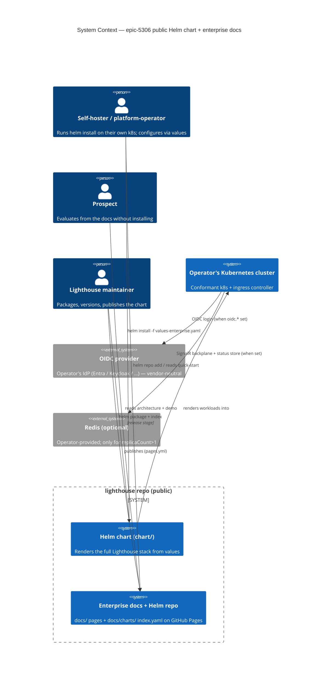

### C4 — Container (L2)

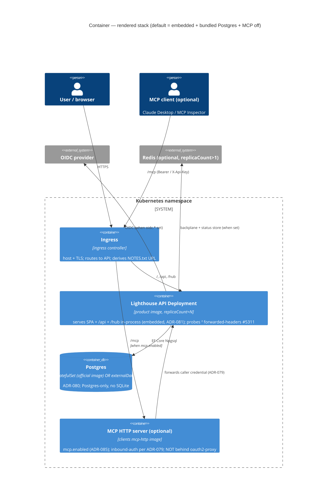

### Handoff (DESIGN → DEVOPS / DELIVER)

- **DEVOPS** (nw-platform-architect) picks up: the CI step wiring in the existing release stage (`helm package` + `helm repo index --merge` + the no-overwrite version guard + the helm-docs `git diff` drift gate + `chart-testing`/`ct` lint+template), the GitHub Pages URL/CNAME path for the Helm repo (`docs/charts/`), and appending the 3 candidate outcomes (`OUT-helm-install-first-try-success`, `OUT-enterprise-docs-self-serve`, `OUT-chart-publish-consistency`) to `docs/product/kpi-contracts.yaml`.
- **DELIVER** (nw-software-crafter): the chart templates + `values.schema.json` + NOTES.txt + the bundled-Postgres templates + the standalone-gate render guard test + the hand-authored enterprise docs; per-slice (01→05) per the story-map; live `helm install` dogfood against k3s per the slice "dogfood moment".
- **Open question carried forward (out of this DESIGN scope)**: the live end-to-end MCP OAuth dogfood (ADR-079 readiness checklist — IdP audience/scope, RFC 8707 resource indicators, the server version gate) needs the real environment and is part of the chart's enterprise-docs prerequisites, not the chart code itself.

---

## System Architecture — epic-5306-productization-platform

Feature: epic-5306-productization-platform (ADO Epic #5306 — the 9 remaining children: #5320 substrate, #5201 GitOps, #5204 Tenant Zero, #5202 routing, #5203 secrets, #5207 provisioning, #5205 upgrades, #5206 observability, #5208 backup/DR)
Wave: DESIGN (combined, whole-platform) | Layer scope: **system / infrastructure only** (IaC/YAML orchestrating Kubernetes — no application or domain code) | Date: 2026-06-29
Architect: Titan (System Designer), interaction mode = **PROPOSE** (single architect — pure infrastructure: OpenTofu + Helm + ArgoCD + cert-manager/external-dns + ESO/OpenBao + CNPG + kube-prometheus-stack).
Inputs: `docs/feature/epic-5306-productization-platform/feature-delta.md` (DISCUSS, APPROVED 2026-06-29; 9 stories, CC-1..6, KPIs), `slices/slice-01..12-*.md`, the `## System Architecture — epic-5306-k8s-productization` section above (the shipped #5199 chart this composes), the `## System Architecture — epic-5305-k8s-readiness` section (runtime primitives), ADR-075..079 (epic-5305 runtime), ADR-080..085 (shipped chart), ADR-086..093 (this feature).

This is the **system/infrastructure** view of the LPW **SaaS-operator** platform: a multi-tenant Kubernetes hosting platform that runs **many isolated Lighthouse tenants** on a shared cluster, with LPW's own production as **Tenant Zero**. It introduces **no backend C#/TS code and no domain model** — it is IaC + Helm + GitOps overlays that *compose* the already-shipped #5199 chart and epic-5305 runtime primitives. There is therefore no DDD or application-architecture layer; the "components" are OpenTofu modules, ArgoCD Applications, Kubernetes operators and Helm releases.

### Locked decisions (constraints, not re-litigated)

- **CC-1 tenancy = namespace-per-tenant on a shared cluster** (isolation via NetworkPolicy / RBAC / ResourceQuota; density ≥20/cluster, headroom ~200).
- **CC-5 = DB-per-tenant** (one CNPG `Cluster` per tenant namespace — ADR-091).
- **Substrate = Infomaniak Public Cloud (Swiss-sovereign)** → **primary adapter = Infomaniak managed Kubernetes** (OpenTofu connector, free shared control plane ≤10 nodes + CHF 300 credit; O-1 confirmed 2026-06-29); **fallback adapter = k3s-on-compute** for **Hetzner (EU alternative)** / any OpenStack. AWS-EKS parity deferred to slice-12; all land behind the same CC-4 contract.
- **D0 standalone gate sacrosanct**; **D0b vendor-neutral** (official images only, no Bitnami, no single-cloud lock-in in the platform layer); **D0c expand-only migrations**; **D0d extend existing GH Actions, trunk-based**; **D0e built ON the shipped chart**.

### Converged decisions (this DESIGN → ADRs)

| CC / Red card | Decision | ADR |
|---|---|---|
| CC-2 GitOps layout | A tenant IS a `tenants/<id>/tenant.yaml` record; ArgoCD **ApplicationSet (Git-files generator)** fans it; mono-repo, directory-separated `bootstrap/`+`platform/`+`tenants/`; **no bespoke controller** | [ADR-086](./adr-086-gitops-repo-layout-applicationset.md) |
| CC-3 secrets | **External Secrets Operator + self-hosted OpenBao**; only `ExternalSecret` refs in git; rotation = update store; Sealed Secrets + Vault(BSL) rejected | [ADR-087](./adr-087-secrets-eso-openbao.md) |
| CC-4 substrate boundary | Module outputs a **conformant-cluster contract** (CNI+NetworkPolicy / ingress / default StorageClass / LoadBalancer / API / egress); **primary adapter = Infomaniak managed k8s** (OpenTofu connector, Swiss), **fallback = k3s-on-compute** (Hetzner EU / any OpenStack); CAPO/EKS drop-in behind the same boundary | [ADR-088](./adr-088-substrate-boundary-openstack-k3s.md) |
| Red card — break-glass | Per-incident **auto-sync disable on the single affected Application**; standing `ArgoCDAutoSyncDisabled` alert makes it self-expiring | [ADR-089](./adr-089-break-glass-gitops-path.md) |
| Red card — cardinality | `tenant` is the **one bounded** label; drop unbounded labels at scrape; **recording rules** pre-aggregate the fleet dashboard; cardinality-budget alert | [ADR-090](./adr-090-metric-cardinality-bounding.md) |
| CC-5 topology | One **CNPG `Cluster` per tenant**; CNPG-native WAL + scheduled backup to off-cluster S3-compatible object storage keyed by id; namespace-isolated, rehearsed restore | [ADR-091](./adr-091-per-tenant-cnpg-backup-restore.md) |
| Provisioning flow | One record → **sync-wave-ordered** app-of-apps (ns/quota/netpol → DB/secret → chart/route/cert); names derive from id; PR-time uniqueness; removal prunes all | [ADR-092](./adr-092-provisioning-data-flow.md) |
| Upgrade flow | Tenant-Zero **canary (`canaryVersion`) → promote (`promotedVersion`)**; expand-only CI guard pre-flight; rollback = git revert + helm rollback | [ADR-093](./adr-093-automated-upgrade-flow.md) |

### Architectural pattern

**GitOps-reconciled, namespace-per-tenant multi-tenancy with declarative fan-out.** The substrate (OpenTofu) hands the platform a conformant cluster; ArgoCD's app-of-apps reconciles the whole platform + every tenant from one mono-repo; a single `tenant.yaml` record is fanned by an ApplicationSet into a fully isolated tenant; the shipped #5199 chart is the per-tenant workload, parameterised by values. The guiding discipline mirrors ADR-080/086: **off-the-shelf operators + config-selected branches, no bespoke code, no fork** — every capability is an additive overlay composing shipped primitives.

### Component decomposition (platform components — all `platform/` ArgoCD Applications unless noted)

| Component | Kind | Change-type | Role |
|---|---|---|---|
| OpenTofu substrate module | IaC (OpenStack provider) | **CREATE (justified)** | stands up the conformant cluster (ADR-088); only IaC, no app code |
| ArgoCD + app-of-apps root | GitOps controller (off-the-shelf) | **REUSE (off-the-shelf)** | reconciles platform + tenants from git (ADR-086); self-managed |
| ApplicationSet (tenant generator) | ArgoCD CR (ships with ArgoCD) | **CREATE (config)** | fans `tenants/*/tenant.yaml` → per-tenant app-of-apps (ADR-086/092) |
| ingress-nginx | controller (official) | **REUSE (off-the-shelf)** | host-based routing to tenant namespaces |
| cert-manager + external-dns | controllers (official) | **REUSE (off-the-shelf)** | wildcard/per-host TLS + DNS (US-04/slice-05) |
| External Secrets Operator + OpenBao | operator + store (off-the-shelf) | **REUSE (off-the-shelf)** | per-tenant secret materialisation (ADR-087) |
| CloudNativePG operator | operator (official) | **REUSE (off-the-shelf)** | per-tenant Postgres + backup/restore (ADR-091) |
| kube-prometheus-stack + Grafana | stack (official) | **REUSE (off-the-shelf)** | fleet + per-tenant observability (ADR-090) |
| #5199 Helm chart | shipped chart | **REUSE (config surface)** | the per-tenant workload; `externalDatabase.*` → CNPG; secret ← ESO; epic-5305 values |
| epic-5305 runtime primitives | shipped app code | **REUSE (config surface)** | probes/drain/migration-lock/backplane/OTel/MCP-auth — set via chart values, no code change |
| tenant records + sync-wave manifests + recording rules + CI guards | GitOps YAML | **CREATE (config)** | the declarative glue (ADR-092/093) |

### Reuse Analysis verdict

**Zero unjustified CREATE NEW.** Every overlapping component is REUSE (the shipped chart, all epic-5305 primitives, and every platform capability is an off-the-shelf CNCF/official operator). The only CREATE items are (a) the **OpenTofu substrate module** — irreducibly new IaC, there is no prior substrate to extend, standard provider resources, no bespoke mechanism; and (b) **GitOps configuration** (tenant records, ApplicationSet, sync-wave manifests, recording rules, CI uniqueness/expand-only guards) — config-as-code, not application code. No bespoke controller, no forked chart, no custom secret/DB/backup mechanism. The substrate CREATE is justified by US-01 (no substrate exists); the config CREATEs are justified per-story (US-02/05/06/07/08/09).

### Driving ports (operator entry points)

| Port | Type | Owner | Story |
|---|---|---|---|
| `tofu apply` / `tofu destroy` | CLI | operator | US-01 |
| git PR merge (platform component / `tenant.yaml` / version bump) | git | operator | US-02/06/07 |
| `argocd app list` / `argocd app set --sync-policy …` (break-glass) | CLI | operator | US-02 |
| `kubectl` / `curl https://<sub>.lighthouse.letpeople.work` | CLI | operator | US-03/04 |
| Grafana fleet dashboard | web | operator | US-08 |
| restore runbook (CNPG `bootstrap.recovery` into scratch ns) | runbook | operator | US-09 |

### Driven ports / adapters (outbound)

| Driven dependency | Adapter / mechanism | Behind CC-4 boundary? |
|---|---|---|
| OpenStack (Nova/Neutron/Cinder/Octavia/Swift) | OpenTofu OpenStack provider + cloud-init k3s | **Yes** (provider-specific) |
| Off-cluster object storage (backups) | CNPG Barman → S3-compatible API (Infomaniak Swift/S3) | **Yes** (endpoint + creds) |
| OpenBao secret store | ESO `SecretStore` (k8s auth, per-tenant path) | No (vendor-neutral) |
| DNS zone `lighthouse.letpeople.work` | external-dns | No |
| ACME CA (Let's Encrypt) | cert-manager `ClusterIssuer` | No |
| OIDC issuer (per tenant) | chart `oidc.*` values | No |

### Technology choices (pinned — verify latest patch at DELIVER)

| Tool | Pinned version (intent) | Note |
|---|---|---|
| OpenTofu | 1.8.x | not proprietary Terraform (D0b) |
| OpenStack Terraform/Tofu provider | terraform-provider-openstack ~> 2.1 | portable across any OpenStack |
| k3s | v1.31.x (k3s channel) | Flannel disabled → Calico CNI |
| Calico | 3.28.x | NetworkPolicy enforcement (CC-1) |
| ArgoCD | 2.13.x (app-of-apps + ApplicationSet) | official images |
| cert-manager | 1.16.x | ACME wildcard/per-host |
| external-dns | 0.15.x | DNS automation |
| External Secrets Operator | 0.10.x | ESO |
| OpenBao | 2.1.x | MPL-2.0 Vault fork |
| CloudNativePG | 1.24.x | per-tenant Postgres + backup |
| kube-prometheus-stack | 65.x chart (Prometheus 2.55.x / Grafana 11.x) | observability |

> Versions are DESIGN intent; DELIVER (nw-platform-architect) pins exact patch + records in the repo's tooling manifest. Vendor-neutral, official/CNCF images only.

### Standalone-gate enforcement (D0 — hard invariant)

The entire platform is a hosted-only overlay. The standalone single-container product and the #5199 chart's standalone defaults are **byte-unchanged**: telemetry stays off-by-default (ADR-090 verifies the gate), the chart still installs standalone with default values (slice-01 AC), and no platform component is a chart dependency. Every capability auto-degrades (no ESO → plain Secret; no CNPG → bundled Postgres; no Redis → single replica; no telemetry → off).

### C4 — System Context (L1)

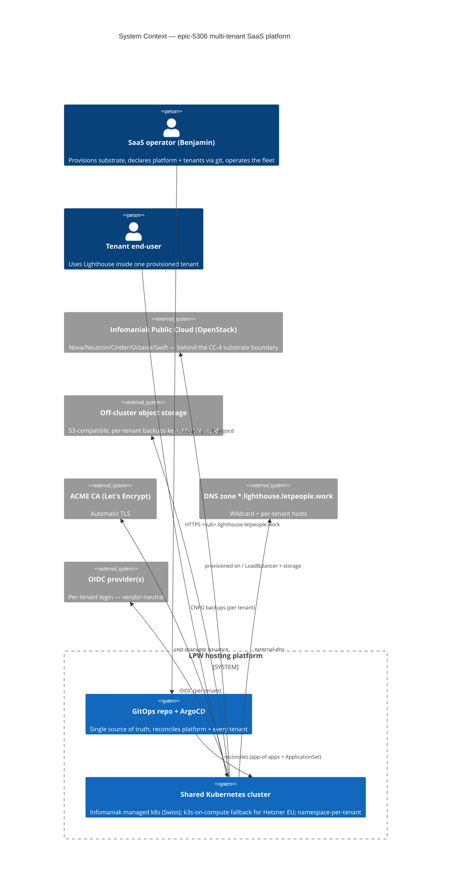

### C4 — Container (L2)

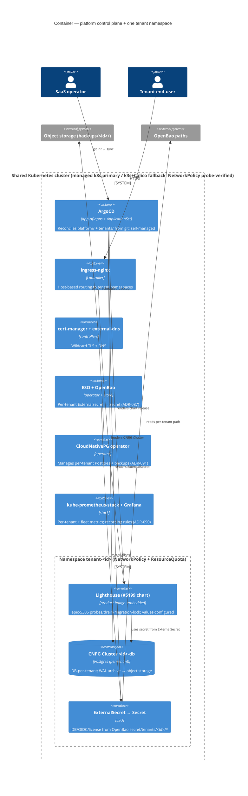

### C4 — Component (L3): the provisioning flow (one record → isolated tenant, ADR-092)

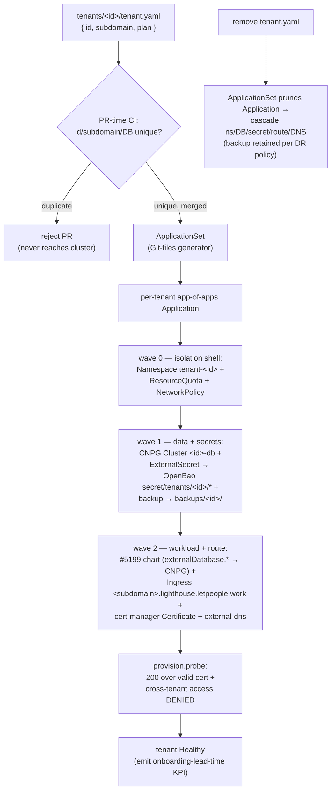

### Quality-attribute strategies

- **Onboarding lead time (North Star ≤10 min)**: one committed record → sync-wave fan-out → synthetic provision-probe emits the PR-merge→200 timestamp (ADR-092).
- **Fleet upgrade safety (KPI-2)**: Tenant-Zero canary → promote, on top of epic-5305 zero-downtime primitives + expand-only CI guard (ADR-093).
- **Durability (KPI-3/4)**: per-tenant CNPG WAL+backup to off-cluster storage; rehearsed, timed restore; backup-age + restore-rehearsal alerts (ADR-091).
- **Isolation (guardrail = 0 incidents)**: namespace + NetworkPolicy (Calico) + per-tenant OpenBao path + per-tenant CNPG + per-tenant backup prefix — all keyed off the one CC-6 id; probed live (ADR-088/092).
- **No-drift / change-control (KPI-6)**: GitOps app-of-apps + self-heal; break-glass is observable + self-expiring (ADR-089).
- **Cardinality bound (KPI-8 store health)**: one `tenant` label + label drops + recording rules + budget alert (ADR-090).

### Earned-Trust probes (the platform proves its substrate, never assumes it)

| Probe | Asserts empirically | Refusal signal |
|---|---|---|
| `substrate.probe` (post-`tofu apply`) | NetworkPolicy actually drops cross-ns traffic; LoadBalancer gets an IP; default StorageClass binds | `health.startup.refused{component=substrate, lie=…}` (ADR-088) |
| `secrets.probe` (ESO/OpenBao bring-up) | round-trip secret materialises; cross-tenant read denied | `health.startup.refused{component=eso, lie=…}` (ADR-087) |
| `provision.probe` (post-tenant-sync) | 200 over valid cert; tenant cannot reach another's ns/DB | tenant flagged unhealthy (ADR-092) |
| `dr.restore.rehearsed` (per release) | Tenant-Zero backup restores + serves within RTO | alert if failed/over-RTO (ADR-091) |
| `BackupStale` / `ArgoCDAutoSyncDisabled` / cardinality-budget | backups run; no forgotten break-glass; TSDB within budget | standing alerts (ADR-089/090/091) |

Self-application: `substrate.probe` and `secrets.probe` re-run after every k3s/Calico/CCM/CSI and ESO/OpenBao version bump; `dr.restore.rehearsed` runs per release.

### ADRs (this feature)

- [ADR-086](./adr-086-gitops-repo-layout-applicationset.md): GitOps layout — tenant = record, ApplicationSet generator, mono-repo, no controller (CC-2). PROPOSED.
- [ADR-087](./adr-087-secrets-eso-openbao.md): secrets — ESO + OpenBao, refs-only in git, rotate via store (CC-3). PROPOSED.
- [ADR-088](./adr-088-substrate-boundary-openstack-k3s.md): substrate boundary — conformant-cluster contract; primary = Infomaniak managed k8s (Swiss, free tier), fallback = k3s-on-compute (Hetzner EU / OpenStack) (CC-4 + O-1 resolved). PROPOSED.
- [ADR-089](./adr-089-break-glass-gitops-path.md): break-glass — per-app auto-sync disable + self-expiring alert. PROPOSED.
- [ADR-090](./adr-090-metric-cardinality-bounding.md): cardinality — one bounded `tenant` label + recording rules + budget alert. PROPOSED.
- [ADR-091](./adr-091-per-tenant-cnpg-backup-restore.md): per-tenant CNPG + off-cluster backup + isolated rehearsed restore (CC-5 topology). PROPOSED.
- [ADR-092](./adr-092-provisioning-data-flow.md): provisioning data-flow — sync-wave fan-out from one record, names from id, PR-time uniqueness. PROPOSED.
- [ADR-093](./adr-093-automated-upgrade-flow.md): upgrade — Tenant-Zero canary → promote, expand-only guard, git-revert rollback. PROPOSED.

### Handoff (DESIGN → DELIVER, slice-ordered)

- **slice-01..03 (WS)**: substrate module (ADR-088) → ArgoCD app-of-apps (ADR-086) → Tenant Zero reachable (interim hand-made secret/route). **slice-04**: ESO+OpenBao (ADR-087). **slice-05**: wildcard routing (cert-manager/external-dns). **slice-06**: second tenant by hand (validates CC-1). **slice-07**: ApplicationSet provisioning (ADR-092) + CNPG (ADR-091 DB). **slice-08**: canary→promote upgrade (ADR-093). **slice-09**: observability (ADR-090). **slice-10/11**: backup + rehearsed restore (ADR-091). **slice-12**: EKS parity behind the CC-4 boundary (deferred).
- **DEVOPS** (nw-platform-architect): pin exact tool versions in the repo tooling manifest; wire the PR-time uniqueness + expand-only guards into the existing GH Actions workflow; size the cardinality budget + RPO/RTO targets; provision OpenBao unseal/object-store credentials out-of-band.

---

## Application Architecture — epic-5074-blocked-items (Epic 5074)

Feature: epic-5074-blocked-items — replace the hardcoded `BlockedStates`/`BlockedTags` "blocked" definition with the EXISTING rule engine, then add per-item blocked duration, a forward-only blocked-count over-time chart, a blocked→stale linkage, and a predefined-additional-field cleanup. Five thin end-to-end slices; slice 1 is the walking skeleton + foundation. **No new bounded context** — every capability EXTENDS an existing mechanism. Non-premium (verified). Default style unchanged (modular monolith + ports-and-adapters).

**Single definition of blocked (ADR-067)**: `BlockedRuleSet` (a `WorkItemRuleSet`) is stored as a **JSON column** `BlockedRuleSetJson` on the shared `WorkTrackingSystemOptionsOwner` aggregate (Team + Portfolio) — the EXISTING rule-set persistence idiom (`Team.ForecastFilterRuleSetJson`, `Delivery.RuleDefinitionJson`), NOT the owned-collection idiom of ADR-064 (which is for structured non-rule config). Blocked is the **third Include consumer** of the rule engine after DeliveryRule (Include) and ForecastFilter (Exclude) (ADR-012/013): a matched item IS blocked. A new thin delegator `IBlockedItemService` (mirroring `ForecastFilterRuleService`) computes the single `IsBlocked` via `RuleEvaluator<T>` for BOTH `WorkItem` (Team) and `Feature` (Portfolio) — both have `AdditionalFieldValues` + a field provider, so the definition applies uniformly. The legacy `BlockedStates`/`BlockedTags` columns/properties are **removed** (one-time loss-free EF backfill-before-drop migration, app-layer synthesis: `State equals X` / `Tags contains Y`, OR'd). Feature-blocked becomes case-insensitive (a correctness fix vs the old `Contains`).

**Per-item duration (ADR-068)**: a new owned `WorkItemBlockedTransition {WorkItemId, EnteredAt, LeftAt?}` (mirrors the `WorkItemStateTransition` idiom; distinct entity — blocked ⊥ state, README L1). Enter reuses the existing `WorkItemBlocked` event; leave is a **new `WorkItemUnblocked` domain event** at the symmetric `WasBlocked && !IsBlocked` seam (on the bus, per Epic 5121 direction). `WorkItemDto.blockedSince` (additive) drives the "blocked Nd" badge; first-observation = null = "—" (honest, no fabricated history).

**Over-time trend (ADR-069)**: a new **owner-grained** sibling store `BlockedCountSnapshot {OwnerId, OwnerType, RecordedAt, BlockedCount}` fed by a post-sync forward recorder (date-keyed upsert idempotency), reusing the forward-only delivery-metrics PATTERN (ADR-048/049/050) — NOT extending the delivery-grained `DeliveryMetricSnapshot` (grain differs). New `GET .../metrics/blockedCountHistory` endpoint; chart lives in the Flow Metrics chart area (OQ2); honest forward-only empty state.

**Blocked→stale AMENDS ADR-026 (ADR-070)**: `deriveStaleness` returns `StalenessResult {isStale, reasons[]}` (was `boolean`). ADR-026's blocked-excludes-stale rule is **narrowed to the time-in-state trigger** (a blocked item is still NOT time-in-state-stale — clock paused). A **distinct blocked-duration trigger** (new `blockedStalenessThresholdDays`, 0=off, `≥` boundary) OR's in with a distinct reason; stale-once. The single-selector invariant (ADR-026) is upheld and extended.

**Predefined additional field (ADR-071, SPIKE-gated)**: an additive `IsPredefined` flag on `AdditionalFieldDefinition`; the Jira "Flagged" field is auto-registered (idempotent, single Jira hook) into the SAME list, excluded from user CRUD + the license slot count, surfaced read-only on the DTO, but usable as an `additionalField.{id}` rule key through the EXISTING generic id-keyed fetch/value/provider path. The synthetic-label hack in `IssueFactory` is deleted. **A pre-slice-05 timeboxed SPIKE is required** (exclusion threads four surfaces + no system-field precedent); does not block slices 01–04.

**Contract changes + client version-gate (ADR-072)**: changed settings contract (`blockedRuleSet` replaces `blockedStates`/`blockedTags`) **GATES** (loud "upgrade Lighthouse" beats silent config divergence); new `blockedCountHistory` endpoint **GATES**; predefined-field write distinction **GATES**; additive `blockedSince` + `blockedStalenessThresholdDays` read fields **NO GATE** (graceful degradation, per ADR-062). Baseline strictly `> v26.6.7.1` (last released). Clients = separate repo.

**RBAC** (unchanged): all blocked CONFIG writes ride the existing team/portfolio settings gate (`IRbacAdministrationService`, UI via `useRbac()`); reads inherit existing metric/work-item read gating. No new authorization surface. **Website N/A** (non-premium).

### ADR References (this feature)

- [ADR-067](./adr-067-rule-based-blocked-definition-and-auto-migration.md): `BlockedRuleSetJson` JSON column on the shared aggregate; single `IsBlocked` via `RuleEvaluator<T>` (Include); loss-free app-layer + EF-backfill migration. ACCEPTED.
- [ADR-068](./adr-068-blocked-transition-capture-and-unblocked-event.md): `WorkItemBlockedTransition` owned entity; enter via `WorkItemBlocked`, leave via new `WorkItemUnblocked`; `blockedSince` additive. ACCEPTED.
- [ADR-069](./adr-069-blocked-count-snapshot-and-over-time-endpoint.md): new owner-grained `BlockedCountSnapshot` + forward recorder + `blockedCountHistory` endpoint (version-gated). ACCEPTED.
- [ADR-070](./adr-070-blocked-duration-staleness-amends-026.md): **AMENDS ADR-026** — multi-reason `deriveStaleness`; blocked-exclusion narrowed to time-in-state; distinct blocked-duration trigger (`≥`). ACCEPTED.
- [ADR-071](./adr-071-predefined-system-additional-field.md): additive `IsPredefined` flag, Jira auto-registration, generic path; **pre-slice-05 SPIKE required**. ACCEPTED.
- [ADR-072](./adr-072-blocked-contract-changes-and-client-version-gate.md): contract-change matrix + client version-gate (`> v26.6.7.1`). ACCEPTED.
- [ADR-099](./adr-099-blocked-membership-at-date-reconstruction.md): blocked membership at a past date **reconstructed** from `WorkItemBlockedTransition` interval overlap (NOT persisted); new `blockedItemsAtDate` read endpoint (version-gated); `BlockedCountSnapshot` unchanged, no migration. ACCEPTED.
- Cross-refs [ADR-012](./adr-012-rule-engine-generalisation.md)/[ADR-013](./adr-013-rule-match-semantics.md) (rule engine + caller-decided semantics), [ADR-026](./adr-026-cross-surface-staleness-derivation-and-blocked-precedence.md) (amended), [ADR-048](./adr-048-delivery-metric-snapshot-store.md)/[ADR-049](./adr-049-forward-recorder-hook-point-and-idempotency.md)/[ADR-050](./adr-050-metrics-history-endpoint-and-snapshot-schema.md) (forward-snapshot pattern), [ADR-064](./adr-064-cycle-time-definitions-storage-as-owned-collection-on-settings-aggregate.md) (settings-aggregate storage precedent), [ADR-062](./adr-062-named-cycle-time-read-endpoint-contract-and-client-version-gate.md)/[ADR-055](./adr-055-flow-efficiency-tile-transport-and-client-version-gate.md) (version-gate pattern).

### C4

System Context: **delta** (no new external system; the predefined-field cleanup reuses the existing Jira integration). Container delta: new `IBlockedItemService` + `WorkItemBlockedTransition` + `BlockedCountSnapshot` + `blockedCountHistory` endpoint on the existing Backend container; the blocked rule builder (reuses `DeliveryRuleBuilder`) + blocked-over-time chart on the existing Frontend SPA; the Lighthouse-Clients (separate repo) gaining version-gated wrappers for the changed settings contract + new endpoint. See `docs/product/architecture/c4-diagrams.md` → "C4 Architecture Diagrams — epic-5074-blocked-items".

### Enhancement batch (2026-07-07, slices 06-08, ADR-099)

Three widget/chart enrichments on the shipped foundation; **no new bounded context, no new tech, no migration** — net-new backend surface is a single read endpoint. Codebase reality: the widget chrome is already built, so most of the batch is EXTEND/REUSE (see `docs/feature/epic-5074-blocked-items/design/upstream-changes.md`).

- **B3 previous-period trend (slice 06)**: pure FE selector `computeBlockedTrend(blockedCountHistory, startDate, endDate) → TrendPayload` feeds the EXISTING `WidgetShell` trend chrome (`trendTypes.ts`/`TrendChrome`) via the `widgetTrends` map; `trendPolicy.blockedOverview` flipped off `"none"`. Baseline = `BlockedCountSnapshot` at the prior-period boundary; no baseline ⇒ `direction: "none"`. No backend.
- **B2 max-age RAG (slice 07)**: re-keys the EXISTING `computeBlockedOverviewRag` (today `blockedCount ≥ 2`) to MAX blocked age vs `blockedStalenessThresholdDays` (RED past threshold, AMBER within an aging band, GREEN none; 0 ⇒ `"none"`), using per-item `blockedSince` already on `blockedItems`. No backend.
- **B1 chart drill-through (slice 08, ADR-099)**: new `GET .../metrics/blockedItemsAtDate?date=T` mirrors the `blockedCountHistory` endpoint, **reconstructing** membership from `WorkItemBlockedTransition` interval overlap (`EnteredAt.Date ≤ T ∧ (LeftAt null ∨ LeftAt.Date ≥ T)`) joined to the owner's work items — no persisted membership, `BlockedCountSnapshot` unchanged. `BlockedItemsOverTimeChart` gains `onItemClick` → existing `WorkItemsDialog`; latest bar reuses live `IsBlocked`; count reconciles with the snapshot (capture-gap note on divergence); version-gated for clients (ADR-072). The current-set dialog already exists via `WidgetShell.viewData`.
