# C4 Architecture Diagrams — rbac-enhancements

Feature: rbac-enhancements
Wave: DESIGN
Date: 2026-05-10
Architect: Morgan (Solution Architect)

---

## C4 Level 1 — System Context

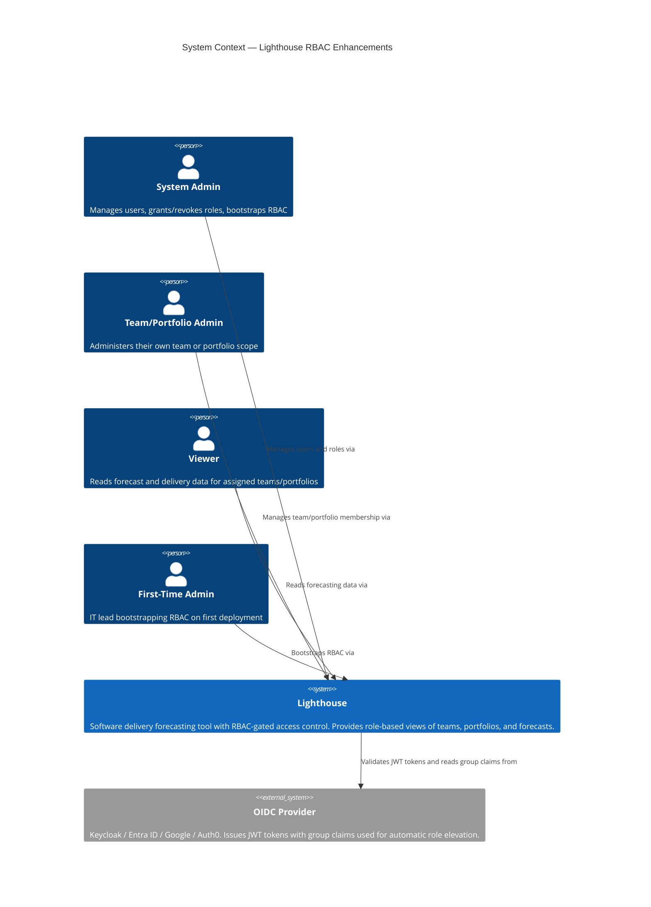
```mermaid
C4Context
    title System Context — Lighthouse RBAC Enhancements

    Person(sysAdmin, "System Admin", "Manages users, grants/revokes roles, bootstraps RBAC")
    Person(scopedAdmin, "Team/Portfolio Admin", "Administers their own team or portfolio scope")
    Person(viewer, "Viewer", "Reads forecast and delivery data for assigned teams/portfolios")
    Person(firstAdmin, "First-Time Admin", "IT lead bootstrapping RBAC on first deployment")

    System(lighthouse, "Lighthouse", "Software delivery forecasting tool with RBAC-gated access control. Provides role-based views of teams, portfolios, and forecasts.")

    System_Ext(oidc, "OIDC Provider", "Keycloak / Entra ID / Google / Auth0. Issues JWT tokens with group claims used for automatic role elevation.")

    Rel(sysAdmin, lighthouse, "Manages users and roles via")
    Rel(scopedAdmin, lighthouse, "Manages team/portfolio membership via")
    Rel(viewer, lighthouse, "Reads forecasting data via")
    Rel(firstAdmin, lighthouse, "Bootstraps RBAC via")
    Rel(lighthouse, oidc, "Validates JWT tokens and reads group claims from")
```

---

## C4 Level 2 — Container

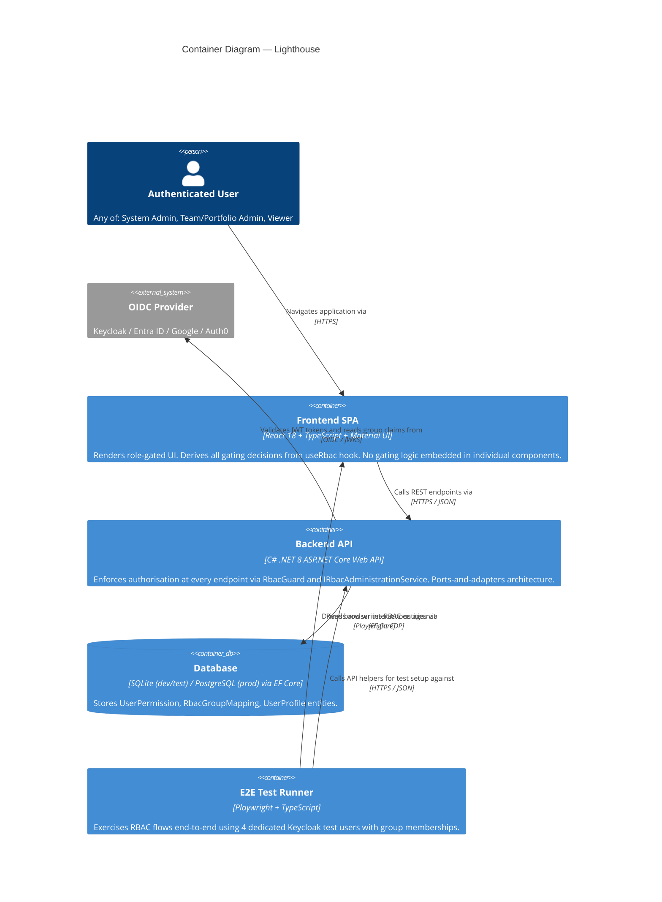
```mermaid
C4Container
    title Container Diagram — Lighthouse

    Person(user, "Authenticated User", "Any of: System Admin, Team/Portfolio Admin, Viewer")
    System_Ext(oidc, "OIDC Provider", "Keycloak / Entra ID / Google / Auth0")

    Container(spa, "Frontend SPA", "React 18 + TypeScript + Material UI", "Renders role-gated UI. Derives all gating decisions from useRbac hook. No gating logic embedded in individual components.")
    Container(api, "Backend API", "C# .NET 8 ASP.NET Core Web API", "Enforces authorisation at every endpoint via RbacGuard and IRbacAdministrationService. Ports-and-adapters architecture.")
    ContainerDb(db, "Database", "SQLite (dev/test) / PostgreSQL (prod) via EF Core", "Stores UserPermission, RbacGroupMapping, UserProfile entities.")
    Container(e2e, "E2E Test Runner", "Playwright + TypeScript", "Exercises RBAC flows end-to-end using 4 dedicated Keycloak test users with group memberships.")

    Rel(user, spa, "Navigates application via", "HTTPS")
    Rel(spa, api, "Calls REST endpoints via", "HTTPS / JSON")
    Rel(api, oidc, "Validates JWT tokens and reads group claims from", "OIDC / JWKS")
    Rel(api, db, "Reads and writes RBAC entities via", "EF Core")
    Rel(e2e, spa, "Drives browser interactions against", "Playwright CDP")
    Rel(e2e, api, "Calls API helpers for test setup against", "HTTPS / JSON")
```

---

## C4 Level 3 — Component: Authorization Domain

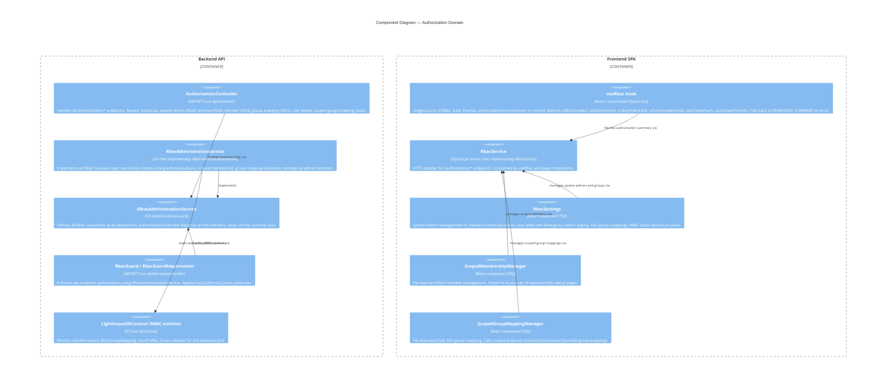
```mermaid
C4Component
    title Component Diagram — Authorization Domain

    Container_Boundary(api, "Backend API") {
        Component(authCtrl, "AuthorizationController", "ASP.NET Core ApiController", "Handles all /authorization/* endpoints. Routes: bootstrap, system-admin CRUD, team/portfolio member CRUD, group-mapping CRUD, user delete, scoped group-mapping reads.")
        Component(rbacSvc, "RbacAdministrationService", "C# class implementing IRbacAdministrationService", "Implements all RBAC business logic: permission checks, role grants/revocations, scoped membership, group mapping evaluation, emergency admin detection.")
        Component(rbacPort, "IRbacAdministrationService", "C# interface (driven port)", "Defines all RBAC operations as an abstraction. AuthorizationController depends on this interface, never on the concrete class.")
        Component(rbacGuard, "RbacGuard / RbacGuardRequirement", "ASP.NET Core IAuthorizationHandler", "Enforces per-endpoint authorisation using IRbacAdministrationService. Applied via [Authorize] policy attributes.")
        Component(efCtx, "LighthouseDbContext (RBAC entities)", "EF Core DbContext", "Persists UserPermission, RbacGroupMapping, UserProfile. Driven adapter for the database port.")
    }

    Container_Boundary(spa, "Frontend SPA") {
        Component(useRbac, "useRbac hook", "React custom hook (TypeScript)", "Single source of RBAC state. Fetches /authorization/my-summary on mount. Returns isRbacEnabled, isSystemAdmin, isTeamAdmin(id), isPortfolioAdmin(id), canCreateTeam, canCreatePortfolio. Falls back to PERMISSIVE_SUMMARY on error.")
        Component(rbacService, "RbacService", "TypeScript service class implementing IRbacService", "HTTP adapter for /authorization/* endpoints. Consumed by useRbac and page components.")
        Component(rbacSettings, "RbacSettings", "React component (TSX)", "System Admin management UI. Renders bootstrap button, user table with Emergency Admin display, SSO group mappings, RBAC Status disclosure panel.")
        Component(scopedMgr, "ScopedMembershipManager", "React component (TSX)", "Per-team/portfolio member management. Shown in Access tab of team/portfolio detail pages.")
        Component(scopedGrpMgr, "ScopedGroupMappingManager", "React component (TSX)", "Per-team/portfolio SSO group mapping. Calls scoped endpoint /authorization/teams/{teamId}/group-mappings.")
    }

    Rel(authCtrl, rbacPort, "invokes business logic via")
    Rel(rbacSvc, rbacPort, "implements")
    Rel(rbacGuard, rbacPort, "checks permissions via")
    Rel(rbacSvc, efCtx, "reads and writes RBAC entities via")
    Rel(useRbac, rbacService, "fetches authorization summary via")
    Rel(rbacSettings, rbacService, "manages system admins and groups via")
    Rel(scopedMgr, rbacService, "manages scoped members via")
    Rel(scopedGrpMgr, rbacService, "manages scoped group mappings via")
```

---

# C4 Architecture Diagrams — work-tracking-oauth-authentication

Feature: work-tracking-oauth-authentication
Wave: DESIGN
Date: 2026-05-14
Architect: Morgan (Solution Architect)

---

## C4 Level 1 — System Context (delta)

Existing System Context (RBAC) still applies. This feature adds **outbound** OAuth client relationships to external IdPs and extends the user persona set with the existing `connector-admin`.

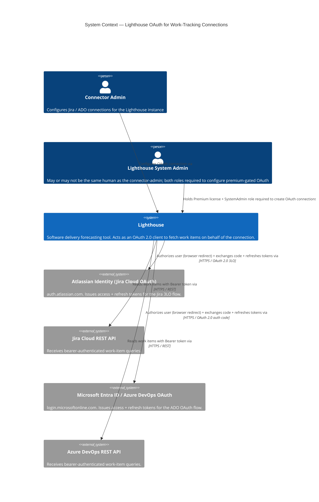
```mermaid
C4Context
    title System Context — Lighthouse OAuth for Work-Tracking Connections

    Person(connectorAdmin, "Connector Admin", "Configures Jira / ADO connections for the Lighthouse instance")
    Person(sysAdmin, "Lighthouse System Admin", "May or may not be the same human as the connector-admin; both roles required to configure premium-gated OAuth")

    System(lighthouse, "Lighthouse", "Software delivery forecasting tool. Acts as an OAuth 2.0 client to fetch work items on behalf of the connection.")

    System_Ext(jiraIdP, "Atlassian Identity (Jira Cloud OAuth)", "auth.atlassian.com. Issues access + refresh tokens for the Jira 3LO flow.")
    System_Ext(jiraApi, "Jira Cloud REST API", "Receives bearer-authenticated work-item queries.")
    System_Ext(adoIdP, "Microsoft Entra ID / Azure DevOps OAuth", "login.microsoftonline.com. Issues access + refresh tokens for the ADO OAuth flow.")
    System_Ext(adoApi, "Azure DevOps REST API", "Receives bearer-authenticated work-item queries.")

    Rel(connectorAdmin, lighthouse, "Configures OAuth connection via")
    Rel(sysAdmin, lighthouse, "Holds Premium license + SystemAdmin role required to create OAuth connections")
    Rel(lighthouse, jiraIdP, "Authorizes user (browser redirect) + exchanges code + refreshes tokens via", "HTTPS / OAuth 2.0 3LO")
    Rel(lighthouse, jiraApi, "Reads work items with Bearer token via", "HTTPS / REST")
    Rel(lighthouse, adoIdP, "Authorizes user (browser redirect) + exchanges code + refreshes tokens via", "HTTPS / OAuth 2.0 auth code")
    Rel(lighthouse, adoApi, "Reads work items with Bearer token via", "HTTPS / REST")
```

---

## C4 Level 2 — Container (delta)

The existing Backend API / Frontend SPA / Database containers are unchanged in shape. This feature adds outbound HTTPS calls from the Backend API to two new external IdP / API systems, and adds a new persistence concern (one new table) to the existing DB.

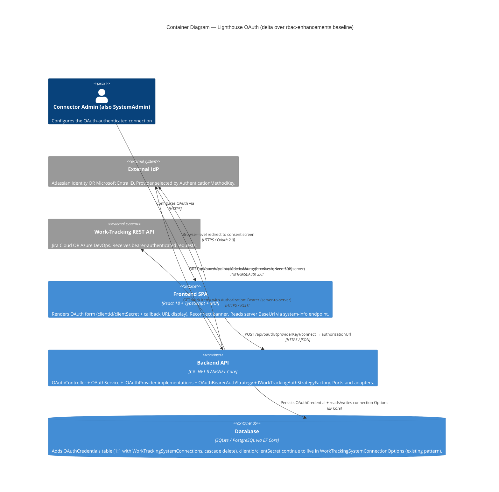
```mermaid
C4Container
    title Container Diagram — Lighthouse OAuth (delta over rbac-enhancements baseline)

    Person(user, "Connector Admin (also SystemAdmin)", "Configures the OAuth-authenticated connection")
    System_Ext(idp, "External IdP", "Atlassian Identity OR Microsoft Entra ID. Provider selected by AuthenticationMethodKey.")
    System_Ext(wts, "Work-Tracking REST API", "Jira Cloud OR Azure DevOps. Receives bearer-authenticated requests.")

    Container(spa, "Frontend SPA", "React 18 + TypeScript + MUI", "Renders OAuth form (clientId/clientSecret + callback URL display), Reconnect banner. Reads server BaseUrl via system-info endpoint.")
    Container(api, "Backend API", "C# .NET 8 ASP.NET Core", "OAuthController + OAuthService + IOAuthProvider implementations + OAuthBearerAuthStrategy + IWorkTrackingAuthStrategyFactory. Ports-and-adapters.")
    ContainerDb(db, "Database", "SQLite / PostgreSQL via EF Core", "Adds OAuthCredentials table (1:1 with WorkTrackingSystemConnections, cascade delete). clientId/clientSecret continue to live in WorkTrackingSystemConnectionOptions (existing pattern).")

    Rel(user, spa, "Configures OAuth via", "HTTPS")
    Rel(spa, api, "POST /api/oauth/{providerKey}/connect → authorizationUrl", "HTTPS / JSON")
    Rel(spa, idp, "Browser-level redirect to consent screen", "HTTPS / OAuth 2.0")
    Rel(idp, api, "GET /api/oauth/callback?code&state (browser-driven 302)", "HTTPS")
    Rel(api, idp, "POST token endpoint (code exchange + refresh, server-to-server)", "HTTPS / OAuth 2.0")
    Rel(api, wts, "GET work items with Authorization: Bearer (server-to-server)", "HTTPS / REST")
    Rel(api, db, "Persists OAuthCredential + reads/writes connection Options", "EF Core")
```

---

## C4 Level 3 — Component: OAuth Domain

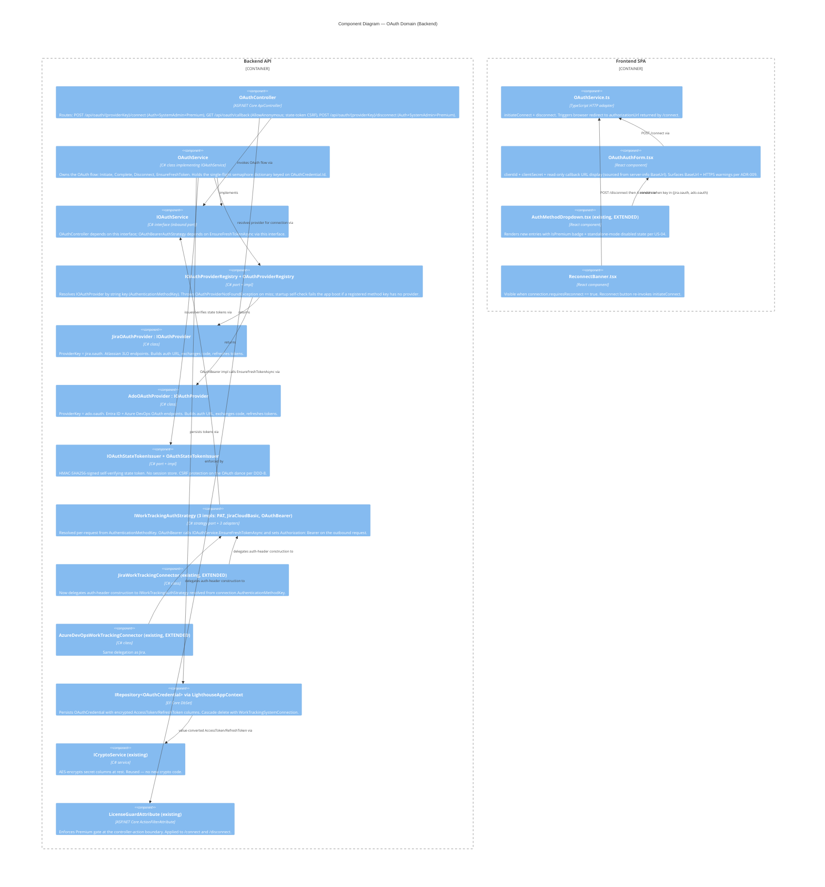
```mermaid
C4Component
    title Component Diagram — OAuth Domain (Backend)

    Container_Boundary(api, "Backend API") {
        Component(oauthCtrl, "OAuthController", "ASP.NET Core ApiController", "Routes: POST /api/oauth/{providerKey}/connect (Auth+SystemAdmin+Premium), GET /api/oauth/callback (AllowAnonymous; state-token CSRF), POST /api/oauth/{providerKey}/disconnect (Auth+SystemAdmin+Premium).")
        Component(oauthSvc, "OAuthService", "C# class implementing IOAuthService", "Owns the OAuth flow: Initiate, Complete, Disconnect, EnsureFreshToken. Holds the single-flight semaphore dictionary keyed on OAuthCredential.Id.")
        Component(oauthPort, "IOAuthService", "C# interface (inbound port)", "OAuthController depends on this interface; OAuthBearerAuthStrategy depends on EnsureFreshTokenAsync via this interface.")
        Component(providerRegistry, "IOAuthProviderRegistry + OAuthProviderRegistry", "C# port + impl", "Resolves IOAuthProvider by string key (AuthenticationMethodKey). Throws OAuthProviderNotFoundException on miss; startup self-check fails the app boot if a registered method key has no provider.")
        Component(jiraProvider, "JiraOAuthProvider : IOAuthProvider", "C# class", "ProviderKey = jira.oauth. Atlassian 3LO endpoints. Builds auth URL, exchanges code, refreshes tokens.")
        Component(adoProvider, "AdoOAuthProvider : IOAuthProvider", "C# class", "ProviderKey = ado.oauth. Entra ID + Azure DevOps OAuth endpoints. Builds auth URL, exchanges code, refreshes tokens.")
        Component(stateIssuer, "IOAuthStateTokenIssuer + OAuthStateTokenIssuer", "C# port + impl", "HMAC-SHA256-signed self-verifying state token. No session store. CSRF protection on the OAuth dance per DDD-8.")
        Component(authStrategy, "IWorkTrackingAuthStrategy (3 impls: PAT, JiraCloudBasic, OAuthBearer)", "C# strategy port + 3 adapters", "Resolved per-request from AuthenticationMethodKey. OAuthBearer calls IOAuthService.EnsureFreshTokenAsync and sets Authorization: Bearer on the outbound request.")
        Component(jiraConn, "JiraWorkTrackingConnector (existing, EXTENDED)", "C# class", "Now delegates auth-header construction to IWorkTrackingAuthStrategy resolved from connection.AuthenticationMethodKey.")
        Component(adoConn, "AzureDevOpsWorkTrackingConnector (existing, EXTENDED)", "C# class", "Same delegation as Jira.")
        Component(credRepo, "IRepository<OAuthCredential> via LighthouseAppContext", "EF Core DbSet", "Persists OAuthCredential with encrypted AccessToken/RefreshToken columns. Cascade delete with WorkTrackingSystemConnection.")
        Component(crypto, "ICryptoService (existing)", "C# service", "AES-encrypts secret columns at rest. Reused — no new crypto code.")
        Component(licenseGuard, "LicenseGuardAttribute (existing)", "ASP.NET Core ActionFilterAttribute", "Enforces Premium gate at the controller-action boundary. Applied to /connect and /disconnect.")
    }

    Container_Boundary(spa, "Frontend SPA") {
        Component(oauthFeService, "OAuthService.ts", "TypeScript HTTP adapter", "initiateConnect + disconnect. Triggers browser redirect to authorizationUrl returned by /connect.")
        Component(oauthForm, "OAuthAuthForm.tsx", "React component", "clientId + clientSecret + read-only callback URL display (sourced from server-info BaseUrl). Surfaces BaseUrl + HTTPS warnings per ADR-009.")
        Component(authDropdown, "AuthMethodDropdown.tsx (existing, EXTENDED)", "React component", "Renders new entries with IsPremium badge + standalone-mode disabled state per US-04.")
        Component(reconnectBanner, "ReconnectBanner.tsx", "React component", "Visible when connection.requiresReconnect == true. Reconnect button re-invokes initiateConnect.")
    }

    Rel(oauthCtrl, oauthPort, "invokes OAuth flow via")
    Rel(oauthSvc, oauthPort, "implements")
    Rel(oauthSvc, providerRegistry, "resolves provider for connection via")
    Rel(providerRegistry, jiraProvider, "returns")
    Rel(providerRegistry, adoProvider, "returns")
    Rel(oauthSvc, stateIssuer, "issues/verifies state tokens via")
    Rel(oauthSvc, credRepo, "persists tokens via")
    Rel(oauthCtrl, licenseGuard, "enforced by")
    Rel(authStrategy, oauthPort, "OAuthBearer impl calls EnsureFreshTokenAsync via")
    Rel(jiraConn, authStrategy, "delegates auth-header construction to")
    Rel(adoConn, authStrategy, "delegates auth-header construction to")
    Rel(credRepo, crypto, "value-converted AccessToken/RefreshToken via")
    Rel(oauthForm, oauthFeService, "POST /connect via")
    Rel(authDropdown, oauthForm, "renders when key in {jira.oauth, ado.oauth}")
    Rel(reconnectBanner, oauthFeService, "POST /disconnect then /connect via")
```

---

## OAuth flow sequence (Mermaid)

```mermaid
sequenceDiagram
    autonumber
    actor Admin as Connector Admin (browser)
    participant FE as Frontend SPA
    participant API as Backend API (OAuthController + OAuthService)
    participant IdP as External IdP (Atlassian / Entra ID)
    participant DB as DB (OAuthCredentials)
    participant Connector as JiraWorkTrackingConnector / ADO connector
    participant WTS as Work-Tracking REST API

    Note over Admin,IdP: One-time setup (out of band)
    Admin->>IdP: Register OAuth app, copy clientId/clientSecret

    Note over Admin,DB: Initial connection
    Admin->>FE: Open connector form, paste clientId/clientSecret, click Connect
    FE->>API: POST /api/oauth/jira.oauth/connect { connectionId }
    API->>API: Issue HMAC state token (connectionId, providerKey, nonce, exp)
    API->>FE: 200 { authorizationUrl }
    FE->>IdP: 302 → authorizationUrl (with redirect_uri = BaseUrl/api/oauth/callback)
    Admin->>IdP: Consent
    IdP->>API: GET /api/oauth/callback?code&state (browser-driven)
    API->>API: Verify state HMAC (CSRF; no session store)
    API->>IdP: POST token endpoint (server-to-server) { code, clientId, clientSecret }
    IdP->>API: { accessToken, refreshToken, expiresIn }
    API->>DB: Persist OAuthCredential (Status=Valid, tokens encrypted)
    API->>FE: 302 → /settings/connections/{id}?oauth=success

    Note over Connector,WTS: Subsequent outbound sync
    Connector->>API: EnsureFreshTokenAsync(connectionId)
    alt expiresAt - now > 5 min
        API->>Connector: return cached accessToken
    else expiry imminent
        API->>API: Acquire semaphore on OAuthCredential.Id (timeout 30s)
        API->>DB: Re-read credential (double-check)
        alt now-fresh
            API->>Connector: return cached accessToken
        else still expired
            API->>IdP: POST token refresh { refreshToken, clientId, clientSecret }
            alt refresh succeeds
                IdP->>API: new tokens
                API->>DB: Update OAuthCredential atomically
                API->>Connector: return new accessToken
            else refresh fails
                API->>DB: Status = RefreshFailed
                API-->>Connector: throw OAuthRefreshFailedException
            end
        end
    end
    Connector->>WTS: GET work items (Authorization: Bearer {accessToken})
    WTS->>Connector: work items
```

---

# C4 Architecture Diagrams — filter-forecast-throughput

Feature: filter-forecast-throughput (Epic 4896)
Wave: DESIGN
Date: 2026-05-20
Architect: Morgan (Solution Architect)

---

## C4 Level 1 — System Context (delta)

The Lighthouse system context (RBAC baseline) is unchanged. This feature adds **no** new external actors and **no** new external systems. It introduces a new internal persona — `Delivery Forecaster` — and tightens the conversation between the existing Team Admin and the existing Premium License gate.

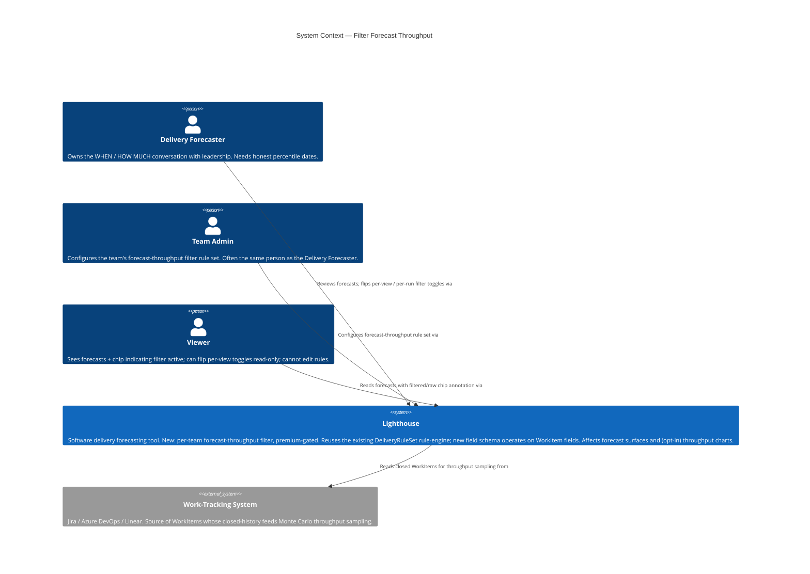
```mermaid
C4Context
    title System Context — Filter Forecast Throughput

    Person(forecaster, "Delivery Forecaster", "Owns the WHEN / HOW MUCH conversation with leadership. Needs honest percentile dates.")
    Person(teamAdmin, "Team Admin", "Configures the team's forecast-throughput filter rule set. Often the same person as the Delivery Forecaster.")
    Person(viewer, "Viewer", "Sees forecasts + chip indicating filter active; can flip per-view toggles read-only; cannot edit rules.")

    System(lighthouse, "Lighthouse", "Software delivery forecasting tool. New: per-team forecast-throughput filter, premium-gated. Reuses the existing DeliveryRuleSet rule-engine; new field schema operates on WorkItem fields. Affects forecast surfaces and (opt-in) throughput charts.")

    System_Ext(wts, "Work-Tracking System", "Jira / Azure DevOps / Linear. Source of WorkItems whose closed-history feeds Monte Carlo throughput sampling.")

    Rel(forecaster, lighthouse, "Reviews forecasts; flips per-view / per-run filter toggles via")
    Rel(teamAdmin, lighthouse, "Configures forecast-throughput rule set via")
    Rel(viewer, lighthouse, "Reads forecasts with filtered/raw chip annotation via")
    Rel(lighthouse, wts, "Reads closed WorkItems for throughput sampling from")
```

---

## C4 Level 2 — Container (delta)

No new containers. The existing Frontend SPA, Backend API, Database, and E2E Test Runner all gain additive responsibilities — they exchange one new DTO shape (`forecastFilterRuleSetJson` on the team-settings round trip) and one new endpoint path (`/forecast-filter/schema`). The Backend API's persistence container gains one nullable JSON column on the `Teams` table.

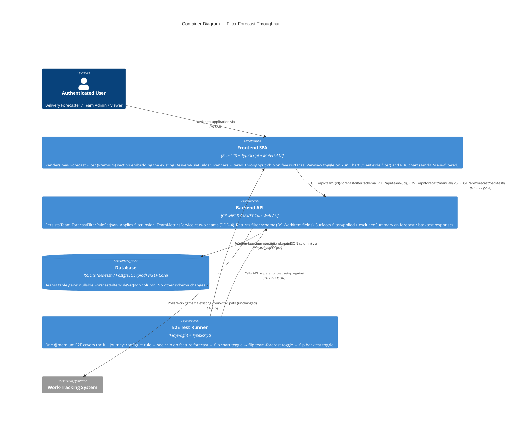
```mermaid
C4Container
    title Container Diagram — Filter Forecast Throughput

    Person(user, "Authenticated User", "Delivery Forecaster / Team Admin / Viewer")

    Container(spa, "Frontend SPA", "React 18 + TypeScript + Material UI", "Renders new Forecast Filter (Premium) section embedding the existing DeliveryRuleBuilder. Renders Filtered Throughput chip on five surfaces. Per-view toggle on Run Chart (client-side filter) and PBC chart (sends ?view=filtered).")
    Container(api, "Backend API", "C# .NET 8 ASP.NET Core Web API", "Persists Team.ForecastFilterRuleSetJson. Applies filter inside ITeamMetricsService at two seams (DDD-4). Returns filter schema (D9 WorkItem fields). Surfaces filterApplied + excludedSummary on forecast / backtest responses.")
    ContainerDb(db, "Database", "SQLite (dev/test) / PostgreSQL (prod) via EF Core", "Teams table gains nullable ForecastFilterRuleSetJson column. No other schema changes.")
    Container(e2e, "E2E Test Runner", "Playwright + TypeScript", "One @premium E2E covers the full journey: configure rule → see chip on feature forecast → flip chart toggle → flip team-forecast toggle → flip backtest toggle.")

    System_Ext(wts, "Work-Tracking System")

    Rel(user, spa, "Navigates application via", "HTTPS")
    Rel(spa, api, "GET /api/team/{id}/forecast-filter/schema, PUT /api/team/{id}, POST /api/forecast/manual/{id}, POST /api/forecast/backtest/{id}, GET /api/teamMetrics/{id}/throughput, GET /api/teamMetrics/{id}/throughput/pbc?view=", "HTTPS / JSON")
    Rel(api, db, "Reads/writes Team entity (incl. new JSON column) via", "EF Core")
    Rel(api, wts, "Polls WorkItems via existing connector path (unchanged)", "HTTPS")
    Rel(e2e, spa, "Drives browser interactions against", "Playwright CDP")
    Rel(e2e, api, "Calls API helpers for test setup against", "HTTPS / JSON")
```

---

## C4 Level 3 — Component: Rule-Engine and Forecast-Filter Domain

The rule-engine generalisation (ADR-012) is the architecturally significant subsystem of this feature. This diagram makes the new ports / adapters and the delegation paths explicit, and shows the single-seam filter application inside `TeamMetricsService` (DDD-4).

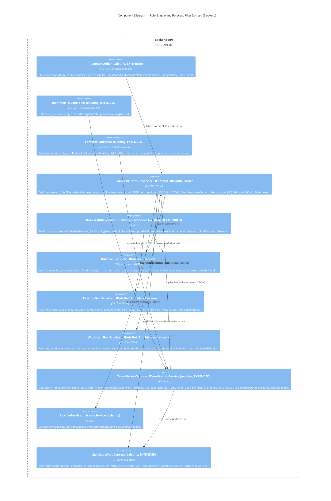
```mermaid
C4Component
    title Component Diagram — Rule-Engine and Forecast-Filter Domain (Backend)

    Container_Boundary(api, "Backend API") {
        Component(teamCtrl, "TeamController (existing, EXTENDED)", "ASP.NET Core ApiController", "PUT /api/team/{id} accepts forecastFilterRuleSetJson; GET /api/team/{id}/forecast-filter/schema is new. Both gated by [RbacGuard].")
        Component(metricsCtrl, "TeamMetricsController (existing, EXTENDED)", "ASP.NET Core ApiController", "GET /throughput unchanged; GET /throughput/pbc gains ?view=raw|filtered.")
        Component(forecastCtrl, "ForecastController (existing, EXTENDED)", "ASP.NET Core ApiController", "RunManualForecastAsync + RunBacktest accept optional applyFilterOverride; responses gain filterApplied + excludedSummary.")

        Component(filterSvc, "ForecastFilterRuleService : IForecastFilterRuleService", "C# class (NEW)", "GetSchema(team); GetEffectiveRuleSet(team) returns null on free tenant / null JSON / zero conditions (DDD-8 + DDD-9); Filter(items, ruleSet) excludes matched (D8); ValidateRuleSet(ruleSet, team).")
        Component(deliverySvc, "DeliveryRuleService : IDeliveryRuleService (existing, REFACTORED)", "C# class", "Public surface preserved (GetRuleSchema, GetMatchingFeaturesForRuleset, RecomputeRuleBasedDeliveries). Internals now delegate to RuleEvaluator<Feature>.")

        Component(evaluator, "RuleEvaluator<T> : IRuleEvaluator<T>", "C# generic class (NEW)", "Pure function. Match(ruleSet, items, fieldProvider) → matched items. IsValid(ruleSet, schema) → bool. NO I/O dependencies (enforced by ArchUnitNET).")
        Component(featureProv, "FeatureFieldProvider : IRuleFieldProvider<Feature>", "C# class (NEW)", "Field keys: feature.type / feature.state / feature.name / feature.referenceid / feature.parentreferenceid / feature.tags / additionalField.{id}.")
        Component(workItemProv, "WorkItemFieldProvider : IRuleFieldProvider<WorkItem>", "C# class (NEW)", "Field keys: workitem.type / workitem.state / workitem.name / workitem.referenceid / workitem.parentreferenceid / workitem.tags / additionalField.{id}.")

        Component(metricsSvc, "TeamMetricsService : ITeamMetricsService (existing, EXTENDED)", "C# class", "GetCurrentThroughputForTeamForecast(team, mode) AND GetBlackoutAwareThroughputForTeam(team, start, end, mode) apply the filter when mode demands it. Single seam (DDD-4). Cache key includes mode.")

        Component(licenseSvc, "LicenseService : ILicenseService (existing)", "C# class", "CanUsePremiumFeatures() consulted by ForecastFilterRuleService.GetEffectiveRuleSet.")
        Component(efCtx, "LighthouseAppContext (existing, EXTENDED)", "EF Core DbContext", "Team entity adds nullable ForecastFilterRuleSetJson column. Migration generated via CreateMigration PowerShell (Sqlite + Postgres in lockstep).")
    }

    Rel(teamCtrl, filterSvc, "validates rule set / fetches schema via")
    Rel(metricsCtrl, metricsSvc, "queries throughput PBC via (passes mode)")
    Rel(forecastCtrl, metricsSvc, "fetches throughput vector via (passes mode)")

    Rel(filterSvc, evaluator, "matches WorkItems via")
    Rel(filterSvc, workItemProv, "uses for field access")
    Rel(filterSvc, licenseSvc, "checks premium gate via (DDD-9)")
    Rel(filterSvc, efCtx, "reads Team.ForecastFilterRuleSetJson via")

    Rel(deliverySvc, evaluator, "matches Features via")
    Rel(deliverySvc, featureProv, "uses for field access")

    Rel(metricsSvc, filterSvc, "applies filter at the two seams (DDD-4)")
    Rel(metricsSvc, efCtx, "reads closed WorkItems via")
```

The diagram makes three architectural commitments visible:

1. **Single shared evaluator** (`RuleEvaluator<T>`) — the same algorithmic code path handles both Feature and WorkItem rule evaluation; bug fixes / operator additions land in one place (ADR-012).
2. **Single filter seam** (`TeamMetricsService` — and nothing else — calls `IForecastFilterRuleService.Filter`); enforced by ArchUnitNET (DDD-4).
3. **Single license gate for this feature** (`ForecastFilterRuleService.GetEffectiveRuleSet`); enforced by ArchUnitNET (DDD-9).

---

# C4 Architecture Diagrams — time-in-state-and-staleness

Feature: time-in-state-and-staleness (Epic 4144 MVP bundle, slice A+B1+D)
Wave: DESIGN
Date: 2026-05-24
Architect: Morgan (Solution Architect), interaction mode = PROPOSE

---

## C4 Level 1 — System Context (delta)

The Lighthouse system context (RBAC + OAuth + filter-forecast-throughput baselines) is unchanged. This feature adds **no** new external actors and **no** new external systems. It introduces a focus persona — `Flow Coach` — already represented across the RBAC personas, and clarifies the read-side relationship with the existing work-tracking systems: Lighthouse now CAPTURES state-transition history (where the source exposes it) rather than only deriving Started / Closed boundary dates.

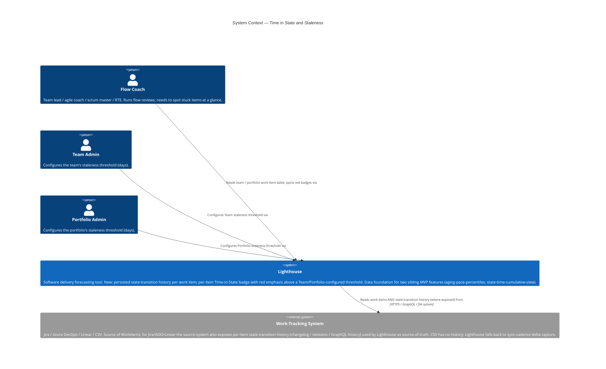
```mermaid
C4Context
    title System Context — Time in State and Staleness

    Person(coach, "Flow Coach", "Team lead / agile coach / scrum master / RTE. Runs flow reviews; needs to spot stuck items at a glance.")
    Person(teamAdmin, "Team Admin", "Configures the team's staleness threshold (days).")
    Person(portfolioAdmin, "Portfolio Admin", "Configures the portfolio's staleness threshold (days).")

    System(lighthouse, "Lighthouse", "Software delivery forecasting tool. New: persisted state-transition history per work item; per-item Time-in-State badge with red emphasis above a Team/Portfolio-configured threshold. Data foundation for two sibling MVP features (aging-pace-percentiles, state-time-cumulative-view).")

    System_Ext(wts, "Work-Tracking System", "Jira / Azure DevOps / Linear / CSV. Source of WorkItems; for Jira/ADO/Linear the source-system also exposes per-item state-transition history (changelog / revisions / GraphQL history) used by Lighthouse as source-of-truth. CSV has no history; Lighthouse falls back to sync-cadence delta capture.")

    Rel(coach, lighthouse, "Reads team / portfolio work-item table; spots red badges via")
    Rel(teamAdmin, lighthouse, "Configures Team staleness threshold via")
    Rel(portfolioAdmin, lighthouse, "Configures Portfolio staleness threshold via")
    Rel(lighthouse, wts, "Reads work items AND state-transition history (where exposed) from", "HTTPS / GraphQL / file system")
```

---

## C4 Level 2 — Container (delta)

No new containers. The existing Frontend SPA, Backend API, Database, and E2E Test Runner all gain additive responsibilities. The Database container gains one new table (`WorkItemStateTransitions`) and two new columns (`WorkItems.CurrentStateEnteredAt`, `WorkTrackingSystemOptionsOwner.StalenessThresholdDays`). The Backend API extends the existing sync-path inside `WorkItemService.RefreshWorkItems` and the existing `WorkItemDto` projection. The Frontend SPA extends the existing work-item-table column rendering and adds a `Staleness Threshold (days)` input on the Team and Portfolio settings forms.

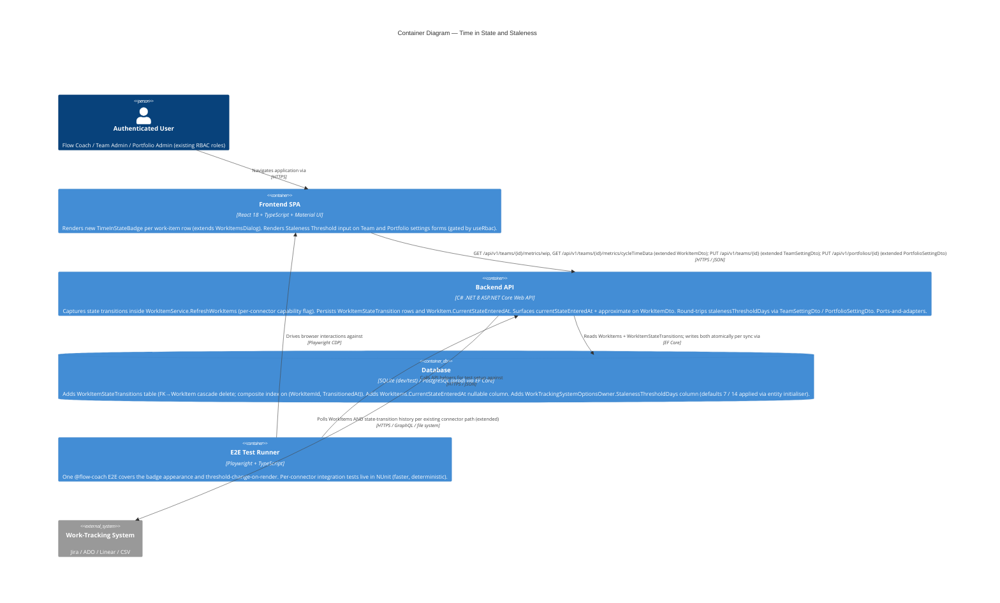
```mermaid
C4Container
    title Container Diagram — Time in State and Staleness

    Person(user, "Authenticated User", "Flow Coach / Team Admin / Portfolio Admin (existing RBAC roles)")

    Container(spa, "Frontend SPA", "React 18 + TypeScript + Material UI", "Renders new TimeInStateBadge per work-item row (extends WorkItemsDialog). Renders Staleness Threshold input on Team and Portfolio settings forms (gated by useRbac).")
    Container(api, "Backend API", "C# .NET 8 ASP.NET Core Web API", "Captures state transitions inside WorkItemService.RefreshWorkItems (per-connector capability flag). Persists WorkItemStateTransition rows and WorkItem.CurrentStateEnteredAt. Surfaces currentStateEnteredAt + approximate on WorkItemDto. Round-trips stalenessThresholdDays via TeamSettingDto / PortfolioSettingDto. Ports-and-adapters.")
    ContainerDb(db, "Database", "SQLite (dev/test) / PostgreSQL (prod) via EF Core", "Adds WorkItemStateTransitions table (FK→WorkItem cascade delete; composite index on (WorkItemId, TransitionedAt)). Adds WorkItems.CurrentStateEnteredAt nullable column. Adds WorkTrackingSystemOptionsOwner.StalenessThresholdDays column (defaults 7 / 14 applied via entity initialiser).")
    Container(e2e, "E2E Test Runner", "Playwright + TypeScript", "One @flow-coach E2E covers the badge appearance and threshold-change-on-render. Per-connector integration tests live in NUnit (faster, deterministic).")

    System_Ext(wts, "Work-Tracking System", "Jira / ADO / Linear / CSV")

    Rel(user, spa, "Navigates application via", "HTTPS")
    Rel(spa, api, "GET /api/v1/teams/{id}/metrics/wip, GET /api/v1/teams/{id}/metrics/cycleTimeData (extended WorkItemDto); PUT /api/v1/teams/{id} (extended TeamSettingDto); PUT /api/v1/portfolios/{id} (extended PortfolioSettingDto)", "HTTPS / JSON")
    Rel(api, db, "Reads WorkItems + WorkItemStateTransitions; writes both atomically per sync via", "EF Core")
    Rel(api, wts, "Polls WorkItems AND state-transition history per existing connector path (extended)", "HTTPS / GraphQL / file system")
    Rel(e2e, spa, "Drives browser interactions against", "Playwright CDP")
    Rel(e2e, api, "Calls API helpers for test setup against", "HTTPS / JSON")
```

---

## C4 Level 3 — Component: Transition Capture and Time-in-State Domain

The transition-capture dispatch (ADR-017) is the architecturally significant subsystem of this feature. This diagram makes the capability-flag dispatch, the single-seam invariant (`WorkItemService.RefreshWorkItems` is the only writer), and the consumer-facing repository surface explicit.

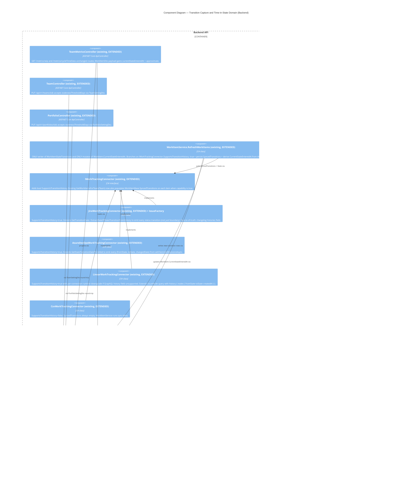
```mermaid
C4Component
    title Component Diagram — Transition Capture and Time-in-State Domain (Backend)

    Container_Boundary(api, "Backend API") {
        Component(teamMetricsCtrl, "TeamMetricsController (existing, EXTENDED)", "ASP.NET Core ApiController", "GET /metrics/wip and /metrics/cycleTimeData unchanged routes; WorkItemDto payload gains currentStateEnteredAt + approximate.")
        Component(teamCtrl, "TeamController (existing, EXTENDED)", "ASP.NET Core ApiController", "PUT /api/v1/teams/{id} accepts stalenessThresholdDays via TeamSettingDto.")
        Component(portfolioCtrl, "PortfolioController (existing, EXTENDED)", "ASP.NET Core ApiController", "PUT /api/v1/portfolios/{id} accepts stalenessThresholdDays via PortfolioSettingDto.")

        Component(workItemSvc, "WorkItemService.RefreshWorkItems (existing, EXTENDED)", "C# class", "ONLY writer of WorkItemStateTransitions and ONLY mutator of WorkItem.CurrentStateEnteredAt. Branches on IWorkTrackingConnector.SupportsTransitionHistory: true = persist SyncedTransitions + derive CurrentStateEnteredAt from them; false = sync-delta synthetic transition with TransitionedAt = UtcNow. All writes flush in one SaveChangesAsync.")

        Component(connectorPort, "IWorkTrackingConnector (existing, EXTENDED)", "C# interface", "Adds bool SupportsTransitionHistory. Existing GetWorkItemsForTeam(Team) now also populates WorkItemBase.SyncedTransitions on each item when capability is true.")
        Component(jiraConn, "JiraWorkTrackingConnector (existing, EXTENDED) + IssueFactory", "C# class", "SupportsTransitionHistory=true. Extends GetTransitionDate / ExtractDateOfStateTransitionFromHistory to emit every status transition (not just boundary). Source-of-truth: changelog histories field.")
        Component(adoConn, "AzureDevOpsWorkTrackingConnector (existing, EXTENDED)", "C# class", "SupportsTransitionHistory=true. Extends GetStateTransitionDateThrottled to emit every (fromState, toState, changedDate) from witClient.GetRevisionsAsync.")
        Component(linearConn, "LinearWorkTrackingConnector (existing, EXTENDED)", "C# class", "SupportsTransitionHistory=true with per-connection runtime downgrade if GraphQL history field unsupported. Extends IssueNode query with history { nodes { fromState toState createdAt } }.")
        Component(csvConn, "CsvWorkTrackingConnector (existing, EXTENDED)", "C# class", "SupportsTransitionHistory=false. SyncedTransitions always empty; WorkItemService runs sync-delta.")

        Component(transitionRepo, "IWorkItemStateTransitionRepository + WorkItemStateTransitionRepository", "C# port + impl (NEW)", "Extends IRepository<WorkItemStateTransition>. Sole abstraction layer for sibling MVP consumers (aging-pace-percentiles, state-time-cumulative-view).")
        Component(workItemRepo, "IWorkItemRepository (existing, NO CHANGE)", "C# port", "Continues to expose WorkItem read/write — WorkItem.CurrentStateEnteredAt is a plain property, no new repository method needed.")
        Component(efCtx, "LighthouseAppContext (existing, EXTENDED)", "EF Core DbContext", "Adds DbSet<WorkItemStateTransition> with FK→WorkItem cascade delete and composite index (WorkItemId, TransitionedAt). Existing UtcDateTimeConverter applied automatically.")

        Component(workItemDto, "WorkItemDto (existing, EXTENDED)", "C# record/class", "Gains CurrentStateEnteredAt: DateTime?, Approximate: bool.")
        Component(settingsBase, "SettingsOwnerDtoBase (existing, EXTENDED)", "C# class", "Gains StalenessThresholdDays: int.")
    }

    Rel(teamMetricsCtrl, workItemRepo, "reads via")
    Rel(teamMetricsCtrl, workItemDto, "projects via")
    Rel(teamCtrl, settingsBase, "via TeamSettingDto round-trip")
    Rel(portfolioCtrl, settingsBase, "via PortfolioSettingDto round-trip")

    Rel(workItemSvc, connectorPort, "polls SyncedTransitions + State via")
    Rel(workItemSvc, transitionRepo, "writes new transition rows via")
    Rel(workItemSvc, workItemRepo, "updates WorkItem.CurrentStateEnteredAt via")

    Rel(jiraConn, connectorPort, "implements")
    Rel(adoConn, connectorPort, "implements")
    Rel(linearConn, connectorPort, "implements")
    Rel(csvConn, connectorPort, "implements")

    Rel(transitionRepo, efCtx, "reads / writes WorkItemStateTransitions via")
    Rel(workItemRepo, efCtx, "reads / writes WorkItems via")
```

The diagram makes four architectural commitments visible:

1. **Single capture seam** — `WorkItemService.RefreshWorkItems` is the only mutator of `WorkItem.CurrentStateEnteredAt` and the only writer of `WorkItemStateTransition` rows (ADR-016 + ADR-017; ArchUnitNET-enforced).
2. **Capability-flagged dispatch** — `IWorkTrackingConnector.SupportsTransitionHistory` is the single branch point. Adding a 5th connector means implementing the interface and setting the flag — zero touches to `WorkItemService.RefreshWorkItems` (ADR-017).
3. **Standalone transition entity** — `WorkItem` holds NO transition navigation; the work-item-table read path loads zero transition rows (ADR-015; ArchUnitNET-enforced).
4. **Consumer-facing surface is the repository, not a service** — sibling MVP DESIGNs (`aging-pace-percentiles`, `state-time-cumulative-view`) consume `IWorkItemStateTransitionRepository` directly. No shared `IPerStateAggregationService` is introduced (ADR-018; rationale documented for future readers).

---

# C4 Architecture Diagrams — aging-pace-percentiles

Feature: aging-pace-percentiles (Epic 4144 MVP bundle, slice F)
Wave: DESIGN
Date: 2026-05-24
Architect: Morgan (Solution Architect), interaction mode = PROPOSE

---

## C4 Level 1 — System Context (delta)

The Lighthouse system context (RBAC + OAuth + filter-forecast-throughput + time-in-state-and-staleness baselines) is unchanged. This feature adds **no** new external actors and **no** new external systems. The `Flow Coach` persona already introduced by sibling 1 retains the same chart-glance relationship with Lighthouse; the secondary `Delivery Forecaster` persona (already present in `docs/product/personas/`) consumes the same chart in forecast-conversation contexts. The chart-glance question this feature enables ("which in-flight items are pacing slower than 85% of historical items for their current state?") sits inside the existing read-only relationship; no new outbound integration.

No L1 diagram is added — the System Context from sibling 1 (time-in-state-and-staleness) covers this feature's actors and systems unchanged.

---

## C4 Level 2 — Container (delta)

No new containers. The existing Frontend SPA and Backend API gain additive responsibilities — Backend API gains two new endpoints (team + portfolio); Frontend SPA gains a new chart overlay, a new legend chip group, and a new per-dot tooltip annotation. The Database container is unchanged — no schema additions (sibling 1's `WorkItemStateTransitions` table and `WorkItem.CurrentStateEnteredAt` column are consumed read-only). The E2E Test Runner gains one new spec.

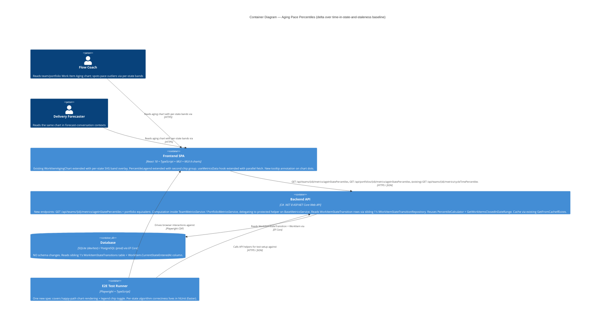
```mermaid
C4Container
    title Container Diagram — Aging Pace Percentiles (delta over time-in-state-and-staleness baseline)

    Person(coach, "Flow Coach", "Reads team/portfolio Work Item Aging chart; spots pace outliers via per-state bands")
    Person(forecaster, "Delivery Forecaster", "Reads the same chart in forecast-conversation contexts")

    Container(spa, "Frontend SPA", "React 18 + TypeScript + MUI + MUI-X-charts", "Existing WorkItemAgingChart extended with per-state SVG band overlay. PercentileLegend extended with second chip group. useMetricsData hook extended with parallel fetch. New tooltip annotation on chart dots.")
    Container(api, "Backend API", "C# .NET 8 ASP.NET Core Web API", "New endpoints: GET /api/teams/{id}/metrics/ageInStatePercentiles + portfolio equivalent. Computation inside TeamMetricsService / PortfolioMetricsService, delegating to protected helper on BaseMetricsService. Reads WorkItemStateTransition rows via sibling 1's IWorkItemStateTransitionRepository. Reuses PercentileCalculator + GetWorkItemsClosedInDateRange. Cache via existing GetFromCacheIfExists.")
    ContainerDb(db, "Database", "SQLite (dev/test) / PostgreSQL (prod) via EF Core", "NO schema changes. Reads sibling 1's WorkItemStateTransitions table + WorkItem.CurrentStateEnteredAt column.")
    Container(e2e, "E2E Test Runner", "Playwright + TypeScript", "One new spec covers happy-path chart-rendering + legend chip toggle. Per-state algorithm correctness lives in NUnit (faster).")

    Rel(coach, spa, "Reads aging chart with per-state bands via", "HTTPS")
    Rel(forecaster, spa, "Reads aging chart with per-state bands via", "HTTPS")
    Rel(spa, api, "GET /api/teams/{id}/metrics/ageInStatePercentiles, GET /api/portfolios/{id}/metrics/ageInStatePercentiles, (existing) GET /api/teams/{id}/metrics/cycleTimePercentiles", "HTTPS / JSON")
    Rel(api, db, "Reads WorkItemStateTransition + WorkItem via", "EF Core")
    Rel(e2e, spa, "Drives browser interactions against", "Playwright CDP")
    Rel(e2e, api, "Calls API helpers for test setup against", "HTTPS / JSON")
```

---

## C4 Level 3 — Component: Per-State Percentile Computation and Chart-Overlay Domain

The per-state percentile computation (ADR-019) + the SVG-overlay chart rendering (ADR-020) + the ADR-018 disposition (ADR-021) are the three architecturally significant decisions for this feature. This diagram makes the consumer-side surfaces explicit: the per-state computation flows through the existing `BaseMetricsService` inheritance; the chart-overlay flows through the existing `<ChartsContainer>` coordinate system; the repository seam (sibling 1's `IWorkItemStateTransitionRepository`) is the only data-layer touchpoint.

```mermaid
C4Component
    title Component Diagram — Aging Pace Percentiles (Backend + Frontend)

    Container_Boundary(api, "Backend API") {
        Component(teamMetricsCtrl, "TeamMetricsController (existing, EXTENDED)", "ASP.NET Core ApiController", "GET /metrics/cycleTimePercentiles unchanged. New: GET /metrics/ageInStatePercentiles?startDate&endDate. Validation + auth mirror cycleTimePercentiles. RbacGuard(TeamRead).")
        Component(portfolioMetricsCtrl, "PortfolioMetricsController (existing, EXTENDED)", "ASP.NET Core ApiController", "Mirror endpoint for portfolio scope. RbacGuard(PortfolioRead).")
        Component(teamMetricsSvc, "TeamMetricsService (existing, EXTENDED)", "C# class", "New method GetAgeInStatePercentilesForTeam: scope-specific 'completed items in window' query via existing GetWorkItemsClosedInDateRange, then delegates to BaseMetricsService.ComputeAgeInStatePercentiles, wraps in GetFromCacheIfExists with cache key AgeInStatePercentiles_{startDate}_{endDate}.")
        Component(portfolioMetricsSvc, "PortfolioMetricsService (existing, EXTENDED)", "C# class", "Mirror method for portfolio scope.")
        Component(baseMetricsSvc, "BaseMetricsService (existing, EXTENDED)", "C# class", "New PROTECTED helper ComputeAgeInStatePercentiles(completedItems, doingStates, requestedPercentiles): walks transitions via IWorkItemStateTransitionRepository.GetAllByPredicate, pairs entry→next-exit per state per ADR-019, buckets observations, calls PercentileCalculator per state per percentile. INTRA-INHERITANCE ONLY — not exposed via interface (ADR-021).")
        Component(percentileCalc, "PercentileCalculator (existing, REUSE-AS-IS)", "C# static class", "Nearest-rank algorithm with clamp. Same function used by cycleTimePercentiles — algorithmic parity per ADR-019.")
        Component(transitionRepo, "IWorkItemStateTransitionRepository (sibling 1, REUSE-AS-IS)", "C# port", "Consumed via GetAllByPredicate. No new methods added to the repository — DESIGN sibling 1 explicitly deferred extension to consumer DESIGNs; this DESIGN chose not to extend.")
        Component(workItemRepo, "IWorkItemRepository (existing, REUSE-AS-IS)", "C# port", "Used to resolve the team/portfolio's completed items in window via the existing GetWorkItemsClosedInDateRange predicate.")
        Component(ageInStateDto, "AgeInStatePercentilesDto (NEW)", "C# record", "record AgeInStatePercentilesDto(string State, int SampleSize, IReadOnlyList<PercentileValue> Percentiles). Returned by both endpoints as IReadOnlyList<>.")
        Component(percentileValue, "PercentileValue (existing, REUSE-AS-IS)", "C# class", "{ Percentile, Value }. Same type used by cycleTimePercentiles response.")
    }

    Container_Boundary(spa, "Frontend SPA") {
        Component(metricsServiceTs, "MetricsService.ts (existing, EXTENDED)", "TypeScript HTTP adapter", "New method getAgeInStatePercentiles(id, startDate, endDate) — mirrors getCycleTimePercentiles shape. Added to IMetricsService interface.")
        Component(useMetricsData, "useMetricsData (existing, EXTENDED)", "React hook", "Parallel fetch of ageInStatePercentiles alongside existing cycleTimePercentiles. New ctx field perStatePercentileValues.")
        Component(baseMetricsView, "BaseMetricsView (existing, EXTENDED)", "React component", "Passes perStatePercentileValues={ctx.perStatePercentileValues} to <WorkItemAgingChart>. Shared between team and portfolio routes.")
        Component(agingChart, "WorkItemAgingChart (existing, EXTENDED)", "React component", "New optional prop perStatePercentileValues. Custom SVG <line> overlay inside <ChartsContainer> per ADR-020 — anchored to state column index, dashed style matching CT bands. New tooltip annotation per dot per US-03 (client-side bucket computation from daysInState + per-state values).")
        Component(percentileLegend, "PercentileLegend (existing, EXTENDED)", "React component", "Renders SECOND chip group `Age-in-State %iles (per state)` alongside existing `Cycle Time %iles (overall)` group. Independent toggle state.")
        Component(useChartVis, "useChartVisibility (existing, EXTENDED)", "React hook", "Manages two independent visiblePercentiles maps (either signature-extended OR invoked twice — DDD-8).")
        Component(perStateModel, "IPerStatePercentileValues TS model (NEW)", "TypeScript interface", "{ state, sampleSize, percentiles: IPercentileValue[] }. Mirrors backend DTO.")
    }

    Rel(teamMetricsCtrl, teamMetricsSvc, "delegates to via GetEntityByIdAnExecuteAction")
    Rel(portfolioMetricsCtrl, portfolioMetricsSvc, "delegates to via GetEntityByIdAnExecuteAction")
    Rel(teamMetricsSvc, baseMetricsSvc, "calls ComputeAgeInStatePercentiles (inherited protected) via")
    Rel(portfolioMetricsSvc, baseMetricsSvc, "calls ComputeAgeInStatePercentiles (inherited protected) via")
    Rel(teamMetricsSvc, workItemRepo, "resolves completed-items-in-window via GetWorkItemsClosedInDateRange")
    Rel(portfolioMetricsSvc, workItemRepo, "resolves completed-items-in-window via")
    Rel(baseMetricsSvc, transitionRepo, "walks transitions via GetAllByPredicate")
    Rel(baseMetricsSvc, percentileCalc, "computes per-state percentiles via CalculatePercentile")
    Rel(baseMetricsSvc, percentileValue, "constructs response elements via")
    Rel(teamMetricsSvc, ageInStateDto, "projects response via")
    Rel(portfolioMetricsSvc, ageInStateDto, "projects response via")

    Rel(useMetricsData, metricsServiceTs, "fetches via getAgeInStatePercentiles + (existing) getCycleTimePercentiles in parallel")
    Rel(baseMetricsView, agingChart, "passes perStatePercentileValues prop to")
    Rel(agingChart, percentileLegend, "renders with two chip-group prop sets")
    Rel(agingChart, useChartVis, "manages two independent visibility maps via")
    Rel(useMetricsData, perStateModel, "populates ctx field as IPerStatePercentileValues[]")
    Rel(agingChart, perStateModel, "consumes via new prop")
```

The diagram makes four architectural commitments visible:

1. **Repository-only data seam** — `BaseMetricsService.ComputeAgeInStatePercentiles` reads transitions exclusively via sibling 1's `IWorkItemStateTransitionRepository` (`GetAllByPredicate`). No direct `DbSet<WorkItemStateTransition>` access; no raw SQL. ArchUnitNET-enforced (ADR-021 extending the ADR-015 rule).
2. **Inheritance-bound computation, not a new service** — the per-state walk lives as a `protected` helper inside the existing `BaseMetricsService`, consumed only by the two existing derived classes. No new interface, no new service, no `IPerStateAggregationService`. ArchUnitNET + NUnit-reflection-enforced (ADR-021).
3. **Algorithmic parity with `cycleTimePercentiles`** — same `PercentileCalculator`, same `GetWorkItemsClosedInDateRange` predicate, same `GetFromCacheIfExists` cache mechanism, same `PercentileValue` response type. NUnit-enforced (ADR-019).
4. **Backwards-compatible chart extension** — `WorkItemAgingChart` with `perStatePercentileValues` undefined renders identically to today; the per-state band SVG overlay is rendered inside the existing `<ChartsContainer>` coordinate system, not absolute-positioned over the chart. Vitest-enforced (ADR-020).

---

# C4 Architecture Diagrams — state-time-cumulative-view

Feature: state-time-cumulative-view (Epic 4144 MVP bundle, slice B3 — cumulative time-per-state horizontal-bar widget with stacked completed-vs-ongoing segments, US-01 tooltip counts, US-04 per-item drill-down dialog on bar click, US-05 in-chart item picker + adaptive display units)
Wave: DESIGN
Date: 2026-05-24 (amended 2026-05-26 — see "C4 Amend" subsection at the end for D13–D18 / ADR-028)
Architect: Morgan (Solution Architect), interaction mode = PROPOSE

---

## C4 Level 1 — System Context (delta)

The Lighthouse system context (RBAC + OAuth + filter-forecast-throughput + time-in-state-and-staleness + aging-pace-percentiles baselines) is unchanged. This feature adds **no** new external actors and **no** new external systems. The `Delivery Lead / RTE` persona introduced by this feature's DISCUSS (`docs/product/personas/delivery-lead-rte.yaml`) consumes the same chart-glance relationship with Lighthouse that the existing `Flow Coach` persona uses for sibling F — different decision shape (per-state systemic constraint vs per-state pace outlier), same data foundation, same read-only relationship.

No L1 diagram is added — the System Context from sibling 1 (time-in-state-and-staleness) covers this feature's actors and systems unchanged. The new `Delivery Lead / RTE` persona is a refinement-by-decomposition of the broader leadership audience already implicit in the prior System Contexts.

---

## C4 Level 2 — Container (delta)

No new containers. The existing Frontend SPA and Backend API gain additive responsibilities — Backend API gains four new endpoints (team + portfolio x bar + drill-down); Frontend SPA gains a new chart widget, a new drill-down dialog, a new RAG rule, and three new metadata entries (`categoryMetadata`, `widgetInfoMetadata`, `ragRules`). The Database container is unchanged — no schema additions (sibling 1's `WorkItemStateTransitions` table and `WorkItem.CurrentStateEnteredAt` column are consumed read-only, alongside the existing `WorkItem.State` / `StateCategory` fields). The E2E Test Runner gains one new spec.

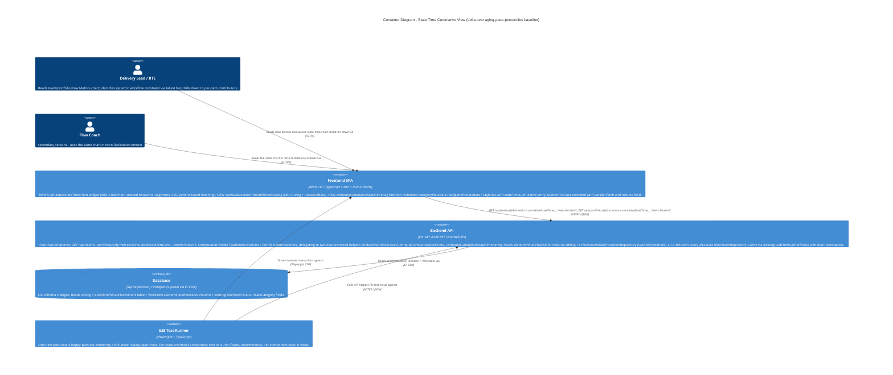
```mermaid
C4Container
    title Container Diagram - State-Time Cumulative View (delta over aging-pace-percentiles baseline)

    Person(rte, "Delivery Lead / RTE", "Reads team/portfolio Flow Metrics chart; identifies systemic workflow constraint via tallest bar; drills down to per-item contributors")
    Person(coach, "Flow Coach", "Secondary persona - uses the same chart in retro-facilitation context")

    Container(spa, "Frontend SPA", "React 18 + TypeScript + MUI + MUI-X-charts", "NEW CumulativeStateTimeChart widget (MUI-X BarChart, stacked horizontal segments, SVG pattern-based hatching). NEW CumulativeStateTimeDrillDownDialog (MUI Dialog + DataGridBase). NEW computeCumulativeStateTimeRag function. Extended categoryMetadata / widgetInfoMetadata / ragRules with stateTimeCumulative entry. useMetricsData extended with parallel fetch and new ctx field.")
    Container(api, "Backend API", "C# .NET 8 ASP.NET Core Web API", "Four new endpoints: GET /api/teams|portfolios/{id}/metrics/cumulativeStateTime and .../items?state=X. Computation inside TeamMetricsService / PortfolioMetricsService, delegating to two new protected helpers on BaseMetricsService (ComputeCumulativeStateTime, ComputeCumulativeStateTimeItems). Reads WorkItemStateTransition rows via sibling 1's IWorkItemStateTransitionRepository (GetAllByPredicate). D12 inclusion query also uses IWorkItemRepository. Cache via existing GetFromCacheIfExists with new namespaces.")
    ContainerDb(db, "Database", "SQLite (dev/test) / PostgreSQL (prod) via EF Core", "NO schema changes. Reads sibling 1's WorkItemStateTransitions table + WorkItem.CurrentStateEnteredAt column + existing WorkItem.State / StateCategory fields.")
    Container(e2e, "E2E Test Runner", "Playwright + TypeScript", "One new spec covers happy-path bar-rendering + drill-down dialog open/close. Per-state arithmetic correctness lives in NUnit (faster, deterministic). Per-component tests in Vitest.")

    Rel(rte, spa, "Reads Flow Metrics cumulative-state-time chart and drills down via", "HTTPS")
    Rel(coach, spa, "Reads the same chart in retro-facilitation contexts via", "HTTPS")
    Rel(spa, api, "GET /api/teams/{id}/metrics/cumulativeStateTime, .../items?state=X, GET /api/portfolios/{id}/metrics/cumulativeStateTime, .../items?state=X", "HTTPS / JSON")
    Rel(api, db, "Reads WorkItemStateTransition + WorkItem via", "EF Core")
    Rel(e2e, spa, "Drives browser interactions against", "Playwright CDP")
    Rel(e2e, api, "Calls API helpers for test setup against", "HTTPS / JSON")
```

---

## C4 Level 3 - Component: Per-State Cumulative Computation, Chart Widget, and Drill-Down Domain

The per-state cumulative computation (ADR-022), the drill-down endpoint shape and dialog primitive (ADR-023), the ADR-018+021 disposition (ADR-024), and the new chart widget structure (ADR-025) are the four architecturally significant decisions for this feature. This diagram makes the consumer-side surfaces explicit: the cumulative-time computation flows through the existing `BaseMetricsService` inheritance (parallel to sibling F's `ComputeAgeInStatePercentiles`); the chart is a NEW MUI-X `<BarChart>`-based widget (not an extension of an existing chart); the drill-down dialog is a NEW MUI `Dialog`-based component mirroring `WorkItemsDialog`'s structural pattern; the repository seam (sibling 1's `IWorkItemStateTransitionRepository`) is the only data-layer touchpoint.

```mermaid
C4Component
    title Component Diagram - State-Time Cumulative View (Backend + Frontend)

    Container_Boundary(api, "Backend API") {
        Component(teamMetricsCtrl, "TeamMetricsController (existing, EXTENDED)", "ASP.NET Core ApiController", "Two new endpoints: GET /metrics/cumulativeStateTime and /metrics/cumulativeStateTime/items?state=X. Validation mirrors cycleTimePercentiles (startDate.Date <= endDate.Date; additionally state is required and non-empty for the items endpoint). RbacGuard(TeamRead) at class level.")
        Component(portfolioMetricsCtrl, "PortfolioMetricsController (existing, EXTENDED)", "ASP.NET Core ApiController", "Mirror endpoints for portfolio scope. RbacGuard(PortfolioRead).")
        Component(teamMetricsSvc, "TeamMetricsService (existing, EXTENDED)", "C# class", "New methods: GetCumulativeStateTimeForTeam, GetCumulativeStateTimeItemsForTeam. Resolves D12 included-items query via IWorkItemRepository + IWorkItemStateTransitionRepository, then delegates to BaseMetricsService.ComputeCumulativeStateTime / ComputeCumulativeStateTimeItems. Wraps in GetFromCacheIfExists with cache keys CumulativeStateTime_{startDate}_{endDate} and CumulativeStateTime_Items_{state}_{startDate}_{endDate}.")
        Component(portfolioMetricsSvc, "PortfolioMetricsService (existing, EXTENDED)", "C# class", "Mirror methods for portfolio scope.")
        Component(baseMetricsSvc, "BaseMetricsService (existing, EXTENDED)", "C# class", "Two new PROTECTED helpers: ComputeCumulativeStateTime(includedItems, getTransitionsForItem, workflowStatesInOrder, nowSnapshot) and ComputeCumulativeStateTimeItems(includedItems, getTransitionsForItem, selectedState, nowSnapshot). Per ADR-022 algorithm: walks transitions via the delegate, sums per-visit durations, sums in-flight contributions for current-state items, returns segment-split arrays. Uses PercentileCalculator for median per state. INTRA-INHERITANCE ONLY - not exposed via interface (ADR-024). Lives alongside sibling F's ComputeAgeInStatePercentiles helper.")
        Component(transitionRepo, "IWorkItemStateTransitionRepository (sibling 1, REUSE-AS-IS)", "C# port", "Consumed via GetAllByPredicate. No new methods added; ADR-024 confirms repository-only data seam.")
        Component(workItemRepo, "IWorkItemRepository (existing, REUSE-AS-IS)", "C# port", "Used for D12 inclusion-rule candidate resolution: items by transition-intersection AND items by in-flight-at-windowEnd.")
        Component(percentileCalc, "PercentileCalculator (existing, REUSE-AS-IS)", "C# static class", "Reused for median-per-state computation in ADR-022 #7 - algorithmic parity with cycleTimePercentiles and ageInStatePercentiles.")
        Component(cumDto, "CumulativeStateTimeDto + CumulativeStateTimeStateRowDto (NEW)", "C# records", "Bar response DTO: { states: [{ state, workflowOrder, totalDays, completedContributionDays, ongoingContributionDays, itemCount, completedItemCount, ongoingItemCount, meanDays, medianDays }] }.")
        Component(cumItemsDto, "CumulativeStateTimeItemsDto + CumulativeStateTimeItemRowDto (NEW)", "C# records", "Drill-down response DTO: { state, items: [{ workItemId, title, workItemType, currentState, daysContributed }] }, sorted by daysContributed desc.")
    }

    Container_Boundary(spa, "Frontend SPA") {
        Component(metricsServiceTs, "MetricsService.ts (existing, EXTENDED)", "TypeScript HTTP adapter", "Four new methods: getCumulativeStateTimeForTeam, getCumulativeStateTimeForPortfolio, getCumulativeStateTimeItemsForTeam, getCumulativeStateTimeItemsForPortfolio. Added to IMetricsService interface.")
        Component(useMetricsData, "useMetricsData (existing, EXTENDED)", "React hook", "Parallel fetch of cumulativeStateTime (bar data) alongside existing cycleTimePercentiles + ageInStatePercentiles. New ctx field cumulativeStateTime: ICumulativeStateTimeResponse | null. Drill-down items fetched lazily on bar click - not in the hook.")
        Component(baseMetricsView, "BaseMetricsView (existing, EXTENDED)", "React component", "New widget dispatch entry for widgetKey 'stateTimeCumulative' renders <CumulativeStateTimeChart>. The chart's onBarClick handler is wired to a local state that triggers the drill-down fetch via MetricsService and opens the dialog. Shared between team and portfolio routes.")
        Component(cumChart, "CumulativeStateTimeChart (NEW)", "React component", "MUI-X <BarChart> with horizontal layout, stacked completed/ongoing series, SVG <pattern>-based hatching for the ongoing series. Tooltip shows totalDays + segment split + counts + mean + median + US-03 inclusion-breakdown line + full-duration attribution clarification. Bar onClick fires onBarClick(stateName).")
        Component(cumDrillDialog, "CumulativeStateTimeDrillDownDialog (NEW)", "React component", "MUI Dialog + DialogTitle + DialogContent wrapping a DataGridBase table. Columns: Work Item ID (linkable), Title, Type, Current State, Days Contributed. Default sort: Days Contributed descending. ARIA role='dialog', focus trap, Escape closes. Mirrors WorkItemsDialog's structural pattern but with a distinct data model.")
        Component(catMeta, "categoryMetadata.ts (existing, EXTENDED)", "TypeScript module", "New entry { widgetKey: 'stateTimeCumulative', size: 'large' } in flow-metrics list. No ownerFilter - renders in both team and portfolio scopes.")
        Component(widgetInfo, "widgetInfoMetadata.ts (existing, EXTENDED)", "TypeScript module", "New entry stateTimeCumulative with description, RAG status guidance, learn-more URL.")
        Component(ragRules, "ragRules.ts (existing, EXTENDED)", "TypeScript module", "New function computeCumulativeStateTimeRag returning green (<=40%) / amber (40-60%) / red (>60%) based on the percent of total cumulative time captured by the single most-time-consuming state.")
        Component(cumModels, "ICumulativeStateTimeStateRow + ICumulativeStateTimeResponse + ICumulativeStateTimeItemRow + ICumulativeStateTimeItemsResponse (NEW)", "TypeScript interfaces", "Mirror backend DTOs.")
        Component(dataGrid, "DataGridBase (existing, REUSE-AS-IS)", "React component", "Reused by CumulativeStateTimeDrillDownDialog for the table. Provides column sorting, keyboard navigation, ARIA roles, visual style.")
    }

    Rel(teamMetricsCtrl, teamMetricsSvc, "delegates to via GetEntityByIdAnExecuteAction")
    Rel(portfolioMetricsCtrl, portfolioMetricsSvc, "delegates to via GetEntityByIdAnExecuteAction")
    Rel(teamMetricsSvc, baseMetricsSvc, "calls ComputeCumulativeStateTime + ComputeCumulativeStateTimeItems (inherited protected) via")
    Rel(portfolioMetricsSvc, baseMetricsSvc, "calls ComputeCumulativeStateTime + ComputeCumulativeStateTimeItems (inherited protected) via")
    Rel(teamMetricsSvc, workItemRepo, "resolves D12 inclusion-rule candidates via GetAllByPredicate")
    Rel(portfolioMetricsSvc, workItemRepo, "resolves D12 inclusion-rule candidates via")
    Rel(teamMetricsSvc, transitionRepo, "passes transition-fetcher delegate sourcing GetAllByPredicate to the helper")
    Rel(portfolioMetricsSvc, transitionRepo, "passes transition-fetcher delegate to the helper")
    Rel(baseMetricsSvc, percentileCalc, "computes median per state via CalculatePercentile(values, 50)")
    Rel(teamMetricsSvc, cumDto, "projects bar response via")
    Rel(teamMetricsSvc, cumItemsDto, "projects drill-down response via")
    Rel(portfolioMetricsSvc, cumDto, "projects bar response via")
    Rel(portfolioMetricsSvc, cumItemsDto, "projects drill-down response via")

    Rel(useMetricsData, metricsServiceTs, "fetches bar data via getCumulativeStateTimeForTeam / ForPortfolio")
    Rel(baseMetricsView, useMetricsData, "consumes ctx.cumulativeStateTime to feed <CumulativeStateTimeChart>")
    Rel(baseMetricsView, cumChart, "renders with bar data; wires onBarClick to drill-down fetch + dialog open")
    Rel(baseMetricsView, cumDrillDialog, "renders with state + resolved items on bar click")
    Rel(baseMetricsView, metricsServiceTs, "fetches drill-down items on click via getCumulativeStateTimeItemsForTeam / ForPortfolio")
    Rel(cumDrillDialog, dataGrid, "renders the per-item table via")
    Rel(catMeta, baseMetricsView, "supplies widget placement and ownerFilter rules to")
    Rel(widgetInfo, baseMetricsView, "supplies description + RAG status guidance to")
    Rel(ragRules, baseMetricsView, "supplies computeCumulativeStateTimeRag for the widget shell to")
    Rel(useMetricsData, cumModels, "populates ctx field as ICumulativeStateTimeResponse")
    Rel(cumChart, cumModels, "consumes via props")
    Rel(cumDrillDialog, cumModels, "consumes via props")
```

The diagram makes five architectural commitments visible:

1. **Repository-only data seam** - `BaseMetricsService.ComputeCumulativeStateTime` and `ComputeCumulativeStateTimeItems` read transitions exclusively via sibling 1's `IWorkItemStateTransitionRepository` (`GetAllByPredicate`) passed as a delegate; D12 inclusion-rule candidates resolve via `IWorkItemRepository.GetAllByPredicate`. No direct `DbSet<WorkItemStateTransition>` access; no raw SQL. ArchUnitNET-enforced (ADR-024 extending the ADR-015 rule).
2. **Inheritance-bound computation, not a new service** - the two new helpers live as `protected` methods inside the existing `BaseMetricsService`, alongside sibling F's `ComputeAgeInStatePercentiles`. No new interface, no new service, no `IPerStateAggregationService`. Three-way convergence (ADR-018 + ADR-021 + ADR-024).
3. **NEW chart widget, not an extension** - `CumulativeStateTimeChart` is a new component using MUI-X `<BarChart>` with stacked horizontal bars and SVG `<pattern>`-based hatching. Does NOT extend `WorkItemAgingChart` (different data shape, different question). Widget registration follows the established pattern (`categoryMetadata` + `widgetInfoMetadata` + `ragRules` + `BaseMetricsView` dispatch).
4. **Separate drill-down endpoint and Dialog primitive** - drill-down rows are NOT included in the bar endpoint payload (no `?expand=items` parameter); they are fetched lazily via a separate `/cumulativeStateTime/items?state=X` endpoint on bar click. The dialog is MUI `Dialog` (modal), following the `WorkItemsDialog` precedent for "table-from-chart-click" interactions - no `Drawer` exists in the codebase.
5. **Sum-equals-bar-height invariant by construction** - the drill-down endpoint's `Sum daysContributed` over rows equals the bar endpoint's `totalDays[state]` within +-0.1d tolerance because both endpoints compute the same per-item formula and sum in different orders. Integration-test-enforced (ADR-022).

---

## C4 Amend (2026-05-26 — D13–D18, ADR-028)

The 2026-05-24 diagrams above remain valid for the math, drill-down, no-shared-service, and chart-widget decisions. The amend (ADR-028) adds the US-05 item picker, the `candidates` endpoint per scope, the optional `itemIds` subset filter on the bar+items endpoints, the adaptive-unit `formatDuration` util, and the US-03→US-01 tooltip reframe. L1 is unchanged (no new actors/systems; the `product-owner` secondary persona is the absorbed-B2 deep-dive actor, a refinement of the existing leadership audience). L2 gains two endpoints (now six) and two FE elements (picker + util). The focused L3 below covers only the amend subsystem.

### C4 Level 2 — Container (amend delta)

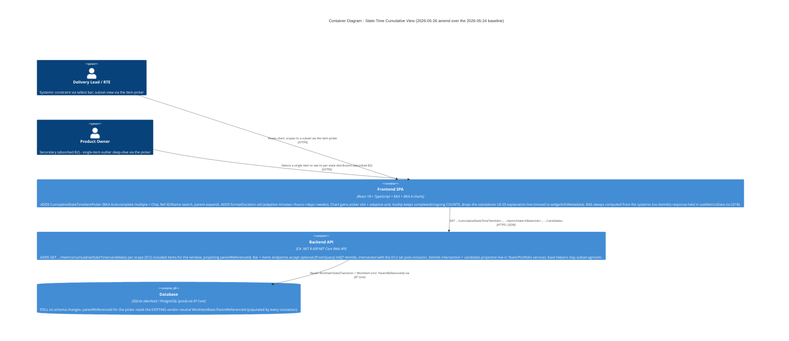
```mermaid
C4Container
    title Container Diagram - State-Time Cumulative View (2026-05-26 amend over the 2026-05-24 baseline)

    Person(rte, "Delivery Lead / RTE", "Systemic constraint via tallest bar; subset view via the item picker")
    Person(po, "Product Owner", "Secondary (absorbed B2) - single-item outlier deep-dive via the picker")

    Container(spa, "Frontend SPA", "React 18 + TypeScript + MUI + MUI-X-charts", "ADDS CumulativeStateTimeItemPicker (MUI Autocomplete multiple + Chip, Ref-ID/Name search, parent-expand). ADDS formatDuration util (adaptive minutes->hours->days->weeks). Chart gains picker slot + adaptive unit; tooltip keeps completed/ongoing COUNTS, drops the standalone US-03 explanation line (moved to widgetInfoMetadata). RAG always computed from the systemic (no-itemIds) response held in useMetricsData ctx (D18).")
    Container(api, "Backend API", "C# .NET 8 ASP.NET Core Web API", "ADDS GET .../metrics/cumulativeStateTime/candidates per scope (D12-included items for the window, projecting parentReferenceId). Bar + items endpoints accept optional [FromQuery] int[]? itemIds, intersected with the D12 set post-inclusion. itemIds intersection + candidate projection live in Team/Portfolio services; base helpers stay subset-agnostic.")
    ContainerDb(db, "Database", "SQLite (dev/test) / PostgreSQL (prod) via EF Core", "STILL no schema changes. parentReferenceId for the picker reads the EXISTING vendor-neutral WorkItemBase.ParentReferenceId (populated by every connector).")

    Rel(rte, spa, "Reads chart; scopes to a subset via the item picker", "HTTPS")
    Rel(po, spa, "Selects a single item to see its per-state distribution (absorbed B2)", "HTTPS")
    Rel(spa, api, "GET .../cumulativeStateTime?itemIds=.., .../items?state=X&itemIds=.., .../candidates", "HTTPS / JSON")
    Rel(api, db, "Reads WorkItemStateTransition + WorkItem (incl. ParentReferenceId) via", "EF Core")
```

### C4 Level 3 — Component: Item Picker + Candidate Endpoint + Adaptive Units (amend subsystem)

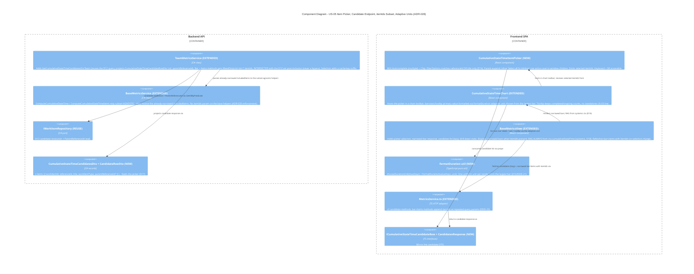
```mermaid
C4Component
    title Component Diagram - US-05 Item Picker, Candidate Endpoint, itemIds Subset, Adaptive Units (ADR-028)

    Container_Boundary(api, "Backend API") {
        Component(teamSvc, "TeamMetricsService (EXTENDED)", "C# class", "Adds GetCumulativeStateTimeCandidatesForTeam (reuses the D12 query, projects CumulativeStateTimeCandidateRowDto incl. parentReferenceId). Bar + items methods gain IReadOnlyList<int>? itemIds, INTERSECTED with the D12 set post-inclusion (never a bypass). Selection adds a cache-key suffix.")
        Component(baseSvc, "BaseMetricsService (EXTENDED)", "C# class", "ComputeCumulativeStateTime / ComputeCumulativeStateTimeItems stay subset-AGNOSTIC - they receive the already-narrowed includedItems. No itemIds param on the base helpers (ADR-028 enforcement).")
        Component(workItemRepo, "IWorkItemRepository (REUSE)", "C# port", "D12 candidate resolution + ParentReferenceId read.")
        Component(candDto, "CumulativeStateTimeCandidatesDto + CandidateRowDto (NEW)", "C# records", "{ items: [{ workItemId, referenceId, title, workItemType, parentReferenceId? }] } - feeds the picker (D17).")
    }

    Container_Boundary(spa, "Frontend SPA") {
        Component(picker, "CumulativeStateTimeItemPicker (NEW)", "React component", "MUI Autocomplete (multiple) + Chip. filterOptions matches referenceId OR title only (D14). Parent-expand: inline 'Select all N children' row action over in-window children. Emits selected itemIds. Keyboard + SR accessible.")
        Component(chart, "CumulativeStateTimeChart (EXTENDED)", "React component", "Hosts the picker in a chart toolbar; bars/axis/tooltip primary value formatted via formatDuration adaptive unit chosen from the largest bar. Tooltip keeps completed/ongoing counts, no standalone US-03 line.")
        Component(view, "BaseMetricsView (EXTENDED)", "React component", "Holds picker selection, narrowed bar response, candidate list (lazy), drill-down state. Displays narrowed bars when itemIds present; RAG ALWAYS from ctx.cumulativeStateTime (systemic, D18). Refetches bar+items with itemIds on selection change.")
        Component(fmt, "formatDuration util (NEW)", "TypeScript pure util", "chooseDurationUnit(maxDays) + formatDuration(valueDays, unit). One uniform unit per render from the largest bar (D16/DDD-21).")
        Component(metricsTs, "MetricsService.ts (EXTENDED)", "TS HTTP adapter", "+2 candidate methods; bar+items methods append itemIds as repeated query params (DDD-22).")
        Component(candModels, "ICumulativeStateTimeCandidateRow + CandidatesResponse (NEW)", "TS interfaces", "Mirror the candidate DTO.")
    }

    Rel(teamSvc, baseSvc, "passes already-narrowed includedItems to the subset-agnostic helpers")
    Rel(teamSvc, workItemRepo, "candidate resolution + ParentReferenceId via GetAllByPredicate")
    Rel(teamSvc, candDto, "projects candidate response via")
    Rel(view, metricsTs, "fetches candidates (lazy) + narrowed bar/items with itemIds via")
    Rel(view, chart, "renders narrowed bars; RAG from systemic ctx (D18)")
    Rel(chart, picker, "hosts in chart toolbar; receives selected itemIds from")
    Rel(chart, fmt, "formats bar labels / axis / tooltip via the adaptive unit")
    Rel(picker, candModels, "consumes candidate list via props")
    Rel(metricsTs, candModels, "returns candidate response as")
```

The amend makes four additional commitments visible:

1. **Subset narrowing is a post-inclusion intersection** — `itemIds` is intersected with the D12 set inside the derived services; the base helpers never see `itemIds` and stay subset-agnostic. An out-of-window selected id is silently ignored (D17 enforced).
2. **Candidate endpoint reuses the D12 query** — picker candidates and bar contributors are the same population; `parentReferenceId` reads the existing vendor-neutral field (no schema change, parent-expand works across all connectors).
3. **Units are an FE concern** — the backend contract stays `totalDays` (double); `formatDuration` picks the display unit at render time (D16). Cross-endpoint numeric comparability with sibling F and `cycleTimePercentiles` is preserved.
4. **RAG is decoupled from the picker** — the FE holds the systemic response as the RAG source; the picker fetch drives only the rendered bars (D18).

---

# C4 Architecture Diagrams — delivery-metrics

Feature: delivery-metrics (Epic 3993 — over-time delivery metrics: backlog/done/inferred-estimate/forecast burnup, likelihood/when-distribution predictability trend, stretch fever chart, all read from one `DeliveryMetricSnapshot` store fed by a forward recorder — forward-only, no backfill; the chart accrues from the day recording begins)
Wave: DESIGN
Date: 2026-06-02
Architect: Morgan (Solution Architect), interaction mode = PROPOSE
Status: PROPOSED (six forking decisions pending user confirmation; locked DISCUSS decisions D1-D12 inherited)

---

## C4 Level 1 — System Context (delta)

No new external actors and no new external systems. The `Delivery Forecaster / RTE` persona (primary) and `Product Owner` (secondary, scope-cut lens) consume the same read-only chart-glance relationship with Lighthouse that existing forecasting personas use. No L1 diagram is added — the prior System Contexts cover this feature's actors and systems unchanged.

---

## C4 Level 2 — Container (delta)

No new containers. The Backend API gains ONE new endpoint plus a new persistence object, a new `PortfolioForecastsUpdated` domain event, and an event-driven recorder (a domain-event handler) reacting to it on the existing in-process domain-event bus; the Frontend SPA gains up to three new chart components and a Zod schema; the Database container gains ONE new table (`DeliveryMetricSnapshot`) — the first delivery time-series store.

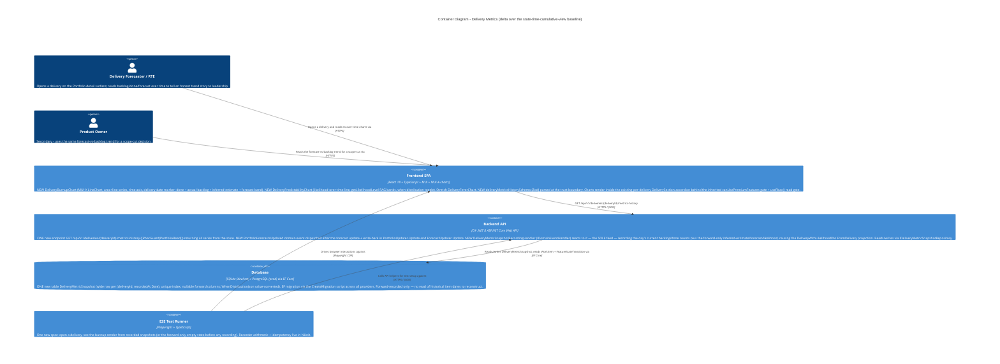
```mermaid
C4Container
    title Container Diagram - Delivery Metrics (delta over the state-time-cumulative-view baseline)

    Person(forecaster, "Delivery Forecaster / RTE", "Opens a delivery on the Portfolio detail surface; reads backlog/done/forecast over time to tell an honest trend story to leadership")
    Person(po, "Product Owner", "Secondary - uses the same forecast-vs-backlog trend for a scope-cut decision")

    Container(spa, "Frontend SPA", "React 18 + TypeScript + MUI + MUI-X-charts", "NEW DeliveryBurnupChart (MUI-X LineChart, area+line series, time axis, delivery-date marker; done + actual-backlog + inferred-estimate + forecast band). NEW DeliveryPredictabilityChart (likelihood-over-time line, getLikelihoodLevel RAG bands, when-distribution toggle). Stretch DeliveryFeverChart. NEW deliveryMetricsHistorySchema (Zod) parsed at the trust boundary. Charts render inside the existing per-delivery DeliverySection accordion behind the inherited canUsePremiumFeatures gate + useRbac() read gate.")
    Container(api, "Backend API", "C# .NET 8 ASP.NET Core Web API", "ONE new endpoint GET /api/v1/deliveries/{deliveryId}/metrics-history ([RbacGuard(PortfolioRead)]) returning all series from the store. NEW PortfolioForecastsUpdated domain event dispatched after the forecast update + write-back in PortfolioUpdater.Update and ForecastUpdater.Update. NEW DeliveryMetricSnapshotRecordingHandler (IDomainEventHandler) reacts to it — the SOLE feed — recording the day's current backlog/done counts plus the forward-only inferred-estimate/forecast/likelihood, reusing the DeliveryWithLikelihoodDto.FromDelivery projection. Reads/writes via IDeliveryMetricSnapshotRepository.")
    ContainerDb(db, "Database", "SQLite (dev/test) / PostgreSQL (prod) via EF Core", "ONE new table DeliveryMetricSnapshot (wide row per (deliveryId, recordedAt.Date); unique index; nullable forward columns; WhenDistributionJson value-converted). EF migration via the CreateMigration script across all providers. Forward-recorded only — no read of historical item dates to reconstruct.")
    Container(e2e, "E2E Test Runner", "Playwright + TypeScript", "One new spec: open a delivery, see the burnup render from recorded snapshots (or the forward-only empty state before any recording). Recorder arithmetic + idempotency live in NUnit.")

    Rel(forecaster, spa, "Opens a delivery and reads its over-time charts via", "HTTPS")
    Rel(po, spa, "Reads the forecast-vs-backlog trend for a scope-cut via", "HTTPS")
    Rel(spa, api, "GET /api/v1/deliveries/{deliveryId}/metrics-history", "HTTPS / JSON")
    Rel(api, db, "Reads/writes DeliveryMetricSnapshot; reads WorkItem + FeatureStateTransition via", "EF Core")
    Rel(e2e, spa, "Drives browser interactions against", "Playwright CDP")
    Rel(e2e, api, "Calls API helpers for test setup against", "HTTPS / JSON")
```

---

## C4 Level 3 — Component: Snapshot Store and Forward-Recorder Domain

The store + single forward feed (ADR-048), the event-driven recorder trigger + idempotency (ADR-049), and the endpoint/schema shape (ADR-050) are the architecturally significant decisions. This diagram makes the persistence model and the recorder's event-driven trigger explicit: `PortfolioUpdater`/`ForecastUpdater` dispatch a NEW `PortfolioForecastsUpdated` event after the forecast update + write-back; the `DeliveryMetricSnapshotRecordingHandler` reacts on the existing domain-event bus, reuses the current-snapshot projection, and writes through one driven port keyed `(deliveryId, recordedAt.Date)`; charts read one endpoint parsed by one Zod schema. There is no reconstruction path — every series accrues forward from the day recording begins.

```mermaid
C4Component
    title Component Diagram - Delivery Metrics Snapshot Store and Event-Driven Forward Recorder (Backend + Frontend)

    Container_Boundary(api, "Backend API") {
        Component(deliveriesCtrl, "DeliveriesController (existing, EXTENDED) or DeliveryMetricsController (NEW)", "ASP.NET Core ApiController", "GET /api/v1/deliveries/{deliveryId}/metrics-history (+ api/latest). [RbacGuard(PortfolioRead)] scoped via the delivery's portfolio. Projects DeliveryMetricsHistoryDto from the store.")
        Component(portfolioUpdater, "PortfolioUpdater / ForecastUpdater (existing, EXTENDED)", "C# UpdateServiceBase<Portfolio>", "After UpdateForecastsForPortfolio + forecast write-back, dispatch PortfolioForecastsUpdated via IDomainEventDispatcher.PublishAsync (ADR-049). Once per portfolio-forecast-completion on both paths. NOT before the forecast (unlike PortfolioFeaturesRefreshed at line 73).")
        Component(forecastsUpdatedEvt, "PortfolioForecastsUpdated(int PortfolioId) (NEW)", "C# record : IDomainEvent", "The genuinely-fresh post-forecast trigger. Mirrors PortfolioFeaturesRefreshed's shape. The ONLY new event Epic 3993 introduces.")
        Component(recordingHandler, "DeliveryMetricSnapshotRecordingHandler (NEW)", "C# IDomainEventHandler<PortfolioForecastsUpdated>", "The sole feed. On HandleAsync: load the portfolio's deliveries, project today's current backlog/done counts AND forward-only figures (estimatedTotalWork/forecastHowMany/likelihoodPercentage/whenDistribution), upsert today's row idempotent on (deliveryId, recordedAt.Date). Reuses DeliveryWithLikelihoodDto.FromDelivery. Modeled on PortfolioFeaturesRefreshedMetricsInvalidationHandler.")
        Component(forecastSvc, "IForecastService / ForecastService (existing, REUSE)", "C# class", "Provides the fresh Feature.Forecasts the recorder reads for forecastHowMany / likelihood.")
        Component(snapshotRepo, "IDeliveryMetricSnapshotRepository + DeliveryMetricSnapshotRepository (NEW)", "C# port + EF impl", "IRepository<DeliveryMetricSnapshot> over the new DbSet (FK DeliveryId -> Delivery, ON DELETE CASCADE). Sole data-layer touchpoint for the store. Get-or-create by (deliveryId, recordedAt.Date).")
        Component(historyDto, "DeliveryMetricsHistoryDto + DeliveryMetricPointDto (NEW)", "C# records", "{ deliveryDate, firstSnapshotDate, points: [{ date, totalWork, doneWork, remainingWork, estimatedTotalWork?, forecastHowMany?, likelihoodPercentage?, whenDistribution? }] } (ADR-050).")
    }

    Container_Boundary(spa, "Frontend SPA") {
        Component(deliveryHistorySvc, "DeliveryMetricsService.ts (NEW or EXTENDED)", "TypeScript HTTP adapter", "getDeliveryMetricsHistory(deliveryId) -> parsed via deliveryMetricsHistorySchema.")
        Component(historySchema, "deliveryMetricsHistorySchema (NEW)", "Zod schema + z.infer type", "Parses the metrics-history response at the trust boundary; forward fields .nullable().")
        Component(deliverySection, "DeliverySection (existing, EXTENDED)", "React component", "Renders the charts in AccordionDetails behind the inherited premium gate; fetches history lazily on expand. (Placement PROPOSED - Decision 5.)")
        Component(burnup, "DeliveryBurnupChart (NEW)", "React component", "MUI-X LineChart area+line, time x-axis, delivery-date marker. Series: done, actual-backlog, inferred-estimate (Slice 2), forecast band (Slice 3). On-track read is geometric (D8). D6 forward-only annotation when forward series null.")
        Component(predictability, "DeliveryPredictabilityChart (NEW, Slice 4)", "React component", "Likelihood-over-time line, RAG-banded via getLikelihoodLevel (<50/<70/<85/>=85); when-distribution spread is a toggle on the same chart (D12).")
        Component(fever, "DeliveryFeverChart (NEW, Slice 5 stretch)", "React component", "Buffer-consumed vs schedule-consumed bubble + trail. Greenlight-gated, out of committed MVP.")
        Component(historyModel, "IDeliveryMetricsHistory + IDeliveryMetricPoint (NEW)", "TypeScript types", "z.infer from the Zod schema; mirror the backend DTO.")
    }

    Rel(deliveriesCtrl, snapshotRepo, "reads stored rows for the delivery via")
    Rel(deliveriesCtrl, historyDto, "projects response via")
    Rel(portfolioUpdater, forecastSvc, "refreshes Feature.Forecasts via UpdateForecastsForPortfolio")
    Rel(portfolioUpdater, forecastsUpdatedEvt, "dispatches after forecast write-back via IDomainEventDispatcher")
    Rel(forecastsUpdatedEvt, recordingHandler, "handled by")
    Rel(recordingHandler, forecastSvc, "reads fresh Feature.Forecasts for forward figures")
    Rel(recordingHandler, snapshotRepo, "upserts the day's row by (deliveryId, recordedAt.Date) via")

    Rel(deliverySection, deliveryHistorySvc, "fetches history on expand via")
    Rel(deliveryHistorySvc, historySchema, "parses response at the boundary via")
    Rel(deliverySection, burnup, "renders with parsed history")
    Rel(deliverySection, predictability, "renders with parsed history (Slice 4)")
    Rel(deliverySection, fever, "renders with parsed history (Slice 5 stretch)")
    Rel(burnup, historyModel, "consumes via props")
    Rel(predictability, historyModel, "consumes via props")
```

The diagram makes five architectural commitments visible:

1. **One store, one driven port, one feed, one read path** — the `DeliveryMetricSnapshotRecordingHandler` is the sole writer through `IDeliveryMetricSnapshotRepository`; the endpoint reads it; no live request-time reconstruction and no historical reconstruction path — every series accrues forward (ADR-048). ArchUnitNET-enforceable.
2. **Recorder is event-driven, fired post-forecast** — `PortfolioUpdater`/`ForecastUpdater` dispatch the NEW `PortfolioForecastsUpdated` event after `UpdateForecastsForPortfolio` + write-back; the handler reacts on the existing domain-event bus (Epic 5121 / ADR-027). NOT the stale pre-forecast `PortfolioFeaturesRefreshed` (line 73), and NOT an inline step in the updater. Fresh-by-construction, no second schedule, no GET side effect (ADR-049).
3. **Date-keyed idempotency** — get-or-create by `(deliveryId, recordedAt.Date)` with a unique index; safe under re-run/restart; NOT a `=true` sentinel (ADR-048/049).
4. **One endpoint, schema-first FE boundary** — all series in one response, parsed by one Zod schema; forward fields null until accrued render as the D6 honest forward-only state, never zero (ADR-050).
5. **Snapshot delete lifecycle = FK cascade** — `DeliveryMetricSnapshot.DeliveryId` → `Delivery` is `ON DELETE CASCADE`; deleting a delivery removes its rows at the DB, no orphans, no `DeliveryDeleted` event (ADR-048).

---

# C4 Architecture Diagrams — recurring-blackout-events

Feature: recurring-blackout-events (Epic 4577)
Wave: DESIGN
Date: 2026-06-06
Architect: Morgan (Solution Architect), interaction mode = PROPOSE
ADRs: ADR-059 (unified evaluation via materialization), ADR-060 (entity + weekday storage + expansion). Cross-refs ADR-058.

Sibling of the SHIPPED #4974. A new `RecurringBlackoutRule` entity's days **materialize into synthetic single-day `BlackoutPeriod` instances** and join the global blackout-day set behind one unifying service seam (`IBlackoutPeriodService.GetEffectiveBlackoutDays(window)`), so the #4974 day↔date shift, the historical-throughput stripping, and the chart overlays consume them with no per-surface change (D4 / D7).

## C4 Level 1 — System Context (delta)

```mermaid
C4Context
    title System Context — recurring-blackout-events (delta)

    Person(admin, "Config Admin", "SystemAdmin; authors recurring blackout rules (Premium-gated writes)")
    Person(forecaster, "Delivery Forecaster", "Reads forecasts/charts; gains dates that skip recurring non-working days, no setup")

    System(lighthouse, "Lighthouse", "Forecasting tool. Adds recurring blackout rules that widen the global blackout-day set every forecast/chart surface already reads.")

    System_Ext(tracker, "Jira / ADO", "Work-tracking system; receives blackout-shifted forecast write-back dates (existing, value now includes recurring days)")

    Rel(admin, lighthouse, "Defines weekday/interval recurring rules via System settings")
    Rel(forecaster, lighthouse, "Reads recurring-aware forecasts & charts via")
    Rel(lighthouse, tracker, "Writes recurring-blackout-shifted dates to (existing path)")
```

## C4 Level 2 — Container (delta)

```mermaid
C4Container
    title Container Diagram — recurring-blackout-events (delta)
    Person(admin, "Config Admin (SystemAdmin)")
    Person(forecaster, "Delivery Forecaster")

    Container_Boundary(spa, "Frontend SPA (React + TS)") {
        Component(rrSettings, "RecurringBlackoutRulesSettings.tsx (NEW)", "React", "Sibling section to BlackoutPeriodsSettings; weekday checkboxes + interval + start/optional-end + summary row; premium-gated via LicenseTooltip/useRbac")
        Component(rrSvc, "RecurringBlackoutRuleService.ts (NEW)", "TS HTTP adapter", "CRUD; Zod schema at the trust boundary")
    }

    Container_Boundary(be, "Lighthouse Backend (.NET 8, ports-and-adapters)") {
        Component(rbc, "RecurringBlackoutRulesController (NEW)", "ASP.NET Core", "api/{v1|latest}/recurring-blackout-rules; GET open, writes Premium+SystemAdmin")
        Component(rbs, "RecurringBlackoutRuleService (NEW)", "DI service", "CRUD + Validate (≥1 weekday, interval≥1, end≥start)")
        Component(bps, "BlackoutPeriodService (EXTENDED)", "DI service", "GetEffectiveBlackoutDays(window) — one-off ∪ expanded recurring; the UNION seam")
        Component(expand, "RecurringBlackoutRuleExtensions (NEW)", "Pure static", "ExpandToBlackoutDays(rule, window) → single-day BlackoutPeriod[]")
        Component(consumers, "Eval consumers (×13, EXTENDED)", "ForecastController / DeliveriesController / FeaturesController / TeamMetricsService / WriteBackTriggerService / …", "Swap raw GetAll() → GetEffectiveBlackoutDays(window)")
        Component(bde, "BlackoutDaysExtensions (REUSE)", "Pure static (shipped)", "IsBlackoutDay / GetBlackoutDayIndices / ProjectWorkingDays / CountWorkingDays / AnnotateBlackoutDays")
        ContainerDb(rrepo, "RecurringBlackoutRuleRepository (NEW)", "EF Core 8", "GetAll() — GLOBAL")
        ContainerDb(brepo, "BlackoutPeriodRepository (shipped)", "EF Core 8", "GetAll() — GLOBAL")
    }

    Rel(admin, rrSettings, "Authors rules via")
    Rel(rrSettings, rrSvc, "Calls")
    Rel(rrSvc, rbc, "CRUD over")
    Rel(rbc, rbs, "Delegates to")
    Rel(rbs, rrepo, "Persists via")
    Rel(forecaster, consumers, "Reads recurring-aware forecasts/charts via")
    Rel(consumers, bps, "Fetches effective blackout days (window) from")
    Rel(bps, brepo, "Fetches one-off periods from")
    Rel(bps, rrepo, "Fetches rules from")
    Rel(bps, expand, "Materializes rule days via")
    Rel(consumers, bde, "Evaluates / shifts dates via (unchanged)")
```

## C4 Level 3 — Component: Recurring-day materialization and union seam

The architecturally significant decision is **where the one-off ∪ recurring union is assembled and in what shape it reaches the 13 downstream eval sites** (ADR-059). Because every shipped helper speaks `BlackoutPeriod`, a recurring occurrence materialized as a single-day `BlackoutPeriod` is indistinguishable downstream (D4) and the #4974 A1 contract is untouched (D7). The union lives in exactly one place — `GetEffectiveBlackoutDays` — and an ArchUnitNET/grep rule forbids the eval path from calling the raw repo, catching the "missed seam" drift that the rejected per-consumer Option A would risk.

```mermaid
C4Component
    title Component Diagram — recurring-day materialization + union (ADR-059/060)

    Component(consumer, "Eval consumer (×13)", "ForecastController / DeliveriesController / TeamMetricsService / WriteBackTriggerService / DeliveryMetricSnapshotRecordingHandler / …", "Owns a window; calls GetEffectiveBlackoutDays(windowStart, windowEnd)")
    Component(union, "GetEffectiveBlackoutDays(window)", "IBlackoutPeriodService (EXTENDED)", "Fetches both repos once; returns one-off.GetAll() ∪ rules.SelectMany(expand) as IReadOnlyList<BlackoutPeriod> (same shape)")
    Component(rule, "RecurringBlackoutRule", "EF entity (NEW)", "Weekdays:List<DayOfWeek> (JSON-converted + ValueComparer), IntervalWeeks≥1, Start:DateOnly, End:DateOnly? (null=forever)")
    Component(expand, "ExpandToBlackoutDays(rule, window)", "Pure static (NEW)", "weekday match ∧ weeksBetween(anchorMonday,dMonday)%IntervalWeeks==0 ∧ d∈[Start,End]∩window → BlackoutPeriod{Start=End=d}")
    Component(helpers, "IsBlackoutDay / GetBlackoutDayIndices / ProjectWorkingDays / CountWorkingDays / AnnotateBlackoutDays", "Pure static (shipped, D7)", "Consume BlackoutPeriod — cannot tell recurring from one-off")

    Rel(consumer, union, "fetches effective days (window) from")
    Rel(union, rule, "reads global rules")
    Rel(union, expand, "materializes each rule over the window via")
    Rel(consumer, helpers, "evaluates / shifts the unified list via (unchanged)")
    Rel(union, helpers, "(synthetic single-day periods are ordinary input to)")
```

The diagram makes four commitments visible:

1. **Union in exactly one place** — `GetEffectiveBlackoutDays` is the sole assembler; the eval path never calls `blackoutPeriodRepository.GetAll()` directly after this feature (ArchUnitNET-enforceable). The rejected per-consumer Option A would scatter this across 13 sites with a silent-omission drift mode.
2. **Materialization, not signature change** — recurring days become single-day `BlackoutPeriod`s; the #4974 A1 contract (`ProjectWorkingDays`/`CountWorkingDays`/`FromDelivery`/`GetLikelhoodForDate`) is untouched (D7). The rejected Option B (generalize behind `IBlackoutDaySource`) would re-touch every helper + the shipped shift.
3. **Pure, bounded expansion** — `ExpandToBlackoutDays` has the clock/window passed in (no I/O); open-ended rules are bounded by the consumer's window, never infinite. Interval-week-modulo anchoring; interval 1 ⇒ plain weekly by `% 1` (ADR-060, US-02 AC4).
4. **D4 indistinguishability / D6 regression are properties, not branches** — a recurring day-set equals the same days as one-off periods through every helper (direct equality assertion); no rules ⇒ `GetEffectiveBlackoutDays ≡ GetAll()` ⇒ byte-identical (inherits #4974 D6).

---

# C4 Architecture Diagrams — work-item-age-percentiles

Feature: work-item-age-percentiles (Story #5257)
Wave: DESIGN
Date: 2026-06-09
Architect: Morgan (Solution Architect), interaction mode = PROPOSE
ADRs: ADR-065 (WIA percentiles computed **server-side** on a new read endpoint per scope), ADR-066 (aging-chart line-source swap between two server-fetched arrays). Cross-refs ADR-020, ADR-062, ADR-055, ADR-019.

**System Context: unchanged** — no new actor, no new external system. **Container delta: 2 new endpoints** — the D8 verdict (ADR-065, user-confirmed) adds `GET …/metrics/workItemAgePercentiles` at **Team** and **Portfolio** scope on the existing Backend container, consumed by the existing Frontend SPA and wrapped (version-gated) by the Lighthouse-Clients (separate repo). No new persistence, no new external system.

## C4 Level 2 — Container (delta = 2 new endpoints: Team + Portfolio)

```mermaid
C4Container
    title Container Diagram — work-item-age-percentiles (delta = 2 new endpoints)
    Person(coach, "Flow Coach", "Reads team/portfolio metrics; no premium gate")

    Container(spa, "Lighthouse Frontend", "React + MUI-X", "New WIP-age overview card + aging-chart CT↔WIA toggle; consumes server-computed PercentileValue[]")
    Container(api, "Lighthouse Backend", "ASP.NET Core (hexagonal)", "2 NEW read endpoints compute WIA percentiles via BuildPercentiles/PercentileCalculator over the in-progress selection")
    Container(clients, "Lighthouse-Clients (CLI + MCP)", "separate repo", "Version-gated getWorkItemAgePercentiles wrapper")

    Rel(coach, spa, "Reads WIP-age card + flips CT↔WIA toggle in")
    Rel(spa, api, "GET …/metrics/workItemAgePercentiles (Team + Portfolio) [RbacGuard(TeamRead/PortfolioRead)] — NEW")
    Rel(clients, api, "GET …/metrics/workItemAgePercentiles — NEW, version-gated (404 on old server ⇒ upgrade error)")
```

## C4 Level 3 — Component: server-side WIA percentile compute + chart line-source swap

The architecturally significant decisions are **where the WIA percentiles are computed** (ADR-065: server-side, reusing the in-progress selection + `BuildPercentiles`) and **how the aging chart shows one of two server-fetched percentile sets at a time** (ADR-066: swap the source feeding the single existing reference-line block, so mutual exclusivity is structural).

```mermaid
C4Component
    title Component Diagram — server-side WIA percentile compute + line-source swap (ADR-065/066)

    Component(ctrl, "Team/PortfolioMetricsController", "ASP.NET (EXTENDED)", "NEW GetWorkItemAgePercentiles action; [RbacGuard]; 400 on startDate>endDate; returns IEnumerable<PercentileValue>")
    Component(svc, "Team/PortfolioMetricsService", "C# (EXTENDED)", "NEW GetWorkItemAgePercentilesFor…: in-progress selection → WorkItemAge → BuildPercentiles; cached on endDate only")
    Component(sel, "GetWipSnapshotForTeam / GetInProgressFeaturesForPortfolio", "C# (REUSE)", "Existing current-in-progress selection feeding the aging-chart dots")
    Component(calc, "BuildPercentiles → PercentileCalculator", "C# (REUSE)", "Existing 50/70/85/95 algorithm; emits PercentileValue[]")
    Component(msvc, "MetricsService / IMetricsService", "TS (EXTENDED)", "NEW getWorkItemAgePercentiles(id, …) → IPercentileValue[]")
    Component(metrics, "useMetricsData / MetricsData ctx", "React hook (EXTENDED)", "Parallel-fetches WIA into NEW ctx field workItemAgePercentilesValues alongside percentileValues")
    Component(card, "WorkItemAgePercentiles.tsx", "React card (NEW)", "Mirrors CycleTimePercentiles.tsx: 50/70/85/95 descending, ForecastLevel colour, graceful empty state, distinct WIA title")
    Component(chart, "WorkItemAgingChart", "React chart (EXTENDED)", "NEW optional workItemAgePercentileValues prop + local percentileSource state; activePercentiles feeds the EXISTING single ChartsReferenceLine block")

    Rel(ctrl, svc, "delegates to")
    Rel(svc, sel, "reuses in-progress selection")
    Rel(svc, calc, "computes percentiles via")
    Rel(msvc, ctrl, "GET workItemAgePercentiles (version-gated in CLI/MCP)")
    Rel(metrics, msvc, "parallel-fetches WIA array via")
    Rel(metrics, card, "feeds workItemAgePercentilesValues to")
    Rel(metrics, chart, "passes percentileValues (CT) + workItemAgePercentilesValues (WIA) to")
```

The diagram makes four commitments visible:

1. **Server-side compute, reuse-maximal (ADR-065)** — the new service method composes the **existing** in-progress selection (`GetWipSnapshotForTeam` / `GetInProgressFeaturesForPortfolio`) and the **existing** `BuildPercentiles`/`PercentileCalculator`; no new DTO (`PercentileValue` reused), no new algorithm, no persistence. Production percentile logic stays out of the frontend (user directive).
2. **One algorithm, uniformity by construction** — WIA percentiles use the same server-side `PercentileCalculator` as `cycleTimePercentiles`/`ageInStatePercentiles`; no second-language fork, no parity test.
3. **Line-source swap between two server-fetched arrays (ADR-066)** — `activePercentiles = percentileSource === "workItemAge" ? WIA : CT` feeds the *existing* single `ChartsReferenceLine` block; both arrays are fetched (CT + the new WIA endpoint); exactly one set on the canvas by construction; `useChartVisibility` unchanged.
4. **New endpoint ⇒ version-gated clients** — the CLI + MCP wrappers pre-check the server version (an old server 404s opaquely) and fail with an "upgrade Lighthouse" error; `FEATURE_REQUIRES_SERVER_NEWER_THAN` entry; tracked in the separate clients repo. Empty WIP ⇒ `BuildPercentiles([])` `0`-valued set ⇒ card empty state + chart no-lines; the pace-band overlay chip is untouched by the toggle (D2 / ADR-020).

---

# C4 Architecture Diagrams — website-screenshot-freshness

Feature: website-screenshot-freshness (ADO #5259)
Wave: DESIGN
Date: 2026-06-14
Architect: Morgan (Solution Architect), interaction mode = PROPOSE (decisions pre-locked in DISCUSS)
ADRs: ADR-073 (website marketing screenshots hotlinked from `docs/assets` via the jsDelivr GitHub CDN at `@main`; OG image + `GitHub.png` excluded; manual finalization gate).

**Lighthouse product System Context & Container: unchanged** — no new actor, system, endpoint, or store. The delta is a **cross-repo asset-flow wiring**: the separate marketing website reads canonical `docs/assets` PNGs over the jsDelivr CDN (a new external driven dependency of the website at runtime); the existing `@screenshot` E2E suite produces those PNGs; a manual finalization gate keeps the website fresh. No backend change.

## C4 Level 2 — Container (cross-repo asset flow)

```mermaid
C4Container
    title Container Diagram — website-screenshot-freshness (cross-repo asset flow)
    Person(prospect, "Forecasting prospect", "Evaluates Lighthouse on the marketing site")
    Person(maintainer, "Lighthouse maintainer", "Finalizes features; owns public-surface freshness")

    System_Boundary(web, "website repo (LetPeopleWork/website)") {
        Container(site, "Marketing website", "Vite + React + TS", "Renders Lighthouse screenshots via lighthouseAsset() CDN URLs; OG image + GitHub.png stay bundled")
    }
    System_Ext(cdn, "jsDelivr GitHub CDN", "cdn.jsdelivr.net/gh @main", "Caches & serves docs/assets PNGs as image/png (~12h branch cache)")
    System_Boundary(lh, "Lighthouse repo (LetPeopleWork/Lighthouse)") {
        ContainerDb(assets, "docs/assets/** PNGs", "Static files on main", "Canonical product screenshots — single source of truth")
        Container(e2e, "@screenshot E2E suite", "Playwright + testWithDemoData", "Regenerates canonical PNGs at finalization via getPathToDocsAssetsFolder()")
        Container(gate, "Finalization gate", "CLAUDE.md DELIVER mandate + nw-finalize", "Manual website-freshness check; explicit answer required")
    }

    Rel(prospect, site, "Views current product screenshots on")
    Rel(site, cdn, "Hotlinks PNG via", "HTTPS GET (lighthouseAsset @main)")
    Rel(cdn, assets, "Fetches & caches from", "GitHub raw @main")
    Rel(e2e, assets, "Regenerates")
    Rel(maintainer, gate, "Answers at finalization")
    Rel(gate, e2e, "Prompts regen of changed marketed surface")
```

This diagram makes three commitments visible:

1. **Single source of truth (ADR-073 / DDD-1)** — the website is a pure consumer of `docs/assets`; the `@screenshot` suite is the sole producer. No parallel marketing-image pipeline; covered screenshots become current automatically when the suite regenerates them at finalization.
2. **jsDelivr `@main` is the only transport (DDD-2/3/8)** — exactly one external driven dependency, its URL convention localized to the `lighthouseAsset()` helper. The walking skeleton (US-01) probes it live before bulk migration; a deployed-site link-check is the platform-handoff smoke test.
3. **Two named exclusions** — the OG/SEO image (same-origin SEO requirement, DDD-5) and `GitHub.png` (a non-product github.com surface the `@screenshot` suite cannot produce, DDD-9) stay website-bundled. No silent omission.

No Level 3 — the change is wiring + process, not internal component decomposition. The C4 here and in `docs/feature/website-screenshot-freshness/feature-delta.md` are the same diagram; the feature-delta also carries the 10→canonical mapping table that sizes slice-02.

