# C4 Architecture Diagrams — rbac-enhancements

Feature: rbac-enhancements
Wave: DESIGN
Date: 2026-05-10
Architect: Morgan (Solution Architect)

---

## C4 Level 1 — System Context

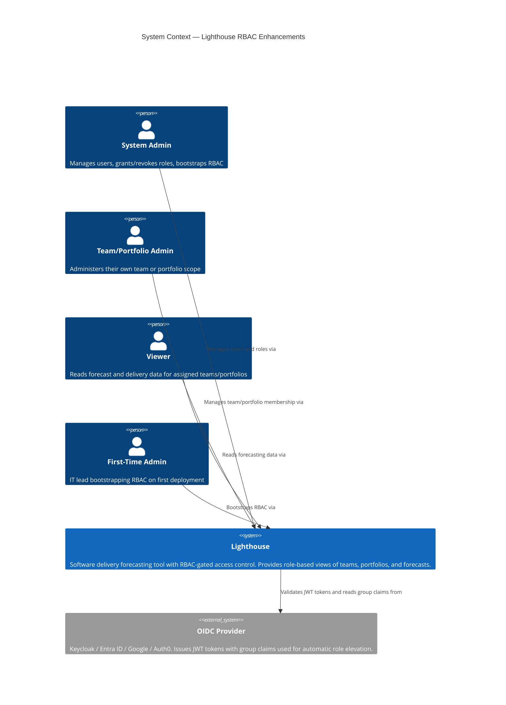

---

## C4 Level 2 — Container

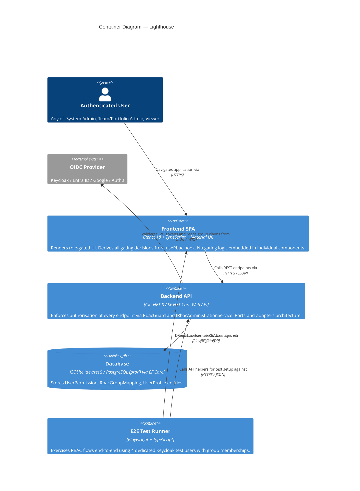

---

## C4 Level 3 — Component: Authorization Domain

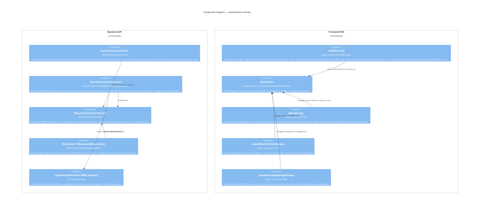

---

# C4 Architecture Diagrams — work-tracking-oauth-authentication

Feature: work-tracking-oauth-authentication
Wave: DESIGN
Date: 2026-05-14
Architect: Morgan (Solution Architect)

---

## C4 Level 1 — System Context (delta)

Existing System Context (RBAC) still applies. This feature adds **outbound** OAuth client relationships to external IdPs and extends the user persona set with the existing `connector-admin`.

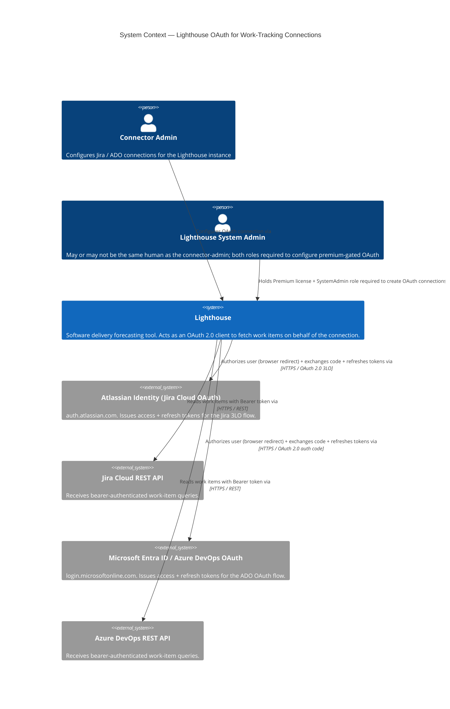

---

## C4 Level 2 — Container (delta)

The existing Backend API / Frontend SPA / Database containers are unchanged in shape. This feature adds outbound HTTPS calls from the Backend API to two new external IdP / API systems, and adds a new persistence concern (one new table) to the existing DB.

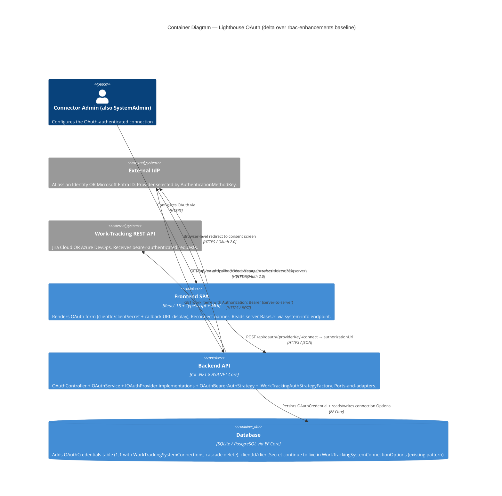

---

## C4 Level 3 — Component: OAuth Domain

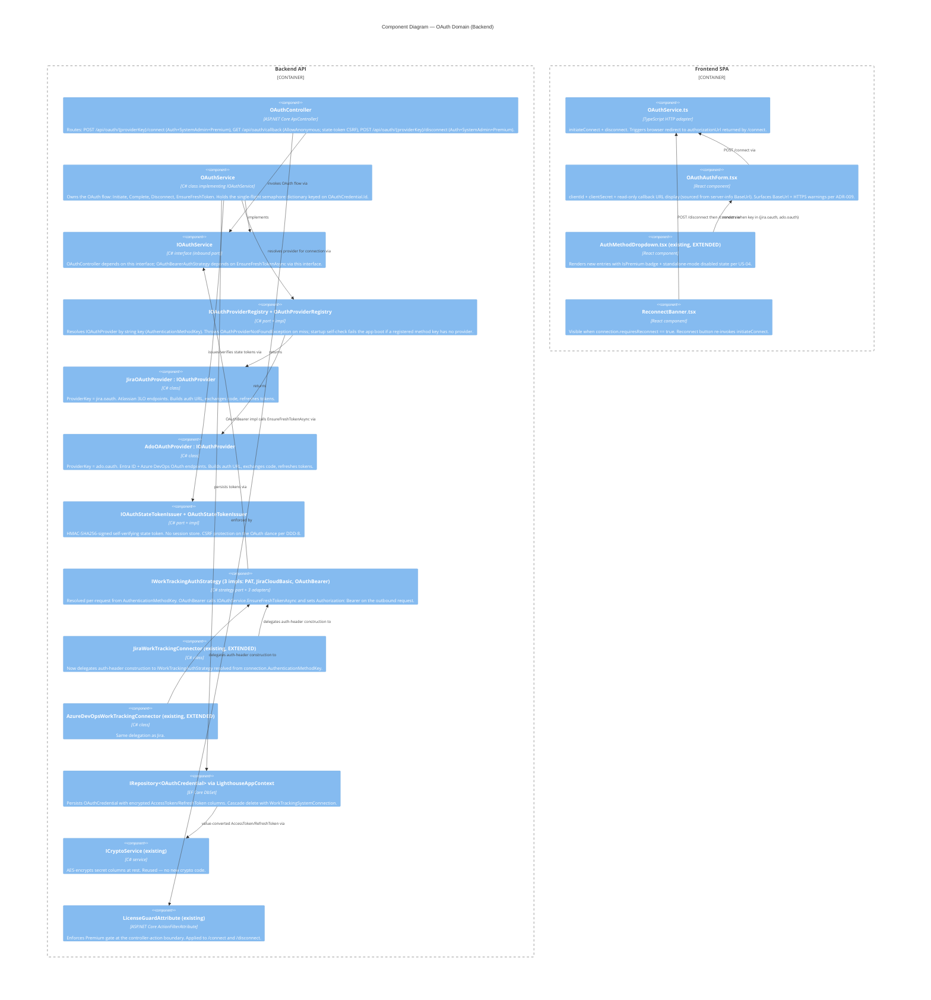

---

## OAuth flow sequence (Mermaid)

```mermaid
sequenceDiagram
    autonumber
    actor Admin as Connector Admin (browser)
    participant FE as Frontend SPA
    participant API as Backend API (OAuthController + OAuthService)
    participant IdP as External IdP (Atlassian / Entra ID)
    participant DB as DB (OAuthCredentials)
    participant Connector as JiraWorkTrackingConnector / ADO connector
    participant WTS as Work-Tracking REST API

    Note over Admin,IdP: One-time setup (out of band)
    Admin->>IdP: Register OAuth app, copy clientId/clientSecret

    Note over Admin,DB: Initial connection
    Admin->>FE: Open connector form, paste clientId/clientSecret, click Connect
    FE->>API: POST /api/oauth/jira.oauth/connect { connectionId }
    API->>API: Issue HMAC state token (connectionId, providerKey, nonce, exp)
    API->>FE: 200 { authorizationUrl }
    FE->>IdP: 302 → authorizationUrl (with redirect_uri = BaseUrl/api/oauth/callback)
    Admin->>IdP: Consent
    IdP->>API: GET /api/oauth/callback?code&state (browser-driven)
    API->>API: Verify state HMAC (CSRF; no session store)
    API->>IdP: POST token endpoint (server-to-server) { code, clientId, clientSecret }
    IdP->>API: { accessToken, refreshToken, expiresIn }
    API->>DB: Persist OAuthCredential (Status=Valid, tokens encrypted)
    API->>FE: 302 → /settings/connections/{id}?oauth=success

    Note over Connector,WTS: Subsequent outbound sync
    Connector->>API: EnsureFreshTokenAsync(connectionId)
    alt expiresAt - now > 5 min
        API->>Connector: return cached accessToken
    else expiry imminent
        API->>API: Acquire semaphore on OAuthCredential.Id (timeout 30s)
        API->>DB: Re-read credential (double-check)
        alt now-fresh
            API->>Connector: return cached accessToken
        else still expired
            API->>IdP: POST token refresh { refreshToken, clientId, clientSecret }
            alt refresh succeeds
                IdP->>API: new tokens
                API->>DB: Update OAuthCredential atomically
                API->>Connector: return new accessToken
            else refresh fails
                API->>DB: Status = RefreshFailed
                API-->>Connector: throw OAuthRefreshFailedException
            end
        end
    end
    Connector->>WTS: GET work items (Authorization: Bearer {accessToken})
    WTS->>Connector: work items
```

---

# C4 Architecture Diagrams — filter-forecast-throughput

Feature: filter-forecast-throughput (Epic 4896)
Wave: DESIGN
Date: 2026-05-20
Architect: Morgan (Solution Architect)

---

## C4 Level 1 — System Context (delta)

The Lighthouse system context (RBAC baseline) is unchanged. This feature adds **no** new external actors and **no** new external systems. It introduces a new internal persona — `Delivery Forecaster` — and tightens the conversation between the existing Team Admin and the existing Premium License gate.

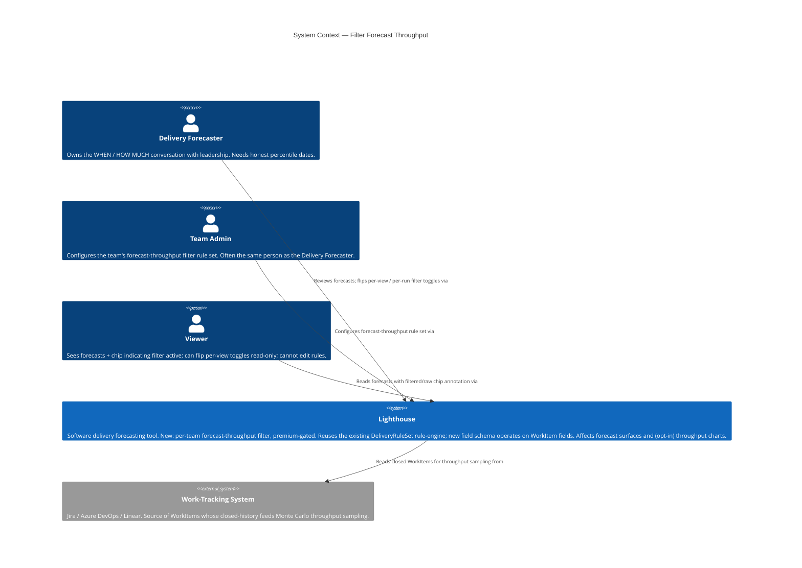

---

## C4 Level 2 — Container (delta)

No new containers. The existing Frontend SPA, Backend API, Database, and E2E Test Runner all gain additive responsibilities — they exchange one new DTO shape (`forecastFilterRuleSetJson` on the team-settings round trip) and one new endpoint path (`/forecast-filter/schema`). The Backend API's persistence container gains one nullable JSON column on the `Teams` table.

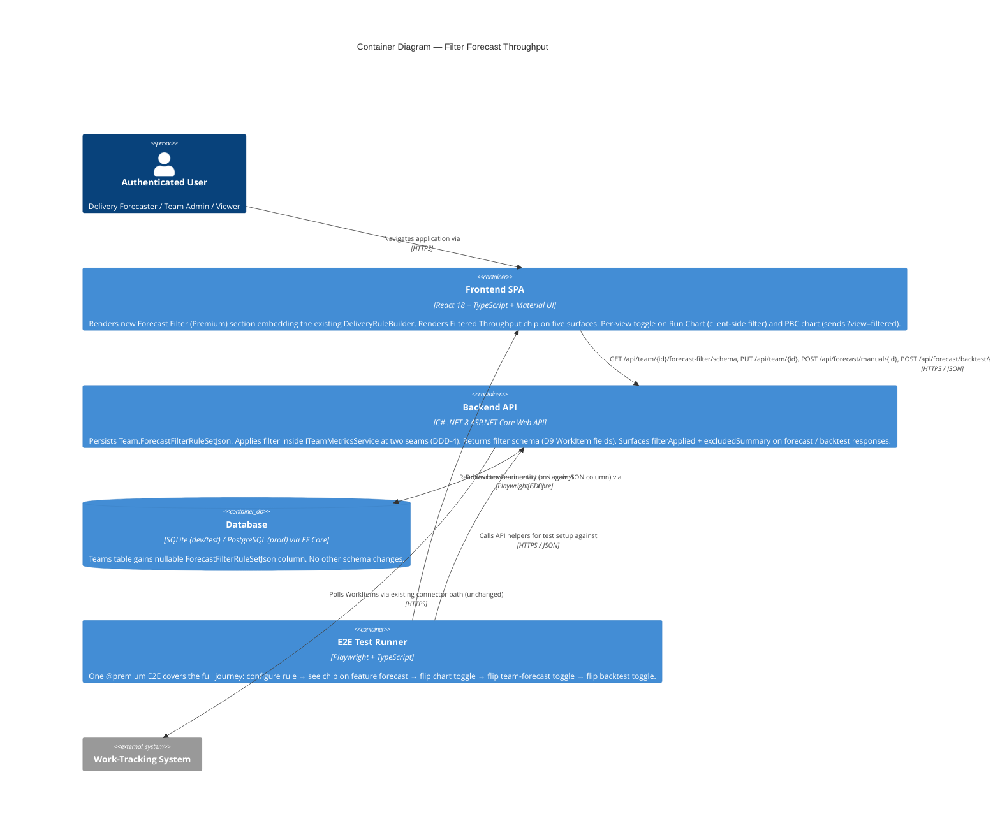

---

## C4 Level 3 — Component: Rule-Engine and Forecast-Filter Domain

The rule-engine generalisation (ADR-012) is the architecturally significant subsystem of this feature. This diagram makes the new ports / adapters and the delegation paths explicit, and shows the single-seam filter application inside `TeamMetricsService` (DDD-4).

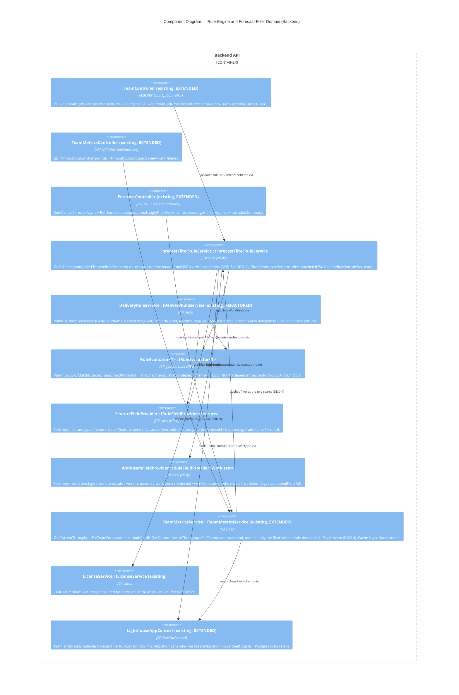

The diagram makes three architectural commitments visible:

1. **Single shared evaluator** (`RuleEvaluator<T>`) — the same algorithmic code path handles both Feature and WorkItem rule evaluation; bug fixes / operator additions land in one place (ADR-012).
2. **Single filter seam** (`TeamMetricsService` — and nothing else — calls `IForecastFilterRuleService.Filter`); enforced by ArchUnitNET (DDD-4).
3. **Single license gate for this feature** (`ForecastFilterRuleService.GetEffectiveRuleSet`); enforced by ArchUnitNET (DDD-9).

---

# C4 Architecture Diagrams — time-in-state-and-staleness

Feature: time-in-state-and-staleness (Epic 4144 MVP bundle, slice A+B1+D)
Wave: DESIGN
Date: 2026-05-24
Architect: Morgan (Solution Architect), interaction mode = PROPOSE

---

## C4 Level 1 — System Context (delta)

The Lighthouse system context (RBAC + OAuth + filter-forecast-throughput baselines) is unchanged. This feature adds **no** new external actors and **no** new external systems. It introduces a focus persona — `Flow Coach` — already represented across the RBAC personas, and clarifies the read-side relationship with the existing work-tracking systems: Lighthouse now CAPTURES state-transition history (where the source exposes it) rather than only deriving Started / Closed boundary dates.

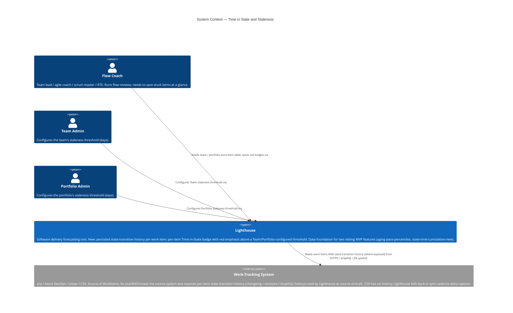

---

## C4 Level 2 — Container (delta)

No new containers. The existing Frontend SPA, Backend API, Database, and E2E Test Runner all gain additive responsibilities. The Database container gains one new table (`WorkItemStateTransitions`) and two new columns (`WorkItems.CurrentStateEnteredAt`, `WorkTrackingSystemOptionsOwner.StalenessThresholdDays`). The Backend API extends the existing sync-path inside `WorkItemService.RefreshWorkItems` and the existing `WorkItemDto` projection. The Frontend SPA extends the existing work-item-table column rendering and adds a `Staleness Threshold (days)` input on the Team and Portfolio settings forms.

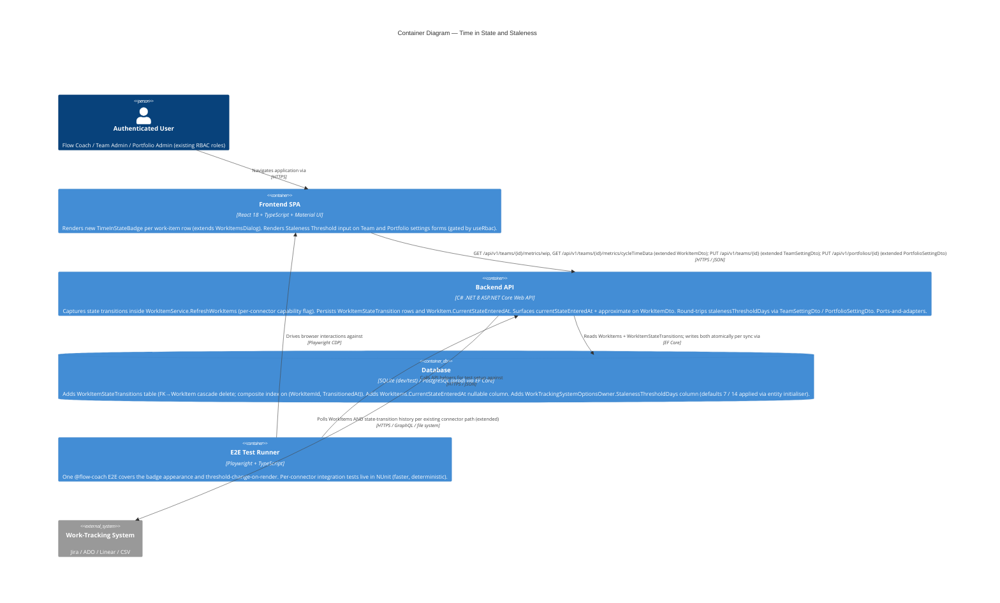

---

## C4 Level 3 — Component: Transition Capture and Time-in-State Domain

The transition-capture dispatch (ADR-017) is the architecturally significant subsystem of this feature. This diagram makes the capability-flag dispatch, the single-seam invariant (`WorkItemService.RefreshWorkItems` is the only writer), and the consumer-facing repository surface explicit.

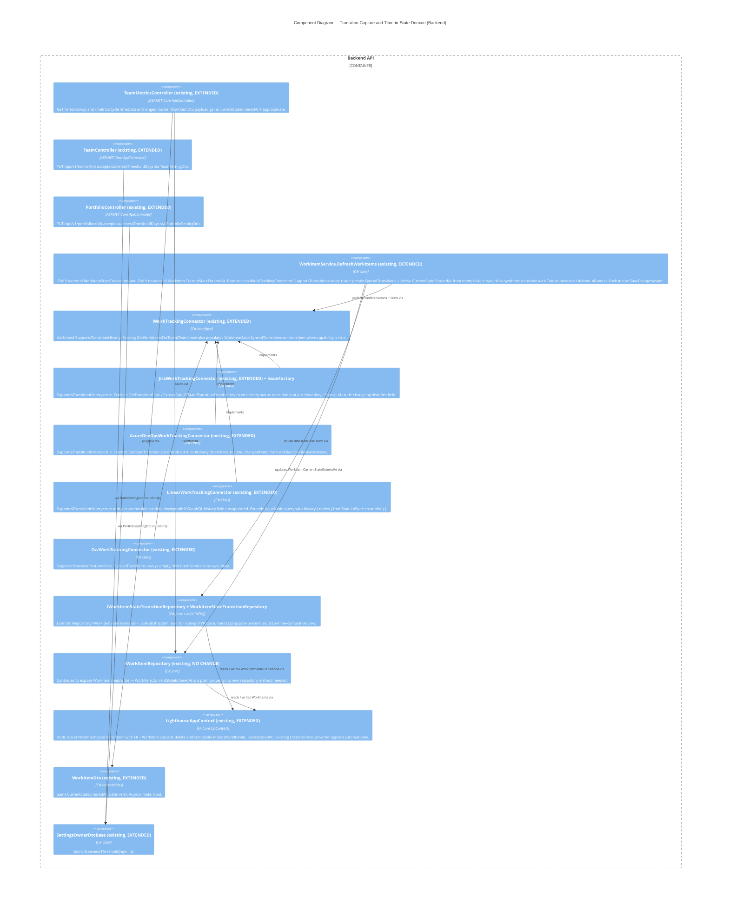

The diagram makes four architectural commitments visible:

1. **Single capture seam** — `WorkItemService.RefreshWorkItems` is the only mutator of `WorkItem.CurrentStateEnteredAt` and the only writer of `WorkItemStateTransition` rows (ADR-016 + ADR-017; ArchUnitNET-enforced).
2. **Capability-flagged dispatch** — `IWorkTrackingConnector.SupportsTransitionHistory` is the single branch point. Adding a 5th connector means implementing the interface and setting the flag — zero touches to `WorkItemService.RefreshWorkItems` (ADR-017).
3. **Standalone transition entity** — `WorkItem` holds NO transition navigation; the work-item-table read path loads zero transition rows (ADR-015; ArchUnitNET-enforced).
4. **Consumer-facing surface is the repository, not a service** — sibling MVP DESIGNs (`aging-pace-percentiles`, `state-time-cumulative-view`) consume `IWorkItemStateTransitionRepository` directly. No shared `IPerStateAggregationService` is introduced (ADR-018; rationale documented for future readers).

---

# C4 Architecture Diagrams — aging-pace-percentiles

Feature: aging-pace-percentiles (Epic 4144 MVP bundle, slice F)
Wave: DESIGN
Date: 2026-05-24
Architect: Morgan (Solution Architect), interaction mode = PROPOSE

---

## C4 Level 1 — System Context (delta)

The Lighthouse system context (RBAC + OAuth + filter-forecast-throughput + time-in-state-and-staleness baselines) is unchanged. This feature adds **no** new external actors and **no** new external systems. The `Flow Coach` persona already introduced by sibling 1 retains the same chart-glance relationship with Lighthouse; the secondary `Delivery Forecaster` persona (already present in `docs/product/personas/`) consumes the same chart in forecast-conversation contexts. The chart-glance question this feature enables ("which in-flight items are pacing slower than 85% of historical items for their current state?") sits inside the existing read-only relationship; no new outbound integration.

No L1 diagram is added — the System Context from sibling 1 (time-in-state-and-staleness) covers this feature's actors and systems unchanged.

---

## C4 Level 2 — Container (delta)

No new containers. The existing Frontend SPA and Backend API gain additive responsibilities — Backend API gains two new endpoints (team + portfolio); Frontend SPA gains a new chart overlay, a new legend chip group, and a new per-dot tooltip annotation. The Database container is unchanged — no schema additions (sibling 1's `WorkItemStateTransitions` table and `WorkItem.CurrentStateEnteredAt` column are consumed read-only). The E2E Test Runner gains one new spec.

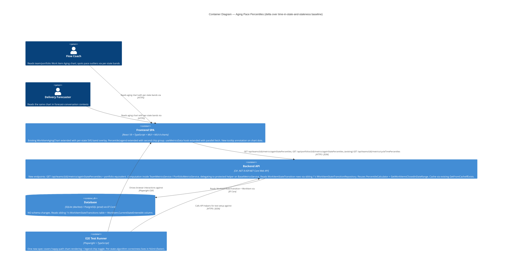

---

## C4 Level 3 — Component: Per-State Percentile Computation and Chart-Overlay Domain

The per-state percentile computation (ADR-019) + the SVG-overlay chart rendering (ADR-020) + the ADR-018 disposition (ADR-021) are the three architecturally significant decisions for this feature. This diagram makes the consumer-side surfaces explicit: the per-state computation flows through the existing `BaseMetricsService` inheritance; the chart-overlay flows through the existing `<ChartsContainer>` coordinate system; the repository seam (sibling 1's `IWorkItemStateTransitionRepository`) is the only data-layer touchpoint.

```mermaid
C4Component
    title Component Diagram — Aging Pace Percentiles (Backend + Frontend)

    Container_Boundary(api, "Backend API") {
        Component(teamMetricsCtrl, "TeamMetricsController (existing, EXTENDED)", "ASP.NET Core ApiController", "GET /metrics/cycleTimePercentiles unchanged. New: GET /metrics/ageInStatePercentiles?startDate&endDate. Validation + auth mirror cycleTimePercentiles. RbacGuard(TeamRead).")
        Component(portfolioMetricsCtrl, "PortfolioMetricsController (existing, EXTENDED)", "ASP.NET Core ApiController", "Mirror endpoint for portfolio scope. RbacGuard(PortfolioRead).")
        Component(teamMetricsSvc, "TeamMetricsService (existing, EXTENDED)", "C# class", "New method GetAgeInStatePercentilesForTeam: scope-specific 'completed items in window' query via existing GetWorkItemsClosedInDateRange, then delegates to BaseMetricsService.ComputeAgeInStatePercentiles, wraps in GetFromCacheIfExists with cache key AgeInStatePercentiles_{startDate}_{endDate}.")
        Component(portfolioMetricsSvc, "PortfolioMetricsService (existing, EXTENDED)", "C# class", "Mirror method for portfolio scope.")
        Component(baseMetricsSvc, "BaseMetricsService (existing, EXTENDED)", "C# class", "New PROTECTED helper ComputeAgeInStatePercentiles(completedItems, doingStates, requestedPercentiles): walks transitions via IWorkItemStateTransitionRepository.GetAllByPredicate, pairs entry→next-exit per state per ADR-019, buckets observations, calls PercentileCalculator per state per percentile. INTRA-INHERITANCE ONLY — not exposed via interface (ADR-021).")
        Component(percentileCalc, "PercentileCalculator (existing, REUSE-AS-IS)", "C# static class", "Nearest-rank algorithm with clamp. Same function used by cycleTimePercentiles — algorithmic parity per ADR-019.")
        Component(transitionRepo, "IWorkItemStateTransitionRepository (sibling 1, REUSE-AS-IS)", "C# port", "Consumed via GetAllByPredicate. No new methods added to the repository — DESIGN sibling 1 explicitly deferred extension to consumer DESIGNs; this DESIGN chose not to extend.")
        Component(workItemRepo, "IWorkItemRepository (existing, REUSE-AS-IS)", "C# port", "Used to resolve the team/portfolio's completed items in window via the existing GetWorkItemsClosedInDateRange predicate.")
        Component(ageInStateDto, "AgeInStatePercentilesDto (NEW)", "C# record", "record AgeInStatePercentilesDto(string State, int SampleSize, IReadOnlyList<PercentileValue> Percentiles). Returned by both endpoints as IReadOnlyList<>.")
        Component(percentileValue, "PercentileValue (existing, REUSE-AS-IS)", "C# class", "{ Percentile, Value }. Same type used by cycleTimePercentiles response.")
    }

    Container_Boundary(spa, "Frontend SPA") {
        Component(metricsServiceTs, "MetricsService.ts (existing, EXTENDED)", "TypeScript HTTP adapter", "New method getAgeInStatePercentiles(id, startDate, endDate) — mirrors getCycleTimePercentiles shape. Added to IMetricsService interface.")
        Component(useMetricsData, "useMetricsData (existing, EXTENDED)", "React hook", "Parallel fetch of ageInStatePercentiles alongside existing cycleTimePercentiles. New ctx field perStatePercentileValues.")
        Component(baseMetricsView, "BaseMetricsView (existing, EXTENDED)", "React component", "Passes perStatePercentileValues={ctx.perStatePercentileValues} to <WorkItemAgingChart>. Shared between team and portfolio routes.")
        Component(agingChart, "WorkItemAgingChart (existing, EXTENDED)", "React component", "New optional prop perStatePercentileValues. Custom SVG <line> overlay inside <ChartsContainer> per ADR-020 — anchored to state column index, dashed style matching CT bands. New tooltip annotation per dot per US-03 (client-side bucket computation from daysInState + per-state values).")
        Component(percentileLegend, "PercentileLegend (existing, EXTENDED)", "React component", "Renders SECOND chip group `Age-in-State %iles (per state)` alongside existing `Cycle Time %iles (overall)` group. Independent toggle state.")
        Component(useChartVis, "useChartVisibility (existing, EXTENDED)", "React hook", "Manages two independent visiblePercentiles maps (either signature-extended OR invoked twice — DDD-8).")
        Component(perStateModel, "IPerStatePercentileValues TS model (NEW)", "TypeScript interface", "{ state, sampleSize, percentiles: IPercentileValue[] }. Mirrors backend DTO.")
    }

    Rel(teamMetricsCtrl, teamMetricsSvc, "delegates to via GetEntityByIdAnExecuteAction")
    Rel(portfolioMetricsCtrl, portfolioMetricsSvc, "delegates to via GetEntityByIdAnExecuteAction")
    Rel(teamMetricsSvc, baseMetricsSvc, "calls ComputeAgeInStatePercentiles (inherited protected) via")
    Rel(portfolioMetricsSvc, baseMetricsSvc, "calls ComputeAgeInStatePercentiles (inherited protected) via")
    Rel(teamMetricsSvc, workItemRepo, "resolves completed-items-in-window via GetWorkItemsClosedInDateRange")
    Rel(portfolioMetricsSvc, workItemRepo, "resolves completed-items-in-window via")
    Rel(baseMetricsSvc, transitionRepo, "walks transitions via GetAllByPredicate")
    Rel(baseMetricsSvc, percentileCalc, "computes per-state percentiles via CalculatePercentile")
    Rel(baseMetricsSvc, percentileValue, "constructs response elements via")
    Rel(teamMetricsSvc, ageInStateDto, "projects response via")
    Rel(portfolioMetricsSvc, ageInStateDto, "projects response via")

    Rel(useMetricsData, metricsServiceTs, "fetches via getAgeInStatePercentiles + (existing) getCycleTimePercentiles in parallel")
    Rel(baseMetricsView, agingChart, "passes perStatePercentileValues prop to")
    Rel(agingChart, percentileLegend, "renders with two chip-group prop sets")
    Rel(agingChart, useChartVis, "manages two independent visibility maps via")
    Rel(useMetricsData, perStateModel, "populates ctx field as IPerStatePercentileValues[]")
    Rel(agingChart, perStateModel, "consumes via new prop")
```

The diagram makes four architectural commitments visible:

1. **Repository-only data seam** — `BaseMetricsService.ComputeAgeInStatePercentiles` reads transitions exclusively via sibling 1's `IWorkItemStateTransitionRepository` (`GetAllByPredicate`). No direct `DbSet<WorkItemStateTransition>` access; no raw SQL. ArchUnitNET-enforced (ADR-021 extending the ADR-015 rule).
2. **Inheritance-bound computation, not a new service** — the per-state walk lives as a `protected` helper inside the existing `BaseMetricsService`, consumed only by the two existing derived classes. No new interface, no new service, no `IPerStateAggregationService`. ArchUnitNET + NUnit-reflection-enforced (ADR-021).
3. **Algorithmic parity with `cycleTimePercentiles`** — same `PercentileCalculator`, same `GetWorkItemsClosedInDateRange` predicate, same `GetFromCacheIfExists` cache mechanism, same `PercentileValue` response type. NUnit-enforced (ADR-019).
4. **Backwards-compatible chart extension** — `WorkItemAgingChart` with `perStatePercentileValues` undefined renders identically to today; the per-state band SVG overlay is rendered inside the existing `<ChartsContainer>` coordinate system, not absolute-positioned over the chart. Vitest-enforced (ADR-020).

