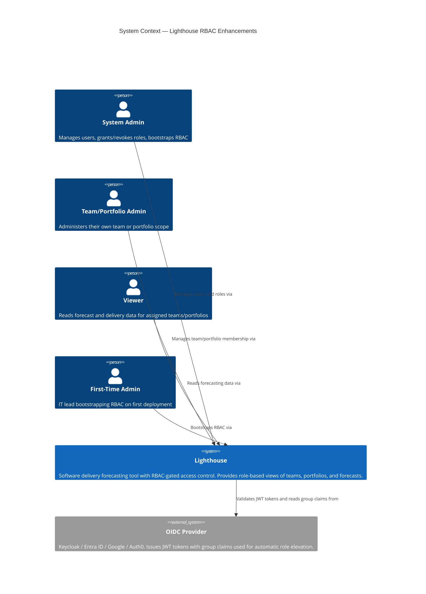
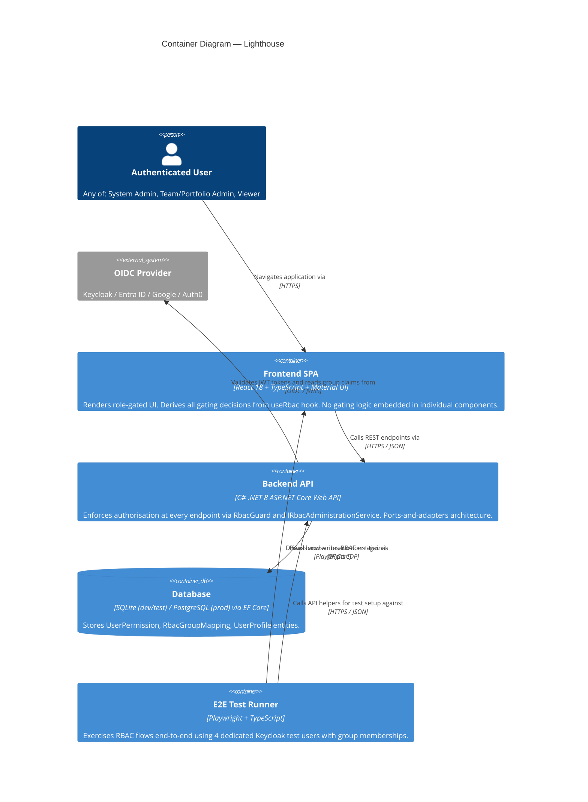
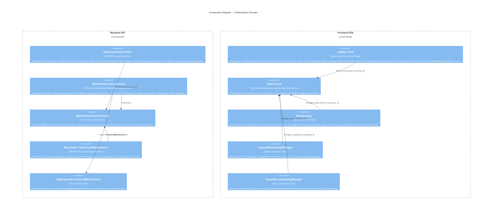

# C4 Architecture Diagrams — rbac-enhancements

Feature: rbac-enhancements
Wave: DESIGN
Date: 2026-05-10
Architect: Morgan (Solution Architect)

---

## C4 Level 1 — System Context

---

## C4 Level 2 — Container

---

## C4 Level 3 — Component: Authorization Domain

