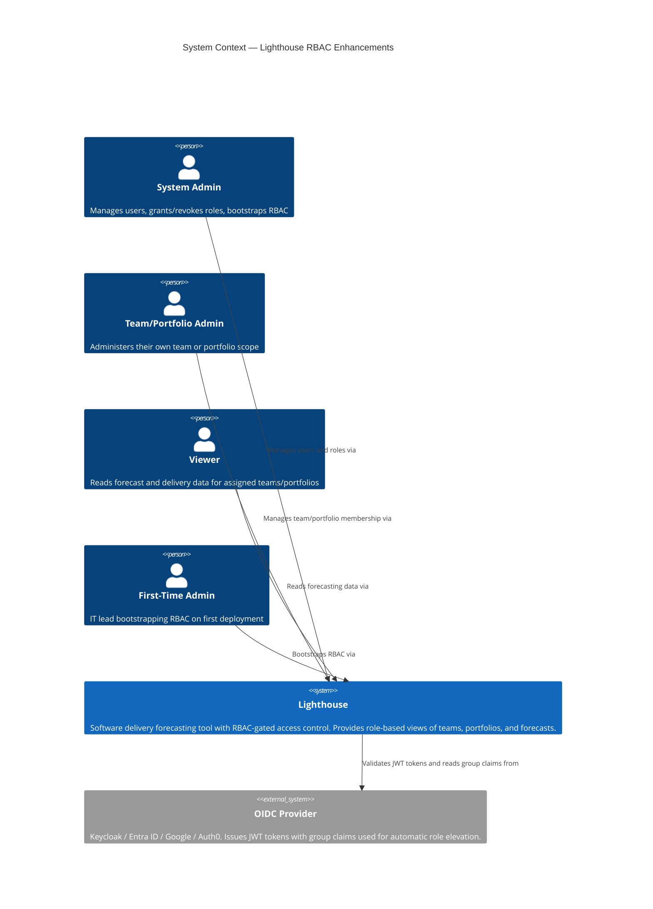
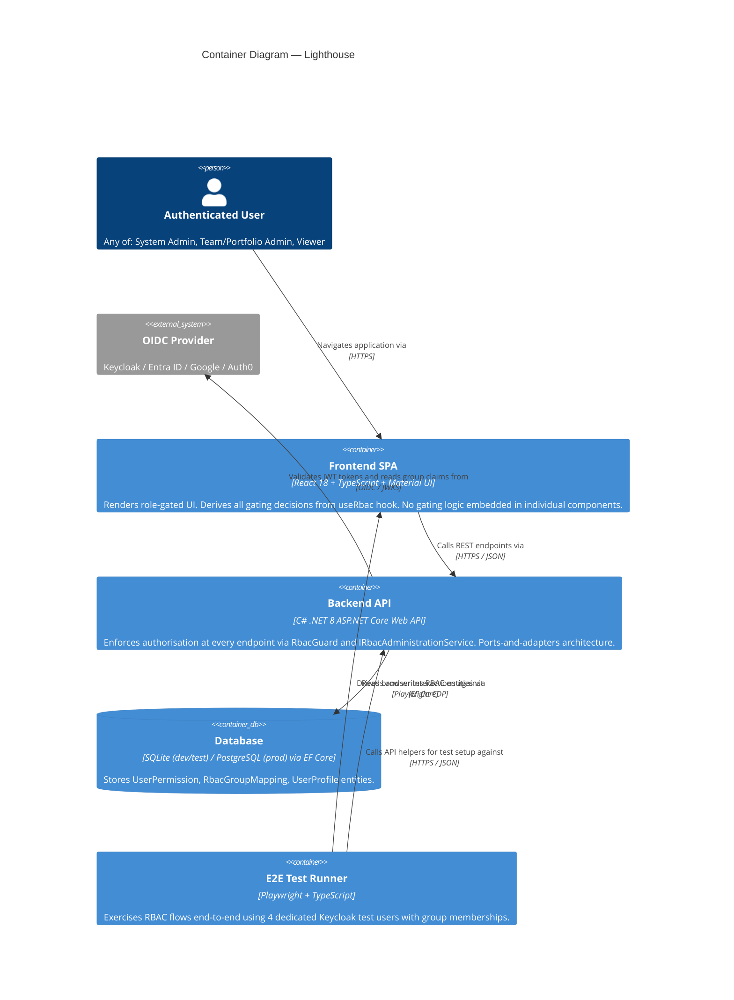
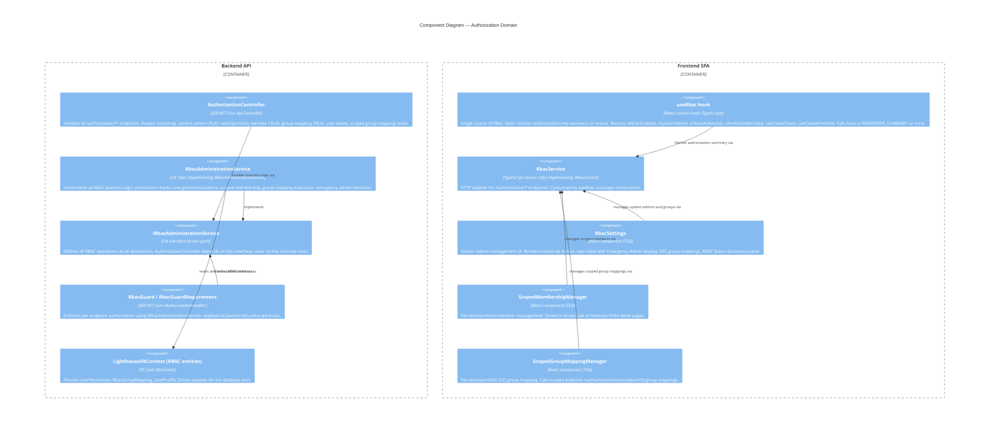
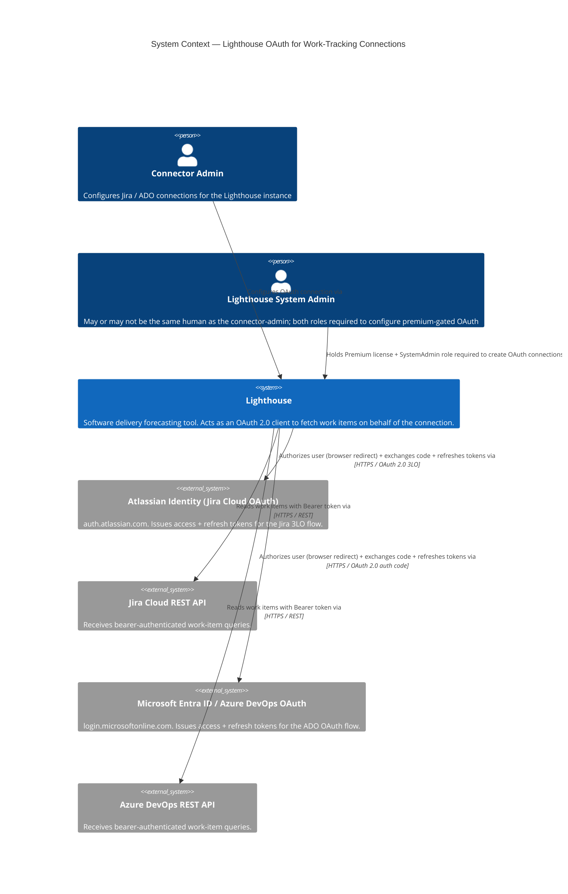
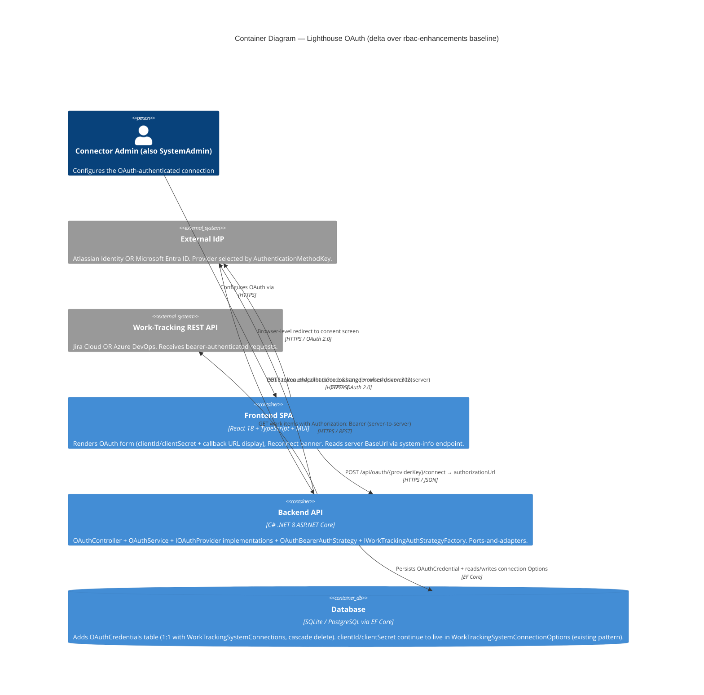
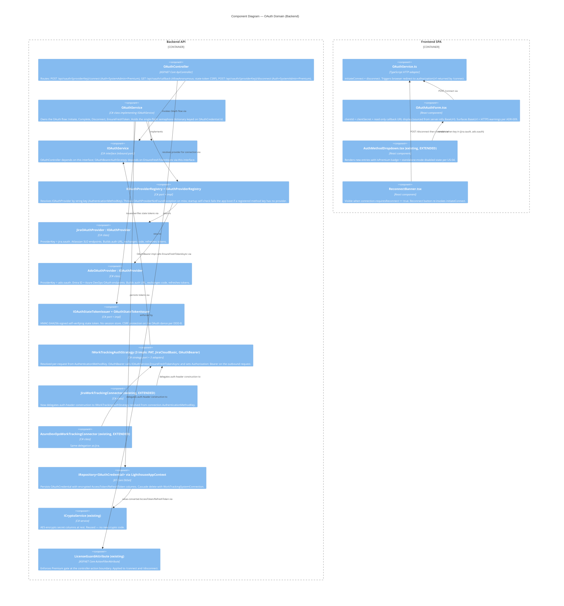
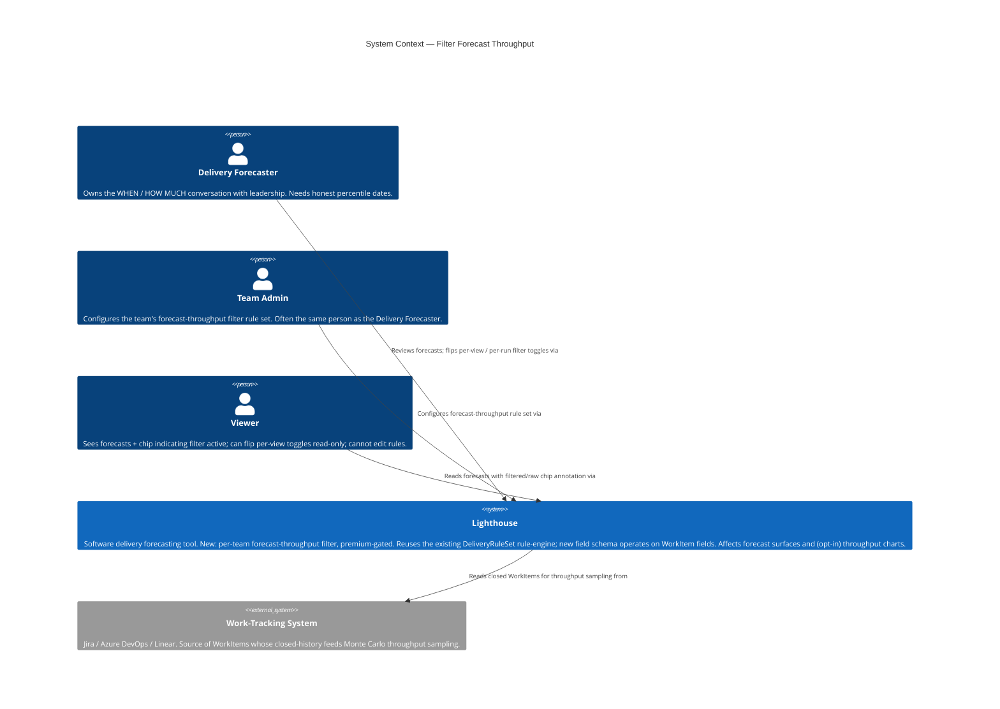
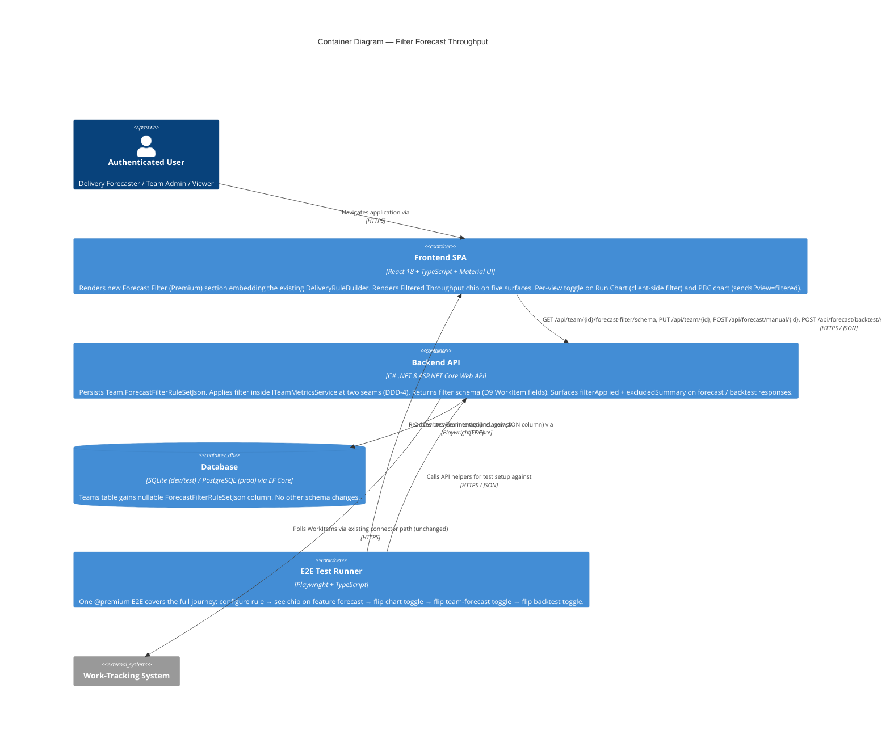
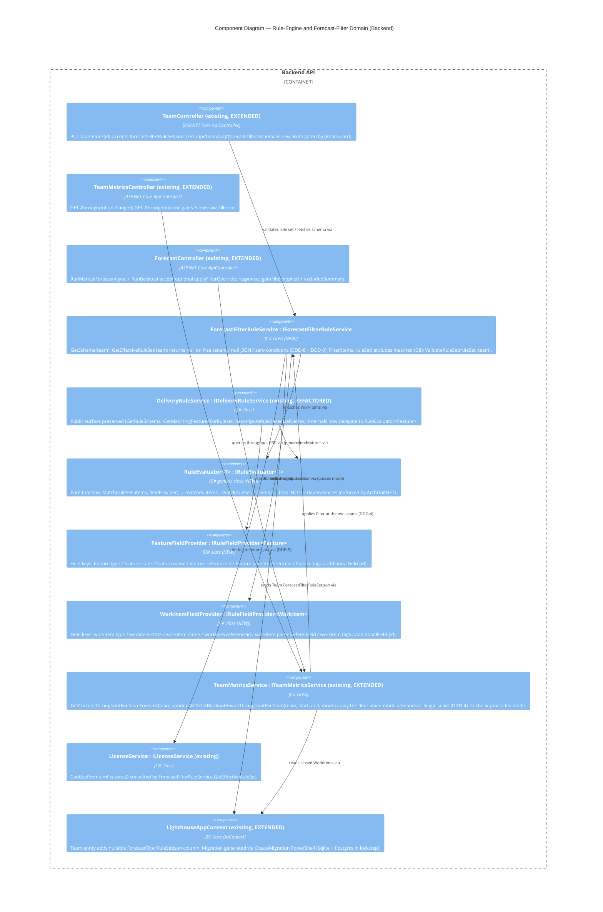

# C4 Architecture Diagrams — rbac-enhancements

Feature: rbac-enhancements
Wave: DESIGN
Date: 2026-05-10
Architect: Morgan (Solution Architect)

---

## C4 Level 1 — System Context



---

## C4 Level 2 — Container



---

## C4 Level 3 — Component: Authorization Domain



---

# C4 Architecture Diagrams — work-tracking-oauth-authentication

Feature: work-tracking-oauth-authentication
Wave: DESIGN
Date: 2026-05-14
Architect: Morgan (Solution Architect)

---

## C4 Level 1 — System Context (delta)

Existing System Context (RBAC) still applies. This feature adds **outbound** OAuth client relationships to external IdPs and extends the user persona set with the existing `connector-admin`.



---

## C4 Level 2 — Container (delta)

The existing Backend API / Frontend SPA / Database containers are unchanged in shape. This feature adds outbound HTTPS calls from the Backend API to two new external IdP / API systems, and adds a new persistence concern (one new table) to the existing DB.



---

## C4 Level 3 — Component: OAuth Domain



---

## OAuth flow sequence (Mermaid)

```mermaid
sequenceDiagram
    autonumber
    actor Admin as Connector Admin (browser)
    participant FE as Frontend SPA
    participant API as Backend API (OAuthController + OAuthService)
    participant IdP as External IdP (Atlassian / Entra ID)
    participant DB as DB (OAuthCredentials)
    participant Connector as JiraWorkTrackingConnector / ADO connector
    participant WTS as Work-Tracking REST API

    Note over Admin,IdP: One-time setup (out of band)
    Admin->>IdP: Register OAuth app, copy clientId/clientSecret

    Note over Admin,DB: Initial connection
    Admin->>FE: Open connector form, paste clientId/clientSecret, click Connect
    FE->>API: POST /api/oauth/jira.oauth/connect { connectionId }
    API->>API: Issue HMAC state token (connectionId, providerKey, nonce, exp)
    API->>FE: 200 { authorizationUrl }
    FE->>IdP: 302 → authorizationUrl (with redirect_uri = BaseUrl/api/oauth/callback)
    Admin->>IdP: Consent
    IdP->>API: GET /api/oauth/callback?code&state (browser-driven)
    API->>API: Verify state HMAC (CSRF; no session store)
    API->>IdP: POST token endpoint (server-to-server) { code, clientId, clientSecret }
    IdP->>API: { accessToken, refreshToken, expiresIn }
    API->>DB: Persist OAuthCredential (Status=Valid, tokens encrypted)
    API->>FE: 302 → /settings/connections/{id}?oauth=success

    Note over Connector,WTS: Subsequent outbound sync
    Connector->>API: EnsureFreshTokenAsync(connectionId)
    alt expiresAt - now > 5 min
        API->>Connector: return cached accessToken
    else expiry imminent
        API->>API: Acquire semaphore on OAuthCredential.Id (timeout 30s)
        API->>DB: Re-read credential (double-check)
        alt now-fresh
            API->>Connector: return cached accessToken
        else still expired
            API->>IdP: POST token refresh { refreshToken, clientId, clientSecret }
            alt refresh succeeds
                IdP->>API: new tokens
                API->>DB: Update OAuthCredential atomically
                API->>Connector: return new accessToken
            else refresh fails
                API->>DB: Status = RefreshFailed
                API-->>Connector: throw OAuthRefreshFailedException
            end
        end
    end
    Connector->>WTS: GET work items (Authorization: Bearer {accessToken})
    WTS->>Connector: work items
```

---

# C4 Architecture Diagrams — filter-forecast-throughput

Feature: filter-forecast-throughput (Epic 4896)
Wave: DESIGN
Date: 2026-05-20
Architect: Morgan (Solution Architect)

---

## C4 Level 1 — System Context (delta)

The Lighthouse system context (RBAC baseline) is unchanged. This feature adds **no** new external actors and **no** new external systems. It introduces a new internal persona — `Delivery Forecaster` — and tightens the conversation between the existing Team Admin and the existing Premium License gate.



---

## C4 Level 2 — Container (delta)

No new containers. The existing Frontend SPA, Backend API, Database, and E2E Test Runner all gain additive responsibilities — they exchange one new DTO shape (`forecastFilterRuleSetJson` on the team-settings round trip) and one new endpoint path (`/forecast-filter/schema`). The Backend API's persistence container gains one nullable JSON column on the `Teams` table.



---

## C4 Level 3 — Component: Rule-Engine and Forecast-Filter Domain

The rule-engine generalisation (ADR-012) is the architecturally significant subsystem of this feature. This diagram makes the new ports / adapters and the delegation paths explicit, and shows the single-seam filter application inside `TeamMetricsService` (DDD-4).



The diagram makes three architectural commitments visible:

1. **Single shared evaluator** (`RuleEvaluator<T>`) — the same algorithmic code path handles both Feature and WorkItem rule evaluation; bug fixes / operator additions land in one place (ADR-012).
2. **Single filter seam** (`TeamMetricsService` — and nothing else — calls `IForecastFilterRuleService.Filter`); enforced by ArchUnitNET (DDD-4).
3. **Single license gate for this feature** (`ForecastFilterRuleService.GetEffectiveRuleSet`); enforced by ArchUnitNET (DDD-9).

