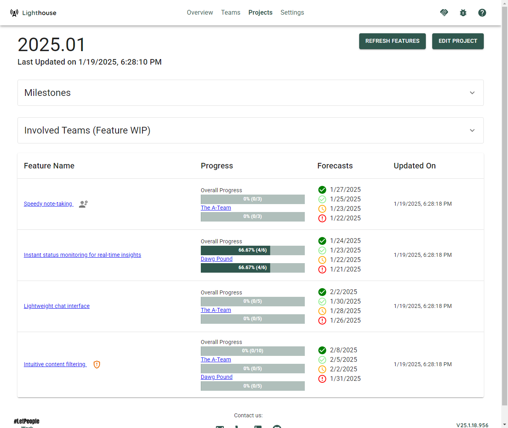
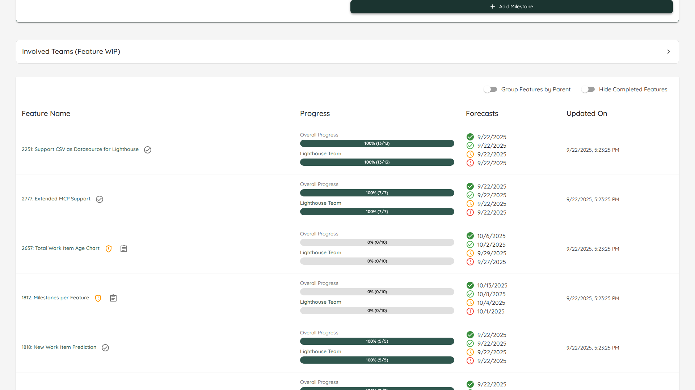
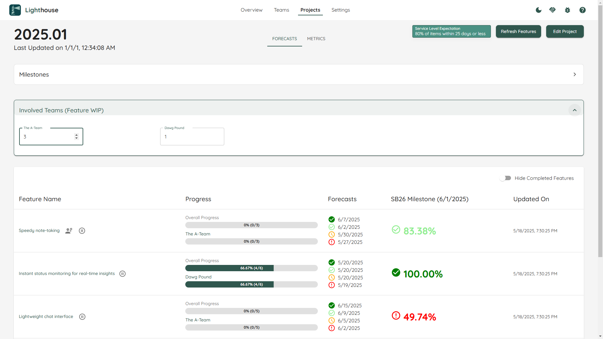

The Project Details page shows project-specific information including Features, Milestones and Metrics.

- TOC
{:toc}

# Overview
On top you can see the project name, progress and the involved teams.

## Milestones
You can configure milestones for your project. They will show up in the timeline and help you to get an idea when specific groups of features are expected to be done.

## Feature WIP per Team
You can see the Feature WIP settings per team and adjust them if needed.

Similar to the Team Details, the Project contains metrics. The visuals are mostly the same as for the teams, the difference is that they are applied at feature level on the Project. Check the [Metrics Page](../metrics/metrics.html) for more details.
