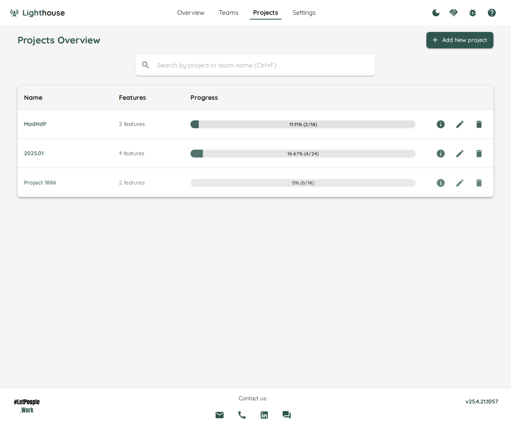
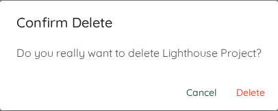

Projects are an essential building block for using Lighthouse. You can use Projects to keep track of when a set of Features that one or more teams are working on will be done. You can do the following things from this page:

- TOC
{:toc}

# Gain an Overview
The overview, as the name suggests, shows you a rough overview over all the projects. You can see which projects are defined, how many Features are defined as part of this project, and how the project is progressing (in terms of work items closed).

# Create a new Project
If you want to create a new project, click on the *Add New* button on top. That will bring you to the [Project Creation Page](./edit.html).

# Navigate to the Projects Details
If you want to see more details for a specific project, either click on the ℹ️ icon on the right side of the project or the project name to navigate to the [Project Details](./detail.html).

# Modify an existing Project
If you want to modify the settings of an existing project, click on the 🖊️ icon on the right side of the project. This will bring you to the [Project Modification Page](./edit.html).

# Delete a Project
If you want to delete a project, you can click on the 🗑️ icon on the right side of the project. This will permantenly delete this project.

{: .important}
Deleting a project will remove it from Lighthouse with no functionality to undo this change. This will not remove any of the involved teams in this project though.

{: .note}
You can always add a project again using the same queries. Deleting a project has no effect at all on the data in your Work Tracking System.

# Constraints in the Free Version
If you are using the free version, you are restricted to one Project on a single Lighthouse instance.

{: .important}
If you have more than the allowed number, Lighthouse will prevent any updates to all projects until you are not above the maximum number.
