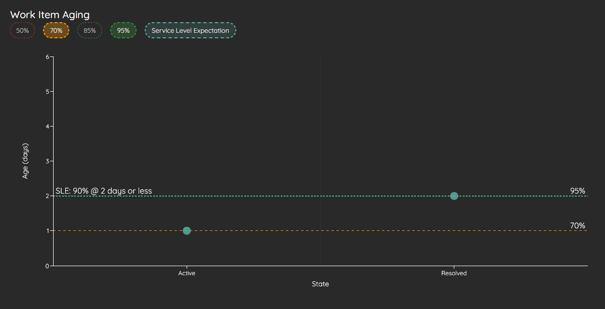
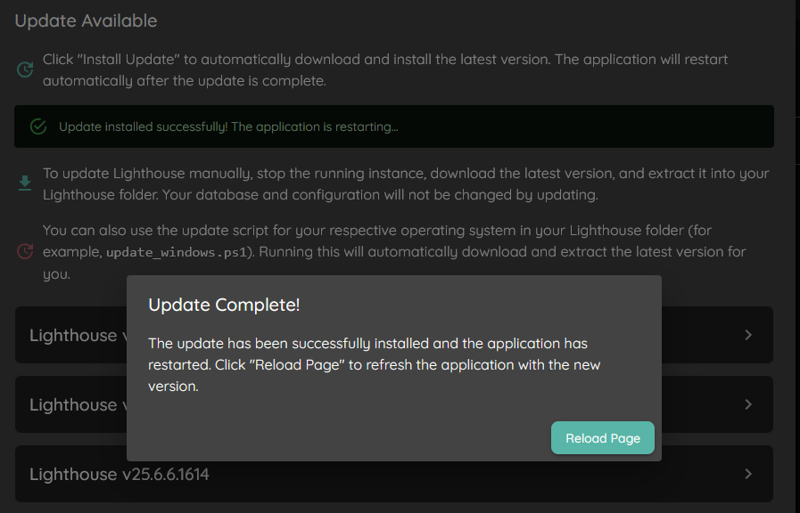
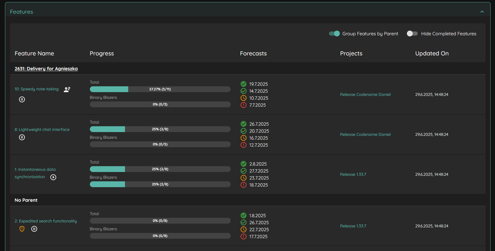
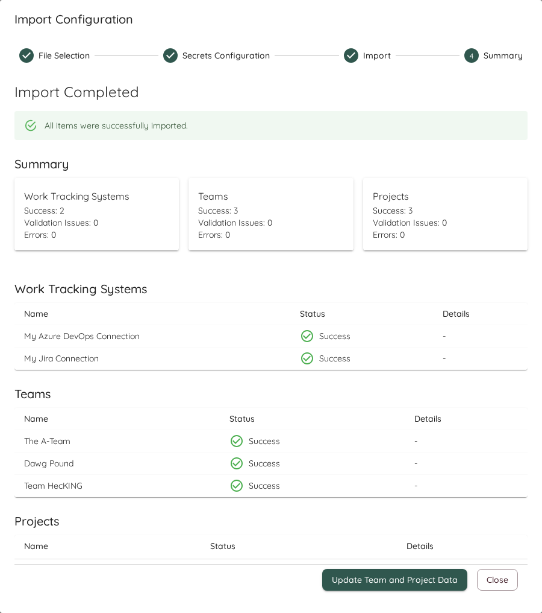

# Lighthouse vNext

## Rule-Based Delivery Feature Assignment [**Premium Only**]
You can now automatically assign Features to Deliveries using rule-based expressions instead of manual selection. Define rules using available fields (Type, State, Tags, any Additional Field) with operators like equals, contains, or not equals to create dynamic feature selection.

When creating or editing a Delivery, switch to the expression editor to define your rules. Multiple rules are combined with AND logic. The system validates your expression and shows matching features before saving. Deliveries using expressions automatically update when the Portfolio refreshes, adding new matching features and removing those that no longer match.

This feature is ideal for teams using FixVersions (Jira), Area Paths (Azure DevOps), or custom tags to organize their release planning.

## MCS Backtesting Improvements
The Forecast Backtesting visualization has been enhanced with improved clarity and usability:
- Actual completion date now shown as a clear vertical line instead of an additional bar
- Added the average forecast as a comparison value
- Improved layout and spacing for the Predictability Score display
- Fixed issue where backtesting time frames were incorrectly calculated

These changes make it easier to evaluate forecast accuracy and understand the relationship between predictions and actual outcomes.

## Changes to Premium Features
- **Terminology Configuration** is now a premium feature
- **New Work Item Prediction** (forecasting arrival of work) is now available in the Community Edition

## Feature Management Improvements
Managing features across teams and portfolios has been streamlined:
- Completed features are now hidden by default to reduce clutter
- Feature state is now visible in the feature list instead of just showing the State Category as an icon
- Removed the "Updated on" column to simplify the view
- Feature tabs are disabled on Teams that aren't part of any Portfolio

## Other Improvements
- Manual forecasts now allow you to specify either a target date OR remaining items, not requiring both
- System startup now displays `localhost` URLs instead of `[::]` for better clarity
- Fixed issue where Total Work Item Age widget didn't match the Work Item Age Run Chart
- Fixed compatibility issue loading configurations from older Lighthouse versions
- Resolved Jira custom field handling issue that could cause connection problems in case you had duplicate names of custom fields (thanks Jira...)

## Contributions ❤️
Special thanks to everyone who contributed feedback for this release:

- [Nick Brown](https://www.linkedin.com/in/nicolasjmbrown/)
- [Ben Richards](https://www.linkedin.com/in/iambenrichards/)
- [Mihajlo Vilajić](https://www.linkedin.com/in/mihajlo-v-6804ba162/)
- [Gabor Bittera](https://www.linkedin.com/in/gaborbittera/)

[**Full Changelog**](https://github.com/LetPeopleWork/Lighthouse/compare/v26.1.30.10...v26.2.7.xx)

# Lighthouse v26.1.30.10

## MCS Back-Testing
You can now validate Lighthouse's Monte Carlo Simulation forecasts against historical data using the new **Forecast Backtesting** feature. This helps build confidence in the forecasting system by comparing predicted outcomes with actual historical throughput.

Navigate to any Team's **Forecasts** tab to find the new *Forecast Backtesting* section. Select a historical time period and run a backtest to see:
- How many items the MCS predicted would be completed (at 50%, 70%, 85%, and 95% confidence levels)
- The actual number of items that were completed during that period

This feature empowers teams to assess the reliability of Lighthouse forecasts using their own historical data.

## Delivery Improvements
The *Feature Selection* for the Delivery creation now features two new improvements:
- A *Select All* button that will select all Features that are currently in view (this will respect any filter you've set in the grid - only the visible features will be selected)
- The state of a feature is now shown as a dedicated column

## Spotlighting Charts
You can now *spotlight* a chart in the Metrics section. By doing so, you'll get an expanded view of this chart. This is especially useful when teaching about flow metrics or when you want to highlight something specific.

## Other Improvements
- The various "reload" buttons have now more distinct icons so they are not easily mixed up
- If percentiles on the Feature Size, Cycle Time Scatterplot, or Work Item Aging chart are overlapping, by default only the *higher* percentile will be shown
- Updated various third party dependencies

## Contributions ❤️ 
Special Thanks to everyone who contributed their feedback to this release:
- [Mihajlo Vilajić](https://www.linkedin.com/in/mihajlo-v-6804ba162/)
- [Marat Kiniabulatov](https://www.linkedin.com/in/maratkinyabulatov/)
- [Lorenzo Santoro](https://www.linkedin.com/in/lorenzo-santoro-57172626/)
- [Gabor Bittera](https://www.linkedin.com/in/gaborbittera/)

[**Full Changelog**](https://github.com/LetPeopleWork/Lighthouse/compare/v26.1.17.4...v26.1.30.10)

# Lighthouse v26.1.17.4

## Jira and Azure DevOps Board Wizards
If you use a Jira or Azure DevOps connection, Teams and Portfolios can now fetch some settings through a Board Wizard from their existing Boards.
The Wizard will display all available boards. If you chose a board, it will read:
- The JQL/WIQL for this board
- The work item types on this board
- The states with a state mapping (by category)

This one-time sync should simplify the initial creation of your Teams and Portfolios!

## Delivery Improvements
After releasing the Delivery functionality, we got various feedback and improved the following things:
- The *Delivery Header* is now showing the 70, 85, and 95% likely dates
- All Deliveries are now ordered by their Delivery date, starting with the earliest first
- You can now see and select *Done* Features when you create or edit a delivery. The done Features are displayed in ~strikethrough~
- The Delivery Creation Dialog can now be resized
- The label of the "Delivery Date" Textbox was not readable and was improved
- Instead of the "internal" ID of the Features, we display now the ID from your System (e.g. the Key if you are on Jira)
- If deliverie dates were in the past, the likelihood was not correct. Now it's either 0% (if there is pending work) or 100% (if everything is done). There can't be anything in between for deliveries that are in the past

## Other Improvements
- Updated various third party dependencies
- Attempted to improve Date handling, so that we do not get "one-off" issues depedning on the timezone you are in

## Contributions ❤️ 
Special Thanks to everyone who contributed their feedback to this release:
- [Anoop A Parapurath](https://www.linkedin.com/in/anoop-a-parapurath-137a3b4/)
- [Agnieszka Reginek](https://www.linkedin.com/in/agnieszka-reginek/)
- [Mihajlo Vilajić](https://www.linkedin.com/in/mihajlo-v-6804ba162/)
- [Chandan Bala](https://www.linkedin.com/in/chandan-bala-7251b9242/)
- [Chris Graves](https://www.linkedin.com/in/chris-graves-23455ab8/)
- [Ann K Brea](https://www.linkedin.com/in/annkbrea/)
- [Nick Brown](https://www.linkedin.com/in/nicolasjmbrown/)
- [Paul Brown](https://www.linkedin.com/in/paulisthrivving/)
- [Myriam Greger](https://www.linkedin.com/in/myriam-greger/)

[**Full Changelog**](https://github.com/LetPeopleWork/Lighthouse/compare/v26.01.09.006...v26.1.17.4)

# Lighthouse v26.1.9.6

This release was focused on improving the additional field functionality of the Work Tracking Systems. Following changes related to this were implemented:
- Username is not shown in "Other Options" anymore if you choose Jira Data Center Auth Option
- You don't need to specify the token (or other secrets) if you modify only the additional fields
- For Jira Data Center, it will now automatically use the 'Epic Link' (for Teams) and 'Parent Link' (for Portfolios) fields to try to set the parent. If this convention is followed, no specific additional field and override is needed
- For Azure DevOps, you can now also specify the Field Name, not only the reference. Example: Previously you had to specify 'Microsoft.VSTS.Scheduling.Size', while now you could also refer to it simply via 'Size'. Both options work, reference or name. No migration is needed if you have already something specified.

## Other Improvements
- Updated various third party dependencies
- Added a system info on startup that shows you the details of your Lighthouse instance:

 
[**Full Changelog**](https://github.com/LetPeopleWork/Lighthouse/compare/v26.1.5.1620...v26.01.09.006)

# Lighthouse v26.1.5.1620
This is a hotfix release that attempts to fix an issue that caused the validation to fail for Azure DevOps Work Tracking Connections if they had *any* additional field defined.
The check for the available fields is now changed, which should make it work for all environments, independent of user rights.

Special thanks to [Lorenzo Santoro](https://www.linkedin.com/in/lorenzo-santoro-57172626/) for reporting this and supporting with debugging!

⚠️ **Important: Please read through the release notes of version 26.4.1.1559 to understand the impact of upgrading to this version!**

# Lighthouse v26.1.4.1559

**⚠️⚠️ This release contains breaking changes - please read carefully ⚠️⚠️**

This release was focused on a lot of infrastructure work in and around the Work Tracking System Connection. While the impact on the functionality right now is not as big, it will make future enhancements easier. This will include onboarding of new systems, supporting different authentication options, and dealing with the special configurations of the systems within their organization.

The Work Tracking System Connection configuration now looks like this:

# Authentication Options
If a system supports different means for Authentication (right now only Jira), you can select the option. This will also adjust the options you need to specify. This is a big UX improvement over the previous approach where all options where visible, and depending on whether you filled in some field or not it would chose the authentication option.

**Note:** Existing systems will be working as before and all this data will be migrated

# Additional Fields Configuration
For each supported Work Tracking System Connection, you can now add *Additional Fields* that should be fetched for all Work Items and Features. This allows to have data specific to your system and configuration in Lighthouse. Currently those additional fields are only used for *Parent Overrides*, *Size Estimates*, and *Feature Owner* definition (see below). However, this will be expanded in future.

Currently supported are Azure DevOps and Jira. They both come with a set of predefined additional fields:
- Azure DevOps: Area Path, Iteration Path, Size
- Jira: Fix Version, Component, Sprint

You can modify and remove those defaults as you please.

**Note:** This only applies to newly created system. Migrated Work Tracking System Connection will not have any additional fields by default.

Upon Validation of the system, It will check the Additional Fields. If a field cannot be found (e.g. due to a typo), the validation will fail. Please see respective documentation for [Jira](https://docs.lighthouse.letpeople.work/concepts/worktrackingsystems/jira.html) or [Azure DevOps](https://docs.lighthouse.letpeople.work/concepts/worktrackingsystems/azuredevops.html#additional-fields).

# Options
At the bottom of the Work Tracking System Connections, you can find now options. So far only Jira and Azure DevOps offer additional options. It's the *Request Timeout* that was previously specified in the Work Tracking System Settings page. This is now specific per connection. If you had an existing value set, it will automatically be migrated.

## Known Unpleasantries
As of now, you will have to provide the Authentication Token even if you don't change the authentication in the Work Tracking System Connection Dialog. We plan on improve this in future.

## Parent Override Field ⚠️
While previously you could define any field in the *Parent Override Field* with free text, you now can chose from the additional fields. Instead of free text, you will get a selection

⚠️ **If you had an override specified before, this change will not be migrated. Please manually add your additional field and set it up through the Team and Portfolio settings.** ⚠️

## Size Estimate Field ⚠️
While previously you could define any field in the *Size Estimate* in the Portfolio Settings, you now can chose from the additional fields. Instead of free text, you will get a selection.

⚠️ **If you had a Size Estimate specified before, this change will not be migrated. Please manually add your additional field and set it up through the Portfolio settings** ⚠️

## Feature Owner Field ⚠️
While previously you could define any field in the *Featuer Owner* in the Portfolio Settings, you now can chose from the additional fields. Instead of free text, you will get a selection.

⚠️ **If you had a Featuer Owner specified before, this change will not be migrated. Please manually add your additional field and set it up through the Portfolio settings** ⚠️

# Additional Work Tracking System Connection Related Changes
- The UI will now display the field for the Query only after selecting a work tracking system and show a tailored description (for example "JQL Query")
- You can now specify CSV content directly, without the need of having a file uploaded
- The File Upload button for CSV looks slightly different as it's done in a more generic way

# Removal of Unparented Work Item Queries ⚠️
⚠️ The "Unparented Work Item Query" that could be specified per Portfolio has been removed. All "Unparented Features" are also removed. This due to the fact that the functionality was hard to maintain and rarely used. Furthermore, it doesn't fit in the new design with Deliveries anymore. In future, there may be a replacement of this functionality, but for now, it is removed without a successor.

If you were heavily relying on this, please reach out to us for feedback.

[**Full Changelog**](https://github.com/LetPeopleWork/Lighthouse/compare/v25.12.28.1246...v26.1.4.1559)

# Lighthouse v25.12.28.1246

## New macOS App Bundle & Deployment Changes
Lighthouse for macOS is now delivered in a proper **app bundle structure**, aligning with standard macOS application conventions.

You can now download Lighthouse for macOS as either a **zip** or a **dmg file** (recommended for easiest installation). Both formats are fully **signed and notarized by Apple**, ensuring maximum security and trust for all users.

⚠️ **Important:** Updates are now handled differently on macOS. All users must manually update to this version. Future updates will require the new app bundle structure - automatic updates from older versions will not work. Please download and install the latest version from our website to continue receiving updates and security fixes.

## Rework Settings for Portfolios and Teams
In order to change settings for Teams and Portfolios, you don't need to change the page anymore. Instead, you'll see the settings as dedicated tab. This should make it easier to change the settings and see the impact.

Furthermore, the notion of *Quick Settings* was introduced. For selected settings, you now see a *Quick Settings Toolbar* across all the tabs of a team and portfolio. On click, you can directly change these settings.

The following *Quick Settings* are available:
- Throughput Forecasting Configuration: Select which Throughput Period should be used for the forecasting of this team (Team only)
- Service Level Expectation Configuration
- System WIP Configuration
- Feature WIP: For a team, just change that individual teams Feature WIP. For Portfolios, change the Feature WIP of all involved teams.

Changing the Throughput Forecasting Configuration or the Feature WIP will trigger an automatic re-forecast for the affected team.

## Other Improvements
- Added a "Cut Off" for Teams and Portfolios that will define where to cut off "done" items. This should help to reduce the load on the server as we will not fetch items that were done 5 years ago. This is configurable in the settings, and will default to 180 days (teams) and 365 days (portfolio).
- The "Update All" button in the Overview page was removed, and instead it's displayed in the header. Additionally, it will now be disabled if updates are running, and visualize how many update tasks are still ongoing.
- Updated various third party dependencies

## Contributions ❤️ 
Special Thanks to everyone who contributed their feedback to this release:
- [Lorenzo Santoro](https://www.linkedin.com/in/lorenzo-santoro-57172626/)
- [Agnieszka Reginek](https://www.linkedin.com/in/agnieszka-reginek/)
- [Mihajlo Vilajić](https://www.linkedin.com/in/mihajlo-v-6804ba162/)
 
[**Full Changelog**](https://github.com/LetPeopleWork/Lighthouse/compare/v25.12.19.1534...v25.12.28.1246)

# Lighthouse v25.12.19.1534

## Deliveries

Deliveries are named milestone dates for a portfolio that group a set of Features intended to be released together. They help you communicate target dates, track which features belong to a delivery, and see delivery-level progress alongside feature forecasts.

⚠️ **Milestones have been removed and replaced with Deliveries.** Deliveries are the new way to group features for release milestones.

Deliveries appear in their own view for each Portfolio, including target date and the list of included features.

The delivery row shows the delivery name and date, an expand control to reveal included features and their statuses, and action buttons to edit or delete the delivery. Expanding a delivery displays each feature and its forecasted completion so you can assess delivery risk and progress at a glance.

Use deliveries to communicate release milestones and to group related features — this makes it easier to discuss release risk and progress with stakeholders.

Deliveries are also shown in the overview page for each Portfolio.

**Note:** If you are using the community edition, you can create one delivery. With a premium license, you get unlimited deliveries.

## Digital Code Signing
The versions for Windows and macOS are now digitally signed. This means you can trust that the executables are coming from LetPeopleWork GmbH. On Windows, this means that you won't see the "Unknown Publisher" warning anymore, but can verify that the executable is trustworthy.

On macOS, you may still get a warning (after the download), but you could check through the commandline that it's signed and notarized through Apple. In a next release, this will improve also on macOS.

## Bug Fixes and other Improvements
- Update of third party software to latest versions
- Work Distribution Chart details displayed Cycle Time for all Items. This lead to always showing 0 for in Progress work. For those item, now the Item Age is displayed.
- If you had an expired license, the update to a newer license was causing an error. This is fixed now.
- Reworked the tab structure in the *Teams* view, splitting *Forecasts* and *Features* into dedicated tabs.

## Contributions ❤️ 
Special Thanks to everyone who contributed their feedback to this release:
- [Lorenzo Santoro](https://www.linkedin.com/in/lorenzo-santoro-57172626/)
- [Agnieszka Reginek](https://www.linkedin.com/in/agnieszka-reginek/)
- [Hendra Gunawan](https://www.linkedin.com/in/hendragunawan823/) 
- [Chris Graves](https://www.linkedin.com/in/chris-graves-23455ab8/)

[**Full Changelog**](https://github.com/LetPeopleWork/Lighthouse/compare/v25.12.7.1118...v25.12.19.1534)

# Lighthouse v25.12.7.1118

## Rename Project to Portfolio
As a preparation for future changes, we started renaming what used to be called *Project* to **Portfolio**.

The driver behind this change is that a Project has a dedicated start and end date. While you can use Lighthouse for this, it would mean, you will lose all the historic data (your metrics) for a new project.

We are aware that names have specific meanings in every context, so we also made sure you can override the name for *Portfolio* through the System Settings (so you can call it *Initiative*, *Project*, or whatever you like and makes sense in your context).

⚠️ While this sounds like a simple change, we started cleaning up our code and also urls. While urls that point to */projects* will still work, eventually they will be turned off. If you find other things that don't work as before, please let us know. We did our best to verify everything, but can't rule out we missed something.

## Cloning of Teams and Portfolios
You can now *clone* existing Teams or **Portfolios** with a single click through the Overview. Just click on the clone icon, and you will get a copy of the settings that you can adjust to your liking.

⚠️ This functionality makes setting up *Default Teams* and *Default Projects* obsolete. In order to reduce our effort, we decided to **remove** this functionality with this release. If you want to quickly create new teams or portfolios based on a default, please use the clone functionality.

## Contributions ❤️ 
Special Thanks to everyone who contributed their feedback to this release:
- [Lorenzo Santoro](https://www.linkedin.com/in/lorenzo-santoro-57172626/)

[**Full Changelog**](https://github.com/LetPeopleWork/Lighthouse/compare/v25.11.23.1453...v25.12.7.1118)

# Lighthouse v25.11.23.1453

## Data Grid Enhancements
We've further improved the data grid component with additional convenience functions and column visibility controls. This includes:
- The possibility to show and hide columns
- The option to re-arrange the column order
- Improved the resizing of columns
- Storing those settings per user and table

This should improve the usability of the datagrids!

## Jira Integration Improvements
Lighthouse now supports using Jira's *Flagged* field to mark work items as blocked, providing better integration with Jira workflows for identifying and tracking impediments. If you are using the *Flag* feature, you can simply add the keyword *Flagged* as a *Blocking Label* to your configuration, and Lighthouse will automatically detect it.

## Categorization for Items in Scatterplots
The Work Item Aging, Cycle Time, and Feature Size chart are all now displaying the different types of items with a specific color. The Feature Size Chart is categorizing by *Status Category*, while the other two are differentiating by *Item Type*. The categories are visualized on top as a legend, and can be toggled on and off through clicking.

## Context for Work Distribution Chart
The Work Distribution chart now includes tabular data views for detailed insights into underlying items. This gives some more context to the pie chart that visualizes the distribution. Additionally, the colors are aligned with the colors used for seperating items in the scatterplots (see above).

## Continuous Improvements & Bug Fixes
- Fixed issue with Work Item Chart and Capitalization that could cause display inconsistencies.
- Resolved Docker startup failures due to missing .NET version compatibility.
- Update of various third party packages.

## Contributions ❤️ 
Special Thanks to everyone who contributed their feedback to this release:
- [Hendra Gunawan](https://www.linkedin.com/in/hendragunawan823/) 
- [Gabor Bittera](https://www.linkedin.com/in/gaborbittera/)
- [Chris Graves](https://www.linkedin.com/in/chris-graves-23455ab8/)
- [Lorenzo Santoro](https://www.linkedin.com/in/lorenzo-santoro-57172626/)

[**Full Changelog**](https://github.com/LetPeopleWork/Lighthouse/compare/v25.11.15.1404...v25.11.23.1453)

# Lighthouse v25.11.15.1404

## Work Distribution Chart
The Work Distribution chart provides a visual breakdown of how work items are distributed across their parent work items (such as Features, Epics, or Initiatives). This pie chart helps you understand where your team’s effort is focused.

Hovering over the chart will show you which item had how many child items. Clicking on it will bring up a dialog with additional information.

## Additional License Options
We've extended the options in the license dialog for our premium users. You can now do the following things.

### Clear a License
If you want to free up the license slot you can clear the license. Alternatively, if you have an expired license and don't want to see the warning, you can also clear the information.

### Renew your License
Starting with the last month of your license validity, you can *Renew* your license. Clicking on the renew button will bring you directly to our homepage and prefill the dialog to order a new license, valid from the date your current one expires.

### Email Support
Through the ✉️ emoji, you can send us an email with your favorite mail client. Moreover, we'll prefill some information that will help us to better support you!

You can find all details in the [documentation](https://docs.lighthouse.letpeople.work/licensing/licensing.html).

## New Data Grid & Export
We've replaced many custom tables we had in Lighthouse with a common component that we can reuse across the application. This will simplify the maintenance while bringing you a unified design, as well as some more options. You can now sort & filter based on the various columns!

For premium users, the data grid also offers the possibility to export the data in the table in one click:
- You can copy it to your clipboard, so you can paste it easily in chats or emails
- You can export it as a csv file, if you want to do some custom analysis on it

**Note:** While we did our best to make sure everything works as it did before, we may have missed a few things. If you experience side effects, or things simply not working anymore related to the new tables, please reach out!

## Continuous Improvements & Bug Fixes
- Removed "Load all Scenarios" from Demo Data as the demo data was fine tuned for individual scenarios and this leads to messy data
- Adjusted Work Item Age over Time Chart to take different time zones into account
- You can now directly link to the metrics of a project or team. The link will also include the selected time frame. This allows easy sharing with a colleague if you look at a specific time frame.
- Update of various third party packages.

## Contributions ❤️ 
Special Thanks to everyone who contributed their feedback to this release:
- [Agnieszka Reginek](https://www.linkedin.com/in/agnieszka-reginek/)
- [Hendra Gunawan](https://www.linkedin.com/in/hendragunawan823/)
- [Mihajlo Vilajić](https://www.linkedin.com/in/mihajlo-v-6804ba162/)
- [Gonzalo Mendez](https://www.linkedin.com/in/gonzalo-mendez-nz/)

[**Full Changelog**](https://github.com/LetPeopleWork/Lighthouse/compare/v25.11.6.540...v25.11.15.1404)

# Lighthouse v25.11.6.540

## Total Work Item Age
This release introduced two new metric widgets, that visualize the *Total Work Item Age*. The *Total Work Item Age* shows the cumulative age of all items currently in progress:

.

The first widget shows the current total age (independent to any filters). The second widget will show the total age over time. Check the [documentation](https://docs.lighthouse.letpeople.work/metrics/widgets.html#total-work-item-age) for more details.

## Feature Size Chart Enhancements
The Feature Size chart so far only was showing closed items. It is extended now so you can visualize In Progress or To Do Features.
This is useful if you want to:
- Check if you in progress items are growing too large and you need to act on it (for example in a Portfolio weekly)
- Analyse the upcoming work

By default, the To Do and In Progress items are not shown, but can individually be toggled on. The percentile lines visualized are calculated only from the closed items.

## Continuous Improvements & Bug Fixes
- Loading the first demo scenario failed (nothing was loaded) - this is fixed now.
- On Jira Data Center, the updating of Teams or projects was failing due to a recent change that tried to use an API endpoint that does not exist on Jira Data Center. Loading now works again.
- Update of various third party packages.

## Contributions ❤️ 
Special Thanks to everyone who contributed their feedback to this release:
- [Chris Graves](https://www.linkedin.com/in/chris-graves-23455ab8/)

[**Full Changelog**](https://github.com/LetPeopleWork/Lighthouse/compare/v25.11.2...v25.11.6.540)
 
# Lighthouse v25.11.2
Fixed issue of missing x-axis labels in various charts. The labels (dates, states) are now shown again!

## Contributions ❤️ 
Special Thanks to everyone who contributed their feedback to this release:
- [Gonzalo Mendez](https://www.linkedin.com/in/gonzalo-mendez-nz/)

[**Full Changelog**](https://github.com/LetPeopleWork/Lighthouse/compare/v25.11.1.1014...v25.11.2)

# Lighthouse v25.11.1.1014

## Forecasts in Dashboard
The Overview Dashboard will now show the number of remaining work items for a project, as well as a forecast for the completion of the project:

This should help to get a better overview over ongoing and planned projects, without having to dig into the details.

## Continuous Improvements & Bug Fixes
Apart from that, this release has smaller improvements and bug fixes, along with update of third party packages:
- Added a new Demo Scenario to forecast a project that has nothing broken down yet [Premium]
- Fixed an issue that Cycle Time and Work Item Age were not properly calculated for Jira Issues that had a lot of updates.
- Adjust the default http port on macOS (from 5000 to 5002), as AirPlay is often using port 5000, leading to errors on startup.

## Contributions ❤️ 
Special Thanks to everyone who contributed their feedback to this release:
- [Agnieszka Reginek](https://www.linkedin.com/in/agnieszka-reginek/)
- [Gonzalo Mendez](https://www.linkedin.com/in/gonzalo-mendez-nz/)
- [Chris Graves](https://www.linkedin.com/in/chris-graves-23455ab8/)
- [Maria Chec](https://www.linkedin.com/in/mariachec/)

[**Full Changelog**](https://github.com/LetPeopleWork/Lighthouse/compare/v25.9.22.1707...v25.11.1.1014)

# Lighthouse v25.9.22.1707

This release fixes the issue that when you grouped Features by their parent, the parent items were not showing up in their respective order.
The new behaviour is as follows:
- If you don't group by parent, you will see a "flat list" respecting your feature order.
- If you group by parent, you will see the parent items respecting their backlog order. Within a parent, the features are shown in their respective order.

## Contributions ❤️ 
Special Thanks to everyone who contributed their feedback to this release:
- [Agnieszka Reginek](https://www.linkedin.com/in/agnieszka-reginek/)

[**Full Changelog**](https://github.com/LetPeopleWork/Lighthouse/compare/v25.9.20.1022...v25.9.22.1707)

# Lighthouse v25.9.20.1022

## Extended MCP Features [**Premium Only**]

[The Model Context Protocol (MCP)](https://modelcontextprotocol.io/docs/getting-started/intro) integration has been completely **reworked and modernized** to provide a comprehensive AI-powered experience for Lighthouse.
Use it in the LLM of your choice or create agentic workflows using the data coming directly from Lighthouse.

### Tools
[Tools](https://modelcontextprotocol.io/specification/2025-06-18/server/tools) allow you to execute real time operations based on the data that is in Lighthouse. This includes:
- **Team Management**: Get team details, analyze flow metrics, and run forecasts
- **Project Analytics**: Access project information, features, and completion forecasts  
- **Feature Tracking**: Detailed feature information and delivery forecasts
- **Flow Analysis**: Comprehensive cycle time, throughput, and WIP analysis

### Prompts
Through carefully designed [Prompts](https://modelcontextprotocol.io/specification/2025-06-18/server/prompts), you get AI-powered insights based on our expertise with customized prompt templates that make use of the above tools:
- **Team Flow Analysis**: Professional metrics interpretation
- **Aging Work Analysis**: Identify flow problems and predictability issues
- **Forecasting Guidance**: Data-driven planning with Monte Carlo Forecasting
- **Retrospective Facilitation**: Generate structured, data-driven improvement sessions

### Resources
Our MCP server offers the documentation as [resource](https://modelcontextprotocol.io/specification/2025-06-18/server/resources), so that you have all the relevant context for your operations.

### Real-World Use Cases
Transform your daily workflows with natural language interactions:

- *"How many items can my team complete by month-end?"*
- *"When will Project Alpha be finished?"*  
- *"Analyze our flow metrics and suggest improvements"*
- *"Generate insights for our upcoming retrospective"*
- *"What features are we working on and when will they be done?"*

### Supported AI Clients

Compatible with popular AI assistants like **Claude Desktop**, **VS Code Copilot**, and any other client that supports MCP.

### Getting Started

1. Enable MCP Server in Lighthouse Settings → Optional Features
2. Configure your AI client using our [comprehensive documentation](https://docs.lighthouse.letpeople.work/aiintegration.html)
3. Start asking questions in natural language!

*This feature represents a significant evolution in how teams can interact with their project data, bringing expert-level analysis capabilities directly to your AI assistant.*

## Continuous Improvements & Bug Fixes
- Before loading Demo Data, a confirmation popup will show to make sure you understand that you lose all existing data.
- When trying to add an SLE percentile, the values were not accepted. This is fixed now.
- When switching the Work Tracking System connection, the work item query was cleared. This made the default teams/project queries unusable. This is behaviour is adjusted now. 
- Update of various third-party libraries

[**Full Changelog**](https://github.com/LetPeopleWork/Lighthouse/compare/v25.9.13.1420...v25.9.20.1022)
 
# Lighthouse v25.9.13.1420

## New Work Item Prediction [**Premium Only**]
Based on the created items, Lighthouse can now also forecast the arrival of work in your process:

This may be useful if you want to know how many new bugs you could expect within the next 4 weeks.
You can find the functionality in the *Team Forecast View*.

More details available in the [documentation](https://docs.lighthouse.letpeople.work/teams/detail.html#new-work-item-predictions).

## Demo Data
In order to support onboarding as well as various teaching scenarios, Lighthouse now includes various predefined scenarios with teams and projects.

There are 3 basic scenarios available in all editions, and additional scenarios available for everyone with a *Premium License*.

You can find more details on the scenarios in the [documentation](https://docs.lighthouse.letpeople.work/settings/demodata.html).

## Continuous Improvements & Bug Fixes
- Dates used for forecasting were off by one after re-opening team edit pages. While it should not have had an effect on the forecast, the UI will now display the proper dates
- The overview dashboard now features a button to *Update All* teams and projects [**Premium Only**]
- Update of various third-party libraries

## Contributions ❤️ 
Special Thanks to everyone who contributed their feedback to this release:
- [Agnieszka Reginek](https://www.linkedin.com/in/agnieszka-reginek/)
- [Chris Graves](https://www.linkedin.com/in/chris-graves-23455ab8/)
- [Gabor Bittera](https://www.linkedin.com/in/gaborbittera/)
- [Lorenzo Santoro](https://www.linkedin.com/in/lorenzo-santoro-57172626/)

[**Full Changelog**](https://github.com/LetPeopleWork/Lighthouse/compare/v25.9.5.1326...v25.9.13.1420)

# Lighthouse v25.9.5.1326

## Rework of Overview
We reworked the overview page as follows:
- You can now see the Projects and Teams directly from the start page
- Everything you could do on the dedicated *Teams Overview* and *Project Overview* pages (edit, delete, see details, add new) is possible from the main page now
- Respective Team and Project Overviews were removed

The summary cards for each project that were available before were removed. This was the consequence of an internal change to improve the responsiveness of Lighthouse (especially when having bigger projects). Please let us know if you were using the old Dashboard, as we're considering eventually bringing it back.

## General Improvements
- Cycle Time and Work Item Age Scatterplot start now with 1 on the y-axis (instead of 0 as before)
- The icons displayed for the Feature states (*To Do*, *Doing*, *Done*) were adjusted to better indicate the respective state
- When viewing details of Features, you will see now the respective *Feature Owner* if it was configured
- Update of various third-party libraries

## Bug Fixes
- Feature Goal is not shown anymore in WIP Limited widget if you set it to *automatically adjust*
- Blocked Items in Work Item Age Chart had a green bubble in the tooltip instead of a red one

## Contributions ❤️ 
Special Thanks to everyone who contributed their feedback to this release:
- [Agnieszka Reginek](https://www.linkedin.com/in/agnieszka-reginek/)
- [Mihajlo Vilajić](https://www.linkedin.com/in/mihajlo-v-6804ba162/)

[**Full Changelog**](https://github.com/LetPeopleWork/Lighthouse/compare/v25.8.31.1120...v25.9.5.1326)

# Lighthouse v25.8.31.1120
## CSV Support
With this version it's possible to use CSV files as a base for Teams and Projects. While the recommendation is to use direct connections to your systems, this allows you to:
- Try out Lighthouse with static data
- Work around constraints in your environment if you don't have permissions for direct connections
- Use Lighthouse even though your work tracking system is not yet supported

You can find how to connect data with CSV as well as some examples on how to export CSV from common systems in the [documentation](https://docs.lighthouse.letpeople.work/concepts/worktrackingsystems/csv.html).

.

In the free version, you can add one team that is based on CSV data. In the premium version, you get unlimited teams and projects through CSV.

# Update Jira Endpoints
Atlassian is retiring some of their API endpoints that were used by Lighthouse. This release changes to the still supported APIs and ensures Lighthouse keeps working as expected.

**Important:** If you are using Jira, please make sure to upgrade to this version to ensure that Lighthouse will still be able to connect to your Jira Instances in future!

## Other Improvements
- Update of various third-party libraries

## Contributions ❤️ 
Special Thanks to everyone who contributed their feedback to this release:
- [Gonzalo Mendez](https://www.linkedin.com/in/gonzalo-mendez-nz/)

[**Full Changelog**](https://github.com/LetPeopleWork/Lighthouse/compare/v25.8.18.910...v25.8.31.1120)

# Lighthouse v25.8.18.910

## Customizable Dashboard
The Metrics Dashboard now allows you to customize it to your needs:
- Show/Hide Widgets
- Resize
- Rearrange

See the documentation for more information.

## Performance Improvements
Various adjustements/fine tunigs for increasing performance. A significant increase in speed should be observable if you are running the containerized version. The standard install should also profit from the improvements.

## Other Improvements
- Date Range selection for Metrics has been adjusted to fit the new style and is now in the "Dashboard Header"
- Update of various third party libraries

[**Full Changelog**](https://github.com/LetPeopleWork/Lighthouse/compare/v25.8.13.702...v25.8.18.910)

# Lighthouse v25.8.13.702

## Licensing
With this version, Lighthouse has integrated [Licensing](https://docs.lighthouse.letpeople.work/licensing/licensing.html). Licenses are needed for various premium features, and in order to:
- Have more than 3 teams
- Have more than 1 project
- Be able to export and import a configuration.

You can find more details on the licensing on our [Website](https://letpeople.work/lighthouse#lighthouse-premium).

## Feature Size Chart
On project level, you can now see how big your features are in size (in terms of child items) and see this on a scatterplot together with the Cycle Time of those respective features:

**This feature will be available in the community edition of Lighthouse**

### ⚠️ Breaking Changes ⚠️
As part of this change, we also simplified the configuration of the default feature size. For this, we **removed** the possibility to add your own query to filter for Features that should be used in the calculation. Instead, you can now specify a time (in days) that should looked back to fetch historical data that then is used for the percentile calculation.

## Improvements
- New Releases are now highlighted with a dialog as soon as it is detected (don't worry, you can disable that behaviour if it's annoying)
- Update of various third party libraries

## Contributions ❤️ 
Special Thanks to everyone who contributed their feedback to this release:
- [Mihajlo Vilajić](https://www.linkedin.com/in/mihajlo-v-6804ba162/)

A huge thank you goes out also to the [Let People Work Slack Community](https://join.slack.com/t/let-people-work/shared_invite/zt-38df4z4sy-iqJEo6S8kmIgIfsgsV0J1A) that was actively providing feedback on our licensing plans. Your input was immensly helpful and supported us finding a path forward that should lead to a win-win situation, so that both we as a company and the broader community can profit!
 
[**Full Changelog**](https://github.com/LetPeopleWork/Lighthouse/compare/v25.7.27.1729...v25.8.13.702)

# Lighthouse v25.7.27.1729

## Terminology Configuration
Lighthouse now allows you to customize terminology throughout the application to match your organization's language and workflow:

- **Configurable Terms**: Customize how Lighthouse displays common terminology including:
  - Work Item/Work Items (can be customized to Stories, Tasks, Issues, etc.)
  - Feature/Features (can be changed to Epic, Initiative, etc.)
  - Cycle Time, Throughput, Work in Progress (WIP)
  - Work Item Age, Service Level Expectation (SLE)
  - Teams, Work Tracking Systems, Queries, Tags, and Blocked items
- **System Settings Integration**: Access terminology configuration through *Settings* → *System Settings* → *Terminology*
- **Dynamic Updates**: Changes are applied immediately across the entire application interface
- **Default Values**: Each term shows its default value and description to help with configuration
- **Consistent Language**: Eliminates confusion by harmonizing terminology that was previously inconsistent (e.g., "Items" vs "Work Items")

This feature addresses feedback about terminology inconsistencies and enables organizations to use familiar language that aligns with their existing processes and tools.

## Bug Fixes
- Fixed issue that caused Work Items not to appear correctly if the state was in a different case than on the work tracking system

## Contributions ❤️ 
Special Thanks to everyone who contributed their feedback to this release:
- [Mihajlo Vilajić](https://www.linkedin.com/in/mihajlo-v-6804ba162/)
- [Chris Graves](https://www.linkedin.com/in/chris-graves-23455ab8/)
- [Gabor Bittera](https://www.linkedin.com/in/gaborbittera/)
 
[**Full Changelog**](https://github.com/LetPeopleWork/Lighthouse/compare/v25.7.26.915...v25.7.27.1729)

# Lighthouse v25.7.26.915

## Improved Visual Indicators
We've added visual icons to make configuration status more apparent:
- Teams and Projects now display dedicated icons for System WIP Limits, Forecast Configuration, and Service Level Expectations
- Icons only appear when the respective configuration is enabled
- Hover over icons to see detailed tooltip information about the current configuration
- This replaces the previous dashed border visual indicators with cleaner, more intuitive icons

## Donation Support
We've added support for community donations through Ko-fi:
- A donation button is now available in the application footer
- Donation option is also included in the bug reporting and feedback dialog
- This provides an easy way for users who want to support the product's development

## Improved Feedback Collection
We've enhanced how users can provide feedback and report issues. Instead of redirecting to GitHub Issues, Lighthouse now displays a dedicated feedback dialog that:
- Provides clear guidance on how to submit feature requests and bug reports
- Directs users to our preferred Slack community for real-time feedback and discussions
- Offers email support as an alternative contact method
- Includes information about our review processes and custom development options

This change makes it easier for users to get help and ensures feedback reaches us through the most effective channels.

## Bug Fixes
- Fixed handling of work items with 0 days Age/Cycle Time to prevent calculation errors
- Log Level change was not reflecting in UI when using docker

## Other Improvements
- Updated various third party dependencies

## Contributions ❤️ 
Special Thanks to everyone who contributed their feedback to this release:
- [Gabor Bittera](https://www.linkedin.com/in/gaborbittera/)
 
[**Full Changelog**](https://github.com/LetPeopleWork/Lighthouse/compare/v25.7.14.809...v25.7.26.915)

# Lighthouse v25.7.14.809

## Predictability Score
The Throughput Run Chart now includes a *Predictability Score*:

The score tries to give you an indication of the predictability of the selected Throughput range when it's used for a forecast. It's showing how *close together* the 95% chance and 50% chance values are. The higher the score, the better the predictability.

When you click on the predictability chip in the Throughput Run Chart, you'll see more details:

Please check the [docs](https://docs.lighthouse.letpeople.work/metrics/metrics.html#predictability-score) for more information on how this works and how you can potentially use it!

 
[**Full Changelog**](https://github.com/LetPeopleWork/Lighthouse/compare/v25.7.7.1834...v25.7.14.809)

# Lighthouse v25.7.7.1834

## Visualize Blocked Items

Lighthouse now can visualize items that are blocked. Following changes were made:
- New widget that shows the total of blocked items
- The *Work Item Aging Chart* displays blocked items with a red dot
- Blocked items have a dedicated icon in the Work Item Dialog when you

In order to configure blocked items, both Teams and Projects offer a new option under *Flow Metrics Configuration*.
You can specify tags (*labels* in Jira) or states that mark an item as blocked.

## Bug Fixes
- In certain cases, the validation for Projects was never completing. This should be fixed now.
- Some of the metrics in a project were cached but never invalidated, thus the value never updated. This is fixed.

## Contributions ❤️ 
Special Thanks to everyone who contributed their feedback to this release:
- [Lars Henning](https://www.linkedin.com/in/larshenning42/)
 
[**Full Changelog**](https://github.com/LetPeopleWork/Lighthouse/compare/v25.7.6...v25.7.7.1834)

# Lighthouse v25.7.6

## Fixed disappearing states in Work Item Aging Chart
If you have many states, some of them would not show up in the x-axis of the Work Item Aging Chart.
This is adjusted now, and all states will always show, independent of available space.

**Note:** This may mean that some of the text is overlapping. This is known and accepted for the time being.

## Contributions ❤️ 
Special Thanks to everyone who contributed their feedback to this release:
- [Gonzalo Mendez](https://www.linkedin.com/in/gonzalo-mendez-nz/)
 
[**Full Changelog**](https://github.com/LetPeopleWork/Lighthouse/compare/v25.7.5.1158...v25.7.6)

# Lighthouse v25.7.5.1158

## Work Item Aging Chart
We added a new chart to visualize *In Progress* work. In the *Work Item Aging Chart*, you'll see all ongoing work, where:
- The x-axis is showing the state the item is in currently
- The y-axis indicates how long it's in progress already (*Work Item Age*)

The states on the x-axis are in the order you defined them in the settings for the respective Team/Project. If you want to adjust the order, you can do so by drag and dropping states left/right when editing.

The chart behaves the same way as the Cycle Time Scatterplot:
- If multiple items are at the same location, the dot appears bigger
- You can click on each dot to get more details
- You can selectively show the percentiles from the Cycle Time and the SLE (if configured)

## Automatic Download and Installation of New Versions
In order to simplify updating Lighthouse, you can now simply click a button which will automatically:
- Download the latest version for your operating system (Windows, Linux, MacOS)
  - **Note:** This is not supported if you're running docker
- Extracting the files in the directory you run Lighthouse from
- Restarting Lighthouse

This should help keeping up with the frequent releases, and make it easier also for less techy users to update (no need to fiddle with scripts or GitHub).

**Note:** *If you experience issues, please reach out to us via [Slack](https://join.slack.com/t/let-people-work/shared_invite/zt-38df4z4sy-iqJEo6S8kmIgIfsgsV0J1A), as it was not easy to test this in all potential configurations.*

## Other Improvements
- States can now be re-ordered when editing Teams and Projects through drag and drop. The order of the states is affecting the [Work Item Aging Chart](#work-item-aging-chart).
- When editing a team/project, it will **not** trigger an automatic update anymore after saving.
- Updated various third party dependencies

## Contributions ❤️ 
Special Thanks to everyone who contributed their feedback to this release:
- [Chris Graves](https://www.linkedin.com/in/chris-graves-23455ab8/)
 
[**Full Changelog**](https://github.com/LetPeopleWork/Lighthouse/compare/v25.6.29.1252...v25.7.5.1158)

# Lighthouse v25.6.29.1252

## Allow to Group Features by Parent
So far, the Features listed for Teams/Projects was always a flat list. However, many teams have another layer "on top" of their feature that they track in Lighthouse.
With this release, it's now possible to visualize the Parent in this list. If the "Group Features by Parent" toggle is switched on, the flat list changes to a hierarchy, where items are sorted under their parent.

The parent is using the default parent field from your system. If you can't use this, you can now also define a *Parent Override Field* for your project (similar) to the teams.
*Note:* The field must contain an ID to an item in your Work Tracking System so Lighthouse can fetch more information for it.

*As this is the first version of this feature - we're eager to get your feedback. Join our [Slack](https://join.slack.com/t/let-people-work/shared_invite/zt-38df4z4sy-iqJEo6S8kmIgIfsgsV0J1A) and let us know how we can improve it!*

## Other Improvements
- The Footer now contains a link to the LetPeopleWork Offering Obeya
- Improved the speed of the Project Validation on Jira
- Renamed "Custom Related Field" to "Parent Override Field"

## Bug Fixes
- Opening Work Items from Lighthouse sometimes added a double "/" which made the url invalid (observed on Jira Data Center) - this should be fixed now.
- The legend for show/hide the System WIP Limit was sometimes overlapping the points in the chart. Aligned Legend now with other charts.

## Contributions ❤️ 
Special Thanks to everyone who contributed their feedback to this release:
- [Nina Wagen](https://www.linkedin.com/in/nina-wagen-04a9756a/)
- [Gonzalo Mendez](https://www.linkedin.com/in/gonzalo-mendez-nz/)
- [Agnieszka Reginek](https://www.linkedin.com/in/agnieszka-reginek/)
 
[**Full Changelog**](https://github.com/LetPeopleWork/Lighthouse/compare/v25.6.16.1514...v25.6.29.1252)

# Lighthouse v25.6.16.1514

This release focused on many smaller improvements and bug fixes, many of which came in through our Slack community.

## Context For Charts and Widgets
Visualization of our data is very useful, but at times it's also great to see the underlying data in a simple, table-like format. In this release, we added more context for many widgets and charts, so that you can see the individual items that make up the values Lighthouse is visualizing:

- Started vs. Closed Widget: Click on the widget to see which items were started and/or closed in the specific time range
- Throughput Run Chart: Click on a specific day to see which item(s) were closed
- WIP Run Chart: Click on a specific day to see which items were open

Clicking will always open a dialog with more detailed information. We also aligned this behaviour on the Cycle Time Scatterplot. Instead of opening the link directly, a click on a bubble will now open the dialog as well. This makes it a lot easier if you have a single bubble that represents more than one item.

The tooltip for all the charts will mention how many items are affected. If it's just a single one, you'll also see more details directly in the tooltip, like the name, and the reference/ID/key for all the teams and organizations that are operating like Rain Man and talk in numbers instead of meaningful words.

## System WIP Limits
For teams and projects, you can now define a *System WIP Limit*. If done, the value shows up:
- In the header of the team/project details, similar to the Service Level Expectation
- As a *Goal* in the Work In Progress widget
- As an optional, horizontal line, in the WIP Run Chart

## Contrast
We got feedback from several people that not everything is easy to read. We tried to improve this with this release, increasing the contrast and trying to implement the [WCAG guidelines](https://developer.mozilla.org/en-US/docs/Web/Accessibility/Guides/Understanding_WCAG/Perceivable/Color_contrast) for contrast ratios. This has an effect mainly (but not only) on dark mode, and especially within the metrics section.

## Docker
The docker container uses internally now the default ports 80 (http) and 443 (https) instead of 5000/5001. Also the http port is now exposed, so if you want to bind directly to this one, you are free to do so.

### ⚠️ Breaking Changes ⚠️
Be aware that this may break your existing scripts/commands to startup the docker container. Please adjust the ports accordingly in case you are updating.

## Other Improvements
- In the header of the team, it's now showing which timespan is used for forecasting (*Forecast Configuration*)
- The default time range preselected when looking at their metrics is now based on the *Forecast Configuration* (unless they use a fixed date Throughput)
- You can now override the default *request timeout* to cope with slow endpoints and/or large queries that time out
- The System WIP, Feature WIP (for teams only), and Service Level Expectation configuration are now grouped under *Flow Metrics Configuration* in the Create/Edit page

## Bug Fixes
- If a tag for a project or team is empty, it will not be shown
- Tooltip for the Cycle Time Scatterplot should not expand endlessly in width now
- Update of various third-party libraries

## Contributions ❤️ 
Special Thanks to everyone who contributed their feedback to this release:
- [Gabor Bittera](https://www.linkedin.com/in/gaborbittera/)
- [Frank Barner](https://www.linkedin.com/in/frankbarner/)
- [Nina Wagen](https://www.linkedin.com/in/nina-wagen-04a9756a/)
- [Gonzalo Mendez](https://www.linkedin.com/in/gonzalo-mendez-nz/)

[**Full Changelog**](https://github.com/LetPeopleWork/Lighthouse/compare/v25.6.6.1614...v25.6.16.1514)

# Lighthouse v25.6.6.1614

## Export and Import of Configuration
The main focus of this release was the introduction of the functionality to export and import your Lighthouse Configuration.

In *Settings* --> *System Settings* you will see two new buttons:
- Export Configuration
- Import Configuration

Export will download a *.json* file that contains all the settings from your Work Tracking Systems, Teams, and Projects, **excluding** any secret information to connect to your Work Tracking System.

If you click on Import, you'll get an import dialog that will lead you through the process step by step.

You can find the full documentation for the features in the [docs](https://docs.lighthouse.letpeople.work/settings/settings.html#lighthouse-configuration).
 
## Bug Fixes
- Items that haved an Age/Cycle Time exactly at SLE are displayed red instead of orange
- Last Updated Date was wrong (or not updated anymore) for Projects

## Other Improvements
- Restructured the Settings Page, grouping various settings under the "System Settings" Tab
- Scatterplot is now showing bigger bubbles if multiple items were closed at the same day with the same age
- The CFD has no tooltip anymore (as it was not useful)
- Update of various third-party libraries

## Contributions ❤️ 
Special Thanks to everyone who contributed their feedback to this release:
- [Chris Graves](https://www.linkedin.com/in/chris-graves-23455ab8/)
- [Agnieszka Reginek](https://www.linkedin.com/in/agnieszka-reginek/)
- [Hendra Gunawan](https://www.linkedin.com/in/hendragunawan823/)

[**Full Changelog**](https://github.com/LetPeopleWork/Lighthouse/compare/v25.5.18.1752...v25.6.6.1614)