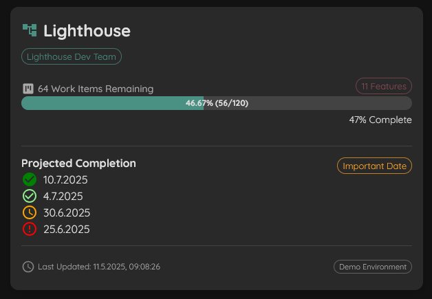

<!-- 
# Lighthouse vNext
{: .d-inline-block }
Preview
{: .label .label-blue }
-->

# Lighthouse v25.6.6.1614
{: .d-inline-block }
Latest
{: .label .label-green }

# Export and Import of Configuration
The main focus of this release was the introduction of the functionality to export and import your Lighthouse Configuration.

In *Settings* --> *System Settings* you will see two new buttons:
- Export Configuration
- Import Configuration

Export will download a *.json* file that contains all the settings from your Work Tracking Systems, Teams, and Projects, **excluding** any secret information to connect to your Work Tracking System.

If you click on Import, you'll get an import dialog that will lead you through the process step by step.

You can find the full documentation for the features in the [docs](https://docs.lighthouse.letpeople.work/features/settings/settings.html#lighthouse-configuration).
 
# Bug Fixes
- Items that haved an Age/Cycle Time exactly at SLE are displayed red instead of orange
- Last Updated Date was wrong (or not updated anymore) for Projects

# Other Improvements
- Restructured the Settings Page, grouping various settings under the "System Settings" Tab
- Scatterplot is now showing bigger bubbles if multiple items were closed at the same day with the same age
- The CFD has no tooltip anymore (as it was not useful)
- Update of various third-party libraries

## Contributions ❤️ 
Special Thanks to everyone who contributed their feedback to this release:
- [Chris Graves](https://www.linkedin.com/in/chris-graves-23455ab8/)
- [Agnieszka Reginek](https://www.linkedin.com/in/agnieszka-reginek/)
- [Hendra Gunawan](https://www.linkedin.com/in/hendragunawan823/)

[**Full Changelog**](https://github.com/LetPeopleWork/Lighthouse/compare/v25.5.18.1752...v25.6.6.1614)

# Lighthouse v25.5.18.1752

# Service Level Expectation
The main focus of this was the introduction of the Service Level Expectation (*SLE*). For both Teams and Projects you can now define an SLE which is made out of:
- A probability (like 80%)
- A date range (like 5 days)

Defining this is optional (but we advise you to do so). If you have an SLE, you will:
- See the current SLE in the header for the team or project to clearly communicate the forecast
- Visualize the SLE in the Cycle Time Scatterplot
- The Cycle Time Percentile Widget displays the SLE with a color indication depending on the performance of the team
- Clicking on the SLE icon on the Cycle Time Widget will *flip* the widget give you more information about the SLE
- Clicking anywhere on the Cycle Time Widget will bring up all closed items in the selected date range (similar to clicking on the In Progress Widget)
- Both the in progress and the closed item dialogs will color the age/cycle time according to how close to the SLE they were

# Bug Fixes
- Started vs. Finished Widget was displaying "You are keeping a steady WIP" even if it's not steady at all. This works better now

# Other Improvements
- In the Cycle Time Scatterplot, the individual percentiles can now be hidden by clicking the respective item in the legend
- Lighthouse has an icon now!
- Update of various third party libraries

[**Full Changelog**](https://github.com/LetPeopleWork/Lighthouse/compare/v25.5.11...v25.5.18.1752)

# Lighthouse v25.5.11

## Simplified Cumulative Flow Diagram (CFD)
Add a [simplified version of a CFD](https://docs.lighthouse.letpeople.work/features/metrics/metrics.html#simplified-cumulative-flow-diagram-cfd) that shows you how many items were in which state category (*Doing* or *Done*) over the selected time period.

If you enable the trend lines, the start and end points of both areas will be connected, allowing you to easily see how you manage WIP.

## Improvement of UX Teams and Projects
We worked on various small improvements to improve the UX of teams and projects.

### Introduction of Tags
Both Teams and Projects can now be "tagged". Tags allow you to add context specific information, for example what customer is interested in a project, or which business unit some teams belong to.

The search functionality is including the tags in the search, so you can easily find all teams and projects that have the same tags.

### Store Search Parameter in URL
The search parameter will now be stored in the url (on the overview, teams, and projects page). This allows you to "save" a search, as you can simply bookmark a page after you added your search parameter.

### Extend "Project Cards" in Overview Page
The cards in the overview were extended to include additional project information:
- The number of features
- The milestones
- The tags

If you click on the Features chip, you will see more details about the features in this project without having to move to the project detail page. A click on the milestone will show you more details about that specific milestones including probabilities of finishing features "on time".

### Other
- Teams and Projects are now sorted alphabetically in the Overview, Teams, and Projects page
- Work Item Types and States include "suggestions" where existing types/states are shown when editing Teams and Projects$
- Removed Milestone configuration from Project Edit page.

## Bug Fixes
- Dates and Times were not displayed in the proper timezone. This should be fixed now.
- Fixed an issue that caused the dates in the date selectors of the metrics pages to not use local date-time format.
- If you were using an estimation field and changed the value, it was not updated in Lighthouse. This is working properly now and updates with every Project refresh.

## Other Improvements
- Update of various third party libraries

[**Full Changelog**](https://github.com/LetPeopleWork/Lighthouse/compare/v25.4.29.811...v25.5.11)

## Contributions ❤️ 
Special Thanks to everyone that contributed with their feedback to this release:
- [Lorenzo Santoro](https://www.linkedin.com/in/lorenzo-santoro-57172626/)
- [Hendra Gunawan](https://www.linkedin.com/in/hendragunawan823/)
- [Gonzalo Mendez](https://www.linkedin.com/in/gonzalo-mendez-nz/)
- [Chris Graves](https://www.linkedin.com/in/chris-graves-23455ab8/)
- [Iwo Hryniewicz](https://www.linkedin.com/in/iwo-hryniewicz/)

# Lighthouse v25.4.29.811

## Properly read Rank Field from Jira
The override introduced in the [previous version](#lighthouse-v25425614) was removed again and instead replaced by fetching the field from Jira via the API.

## Linear Integration
{: .d-inline-block }
Preview
{: .label .label-yellow }

We've added support for [Linear](https://linear.app) in a preview version in Lighthouse. While the functionality is limited (see [docs](https://docs.lighthouse.letpeople.work/concepts/worktrackingsystems/linear.html)), it allows pilot users to try it out and give us feedback.

You can enable the Linear Integration via the *Optional Features*:

If you are using Linear and try it with Lighthouse, please reach out to us via Slack so we can learn how to make this more useful.

## Other Changes
- Update of various third party libraries

[**Full Changelog**](https://github.com/LetPeopleWork/Lighthouse/compare/v25.4.25.614...v25.4.29.811)

## Contributions ❤️ 
Special Thanks to [Oliver Oyston](https://www.linkedin.com/in/oliveroyston/) for his contribution!

# Lighthouse v25.4.25.614

## Allow to override rank field for Jira
{: .d-inline-block }
Deprecated
{: .label .label-red }

In some occasions, it may be needed to define a specific _rank_ field in Jira. This is now possible via the config file. See [documentation](https://docs.lighthouse.letpeople.work/Installation/configuration.html#rank-field-override) for details.

## Fixed Bugs
- The calculation of the _Started_ and _Closed_ dates was not always correct when items moved between states that belonged to the same category. This is fixed now for both Azure DevOps and Jira
- There would be an error if you had a status with an _&_ in the name (like "Dev&Test"). Lighthouse can now handle such cases.

## Improvements
- The "Hide Completed Features" toggle is not resetting every time, but the state is remembered
- The dialog that shows the in-progress items is now handling long item names better (with a line break instead of expanding the width)
- Updated various third-party libraries
- 
[**Full Changelog**](https://github.com/LetPeopleWork/Lighthouse/compare/v25.4.21.945...v25.4.25.614)

## Contributions ❤️ 
Special Thanks to [Hendra Gunawan](https://www.linkedin.com/in/hendragunawan823/) and [Gonzalo Mendez](https://www.linkedin.com/in/gonzalo-mendez-nz/) for their contributions!

# Lighthouse v25.4.21.945

## New UI
We've spent some time in overhauling the UI, making it look more modern. It's also more responsive now, meaning you can get a decent look at Lighthouse from your mobile device.

Furthermore, we've added a toggle to switch between _Light_ and _Dark_ Mode.

## Flow Metrics for Teams and Projects
We've added support for basic Flow Metrics, both for Teams and Projects. You can now switch on the respective Detail pages between _Forecasts_ and _Metrics_.

The following Metrics are shown:
- Work Items In Progress (based on state configuration in settings)
- Features being worked on based on Work Items In Progress (Team only)
- Cycle Time Percentiles
- Throughput Run Chart
- Cycle Time Scatterplot
- WIP Run Chart

### Important 🚨
To enable metrics visualization, a lot of changes had to be made on the backend side. While your configuration does not need to be changed, you have to refresh the team data once to start getting the metrics.

Due to the nature of the change, it can also be that refreshing teams will take longer now. Please let us know if it takes too long.

## Support for Integration with AI Clients
While everybody on LinkedIn seems to be an AI Expert, Prompt Engineer, or Vibe Coding Coach, we stay true to ourselves and practice rather than just talk. So we've made Lighthouse an [MCP Server](https://modelcontextprotocol.io/introduction) that integrates with your AI tool of choice. You can enable the feature via the settings:

Once done, you can set up your tool of choice (see https://modelcontextprotocol.io/clients for supported clients) to interact with Lighthouse. We've tested the integration with:
- VS Code Copilot
- Claude Desktop
- LibreChat through a self-hosted ollama instance

Currently, Lighthouse will expose tools to:
- Get all teams
- Get details on a team
- Run _When_ and _How Many_ forecasts for a team
- Get the Flow Metrics for a team

Keep an eye on the documentation for more information.

## Other Changes
- Update of various third party libraries

[**Full Changelog**](https://github.com/LetPeopleWork/Lighthouse/compare/v25.2.26.1848...v25.4.21.945)

# Lighthouse v25.2.26.1848

## Experimental Postgres Support 🧪
This release adds **experimental** support for Postgres as a Database provider next to the (default) SQLite database. Please check the [documentation](https://docs.lighthouse.letpeople.work/Installation/configuration.html#database) for details.

## ⚠️ Breaking Changes ⚠️
By adding an option to choose which database provider to select, the configuration options have changed. If you were overriding the default connection string, please make sure to adjust to the new variables as specified in the [documentation](https://docs.lighthouse.letpeople.work/Installation/configuration.html#database)

## Rework Relation Custom Field for Jira
When using a [Relation Custom Field](https://docs.lighthouse.letpeople.work/features/teams/edit.html#relation-custom-field) on Jira, it was not clear how to specify the fields and Lighthouse was not finding the relations. This has been refined now, please refer to the documentation to learn how to specify the custom fields for Jira.  

Furthermore, Lighthouse now properly calcualtes both the Unparented Items and Features in Progress when using the Relation Custom Field.

## Other Improvements and Bug Fixes
- Fixed issue that caused Lighthouse to go blank when you tried to use a fixed Throughput when creating a new team
- Don't allow to save projects if Historical Feature Work Item Query is missing and Percentile is used for Default Size
- Updated various 3rd Party Libraries

## Contributors
❤️ Thanks to everyone who contributed to this release ❤️
- [**Hendra Gunawan**](https://www.linkedin.com/in/hendragunawan823/)
- [**Valentin Badea**](https://www.linkedin.com/in/valentin-g-badea/)

If you want to contribute too, please join our [Slack Community](https://join.slack.com/t/let-people-work/shared_invite/zt-2y0zfim85-qhbgt8N0yw90G1P~JWXvlg)

## Full Changelog
[**Full Changelog**](https://github.com/LetPeopleWork/Lighthouse/compare/v25.2.8.1238...v25.2.23.1248)

# Lighthouse v25.2.8.1238
{: .d-inline-block }

## New Features
- Allow to have a _fixed_ Throughput specified by Start and End Date, instead of only a rolling window of days. This may be useful for special periods where the full team is off for an extended period of time.

## Improvements and Bug Fixes
- Improved Documentation for how to start Lighthouse on MacOS
- Fixed issue with the configuration of the default certificate which caused Lighthouse to fail on startup on MacOS
- Updated Third Party Components
- General improvements and streamline of documentation - updated ReadMe on Github and point to official documentation instead
 
## Removed Features
- Removed Lighthouse Chart Preview Feature and related code as it was not used and could cause issues with loading. If you want such a chart back, please raise it via our [Slack Community](https://join.slack.com/t/let-people-work/shared_invite/zt-2y0zfim85-qhbgt8N0yw90G1P~JWXvlg)

## Contributors
- [**Agnieszka Reginek**](https://www.linkedin.com/in/agnieszka-reginek/)
- [**Hendra Gunawan**](https://www.linkedin.com/in/hendragunawan823/)
- [**Laurence Grantham-Clarke**](https://www.linkedin.com/in/laurence-grantham-clarke-a03316131/)
- [**Andy Normington**](https://www.linkedin.com/in/andynormington/)

[Full Changelog](https://github.com/LetPeopleWork/Lighthouse/compare/v25.2.1...v25.2.8.1238)

# Lighthouse v25.2.1

## Improvements
- Take all Features of a team into account when re-forecasting a project
- Make sure Features are returned in correct order
- Updated Third-Party Dependencies

**Full Changelog**: [v25.1.26.1015...v25.2.1](https://github.com/LetPeopleWork/Lighthouse/compare/v25.1.26.1015...v25.2.1)

# Lighthouse v25.1.26.1015

## New Features
- Support for Jira DataCenter/Server editions added (previously only Jira Cloud was supported)
- Added online documentation available under https://docs.lighthouse.letpeople.work
- Removed built-in tutorials as superseded by the new documentation

## Improvements
- Updated third-party dependencies

Full Changelog: [v25.1.2.1555...v25.1.26.1015](https://github.com/LetPeopleWork/Lighthouse/compare/v25.1.2.1555...v25.1.26.1015)

# Lighthouse v25.1.2.1555

## New Features
- Run Lighthouse with default certificate in HTTPS mode.
- Provide option to override default certificate via configuration options.

For configuration options, see the [Configuration](../installation/configuration.html#certificate).

## Improvements
- Improved download speed for log files, especially noticeable with large files.

Full Changelog: [v25.1.1.1225...v25.1.2.1555](https://github.com/LetPeopleWork/Lighthouse/compare/v25.1.1.1225...v25.1.2.1555)

# Lighthouse v25.1.1.1225

## New Features
- Added setting to Teams to automatically adjust Team Feature WIP based on real Feature WIP.
- Server-side updates are now queued; if multiple users request an update of a team, it will only be done once if it's already queued.
- Teams/Projects now auto-update if they are updated by any user or through a periodic update; manual reload is no longer necessary.
- REST Endpoints can now be viewed via `/api/swagger`.
- Docker container is now built against multiple architectures: `linux/amd64`, `linux/arm64`, `linux/arm/v7`.

## Improvements
- Updated system log clarity for multi-user scenarios.

Full Changelog: [v25.1.0.1100...v25.1.1.1225](https://github.com/LetPeopleWork/Lighthouse/compare/v25.1.0.1100...v25.1.1.1225)